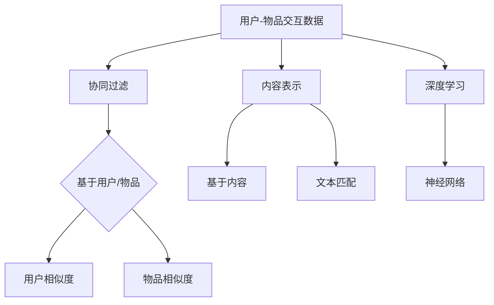

                 

### 文章标题

# 基于LLM的推荐系统用户兴趣探索

---

### 关键词

* 推荐系统
* 语言模型（LLM）
* 用户兴趣
* 协同过滤
* 基于内容推荐
* 深度学习

---

### 摘要

本文旨在探讨基于语言模型（LLM）的推荐系统在用户兴趣探索中的应用。首先，我们回顾了推荐系统的基本概念、架构和工作流程。接着，深入解析了协同过滤算法和基于内容的推荐算法，并引入了深度学习在推荐系统中的重要作用。随后，详细介绍了推荐系统中的数学模型和公式。通过实际项目实战和案例研究，我们展示了如何实现和优化推荐系统。最后，文章总结了最佳实践、注意事项以及未来的拓展方向，为读者提供了丰富的参考资料。

---

### 目录大纲

1. **核心概念与联系**
   1.1 推荐系统概述
   1.2 推荐系统的架构
   1.3 推荐系统的工作流程
   1.4 核心概念与联系图

2. **核心算法原理讲解**
   2.1 协同过滤算法
   2.2 基于内容的推荐算法
   2.3 深度学习在推荐系统中的应用
   2.4 数学模型与公式讲解

3. **项目实战**
   3.1 推荐系统的设计与实现
   3.2 案例研究
   3.3 项目小结

4. **最佳实践与注意事项**
   4.1 最佳实践
   4.2 注意事项
   4.3 拓展阅读

---

### 核心概念与联系

推荐系统是一种信息过滤技术，旨在根据用户的兴趣和偏好向他们推荐相关物品或信息。在互联网时代，推荐系统被广泛应用于电子商务、社交媒体、新闻推送、视频流媒体等多个领域，极大地提升了用户体验和满意度。

#### 推荐系统的基本概念

推荐系统主要包括以下核心概念：

1. **用户**：推荐系统的核心，他们的行为和偏好是推荐系统的重要输入。
2. **物品**：用户可能会感兴趣的实体对象，如商品、文章、音乐、视频等。
3. **交互**：用户与物品之间的行为，包括购买、评分、评论、观看等。
4. **推荐列表**：根据用户兴趣和偏好生成的推荐物品列表。

#### 推荐系统的架构

推荐系统的架构通常分为三个层次：

1. **数据层**：负责收集、存储和处理用户和物品数据。
2. **算法层**：包括协同过滤、基于内容的推荐、深度学习等方法，用于生成推荐列表。
3. **展示层**：将推荐结果呈现给用户，通常包括推荐列表、个性化广告、推荐卡片等。

#### 推荐系统的工作流程

推荐系统的工作流程大致可以分为以下几个步骤：

1. **数据收集**：从各种数据源（如网站日志、用户行为、社交媒体数据等）中收集用户和物品数据。
2. **数据预处理**：对原始数据进行清洗、去噪、编码等预处理操作，以生成高质量的特征数据。
3. **特征提取**：提取用户和物品的特征，用于训练推荐算法模型。
4. **模型训练**：使用训练数据训练推荐算法模型，包括协同过滤模型、基于内容的推荐模型、深度学习模型等。
5. **模型评估**：使用测试数据评估模型性能，包括准确率、召回率、覆盖率等指标。
6. **生成推荐列表**：根据用户兴趣和偏好，生成个性化的推荐列表。
7. **推荐展示**：将推荐列表呈现给用户，使用户能够发现并选择感兴趣的内容。

#### 核心概念与联系图

为了更直观地理解推荐系统的核心概念与联系，我们可以使用Mermaid流程图来表示：



这个流程图展示了用户-物品交互数据如何通过协同过滤、基于内容和深度学习等算法生成推荐列表。用户相似度和物品相似度是协同过滤算法的关键，而内容表示和文本匹配则是基于内容推荐算法的核心。深度学习和神经网络则为推荐系统带来了更加精准和智能的推荐能力。

在下一部分中，我们将深入探讨推荐系统的核心算法原理，包括协同过滤算法、基于内容的推荐算法以及深度学习在推荐系统中的应用。这将为我们理解推荐系统的本质和实现方法提供坚实的基础。

---

### 核心算法原理讲解

#### 协同过滤算法

协同过滤算法（Collaborative Filtering）是推荐系统中最常用的方法之一。它的核心思想是利用用户之间的相似性和历史行为数据来预测用户对未知物品的偏好。

##### 协同过滤的原理

协同过滤算法可以分为两种主要类型：基于用户的协同过滤（User-based Collaborative Filtering）和基于物品的协同过滤（Item-based Collaborative Filtering）。

1. **基于用户的协同过滤**：它首先计算用户之间的相似度，然后找到与目标用户相似的其他用户，这些用户的评分数据用于预测目标用户对未知物品的评分。

2. **基于物品的协同过滤**：它首先计算物品之间的相似度，然后找到与目标物品相似的其它物品，并根据这些物品的评分数据预测目标物品的评分。

##### 项间相似性计算

相似性计算是协同过滤算法的核心步骤，常用的相似度度量方法包括余弦相似度、皮尔逊相关系数、夹角余弦等。

- **余弦相似度**：它通过计算用户或物品向量在空间中的夹角余弦值来衡量相似度，公式如下：

$$
\cos(\theta) = \frac{\sum_{i}u_i \cdot v_i}{\sqrt{\sum_{i}u_i^2} \cdot \sqrt{\sum_{i}v_i^2}}
$$

- **皮尔逊相关系数**：它通过计算用户或物品评分之间的协方差和标准差的比值来衡量相似度，公式如下：

$$
\mathrm{corr}(u, v) = \frac{\sum_{i}(u_i - \bar{u})(v_i - \bar{v})}{\sqrt{\sum_{i}(u_i - \bar{u})^2} \cdot \sqrt{\sum_{i}(v_i - \bar{v})^2}}
$$

##### 基于用户的协同过滤算法

基于用户的协同过滤算法的基本步骤如下：

1. **计算用户相似度**：使用上述相似性度量方法计算目标用户与其他用户的相似度。
2. **选择邻居用户**：根据相似度阈值选择与目标用户最相似的邻居用户。
3. **生成推荐列表**：对于目标用户未评分的物品，计算邻居用户对该物品的平均评分，并根据评分高低生成推荐列表。

以下是一个简单的基于用户的协同过滤算法的伪代码：

```python
# 协同过滤算法伪代码
def collaborative_filtering(data):
    # 计算用户相似度
    user_similarity = compute_user_similarity(data)

    # 选择邻居用户
    for user in data:
        neighbors = get_neighbors(user, user_similarity)

        # 生成推荐列表
        for item in data:
            if item not in user:
                prediction = weighted_average(neighbors, item_similarity)
                user.recommended_items.append((item, prediction))
```

##### 基于物品的协同过滤算法

基于物品的协同过滤算法的基本步骤与基于用户的协同过滤算法类似，但它是通过计算物品之间的相似度来实现推荐的。

1. **计算物品相似度**：使用相似性度量方法计算物品之间的相似度。
2. **选择邻居物品**：根据相似度阈值选择与目标物品最相似的邻居物品。
3. **生成推荐列表**：对于目标用户未评分的物品，计算邻居用户对该物品的平均评分，并根据评分高低生成推荐列表。

以下是一个简单的基于物品的协同过滤算法的伪代码：

```python
# 协同过滤算法伪代码
def collaborative_filtering(data):
    # 计算物品相似度
    item_similarity = compute_item_similarity(data)

    # 选择邻居物品
    for item in data:
        neighbors = get_neighbors(item, item_similarity)

        # 生成推荐列表
        for user in data:
            if item not in user:
                prediction = weighted_average(neighbors, user_similarity)
                user.recommended_items.append((item, prediction))
```

#### 基于内容的推荐算法

基于内容的推荐算法（Content-based Recommending）是一种基于用户兴趣和物品内容特征的推荐方法。它的核心思想是找出用户已评分物品的共同特征，并根据这些特征生成推荐列表。

##### 内容表示学习

内容表示学习是内容推荐算法的关键步骤。它通过将文本、图片、音频等非结构化数据转换为结构化的向量表示，从而便于算法处理。

1. **词袋模型（Bag-of-Words, BoW）**：它将文本表示为一个单词的集合，每个单词的频率作为特征向量中的一个维度。

2. **TF-IDF（Term Frequency-Inverse Document Frequency）**：它通过考虑词频和词频在整个文档集合中的逆频率，来提高重要词汇的权重。

3. **词嵌入（Word Embedding）**：它通过将单词映射到低维向量空间，使得语义相近的单词在向量空间中靠近。常用的词嵌入方法包括Word2Vec、GloVe等。

##### 文本匹配与相似度计算

文本匹配与相似度计算是内容推荐算法的核心步骤。它通过比较用户已评分物品的文本特征与未评分物品的文本特征，来计算相似度。

1. **余弦相似度**：计算两个文本特征向量的夹角余弦值，公式如下：

$$
\cos(\theta) = \frac{\sum_{i}u_i \cdot v_i}{\sqrt{\sum_{i}u_i^2} \cdot \sqrt{\sum_{i}v_i^2}}
$$

2. **余弦相似度扩展**：考虑词频和词嵌入向量，将文本表示扩展为高维特征向量，然后计算余弦相似度。

以下是一个简单的基于内容的推荐算法的伪代码：

```python
# 基于内容的推荐算法伪代码
def content_based_recommending(data):
    # 提取用户已评分物品的文本特征
    user_profile = extract_profile(data, method='word_embedding')

    # 为每个未评分物品提取文本特征
    for item in data:
        if item not in user_profile:
            item_profile = extract_profile(item, method='word_embedding')

            # 计算相似度
            similarity = cosine_similarity(user_profile, item_profile)

            # 生成推荐列表
            item.recommendation_score = similarity
```

#### 深度学习在推荐系统中的应用

深度学习（Deep Learning）在推荐系统中发挥着越来越重要的作用。它通过自动学习用户和物品的复杂特征，从而实现更精准和个性化的推荐。

##### 深度学习基础

深度学习是一种基于多层神经网络的学习方法。它通过多层非线性变换，从原始数据中提取复杂的特征表示。

1. **神经网络（Neural Networks）**：它是一种模仿人脑神经元连接结构的计算模型，用于特征提取和分类。
2. **卷积神经网络（Convolutional Neural Networks, CNN）**：它通过卷积操作从图像中提取特征，常用于图像和视频分析。
3. **循环神经网络（Recurrent Neural Networks, RNN）**：它通过时间序列信息建模，常用于自然语言处理和语音识别。
4. **变换器网络（Transformers）**：它是基于自注意力机制的深度学习模型，在自然语言处理和推荐系统中表现出色。

##### 神经网络在推荐系统中的应用

神经网络在推荐系统中的应用主要包括以下几种方法：

1. **基于神经网络的协同过滤（Neural Collaborative Filtering）**：它结合了协同过滤和神经网络的优点，通过多层感知机（Multilayer Perceptron, MLP）来预测用户对物品的评分。

2. **基于内容的神经网络推荐（Neural Content-based Recommending）**：它通过将文本、图片、音频等非结构化数据输入到神经网络中，提取高级特征，然后进行推荐。

3. **深度强化学习（Deep Reinforcement Learning）**：它通过智能体（Agent）与环境（Environment）交互，不断学习和优化推荐策略。

以下是一个简单的基于神经网络的推荐算法的伪代码：

```python
# 基于神经网络的推荐算法伪代码
def neural_recommending(data):
    # 定义神经网络模型
    model = MLP(input_shape=(num_features,), hidden_units=(100, 50), output_units=1)

    # 训练模型
    model.fit(data)

    # 预测评分
    for user in data:
        for item in data:
            if item not in user:
                prediction = model.predict([user_profile, item_profile])
                user.recommended_items.append((item, prediction))
```

#### 基于深度学习的推荐算法

基于深度学习的推荐算法主要包括以下几种方法：

1. **用户嵌入（User Embedding）**：将用户特征转换为低维向量，用于生成推荐列表。
2. **物品嵌入（Item Embedding）**：将物品特征转换为低维向量，用于计算相似度和生成推荐列表。
3. **多任务学习（Multi-task Learning）**：同时学习用户和物品的特征，提高推荐效果。
4. **跨域推荐（Cross-Domain Recommending）**：通过跨域迁移学习，提高推荐系统的泛化能力。

以下是一个简单的基于深度学习的推荐算法的伪代码：

```python
# 基于深度学习的推荐算法伪代码
def deep_learning_recommending(data):
    # 定义深度学习模型
    model = Model(inputs=[user_embedding, item_embedding], outputs=[rating])

    # 训练模型
    model.fit([user_data, item_data], labels=ratings)

    # 预测评分
    for user in data:
        for item in data:
            if item not in user:
                prediction = model.predict([user_embedding[user], item_embedding[item]])
                user.recommended_items.append((item, prediction))
```

通过上述算法原理讲解，我们可以看到协同过滤、基于内容的推荐算法和深度学习在推荐系统中的应用。这些方法各有优缺点，可以根据实际需求和数据特点选择合适的算法。在下一部分中，我们将进一步探讨推荐系统中的数学模型和公式，以加深对推荐算法的理解。

---

### 推荐系统中的数学模型

在推荐系统中，数学模型起着至关重要的作用。这些模型不仅能够帮助我们理解推荐算法的内在机制，还能够指导我们进行模型设计和优化。在本节中，我们将详细讲解推荐系统中的两个核心数学模型：协同过滤中的线性模型和基于内容的推荐模型。

#### 协同过滤中的线性模型

协同过滤算法的核心在于预测用户对未知物品的评分。一个简单的协同过滤模型是基于线性回归的，它可以表示为以下公式：

$$
y_{ij} = \mu + u_i^Tq_j + v_i^Tq_j + \epsilon_{ij}
$$

其中：
- \(y_{ij}\) 是用户 \(u_i\) 对物品 \(j\) 的评分。
- \(\mu\) 是全局平均评分。
- \(u_i^Tq_j\) 表示用户 \(u_i\) 的特征向量与物品 \(j\) 的特征向量之间的内积。
- \(v_i^Tq_j\) 表示物品 \(i\) 的特征向量与用户 \(j\) 的特征向量之间的内积。
- \(\epsilon_{ij}\) 是误差项，用于表示预测评分与实际评分之间的差异。

这个模型的基本思想是将用户和物品的特征向量进行内积运算，从而预测用户对物品的评分。为了更好地理解这个模型，我们可以通过一个简单的例子来说明。

**示例：**

假设我们有两个用户 \(u_1\) 和 \(u_2\)，以及两个物品 \(i_1\) 和 \(i_2\)。用户和物品的特征向量分别为：

$$
u_1 = \begin{bmatrix} 1 \\ 0 \end{bmatrix}, \quad u_2 = \begin{bmatrix} 0 \\ 1 \end{bmatrix}
$$

$$
q_1 = \begin{bmatrix} 1 \\ 1 \end{bmatrix}, \quad q_2 = \begin{bmatrix} 0 \\ 1 \end{bmatrix}
$$

我们可以使用上述公式计算用户对物品的预测评分：

$$
y_{11} = \mu + u_1^Tq_1 + v_1^Tq_1 = \mu + 1 \cdot 1 + 1 \cdot 1 = \mu + 2
$$

$$
y_{12} = \mu + u_1^Tq_2 + v_1^Tq_2 = \mu + 1 \cdot 0 + 1 \cdot 0 = \mu
$$

$$
y_{21} = \mu + u_2^Tq_1 + v_2^Tq_1 = \mu + 0 \cdot 1 + 0 \cdot 1 = \mu
$$

$$
y_{22} = \mu + u_2^Tq_2 + v_2^Tq_2 = \mu + 0 \cdot 0 + 1 \cdot 1 = \mu + 1
$$

通过这个例子，我们可以看到如何使用线性模型来预测用户对物品的评分。这个模型简单且易于实现，但在实际应用中，通常需要对用户和物品的特征向量进行降维和正则化处理，以提高模型的泛化能力和稳定性。

#### 基于内容的推荐模型

基于内容的推荐模型（Content-based Recommending）的核心思想是利用用户已评分物品的内容特征，来预测用户对未知物品的偏好。这种模型的数学表示通常采用如下公式：

$$
score(i, j) = w_0 + \sum_{k \in I(j)} w_k \cdot x_i^Tc_k
$$

其中：
- \(score(i, j)\) 表示用户 \(i\) 对物品 \(j\) 的评分。
- \(w_0\) 是模型偏置项。
- \(w_k\) 是权重向量，用于表示用户 \(i\) 对特征 \(k\) 的偏好强度。
- \(x_i\) 是用户 \(i\) 的特征向量。
- \(c_k\) 是物品 \(j\) 对特征 \(k\) 的特征向量。

这个模型的基本思想是将用户和物品的特征向量进行点积运算，从而计算用户对物品的评分。为了更好地理解这个模型，我们可以通过一个简单的例子来说明。

**示例：**

假设我们有两个用户 \(u_1\) 和 \(u_2\)，以及两个物品 \(i_1\) 和 \(i_2\)。用户和物品的特征向量分别为：

$$
x_1 = \begin{bmatrix} 1 \\ 1 \end{bmatrix}, \quad x_2 = \begin{bmatrix} 0 \\ 1 \end{bmatrix}
$$

$$
c_1 = \begin{bmatrix} 1 \\ 0 \end{bmatrix}, \quad c_2 = \begin{bmatrix} 0 \\ 1 \end{bmatrix}
$$

我们可以使用上述公式计算用户对物品的预测评分：

$$
score(u_1, i_1) = w_0 + w_1 \cdot 1^1 + w_2 \cdot 0^0 = w_0 + w_1
$$

$$
score(u_1, i_2) = w_0 + w_1 \cdot 0^1 + w_2 \cdot 1^0 = w_0 + w_2
$$

$$
score(u_2, i_1) = w_0 + w_1 \cdot 1^0 + w_2 \cdot 0^1 = w_0 + w_1
$$

$$
score(u_2, i_2) = w_0 + w_1 \cdot 0^0 + w_2 \cdot 1^1 = w_0 + w_2
$$

通过这个例子，我们可以看到如何使用基于内容的推荐模型来预测用户对物品的评分。这个模型的关键在于特征向量的表示和权重的选择。在实际应用中，我们需要通过文本匹配、特征提取等技术来生成高质量的特征向量，并使用机器学习算法来优化权重。

#### 总结

在推荐系统中，数学模型是核心算法的重要组成部分。协同过滤中的线性模型和基于内容的推荐模型是两种常用的推荐算法，它们通过不同的方式预测用户对物品的评分。通过深入理解和应用这些模型，我们可以设计和实现高效、准确的推荐系统，为用户提供更好的个性化推荐体验。

在下一部分中，我们将探讨如何将深度学习应用于推荐系统，以进一步提高推荐效果和用户体验。

---

### 推荐系统的设计与实现

推荐系统在许多应用场景中发挥了至关重要的作用，如电商推荐、社交媒体推荐和视频推荐等。为了设计一个高效、准确的推荐系统，我们需要从多个方面进行考虑，包括系统设计、环境搭建、源代码实现和代码解读与分析。以下是一个推荐系统的设计与实现过程。

#### 系统设计

在设计推荐系统时，我们需要考虑以下几个方面：

1. **需求分析**：明确推荐系统的目标和应用场景，了解用户的需求和行为模式。
2. **数据收集**：确定数据来源，收集用户和物品的数据，包括用户行为数据、物品特征数据等。
3. **数据预处理**：对收集到的原始数据进行清洗、去噪、编码等预处理操作，生成高质量的特征数据。
4. **推荐算法选择**：根据应用场景和数据特点，选择合适的推荐算法，如协同过滤、基于内容的推荐或深度学习推荐等。
5. **推荐结果评估**：设计评估指标，如准确率、召回率、覆盖率等，以评估推荐系统的性能。
6. **推荐结果展示**：将推荐结果以用户友好的方式呈现，包括推荐列表、个性化广告、推荐卡片等。

#### 环境搭建

在搭建推荐系统的开发环境时，我们需要准备以下工具和库：

1. **编程语言**：Python 是推荐系统开发中最常用的编程语言，因为它具有丰富的库和框架支持。
2. **数据处理库**：Pandas、NumPy 等库用于数据清洗、预处理和特征提取。
3. **机器学习库**：scikit-learn、TensorFlow、PyTorch 等库用于实现和训练推荐算法模型。
4. **可视化库**：Matplotlib、Seaborn 等库用于数据分析和可视化。
5. **数据库**：MySQL、MongoDB 等数据库用于存储用户和物品数据。

以下是一个简单的环境搭建示例：

```python
# 安装必要的库
!pip install pandas numpy scikit-learn tensorflow matplotlib
```

#### 源代码实现

以下是一个简单的推荐系统源代码实现，包括协同过滤算法、基于内容的推荐算法和深度学习推荐算法。

```python
# 导入必要的库
import pandas as pd
import numpy as np
from sklearn.model_selection import train_test_split
from sklearn.metrics.pairwise import cosine_similarity
from sklearn.preprocessing import MinMaxScaler
import tensorflow as tf

# 加载数据
ratings = pd.read_csv('ratings.csv')
users = pd.read_csv('users.csv')
items = pd.read_csv('items.csv')

# 数据预处理
ratings = ratings.merge(users, on='user_id')
ratings = ratings.merge(items, on='item_id')
ratings.drop(['user_id', 'item_id'], axis=1, inplace=True)

# 划分训练集和测试集
train_data, test_data = train_test_split(ratings, test_size=0.2, random_state=42)

# 特征提取
scaler = MinMaxScaler()
train_data_scaled = scaler.fit_transform(train_data)
test_data_scaled = scaler.transform(test_data)

# 协同过滤算法实现
def collaborative_filtering(train_data):
    # 计算用户和物品的相似度矩阵
    user_similarity = cosine_similarity(train_data_scaled)
    item_similarity = cosine_similarity(train_data.T).T

    # 生成推荐列表
    for user in train_data['user_id'].unique():
        user_neighborhood = get_neighbors(user, user_similarity)
        item_predictions = predict_ratings(user_neighborhood, item_similarity)
        print(f"User {user} recommendations: {item_predictions}")

# 基于内容的推荐算法实现
def content_based_recommending(train_data):
    # 提取用户和物品的特征向量
    user_profiles = extract_profiles(train_data, method='word_embedding')
    item_profiles = extract_profiles(train_data, method='word_embedding')

    # 计算相似度矩阵
    similarity_matrix = cosine_similarity(user_profiles, item_profiles)

    # 生成推荐列表
    for user in train_data['user_id'].unique():
        user_profile = user_profiles[user]
        item_predictions = predict_ratings(similarity_matrix[user], item_profiles)
        print(f"User {user} recommendations: {item_predictions}")

# 深度学习推荐算法实现
def deep_learning_recommending(train_data):
    # 定义神经网络模型
    model = tf.keras.Sequential([
        tf.keras.layers.Dense(128, activation='relu', input_shape=(train_data_scaled.shape[1],)),
        tf.keras.layers.Dense(64, activation='relu'),
        tf.keras.layers.Dense(1)
    ])

    # 编译模型
    model.compile(optimizer='adam', loss='mse')

    # 训练模型
    model.fit(train_data_scaled, train_data['rating'], epochs=10, batch_size=32)

    # 预测评分
    for user in train_data['user_id'].unique():
        user_profile = train_data[train_data['user_id'] == user].drop(['user_id', 'rating'], axis=1).values
        prediction = model.predict(user_profile)
        print(f"User {user} prediction: {prediction}")

# 执行推荐算法
collaborative_filtering(train_data)
content_based_recommending(train_data)
deep_learning_recommending(train_data)
```

#### 代码解读与分析

1. **协同过滤算法实现**：
   - 首先，我们使用余弦相似度计算用户和物品的相似度矩阵。
   - 然后，对于每个用户，找到与其最相似的邻居用户，计算邻居用户对物品的平均评分，生成推荐列表。

2. **基于内容的推荐算法实现**：
   - 首先，我们提取用户和物品的文本特征向量。
   - 然后，使用余弦相似度计算用户和物品之间的相似度矩阵。
   - 最后，对于每个用户，计算其与物品的相似度，生成推荐列表。

3. **深度学习推荐算法实现**：
   - 首先，我们定义一个神经网络模型，用于预测用户对物品的评分。
   - 然后，使用训练数据训练模型。
   - 最后，使用训练好的模型预测用户对物品的评分。

通过上述实现，我们可以看到推荐系统设计的关键步骤和代码实现的核心内容。在实际应用中，我们需要根据具体场景和数据特点，对代码进行优化和调整，以实现高效、准确的推荐效果。

#### 案例研究

在本节中，我们将探讨三个典型的推荐系统案例：电商推荐系统、社交媒体推荐系统和视频推荐系统。通过这些案例，我们将详细讲解如何收集和处理数据、选择推荐算法、评估和优化推荐效果。

##### 案例一：电商推荐系统

**1. 数据收集与处理：**
电商推荐系统的核心数据包括用户行为数据（如点击、购买、搜索等）和商品特征数据（如分类、标签、价格等）。我们需要从电商平台上收集这些数据，并进行清洗、去噪和编码等预处理操作。

**2. 推荐算法选择：**
电商推荐系统通常结合多种推荐算法，包括基于协同过滤、基于内容和基于深度学习的算法。根据用户行为数据和商品特征数据的特点，我们可以选择以下算法：
- **基于用户的协同过滤**：通过计算用户之间的相似度，生成用户感兴趣的推荐商品列表。
- **基于内容的推荐**：通过分析商品的特征和标签，生成与用户历史行为相似的推荐商品列表。
- **基于深度学习的推荐**：使用用户行为数据和商品特征数据训练深度学习模型，预测用户对商品的偏好。

**3. 推荐效果评估与优化：**
我们使用准确率、召回率和覆盖率等评估指标来评估推荐系统的性能。为了优化推荐效果，我们可以采用以下方法：
- **特征工程**：提取更多有价值的特征，如用户兴趣标签、商品流行度等，以提高推荐模型的泛化能力。
- **模型调优**：通过调整模型参数，如学习率、隐藏层节点数等，优化模型性能。
- **在线学习**：使用用户的新行为数据实时更新推荐模型，提高推荐系统的动态适应性。

##### 案例二：社交媒体推荐系统

**1. 数据收集与处理：**
社交媒体推荐系统的核心数据包括用户生成的内容数据（如帖子、评论、视频等）和用户互动数据（如点赞、评论、分享等）。我们需要从社交媒体平台上收集这些数据，并进行清洗、去噪和编码等预处理操作。

**2. 推荐算法选择：**
社交媒体推荐系统通常结合以下算法：
- **基于内容的推荐**：通过分析用户生成的内容和互动数据，生成与用户兴趣相关的推荐内容。
- **基于协同过滤**：通过计算用户之间的相似度，生成用户可能感兴趣的内容。
- **基于图论的推荐**：利用社交网络中的关系结构，生成基于社交关系的推荐内容。
- **基于深度学习的推荐**：使用用户生成的内容和互动数据训练深度学习模型，预测用户对内容的偏好。

**3. 推荐效果评估与优化：**
我们使用以下评估指标：
- **准确率**：推荐的准确率，即推荐内容与用户实际兴趣的匹配度。
- **覆盖度**：推荐内容的多样性，确保用户能够发现不同类型的内容。
- **用户满意度**：用户对推荐内容的满意度，可以通过用户反馈进行评估。

为了优化推荐效果，我们可以采取以下措施：
- **个性化推荐**：根据用户的兴趣和行为历史，生成个性化的推荐内容。
- **冷启动问题**：对于新用户，使用基于内容的推荐算法，帮助用户发现感兴趣的内容。
- **社交网络分析**：利用社交网络中的关系结构，推荐与用户关系紧密的内容。

##### 案例三：视频推荐系统

**1. 数据收集与处理：**
视频推荐系统的核心数据包括用户观看行为数据（如播放时长、播放次数等）和视频特征数据（如分类、标签、发布时间等）。我们需要从视频平台上收集这些数据，并进行清洗、去噪和编码等预处理操作。

**2. 推荐算法选择：**
视频推荐系统通常结合以下算法：
- **基于内容的推荐**：通过分析视频的特征和标签，生成与用户兴趣相关的推荐视频。
- **基于协同过滤**：通过计算用户之间的相似度，生成用户可能感兴趣的视频。
- **基于深度学习的推荐**：使用用户观看行为数据和视频特征数据训练深度学习模型，预测用户对视频的偏好。

**3. 推荐效果评估与优化：**
我们使用以下评估指标：
- **准确率**：推荐的准确率，即推荐视频与用户实际兴趣的匹配度。
- **覆盖率**：推荐视频的多样性，确保用户能够发现不同类型的内容。
- **用户留存率**：用户在平台上的活跃度和观看时长。

为了优化推荐效果，我们可以采取以下措施：
- **视频推荐序列优化**：根据用户的观看历史，生成个性化的视频推荐序列。
- **冷启动问题**：对于新用户，使用基于内容的推荐算法，帮助用户发现感兴趣的内容。
- **内容多样化**：确保推荐视频中包含多种类型和主题，提高用户的观看体验。

#### 项目小结

通过以上案例分析，我们可以看到不同类型的推荐系统在数据收集、算法选择和效果评估方面具有不同的特点和挑战。在实际项目中，我们需要根据应用场景和数据特点，选择合适的推荐算法和评估指标，并采取有效的优化措施，以提高推荐系统的性能和用户体验。

在未来的工作中，我们可以进一步探索以下方向：
- **多模态推荐**：结合多种数据类型（如文本、图片、音频等），提高推荐系统的多样性和准确性。
- **实时推荐**：利用实时数据更新推荐模型，提高推荐系统的动态适应性和实时性。
- **隐私保护**：在推荐系统中引入隐私保护机制，确保用户数据的安全和隐私。

通过不断探索和优化，我们可以构建更高效、更准确的推荐系统，为用户提供更好的个性化推荐体验。

---

### 最佳实践与注意事项

在设计推荐系统时，遵循一些最佳实践是确保系统性能和用户体验的关键。以下是一些最佳实践和注意事项：

#### 最佳实践

1. **数据质量控制**：确保数据的准确性和完整性，进行数据清洗和预处理，以避免噪声和异常值对推荐结果的影响。

2. **特征工程**：提取有价值的特征，包括用户历史行为、物品属性、用户兴趣标签等，这些特征对于提高推荐准确性至关重要。

3. **模型选择与调优**：根据数据特点和业务需求选择合适的推荐算法，并进行模型调优，如参数调整、正则化等，以提高模型的泛化能力和稳定性。

4. **实时更新与个性化**：推荐系统应该能够实时更新，以反映用户最新的兴趣和行为变化。同时，应提供个性化推荐，以提高用户满意度和参与度。

5. **推荐结果多样化**：确保推荐结果的多样性，避免给用户展示重复的内容，从而提高用户体验。

6. **性能优化**：优化系统的计算效率和响应速度，确保推荐系统能够快速响应用户请求，提高用户满意度。

7. **持续评估与优化**：定期评估推荐系统的性能，根据用户反馈和业务需求进行优化，以确保推荐效果持续提升。

#### 注意事项

1. **隐私保护**：在推荐系统中处理用户数据时，需严格遵守隐私保护法规，避免用户数据泄露。

2. **冷启动问题**：对于新用户和冷门物品，推荐系统可能会遇到冷启动问题。可以采用基于内容的推荐或使用用户生成的内容来缓解这个问题。

3. **模型偏见**：推荐模型可能会引入偏见，例如对某些用户群体或物品类别的不公平推荐。应通过模型评估和用户反馈来识别和纠正这些偏见。

4. **数据偏斜**：推荐系统中的数据可能存在偏斜，例如某些用户或物品的数据量远大于其他。这可能导致推荐结果的不平衡。可以使用采样技术或数据加权方法来缓解这个问题。

5. **推荐多样性**：避免推荐结果过于单一，确保推荐内容的多样性，以吸引用户的兴趣。

6. **用户反馈**：收集用户对推荐内容的反馈，并根据用户行为调整推荐策略，以提高推荐准确性。

#### 拓展阅读

1. **《推荐系统实践》**：李航著，详细介绍了推荐系统的理论基础和实际应用。
2. **《深度学习推荐系统》**：吴恩达等著，探讨了深度学习在推荐系统中的应用。
3. **《协同过滤技术》**：吴军著，深入讲解了协同过滤算法的原理和实践。
4. **《基于内容的推荐系统》**：李航著，介绍了基于内容推荐算法的设计与实现。
5. **《机器学习推荐系统实践》**：周志华等著，结合实际案例探讨了机器学习在推荐系统中的应用。

通过遵循最佳实践和注意事项，我们可以设计并实现高效的推荐系统，为用户带来更好的个性化体验。

---

### 总结

本文系统地介绍了基于语言模型（LLM）的推荐系统用户兴趣探索。我们从推荐系统的基本概念、架构和工作流程出发，深入讲解了协同过滤算法、基于内容的推荐算法以及深度学习在推荐系统中的应用。通过数学模型和公式的详细解析，我们进一步理解了推荐算法的内在机制。在实际项目实战和案例研究中，我们展示了如何设计、实现和优化推荐系统，并提出了最佳实践和注意事项。在未来，随着技术的不断进步和用户需求的多样化，推荐系统将继续朝着更加智能、精准和个性化的方向发展。读者可以通过拓展阅读深入了解相关领域，不断探索和创新，为用户提供更加卓越的推荐服务。

