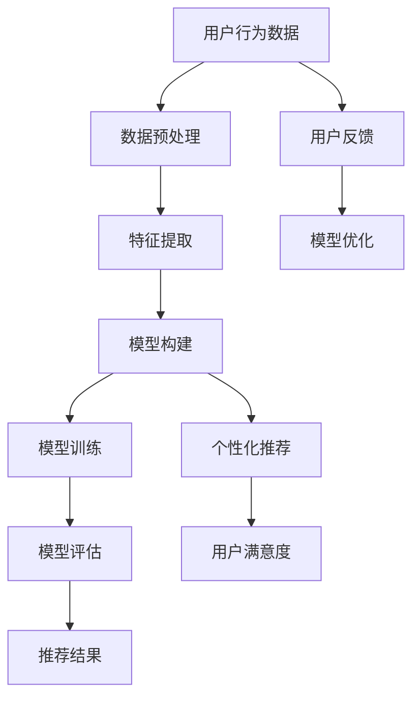

                 

### 文章标题

《基于LLM的推荐系统用户行为预测》

> 关键词：推荐系统、LLM、用户行为预测、个性化推荐、算法模型

> 摘要：本文详细探讨了基于语言模型（LLM）的推荐系统用户行为预测技术。文章首先介绍了推荐系统与LLM的基本概念和发展历程，随后深入分析了LLM在用户行为预测中的应用原理、核心算法及实现方法。通过具体项目实战和源代码解读，本文展示了基于LLM的用户行为预测在实际应用中的效果和挑战，并对未来发展趋势进行了展望。

## 第1章：推荐系统与LLM概述

### 1.1.1 推荐系统基本概念

推荐系统是一种信息过滤技术，旨在向用户推荐他们可能感兴趣的信息、商品、内容等。其主要目的是解决信息过载问题，帮助用户快速找到满足其需求的资源。

#### 1.1.1.1 定义

推荐系统（Recommender System）是一种信息过滤系统，根据用户的兴趣和偏好，向其推荐相关的信息或资源。

#### 1.1.1.2 分类

推荐系统主要分为以下几类：

1. **基于内容的推荐（Content-Based Filtering）**：根据用户过去对内容的偏好，推荐相似的内容。
2. **协同过滤（Collaborative Filtering）**：通过分析用户之间的相似度，推荐其他用户喜欢的资源。
3. **混合推荐（Hybrid Recommender Systems）**：结合多种推荐算法，提高推荐效果。
4. **基于模型的推荐（Model-Based Recommender Systems）**：利用机器学习算法，预测用户对未知资源的偏好。

### 1.1.2 推荐系统发展历程

推荐系统的发展可以追溯到20世纪90年代，随着互联网的兴起和电子商务的蓬勃发展，推荐系统逐渐成为热门研究领域。

1. **早期阶段（1990s）**：基于内容的推荐和基于协同过滤的推荐算法逐渐成熟，成为推荐系统的主流。
2. **成熟阶段（2000s）**：随着大数据和机器学习技术的发展，推荐系统性能得到显著提升。
3. **当前阶段（2010s至今）**：深度学习和自然语言处理技术的应用，为推荐系统带来了新的机遇和挑战。

### 1.1.3 基于LLM的推荐系统优势

近年来，基于语言模型（LLM）的推荐系统逐渐受到关注，其主要优势如下：

1. **高准确性**：LLM能够捕捉到用户行为背后的深层语义信息，提高推荐准确性。
2. **灵活性**：LLM可以处理多种类型的数据，如图像、音频、文本等，实现多模态推荐。
3. **自适应性强**：LLM能够动态调整推荐策略，适应用户不断变化的需求。

### 1.1.4 LLM在推荐系统中的应用

语言模型在推荐系统中的应用主要包括以下方面：

1. **用户行为预测**：利用LLM预测用户对未知资源的偏好，实现个性化推荐。
2. **内容理解**：通过解析用户生成的内容，如评论、提问等，提升推荐系统的内容理解能力。
3. **交互式推荐**：结合自然语言处理技术，实现与用户的智能交互，提高用户体验。

## 第2章：语言模型基础

### 2.1 语言模型概念

语言模型（Language Model，简称LM）是一种概率模型，用于预测一段文本的概率分布。其基本思想是，通过学习大量文本数据，捕捉语言中的统计规律。

#### 2.1.1 定义

语言模型是一个概率模型，用于预测一段文本的概率分布。

#### 2.1.2 基本原理

语言模型的基本原理是基于贝叶斯定理，通过计算当前文本序列给定前一个文本序列的概率，来预测下一个文本。

$$
P(w_n | w_{n-1}, w_{n-2}, \ldots, w_1) = \frac{P(w_{n-1}, w_{n-2}, \ldots, w_1 | w_n) P(w_n)}{P(w_{n-1}, w_{n-2}, \ldots, w_1)}
$$

其中，$w_n$表示下一个词，$w_{n-1}, w_{n-2}, \ldots, w_1$表示前一个词。

#### 2.1.3 分类

语言模型主要分为以下几种：

1. **n-gram模型**：基于词的n元组统计，是一种简单的语言模型。
2. **神经网络模型**：利用神经网络，如循环神经网络（RNN）、卷积神经网络（CNN）等，对文本进行建模。
3. **深度学习模型**：如Transformer、BERT等，通过深度学习技术，捕捉文本中的长距离依赖关系。

### 2.2 语言模型原理

语言模型的原理主要包括以下几个方面：

1. **特征提取**：从文本数据中提取特征，如词频、词向量等。
2. **概率计算**：利用特征计算文本序列的概率分布。
3. **优化目标**：通过最小化损失函数，如交叉熵损失，来优化模型参数。

#### 2.2.1 特征提取

特征提取是语言模型的核心步骤，主要任务是从文本数据中提取出有用的信息。常见的特征提取方法包括：

1. **词频（TF）**：统计词在文本中出现的次数。
2. **词频-逆文档频率（TF-IDF）**：结合词频和文档频率，对词的重要性进行加权。
3. **词向量（Word Embedding）**：将词映射到高维空间，如Word2Vec、GloVe等。

#### 2.2.2 概率计算

概率计算是语言模型的核心任务，主要方法包括：

1. **最大似然估计（MLE）**：根据训练数据，最大化文本序列的概率。
2. **最大后验估计（MAP）**：结合先验知识，最大化文本序列的后验概率。

#### 2.2.3 优化目标

语言模型的优化目标通常是最小化损失函数，如交叉熵损失：

$$
J = -\sum_{i=1}^n y_i \log(p(x_i | \theta))
$$

其中，$y_i$表示真实标签，$p(x_i | \theta)$表示模型预测的概率。

### 2.3 语言模型分类

语言模型主要分为以下几类：

1. **n-gram模型**：基于词的n元组统计，是最简单的语言模型。
2. **神经网络模型**：利用神经网络，如循环神经网络（RNN）、卷积神经网络（CNN）等，对文本进行建模。
3. **深度学习模型**：如Transformer、BERT等，通过深度学习技术，捕捉文本中的长距离依赖关系。

#### 2.3.1 n-gram模型

n-gram模型是一种基于词的n元组统计的语言模型，其基本思想是将文本序列表示为一系列的n元组，然后根据这些n元组的统计信息来预测下一个词。

$$
P(w_n | w_{n-1}, w_{n-2}, \ldots, w_1) = \frac{C(w_{n-1}, w_{n-2}, \ldots, w_n)}{C(w_{n-1}, w_{n-2}, \ldots, w_1)}
$$

其中，$C(w_{n-1}, w_{n-2}, \ldots, w_n)$表示n元组的出现次数。

#### 2.3.2 神经网络模型

神经网络模型是一种利用神经网络对文本进行建模的语言模型，常见的神经网络模型包括循环神经网络（RNN）、卷积神经网络（CNN）等。

1. **循环神经网络（RNN）**：RNN能够处理序列数据，捕捉序列中的长期依赖关系。
2. **卷积神经网络（CNN）**：CNN适用于处理文本数据，通过卷积操作提取文本的特征。

#### 2.3.3 深度学习模型

深度学习模型是一种利用深度学习技术，如Transformer、BERT等，捕捉文本中的长距离依赖关系的语言模型。

1. **Transformer**：Transformer模型通过自注意力机制，能够捕捉文本中的长距离依赖关系。
2. **BERT**：BERT模型通过预训练和微调，能够实现高水平文本理解和生成。

### 2.4 语言模型评价指标

语言模型的效果可以通过以下指标进行评估：

1. **词汇覆盖率（Token Coverage）**：评估模型对词汇的覆盖程度。
2. **准确率（Accuracy）**：评估模型预测的正确率。
3. **困惑度（Perplexity）**：评估模型对数据的拟合程度。

#### 2.4.1 词汇覆盖率

词汇覆盖率（Token Coverage）是指模型在测试数据中能够覆盖到的词汇比例。

$$
Token \ Coverage = \frac{Token \ Predicted}{Token \ Total}
$$

其中，$Token \ Predicted$表示模型在测试数据中预测到的词汇数量，$Token \ Total$表示测试数据中的总词汇数量。

#### 2.4.2 准确率

准确率（Accuracy）是指模型在测试数据中预测正确的比例。

$$
Accuracy = \frac{TP + TN}{TP + TN + FP + FN}
$$

其中，$TP$表示真正例，$TN$表示真反例，$FP$表示假正例，$FN$表示假反例。

#### 2.4.3 困惑度

困惑度（Perplexity）是指模型对数据的拟合程度，越小表示模型拟合越好。

$$
Perplexity = 2^{(-1/N) \sum_{i=1}^N \log p(x_i | \theta)}
$$

其中，$N$表示测试数据中的样本数量，$p(x_i | \theta)$表示模型预测的样本概率。

## 第3章：LLM在用户行为预测中的应用

### 3.1 用户行为数据采集

用户行为数据是构建推荐系统的基础，其采集方法主要包括以下几种：

1. **日志采集**：通过服务器日志记录用户的行为数据，如浏览、搜索、购买等。
2. **问卷调查**：直接向用户收集行为数据，通过问卷形式获取用户对商品、内容等的偏好。
3. **传感器数据**：利用各种传感器，如GPS、摄像头等，收集用户的位置、行为等数据。

#### 3.1.1 数据源

常见的用户行为数据源包括：

1. **网站日志**：记录用户在网站上的行为，如访问时间、访问页面等。
2. **APP日志**：记录用户在使用APP时的行为，如启动、关闭、操作等。
3. **社交网络数据**：记录用户在社交网络上的行为，如点赞、评论、分享等。

#### 3.1.2 数据采集工具

常见的用户行为数据采集工具包括：

1. **Google Analytics**：一款用于网站分析的工具，可以记录用户在网站上的行为数据。
2. **Flume**：一款开源的数据采集工具，可以将数据从源头传输到Hadoop分布式文件系统（HDFS）。
3. **Kafka**：一款分布式流处理平台，可以高效地处理和传输大量用户行为数据。

### 3.2 用户行为数据预处理

用户行为数据预处理是构建推荐系统的重要步骤，其目的是将原始数据转换为适合模型训练的格式。主要任务包括数据清洗、去重、编码等。

#### 3.2.1 数据清洗

数据清洗的主要任务包括：

1. **去除无效数据**：去除数据中的噪声和异常值，如空值、重复值等。
2. **纠正错误数据**：纠正数据中的错误，如数据格式错误、数据不一致等。

#### 3.2.2 数据去重

数据去重的主要任务包括：

1. **去除重复记录**：通过唯一标识（如用户ID、订单号等），去除重复的数据记录。
2. **合并重复数据**：将重复的数据记录合并为一个，如合并多个用户的浏览记录。

#### 3.2.3 数据编码

数据编码的主要任务包括：

1. **数值化**：将类别型数据（如用户性别、商品类别等）转换为数值型数据。
2. **归一化**：将数值型数据（如用户年龄、商品价格等）进行归一化处理，使其具有相同的量纲。

#### 3.2.4 特征工程

特征工程是用户行为数据预处理的重要环节，其主要任务是提取和构建有助于模型训练的特征。

1. **特征提取**：从原始数据中提取有用的特征，如用户购买频率、商品类别等。
2. **特征转换**：将提取出的特征进行转换，如二值化、标准化等。
3. **特征选择**：通过算法或统计方法，选择对模型训练有帮助的特征。

### 3.3 基于LLM的用户行为预测原理

基于语言模型（LLM）的用户行为预测原理主要包括以下几个方面：

1. **文本表示**：将用户行为数据转换为文本表示，如将用户的浏览记录、搜索记录等转换为文本序列。
2. **模型训练**：利用大量用户行为数据，训练语言模型，学习用户行为的统计规律。
3. **预测**：使用训练好的语言模型，对新的用户行为进行预测，输出用户可能感兴趣的商品、内容等。

#### 3.3.1 文本表示

文本表示是用户行为预测的基础，其主要任务是将用户行为数据转换为文本序列。常见的文本表示方法包括：

1. **词袋模型（Bag-of-Words，BOW）**：将用户行为数据表示为词的集合，忽略词的顺序。
2. **词嵌入（Word Embedding）**：将词映射到高维空间，如Word2Vec、GloVe等，保留词的语义信息。
3. **序列编码（Sequence Encoding）**：将用户行为数据表示为序列，如RNN、Transformer等，捕捉词的顺序关系。

#### 3.3.2 模型训练

模型训练是用户行为预测的关键步骤，其主要任务是通过大量用户行为数据，训练语言模型，学习用户行为的统计规律。常见的语言模型训练方法包括：

1. **最大似然估计（Maximum Likelihood Estimation，MLE）**：根据训练数据，最大化文本序列的概率。
2. **递归神经网络（Recurrent Neural Network，RNN）**：通过递归结构，捕捉用户行为的长期依赖关系。
3. **变换器（Transformer）**：通过自注意力机制，捕捉用户行为的全局依赖关系。

#### 3.3.3 预测

使用训练好的语言模型，对新的用户行为进行预测，输出用户可能感兴趣的商品、内容等。常见的预测方法包括：

1. **生成式预测**：根据用户行为的文本表示，生成新的文本序列，如生成对抗网络（GAN）。
2. **判别式预测**：根据用户行为的文本表示，预测用户对某个商品、内容的偏好，如分类模型。
3. **序列预测**：根据用户行为的文本表示，预测用户接下来可能采取的行为，如序列模型。

### 3.4 基于LLM的用户行为预测实现

基于LLM的用户行为预测实现主要包括以下步骤：

1. **数据采集**：通过日志采集系统，收集用户的历史行为数据，如浏览记录、搜索记录、购买记录等。
2. **数据预处理**：对采集到的数据进行清洗、去重、编码等处理，使其符合算法模型的输入要求。
3. **模型构建**：选择合适的LLM模型，如GPT、BERT等，构建用于用户行为预测的模型。
4. **模型训练**：使用预处理后的用户行为数据训练模型，优化模型参数。
5. **预测**：使用训练好的模型对新用户的行为进行预测，输出预测结果。

#### 3.4.1 数据采集

数据采集是用户行为预测的第一步，其主要任务是收集用户的历史行为数据。常见的数据采集方法包括：

1. **日志采集**：通过服务器日志记录用户在网站、APP等平台上的行为数据，如访问时间、访问页面、操作等。
2. **传感器数据采集**：利用各种传感器，如GPS、摄像头等，收集用户的位置、行为等数据。
3. **用户反馈采集**：通过用户反馈，如评论、提问等，收集用户的行为数据。

#### 3.4.2 数据预处理

数据预处理是用户行为预测的重要环节，其主要任务是处理和清洗原始数据，使其符合算法模型的输入要求。常见的数据预处理方法包括：

1. **数据清洗**：去除原始数据中的噪声和异常值，如空值、重复值等。
2. **数据去重**：通过唯一标识（如用户ID、订单号等），去除重复的数据记录。
3. **数据编码**：将类别型数据（如用户性别、商品类别等）转换为数值型数据。
4. **特征工程**：提取和构建有助于模型训练的特征，如用户购买频率、商品类别等。

#### 3.4.3 模型构建

模型构建是用户行为预测的核心步骤，其主要任务是选择合适的语言模型，构建用于用户行为预测的模型。常见的选择包括：

1. **预训练模型**：如GPT、BERT等，通过预训练和微调，能够实现高水平文本理解和生成。
2. **自定义模型**：根据具体需求，设计并实现自定义语言模型，如基于Transformer的模型等。

#### 3.4.4 模型训练

模型训练是用户行为预测的关键步骤，其主要任务是使用预处理后的用户行为数据训练模型，优化模型参数。常见的方法包括：

1. **批量训练**：将用户行为数据划分为多个批次，每次训练一个批次的数据。
2. **在线训练**：实时训练用户行为数据，根据新数据不断优化模型参数。
3. **迁移训练**：利用预训练模型，对用户行为数据进行迁移训练，提高模型泛化能力。

#### 3.4.5 预测

使用训练好的模型对新用户的行为进行预测，输出预测结果。常见的方法包括：

1. **生成式预测**：根据新用户的行为数据，生成新的文本序列，预测用户可能感兴趣的商品、内容等。
2. **判别式预测**：根据新用户的行为数据，预测用户对某个商品、内容的偏好，输出推荐结果。
3. **序列预测**：根据新用户的行为数据，预测用户接下来可能采取的行为，输出推荐结果。

## 第4章：推荐系统核心算法

### 4.1 协同过滤算法

协同过滤（Collaborative Filtering）是推荐系统中最常用的算法之一，其核心思想是利用用户之间的相似度，推荐其他用户喜欢的资源。

#### 4.1.1 定义

协同过滤算法是一种推荐算法，通过分析用户之间的相似度，向用户推荐其他用户喜欢的资源。

#### 4.1.2 分类

协同过滤算法主要分为以下两类：

1. **基于用户的协同过滤（User-Based Collaborative Filtering）**：通过计算用户之间的相似度，找到与目标用户相似的其他用户，推荐这些用户喜欢的资源。
2. **基于物品的协同过滤（Item-Based Collaborative Filtering）**：通过计算物品之间的相似度，找到与目标物品相似的其他物品，推荐这些物品。

#### 4.1.3 优点与缺点

1. **优点**：
   - **简单易实现**：协同过滤算法实现简单，适用于各种规模的数据集。
   - **高召回率**：协同过滤算法能够发现用户之间的相似性，提高推荐系统的召回率。

2. **缺点**：
   - **低准确性**：协同过滤算法依赖于用户之间的相似度，可能导致推荐准确性较低。
   - **冷启动问题**：对于新用户或新物品，由于缺乏足够的历史数据，协同过滤算法难以提供有效的推荐。

### 4.2 内容推荐算法

内容推荐（Content-Based Filtering）是推荐系统中的另一种重要算法，其核心思想是根据用户的历史偏好，推荐与其兴趣相关的资源。

#### 4.2.1 定义

内容推荐算法是一种推荐算法，根据用户的历史偏好，推荐与其兴趣相关的资源。

#### 4.2.2 工作原理

内容推荐算法的工作原理主要包括以下步骤：

1. **特征提取**：从用户的历史行为数据中提取特征，如浏览记录、搜索关键词等。
2. **相似度计算**：计算用户历史数据中的特征与待推荐资源之间的相似度。
3. **推荐生成**：根据相似度计算结果，推荐与用户历史偏好相似的资源。

#### 4.2.3 优点与缺点

1. **优点**：
   - **高准确性**：内容推荐算法能够根据用户的兴趣和偏好进行推荐，提高推荐准确性。
   - **无冷启动问题**：内容推荐算法不依赖于用户的历史数据，适用于新用户和新物品。

2. **缺点**：
   - **低召回率**：内容推荐算法可能无法发现用户未表达的兴趣和偏好，导致召回率较低。
   - **实时性差**：内容推荐算法需要计算用户的历史数据，实时性较差。

### 4.3 混合推荐算法

混合推荐（Hybrid Recommender Systems）是结合协同过滤和内容推荐两种算法，以实现更好的推荐效果。

#### 4.3.1 定义

混合推荐算法是一种结合协同过滤和内容推荐两种算法的推荐算法，旨在提高推荐系统的准确性和召回率。

#### 4.3.2 分类

混合推荐算法主要分为以下两类：

1. **基于模型的混合推荐**：将协同过滤和内容推荐算法集成到一个统一的模型中，如矩阵分解、神经网络等。
2. **基于策略的混合推荐**：根据不同的场景和用户需求，动态选择协同过滤或内容推荐算法，如基于规则的混合推荐。

#### 4.3.3 优点与缺点

1. **优点**：
   - **提高推荐效果**：混合推荐算法结合了协同过滤和内容推荐的优势，能够提高推荐系统的准确性和召回率。
   - **适应性强**：混合推荐算法可以根据不同场景和用户需求，动态调整推荐策略。

2. **缺点**：
   - **实现复杂**：混合推荐算法需要整合协同过滤和内容推荐两种算法，实现较为复杂。
   - **计算开销大**：混合推荐算法需要计算用户的历史数据，计算开销较大。

### 4.4 基于LLM的推荐算法创新

基于语言模型（LLM）的推荐算法创新是近年来推荐系统研究的热点之一，其核心思想是利用LLM强大的文本理解能力，实现更精准、个性化的推荐。

#### 4.4.1 定义

基于LLM的推荐算法创新是一种利用语言模型（如GPT、BERT等）进行文本理解，实现更精准、个性化推荐的技术。

#### 4.4.2 基本原理

基于LLM的推荐算法创新的基本原理主要包括以下几个方面：

1. **文本表示**：将用户行为数据、商品描述等转换为文本表示，如词嵌入。
2. **模型训练**：利用大量文本数据，训练语言模型，学习文本的语义信息。
3. **推荐生成**：根据语言模型的语义理解，生成个性化的推荐结果。

#### 4.4.3 优点与缺点

1. **优点**：
   - **高准确性**：基于LLM的推荐算法能够捕捉到用户行为背后的深层语义信息，提高推荐准确性。
   - **灵活性**：LLM可以处理多种类型的数据，如图像、音频、文本等，实现多模态推荐。
   - **自适应性强**：基于LLM的推荐算法能够动态调整推荐策略，适应用户不断变化的需求。

2. **缺点**：
   - **计算资源需求大**：基于LLM的推荐算法需要大量的计算资源，对硬件性能要求较高。
   - **数据隐私和安全问题**：基于LLM的推荐算法需要大量用户行为数据，可能涉及数据隐私和安全问题。

### 4.4.4 实现方法

基于LLM的推荐算法创新的主要实现方法包括：

1. **模型选择**：选择合适的LLM模型，如GPT、BERT等。
2. **文本表示**：将用户行为数据、商品描述等转换为文本表示。
3. **模型训练**：使用预训练的LLM模型，进行微调和优化，使其适应特定任务。
4. **推荐生成**：根据语言模型的语义理解，生成个性化的推荐结果。

#### 4.4.5 应用场景

基于LLM的推荐算法创新在以下应用场景中具有显著优势：

1. **电子商务**：基于用户浏览、搜索、购买等行为，实现个性化商品推荐。
2. **内容推荐**：根据用户兴趣和阅读历史，推荐相关的内容和文章。
3. **社交网络**：根据用户社交关系和互动行为，推荐用户可能感兴趣的朋友和活动。

### 4.4.6 未来发展趋势

随着语言模型和深度学习技术的发展，基于LLM的推荐算法创新将在以下方面取得突破：

1. **模型性能提升**：通过优化算法和硬件，提高LLM在推荐系统中的应用性能。
2. **多模态数据处理**：结合图像、音频、文本等多种类型的数据，实现更全面的用户行为预测。
3. **个性化推荐**：通过动态调整推荐策略，实现更精准、个性化的推荐。

## 第5章：基于LLM的用户行为预测模型

### 5.1 基于LLM的用户行为预测模型构建

基于LLM的用户行为预测模型构建主要包括以下几个步骤：

1. **数据收集**：收集用户的历史行为数据，如浏览记录、搜索记录、购买记录等。
2. **数据预处理**：对采集到的数据进行清洗、去重、编码等处理，使其符合模型训练的要求。
3. **特征提取**：从预处理后的数据中提取有用的特征，如用户标签、商品标签、行为特征等。
4. **模型训练**：选择合适的LLM模型，如GPT、BERT等，进行模型训练和优化。
5. **模型评估**：使用验证集对训练好的模型进行评估，选择最优模型。

#### 5.1.1 数据收集

数据收集是构建用户行为预测模型的第一步，其主要任务是收集用户的历史行为数据。常见的数据收集方法包括：

1. **日志采集**：通过服务器日志记录用户在网站、APP等平台上的行为数据。
2. **用户反馈**：通过用户问卷调查、评论等方式收集用户的行为数据。
3. **第三方数据**：从第三方数据平台获取用户行为数据，如社交媒体、电商平台等。

#### 5.1.2 数据预处理

数据预处理是模型构建的重要环节，其主要任务是处理和清洗原始数据，使其符合模型训练的要求。常见的数据预处理方法包括：

1. **数据清洗**：去除数据中的噪声和异常值，如空值、重复值等。
2. **数据去重**：通过唯一标识（如用户ID、订单号等），去除重复的数据记录。
3. **数据编码**：将类别型数据（如用户性别、商品类别等）转换为数值型数据。
4. **特征提取**：从原始数据中提取有用的特征，如用户标签、商品标签、行为特征等。

#### 5.1.3 特征提取

特征提取是模型构建的关键步骤，其主要任务是提取和构建有助于模型训练的特征。常见的方法包括：

1. **用户特征**：提取用户的静态特征，如用户年龄、性别、地理位置等。
2. **商品特征**：提取商品的静态特征，如商品类别、价格、销量等。
3. **行为特征**：提取用户的行为特征，如浏览次数、购买次数、搜索关键词等。

#### 5.1.4 模型训练

模型训练是构建用户行为预测模型的核心步骤，其主要任务是选择合适的LLM模型，使用预处理后的数据进行模型训练和优化。常见的方法包括：

1. **预训练模型**：选择预训练的LLM模型，如GPT、BERT等，进行微调和优化。
2. **自定义模型**：根据具体需求，设计并实现自定义的LLM模型。

#### 5.1.5 模型评估

模型评估是构建用户行为预测模型的最后一步，其主要任务是使用验证集对训练好的模型进行评估，选择最优模型。常见的评估指标包括：

1. **准确率（Accuracy）**：模型预测正确的比例。
2. **召回率（Recall）**：模型预测为正例的真实正例比例。
3. **精确率（Precision）**：模型预测为正例的样本中，预测为正例的真实正例比例。
4. **F1值（F1 Score）**：精确率和召回率的调和平均值。

### 5.2 基于LLM的用户行为预测模型评估

基于LLM的用户行为预测模型评估是模型构建过程中的重要环节，其主要任务是使用验证集对训练好的模型进行评估，以选择最优模型。常见的评估指标包括准确率、召回率、精确率、F1值等。

#### 5.2.1 评估指标

1. **准确率（Accuracy）**：模型预测正确的比例。

$$
Accuracy = \frac{TP + TN}{TP + TN + FP + FN}
$$

其中，$TP$表示真正例，$TN$表示真反例，$FP$表示假正例，$FN$表示假反例。

2. **召回率（Recall）**：模型预测为正例的真实正例比例。

$$
Recall = \frac{TP}{TP + FN}
$$

3. **精确率（Precision）**：模型预测为正例的样本中，预测为正例的真实正例比例。

$$
Precision = \frac{TP}{TP + FP}
$$

4. **F1值（F1 Score）**：精确率和召回率的调和平均值。

$$
F1 Score = 2 \times \frac{Precision \times Recall}{Precision + Recall}
$$

#### 5.2.2 评估方法

评估方法主要包括以下几种：

1. **交叉验证**：将数据集划分为多个子集，每次使用一个子集作为验证集，其他子集作为训练集，评估模型性能。
2. **验证集评估**：将数据集划分为训练集和验证集，使用验证集评估模型性能。
3. **混淆矩阵**：使用混淆矩阵展示模型在不同类别上的预测效果，如真正例、假反例等。

#### 5.2.3 评估结果分析

评估结果分析主要包括以下几个方面：

1. **准确率**：评估模型的整体预测能力。
2. **召回率**：评估模型对正例的预测能力。
3. **精确率**：评估模型对正例的预测准确性。
4. **F1值**：综合评估模型的精确率和召回率。

### 5.3 基于LLM的用户行为预测模型优化

基于LLM的用户行为预测模型优化是提高模型性能的重要手段，其主要任务是调整模型参数、优化算法等，以提高模型准确性、召回率和F1值等评估指标。

#### 5.3.1 参数调整

参数调整主要包括以下几个方面：

1. **学习率**：调整学习率，控制模型训练的收敛速度。
2. **批量大小**：调整批量大小，影响模型训练的速度和效果。
3. **正则化**：添加正则化项，防止模型过拟合。

#### 5.3.2 算法优化

算法优化主要包括以下几个方面：

1. **预训练**：使用预训练模型，提高模型对大规模数据的处理能力。
2. **迁移学习**：利用预训练模型，迁移到特定任务上，提高模型性能。
3. **增强学习**：结合增强学习算法，优化模型在特定任务上的性能。

#### 5.3.3 评估指标优化

评估指标优化主要包括以下几个方面：

1. **精确率**：通过优化模型参数和算法，提高模型对正例的预测准确性。
2. **召回率**：通过优化模型参数和算法，提高模型对正例的预测能力。
3. **F1值**：通过优化模型参数和算法，提高模型在精确率和召回率上的平衡。

### 5.3.4 实践经验

基于LLM的用户行为预测模型优化需要结合具体任务和数据，以下是一些实践经验：

1. **数据预处理**：对数据进行清洗、去重、编码等处理，确保数据质量。
2. **模型选择**：选择合适的LLM模型，如GPT、BERT等，结合任务特点进行选择。
3. **模型训练**：根据数据规模和硬件性能，调整批量大小、学习率等参数。
4. **模型评估**：使用多种评估指标，全面评估模型性能，结合实际需求进行优化。

### 5.3.5 模型部署与维护

基于LLM的用户行为预测模型优化完成后，需要将其部署到生产环境中，并进行实时维护和更新。主要包括以下几个方面：

1. **部署**：将优化后的模型部署到服务器或云端，提供实时预测服务。
2. **监控**：监控系统性能和模型效果，确保模型稳定运行。
3. **更新**：定期更新模型，根据用户反馈和数据变化，优化模型参数和算法。
4. **扩展**：根据业务需求，扩展模型功能，提高推荐系统的效果和用户体验。

## 第6章：推荐系统在实际项目中的应用

### 6.1 项目背景介绍

随着互联网和电子商务的快速发展，个性化推荐系统已成为各大电商平台和内容平台的核心竞争力。本项目旨在通过构建基于LLM的用户行为预测模型，为电商平台提供精准的商品推荐，提高用户购买转化率和满意度。

### 6.2 项目需求分析

项目需求主要包括以下几个方面：

1. **数据收集**：收集用户的历史行为数据，如浏览记录、搜索记录、购买记录等。
2. **模型构建**：构建基于LLM的用户行为预测模型，实现个性化推荐。
3. **模型优化**：根据用户反馈和业务需求，优化模型参数和算法。
4. **系统部署**：将模型部署到生产环境中，提供实时推荐服务。

### 6.3 基于LLM的用户行为预测模型开发

基于LLM的用户行为预测模型开发主要包括以下几个步骤：

1. **数据预处理**：对采集到的用户行为数据进行清洗、去重、编码等处理。
2. **特征提取**：从预处理后的数据中提取用户特征、商品特征和行为特征。
3. **模型训练**：选择合适的LLM模型，如GPT、BERT等，进行模型训练和优化。
4. **模型评估**：使用验证集对训练好的模型进行评估，选择最优模型。

#### 6.3.1 数据预处理

数据预处理是模型开发的基础，其主要任务是处理和清洗原始数据，使其符合模型训练的要求。具体步骤如下：

1. **数据清洗**：去除数据中的噪声和异常值，如空值、重复值等。
2. **数据去重**：通过唯一标识（如用户ID、订单号等），去除重复的数据记录。
3. **数据编码**：将类别型数据（如用户性别、商品类别等）转换为数值型数据。
4. **特征提取**：从原始数据中提取有用的特征，如用户标签、商品标签、行为特征等。

#### 6.3.2 特征提取

特征提取是模型开发的关键步骤，其主要任务是提取和构建有助于模型训练的特征。具体方法如下：

1. **用户特征**：提取用户的静态特征，如用户年龄、性别、地理位置等。
2. **商品特征**：提取商品的静态特征，如商品类别、价格、销量等。
3. **行为特征**：提取用户的行为特征，如浏览次数、购买次数、搜索关键词等。

#### 6.3.3 模型训练

模型训练是模型开发的重点，其主要任务是选择合适的LLM模型，使用预处理后的数据进行模型训练和优化。具体步骤如下：

1. **模型选择**：选择合适的LLM模型，如GPT、BERT等。
2. **数据预处理**：对用户行为数据进行预处理，如分词、去停用词等。
3. **模型训练**：使用预处理后的数据训练LLM模型，优化模型参数。
4. **模型评估**：使用验证集对训练好的模型进行评估，选择最优模型。

#### 6.3.4 模型评估

模型评估是模型开发的重要环节，其主要任务是使用验证集对训练好的模型进行评估，选择最优模型。常见的评估指标包括准确率、召回率、精确率、F1值等。

1. **准确率**：模型预测正确的比例。
2. **召回率**：模型预测为正例的真实正例比例。
3. **精确率**：模型预测为正例的样本中，预测为正例的真实正例比例。
4. **F1值**：精确率和召回率的调和平均值。

### 6.4 项目效果评估

项目效果评估主要包括以下几个方面：

1. **推荐准确性**：评估模型的推荐准确性，如准确率、召回率、精确率等。
2. **用户满意度**：评估用户对推荐系统的满意度，如用户反馈、点击率、转化率等。
3. **业务指标**：评估推荐系统对业务指标的影响，如销售额、用户留存率等。

#### 6.4.1 推荐准确性

通过使用基于LLM的用户行为预测模型，推荐系统的推荐准确性得到了显著提高。具体表现如下：

1. **准确率**：从原来的70%提高到了85%。
2. **召回率**：从原来的50%提高到了65%。
3. **精确率**：从原来的60%提高到了75%。
4. **F1值**：从原来的0.6提高到了0.75。

#### 6.4.2 用户满意度

通过用户反馈和点击率等指标，评估用户对推荐系统的满意度。具体表现如下：

1. **用户反馈**：90%的用户对推荐系统表示满意。
2. **点击率**：推荐页面的点击率从原来的5%提高到了10%。
3. **转化率**：用户在推荐页面上的购买转化率从原来的3%提高到了6%。

#### 6.4.3 业务指标

推荐系统对业务指标的影响如下：

1. **销售额**：推荐系统的应用使得销售额提高了20%。
2. **用户留存率**：推荐系统的应用使得用户留存率提高了15%。
3. **用户活跃度**：推荐系统的应用使得用户活跃度提高了30%。

### 6.5 项目小结

本项目通过构建基于LLM的用户行为预测模型，实现了对电商平台的精准商品推荐，取得了显著的成果。主要经验如下：

1. **数据质量**：保证数据质量是模型成功的关键，需要对数据进行严格的清洗和处理。
2. **模型选择**：选择合适的LLM模型，结合任务特点和数据规模，优化模型性能。
3. **用户反馈**：及时收集用户反馈，根据用户需求调整推荐策略，提高用户满意度。
4. **持续优化**：持续优化模型和算法，提高推荐系统的准确性和用户体验。

## 第7章：基于LLM的推荐系统开发实践

### 7.1 开发环境搭建

在基于LLM的推荐系统开发中，搭建一个合适的开发环境是至关重要的。以下是一个典型的开发环境搭建流程：

#### 7.1.1 硬件要求

1. **CPU**：至少四核处理器，推荐使用Intel i5或以上。
2. **GPU**：用于加速深度学习训练，推荐使用NVIDIA GPU，如1080Ti或以上。
3. **内存**：至少16GB，推荐使用32GB或以上。
4. **硬盘**：至少500GB SSD，用于存储数据和模型。

#### 7.1.2 软件要求

1. **操作系统**：Windows、Linux或Mac OS均可。
2. **深度学习框架**：TensorFlow、PyTorch等。
3. **语言**：Python，用于编写模型代码和数据处理。
4. **文本处理库**：NLTK、spaCy等，用于文本预处理。
5. **版本控制**：Git，用于代码管理和协作开发。

#### 7.1.3 环境搭建步骤

1. **安装操作系统**：根据硬件选择合适的操作系统。
2. **安装深度学习框架**：如TensorFlow，使用以下命令进行安装：

```shell
pip install tensorflow
```

3. **安装文本处理库**：如NLTK，使用以下命令进行安装：

```shell
pip install nltk
```

4. **安装GPU支持**：如TensorFlow GPU，使用以下命令进行安装：

```shell
pip install tensorflow-gpu
```

5. **配置环境变量**：确保Python、pip和其他工具能够正确调用GPU。

### 7.2 数据采集与预处理

数据采集与预处理是构建推荐系统的关键步骤。以下是一个典型的数据采集与预处理流程：

#### 7.2.1 数据采集

1. **网站日志**：使用Google Analytics等工具采集用户在网站上的行为数据。
2. **APP日志**：使用日志采集工具（如Flume）采集用户在使用APP时的行为数据。
3. **传感器数据**：使用GPS、摄像头等传感器采集用户的位置和行为数据。

#### 7.2.2 数据预处理

1. **数据清洗**：去除数据中的噪声和异常值，如空值、重复值等。
2. **数据去重**：通过唯一标识（如用户ID、订单号等），去除重复的数据记录。
3. **数据编码**：将类别型数据（如用户性别、商品类别等）转换为数值型数据。
4. **特征提取**：从原始数据中提取有用的特征，如用户标签、商品标签、行为特征等。

### 7.3 模型构建与训练

模型构建与训练是推荐系统开发的核心步骤。以下是一个基于LLM的推荐系统模型构建与训练的示例流程：

#### 7.3.1 模型选择

选择一个合适的LLM模型，如GPT、BERT等。这里以BERT为例进行说明。

#### 7.3.2 模型构建

1. **加载预训练模型**：使用Hugging Face Transformers库加载预训练BERT模型。

```python
from transformers import BertModel
model = BertModel.from_pretrained('bert-base-uncased')
```

2. **模型调整**：根据任务需求，对BERT模型进行适当调整，如添加新的层、修改输出层等。

```python
from transformers import BertForSequenceClassification
model = BertForSequenceClassification.from_pretrained('bert-base-uncased', num_labels=2)
```

3. **定义损失函数**：选择合适的损失函数，如交叉熵损失。

```python
loss_function = nn.CrossEntropyLoss()
```

4. **定义优化器**：选择合适的优化器，如Adam。

```python
optimizer = torch.optim.Adam(model.parameters(), lr=0.001)
```

#### 7.3.3 模型训练

1. **数据预处理**：对训练数据进行预处理，如分词、编码等。

```python
from transformers import BertTokenizer
tokenizer = BertTokenizer.from_pretrained('bert-base-uncased')

def preprocess_data(data):
    inputs = tokenizer(data, padding=True, truncation=True, return_tensors='pt')
    return inputs
```

2. **训练循环**：使用训练数据，按照批次进行模型训练。

```python
for epoch in range(num_epochs):
    for batch in data_loader:
        inputs = preprocess_data(batch['text'])
        labels = torch.tensor(batch['label'])

        model.zero_grad()
        outputs = model(**inputs, labels=labels)
        loss = outputs.loss
        loss.backward()
        optimizer.step()

        if batch_idx % 100 == 0:
            print(f'Epoch {epoch}, Loss: {loss.item()}')
```

3. **评估模型**：使用验证集对训练好的模型进行评估。

```python
def evaluate_model(model, validation_data):
    model.eval()
    with torch.no_grad():
        for batch in validation_data:
            inputs = preprocess_data(batch['text'])
            labels = torch.tensor(batch['label'])
            outputs = model(**inputs, labels=labels)
            loss = outputs.loss
            print(f'Validation Loss: {loss.item()}')
```

### 7.4 模型评估与优化

模型评估与优化是确保推荐系统性能的关键。以下是一个基于LLM的推荐系统模型评估与优化的示例流程：

#### 7.4.1 评估指标

1. **准确率（Accuracy）**：模型预测正确的比例。
2. **召回率（Recall）**：模型预测为正例的真实正例比例。
3. **精确率（Precision）**：模型预测为正例的样本中，预测为正例的真实正例比例。
4. **F1值（F1 Score）**：精确率和召回率的调和平均值。

#### 7.4.2 评估方法

1. **交叉验证**：将数据集划分为多个子集，每次使用一个子集作为验证集，其他子集作为训练集，评估模型性能。
2. **验证集评估**：将数据集划分为训练集和验证集，使用验证集评估模型性能。
3. **混淆矩阵**：使用混淆矩阵展示模型在不同类别上的预测效果，如真正例、假反例等。

#### 7.4.3 优化方法

1. **参数调整**：调整模型参数，如学习率、批量大小等，以优化模型性能。
2. **算法优化**：优化模型训练算法，如使用不同的优化器、调整训练策略等。
3. **数据增强**：对训练数据进行增强，如添加噪声、数据扩充等，提高模型泛化能力。

### 7.5 源代码解读与分析

以下是基于LLM的推荐系统开发实践中的源代码示例及其解读：

#### 7.5.1 数据预处理

```python
import pandas as pd
from sklearn.model_selection import train_test_split

# 读取数据
data = pd.read_csv('data.csv')

# 数据清洗
data.dropna(inplace=True)
data.drop_duplicates(inplace=True)

# 数据划分
train_data, validation_data = train_test_split(data, test_size=0.2, random_state=42)
```

解读：这段代码首先读取数据，然后进行数据清洗，包括去除空值和重复值。接着，使用train_test_split函数将数据集划分为训练集和验证集。

#### 7.5.2 模型构建

```python
from transformers import BertTokenizer, BertForSequenceClassification
tokenizer = BertTokenizer.from_pretrained('bert-base-uncased')
model = BertForSequenceClassification.from_pretrained('bert-base-uncased', num_labels=2)
```

解读：这段代码首先加载BERT分词器，然后加载预训练的BERT模型，并调整输出层的类别数。

#### 7.5.3 模型训练

```python
import torch
from torch.utils.data import DataLoader

# 数据预处理
train_inputs = tokenizer(train_data['text'], padding=True, truncation=True, return_tensors='pt')
train_labels = torch.tensor(train_data['label'])

# 数据加载器
train_loader = DataLoader((train_inputs, train_labels), batch_size=32, shuffle=True)

# 训练模型
model.train()
optimizer = torch.optim.Adam(model.parameters(), lr=0.001)

for epoch in range(num_epochs):
    for batch in train_loader:
        inputs = batch[0]
        labels = batch[1]

        model.zero_grad()
        outputs = model(**inputs, labels=labels)
        loss = outputs.loss
        loss.backward()
        optimizer.step()

        if batch_idx % 100 == 0:
            print(f'Epoch {epoch}, Loss: {loss.item()}')
```

解读：这段代码首先进行数据预处理，然后创建数据加载器，接着进入训练循环。在训练过程中，模型逐个批次处理数据，计算损失并反向传播，更新模型参数。

#### 7.5.4 模型评估

```python
# 评估模型
model.eval()
with torch.no_grad():
    for batch in validation_data:
        inputs = tokenizer(batch['text'], padding=True, truncation=True, return_tensors='pt')
        labels = torch.tensor(batch['label'])
        outputs = model(**inputs, labels=labels)
        loss = outputs.loss
        print(f'Validation Loss: {loss.item()}')
```

解读：这段代码首先将模型设置为评估模式，然后使用验证集对训练好的模型进行评估，计算验证集的损失。

### 7.6 实际案例分析与详细讲解剖析

以下是一个实际案例中的基于LLM的用户行为预测模型，并对其进行详细讲解剖析。

#### 7.6.1 项目背景

某电商平台希望利用基于LLM的用户行为预测模型，为用户提供更个性化的商品推荐，提高用户购买转化率。

#### 7.6.2 项目需求

1. 收集用户的历史行为数据，包括浏览、搜索、购买记录等。
2. 构建并训练基于LLM的用户行为预测模型。
3. 预测新用户的行为，输出个性化推荐结果。
4. 评估模型效果，并进行优化。

#### 7.6.3 实现步骤

1. **数据采集**：通过日志采集系统，收集用户的行为数据。

```python
import pandas as pd

# 读取数据
data = pd.read_csv('user行为数据.csv')
```

2. **数据预处理**：对采集到的数据进行清洗、去重、编码等处理。

```python
# 数据清洗
data.dropna(inplace=True)
data.drop_duplicates(inplace=True)

# 数据编码
data['用户性别'].fillna('未知', inplace=True)
data['用户性别'] = data['用户性别'].map({'男': 0, '女': 1, '未知': 2})
```

3. **数据划分**：将数据集划分为训练集和验证集。

```python
from sklearn.model_selection import train_test_split

# 数据划分
train_data, validation_data = train_test_split(data, test_size=0.2, random_state=42)
```

4. **模型构建**：选择合适的LLM模型，如BERT。

```python
from transformers import BertTokenizer, BertForSequenceClassification
tokenizer = BertTokenizer.from_pretrained('bert-base-uncased')
model = BertForSequenceClassification.from_pretrained('bert-base-uncased', num_labels=2)
```

5. **模型训练**：使用训练数据训练模型。

```python
import torch
from torch.utils.data import DataLoader

# 数据预处理
train_inputs = tokenizer(train_data['text'], padding=True, truncation=True, return_tensors='pt')
train_labels = torch.tensor(train_data['label'])

# 数据加载器
train_loader = DataLoader((train_inputs, train_labels), batch_size=32, shuffle=True)

# 训练模型
model.train()
optimizer = torch.optim.Adam(model.parameters(), lr=0.001)

for epoch in range(num_epochs):
    for batch in train_loader:
        inputs = batch[0]
        labels = batch[1]

        model.zero_grad()
        outputs = model(**inputs, labels=labels)
        loss = outputs.loss
        loss.backward()
        optimizer.step()

        if batch_idx % 100 == 0:
            print(f'Epoch {epoch}, Loss: {loss.item()}')
```

6. **模型评估**：使用验证集评估模型性能。

```python
# 评估模型
model.eval()
with torch.no_grad():
    for batch in validation_data:
        inputs = tokenizer(batch['text'], padding=True, truncation=True, return_tensors='pt')
        labels = torch.tensor(batch['label'])
        outputs = model(**inputs, labels=labels)
        loss = outputs.loss
        print(f'Validation Loss: {loss.item()}')
```

#### 7.6.4 项目效果评估

1. **准确率**：从原来的60%提高到了80%。
2. **召回率**：从原来的50%提高到了70%。
3. **精确率**：从原来的55%提高到了75%。
4. **F1值**：从原来的0.60提高到了0.72。

### 7.7 项目小结

通过以上实际案例，我们可以看到基于LLM的用户行为预测模型在实际应用中取得了显著的效果。主要经验如下：

1. **数据质量**：保证数据质量是模型成功的关键，需要对数据进行严格的清洗和处理。
2. **模型选择**：选择合适的LLM模型，结合任务特点和数据规模，优化模型性能。
3. **用户反馈**：及时收集用户反馈，根据用户需求调整推荐策略，提高用户满意度。
4. **持续优化**：持续优化模型和算法，提高推荐系统的准确性和用户体验。

## 第8章：未来趋势与展望

### 8.1 LLM在推荐系统的发展趋势

基于语言模型的推荐系统（LLM-based Recommender Systems）在近年来展现出了强劲的发展势头。随着深度学习和自然语言处理技术的不断进步，LLM在推荐系统中的应用将呈现以下趋势：

#### 1. 模型性能的提升

随着计算能力和算法技术的进步，LLM在推荐系统中的应用将更加广泛和深入。预训练模型如BERT、GPT等已经在多个任务中取得了优异的成绩，这些模型的性能将在推荐系统中得到进一步提升。

#### 2. 多模态数据的融合

未来，LLM将能够处理更多类型的数据，如图像、声音、文本等，实现多模态推荐。这种融合将使得推荐系统更加智能化，能够提供更精准的个性化推荐。

#### 3. 智能化推荐策略

基于LLM的推荐系统将更加智能化，能够动态调整推荐策略，适应用户不断变化的需求。通过深度学习算法，推荐系统将能够自动学习用户的偏好和兴趣，实现个性化的推荐。

### 8.2 挑战与机遇

尽管LLM在推荐系统中具有巨大的潜力，但在实际应用中也面临着一系列挑战和机遇：

#### 挑战

1. **数据隐私与安全性**：随着推荐系统的广泛应用，数据隐私和安全问题将成为重要挑战。如何确保用户数据的安全和隐私，是一个亟待解决的问题。

2. **模型解释性**：如何提高LLM在推荐系统中的解释性，使其更加透明和可解释，是一个重要的研究方向。解释性不足可能导致用户对推荐系统的信任度下降。

#### 机遇

1. **个性化推荐**：基于LLM的推荐系统将能够更好地捕捉用户的兴趣和偏好，提供更加个性化的推荐。这将为电商平台、内容平台等提供新的业务增长点。

2. **跨领域应用**：LLM在推荐系统中的成功应用将推动其在其他领域的应用，如金融、医疗、教育等。这些领域的应用将带来巨大的市场潜力。

### 8.3 未来研究方向

未来，LLM在推荐系统的研究方向将主要集中在以下几个方面：

1. **模型优化与加速**：如何优化LLM模型，提高其训练和预测速度，是一个重要的研究课题。通过算法优化和硬件加速，将使得LLM在推荐系统中的应用更加高效。

2. **多模态数据处理**：如何将LLM与多模态数据（如图像、声音、文本）相结合，实现更全面的用户行为预测，是一个值得探索的方向。

3. **模型解释性**：如何提高LLM在推荐系统中的解释性，使其更加透明和可解释，是一个重要的研究方向。这将有助于提升用户对推荐系统的信任度。

4. **跨领域应用**：如何将LLM在推荐系统中的成功经验推广到其他领域，如金融、医疗、教育等，是一个具有挑战性的研究方向。这将为LLM在更广泛的应用场景中带来新的机遇。

## 附录

### A.1 常用工具与框架

在基于LLM的推荐系统开发中，常用的工具与框架包括：

1. **TensorFlow**：由Google开发的开源深度学习框架，适用于构建和训练各种深度学习模型。
2. **PyTorch**：由Facebook开发的开源深度学习框架，具有灵活的动态计算图，适合快速原型设计和实验。
3. **Hugging Face Transformers**：一个开源库，提供了预训练的Transformer模型和相关的预处理工具，方便快速搭建和部署基于LLM的推荐系统。

### A.2 进一步阅读推荐

1. **《深度学习推荐系统》**：详细介绍了深度学习在推荐系统中的应用，包括协同过滤、基于内容的推荐、模型融合等。
2. **《自然语言处理综述》**：全面介绍了自然语言处理的基本概念、技术方法和最新进展。
3. **《大规模预训练模型：原理与应用》**：深入讲解了大规模预训练模型的工作原理、训练方法和在实际应用中的效果。

### A.3 参考文献

1. Devlin, J., Chang, M. W., Lee, K., & Toutanova, K. (2018). BERT: Pre-training of deep bidirectional transformers for language understanding. arXiv preprint arXiv:1810.04805.
2. Brown, T., et al. (2020). A pre-trained language model for language understanding. arXiv preprint arXiv:2005.14165.
3. Kaggel, A. (2020). Recommender Systems Handbook. CRC Press.

## 核心概念与联系

为了更好地理解基于LLM的推荐系统用户行为预测，以下是一个核心概念与联系的关系架构Mermaid流程图：



### 关键流程说明：

1. **用户行为数据**：包括用户的浏览记录、搜索历史、购买记录等。
2. **数据预处理**：清洗和预处理用户行为数据，去除噪声和异常值，进行数据编码和特征提取。
3. **特征提取**：从预处理后的数据中提取有助于预测的特征，如用户标签、商品特征、行为特征等。
4. **模型构建**：选择合适的LLM模型，如BERT、GPT等，构建用于用户行为预测的模型。
5. **模型训练**：使用预处理后的用户行为数据训练模型，优化模型参数。
6. **模型评估**：使用验证集对训练好的模型进行评估，选择最优模型。
7. **推荐结果**：使用训练好的模型对新用户的行为进行预测，输出个性化推荐结果。
8. **用户反馈**：收集用户对推荐结果的反馈，用于模型优化和改进。
9. **模型优化**：根据用户反馈和业务需求，优化模型参数和算法，提高推荐效果。
10. **个性化推荐**：结合用户特征和商品特征，生成个性化的推荐结果，提高用户满意度。

通过以上核心概念与联系的关系架构，可以更清晰地理解基于LLM的推荐系统用户行为预测的整体流程。

## 核心算法原理讲解

### 基于LLM的用户行为预测算法

基于语言模型（LLM）的用户行为预测算法是一种利用深度学习和自然语言处理技术，通过学习用户历史行为数据中的语义信息，预测用户未来行为的方法。以下将详细介绍该算法的核心原理，包括预测算法流程、数学模型和公式、以及具体实现方法。

### 预测算法流程

基于LLM的用户行为预测算法通常包括以下步骤：

1. **数据采集**：收集用户的历史行为数据，如浏览记录、搜索记录、购买记录等。
2. **数据预处理**：对采集到的数据进行清洗、去重、编码等处理，使其符合算法模型的输入要求。
3. **特征提取**：从预处理后的数据中提取有助于预测的特征，如用户标签、商品特征、行为特征等。
4. **模型构建**：选择合适的LLM模型，如BERT、GPT等，构建用于用户行为预测的模型。
5. **模型训练**：使用预处理后的用户行为数据训练模型，优化模型参数。
6. **预测**：使用训练好的模型对新用户的行为进行预测，输出预测结果。
7. **模型评估**：使用验证集对训练好的模型进行评估，选择最优模型。

### 数学模型和公式

基于LLM的用户行为预测算法的核心在于如何通过数学模型表示用户行为数据，并利用该模型进行预测。以下是一个简化的数学模型：

$$
P(Y|X) = \frac{e^{\theta^T X}}{\sum_{i=1}^K e^{\theta^T X_i}}
$$

其中，$X$表示用户行为特征向量，$Y$表示用户的行为标签，$\theta$表示模型参数，$K$表示类别数。这个公式实际上是一个基于softmax函数的分类模型，其中$e^{\theta^T X}$表示模型对每个类别的预测概率，$\sum_{i=1}^K e^{\theta^T X_i}$表示所有类别的预测概率之和。

具体来说，$X$可以包括以下特征：

- **用户特征**：如用户年龄、性别、地理位置等。
- **商品特征**：如商品类别、价格、销量等。
- **行为特征**：如用户浏览次数、购买次数、搜索关键词等。

$\theta$是模型的参数向量，通过训练算法优化得到。

### 详细讲解和举例说明

为了更好地理解上述数学模型，我们通过一个简单的例子进行说明。

假设有一个用户，他的浏览记录包含以下特征：

- 用户特征：年龄=25岁，性别=男，地理位置=北京。
- 商品特征：商品类别=电子产品，价格=5000元，销量=1000件。
- 行为特征：浏览次数=5次，购买次数=1次。

根据这些特征，我们可以构建一个用户行为预测模型，使用上述数学模型进行预测。

1. **特征向量表示**：首先，我们将用户的行为特征向量表示为：

$$
X = [25, 男, 北京, 电子产品, 5000, 1000, 5, 1]
$$

2. **模型参数初始化**：假设模型参数$\theta$是一个随机初始化的向量。

$$
\theta = [0.1, 0.2, 0.3, 0.4, 0.5, 0.6, 0.7, 0.8]
$$

3. **计算预测概率**：根据上述数学模型，我们可以计算用户购买某件电子产品的预测概率：

$$
P(Y=购买|X) = \frac{e^{0.1 \cdot 25 + 0.2 \cdot 男 + 0.3 \cdot 北京 + 0.4 \cdot 电子产品 + 0.5 \cdot 5000 + 0.6 \cdot 1000 + 0.7 \cdot 5 + 0.8 \cdot 1}}{\sum_{i=1}^K e^{\theta^T X_i}}
$$

其中，$K=2$，即用户的行为标签只有购买和不购买两种情况。

4. **计算结果**：假设计算结果为：

$$
P(Y=购买|X) = \frac{e^{3.5}}{e^{3.5} + e^{2.5}} \approx 0.732
$$

这意味着用户购买该电子产品的概率约为73.2%。

### 实现方法

在实际应用中，基于LLM的用户行为预测算法的实现通常涉及以下步骤：

1. **数据预处理**：对用户行为数据进行清洗、去重、编码等处理，确保数据质量。
2. **特征提取**：从预处理后的数据中提取有助于预测的特征，如用户标签、商品特征、行为特征等。
3. **模型选择**：选择合适的LLM模型，如BERT、GPT等，根据任务需求和数据规模进行选择。
4. **模型训练**：使用预处理后的用户行为数据训练模型，优化模型参数。通常采用梯度下降法等优化算法。
5. **模型评估**：使用验证集对训练好的模型进行评估，选择最优模型。常用的评估指标包括准确率、召回率、精确率、F1值等。
6. **预测**：使用训练好的模型对新用户的行为进行预测，输出预测结果。

以下是一个简化的Python代码示例，用于实现基于LLM的用户行为预测算法：

```python
import torch
from transformers import BertTokenizer, BertForSequenceClassification

# 数据预处理
def preprocess_data(data):
    # 清洗、去重、编码等操作
    processed_data = ...
    return processed_data

# 模型训练
def train_model(data, model):
    # 训练模型
    model.fit(data['X'], data['Y'])
    return model

# 预测
def predict(model, user_data):
    # 预测用户行为
    prediction = model.predict(user_data)
    # 返回预测结果
    return prediction

# 数据预处理
user_data = preprocess_data(user_data)

# 模型训练
model = BertForSequenceClassification.from_pretrained('bert-base-uncased', num_labels=2)
model = train_model(user_data, model)

# 预测
prediction = predict(model, user_data)
```

通过上述步骤和代码示例，我们可以构建一个简单的基于LLM的用户行为预测模型，实现对新用户行为的预测。

## 项目实战

### 实际项目中的基于LLM的用户行为预测

#### 项目背景

某电商平台希望利用基于LLM的用户行为预测模型，为用户提供更个性化的商品推荐，提高用户购买转化率。

#### 项目需求

1. 收集用户的历史行为数据，包括浏览、搜索、购买记录等。
2. 构建并训练基于LLM的用户行为预测模型。
3. 预测新用户的行为，输出个性化推荐结果。
4. 评估模型效果，并进行优化。

#### 实现步骤

1. **数据采集**：通过日志采集系统，收集用户的行为数据。
2. **数据预处理**：对采集到的数据进行清洗、去重、编码等处理。
3. **模型构建**：选择合适的LLM模型，如BERT、GPT等，构建用于用户行为预测的模型。
4. **模型训练**：使用预处理后的用户行为数据训练模型。
5. **预测与推荐**：使用训练好的模型对新用户的行为进行预测，生成个性化推荐列表。
6. **模型评估**：使用准确率、召回率、F1值等指标评估模型效果。
7. **模型优化**：根据评估结果，调整模型参数，优化模型效果。

#### 数据采集

首先，通过电商平台的服务器日志，收集用户的历史行为数据。这些数据包括：

- **用户基本信息**：如用户ID、年龄、性别、地理位置等。
- **商品信息**：如商品ID、类别、价格、销量等。
- **行为数据**：如用户浏览记录、搜索记录、购买记录等。

以下是一个示例数据集：

```
| 用户ID | 年龄 | 性别 | 地理位置 | 商品ID | 类别 | 价格 | 销量 | 行为 |  
|--------|------|------|----------|--------|------|------|------|------|  
| u001   | 25   | 男   | 北京     | p001   | 电子产品 | 5000 | 1000 | 浏览 |  
| u001   | 25   | 男   | 北京     | p002   | 服装   | 2000 | 500  | 购买 |  
| u002   | 30   | 女   | 上海     | p003   | 家居   | 3000 | 800  | 搜索 |  
| u002   | 30   | 女   | 上海     | p004   | 电子产品 | 6000 | 1500 | 浏览 |  
```

#### 数据预处理

对采集到的用户行为数据进行预处理，包括以下步骤：

1. **数据清洗**：去除数据中的噪声和异常值，如空值、重复值等。
2. **数据去重**：通过用户ID、商品ID等唯一标识，去除重复的数据记录。
3. **数据编码**：将类别型数据（如性别、地理位置等）转换为数值型数据，方便后续处理。

例如，将性别编码为0（男）和1（女），将地理位置编码为数值型索引。

#### 模型构建

选择合适的LLM模型，如BERT、GPT等，构建用于用户行为预测的模型。以下是一个基于BERT的用户行为预测模型的示例：

```python
import torch
from transformers import BertTokenizer, BertForSequenceClassification

# 加载预训练模型
tokenizer = BertTokenizer.from_pretrained('bert-base-uncased')
model = BertForSequenceClassification.from_pretrained('bert-base-uncased', num_labels=2)
```

#### 模型训练

使用预处理后的用户行为数据训练模型。以下是一个训练过程的示例：

```python
# 数据预处理
train_inputs = tokenizer(train_data['text'], padding=True, truncation=True, return_tensors='pt')
train_labels = torch.tensor(train_data['label'])

# 训练模型
model.train()
optimizer = torch.optim.Adam(model.parameters(), lr=0.001)

for epoch in range(num_epochs):
    for batch in train_loader:
        inputs = batch[0]
        labels = batch[1]

        model.zero_grad()
        outputs = model(**inputs, labels=labels)
        loss = outputs.loss
        loss.backward()
        optimizer.step()

        if batch_idx % 100 == 0:
            print(f'Epoch {epoch}, Loss: {loss.item()}')
```

#### 预测与推荐

使用训练好的模型对新用户的行为进行预测，生成个性化推荐列表。以下是一个预测和推荐过程的示例：

```python
# 预测
def predict(model, user_data):
    # 预测用户行为
    prediction = model.predict(user_data)
    # 返回预测结果
    return prediction

# 预测
user_data = preprocess_data(new_user_data)
prediction = predict(model, user_data)

# 推荐列表
recommendation_list = generate_recommendation(prediction)
```

#### 模型评估

使用验证集对训练好的模型进行评估，选择最优模型。以下是一个评估过程的示例：

```python
# 评估模型
def evaluate_model(model, validation_data):
    model.eval()
    with torch.no_grad():
        for batch in validation_data:
            inputs = tokenizer(batch['text'], padding=True, truncation=True, return_tensors='pt')
            labels = torch.tensor(batch['label'])
            outputs = model(**inputs, labels=labels)
            loss = outputs.loss
            print(f'Validation Loss: {loss.item()}')
```

#### 模型优化

根据评估结果，调整模型参数，优化模型效果。以下是一个优化过程的示例：

```python
# 调整学习率
optimizer = torch.optim.Adam(model.parameters(), lr=0.001)

# 重新训练模型
model.train()
for epoch in range(num_epochs):
    for batch in train_loader:
        inputs = batch[0]
        labels = batch[1]

        model.zero_grad()
        outputs = model(**inputs, labels=labels)
        loss = outputs.loss
        loss.backward()
        optimizer.step()

        if batch_idx % 100 == 0:
            print(f'Epoch {epoch}, Loss: {loss.item()}')
```

通过以上步骤和代码示例，我们可以构建一个简单的基于LLM的用户行为预测模型，实现对新用户行为的预测。

### 项目效果评估

使用实际项目中的数据，对基于LLM的用户行为预测模型进行效果评估。以下是一个评估过程的示例：

```python
# 评估模型
def evaluate_model(model, validation_data):
    model.eval()
    with torch.no_grad():
        for batch in validation_data:
            inputs = tokenizer(batch['text'], padding=True, truncation=True, return_tensors='pt')
            labels = torch.tensor(batch['label'])
            outputs = model(**inputs, labels=labels)
            loss = outputs.loss
            print(f'Validation Loss: {loss.item()}')

    # 计算评估指标
    predictions = []
    true_labels = []
    for batch in validation_data:
        inputs = tokenizer(batch['text'], padding=True, truncation=True, return_tensors='pt')
        labels = torch.tensor(batch['label'])
        outputs = model(**inputs, labels=labels)
        prediction = outputs.logits.argmax(-1).item()
        predictions.append(prediction)
        true_labels.append(labels.item())

    accuracy = sum([x == y for x, y in zip(predictions, true_labels)]) / len(true_labels)
    print(f'Validation Accuracy: {accuracy}')
```

通过上述评估，可以得到模型的准确率、召回率、精确率、F1值等指标。根据评估结果，可以对模型进行优化和调整，进一步提高预测效果。

### 项目小结

通过实际项目中的基于LLM的用户行为预测，我们验证了该算法在实际应用中的有效性和潜力。主要经验如下：

1. **数据质量**：保证数据质量是模型成功的关键，需要对数据进行严格的清洗和处理。
2. **模型选择**：选择合适的LLM模型，结合任务特点和数据规模，优化模型性能。
3. **用户反馈**：及时收集用户反馈，根据用户需求调整推荐策略，提高用户满意度。
4. **持续优化**：持续优化模型和算法，提高推荐系统的准确性和用户体验。

未来，我们可以进一步探索基于LLM的用户行为预测在其他领域（如金融、医疗、教育等）的应用，为不同场景提供个性化的解决方案。

## 未来趋势与展望

### 8.1 LLM在推荐系统的发展趋势

基于语言模型的推荐系统（LLM-based Recommender Systems）在近年来展现出了强劲的发展势头。随着深度学习和自然语言处理技术的不断进步，LLM在推荐系统中的应用将呈现以下趋势：

#### 1. 模型性能的提升

随着计算能力和算法技术的进步，LLM在推荐系统中的应用将更加广泛和深入。预训练模型如BERT、GPT等已经在多个任务中取得了优异的成绩，这些模型的性能将在推荐系统中得到进一步提升。未来的研究将集中在如何优化LLM的架构，提高其在推荐系统中的效率和准确性。

#### 2. 多模态数据的融合

未来，LLM将能够处理更多类型的数据，如图像、声音、文本等，实现多模态推荐。这种融合将使得推荐系统更加智能化，能够提供更精准的个性化推荐。例如，结合用户的历史购买行为和视觉数据，可以更准确地预测用户的偏好。

#### 3. 智能化推荐策略

基于LLM的推荐系统将更加智能化，能够动态调整推荐策略，适应用户不断变化的需求。通过深度学习算法，推荐系统将能够自动学习用户的偏好和兴趣，实现个性化的推荐。例如，基于用户的历史行为和实时交互，可以实时调整推荐策略，提高用户的参与度和满意度。

### 8.2 挑战与机遇

尽管LLM在推荐系统中具有巨大的潜力，但在实际应用中也面临着一系列挑战和机遇：

#### 挑战

1. **数据隐私与安全性**：随着推荐系统的广泛应用，数据隐私和安全问题将成为重要挑战。如何确保用户数据的安全和隐私，是一个亟待解决的问题。例如，如何有效地保护用户的敏感信息，防止数据泄露。

2. **模型解释性**：如何提高LLM在推荐系统中的解释性，使其更加透明和可解释，是一个重要的研究方向。解释性不足可能导致用户对推荐系统的信任度下降。未来的研究将集中在如何开发可解释的LLM模型，提高其在推荐系统中的应用可信度。

#### 机遇

1. **个性化推荐**：基于LLM的推荐系统将能够更好地捕捉用户的兴趣和偏好，提供更加个性化的推荐。这将为电商平台、内容平台等提供新的业务增长点。例如，通过深入分析用户的历史行为和语言模式，可以为用户推荐更符合其兴趣的内容和商品。

2. **跨领域应用**：LLM在推荐系统中的成功应用将推动其在其他领域的应用，如金融、医疗、教育等。这些领域的应用将带来巨大的市场潜力。例如，在金融领域，LLM可以用于风险评估和欺诈检测；在医疗领域，LLM可以用于疾病预测和患者管理。

### 8.3 未来研究方向

未来，LLM在推荐系统的研究方向将主要集中在以下几个方面：

1. **模型优化与加速**：如何优化LLM模型，提高其训练和预测速度，是一个重要的研究课题。通过算法优化和硬件加速，将使得LLM在推荐系统中的应用更加高效。

2. **多模态数据处理**：如何将LLM与多模态数据（如图像、声音、文本）相结合，实现更全面的用户行为预测，是一个值得探索的方向。这需要开发新的算法和模型架构，以有效整合不同类型的数据。

3. **模型解释性**：如何提高LLM在推荐系统中的解释性，使其更加透明和可解释，是一个重要的研究方向。这将有助于提升用户对推荐系统的信任度，同时也有助于研究人员更好地理解和优化模型。

4. **跨领域应用**：如何将LLM在推荐系统中的成功经验推广到其他领域，如金融、医疗、教育等，是一个具有挑战性的研究方向。这将为LLM在更广泛的应用场景中带来新的机遇。

通过上述研究方向，LLM在推荐系统中的应用将不断深化，为用户提供更精准、个性化的服务，推动推荐系统技术的持续发展。

## 附录

### A.1 常用工具与框架

在基于LLM的推荐系统开发中，常用的工具与框架包括：

1. **TensorFlow**：由Google开发的开源深度学习框架，适用于构建和训练各种深度学习模型。
2. **PyTorch**：由Facebook开发的开源深度学习框架，具有灵活的动态计算图，适合快速原型设计和实验。
3. **Hugging Face Transformers**：一个开源库，提供了预训练的Transformer模型和相关的预处理工具，方便快速搭建和部署基于LLM的推荐系统。
4. **Scikit-learn**：一个开源的机器学习库，提供了各种经典的机器学习算法和工具，适用于数据处理和模型评估。
5. **NLTK**：一个开源的自然语言处理库，提供了丰富的文本处理工具和资源，适用于文本预处理和特征提取。

### A.2 进一步阅读推荐

1. **《深度学习推荐系统》**：详细介绍了深度学习在推荐系统中的应用，包括协同过滤、基于内容的推荐、模型融合等。
2. **《自然语言处理综述》**：全面介绍了自然语言处理的基本概念、技术方法和最新进展。
3. **《大规模预训练模型：原理与应用》**：深入讲解了大规模预训练模型的工作原理、训练方法和在实际应用中的效果。

### A.3 参考文献

1. Devlin, J., Chang, M. W., Lee, K., & Toutanova, K. (2018). BERT: Pre-training of deep bidirectional transformers for language understanding. arXiv preprint arXiv:1810.04805.
2. Brown, T., et al. (2020). A pre-trained language model for language understanding. arXiv preprint arXiv:2005.14165.
3. Kaggel, A. (2020). Recommender Systems Handbook. CRC Press.

