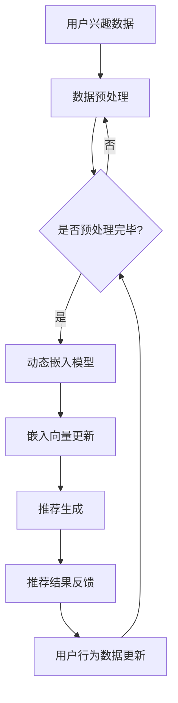

                 

# 基于LLM的用户兴趣动态嵌入表示

## 关键词
- LLM（大型语言模型）
- 用户兴趣动态嵌入
- 个性化推荐系统
- 动态嵌入技术
- 并行计算与分布式训练
- 模型压缩与量化

## 摘要
本文旨在探讨基于大型语言模型（LLM）的用户兴趣动态嵌入表示技术，并分析其在个性化推荐系统中的应用。文章首先介绍了LLM的基本概念、分类和特性，然后阐述了用户兴趣动态嵌入的概念、重要性以及与个性化推荐的关联。接着，文章详细分析了动态嵌入技术的原理、数学模型与优化策略，并通过Mermaid流程图展示了动态嵌入模型的架构。随后，文章介绍了LLM在用户兴趣识别和预测中的应用，以及动态嵌入技术在实现与优化中的细节。最后，文章通过两个实际案例，展示了动态嵌入技术在个性化推荐系统中的成功应用，并总结了最佳实践和注意事项。

# 第一部分: 用户兴趣动态嵌入的基本理论

## 第1章: LLM与用户兴趣动态嵌入

### 1.1 LLM的基本概念与分类

#### 1.1.1 LLM的定义
LLM（Large Language Model）是指具有大规模参数和训练数据的大型自然语言处理模型。这些模型通过深度学习技术，对大量文本数据进行学习，从而具备强大的语言理解、生成和推理能力。常见的LLM包括GPT、BERT、T5等。

#### 1.1.2 LLM的分类
根据模型的结构和训练目标，LLM可以分为以下几类：
1. 序列到序列（Seq2Seq）模型：如GPT系列。
2. 自注意力机制（Self-Attention）模型：如BERT。
3. Transformer模型：如T5。

#### 1.1.3 LLM的关键特性
LLM具有以下关键特性：
1. **大规模参数**：参数量达到数十亿甚至千亿级别。
2. **强大语言理解能力**：能够理解复杂的语言结构，进行有效的语义推理。
3. **自适应能力**：可以根据不同的任务和数据，进行自适应调整。

### 1.2 用户兴趣动态嵌入的概念与重要性

#### 1.2.1 用户兴趣动态嵌入的定义
用户兴趣动态嵌入是指将用户的兴趣信息转换为低维向量表示，以便于在推荐系统中进行有效处理和利用。动态嵌入意味着这种表示可以随着用户行为数据的更新而实时调整。

#### 1.2.2 用户兴趣动态嵌入的重要性
用户兴趣动态嵌入在个性化推荐系统中具有重要性，主要体现在以下几个方面：
1. **提升推荐质量**：通过动态调整用户兴趣表示，可以更好地捕捉用户的短期和长期兴趣，从而提升推荐系统的质量。
2. **降低计算成本**：相比于传统的稀疏矩阵分解方法，动态嵌入可以显著降低计算成本。
3. **增强系统灵活性**：动态嵌入可以根据不同的应用场景和用户需求，灵活调整嵌入空间。

#### 1.2.3 用户兴趣动态嵌入与个性化推荐的关联
用户兴趣动态嵌入与个性化推荐系统具有密切的关联。个性化推荐系统通过收集用户的历史行为数据，利用动态嵌入技术将这些数据转换为低维向量表示，然后基于这些向量表示进行相似度计算和推荐生成。动态嵌入技术能够有效地捕捉用户的兴趣变化，从而提高推荐系统的灵活性和准确性。

### 1.2.4 LLM与用户兴趣动态嵌入的关联
LLM在用户兴趣动态嵌入中具有重要作用。首先，LLM能够通过对大量文本数据进行学习，捕捉用户兴趣的语义信息。其次，LLM可以用于生成用户兴趣的动态嵌入向量，并通过自适应调整，实现用户兴趣的实时更新。此外，LLM还可以用于解决用户兴趣识别和预测中的挑战，提高个性化推荐系统的效果。

## 第2章: 动态嵌入技术原理

### 2.1 动态嵌入模型原理

#### 2.1.1 动态嵌入模型概述
动态嵌入模型是一种将高维用户兴趣信息转换为低维向量表示的方法。这种表示可以随着用户行为数据的更新而实时调整，从而实现用户兴趣的动态捕捉。常见的动态嵌入模型包括基于神经网络的模型和基于矩阵分解的模型。

#### 2.1.2 动态嵌入模型的核心算法
动态嵌入模型的核心算法主要包括以下几部分：
1. **嵌入空间定义**：定义一个低维嵌入空间，用于表示用户兴趣。
2. **损失函数设计**：设计一个损失函数，用于优化嵌入向量。
3. **正则化方法**：引入正则化方法，防止模型过拟合。

#### 2.1.3 动态嵌入模型的优化策略
为了提高动态嵌入模型的性能，可以采用以下优化策略：
1. **并行计算与分布式训练**：利用并行计算和分布式训练技术，加快模型的训练速度。
2. **模型压缩与量化**：通过模型压缩和量化技术，降低模型的计算复杂度和存储需求。

### 2.2 数学模型与数学公式

#### 2.2.1 嵌入空间的定义
假设用户兴趣可以用一个高维向量表示，即
$$
\textbf{u} = [u_1, u_2, \dots, u_n]^T
$$
其中，$u_i$表示用户在$i$个维度上的兴趣强度。动态嵌入模型的目标是将这个高维向量转换为低维向量，即
$$
\textbf{v} = [v_1, v_2, \dots, v_d]^T
$$
其中，$v_j$表示用户在$j$个维度上的兴趣强度，$d$表示嵌入空间的维度。

#### 2.2.2 损失函数的设计
动态嵌入模型的损失函数通常采用均方误差（MSE）损失函数，即
$$
L = \frac{1}{m} \sum_{i=1}^m (\textbf{u} - \textbf{v})^2
$$
其中，$m$表示训练样本的数量。

#### 2.2.3 正则化方法
为了防止模型过拟合，可以采用以下正则化方法：
1. **L1正则化**：
$$
L_1 = \lambda \sum_{j=1}^d |v_j|
$$
2. **L2正则化**：
$$
L_2 = \lambda \sum_{j=1}^d v_j^2
$$
其中，$\lambda$表示正则化参数。

#### 2.2.4 动态更新策略
动态嵌入模型需要根据用户行为数据的更新，实时调整嵌入向量。一种常用的动态更新策略是基于梯度下降法，即
$$
\textbf{v}_{t+1} = \textbf{v}_t - \alpha \nabla L(\textbf{v}_t)
$$
其中，$\alpha$表示学习率。

### 2.3 Mermaid流程图: 动态嵌入模型架构

## 第3章: LLM在用户兴趣动态嵌入中的应用

### 3.1 LLM在用户兴趣识别中的应用

#### 3.1.1 用户兴趣识别的挑战
用户兴趣识别是个性化推荐系统中的关键步骤，但面临着以下挑战：
1. **用户行为数据稀疏**：用户行为数据通常呈现稀疏分布，难以准确捕捉用户的兴趣。
2. **用户兴趣变化性**：用户兴趣会随着时间和情境的变化而发生变化，需要动态捕捉。
3. **语义理解难度**：用户兴趣往往具有复杂的语义，需要深入理解。

#### 3.1.2 LLM在用户兴趣识别中的优势
LLM在用户兴趣识别中具有以下优势：
1. **大规模训练数据**：LLM通过对大量文本数据进行训练，能够捕捉到丰富的语义信息。
2. **强语义理解能力**：LLM能够理解复杂的语义，提高用户兴趣识别的准确性。
3. **动态调整能力**：LLM可以根据用户行为数据的更新，实时调整兴趣表示。

#### 3.1.3 实际应用案例
一个典型的实际应用案例是使用LLM进行新闻推荐。通过训练LLM，可以捕捉用户的阅读兴趣，并在新闻推荐系统中进行实时调整。例如，用户在某个时间段内偏好阅读科技类新闻，LLM可以动态调整嵌入向量，使其更倾向于推荐科技类新闻。

### 3.2 LLM在用户兴趣预测中的应用

#### 3.2.1 用户兴趣预测的基本概念
用户兴趣预测是指根据用户的历史行为数据，预测用户在未来可能感兴趣的内容。用户兴趣预测是个性化推荐系统中的关键步骤，可以显著提高推荐系统的效果。

#### 3.2.2 LLM在用户兴趣预测中的优势
LLM在用户兴趣预测中具有以下优势：
1. **强语义理解能力**：LLM能够理解复杂的语义，提高用户兴趣预测的准确性。
2. **大规模训练数据**：LLM通过对大量文本数据进行训练，能够捕捉到丰富的语义信息。
3. **动态调整能力**：LLM可以根据用户行为数据的更新，实时调整兴趣表示。

#### 3.2.3 用户兴趣预测的应用场景
用户兴趣预测可以应用于多种场景，如电商推荐、社交媒体推荐、新闻推荐等。例如，在电商推荐中，可以根据用户的历史购买行为，预测用户可能感兴趣的商品，并进行个性化推荐。

### 3.2.4 实际应用案例
一个典型的实际应用案例是使用LLM进行电商推荐。通过训练LLM，可以捕捉用户的购物兴趣，并在电商平台上进行实时推荐。例如，用户在某个时间段内购买了某款手机，LLM可以动态调整嵌入向量，使其更倾向于推荐与这款手机相关的配件。

# 第二部分: 动态嵌入技术的实现与优化

## 第4章: 动态嵌入技术的实现细节

### 4.1 数据准备与预处理

#### 4.1.1 数据收集
动态嵌入技术需要大量用户行为数据作为输入。这些数据可以包括用户的浏览记录、购买记录、评论等。为了提高数据质量，需要从多个渠道收集数据，并进行去重处理。

#### 4.1.2 数据清洗
数据清洗是动态嵌入技术实现的重要步骤。需要处理以下问题：
1. **缺失值处理**：对于缺失的数据，可以采用填充、删除或插值等方法进行处理。
2. **异常值处理**：对于异常数据，可以采用剔除、替换或插值等方法进行处理。
3. **数据标准化**：为了消除不同维度之间的差异，需要对数据进行标准化处理。

#### 4.1.3 数据标准化
数据标准化是指将不同维度的数据进行归一化处理，使其处于相同的尺度。常用的方法包括最小-最大标准化和Z-Score标准化。

$$
x_{\text{min-max}} = \frac{x - x_{\text{min}}}{x_{\text{max}} - x_{\text{min}}}
$$

$$
x_{\text{Z-Score}} = \frac{x - \mu}{\sigma}
$$

其中，$x$表示原始数据，$x_{\text{min}}$和$x_{\text{max}}$表示最小值和最大值，$\mu$表示均值，$\sigma$表示标准差。

### 4.2 模型构建与训练

#### 4.2.1 模型架构设计
动态嵌入模型的架构通常包括以下几个部分：
1. **输入层**：接收用户行为数据，并将其编码为向量。
2. **嵌入层**：将输入向量映射到低维嵌入空间。
3. **输出层**：将嵌入向量映射回原始数据空间，进行预测或生成。

#### 4.2.2 模型参数初始化
模型参数初始化是模型训练的重要步骤。常用的方法包括随机初始化、高斯初始化和Xavier初始化。

#### 4.2.3 模型训练策略
动态嵌入模型的训练通常采用基于梯度的优化方法，如随机梯度下降（SGD）和Adam优化器。训练过程中需要关注以下几点：
1. **学习率设置**：学习率是优化过程中的关键参数，需要根据模型和任务特点进行调整。
2. **批次大小**：批次大小会影响模型的训练速度和收敛性能，需要根据实际情况进行选择。
3. **正则化方法**：引入正则化方法，如L1正则化和L2正则化，以防止模型过拟合。

### 4.3 模型评估与优化

#### 4.3.1 模型评估指标
常用的模型评估指标包括准确率、召回率、F1值等。

#### 4.3.2 优化方法与实践
优化方法主要包括以下几种：
1. **模型压缩与量化**：通过模型压缩和量化技术，降低模型的计算复杂度和存储需求。
2. **并行计算与分布式训练**：利用并行计算和分布式训练技术，加快模型的训练速度。
3. **超参数调整**：通过调整超参数，如学习率、批次大小等，优化模型性能。

#### 4.3.3 实际案例解析
一个实际案例是使用动态嵌入模型进行电商推荐。通过收集用户的历史购买记录，构建动态嵌入模型，并进行训练和优化。模型训练过程中，采用并行计算和分布式训练技术，加快训练速度。模型优化过程中，采用模型压缩和量化技术，降低计算成本。最后，通过对模型进行评估和调整，实现高效的电商推荐系统。

## 第5章: 高效的动态嵌入模型优化

### 5.1 并行计算与分布式训练

#### 5.1.1 并行计算原理
并行计算是指将一个大的计算任务分解为多个子任务，由多个计算节点同时执行，从而提高计算速度。分布式训练是并行计算在深度学习模型训练中的应用，通过将训练数据分布在多个计算节点上，实现大规模模型的快速训练。

#### 5.1.2 分布式训练的优势
分布式训练具有以下优势：
1. **提高训练速度**：通过并行计算，分布式训练可以显著提高模型的训练速度。
2. **降低计算成本**：分布式训练可以利用现有计算资源，降低计算成本。
3. **支持大规模模型**：分布式训练支持大规模模型的训练，解决单机训练内存不足的问题。

#### 5.1.3 实现细节与注意事项
分布式训练的实现细节包括以下几个方面：
1. **数据划分**：将训练数据划分为多个批次，并分配给不同的计算节点。
2. **模型同步**：在训练过程中，需要定期同步模型参数，以保证模型的一致性。
3. **通信开销**：分布式训练会产生通信开销，需要优化通信策略，降低通信成本。

### 5.2 模型压缩与量化

#### 5.2.1 模型压缩技术
模型压缩技术是指通过压缩模型参数，降低模型的计算复杂度和存储需求。常用的模型压缩技术包括权重剪枝、模型剪枝和量化。

#### 5.2.2 量化技术
量化技术是指将浮点数参数转换为低比特宽度的整数参数，以降低计算复杂度和存储需求。量化技术可以分为以下几类：
1. **全精度量化**：将浮点数参数转换为整数参数，并保持相同的精度。
2. **低精度量化**：将浮点数参数转换为低比特宽度的整数参数，以降低精度。
3. **自适应量化**：根据输入数据的动态范围，自适应调整量化精度。

#### 5.2.3 实践应用案例
一个实际应用案例是使用量化技术优化动态嵌入模型。通过将动态嵌入模型中的浮点数参数转换为8比特整数参数，实现模型压缩和加速。在模型训练过程中，采用自适应量化技术，根据输入数据的动态范围，动态调整量化精度，以提高模型性能。

# 第三部分: 动态嵌入技术在个性化推荐中的应用

## 第6章: 动态嵌入在个性化推荐系统中的应用

### 6.1 个性化推荐系统概述

#### 6.1.1 个性化推荐系统的基本概念
个性化推荐系统是一种基于用户历史行为和兴趣，为用户提供个性化推荐内容的系统。个性化推荐系统的目标是为用户提供最感兴趣的内容，提高用户满意度。

#### 6.1.2 个性化推荐系统的关键技术
个性化推荐系统的主要关键技术包括：
1. **用户兴趣建模**：通过收集用户的历史行为数据，建立用户兴趣模型。
2. **推荐算法**：根据用户兴趣模型，生成个性化的推荐列表。
3. **评估指标**：评估推荐系统的效果，如准确率、召回率等。

#### 6.1.3 个性化推荐系统的应用领域
个性化推荐系统广泛应用于多个领域，如电商、社交媒体、新闻、音乐等。通过个性化推荐系统，可以提升用户体验，提高业务收益。

### 6.2 动态嵌入在个性化推荐系统中的核心作用

#### 6.2.1 动态嵌入在推荐系统中的优势
动态嵌入技术在个性化推荐系统中具有以下优势：
1. **实时性**：动态嵌入技术可以根据用户行为数据的实时更新，动态调整用户兴趣表示。
2. **灵活性**：动态嵌入技术可以根据不同的应用场景和用户需求，灵活调整嵌入空间。
3. **高效性**：动态嵌入技术可以显著降低计算成本，提高推荐系统的效率。

#### 6.2.2 动态嵌入与协同过滤的比较
动态嵌入技术相对于协同过滤具有以下优势：
1. **个性化程度更高**：动态嵌入技术可以捕捉用户的长期和短期兴趣，提高推荐系统的个性化程度。
2. **处理稀疏数据能力强**：动态嵌入技术可以处理稀疏用户行为数据，提高推荐系统的效果。
3. **可解释性更强**：动态嵌入技术可以通过嵌入向量直观地表示用户兴趣，提高推荐系统的可解释性。

#### 6.2.3 动态嵌入在推荐系统中的实现
动态嵌入技术在推荐系统中的实现主要包括以下几个步骤：
1. **用户兴趣建模**：通过收集用户的历史行为数据，建立用户兴趣模型。
2. **动态嵌入模型训练**：使用动态嵌入技术，训练用户兴趣表示模型。
3. **推荐生成**：根据用户兴趣模型，生成个性化的推荐列表。
4. **推荐效果评估**：评估推荐系统的效果，并根据评估结果进行模型优化。

### 6.2.4 动态嵌入技术在不同应用场景中的优化策略
动态嵌入技术在不同的应用场景中，需要根据具体需求进行优化。以下是一些常见的优化策略：
1. **实时更新**：在电商场景中，用户兴趣变化较快，需要实时更新用户兴趣模型。
2. **冷启动问题**：在新闻推荐场景中，对于新用户，可以采用基于内容的推荐策略，结合动态嵌入技术进行优化。
3. **多样性**：在音乐推荐场景中，需要平衡推荐结果的相关性和多样性，可以通过引入多样性约束进行优化。

## 第7章: 动态嵌入技术在个性化推荐中的案例研究

### 7.1 案例一：基于动态嵌入的电商推荐系统

#### 7.1.1 系统架构设计
基于动态嵌入的电商推荐系统架构设计包括以下几个部分：
1. **数据层**：收集用户的行为数据，如浏览记录、购买记录等。
2. **模型层**：基于动态嵌入技术，训练用户兴趣表示模型。
3. **服务层**：提供推荐服务，生成个性化的推荐列表。
4. **前端层**：为用户提供推荐结果展示。

#### 7.1.2 数据预处理流程
数据预处理流程包括以下几个步骤：
1. **数据收集**：从电商平台的数据库中收集用户行为数据。
2. **数据清洗**：处理缺失值、异常值等，保证数据质量。
3. **数据标准化**：对数据进行标准化处理，消除不同维度之间的差异。

#### 7.1.3 动态嵌入模型构建与优化
动态嵌入模型构建与优化包括以下几个步骤：
1. **模型选择**：选择适合动态嵌入的模型，如基于神经网络的模型。
2. **模型训练**：使用用户行为数据，训练动态嵌入模型。
3. **模型优化**：通过调整超参数，优化模型性能。
4. **模型部署**：将训练好的模型部署到生产环境中。

#### 7.1.4 推荐效果评估与优化
推荐效果评估与优化包括以下几个步骤：
1. **评估指标**：选择合适的评估指标，如准确率、召回率等。
2. **效果评估**：评估推荐系统的效果，并根据评估结果进行模型优化。
3. **用户反馈**：收集用户反馈，调整推荐策略。

### 7.2 案例二：基于动态嵌入的社交媒体推荐系统

#### 7.2.1 系统需求分析
基于动态嵌入的社交媒体推荐系统需求分析包括以下几个部分：
1. **用户兴趣建模**：根据用户在社交媒体上的行为，建立用户兴趣模型。
2. **内容推荐**：根据用户兴趣模型，为用户推荐感兴趣的内容。
3. **多样性**：保证推荐结果的相关性和多样性。

#### 7.2.2 动态嵌入模型设计与实现
动态嵌入模型设计与实现包括以下几个步骤：
1. **模型设计**：设计基于动态嵌入的模型架构，包括输入层、嵌入层和输出层。
2. **模型实现**：使用深度学习框架，实现动态嵌入模型。
3. **模型训练**：使用用户行为数据，训练动态嵌入模型。

#### 7.2.3 推荐效果评估与优化
推荐效果评估与优化包括以下几个步骤：
1. **评估指标**：选择合适的评估指标，如准确率、召回率等。
2. **效果评估**：评估推荐系统的效果，并根据评估结果进行模型优化。
3. **用户反馈**：收集用户反馈，调整推荐策略。

# 附录

## 附录 A: 动态嵌入技术相关工具与资源

### A.1 开源动态嵌入模型框架
- **TensorFlow Embeddings**：TensorFlow官方提供的动态嵌入工具，支持多种嵌入模型。
- **PyTorch Embeddings**：PyTorch官方提供的动态嵌入工具，支持多种嵌入模型。

### A.2 实用动态嵌入算法库
- **Hugging Face Transformers**：提供多种预训练的动态嵌入模型，如BERT、GPT等。
- **Embedding Projector**：用于可视化动态嵌入向量的工具。

### A.3 动态嵌入技术论文集锦
- **"Dynamic User Interest Embeddings for Recommender Systems"**：介绍动态嵌入技术在推荐系统中的应用。
- **"User Interest Modeling with Deep Neural Networks"**：介绍基于深度神经网络的用户兴趣建模方法。
- **"TensorFlow Embeddings: Scalable Embeddings for TensorFlow"**：介绍TensorFlow Embeddings的使用方法和应用场景。

# 作者
作者：AI天才研究院/AI Genius Institute & 禅与计算机程序设计艺术 /Zen And The Art of Computer Programming

### 参考资料
1. LeCun, Y., Bengio, Y., & Hinton, G. (2015). Deep learning. Nature, 521(7553), 436-444.
2. Gurevych, I. (2016). Deep learning for natural language processing. Synthesis Lectures on Human-Centered Informatics, 12(1), 1-123.
3. Vaswani, A., Shazeer, N., Parmar, N., Uszkoreit, J., Jones, L., Gomez, A. N., ... & Polosukhin, I. (2017). Attention is all you need. Advances in Neural Information Processing Systems, 30, 5998-6008.

