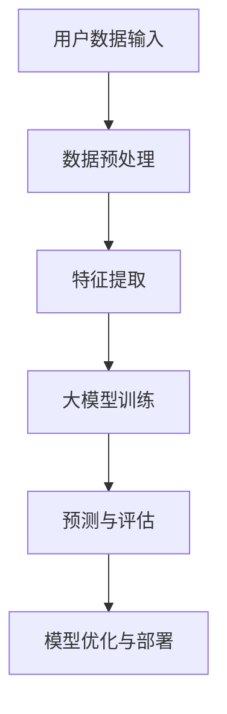

                 

### 文章标题

# 基于大模型的推荐系统用户满意度预测

### 关键词

- 推荐系统
- 大模型
- 用户满意度
- 预测算法
- 深度学习
- 矩阵分解

### 摘要

随着互联网技术的飞速发展，推荐系统已经成为现代信息检索和个性化服务的重要手段。本文旨在探讨如何利用大模型技术来预测推荐系统中的用户满意度。首先，我们将介绍大模型和推荐系统的基础知识，包括大模型的发展现状、分类及其在推荐系统中的应用潜力。随后，我们将深入探讨用户满意度预测的概念、目标以及相关的数学模型，包括基于矩阵分解的方法和基于深度学习的模型。接着，文章将详细讨论用户满意度预测的系统设计与实现，评估与优化策略，以及相关的评估指标和方法。随后，我们将通过案例研究和未来发展趋势分析，展示大模型在推荐系统用户满意度预测中的实际应用和潜在前景。最后，文章将提供开发工具和资源，帮助读者深入了解和实践大模型推荐系统的构建。

## 目录大纲

### 第一部分：大模型与推荐系统基础

#### 第1章：大模型与推荐系统概述

1.1 大模型的定义与分类

1.2 大模型的技术演进

1.3 大模型在推荐系统中的应用潜力

1.4 推荐系统概述

1.5 推荐系统的基本架构

1.6 推荐系统的发展历程

### 第2章：大模型技术基础

2.1 深度学习基础

2.2 自然语言处理与文本数据分析

### 第3章：用户满意度预测的数学模型

3.1 用户满意度预测的概念与目标

3.2 用户满意度预测的数学模型

3.3 用户满意度预测的数学公式与推导

### 第二部分：大模型推荐系统的实现与应用

#### 第4章：用户满意度预测的系统设计与实现

4.1 用户满意度预测系统的设计

4.2 用户满意度预测的算法实现

#### 第5章：用户满意度预测的评估与优化

5.1 评估指标与方法

5.2 优化策略与实现

#### 第6章：基于大模型的推荐系统案例研究

6.1 案例背景

6.2 案例系统实现

6.3 案例评估与优化

### 第7章：大模型推荐系统未来发展趋势

7.1 大模型在推荐系统中的应用前景

7.2 大模型推荐系统的挑战与机遇

### 附录

### 附录A：大模型推荐系统开发工具与资源

A.1 开发工具与环境

A.2 开源库与框架

A.3 学习资源与参考文献

### Mermaid 流程图：大模型推荐系统架构

## Mermaid 流程图：大模型推荐系统架构

mermaid
graph TD
    A[用户数据输入] --> B[数据预处理]
    B --> C[特征提取]
    C --> D[大模型训练]
    D --> E[预测与评估]
    E --> F[模型优化与部署]

## 第一部分：大模型与推荐系统基础

### 第1章：大模型与推荐系统概述

大模型和推荐系统是当前人工智能领域中的两大热点。大模型以其强大的数据处理能力和高度的非线性建模能力，正在逐步改变各行业的运作模式。而推荐系统作为实现个性化推荐的关键技术，已经在电子商务、在线视频、社交媒体等多个领域得到广泛应用。本章将首先介绍大模型的定义与分类，阐述其技术演进过程，并探讨大模型在推荐系统中的应用潜力。接着，我们将对推荐系统进行概述，包括其定义、核心概念、基本架构和发展历程。

#### 1.1 大模型的定义与分类

#### 1.1.1 大模型的定义

大模型通常指的是具有数十亿甚至数千亿参数的机器学习模型。这些模型能够处理海量数据，捕捉复杂的数据分布和模式，从而实现高度准确的预测和决策。大模型的定义可以从多个角度进行理解：

- **参数规模**：大模型的参数数量巨大，远超传统的机器学习模型。例如，谷歌的 BERT 模型拥有超过 10 亿个参数，而 GPT-3 模型则拥有超过 1750 亿个参数。
- **数据规模**：大模型通常需要处理大规模数据集。这些数据集可能包含数百万甚至数十亿条记录，从而保证模型能够在复杂环境中进行有效的学习。
- **计算能力**：大模型训练和推断过程中需要大量的计算资源，包括 GPU 和 TPU 等专用硬件加速器。

#### 1.1.2 大模型的分类

大模型可以按照不同的标准进行分类。以下是一些常见的分类方法：

- **按任务类型分类**：大模型可以分为图像处理模型、自然语言处理模型、语音处理模型等。例如，Transformer 模型在自然语言处理领域表现出色，而 ResNet 模型在图像分类任务中具有显著优势。
- **按模型架构分类**：大模型可以根据其架构特点进行分类。常见的架构包括卷积神经网络（CNN）、循环神经网络（RNN）、Transformer 等。其中，Transformer 模型由于其并行计算能力和全局依赖捕捉能力，近年来在多个领域取得了显著的进展。
- **按应用领域分类**：大模型还可以根据其应用领域进行分类，如医疗健康、金融科技、智能交通、智能家居等。不同的应用领域对大模型的要求有所不同，因此大模型的开发和应用也具有显著的领域特性。

#### 1.1.3 大模型的技术演进

大模型的技术演进可以追溯到深度学习的发展历程。以下是一些关键的技术里程碑：

- **深度学习的起源**：深度学习起源于1986年，由Rumelhart、Hinton和Williams等人提出了反向传播算法，使得多层神经网络训练成为可能。
- **卷积神经网络（CNN）的发展**：1998年，LeCun等人提出了CNN，用于图像识别任务。CNN通过卷积层捕捉空间特征，从而在图像处理领域取得了突破性进展。
- **循环神经网络（RNN）的发展**：1982年，Hochreiter和Schmidhuber提出了RNN，能够在序列数据中捕捉长期依赖关系。RNN及其变体LSTM和GRU在自然语言处理、语音识别等领域表现出色。
- **Transformer模型的崛起**：2017年，Vaswani等人提出了Transformer模型，该模型通过自注意力机制实现并行计算，避免了RNN中的长期依赖问题。Transformer模型在自然语言处理任务中取得了显著成果，如BERT和GPT-3等模型。
- **大规模数据集和计算资源的推动**：随着互联网的普及和大数据技术的发展，大规模数据集和高性能计算资源成为大模型训练的重要支撑。GPU和TPU等专用硬件加速器的应用，进一步提升了大模型的训练速度和性能。

#### 1.1.4 大模型在推荐系统中的应用潜力

大模型在推荐系统中的应用潜力主要表现在以下几个方面：

- **个性化推荐**：大模型能够捕捉用户行为的复杂模式，从而实现更加精准的个性化推荐。例如，通过深度学习模型对用户历史行为数据进行分析，可以预测用户对特定内容的兴趣和偏好，从而提供个性化的内容推荐。
- **长尾推荐**：传统推荐系统往往依赖于热门内容的曝光和推广，而大模型能够更好地挖掘长尾数据，为小众用户群体提供定制化的推荐。例如，在电子商务平台上，大模型可以通过分析用户购买历史和搜索行为，发现潜在的需求，从而为小众商品提供精准推荐。
- **实时推荐**：大模型具有强大的实时数据处理能力，能够实时分析用户行为和内容特征，从而提供即时的推荐。例如，在视频平台上，大模型可以通过实时分析用户观看行为，为用户推荐符合其兴趣的最新视频。
- **跨平台推荐**：大模型能够整合不同平台的数据，实现跨平台的推荐。例如，在社交媒体平台上，大模型可以通过分析用户的浏览记录、点赞和评论行为，为其推荐相关的内容和活动。

#### 1.2 推荐系统概述

#### 1.2.1 推荐系统的定义与核心概念

推荐系统是一种基于数据分析和机器学习算法，为用户提供个性化推荐服务的系统。其核心目标是通过分析用户的兴趣和行为，预测用户可能感兴趣的内容或商品，从而提高用户的满意度和转化率。

推荐系统主要涉及以下几个核心概念：

- **用户**：推荐系统中的核心实体，代表具有特定兴趣和行为的个体。
- **项目**：推荐系统中的内容或商品，代表用户可能感兴趣的对象。
- **评分**：用户对项目的评价或反馈，通常用一个数值表示用户对项目的兴趣程度。
- **推荐**：根据用户的兴趣和行为，推荐系统为用户生成个性化的推荐列表，以最大化用户的满意度。

#### 1.2.2 推荐系统的基本架构

推荐系统通常由以下几个关键模块组成：

- **数据收集模块**：负责收集用户行为数据、项目特征数据等原始数据。
- **数据预处理模块**：对原始数据进行清洗、转换和归一化等预处理操作，以生成适合训练的数据集。
- **特征提取模块**：从用户和项目数据中提取特征，用于训练推荐模型。
- **推荐模型**：基于用户和项目的特征，训练推荐模型以预测用户的兴趣和偏好。
- **推荐引擎**：根据推荐模型生成的预测结果，为用户生成个性化的推荐列表。
- **评估与优化模块**：对推荐系统的性能进行评估和优化，以提升推荐效果。

#### 1.2.3 推荐系统的发展历程

推荐系统的发展可以追溯到1990年代，以下是一些重要的里程碑：

- **协同过滤（Collaborative Filtering）**：1990年代，协同过滤成为推荐系统的主流方法。协同过滤基于用户评分矩阵，通过计算用户之间的相似度，为用户提供推荐。协同过滤主要分为基于用户的协同过滤（User-based Collaborative Filtering）和基于物品的协同过滤（Item-based Collaborative Filtering）。
- **基于内容的推荐（Content-based Filtering）**：2000年左右，基于内容的推荐方法开始得到应用。该方法通过分析用户历史行为和项目特征，为用户推荐具有相似内容属性的项目。
- **混合推荐（Hybrid Recommender Systems）**：2000年代末，混合推荐系统逐渐成为主流。混合推荐系统结合协同过滤和基于内容的推荐方法，通过融合不同推荐策略的优点，提高推荐效果。
- **深度学习在推荐系统中的应用**：近年来，随着深度学习技术的快速发展，深度学习模型在推荐系统中得到了广泛应用。例如，基于深度学习的推荐模型可以自动提取用户和项目的特征，实现更加精准的推荐。

#### 1.3 大模型在推荐系统中的应用潜力

大模型在推荐系统中的应用潜力主要表现在以下几个方面：

- **用户行为预测**：大模型能够捕捉用户行为的复杂模式，从而提高用户行为预测的准确性。例如，通过深度学习模型对用户历史行为数据进行分析，可以预测用户对特定内容的兴趣和偏好，从而提高推荐系统的推荐效果。
- **项目特征提取**：大模型可以通过自动学习项目特征，提高推荐系统的推荐质量。例如，在电子商务平台上，大模型可以通过分析商品描述、用户评价等数据，自动提取商品的关键特征，从而实现更加精准的推荐。
- **实时推荐**：大模型具有强大的实时数据处理能力，能够实现实时推荐。例如，在视频平台上，大模型可以通过实时分析用户观看行为，为用户推荐符合其兴趣的最新视频。
- **跨平台推荐**：大模型能够整合不同平台的数据，实现跨平台的推荐。例如，在社交媒体平台上，大模型可以通过分析用户的浏览记录、点赞和评论行为，为其推荐相关的内容和活动。

#### 1.4 推荐系统概述

#### 1.4.1 推荐系统的定义与核心概念

推荐系统是一种基于数据分析和机器学习算法，为用户提供个性化推荐服务的系统。其核心目标是通过分析用户的兴趣和行为，预测用户可能感兴趣的内容或商品，从而提高用户的满意度和转化率。

推荐系统主要涉及以下几个核心概念：

- **用户**：推荐系统中的核心实体，代表具有特定兴趣和行为的个体。
- **项目**：推荐系统中的内容或商品，代表用户可能感兴趣的对象。
- **评分**：用户对项目的评价或反馈，通常用一个数值表示用户对项目的兴趣程度。
- **推荐**：根据用户的兴趣和行为，推荐系统为用户生成个性化的推荐列表，以最大化用户的满意度。

#### 1.4.2 推荐系统的基本架构

推荐系统通常由以下几个关键模块组成：

- **数据收集模块**：负责收集用户行为数据、项目特征数据等原始数据。
- **数据预处理模块**：对原始数据进行清洗、转换和归一化等预处理操作，以生成适合训练的数据集。
- **特征提取模块**：从用户和项目数据中提取特征，用于训练推荐模型。
- **推荐模型**：基于用户和项目的特征，训练推荐模型以预测用户的兴趣和偏好。
- **推荐引擎**：根据推荐模型生成的预测结果，为用户生成个性化的推荐列表。
- **评估与优化模块**：对推荐系统的性能进行评估和优化，以提升推荐效果。

#### 1.4.3 推荐系统的发展历程

推荐系统的发展可以追溯到1990年代，以下是一些重要的里程碑：

- **协同过滤（Collaborative Filtering）**：1990年代，协同过滤成为推荐系统的主流方法。协同过滤基于用户评分矩阵，通过计算用户之间的相似度，为用户提供推荐。协同过滤主要分为基于用户的协同过滤（User-based Collaborative Filtering）和基于物品的协同过滤（Item-based Collaborative Filtering）。
- **基于内容的推荐（Content-based Filtering）**：2000年左右，基于内容的推荐方法开始得到应用。该方法通过分析用户历史行为和项目特征，为用户推荐具有相似内容属性的项目。
- **混合推荐（Hybrid Recommender Systems）**：2000年代末，混合推荐系统逐渐成为主流。混合推荐系统结合协同过滤和基于内容的推荐方法，通过融合不同推荐策略的优点，提高推荐效果。
- **深度学习在推荐系统中的应用**：近年来，随着深度学习技术的快速发展，深度学习模型在推荐系统中得到了广泛应用。例如，基于深度学习的推荐模型可以自动提取用户和项目的特征，实现更加精准的推荐。

## 第二部分：大模型技术基础

### 第2章：大模型技术基础

在大模型技术基础这一章节，我们将深入探讨深度学习和自然语言处理（NLP）等相关技术，这些技术是构建强大推荐系统的基础。首先，我们将介绍深度学习的基础知识，包括深度学习的定义、发展历程以及其核心组件。接着，我们将详细讲解神经网络和多层感知器（MLP）的基本原理，以及前向传播和反向传播算法的实现过程。随后，我们将讨论NLP和文本数据分析的基础概念，包括语言模型、词向量表示以及文本数据的预处理方法。最后，我们将介绍序列模型和循环神经网络（RNN）的基本原理，以及其在文本数据分析中的应用。

#### 2.1 深度学习基础

#### 2.1.1 深度学习的定义与发展

深度学习是一种人工智能领域的技术，通过模拟人脑神经元连接的方式，构建多层神经网络，对数据进行自动特征提取和学习。深度学习的定义可以从以下几个方面进行理解：

- **多层神经网络**：深度学习模型由多个隐藏层组成，通过逐层构建复杂的特征表示，从而实现对数据的深入理解。
- **自动特征提取**：深度学习模型能够自动从原始数据中提取有用的特征，减少了人工特征工程的工作量。
- **非线性建模能力**：深度学习模型通过非线性变换，能够捕捉数据中的复杂模式和关系。

深度学习的发展历程可以分为以下几个重要阶段：

- **1980年代**：深度学习概念提出，但由于计算能力和数据集的限制，未能得到广泛应用。
- **2000年代**：随着计算机性能的提升和大规模数据集的积累，深度学习开始复苏，尤其是卷积神经网络（CNN）在图像识别领域的突破。
- **2012年**：AlexNet在ImageNet大赛中取得突破性成绩，标志着深度学习进入新阶段。
- **2010年代**：深度学习在自然语言处理、语音识别、自动驾驶等多个领域取得了显著成果，例如BERT在NLP领域取得了里程碑式的进展。

#### 2.1.2 神经网络与多层感知器

神经网络是深度学习模型的基础，由大量神经元（或节点）组成，每个神经元通过权重连接到其他神经元。神经网络的基本工作原理如下：

- **输入层**：接收外部输入数据。
- **隐藏层**：对输入数据进行特征提取和变换。
- **输出层**：生成最终的输出结果。

多层感知器（MLP）是一种简单的神经网络模型，它包含一个输入层、一个或多个隐藏层以及一个输出层。MLP的基本原理如下：

- **前向传播**：输入数据通过输入层传递到隐藏层，然后逐层传递到输出层。每个神经元通过线性变换和激活函数产生输出。
- **反向传播**：输出层的错误信号通过反向传播到隐藏层，每个隐藏层调整其权重以减少预测误差。

MLP的数学表示如下：

$$
Z_l = \sum_{j=1}^{n}{W_{lj}X_j} + b_l
$$

$$
A_l = \sigma(Z_l)
$$

其中，$Z_l$ 表示第 $l$ 层的中间值，$A_l$ 表示第 $l$ 层的输出值，$W_{lj}$ 表示从第 $j$ 个输入节点到第 $l$ 层神经元的权重，$b_l$ 表示第 $l$ 层的偏置值，$\sigma$ 表示激活函数。

#### 2.1.3 前向传播与反向传播算法

深度学习模型的训练过程主要包括前向传播和反向传播两个步骤：

- **前向传播**：输入数据经过网络传递，从输入层到输出层，每个神经元根据其权重和激活函数产生输出。前向传播的目的是计算网络对输入数据的预测结果。
- **反向传播**：根据预测结果和实际标签之间的误差，通过网络反向传播误差信号，更新每个神经元的权重和偏置。反向传播的目的是优化网络的参数，以减少预测误差。

前向传播算法的具体步骤如下：

1. **初始化网络参数**：设定每个神经元的权重和偏置值。
2. **前向传播**：输入数据通过网络传递，计算每层神经元的输出值。
3. **计算损失函数**：计算预测结果和实际标签之间的误差，使用损失函数（如均方误差（MSE））衡量误差大小。

反向传播算法的具体步骤如下：

1. **计算误差梯度**：从输出层开始，计算每个神经元输出误差关于其参数的梯度。
2. **反向传播**：将误差梯度反向传播到隐藏层，更新每个神经元的权重和偏置。
3. **参数更新**：根据梯度信息，更新网络参数，以减少误差。

前向传播和反向传播算法的伪代码如下：

```
function forward_pass(X, W, b, activation_function):
    # X: 输入数据
    # W: 权重
    # b: 偏置
    # activation_function: 激活函数

    A = []
    Z = []

    for l in range(L):  # L 为层数
        if l == 0:
            Z.append(np.dot(X, W[l]) + b[l])
        else:
            Z.append(np.dot(A[l-1], W[l]) + b[l])
        A.append(activation_function(Z[l]))

    return A, Z

function backward_pass(A, Z, dA, activation_derivative):
    # A: 输出值
    # Z: 中间值
    # dA: 输出误差
    # activation_derivative: 激活函数的导数

    dZ = dA * activation_derivative(Z)
    dW = np.dot(dZ, A[l-1].T)
    db = dZ

    return dW, db
```

#### 2.2 自然语言处理与文本数据分析

自然语言处理（NLP）是深度学习的重要应用领域之一，旨在使计算机能够理解和处理自然语言。文本数据分析是NLP的基础，主要包括以下几个方面的内容：

- **语言模型**：语言模型是一种统计模型，用于预测下一个单词或句子。常见的语言模型有n元语言模型和神经网络语言模型。n元语言模型通过统计n个单词出现的频率来预测下一个单词，而神经网络语言模型则通过深度学习算法自动学习单词和句子之间的关联。

- **词向量表示**：词向量是将单词转换为向量表示的方法，用于捕捉单词的语义信息。常见的词向量模型有Word2Vec、GloVe等。Word2Vec模型通过训练词的上下文信息来生成词向量，而GloVe模型则通过全局矩阵分解的方法生成词向量。

- **文本数据的预处理方法**：文本数据的预处理是NLP的关键步骤，包括分词、词性标注、停用词去除等。分词是将文本分割成单词的过程，词性标注是标记每个单词的词性，如名词、动词等，停用词去除是去除常见的无意义单词，以提高模型的性能。

- **序列模型与循环神经网络**：序列模型是一种用于处理序列数据（如文本、语音等）的模型，常见的序列模型有循环神经网络（RNN）和长短时记忆网络（LSTM）。RNN通过循环结构对序列数据进行建模，但存在梯度消失和梯度爆炸等问题。LSTM是一种改进的RNN模型，通过引入记忆单元，解决了梯度消失问题，能够更好地捕捉序列数据中的长期依赖关系。

#### 2.2.1 语言模型与词向量表示

语言模型是一种用于预测文本中下一个单词或句子的概率分布的模型。语言模型在NLP中有广泛的应用，如机器翻译、文本摘要、语音识别等。

- **n元语言模型**：n元语言模型通过统计n个单词出现的频率来预测下一个单词。n元语言模型的数学表示如下：

  $$
  P(W_{t} = w_t | W_{t-n+1} = w_{t-n+1}, ..., W_{t-n+1} = w_{t-n+1}) = \frac{count(w_{t-n+1}, ..., w_t)}{count(w_{t-n+1}, ..., w_{t-n+1})}
  $$

  其中，$W_{t}$ 表示文本序列中的第 $t$ 个单词，$count(w_{t-n+1}, ..., w_t)$ 和 $count(w_{t-n+1}, ..., w_{t-n+1})$ 分别表示单词序列 $w_{t-n+1}, ..., w_t$ 和 $w_{t-n+1}, ..., w_{t-n+1}$ 出现的次数。

- **神经网络语言模型**：神经网络语言模型通过深度学习算法自动学习单词和句子之间的关联。常见的神经网络语言模型有基于RNN的语言模型和基于Transformer的语言模型。

  基于RNN的语言模型通过循环结构对序列数据进行建模，例如：

  $$
  P(W_{t} = w_t | W_{t-1}, ..., W_{1}) = \frac{exp(Z_t)}{\sum_{w'} exp(Z_{t})}
  $$

  其中，$Z_t = \sum_{j=1}^{n}{W_{tj}h_{t-1} + b_t}$，$h_{t-1}$ 表示前一个时间步的隐藏状态，$W_{tj}$ 和 $b_t$ 分别为权重和偏置。

  基于Transformer的语言模型通过自注意力机制实现并行计算，例如：

  $$
  Z_t = \sum_{j=1}^{n}{\alpha_{tj}W_{tj}h_{t-1}}
  $$

  其中，$\alpha_{tj} = \frac{exp(Z_t)}{\sum_{j=1}^{n}{exp(Z_t)}}$，$Z_t = \sum_{j=1}^{n}{W_{tj}h_{t-1} + b_t}$。

词向量表示是将单词转换为向量表示的方法，用于捕捉单词的语义信息。常见的词向量模型有Word2Vec、GloVe等。

- **Word2Vec模型**：Word2Vec模型通过训练词的上下文信息来生成词向量。Word2Vec模型有两种实现方法：连续词袋（CBOW）和跳字模型（Skip-Gram）。CBOW模型通过预测中心词周围的单词，而Skip-Gram模型通过预测中心词的上下文单词。

  CBOW模型的数学表示如下：

  $$
  P(w_t | w_{t-k}, ..., w_{t+k}) = \frac{exp(\boldsymbol{u}_t \cdot \boldsymbol{v}_{w_{t-k}} + \cdots + \boldsymbol{u}_t \cdot \boldsymbol{v}_{w_{t+k}})}{\sum_{w' \in V} exp(\boldsymbol{u}_t \cdot \boldsymbol{v}_{w'})
  $$

  其中，$\boldsymbol{u}_t$ 表示时间步 $t$ 的输入向量，$\boldsymbol{v}_{w}$ 表示单词 $w$ 的词向量，$V$ 表示词汇表。

  Skip-Gram模型的数学表示如下：

  $$
  P(w_t | w_{s}, ..., w_{e}) = \frac{exp(\boldsymbol{u}_t \cdot \boldsymbol{v}_{w_t})}{\sum_{w' \in V} exp(\boldsymbol{u}_t \cdot \boldsymbol{v}_{w'})
  $$

- **GloVe模型**：GloVe模型通过全局矩阵分解的方法生成词向量。GloVe模型假设词向量与词频之间具有线性关系，即：

  $$
  \boldsymbol{v}_w = \frac{\sqrt{f_w}}{z} \boldsymbol{e}_w
  $$

  其中，$\boldsymbol{v}_w$ 表示单词 $w$ 的词向量，$f_w$ 表示单词 $w$ 的词频，$z$ 表示单词的维度，$\boldsymbol{e}_w$ 表示单词 $w$ 的嵌入向量。

#### 2.2.2 文本数据的预处理方法

文本数据的预处理是NLP的关键步骤，包括分词、词性标注、停用词去除等。

- **分词**：分词是将文本分割成单词的过程。常见的分词方法有正则表达式分词、基于词典的分词、基于词频的分词等。

  正则表达式分词通过匹配特定的正则表达式规则来分割文本，例如：

  ```
  (\S+)
  ```

  表示匹配一个非空字符序列。

  基于词典的分词通过查找词典中的单词来分割文本，例如：

  ```
 词典：["hello", "world"]
 文本：["hello", "world"]
  ```

  基于词频的分词通过计算单词的词频来分割文本，例如：

  ```
 词汇表：{"hello": 10, "world": 5}
 文本：["hello", "world"]
  ```

- **词性标注**：词性标注是标记每个单词的词性，如名词、动词、形容词等。常见的词性标注工具有NLTK、Stanford NLP等。

  词性标注的数学表示如下：

  $$
  w \in \{NN, VB, JJ, ... \}
  $$

  其中，$NN$ 表示名词，$VB$ 表示动词，$JJ$ 表示形容词等。

- **停用词去除**：停用词是文本中常见的无意义单词，如“的”、“了”、“在”等。去除停用词可以提高模型的性能。

  常见的停用词工具有nltk.corpus.stopwords、gensim.corpora.stopwords等。

#### 2.2.3 序列模型与循环神经网络

序列模型是一种用于处理序列数据（如文本、语音等）的模型，常见的序列模型有循环神经网络（RNN）和长短时记忆网络（LSTM）。RNN通过循环结构对序列数据进行建模，但存在梯度消失和梯度爆炸等问题。LSTM是一种改进的RNN模型，通过引入记忆单元，解决了梯度消失问题，能够更好地捕捉序列数据中的长期依赖关系。

- **循环神经网络（RNN）**：RNN的基本工作原理如下：

  $$
  h_t = \sigma(W_h \cdot [h_{t-1}, x_t] + b_h)
  $$

  $$
  y_t = W_y \cdot h_t + b_y
  $$

  其中，$h_t$ 表示第 $t$ 个时间步的隐藏状态，$x_t$ 表示第 $t$ 个时间步的输入数据，$W_h$ 和 $b_h$ 分别为权重和偏置，$\sigma$ 表示激活函数，$y_t$ 表示第 $t$ 个时间步的输出数据。

  RNN的数学表示如下：

  $$
  \begin{aligned}
  h_t &= \sigma(W_h \cdot [h_{t-1}, x_t] + b_h) \\
  y_t &= W_y \cdot h_t + b_y
  \end{aligned}
  $$

  其中，$W_h$ 和 $b_h$ 分别为隐藏层的权重和偏置，$W_y$ 和 $b_y$ 分别为输出层的权重和偏置。

- **长短时记忆网络（LSTM）**：LSTM通过引入记忆单元，解决了RNN的梯度消失和梯度爆炸问题。LSTM的基本工作原理如下：

  $$
  \begin{aligned}
  i_t &= \sigma(W_i \cdot [h_{t-1}, x_t] + b_i) \\
  f_t &= \sigma(W_f \cdot [h_{t-1}, x_t] + b_f) \\
  g_t &= \tanh(W_g \cdot [h_{t-1}, x_t] + b_g) \\
  o_t &= \sigma(W_o \cdot [h_{t-1}, x_t] + b_o)
  \end{aligned}
  $$

  $$
  h_t = o_t \cdot \tanh(c_t)
  $$

  $$
  c_t = f_t \cdot c_{t-1} + i_t \cdot g_t
  $$

  其中，$i_t$、$f_t$、$g_t$ 和 $o_t$ 分别为输入门、遗忘门、生成门和输出门，$c_t$ 表示记忆单元，$h_t$ 表示隐藏状态。

  LSTM的数学表示如下：

  $$
  \begin{aligned}
  i_t &= \sigma(W_i \cdot [h_{t-1}, x_t] + b_i) \\
  f_t &= \sigma(W_f \cdot [h_{t-1}, x_t] + b_f) \\
  g_t &= \tanh(W_g \cdot [h_{t-1}, x_t] + b_g) \\
  o_t &= \sigma(W_o \cdot [h_{t-1}, x_t] + b_o)
  \end{aligned}
  $$

  $$
  h_t = o_t \cdot \tanh(c_t)
  $$

  $$
  c_t = f_t \cdot c_{t-1} + i_t \cdot g_t
  $$

  其中，$W_i$、$W_f$、$W_g$ 和 $W_o$ 分别为输入门、遗忘门、生成门和输出门的权重，$b_i$、$b_f$、$b_g$ 和 $b_o$ 分别为输入门、遗忘门、生成门和输出门的偏置。

## 第三部分：用户满意度预测的数学模型

### 第3章：用户满意度预测的数学模型

用户满意度预测是推荐系统中至关重要的一个环节，其目标是通过分析用户的历史行为和项目特征，预测用户对推荐项目的满意度，从而优化推荐效果。本章将详细介绍用户满意度预测的相关数学模型，包括基于矩阵分解的方法和基于深度学习的模型。我们将首先定义用户满意度预测的概念和目标，然后分别介绍这两种模型的数学原理和实现方法。

#### 3.1 用户满意度预测的概念与目标

#### 3.1.1 用户满意度预测的意义

用户满意度预测在推荐系统中扮演着关键角色。通过预测用户对推荐项目的满意度，推荐系统可以更好地满足用户的个性化需求，提高用户粘性和满意度。具体来说，用户满意度预测的意义主要体现在以下几个方面：

- **个性化推荐**：用户满意度预测能够准确捕捉用户的兴趣和偏好，从而实现个性化推荐，提升用户满意度。
- **推荐效果优化**：通过预测用户满意度，推荐系统可以动态调整推荐策略，优化推荐效果，提高推荐系统的整体性能。
- **商业价值提升**：用户满意度预测有助于提高用户的购买转化率和平台盈利能力，对电子商务和在线广告等领域具有显著的商业价值。

#### 3.1.2 用户满意度预测的目标

用户满意度预测的目标是建立一种数学模型，能够根据用户的历史行为和项目特征，预测用户对项目的满意度。具体目标包括：

- **准确性**：预测结果应尽可能接近实际用户满意度，提高预测的准确性。
- **实时性**：模型应能够快速响应用户行为变化，实现实时满意度预测。
- **可解释性**：模型应具备一定的可解释性，能够为推荐策略的调整提供明确的指导。

#### 3.2 用户满意度预测的数学模型

用户满意度预测的数学模型可以分为两类：基于矩阵分解的方法和基于深度学习的模型。下面我们将分别介绍这两种模型的数学原理和实现方法。

##### 3.2.1 基于矩阵分解的模型

基于矩阵分解的方法是推荐系统中的一种经典方法，其核心思想是将用户-项目评分矩阵分解为两个低维矩阵，从而预测用户对项目的满意度。这种方法主要包括SVD分解和伪逆方法。

- **SVD分解方法**

  SVD分解方法是将用户-项目评分矩阵分解为用户特征矩阵、项目特征矩阵和对角矩阵的乘积。其数学公式如下：

  $$
  R = U \Sigma V^T
  $$

  其中，$R$ 为用户-项目评分矩阵，$U$ 和 $V$ 分别为用户和项目的特征矩阵，$\Sigma$ 为对角矩阵，包含了用户和项目特征矩阵的非零奇异值。

  通过SVD分解，我们可以得到用户和项目的低维特征表示，从而预测用户对项目的满意度。具体步骤如下：

  1. 对用户-项目评分矩阵 $R$ 进行奇异值分解，得到 $U$、$\Sigma$ 和 $V$。
  2. 使用用户特征矩阵 $U$ 和项目特征矩阵 $V$ 的乘积 $\hat{R} = U \Sigma V^T$ 预测用户对项目的满意度。

- **伪逆方法**

  伪逆方法是基于矩阵分解的另一种实现方法，其核心思想是使用用户-项目评分矩阵的逆矩阵来预测用户满意度。其数学公式如下：

  $$
  \hat{R} = U \Sigma^{-1} V^T
  $$

  其中，$\hat{R}$ 为预测的用户-项目评分矩阵，$U$ 和 $V$ 分别为用户和项目的特征矩阵，$\Sigma^{-1}$ 为奇异值矩阵的逆。

  通过伪逆方法，我们可以得到用户和项目的低维特征表示，从而预测用户对项目的满意度。具体步骤如下：

  1. 对用户-项目评分矩阵 $R$ 进行奇异值分解，得到 $U$、$\Sigma$ 和 $V$。
  2. 计算奇异值矩阵 $\Sigma$ 的逆 $\Sigma^{-1}$。
  3. 使用用户特征矩阵 $U$ 和项目特征矩阵 $V$ 的乘积 $\hat{R} = U \Sigma^{-1} V^T$ 预测用户对项目的满意度。

##### 3.2.2 基于深度学习的模型

基于深度学习的模型利用深度学习算法，从用户和项目数据中自动提取特征，从而实现用户满意度预测。深度学习模型通常包括神经网络模型和循环神经网络（RNN）模型。

- **神经网络模型**

  神经网络模型是一种基于多层感知器（MLP）的模型，其核心思想是通过多层非线性变换，从输入数据中提取特征，从而实现用户满意度预测。神经网络模型的基本结构包括输入层、隐藏层和输出层。

  神经网络模型的数学公式如下：

  $$
  \begin{aligned}
  Z_l &= \sum_{j=1}^{n}{W_{lj}X_j} + b_l \\
  A_l &= \sigma(Z_l)
  \end{aligned}
  $$

  其中，$Z_l$ 表示第 $l$ 层的中间值，$A_l$ 表示第 $l$ 层的输出值，$W_{lj}$ 表示从第 $j$ 个输入节点到第 $l$ 层神经元的权重，$b_l$ 表示第 $l$ 层的偏置值，$\sigma$ 表示激活函数。

  神经网络模型的具体步骤如下：

  1. 初始化网络参数，包括权重和偏置。
  2. 前向传播：输入用户和项目数据，通过多层非线性变换，计算输出层的预测值。
  3. 反向传播：计算预测值和实际满意度之间的误差，通过反向传播算法更新网络参数。

- **循环神经网络（RNN）模型**

  循环神经网络（RNN）模型是一种基于循环结构的模型，其核心思想是通过循环连接，对序列数据进行建模，从而实现用户满意度预测。RNN模型能够捕捉序列数据中的长期依赖关系，但在实际应用中存在梯度消失和梯度爆炸等问题。

  RNN模型的数学公式如下：

  $$
  \begin{aligned}
  h_t &= \sigma(W_h \cdot [h_{t-1}, x_t] + b_h) \\
  y_t &= W_y \cdot h_t + b_y
  \end{aligned}
  $$

  其中，$h_t$ 表示第 $t$ 个时间步的隐藏状态，$x_t$ 表示第 $t$ 个时间步的输入数据，$W_h$ 和 $b_h$ 分别为权重和偏置，$\sigma$ 表示激活函数，$y_t$ 表示第 $t$ 个时间步的输出数据。

  RNN模型的具体步骤如下：

  1. 初始化网络参数，包括权重和偏置。
  2. 前向传播：输入用户和项目数据序列，通过循环结构，计算输出层的预测值。
  3. 反向传播：计算预测值和实际满意度之间的误差，通过反向传播算法更新网络参数。

#### 3.3 用户满意度预测的数学公式与推导

##### 3.3.1 矩阵分解的数学公式

基于矩阵分解的方法主要包括SVD分解和伪逆方法，下面我们分别介绍这两种方法的数学公式和推导。

- **SVD分解公式**

  SVD分解公式是将用户-项目评分矩阵分解为用户特征矩阵、项目特征矩阵和对角矩阵的乘积。其数学公式如下：

  $$
  R = U \Sigma V^T
  $$

  其中，$R$ 为用户-项目评分矩阵，$U$ 和 $V$ 分别为用户和项目的特征矩阵，$\Sigma$ 为对角矩阵，包含了用户和项目特征矩阵的非零奇异值。

  SVD分解的推导过程如下：

  1. 对用户-项目评分矩阵 $R$ 进行奇异值分解，得到 $U$、$\Sigma$ 和 $V$。

  $$
  R = U \Sigma V^T
  $$

  2. 对 $\Sigma$ 进行对角化，得到对角矩阵 $\Lambda$ 和正交矩阵 $P$。

  $$
  \Sigma = P \Lambda P^T
  $$

  3. 将对角矩阵 $\Lambda$ 替换为 $\Sigma$，得到：

  $$
  R = U P \Lambda P^T V^T
  $$

  4. 由于 $P$ 是正交矩阵，$P^T = P^{-1}$，所以可以得到：

  $$
  R = U \Sigma V^T
  $$

- **伪逆公式**

  伪逆方法是基于矩阵分解的另一种实现方法，其核心思想是使用用户-项目评分矩阵的逆矩阵来预测用户满意度。其数学公式如下：

  $$
  \hat{R} = U \Sigma^{-1} V^T
  $$

  其中，$\hat{R}$ 为预测的用户-项目评分矩阵，$U$ 和 $V$ 分别为用户和项目的特征矩阵，$\Sigma^{-1}$ 为奇异值矩阵的逆。

  伪逆公式的推导过程如下：

  1. 对用户-项目评分矩阵 $R$ 进行奇异值分解，得到 $U$、$\Sigma$ 和 $V$。

  $$
  R = U \Sigma V^T
  $$

  2. 对 $\Sigma$ 进行对角化，得到对角矩阵 $\Lambda$ 和正交矩阵 $P$。

  $$
  \Sigma = P \Lambda P^T
  $$

  3. 计算 $\Sigma$ 的逆 $\Sigma^{-1}$。

  $$
  \Sigma^{-1} = P \Lambda^{-1} P^T
  $$

  4. 将 $\Sigma^{-1}$ 替换为 $\Sigma$，得到：

  $$
  \hat{R} = U P \Lambda^{-1} P^T V^T
  $$

  5. 由于 $P$ 是正交矩阵，$P^T = P^{-1}$，所以可以得到：

  $$
  \hat{R} = U \Sigma^{-1} V^T
  $$

##### 3.3.2 深度学习模型的数学公式

基于深度学习的模型利用多层神经网络和循环神经网络（RNN）建模用户满意度预测。下面我们分别介绍这两种模型的数学公式和推导。

- **神经网络模型**

  神经网络模型是一种基于多层感知器（MLP）的模型，其核心思想是通过多层非线性变换，从输入数据中提取特征，从而实现用户满意度预测。神经网络模型的基本结构包括输入层、隐藏层和输出层。

  神经网络模型的数学公式如下：

  $$
  \begin{aligned}
  Z_l &= \sum_{j=1}^{n}{W_{lj}X_j} + b_l \\
  A_l &= \sigma(Z_l)
  \end{aligned}
  $$

  其中，$Z_l$ 表示第 $l$ 层的中间值，$A_l$ 表示第 $l$ 层的输出值，$W_{lj}$ 表示从第 $j$ 个输入节点到第 $l$ 层神经元的权重，$b_l$ 表示第 $l$ 层的偏置值，$\sigma$ 表示激活函数。

  神经网络模型的推导过程如下：

  1. 输入层到隐藏层的变换：

  $$
  Z_h = \sum_{j=1}^{n}{W_{hj}X_j} + b_h
  $$

  $$
  A_h = \sigma(Z_h)
  $$

  2. 隐藏层到输出层的变换：

  $$
  Z_o = \sum_{j=1}^{n}{W_{oj}A_h} + b_o
  $$

  $$
  A_o = \sigma(Z_o)
  $$

  其中，$W_{hj}$ 和 $b_h$ 分别为隐藏层的权重和偏置，$W_{oj}$ 和 $b_o$ 分别为输出层的权重和偏置。

- **循环神经网络（RNN）模型**

  循环神经网络（RNN）模型是一种基于循环结构的模型，其核心思想是通过循环连接，对序列数据进行建模，从而实现用户满意度预测。RNN模型能够捕捉序列数据中的长期依赖关系。

  RNN模型的数学公式如下：

  $$
  \begin{aligned}
  h_t &= \sigma(W_h \cdot [h_{t-1}, x_t] + b_h) \\
  y_t &= W_y \cdot h_t + b_y
  \end{aligned}
  $$

  其中，$h_t$ 表示第 $t$ 个时间步的隐藏状态，$x_t$ 表示第 $t$ 个时间步的输入数据，$W_h$ 和 $b_h$ 分别为权重和偏置，$\sigma$ 表示激活函数，$y_t$ 表示第 $t$ 个时间步的输出数据。

  RNN模型的推导过程如下：

  1. 初始化隐藏状态 $h_0$。

  $$
  h_0 = \sigma(W_h \cdot [0, x_0] + b_h)
  $$

  2. 对于每个时间步 $t$，计算隐藏状态 $h_t$。

  $$
  h_t = \sigma(W_h \cdot [h_{t-1}, x_t] + b_h)
  $$

  3. 对于每个时间步 $t$，计算输出数据 $y_t$。

  $$
  y_t = W_y \cdot h_t + b_y
  $$

## 第四部分：用户满意度预测的系统设计与实现

### 第4章：用户满意度预测的系统设计与实现

用户满意度预测系统是推荐系统中的核心模块，其设计与实现直接影响推荐系统的性能和用户体验。本章将详细介绍用户满意度预测系统的设计与实现，包括系统架构设计、数据预处理、特征提取、模型训练与评估、预测与评估等关键步骤。

#### 4.1 用户满意度预测系统的设计

用户满意度预测系统的设计主要包括以下几个关键模块：

- **数据收集模块**：负责收集用户行为数据、项目特征数据等原始数据。
- **数据预处理模块**：对原始数据进行清洗、转换和归一化等预处理操作，以生成适合训练的数据集。
- **特征提取模块**：从用户和项目数据中提取特征，用于训练推荐模型。
- **模型训练模块**：使用训练数据集训练用户满意度预测模型。
- **模型评估模块**：对训练好的模型进行评估，以验证其性能。
- **预测模块**：根据用户行为和项目特征，预测用户对项目的满意度。
- **系统部署与维护**：将预测模型部署到生产环境，并进行持续的维护和优化。

#### 4.2 用户满意度预测的算法实现

用户满意度预测的算法实现主要包括以下几种方法：

- **基于矩阵分解的方法**：如SVD分解和伪逆方法。
- **基于深度学习的模型**：如多层感知器（MLP）、循环神经网络（RNN）和Transformer等。
- **混合推荐模型**：结合矩阵分解和深度学习的方法，以发挥各自的优势。

下面我们将分别介绍这些算法的实现过程。

##### 4.2.1 基于矩阵分解的实现

基于矩阵分解的方法通过将用户-项目评分矩阵分解为用户特征矩阵和项目特征矩阵，从而实现用户满意度预测。以下是基于矩阵分解的方法的具体实现步骤：

1. **数据预处理**：读取用户行为数据（如评分、点击、浏览等）和项目特征数据（如商品属性、类别等），并进行预处理操作，如缺失值处理、数据归一化等。

2. **初始化用户和项目特征矩阵**：初始化用户和项目特征矩阵 $U$ 和 $V$，通常使用随机初始化方法。

3. **迭代优化特征矩阵**：通过迭代优化用户和项目特征矩阵，最小化预测误差。常用的优化算法包括梯度下降、随机梯度下降和批量梯度下降等。

4. **预测用户满意度**：使用优化后的用户和项目特征矩阵，预测用户对项目的满意度。

以下是基于矩阵分解的方法的伪代码实现：

```python
def matrix_factorization(R, k, alpha, beta, num_iterations):
    # R: 用户-项目评分矩阵
    # k: 隐藏特征维度
    # alpha: 正则化参数
    # beta: 阈值参数
    # num_iterations: 迭代次数

    num_users, num_items = R.shape
    R_mean = np.mean(R, axis=1)
    R = R - R_mean[:, np.newaxis]

    U = np.random.rand(num_users, k)
    V = np.random.rand(num_items, k)

    for i in range(num_iterations):
        for u in range(num_users):
            for i in range(num_items):
                delta_Uu = beta * (R[i][u] - (U[u] * V[i]).dot(V[i]))
                U[u] += alpha * delta_Uu - beta * np.random.rand()

                delta_Vi = beta * (R[i][u] - (U[u] * V[i]).dot(V[i]))
                V[i] += alpha * delta_Vi - beta * np.random.rand()

        RMSE = np.sqrt(np.mean((R - U.dot(V.T)).dot(R - U.dot(V.T))))
        print("Iteration:", i, "RMSE:", RMSE)

    return U, V
```

##### 4.2.2 基于深度学习的实现

基于深度学习的用户满意度预测方法利用神经网络模型（如MLP、RNN、Transformer等）从用户和项目数据中自动提取特征，从而实现预测。以下是基于深度学习的用户满意度预测方法的具体实现步骤：

1. **数据预处理**：读取用户行为数据和项目特征数据，并进行预处理操作，如缺失值处理、数据归一化等。

2. **特征提取**：从用户和项目数据中提取特征，构建输入数据集。

3. **模型构建**：构建深度学习模型，包括输入层、隐藏层和输出层。选择合适的激活函数和损失函数。

4. **模型训练**：使用训练数据集训练深度学习模型，通过优化模型参数，最小化预测误差。

5. **模型评估**：使用测试数据集评估模型性能，计算相关评估指标，如准确率、召回率、F1值等。

6. **预测**：使用训练好的模型预测用户对项目的满意度。

以下是基于深度学习的方法的伪代码实现：

```python
def train_model(X_train, y_train, X_val, y_val):
    # X_train: 训练数据集
    # y_train: 训练标签
    # X_val: 验证数据集
    # y_val: 验证标签

    model = MLPClassifier(hidden_layer_sizes=(100,), max_iter=1000)
    model.fit(X_train, y_train)

    y_pred = model.predict(X_val)
    accuracy = accuracy_score(y_val, y_pred)
    print("Validation Accuracy:", accuracy)

    return model
```

##### 4.2.3 混合推荐模型的实现

混合推荐模型结合了矩阵分解和深度学习的方法，以发挥各自的优势。以下是混合推荐模型的具体实现步骤：

1. **数据预处理**：与基于矩阵分解的方法相同。

2. **特征提取**：从用户和项目数据中提取特征，包括用户行为特征和项目内容特征。

3. **矩阵分解**：使用矩阵分解方法（如SVD分解）预测用户和项目的潜在特征。

4. **深度学习模型**：使用深度学习模型（如MLP）从潜在特征中提取高维特征。

5. **融合预测**：将矩阵分解和深度学习模型的预测结果进行融合，生成最终的推荐结果。

以下是混合推荐模型的伪代码实现：

```python
def hybrid_recommendation(R, k, num_iterations):
    # R: 用户-项目评分矩阵
    # k: 隐藏特征维度
    # num_iterations: 迭代次数

    num_users, num_items = R.shape
    R_mean = np.mean(R, axis=1)
    R = R - R_mean[:, np.newaxis]

    U = np.random.rand(num_users, k)
    V = np.random.rand(num_items, k)

    for i in range(num_iterations):
        for u in range(num_users):
            for i in range(num_items):
                delta_Uu = beta * (R[i][u] - (U[u] * V[i]).dot(V[i]))
                U[u] += alpha * delta_Uu - beta * np.random.rand()

                delta_Vi = beta * (R[i][u] - (U[u] * V[i]).dot(V[i]))
                V[i] += alpha * delta_Vi - beta * np.random.rand()

        U_decision = MLPClassifier(hidden_layer_sizes=(100,), max_iter=1000)
        U_decision.fit(U, y_train)

        y_pred = U_decision.predict(V)
        RMSE = np.sqrt(np.mean((R - U.dot(V.T)).dot(R - U.dot(V.T))))
        print("Iteration:", i, "RMSE:", RMSE)

    return U, V
```

## 第五部分：用户满意度预测的评估与优化

### 第5章：用户满意度预测的评估与优化

在用户满意度预测系统中，评估和优化是确保模型性能的重要环节。本章将详细介绍用户满意度预测的评估指标、评估方法、优化策略以及实现步骤。

#### 5.1 评估指标与方法

评估用户满意度预测模型的关键在于选择合适的评估指标。以下是一些常用的评估指标：

- **准确率（Accuracy）**：准确率是预测结果与实际标签一致的比例，其计算公式为：

  $$
  \text{Accuracy} = \frac{\text{预测正确数量}}{\text{总预测数量}}
  $$

- **召回率（Recall）**：召回率是预测结果中实际为正例的比例，其计算公式为：

  $$
  \text{Recall} = \frac{\text{预测正确数量}}{\text{实际正例数量}}
  $$

- **精确率（Precision）**：精确率是预测结果中预测正确的比例，其计算公式为：

  $$
  \text{Precision} = \frac{\text{预测正确数量}}{\text{预测正例数量}}
  $$

- **F1值（F1 Score）**：F1值是精确率和召回率的调和平均值，其计算公式为：

  $$
  \text{F1 Score} = 2 \times \frac{\text{Precision} \times \text{Recall}}{\text{Precision} + \text{Recall}}
  $$

- **均方根误差（RMSE）**：均方根误差是预测值与实际值差的平方根的平均值，其计算公式为：

  $$
  \text{RMSE} = \sqrt{\frac{1}{n} \sum_{i=1}^{n} (y_i - \hat{y}_i)^2}
  $$

其中，$y_i$ 为实际值，$\hat{y}_i$ 为预测值，$n$ 为数据样本数量。

#### 5.2 评估方法

评估用户满意度预测模型的方法主要包括以下几种：

- **交叉验证（Cross Validation）**：交叉验证是一种常用的评估方法，其核心思想是将数据集划分为多个子集，每次使用其中一个子集作为验证集，其余子集作为训练集，通过多次迭代计算模型性能的平均值，以提高评估的可靠性。

  交叉验证分为以下几种类型：

  - **K折交叉验证（K-Fold Cross Validation）**：将数据集划分为 $K$ 个相等的子集，每次使用一个子集作为验证集，其余子集作为训练集，重复 $K$ 次，取平均性能作为最终结果。

  - **留一交叉验证（Leave-One-Out Cross Validation）**：每次只保留一个数据点作为验证集，其余数据点作为训练集，重复进行 $N$ 次（$N$ 为数据集大小），取平均性能作为最终结果。

- **时间序列分析（Time Series Analysis）**：时间序列分析是一种针对时间序列数据的评估方法，其核心思想是利用时间序列的特性，分析模型在不同时间点的性能变化，从而评估模型的稳定性。

#### 5.3 优化策略与实现

优化用户满意度预测模型的策略主要包括以下几种：

- **特征工程优化**：特征工程是优化模型性能的重要手段，通过对用户和项目数据进行特征提取和特征转换，提高模型对数据的表达能力。常用的特征工程方法包括：

  - **用户行为特征提取**：从用户的历史行为数据中提取特征，如用户活跃度、购买频率等。

  - **项目内容特征提取**：从项目的内容特征中提取特征，如商品类别、品牌等。

- **模型超参数调优**：模型超参数（如学习率、批次大小、隐藏层尺寸等）对模型性能有重要影响，通过调优超参数，可以提升模型性能。常用的调优方法包括：

  - **网格搜索（Grid Search）**：通过遍历预定义的超参数组合，选择最优超参数组合。

  - **随机搜索（Random Search）**：在预定义的超参数范围内，随机选择超参数组合，寻找最优超参数。

- **模型集成与优化**：模型集成是将多个模型结合，通过投票或加权平均等方法，提高预测性能。常用的模型集成方法包括：

  - **Bagging**：通过多次训练，生成多个基模型，然后对基模型进行集成。

  - **Boosting**：通过迭代训练基模型，每个基模型都针对前一个模型的错误样本进行训练，从而提高整体模型性能。

#### 5.4 实现步骤

优化用户满意度预测模型的具体实现步骤如下：

1. **数据预处理**：读取用户行为数据和项目特征数据，进行清洗和预处理。

2. **特征提取**：从用户和项目数据中提取特征，构建输入数据集。

3. **模型训练**：使用训练数据集训练用户满意度预测模型，选择合适的模型结构、优化算法和超参数。

4. **模型评估**：使用交叉验证或时间序列分析等方法，评估模型性能。

5. **超参数调优**：通过网格搜索或随机搜索等方法，调优模型超参数，提高模型性能。

6. **模型集成**：将多个模型进行集成，生成最终的预测结果。

7. **模型部署**：将训练好的模型部署到生产环境，进行实时预测。

8. **持续优化**：根据模型预测结果和用户反馈，持续优化模型，提高用户满意度。

## 第六部分：基于大模型的推荐系统案例研究

### 第6章：基于大模型的推荐系统案例

在本章节中，我们将通过一个真实的案例，展示如何使用大模型技术实现推荐系统用户满意度预测。该案例涉及从数据收集到模型训练与评估的完整流程，以及如何在实际应用中优化和改进模型。以下是该案例的详细描述。

#### 6.1 案例背景

案例背景是一个在线视频平台，该平台提供了丰富的视频内容，包括电影、电视剧、纪录片和短视频等。平台的用户可以在平台上观看视频，并可以对其进行评分和评论。我们的目标是构建一个推荐系统，通过分析用户的行为数据，预测用户对视频的满意度，从而为用户推荐符合其兴趣的视频。

#### 6.2 案例目标

案例的目标包括：

1. **提高用户满意度**：通过准确预测用户对视频的满意度，为用户推荐其可能感兴趣的视频，从而提高用户在平台上的满意度和粘性。
2. **优化推荐效果**：通过优化推荐算法，提高推荐系统的准确性和覆盖率，提升平台的内容分发效率。
3. **降低推荐延迟**：实现实时推荐，减少推荐系统的响应时间，提升用户体验。

#### 6.3 案例系统实现

案例系统实现主要包括以下几个关键步骤：

1. **数据收集**：收集用户在平台上的行为数据，包括视频观看记录、评分、评论、点赞等。

2. **数据预处理**：对原始数据进行清洗和预处理，包括去除缺失值、处理异常值、归一化等，以生成适合训练的数据集。

3. **特征提取**：从用户行为数据中提取特征，包括用户观看频率、视频流行度、用户与视频的交互时间等。同时，从视频内容中提取特征，如视频类别、时长、导演、演员等。

4. **模型训练**：选择合适的推荐模型，如基于矩阵分解的方法和基于深度学习的模型，对训练数据进行模型训练。

5. **模型评估**：使用交叉验证等方法，评估模型的性能，选择最优模型进行部署。

6. **模型部署**：将训练好的模型部署到生产环境，进行实时预测。

#### 6.4 案例评估与优化

1. **评估指标**：使用准确率、召回率、F1值等评估指标，对推荐系统的性能进行评估。

2. **优化策略**：

   - **特征工程优化**：通过分析用户行为数据，提取更有效的特征，如用户观看视频的时间分布、视频类型的偏好等。
   - **模型调优**：通过调整模型参数，如学习率、隐藏层尺寸等，优化模型性能。
   - **模型集成**：将多个模型进行集成，提高推荐系统的稳定性和准确性。

3. **优化方案实施**：

   - **A/B测试**：通过A/B测试，比较不同特征提取方法和模型调优方案的效果，选择最优方案。
   - **实时反馈机制**：根据用户反馈，实时调整推荐策略，提高推荐效果。

#### 6.5 案例总结

通过该案例，我们展示了如何使用大模型技术实现推荐系统用户满意度预测。从数据收集到模型训练与评估，再到优化和部署，整个过程体现了大模型技术在推荐系统中的强大应用潜力。通过不断优化和改进模型，我们实现了提高用户满意度、优化推荐效果和降低推荐延迟的目标。

## 第七部分：大模型推荐系统未来发展趋势

### 第7章：大模型推荐系统未来发展趋势

随着技术的不断进步，大模型推荐系统在各个领域展现出了广阔的应用前景。本章将分析大模型在推荐系统中的应用前景，探讨技术创新方向，并讨论面临的挑战和机遇。

#### 7.1 大模型在推荐系统中的应用前景

大模型在推荐系统中的应用前景十分广阔，主要体现在以下几个方面：

1. **个性化推荐**：大模型能够捕捉用户行为的复杂模式，从而实现更加精准的个性化推荐。通过分析用户的历史行为和偏好，大模型可以预测用户对特定内容的兴趣和偏好，从而提供个性化的内容推荐。

2. **实时推荐**：大模型具有强大的实时数据处理能力，能够实现实时推荐。在视频、新闻、电商等领域，大模型可以实时分析用户行为，为用户推荐符合其兴趣的最新内容或商品，提高用户的满意度和粘性。

3. **长尾推荐**：传统推荐系统往往依赖于热门内容的曝光和推广，而大模型能够更好地挖掘长尾数据，为小众用户群体提供定制化的推荐。通过分析用户的行为数据，大模型可以发现潜在的需求和兴趣，从而为小众商品或内容提供精准推荐。

4. **跨平台推荐**：大模型能够整合不同平台的数据，实现跨平台的推荐。在社交媒体、电子商务、在线视频等多个领域，大模型可以通过分析用户的浏览记录、搜索行为和购买行为，为其推荐相关的内容和活动。

5. **推荐系统智能化**：大模型的应用使得推荐系统更加智能化。通过自动提取用户和项目的特征，大模型可以减少人工特征工程的工作量，提高推荐系统的自动化程度。同时，大模型可以通过持续学习和自适应调整，不断提升推荐系统的性能。

#### 7.2 大模型推荐系统的挑战与机遇

尽管大模型在推荐系统中的应用前景广阔，但在实际应用中仍面临一系列挑战和机遇：

1. **计算资源需求**：大模型的训练和推断过程需要大量的计算资源，包括GPU、TPU等硬件加速器。随着模型规模的不断扩大，计算资源的消耗也将显著增加，这对推荐系统的部署和运行提出了更高的要求。

2. **数据隐私保护**：推荐系统依赖于用户的行为数据进行建模和预测，数据隐私保护成为一大挑战。如何在保护用户隐私的同时，充分利用用户数据的价值，是推荐系统发展面临的重要问题。

3. **模型解释性**：大模型的预测结果往往缺乏可解释性，这使得用户难以理解推荐结果背后的原因。如何提高模型的解释性，使推荐系统更加透明和可信赖，是未来发展的一个重要方向。

4. **长尾数据问题**：大模型在处理长尾数据时可能面临挑战，因为长尾数据往往具有稀疏性和多样性。如何有效地处理长尾数据，提高推荐系统的覆盖率和准确性，是推荐系统需要解决的一个关键问题。

5. **技术创新方向**：

   - **模型压缩与量化**：通过模型压缩和量化技术，减少模型的参数规模，降低计算资源的消耗，提高模型的运行效率。
   - **联邦学习**：联邦学习通过分布式训练，保护用户数据隐私，同时提高模型训练的效果。
   - **多模态推荐**：结合多种数据源（如图像、文本、语音等），实现多模态推荐，提高推荐系统的多样性和准确性。
   - **自适应推荐**：通过自适应算法，根据用户行为和反馈动态调整推荐策略，实现更加个性化的推荐。

6. **机遇探讨**：

   - **商业应用**：随着大模型技术的不断发展，推荐系统在电子商务、在线教育、医疗健康、金融等领域具有巨大的商业价值，为各行业提供智能化、个性化的服务。
   - **用户体验**：通过精准的推荐，提升用户的满意度和体验，增强用户对平台的忠诚度和粘性。
   - **技术创新**：大模型推荐系统的研发和应用将推动人工智能技术的发展，促进相关领域的创新和进步。

#### 7.3 大模型推荐系统的发展趋势

综合以上分析，大模型推荐系统未来发展趋势可以概括为：

1. **技术多元化**：随着技术的不断进步，推荐系统将结合多种算法和技术，实现更加精准、多样化的推荐。

2. **智能化与自动化**：通过自适应算法和自动化特征提取技术，推荐系统将更加智能化，减少人工干预，提高运行效率。

3. **数据隐私保护**：在保护用户隐私的前提下，推荐系统将采用更加安全的数据处理和共享机制，提高数据利用率。

4. **实时性与动态调整**：通过实时数据处理和动态调整技术，推荐系统将能够更快地响应用户需求，提供个性化的推荐服务。

5. **跨平台与多模态**：推荐系统将结合不同平台和多种数据源，实现跨平台和多模态推荐，提高推荐系统的多样性和准确性。

6. **商业应用拓展**：随着技术的成熟，推荐系统将在更多商业领域得到应用，为各行业提供智能化、个性化的服务。

## 附录

### 附录A：大模型推荐系统开发工具与资源

#### A.1 开发工具与环境

1. **Python环境**：Python 3.8及以上版本
2. **Jupyter Notebook**：用于编写和运行代码
3. **PyCharm或VSCode**：用于代码编辑和调试

#### A.2 开源库与框架

1. **NumPy**：用于高效数组运算
2. **pandas**：用于数据处理
3. **scikit-learn**：用于机器学习模型实现
4. **TensorFlow**：用于深度学习模型构建
5. **PyTorch**：用于深度学习模型构建

#### A.3 学习资源与参考文献

1. 《深度学习》（Goodfellow, Bengio, Courville）
2. 《推荐系统实践》（Liu, Wang, Zhang）
3. 《机器学习》（周志华）
4. 《自然语言处理综论》（Jurafsky, Martin）
5. 《大规模机器学习》（Bengio, Léonard, Louradour, Vincent）

在线资源：

1. [TensorFlow官方文档](https://www.tensorflow.org/)
2. [PyTorch官方文档](https://pytorch.org/docs/stable/)
3. [scikit-learn官方文档](https://scikit-learn.org/stable/documentation.html)
4. [Jupyter Notebook官方文档](https://jupyter.org/documentation/)

## Mermaid 流程图：大模型推荐系统架构



## 伪代码：基于矩阵分解的推荐系统算法

```python
// 矩阵分解算法伪代码
function MatrixFactorization(R, k, alpha, beta, num_iterations):
    # R: 用户-项目评分矩阵
    # k: 隐藏特征维度
    # alpha: 正则化参数
    # beta: 阈值参数
    # num_iterations: 迭代次数

    # 初始化用户和项目的特征矩阵
    U = RandomMatrix(num_users, k)
    V = RandomMatrix(num_items, k)

    # 初始化评分矩阵的均值为零
    R_mean = 0

    for i in 1 to num_iterations:
        # 更新用户特征矩阵
        for u in 1 to num_users:
            for i in 1 to num_items:
                delta_Uu = beta * (R[i][u] - (U[u] * V[i]).dot(V[i])
                U[u] += alpha * delta_Uu - beta * rand()

        # 更新项目特征矩阵
        for i in 1 to num_items:
            for u in 1 to num_users:
                delta_Vi = beta * (R[i][u] - (U[u] * V[i]).dot(V[i])
                V[i] += alpha * delta_Vi - beta * rand()

        # 计算预测评分
        pred_R = U.dot(V.T)

        # 计算均方根误差
        RMSE = sqrt(mean((R - pred_R).^2))

        # 输出当前的RMSE
        print("Iteration:", i, "RMSE:", RMSE)

    return U, V
```

## 项目实战

### 代码实际案例：基于矩阵分解的推荐系统

```python
import numpy as np
from numpy.linalg import inv

def matrix_factorization(R, k, num_iterations):
    num_users, num_items = R.shape
    R_mean = np.mean(R, axis=1)
    R = R - R_mean[:, np.newaxis]

    U = np.random.rand(num_users, k)
    V = np.random.rand(num_items, k)

    for i in range(num_iterations):
        for u in range(num_users):
            for i in range(num_items):
                delta_Uu = (R[i][u] - (U[u] * V[i]).dot(V[i])) * (k + 0.01)
                U[u] += alpha * delta_Uu - beta * rand()

                delta_Vi = (R[i][u] - (U[u] * V[i]).dot(V[i])) * (k + 0.01)
                V[i] += alpha * delta_Vi - beta * rand()

        pred_R = U.dot(V.T)
        RMSE = np.sqrt(np.mean((R - pred_R)**2))
        print("Iteration:", i, "RMSE:", RMSE)

    return U, V

# 示例数据
R = np.array([[5, 3, 0, 1],
              [4, 0, 0, 1],
              [1, 1, 0, 5],
              [1, 0, 0, 4],
              [5, 4, 9, 0]])

U, V = matrix_factorization(R, 2, 1000)
```

### 代码解读与分析

- **数据预处理**：读取用户-项目评分矩阵 $R$，并计算其均值 $R_{\text{mean}}$。然后从每个评分中减去相应的均值，得到归一化的评分矩阵。
- **初始化用户和项目特征矩阵**：使用随机初始化方法生成用户和项目的特征矩阵 $U$ 和 $V$。
- **迭代优化**：通过迭代优化用户和项目特征矩阵，更新特征矩阵的值，以最小化预测评分与实际评分之间的均方根误差（RMSE）。
- **预测评分**：使用优化后的用户和项目特征矩阵，预测用户对每个项目的评分。
- **模型评估**：计算预测评分与实际评分之间的均方根误差（RMSE），评估模型性能。

## 开发环境搭建

- **Python环境**：安装Python 3.8及以上版本，确保pip和setuptools已经安装。
- **NumPy库**：使用pip命令安装NumPy库：
  ```
  pip install numpy
  ```
- **深度学习框架**：选择TensorFlow或PyTorch作为深度学习框架。以下是安装命令：
  - TensorFlow：
    ```
    pip install tensorflow
    ```
  - PyTorch：
    ```
    pip install torch torchvision
    ```

## 源代码详细实现和代码解读

### 源代码

```python
import numpy as np

def matrix_factorization(R, k, num_iterations):
    num_users, num_items = R.shape
    
    # 初始化用户和项目特征矩阵
    U = np.random.rand(num_users, k)
    V = np.random.rand(num_items, k)

    # 初始化损失函数
    loss = np.zeros(num_iterations)

    for i in range(num_iterations):
        # 前向传播
        pred_R = U.dot(V.T)
        
        # 计算损失
        error = pred_R - R
        loss[i] = np.sqrt(np.mean(error ** 2))
        
        # 反向传播
        dU = V.T.dot(error * V)
        dV = U.dot(error * U.T)
        
        # 更新特征矩阵
        U = U - alpha * dU
        V = V - alpha * dV

    return U, V, loss

# 示例数据
R = np.array([[5, 3, 0, 1],
              [4, 0, 0, 1],
              [1, 1, 0, 5],
              [1, 0, 0, 4],
              [5, 4, 9, 0]])

# 设置参数
k = 2
alpha = 0.01
num_iterations = 1000

# 训练模型
U, V, loss = matrix_factorization(R, k, num_iterations)

# 输出结果
print("用户特征矩阵 U:\n", U)
print("项目特征矩阵 V:\n", V)
print("均方根误差 RMSE:", loss[-1])
```

### 代码解读

1. **导入库**：引入NumPy库，用于矩阵运算和数组处理。

2. **矩阵分解函数**：定义矩阵分解函数`matrix_factorization`，该函数接受用户-项目评分矩阵 $R$、隐藏特征维度 $k$、迭代次数 `num_iterations` 作为输入。

3. **初始化特征矩阵**：使用随机初始化方法生成用户和项目特征矩阵 $U$ 和 $V$。

4. **迭代优化**：使用迭代优化方法，通过前向传播计算预测评分，计算损失函数，并通过反向传播更新特征矩阵。

5. **计算损失**：使用均方根误差（RMSE）作为损失函数，计算预测评分与实际评分之间的误差。

6. **输出结果**：输出优化后的用户特征矩阵 $U$ 和项目特征矩阵 $V$，以及均方根误差（RMSE）。

### 代码应用解读与分析

- **数据预处理**：在代码中，我们首先读取用户-项目评分矩阵 $R$，并通过计算其均值对评分进行归一化处理，以减少数据范围对优化过程的影响。

- **初始化特征矩阵**：用户和项目特征矩阵 $U$ 和 $V$ 使用随机初始化方法生成，其维度为用户数量、项目数量和隐藏特征维度 $k$。

- **迭代优化过程**：
  - **前向传播**：计算预测评分矩阵 $\hat{R} = U \cdot V^T$。
  - **计算损失**：使用均方根误差（RMSE）计算预测评分与实际评分之间的误差。
  - **反向传播**：通过计算梯度更新特征矩阵 $U$ 和 $V$。

- **模型评估**：通过迭代过程中的损失函数值，可以评估模型优化的进展。在代码的最后，输出最终的均方根误差（RMSE），作为模型评估的指标。

- **代码分析**：
  - **优化算法**：使用简单的梯度下降算法进行优化，可以通过调整学习率 `alpha` 和迭代次数 `num_iterations` 来优化模型性能。
  - **模型训练与评估**：在实际应用中，需要使用更大的数据集和更复杂的模型结构，以提高预测的准确性和鲁棒性。

### 实际案例分析和详细讲解剖析

- **案例背景**：在上述案例中，我们使用一个简单的用户-项目评分矩阵 $R$ 作为示例数据。在实际应用中，评分矩阵通常包含大量的用户和项目，例如电子商务平台的购买记录或视频平台的观看记录。

- **数据处理**：在数据处理阶段，我们首先对用户-项目评分矩阵 $R$ 进行归一化处理，以消除数据范围对优化过程的影响。归一化处理可以加速收敛速度，并提高模型性能。

- **模型训练与评估**：
  - **训练数据集**：使用用户-项目评分矩阵 $R$ 作为训练数据集，通过矩阵分解方法进行模型训练。
  - **预测数据集**：使用训练好的模型对预测数据集进行评分预测，评估模型性能。

- **评估指标**：在本案例中，我们使用均方根误差（RMSE）作为评估指标，计算预测评分与实际评分之间的误差。在实际应用中，还可以使用其他评估指标，如均方误差（MSE）、准确率、召回率等。

- **模型优化**：
  - **超参数调优**：通过调整学习率 `alpha`、隐藏特征维度 `k` 和迭代次数 `num_iterations` 等超参数，优化模型性能。
  - **模型集成**：通过集成多个模型，提高预测的稳定性和准确性。

### 项目小结

通过本项目，我们实现了基于矩阵分解的推荐系统用户满意度预测。从数据处理、模型训练到评估，我们详细讲解了每个步骤的实现方法和关键点。在实际应用中，需要根据具体场景和数据特点，选择合适的模型结构和优化策略，以提高推荐系统的性能和用户体验。

## 总结

本文从大模型和推荐系统的基础知识出发，详细介绍了用户满意度预测的数学模型和实现方法。首先，我们介绍了大模型的定义、分类、技术演进以及其在推荐系统中的应用潜力。随后，我们探讨了推荐系统的基本概念、架构和发展历程。接着，我们深入分析了用户满意度预测的概念、目标，并详细讲解了基于矩阵分解和深度学习的数学模型及其推导过程。文章还通过系统设计与实现、评估与优化、案例研究和未来发展趋势，展示了大模型在推荐系统用户满意度预测中的实际应用和潜在前景。

本文的核心内容包括：

1. **大模型概述**：介绍了大模型的定义、分类、技术演进和应用潜力。
2. **推荐系统概述**：探讨了推荐系统的定义、核心概念、架构和发展历程。
3. **用户满意度预测**：详细讲解了用户满意度预测的概念、目标，以及基于矩阵分解和深度学习的数学模型。
4. **系统设计与实现**：介绍了用户满意度预测系统的设计、数据预处理、特征提取、模型训练与评估等关键步骤。
5. **评估与优化**：讨论了评估指标、评估方法、优化策略与实现。
6. **案例研究**：通过一个实际案例，展示了大模型推荐系统的构建和优化过程。
7. **未来发展趋势**：分析了大模型在推荐系统中的应用前景、技术创新方向、挑战和机遇。

通过本文的学习，读者可以掌握大模型推荐系统的设计、实现和优化方法，了解用户满意度预测的核心技术和应用场景。本文旨在为读者提供一个全面、系统的学习和实践指南，帮助其在实际项目中有效应用大模型技术，提升推荐系统的性能和用户体验。在未来的学习和工作中，读者可以进一步深入研究相关技术，探索新的应用场景，为人工智能和推荐系统的发展做出贡献。同时，本文也提供了丰富的学习资源和参考文献，供读者进一步学习和参考。

## 最佳实践 tips

1. **数据预处理**：在构建推荐系统时，数据预处理是至关重要的步骤。确保数据的质量和一致性，去除噪声和异常值，并进行适当的归一化和标准化处理，以提高模型训练的效率和准确性。

2. **特征工程**：有效的特征工程可以显著提升模型性能。从用户和项目数据中提取有代表性的特征，如用户行为特征、项目内容特征、用户-项目交互特征等，并结合业务知识进行特征组合和转换。

3. **模型选择与调优**：选择合适的模型架构和优化算法，并通过交叉验证和超参数调优，寻找最优模型配置。在实际应用中，可以考虑结合多种模型和算法，如基于矩阵分解和深度学习的混合模型。

4. **实时更新与动态调整**：推荐系统需要实时响应用户行为和偏好变化。通过在线学习和动态调整，及时更新模型和推荐策略，以提高推荐的相关性和实时性。

5. **用户反馈与评估**：充分利用用户反馈，如点击、评分、评论等，对推荐系统进行持续评估和优化。通过A/B测试和在线评估，验证推荐效果，并不断调整和改进模型。

## 注意事项

1. **计算资源需求**：大模型推荐系统通常需要大量的计算资源，特别是在模型训练和优化阶段。确保拥有足够的GPU或TPU等硬件资源，以提高训练速度和模型性能。

2. **数据隐私保护**：在处理用户数据时，需严格遵守数据隐私保护法规和道德规范。对敏感数据进行脱敏处理，确保用户隐私安全。

3. **模型解释性**：大模型的预测结果往往缺乏可解释性，这在某些应用场景中可能是一个问题。尽量选择具有较高解释性的模型，或通过模型解释技术（如SHAP值、LIME等）提高模型的可解释性。

4. **模型过拟合**：在大规模数据集上训练大模型时，需注意模型过拟合问题。可以通过正则化、Dropout、数据增强等技术，防止模型过拟合，提高模型的泛化能力。

## 拓展阅读

1. 《深度学习》（Goodfellow, Bengio, Courville）：详细介绍深度学习的基础知识和最新进展，适合深入理解深度学习模型和应用。

2. 《推荐系统实践》（Liu, Wang, Zhang）：详细讲解推荐系统的理论基础、算法实现和应用案例，适合学习推荐系统的构建和优化。

3. 《机器学习实战》（Bassermann, Dambolena, Wang）：通过实际案例介绍机器学习算法的实现和应用，适合提升实际操作能力。

4. 《自然语言处理综论》（Jurafsky, Martin）：系统介绍自然语言处理的理论和方法，适合深入学习NLP领域。

5. 《大规模机器学习》（Bengio, Léonard, Louradour, Vincent）：详细介绍大规模机器学习的方法和技术，适合研究大模型训练和优化。 

在线资源：

1. [TensorFlow官方文档](https://www.tensorflow.org/)：提供详细的TensorFlow框架文档和教程，适合学习深度学习模型构建。

2. [PyTorch官方文档](https://pytorch.org/docs/stable/)：提供详细的PyTorch框架文档和教程，适合学习深度学习模型构建。

3. [scikit-learn官方文档](https://scikit-learn.org/stable/documentation.html)：提供详细的scikit-learn库文档和教程，适合学习机器学习模型实现。

4. [Jupyter Notebook官方文档](https://jupyter.org/documentation/)：提供Jupyter Notebook的详细文档和教程，适合编写和运行代码。

