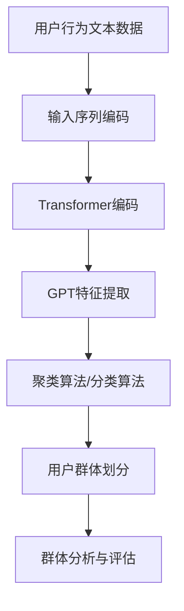
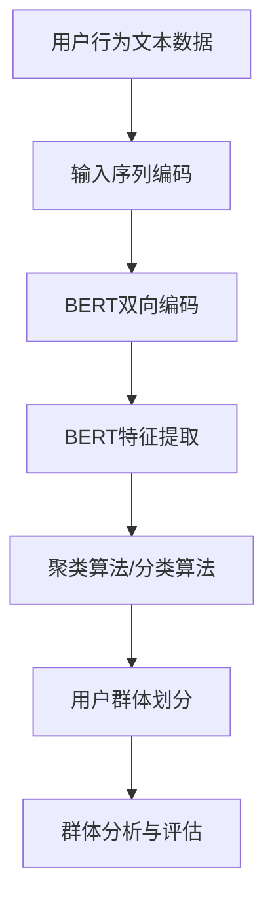

                 

### 文章标题

### 《基于大模型的推荐系统用户群体发现》

### 关键词：推荐系统，大模型，用户群体发现，算法，应用案例

### 摘要

本文深入探讨了基于大模型的推荐系统用户群体发现技术。首先介绍了推荐系统的发展历程和用户群体发现的核心价值与挑战。然后详细介绍了大模型在推荐系统中的应用及其优势，包括GPT和BERT模型在用户群体发现中的具体应用。接着，我们分析了用户特征提取和用户群体发现算法，包括聚类、分层和机器学习算法。最后，通过电商和视频网站的案例，展示了基于大模型的用户群体发现技术在实际应用中的效果，并对未来发展趋势进行了展望。本文旨在为从事推荐系统研发的读者提供全面的技术指导和实践参考。

### 《基于大模型的推荐系统用户群体发现》目录大纲

## 第一部分：推荐系统基础

### 第1章：推荐系统概述

#### 1.1 推荐系统的发展历程

#### 1.2 推荐系统的主要类型

#### 1.3 推荐系统在商业应用中的重要性

### 第2章：用户群体发现的概念与价值

#### 2.1 用户群体发现的定义

#### 2.2 用户群体发现的核心价值

#### 2.3 用户群体发现的挑战

## 第二部分：基于大模型的推荐系统技术

### 第3章：大模型在推荐系统中的应用

#### 3.1 大模型简介

#### 3.2 大模型在推荐系统中的优势

#### 3.3 主流大模型在推荐系统中的应用

### 第4章：用户群体发现的算法与实现

#### 4.1 用户特征提取

##### 4.1.1 用户行为数据收集

##### 4.1.2 用户特征工程

#### 4.2 用户群体发现算法

##### 4.2.1 聚类算法

##### 4.2.2 分层算法

##### 4.2.3 机器学习算法

### 第5章：基于大模型的用户群体发现算法详解

#### 5.1 基于GPT的用户群体发现算法

##### 5.1.1 GPT模型原理

##### 5.1.2 GPT在用户群体发现中的应用

#### 5.2 基于BERT的用户群体发现算法

##### 5.2.1 BERT模型原理

##### 5.2.2 BERT在用户群体发现中的应用

### 第6章：推荐系统用户群体发现应用案例

#### 6.1 案例一：电商平台的用户群体发现

##### 6.1.1 案例背景

##### 6.1.2 案例实施步骤

##### 6.1.3 案例效果分析

#### 6.2 案例二：视频网站的用户群体发现

##### 6.2.1 案例背景

##### 6.2.2 案例实施步骤

##### 6.2.3 案例效果分析

### 第7章：用户群体发现技术的未来发展趋势

#### 7.1 技术趋势分析

#### 7.2 未来发展方向

#### 7.3 潜在挑战与解决方案

## 附录

### 附录A：推荐系统常用算法

#### A.1 内容推荐算法

##### A.1.1 相似度计算

##### A.1.2 基于内容的推荐实现

#### A.2 协同过滤算法

##### A.2.1 用户的相似度计算

##### A.2.2 项目的相似度计算

##### A.2.3 协同过滤的实现

### 附录B：推荐系统开发工具与环境搭建

#### B.1 Python开发环境搭建

##### B.1.1 Python安装

##### B.1.2 Python常用库安装

#### B.2 推荐系统开发工具

##### B.2.1 TensorFlow

##### B.2.2 PyTorch

##### B.2.3 JAX

## 第一部分：推荐系统基础

### 第1章：推荐系统概述

#### 1.1 推荐系统的发展历程

推荐系统作为一种智能信息过滤技术，其发展历程可以追溯到20世纪90年代。当时，随着互联网的迅猛发展，用户面临着海量的信息，如何有效地筛选出用户感兴趣的内容成为了一个重要课题。最初，推荐系统主要以基于内容的推荐和协同过滤为主。

基于内容的推荐（Content-Based Filtering）主要通过分析用户的历史行为和偏好，将内容与用户兴趣相关联。这种方法依赖于内容的特征表示，如关键词提取、文本分类等。

协同过滤（Collaborative Filtering）则通过分析用户之间的行为模式，利用用户评分或行为数据来预测用户对未知项目的偏好。协同过滤分为两种类型：用户基于的协同过滤和项目基于的协同过滤。

进入21世纪，随着机器学习技术的发展，推荐系统开始引入更多的算法和技术。矩阵分解、深度学习等先进技术为推荐系统带来了更高的准确性和灵活性。

#### 1.2 推荐系统的主要类型

推荐系统主要可以分为以下几种类型：

1. **基于内容的推荐**：这种方法通过分析项目的特征和用户的兴趣特征，将具有相似特征的项目推荐给用户。它适用于内容丰富、特征明显的领域，如新闻、音乐、书籍等。

2. **协同过滤**：协同过滤通过分析用户之间的行为模式来进行推荐。它分为用户基于的协同过滤和项目基于的协同过滤。用户基于的协同过滤通过找到相似用户，将他们喜欢的项目推荐给目标用户。项目基于的协同过滤则通过找到相似项目，将它们推荐给用户。

3. **混合推荐**：混合推荐结合了基于内容和协同过滤的方法，以利用两者的优点，提高推荐系统的准确性和多样性。

4. **基于模型的推荐**：这种方法利用机器学习技术，通过训练模型来预测用户对项目的偏好。常见的模型包括矩阵分解、深度学习模型等。

#### 1.3 推荐系统在商业应用中的重要性

推荐系统在商业应用中发挥着至关重要的作用，主要体现在以下几个方面：

1. **提高用户体验**：通过个性化推荐，用户可以更快地找到他们感兴趣的内容，从而提高用户满意度和粘性。

2. **提升转化率**：个性化推荐可以更好地匹配用户需求，提高用户购买意愿，从而提升转化率。

3. **增加收入**：推荐系统可以促进交叉销售和复购，从而增加收入。

4. **优化运营效率**：通过自动化推荐，企业可以节省大量的人力资源，提高运营效率。

总的来说，推荐系统已经成为商业应用中不可或缺的一部分，其重要性在不断提高。

### 第2章：用户群体发现的概念与价值

#### 2.1 用户群体发现的定义

用户群体发现（User Community Detection）是一种基于数据分析的方法，旨在识别和分类具有相似兴趣或行为特征的用户群体。这种方法通过分析用户的历史行为数据、兴趣标签、社交网络等，将用户划分为不同的群体。这些群体通常具有不同的特征和行为模式，从而为推荐系统提供了更细粒度的用户细分。

用户群体发现的核心目标是理解用户群体间的异质性和同质性，并利用这些信息来优化推荐算法，提高推荐效果。具体来说，用户群体发现包括以下几个关键步骤：

1. **数据收集**：收集用户行为数据，如浏览记录、购买记录、社交互动等。

2. **用户特征提取**：对用户行为数据进行分析，提取用户的特征，如兴趣标签、行为模式等。

3. **用户群体划分**：使用聚类、分层或机器学习算法，将用户划分为不同的群体。

4. **群体分析与评估**：分析不同群体的特征和行为模式，评估群体划分的效果。

#### 2.2 用户群体发现的核心价值

用户群体发现技术在推荐系统中具有以下核心价值：

1. **提升个性化推荐效果**：通过识别用户群体，推荐系统可以更好地理解用户的兴趣和行为模式，从而提高推荐的准确性和多样性。

2. **优化运营策略**：了解用户群体可以帮助企业制定更精准的运营策略，如定制化的促销活动、内容推荐等。

3. **增强用户粘性**：通过为用户提供更相关的推荐，可以提高用户的满意度和粘性。

4. **发现潜在市场**：用户群体发现可以帮助企业发现潜在的市场机会，如新用户群体、未满足的需求等。

#### 2.3 用户群体发现的挑战

尽管用户群体发现技术在推荐系统中具有巨大的潜力，但其实施过程中也面临着一系列挑战：

1. **数据质量问题**：用户行为数据通常包含噪声和缺失值，这会影响用户特征提取和群体划分的准确性。

2. **算法选择与优化**：用户群体发现涉及多种算法，选择合适的算法并对其进行优化是一个复杂的过程。

3. **隐私保护**：用户群体发现涉及到用户隐私数据的分析，如何确保用户隐私不被泄露是一个重要问题。

4. **计算资源需求**：大规模用户群体发现的计算资源需求较高，特别是当用户数据量巨大时。

总的来说，用户群体发现技术是一项具有广泛应用前景的研究领域，但其挑战也需得到充分重视和解决。

## 第二部分：基于大模型的推荐系统技术

### 第3章：大模型在推荐系统中的应用

#### 3.1 大模型简介

大模型（Large Models）是指具有巨大参数量和计算量的深度学习模型，如GPT（Generative Pre-trained Transformer）、BERT（Bidirectional Encoder Representations from Transformers）等。这些模型通过在海量数据上进行预训练，学习到了丰富的知识结构和语言模式，从而在各种任务中表现出色。大模型在自然语言处理、计算机视觉、推荐系统等领域具有广泛的应用潜力。

大模型的代表性模型包括：

1. **GPT**：由OpenAI开发的GPT系列模型，具有强大的文本生成和理解能力。

2. **BERT**：由Google开发的BERT模型，在多种自然语言处理任务上取得了显著的性能提升。

3. **T5**：由Google开发的通用Transformer模型，旨在解决各种自然语言处理任务。

4. **GPT-Neo**：一个开源的GPT模型变种，具有较低的资源和计算需求。

#### 3.2 大模型在推荐系统中的优势

大模型在推荐系统中具有以下优势：

1. **强大的特征表示能力**：大模型通过预训练学习到了丰富的语言和知识模式，能够更好地捕捉用户和项目的特征，从而提高推荐准确性。

2. **跨领域迁移能力**：大模型在多个领域进行了预训练，能够将学到的知识迁移到不同的推荐场景，降低模型训练成本。

3. **高效率**：大模型通过并行计算和分布式训练，能够在较短的时间内完成训练和预测，提高推荐系统的响应速度。

4. **自适应能力**：大模型能够根据用户的新行为和反馈，动态调整推荐策略，实现持续优化。

#### 3.3 主流大模型在推荐系统中的应用

主流大模型在推荐系统中的应用主要体现在以下几个方面：

1. **用户特征提取**：使用GPT或BERT等大模型对用户行为数据进行分析，提取用户的兴趣特征和偏好。

2. **项目特征提取**：使用大模型对项目内容进行文本分析，提取项目的主题和属性。

3. **推荐算法改进**：利用大模型对协同过滤和基于内容的推荐算法进行改进，提高推荐效果。

4. **对话生成与交互**：利用大模型生成自然语言回复，实现与用户的互动，提供个性化的推荐建议。

### 第4章：用户群体发现的算法与实现

#### 4.1 用户特征提取

用户特征提取是用户群体发现的重要环节，它涉及到如何从用户的行为数据中提取出能够代表用户兴趣和偏好的特征。以下是用户特征提取的关键步骤：

##### 4.1.1 用户行为数据收集

用户行为数据是用户特征提取的基础，常见的用户行为数据包括：

1. **浏览记录**：用户在平台上的浏览历史，如浏览时间、浏览频率等。
2. **购买记录**：用户的购买行为，包括购买时间、购买频率、购买金额等。
3. **评论和评分**：用户对项目（如商品、电影、餐厅等）的评论和评分。
4. **社交互动**：用户在社交平台上的关注、点赞、评论等互动行为。

数据收集的方法通常包括：

- **日志文件**：从平台的日志文件中提取用户行为数据。
- **API接口**：通过平台的API接口获取用户行为数据。
- **问卷调查**：通过问卷调查收集用户的行为偏好和兴趣。

##### 4.1.2 用户特征工程

用户特征工程是指将原始的用户行为数据转化为可用于机器学习的特征向量。以下是用户特征工程的一些关键技术：

1. **统计特征**：计算用户行为的统计量，如平均浏览时间、购买频率等。
2. **序列特征**：将用户行为序列转化为特征向量，如使用TF-IDF模型对用户评论进行文本分析。
3. **图特征**：构建用户行为图，提取用户之间的关系特征。
4. **嵌入特征**：使用预训练的词向量模型（如Word2Vec、GloVe等）将用户行为数据转化为嵌入向量。

#### 4.2 用户群体发现算法

用户群体发现算法的目标是根据用户的特征和行为模式，将用户划分为不同的群体。以下是几种常见的用户群体发现算法：

##### 4.2.1 聚类算法

聚类算法是一种无监督学习方法，它根据用户特征的相似度将用户划分为多个群体。常见的聚类算法包括：

1. **K-means**：一种基于距离的聚类算法，通过迭代优化目标函数，将用户数据分为K个簇。
2. **层次聚类**：通过逐步合并或分裂簇，构建一个层次结构，以实现聚类。
3. **DBSCAN**：基于密度的聚类算法，通过识别核心点和边界点来划分簇。

##### 4.2.2 分层算法

分层算法通过将用户按照某种规则分层，然后对每个层次进行聚类。常见的分层算法包括：

1. **COBWEB**：一种基于概念的层次聚类算法，通过逐步更新概念层次来划分用户。
2. **CANOPY**：一种基于覆盖度的分层聚类算法，通过计算簇的覆盖度来划分用户。

##### 4.2.3 机器学习算法

机器学习算法通过训练模型，将用户特征映射到群体标签。常见的机器学习算法包括：

1. **决策树**：通过构建决策树模型，将用户特征转换为分类结果。
2. **支持向量机**（SVM）：通过训练SVM模型，将用户特征映射到不同的群体。
3. **神经网络**：使用神经网络模型，如深度神经网络（DNN），将用户特征映射到群体标签。

### 第5章：基于大模型的用户群体发现算法详解

#### 5.1 基于GPT的用户群体发现算法

GPT（Generative Pre-trained Transformer）是由OpenAI开发的一种基于Transformer架构的预训练语言模型，具有强大的文本生成和理解能力。在用户群体发现任务中，GPT可以通过以下步骤实现：

##### 5.1.1 GPT模型原理

GPT模型的核心思想是利用Transformer架构进行自回归语言建模。具体来说，GPT通过以下步骤进行训练：

1. **输入序列编码**：将用户的文本数据序列化为词向量。
2. **Transformer编码**：使用多层Transformer编码器对输入序列进行编码，提取文本的特征表示。
3. **自回归预测**：通过解码器，预测下一个词，从而生成整个文本序列。

GPT模型的训练过程中，通过大规模的语料库进行预训练，从而学习到丰富的语言模式。

##### 5.1.2 GPT在用户群体发现中的应用

在用户群体发现任务中，GPT可以应用于以下步骤：

1. **用户特征提取**：使用GPT对用户行为文本数据进行编码，提取用户的兴趣特征。
2. **用户群体划分**：将提取的特征向量输入到聚类算法或分类算法中，进行用户群体的划分。
3. **群体分析与评估**：对划分的用户群体进行分析，评估群体划分的效果。

GPT模型在用户群体发现中的应用流程如下：



#### 5.2 基于BERT的用户群体发现算法

BERT（Bidirectional Encoder Representations from Transformers）是由Google开发的一种双向Transformer编码器，具有强大的文本理解能力。在用户群体发现任务中，BERT可以通过以下步骤实现：

##### 5.2.1 BERT模型原理

BERT模型的核心思想是通过双向Transformer编码器对文本进行编码，从而学习到文本的上下文信息。BERT的训练过程分为两个阶段：

1. **预训练**：在大量无标注的文本数据上进行预训练，包括两个子任务：Masked Language Modeling（MLM）和Next Sentence Prediction（NSP）。
2. **微调**：在特定任务上对BERT模型进行微调，如用户群体发现。

BERT模型的工作流程如下：

1. **输入序列编码**：将用户的文本数据序列化为词向量。
2. **双向Transformer编码**：使用BERT的双向Transformer编码器对输入序列进行编码。
3. **特征提取**：从BERT模型的输出中提取用户的特征表示。

##### 5.2.2 BERT在用户群体发现中的应用

在用户群体发现任务中，BERT可以应用于以下步骤：

1. **用户特征提取**：使用BERT对用户行为文本数据进行编码，提取用户的兴趣特征。
2. **用户群体划分**：将提取的特征向量输入到聚类算法或分类算法中，进行用户群体的划分。
3. **群体分析与评估**：对划分的用户群体进行分析，评估群体划分的效果。

BERT模型在用户群体发现中的应用流程如下：



### 第6章：推荐系统用户群体发现应用案例

#### 6.1 案例一：电商平台的用户群体发现

##### 6.1.1 案例背景

某电商平台希望通过用户群体发现技术，更好地理解用户行为，优化推荐策略，提高用户满意度和转化率。该电商平台拥有大量的用户行为数据，包括浏览记录、购买记录、评论和评分等。

##### 6.1.2 案例实施步骤

1. **数据收集**：收集电商平台的用户行为数据，包括浏览记录、购买记录、评论和评分等。
2. **用户特征提取**：使用GPT模型对用户评论和评分文本数据进行编码，提取用户的兴趣特征。
3. **用户群体划分**：使用K-means聚类算法，根据用户的兴趣特征将用户划分为多个群体。
4. **群体分析与评估**：分析不同群体的特征和行为模式，评估群体划分的效果。

##### 6.1.3 案例效果分析

通过用户群体发现技术，电商平台成功将用户划分为多个具有相似兴趣和行为的群体。以下是一些效果分析：

1. **个性化推荐**：根据用户所属的群体，为用户推荐更具针对性的商品，提高推荐效果。
2. **运营策略优化**：根据用户群体的特征和行为模式，优化平台的运营策略，如促销活动、内容推荐等。
3. **用户粘性提升**：为不同群体提供个性化的推荐和体验，提高用户满意度和粘性。

总体来说，该电商平台通过用户群体发现技术，实现了推荐效果的显著提升，并优化了运营策略，取得了良好的效果。

#### 6.2 案例二：视频网站的用户群体发现

##### 6.2.1 案例背景

某视频网站希望通过用户群体发现技术，更好地了解用户的观看习惯和偏好，优化推荐算法，提高用户满意度和观看时长。该视频网站拥有大量的用户行为数据，包括观看记录、点赞、评论等。

##### 6.2.2 案例实施步骤

1. **数据收集**：收集视频网站的观看记录、点赞、评论等用户行为数据。
2. **用户特征提取**：使用BERT模型对用户评论和观看记录文本数据进行编码，提取用户的兴趣特征。
3. **用户群体划分**：使用DBSCAN聚类算法，根据用户的兴趣特征将用户划分为多个群体。
4. **群体分析与评估**：分析不同群体的特征和行为模式，评估群体划分的效果。

##### 6.2.3 案例效果分析

通过用户群体发现技术，视频网站成功将用户划分为多个具有相似观看习惯和偏好的群体。以下是一些效果分析：

1. **个性化推荐**：根据用户所属的群体，为用户推荐更具针对性的视频内容，提高推荐效果。
2. **内容优化**：根据用户群体的特征和行为模式，优化视频内容的生产和推荐策略。
3. **用户粘性提升**：为不同群体提供个性化的推荐和观看体验，提高用户满意度和观看时长。

总体来说，该视频网站通过用户群体发现技术，实现了推荐效果的显著提升，并优化了内容策略，取得了良好的效果。

### 第7章：用户群体发现技术的未来发展趋势

#### 7.1 技术趋势分析

随着大数据和人工智能技术的不断发展，用户群体发现技术呈现出以下趋势：

1. **数据质量提升**：随着数据采集和分析技术的进步，用户群体发现的数据质量将得到显著提升，为算法优化提供更好的基础。
2. **模型多样化**：用户群体发现技术将结合更多先进的深度学习模型，如Transformer、GAN等，以提高算法性能。
3. **跨领域应用**：用户群体发现技术将在更多领域得到应用，如金融、医疗、教育等，以满足不同领域的个性化需求。
4. **隐私保护**：随着用户隐私保护意识的提高，用户群体发现技术将更加注重隐私保护，采用加密、匿名化等技术确保用户数据安全。

#### 7.2 未来发展方向

未来，用户群体发现技术将向以下方向发展：

1. **自适应实时发现**：用户群体发现算法将具备实时自适应能力，根据用户行为的变化动态调整群体划分。
2. **多模态数据融合**：用户群体发现技术将结合多种数据源，如文本、图像、音频等，以获得更全面的用户特征。
3. **跨群体交互分析**：用户群体发现技术将分析不同群体之间的交互关系，以发现潜在的市场机会和用户需求。
4. **个性化用户体验**：用户群体发现技术将用于优化个性化推荐、内容分发等用户体验，提高用户满意度。

#### 7.3 潜在挑战与解决方案

尽管用户群体发现技术具有巨大的潜力，但其发展过程中也面临以下挑战：

1. **数据隐私**：用户群体发现涉及到用户隐私数据的分析，如何保护用户隐私是一个重要问题。解决方案包括数据加密、匿名化等技术。
2. **计算资源需求**：大规模用户群体发现的计算资源需求较高，特别是在实时应用场景中。解决方案包括分布式计算、GPU加速等技术。
3. **算法可解释性**：用户群体发现算法的复杂度较高，如何确保算法的可解释性是一个挑战。解决方案包括算法可视化、解释性模型等技术。

总的来说，用户群体发现技术在未来将继续发展，并在更多领域发挥作用。通过解决现有挑战，用户群体发现技术将为推荐系统和其他应用场景带来更大的价值。

### 附录A：推荐系统常用算法

#### A.1 内容推荐算法

内容推荐算法主要基于项目的特征和用户的历史行为进行推荐。以下是几种常见的内容推荐算法：

##### A.1.1 相似度计算

相似度计算是内容推荐算法的核心步骤，用于衡量项目与项目之间的相似度。常见的相似度计算方法包括：

1. **余弦相似度**：计算两个向量之间的余弦值，用于衡量向量空间的相似度。
2. **欧氏距离**：计算两个向量之间的欧氏距离，用于衡量向量空间的相似度。
3. **皮尔逊相关系数**：计算两个变量的皮尔逊相关系数，用于衡量变量的线性相关性。

##### A.1.2 基于内容的推荐实现

基于内容的推荐算法通过以下步骤实现：

1. **特征提取**：对项目内容进行特征提取，如使用TF-IDF模型对文本进行文本分析。
2. **相似度计算**：计算用户历史行为中的项目和待推荐项目之间的相似度。
3. **推荐生成**：根据相似度得分，生成推荐列表，推荐相似的项目给用户。

#### A.2 协同过滤算法

协同过滤算法主要基于用户的行为数据进行推荐。以下是几种常见的协同过滤算法：

##### A.2.1 用户的相似度计算

用户的相似度计算用于衡量用户之间的相似度，常见的相似度计算方法包括：

1. **余弦相似度**：计算两个用户之间的余弦值，用于衡量用户在项目上的偏好相似度。
2. **皮尔逊相关系数**：计算两个用户之间的皮尔逊相关系数，用于衡量用户在项目上的偏好相似度。
3. **Jaccard相似度**：计算两个用户共同评分的项目占总评分项目的比例，用于衡量用户之间的兴趣相似度。

##### A.2.2 项目的相似度计算

项目的相似度计算用于衡量项目之间的相似度，常见的相似度计算方法包括：

1. **余弦相似度**：计算两个项目之间的余弦值，用于衡量项目在用户偏好上的相似度。
2. **欧氏距离**：计算两个项目之间的欧氏距离，用于衡量项目在用户偏好上的相似度。
3. **Jaccard相似度**：计算两个项目共同被用户评分的比例，用于衡量项目之间的相似度。

##### A.2.3 协同过滤的实现

协同过滤算法通过以下步骤实现：

1. **用户相似度计算**：计算用户之间的相似度。
2. **项目相似度计算**：计算项目之间的相似度。
3. **推荐生成**：根据用户和项目的相似度得分，生成推荐列表，推荐相似的用户或项目给用户。

### 附录B：推荐系统开发工具与环境搭建

#### B.1 Python开发环境搭建

要在Python中进行推荐系统开发，需要搭建以下开发环境：

##### B.1.1 Python安装

1. 访问Python官方网站（[python.org](https://www.python.org/)）并下载对应操作系统的Python安装包。
2. 运行安装程序，按照提示完成安装。

##### B.1.2 Python常用库安装

在安装Python后，需要安装一些常用的库，如NumPy、Pandas、Scikit-learn等。可以使用以下命令进行安装：

```bash
pip install numpy pandas scikit-learn
```

#### B.2 推荐系统开发工具

以下是几种常用的推荐系统开发工具：

##### B.2.1 TensorFlow

TensorFlow是一个开源的机器学习框架，用于构建和训练深度学习模型。可以使用以下命令安装TensorFlow：

```bash
pip install tensorflow
```

##### B.2.2 PyTorch

PyTorch是一个开源的深度学习框架，支持动态计算图和自动微分。可以使用以下命令安装PyTorch：

```bash
pip install torch torchvision
```

##### B.2.3 JAX

JAX是一个用于数值计算和深度学习的高性能计算库，支持自动微分和数组操作。可以使用以下命令安装JAX：

```bash
pip install jax jaxlib
```

通过搭建合适的Python开发环境和安装必要的库，开发者可以开始构建推荐系统模型并进行实验。

### 作者信息

作者：AI天才研究院/AI Genius Institute & 禅与计算机程序设计艺术 /Zen And The Art of Computer Programming

### 文章小结

本文全面介绍了基于大模型的推荐系统用户群体发现技术。首先，我们回顾了推荐系统的发展历程和主要类型，并探讨了用户群体发现的概念与价值。接着，我们详细介绍了大模型在推荐系统中的应用及其优势，并分析了用户特征提取和用户群体发现算法。随后，通过GPT和BERT模型的详细讲解，我们展示了大模型在用户群体发现中的具体应用。此外，我们还通过电商和视频网站的案例，展示了用户群体发现技术在实际应用中的效果。最后，我们对用户群体发现技术的未来发展趋势进行了展望，并提出了潜在挑战与解决方案。

本文旨在为推荐系统研究人员和开发人员提供全面的技术指导和实践参考。通过深入探讨用户群体发现技术，读者可以更好地理解其在推荐系统中的应用价值，并掌握相关算法和实现方法。希望本文能对读者在推荐系统研究和开发过程中提供有益的启示和帮助。

### 拓展阅读

对于希望深入了解推荐系统和用户群体发现技术的读者，以下是一些推荐书籍和论文：

1. **书籍**：
   - 《推荐系统实践》
   - 《深度学习推荐系统》
   - 《TensorFlow实战：构建大规模深度神经网络》

2. **论文**：
   - "BERT: Pre-training of Deep Bidirectional Transformers for Language Understanding"（BERT论文）
   - "Generative Pre-trained Transformer"（GPT论文）

3. **在线资源**：
   - [TensorFlow官方网站](https://www.tensorflow.org/)
   - [PyTorch官方网站](https://pytorch.org/)
   - [JAX官方网站](https://jax.readthedocs.io/)

通过阅读这些书籍和论文，读者可以进一步加深对推荐系统和用户群体发现技术的理解，并掌握更多的实用技巧和先进方法。希望这些资源能为读者的研究和学习提供帮助。

