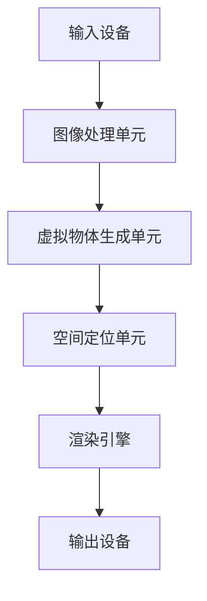

                 

### 文章标题：增强现实创业：融合虚实的商业新机遇

### 关键词：增强现实（AR），商业应用，创业机遇，技术趋势，市场分析，项目规划

### 摘要：
本文旨在探讨增强现实（AR）技术在商业领域的创业机遇。通过详细分析AR技术的基础、应用案例、创业环境和成功策略，本文为有意从事AR创业的企业和开发者提供了全方位的指导。文章首先介绍了AR技术的定义、特点和核心原理，随后展示了AR在零售、教育、医疗等多个领域的应用实例，并深入探讨了AR创业的市场环境、项目规划和实战经验。最后，本文对AR技术的未来发展趋势和挑战进行了展望，为创业者提供了宝贵的参考。

---

### 第一部分：增强现实技术基础

#### 第1章：增强现实技术概述

**1.1 增强现实技术的定义与特点**

增强现实（Augmented Reality，简称AR）是一种通过计算机技术将虚拟信息叠加到现实场景中的技术。它通过在用户的视线中实时显示计算机生成的图像、文本、声音等多媒体信息，使用户能够同时感知现实世界和虚拟世界。

### 1.1.1 从虚拟现实到增强现实

虚拟现实（Virtual Reality，VR）和增强现实（AR）都是虚拟技术的分支。VR旨在创建一个完全虚拟的环境，让用户感觉置身其中。而AR则是在现实世界中叠加虚拟元素，使现实世界更加丰富和有趣。

#### 1.1.2 增强现实技术的基本原理

增强现实技术主要依赖于以下几个核心原理：

- **图像处理与识别技术**：通过摄像头捕捉现实世界的图像，并通过图像处理算法进行识别和标记。
- **虚拟物体叠加技术**：将虚拟物体叠加到识别后的图像上，使其与现实场景融合。
- **空间感知与定位技术**：通过定位算法确定虚拟物体在现实世界中的位置，实现精准叠加。

#### 1.1.3 增强现实技术的分类

根据应用场景和实现方式，增强现实技术可以分为以下几类：

- **标记增强现实**：通过标记物（如二维码、标签等）进行图像识别和虚拟物体叠加。
- **自然增强现实**：不依赖标记物，通过环境特征进行图像识别和虚拟物体叠加。
- **混合增强现实**：结合标记增强现实和自然增强现实，提供更加丰富的交互体验。

**1.2 增强现实技术的历史与发展**

增强现实技术起源于20世纪60年代，最初应用于军事和航空航天领域。随着计算机技术和传感器技术的不断发展，AR技术逐渐向民用领域扩展。

### 1.2.1 增强现实技术的起源

增强现实技术的概念最早由美国科学家图灵（Alan Turing）提出。他在1950年代提出了虚拟现实和增强现实的基本思想，并将其应用于飞行模拟系统。

### 1.2.2 增强现实技术的发展历程

从20世纪60年代到21世纪初，增强现实技术经历了多个发展阶段：

- **早期探索阶段**（1960s-1970s）：计算机图形学和光学技术的结合，初步实现了虚拟物体叠加。
- **技术成熟阶段**（1980s-1990s）：计算机处理能力和传感器技术得到提升，AR设备逐渐应用于医疗、教育等领域。
- **商业应用阶段**（2000s至今）：智能手机和移动设备的普及，推动了AR技术的广泛应用，如AR游戏、AR导航等。

### 1.2.3 当前增强现实技术的成熟度

当前，增强现实技术已经相对成熟，各类AR应用层出不穷。然而，仍有许多挑战需要克服，如算法优化、硬件性能提升、用户体验优化等。

**1.3 增强现实技术的核心原理**

增强现实技术的核心原理主要涉及以下几个方面：

- **图像处理与识别技术**：通过图像处理算法对现实场景的图像进行预处理，如降噪、去模糊等。然后使用识别算法（如卷积神经网络）对图像中的目标进行检测和识别。

- **虚拟物体叠加技术**：将虚拟物体叠加到识别后的图像上。这通常涉及到计算机图形学技术，如3D建模、纹理映射等。

- **空间感知与定位技术**：通过传感器（如摄像头、GPS、陀螺仪等）获取现实场景中的位置和姿态信息。然后使用定位算法（如SLAM算法）确定虚拟物体在现实世界中的位置。

**1.3.1 图像处理与识别技术**

图像处理与识别技术是增强现实技术的基石。其主要目标是对现实场景中的图像进行预处理和目标识别。以下是一个简单的图像处理与识别的伪代码：

```python
# 伪代码：图像处理与识别

# 输入：原始图像
# 输出：处理后的图像和识别结果

# 步骤1：图像预处理
预处理图像 = 降噪(原始图像)
预处理图像 = 去模糊(预处理图像)

# 步骤2：目标检测
目标检测器 = 加载模型()
目标位置 = 目标检测器(预处理图像)

# 步骤3：目标识别
识别结果 = 加载模型()
识别类别 = 识别结果(目标位置)

# 步骤4：图像叠加
叠加后的图像 = 图像叠加(预处理图像，虚拟物体，目标位置)
```

**1.3.2 虚拟物体叠加技术**

虚拟物体叠加技术是将虚拟物体与现实场景融合的关键。其主要步骤如下：

- **3D建模**：创建虚拟物体的3D模型。
- **纹理映射**：为虚拟物体赋予纹理，使其更加逼真。
- **图像叠加**：将虚拟物体叠加到识别后的图像上。

以下是一个简单的虚拟物体叠加的伪代码：

```python
# 伪代码：虚拟物体叠加

# 输入：识别后的图像，虚拟物体模型，目标位置
# 输出：叠加后的图像

# 步骤1：加载虚拟物体模型
虚拟物体 = 加载模型()

# 步骤2：为虚拟物体添加纹理
虚拟物体纹理 = 加载纹理()

# 步骤3：定位虚拟物体
目标位置 = 获取()

# 步骤4：图像叠加
叠加后的图像 = 图像叠加(识别后的图像，虚拟物体，虚拟物体纹理，目标位置)
```

**1.3.3 空间感知与定位技术**

空间感知与定位技术是确保虚拟物体正确叠加到现实场景中的关键。其主要步骤如下：

- **传感器数据采集**：使用摄像头、GPS、陀螺仪等传感器采集现实场景中的位置和姿态信息。
- **定位算法**：使用定位算法（如SLAM算法）处理传感器数据，确定虚拟物体在现实世界中的位置。

以下是一个简单的空间感知与定位的伪代码：

```python
# 伪代码：空间感知与定位

# 输入：传感器数据
# 输出：虚拟物体位置

# 步骤1：采集传感器数据
传感器数据 = 采集()

# 步骤2：预处理传感器数据
预处理传感器数据 = 预处理(传感器数据)

# 步骤3：定位算法
定位结果 = 定位算法(预处理传感器数据)

# 步骤4：获取虚拟物体位置
虚拟物体位置 = 定位结果()
```

通过以上三个核心原理，增强现实技术能够将虚拟信息无缝地叠加到现实场景中，为用户带来全新的体验。在下一章中，我们将进一步探讨增强现实技术的架构和实现细节。

---

**1.4 增强现实技术的核心原理**

增强现实技术的核心原理主要包括以下几个方面：

1. **图像识别与追踪**：通过摄像头捕获现实世界的图像，并利用计算机视觉算法对图像进行识别和追踪。这一步骤是增强现实技术的基础，它能够确定现实世界中的特定物体或位置。

2. **虚拟物体生成**：在图像识别与追踪的基础上，根据应用需求生成虚拟物体。这些虚拟物体可以是文字、图形、动画或其他多媒体内容，它们将被叠加到现实世界的图像上。

3. **空间定位与映射**：通过传感器（如摄像头、GPS、加速度计等）获取用户所在环境的空间信息，然后将虚拟物体映射到正确的位置。空间定位的精度直接影响增强现实体验的逼真度。

4. **实时渲染与显示**：将生成的虚拟物体和空间信息实时渲染到用户眼前的屏幕上。这通常涉及到复杂的图形渲染算法和高效的显示技术。

5. **用户交互**：增强现实技术还涉及到用户与虚拟世界之间的交互，如手势识别、语音控制等。这些交互方式增强了用户的沉浸感和互动性。

通过上述核心原理，增强现实技术能够实现虚拟世界与现实世界的无缝融合，为用户提供丰富多样的应用体验。

### 1.5 增强现实技术架构

增强现实技术的实现通常涉及多个硬件和软件组件的协同工作。以下是一个典型的增强现实技术架构，包括其主要组件和相互关系：

1. **输入设备**：包括摄像头、传感器等，用于捕捉用户周围的环境信息。
2. **图像处理单元**：对输入的图像进行预处理、识别和追踪，生成虚拟物体。
3. **虚拟物体生成单元**：根据应用需求生成虚拟物体，包括3D模型、纹理等。
4. **空间定位单元**：利用传感器数据计算用户位置和姿态，确保虚拟物体正确映射到现实世界。
5. **渲染引擎**：将虚拟物体和现实世界图像进行实时渲染，生成最终的增强现实画面。
6. **输出设备**：包括显示器、投影仪等，用于将增强现实画面呈现给用户。

以下是增强现实技术架构的Mermaid流程图：



通过上述架构，增强现实技术能够将虚拟信息无缝地叠加到现实场景中，为用户提供丰富多样的应用体验。

---

#### 第2章：增强现实技术架构

**2.1 增强现实硬件设备**

增强现实（AR）技术的实现离不开各种硬件设备，这些设备是获取和处理现实世界信息的基础。以下将详细探讨AR技术中常用的几种硬件设备：

**2.1.1 AR眼镜与头戴设备**

AR眼镜和头戴设备是增强现实体验中最常用的硬件设备之一。这些设备通常配备有高分辨率摄像头、高精度传感器和显示屏，能够将虚拟信息以视觉方式叠加到用户的视野中。

- **典型设备**：Google Glass、Microsoft HoloLens、Magic Leap等。
- **功能特点**：
  - **高分辨率显示**：提供清晰的视觉体验。
  - **实时图像处理**：摄像头捕捉现实图像，并通过图像处理算法进行识别和追踪。
  - **传感器融合**：集成多种传感器（如陀螺仪、加速度计、环境光传感器等），实现空间定位和姿态感知。
  - **交互方式**：支持手势识别、语音控制等交互方式，增强用户体验。

**2.1.2 AR屏幕与投影设备**

AR屏幕和投影设备通常用于将增强现实内容显示在较大的表面上，如会议室内的大型屏幕或墙面。这些设备通过投影或显示技术将虚拟信息与现实场景融合。

- **典型设备**：AR投影仪、大屏幕显示器、交互式墙面等。
- **功能特点**：
  - **大画面显示**：适合多人互动和展示。
  - **高亮度与对比度**：保证在强光环境下仍能清晰显示。
  - **交互性**：支持多点触控、手势识别等交互方式。
  - **内容扩展性**：支持多种格式的增强现实内容，如3D模型、动画、视频等。

**2.1.3 感应设备与技术**

增强现实应用中，传感器和感应技术发挥着至关重要的作用。这些设备能够捕捉用户和环境的信息，为增强现实体验提供精确的数据支持。

- **典型设备**：摄像头、GPS模块、加速度计、陀螺仪、环境光传感器等。
- **功能特点**：
  - **高精度定位**：摄像头和GPS模块用于捕捉用户位置和环境信息，实现精准的空间定位。
  - **姿态感知**：加速度计和陀螺仪用于检测用户的姿态变化，为虚拟物体叠加提供参考。
  - **环境感知**：环境光传感器等设备用于监测环境光照条件，调整屏幕亮度等。

**2.1.4 模块化硬件平台**

随着增强现实技术的发展，模块化硬件平台逐渐成为趋势。这些平台允许开发者根据具体需求选择和组合不同模块，灵活构建增强现实应用。

- **典型平台**：Raspberry Pi、BeagleBone Black等。
- **功能特点**：
  - **可扩展性**：通过插入不同模块，扩展硬件功能。
  - **低成本**：适合初创企业和爱好者。
  - **易于开发**：提供丰富的开发资源和工具。

通过以上硬件设备的组合，开发者可以构建出各种形态的增强现实应用，满足不同场景和需求。

**2.2 增强现实软件平台**

增强现实软件平台是开发者构建AR应用的基础，提供了丰富的工具和框架，简化了开发过程。以下将介绍几种流行的AR软件平台：

**2.2.1 AR开发工具与框架**

AR开发工具和框架为开发者提供了便捷的编程接口和功能模块，使得AR应用的开发变得更加高效和灵活。

- **Unity ARKit**：Unity ARKit 是Unity游戏引擎的AR开发套件，提供了丰富的3D图形和物理引擎功能，适合开发高质量AR应用。
- **Unreal Engine ARCore**：Unreal Engine 是一款强大的游戏开发引擎，ARCore为其提供了AR开发工具和功能，适用于开发复杂、逼真的AR场景。
- **Vuforia**：Vuforia 是一款广泛使用的AR开发平台，提供了强大的图像识别和追踪功能，适合构建基于标记的AR应用。

**2.2.2 AR内容创作工具**

AR内容创作工具帮助非专业开发者轻松创建AR内容，降低了AR应用的创作门槛。

- **Adobe Aero**：Adobe Aero 是一款面向设计者和创作者的AR内容创作工具，提供了直观的界面和丰富的创作资源。
- **Meta Quest Studio**：Meta Quest Studio 是一款为Quest VR头戴设备定制的AR内容创作工具，支持3D建模、动画制作等功能。

通过以上软件平台的结合，开发者可以快速构建出功能丰富、用户体验出色的AR应用。

**2.3 增强现实内容创作工具**

增强现实（AR）内容创作工具为开发者提供了创建和编辑AR内容的便捷方式。以下将介绍几种流行的AR内容创作工具：

**2.3.1 Unity ARKit**

Unity ARKit 是Unity游戏引擎的AR开发套件，它提供了丰富的3D图形和物理引擎功能，使得开发者能够高效地创建高质量的AR应用。

- **主要特点**：
  - **强大的3D图形引擎**：支持复杂的3D建模、动画和视觉效果。
  - **丰富的编程接口**：提供了丰富的API和插件，方便开发者自定义功能。
  - **跨平台支持**：支持iOS和Android平台，便于应用分发。

**2.3.2 Unreal Engine ARCore**

Unreal Engine 是一款强大的游戏开发引擎，ARCore 为其提供了AR开发工具和功能，适用于开发复杂、逼真的AR场景。

- **主要特点**：
  - **高质量的渲染效果**：支持逼真的光影效果和物理模拟，提供沉浸式的AR体验。
  - **高效的渲染性能**：利用Unreal Engine的高性能渲染引擎，实现流畅的AR互动体验。
  - **多样化的AR功能**：支持SLAM、环境映射、手势识别等高级功能。

**2.3.3 Adobe Aero**

Adobe Aero 是一款面向设计者和创作者的AR内容创作工具，它提供了直观的界面和丰富的创作资源。

- **主要特点**：
  - **直观的用户界面**：通过拖放和可视化编辑，轻松创建AR内容。
  - **丰富的素材库**：提供了大量的AR素材、图标、动画等，方便开发者快速构建内容。
  - **跨平台兼容性**：支持iOS和Android平台，便于应用分发。

**2.3.4 Meta Quest Studio**

Meta Quest Studio 是一款为Quest VR头戴设备定制的AR内容创作工具，它支持3D建模、动画制作等功能。

- **主要特点**：
  - **3D建模和动画**：提供了强大的3D建模和动画工具，便于创建复杂的AR场景。
  - **实时预览**：支持实时预览和交互，方便开发者快速调整和优化内容。
  - **专业工具集**：集成了多种专业工具，如UV贴图、材质编辑等，满足高级开发需求。

通过以上AR内容创作工具，开发者可以更加便捷地创作出丰富多彩的增强现实内容，为用户提供独特的互动体验。

---

### 第二部分：增强现实应用案例

#### 第3章：零售与营销中的增强现实应用

增强现实（AR）技术在零售和营销领域展现出巨大的潜力，它不仅能够提升消费者的购物体验，还能够为企业带来创新的营销手段。以下将详细探讨AR技术在零售与营销中的应用案例。

**3.1 增强现实在零售体验中的应用**

增强现实技术为零售行业带来了全新的购物体验，使消费者能够在虚拟与现实之间无缝切换。

**3.1.1 虚拟试衣与虚拟陈列**

虚拟试衣是AR技术在零售领域中最受欢迎的应用之一。通过AR技术，消费者可以在不试穿的情况下，虚拟试穿衣服、鞋子等商品。这不仅节省了时间，还能够减少试衣间的拥挤和卫生问题。

- **技术实现**：
  - **图像识别与追踪**：摄像头捕捉消费者身体图像，并通过图像处理算法进行识别和追踪。
  - **虚拟物体叠加**：将虚拟的衣物模型叠加到消费者身体图像上，实现虚拟试衣效果。
  - **用户交互**：支持手势控制和语音命令，提升用户体验。

- **案例**：H&M 和 IKEA 等零售巨头已经推出了基于AR技术的虚拟试衣功能，消费者可以通过手机或平板电脑进行虚拟试衣。

**3.1.2 商品信息增强与个性化推荐**

AR技术还可以为商品提供丰富的信息增强，使消费者在购买前更好地了解商品特点。例如，消费者可以通过AR技术查看商品的详细规格、用户评价、使用教程等。

- **技术实现**：
  - **图像识别与信息叠加**：摄像头捕捉商品图像，并在识别后叠加相关商品信息。
  - **个性化推荐**：基于消费者的历史购买记录和偏好，提供个性化的商品推荐。

- **案例**：亚马逊推出了AR增强的购物体验，消费者可以通过手机摄像头查看商品的3D模型和详细信息，并获取相关推荐。

**3.2 增强现实营销策略**

增强现实技术为营销活动提供了全新的创意和互动方式，使营销活动更加吸引消费者的注意力。

**3.2.1 AR广告创意**

AR广告通过将虚拟广告内容叠加到现实场景中，创造出更加生动和互动的营销体验。例如，消费者可以通过手机摄像头看到虚拟的产品广告，并与广告进行互动。

- **技术实现**：
  - **标记识别与内容叠加**：通过二维码或特殊标记物识别，将虚拟广告内容叠加到现实场景中。
  - **用户互动**：支持手势和语音交互，增强用户的参与感。

- **案例**：可口可乐和麦当劳等品牌已经推出了基于AR技术的广告，消费者可以通过手机扫描瓶盖或包装，看到虚拟的动画和互动内容。

**3.2.2 AR互动营销活动**

AR互动营销活动通过AR技术创造出独特的互动体验，吸引消费者的参与。例如，消费者可以通过AR技术参加虚拟抽奖、游戏或抽奖活动，增强品牌影响力。

- **技术实现**：
  - **场景构建与互动设计**：构建虚拟场景，设计互动环节，如虚拟抽奖、游戏等。
  - **用户参与**：通过手机或AR设备参与互动活动，获取奖品或折扣。

- **案例**：星巴克推出了基于AR技术的“星巴克宝藏”活动，消费者可以通过AR技术寻找隐藏在现实世界中的虚拟宝藏，获得星巴克优惠券。

通过以上应用案例，增强现实技术在零售和营销领域展现出巨大的商业价值。它不仅提升了消费者的购物体验，还为品牌带来了创新的营销手段。在下一章中，我们将继续探讨增强现实技术在教育、医疗等领域的应用。

---

### 第4章：教育与培训中的增强现实应用

增强现实（AR）技术在教育和培训领域正逐渐成为一种重要的工具，它通过将虚拟信息和现实环境相结合，为学生和员工提供更加生动、直观的学习和工作体验。以下将详细探讨AR技术在教育和培训中的应用案例。

#### 4.1 增强现实在课堂教学中的应用

**4.1.1 知识可视化与互动教学**

增强现实技术可以直观地展示抽象的概念和复杂的过程，使知识变得更加易于理解。例如，通过AR技术，教师可以将历史事件、生物结构、化学实验等以三维形式呈现，让学生能够从不同角度观察和理解。

- **技术实现**：
  - **知识可视化**：将理论知识以三维模型或动画形式展现，使学生更容易理解。
  - **互动教学**：学生可以通过手势或语音与虚拟内容互动，进行探索和学习。

- **案例**：在美国的一些学校，教师使用AR技术教授人体解剖学，学生可以通过手机或平板电脑查看人体内部结构的三维模型，并点击不同部位以获取详细信息。

**4.1.2 远程教学与虚拟实验**

AR技术还可以实现远程教学和虚拟实验，使地理位置不再是学习限制。教师可以在远程教室中实时展示教学内容，学生则可以通过AR设备参与实验和互动。

- **技术实现**：
  - **远程互动**：教师通过AR设备向学生展示教学内容，并进行实时互动。
  - **虚拟实验**：学生可以通过AR设备进行虚拟实验，如化学实验、物理实验等，无需实体实验设备。

- **案例**：中国的某些中学已经采用AR技术进行远程教学，教师可以通过AR设备向远在千里之外的学生展示实验过程，学生则可以通过手机或平板电脑参与实验。

#### 4.2 增强现实培训应用案例

增强现实技术在职业培训和安全培训中也有广泛应用，它能够提供更加真实、高效的培训体验。

**4.2.1 企业员工培训**

AR技术可以模拟各种工作场景，为企业员工提供沉浸式的培训体验。员工可以在虚拟环境中进行技能训练，如机械操作、维修等，从而提高实际操作能力。

- **技术实现**：
  - **场景模拟**：构建虚拟工作场景，模拟真实工作环境。
  - **技能训练**：员工在虚拟环境中进行各种操作训练，如维修、装配等。

- **案例**：一些大型制造企业采用AR技术培训新员工，通过虚拟操作台和AR设备，新员工可以在安全、可控的环境中进行操作练习。

**4.2.2 安全与应急培训**

AR技术可以模拟各种紧急情况，为员工提供应急培训和演练。例如，消防员可以通过AR技术模拟火灾现场，学习如何进行灭火和疏散。

- **技术实现**：
  - **应急演练**：通过AR技术模拟紧急情况，如火灾、地震等。
  - **应急响应**：员工在虚拟环境中学习应急响应流程和操作。

- **案例**：日本的某些消防部门采用AR技术进行应急培训，消防员通过AR设备模拟火灾现场，学习如何使用消防设备进行灭火。

通过以上应用案例，增强现实技术在教育和培训领域展现了巨大的潜力。它不仅提高了教学和培训的效果，还为教育者和培训师提供了新的工具和方法。在下一章中，我们将继续探讨增强现实技术在医疗保健领域的应用。

---

### 第5章：医疗与保健中的增强现实应用

增强现实（AR）技术在医疗与保健领域发挥着越来越重要的作用，它通过将虚拟信息叠加到现实场景中，为医生和患者提供更加精确、直观的诊断和治疗工具。以下将详细探讨AR技术在医疗与保健中的应用案例。

#### 5.1 增强现实在医疗诊断中的应用

**5.1.1 图像增强与可视化**

在医疗诊断中，图像处理是至关重要的环节。增强现实技术可以通过图像增强与可视化，帮助医生更准确地诊断疾病。

- **技术实现**：
  - **图像增强**：使用计算机视觉算法对医疗图像进行增强，如去噪、对比度增强等，使图像更加清晰。
  - **图像可视化**：将增强后的图像以三维形式呈现，帮助医生更直观地观察病变部位。

- **案例**：在美国的一些医院，医生使用AR技术查看患者的CT或MRI图像，通过三维可视化技术，更准确地判断肿瘤的位置和大小。

**5.1.2 虚拟手术与远程会诊**

增强现实技术可以为医生提供虚拟手术指导，特别是在远程手术和远程会诊中具有显著优势。通过AR技术，医生可以在手术过程中实时查看患者的内部结构和手术步骤。

- **技术实现**：
  - **虚拟手术指导**：将患者的医学影像数据与手术工具进行实时叠加，为医生提供精准的手术指导。
  - **远程会诊**：医生可以通过AR设备远程观察患者的病情，并进行会诊。

- **案例**：中国的某些医院已经采用AR技术进行远程会诊，医生可以通过AR设备远程查看患者的X光片或CT图像，与现场医生共同讨论治疗方案。

#### 5.2 增强现实在健康监测与康复中的应用

**5.2.1 生理参数监测**

增强现实技术可以帮助医生实时监测患者的生理参数，如心率、血压等，为医生提供更全面的诊断信息。

- **技术实现**：
  - **生理参数监测**：使用传感器和计算机视觉技术实时监测患者的生理参数，并将数据以可视化形式呈现。
  - **数据整合**：将不同生理参数整合到一个界面中，帮助医生进行综合诊断。

- **案例**：在一些康复中心，医生使用AR技术监测患者的康复情况，如步态分析和运动轨迹，为制定个性化的康复方案提供依据。

**5.2.2 康复训练与指导**

增强现实技术可以帮助患者进行康复训练，提供个性化的康复指导，提高康复效果。

- **技术实现**：
  - **康复训练**：通过AR技术，患者可以在虚拟环境中进行康复训练，如运动疗法、作业疗法等。
  - **训练指导**：医生可以通过AR设备实时监控患者的训练过程，并提供个性化的指导和建议。

- **案例**：在一些康复医院，患者通过AR设备进行康复训练，如平衡训练和力量训练，医生通过AR设备监控患者的训练情况，确保训练的有效性和安全性。

通过以上应用案例，增强现实技术在医疗与保健领域展现了巨大的潜力。它不仅提高了诊断和治疗的准确性，还为患者提供了更加个性化的健康服务。在下一章中，我们将探讨增强现实创业的环境分析和市场趋势。

---

### 第三部分：增强现实创业策略与机遇

#### 第6章：增强现实创业环境分析

**6.1 增强现实产业链分析**

增强现实（AR）产业链涵盖了硬件制造商、软件开发与内容制作企业、服务提供商和平台运营方等多个环节。以下将详细分析这些环节及其在AR创业中的角色和影响力。

**6.1.1 增强现实硬件制造商**

硬件制造商是AR产业链的基础环节，负责开发和生产AR设备，如AR眼镜、头戴设备和投影设备等。这些设备的质量和性能直接影响用户的体验和AR应用的普及程度。

- **角色**：硬件制造商负责设计和制造AR设备，提供基础的技术支持和产品保障。
- **影响力**：硬件制造商的创新和进步将推动AR技术的发展和应用拓展，为创业者提供更加先进的设备和技术支持。

**6.1.2 软件开发与内容制作企业**

软件开发与内容制作企业是AR产业链的核心环节，负责开发AR应用软件和制作AR内容。这些企业为AR设备提供丰富的应用场景和内容，满足用户多样化的需求。

- **角色**：软件开发与内容制作企业是AR应用的核心开发者，负责开发创新的应用程序和制作高质量的AR内容。
- **影响力**：软件和内容的质量直接影响用户的黏性和AR应用的商业化进程，是创业者获取市场份额的关键。

**6.1.3 服务提供商与平台运营方**

服务提供商与平台运营方是AR产业链的辅助环节，提供AR应用的开发工具、平台运营和推广等服务。这些企业为创业者提供全方位的支持，助力AR应用的成功。

- **角色**：服务提供商与平台运营方为创业者提供技术支持、平台资源和服务，帮助创业者快速开发、部署和推广AR应用。
- **影响力**：服务提供商和平台运营方的服务质量直接影响AR应用的开发效率和用户体验，对创业者的成功至关重要。

**6.2 增强现实市场发展趋势**

增强现实市场正呈现出快速发展的趋势，以下将分析全球和区域市场的发展趋势，以及驱动AR市场增长的关键因素。

**6.2.1 全球市场趋势**

全球增强现实市场正在快速增长，预计未来几年将继续保持高速增长。以下是全球市场发展的几个关键趋势：

- **技术进步**：随着硬件性能的提升和算法的优化，AR技术将变得更加成熟和普及。
- **应用场景拓展**：AR技术在零售、教育、医疗等多个领域的应用将不断拓展，为市场带来新的增长点。
- **市场普及**：随着AR设备的降价和消费者认知的提升，AR技术在个人消费者市场的普及率将逐渐提高。

**6.2.2 区域市场趋势**

不同区域市场的AR发展具有不同的特点，以下分析几个主要区域市场的趋势：

- **北美市场**：北美市场是全球AR技术的领先者，AR设备和高性能硬件的普及率较高。随着5G网络的普及，AR技术在北美市场的应用将进一步拓展。
- **欧洲市场**：欧洲市场在AR技术研发和应用方面具有较高的水平，特别是在医疗和教育领域。欧洲政府对AR技术的支持将进一步推动市场发展。
- **亚太市场**：亚太市场是AR技术发展最快的地区，随着中国、印度等国家的快速崛起，亚太市场的AR应用场景将不断丰富，市场规模将持续扩大。

**6.2.3 增长驱动力与挑战**

增强现实市场的增长受到多个因素的驱动，同时也面临一定的挑战：

- **驱动因素**：
  - **技术进步**：硬件性能的提升和算法的优化为AR技术的应用提供了更多可能性。
  - **消费者需求**：随着消费者对高质量互动体验的追求，AR技术在消费电子领域的应用将不断增长。
  - **政策支持**：政府对AR技术的支持，如研发补贴、行业标准等，将推动市场发展。

- **挑战**：
  - **技术瓶颈**：AR技术仍存在一定的技术瓶颈，如延迟、分辨率等，需要进一步优化。
  - **用户体验**：用户体验是AR应用成功的关键，如何提升用户体验是创业者需要关注的问题。
  - **市场竞争**：随着越来越多的企业进入AR市场，市场竞争将日益激烈。

通过以上分析，增强现实创业环境充满机遇和挑战。创业者需要紧跟市场发展趋势，把握技术进步和消费者需求，同时积极应对市场挑战，才能在AR市场中脱颖而出。

---

### 第7章：增强现实创业项目规划

**7.1 创业项目构思与定位**

在规划增强现实（AR）创业项目时，首先要进行深入的构思与定位。这一步骤决定了项目的核心价值和市场定位，是项目成功的基础。

**7.1.1 市场需求分析**

市场需求分析是构思AR创业项目的关键环节。创业者需要深入了解目标市场，分析潜在用户的需求和痛点。

- **步骤**：
  - **用户调研**：通过问卷调查、访谈等方式，收集目标用户的需求信息。
  - **市场趋势**：分析行业报告和趋势分析，了解AR技术在不同领域的应用潜力。
  - **竞争分析**：研究市场上的竞品，分析其优势和不足，为项目定位提供参考。

- **案例分析**：例如，在零售行业，AR技术可以提供虚拟试衣和购物体验。通过分析现有解决方案的优缺点，可以找到改进和创新的方向。

**7.1.2 产品定位与目标用户群**

产品定位是确定项目核心功能和价值的过程，目标用户群则是项目服务的具体对象。

- **产品定位**：根据市场需求分析，确定项目的核心功能和价值主张。例如，是否提供高端、专业的AR解决方案，还是面向大众市场的低成本、易于使用的AR应用。
- **目标用户群**：明确项目的目标用户群体，如学生、医生、零售商等。了解用户的具体需求和偏好，有助于设计更符合用户需求的产品。

- **案例分析**：以教育领域为例，如果目标用户是学生，则产品可能需要提供互动性强、易于操作的学习工具；如果目标用户是教师，则产品可能需要提供丰富的教学资源和专业的教学支持。

**7.1.3 创新点与竞争优势**

在构思过程中，创新点是项目成功的关键。创业者需要思考如何在现有的AR技术基础上进行创新，以形成独特的竞争优势。

- **创新点**：例如，通过引入先进的人脸识别技术，实现更加精准的虚拟试衣；或者开发基于SLAM技术的互动游戏，提供沉浸式的游戏体验。
- **竞争优势**：创新点需要与市场需求紧密结合，形成竞争优势。例如，通过技术创新，提高AR应用的性能和用户体验，从而在市场上脱颖而出。

**7.1.4 市场进入策略**

市场进入策略是决定项目如何进入市场并取得成功的关键。

- **市场进入时机**：根据市场趋势和竞争状况，确定最佳的市场进入时机。例如，在市场快速增长期进入，可以抓住市场的红利。
- **市场推广策略**：制定有效的市场推广策略，如线上营销、线下活动、合作伙伴推广等，以快速提升品牌知名度和用户黏性。

- **案例分析**：以医疗领域为例，创业者可以通过参加医疗行业展会和论坛，与医疗机构建立联系，并开展针对医疗专业的市场推广活动。

通过以上步骤，创业者可以明确AR创业项目的核心价值和市场定位，为项目的成功奠定基础。

---

### 第8章：增强现实创业实战

**8.1 创业项目启动与团队建设**

创业项目的启动是整个创业过程中的关键一步，团队建设则是项目成功的重要保障。以下将详细探讨创业项目启动和团队建设的步骤和方法。

**8.1.1 团队组建与分工**

组建一个高效、协作的团队是实现创业项目目标的基础。团队成员应包括各种专业技能的人才，如软件开发、产品管理、市场营销等。

- **步骤**：
  - **明确团队需求**：根据项目定位和功能需求，明确团队成员所需的专业技能。
  - **招聘与选拔**：通过招聘会和在线平台等渠道，招聘合适的人才。选拔过程中要重视候选人的技能、经验和团队协作能力。
  - **团队培训**：新成员加入后，进行必要的技能培训和团队文化建设，确保团队成员能够快速融入团队。

- **分工**：根据团队成员的技能和兴趣，合理分配工作任务。明确每个团队成员的职责和角色，确保项目能够高效推进。

**8.1.2 项目启动流程**

项目启动流程是确保项目按计划推进的重要环节。以下是一个典型的项目启动流程：

- **需求分析**：明确项目目标、功能需求和预期效果。这一步骤通常需要与客户和团队成员进行深入讨论，确保需求明确和可行。
- **技术方案设计**：根据需求分析结果，设计技术方案。包括系统架构、技术选型、开发工具和框架等。
- **项目计划**：制定详细的项目计划，包括时间表、里程碑、资源分配等。确保项目能够按计划推进，并预留一定的缓冲时间以应对不确定性。
- **团队协作**：确保团队成员之间的有效沟通和协作。通过定期的团队会议、进度汇报和反馈机制，保持团队的同步和协调。
- **风险管理**：识别和评估项目风险，制定相应的风险管理措施。确保项目在遇到问题时能够及时应对。

**8.1.3 项目管理方法**

项目管理方法是确保项目高效、顺利推进的关键。以下是一些常用的项目管理方法：

- **敏捷开发**：敏捷开发强调快速迭代和持续交付，通过频繁的迭代和反馈，确保项目能够快速响应市场变化。
- **KPI考核**：通过设定关键绩效指标（KPI），对项目进度和成果进行量化评估。确保项目按照预期目标推进。
- **质量管理**：建立完善的质量管理体系，包括代码审查、测试计划和发布管理，确保产品的质量。

**8.1.4 团队建设与文化建设**

团队建设是保持团队活力和凝聚力的关键。以下是一些建议：

- **定期培训**：定期组织团队成员参加技能培训和团队建设活动，提升团队成员的技能和团队协作能力。
- **企业文化**：建立积极向上的企业文化，培养团队成员的归属感和责任感。
- **沟通机制**：建立高效的沟通机制，确保团队成员之间的信息畅通和意见反馈。

通过以上步骤和方法，创业者可以确保创业项目顺利启动和高效推进。

---

### 第9章：增强现实创业成功案例分析

**9.1 案例分析概述**

本章将深入分析几个具有代表性的增强现实（AR）创业成功案例，探讨这些案例在商业模式、创新点、市场表现等方面的成功经验，为创业者提供有益的启示。

**9.2 案例一：知名AR应用案例解析**

**9.2.1 案例背景与产品特点**

**案例背景**：知名AR应用“AR猫”（Cats app）是一款在iOS和Android平台广泛流行的AR应用。该应用允许用户在现实世界中捕捉虚拟猫咪，并与之互动。

**产品特点**：
- **互动性强**：用户可以通过手势和声音与虚拟猫咪互动，如喂食、玩耍等。
- **虚拟物品丰富**：应用提供了多种虚拟猫咪的样式和动作，满足用户的个性化需求。
- **易于分享**：用户可以拍摄与虚拟猫咪互动的照片或视频，并通过社交媒体分享。

**创新点**：
- **简单易用**：通过简单的用户界面和操作，使得AR体验变得容易上手。
- **丰富的虚拟内容**：不断更新的虚拟内容，增强了用户黏性。

**市场表现**：
- **用户量**：自发布以来，“AR猫”吸引了超过5000万用户下载，并在多个国家应用商店排行榜位列前茅。
- **商业收益**：通过虚拟商品销售、广告投放等方式，实现了稳定的商业收益。

**案例启示**：该案例表明，简单易用的用户界面和丰富的虚拟内容是增强现实应用的竞争优势。同时，有效的市场推广和用户互动策略也是成功的关键。

**9.3 案例二：新兴AR企业案例分析**

**9.3.1 案例背景与业务模式**

**案例背景**：AR初创公司“Vusion”专注于AR互动广告和营销解决方案。该公司通过开发创新的AR广告平台，帮助品牌与消费者建立更紧密的联系。

**业务模式**：
- **广告平台**：Vusion提供基于AR的互动广告解决方案，品牌可以通过平台创建和发布AR广告。
- **SDK集成**：品牌和开发者可以通过Vusion的SDK将AR功能集成到现有应用中，提升用户体验。
- **数据服务**：Vusion提供数据分析服务，帮助品牌了解用户互动情况和广告效果。

**创新点**：
- **互动性**：通过AR技术，用户可以与广告内容进行互动，提高广告效果。
- **数据分析**：通过实时数据收集和分析，优化广告投放策略。

**市场表现**：
- **客户案例**：Vusion与多个知名品牌合作，如Nike、星巴克等，成功推出了多个AR广告案例。
- **市场影响力**：Vusion在AR互动广告领域建立了良好的品牌声誉，获得了行业认可。

**案例启示**：该案例展示了新兴AR企业如何通过创新的技术和商业模式，在激烈的市场竞争中脱颖而出。同时，与知名品牌的合作也为企业带来了巨大的市场影响力。

**9.4 案例三：AR创业团队的成长历程**

**9.4.1 创始团队背景**

**案例背景**：“AR Spark”是由三位有共同兴趣的大学好友创立的。创始人来自计算机科学、商业管理和艺术设计等不同背景，他们的合作使得AR Spark在技术、市场和设计方面具有全面的能力。

**成长历程**：
- **初创阶段**：创始团队在大学期间开始开发AR应用，并在校园内获得了初步的用户反馈。
- **产品迭代**：根据用户反馈，团队不断优化产品功能，逐步扩展到更多应用场景。
- **市场推广**：团队通过社交媒体、行业展会等渠道，积极推广产品，吸引了更多用户和合作伙伴。

**关键决策**：
- **技术创新**：团队专注于技术创新，不断优化AR算法和用户体验。
- **市场定位**：根据市场趋势和用户需求，团队明确了产品的市场定位，专注于垂直领域。

**成功经验**：
- **多元化团队**：团队成员的不同背景和技能，使得团队在技术开发、市场推广和产品设计方面具有优势。
- **用户反馈**：重视用户反馈，不断优化产品，提升用户体验。

**案例启示**：该案例表明，多元化的团队、用户反馈和技术创新是AR创业成功的重要因素。同时，明确的战略方向和市场定位也是团队持续发展的关键。

通过以上成功案例的分析，创业者可以从中汲取经验，制定适合自己的创业策略，实现AR创业的成功。

---

### 第10章：增强现实创业的未来展望

**10.1 增强现实技术发展趋势**

随着科技的不断进步，增强现实（AR）技术也在不断发展，未来几年预计将呈现以下几大趋势：

**10.1.1 技术创新方向**

- **硬件性能提升**：随着5G网络的普及和硬件技术的进步，AR设备的性能将得到显著提升，如更高的分辨率、更低的延迟、更精准的定位等。
- **多传感器融合**：未来AR设备将集成更多传感器，如深度传感器、环境传感器等，实现更全面的环境感知和交互体验。
- **人工智能集成**：AI技术将更深入地集成到AR系统中，如实时图像识别、智能交互等，提升AR应用的用户体验和智能化水平。

**10.1.2 应用场景拓展**

- **消费电子**：AR技术在消费电子领域的应用将继续拓展，如智能手机、平板电脑等设备将逐渐普及AR功能。
- **教育与培训**：AR技术将在教育领域发挥更大作用，提供更丰富的教学资源和互动体验。
- **医疗保健**：AR技术在医疗领域的应用将更加广泛，如手术辅助、康复训练等，提高医疗服务的质量和效率。

**10.1.3 产业发展趋势**

- **产业链整合**：随着AR技术的普及，产业链上的企业将实现更紧密的协同合作，形成更加完善的产业链生态系统。
- **全球市场扩展**：AR技术在全球市场的应用将进一步扩大，特别是在新兴市场，如印度、中国等地，AR技术的普及率有望大幅提升。

**10.2 增强现实创业面临的挑战**

尽管增强现实技术发展迅速，但在创业过程中仍面临诸多挑战：

**10.2.1 技术挑战**

- **硬件性能瓶颈**：当前AR设备的硬件性能仍存在一定瓶颈，如电池续航、屏幕显示效果等，需要进一步优化。
- **算法优化**：AR算法的优化是提升用户体验的关键，但现有的图像处理和识别算法仍需不断改进。
- **多平台兼容性**：如何保证AR应用在不同平台（如iOS、Android）上的兼容性和稳定性，是一个技术难题。

**10.2.2 市场竞争**

- **激烈的市场竞争**：随着更多企业进入AR市场，竞争将愈发激烈。创业者需要不断创新，才能在市场中脱颖而出。
- **用户教育**：当前市场上许多消费者对AR技术还不够了解，如何进行用户教育，提升AR应用的普及率，是一个挑战。

**10.2.3 法律法规**

- **数据隐私与安全**：随着AR技术的普及，数据隐私和安全问题日益凸显。创业者需要确保用户数据的安全，遵守相关法律法规。
- **知识产权保护**：如何在竞争激烈的市场中保护自身的知识产权，是一个重要的法律挑战。

**10.3 创业者在应对挑战中的策略选择**

为了应对上述挑战，创业者可以采取以下策略：

**10.3.1 技术研发策略**

- **持续创新**：通过持续的技术研发，不断提升产品的性能和用户体验。
- **开放合作**：与高校、研究机构等合作伙伴开展技术交流和合作，共享技术资源和研究成果。

**10.3.2 市场拓展策略**

- **细分市场**：针对不同细分市场，开发定制化的AR解决方案，满足不同用户的需求。
- **用户教育**：通过线上线下渠道，进行AR技术的普及和推广，提升用户对AR技术的认知。

**10.3.3 法律法规策略**

- **合规经营**：确保业务流程和产品功能符合相关法律法规，如数据隐私保护法等。
- **知识产权保护**：加强自身知识产权的保护，通过专利申请、版权登记等手段保护自身权益。

通过以上策略，创业者可以在增强现实创业过程中更好地应对挑战，抓住市场机遇，实现企业的持续发展。

---

### 附录A：增强现实技术资源与工具

#### A.1 开源AR开发框架

开源AR开发框架为开发者提供了丰富的工具和资源，简化了AR应用的开发过程。以下是一些流行的开源AR开发框架：

**A.1.1 ARCore**

ARCore是Google推出的AR开发平台，支持Android和iOS平台。它提供了多种AR功能，如平面检测、位姿跟踪、光流等，开发者可以使用这些功能快速构建AR应用。

- **官方网站**：[ARCore官方网站](https://developers.google.com/ar/)
- **文档**：[ARCore开发者文档](https://developers.google.com/ar/develop)

**A.1.2 ARKit**

ARKit是Apple推出的AR开发框架，专门为iOS和macOS平台设计。ARKit提供了强大的AR功能，包括场景重建、平面检测、环境光照估计等。

- **官方网站**：[ARKit官方网站](https://developer.apple.com/arkit/)
- **文档**：[ARKit开发者文档](https://developer.apple.com/documentation/arkit)

**A.1.3 Vuforia**

Vuforia是P cvaria公司推出的开源AR平台，支持多种平台（包括iOS、Android、UWP等）。Vuforia提供了强大的AR功能，如图像识别、物体追踪、增强现实场景构建等。

- **官方网站**：[Vuforia官方网站](https://developer.p cvaria.com/vuforia/)
- **文档**：[Vuforia开发者文档](https://developer.p cvaria.com/vuforia/documentation/)

#### A.2 AR设备选购指南

选择合适的AR设备对于开发AR应用至关重要。以下是一些常见的AR设备和选购指南：

**A.2.1 设备类型**

- **头戴式AR设备**：如Microsoft HoloLens、Magic Leap等，提供沉浸式的AR体验。
- **手持式AR设备**：如Google Pixel 4 AR镜头、三星Galaxy Note 10 AR等，适用于移动应用开发。
- **投影式AR设备**：如AR投影仪，适用于大屏幕和多人互动场景。

**A.2.2 功能与性能对比**

在选择AR设备时，以下功能与性能是重要的考虑因素：

- **分辨率**：高分辨率能够提供更清晰的AR画面。
- **处理器性能**：强大的处理器能够保证AR应用的流畅运行。
- **传感器**：包括摄像头、陀螺仪、加速度计等，用于环境感知和定位。
- **电池续航**：较长的电池续航能够保证AR设备的持续使用。

#### A.3 增强现实内容创作工具

增强现实内容创作工具为开发者提供了创建和编辑AR内容的便捷方式。以下是一些流行的AR内容创作工具：

**A.3.1 Unity ARKit**

Unity ARKit是Unity游戏引擎的AR开发套件，提供了丰富的AR功能和开发资源。开发者可以使用Unity的强大编辑器和工具，快速构建AR应用。

- **官方网站**：[Unity ARKit官方网站](https://unity.com/learn/tutorials/creating-code/creating-augmented-reality-content-with-arkit-and-unity)
- **文档**：[Unity ARKit开发者文档](https://docs.unity3d.com/Manual/ARKit.html)

**A.3.2 Unreal Engine ARCore**

Unreal Engine 是一款强大的游戏开发引擎，ARCore 为其提供了AR开发工具和功能。开发者可以使用Unreal Engine的高级渲染和物理引擎，创建复杂的AR场景。

- **官方网站**：[Unreal Engine官方网站](https://www.unrealengine.com/)
- **文档**：[Unreal Engine ARCore开发者文档](https://docs.unrealengine.com/5.0/en-US/API/Misc/AR/)

**A.3.3 Adobe Aero**

Adobe Aero 是一款面向设计者和创作者的AR内容创作工具，提供了直观的界面和丰富的创作资源。开发者可以使用Aero快速创建AR体验，适用于多种应用场景。

- **官方网站**：[Adobe Aero官方网站](https://www.adobe.com/products/aero.html)
- **文档**：[Adobe Aero开发者文档](https://helpx.adobe.com/aero/user-guide.html)

**A.3.4 Meta Quest Studio**

Meta Quest Studio 是一款为Quest VR头戴设备定制的AR内容创作工具，支持3D建模、动画制作等功能。开发者可以使用Quest Studio创建复杂的AR内容和交互体验。

- **官方网站**：[Meta Quest Studio官方网站](https://www.facebook.com/queststudio/)
- **文档**：[Meta Quest Studio开发者文档](https://www.facebook.com/queststudio/docs/)

通过这些开源框架和内容创作工具，开发者可以轻松构建出丰富的AR应用，为用户提供独特的增强现实体验。

---

### 总结与展望

增强现实（AR）技术作为一种前沿的虚拟现实技术，已经在多个领域展现出了巨大的商业价值和应用潜力。从零售和营销到教育和医疗，AR技术正在逐步改变传统的商业模式和应用场景，为用户带来更加丰富和互动的体验。

**核心结论**：

1. **技术成熟与市场潜力**：随着硬件性能的提升和算法的优化，AR技术已经相对成熟，市场潜力巨大。未来几年，随着5G网络和人工智能的进一步发展，AR技术将更加普及和多样化。

2. **应用场景多样化**：AR技术不仅应用于消费电子和娱乐领域，还在零售、教育、医疗、培训等多个行业展现出强大的应用潜力。特别是在教育、医疗和培训领域，AR技术能够提供更加直观、个性化的解决方案。

3. **创业机遇与挑战并存**：虽然AR技术带来了丰富的创业机遇，但同时也面临着技术、市场和法律等多方面的挑战。创业者需要在技术创新、市场定位和法律法规等方面进行全面考虑。

**未来展望**：

1. **技术创新**：随着硬件性能的提升和算法的优化，AR技术将更加精准和高效。未来，AR技术将集成更多传感器，实现更加全面的环境感知和交互体验。

2. **产业生态完善**：随着AR技术的普及，产业链上的企业将实现更紧密的协同合作，形成更加完善的产业生态系统。从硬件制造商到软件开发与内容制作企业，各个环节都将得到快速发展。

3. **市场拓展**：全球市场对AR技术的需求将不断增长，特别是在新兴市场，AR技术的普及率有望大幅提升。创业者应关注全球市场的动态，抓住市场机遇。

**建议与启示**：

1. **技术创新**：创业者应持续关注AR技术的最新进展，通过技术创新提升产品的竞争力。特别是在算法优化、多传感器融合和用户体验方面，寻求突破。

2. **市场定位**：明确项目的市场定位和目标用户群体，针对不同市场需求开发定制化的AR解决方案。

3. **合作与生态**：建立与产业链上下游企业的合作关系，共同构建AR产业生态系统。同时，积极参与行业交流和合作，分享经验和资源。

通过以上总结与展望，希望本文能为有意从事AR创业的企业和开发者提供有益的参考和启示。在AR技术的广阔天地中，创业者们将不断探索和创新，为用户带来更多惊喜和可能性。

### 作者信息

**作者：AI天才研究院/AI Genius Institute & 禅与计算机程序设计艺术 /Zen And The Art of Computer Programming**

AI天才研究院（AI Genius Institute）致力于推动人工智能领域的研究与应用，汇集了一批世界顶级的人工智能专家和研究人员。我们的目标是通过深入的研究和跨学科的合作，推动人工智能技术的不断创新与发展。同时，我们也致力于培养下一代人工智能领域的天才，为全球科技和产业创新贡献智慧和力量。

**禅与计算机程序设计艺术 /Zen And The Art of Computer Programming**，是AI天才研究院的重要组成部分。这本书以禅宗的思想为引子，探讨了计算机程序设计的哲学和艺术。作者通过深入剖析计算机程序的本质，结合禅宗的思维方式，为程序员们提供了一种全新的编程视角和方法论。这本书不仅对编程技术进行了深入的探讨，更是一次对编程哲学的思考和实践。它不仅适合专业的程序员，也适合所有对编程和人工智能感兴趣的读者。通过阅读这本书，读者可以深刻理解编程的本质，提升编程技能，并在人工智能领域取得更高的成就。AI天才研究院和**禅与计算机程序设计艺术 /Zen And The Art of Computer Programming**将始终致力于推动人工智能和计算机科学的发展，为全球科技创新和进步贡献我们的智慧和力量。

