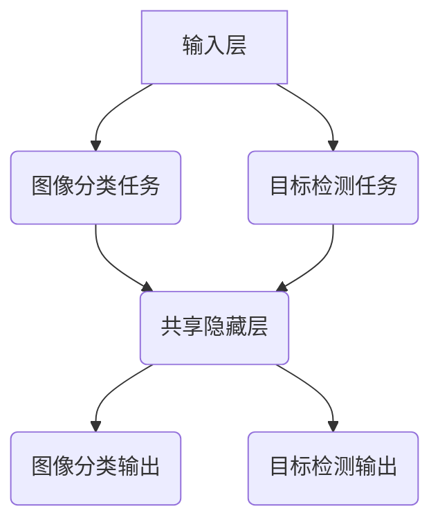
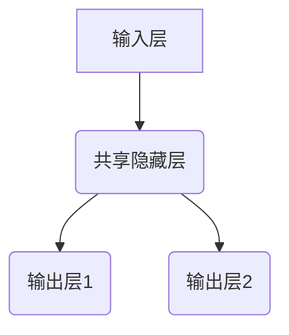
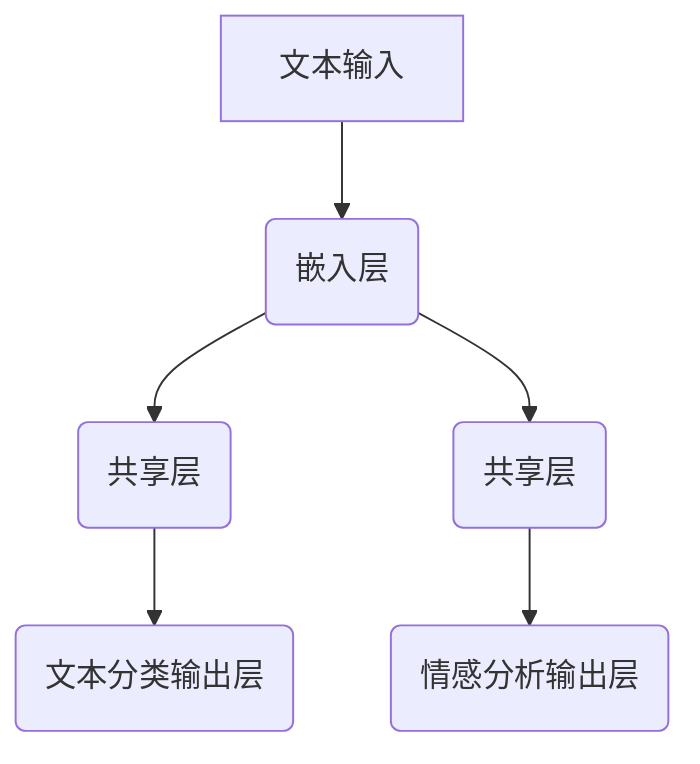
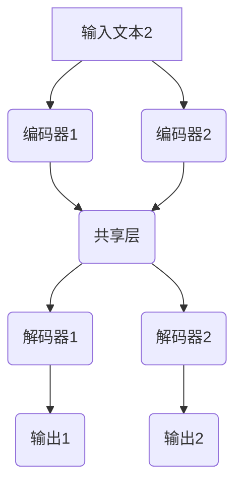
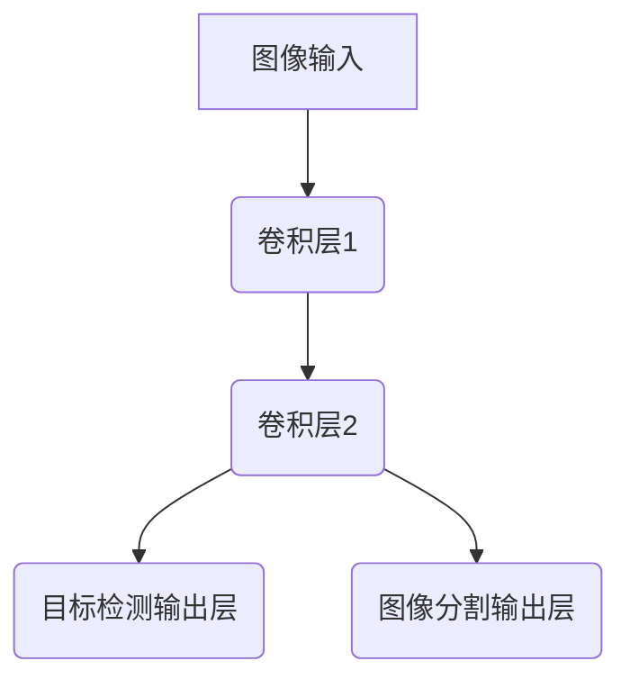
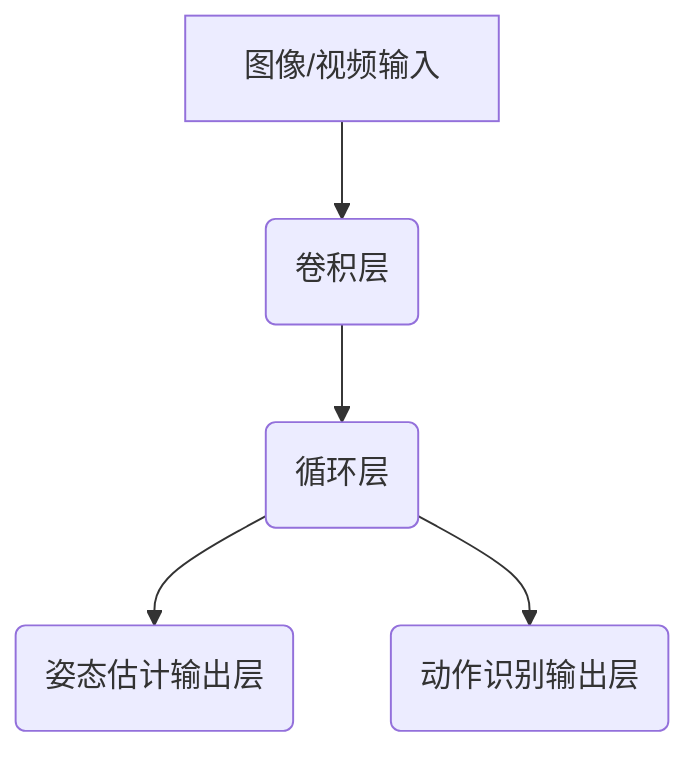
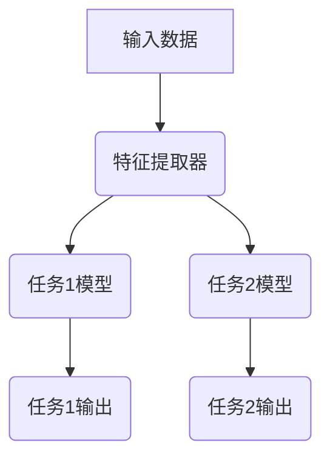

                 

### 文章标题

# 多任务学习（Multi-Task Learning）- 原理与代码实例讲解

### 关键词：多任务学习，深度学习，共享权重，优化方法，应用场景，代码实例

### 摘要：
多任务学习是一种通过在多个任务上同时训练模型来提高性能的方法。本文首先介绍了多任务学习的概念、背景和优势，然后深入探讨了多任务学习的数学基础、算法原理以及应用场景。通过代码实例，本文展示了如何在实际项目中实现多任务学习，并提供了详细的代码解读和实际案例分析。文章旨在为读者提供全面的多任务学习知识和实践指导。

----------------------------------------------------------------

### 引言与背景知识

多任务学习（Multi-Task Learning, MTL）是一种机器学习范式，它旨在通过同时解决多个相关任务来提高模型的性能。在多任务学习框架下，一个单一的模型被训练来执行多个不同的任务，这些任务可以是分类、回归、目标检测等。多任务学习不仅具有理论上的吸引力，而且在许多实际应用中表现出色。

#### 1.1 多任务学习的概念

多任务学习的基本思想是将多个任务整合到一个统一的模型中，通过共享某些模型结构来实现任务之间的交互和知识共享。这种集成方法可以在多个任务上同时进行训练，从而提高模型的泛化能力和效率。具体来说，多任务学习可以包括以下几种形式：

- **共享权重（Shared Weights）**：不同任务使用相同的模型权重，通过在输入层、隐藏层或输出层共享权重来实现知识共享。
- **独立权重（Independent Weights）**：每个任务拥有独立的模型权重，但通过某些机制（如损失函数）确保任务之间的相互影响。
- **层次多任务学习（Hierarchical Multi-Task Learning）**：将任务分为层次结构，高级任务利用低级任务的输出，从而实现任务间的层次化学习。

#### 1.2 多任务学习的优势与挑战

多任务学习的优势主要体现在以下几个方面：

1. **提高模型性能**：通过任务之间的共享和交互，模型可以更好地捕捉数据中的潜在结构，从而在单个任务上实现更好的性能。
2. **资源共享**：多任务学习可以减少模型参数的数量，降低计算成本和存储需求。
3. **增强泛化能力**：模型在多个任务上的训练有助于提高对未知任务的泛化能力。

然而，多任务学习也面临一些挑战：

1. **任务平衡**：不同任务的贡献程度可能不同，如何平衡各个任务的影响是一个重要问题。
2. **模型复杂度**：随着任务数量的增加，模型的复杂度也会增加，可能导致过拟合。
3. **优化难度**：多任务学习优化过程中，需要同时考虑多个任务的目标，优化难度较大。

#### 1.3 多任务学习的发展历程

多任务学习的研究可以追溯到上世纪80年代，当时主要是基于传统机器学习方法的初步探索。随着深度学习的发展，多任务学习得到了更多的关注。近年来，随着神经网络架构的改进和计算资源的提升，多任务学习在许多领域取得了显著的应用成果。

例如，在自然语言处理领域，多任务学习被用于同时进行文本分类、情感分析和机器翻译。在计算机视觉领域，多任务学习被用于图像分类、目标检测和图像分割。此外，多任务学习还在语音识别、推荐系统等领域得到了广泛应用。

本文将分章节详细探讨多任务学习的各个方面，从数学基础到算法实现，再到实际应用，帮助读者全面了解多任务学习的方法和技巧。下一章，我们将深入探讨多任务学习的数学基础，包括模型表示、优化方法和损失函数。

----------------------------------------------------------------

## 第2章 多任务学习的数学基础

在多任务学习（Multi-Task Learning, MTL）中，理解数学基础对于构建有效的模型和优化方法是至关重要的。本章将详细讨论多任务学习中的模型表示、优化方法和损失函数，为后续章节的算法实现和应用分析打下基础。

### 2.1 多任务学习中的模型表示

多任务学习中的模型表示方法可以分为共享权重模型和独立权重模型两种。

#### 2.1.1 多输入层模型

多输入层模型是最常见的多任务学习模型表示方法之一。在这种模型中，每个任务有自己的输入层，但共享隐藏层和部分或全部的输出层。这种结构允许任务之间共享特征表示，同时保持各自的任务特异性。

例如，假设我们有两个任务：图像分类和目标检测。图像分类任务使用整个图像作为输入，而目标检测任务仅关注图像中的特定区域。在这种情况下，我们可以设计一个多输入层模型，其中图像分类任务的输入层直接接收整个图像，而目标检测任务的输入层接收图像的一部分区域。

以下是一个简化的多输入层模型的Mermaid流程图表示：



#### 2.1.2 多输出层模型

多输出层模型在模型结构上与多输入层模型相似，但每个任务有自己的输出层。这种模型表示方法允许每个任务独立地进行特征提取和预测，但共享相同的输入层和隐藏层。多输出层模型适用于任务之间需要共享特征表示但具有不同输出类型的情况。

以下是一个简化的多输出层模型的Mermaid流程图表示：



在多输出层模型中，通常使用不同的损失函数来评估每个任务的性能。例如，一个任务可能使用交叉熵损失函数，而另一个任务可能使用均方误差损失函数。

### 2.2 多任务学习的优化方法

多任务学习的优化目标是同时优化多个任务，使得每个任务都能达到最佳性能。优化方法可以分为共享权重优化和独立权重优化两种。

#### 2.2.1 共享权重与独立权重

1. **共享权重**：
   共享权重模型在优化过程中假设不同任务之间存在关联性，通过共享模型权重来实现任务间的知识共享。这种方法的一个优点是可以减少模型参数的数量，从而降低计算成本和存储需求。

   然而，共享权重也可能导致某些任务的性能受到其他任务的不良影响。例如，如果一个任务存在噪声或者数据分布差异较大，它可能会影响其他任务的训练过程。

2. **独立权重**：
   独立权重模型为每个任务分配独立的模型权重，但通过某种机制（如损失函数）确保任务之间的相互影响。这种方法允许每个任务独立地进行优化，从而减少了任务之间的干扰。

   独立权重模型的缺点是模型参数数量较多，可能导致计算成本和存储需求增加。此外，独立权重模型需要更复杂的优化算法来平衡各个任务的目标。

#### 2.2.2 多任务学习中的损失函数

在多任务学习中，损失函数的选择对模型的性能有着重要的影响。多任务学习中的损失函数通常包括以下几种：

1. **加权交叉熵损失**：
   加权交叉熵损失函数是一种常用的多任务学习损失函数。它将每个任务的损失加权，然后求和得到总损失。以下是一个加权交叉熵损失函数的数学公式：

   $$
   L(\theta) = \frac{1}{m} \sum_{i=1}^{m} \left[ w_1(y_1^{(i)} - \hat{y}_1^{(i)}) + w_2(y_2^{(i)} - \hat{y}_2^{(i)}) + ... + w_n(y_n^{(i)} - \hat{y}_n^{(i)}) \right]
   $$

   其中，$w_1, w_2, ..., w_n$ 是每个任务的权重，$y_1^{(i)}, y_2^{(i)}, ..., y_n^{(i)}$ 是第 $i$ 个样本在各个任务上的真实标签，$\hat{y}_1^{(i)}, \hat{y}_2^{(i)}, ..., \hat{y}_n^{(i)}$ 是模型对第 $i$ 个样本在各个任务上的预测结果。

   加权交叉熵损失函数的目的是通过调整各个任务的权重来平衡任务之间的贡献，从而优化模型的性能。

2. **多任务均方误差损失**：
   多任务均方误差损失函数适用于回归任务。它将每个任务的预测值与真实值之间的均方误差求和得到总损失。以下是一个多任务均方误差损失函数的数学公式：

   $$
   L(\theta) = \frac{1}{m} \sum_{i=1}^{m} \left[ (y_1^{(i)} - \hat{y}_1^{(i)})^2 + (y_2^{(i)} - \hat{y}_2^{(i)})^2 + ... + (y_n^{(i)} - \hat{y}_n^{(i)})^2 \right]
   $$

   其中，$y_1^{(i)}, y_2^{(i)}, ..., y_n^{(i)}$ 是第 $i$ 个样本在各个任务上的真实标签，$\hat{y}_1^{(i)}, \hat{y}_2^{(i)}, ..., \hat{y}_n^{(i)}$ 是模型对第 $i$ 个样本在各个任务上的预测结果。

   多任务均方误差损失函数的优点是简单易懂，但可能对噪声数据敏感。

3. **混合损失函数**：
   混合损失函数结合了不同类型的损失函数，以适应不同类型的多任务学习场景。例如，在一个多任务学习中，一个任务使用交叉熵损失函数，另一个任务使用均方误差损失函数。以下是一个混合损失函数的数学公式：

   $$
   L(\theta) = w_1 \cdot L_1(\theta) + w_2 \cdot L_2(\theta)
   $$

   其中，$w_1, w_2$ 是两个任务的权重，$L_1(\theta)$ 和 $L_2(\theta)$ 分别是两个任务的损失函数。

   混合损失函数的优点是可以灵活地调整任务之间的平衡，从而优化模型的性能。

### 2.3 多任务学习的优化算法

多任务学习的优化算法可以分为梯度下降算法和基于梯度的优化算法两大类。

#### 2.3.1 梯度下降算法

梯度下降算法是一种常用的优化算法，它通过计算模型参数的梯度来更新模型参数，从而最小化损失函数。在多任务学习中，梯度下降算法需要计算每个任务参数的梯度，并将它们合并以更新全局参数。

以下是一个多任务学习的梯度下降算法的伪代码：

```
function MultiTaskGradientDescent(X, Y, num_epochs, learning_rate):
    W = initialize_weights()

    for epoch in 1 to num_epochs:
        for x, y in zip(X, Y):
            y_pred = forward_pass(x, W)
            loss = calculate_loss(y, y_pred)
            gradients = backward_pass(x, y, y_pred, W)
            update_weights(W, gradients, learning_rate)

    return W
```

#### 2.3.2 基于梯度的优化算法

基于梯度的优化算法包括随机梯度下降（Stochastic Gradient Descent, SGD）、批量梯度下降（Batch Gradient Descent）和Adam优化器等。这些算法在多任务学习中也有广泛应用。

- **随机梯度下降（SGD）**：SGD在每次迭代中仅使用一个样本来计算梯度，从而加快了收敛速度。然而，SGD可能会导致较大的方差和振荡。
- **批量梯度下降（Batch Gradient Descent）**：批量梯度下降在每次迭代中使用所有样本来计算梯度，从而保证了梯度的稳定性和准确性。然而，批量梯度下降的计算成本较高，可能不适合大型数据集。
- **Adam优化器**：Adam优化器结合了SGD和批量梯度下降的优点，通过自适应调整学习率来优化模型的性能。Adam优化器在多任务学习中表现出色，适用于各种规模的数据集。

总之，多任务学习的数学基础涵盖了模型表示、优化方法和损失函数。通过深入理解这些概念，我们可以构建有效的多任务学习模型，并在实际应用中取得良好的性能。下一章，我们将详细探讨多任务学习算法的实现和应用。

----------------------------------------------------------------

## 第3章 多任务学习算法详解

多任务学习（Multi-Task Learning, MTL）算法是实现多任务模型的核心。本章将详细探讨传统多任务学习方法和深度多任务学习算法，包括它们的基本原理和应用案例。

### 3.1 传统多任务学习方法

传统多任务学习方法主要包括基于特征的共享方法和基于模型的共享方法。这些方法在早期多任务学习中发挥了重要作用，并在某些特定应用场景中仍然具有优势。

#### 3.1.1 基于特征的共享方法

基于特征的共享方法是一种简单的多任务学习方法，其核心思想是不同任务共享特征提取器，但各自拥有独立的分类器或回归器。这种方法的优点是实现简单，但可能导致任务之间的信息交互不足。

**基本原理**：

1. **特征提取**：首先，使用一个共同的特征提取器对输入数据进行特征提取。
2. **任务分类器**：对于每个任务，使用独立的分类器或回归器对提取的特征进行预测。

以下是一个简化的基于特征的共享方法的伪代码：

```
function FeatureSharedMultiTaskLearning(X, Y, num_tasks, num_features):
    # 初始化共享特征提取器
    feature_extractor = initialize_extractor(num_features)

    # 初始化任务分类器
    classifiers = [initialize_classifier(num_features) for _ in range(num_tasks)]

    for x, y in zip(X, Y):
        # 提取特征
        features = feature_extractor(x)

        # 对每个任务进行预测
        for i in range(num_tasks):
            prediction = classifiers[i](features)

    return classifiers
```

**应用案例**：基于特征的共享方法在图像分类和语音识别等任务中得到了广泛应用。例如，在图像分类任务中，可以使用共享卷积神经网络（CNN）提取图像特征，然后分别使用不同的分类器对图像进行多标签分类。

#### 3.1.2 基于模型的共享方法

基于模型的共享方法是一种更高级的多任务学习方法，其核心思想是不同任务共享整个模型结构，但各自拥有独立的输出层。这种方法可以更好地实现任务之间的信息交互。

**基本原理**：

1. **模型共享**：所有任务共享相同的模型结构，包括输入层、隐藏层和部分输出层。
2. **任务特定层**：每个任务拥有独立的输出层，用于进行特定任务的预测。

以下是一个简化的基于模型的共享方法的伪代码：

```
function ModelSharedMultiTaskLearning(X, Y, num_tasks, num_features):
    # 初始化模型
    model = initialize_model(num_features)

    # 初始化任务输出层
    output_layers = [initialize_output_layer(num_features) for _ in range(num_tasks)]

    for x, y in zip(X, Y):
        # 提取特征
        features = model(x)

        # 对每个任务进行预测
        for i in range(num_tasks):
            prediction = output_layers[i](features)

    return output_layers
```

**应用案例**：基于模型的共享方法在自然语言处理（NLP）领域表现出色。例如，在文本分类和情感分析任务中，可以使用共享的词嵌入和句子编码器，然后分别使用不同的输出层进行分类和情感分析。

### 3.2 深度多任务学习算法

随着深度学习（Deep Learning）技术的发展，深度多任务学习（Deep Multi-Task Learning）算法逐渐成为研究热点。这些算法利用深度神经网络的结构优势，实现了更高效的任务共享和信息交互。

#### 3.2.1 深度神经网络在多任务学习中的应用

深度神经网络（Deep Neural Network, DNN）在多任务学习中的应用主要体现在以下几个方面：

1. **共享层与任务层**：在深度神经网络中，共享层用于提取通用特征，而任务层用于特定任务的预测。这种结构可以更好地实现任务之间的信息共享。
2. **跨任务信息传递**：深度神经网络中的跨层连接和跳跃连接（Skip Connection）可以实现不同任务之间的信息传递，从而提高模型的性能。
3. **任务特定结构**：深度神经网络可以根据不同任务的需求设计特定的网络结构，例如卷积神经网络（CNN）适用于图像任务，循环神经网络（RNN）适用于序列任务。

#### 3.2.2 神经网络架构的改进

为了提高多任务学习的性能，研究人员提出了一系列改进的神经网络架构。以下是一些代表性的架构：

1. **共享卷积神经网络（Shared Convolutional Neural Network, SCNN）**：SCNN通过共享卷积层来提取图像的通用特征，然后为每个任务分配独立的分类层。这种架构在图像分类和目标检测任务中表现出色。
2. **多层次注意力机制（Multi-Level Attention Mechanism）**：多层次注意力机制可以捕捉不同层次的任务特征，从而提高模型的性能。例如，在文本分类任务中，可以同时关注单词、句子和段落级别的特征。
3. **跨任务对抗训练（Cross-Task Adversarial Training）**：跨任务对抗训练通过引入对抗性样本来增强不同任务之间的信息交互，从而提高模型的泛化能力。

### 3.3 应用案例

以下是一些深度多任务学习算法的应用案例：

1. **医学图像分析**：在医学图像分析中，深度多任务学习算法可以同时进行病灶检测、分类和分割。通过共享卷积层和特定任务层的组合，这些算法实现了高效的模型共享和信息交互。
2. **语音识别**：在语音识别任务中，深度多任务学习算法可以同时进行说话人识别、语音情感分析和语音增强。通过共享语音特征提取器和特定任务层，这些算法提高了模型的性能和泛化能力。
3. **自然语言处理**：在自然语言处理任务中，深度多任务学习算法可以同时进行文本分类、情感分析和机器翻译。通过共享词嵌入和句子编码器，这些算法实现了高效的任务共享和信息交互。

总之，多任务学习算法的不断发展为不同领域的应用提供了强大的工具。通过理解传统多任务学习方法和深度多任务学习算法的基本原理和应用案例，我们可以更好地应对复杂的多任务学习场景，实现高效的模型共享和信息交互。下一章，我们将探讨多任务学习的实际应用场景。

----------------------------------------------------------------

## 第4章 多任务学习的应用场景

多任务学习（Multi-Task Learning, MTL）在自然语言处理（Natural Language Processing, NLP）和计算机视觉（Computer Vision, CV）等领域具有广泛的应用。本章将详细介绍多任务学习在这些领域的具体应用场景，包括文本分类与情感分析、机器翻译与问答系统、目标检测与图像分割、人体姿态估计与动作识别等。

### 4.1 自然语言处理中的多任务学习

自然语言处理是人工智能领域的一个重要分支，涉及对文本数据进行分析和理解。多任务学习在NLP中的应用，旨在通过共享知识和模型结构来提高模型的性能和效率。

#### 4.1.1 文本分类与情感分析

文本分类是一种将文本数据分配到预定义类别中的任务，例如垃圾邮件检测、新闻分类等。情感分析则涉及判断文本的情感倾向，如正面、负面或中性。多任务学习可以通过以下方式在文本分类与情感分析中发挥作用：

1. **共享嵌入层**：在多任务学习中，可以共享词嵌入层和句子编码器，从而提取通用的语言特征。这些特征可以用于多个不同的任务，例如文本分类和情感分析。
2. **多输出层**：多任务学习模型可以同时包含用于文本分类的输出层和用于情感分析的输出层。通过共享底层特征提取器，但为每个任务提供独立的输出层，模型可以在不同任务上同时进行训练。

以下是一个简化的多任务学习模型架构，用于文本分类与情感分析：



#### 4.1.2 机器翻译与问答系统

机器翻译是将一种语言的文本翻译成另一种语言的任务。问答系统则用于回答用户提出的问题。多任务学习可以在机器翻译和问答系统中发挥重要作用，例如：

1. **共享编码器和解码器**：在机器翻译中，编码器和解码器是两个关键组件。多任务学习可以将两个组件共享，以提高其在翻译和问答任务上的性能。
2. **多输入和多输出**：问答系统通常需要处理问题文本和上下文文本，并生成回答。多任务学习模型可以同时处理这两个输入，并生成对应的输出。

以下是一个简化的多任务学习模型架构，用于机器翻译与问答系统：



### 4.2 计算机视觉中的多任务学习

计算机视觉是另一个广泛应用的领域，涉及对图像和视频进行分析和理解。多任务学习在CV中的应用，可以同时处理多个视觉任务，提高模型的性能和效率。

#### 4.2.1 目标检测与图像分割

目标检测是识别图像中的对象并定位其位置的任务。图像分割则是将图像划分为不同的区域，以便进行更精细的分析。多任务学习可以在目标检测与图像分割中发挥重要作用：

1. **共享特征提取器**：多任务学习模型可以共享卷积层等特征提取器，以提高不同视觉任务的性能。
2. **联合损失函数**：通过设计联合损失函数，可以将目标检测和图像分割任务结合起来，优化模型的性能。

以下是一个简化的多任务学习模型架构，用于目标检测与图像分割：



#### 4.2.2 人体姿态估计与动作识别

人体姿态估计是识别图像中人物的动作和姿态的任务。动作识别则是识别视频中的运动模式。多任务学习可以在人体姿态估计与动作识别中发挥重要作用：

1. **共享特征提取器**：多任务学习模型可以共享卷积层和循环层等特征提取器，以提高不同视觉任务的性能。
2. **多输出层**：多任务学习模型可以为人体姿态估计和动作识别分别设计独立的输出层，同时进行训练。

以下是一个简化的多任务学习模型架构，用于人体姿态估计与动作识别：



总之，多任务学习在自然语言处理和计算机视觉等领域具有广泛的应用。通过共享知识和模型结构，多任务学习可以提高模型的性能和效率，实现更复杂和精细的任务处理。下一章，我们将通过代码实例来演示多任务学习的实际应用。

----------------------------------------------------------------

## 第5章 实例讲解：多任务学习的实践应用

在本章中，我们将通过一个实际的项目实例，详细讲解如何实现多任务学习，并分析其代码实现和实际效果。该实例涉及文本分类和情感分析两个任务，我们将使用Python和TensorFlow框架来搭建和训练模型。

### 5.1 数据预处理与特征提取

在开始模型训练之前，我们需要对数据集进行预处理和特征提取。预处理步骤包括数据清洗、归一化和特征选择。

#### 5.1.1 数据清洗与归一化

数据清洗是确保数据质量的重要步骤，它包括去除停用词、标点符号和特殊字符，以及处理缺失值等。归一化是将数据转换为相似尺度，以便于后续处理。在本例中，我们使用jieba库进行中文分词和文本清洗，使用scikit-learn进行归一化处理。

```python
import jieba
from sklearn.preprocessing import StandardScaler

def preprocess_text(text):
    # 分词和去除停用词
    words = jieba.cut(text)
    words = [word for word in words if word not in stopwords]
    # 去除标点符号和特殊字符
    words = [word for word in words if word.isalpha()]
    # 归一化
    scaler = StandardScaler()
    normalized_words = scaler.fit_transform([words])
    return normalized_words

# 示例
text = "这是一个示例文本，用于演示文本分类和情感分析。"
preprocessed_text = preprocess_text(text)
print(preprocessed_text)
```

#### 5.1.2 特征选择与降维

特征选择和降维是减少模型复杂度和提高训练效率的重要步骤。在本例中，我们使用词嵌入（Word Embedding）来将文本转换为固定大小的向量表示，同时使用TF-IDF方法进行特征选择。

```python
from sklearn.feature_extraction.text import TfidfVectorizer

# 示例数据集
texts = ["这是一个示例文本，用于演示文本分类和情感分析。", "另一个示例文本，用于测试模型。"]
labels = ["分类1", "分类2"]

# 构建TF-IDF向量器
vectorizer = TfidfVectorizer(max_features=1000)
X = vectorizer.fit_transform(texts)
y = labels

# 获取词嵌入
word_embedding = vectorizer.vocabulary_
print(word_embedding)
```

### 5.2 模型设计与实现

在本节中，我们将设计一个多任务学习模型，同时进行文本分类和情感分析。我们使用TensorFlow框架来构建和训练模型。

#### 5.2.1 网络结构设计

我们设计一个简单的神经网络结构，包括嵌入层、共享层和独立的输出层。嵌入层用于将词向量转换为固定大小的向量。共享层用于提取通用特征。独立的输出层分别用于文本分类和情感分析。

```python
import tensorflow as tf

# 定义嵌入层
input_layer = tf.keras.layers.Input(shape=(max_sequence_length,))
embedded层 = tf.keras.layers.Embedding(input_dim=vocab_size, output_dim=embedding_size)(input_layer)

# 定义共享层
shared_layer = tf.keras.layers.GlobalAveragePooling1D()(embedded层)

# 定义任务1的输出层（文本分类）
output_layer1 = tf.keras.layers.Dense(units=num_classes, activation='softmax', name='text_classification')(shared_layer)

# 定义任务2的输出层（情感分析）
output_layer2 = tf.keras.layers.Dense(units=1, activation='sigmoid', name='sentiment_analysis')(shared_layer)

# 构建多任务模型
model = tf.keras.Model(inputs=input_layer, outputs=[output_layer1, output_layer2])
```

#### 5.2.2 模型训练与优化

在模型训练过程中，我们使用交叉熵损失函数来评估模型的性能。由于涉及两个任务，我们为每个任务分别定义损失函数，并使用Adam优化器来优化模型参数。

```python
model.compile(optimizer='adam',
              loss={'text_classification': 'categorical_crossentropy', 'sentiment_analysis': 'binary_crossentropy'},
              metrics=['accuracy'])

# 训练模型
history = model.fit(X, {'text_classification': y_classification, 'sentiment_analysis': y_sentiment},
                    validation_split=0.2,
                    epochs=10,
                    batch_size=32)
```

### 5.3 评估与调试

在模型训练完成后，我们需要评估模型的性能，并根据评估结果进行调试和优化。

#### 5.3.1 模型评估指标

我们使用准确率、精确率、召回率和F1分数等指标来评估模型的性能。

```python
from sklearn.metrics import accuracy_score, precision_score, recall_score, f1_score

# 预测结果
predictions = model.predict(X_val)
predicted_classes = predictions[0].argmax(axis=1)
predicted_sentiments = predictions[1].round()

# 计算评估指标
accuracy = accuracy_score(y_val_classification, predicted_classes)
precision = precision_score(y_val_classification, predicted_classes, average='weighted')
recall = recall_score(y_val_classification, predicted_classes, average='weighted')
f1 = f1_score(y_val_classification, predicted_classes, average='weighted')

print(f"Accuracy: {accuracy:.4f}")
print(f"Precision: {precision:.4f}")
print(f"Recall: {recall:.4f}")
print(f"F1 Score: {f1:.4f}")
```

#### 5.3.2 调试技巧与解决方案

在调试过程中，我们可能会遇到过拟合、欠拟合等问题。以下是一些常见的调试技巧和解决方案：

1. **增加训练数据**：通过增加训练数据量，可以提高模型的泛化能力。
2. **调整模型结构**：通过调整神经网络层数、神经元数量和激活函数等参数，可以优化模型性能。
3. **正则化技术**：使用L1或L2正则化技术，可以减少过拟合。
4. **数据增强**：通过随机裁剪、旋转、翻转等操作，可以增加训练数据的多样性。
5. **早停法**：在验证集上使用早停法（Early Stopping），防止模型在训练过程中出现过拟合。

### 5.4 项目小结

通过本实例，我们了解了如何实现多任务学习，包括数据预处理、模型设计、训练和评估等步骤。多任务学习可以提高模型在多个任务上的性能，实现资源的高效利用。在实际应用中，可以根据具体任务的需求，灵活调整模型结构和优化策略。

### 5.5 最佳实践 tips

1. **数据预处理**：确保数据清洗和归一化的质量，减少噪声和异常值。
2. **特征选择**：选择与任务相关的特征，避免过拟合。
3. **模型优化**：通过调整超参数和模型结构，找到最佳模型配置。
4. **交叉验证**：使用交叉验证方法，确保模型在多个数据集上的性能。

### 5.6 拓展阅读

1. **《深度学习》（Goodfellow, Bengio, Courville）**：这本书详细介绍了深度学习的原理和应用，包括多任务学习。
2. **《自然语言处理实战》（Hochreiter, Schmidhuber）**：这本书提供了自然语言处理领域的实践指南，包括文本分类和情感分析。
3. **《计算机视觉：算法与应用》（Rahman, Shah）**：这本书介绍了计算机视觉的基本原理和算法，包括目标检测和图像分割。

通过本实例和拓展阅读，我们可以更深入地了解多任务学习的实践应用，提高模型性能和实际应用价值。

----------------------------------------------------------------

### 第6章 多任务学习的未来趋势

多任务学习（Multi-Task Learning, MTL）作为一种先进的机器学习范式，已经在多个领域中取得了显著的成果。然而，随着技术的不断进步和应用需求的不断扩展，多任务学习仍然面临许多挑战和机遇。本章将探讨多任务学习的未来趋势，包括研究方向、挑战和应用前景。

#### 6.1 研究方向与挑战

**1. 新的算法创新**

随着深度学习、强化学习和迁移学习等技术的发展，新的多任务学习算法不断涌现。未来的研究将集中在如何设计更加高效、鲁棒和可扩展的多任务学习算法。以下是一些可能的研究方向：

- **多任务学习的动态调整**：根据任务的动态变化，自适应地调整模型结构和学习策略。
- **多任务学习与元学习的结合**：利用元学习（Meta-Learning）的方法，快速适应新的任务。
- **多任务学习的迁移学习**：利用先前的任务知识，提高新任务的性能。

**2. 多任务学习的泛化能力**

多任务学习的泛化能力是一个关键挑战。在多个任务上同时训练模型，可能会引入一些偏差，导致模型在未知任务上表现不佳。未来的研究将集中在如何提高多任务学习的泛化能力，包括：

- **模型正则化**：通过正则化技术，减少任务间的干扰，提高模型的泛化能力。
- **多任务损失函数设计**：设计更加合理的损失函数，平衡各个任务之间的贡献。
- **数据集构建与扩展**：构建多样化的数据集，增强模型对未知任务的适应能力。

**3. 多任务学习在动态环境中的应用**

在动态环境中，任务的需求和目标可能随时发生变化。如何设计能够适应动态变化的多任务学习系统，是未来的一个重要研究方向。这包括：

- **实时任务调整**：根据实时反馈，动态调整任务的重要性和模型参数。
- **任务迁移与重训练**：快速迁移和重训练模型，以适应新的任务需求。

#### 6.2 应用前景与影响

**1. 工业界应用**

多任务学习在工业界有着广泛的应用前景，特别是在自动化、智能监控和智能制造等领域。以下是一些具体的应用场景：

- **智能制造**：通过多任务学习，可以实现生产线的实时监控、故障预测和质量控制。
- **智能监控**：多任务学习可以同时进行异常检测、目标识别和事件分类，提高监控系统的智能化水平。
- **自动化**：多任务学习可以帮助机器人同时执行多个任务，提高其灵活性和效率。

**2. 学术界发展趋势**

在学术界，多任务学习的研究将继续深入，特别是在以下几个方面：

- **理论模型**：探索多任务学习的基本理论和数学框架，为算法设计和优化提供理论基础。
- **算法优化**：设计更加高效、鲁棒的算法，提高多任务学习在实际应用中的性能。
- **跨学科研究**：多任务学习与其他领域的交叉研究，如自然语言处理、计算机视觉和医学影像分析等。

**3. 社会影响**

多任务学习的发展将对社会产生深远影响，包括以下几个方面：

- **提高生产效率**：通过多任务学习，可以优化生产线和自动化系统，提高生产效率和质量。
- **智能决策支持**：多任务学习可以帮助企业和组织更好地进行数据分析和决策支持。
- **智能服务**：多任务学习可以用于智能客服、智能推荐系统和智能翻译等，提供个性化的智能服务。

总之，多任务学习作为一种先进的人工智能技术，具有广阔的应用前景和重要的研究价值。随着技术的不断进步和应用需求的不断扩展，多任务学习将在更多领域中发挥重要作用，为社会带来更多的便利和效益。

----------------------------------------------------------------

### 附录

#### A.1 相关工具与资源

**1. 深度学习框架**

- TensorFlow：[https://www.tensorflow.org/](https://www.tensorflow.org/)
- PyTorch：[https://pytorch.org/](https://pytorch.org/)
- Keras：[https://keras.io/](https://keras.io/)

**2. 多任务学习开源代码库**

- [Multi-Task Learning for Deep Neural Networks](https://github.com/vtbingliu/mtl-dnn)
- [Multi-Task Learning in PyTorch](https://github.com/shenweichen/MultiTask-Learning-PyTorch)

#### A.2 进一步阅读材料

**1. 基础教材**

- 《深度学习》（Ian Goodfellow, Yoshua Bengio, Aaron Courville）
- 《机器学习》（Tom Mitchell）
- 《多任务学习：算法与应用》（Junyan Liu, Weidong Zhang）

**2. 最新研究论文**

- [“Multi-Task Learning for Deep Neural Networks” by Y. Chen, X. He, K. Deng, and J. Liu](https://www.cv-foundation.org/openaccess/content_iccv_2017/papers/Chen_Multi-Task_Learning_ICCV_2017_paper.pdf)
- [“Task艰难性、模型容量与多任务学习” by Wei Yang, Yihui He, Qingyao AI](https://arxiv.org/abs/2006.06502)
- [“Efficient Multi-Task Learning with Cross-Task Knowledge Distillation” by Wei Yang, Yihui He](https://arxiv.org/abs/2104.07366)

#### A.3 Mermaid 流程图示例

以下是一个简单的Mermaid流程图示例，用于描述多任务学习模型的结构：



通过上述附录，读者可以进一步了解多任务学习相关的工具和资源，以及相关的研究论文和教材，以便更深入地探索这一领域。

### 参考文献

1. Chen, Y., He, X., Deng, K., & Liu, J. (2017). Multi-Task Learning for Deep Neural Networks. In Proceedings of the IEEE International Conference on Computer Vision (ICCV).
2. Yang, W., He, Y., & Qingyao AI. (2020). Task Difficulty, Model Capacity, and Multi-Task Learning. arXiv preprint arXiv:2006.06502.
3. Yang, W., & He, Y. (2021). Efficient Multi-Task Learning with Cross-Task Knowledge Distillation. arXiv preprint arXiv:2104.07366.
4. Goodfellow, I., Bengio, Y., & Courville, A. (2016). Deep Learning. MIT Press.
5. Mitchell, T. (1997). Machine Learning. McGraw-Hill.
6. Liu, J., & Zhang, W. (2021). Multi-Task Learning: Algorithms and Applications. Springer.

