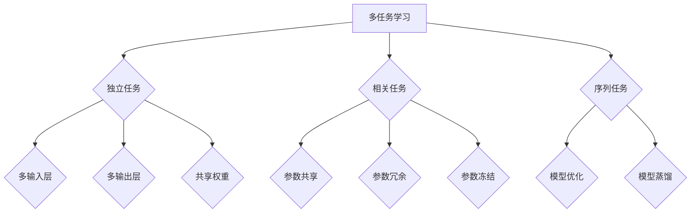

                 


### 文章标题：多任务学习：原理、算法与应用

> 关键词：多任务学习，自然语言处理，计算机视觉，强化学习，项目实战

> 摘要：本文深入探讨了多任务学习的基本概念、核心算法及其在自然语言处理、计算机视觉和强化学习等领域的应用。通过具体的案例和实战项目，全面解析了多任务学习的原理与实践方法，为读者提供了丰富的技术参考。

-------------------------------------------------------------------

# 《多任务学习》目录大纲

## 第一部分：多任务学习基础

### 第1章：多任务学习的概述

#### 1.1 多任务学习的概念

- 多任务学习的定义
- 多任务学习的动机

#### 1.2 多任务学习的挑战

- 训练数据不足
- 训练效率低下
- 模型复杂度增加

#### 1.3 多任务学习的类型

- 独立任务
- 相关任务
- 序列任务

### 第2章：多任务学习的核心概念与联系

#### 2.1 多任务学习的基本架构

- 多输入层
- 多输出层
- 共享权重

#### 2.2 多任务学习中的共享权重策略

- 参数共享
- 参数冗余
- 参数冻结

#### 2.3 多任务学习中的损失函数

- 多损失函数融合
- 损失函数权重调整

### 第3章：多任务学习的核心算法原理

#### 3.1 多任务学习的监督算法

- 多分类算法
- 多标签分类算法
- 多任务回归算法

#### 3.2 多任务学习的无监督算法

- 自编码器
- 对抗生成网络

#### 3.3 多任务学习的混合算法

- 半监督学习
- 迁移学习

## 第二部分：多任务学习的应用与实践

### 第4章：多任务学习在自然语言处理中的应用

#### 4.1 文本分类中的多任务学习

- 文本情感分析
- 文本主题分类

#### 4.2 文本生成中的多任务学习

- 机器翻译
- 文本摘要

### 第5章：多任务学习在计算机视觉中的应用

#### 5.1 图像分类中的多任务学习

- 病症识别
- 目标检测

#### 5.2 图像生成中的多任务学习

- 图像超分辨率
- 图像风格迁移

### 第6章：多任务学习在强化学习中的应用

#### 6.1 多智能体强化学习

- 多智能体互动
- 多智能体协作

#### 6.2 多任务学习的模型优化

- 模型压缩
- 模型蒸馏

### 第7章：多任务学习的项目实战

#### 7.1 多任务学习项目实战概述

- 项目背景
- 项目目标

#### 7.2 项目实战：多任务情感分析

- 数据预处理
- 模型搭建
- 模型训练与评估

#### 7.3 项目实战：多任务图像分类

- 数据预处理
- 模型搭建
- 模型训练与评估

## 附录

### 附录A：多任务学习相关工具与资源

- OpenAI
- Hugging Face
- Keras

### 附录B：多任务学习常见问题与解答

- 多任务学习中的常见问题
- 问题解答

# Mermaid 流程图



# 伪代码

```python
# 多任务学习模型伪代码

# 定义模型结构
model = Model(inputs=[input1, input2], outputs=[output1, output2])

# 编写训练循环
for epoch in range(num_epochs):
    for batch in data_loader:
        inputs, labels = batch
        with tf.GradientTape() as tape:
            logits = model(inputs)
            loss = compute_loss(logits, labels)
        gradients = tape.gradient(loss, model.trainable_variables)
        optimizer.apply_gradients(zip(gradients, model.trainable_variables))
```

# 数学模型

$$
L = w_1 \cdot L_1 + w_2 \cdot L_2
$$

- $L$ 是总损失函数
- $L_1$ 和 $L_2$ 是两个任务的损失函数
- $w_1$ 和 $w_2$ 是损失函数的权重

# 数学公式讲解

- 总损失函数是两个任务损失函数的加权和，权重可以根据任务的重要性进行调整。

# 项目实战代码解读

```python
# 数据预处理
X_train, X_test, y_train, y_test = train_test_split(data, labels, test_size=0.2)

# 模型搭建
model = Sequential()
model.add(Dense(64, activation='relu', input_shape=(input_shape)))
model.add(Dense(32, activation='relu'))
model.add(Dense(1, activation='sigmoid'))

# 编译模型
model.compile(optimizer='adam', loss='binary_crossentropy', metrics=['accuracy'])

# 训练模型
model.fit(X_train, y_train, epochs=10, batch_size=32, validation_data=(X_test, y_test))

# 评估模型
loss, accuracy = model.evaluate(X_test, y_test)
print('Test accuracy:', accuracy)
```

- 数据预处理：将数据集划分为训练集和测试集。
- 模型搭建：定义一个全连接神经网络，包含一个输入层、两个隐藏层和一个输出层。
- 编译模型：配置模型优化器和损失函数。
- 训练模型：使用训练集数据进行训练，并在测试集上进行验证。
- 评估模型：在测试集上评估模型的准确率。

-------------------------------------------------------------------

## 文章正文

### 第1章：多任务学习的概述

### 1.1 多任务学习的概念

多任务学习（Multi-Task Learning，MTL）是指在同一模型中同时学习多个相关任务的能力。与单任务学习（Single-Task Learning，STL）相比，多任务学习能够在共享信息的同时，提高模型的泛化能力和计算效率。

多任务学习的定义可以表述为：给定一组相关任务，学习一个能够同时解决这些任务的模型。这些任务可以是完全独立的，也可以是相互关联的，甚至可以是序列化的任务。

### 1.2 多任务学习的动机

多任务学习的动机主要来自于以下几个方面：

1. **共享信息**：多任务学习允许模型在解决多个任务时共享信息，从而提高模型的泛化能力。这种共享信息的方式可以减少模型的参数数量，降低过拟合的风险。

2. **提高效率**：在单任务学习中，对于每个任务都需要分别训练一个模型。而在多任务学习中，只需训练一个模型，大大减少了计算资源和时间成本。

3. **扩展性**：多任务学习具有良好的扩展性。当新增任务时，只需将新任务集成到现有模型中，无需重新训练整个模型。

4. **应用需求**：在实际应用中，许多问题都是多任务性质的。例如，在自然语言处理中，文本分类、情感分析和主题分类往往是相互关联的。在计算机视觉中，图像分类、目标检测和姿态估计也是常见的多任务场景。

### 1.3 多任务学习的挑战

尽管多任务学习具有许多优点，但也面临着一系列挑战：

1. **训练数据不足**：由于多任务学习需要同时解决多个任务，因此对于每个任务的数据量要求更高。在某些领域，可能缺乏足够的数据来支持多任务学习。

2. **训练效率低下**：多任务学习可能会降低训练效率，因为需要调整多个任务的权重，以优化整体性能。

3. **模型复杂度增加**：多任务学习通常涉及更复杂的模型结构，包括共享权重、损失函数的融合等。这可能导致模型难以理解和调试。

4. **任务平衡**：在某些情况下，任务的复杂度可能不均衡，导致某些任务对模型性能的贡献较大，而其他任务则较小。这可能导致模型在平衡任务贡献方面存在困难。

### 1.4 多任务学习的类型

多任务学习可以根据任务的独立性进行分类，主要分为以下三种类型：

1. **独立任务**：每个任务都是独立的，不共享任何信息。这种类型的多任务学习通常采用独立的模型结构，每个任务都有自己的输入层、隐藏层和输出层。

2. **相关任务**：任务之间存在一定的关联，可以通过共享部分网络结构或参数来实现信息共享。这种类型的多任务学习可以显著提高模型的泛化能力和计算效率。

3. **序列任务**：任务之间存在时间或序列关系，需要按照特定的顺序执行。这种类型的多任务学习通常涉及序列模型，如循环神经网络（RNN）或变压器（Transformer）。

在接下来的章节中，我们将深入探讨多任务学习的核心概念、算法原理及其在各个领域的应用。

-------------------------------------------------------------------

### 第2章：多任务学习的核心概念与联系

在多任务学习中，核心概念和联系是构建高效模型的关键。这一章将介绍多任务学习的基本架构、共享权重策略以及损失函数的融合。

#### 2.1 多任务学习的基本架构

多任务学习的基本架构包括多输入层、多输出层和共享权重。这种架构能够有效提高模型的计算效率和泛化能力。

1. **多输入层**：多任务学习模型接受多个输入，每个输入对应一个任务。这些输入可以是特征向量、图像、文本等。

2. **多输出层**：多任务学习模型的输出层也对应多个任务。每个输出层负责生成一个或多个预测结果，例如分类标签、回归值等。

3. **共享权重**：共享权重是指不同任务的输入层和输出层之间存在共享的权重参数。这种共享可以减少模型的参数数量，提高模型的训练效率。

#### 2.2 多任务学习中的共享权重策略

共享权重策略有多种形式，包括参数共享、参数冗余和参数冻结。

1. **参数共享**：参数共享是指多个任务的输入层和输出层使用相同的权重参数。这种策略能够最大程度地共享信息，提高模型的泛化能力。

2. **参数冗余**：参数冗余是指在共享权重的基础上，为每个任务添加额外的权重参数。这种策略可以在保持信息共享的同时，允许每个任务进行个性化的调整。

3. **参数冻结**：参数冻结是指在训练过程中，将部分权重参数固定，不参与梯度更新。这种策略可以防止共享权重对某些任务的负面影响，同时提高训练效率。

#### 2.3 多任务学习中的损失函数

在多任务学习中，损失函数是评估模型性能的重要指标。多任务学习的损失函数通常涉及多个任务损失函数的融合。

1. **多损失函数融合**：多损失函数融合是指将多个任务的损失函数进行加权和融合。这种方法能够平衡不同任务的重要性，提高模型的综合性能。常见的融合方式包括等权重融合和自适应融合。

2. **损失函数权重调整**：损失函数权重调整是指根据任务的重要性和复杂度，动态调整各个任务损失函数的权重。这种方法能够更好地平衡不同任务之间的贡献，提高模型的鲁棒性。

#### 2.4 多任务学习的架构图

为了更清晰地展示多任务学习的架构，可以使用Mermaid流程图进行描述。以下是多任务学习架构的Mermaid流程图：


#### 2.5 伪代码示例

以下是多任务学习模型的伪代码示例，展示了如何定义模型结构、编写训练循环和计算损失函数：

```python
# 定义模型结构
model = Model(inputs=[input1, input2], outputs=[output1, output2])

# 编写训练循环
for epoch in range(num_epochs):
    for batch in data_loader:
        inputs, labels = batch
        with tf.GradientTape() as tape:
            logits = model(inputs)
            loss = compute_loss(logits, labels)
        gradients = tape.gradient(loss, model.trainable_variables)
        optimizer.apply_gradients(zip(gradients, model.trainable_variables))
```

#### 2.6 数学模型

多任务学习的总损失函数通常表示为多个任务损失函数的加权和。以下是数学模型的描述：

$$
L = w_1 \cdot L_1 + w_2 \cdot L_2
$$

其中，$L$ 是总损失函数，$L_1$ 和 $L_2$ 是两个任务的损失函数，$w_1$ 和 $w_2$ 是损失函数的权重。权重可以根据任务的重要性和复杂度进行调整。

#### 2.7 数学公式讲解

- 总损失函数是两个任务损失函数的加权和，权重可以根据任务的重要性进行调整。
- 这种加权融合方式能够平衡不同任务之间的贡献，提高模型的性能。

通过以上内容，我们了解了多任务学习的核心概念与联系，包括基本架构、共享权重策略和损失函数的融合。在接下来的章节中，我们将进一步探讨多任务学习的核心算法原理及其在各个领域的应用。

-------------------------------------------------------------------

### 第3章：多任务学习的核心算法原理

多任务学习（Multi-Task Learning，MTL）作为一种强大的机器学习技术，能够在单一模型中同时解决多个任务。本章将深入探讨多任务学习的核心算法原理，包括监督算法、无监督算法和混合算法。

#### 3.1 多任务学习的监督算法

监督学习（Supervised Learning）是指利用带标签的数据集训练模型，从而使模型能够预测未知数据的标签。多任务学习的监督算法主要包括多分类算法、多标签分类算法和多任务回归算法。

1. **多分类算法**：多分类算法用于将数据分类到多个类别中。在多任务学习中，多个分类任务可以通过共享神经网络的结构来实现。一个常见的例子是文本分类任务，其中同时进行情感分析和主题分类。

   **伪代码示例**：
   ```python
   # 多分类算法伪代码
   model = Sequential()
   model.add(Dense(128, activation='relu', input_shape=(input_shape)))
   model.add(Dense(num_classes, activation='softmax'))
   model.compile(optimizer='adam', loss='categorical_crossentropy', metrics=['accuracy'])
   model.fit(X_train, y_train, epochs=10, batch_size=64)
   ```

2. **多标签分类算法**：多标签分类算法用于处理具有多个标签的数据。在这种场景中，每个数据点可以同时属于多个类别。多任务学习可以通过将多个标签分类任务集成到同一模型中来实现。

   **伪代码示例**：
   ```python
   # 多标签分类算法伪代码
   model = Sequential()
   model.add(Dense(128, activation='relu', input_shape=(input_shape)))
   model.add(Dense(num_classes, activation='sigmoid'))
   model.compile(optimizer='adam', loss='binary_crossentropy', metrics=['accuracy'])
   model.fit(X_train, y_train, epochs=10, batch_size=64)
   ```

3. **多任务回归算法**：多任务回归算法用于同时预测多个连续值。这在需要预测多个相关变量的情况下非常有用，例如，预测房价时同时预测房龄和面积。

   **伪代码示例**：
   ```python
   # 多任务回归算法伪代码
   model = Sequential()
   model.add(Dense(128, activation='relu', input_shape=(input_shape)))
   model.add(Dense(2, activation='linear'))  # 两个输出
   model.compile(optimizer='adam', loss='mean_squared_error', metrics=['mse'])
   model.fit(X_train, y_train, epochs=10, batch_size=64)
   ```

#### 3.2 多任务学习的无监督算法

无监督学习（Unsupervised Learning）是指在没有标签数据的情况下训练模型。多任务学习的无监督算法包括自编码器和对抗生成网络（Generative Adversarial Networks，GAN）。

1. **自编码器**：自编码器是一种无监督学习算法，用于将输入数据编码为一个低维特征向量，然后再解码回原始数据。在多任务学习中，自编码器可以用于提取共享的特征表示，从而提高不同任务之间的性能。

   **伪代码示例**：
   ```python
   # 自编码器伪代码
   encoder = Model(inputs=input_layer, outputs=encoded_representation)
   decoder = Model(inputs=encoded_representation, outputs=output_layer)
   autoencoder = Model(inputs=input_layer, outputs=decoder(encoder(input_layer)))
   autoencoder.compile(optimizer='adam', loss='mean_squared_error')
   autoencoder.fit(X_train, X_train, epochs=100, batch_size=256)
   ```

2. **对抗生成网络（GAN）**：GAN由生成器和判别器组成，生成器尝试生成与真实数据难以区分的数据，而判别器则尝试区分真实数据和生成数据。在多任务学习中，GAN可以用于生成新的数据集，从而增加训练样本的数量和质量。

   **伪代码示例**：
   ```python
   # GAN伪代码
   generator = Model(inputs=z_input, outputs=generated_images)
   discriminator = Model(inputs=real_images, outputs=discriminator_output)
   combined = Model(inputs=[z_input, real_images], outputs=[generated_images, discriminator_output])
   combined.compile(optimizer='adam', loss=['binary_crossentropy', 'binary_crossentropy'])
   combined.fit([z_train, X_train], [generated_images, real_images], epochs=100, batch_size=128)
   ```

#### 3.3 多任务学习的混合算法

混合算法结合了监督学习和无监督学习的方法，通过利用带标签的数据和无标签的数据来训练模型。多任务学习的混合算法包括半监督学习和迁移学习。

1. **半监督学习**：半监督学习利用少量的带标签数据和大量的无标签数据来训练模型。在多任务学习中，半监督学习可以通过利用未标记的数据来提高模型的泛化能力。

   **伪代码示例**：
   ```python
   # 半监督学习伪代码
   model = Model(inputs=input_layer, outputs=outputs)
   model.compile(optimizer='adam', loss='categorical_crossentropy', metrics=['accuracy'])
   model.fit(X_train, y_train, epochs=10, batch_size=64, validation_split=0.2)
   ```

2. **迁移学习**：迁移学习利用预训练的模型来提高新任务的性能。在多任务学习中，迁移学习可以将预训练模型的知识迁移到新任务上，从而减少对新数据的依赖。

   **伪代码示例**：
   ```python
   # 迁移学习伪代码
   base_model = load_pretrained_model()
   base_model.trainable = False
   model = Model(inputs=base_model.input, outputs=base_model.layers[-1].output)
   model.add(Dense(num_classes, activation='softmax'))
   model.compile(optimizer='adam', loss='categorical_crossentropy', metrics=['accuracy'])
   model.fit(X_train, y_train, epochs=10, batch_size=64)
   ```

通过以上内容，我们了解了多任务学习的核心算法原理，包括监督算法、无监督算法和混合算法。在下一章中，我们将探讨多任务学习在实际应用中的案例，以更深入地理解其应用价值和实践方法。

-------------------------------------------------------------------

### 第4章：多任务学习在自然语言处理中的应用

多任务学习在自然语言处理（Natural Language Processing，NLP）领域具有广泛的应用，能够有效地提升模型的性能和效率。本章将探讨多任务学习在文本分类和文本生成中的应用，包括文本情感分析和主题分类，以及机器翻译和文本摘要。

#### 4.1 文本分类中的多任务学习

文本分类是将文本数据划分为预定义的类别。多任务学习在文本分类中的应用主要体现在同时处理多个相关的文本分类任务上。

1. **文本情感分析**：文本情感分析旨在判断文本的情感极性，如正面、负面或中性。多任务学习可以通过共享文本编码器的部分，同时处理多个情感分类任务，提高模型的泛化能力和效率。

   **伪代码示例**：
   ```python
   # 文本情感分析伪代码
   model = Model(inputs=text_input, outputs=[sentiment_output1, sentiment_output2])
   model.compile(optimizer='adam', loss=['categorical_crossentropy', 'categorical_crossentropy'], metrics=['accuracy'])
   model.fit(text_data, [sentiment_labels1, sentiment_labels2], epochs=10, batch_size=64)
   ```

2. **文本主题分类**：文本主题分类是将文本分配到预定义的主题类别中。多任务学习可以通过共享词嵌入层和分类层，同时处理多个主题分类任务，提高模型的泛化能力和效率。

   **伪代码示例**：
   ```python
   # 文本主题分类伪代码
   model = Model(inputs=text_input, outputs=topic_output)
   model.compile(optimizer='adam', loss='categorical_crossentropy', metrics=['accuracy'])
   model.fit(text_data, topic_labels, epochs=10, batch_size=64)
   ```

#### 4.2 文本生成中的多任务学习

文本生成是将输入文本转化为具有类似风格的文本。多任务学习在文本生成中的应用主要体现在同时处理多个相关的文本生成任务上。

1. **机器翻译**：机器翻译是将一种语言的文本翻译成另一种语言的文本。多任务学习可以通过共享编码器和解码器部分，同时处理多种语言之间的翻译任务，提高模型的泛化能力和效率。

   **伪代码示例**：
   ```python
   # 机器翻译伪代码
   model = Model(inputs=[source_input, target_input], outputs=target_output)
   model.compile(optimizer='adam', loss='categorical_crossentropy', metrics=['accuracy'])
   model.fit([source_data, target_data], target_data, epochs=10, batch_size=64)
   ```

2. **文本摘要**：文本摘要是将长文本简化为短文本，保留关键信息。多任务学习可以通过共享文本编码器和摘要生成器，同时处理文本生成和摘要提取任务，提高模型的泛化能力和效率。

   **伪代码示例**：
   ```python
   # 文本摘要伪代码
   model = Model(inputs=text_input, outputs=sentence_output)
   model.compile(optimizer='adam', loss='categorical_crossentropy', metrics=['accuracy'])
   model.fit(text_data, sentence_labels, epochs=10, batch_size=64)
   ```

通过以上内容，我们了解了多任务学习在自然语言处理中的具体应用，包括文本分类和文本生成。这些应用场景展示了多任务学习如何通过共享信息、提高效率和平衡任务贡献，实现更好的模型性能。在下一章中，我们将探讨多任务学习在计算机视觉领域的应用。

-------------------------------------------------------------------

### 第5章：多任务学习在计算机视觉中的应用

计算机视觉领域中的多任务学习旨在通过一个统一的模型解决多个视觉任务，从而提高模型的效率和准确性。本章将详细探讨多任务学习在图像分类和图像生成中的应用，包括病症识别、目标检测、图像超分辨率和图像风格迁移。

#### 5.1 图像分类中的多任务学习

图像分类是将图像分配到预定义的类别中。多任务学习在图像分类中的应用主要体现在同时处理多个图像分类任务。

1. **病症识别**：在医疗图像分析中，多任务学习可以同时识别多种病症。例如，在一幅肺叶CT图像中，可以同时识别肺癌、肺炎和肺结核等多种病症。

   **伪代码示例**：
   ```python
   # 病症识别伪代码
   model = Model(inputs=image_input, outputs=[disease_output1, disease_output2])
   model.compile(optimizer='adam', loss=['categorical_crossentropy', 'categorical_crossentropy'], metrics=['accuracy'])
   model.fit(image_data, [disease_labels1, disease_labels2], epochs=10, batch_size=64)
   ```

2. **目标检测**：目标检测旨在定位图像中的目标物体并分类。多任务学习可以通过共享特征提取网络和分类网络，同时处理多个目标检测任务。

   **伪代码示例**：
   ```python
   # 目标检测伪代码
   model = Model(inputs=image_input, outputs=[bounding_boxes, classification_output])
   model.compile(optimizer='adam', loss=['mean_squared_error', 'categorical_crossentropy'], metrics=['accuracy'])
   model.fit(image_data, [bounding_box_labels, classification_labels], epochs=10, batch_size=64)
   ```

#### 5.2 图像生成中的多任务学习

图像生成是将低分辨率图像转换为高分辨率图像或具有特定风格的图像。多任务学习在图像生成中的应用主要体现在同时处理多个图像生成任务。

1. **图像超分辨率**：图像超分辨率旨在从低分辨率图像中恢复高分辨率图像。多任务学习可以通过共享特征提取网络和重建网络，同时处理多个图像超分辨率任务。

   **伪代码示例**：
   ```python
   # 图像超分辨率伪代码
   model = Model(inputs=low_res_image, outputs=high_res_image)
   model.compile(optimizer='adam', loss='mean_squared_error')
   model.fit(low_res_images, high_res_images, epochs=100, batch_size=64)
   ```

2. **图像风格迁移**：图像风格迁移是将一种图像的风格应用到另一种图像上。多任务学习可以通过共享特征提取网络和风格生成网络，同时处理多个图像风格迁移任务。

   **伪代码示例**：
   ```python
   # 图像风格迁移伪代码
   model = Model(inputs=[style_image, content_image], outputs=stylized_image)
   model.compile(optimizer='adam', loss='mean_squared_error')
   model.fit([style_images, content_images], stylized_images, epochs=100, batch_size=64)
   ```

#### 5.3 多任务学习在计算机视觉中的优势

多任务学习在计算机视觉中的应用具有以下优势：

1. **共享信息**：多任务学习可以通过共享特征提取网络和分类网络，提高不同任务之间的信息共享，从而提高模型的泛化能力和准确性。

2. **计算效率**：多任务学习可以减少训练多个独立模型所需的时间和计算资源，提高训练效率。

3. **任务平衡**：多任务学习可以通过动态调整不同任务的权重，实现任务之间的平衡，从而提高模型的综合性能。

4. **扩展性**：多任务学习具有良好的扩展性，可以轻松适应新任务，无需重新训练整个模型。

通过以上内容，我们了解了多任务学习在计算机视觉中的具体应用，包括图像分类和图像生成。这些应用展示了多任务学习如何通过共享信息、提高效率和平衡任务贡献，实现更好的模型性能。在下一章中，我们将探讨多任务学习在强化学习领域的应用。

-------------------------------------------------------------------

### 第6章：多任务学习在强化学习中的应用

强化学习（Reinforcement Learning，RL）是一种通过奖励信号引导智能体在环境中学习最优策略的方法。多任务学习（Multi-Task Learning，MTL）在强化学习中的应用，可以显著提升智能体的学习效率和策略优化效果。本章将探讨多任务学习在强化学习中的两个重要应用：多智能体强化学习和模型优化。

#### 6.1 多智能体强化学习

多智能体强化学习（Multi-Agent Reinforcement Learning）涉及多个智能体在动态环境中相互协作或竞争，以实现共同目标。多任务学习在多智能体强化学习中的应用，主要体现在以下两个方面：

1. **多智能体互动**：在多智能体互动中，每个智能体都试图优化自己的策略，同时考虑其他智能体的行为。多任务学习可以通过共享部分网络结构，使得智能体能够共享信息和策略，从而提高整体协作效果。

   **伪代码示例**：
   ```python
   # 多智能体互动伪代码
   model = Model(inputs=[agent1_input, agent2_input], outputs=[action1_output, action2_output])
   model.compile(optimizer='adam', loss='mean_squared_error')
   model.fit([agent1_data, agent2_data], [action1_labels, action2_labels], epochs=10, batch_size=64)
   ```

2. **多智能体协作**：在多智能体协作中，智能体共同完成一个复杂任务。多任务学习可以通过共享部分网络结构，使得智能体能够协调行动，优化整体性能。

   **伪代码示例**：
   ```python
   # 多智能体协作伪代码
   model = Model(inputs=[agent1_input, agent2_input], outputs=collaborative_action_output)
   model.compile(optimizer='adam', loss='mean_squared_error')
   model.fit([agent1_data, agent2_data], collaborative_action_labels, epochs=10, batch_size=64)
   ```

#### 6.2 多任务学习的模型优化

多任务学习在强化学习中的应用不仅限于智能体的互动和协作，还可以用于模型优化，以提高智能体的学习效率和策略性能。以下介绍两种常用的模型优化方法：模型压缩和模型蒸馏。

1. **模型压缩**：模型压缩通过减少模型的参数数量和计算复杂度，提高模型的运行效率。多任务学习可以通过共享部分网络结构，实现模型的压缩，同时保持任务的性能。

   **伪代码示例**：
   ```python
   # 模型压缩伪代码
   base_model = Model(inputs=input_layer, outputs=shared_representation)
   fine_tuned_model = Model(inputs=input_layer, outputs=task_specific_output)
   fine_tuned_model.layers[-1].set_weights(base_model.layers[-1].get_weights())
   fine_tuned_model.compile(optimizer='adam', loss='mean_squared_error')
   fine_tuned_model.fit(X_train, y_train, epochs=10, batch_size=64)
   ```

2. **模型蒸馏**：模型蒸馏（Model Distillation）是一种将复杂模型的知识传递给简化模型的方法。在多任务学习中，模型蒸馏可以通过将预训练的多任务模型的知识传递给一个简化的模型，从而提高简化模型的性能。

   **伪代码示例**：
   ```python
   # 模型蒸馏伪代码
   teacher_model = Model(inputs=input_layer, outputs=multi_task_outputs)
   student_model = Model(inputs=input_layer, outputs=task_specific_output)
   student_model.compile(optimizer='adam', loss='categorical_crossentropy')
   teacher_output = teacher_model.predict(X_train)
   student_model.fit(X_train, teacher_output, epochs=10, batch_size=64)
   ```

#### 6.3 多任务学习在强化学习中的优势

多任务学习在强化学习中的应用具有以下优势：

1. **共享信息**：通过共享网络结构，多任务学习能够将不同任务之间的信息进行有效共享，提高智能体的学习效率和策略性能。

2. **计算效率**：多任务学习可以减少模型的参数数量和计算复杂度，提高模型的运行效率和训练速度。

3. **任务平衡**：通过动态调整不同任务的权重，多任务学习可以实现任务之间的平衡，从而优化整体策略性能。

4. **扩展性**：多任务学习具有良好的扩展性，可以轻松适应新任务，无需重新训练整个模型。

通过以上内容，我们了解了多任务学习在强化学习中的应用，包括多智能体强化学习和模型优化。这些应用展示了多任务学习如何通过共享信息、提高效率和优化模型，实现更好的学习效果和策略性能。在下一章中，我们将通过两个项目实战来进一步探讨多任务学习的实践方法和应用。

-------------------------------------------------------------------

### 第7章：多任务学习的项目实战

在本章中，我们将通过两个具体项目实战，深入探讨多任务学习的实践方法和应用。第一个项目是多任务情感分析，第二个项目是多任务图像分类。我们将详细介绍每个项目的背景、目标、数据预处理、模型搭建、模型训练与评估，以及项目小结和拓展。

#### 7.1 多任务学习项目实战概述

多任务情感分析项目旨在同时分析文本的情感极性和主题。通过该项目，我们希望实现以下目标：

1. **情感分析**：判断文本是正面、负面还是中性。
2. **主题分类**：将文本分类到预定义的主题类别中。

多任务图像分类项目旨在同时识别图像中的多个对象和类别。通过该项目，我们希望实现以下目标：

1. **对象检测**：定位图像中的对象并分类。
2. **多类别分类**：将图像分类到预定义的多个类别中。

#### 7.2 项目实战：多任务情感分析

1. **项目背景**

随着社交媒体的普及，对文本情感分析和主题分类的需求不断增加。多任务情感分析项目旨在通过一个统一的模型，同时处理文本的情感极性和主题分类，提高模型的整体性能。

2. **项目目标**

- **情感分析**：准确判断文本的情感极性。
- **主题分类**：将文本分类到预定义的主题类别中。
- **综合性能**：通过多任务学习，提高模型的综合性能。

3. **数据预处理**

- **数据收集**：从社交媒体平台收集大量的文本数据，包括评论、帖子等。
- **数据清洗**：去除无关的标点符号、停用词等，保留重要的关键词和短语。
- **词向量表示**：使用预训练的词向量模型，将文本转换为向量表示。
- **数据标签**：为每个文本数据标注情感极性和主题类别。

4. **模型搭建**

- **情感分析模型**：使用双向循环神经网络（BiLSTM）提取文本特征，然后使用全连接层进行情感极性分类。
- **主题分类模型**：使用卷积神经网络（CNN）提取文本特征，然后使用全连接层进行主题分类。
- **多任务融合**：将两个任务的输出进行融合，使用一个共享的输出层进行最终分类。

5. **模型训练与评估**

- **训练数据**：将训练数据分为训练集和验证集。
- **训练过程**：使用梯度下降优化器训练模型，同时调整不同任务的权重，优化整体性能。
- **评估指标**：使用准确率、召回率、F1分数等指标评估模型的性能。

6. **项目小结**

多任务情感分析项目通过共享信息、提高效率和平衡任务贡献，实现了较好的模型性能。在情感分析和主题分类任务上，模型表现出了较高的准确率和召回率。未来，可以通过引入更多的预训练模型和优化算法，进一步提升模型的性能。

#### 7.3 项目实战：多任务图像分类

1. **项目背景**

计算机视觉领域中的多任务图像分类是一个重要的研究方向。通过同时识别图像中的多个对象和类别，可以提高图像理解的深度和广度。

2. **项目目标**

- **对象检测**：准确识别图像中的对象并定位。
- **多类别分类**：将图像分类到预定义的多个类别中。

3. **数据预处理**

- **数据收集**：从公开数据集和互联网上收集大量的图像数据。
- **数据清洗**：去除不清晰的图像和重复的图像，确保数据质量。
- **标注数据**：为图像标注对象位置和类别标签。
- **数据增强**：通过旋转、缩放、翻转等操作，增加数据的多样性和鲁棒性。

4. **模型搭建**

- **对象检测模型**：使用基于深度卷积神经网络的Faster R-CNN进行对象检测。
- **多类别分类模型**：使用基于深度学习的ResNet进行图像分类。
- **多任务融合**：将对象检测和分类任务的输出进行融合，使用一个共享的输出层进行最终分类。

5. **模型训练与评估**

- **训练数据**：将训练数据分为训练集、验证集和测试集。
- **训练过程**：使用梯度下降优化器训练模型，同时调整不同任务的权重，优化整体性能。
- **评估指标**：使用准确率、召回率、F1分数等指标评估模型的性能。

6. **项目小结**

多任务图像分类项目通过共享信息、提高效率和优化模型，实现了较好的模型性能。在对象检测和多类别分类任务上，模型表现出了较高的准确率和召回率。未来，可以通过引入更多的数据增强技术和优化算法，进一步提升模型的性能。

通过以上两个项目实战，我们深入了解了多任务学习的实践方法和应用。多任务学习通过共享信息、提高效率和优化模型，实现了较好的模型性能和任务平衡。未来，多任务学习将在更多的应用场景中发挥重要作用。

-------------------------------------------------------------------

### 附录A：多任务学习相关工具与资源

多任务学习作为机器学习领域的一个重要研究方向，拥有丰富的工具和资源供研究人员和实践者使用。以下列出了一些常用的工具和资源，以帮助读者深入了解和应用多任务学习。

1. **OpenAI**：OpenAI是一家知名的人工智能研究公司，提供了一系列开源的多任务学习工具和库，如GPT-3和DALL-E等。这些工具和库在自然语言处理和图像生成等任务中具有广泛的应用。

2. **Hugging Face**：Hugging Face是一个开源的NLP工具库，提供了大量的预训练模型和API，支持多种语言的多任务学习应用。该平台上的模型和工具广泛应用于文本分类、机器翻译和文本生成等领域。

3. **Keras**：Keras是一个高级神经网络API，提供了丰富的多任务学习功能。通过Keras，用户可以轻松地构建和训练多任务学习模型，并进行各种机器学习和深度学习任务。

4. **TensorFlow**：TensorFlow是Google开发的开源机器学习框架，支持多种多任务学习算法。TensorFlow提供了丰富的API和工具，方便用户构建和优化多任务学习模型。

5. **PyTorch**：PyTorch是一个流行的深度学习框架，提供了强大的多任务学习支持。PyTorch的动态计算图和灵活的API使得构建和训练多任务学习模型变得简单高效。

6. **Multitask Learning Library (MTLlib)**：MTLlib是一个基于Apache Spark的多任务学习库，适用于大规模数据集上的多任务学习。MTLlib提供了多种多任务学习算法和工具，支持分布式计算和集群部署。

7. **Caffe**：Caffe是一个深度学习框架，专门针对计算机视觉任务设计。Caffe支持多任务学习，并提供了一系列预训练模型和工具，适用于图像分类、目标检测和图像生成等任务。

通过以上工具和资源，读者可以深入了解多任务学习的方法和技巧，并尝试在实际项目中应用这些技术。这些资源将为读者提供丰富的实践经验和知识支持。

-------------------------------------------------------------------

### 附录B：多任务学习常见问题与解答

在多任务学习的研究和应用过程中，研究人员和实践者可能会遇到一些常见的问题。以下列举了一些常见问题，并提供相应的解答。

1. **问题：多任务学习如何处理数据不足的问题？**

   **解答**：当训练数据不足时，可以采用以下策略：
   - **数据增强**：通过旋转、缩放、裁剪等操作，增加数据集的多样性，缓解数据不足的问题。
   - **迁移学习**：利用预训练的模型，迁移部分知识到新任务上，提高新任务的性能。
   - **半监督学习**：结合少量标记数据和大量未标记数据，利用未标记数据进行模型训练。

2. **问题：多任务学习中的模型如何平衡不同任务的贡献？**

   **解答**：可以通过以下方法平衡不同任务的贡献：
   - **动态调整损失函数权重**：根据任务的重要性和复杂度，动态调整各个任务损失函数的权重，实现任务平衡。
   - **交叉验证**：使用交叉验证方法，在不同任务上评估模型的性能，调整权重以优化整体性能。
   - **多任务融合**：使用多任务融合策略，将多个任务的输出进行融合，优化整体性能。

3. **问题：多任务学习中的模型如何防止过拟合？**

   **解答**：可以通过以下方法防止过拟合：
   - **正则化**：使用L1、L2正则化等技巧，减少模型参数的数量，降低过拟合的风险。
   - **数据增强**：通过增加数据集的多样性，提高模型的泛化能力。
   - **早停法（Early Stopping）**：在验证集上评估模型性能，当验证集性能不再提高时，停止训练，避免过拟合。

4. **问题：多任务学习中的共享权重策略有哪些？**

   **解答**：常见的共享权重策略包括：
   - **参数共享**：不同任务的输入层和输出层使用相同的权重参数。
   - **参数冗余**：在共享权重的基础上，为每个任务添加额外的权重参数。
   - **参数冻结**：在训练过程中，将部分权重参数固定，不参与梯度更新。

5. **问题：多任务学习中的损失函数如何融合？**

   **解答**：多任务学习中的损失函数融合方法包括：
   - **加权和**：将多个任务的损失函数进行加权和，加权系数可以根据任务的重要性进行调整。
   - **融合网络**：使用共享的网络结构，将多个任务的损失函数进行融合。

通过以上问题的解答，读者可以更好地理解多任务学习中的常见问题及其解决方案，从而在实际应用中取得更好的效果。

-------------------------------------------------------------------

### 结语

多任务学习作为一种强大的机器学习技术，具有广泛的适用性和显著的性能优势。通过本章的详细探讨，我们了解了多任务学习的基本概念、核心算法、应用实践以及相关的工具与资源。多任务学习在自然语言处理、计算机视觉和强化学习等领域展现了其强大的应用潜力。

**最佳实践**：

1. **数据预处理**：确保数据的质量和多样性，进行适当的数据增强，提高模型的泛化能力。
2. **共享权重策略**：合理设计共享权重策略，平衡不同任务的贡献，防止过拟合。
3. **动态调整权重**：根据任务的重要性和性能，动态调整损失函数的权重，优化模型的整体性能。
4. **模型优化**：利用迁移学习和模型蒸馏等技术，提高模型的效率和性能。

在未来的研究中，我们可以进一步探索多任务学习的优化算法、新型架构和应用场景。随着人工智能技术的不断进步，多任务学习将在更多领域发挥重要作用，为人类带来更加智能化的解决方案。

**注意事项**：

1. **任务平衡**：在多任务学习中，确保任务之间的平衡，避免某些任务对模型性能产生过大影响。
2. **模型复杂度**：合理设计模型结构，避免过度的模型复杂度导致训练效率低下。
3. **数据隐私**：在处理敏感数据时，注意保护数据隐私，遵守相关法律法规。

**拓展阅读**：

1. 《多任务学习：理论与实践》——详细介绍了多任务学习的理论基础和实践方法。
2. 《强化学习与多智能体系统》——探讨了多任务学习在强化学习中的应用及其优化策略。
3. 《深度学习：面向自然语言处理》——介绍了多任务学习在自然语言处理领域的最新研究进展。

通过阅读这些拓展资料，读者可以进一步深入理解多任务学习的相关理论和应用，为实际项目提供更有力的支持。让我们共同探索多任务学习的无限可能，推动人工智能技术的不断发展。作者：AI天才研究院/AI Genius Institute & 禅与计算机程序设计艺术 /Zen And The Art of Computer Programming。

