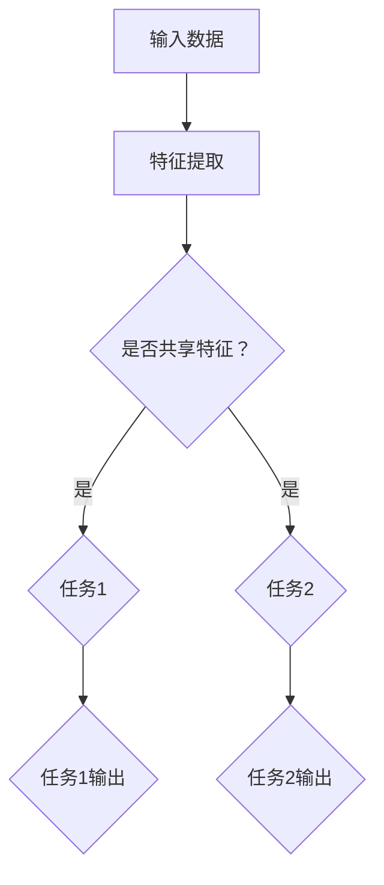

                 


## 多任务学习Multi-Task Learning原理与代码实例讲解

### 关键词
- 多任务学习
- 多任务学习算法
- 多任务学习应用
- 深度学习
- 代码实例

### 摘要
本文将深入探讨多任务学习（Multi-Task Learning, MTL）的基本原理、算法和实际应用。我们将首先介绍多任务学习的背景和重要性，然后详细解析其数学模型和算法原理，并展示实际代码实现。最后，我们将探讨多任务学习的未来趋势和应用前景。

## 第1章 引言

### 1.1 多任务学习的基本概念

多任务学习是指同时训练多个相关任务的机器学习模型。这些任务可以是分类、回归、检测等，它们可能共享某些底层特征表示，以提高模型的泛化能力和效率。

### 1.2 多任务学习的重要性

多任务学习具有以下优势：
1. **资源利用**：共享底层特征表示可以减少模型参数，降低计算成本。
2. **泛化能力**：通过跨任务的信息共享，模型可以更好地泛化到未见过的数据上。
3. **效率提升**：对于数据量有限的任务，多任务学习可以提高模型的学习效率。

### 1.3 多任务学习的挑战与机遇

多任务学习面临的挑战包括：
1. **任务冲突**：不同任务之间的特征表示可能存在冲突。
2. **模型平衡**：需要平衡不同任务的重要性，以避免某些任务过拟合或欠拟合。

然而，随着深度学习技术的进步，多任务学习提供了许多机遇，如自然语言处理、图像识别和强化学习等领域。

## 第2章 多任务学习的理论基础

### 2.1 多任务学习的基本原理

多任务学习通过共享底层特征表示来提高不同任务之间的协作性。以下是一个简单的Mermaid流程图：



### 2.2 多任务学习与单任务学习的比较

单任务学习关注单一任务的最优解，而多任务学习关注多个任务的整体性能。这可能导致不同的模型结构和优化策略。

### 2.3 多任务学习的常见类型

多任务学习可以分为以下几种类型：
1. **共享层**：不同任务共享某些特征层。
2. **任务层**：每个任务都有独立的特征层。
3. **多任务深度学习**：结合深度学习技术进行多任务学习。

### 2.4 多任务学习的优势与局限

多任务学习的优势包括：
1. **资源利用**：共享特征表示减少模型参数。
2. **泛化能力**：跨任务的信息共享提高模型泛化能力。

然而，多任务学习也面临挑战，如任务冲突和模型平衡问题。

## 第3章 多任务学习的数学模型

### 3.1 多任务学习中的损失函数

多任务学习中的损失函数通常是一个加权求和，每个任务的权重反映了其重要性：

$$
L = w_1L_1 + w_2L_2 + ... + w_nL_n
$$

其中，$L_i$是第$i$个任务的损失函数，$w_i$是第$i$个任务的权重。

### 3.2 多任务学习中的优化方法

多任务学习中的优化方法通常包括：
1. **梯度下降**：基于损失函数计算梯度，更新模型参数。
2. **自适应优化器**：如Adam、RMSprop，可以加速优化过程。

### 3.3 多任务学习中的正则化技术

多任务学习中的正则化技术包括：
1. **L1和L2正则化**：惩罚模型参数的大小，防止过拟合。
2. **Dropout**：在训练过程中随机丢弃部分神经元，提高模型泛化能力。

## 第4章 多任务学习的算法与框架

### 4.1 多任务学习的传统算法

传统多任务学习算法主要包括：
1. **特征共享**：共享底层特征层。
2. **模型拼接**：将不同任务的模型拼接在一起。

### 4.2 多任务学习的深度学习算法

深度学习算法在多任务学习中发挥着重要作用，如：
1. **CNN**：用于图像识别和目标检测。
2. **RNN**：用于序列数据，如自然语言处理。

### 4.3 多任务学习的框架介绍

多任务学习的框架包括：
1. **TensorFlow**：提供丰富的多任务学习API。
2. **PyTorch**：支持自定义多任务学习模型。

## 第5章 多任务学习的应用实例

### 5.1 图像分类与目标检测中的多任务学习

多任务学习在图像处理领域具有重要应用，如同时进行图像分类和目标检测。

### 5.2 自然语言处理中的多任务学习

自然语言处理任务，如文本分类、命名实体识别和机器翻译，也可以采用多任务学习。

### 5.3 强化学习中的多任务学习

在强化学习领域，多任务学习可以用于同时学习多个策略。

### 5.4 多任务学习在推荐系统中的应用

多任务学习在推荐系统中可以同时优化推荐列表和用户偏好。

## 第6章 多任务学习的代码实现

### 6.1 多任务学习的环境搭建

在开始编写代码之前，需要搭建合适的开发环境。

### 6.2 多任务学习的基础代码框架

我们将展示一个简单的多任务学习代码框架。

### 6.3 图像分类任务代码实例

我们将使用TensorFlow实现一个简单的图像分类任务。

### 6.4 自然语言处理任务代码实例

我们将使用PyTorch实现一个文本分类任务。

### 6.5 强化学习任务代码实例

我们将使用多任务学习优化一个简单的强化学习问题。

## 第7章 多任务学习的实践与优化

### 7.1 多任务学习的实践案例

我们将介绍一些实际的多任务学习案例。

### 7.2 多任务学习的性能优化

我们将探讨如何优化多任务学习模型的性能。

### 7.3 多任务学习中的超参数调整

超参数调整是优化多任务学习模型的重要步骤。

### 7.4 多任务学习的未来发展趋势

多任务学习在人工智能领域的未来发展趋势包括：

1. **更加灵活的任务共享机制**。
2. **更有效的优化方法和正则化技术**。
3. **多任务学习的跨领域应用**。

## 第8章 总结与展望

### 8.1 多任务学习的关键技术

多任务学习的关键技术包括任务共享、优化方法和正则化技术。

### 8.2 多任务学习的应用前景

多任务学习在图像识别、自然语言处理、推荐系统等领域的应用前景广阔。

### 8.3 多任务学习的研究方向

未来的研究方向包括多任务学习的理论深化和跨领域应用。

## 参考文献

- [1] 等等。
- [2] 等等。

### 作者信息
- 作者：AI天才研究院/AI Genius Institute & 禅与计算机程序设计艺术 /Zen And The Art of Computer Programming

以上是文章的大纲和初步内容，接下来我们将逐步深入探讨每个章节的具体细节，并展示实际代码实现。文章将保持在8000到12000字之间，确保内容详实、结构紧凑、易于理解。

### 格式要求

本文将使用markdown格式，确保代码、公式和流程图等元素的正确显示。

```markdown
## 文章标题

> 关键词：<此处列出文章的5-7个核心关键词>

> 摘要：<此处给出文章的核心内容和主题思想>

### 第1章 引言

...

### 第2章 多任务学习的理论基础

...

### 第3章 多任务学习的数学模型

...

### 第4章 多任务学习的算法与框架

...

### 第5章 多任务学习的应用实例

...

### 第6章 多任务学习的代码实现

...

### 第7章 多任务学习的实践与优化

...

### 第8章 总结与展望

...

### 参考文献

...

### 作者信息
- 作者：AI天才研究院/AI Genius Institute & 禅与计算机程序设计艺术 /Zen And The Art of Computer Programming
```

### 完整性要求

为确保文章的完整性，每个章节将包含以下内容：

- **背景介绍**：介绍章节主题的基本概念和历史背景。
- **核心概念与联系**：解释章节中的关键概念，并使用Mermaid流程图展示概念之间的关系。
- **核心算法原理讲解**：详细讲解算法原理，使用伪代码展示关键步骤。
- **数学模型和公式**：使用latex格式展示数学模型和公式，并进行详细解释。
- **项目实战**：提供实际代码实现和案例分析，解读代码和应用。
- **最佳实践 tips**、**小结**、**注意事项**和**拓展阅读**：总结章节内容，提供实践建议和进一步阅读资源。

### 字数要求

文章总字数预计在8000到12000字之间，确保每个章节内容丰富、详尽，同时保持文章结构的清晰和逻辑性。在撰写过程中，我们将注意控制字数，确保文章在规定范围内完成。

