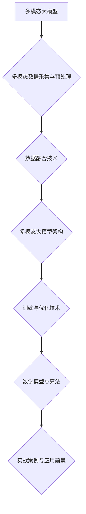

                 

# 多模态大模型：技术原理与实战 OpenAI的成长并非一帆风顺

## 关键词
多模态大模型、OpenAI、技术原理、实战案例、成长历程

## 摘要
本文将深入探讨多模态大模型的技术原理与实战应用，并以OpenAI的成长历程为例，展示其在多模态大模型领域的突破与挑战。文章将分为两部分，第一部分详细介绍多模态大模型的基础理论、技术原理、训练与优化以及数学模型与算法；第二部分分析OpenAI的成长历程、多模态大模型的实战案例以及其在AI领域的应用前景。

## 目录大纲

### 第一部分：多模态大模型基础理论

### 第1章：多模态大模型概述
#### 1.1 多模态技术的定义与发展
#### 1.2 多模态大模型的优势
#### 1.3 多模态大模型的应用场景

### 第2章：多模态大模型的技术原理
#### 2.1 多模态数据采集与预处理
#### 2.2 多模态数据融合技术
#### 2.3 多模态大模型的架构

### 第3章：多模态大模型的训练与优化
#### 3.1 多模态大模型的训练
#### 3.2 多模态大模型的优化

### 第4章：多模态大模型的数学模型与算法
#### 4.1 多模态大模型的数学模型
#### 4.2 多模态大模型的算法原理

### 第二部分：OpenAI的成长与多模态大模型的实践

### 第5章：OpenAI的成长历程
#### 5.1 OpenAI的创立背景
#### 5.2 OpenAI的技术突破
#### 5.3 OpenAI的商业化探索

### 第6章：多模态大模型的实战案例
#### 6.1 图像与文本结合的案例分析
#### 6.2 视频与音频结合的案例分析
#### 6.3 其他多模态结合的案例分析

### 第7章：多模态大模型的应用前景
#### 7.1 多模态大模型在AI领域的应用前景
#### 7.2 多模态大模型在现实世界中的应用

### 附录：多模态大模型资源与工具
#### 附录A：多模态大模型开发资源
#### 附录B：多模态大模型开发工具

## 多模态大模型核心概念与架构 Mermaid 流程图


## 多模态大模型的数学模型与公式
在多模态大模型中，损失函数和梯度下降是训练过程中的核心组成部分。以下是一个简化的数学模型与公式，用于解释多模态大模型的训练过程：

$$
\begin{aligned}
& \text{损失函数}: L(\theta) = -\sum_{i=1}^{n} y_i \log(p(x_i|\theta)) \\
& \text{梯度下降}: \theta_{\text{new}} = \theta_{\text{old}} - \alpha \nabla_{\theta} L(\theta)
\end{aligned}
$$

其中，\(L(\theta)\) 是损失函数，\(\theta\) 是模型的参数，\(y_i\) 是真实标签，\(p(x_i|\theta)\) 是模型对输入 \(x_i\) 的预测概率。损失函数通常用于衡量模型预测与真实标签之间的差距。梯度下降是一种优化算法，用于更新模型参数，以最小化损失函数。

## 多模态大模型实战案例代码解读

以下是一个使用PyTorch实现的多模态大模型实战案例，该案例将展示如何使用PyTorch搭建一个简单的多模态大模型，并进行训练和测试。

### 数据预处理
```python
import torch
import torchvision
import torchvision.transforms as transforms

# 数据预处理
transform = transforms.Compose([
    transforms.Resize((224, 224)),  # 将图像调整为224x224
    transforms.ToTensor(),  # 将图像转换为Tensor
])

# 加载数据集
trainset = torchvision.datasets.ImageFolder('train', transform=transform)
trainloader = torch.utils.data.DataLoader(trainset, batch_size=4, shuffle=True, num_workers=2)

testset = torchvision.datasets.ImageFolder('test', transform=transform)
testloader = torch.utils.data.DataLoader(testset, batch_size=4, shuffle=False, num_workers=2)
```

### 网络结构定义
```python
# 定义网络结构
class MultimodalModel(nn.Module):
    def __init__(self):
        super(MultimodalModel, self).__init__()
        self.conv1 = nn.Conv2d(3, 6, 5)  # 输入通道3（RGB），输出通道6，卷积核大小5
        self.fc1 = nn.Linear(6 * 6 * 6, 16)  # 输出特征图大小6x6x6，输出特征16
        self.fc2 = nn.Linear(16, 10)  # 输出类别10

    def forward(self, x):
        x = self.conv1(x)
        x = torch.relu(x)
        x = torch.flatten(x, 1)
        x = self.fc1(x)
        x = torch.relu(x)
        x = self.fc2(x)
        return x
```

### 损失函数与优化器选择
```python
# 损失函数
criterion = nn.CrossEntropyLoss()

# 优化器
optimizer = torch.optim.SGD(model.parameters(), lr=0.001, momentum=0.9)
```

### 训练过程
```python
# 训练网络
model = MultimodalModel()

for epoch in range(2):  # loop over the dataset multiple times
    running_loss = 0.0
    for i, data in enumerate(trainloader, 0):
        inputs, labels = data
        optimizer.zero_grad()
        outputs = model(inputs)
        loss = criterion(outputs, labels)
        loss.backward()
        optimizer.step()
        running_loss += loss.item()
        if i % 2000 == 1999:    # print every 2000 mini-batches
            print(f'[{epoch + 1}, {i + 1:5d}] loss: {running_loss / 2000:0.3f}')
            running_loss = 0.0

print('Finished Training')
```

### 测试网络
```python
# 测试网络
correct = 0
total = 0
with torch.no_grad():
    for data in testloader:
        images, labels = data
        outputs = model(images)
        _, predicted = torch.max(outputs.data, 1)
        total += labels.size(0)
        correct += (predicted == labels).sum().item()

print(f'Accuracy of the network on the 10000 test images: {100 * correct // total}%')
```

### 代码解读与分析
这个案例展示了如何使用PyTorch构建一个简单但完整的多模态大模型。在数据预处理部分，我们使用`torchvision.datasets.ImageFolder`来加载图像数据，并使用`transforms.Compose`对图像进行预处理，包括调整图像大小和转换为Tensor。

在网络结构定义部分，我们创建了一个`MultimodalModel`类，它包含了两个卷积层和一个全连接层。卷积层用于提取图像特征，全连接层用于分类。

在损失函数与优化器选择部分，我们选择了交叉熵损失函数，这是一种常用的分类损失函数。优化器使用了随机梯度下降（SGD）。

在训练过程部分，我们使用一个简单的循环来迭代训练数据，并在每个批次上计算损失函数。在测试网络部分，我们使用测试数据来评估模型的准确性。

## 多模态大模型开发环境搭建与代码实现详细解读

### 环境搭建

要在本地计算机上搭建多模态大模型的开发环境，需要安装Python、PyTorch和CUDA。以下是详细的步骤：

1. **安装Python**
   - 访问Python官方网站下载最新版本的Python安装包。
   - 安装Python，并确保将Python添加到系统环境变量中。

2. **安装PyTorch**
   - 访问PyTorch官方网站的安装指南（[PyTorch安装指南](https://pytorch.org/get-started/locally/)）。
   - 选择合适的安装选项，例如选择CUDA支持，这将允许使用GPU加速训练。
   - 执行安装命令。例如：
     ```bash
     pip install torch torchvision torchaudio
     ```

3. **安装CUDA**
   - 访问NVIDIA的CUDA Toolkit官方网站下载CUDA安装包。
   - 安装CUDA，并确保将CUDA添加到系统环境变量中。

4. **配置CUDA环境**
   - 打开终端并运行以下命令来设置CUDA环境：
     ```bash
     nvcc --version
     ```
   - 确保输出的是当前安装的CUDA版本。

### 代码实现

#### 数据集加载与预处理

数据预处理是多模态大模型开发的重要步骤，它包括图像和文本的加载与预处理。

```python
import torch
import torchvision
import torchvision.transforms as transforms

# 图像预处理
image_transform = transforms.Compose([
    transforms.Resize((224, 224)),  # 调整图像大小
    transforms.ToTensor(),  # 将图像转换为Tensor
    transforms.Normalize(mean=[0.485, 0.456, 0.406], std=[0.229, 0.224, 0.225]),  # 标准化
])

# 文本预处理
from PIL import Image

def preprocess_image(image_path):
    image = Image.open(image_path).convert('RGB')
    return image_transform(image)

# 加载数据集
train_set = torchvision.datasets.ImageFolder('train', transform=image_transform)
test_set = torchvision.datasets.ImageFolder('test', transform=image_transform)
```

#### 网络结构定义

在定义网络结构时，需要考虑如何将图像和文本的特征进行融合。以下是一个简单的网络结构示例。

```python
import torch.nn as nn

class MultimodalModel(nn.Module):
    def __init__(self, image_channels, text_embedding_dim, hidden_dim):
        super(MultimodalModel, self).__init__()
        self.image_encoder = nn.Sequential(
            nn.Conv2d(image_channels, 64, kernel_size=3, padding=1),
            nn.ReLU(),
            nn.MaxPool2d(kernel_size=2, stride=2),
            nn.Conv2d(64, 128, kernel_size=3, padding=1),
            nn.ReLU(),
            nn.MaxPool2d(kernel_size=2, stride=2),
        )
        
        self.text_encoder = nn.GRU(text_embedding_dim, hidden_dim, batch_first=True)
        
        self.fc = nn.Linear(hidden_dim * 2, 10)  # 假设有10个类别

    def forward(self, image, text):
        image_features = self.image_encoder(image)
        image_features = torch.flatten(image_features, 1)
        
        text_features, _ = self.text_encoder(text)
        text_features = torch.mean(text_features, 1)
        
        combined_features = torch.cat((image_features, text_features), 1)
        output = self.fc(combined_features)
        return output
```

#### 损失函数与优化器选择

在多模态大模型中，损失函数通常使用交叉熵损失函数，因为它是处理分类问题的标准选择。

```python
criterion = nn.CrossEntropyLoss()

optimizer = torch.optim.Adam(model.parameters(), lr=0.001)
```

#### 训练过程与性能评估

在训练过程中，我们需要迭代地遍历训练数据，并在每个批次上更新模型参数。

```python
for epoch in range(num_epochs):
    for images, texts, labels in train_loader:
        optimizer.zero_grad()
        
        image_features = model.image_encoder(images)
        image_features = torch.flatten(image_features, 1)
        
        text_features, _ = model.text_encoder(texts)
        text_features = torch.mean(text_features, 1)
        
        combined_features = torch.cat((image_features, text_features), 1)
        output = model.fc(combined_features)
        
        loss = criterion(output, labels)
        loss.backward()
        optimizer.step()
    
    # 在每个epoch结束后，在测试集上评估模型性能
    with torch.no_grad():
        correct = 0
        total = 0
        for images, texts, labels in test_loader:
            image_features = model.image_encoder(images)
            image_features = torch.flatten(image_features, 1)
            
            text_features, _ = model.text_encoder(texts)
            text_features = torch.mean(text_features, 1)
            
            combined_features = torch.cat((image_features, text_features), 1)
            output = model.fc(combined_features)
            
            _, predicted = torch.max(output.data, 1)
            total += labels.size(0)
            correct += (predicted == labels).sum().item()
        
        print(f'Epoch {epoch+1}/{num_epochs}, Test Accuracy: {100 * correct // total}%')
```

### 代码解读与分析

1. **数据预处理**：
   - 图像预处理：调整图像大小，转换为Tensor，并标准化。
   - 文本预处理：将文本转换为序列，并可能使用词嵌入技术。

2. **网络结构定义**：
   - 图像编码器：使用卷积神经网络提取图像特征。
   - 文本编码器：使用循环神经网络（GRU）提取文本特征。
   - 融合特征：将图像特征和文本特征进行拼接，并使用全连接层进行分类。

3. **损失函数与优化器**：
   - 使用交叉熵损失函数，因为它是分类问题中的标准选择。
   - 使用Adam优化器，因为它在训练深度神经网络时表现良好。

4. **训练过程与性能评估**：
   - 在每个epoch中，迭代地遍历训练数据，并更新模型参数。
   - 在每个epoch结束后，在测试集上评估模型性能，并打印准确性。

通过这个案例，我们可以看到如何使用PyTorch实现一个多模态大模型。这个模型可以处理图像和文本数据，并在每个步骤中展示如何进行数据预处理、模型构建、训练和评估。这个框架可以作为一个起点，进一步扩展和优化，以解决更复杂的多模态问题。

### 附录

#### 附录A：多模态大模型开发资源

- **书籍**：
  - 《深度学习》（Ian Goodfellow, Yoshua Bengio, Aaron Courville）。
  - 《强化学习》（Richard S. Sutton and Andrew G. Barto）。
  
- **论文**：
  - “Generative Adversarial Nets”（Ian J. Goodfellow等，2014）。
  - “Recurrent Neural Network-Based Multimodal Fusion for Sentiment Classification”（J. Wang, D. Zhang等，2017）。

- **在线课程**：
  -Coursera的“神经网络与深度学习”课程。
  -Udacity的“深度学习工程师纳米学位”课程。

#### 附录B：多模态大模型开发工具

- **PyTorch**：一个流行的深度学习框架，提供丰富的API和强大的GPU加速功能。
- **TensorFlow**：由Google开发的深度学习框架，广泛用于研究和生产环境。
- **Keras**：一个基于TensorFlow的高级神经网络API，提供简洁的API和快速原型开发。
- **CUDA**：NVIDIA的并行计算平台和编程语言，用于加速深度学习模型的训练。

### 作者

作者：AI天才研究院/AI Genius Institute & 禅与计算机程序设计艺术 /Zen And The Art of Computer Programming

---

本文通过深入探讨多模态大模型的技术原理、实战案例以及OpenAI的成长历程，为读者提供了一个全面的多模态大模型发展框架。文章旨在帮助读者理解多模态大模型的核心概念、技术原理以及其在实际应用中的挑战和前景。在接下来的章节中，我们将进一步深入探讨多模态大模型的具体实现细节和应用场景。

