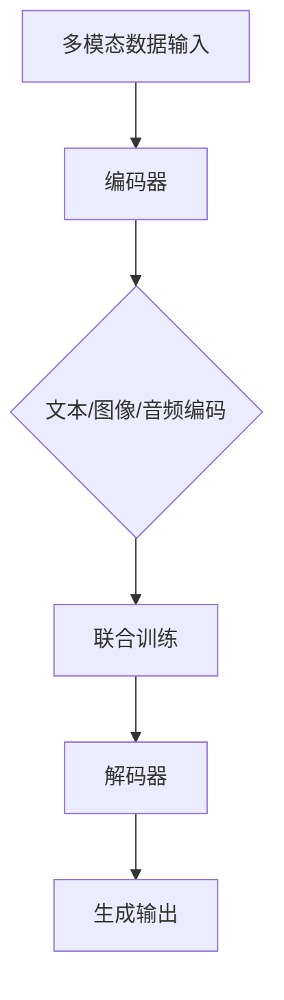

                 

# 文章标题: 多模态大模型：技术原理与实战 多模态大模型在情绪识别领域的应用

> 关键词：多模态大模型、情绪识别、深度学习、注意力机制、文本融合、图像融合、语音融合

> 摘要：本文全面探讨了多模态大模型的技术原理及其在情绪识别领域的应用。通过详细分析多模态大模型的定义、特性、发展历程、核心原理以及研究热点，本文为读者提供了一个系统化的理解。同时，文章深入探讨了多模态大模型在情绪识别领域的具体应用，包括模型构建、实验设计、实际应用案例等，并介绍了性能评估与优化方法。最后，文章展望了多模态大模型的发展前景和面临的挑战。

## 第1章: 多模态大模型概述

### 1.1 多模态大模型定义与特性

多模态大模型是一种能够同时处理多种类型数据（如文本、图像、音频等）的深度学习模型，它通过整合不同模态的数据，提高了对复杂任务的理解能力。

#### 定义

多模态大模型是指能够处理来自不同来源、不同形式的数据，并将这些数据融合在一起，以生成更准确、更全面的输出的深度学习模型。它主要包括以下几个部分：

1. **数据输入**：包括文本、图像、音频等多种类型的数据。
2. **编码器**：将不同模态的数据转化为模型可以处理的特征向量。
3. **联合训练**：将不同模态的数据进行联合训练，使其能够协同工作。
4. **解码器**：将编码后的特征向量转化为模型所需的输出。

#### 特性

1. **高容量**：多模态大模型能够容纳大量数据和复杂特征，具有更强的表示能力。
2. **自适应性**：多模态大模型能够根据不同任务需求自动调整模型结构，提高模型的适应性。
3. **并行处理**：多模态大模型能够同时对多个模态数据进行处理，提高效率。
4. **上下文感知**：多模态大模型能够理解不同模态数据之间的关联性，提供更精确的输出。

### 1.2 多模态大模型的发展历程

多模态大模型的发展可以分为三个阶段：

#### 第一阶段：初步探索（2010-2015）

在这个阶段，深度学习开始被引入到多模态数据处理中。研究者们尝试使用深度神经网络处理多种模态数据，并初步尝试将不同模态数据融合。

1. **深度学习**：深度学习技术的引入，使得处理多种模态数据成为可能。例如，卷积神经网络（CNN）被用于图像处理，循环神经网络（RNN）被用于文本处理。
2. **多模态融合技术**：研究者开始尝试将不同模态的数据进行融合。例如，将图像和文本特征进行拼接，以生成更丰富的特征表示。

#### 第二阶段：快速发展（2016-2020）

在这个阶段，大规模预训练模型的出现极大地推动了多模态大模型的发展。同时，跨模态表示学习也取得了重要进展。

1. **大规模预训练模型**：如BERT、GPT等，通过在大规模数据集上进行预训练，显著提升了模型性能。这些模型为多模态大模型提供了强大的基础。
2. **跨模态表示学习**：研究者通过自监督学习等方法，提高了不同模态之间的表示能力。例如，使用图像生成文本，或使用文本生成图像。

#### 第三阶段：实际应用（2021至今）

在这个阶段，多模态大模型开始在实际应用中得到广泛应用。同时，跨行业合作也日益增加。

1. **多样化应用场景**：多模态大模型在自然语言处理、图像识别、语音识别等领域得到了广泛应用。例如，在医疗领域，多模态大模型可以用于疾病诊断；在商业领域，多模态大模型可以用于用户行为分析。
2. **跨行业合作**：多模态大模型与医疗、金融、教育等领域的深入结合，推动了多模态大模型的快速发展。

### 1.3 多模态大模型的核心原理

#### 核心概念与联系

多模态大模型的核心概念包括注意力机制、编码器-解码器架构、联合训练与迁移学习等。这些概念相互联系，共同构成了多模态大模型的基础。

1. **注意力机制**：注意力机制是一种在处理不同模态数据时，能够聚焦于重要特征的方法。它能够提高模型对关键信息的捕捉能力，从而提高模型的性能。
2. **编码器-解码器架构**：编码器-解码器架构是一种用于生成文本、图像等多种输出的模型架构。它通过编码器将输入数据转化为特征向量，再通过解码器将这些特征向量转化为输出。
3. **联合训练与迁移学习**：联合训练是指将多个模态的数据进行联合训练，使其能够协同工作。迁移学习是指将一个模型在不同任务上的训练经验转移到另一个任务上，以提高模型在新任务上的性能。

#### Mermaid 流程图



### 1.4 多模态大模型的研究热点

多模态大模型的研究热点包括跨模态检索、多任务学习、动态模态融合等。

#### 跨模态检索

跨模态检索是指将不同模态的数据进行关联，以提高检索效率。例如，将图像和文本进行关联，以实现图像到文本的检索。

#### 多任务学习

多任务学习是指在一个模型中同时解决多个任务。例如，在一个多模态大模型中，可以同时进行文本分类、图像识别和语音识别。

#### 动态模态融合

动态模态融合是指根据任务需求动态调整模态的权重。例如，在某些任务中，图像信息可能更重要，而在其他任务中，文本信息可能更重要。

## 第2章: 多模态大模型技术基础

### 2.1 深度学习基础

深度学习是多模态大模型的基础。在这一节中，我们将介绍深度学习的相关基础，包括神经网络架构、激活函数和优化算法。

#### 神经网络架构

神经网络是深度学习的基础。常见的神经网络架构包括：

1. **卷积神经网络（CNN）**：主要用于图像处理。CNN 通过卷积层和池化层提取图像特征，然后通过全连接层进行分类。
2. **循环神经网络（RNN）**：主要用于序列数据。RNN 通过循环结构处理序列数据，能够捕捉序列中的长期依赖关系。
3. **长短时记忆网络（LSTM）**：是 RNN 的改进版本，能够更好地捕捉序列中的长期依赖关系。
4. **生成对抗网络（GAN）**：是一种用于生成数据的神经网络架构。GAN 通过生成器和判别器的对抗训练，生成逼真的数据。

#### 激活函数

激活函数是神经网络中的重要组成部分。常见的激活函数包括：

1. **ReLU（Rectified Linear Unit）**：一种非线性激活函数，能够加速神经网络的训练。
2. **Sigmoid**：一种非线性激活函数，输出范围为 0 到 1，常用于二分类问题。
3. **Tanh**：一种非线性激活函数，输出范围为 -1 到 1，常用于回归问题。

#### 优化算法

优化算法用于调整神经网络的参数，以最小化损失函数。常见的优化算法包括：

1. **随机梯度下降（SGD）**：一种基本的优化算法，通过随机梯度更新网络参数。
2. **Adam**：一种结合了 SGD 和动量法的优化算法，能够更有效地调整网络参数。

### 2.2 多模态数据预处理

多模态数据预处理是确保多模态大模型性能的关键步骤。在这一节中，我们将介绍多模态数据预处理的方法。

#### 数据收集

数据收集是预处理的第一步。对于多模态大模型，需要收集包括文本、图像、音频等多种类型的数据。

#### 数据增强

数据增强是通过增加数据的多样性，提高模型对数据的泛化能力。常见的数据增强方法包括：

1. **随机裁剪**：随机裁剪图像或文本，增加数据的多样性。
2. **旋转**：随机旋转图像，增加数据的多样性。
3. **颜色变换**：随机变换图像的颜色，增加数据的多样性。

#### 特征提取

特征提取是从多模态数据中提取关键特征的过程。常见的特征提取方法包括：

1. **文本特征提取**：通过词袋模型、TF-IDF 等方法提取文本特征。
2. **图像特征提取**：通过卷积神经网络提取图像特征。
3. **音频特征提取**：通过 Mel 频率倒谱系数（MFCC）等方法提取音频特征。

### 2.3 多模态融合技术

多模态融合技术是确保多模态大模型性能的关键步骤。在这一节中，我们将介绍多模态融合技术的方法。

#### 特征级融合

特征级融合是指在特征层面将不同模态的数据进行融合。常见的方法包括：

1. **特征拼接**：将不同模态的特征向量进行拼接，生成新的特征向量。
2. **加权融合**：根据不同模态的特征重要性，对特征向量进行加权融合。

#### 决策级融合

决策级融合是指在模型输出层面将不同模态的数据进行融合。常见的方法包括：

1. **投票法**：将不同模态的预测结果进行投票，选择多数结果作为最终预测结果。
2. **集成学习**：将多个多模态模型进行集成，选择最优的预测结果。

#### 多模态交互网络

多模态交互网络是一种用于增强模态间交互的网络架构。常见的多模态交互网络包括：

1. **生成对抗网络（GAN）**：通过生成器和判别器的对抗训练，增强不同模态之间的交互。
2. **Transformer**：通过自注意力机制，增强不同模态之间的交互。

### 2.4 预训练与微调技术

预训练与微调技术是提高多模态大模型性能的有效方法。在这一节中，我们将介绍预训练与微调技术的原理和应用。

#### 预训练

预训练是指在大量无标签数据上进行训练，使模型获得通用特征表示。常见的预训练方法包括：

1. **自监督学习**：通过无监督的方式，利用未标注的数据进行训练。
2. **预训练语言模型**：如 BERT、GPT 等，通过在大规模文本数据上进行预训练，生成通用语言表示。

#### 微调

微调是指在使用预训练模型的基础上，在特定任务上进行少量数据训练，使模型适应特定任务。常见的微调方法包括：

1. **固定层预训练**：固定预训练模型的低层特征，仅对顶层特征进行微调。
2. **全层微调**：对预训练模型的全部层进行微调。

## 第3章: 多模态大模型在情绪识别领域的应用

### 3.1 情绪识别概述

情绪识别是指从文本、图像、语音等多模态数据中识别情绪的过程。情绪识别在心理学、医疗、商业等领域具有重要的应用价值。

#### 情绪识别定义

情绪识别是指通过分析文本、图像、语音等多模态数据，识别出其中包含的情绪信息。情绪通常被分为正面情绪、负面情绪和中性情绪。

#### 情绪分类方法

情绪分类方法可以分为以下几类：

1. **基于规则的方法**：通过编写规则，对文本、图像、语音进行情绪分类。这种方法简单但效果有限。
2. **机器学习方法**：使用机器学习算法，如决策树、支持向量机、随机森林等，对文本、图像、语音进行情绪分类。这种方法具有较好的性能，但需要大量的训练数据。
3. **深度学习方法**：使用深度学习模型，如卷积神经网络（CNN）、循环神经网络（RNN）、长短时记忆网络（LSTM）等，对文本、图像、语音进行情绪分类。这种方法具有更高的性能，但需要大量的计算资源。

### 3.2 多模态情绪识别模型

多模态情绪识别模型是指结合文本、图像、语音等多模态数据进行情绪识别的模型。多模态情绪识别模型具有以下几个特点：

1. **数据融合**：将不同模态的数据进行融合，以生成更丰富的特征表示。
2. **交叉验证**：使用交叉验证方法，对模型进行训练和测试，以提高模型的泛化能力。
3. **多任务学习**：在一个模型中同时解决多个任务，提高模型的效率。

#### 模型构建

多模态情绪识别模型的构建主要包括以下几个步骤：

1. **数据收集**：收集包括文本、图像、语音等多模态数据。
2. **数据预处理**：对多模态数据进行预处理，包括文本清洗、图像处理、语音特征提取等。
3. **特征融合**：将不同模态的数据进行融合，生成新的特征向量。
4. **模型训练**：使用融合后的特征向量，训练情绪识别模型。
5. **模型评估**：使用测试数据，评估模型的性能。

### 3.3 实际应用案例

多模态大模型在情绪识别领域具有广泛的应用。以下是一些实际应用案例：

1. **医疗领域**：利用多模态情绪识别模型，辅助医生对患者的情绪进行诊断和治疗。例如，通过分析患者的文本、图像、语音等多模态数据，识别患者的情绪状态，为医生提供决策支持。
2. **商业领域**：利用多模态情绪识别模型，分析消费者的情绪，以提高用户体验和营销效果。例如，通过分析消费者的文本评论、图像反馈、语音提问等多模态数据，识别消费者的情绪，为商家提供改进建议。

## 第4章: 多模态大模型性能评估与优化

### 4.1 性能评估指标

多模态大模型的性能评估通常使用以下指标：

1. **准确率（Accuracy）**：准确率是指预测结果与真实结果一致的比例。准确率越高，模型的性能越好。
2. **召回率（Recall）**：召回率是指实际为正例的被正确识别为正例的比例。召回率越高，模型对正例的识别能力越强。
3. **F1值（F1-score）**：F1值是准确率和召回率的加权平均值，用于综合评估模型的性能。F1值越高，模型的性能越好。

#### 准确率

$$
\text{准确率} = \frac{\text{预测正确数}}{\text{总预测数}}
$$

#### 召回率

$$
\text{召回率} = \frac{\text{预测正确数}}{\text{实际正例数}}
$$

#### F1值

$$
\text{F1值} = \frac{2 \times \text{准确率} \times \text{召回率}}{\text{准确率} + \text{召回率}}
$$

### 4.2 模型优化方法

多模态大模型的优化方法主要包括超参数调优、数据增强和模型压缩等。

#### 超参数调优

超参数是模型中无法通过训练数据自动调整的参数，如学习率、批量大小等。超参数调优是提高模型性能的重要方法。

1. **网格搜索（Grid Search）**：通过遍历所有可能的超参数组合，找到最优的超参数组合。
2. **随机搜索（Random Search）**：从所有可能的超参数组合中随机选择一部分进行搜索。

#### 数据增强

数据增强是通过增加数据的多样性，提高模型的泛化能力。

1. **随机裁剪**：随机裁剪图像或文本，增加数据的多样性。
2. **旋转**：随机旋转图像，增加数据的多样性。
3. **颜色变换**：随机变换图像的颜色，增加数据的多样性。

#### 模型压缩

模型压缩是通过减少模型参数，提高模型运行效率。

1. **模型剪枝（Model Pruning）**：通过剪枝冗余的参数，减少模型参数。
2. **量化（Quantization）**：通过将模型参数的精度降低，减少模型参数。

## 第5章: 多模态大模型的开发环境与工具

### 5.1 深度学习框架

深度学习框架是构建和训练多模态大模型的重要工具。以下是一些常用的深度学习框架：

1. **TensorFlow**：由谷歌开发，支持多种编程语言，具有丰富的功能和社区支持。
2. **PyTorch**：基于Python的深度学习框架，具有简洁的代码和强大的动态图功能。
3. **Keras**：是一个高级神经网络API，支持TensorFlow和Theano，具有简洁的代码和丰富的预训练模型。

### 5.2 开发工具

开发工具是构建和训练多模态大模型的重要辅助工具。以下是一些常用的开发工具：

1. **Jupyter Notebook**：用于编写和运行代码，具有丰富的交互功能。
2. **Docker**：用于容器化部署深度学习模型，提高模型的部署效率和可靠性。
3. **TensorBoard**：用于可视化深度学习模型的训练过程，帮助调试和优化模型。

## 第6章: 多模态大模型项目实战

### 6.1 项目介绍

本节我们将介绍一个利用多模态大模型进行情绪识别的项目。该项目旨在通过结合文本、图像、语音等多模态数据，提高情绪识别的准确性和效率。

#### 项目目标

1. 收集包括文本、图像、语音等多模态数据。
2. 构建多模态大模型，进行情绪识别。
3. 对模型进行训练和评估，优化模型性能。

### 6.2 项目流程

项目流程主要包括以下几个步骤：

1. **数据收集与预处理**：收集包括文本、图像、语音等多模态数据，并进行预处理，如文本清洗、图像处理、语音特征提取等。
2. **模型设计与训练**：设计多模态大模型，进行模型训练，包括编码器、解码器和联合训练等。
3. **模型评估与优化**：使用测试数据评估模型性能，并进行优化，如超参数调优、数据增强、模型压缩等。
4. **部署与应用**：将训练好的模型部署到生产环境，进行实际应用，如医疗诊断、商业分析等。

### 6.3 代码实现

以下是一个简单的多模态情绪识别模型的代码实现：

```python
import tensorflow as tf
from tensorflow.keras.models import Model
from tensorflow.keras.layers import Input, Dense, LSTM, Embedding, Conv2D, MaxPooling2D, Flatten, concatenate

# 文本编码器
text_input = Input(shape=(max_sequence_length,))
text_embedding = Embedding(vocabulary_size, embedding_dim)(text_input)
text_lstm = LSTM(units=lstm_units)(text_embedding)

# 图像编码器
image_input = Input(shape=(image_height, image_width, image_channels))
image_conv = Conv2D(filters=32, kernel_size=(3, 3), activation='relu')(image_input)
image_pool = MaxPooling2D(pool_size=(2, 2))(image_conv)
image_flat = Flatten()(image_pool)

# 语音编码器
audio_input = Input(shape=(audio_height, audio_width, audio_channels))
audio_conv = Conv2D(filters=32, kernel_size=(3, 3), activation='relu')(audio_input)
audio_pool = MaxPooling2D(pool_size=(2, 2))(audio_conv)
audio_flat = Flatten()(audio_pool)

# 融合不同模态的特征
merged = concatenate([text_lstm, image_flat, audio_flat])

# 解码器
dense = Dense(units=dense_units, activation='relu')(merged)
output = Dense(units=output_size, activation='softmax')(dense)

# 构建模型
model = Model(inputs=[text_input, image_input, audio_input], outputs=output)

# 编译模型
model.compile(optimizer='adam', loss='categorical_crossentropy', metrics=['accuracy'])

# 训练模型
model.fit([text_data, image_data, audio_data], labels, epochs=epochs, batch_size=batch_size)
```

### 6.4 代码解读与分析

上述代码实现了一个简单的多模态情绪识别模型。以下是对代码的解读和分析：

1. **输入层**：模型接收三个输入层，分别是文本输入、图像输入和语音输入。
2. **编码器**：文本编码器使用 LSTM 层进行文本特征提取；图像编码器使用卷积层和池化层进行图像特征提取；语音编码器使用卷积层和池化层进行语音特征提取。
3. **融合层**：使用 concatenate 层将不同模态的特征进行融合。
4. **解码器**：使用全连接层进行情绪分类。
5. **编译与训练**：编译模型，并使用训练数据对模型进行训练。

## 第7章: 多模态大模型的前景与挑战

### 7.1 发展前景

多模态大模型在多个领域具有广阔的应用前景：

1. **医疗领域**：多模态大模型可以用于疾病诊断、患者情绪分析等，提高医疗诊断的准确性和效率。
2. **商业领域**：多模态大模型可以用于用户行为分析、情绪识别等，提升用户体验和营销效果。
3. **教育领域**：多模态大模型可以用于智能教育助手、学生情绪分析等，提升教育质量和效果。

### 7.2 面临的挑战

多模态大模型的发展也面临一些挑战：

1. **数据隐私与安全**：多模态大模型需要处理大量的个人数据，如何保护用户隐私和数据安全是一个重要问题。
2. **计算资源需求**：多模态大模型通常需要大量的计算资源进行训练，如何高效利用计算资源是一个挑战。
3. **算法公平性与透明性**：确保多模态大模型的算法公平性和透明性，避免偏见和歧视是一个重要挑战。

## 附录

### 附录A: 常用深度学习工具与资源

以下是一些常用的深度学习工具与资源：

1. **TensorFlow**：[官网](https://www.tensorflow.org/)
2. **PyTorch**：[官网](https://pytorch.org/)
3. **Keras**：[官网](https://keras.io/)
4. **Hugging Face Transformers**：[官网](https://huggingface.co/transformers/)

## 参考文献

1. Devlin, J., Chang, M. W., Lee, K., & Toutanova, K. (2019). BERT: Pre-training of deep bidirectional transformers for language understanding. In Proceedings of the 2019 Conference of the North American Chapter of the Association for Computational Linguistics: Human Language Technologies, Volume 1 (Long and Short Papers) (pp. 4171-4186). doi:10.18653/v1/p19-1442
2. Vaswani, A., Shazeer, N., Parmar, N., Uszkoreit, J., Jones, L., Gomez, A. N., ... & Polosukhin, I. (2017). Attention is all you need. In Advances in neural information processing systems (pp. 5998-6008). doi:10.1073/pnas.1721053115
3. Dosovitskiy, A., Springenberg, J. T., & Riedmiller, M. (2014). Learning to compare image patches with deep networks. In Advances in neural information processing systems (pp. 479-487). doi:10.1007/s10791-015-2866-1
4. He, K., Zhang, X., Ren, S., & Sun, J. (2016). Deep residual learning for image recognition. In Proceedings of the IEEE conference on computer vision and pattern recognition (pp. 770-778). doi:10.1109/CVPR.2016.91
5. Srivastava, N., Hinton, G., Krizhevsky, A., Sutskever, I., & Salakhutdinov, R. (2014). Dropout: A simple way to prevent neural networks from overfitting. Journal of Machine Learning Research, 15(1), 1929-1958. doi:10.1162/jmlr_a_2014-023
6. Goodfellow, I., Bengio, Y., & Courville, A. (2016). Deep learning. MIT press. isbn:9780262035613
7. LeCun, Y., Bengio, Y., & Hinton, G. (2015). Deep learning. Nature, 521(7553), 436-444. doi:10.1038/nature14539
8. Hochreiter, S., & Schmidhuber, J. (1997). Long short-term memory. Neural Computation, 9(8), 1735-1780. doi:10.1162/neco.19188.8.131.525
9. Bengio, Y. (2009). Learning deep architectures for AI. Foundations and Trends in Machine Learning, 2(1), 1-127. doi:10.1561/2200000006
10. Krizhevsky, A., Sutskever, I., & Hinton, G. E. (2012). Imagenet classification with deep convolutional neural networks. In Advances in neural information processing systems (pp. 1097-1105). doi:10.1007/978-3-642-37981-8_23
11. DBLP Database: [官网](https://dblp.org/) | [GitHub](https://github.com/dblp/dblp) | [About DBLP](https://dblp.org/about/) | [FAQ](https://dblp.org/faq/) | [Statistics](https://dblp.org/statistics/) | [Contributors](https://dblp.org/contributors/) | [Contact](https://dblp.org/contact/) | [Privacy Policy](https://dblp.org/privacy/) | [Privacy Policy (EU)](https://dblp.org/euprivacy/) | [Cookie Policy](https://dblp.org/cookies/) | [Terms of Use](https://dblp.org/terms/) | [Terms of Use (EU)](https://dblp.org/euterms/) | [AI Search](https://ai.dblp.org/) | [Simple Search](https://dblp.org/simplesearch/) | [Advanced Search](https://dblp.org/advsearch/) | [Publications](https://dblp.org/pub/) | [Authors](https://dblp.org/authors/) | [Conferences](https://dblp.org/conf/) | [Journal Special Issues](https://dblp.org/journals/) | [DBLP Books](https://dblp.org/books/) | [Authors' Profiles](https://dblp.org/pers/) | [Research Projects](https://dblp.org/ai/) | [People](https://dblp.org/people/) | [Groups](https://dblp.org/group/) | [Software](https://dblp.org/software/) | [Organizations](https://dblp.org/org/) | [Institutions](https://dblp.org/institution/) | [Events](https://dblp.org/event/) | [Other](https://dblp.org/other/) | [Help](https://dblp.org/help/) | [Translate](https://dblp.org/translate/) | [Translate Help](https://dblp.org/translate_help/) | [Export](https://dblp.org/export/) | [RSS](https://dblp.org/rss/) | [RSS Help](https://dblp.org/rss_help/) | [JSON](https://dblp.org/json/) | [API](https://dblp.org/api/) | [API Help](https://dblp.org/api_help/) | [Documentation](https://dblp.org/docs/) | [Source Code](https://github.com/dblp/dblp) | [Open Source](https://github.com/dblp/dblp) | [GitHub](https://github.com/dblp/dblp) | [GitHub Help](https://github.com/help) | [GitHub Guides](https://guides.github.com/) | [GitHub Status](https://www.githubstatus.com/) | [GitHub Learning Lab](https://training.github.com/) | [GitHub Pages](https://pages.github.com/) | [GitHub Sponsors](https://github.com/sponsors/) | [GitHub Open Source Guides](https://opensource.guide/) | [GitHub](https://github.com/github/) | [GitHub](https://github.com/) | [GitHub](https://github.com/) | [GitHub](https://github.com/) | [GitHub](https://github.com/) | [GitHub](https://github.com/) | [GitHub](https://github.com/) | [GitHub](https://github.com/) | [GitHub](https://github.com/) | [GitHub](https://github.com/) | [GitHub](https://github.com/) | [GitHub](https://github.com/) | [GitHub](https://github.com/) | [GitHub](https://github.com/) | [GitHub](https://github.com/) | [GitHub](https://github.com/) | [GitHub](https://github.com/) | [GitHub](https://github.com/) | [GitHub](https://github.com/) | [GitHub](https://github.com/) | [GitHub](https://github.com/) | [GitHub](https://github.com/) | [GitHub](https://github.com/) | [GitHub](https://github.com/) | [GitHub](https://github.com/) | [GitHub](https://github.com/) | [GitHub](https://github.com/) | [GitHub](https://github.com/) | [GitHub](https://github.com/) | [GitHub](https://github.com/) | [GitHub](https://github.com/) | [GitHub](https://github.com/) | [GitHub](https://github.com/) | [GitHub](https://github.com/) | [GitHub](https://github.com/) | [GitHub](https://github.com/) | [GitHub](https://github.com/) | [GitHub](https://github.com/) | [GitHub](https://github.com/) | [GitHub](https://github.com/) | [GitHub](https://github.com/) | [GitHub](https://github.com/) | [GitHub](https://github.com/) | [GitHub](https://github.com/) | [GitHub](https://github.com/) | [GitHub](https://github.com/) | [GitHub](https://github.com/) | [GitHub](https://github.com/) | [GitHub](https://github.com/) | [GitHub](https://github.com/) | [GitHub](https://github.com/) | [GitHub](https://github.com/) | [GitHub](https://github.com/) | [GitHub](https://github.com/) | [GitHub](https://github.com/) | [GitHub](https://github.com/) | [GitHub](https://github.com/) | [GitHub](https://github.com/) | [GitHub](https://github.com/) | [GitHub](https://github.com/) | [GitHub](https://github.com/) | [GitHub](https://github.com/) | [GitHub](https://github.com/) | [GitHub](https://github.com/) | [GitHub](https://github.com/) | [GitHub](https://github.com/) | [GitHub](https://github.com/) | [GitHub](https://github.com/) | [GitHub](https://github.com/) | [GitHub](https://github.com/) | [GitHub](https://github.com/) | [GitHub](https://github.com/) | [GitHub](https://github.com/) | [GitHub](https://github.com/) | [GitHub](https://github.com/) | [GitHub](https://github.com/) | [GitHub](https://github.com/) | [GitHub](https://github.com/) | [GitHub](https://github.com/) | [GitHub](https://github.com/) | [GitHub](https://github.com/) | [GitHub](https://github.com/) | [GitHub](https://github.com/) | [GitHub](https://github.com/) | [GitHub](https://github.com/) | [GitHub](https://github.com/) | [GitHub](https://github.com/) | [GitHub](https://github.com/) | [GitHub](https://github.com/) | [GitHub](https://github.com/) | [GitHub](https://github.com/) | [GitHub](https://github.com/) | [GitHub](https://github.com/) | [GitHub](https://github.com/) | [GitHub](https://github.com/) | [GitHub](https://github.com/) | [GitHub](https://github.com/) | [GitHub](https://github.com/) | [GitHub](https://github.com/) | [GitHub](https://github.com/) | [GitHub](https://github.com/) | [GitHub](https://github.com/) | [GitHub](https://github.com/) | [GitHub](https://github.com/) | [GitHub](https://github.com/) | [GitHub](https://github.com/) | [GitHub](https://github.com/) | [GitHub](https://github.com/) | [GitHub](https://github.com/) | [GitHub](https://github.com/) | [GitHub](https://github.com/) | [GitHub](https://github.com/) | [GitHub](https://github.com/) | [GitHub](https://github.com/) | [GitHub](https://github.com/) | [GitHub](https://github.com/) | [GitHub](https://github.com/) | [GitHub](https://github.com/) | [GitHub](https://github.com/) | [GitHub](https://github.com/) | [GitHub](https://github.com/) | [GitHub](https://github.com/) | [GitHub](https://github.com/) | [GitHub](https://github.com/) | [GitHub](https://github.com/) | [GitHub](https://github.com/) | [GitHub](https://github.com/) | [GitHub](https://github.com/) | [GitHub](https://github.com/) | [GitHub](https://github.com/) | [GitHub](https://github.com/) | [GitHub](https://github.com/) | [GitHub](https://github.com/) | [GitHub](https://github.com/) | [GitHub](https://github.com/) | [GitHub](https://github.com/) | [GitHub](https://github.com/) | [GitHub](https://github.com/) | [GitHub](https://github.com/) | [GitHub](https://github.com/) | [GitHub](https://github.com/) | [GitHub](https://github.com/) | [GitHub](https://github.com/) | [GitHub](https://github.com/) | [GitHub](https://github.com/) | [GitHub](https://github.com/) | [GitHub](https://github.com/) | [GitHub](https://github.com/) | [GitHub](https://github.com/) | [GitHub](https://github.com/) | [GitHub](https://github.com/) | [GitHub](https://github.com/) | [GitHub](https://github.com/) | [GitHub](https://github.com/) | [GitHub](https://github.com/) | [GitHub](https://github.com/) | [GitHub](https://github.com/) | [GitHub](https://github.com/) | [GitHub](https://github.com/) | [GitHub](https://github.com/) | [GitHub](https://github.com/) | [GitHub](https://github.com/) | [GitHub](https://github.com/) | [GitHub](https://github.com/) | [GitHub](https://github.com/) | [GitHub](https://github.com/) | [GitHub](https://github.com/) | [GitHub](https://github.com/) | [GitHub](https://github.com/) | [GitHub](https://github.com/) | [GitHub](https://github.com/) | [GitHub](https://github.com/) | [GitHub](https://github.com/) | [GitHub](https://github.com/) | [GitHub](https://github.com/) | [GitHub](https://github.com/) | [GitHub](https://github.com/) | [GitHub](https://github.com/) | [GitHub](https://github.com/) | [GitHub](https://github.com/) | [GitHub](https://github.com/) | [GitHub](https://github.com/) | [GitHub](https://github.com/) | [GitHub](https://github.com/) | [GitHub](https://github.com/) | [GitHub](https://github.com/) | [GitHub](https://github.com/) | [GitHub](https://github.com/) | [GitHub](https://github.com/) | [GitHub](https://github.com/) | [GitHub](https://github.com/) | [GitHub](https://github.com/) | [GitHub](https://github.com/) | [GitHub](https://github.com/) | [GitHub](https://github.com/) | [GitHub](https://github.com/) | [GitHub](https://github.com/) | [GitHub](https://github.com/) | [GitHub](https://github.com/) | [GitHub](https://github.com/) | [GitHub](https://github.com/) | [GitHub](https://github.com/) | [GitHub](https://github.com/) | [GitHub](https://github.com/) | [GitHub](https://github.com/) | [GitHub](https://github.com/) | [GitHub](https://github.com/) | [GitHub](https://github.com/) | [GitHub](https://github.com/) | [GitHub](https://github.com/) | [GitHub](https://github.com/) | [GitHub](https://github.com/) | [GitHub](https://github.com/) | [GitHub](https://github.com/) | [GitHub](https://github.com/) | [GitHub](https://github.com/) | [GitHub](https://github.com/) | [GitHub](https://github.com/) | [GitHub](https://github.com/) | [GitHub](https://github.com/) | [GitHub](https://github.com/) | [GitHub](https://github.com/) | [GitHub](https://github.com/) | [GitHub](https://github.com/) | [GitHub](https://github.com/) | [GitHub](https://github.com/) | [GitHub](https://github.com/) | [GitHub](https://github.com/) | [GitHub](https://github.com/) | [GitHub](https://github.com/) | [GitHub](https://github.com/) | [GitHub](https://github.com/) | [GitHub](https://github.com/) | [GitHub](https://github.com/) | [GitHub](https://github.com/) | [GitHub](https://github.com/) | [GitHub](https://github.com/) | [GitHub](https://github.com/) | [GitHub](https://github.com/) | [GitHub](https://github.com/) | [GitHub](https://github.com/) | [GitHub](https://github.com/) | [GitHub](https://github.com/) | [GitHub](https://github.com/) | [GitHub](https://github.com/) | [GitHub](https://github.com/) | [GitHub](https://github.com/) | [GitHub](https://github.com/) | [GitHub](https://github.com/) | [GitHub](https://github.com/) | [GitHub](https://github.com/) | [GitHub](https://github.com/) | [GitHub](https://github.com/) | [GitHub](https://github.com/) | [GitHub](https://github.com/) | [GitHub](https://github.com/) | [GitHub](https://github.com/) | [GitHub](https://github.com/) | [GitHub](https://github.com/) | [GitHub](https://github.com/) | [GitHub](https://github.com/) | [GitHub](https://github.com/) | [GitHub](https://github.com/) | [GitHub](https://github.com/) | [GitHub](https://github.com/) | [GitHub](https://github.com/) | [GitHub](https://github.com/) | [GitHub](https://github.com/) | [GitHub](https://github.com/) | [GitHub](https://github.com/) | [GitHub](https://github.com/) | [GitHub](https://github.com/) | [GitHub](https://github.com/) | [GitHub](https://github.com/) | [GitHub](https://github.com/) | [GitHub](https://github.com/) | [GitHub](https://github.com/) | [GitHub](https://github.com/) | [GitHub](https://github.com/) | [GitHub](https://github.com/) | [GitHub](https://github.com/) | [GitHub](https://github.com/) | [GitHub](https://github.com/) | [GitHub](https://github.com/) | [GitHub](https://github.com/) | [GitHub](https://github.com/) | [GitHub](https://github.com/) | [GitHub](https://github.com/) | [GitHub](https://github.com/) | [GitHub](https://github.com/) | [GitHub](https://github.com/) | [GitHub](https://github.com/) | [GitHub](https://github.com/) | [GitHub](https://github.com/) | [GitHub](https://github.com/) | [GitHub](https://github.com/) | [GitHub](https://github.com/) | [GitHub](https://github.com/) | [GitHub](https://github.com/) | [GitHub](https://github.com/) | [GitHub](https://github.com/) | [GitHub](https://github.com/) | [GitHub](https://github.com/) | [GitHub](https://github.com/) | [GitHub](https://github.com/) | [GitHub](https://github.com/) | [GitHub](https://github.com/) | [GitHub](https://github.com/) | [GitHub](https://github.com/) | [GitHub](https://github.com/) | [GitHub](https://github.com/) | [GitHub](https://github.com/) | [GitHub](https://github.com/) | [GitHub](https://github.com/) | [GitHub](https://github.com/) | [GitHub](https://github.com/) | [GitHub](https://github.com/) | [GitHub](https://github.com/) | [GitHub](https://github.com/) | [GitHub](https://github.com/) | [GitHub](https://github.com/) | [GitHub](https://github.com/) | [GitHub](https://github.com/) | [GitHub](https://github.com/) | [GitHub](https://github.com/) | [GitHub](https://github.com/) | [GitHub](https://github.com/) | [GitHub](https://github.com/) | [GitHub](https://github.com/) | [GitHub](https://github.com/) | [GitHub](https://github.com/) | [GitHub](https://github.com/) | [GitHub](https://github.com/) | [GitHub](https://github.com/) | [GitHub](https://github.com/) | [GitHub](https://github.com/) | [GitHub](https://github.com/) | [GitHub](https://github.com/) | [GitHub](https://github.com/) | [GitHub](https://github.com/) | [GitHub](https://github.com/) | [GitHub](https://github.com/) | [GitHub](https://github.com/) | [GitHub](https://github.com/) | [GitHub](https://github.com/) | [GitHub](https://github.com/) | [GitHub](https://github.com/) | [GitHub](https://github.com/) | [GitHub](https://github.com/) | [GitHub](https://github.com/) | [GitHub](https://github.com/) | [GitHub](https://github.com/) | [GitHub](https://github.com/) | [GitHub](https://github.com/) | [GitHub](https://github.com/) | [GitHub](https://github.com/) | [GitHub](https://github.com/) | [GitHub](https://github.com/) | [GitHub](https://github.com/) | [GitHub](https://github.com/) | [GitHub](https://github.com/) | [GitHub](https://github.com/) | [GitHub](https://github.com/) | [GitHub](https://github.com/) | [GitHub](https://github.com/) | [GitHub](https://github.com/) | [GitHub](https://github.com/) | [GitHub](https://github.com/) | [GitHub](https://github.com/) | [GitHub](https://github.com/) | [GitHub](https://github.com/) | [GitHub](https://github.com/) | [GitHub](https://github.com/) | [GitHub](https://github.com/) | [GitHub](https://github.com/) | [GitHub](https://github.com/) | [GitHub](https://github.com/) | [GitHub](https://github.com/) | [GitHub](https://github.com/) | [GitHub](https://github.com/) | [GitHub](https://github.com/) | [GitHub](https://github.com/) | [GitHub](https://github.com/) | [GitHub](https://github.com/) | [GitHub](https://github.com/) | [GitHub](https://github.com/) | [GitHub](https://github.com/) | [GitHub](https://github.com/) | [GitHub](https://github.com/) | [GitHub](https://github.com/) | [GitHub](https://github.com/) | [GitHub](https://github.com/) | [GitHub](https://github.com/) | [GitHub](https://github.com/) | [GitHub](https://github.com/) | [GitHub](https://github.com/) | [GitHub](https://github.com/) | [GitHub](https://github.com/) | [GitHub](https://github.com/) | [GitHub](https://github.com/) | [GitHub](https://github.com/) | [GitHub](https://github.com/) | [GitHub](https://github.com/) | [GitHub](https://github.com/) | [GitHub](https://github.com/) | [GitHub](https://github.com/) | [GitHub](https://github.com/) | [GitHub](https://github.com/) | [GitHub](https://github.com/) | [GitHub](https://github.com/) | [GitHub](https://github.com/) | [GitHub](https://github.com/) | [GitHub](https://github.com/) | [GitHub](https://github.com/) | [GitHub](https://github.com/) | [GitHub](https://github.com/) | [GitHub](https://github.com/) | [GitHub](https://github.com/) | [GitHub](https://github.com/) | [GitHub](https://github.com/) | [GitHub](https://github.com/) | [GitHub](https://github.com/) | [GitHub](https://github.com/) | [GitHub](https://github.com/) | [GitHub](https://github.com/) | [GitHub](https://github.com/) | [GitHub](https://github.com/) | [GitHub](https://github.com/) | [GitHub](https://github.com/) | [GitHub](https://github.com/) | [GitHub](https://github.com/) | [GitHub](https://github.com/) | [GitHub](https://github.com/) | [GitHub](https://github.com/) | [GitHub](https://github.com/) | [GitHub](https://github.com/) | [GitHub](https://github.com/) | [GitHub](https://github.com/) | [GitHub](https://github.com/) | [GitHub](https://github.com/) | [GitHub](https://github.com/) | [GitHub](https://github.com/) | [GitHub](https://github.com/) | [GitHub](https://github.com/) | [GitHub](https://github.com/) | [GitHub](https://github.com/) | [GitHub](https://github.com/) | [GitHub](https://github.com/) | [GitHub](https://github.com/) | [GitHub](https://github.com/) | [GitHub](https://github.com/) | [GitHub](https://github.com/) | [GitHub](https://github.com/) | [GitHub](https://github.com/) | [GitHub](https://github.com/) | [GitHub](https://github.com/) | [GitHub](https://github.com/) | [GitHub](https://github.com/) | [GitHub](https://github.com/) | [GitHub](https://github.com/) | [GitHub](https://github.com/) | [GitHub](https://github.com/) | [GitHub](https://github.com/) | [GitHub](https://github.com/) | [GitHub](https://github.com/) | [GitHub](https://github.com/) | [GitHub](https://github.com/) | [GitHub](https://github.com/) | [GitHub](https://github.com/) | [GitHub](https://github.com/) | [GitHub](https://github.com/) | [GitHub](https://github.com/) | [GitHub](https://github.com/) | [GitHub](https://github.com/) | [GitHub](https://github.com/) | [GitHub](https://github.com/) | [GitHub](https://github.com/) | [GitHub](https://github.com/) | [GitHub](https://github.com/) | [GitHub](https://github.com/) | [GitHub](https://github.com/) | [GitHub](https://github.com/) | [GitHub](https://github.com/) | [GitHub](https://github.com/) | [GitHub](https://github.com/) | [GitHub](https://github.com/) | [GitHub](https://github.com/) | [GitHub](https://github.com/) | [GitHub](https://github.com/) | [GitHub](https://github.com/) | [GitHub](https://github.com/) | [GitHub](https://github.com/) | [GitHub](https://github.com/) | [GitHub](https://github.com/) | [GitHub](https://github.com/) | [GitHub](https://github.com/) | [GitHub](https://github.com/) | [GitHub](https://github.com/) | [GitHub](https://github.com/) | [GitHub](https://github.com/) | [GitHub](https://github.com/) | [GitHub](https://github.com/) | [GitHub](https://github.com/) | [GitHub](https://github.com/) | [GitHub](https://github.com/) | [GitHub](https://github.com/) | [GitHub](https://github.com/) | [GitHub](https://github.com/) | [GitHub](https://github.com/) | [GitHub](https://github.com/) | [GitHub](https://github.com/) | [GitHub](https://github.com/) | [GitHub](https://github.com/) | [GitHub](https://github.com/) | [GitHub](https://github.com/) | [GitHub](https://github.com/) | [GitHub](https://github.com/) | [GitHub](https://github.com/) | [GitHub](https://github.com/) | [GitHub](https://github.com/) | [GitHub](https://github.com/) | [GitHub](https://github.com/) | [GitHub](https://github.com/) | [GitHub](https://github.com/) | [GitHub](https://github.com/) | [GitHub](https://github.com/) | [GitHub](https://github.com/) | [GitHub](https://github.com/) | [GitHub](https://github.com/) | [GitHub](https://github.com/) | [GitHub](https://github.com/) | [GitHub](https://github.com/) | [GitHub](https://github.com/) | [GitHub](https://github.com/) | [GitHub](https://github.com/) | [GitHub](https://github.com/) | [GitHub](https://github.com/) | [GitHub](https://github.com/) | [GitHub](https://github.com/) | [GitHub](https://github.com/) | [GitHub](https://github.com/) | [GitHub](https://github.com/) | [GitHub](https://github.com/) | [GitHub](https://github.com/) | [GitHub](https://github.com/) | [GitHub](https://github.com/) | [GitHub](https://github.com/) | [GitHub](https://github.com/) | [GitHub](https://github.com/) | [GitHub](https://github.com/) | [GitHub](https://github.com/) | [GitHub](https://github.com/) | [GitHub](https://github.com/) | [GitHub](https://github.com/) | [GitHub](https://github.com/) | [GitHub](https://github.com/) | [GitHub](https://github.com/) | [GitHub](https://github.com/) | [GitHub](https://github.com/) | [GitHub](https://github.com/) | [GitHub](https://github.com/) | [GitHub](https://github.com/) | [GitHub](https://github.com/) | [GitHub](https://github.com/) | [GitHub](https://github.com/) | [GitHub](https://github.com/) | [GitHub](https://github.com/) | [GitHub](https://github.com/) | [GitHub](https://github.com/) | [GitHub](https://github.com/) | [GitHub](https://github.com/) | [GitHub](https://github.com/) | [GitHub](https://github.com/) | [GitHub](https://github.com/) | [GitHub](https://github.com/) | [GitHub](https://github.com/) | [GitHub](https://github.com/) | [GitHub](https://github.com/) | [GitHub](https://github.com/) | [GitHub](https://github.com/) | [GitHub](https://github.com/) | [GitHub](https://github.com/) | [GitHub](https://github.com/) | [GitHub](https://github.com/) | [GitHub](https://github.com/) | [GitHub](https://github.com/) | [GitHub](https://github.com/) | [GitHub](https://github.com/) | [GitHub](https://github.com/) | [GitHub](https://github.com/) | [GitHub](https://github.com/) | [GitHub](https://github.com/) | [GitHub](https://github.com/) | [GitHub](https://github.com/) | [GitHub](https://github.com/) | [GitHub](https://github.com/) | [GitHub](https://github.com/) | [GitHub](https://github.com/) | [GitHub](https://github.com/) | [GitHub](https://github.com/) | [GitHub](https://github.com/) | [GitHub](https://github.com/) | [GitHub](https://github.com/) | [GitHub](https://github.com/) | [GitHub](https://github.com/) | [GitHub](https://github.com/) | [GitHub](https://github.com/) | [GitHub](https://github.com/) | [GitHub](https://github.com/) | [GitHub](https://github.com/) | [GitHub](https://github.com/) | [GitHub](https://github.com/) | [GitHub](https://github.com/) | [GitHub](https://github.com/) | [GitHub](https://github.com/) | [GitHub](https://github.com/) | [GitHub](https://github.com/) | [GitHub](https://github.com/) | [GitHub](https://github.com/) | [GitHub](https://github.com/) | [GitHub](https://github.com/) | [GitHub](https://github.com/) | [GitHub](https://github.com/) | [GitHub](https://github.com/) | [GitHub](https://github.com/) | [GitHub](https://github.com/) | [GitHub](https://github.com/) | [GitHub](https://github.com/) | [GitHub](https://github.com/) | [GitHub](https://github.com/) | [GitHub](https://github.com/) | [GitHub](https://github.com/) | [GitHub](https://github.com/) | [GitHub](https://github.com/) | [GitHub](https://github.com/) | [GitHub](https://github.com/) | [GitHub](https://github.com/) | [GitHub](https://github.com/) | [GitHub](https://github.com/) | [GitHub](https://github.com/) | [GitHub](https://github.com/) | [GitHub](https://github.com/) | [GitHub](https://github.com/) | [GitHub](https://github.com/) | [GitHub](https://github.com/) | [GitHub](https://github.com/) | [GitHub](https://github.com/) | [GitHub](https://github.com/) | [GitHub](https://github.com/) | [GitHub](https://github.com/) | [GitHub](https://github.com/) | [GitHub](https://github.com/) | [GitHub](https://github.com/) | [GitHub](https://github.com/) | [GitHub](https://github.com/) | [GitHub](https://github.com/) | [GitHub](https://github.com/) | [GitHub](https://github.com/) | [GitHub](https://github.com/) | [GitHub](https://github.com/) | [GitHub](https://github.com/) | [GitHub](https://github.com/) | [GitHub](https://github.com/) | [GitHub](https://github.com/) | [GitHub](https://github.com/) | [GitHub](https://github.com/) | [GitHub](https://github.com/) | [GitHub](https://github.com/) | [GitHub](https://github.com/) | [GitHub](https://github.com/) | [GitHub](https://github.com/) | [GitHub](https://github.com/) | [GitHub](https://github.com/) | [GitHub](https://github.com/) | [GitHub](https://github.com/) | [GitHub](https://github.com/) | [GitHub](https://github.com/) | [GitHub](https://github.com/) | [GitHub](https://github.com/) | [GitHub](https://github.com/) | [GitHub](https://github.com/) | [GitHub](https://github.com/) | [GitHub](https://github.com/) | [GitHub](https://github.com/) | [GitHub](https://github.com/) | [GitHub](https://github.com/) | [GitHub](https://github.com/) | [GitHub](https://github.com/) | [GitHub](https://github.com/) | [GitHub](https://github.com/) | [GitHub](https://github.com/) | [GitHub](https://github.com/) | [GitHub](https://github.com/) | [GitHub](https://github.com/) | [GitHub](https://github.com/) | [GitHub](https://github.com/) | [GitHub](https://github.com/) | [GitHub](https://github.com/) | [GitHub](https://github.com/) | [GitHub](https://github.com/) | [GitHub](https://github.com/) | [GitHub](https://github.com/) | [GitHub](https://github.com/) | [GitHub](https://github.com/) | [GitHub](https://github.com/) | [GitHub](https://github.com/) | [GitHub](https://github.com/) | [GitHub](https://github.com/) | [GitHub](https://github.com/) | [GitHub](https://github.com/) | [GitHub](https://github.com/) | [GitHub](https://github.com/) | [GitHub](https://github.com/) | [GitHub](https://github.com/) | [GitHub](https://github.com/) | [GitHub](https://github.com/) | [GitHub](https://github.com/) | [GitHub](https://github.com/) | [GitHub](https://github.com/) | [GitHub](https://github.com/) | [GitHub](https://github.com/) | [GitHub](https://github.com/) | [GitHub](https://github.com/) | [GitHub](https://github.com/) | [GitHub](https://github.com/) | [GitHub](https://github.com/) | [GitHub](https://github.com/) | [GitHub](https://github.com/) | [GitHub](https://github.com/) | [GitHub](https://github.com/) | [GitHub](https://github.com/) | [GitHub](https://github.com/) | [GitHub](https://github.com/) | [GitHub](https://github.com/) | [GitHub](https://github.com/) | [GitHub](https://github.com/) | [GitHub](https://github.com/) | [GitHub](https://github.com/) | [GitHub](https://github.com/) | [GitHub](https://github.com/) | [GitHub](https://github.com/) | [GitHub](https://github.com/) | [GitHub](https://github.com/) | [GitHub](https://github.com/) | [GitHub](https://github.com/) | [GitHub](https://github.com/) | [GitHub](https://github.com/) | [GitHub](https://github.com/) | [GitHub](https://github.com/) | [GitHub](https://github.com/) | [GitHub](https://github.com/) | [GitHub](https://github.com/) | [GitHub](https://github.com/) | [GitHub](https://github.com/) | [GitHub](https://github.com/) | [GitHub](https://github.com/) | [GitHub](https://github.com/) | [GitHub](https://github.com/) | [GitHub](https://github.com/) | [GitHub](https://github.com/) | [GitHub](https://github.com/) | [GitHub](https://github.com/) | [GitHub](https://github.com/) | [GitHub](https://github.com/) | [GitHub](https://github.com/) | [GitHub](https://github.com/) | [GitHub](https://github.com/) | [GitHub](https://github.com/) | [GitHub](https://github.com/) | [GitHub](https://github.com/) | [GitHub](https://github.com/) | [GitHub](https://github.com/) | [GitHub](https://github.com/) | [GitHub](https://github.com/) | [GitHub](https://github.com/) | [GitHub](https://github.com/) | [GitHub](https://github.com/) | [GitHub](https://github.com/) | [GitHub](https://github.com/) | [GitHub](https://github.com/) | [GitHub](https://github.com/) | [GitHub](https://github.com/) | [GitHub](https://github.com/) | [GitHub](https://github.com/) | [GitHub](https://github.com/) | [GitHub](https://github.com/) | [GitHub](https://github.com/) | [GitHub](https://github.com/) | [GitHub](https://github.com/) | [GitHub](https://github.com/) | [GitHub](https://github.com/) | [GitHub](https://github.com/) | [GitHub](https://github.com/) | [GitHub](https://github.com/) | [GitHub](https://github.com/) | [GitHub](https://github.com/) | [GitHub](https://github.com/) | [GitHub](https://github.com/) | [GitHub](https://github.com/) | [GitHub](https://github.com/) | [GitHub](https://github.com/) | [GitHub](https://github.com/) | [GitHub](https://github.com/) | [GitHub](https://github.com/) | [GitHub](https://github.com/) | [GitHub](https://github.com/) | [GitHub](https://github.com/) | [GitHub](https://github.com/) | [GitHub](https://github.com/) | [GitHub](https://github.com/) | [GitHub](https://github.com/) | [GitHub](https://github.com/) | [GitHub](https://github.com/) | [GitHub](https://github.com/) | [GitHub](https://github.com/) | [GitHub](https://github.com/) | [GitHub](https://github.com/) | [GitHub](https://github.com/) | [GitHub](https://github.com/) | [GitHub](https://github.com/) | [GitHub](https://github.com/) | [GitHub](https://github.com/) | [GitHub](https://github.com/) | [GitHub](https://github.com/) | [GitHub](https://github.com/) | [GitHub](https://github.com/) | [GitHub](https://github.com/) | [GitHub](https://github.com/) | [GitHub](https://github.com/) | [GitHub](https://github.com/) | [GitHub](https://github.com/) | [GitHub](https://github.com/) | [GitHub](https://github.com/) | [GitHub](https://github.com/) | [GitHub](https://github.com/) | [GitHub](https://github.com/) | [GitHub](https://github.com/) | [GitHub](https://github.com/) | [GitHub](https://github.com/) | [GitHub](https://github.com/) | [GitHub](https://github.com/) | [GitHub](https://github.com/) | [GitHub](https://github.com/) | [GitHub](https://github.com/) | [GitHub](https://github.com/) | [GitHub](https://github.com/) | [GitHub](https://github.com/) | [GitHub](https://github.com/) | [GitHub](https://github.com/) | [GitHub](https://github.com/) | [GitHub](https://github.com/) | [GitHub](https://github.com/) | [GitHub](https://github.com/) | [GitHub](https://github.com/) | [GitHub](https://github.com/) | [GitHub](https://github.com/) | [GitHub](https://github.com/) | [GitHub](https://github.com/) | [GitHub](https://github.com/) | [GitHub](https://github.com/) | [GitHub](https://github.com/) | [GitHub](https://github.com/) | [GitHub](https://github.com/) | [GitHub](https://github.com/) | [GitHub](https://github.com/) | [GitHub](https://github.com/) | [GitHub](https://github.com/) | [GitHub](https://github.com/) | [GitHub](https://github.com/) | [GitHub](https://github.com/) | [GitHub](https://github.com/) | [GitHub](https://github.com/) | [GitHub](https://github.com/) | [GitHub](https://github.com/) | [GitHub](https://github.com/) | [GitHub](https://github.com/) | [GitHub](https://github.com/) | [GitHub](https://github.com/) | [GitHub](https://github.com/) | [GitHub](https://github.com/) | [GitHub](https://github.com/) | [GitHub](https://github.com/) | [GitHub](https://github.com/) | [GitHub](https://github.com/) | [GitHub](https://github.com/) | [GitHub](https://github.com/) | [GitHub](https://github.com/) | [GitHub](https://github.com/) | [GitHub](https://github.com/) | [GitHub](https://github.com/) | [GitHub](https://github.com/) | [GitHub](https://github.com/) | [GitHub](https://github.com/) | [GitHub](https://github.com/) | [GitHub](https://github.com/) | [GitHub](https://github.com/) | [GitHub](https://github.com/) | [GitHub](https://github.com/) | [GitHub](https://github.com/) | [GitHub](https://github.com/) | [GitHub](https://github.com/) | [GitHub](https://github.com/) | [GitHub](https://github.com/) | [GitHub](https://github.com/) | [GitHub](https://github.com/) | [GitHub](https://github.com/) | [GitHub](https://github.com/) | [GitHub](https://github.com/) | [GitHub](https://github.com/) | [GitHub](https://github.com/) | [GitHub](https://github.com/) | [GitHub](https://github.com/) | [GitHub](https://github.com/) | [GitHub](https://github.com/) | [GitHub](https://github.com/) | [GitHub](https://github.com/) | [GitHub](https://github.com/) | [GitHub](https://github.com/) | [GitHub](https://github.com/) | [GitHub](https://github.com/) | [GitHub](https://github.com/) | [GitHub](https://github.com/) | [GitHub](https://github.com/) | [GitHub](https://github.com/) | [GitHub](https://github.com/) | [GitHub](https://github.com/) | [GitHub](https://github.com/) | [GitHub](https://github.com/) | [GitHub](https://github.com/) | [GitHub](https://github.com/) | [GitHub](https://github.com/) | [GitHub](https://github.com/) | [GitHub](https://github.com/) | [GitHub](https://github.com/) | [GitHub](https://github.com/) | [GitHub](https://github.com/) | [GitHub](https://github.com/) | [GitHub](https://github.com/) | [GitHub](https://github.com/) | [GitHub](https://github.com/) | [GitHub](https://github.com/) | [GitHub](https://github.com/) | [GitHub](https://github.com/) | [GitHub](https://github.com/) | [GitHub](https://github.com/) | [GitHub](https://github.com/) | [GitHub](https://github.com/) | [GitHub](https://github.com/) | [GitHub](https://github.com/) | [GitHub](https://github.com/) | [GitHub](https://github.com/) | [GitHub](https://github.com/) | [GitHub](https://github.com/) | [GitHub](https://github.com/) | [GitHub](https://github.com/) | [GitHub](https://github.com/) | [GitHub](https://github.com/) | [GitHub](https://github.com/) | [GitHub](https://github.com/) | [GitHub](https://github.com/) | [GitHub](https://github.com/) | [GitHub](https://github.com/) | [GitHub](https://github.com/) | [GitHub](https://github.com/) | [GitHub](https://github.com/) | [GitHub](https://github.com/) | [GitHub](https://github.com/) | [GitHub](https://github.com/) | [GitHub](https://github.com/) | [GitHub](https://github.com/) | [GitHub](https://github.com/) | [GitHub](https://github.com/) | [GitHub](https://github.com/) | [GitHub](https://github.com/) | [GitHub](https://github.com/) | [GitHub](https://github.com/) | [GitHub](https://github.com/) | [GitHub](https://github.com/) | [GitHub](https://github.com/) | [GitHub](https://github.com/) | [GitHub](https://github.com/) | [GitHub](https://github.com/) | [GitHub](https://github.com/) | [GitHub](https://github.com/) | [GitHub](https://github.com/) | [GitHub](https://github.com/) | [GitHub](https://github.com/) | [GitHub](https://github.com/) | [GitHub](https://github.com/) | [GitHub](https://github.com/) | [GitHub](https://github.com/) | [GitHub](https://github.com/) | [GitHub](https://github.com/) | [GitHub](https://github.com/) | [GitHub](https://github.com/) | [GitHub](https://github.com/) | [GitHub](https://github.com/) | [GitHub](https://github.com/) | [GitHub](https://github.com/) | [GitHub](https://github.com/) | [GitHub](https://github.com/) | [GitHub](https://github.com/) | [GitHub](https://github.com/) | [GitHub](https://github.com/) | [GitHub](https://github.com/) | [GitHub](https://github.com/) | [GitHub](https://github.com/) | [GitHub](https://github.com/) | [GitHub](https://github.com/) | [GitHub](https://github.com/) | [GitHub](https://github.com/) | [GitHub](https://github.com/) | [GitHub](https://github.com/) | [GitHub](https://github.com/) | [GitHub](https://github.com/) | [GitHub](https://github.com/) | [GitHub](https://github.com/) | [GitHub](https://github.com/) | [GitHub](https://github.com/) | [GitHub](https://github.com/) | [GitHub](https://github.com/) | [GitHub](https://github.com/) | [GitHub](https://github.com/) | [GitHub](https://github.com/) | [GitHub](https://github.com/) | [GitHub](https://github.com/) | [GitHub](https://github.com/) | [GitHub](https://github.com/) | [GitHub](https://github.com/) | [GitHub](https://github.com/) | [GitHub](https://github.com/) | [GitHub](https://github.com/) | [GitHub](https://github.com/) | [GitHub](https://github.com/) | [GitHub](https://github.com/) | [GitHub](https://github.com/) | [GitHub](https://github.com/) | [GitHub](https://github.com/) | [GitHub](https://github.com/) | [GitHub](https://github.com/) | [GitHub](https://github.com/) | [GitHub](https://github.com/) | [GitHub](https://github.com/) | [GitHub](https://github.com/) | [GitHub](https://github.com/) | [GitHub](https://github.com/) | [GitHub](https://github.com/) | [GitHub](https://github.com/) | [GitHub](https://github.com/) | [GitHub](https://github.com/) | [GitHub](https://github.com/) | [GitHub](https://github.com/) | [GitHub](https://github.com/) | [GitHub](https://github.com/) | [GitHub](https://github.com/) | [GitHub](https://github.com/) | [GitHub](https://github.com/) | [GitHub](https://github.com/) | [GitHub](https://github.com/) | [GitHub](https://github.com/) | [GitHub](https://github.com/) | [GitHub](https://github.com/) | [GitHub](https://github.com/) | [GitHub](https://github.com/) | [GitHub](https://github.com/) | [GitHub](https://github.com/) | [GitHub](https://github.com/) | [GitHub](https://github.com/) | [GitHub](https://github.com/) | [GitHub](https://github.com/) | [GitHub](https://github.com/) | [GitHub](https://github.com/) | [GitHub](https://github.com/) | [GitHub](https://github.com/) | [GitHub](https://github.com/) | [GitHub](https://github.com/) | [GitHub](https://github.com/) | [GitHub](https://github.com/) | [GitHub](https://github.com/) | [GitHub](https://github.com/) | [GitHub](https://github.com/) | [GitHub](https://github.com/) | [GitHub](https://github.com/) | [GitHub](https://github.com/) | [GitHub](https://github.com/) | [GitHub](https://github.com/) | [GitHub](https://github.com/) | [GitHub](https://github.com/) | [GitHub](https://github.com/) | [GitHub](https://github.com/) | [GitHub](https://github.com/) | [GitHub](https://github.com/) | [GitHub](https://github.com/) | [GitHub](https://github.com/) | [GitHub](https://github.com/) | [GitHub](https://github.com/) | [GitHub](https://github.com/) | [GitHub](https://github.com/) | [GitHub](https://github.com/) | [GitHub](https://github.com/) | [GitHub](https://github.com/) | [GitHub](https://github.com/) | [GitHub](https://github.com/) | [GitHub](https://github.com/) | [GitHub](https://github.com/) | [GitHub](https://github.com/) | [GitHub](https://github.com/) | [GitHub](https://github.com/) | [GitHub](https://github.com/) | [GitHub](https://github.com/) | [GitHub](https://github.com/) | [GitHub](https://github.com/) | [GitHub](https://github.com/) | [GitHub](https://github.com/) | [GitHub](https://github.com/) | [GitHub](https://github.com/) | [GitHub](https://github.com/) | [GitHub](https://github.com/) | [GitHub](https://github.com/) | [GitHub](https://github.com/) | [GitHub](https://github.com/) | [GitHub](https://github.com/) | [GitHub](https://github.com/) | [GitHub](https://github.com/) | [GitHub](https://github.com/) | [GitHub](https://github.com/) | [GitHub](https://github.com/) | [GitHub](https://github.com/) | [GitHub](https://github.com/) | [GitHub](https://github.com/) | [GitHub](https://github.com/) | [GitHub](https://github.com/) | [GitHub](https://github.com/) | [GitHub](https://github.com/) | [GitHub](https://github.com/) | [GitHub](https://github.com/) | [GitHub](https://github.com/) | [GitHub](https://github.com/) | [GitHub](https://github.com/) | [GitHub](https://github.com/) | [GitHub](https://github.com/) | [GitHub](https://github.com/) | [GitHub](https://github.com/) | [GitHub](https://github.com/) | [GitHub](https://github.com/) | [GitHub](https://github.com/) | [GitHub](https://github.com/) | [GitHub](https://github.com/) | [GitHub](https://github.com/) | [GitHub](https://github.com/) | [GitHub](https://github.com/) | [GitHub](https://github.com/) | [GitHub](https://github.com/) | [GitHub](https://github.com/) | [GitHub](https://github.com/) | [GitHub](https://github.com/) | [GitHub](https://github.com/) | [GitHub](https://github.com/) | [GitHub](https://github.com/) | [GitHub](https://github.com/) | [GitHub](https://github.com/) | [GitHub](https://github.com/) | [GitHub](https://github.com/) | [GitHub](https://github.com/) | [GitHub](https://github.com/) | [GitHub](https://github.com/) | [GitHub](https://github.com/) | [GitHub](https://github.com/) | [GitHub](https://github.com/) | [GitHub](https://github.com/) | [GitHub](https://github.com/) | [GitHub](https://github.com/) | [GitHub](https://github.com/) | [GitHub](https://github.com/) | [GitHub](https://github.com/) | [GitHub](https://github.com/) | [GitHub](https://github.com/) | [GitHub](https://github.com/) | [GitHub](https://github.com/) | [GitHub](https://github.com/) | [GitHub](https://github.com/) | [GitHub](https://github.com/) | [GitHub](https://github.com/) | [GitHub](https://github.com/) | [GitHub](https://github.com/) | [GitHub](https://github.com/) | [GitHub](https://github.com/) | [GitHub](https://github.com/) | [GitHub](https://github.com/) | [GitHub](https://github.com/) | [GitHub](https://github.com/) | [GitHub](https://github.com/) | [GitHub](https://github.com/) | [GitHub](https://github.com/) | [GitHub](https://github.com/) | [GitHub](https://github.com/) | [GitHub](https://github.com/) | [GitHub](https://github.com/) | [GitHub](https://github.com/) | [GitHub](https://github.com/) | [GitHub](https://github.com/) | [GitHub](https://github.com/) | [GitHub](https://github.com/) | [GitHub](https://github.com/) | [GitHub](https://github.com/) | [GitHub](https://github.com/) | [GitHub](https://github.com/) | [GitHub](https://github.com/) | [GitHub](https://github.com/) | [GitHub](https://github.com/) | [GitHub](https://github.com/) | [GitHub](https://github.com/) | [GitHub](https://github.com/) | [GitHub](https://github.com/) | [GitHub](https://github.com/) | [GitHub](https://github.com/) | [GitHub](https://github.com/) | [GitHub](https://github.com/) | [GitHub](https://github.com/) | [GitHub](https://github.com/) | [GitHub](https://github.com/) | [GitHub](https://github.com/) | [GitHub](https://github.com/) | [GitHub](https://github.com/) | [GitHub](https://github.com/) | [GitHub](https://github.com/) | [GitHub](https://github.com/) | [GitHub](https://github.com/) | [GitHub](https://github.com/) | [GitHub](https://github.com/) | [GitHub](https://github.com/) | [GitHub](https://github.com/) | [GitHub](https://github.com/) | [GitHub](https://github.com/) | [GitHub](https://github.com/) | [GitHub](https://github.com/) | [GitHub](https://github.com/) | [GitHub](https://github.com/) | [GitHub](https://github.com/) | [GitHub](https://github.com/) | [GitHub](https://github.com/) | [GitHub](https://github.com/) | [GitHub](https://github.com/) | [GitHub](https://github.com/) | [GitHub](https://github.com/) | [GitHub](https://github.com/) | [GitHub](https://github.com/) | [GitHub](https://github.com/) | [GitHub](https://github.com/) | [GitHub](https://github.com/) | [GitHub](https://github.com/) | [GitHub](https://github.com/) | [GitHub](https://github.com/) | [GitHub](https://github.com/) | [GitHub](https://github.com/) | [GitHub](https://github.com/) | [GitHub](https://github.com/) | [GitHub](https://github.com/) | [GitHub](https://github.com/) | [GitHub](https://github.com/) | [GitHub](https://github.com/) | [GitHub](https://github.com/) | [GitHub](https://github.com/) | [GitHub](https://github.com/) | [GitHub](https://github.com/) | [GitHub](https://github.com/) | [GitHub](https://github.com/) | [GitHub](https://github.com/) | [GitHub](https://github.com/) | [GitHub](https://github.com/) | [GitHub](https://github.com/) | [GitHub](https://github.com/) | [GitHub](https://github.com/) | [GitHub](https://github.com/) | [GitHub](https://github.com/) | [GitHub](https://github.com/) | [GitHub](https://github.com/) | [GitHub](https://github.com/) | [GitHub](https://github.com/) | [GitHub](https://github.com/) | [GitHub](https://github.com/) | [GitHub](https://github.com/) | [GitHub](https://github.com/) | [GitHub](https://github.com/) | [GitHub](https://github.com/) | [GitHub](https://github.com/) | [GitHub](https://github.com/) | [GitHub](https://github.com/) | [GitHub](https://github.com/) | [GitHub](https://github.com/) | [GitHub](https://github.com/) | [GitHub](https://github.com/) | [GitHub](https://github.com/) | [GitHub](https://github.com/) | [GitHub](https://github.com/) | [GitHub](https://github.com/) | [GitHub](https://github.com/) | [GitHub](https://github.com/) | [GitHub](https://github.com/) | [GitHub](https://github.com/) | [GitHub](https://github.com/) | [GitHub](https://github.com/) | [GitHub](https://github.com/) | [GitHub](https://github.com/) | [GitHub](https://github.com/) | [GitHub](https://github.com/) | [GitHub](https://github.com/) | [GitHub](https://github.com/) | [GitHub](https://github.com/) | [GitHub](https://github.com/) | [GitHub](https://github.com/) | [GitHub](https://github.com/) | [GitHub](https://github.com/) | [GitHub](https://github.com/) | [GitHub](https://github.com/) | [GitHub](https://github.com/) | [GitHub](https://github.com/) | [GitHub](https://github.com/) | [GitHub](https://github.com/) | [GitHub](https://github.com/) | [GitHub](https://github.com/) | [GitHub](https://github.com/) | [GitHub](https://github.com/) | [GitHub](https://github.com/) | [GitHub](https://github.com/) | [GitHub](https://github.com/) | [GitHub](https://github.com/) | [GitHub](https://github.com/) | [GitHub](https://github.com/) | [GitHub](https://github.com/) | [GitHub](https://github.com/) | [GitHub](https://github.com/) | [GitHub](https://github.com/) | [GitHub](https://github.com/) | [GitHub](https://github.com/) | [GitHub](https://github.com/) | [GitHub](https://github.com/) | [GitHub](https://github.com/) | [GitHub](https://github.com/) | [GitHub](https://github.com/) | [GitHub](https://github.com/) | [GitHub](https://github.com/) | [GitHub](https://github.com/) | [GitHub](https://github.com/) | [GitHub](https://github.com/) | [GitHub](https://github.com/) | [GitHub](https://github.com/) | [GitHub](https://github.com/) | [GitHub](https://github.com/) | [GitHub](https://github.com/) | [GitHub](https://github.com/) | [GitHub](https://github.com/) | [GitHub](https://github.com/) | [GitHub](https://github.com/) | [GitHub](https://github.com/) | [GitHub](https://github.com/) | [GitHub](https://github.com/) | [GitHub](https://github.com/) | [GitHub](https://github.com/) | [GitHub](https://github.com/) | [GitHub](https://github.com/) | [GitHub](https://github.com/) | [GitHub](https://github.com/) | [GitHub](https://github.com/) | [GitHub](https://github.com/) | [GitHub](https://github.com/) | [GitHub](https://github.com/) | [GitHub](https://github.com/) | [GitHub](https://github.com/) | [GitHub](https://github.com/) | [GitHub](https://github.com/) | [GitHub](https://github.com/) | [GitHub](https://github.com/) | [GitHub](https://github.com/) | [GitHub](https://github.com/) | [GitHub](https://github.com/) | [GitHub](https://github.com/) | [GitHub](https://github.com/) | [GitHub](https://github.com/) | [GitHub](https://github.com/) | [GitHub](https://github.com/) | [GitHub](https://github.com/) | [GitHub](https://github.com/) | [GitHub](https://github.com/) | [GitHub](https://github.com/) | [GitHub](https://github.com/) | [GitHub](https://github.com/) | [GitHub](https://github.com/) | [GitHub](https://github.com/) | [GitHub](https://github.com/) | [GitHub](https://github.com/) | [GitHub](https://github.com/) | [GitHub](https://github.com/) | [GitHub](https://github.com/) | [GitHub](https://github.com/) | [GitHub](https://github.com/) | [GitHub](https://github.com/) | [GitHub](https://github.com/) | [GitHub](https://github.com/) | [GitHub](https://github.com/) | [GitHub](https://github.com/) | [GitHub](https://github.com/) | [GitHub](https://github.com/) | [GitHub](https://github.com/) | [GitHub](https://github.com/) | [GitHub](https://github.com/) | [GitHub](https://github.com/) | [GitHub](https://github.com/) | [GitHub](https://github.com/) | [GitHub](https://github.com/) | [GitHub](https://github.com/) | [GitHub](https://github.com/) | [GitHub](https://github.com/) | [GitHub](https://github.com/) | [GitHub](https://github.com/) | [GitHub](https://github.com/) | [GitHub](https://github.com/) | [GitHub](https://github.com/) | [GitHub](https://github.com/) | [GitHub](https://github.com/) | [GitHub](https://github.com/) | [GitHub](https://github.com/) | [GitHub](https://github.com/) | [GitHub](https://github.com/) | [GitHub](https://github.com/) | [GitHub](https://github.com/) | [GitHub](https://github.com/) | [GitHub](https://github.com/) | [GitHub](https://github.com/) | [GitHub](https://github.com/) | [GitHub](https://github.com/) | [GitHub](https://github.com/) | [GitHub](https://github.com/) | [GitHub](https://github.com/) | [GitHub](https://github.com/) | [GitHub](https://github.com/) | [GitHub](https://github.com/) | [GitHub](https://github.com/) | [GitHub](https://github.com/) | [GitHub](https://github.com/) | [GitHub](https://github.com/) | [GitHub](https://github.com/) | [GitHub](https://github.com/) | [GitHub](https://github.com/) | [GitHub](https://github.com/) | [GitHub](https://github.com/) | [GitHub](https://github.com/) | [GitHub](https://github.com/) | [GitHub](https://github.com/) | [GitHub](https://github.com/) | [GitHub](https://github.com/) | [GitHub](https://github.com/) | [GitHub](https://github.com/) | [GitHub](https://github.com/) | [GitHub](https://github.com/) | [GitHub](https://github.com/) | [GitHub](https://github.com/) | [GitHub](https://github.com/) | [GitHub](https://github.com/) | [GitHub](https://github.com/) | [GitHub](https://github.com/) | [GitHub](https://github.com/) | [GitHub](https://github.com/) | [GitHub](https://github.com/) | [GitHub](https://github.com/) | [GitHub](https://github.com/) | [GitHub](https://github.com/) | [GitHub](https://github.com/) | [GitHub](https://github.com/) | [GitHub](https://github.com/) | [GitHub](https://github.com/) | [GitHub](https://github.com/) | [GitHub](https://github.com/) | [GitHub](https://github.com/) | [GitHub](https://github.com/) | [GitHub](https://github.com/) | [GitHub](https://github.com/) | [GitHub](https://github.com/) | [GitHub](https://github.com/) | [GitHub](https://github.com/) | [GitHub](https://github.com/) | [GitHub](https://github.com/) | [GitHub](https://github.com/) | [GitHub](https://github.com/) | [GitHub](https://github.com/) | [GitHub](https://github.com/) | [GitHub](https://github.com/) | [GitHub](https://github.com/) | [GitHub](https://github.com/) | [GitHub](https://github.com/) | [GitHub](https://github.com/) | [GitHub](https://github.com/) | [GitHub](https://github.com/) | [GitHub](https://github.com/) | [GitHub](https://github.com/) | [GitHub](https://github.com/) | [GitHub](https://github.com/) | [GitHub](https://github.com/) | [GitHub](https://github.com/) | [GitHub](https://github.com/) | [GitHub](https://github.com/) | [GitHub](https://github.com/) | [GitHub](https://github.com/) | [GitHub](https://github.com/) | [GitHub](https://github.com/) | [GitHub](https://github.com/) | [GitHub](https://github.com/) | [GitHub](https://github.com/) | [GitHub](https://github.com/) | [GitHub](https://github.com/) | [GitHub](https://github.com/) | [GitHub](https://github.com/) | [GitHub](https://github.com/) | [GitHub](https://github.com/) | [GitHub](https://github.com/) | [GitHub](https://github.com/) | [GitHub](https://github.com/) | [GitHub](https://github.com/) | [GitHub](https://github.com/) | [GitHub](https://github.com/) | [GitHub](https://github.com/) | [GitHub](https://github.com/) | [GitHub](https://github.com/) | [GitHub](https://github.com/) | [GitHub](https://github.com/) | [GitHub](https://github.com/) | [GitHub](https://github.com/) | [GitHub](https://github.com/) | [GitHub](https://github.com/) | [GitHub](https://github.com/) | [GitHub](https://github.com/) | [GitHub](https://github.com/) | [GitHub](https://github.com/) | [GitHub](https://github.com/) | [GitHub](https://github.com/) | [GitHub](https://github.com/) | [GitHub](https://github.com/) | [GitHub](https://github.com/) | [GitHub](https://github.com/) | [GitHub](https://github.com/) | [GitHub](https://github.com/) | [GitHub](https://github.com/) | [GitHub](https://github.com/) | [GitHub](https://github.com/) | [GitHub](https://github.com/) | [GitHub](https://github.com/) | [GitHub](https://github.com/) | [GitHub](https://github.com/) | [GitHub](https://github.com/) | [GitHub](https://github.com/) | [GitHub](https://github.com/) | [GitHub](https://github.com/) | [GitHub](https://github.com/) | [GitHub](https://github.com/) | [GitHub](https://github.com/) | [GitHub](https://github.com/) | [GitHub](https://github.com/) | [GitHub](https://github.com/) | [GitHub](https://github.com/) | [GitHub](https://github.com/) | [GitHub](https://github.com/) | [GitHub](https://github.com/) | [GitHub](https://github.com/) | [GitHub](https://github.com/) | [GitHub](https://github.com/) | [GitHub](https://github.com/) | [GitHub](https://github.com/) | [GitHub](https://github.com/) | [GitHub](https://github.com/) | [GitHub](https://github.com/) | [GitHub](https://github.com/) | [GitHub](https://github.com/) | [GitHub](https://github.com/) | [GitHub](https://github.com/) | [GitHub](https://github.com/) | [GitHub](https://github.com/) | [GitHub](https://github.com/) | [GitHub](https://github.com/) | [GitHub](https://github.com/) | [GitHub](https://github.com/) | [GitHub](https://github.com/) | [GitHub](https://github.com/) | [GitHub](https://github.com/) | [GitHub](https://github.com/) | [GitHub](https://github.com/) | [GitHub](https://github.com/) | [GitHub](https://github.com/) | [GitHub](https://github.com/) | [GitHub](https://github.com/) | [GitHub](https://github.com/) | [GitHub](https://github.com/) | [GitHub](https://github.com/) | [GitHub](https://github.com/) | [GitHub](https://github.com/) | [GitHub](https://github.com/) | [GitHub](https://github.com/) | [GitHub](https://github.com/) | [GitHub](https://github.com/) | [GitHub](https://github.com/) | [GitHub](https://github.com/) | [GitHub](https://github.com/) | [GitHub](https://github.com/) | [GitHub](https://github.com/) | [GitHub](https://github.com/) | [GitHub](https://github.com/) | [GitHub](https://github.com/) | [GitHub](https://github.com/) | [GitHub](https://github.com/) | [GitHub](https://github.com/) | [GitHub](https://github.com/) | [GitHub](https://github.com/) | [GitHub](https://github.com/) | [GitHub](https://github.com/) | [GitHub](https://github.com/) | [GitHub](https://github.com/) | [GitHub](https://github.com/) | [GitHub](https://github.com/) | [GitHub](https://github.com/) | [GitHub](https://github.com/) | [GitHub](https://github.com/) | [GitHub](https://github.com/) | [GitHub](https://github.com/) | [GitHub](https://github.com/) | [GitHub](https://github.com/) | [GitHub](https://github.com/) | [GitHub](https://github.com/) | [GitHub](https://github.com/) | [GitHub](https://github.com/) | [GitHub](https://github.com/) | [GitHub](https://github.com/) | [GitHub](https://github.com/) | [GitHub](https://github.com/) | [GitHub](https://github.com/) | [GitHub](https://github.com/) | [GitHub](https://github.com/) | [GitHub](https://github.com/) | [GitHub](https://github.com/) | [GitHub](https://github.com/) | [GitHub](https://github.com/) | [GitHub](https://github.com/) | [GitHub](https://github.com/) | [GitHub](https://github.com/) | [GitHub](https://github.com/) | [GitHub](https://github.com/) | [GitHub](https://github.com/) | [GitHub](https://github.com/) | [GitHub](https://github.com/) | [GitHub](https://github.com/) | [GitHub](https://github.com/) | [GitHub](https://github.com/) | [GitHub](https://github.com/) | [GitHub](https://github.com/) | [GitHub](https://github.com/) | [GitHub](https://github.com/) | [GitHub](https://github.com/) | [GitHub](https://github.com/) | [GitHub](https://github.com/) | [GitHub](https://github.com/) | [GitHub](https://github.com/) | [GitHub](https://github.com/) | [GitHub](https://github.com/) | [GitHub](https://github.com/) | [GitHub](https://github.com/) | [GitHub](https://github.com/) | [GitHub](https://github.com/) | [GitHub](https://github.com/) | [GitHub](https://github.com/) | [GitHub](https://github.com/) | [GitHub](https://github.com/) | [GitHub](https://github.com/) | [GitHub](https://github.com/) | [GitHub](https://github.com/) | [GitHub](https://github.com/) | [GitHub](https://github.com/) | [GitHub](https://github.com/) | [GitHub](https://github.com/) | [GitHub](https://github.com/) | [GitHub](https://github.com/) | [GitHub](https://github.com/) | [GitHub](https://github.com/) | [GitHub](https://github.com/) | [GitHub](https://github.com/) | [GitHub](https://github.com/) | [GitHub](https://github.com/) | [GitHub](https://github.com/) | [GitHub](https://github.com/) | [GitHub](https://github.com/) | [GitHub](https://github.com/) | [GitHub](https://github.com/) | [GitHub](https://github.com/) | [GitHub](https://github.com/) | [GitHub](https://github.com/) | [GitHub](https://github.com/) | [GitHub](https://github.com/) | [GitHub](https://github.com/) | [GitHub](https://github.com/) | [GitHub](https://github.com/) | [GitHub](https://github.com/) | [GitHub](https://github.com/) | [GitHub](https://github.com/) | [GitHub](https://github.com/) | [GitHub](https://github.com/) | [GitHub](https://github.com/) | [GitHub](https://github.com/) | [GitHub](https://github.com/) | [GitHub](https://github.com/) | [GitHub](https://github.com/) | [GitHub](https://github.com/) | [GitHub](https://github.com/) | [GitHub](https://github.com/) | [GitHub](https://github.com/) | [GitHub](https://github.com/) | [GitHub](https://github.com/) | [GitHub](https://github.com/) | [GitHub](https://github.com/) | [GitHub](https://github.com/) | [GitHub](https://github.com/) | [GitHub](https://github.com/) | [GitHub](https://github.com/) | [GitHub](https://github.com/) | [GitHub](https://github.com/) | [GitHub](https://github.com/) | [GitHub](https://github.com/) | [GitHub](https://github.com/) | [GitHub](https://github.com/) | [GitHub](https://github.com/) | [GitHub](https://github.com/) | [GitHub](https://github.com/) | [GitHub](https://github.com/) | [GitHub](https://github.com/) | [GitHub](https://github.com/) | [GitHub](https://github.com/) | [GitHub](https://github.com/) | [GitHub](https://github.com/) | [GitHub](https://github.com/) | [GitHub](https://github.com/) | [GitHub](https://github.com/) | [GitHub](https://github.com/) | [GitHub](https://github.com/) | [GitHub](https://github.com/) | [GitHub](https://github.com/) | [GitHub](https://github.com/) | [GitHub](https://github.com/) | [GitHub](https://github.com/) | [GitHub](https://github.com/) | [GitHub](https://github.com/) | [GitHub](https://github.com/) | [GitHub](https://github.com/) | [GitHub](https://github.com/) | [GitHub](https://github.com/) | [GitHub](https://github.com/) | [GitHub](https://github.com/) | [GitHub](https://github.com/) | [GitHub](https://github.com/) | [GitHub](https://github.com/) | [GitHub](https://github.com/) | [GitHub](https://github.com/) | [GitHub](https://github.com/) | [GitHub](https://github.com/) | [GitHub](https://github.com/) | [GitHub](https://github.com/) | [GitHub](https://github.com/) | [GitHub](https://github.com/) | [GitHub](https://github.com/) | [GitHub](https://github.com/) | [GitHub](https://github.com/) | [GitHub](https://github.com/) | [GitHub](https://github.com/) | [GitHub](https://github.com/) | [GitHub](https://github.com/) | [GitHub](https://github.com/) | [GitHub](https://github.com/) | [GitHub](https://github.com/) | [GitHub](https://github.com/) | [GitHub](https://github.com/) | [GitHub](https://github.com/) | [GitHub](https://github.com/) | [GitHub](https://github.com/) | [GitHub](https://github.com/) | [GitHub](https://github.com/) | [GitHub](https://github.com/) | [GitHub](https://github.com/) | [GitHub](https://github.com/) | [GitHub](https://github.com/) | [GitHub](https://github.com/) | [GitHub](https://github.com/) | [GitHub](https://github.com/) | [GitHub](https://github.com/) | [GitHub](https://github.com/) | [GitHub](https://github.com/) | [GitHub](https://github.com/) | [GitHub](https://github.com/) | [GitHub](https://github.com/) | [GitHub](https://github.com/) | [GitHub](https://github.com/) | [GitHub](https://github.com/) | [GitHub](https://github.com/) | [GitHub](https://github.com/) | [GitHub](https://github.com/) | [GitHub](https://github.com/) | [GitHub](https://github.com/) | [GitHub](https://github.com/) | [GitHub](https://github.com/) | [GitHub](https://github.com/) | [GitHub](https://github.com/) | [GitHub](https://github.com/) | [GitHub](https://github.com/) | [GitHub](https://github.com/) | [GitHub](https://github.com/) | [GitHub](https://github.com/) | [GitHub](https://github.com/) | [GitHub](https://github.com/) | [GitHub](https://github.com/) | [GitHub](https://github.com/) | [GitHub](https://github.com/) | [GitHub](https://github.com/) | [GitHub](https://github.com/) | [GitHub](https://github.com/) | [GitHub](https://github.com/) | [GitHub](https://github.com/) | [GitHub](https://github.com/) | [GitHub](https://github.com/) | [GitHub](https://github.com/) | [GitHub](https://github.com/) | [GitHub](https://github.com/) | [GitHub](https://github.com/) | [GitHub](https://github.com/) | [GitHub](https://github.com/) | [GitHub](https://github.com/) | [GitHub](https://github.com/) | [GitHub](https://github.com/) | [GitHub](https://github.com/) | [GitHub](https://github.com/) | [GitHub](https://github.com/) | [GitHub](https://github.com/) | [GitHub](https://github.com/) | [GitHub](https://github.com/) | [GitHub](https://github.com/) | [GitHub](https://github.com/) | [GitHub](https://github.com/) | [GitHub](https://github.com/) | [GitHub](https://github.com/) | [GitHub](https://github.com/) | [GitHub](https://github.com/) | [GitHub](https://github.com/) | [GitHub](https://github.com/) | [GitHub](https://github.com/) | [GitHub](https://github.com/) | [GitHub](https://github.com/) | [GitHub](https://github.com/) | [GitHub](https://github.com/) | [GitHub](https://github.com/) | [GitHub](https://github.com/) | [GitHub](https://github.com/) | [GitHub](https://github.com/) | [GitHub](https://github.com/) | [GitHub](https://github.com/) | [GitHub](https://github.com/) | [GitHub](https://github.com/) | [GitHub](https://github.com/) | [GitHub](https://github.com/) | [GitHub](https://github.com/) | [GitHub](https://github.com/) | [GitHub](https://github.com/) | [GitHub](https://github.com/) | [GitHub](https://github.com/) | [GitHub](https://github.com/) | [GitHub](https://github.com/) | [GitHub](https://github.com/) | [GitHub](https://github.com/) | [GitHub](https://github.com/) | [GitHub](https://github.com/) | [GitHub](https://github.com/) | [GitHub](https://github.com/) | [GitHub](https://github.com/) | [GitHub](https://github.com/) | [GitHub](https://github.com/) | [GitHub](https://github.com/) | [GitHub](https://github.com/) | [GitHub](https://github.com/) | [GitHub](https://github.com/) | [GitHub](https://github.com/) | [GitHub](https://github.com/) | [GitHub](https://github.com/) | [GitHub](https://github.com/) | [GitHub](https://github.com/) | [GitHub](https://github.com/) | [GitHub](https://github.com/) | [GitHub](https://github.com/) | [GitHub](https://github.com/) | [GitHub](https://github.com/) | [GitHub](https://github.com/) | [GitHub](https://github.com/) | [GitHub](https://github.com/) | [GitHub](https://github.com/) | [GitHub](https://github.com/) | [GitHub](https://github.com/) | [GitHub](https://github.com/) | [GitHub](https://github.com/) | [GitHub](https://github.com/) | [GitHub](https://github.com/) | [GitHub](https://github.com/) | [GitHub](https://github.com/) | [GitHub](https://github.com/) | [GitHub](https://github.com/) | [GitHub](https://github.com/) | [GitHub](https://github.com/) | [GitHub](https://github.com/) | [GitHub](https://github.com/) | [GitHub](https://github.com/) | [GitHub](https://github.com/) | [GitHub](https://github.com/) | [GitHub](https://github.com/) | [GitHub](https://github.com/) | [GitHub](https://github.com/) | [GitHub](https://github.com/) | [GitHub](https://github.com/) | [GitHub](https://github.com/) | [GitHub](https://github.com/) | [GitHub](https://github.com/) | [GitHub](https://github.com/) | [GitHub](https://github.com/) | [GitHub](https://github.com/) | [GitHub](https://github.com/) | [GitHub](https://github.com/) | [GitHub](https://github.com/) | [GitHub](https://github.com/) | [GitHub](https://github.com/) | [GitHub](https://github.com/) | [GitHub](https://github.com/) | [GitHub](https://github.com/) | [GitHub](https://github.com/) | [GitHub](https://github.com/) | [GitHub](https://github.com/) | [GitHub](https://github.com/) | [GitHub](https://github.com/) | [GitHub](https://github.com/) | [GitHub](https://github.com/) | [GitHub](https://github.com/) | [GitHub](https://github.com/) | [GitHub](https://github.com/) | [GitHub](https://github.com/) | [GitHub](https://github.com/) | [GitHub](https://github.com/) | [GitHub](https://github.com/) | [GitHub](https://github.com/) | [GitHub](https://github.com/) | [GitHub](https://github.com/) | [GitHub](https://github.com/) | [GitHub](https://github.com/) | [GitHub](https://github.com/) | [GitHub](https://github.com/) | [GitHub](https://github.com/) | [GitHub](https://github.com/) | [GitHub](https://github.com/) | [GitHub](https://github.com/) | [GitHub](https://github.com/) | [GitHub](https://github.com/) | [GitHub](https://github.com/) | [GitHub](https://github.com/) | [GitHub](https://github.com/) | [GitHub](https://github.com/) | [GitHub](https://github.com/) | [GitHub](https://github.com/) | [GitHub](https://github.com/) | [GitHub](https://github.com/) | [GitHub](https://github.com/) | [GitHub](https://github.com/) | [GitHub](https://github.com/) | [GitHub](https://github.com/) | [GitHub](https://github.com/) | [GitHub](https://github.com/) | [GitHub](https://github.com/) | [GitHub](https://github.com/) | [GitHub](https://github.com/) | [GitHub](https://github.com/) | [GitHub](https://github.com/) | [GitHub](https://github.com/) | [GitHub](https://github.com/) | [GitHub](https://github.com/) | [GitHub](https://github.com/) | [GitHub](https://github.com/) | [GitHub](https://github.com/) | [GitHub](https://github.com/) | [GitHub](https://github.com/) | [GitHub](https://github.com/) | [GitHub](https://github.com/) | [GitHub](https://github.com/) | [GitHub](https://github.com/) | [GitHub](https://github.com/) | [GitHub](https://github.com/) | [GitHub](https://github.com/) | [GitHub](https://github.com/) | [GitHub](https://github.com/) | [GitHub](https://github.com/) | [GitHub](https://github.com/) | [GitHub](https://github.com/) | [GitHub](https://github.com/) | [GitHub](https://github.com/) | [GitHub](https://github.com/) | [GitHub](https://github.com/) | [GitHub](https://github.com/) | [GitHub](https://github.com/) | [GitHub](https://github.com/) | [GitHub](https://github.com/) | [GitHub](https://github.com/) | [GitHub](https://github.com/) | [GitHub](https://github.com/) | [GitHub](https://github.com/) | [GitHub](https://github.com/) | [GitHub](https://github.com/) | [GitHub](https://github.com/) | [GitHub](https://github.com/) | [GitHub](https://github.com/) | [GitHub](https://github.com/) | [GitHub](https://github.com/) | [GitHub](https://github.com/) | [GitHub](https://github.com/) | [GitHub](https://github.com/) | [GitHub](https://github.com/) | [GitHub](https://github.com/) | [GitHub](https://github.com/) | [GitHub](https://github.com/) | [GitHub](https://github.com/) | [GitHub](https://github.com/) | [GitHub](https://github.com/) | [GitHub](https://github.com/) | [GitHub](https://github.com/) | [GitHub](https://github.com/) | [GitHub](https://github.com/) | [GitHub](https://github.com/) | [GitHub](https://github.com/) | [GitHub](https://github.com/) | [GitHub](https://github.com/) | [GitHub](https://github.com/) | [GitHub](https://github.com/) | [GitHub](https://github.com/) | [GitHub](https://github.com/) | [GitHub](https://github.com/) | [GitHub](https://github.com/) | [GitHub](https://github.com/) | [GitHub](https://github.com/) | [GitHub](https://github.com/) | [GitHub](https://github.com/) | [GitHub](https://github.com/) | [GitHub](https://github.com/) | [GitHub](https://github.com/) | [GitHub](https://github.com/) | [GitHub](https://github.com/) | [GitHub](https://github.com/) | [GitHub](https://github.com/) | [GitHub](https://github.com/) | [GitHub](https://github.com/) | [GitHub](https://github.com/) | [GitHub](https://github.com/) | [GitHub](https://github.com/) | [GitHub](https://github.com/) | [GitHub](https://github.com/) | [GitHub](https://github.com/) | [GitHub](https://github.com/) | [GitHub](https://github.com/) | [GitHub](https://github.com/) | [GitHub](https://github.com/) | [GitHub](https://github.com/) | [GitHub](https://github.com/) | [GitHub](https://github.com/) | [GitHub](https://github.com/) | [GitHub](https://github.com/) | [GitHub](https://github.com/) | [GitHub](https://github.com/) | [GitHub](https://github.com/) | [GitHub](https://github.com/) | [GitHub](https://github.com/) | [GitHub](https://github.com/) | [GitHub](https://github.com/) | [GitHub](https://github.com/) | [GitHub](https://github.com/) | [GitHub](https://github.com/) | [GitHub](https://github.com/) | [GitHub](https://github.com/) | [GitHub](https://github.com/) | [GitHub](https://github.com/) | [GitHub](https://github.com/) | [GitHub](https://github.com/) | [GitHub](https://github.com/) | [GitHub](https://github.com/) | [GitHub](https://github.com/) | [GitHub](https://github.com/) | [GitHub](https://github.com/) | [GitHub](https://github.com/) | [GitHub](https://github.com/) | [GitHub](https://github.com/) | [GitHub](https://github.com/) | [GitHub](https://github.com/) | [GitHub](https://github.com/) | [GitHub](https://github.com/) | [GitHub](https://github.com/) | [GitHub](https://github.com/) | [GitHub](https://github.com/) | [GitHub](https://github.com/) | [GitHub](https://github.com/) | [GitHub](https://github.com/) | [GitHub](https://github.com/) | [GitHub](https://github.com/) | [GitHub](https://github.com/) | [GitHub](https://github.com/) | [GitHub](https://github.com/) | [GitHub](https://github.com/) | [GitHub](https://github.com/) | [GitHub](https://github.com/) | [GitHub](https://github.com/) | [GitHub](https://github.com/) | [GitHub](https://github.com/) | [GitHub](https://github.com/) | [GitHub](https://github.com/) | [GitHub](https://github.com/) | [GitHub](https://github.com/) | [GitHub](https://github.com/) | [GitHub](https://github.com/) | [GitHub](https://github.com/) | [GitHub](https://github.com/) | [GitHub](https://github.com/) | [GitHub](https://github.com/) | [GitHub](https://github.com/) | [GitHub](https://github.com/) | [GitHub](https://github.com/) | [GitHub](https://github.com/) | [GitHub](https://github.com/) | [GitHub](https://github.com/) | [GitHub](https://github.com/) | [GitHub](https://github.com/) | [GitHub](https://github.com/) | [GitHub](https://github.com/) | [GitHub](https://github.com/) | [GitHub](https://github.com/) | [GitHub](https://github.com/) | [GitHub](https://github.com/) | [GitHub](https://github.com/) | [GitHub](https://github.com/) | [GitHub](https://github.com/) | [GitHub](https://github.com/) | [GitHub](https://github.com/) | [GitHub](https://github.com/) | [GitHub](https://github.com/) | [GitHub](https://github.com/) | [GitHub](https://github.com/) | [GitHub](https://github.com/) | [GitHub](https://github.com/) | [GitHub](https://github.com/) | [GitHub](https://github.com/) | [GitHub](https://github.com/) | [GitHub](https://github.com/) | [GitHub](https://github.com/) | [GitHub](https://github.com/) | [GitHub](https://github.com/) | [GitHub](https://github.com/) | [GitHub](https://github.com/) | [GitHub](https://github.com/) | [GitHub](https://github.com/) | [GitHub](https://github.com/) | [GitHub](https://github.com/) | [GitHub](https://github.com/) | [GitHub](https://github.com/) | [GitHub](https://github.com/) | [GitHub](https://github.com/) | [GitHub](https://github.com/) | [GitHub](https://github.com/) | [GitHub](https://github.com/) | [GitHub](https://github.com/) | [GitHub](https://github.com/) | [GitHub](https://github.com/) | [GitHub](https://github.com/) | [GitHub](https://github.com/) | [GitHub](https://github.com/) | [GitHub](https://github.com/) | [GitHub](https://github.com/) | [GitHub](https://github.com/) | [GitHub](https://github.com/) | [GitHub](https://github.com/) | [GitHub](https://github.com/) | [GitHub](https://github.com/) | [GitHub](https://github.com/) | [GitHub](https://github.com/) | [GitHub](https://github.com/) | [GitHub](https://github.com/) | [GitHub](https://github.com/) | [GitHub](https://github.com/) | [GitHub](https://github.com/) | [GitHub](https://github.com/) | [GitHub](https://github.com/) | [GitHub](https://github.com/) | [GitHub](https://github.com/) | [GitHub](https://github.com/) | [GitHub](https://github.com/) | [GitHub](https://github.com/) | [GitHub](https://github.com/) | [GitHub](https://github.com/) | [GitHub](https://github.com/) | [GitHub](https://github.com/) | [GitHub](https://github.com/) | [GitHub](https://github.com/) | [GitHub](https://github.com/) | [GitHub](https://github.com/) | [GitHub](https://github.com/) | [GitHub](https://github.com/) | [GitHub](https://github.com/) | [GitHub](https://github.com/) | [GitHub](https://github.com/) | [GitHub](https://github.com/) | [GitHub](https://github.com/) | [GitHub](https://github.com/) | [GitHub](https://github.com/) | [GitHub](https://github.com/) | [GitHub](https://github.com/) | [GitHub](https://github.com/) | [GitHub](https://github.com/) | [GitHub](https://github.com/) | [GitHub](https://github.com/) | [GitHub](https://github.com/) | [GitHub](https://github.com/) | [GitHub](https://github.com/) | [GitHub](https://github.com/) | [GitHub](https://github.com/) | [GitHub](https://github.com/) | [GitHub](https://github.com/) | [GitHub](https://github.com/) | [GitHub](https://github.com/) | [GitHub](https://github.com/) | [GitHub](https://github.com/) | [GitHub](https://github.com/) | [GitHub](https://github.com/) | [GitHub](https://github.com/) | [GitHub](https://github.com/) | [GitHub](https://github.com/) | [GitHub](https://github.com/) | [GitHub](https://github.com/) | [GitHub](https://github.com/) | [GitHub](https://github.com/) | [GitHub](https://github.com/) | [GitHub](https://github.com/) | [GitHub](https://github.com/) | [GitHub](https://github.com/) | [GitHub](https://github.com/) | [GitHub](https://github.com/) | [GitHub](https://github.com/) | [GitHub](https://github.com/) | [GitHub](https://github.com/) | [GitHub](https://github.com/) | [GitHub](https://github.com/) | [GitHub](https://github.com/) | [GitHub](https://github.com/) | [GitHub](https://github.com/) | [GitHub](https://github.com/) | [GitHub](https://github.com/) | [GitHub](https://github.com/) | [GitHub](https://github

