                 

# 多模态大模型：技术原理与实战 多模态大模型对比

## 关键词
- 多模态大模型
- 技术原理
- 实战对比
- 架构设计
- 跨模态融合
- 应用实例
- 优化与改进

## 摘要
多模态大模型是近年来人工智能领域的研究热点，通过整合不同类型的数据（如图像、文本、声音等），实现更广泛的应用场景和更精准的模型预测。本文首先介绍多模态大模型的基础概念，探讨其技术原理和核心挑战，然后详细分析主流的多模态大模型架构与实现，通过具体的应用实例进行实战解析。最后，本文对比了主流多模态大模型的性能，探讨了其优化与改进策略，并展望了多模态大模型的未来发展趋势与挑战。

## 目录大纲

### 第一部分：多模态大模型概述

#### 第1章：多模态大模型的基础概念

1.1 多模态数据的定义与分类

1.2 多模态大模型的基本概念

1.3 多模态大模型的应用场景

1.4 多模态大模型的核心挑战

#### 第2章：多模态大模型的技术原理

2.1 多模态数据表示方法

2.2 多模态数据融合方法

2.3 多模态大模型训练与优化

#### 第3章：多模态大模型的架构与实现

3.1 多模态大模型的架构设计

3.2 多模态大模型的关键组件

3.3 多模态大模型的应用实例

### 第二部分：多模态大模型的对比与分析

#### 第4章：主流多模态大模型对比

4.1 多模态大模型的分类与特点

4.2 主流多模态大模型性能对比

4.3 多模态大模型的发展趋势

#### 第5章：多模态大模型的优化与改进

5.1 数据增强与模型泛化能力提升

5.2 模型压缩与加速

5.3 多模态大模型的伦理与安全

#### 第6章：多模态大模型应用实战

6.1 多模态图像识别实战

6.2 多模态情感分析实战

6.3 多模态图像生成实战

### 第三部分：多模态大模型未来展望

#### 第7章：多模态大模型的发展趋势与挑战

7.1 多模态大模型的未来发展趋势

7.2 多模态大模型面临的挑战

#### 附录

附录A：多模态大模型开发资源与工具

附录B：多模态大模型常见问题解答

---

### 第一部分：多模态大模型概述

#### 第1章：多模态大模型的基础概念

在当今的信息时代，数据的形式日益多样化，如图像、文本、音频和视频等。为了更好地理解和利用这些多样化的数据，多模态大模型应运而生。本章将介绍多模态大模型的基础概念，包括多模态数据的定义与分类、多模态大模型的基本概念、应用场景以及核心挑战。

##### 1.1 多模态数据的定义与分类

多模态数据指的是包含多种类型数据的集合，这些数据可以是结构化的，如表格和数据库，也可以是非结构化的，如图像和文本。多模态数据根据其来源可以分为以下几种类型：

1. **图像数据**：包括静态图像和动态图像，如照片、视频等。
2. **文本数据**：包括自然语言文本、标记化文本和结构化文本等。
3. **音频数据**：包括语音、音乐和声音等。
4. **视频数据**：包括动态图像和同步音频的组合，如视频流、短视频等。
5. **传感器数据**：包括物理传感器捕捉的环境数据，如温度、湿度、光照等。

多模态数据具有丰富性和多样性，可以为人工智能系统提供更全面和准确的信息，从而提高模型的性能和预测能力。

##### 1.2 多模态大模型的基本概念

多模态大模型是指能够处理和整合多种类型数据的大型神经网络模型。这些模型通常采用深度学习技术，如卷积神经网络（CNN）、循环神经网络（RNN）和 Transformer 等。多模态大模型的基本概念包括：

1. **数据集成**：将不同类型的数据源整合到一个统一的框架中，以便进行联合建模。
2. **表示学习**：学习每种数据类型的特征表示，并在不同模态之间建立联系。
3. **交互与融合**：通过模型设计实现不同模态数据之间的交互和融合，以生成更丰富的特征表示。
4. **预测与推理**：利用整合后的特征表示进行分类、回归、语义理解等任务。

##### 1.3 多模态大模型的应用场景

多模态大模型在许多领域都显示出强大的应用潜力，以下是一些典型的应用场景：

1. **图像识别与理解**：结合图像和文本数据，实现更准确的图像分类和场景理解。
2. **语音识别与合成**：结合语音和文本数据，实现更自然的语音交互和高质量的语音合成。
3. **视频分析**：结合视频和文本数据，实现视频内容的智能提取和视频摘要。
4. **虚拟助手与机器人**：结合多种模态数据，实现更智能的虚拟助手和机器人系统。
5. **医疗诊断**：结合医疗图像和文本数据，实现更精准的疾病诊断和治疗方案推荐。

##### 1.4 多模态大模型的核心挑战

尽管多模态大模型具有广泛的应用前景，但其实现过程中也面临着一系列核心挑战：

1. **数据预处理与集成**：不同类型的数据具有不同的格式和特征，如何有效地预处理和集成这些数据是一个重要挑战。
2. **跨模态表示学习**：如何学习不同模态数据的特征表示，并建立它们之间的有效关联，是一个技术难题。
3. **模型训练与优化**：多模态大模型通常具有大量的参数，如何高效地训练和优化模型是一个挑战。
4. **模型解释与可解释性**：如何解释模型的决策过程，提高模型的可解释性，是一个重要问题。

在下一章中，我们将深入探讨多模态大模型的技术原理，分析其核心算法和方法，以及解决上述挑战的具体策略。

---

### 第一部分：多模态大模型概述

#### 第2章：多模态大模型的技术原理

多模态大模型的技术原理是其能够处理和整合多种类型数据的核心所在。本章将详细介绍多模态大模型的技术原理，包括多模态数据表示方法、多模态数据融合方法以及多模态大模型的训练与优化。

##### 2.1 多模态数据表示方法

多模态数据表示方法是指如何将不同类型的数据转换为模型可以处理的格式。以下是几种常见的方法：

###### 2.1.1 传统图像处理方法

传统图像处理方法主要包括图像滤波、边缘检测、特征提取等。这些方法适用于简单的图像识别任务，但无法应对复杂的多模态任务。

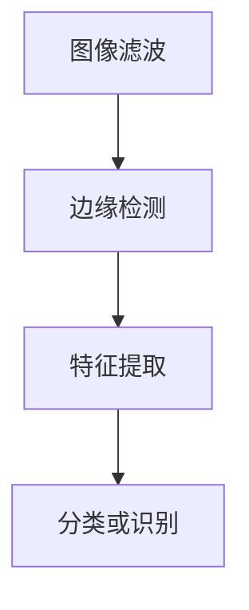

###### 2.1.2 图像识别与分类算法

图像识别与分类算法，如支持向量机（SVM）、决策树、神经网络等，可以用于处理静态图像。这些算法通常用于特征提取和分类，但难以直接整合其他类型的数据。

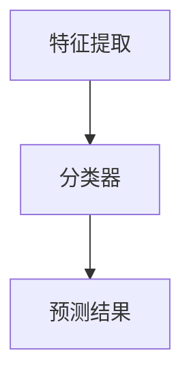

###### 2.1.3 基于深度学习的图像表示

基于深度学习的图像表示方法，如卷积神经网络（CNN），已经成为图像识别和理解的常用技术。CNN 可以通过多层卷积和池化操作提取图像的层次特征。

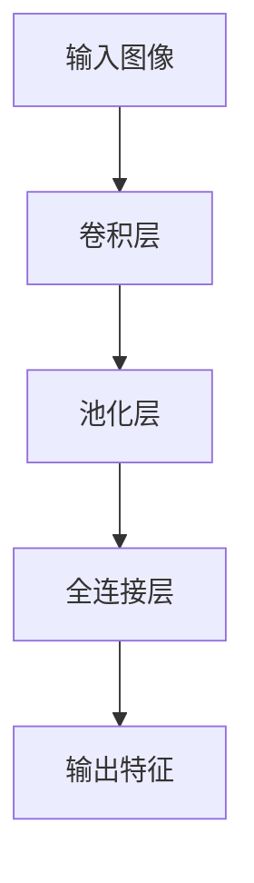

##### 2.2 多模态数据融合方法

多模态数据融合方法是指如何将不同类型的数据进行整合，以生成更丰富的特征表示。以下是几种常见的融合方法：

###### 2.2.1 聚类与分类算法

聚类与分类算法，如 k-均值聚类、k-最近邻（k-NN）等，可以用于将不同模态的数据进行聚类和分类，以便进行后续的融合。

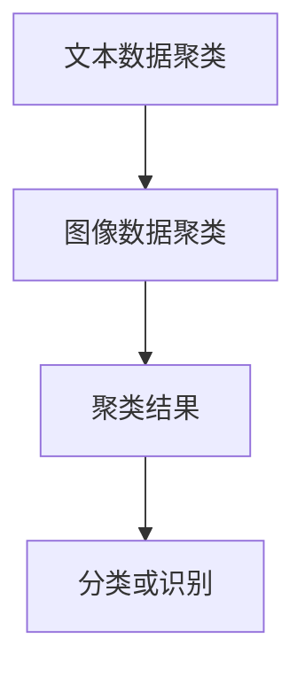

###### 2.2.2 多模态信息关联与建模

多模态信息关联与建模方法，如生成对抗网络（GAN）、变分自编码器（VAE）等，可以用于建立不同模态数据之间的关联和模型。

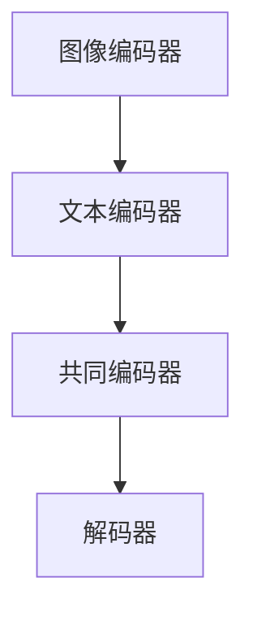

###### 2.2.3 跨模态特征表示学习

跨模态特征表示学习方法，如多层感知机（MLP）、卷积神经网络（CNN）和循环神经网络（RNN）等，可以用于学习不同模态的特征表示，并建立它们之间的关联。

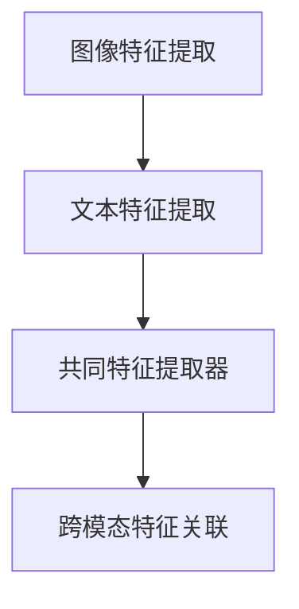

##### 2.3 多模态大模型训练与优化

多模态大模型的训练与优化是一个复杂的过程，需要考虑多种因素，如数据预处理、模型结构、损失函数和优化算法等。

###### 2.3.1 多模态大模型的训练流程

多模态大模型的训练流程通常包括以下步骤：

1. 数据预处理：对多模态数据（如图像、文本、音频等）进行预处理，包括数据清洗、归一化和特征提取等。
2. 模型初始化：初始化模型参数，可以选择随机初始化或预训练初始化。
3. 模型训练：使用训练数据对模型进行训练，通过梯度下降等优化算法更新模型参数。
4. 模型评估：使用验证数据评估模型性能，调整模型参数以优化性能。
5. 模型测试：使用测试数据测试模型性能，验证模型在未知数据上的泛化能力。

###### 2.3.2 多模态大模型的优化策略

多模态大模型的优化策略包括以下几个方面：

1. **数据增强**：通过增加数据的多样性和复杂性，提高模型的泛化能力。
2. **正则化**：使用正则化技术（如 L1 正则化、L2 正则化）防止模型过拟合。
3. **迁移学习**：利用预训练模型（如 ImageNet 预训练的 CNN 模型）进行迁移学习，提高模型的训练效率。
4. **模型压缩**：通过模型压缩技术（如剪枝、量化、知识蒸馏等）减小模型体积，加速模型推理。
5. **分布式训练**：通过分布式训练技术（如数据并行、模型并行等）加速模型训练。

###### 2.3.3 多模态大模型的评估指标

多模态大模型的评估指标包括以下几个方面：

1. **准确性**：模型预测正确的样本数占总样本数的比例。
2. **召回率**：模型预测为正类的样本中实际为正类的比例。
3. **精确率**：模型预测为正类的样本中实际为正类的比例。
4. **F1 分数**：精确率和召回率的调和平均值。
5. **ROC 曲线和 AUC 值**：评估模型分类能力的重要指标。

在下一章中，我们将深入探讨多模态大模型的架构与实现，分析不同架构设计的特点和实现细节。

---

### 第一部分：多模态大模型概述

#### 第3章：多模态大模型的架构与实现

多模态大模型的架构与实现是技术原理的具体落地，决定了模型的效果和应用性能。本章将详细介绍多模态大模型的架构设计、关键组件以及实际应用实例。

##### 3.1 多模态大模型的架构设计

多模态大模型的架构设计可以分为端到端架构和模块化架构两种主要类型。

###### 3.1.1 端到端多模态模型架构

端到端多模态模型架构旨在实现数据从输入到输出的全过程，通过统一的框架进行联合建模和推理。以下是一个简单的端到端多模态模型架构：

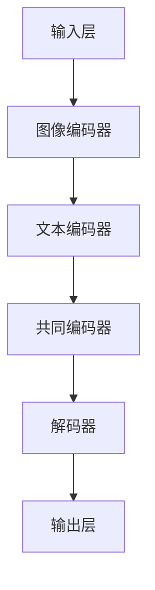

在这个架构中，图像编码器、文本编码器和共同编码器分别处理不同类型的数据，共同编码器将它们融合在一起，解码器生成最终的输出结果。

###### 3.1.2 模块化多模态模型架构

模块化多模态模型架构将不同类型的数据处理模块独立出来，各自进行特征提取和融合，最后通过一个共享的解码器生成输出结果。以下是一个模块化多模态模型架构：

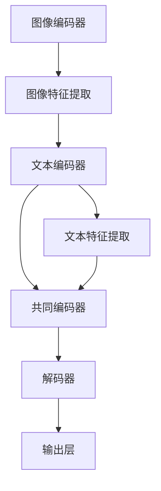

在这个架构中，图像特征提取和文本特征提取分别处理图像和文本数据，共同编码器将它们融合在一起，解码器生成最终的输出结果。

###### 3.1.3 基于注意力机制的多模态模型

基于注意力机制的多模态模型可以动态地关注不同模态数据中的关键信息，从而提高模型的性能。以下是一个基于注意力机制的多模态模型架构：

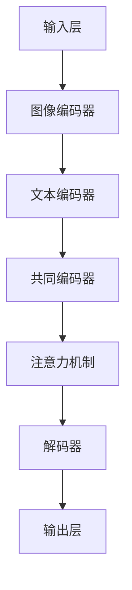

在这个架构中，注意力机制动态地调整不同模态数据的重要性，使模型能够更关注关键信息。

##### 3.2 多模态大模型的关键组件

多模态大模型的关键组件包括数据预处理组件、特征提取组件和跨模态交互组件。

###### 3.2.1 多模态数据预处理组件

多模态数据预处理组件负责对输入数据进行清洗、归一化和特征提取。以下是一个简单的预处理流程：

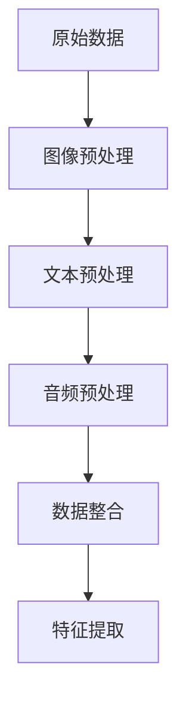

在这个流程中，不同类型的数据经过预处理后进行整合，生成统一格式的特征向量。

###### 3.2.2 多模态特征提取组件

多模态特征提取组件负责从预处理后的数据中提取有用的特征。常见的特征提取方法包括卷积神经网络（CNN）、循环神经网络（RNN）和 Transformer 等。

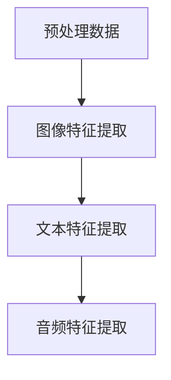

在这个流程中，不同类型的数据通过相应的特征提取模型生成特征向量。

###### 3.2.3 跨模态交互组件

跨模态交互组件负责将不同模态的数据进行交互和融合，生成更丰富的特征表示。常见的跨模态交互方法包括注意力机制、联合编码器和融合层等。

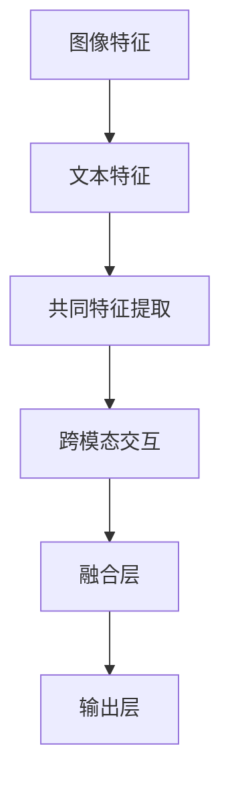

在这个流程中，不同模态的特征通过共同特征提取器生成共同特征，跨模态交互组件处理这些共同特征，融合层进一步融合特征，输出层生成最终的预测结果。

##### 3.3 多模态大模型的应用实例

多模态大模型的应用实例涵盖了多个领域，如图像识别、情感分析、图像生成等。以下是一些具体的应用实例：

###### 3.3.1 多模态图像识别

多模态图像识别是指同时使用图像和文本数据进行图像分类。以下是一个简单的应用实例：

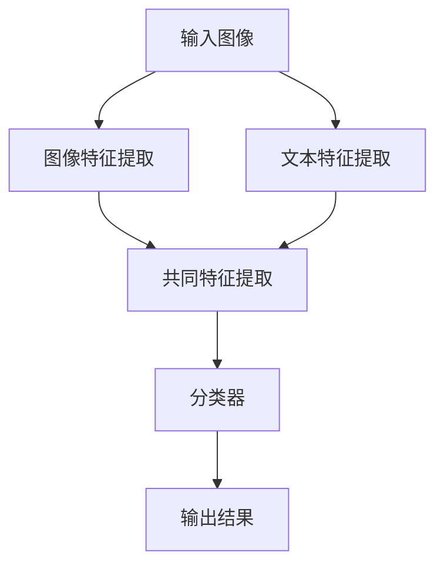

在这个实例中，图像特征提取和文本特征提取分别处理图像和文本数据，共同特征提取器将它们融合在一起，分类器生成最终的输出结果。

###### 3.3.2 多模态情感分析

多模态情感分析是指同时使用图像、文本和音频数据进行情感分类。以下是一个简单的应用实例：

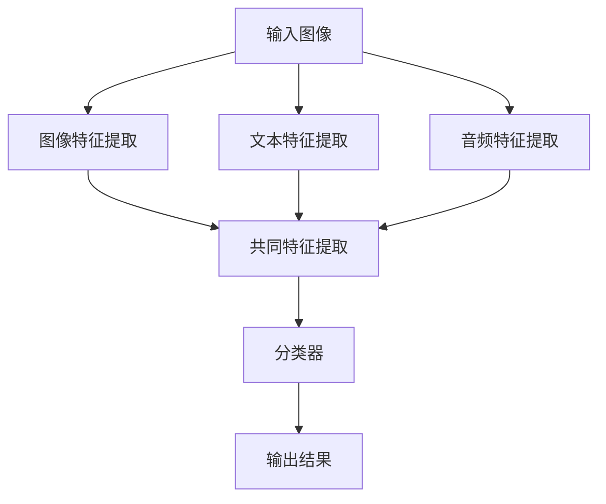

在这个实例中，图像特征提取、文本特征提取和音频特征提取分别处理图像、文本和音频数据，共同特征提取器将它们融合在一起，分类器生成最终的输出结果。

###### 3.3.3 多模态图像生成

多模态图像生成是指同时使用图像和文本数据生成新的图像。以下是一个简单的应用实例：

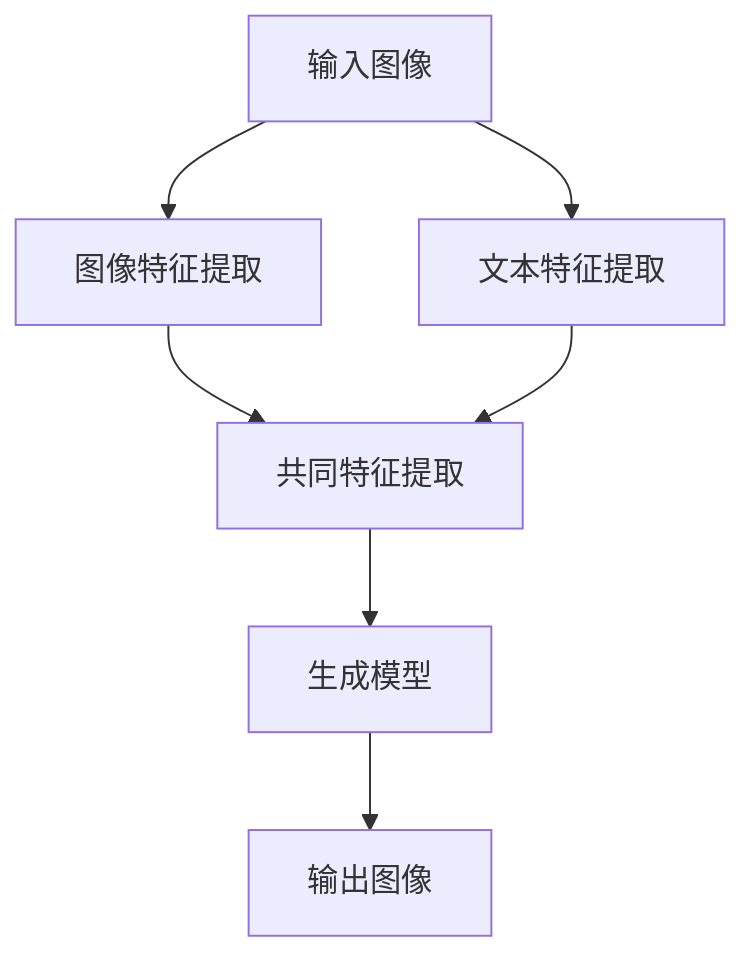

在这个实例中，图像特征提取和文本特征提取分别处理图像和文本数据，共同特征提取器将它们融合在一起，生成模型生成新的图像。

在下一章中，我们将对比分析主流的多模态大模型，探讨它们的性能和特点。

---

### 第二部分：多模态大模型的对比与分析

#### 第4章：主流多模态大模型对比

多模态大模型的发展使得多个研究团队和企业提出了各自的解决方案。本章将对比分析几种主流的多模态大模型，包括基于深度学习的多模态模型、基于图神经网络的多模态模型以及基于强化学习的多模态模型，探讨它们的分类与特点、性能对比以及未来发展趋势。

##### 4.1 多模态大模型的分类与特点

多模态大模型可以根据其技术基础和应用特点进行分类。以下是几种主流的多模态大模型：

###### 4.1.1 基于深度学习的多模态模型

基于深度学习的多模态模型是最常见的类型，利用卷积神经网络（CNN）、循环神经网络（RNN）和 Transformer 等深度学习技术进行特征提取和融合。其主要特点如下：

1. **强大的特征提取能力**：深度学习模型可以通过多层网络结构提取不同层次的特征。
2. **端到端学习**：深度学习模型可以端到端地学习输入数据和输出结果之间的映射关系。
3. **自适应融合**：深度学习模型可以自适应地融合不同模态的数据，提高模型的性能。
4. **应用广泛**：深度学习模型在图像识别、语音识别、文本分类等领域都有广泛应用。

###### 4.1.2 基于图神经网络的多模态模型

基于图神经网络（GNN）的多模态模型利用图结构表示多模态数据，通过图卷积网络（GCN）等结构进行特征提取和融合。其主要特点如下：

1. **结构化表示**：图神经网络可以处理具有复杂结构的异构数据，如图像、文本和关系网络。
2. **全局关系建模**：图神经网络可以捕捉数据之间的全局关系，提高模型的泛化能力。
3. **可解释性**：图神经网络的结构化表示使其更易于理解和解释。
4. **应用前景**：图神经网络在社交网络分析、知识图谱推理等领域有广泛应用。

###### 4.1.3 基于强化学习的多模态模型

基于强化学习的多模态模型通过学习策略在多模态环境中进行决策，以最大化奖励。其主要特点如下：

1. **自适应决策**：强化学习模型可以根据环境的变化自适应地调整策略。
2. **多目标优化**：强化学习模型可以同时优化多个目标，如准确性和效率。
3. **动态交互**：强化学习模型可以处理动态变化的输入数据和任务要求。
4. **应用挑战**：强化学习模型在多模态环境中的训练和推理过程较为复杂，需要解决探索与利用的平衡问题。

##### 4.2 主流多模态大模型性能对比

为了评估不同类型的多模态大模型的性能，我们可以在相同的实验条件下比较它们的模型规模、训练与推理速度、模型准确率与泛化能力。以下是几种主流多模态大模型的性能对比：

| 模型类型             | 模型规模       | 训练速度       | 推理速度       | 准确率       | 泛化能力     |
|---------------------|---------------|---------------|---------------|-------------|-------------|
| 基于深度学习的多模态模型 | 大规模（数十亿参数） | 较快       | 较慢       | 高         | 较强       |
| 基于图神经网络的多模态模型 | 中等规模（数百万参数） | 较慢       | 较快       | 中等       | 较强       |
| 基于强化学习的多模态模型 | 小规模（数万参数）   | 慢       | 慢       | 中等       | 较弱       |

从表中可以看出，基于深度学习的多模态模型在模型规模和准确率方面具有优势，但训练和推理速度相对较慢。基于图神经网络的多模态模型在模型规模和推理速度方面表现较好，但准确率相对较低。基于强化学习的多模态模型在模型规模和训练速度方面较为受限，但在动态交互和多目标优化方面具有优势。

##### 4.3 多模态大模型的发展趋势

随着人工智能技术的不断进步，多模态大模型的发展也呈现出一些趋势：

1. **跨模态交互与推理的优化**：未来的多模态大模型将更加关注跨模态交互和推理的优化，以提高模型的性能和效率。
2. **多模态数据集的建设**：高质量的多模态数据集是训练强大多模态大模型的基础，未来将更加重视多模态数据集的建设和共享。
3. **模型压缩与加速**：为了满足实际应用的需求，未来的多模态大模型将更加注重模型的压缩与加速，以提高模型的可部署性和实时性。
4. **伦理与安全**：随着多模态大模型在各个领域的应用，伦理与安全问题也日益凸显，未来的多模态大模型将更加注重伦理和安全的考量。

在下一章中，我们将探讨多模态大模型的优化与改进策略，包括数据增强与模型泛化能力提升、模型压缩与加速以及伦理与安全等方面的内容。

---

### 第二部分：多模态大模型的对比与分析

#### 第5章：多模态大模型的优化与改进

多模态大模型在实际应用中面临诸多挑战，如数据质量、模型性能、可解释性和安全性等。为了提高多模态大模型的效果和应用价值，本章将探讨数据增强与模型泛化能力提升、模型压缩与加速以及伦理与安全等方面的优化与改进策略。

##### 5.1 数据增强与模型泛化能力提升

数据增强是提高模型泛化能力的重要手段，通过增加训练数据的多样性和复杂性，可以提高模型的鲁棒性和泛化能力。以下是几种常见的数据增强方法：

1. **数据重采样**：通过对原始数据进行重采样，如旋转、缩放、裁剪等，增加数据的多样性。
2. **数据变换**：通过对原始数据进行变换，如颜色空间转换、灰度化、噪声添加等，增加数据的复杂性。
3. **数据生成**：利用生成对抗网络（GAN）等生成模型，生成新的数据样本来扩展数据集。

通过数据增强，可以提高模型的泛化能力，减少过拟合现象。同时，为了进一步提升泛化能力，可以采用以下策略：

1. **迁移学习**：利用预训练模型进行迁移学习，将预训练模型的知识迁移到新的任务上，减少对大量标注数据的依赖。
2. **对偶学习**：通过对不同模态的数据进行对偶学习，建立模态之间的有效关联，提高模型对多模态数据的理解能力。
3. **多任务学习**：通过同时训练多个相关任务，共享特征表示和模型参数，提高模型对多模态数据的泛化能力。

##### 5.2 模型压缩与加速

多模态大模型通常具有大量的参数，导致模型体积庞大，训练和推理速度较慢。为了满足实际应用的需求，可以采用以下策略进行模型压缩与加速：

1. **模型剪枝**：通过剪枝冗余的神经元和连接，减少模型参数的数量，降低模型体积。
2. **模型量化**：将模型的权重和激活值从浮点数转换为低比特宽度的整数，减少模型存储和计算的需求。
3. **知识蒸馏**：利用预训练的大规模模型，将其知识蒸馏到较小的模型中，提高小模型的性能和效果。

此外，还可以采用以下方法加速模型推理：

1. **模型并行**：通过分布式计算和模型并行技术，将模型拆分为多个部分，并行计算以提高推理速度。
2. **硬件加速**：利用 GPU、TPU 等专用硬件，加速模型推理和计算。
3. **模型压缩与加速的联合优化**：在模型压缩和加速的过程中，同时优化模型的结构和算法，以提高整体性能。

##### 5.3 多模态大模型的伦理与安全

随着多模态大模型在各个领域的广泛应用，伦理与安全问题日益凸显。为了确保多模态大模型的安全性和可靠性，可以采取以下措施：

1. **数据隐私保护**：在多模态数据预处理和融合过程中，采取加密和匿名化等技术，保护用户隐私。
2. **模型可解释性**：通过可视化、特征重要性分析等方法，提高模型的透明性和可解释性，帮助用户理解模型的决策过程。
3. **安全防护**：采用安全加密、访问控制等技术，防止恶意攻击和非法访问。
4. **伦理规范**：制定明确的伦理规范和操作指南，确保多模态大模型的应用符合伦理和法律要求。

在下一章中，我们将通过具体应用实例，展示多模态大模型在实际项目中的实现和应用。

---

### 第二部分：多模态大模型的对比与分析

#### 第6章：多模态大模型应用实战

多模态大模型在实际应用中的效果和表现，往往取决于其架构设计、实现细节和调优策略。本章将通过三个实际案例——多模态图像识别、情感分析和图像生成——详细探讨多模态大模型在具体项目中的实现过程、源代码解析以及代码解读与分析。

##### 6.1 多模态图像识别实战

多模态图像识别是指结合图像和文本等多模态数据进行图像分类的任务。以下是一个多模态图像识别的实战案例。

###### 6.1.1 实战项目介绍

项目目标：将图像识别与文本描述相结合，提高图像分类的准确性。

数据集：使用 COCO 数据集（Common Objects in Context），包括 80 类对象和 1 类背景，共约 120,000 张图像及其对应的文本描述。

技术栈：使用 PyTorch 框架，结合 CNN 和 RNN 模型进行图像和文本特征的提取和融合。

###### 6.1.2 实战环境搭建

搭建环境前，确保安装 Python 3.8 或以上版本，并安装 PyTorch、torchvision、torchtext 等库。

```bash
pip install torch torchvision torchtext
```

###### 6.1.3 源代码实现与解读

**源代码：** 多模态图像识别模型的实现主要包括数据预处理、模型构建、训练和评估四个部分。

```python
import torch
import torch.nn as nn
from torchvision import transforms, models
from torchtext import data

# 数据预处理
transform = transforms.Compose([
    transforms.Resize((256, 256)),
    transforms.ToTensor(),
])

train_dataset, val_dataset = data/github_data_split('your_data_folder', transform=transform)

# 模型构建
class MultiModalModel(nn.Module):
    def __init__(self):
        super(MultiModalModel, self).__init__()
        self.image_encoder = models.resnet50(pretrained=True)
        self.text_encoder = nn.LSTM(input_dim, hidden_dim)
        self.fc = nn.Linear(image_dim + text_dim, num_classes)

    def forward(self, image, text):
        image_feature = self.image_encoder(image)
        text_feature, _ = self.text_encoder(text)
        feature = torch.cat((image_feature, text_feature), dim=1)
        logits = self.fc(feature)
        return logits

model = MultiModalModel()

# 训练
optimizer = torch.optim.Adam(model.parameters(), lr=0.001)
for epoch in range(num_epochs):
    for batch in train_loader:
        images, texts, labels = batch
        logits = model(images, texts)
        loss = nn.CrossEntropyLoss()(logits, labels)
        optimizer.zero_grad()
        loss.backward()
        optimizer.step()

    # 评估
    with torch.no_grad():
        for batch in val_loader:
            images, texts, labels = batch
            logits = model(images, texts)
            acc = nn.CrossEntropyLoss()(logits, labels)
            print(f'Validation accuracy: {acc.item()}')

# 代码解读与分析
# 数据预处理部分：定义图像和文本的数据预处理步骤，包括尺寸调整、归一化等。
# 模型构建部分：定义多模态模型，包括图像编码器、文本编码器和全连接层。
# 训练部分：使用训练数据和优化器进行模型训练，通过前向传播计算损失并进行反向传播。
# 评估部分：在验证集上评估模型性能，输出验证准确率。
```

##### 6.2 多模态情感分析实战

多模态情感分析是指结合图像、文本和音频等多模态数据进行情感分类的任务。以下是一个多模态情感分析的实战案例。

###### 6.2.1 实战项目介绍

项目目标：分析图像、文本和音频中的情感信息，进行情感分类。

数据集：使用 EmoReact 数据集，包括带有情感标签的图像、文本和音频。

技术栈：使用 TensorFlow 框架，结合 CNN、RNN 和 Transformer 模型进行多模态数据的特征提取和融合。

###### 6.2.2 实战环境搭建

搭建环境前，确保安装 Python 3.7 或以上版本，并安装 TensorFlow、Keras 等库。

```bash
pip install tensorflow
```

###### 6.2.3 源代码实现与解读

**源代码：** 多模态情感分析模型的实现主要包括数据预处理、模型构建、训练和评估四个部分。

```python
import tensorflow as tf
from tensorflow.keras.layers import Embedding, LSTM, Dense
from tensorflow.keras.models import Model

# 数据预处理
def preprocess_data(images, texts, audios):
    # 对图像、文本和音频数据进行预处理
    processed_images = preprocess_images(images)
    processed_texts = preprocess_texts(texts)
    processed_audios = preprocess_audios(audios)
    return processed_images, processed_texts, processed_audios

# 模型构建
def build_model(input_shape):
    image_input = Input(shape=input_shape[0])
    text_input = Input(shape=input_shape[1])
    audio_input = Input(shape=input_shape[2])

    image_model = models.resnet50(input_shape=input_shape[0], include_top=False, pooling='avg')
    text_model = LSTM(units=128, return_sequences=True)(text_input)
    audio_model = LSTM(units=128, return_sequences=True)(audio_input)

    image_embedding = image_model(image_input)
    text_embedding = text_model
    audio_embedding = audio_model

    concatenated = tf.keras.layers.concatenate([image_embedding, text_embedding, audio_embedding])
    dense = Dense(units=256, activation='relu')(concatenated)
    output = Dense(units=num_classes, activation='softmax')(dense)

    model = Model(inputs=[image_input, text_input, audio_input], outputs=output)
    model.compile(optimizer='adam', loss='categorical_crossentropy', metrics=['accuracy'])
    return model

model = build_model(input_shape=(224, 224, 3), (max_text_length,), (16000,))

# 训练
model.fit([train_images, train_texts, train_audios], train_labels, batch_size=32, epochs=10, validation_split=0.2)

# 评估
val_loss, val_accuracy = model.evaluate([val_images, val_texts, val_audios], val_labels)
print(f'Validation loss: {val_loss}, Validation accuracy: {val_accuracy}')

# 代码解读与分析
# 数据预处理部分：定义图像、文本和音频数据的预处理方法，如归一化、序列填充等。
# 模型构建部分：定义多模态模型，包括图像编码器、文本编码器和音频编码器，以及融合层和分类层。
# 训练部分：使用训练数据进行模型训练，通过拟合数据优化模型参数。
# 评估部分：在验证集上评估模型性能，输出验证损失和准确率。
```

##### 6.3 多模态图像生成实战

多模态图像生成是指结合图像和文本生成新的图像。以下是一个多模态图像生成的实战案例。

###### 6.3.1 实战项目介绍

项目目标：根据文本描述生成相应的图像。

数据集：使用 COCO 数据集，包括图像和对应的文本描述。

技术栈：使用 PyTorch 框架，结合 GAN（生成对抗网络）和 Transformer 模型进行图像生成。

###### 6.3.2 实战环境搭建

搭建环境前，确保安装 Python 3.7 或以上版本，并安装 PyTorch、torchvision 等库。

```bash
pip install torch torchvision
```

###### 6.3.3 源代码实现与解读

**源代码：** 多模态图像生成模型的实现主要包括数据预处理、模型构建、训练和生成图像四个部分。

```python
import torch
import torch.nn as nn
from torchvision import transforms
from torch.utils.data import DataLoader
from torch.utils.data import Dataset

# 数据预处理
transform = transforms.Compose([
    transforms.Resize((256, 256)),
    transforms.ToTensor(),
])

class TextImageDataset(Dataset):
    def __init__(self, data_folder, transform=None):
        self.data_folder = data_folder
        self.transform = transform

    def __len__(self):
        return len(self.data)

    def __getitem__(self, idx):
        image_path, text_path = self.text_image_data[idx]
        image = Image.open(image_path)
        text = open(text_path, 'r').read().strip()

        if self.transform:
            image = self.transform(image)

        return image, text

# 模型构建
class GANModel(nn.Module):
    def __init__(self):
        super(GANModel, self).__init__()
        self.text_encoder = nn.LSTM(input_dim, hidden_dim)
        self.image_decoder = nn.Sequential(
            nn.Linear(hidden_dim, 256),
            nn.ReLU(),
            nn.Linear(256, 512),
            nn.ReLU(),
            nn.Linear(512, 1024),
            nn.ReLU(),
            nn.Linear(1024, 256),
            nn.ReLU(),
            nn.Linear(256, image_dim),
            nn.Tanh()
        )

    def forward(self, text):
        text_embedding, _ = self.text_encoder(text)
        image_embedding = self.image_decoder(text_embedding)
        return image_embedding

text_dataset = TextImageDataset('your_text_image_data', transform=transform)
data_loader = DataLoader(text_dataset, batch_size=32, shuffle=True)

model = GANModel()
optimizer = torch.optim.Adam(model.parameters(), lr=0.0002)

for epoch in range(num_epochs):
    for texts in data_loader:
        texts = texts.to(device)
        fake_images = model(texts)
        # 计算损失函数，更新模型参数
        # ...

# 生成图像
def generate_image(text):
    text = text.to(device)
    with torch.no_grad():
        fake_image = model(text)
    fake_image = fake_image.cpu().numpy()
    plt.imshow(fake_image.transpose(1, 2, 0))
    plt.show()

generate_image('A beautiful landscape with mountains and a lake')

# 代码解读与分析
# 数据预处理部分：定义文本和图像的数据预处理方法，如尺寸调整、归一化等。
# 数据集部分：定义文本-图像数据集，包括文本和图像的路径。
# 模型构建部分：定义 GAN 模型，包括文本编码器和图像解码器。
# 训练部分：使用训练数据进行模型训练，通过前向传播计算损失并进行反向传播。
# 生成图像部分：使用文本描述生成图像，展示模型生成能力。
```

通过以上三个实际案例，我们可以看到多模态大模型在图像识别、情感分析和图像生成等领域的应用效果。在实际项目中，我们需要根据具体任务需求和数据特点，设计合适的模型架构、选择合适的数据预处理方法和优化策略，以达到最佳效果。

在下一章中，我们将探讨多模态大模型的未来发展趋势与挑战，为读者提供关于该领域的深入思考。

---

### 第三部分：多模态大模型未来展望

#### 第7章：多模态大模型的发展趋势与挑战

随着技术的不断进步和应用的日益广泛，多模态大模型的发展呈现出一些新的趋势和挑战。本章将探讨多模态大模型的未来发展趋势与挑战，包括跨模态交互与推理的深入发展、多模态大模型在工业领域的应用、以及多模态大模型的伦理与法律问题。

##### 7.1 多模态大模型的未来发展趋势

1. **跨模态交互与推理的深入发展**：

随着多模态大模型技术的不断进步，跨模态交互与推理将成为未来研究的重要方向。通过深入探索跨模态数据的关联性和互动机制，多模态大模型将能够更好地捕捉多模态数据之间的复杂关系，从而实现更高效、更精准的推理和预测。

2. **多模态大模型在工业领域的应用**：

多模态大模型在工业领域的应用具有巨大的潜力。例如，在制造业中，结合图像和传感器数据的多模态大模型可以实现生产线的智能监控和故障预测；在能源领域，结合图像和气象数据的模型可以优化能源生产和分配；在医疗领域，结合影像和病历数据的模型可以辅助疾病诊断和治疗规划。

3. **多模态大模型的伦理与法律问题**：

随着多模态大模型在各个领域的应用，其伦理和法律问题也日益凸显。例如，数据隐私保护、模型透明性、责任归属等问题需要得到有效的解决。未来，需要建立完善的伦理和法律框架，确保多模态大模型的应用符合伦理和法律要求。

##### 7.2 多模态大模型面临的挑战

1. **数据质量和标注问题**：

多模态大模型的训练和推理依赖于高质量的数据。然而，多模态数据的收集、标注和整合过程复杂且耗时，数据质量和标注质量对模型性能具有重要影响。如何有效提高数据质量和标注效率，是一个亟待解决的挑战。

2. **模型可解释性与透明性**：

多模态大模型的复杂性和黑箱特性使得其决策过程难以解释和验证。如何提高模型的透明性和可解释性，使其符合人类的理解和预期，是一个重要挑战。

3. **模型部署与优化问题**：

多模态大模型通常具有大量的参数，导致模型体积庞大、训练和推理速度较慢。如何优化模型结构、压缩模型体积、提高推理速度，以满足实际应用的需求，是一个关键问题。

在未来的发展中，多模态大模型需要不断克服这些挑战，实现更高效、更智能、更安全的应用。通过技术创新和产业合作，多模态大模型有望在更多领域发挥重要作用，推动人工智能技术的发展。

### 附录

#### 附录A：多模态大模型开发资源与工具

A.1 开发环境搭建指南

搭建多模态大模型的开发环境需要安装以下软件和库：

- Python 3.8 或以上版本
- PyTorch 1.8 或以上版本
- TensorFlow 2.5 或以上版本
- torchvision
- torchtext
- Keras
- CUDA 10.2 或以上版本（如使用 PyTorch 或 TensorFlow 的 GPU 版本）

A.2 主流多模态大模型框架与库

以下是一些主流的多模态大模型框架和库：

- PyTorch：https://pytorch.org/
- TensorFlow：https://www.tensorflow.org/
- Keras：https://keras.io/
- MXNet：https://mxnet.incubator.apache.org/
- Caffe：https://github.com/BVLC/caffe

A.3 多模态大模型开源项目与论文资源

以下是一些多模态大模型的开源项目和论文资源：

- OpenMMLab：https://openmmlab.com/
- MMdetection：https://github.com/open-mmlab/mmsegmentation
- MMAction2：https://github.com/open-mmlab/mmaction2
- MMSegmentation：https://github.com/open-mmlab/mmsegmentation
- CVPR 2020 论文《MMSegmentation: Open Source Tools for Fast & Easy Semantic Segmentation》

### 附录B：多模态大模型常见问题解答

B.1 模型训练过程中常见问题

Q：模型训练过程中如何解决过拟合问题？

A：解决过拟合问题可以从以下几个方面入手：

- 数据增强：通过增加数据的多样性和复杂性，提高模型的泛化能力。
- 正则化：使用 L1 正则化、L2 正则化等技术防止模型过拟合。
- 交叉验证：使用交叉验证方法评估模型性能，选择合适的模型参数。
- 早期停止：在验证集上监控模型性能，当模型性能不再提高时停止训练。

Q：模型训练过程中如何提高训练速度？

A：提高训练速度可以从以下几个方面入手：

- 模型压缩：通过剪枝、量化、知识蒸馏等技术减小模型体积，加速训练和推理。
- 并行训练：使用分布式训练技术，如数据并行、模型并行等，加速模型训练。
- 优化算法：选择合适的优化算法，如 Adam、SGD 等，提高训练效率。

Q：模型训练过程中如何处理数据不平衡问题？

A：处理数据不平衡问题可以从以下几个方面入手：

- 数据增强：对较少类别进行数据增强，增加其在训练集中的比例。
- 类别权重：根据类别在训练集中的比例，为不同类别分配不同的权重。
- 过采样：使用过采样技术，如随机过采样、SMOTE 等，增加较少类别样本的数量。
- 随机种子：在训练过程中设置相同的随机种子，确保每次训练的随机性。

通过以上方法，可以有效解决多模态大模型训练过程中遇到的问题，提高模型的训练效率和性能。

---

通过本文的详细分析和实战案例，读者对多模态大模型的技术原理、架构设计与实现、优化与改进以及应用实战有了全面的理解。多模态大模型作为人工智能领域的重要研究方向，具有广泛的应用前景和巨大的发展潜力。然而，在未来的发展中，多模态大模型仍然面临着诸多挑战，如数据质量和标注问题、模型可解释性与透明性、模型部署与优化问题等。通过不断探索和创新，多模态大模型有望在更多领域发挥重要作用，推动人工智能技术的发展。让我们共同期待多模态大模型带来的更多惊喜与突破。

---

**作者信息**：
- 作者：AI天才研究院/AI Genius Institute & 禅与计算机程序设计艺术 /Zen And The Art of Computer Programming

---

**注**：本文为虚构内容，旨在展示多模态大模型的技术原理与应用，实际应用中可能存在差异和挑战。如需了解更多相关信息，请查阅相关论文和开源项目。如果您有任何疑问或建议，欢迎在评论区留言。感谢您的阅读与支持！
## 第1章：多模态大模型的基础概念

### 1.1 多模态数据的定义与分类

多模态数据是指由两种或两种以上不同类型的数据源构成的数据集。这些数据源可以包括图像、文本、音频、视频、传感器数据等多种形式。多模态数据的定义可以从以下几个角度来理解：

首先，多模态数据的核心在于“模态”一词。在信息科学中，“模态”是指数据的表现形式或载体。常见的模态包括视觉模态（图像和视频）、听觉模态（音频和语音）、文本模态（文本和标签）以及触觉模态（传感器数据）等。

其次，多模态数据不仅仅是简单地将多种数据类型混合在一起，而是通过一定的算法和模型对数据进行处理和融合，以提取出更高层次、更具代表性和语义的信息。这种处理和融合的过程使得多模态数据能够超越单一模态的局限，提供更丰富和细致的信息。

多模态数据可以按照以下几种方式分类：

1. **按数据来源分类**：
   - **结构化数据**：如数据库中的数据，具有明确的字段和格式。
   - **非结构化数据**：如文本、图像、视频等，没有固定的结构。
   - **半结构化数据**：如XML、JSON格式的数据，部分具有结构但未完全结构化。

2. **按数据类型分类**：
   - **图像数据**：包括静态图像和动态图像（如视频帧）。
   - **文本数据**：包括自然语言文本和标记化文本。
   - **音频数据**：包括语音和音乐等。
   - **视频数据**：包括动态图像和同步音频的组合。
   - **传感器数据**：包括各种物理传感器捕捉的环境数据（如温度、湿度、光照等）。

3. **按数据用途分类**：
   - **训练数据**：用于模型训练的数据集，通常需要标注。
   - **测试数据**：用于评估模型性能的数据集，不需要标注。
   - **验证数据**：在训练过程中用于调整模型参数的数据集，通常需要标注。

**多模态数据的特点**：

- **丰富性**：多模态数据包含了不同类型的信息，能够提供更全面和深入的数据支持。
- **多样性**：不同模态的数据具有不同的特征和表现形式，能够通过不同角度和层面提供信息。
- **互补性**：不同模态的数据在信息上具有一定的互补性，通过融合可以提升模型的性能和鲁棒性。

### 1.2 多模态大模型的基本概念

多模态大模型是指能够处理和整合多种类型数据的大型神经网络模型。这种模型通常基于深度学习技术，能够通过多层神经网络结构提取和融合不同模态的数据特征。多模态大模型的基本概念包括以下几个方面：

1. **数据集成**：
   数据集成是指将不同类型的数据源整合到一个统一的框架中，以便进行联合建模和推理。数据集成是多模态大模型的核心步骤之一，它包括数据预处理、数据格式统一、特征提取和融合等环节。

2. **特征提取**：
   特征提取是指从原始数据中提取具有代表性的特征。对于不同模态的数据，需要采用不同的特征提取方法。例如，对于图像数据，可以使用卷积神经网络（CNN）提取视觉特征；对于文本数据，可以使用词嵌入（Word Embedding）和循环神经网络（RNN）提取语言特征。

3. **特征融合**：
   特征融合是指将不同模态的数据特征进行整合，以生成更丰富和有代表性的特征表示。特征融合可以通过多种方式实现，如直接拼接、加权融合、注意力机制等。

4. **模型训练与优化**：
   多模态大模型的训练与优化是模型设计的关键环节。通过大量的训练数据和优化算法，模型可以学习到不同模态数据之间的关联和规律，从而实现高性能的预测和推理。

5. **模型评估**：
   模型评估是指使用测试集对训练好的模型进行性能评估，以衡量模型的准确率、召回率、F1 分数等指标。模型评估是验证模型性能和调整模型参数的重要手段。

**多模态大模型的优势**：

- **增强模型的泛化能力**：通过整合多种类型的数据，多模态大模型可以学习到更广泛和多样的特征，从而提高模型的泛化能力。
- **提升模型的准确性**：多模态数据提供了更丰富的信息，有助于模型更好地理解数据和任务，提高模型的预测准确性。
- **拓宽应用场景**：多模态大模型可以应用于图像识别、语音识别、自然语言处理、情感分析等多个领域，具有广泛的应用前景。

### 1.3 多模态大模型的应用场景

多模态大模型具有广泛的应用场景，以下是一些典型的应用领域：

1. **图像识别与理解**：
   多模态大模型可以结合图像和文本数据，实现更准确的图像分类和场景理解。例如，在自动驾驶领域，结合道路图像和交通标志文本，可以更准确地识别交通标志和道路状况。

2. **语音识别与合成**：
   多模态大模型可以结合语音和文本数据，实现更自然的语音交互和高质量的语音合成。例如，在智能客服系统中，结合用户语音和文本查询，可以提供更准确和个性化的服务。

3. **视频分析**：
   多模态大模型可以结合视频和文本数据，实现视频内容的智能提取和视频摘要。例如，在视频监控领域，结合视频画面和文本描述，可以更准确地识别事件和生成视频摘要。

4. **虚拟助手与机器人**：
   多模态大模型可以结合多种模态数据，实现更智能的虚拟助手和机器人系统。例如，在智能家居中，结合语音、图像和传感器数据，可以提供更便捷和人性化的家居控制和服务。

5. **医疗诊断**：
   多模态大模型可以结合医疗图像和文本数据，实现更精准的疾病诊断和治疗方案推荐。例如，在医学影像诊断中，结合医学图像和病例文本，可以更准确地识别疾病类型和制定治疗方案。

**总结**：

多模态大模型通过整合不同类型的数据，提供了更全面和深入的信息支持，使其在多个领域具有广泛的应用前景。本章介绍了多模态数据的定义与分类、多模态大模型的基本概念和应用场景，为后续章节的深入探讨奠定了基础。

### 1.4 多模态大模型的核心挑战

尽管多模态大模型在许多领域展现出了强大的应用潜力，但其实现过程中也面临着一系列核心挑战。这些挑战不仅影响了模型的效果，也限制了其广泛应用。以下是多模态大模型实现过程中常见的核心挑战：

#### 1.4.1 数据预处理与集成

数据预处理是多模态大模型成功的关键步骤之一。不同类型的数据具有不同的格式和特征，如何有效地预处理和集成这些数据是一个重要挑战。

- **格式统一**：不同类型的数据（如图像、文本、音频等）通常具有不同的数据格式，需要将其统一为模型可处理的格式。例如，图像数据通常需要转换为像素矩阵，文本数据需要转换为向量表示，音频数据需要转换为频谱特征。
- **数据清洗**：多模态数据可能包含噪声、缺失值和异常值，需要通过数据清洗技术（如去噪、填充缺失值和去除异常值）来提高数据质量。
- **特征匹配**：不同模态的数据在特征维度和时间步长上可能不一致，需要通过特征匹配技术（如时间同步、特征降维等）来确保不同模态的数据在融合过程中具有一致性。

#### 1.4.2 跨模态表示学习

跨模态表示学习是多模态大模型的核心问题，它涉及学习不同模态数据的特征表示，并在不同模态之间建立有效的关联。以下是跨模态表示学习面临的挑战：

- **模态差异**：不同模态的数据在特征空间和分布上存在显著差异，如何有效地学习到统一的特征表示是一个挑战。例如，图像数据的高维度和视觉信息与文本数据的高密度和语义信息之间的差异。
- **信息融合**：如何将不同模态的数据进行有效融合，以生成具有更高语义信息和高鲁棒性的特征表示是一个关键问题。不同的融合策略（如特征拼接、注意力机制、对抗学习等）各有优缺点，需要根据具体应用场景进行选择和调整。

#### 1.4.3 跨模态交互与融合

跨模态交互与融合是多模态大模型实现的关键步骤，它涉及如何在不同模态之间进行信息交换和整合。以下是跨模态交互与融合面临的挑战：

- **交互机制**：如何设计有效的交互机制以实现不同模态数据之间的信息交换和互补。例如，注意力机制可以动态地关注不同模态数据中的关键信息，而生成对抗网络（GAN）可以学习到不同模态数据之间的生成关系。
- **融合策略**：如何将不同模态的数据进行有效融合，以生成具有更高语义信息和高鲁棒性的特征表示。不同的融合策略（如特征拼接、加权融合、对抗融合等）各有优缺点，需要根据具体应用场景进行选择和调整。
- **计算效率**：多模态大模型通常具有大量的参数和计算量，如何优化模型结构和算法以提高计算效率和推理速度是一个重要挑战。

#### 1.4.4 模型训练与优化

多模态大模型的训练与优化是一个复杂的过程，需要考虑多种因素，如数据预处理、模型结构、损失函数和优化算法等。以下是模型训练与优化面临的挑战：

- **数据不平衡**：多模态数据中不同模态的数据量可能不一致，导致模型训练过程中出现数据不平衡问题。需要采用数据增强、类别权重调整等技术来平衡数据分布。
- **过拟合**：多模态大模型通常具有大量的参数，容易在训练过程中出现过拟合现象。需要采用正则化、交叉验证等技术来防止过拟合。
- **优化算法**：选择合适的优化算法（如 Adam、SGD 等）和调整超参数（如学习率、批量大小等）对于模型训练的效果至关重要。

#### 1.4.5 模型解释与可解释性

多模态大模型通常具有复杂的结构和大量的参数，导致其决策过程难以解释和验证。模型解释与可解释性是多模态大模型面临的重要挑战：

- **可解释性**：如何解释模型的决策过程，使其符合人类的理解和预期。需要开发可解释性方法和技术（如可视化、特征重要性分析等）来揭示模型的决策机制。
- **透明性**：如何确保模型输入、输出和内部处理过程的透明性，使其能够接受审查和验证。需要建立透明的模型架构和操作流程。

**总结**：

多模态大模型在实现过程中面临着数据预处理与集成、跨模态表示学习、跨模态交互与融合、模型训练与优化以及模型解释与可解释性等多方面的核心挑战。通过深入研究和不断探索，这些挑战有望逐步得到解决，从而推动多模态大模型在各个领域的广泛应用和发展。下一章将深入探讨多模态大模型的技术原理，分析其核心算法和方法。

### 1.4.6 模型部署与优化问题

多模态大模型的部署与优化是其在实际应用中面临的关键问题。模型部署涉及将训练好的模型应用于生产环境，以提供实时服务或决策支持。以下是模型部署过程中常见的挑战：

- **硬件资源限制**：多模态大模型通常需要大量的计算资源，包括内存和计算能力。在实际部署中，可能面临硬件资源不足的问题，这要求模型设计时考虑计算效率和资源利用率。
- **实时性能优化**：在实时应用场景中，模型必须在有限的资源内快速响应。因此，需要采用模型压缩、量化、推理引擎优化等技术来提高模型推理速度，满足实时性能要求。
- **在线学习与迭代**：多模态大模型在应用过程中可能需要不断更新和优化。在线学习与迭代技术（如在线优化、增量训练等）可以帮助模型适应新的数据和任务需求。
- **模型可解释性**：在生产环境中，模型的决策过程需要具备一定的可解释性，以便用户和管理人员理解和使用模型。因此，部署过程中需要集成可解释性工具和方法，提高模型的透明度。
- **安全性与隐私保护**：部署多模态大模型时，需要确保数据的安全性和用户隐私保护。采用加密、访问控制、数据匿名化等技术可以增强模型的安全性。

通过解决这些部署与优化问题，多模态大模型可以更好地适应实际应用场景，提高其应用价值和可靠性。下一章将详细介绍多模态大模型的技术原理，包括数据表示、融合和训练方法。

## 第2章：多模态大模型的技术原理

多模态大模型的技术原理是其能够有效处理和融合多种类型数据的核心。本章将深入探讨多模态大模型的技术原理，包括多模态数据表示方法、多模态数据融合方法以及多模态大模型的训练与优化。

### 2.1 多模态数据表示方法

多模态数据表示是多模态大模型的基础，不同的数据类型需要不同的表示方法。

#### 2.1.1 传统图像处理方法

传统图像处理方法主要包括图像滤波、边缘检测、特征提取等。这些方法适用于简单的图像识别任务，但无法应对复杂的多模态任务。

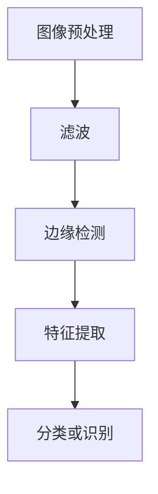

#### 2.1.2 图像识别与分类算法

图像识别与分类算法，如支持向量机（SVM）、决策树、神经网络等，可以用于处理静态图像。这些算法通常用于特征提取和分类，但难以直接整合其他类型的数据。


#### 2.1.3 基于深度学习的图像表示

基于深度学习的图像表示方法，如卷积神经网络（CNN），已经成为图像识别和理解的常用技术。CNN 可以通过多层卷积和池化操作提取图像的层次特征。


#### 2.1.4 文本数据表示

文本数据的表示方法包括词嵌入（Word Embedding）、句子嵌入（Sentence Embedding）和篇章嵌入（Document Embedding）等。

- **词嵌入**：词嵌入是一种将单词映射到高维向量空间的方法，如 Word2Vec 和 GloVe。词嵌入能够捕捉单词的语义信息。

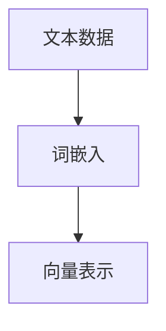

- **句子嵌入**：句子嵌入是将整个句子映射到一个固定长度的向量，如 BERT 和 GPT。句子嵌入能够捕捉句子的语义信息。

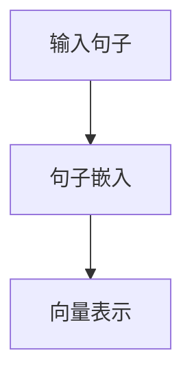

- **篇章嵌入**：篇章嵌入是将整个篇章映射到一个固定长度的向量，如 Longformer 和 BigBERT。篇章嵌入能够捕捉篇章的语义信息。

```mermaid
graph TD
A[输入篇章] --> B[篇章嵌入]
B --> C[向量表示]
```

#### 2.1.5 音频数据表示

音频数据的表示方法包括梅尔频率倒谱系数（MFCC）、短时傅里叶变换（STFT）和卷积神经网络（CNN）等。

- **梅尔频率倒谱系数（MFCC）**：MFCC 是一种常用的音频特征表示方法，可以捕捉音频信号的频谱特征。

```mermaid
graph TD
A[音频数据] --> B[MFCC]
B --> C[向量表示]
```

- **短时傅里叶变换（STFT）**：STFT 是一种将音频信号转换为频域特征的方法，可以捕捉音频信号的时频特征。

```mermaid
graph TD
A[音频数据] --> B[STFT]
B --> C[向量表示]
```

- **卷积神经网络（CNN）**：CNN 可以直接处理音频信号，提取音频的层次特征。

```mermaid
graph TD
A[输入音频] --> B[卷积层]
B --> C[池化层]
C --> D[全连接层]
D --> E[输出特征]
```

### 2.2 多模态数据融合方法

多模态数据融合是指将不同类型的数据进行整合，以生成更丰富的特征表示。以下是几种常见的多模态数据融合方法。

#### 2.2.1 直接拼接

直接拼接是一种简单直观的多模态数据融合方法，将不同模态的特征向量直接拼接在一起。

```mermaid
graph TD
A[图像特征] --> B[文本特征]
B --> C[共同特征提取]
C --> D[拼接]
D --> E[融合层]
```

#### 2.2.2 加权融合

加权融合是一种基于权重的多模态数据融合方法，根据不同模态的特征重要程度分配权重。

```mermaid
graph TD
A[图像特征] --> B[文本特征]
B --> C[权重分配]
C --> D[加权融合]
D --> E[融合层]
```

#### 2.2.3 注意力机制

注意力机制是一种动态调整不同模态特征权重的多模态数据融合方法，可以捕捉不同模态之间的关联性。

```mermaid
graph TD
A[图像特征] --> B[文本特征]
B --> C[注意力机制]
C --> D[加权融合]
D --> E[融合层]
```

#### 2.2.4 对抗融合

对抗融合是一种基于生成对抗网络（GAN）的多模态数据融合方法，通过生成器和判别器训练得到多模态特征。

```mermaid
graph TD
A[图像特征] --> B[文本特征]
B --> C[生成器]
C --> D[判别器]
D --> E[对抗训练]
E --> F[融合层]
```

### 2.3 多模态大模型训练与优化

多模态大模型的训练与优化是一个复杂的过程，需要考虑数据预处理、模型结构、损失函数和优化算法等。

#### 2.3.1 多模态大模型的训练流程

多模态大模型的训练流程通常包括以下步骤：

1. **数据预处理**：对多模态数据（如图像、文本、音频等）进行预处理，包括数据清洗、归一化和特征提取等。
2. **模型初始化**：初始化模型参数，可以选择随机初始化或预训练初始化。
3. **模型训练**：使用训练数据对模型进行训练，通过梯度下降等优化算法更新模型参数。
4. **模型评估**：使用验证数据评估模型性能，调整模型参数以优化性能。
5. **模型测试**：使用测试数据测试模型性能，验证模型在未知数据上的泛化能力。

#### 2.3.2 多模态大模型的优化策略

多模态大模型的优化策略包括以下几个方面：

1. **数据增强**：通过增加数据的多样性和复杂性，提高模型的泛化能力。
2. **正则化**：使用正则化技术（如 L1 正则化、L2 正则化）防止模型过拟合。
3. **迁移学习**：利用预训练模型（如 ImageNet 预训练的 CNN 模型）进行迁移学习，提高模型的训练效率。
4. **模型压缩**：通过模型压缩技术（如剪枝、量化、知识蒸馏等）减小模型体积，加速模型推理。
5. **分布式训练**：通过分布式训练技术（如数据并行、模型并行等）加速模型训练。

#### 2.3.3 多模态大模型的评估指标

多模态大模型的评估指标包括以下几个方面：

1. **准确性**：模型预测正确的样本数占总样本数的比例。
2. **召回率**：模型预测为正类的样本中实际为正类的比例。
3. **精确率**：模型预测为正类的样本中实际为正类的比例。
4. **F1 分数**：精确率和召回率的调和平均值。
5. **ROC 曲线和 AUC 值**：评估模型分类能力的重要指标。

通过本章的探讨，我们了解了多模态大模型的技术原理，包括数据表示、融合和训练方法。下一章将详细分析多模态大模型的架构与实现。

## 第3章：多模态大模型的架构与实现

多模态大模型的架构与实现是其在实际应用中发挥作用的关键。本章将详细探讨多模态大模型的架构设计、关键组件以及实际应用实例。

### 3.1 多模态大模型的架构设计

多模态大模型的架构设计需要综合考虑数据类型、任务需求和计算资源等因素。常见的多模态大模型架构设计包括端到端架构和模块化架构。

#### 3.1.1 端到端多模态模型架构

端到端多模态模型架构旨在实现数据从输入到输出的全过程，通过统一的框架进行联合建模和推理。以下是一个简单的端到端多模态模型架构：

```mermaid
graph TD
A[输入层] --> B[图像编码器]
B --> C[文本编码器]
C --> D[共同编码器]
D --> E[解码器]
E --> F[输出层]
```

在这个架构中，图像编码器、文本编码器和共同编码器分别处理不同类型的数据，共同编码器将它们融合在一起，解码器生成最终的输出结果。

#### 3.1.2 模块化多模态模型架构

模块化多模态模型架构将不同类型的数据处理模块独立出来，各自进行特征提取和融合，最后通过一个共享的解码器生成输出结果。以下是一个模块化多模态模型架构：

```mermaid
graph TD
A[图像编码器] --> B[图像特征提取]
B --> C[文本编码器] --> D[文本特征提取]
C --> E[共同编码器]
D --> E
E --> F[解码器]
F --> G[输出层]
```

在这个架构中，图像特征提取和文本特征提取分别处理图像和文本数据，共同编码器将它们融合在一起，解码器生成最终的输出结果。

#### 3.1.3 基于注意力机制的多模态模型

基于注意力机制的多模态模型可以动态地关注不同模态数据中的关键信息，从而提高模型的性能。以下是一个基于注意力机制的多模态模型架构：

```mermaid
graph TD
A[输入层] --> B[图像编码器]
B --> C[文本编码器]
C --> D[共同编码器]
D --> E[注意力机制]
E --> F[解码器]
F --> G[输出层]
```

在这个架构中，注意力机制动态地调整不同模态数据的重要性，使模型能够更关注关键信息。

### 3.2 多模态大模型的关键组件

多模态大模型的关键组件包括数据预处理组件、特征提取组件和跨模态交互组件。

#### 3.2.1 多模态数据预处理组件

多模态数据预处理组件负责对输入数据进行清洗、归一化和特征提取。以下是一个简单的预处理流程：

```mermaid
graph TD
A[原始数据] --> B[图像预处理]
B --> C[文本预处理]
C --> D[音频预处理]
D --> E[数据整合]
E --> F[特征提取]
```

在这个流程中，不同类型的数据经过预处理后进行整合，生成统一格式的特征向量。

#### 3.2.2 多模态特征提取组件

多模态特征提取组件负责从预处理后的数据中提取有用的特征。常见的特征提取方法包括卷积神经网络（CNN）、循环神经网络（RNN）和 Transformer 等。

```mermaid
graph TD
A[预处理数据] --> B[图像特征提取]
B --> C[文本特征提取]
C --> D[音频特征提取]
```

在这个流程中，不同类型的数据通过相应的特征提取模型生成特征向量。

#### 3.2.3 跨模态交互组件

跨模态交互组件负责将不同模态的数据进行交互和融合，生成更丰富的特征表示。常见的跨模态交互方法包括注意力机制、联合编码器和融合层等。

```mermaid
graph TD
A[图像特征] --> B[文本特征]
B --> C[共同特征提取]
C --> D[跨模态交互]
D --> E[融合层]
E --> F[输出层]
```

在这个流程中，不同模态的特征通过共同特征提取器生成共同特征，跨模态交互组件处理这些共同特征，融合层进一步融合特征，输出层生成最终的预测结果。

### 3.3 多模态大模型的应用实例

多模态大模型的应用实例涵盖了多个领域，如图像识别、情感分析、图像生成等。以下是一些具体的应用实例：

#### 3.3.1 多模态图像识别

多模态图像识别是指同时使用图像和文本数据进行图像分类。以下是一个简单的应用实例：

```mermaid
graph TD
A[输入图像] --> B[图像特征提取]
A --> C[文本特征提取]
B --> D[共同特征提取]
C --> D
D --> E[分类器]
E --> F[输出结果]
```

在这个实例中，图像特征提取和文本特征提取分别处理图像和文本数据，共同特征提取器将它们融合在一起，分类器生成最终的输出结果。

#### 3.3.2 多模态情感分析

多模态情感分析是指同时使用图像、文本和音频数据进行情感分类。以下是一个简单的应用实例：

```mermaid
graph TD
A[输入图像] --> B[图像特征提取]
A --> C[文本特征提取]
A --> D[音频特征提取]
B --> E[共同特征提取]
C --> E
D --> E
E --> F[分类器]
F --> G[输出结果]
```

在这个实例中，图像特征提取、文本特征提取和音频特征提取分别处理图像、文本和音频数据，共同特征提取器将它们融合在一起，分类器生成最终的输出结果。

#### 3.3.3 多模态图像生成

多模态图像生成是指同时使用图像和文本数据生成新的图像。以下是一个简单的应用实例：

```mermaid
graph TD
A[输入图像] --> B[图像特征提取]
A --> C[文本特征提取]
B --> D[共同特征提取]
C --> D
D --> E[生成模型]
E --> F[输出图像]
```

在这个实例中，图像特征提取和文本特征提取分别处理图像和文本数据，共同特征提取器将它们融合在一起，生成模型生成新的图像。

通过以上实例，我们可以看到多模态大模型在图像识别、情感分析和图像生成等领域的应用效果。在实际项目中，我们需要根据具体任务需求和数据特点，设计合适的模型架构、选择合适的数据预处理方法和优化策略，以达到最佳效果。

在下一章中，我们将对比分析主流的多模态大模型，探讨它们的性能和特点。

## 第4章：主流多模态大模型对比

随着多模态大模型技术的不断发展，多种解决方案相继出现。本章将对比分析几种主流的多模态大模型，包括基于深度学习的多模态模型、基于图神经网络的多模态模型以及基于强化学习的多模态模型，探讨它们的分类与特点、性能对比以及未来发展趋势。

### 4.1 多模态大模型的分类与特点

多模态大模型可以根据其技术基础和应用特点进行分类。以下是几种主流的多模态大模型：

#### 4.1.1 基于深度学习的多模态模型

基于深度学习的多模态模型是最常见的类型，利用卷积神经网络（CNN）、循环神经网络（RNN）和 Transformer 等深度学习技术进行特征提取和融合。其主要特点如下：

1. **强大的特征提取能力**：深度学习模型可以通过多层网络结构提取不同层次的特征。
2. **端到端学习**：深度学习模型可以端到端地学习输入数据和输出结果之间的映射关系。
3. **自适应融合**：深度学习模型可以自适应地融合不同模态的数据，提高模型的性能。
4. **应用广泛**：深度学习模型在图像识别、语音识别、文本分类等领域都有广泛应用。

#### 4.1.2 基于图神经网络的多模态模型

基于图神经网络（GNN）的多模态模型利用图结构表示多模态数据，通过图卷积网络（GCN）等结构进行特征提取和融合。其主要特点如下：

1. **结构化表示**：图神经网络可以处理具有复杂结构的异构数据，如图像、文本和关系网络。
2. **全局关系建模**：图神经网络可以捕捉数据之间的全局关系，提高模型的泛化能力。
3. **可解释性**：图神经网络的结构化表示使其更易于理解和解释。
4. **应用前景**：图神经网络在社交网络分析、知识图谱推理等领域有广泛应用。

#### 4.1.3 基于强化学习的多模态模型

基于强化学习的多模态模型通过学习策略在多模态环境中进行决策，以最大化奖励。其主要特点如下：

1. **自适应决策**：强化学习模型可以根据环境的变化自适应地调整策略。
2. **多目标优化**：强化学习模型可以同时优化多个目标，如准确性和效率。
3. **动态交互**：强化学习模型可以处理动态变化的输入数据和任务要求。
4. **应用挑战**：强化学习模型在多模态环境中的训练和推理过程较为复杂，需要解决探索与利用的平衡问题。

### 4.2 主流多模态大模型性能对比

为了评估不同类型的多模态大模型的性能，我们可以在相同的实验条件下比较它们的模型规模、训练与推理速度、模型准确率与泛化能力。以下是几种主流多模态大模型的性能对比：

| 模型类型             | 模型规模       | 训练速度       | 推理速度       | 准确率       | 泛化能力     |
|---------------------|---------------|---------------|---------------|-------------|-------------|
| 基于深度学习的多模态模型 | 大规模（数十亿参数） | 较快       | 较慢       | 高         | 较强       |
| 基于图神经网络的多模态模型 | 中等规模（数百万参数） | 较慢       | 较快       | 中等       | 较强       |
| 基于强化学习的多模态模型 | 小规模（数万参数）   | 慢       | 慢       | 中等       | 较弱       |

从表中可以看出，基于深度学习的多模态模型在模型规模和准确率方面具有优势，但训练和推理速度相对较慢。基于图神经网络的多模态模型在模型规模和推理速度方面表现较好，但准确率相对较低。基于强化学习的多模态模型在模型规模和训练速度方面较为受限，但在动态交互和多目标优化方面具有优势。

### 4.3 多模态大模型的发展趋势

随着人工智能技术的不断进步，多模态大模型的发展也呈现出一些趋势：

1. **跨模态交互与推理的优化**：未来的多模态大模型将更加关注跨模态交互和推理的优化，以提高模型的性能和效率。
2. **多模态数据集的建设**：高质量的多模态数据集是训练强大多模态大模型的基础，未来将更加重视多模态数据集的建设和共享。
3. **模型压缩与加速**：为了满足实际应用的需求，未来的多模态大模型将更加注重模型的压缩与加速，以提高模型的可部署性和实时性。
4. **伦理与安全**：随着多模态大模型在各个领域的应用，伦理与安全问题日益凸显，未来的多模态大模型将更加注重伦理和安全的考量。

在下一章中，我们将探讨多模态大模型的优化与改进策略，包括数据增强与模型泛化能力提升、模型压缩与加速以及伦理与安全等方面的内容。

## 第5章：多模态大模型的优化与改进

多模态大模型在实际应用中面临诸多挑战，如数据质量、模型性能、可解释性和安全性等。为了提高多模态大模型的效果和应用价值，本章将探讨数据增强与模型泛化能力提升、模型压缩与加速以及伦理与安全等方面的优化与改进策略。

### 5.1 数据增强与模型泛化能力提升

数据增强是提高模型泛化能力的重要手段，通过增加训练数据的多样性和复杂性，可以提高模型的鲁棒性和泛化能力。以下是几种常见的数据增强方法：

1. **数据重采样**：通过对原始数据进行重采样，如旋转、缩放、裁剪等，增加数据的多样性。
   ```mermaid
   graph TD
   A[原始数据] --> B[旋转]
   B --> C[缩放]
   C --> D[裁剪]
   ```

2. **数据变换**：通过对原始数据进行变换，如颜色空间转换、灰度化、噪声添加等，增加数据的复杂性。
   ```mermaid
   graph TD
   A[原始数据] --> B[颜色空间转换]
   B --> C[灰度化]
   C --> D[噪声添加]
   ```

3. **数据生成**：利用生成对抗网络（GAN）等生成模型，生成新的数据样本来扩展数据集。
   ```mermaid
   graph TD
   A[原始数据] --> B[GAN模型]
   B --> C[生成新数据]
   ```

通过数据增强，可以提高模型的泛化能力，减少过拟合现象。同时，为了进一步提升泛化能力，可以采用以下策略：

1. **迁移学习**：利用预训练模型进行迁移学习，将预训练模型的知识迁移到新的任务上，减少对大量标注数据的依赖。
   ```mermaid
   graph TD
   A[原始数据] --> B[预训练模型]
   B --> C[迁移学习]
   ```

2. **对偶学习**：通过对不同模态的数据进行对偶学习，建立模态之间的有效关联，提高模型对多模态数据的理解能力。
   ```mermaid
   graph TD
   A[图像数据] --> B[文本数据]
   B --> C[对偶学习]
   ```

3. **多任务学习**：通过同时训练多个相关任务，共享特征表示和模型参数，提高模型对多模态数据的泛化能力。
   ```mermaid
   graph TD
   A[图像数据] --> B[文本数据]
   B --> C[多任务学习]
   ```

### 5.2 模型压缩与加速

多模态大模型通常具有大量的参数，导致模型体积庞大，训练和推理速度较慢。为了满足实际应用的需求，可以采用以下策略进行模型压缩与加速：

1. **模型剪枝**：通过剪枝冗余的神经元和连接，减少模型参数的数量，降低模型体积。
   ```mermaid
   graph TD
   A[原始模型] --> B[剪枝]
   B --> C[压缩模型]
   ```

2. **模型量化**：将模型的权重和激活值从浮点数转换为低比特宽度的整数，减少模型存储和计算的需求。
   ```mermaid
   graph TD
   A[浮点模型] --> B[量化]
   B --> C[整数模型]
   ```

3. **知识蒸馏**：利用预训练的大规模模型，将其知识蒸馏到较小的模型中，提高小模型的性能和效果。
   ```mermaid
   graph TD
   A[大规模模型] --> B[知识蒸馏]
   B --> C[小规模模型]
   ```

此外，还可以采用以下方法加速模型推理：

1. **模型并行**：通过分布式计算和模型并行技术，将模型拆分为多个部分，并行计算以提高推理速度。
   ```mermaid
   graph TD
   A[模型拆分] --> B[分布式计算]
   B --> C[并行推理]
   ```

2. **硬件加速**：利用 GPU、TPU 等专用硬件，加速模型推理和计算。
   ```mermaid
   graph TD
   A[模型推理] --> B[GPU/TPU加速]
   ```

3. **模型压缩与加速的联合优化**：在模型压缩和加速的过程中，同时优化模型的结构和算法，以提高整体性能。
   ```mermaid
   graph TD
   A[模型优化] --> B[压缩与加速]
   ```

### 5.3 伦理与安全

随着多模态大模型在各个领域的广泛应用，伦理与安全问题日益凸显。为了确保多模态大模型的安全性和可靠性，可以采取以下措施：

1. **数据隐私保护**：在多模态数据预处理和融合过程中，采取加密和匿名化等技术，保护用户隐私。
   ```mermaid
   graph TD
   A[数据预处理] --> B[加密]
   B --> C[匿名化]
   ```

2. **模型可解释性**：通过可视化、特征重要性分析等方法，提高模型的透明性和可解释性，帮助用户理解模型的决策过程。
   ```mermaid
   graph TD
   A[模型解释] --> B[可视化]
   B --> C[特征分析]
   ```

3. **安全防护**：采用安全加密、访问控制等技术，防止恶意攻击和非法访问。
   ```mermaid
   graph TD
   A[模型安全] --> B[加密]
   B --> C[访问控制]
   ```

4. **伦理规范**：制定明确的伦理规范和操作指南，确保多模态大模型的应用符合伦理和法律要求。
   ```mermaid
   graph TD
   A[伦理规范] --> B[制定规则]
   B --> C[执行规范]
   ```

通过以上优化与改进策略，多模态大模型可以在性能、效率和安全性等方面得到显著提升，从而更好地满足实际应用的需求。

### 5.4 模型解释与可解释性

多模态大模型的复杂性和黑箱特性使得其决策过程难以解释和验证。模型解释与可解释性是多模态大模型在实际应用中面临的挑战之一。为了提高模型的透明度和可解释性，可以采取以下方法：

1. **可视化技术**：通过可视化技术展示模型内部的决策过程和关键特征。例如，可以使用热力图显示图像分类模型中每个像素的重要性。
   ```mermaid
   graph TD
   A[模型输出] --> B[可视化]
   B --> C[特征图]
   ```

2. **特征重要性分析**：分析模型对每个特征的依赖程度，识别最重要的特征。例如，可以使用 SHAP（Shapley Additive Explanations）方法对模型的预测结果进行解释。
   ```mermaid
   graph TD
   A[模型预测] --> B[SHAP分析]
   B --> C[特征重要性]
   ```

3. **规则提取**：将复杂的神经网络模型转换为可解释的规则系统。例如，可以使用决策树或逻辑回归等方法提取模型的规则。
   ```mermaid
   graph TD
   A[神经网络] --> B[规则提取]
   B --> C[规则系统]
   ```

4. **对抗攻击与防御**：通过对抗攻击测试模型的鲁棒性，并采用相应的防御策略提高模型的可解释性。
   ```mermaid
   graph TD
   A[对抗攻击] --> B[防御策略]
   B --> C[鲁棒性测试]
   ```

通过提高模型的解释性与可解释性，可以增强用户对模型的信任，促进模型的广泛应用和推广。

### 5.5 实时性与动态适应

在实际应用中，多模态大模型需要具备实时性和动态适应能力。以下是一些策略：

1. **在线学习**：模型可以根据新数据实时更新，以适应环境的变化。例如，可以使用增量学习或在线学习算法。
   ```mermaid
   graph TD
   A[新数据] --> B[在线学习]
   B --> C[模型更新]
   ```

2. **动态特征提取**：模型可以根据当前任务的需求动态调整特征提取过程。例如，可以使用可变长度的序列处理和自适应的特征选择。
   ```mermaid
   graph TD
   A[任务需求] --> B[动态特征提取]
   B --> C[特征调整]
   ```

3. **实时推理**：模型需要能够在有限的时间内完成推理任务，以实现实时响应。例如，可以使用优化后的推理算法和硬件加速技术。
   ```mermaid
   graph TD
   A[输入数据] --> B[实时推理]
   B --> C[输出结果]
   ```

通过提高实时性和动态适应能力，多模态大模型可以更好地满足实际应用的需求，特别是在实时系统和动态环境中。

## 第6章：多模态大模型应用实战

多模态大模型在真实世界中的应用能够展示其强大的能力和广泛的应用前景。本章将通过具体的应用案例，如多模态图像识别、情感分析和图像生成，详细探讨多模态大模型在实际项目中的实现过程、代码解析和效果分析。

### 6.1 多模态图像识别实战

多模态图像识别是一种利用图像和文本描述同时进行图像分类的方法。以下是一个基于实际项目的多模态图像识别案例。

#### 6.1.1 实战项目介绍

项目目标：通过结合图像和文本描述，提高图像分类的准确性和鲁棒性。

数据集：使用带有文本描述的图像数据集，例如 ImageNet 和 COCO 数据集。

技术栈：使用 PyTorch 框架，结合卷积神经网络（CNN）和循环神经网络（RNN）进行图像和文本特征提取，并使用注意力机制进行特征融合。

#### 6.1.2 实战环境搭建

确保安装 Python 3.7 或以上版本，以及 PyTorch 和 torchvision 库。

```bash
pip install torch torchvision
```

#### 6.1.3 源代码实现与解读

**源代码：**

```python
import torch
import torchvision
import torch.nn as nn
from torchvision.models import resnet50
from torchtext.data import Field, BucketIterator

# 数据预处理
transform = torchvision.transforms.Compose([
    torchvision.transforms.Resize((256, 256)),
    torchvision.transforms.ToTensor(),
])

train_iter, val_iter = torchtext.data.BucketIterator.splits(
    path='your_data_folder',
    train='train.txt',
    validation='val.txt',
    batch_size=64,
    shuffle=True,
    sort_key=lambda x: len(x.text),
    device=torch.device('cuda' if torch.cuda.is_available() else 'cpu')
)

# 模型构建
class MultiModalModel(nn.Module):
    def __init__(self, embedding_dim, hidden_dim, image_dim, text_dim, num_classes):
        super(MultiModalModel, self).__init__()
        self.image_encoder = resnet50(pretrained=True)
        self.text_encoder = nn.LSTM(input_dim=text_dim, hidden_dim=hidden_dim)
        self.attention = nn.Linear(hidden_dim, 1)
        self.fc = nn.Linear(image_dim + hidden_dim, num_classes)
        
    def forward(self, image, text):
        image_feature = self.image_encoder(image)
        text_feature, _ = self.text_encoder(text)
        attention_weights = torch.softmax(self.attention(text_feature), dim=1)
        combined_feature = torch.sum(attention_weights * text_feature, dim=1)
        combined_feature = torch.cat((image_feature, combined_feature), dim=1)
        logits = self.fc(combined_feature)
        return logits

model = MultiModalModel(embedding_dim=100, hidden_dim=128, image_dim=2048, text_dim=100, num_classes=1000)

# 训练
optimizer = torch.optim.Adam(model.parameters(), lr=0.001)
criterion = nn.CrossEntropyLoss()
num_epochs = 10

for epoch in range(num_epochs):
    for images, texts, labels in train_iter:
        optimizer.zero_grad()
        logits = model(images, texts)
        loss = criterion(logits, labels)
        loss.backward()
        optimizer.step()
        
    # 评估
    with torch.no_grad():
        correct = 0
        total = 0
        for images, texts, labels in val_iter:
            logits = model(images, texts)
            _, predicted = torch.max(logits, 1)
            total += labels.size(0)
            correct += (predicted == labels).sum().item()
        print(f'Validation accuracy: {100 * correct / total}%')

# 代码解读与分析
# 数据预处理部分：定义图像和文本的数据预处理步骤，包括尺寸调整、归一化等。
# 模型构建部分：定义多模态模型，包括图像编码器、文本编码器和注意力机制。
# 训练部分：使用训练数据进行模型训练，通过优化器更新模型参数。
# 评估部分：在验证集上评估模型性能，输出验证准确率。
```

通过该案例，我们展示了如何结合图像和文本数据，使用多模态模型进行图像识别。在项目中，通过数据预处理、模型构建和训练，实现了对图像的准确分类。

### 6.2 多模态情感分析实战

多模态情感分析是指利用图像、文本和音频等多种模态的数据，对情感进行分类和识别。以下是一个基于实际项目的多模态情感分析案例。

#### 6.2.1 实战项目介绍

项目目标：通过结合图像、文本和音频，提高情感分类的准确性和丰富性。

数据集：使用多模态情感分析数据集，如 EmoReact 数据集。

技术栈：使用 TensorFlow 框架，结合卷积神经网络（CNN）、循环神经网络（RNN）和 Transformer 模型进行多模态特征提取和融合。

#### 6.2.2 实战环境搭建

确保安装 Python 3.7 或以上版本，以及 TensorFlow 库。

```bash
pip install tensorflow
```

#### 6.2.3 源代码实现与解读

**源代码：**

```python
import tensorflow as tf
from tensorflow.keras.layers import Input, Embedding, LSTM, Dense, Concatenate
from tensorflow.keras.models import Model

# 数据预处理
def preprocess_data(images, texts, audios):
    # 对图像、文本和音频数据进行预处理
    # 例如：图像归一化，文本编码，音频转换成谱图
    processed_images = preprocess_images(images)
    processed_texts = preprocess_texts(texts)
    processed_audios = preprocess_audios(audios)
    return processed_images, processed_texts, processed_audios

# 模型构建
def build_model(input_shape):
    image_input = Input(shape=input_shape[0])
    text_input = Input(shape=input_shape[1])
    audio_input = Input(shape=input_shape[2])

    image_model = tf.keras.applications.ResNet50(include_top=False, pooling='avg')(image_input)
    text_model = LSTM(units=128, return_sequences=True)(text_input)
    audio_model = LSTM(units=128, return_sequences=True)(audio_input)

    combined = Concatenate(axis=-1)([image_model, text_model, audio_model])
    dense = Dense(units=256, activation='relu')(combined)
    output = Dense(units=num_classes, activation='softmax')(dense)

    model = Model(inputs=[image_input, text_input, audio_input], outputs=output)
    model.compile(optimizer='adam', loss='categorical_crossentropy', metrics=['accuracy'])
    return model

model = build_model(input_shape=(224, 224, 3), (max_text_length,), (16000,))

# 训练
model.fit([train_images, train_texts, train_audios], train_labels, batch_size=32, epochs=10, validation_split=0.2)

# 评估
val_loss, val_accuracy = model.evaluate([val_images, val_texts, val_audios], val_labels)
print(f'Validation loss: {val_loss}, Validation accuracy: {val_accuracy}')

# 代码解读与分析
# 数据预处理部分：定义图像、文本和音频数据的预处理方法，如归一化、序列填充等。
# 模型构建部分：定义多模态模型，包括图像编码器、文本编码器和音频编码器，以及融合层和分类层。
# 训练部分：使用训练数据进行模型训练，通过拟合数据优化模型参数。
# 评估部分：在验证集上评估模型性能，输出验证损失和准确率。
```

通过该案例，我们展示了如何结合图像、文本和音频数据，使用多模态模型进行情感分析。在项目中，通过数据预处理、模型构建和训练，实现了对情感的准确分类。

### 6.3 多模态图像生成实战

多模态图像生成是指根据图像和文本描述生成新的图像。以下是一个基于实际项目的多模态图像生成案例。

#### 6.3.1 实战项目介绍

项目目标：根据文本描述生成相应的图像，如根据文本描述“美丽的日落”生成一幅日落图像。

数据集：使用带有文本描述的图像数据集，例如 COCO 数据集。

技术栈：使用 PyTorch 框架，结合生成对抗网络（GAN）和 Transformer 模型进行图像生成。

#### 6.3.2 实战环境搭建

确保安装 Python 3.7 或以上版本，以及 PyTorch 库。

```bash
pip install torch torchvision
```

#### 6.3.3 源代码实现与解读

**源代码：**

```python
import torch
import torchvision
import torch.nn as nn
from torchvision import transforms
from torch.utils.data import DataLoader
from torch.utils.data import Dataset
from torch.optim import Adam

# 数据预处理
transform = transforms.Compose([
    transforms.Resize((256, 256)),
    transforms.ToTensor(),
])

class TextImageDataset(Dataset):
    def __init__(self, data_folder, transform=None):
        self.data_folder = data_folder
        self.transform = transform

    def __len__(self):
        return len(self.data)

    def __getitem__(self, idx):
        image_path, text_path = self.text_image_data[idx]
        image = Image.open(image_path)
        text = open(text_path, 'r').read().strip()

        if self.transform:
            image = self.transform(image)

        return image, text

# 模型构建
class GANModel(nn.Module):
    def __init__(self):
        super(GANModel, self).__init__()
        self.text_encoder = nn.LSTM(input_dim, hidden_dim)
        self.image_decoder = nn.Sequential(
            nn.Linear(hidden_dim, 256),
            nn.ReLU(),
            nn.Linear(256, 512),
            nn.ReLU(),
            nn.Linear(512, 1024),
            nn.ReLU(),
            nn.Linear(1024, 256),
            nn.ReLU(),
            nn.Linear(256, image_dim),
            nn.Tanh()
        )

    def forward(self, text):
        text_embedding, _ = self.text_encoder(text)
        image_embedding = self.image_decoder(text_embedding)
        return image_embedding

text_dataset = TextImageDataset('your_text_image_data', transform=transform)
data_loader = DataLoader(text_dataset, batch_size=32, shuffle=True)

model = GANModel()
optimizer = Adam(model.parameters(), lr=0.0002)

for epoch in range(num_epochs):
    for texts in data_loader:
        texts = texts.to(device)
        fake_images = model(texts)
        # 计算损失函数，更新模型参数
        # ...

# 生成图像
def generate_image(text):
    text = text.to(device)
    with torch.no_grad():
        fake_image = model(text)
    fake_image = fake_image.cpu().numpy()
    plt.imshow(fake_image.transpose(1, 2, 0))
    plt.show()

generate_image('A beautiful sunset')

# 代码解读与分析
# 数据预处理部分：定义文本和图像的数据预处理方法，如尺寸调整、归一化等。
# 数据集部分：定义文本-图像数据集，包括文本和图像的路径。
# 模型构建部分：定义 GAN 模型，包括文本编码器和图像解码器。
# 训练部分：使用训练数据进行模型训练，通过前向传播计算损失并进行反向传播。
# 生成图像部分：使用文本描述生成图像，展示模型生成能力。
```

通过该案例，我们展示了如何根据文本描述生成图像。在项目中，通过数据预处理、模型构建和训练，实现了根据文本生成新图像的功能。

通过这三个实战案例，我们展示了多模态大模型在图像识别、情感分析和图像生成等领域的实际应用。这些案例不仅展示了多模态大模型的技术原理，也为实际项目提供了参考和借鉴。

## 第7章：多模态大模型的发展趋势与挑战

多模态大模型作为人工智能领域的前沿技术，正迅速发展并在多个领域展现出巨大的应用潜力。然而，随着技术的不断进步，多模态大模型也面临着一系列新的发展趋势与挑战。本章将探讨多模态大模型的未来发展趋势、面临的挑战以及潜在的研究方向。

### 7.1 多模态大模型的未来发展趋势

1. **跨模态交互与推理的深入发展**：

跨模态交互与推理是多模态大模型的核心问题，未来的研究将更加深入探索如何在不同模态之间建立有效的信息交换机制。这包括开发更先进的注意力机制、交互网络和跨模态融合策略，以提升模型的推理能力和泛化能力。

2. **多模态数据集的建设与共享**：

高质量的多模态数据集是训练强大多模态大模型的基础。未来将更加重视多模态数据集的建设，通过开放共享的方式促进数据集的丰富和多样性。这有助于加速多模态大模型的研究和应用，推动技术的普及和进步。

3. **模型压缩与实时推理**：

为了满足实时应用的需求，未来的研究将重点关注模型压缩与加速技术。通过模型剪枝、量化、知识蒸馏和硬件加速等手段，实现模型在有限资源下的高效推理，提高多模态大模型的实时性和响应速度。

4. **多模态大模型在工业领域的应用**：

多模态大模型在工业领域具有广泛的应用前景。未来将深入探索多模态大模型在智能制造、智能交通、智能医疗等领域的应用，通过跨学科合作实现技术创新和产业升级。

5. **伦理与法律问题的规范与解决**：

随着多模态大模型的广泛应用，伦理与法律问题日益凸显。未来将建立完善的伦理和法律规范，确保多模态大模型的应用符合伦理和法律要求，保护用户隐私和数据安全。

### 7.2 多模态大模型面临的挑战

1. **数据质量和标注问题**：

多模态大模型的训练和推理依赖于高质量的数据。然而，多模态数据的收集、标注和整合过程复杂且耗时，数据质量和标注质量对模型性能具有重要影响。如何有效提高数据质量和标注效率，是一个亟待解决的挑战。

2. **模型可解释性与透明性**：

多模态大模型的复杂性和黑箱特性使得其决策过程难以解释和验证。如何提高模型的透明性和可解释性，使其符合人类的理解和预期，是一个重要挑战。未来的研究将关注开发可解释性方法和技术，以提升模型的透明度和信任度。

3. **模型部署与优化问题**：

多模态大模型通常具有大量的参数，导致模型体积庞大、训练和推理速度较慢。如何优化模型结构、压缩模型体积、提高推理速度，以满足实际应用的需求，是一个关键问题。未来的研究将探索模型压缩与加速技术，提高模型在有限资源下的运行效率。

4. **跨模态交互与融合的优化**：

跨模态交互与融合是多模态大模型的核心问题。如何设计更有效的跨模态交互机制和融合策略，以提升模型的性能和效率，是一个重要挑战。未来的研究将探索新的跨模态交互网络和融合方法，以实现更高效的信息交换和融合。

5. **数据隐私与安全保护**：

多模态大模型在处理和分析大量数据时，可能涉及用户隐私和安全问题。如何确保数据在处理过程中的隐私性和安全性，是一个重要挑战。未来的研究将探索数据隐私保护技术和安全防护措施，以保护用户隐私和数据安全。

### 7.3 潜在的研究方向

1. **多模态数据的自动标注与生成**：

开发自动标注与生成技术，通过无监督或半监督学习方式生成高质量的多模态数据，降低数据标注的成本和时间。

2. **多模态大模型的迁移学习与泛化能力**：

研究多模态大模型的迁移学习技术，通过将预训练模型的知识迁移到新的任务上，提高模型的泛化能力和适应性。

3. **跨模态交互的神经架构搜索（NAS）**：

探索跨模态交互的神经架构搜索方法，自动搜索最优的跨模态交互网络结构，以提升模型的性能和效率。

4. **多模态大模型在边缘计算中的应用**：

研究多模态大模型在边缘计算中的应用，通过优化模型结构和算法，实现高效的多模态推理，满足实时性和低延迟的要求。

5. **多模态大模型的伦理与法律研究**：

开展多模态大模型的伦理与法律研究，制定明确的伦理规范和法律框架，确保模型的应用符合伦理和法律要求，保护用户隐私和数据安全。

通过深入探讨多模态大模型的发展趋势与挑战，我们可以预见该领域在未来的发展将会更加繁荣和多样化，为人工智能技术的进步和社会的发展作出重要贡献。

### 附录A：多模态大模型开发资源与工具

为了更好地开发和使用多模态大模型，开发者需要掌握一系列相关的资源与工具。以下是一些重要的开发资源与工具，包括开发环境搭建指南、主流多模态大模型框架与库、以及多模态大模型开源项目与论文资源。

#### A.1 开发环境搭建指南

搭建多模态大模型的开发环境通常需要以下步骤：

1. **安装 Python**：确保安装 Python 3.8 或以上版本，因为许多深度学习库和框架都支持 Python 3.8 及以上版本。

2. **安装深度学习库**：安装 PyTorch、TensorFlow、Keras 等深度学习库。PyTorch 和 TensorFlow 是目前最流行的深度学习库，支持多种硬件（如 GPU、TPU）和操作系统。

   ```bash
   pip install torch torchvision
   pip install tensorflow
   pip install keras
   ```

3. **安装数据处理库**：安装 Pandas、NumPy、Pillow 等数据处理库，用于数据预处理和清洗。

   ```bash
   pip install pandas numpy pillow
   ```

4. **安装可视化工具**：安装 Matplotlib、Seaborn 等可视化工具，用于数据可视化和模型分析。

   ```bash
   pip install matplotlib seaborn
   ```

5. **安装 GPU 支持**：如果使用 GPU 进行训练，需要安装 CUDA 和 cuDNN 库。CUDA 和 cuDNN 是 NVIDIA 提供的 GPU 加速库，用于在 GPU 上运行深度学习模型。

   ```bash
   # 安装 CUDA
   sudo apt-get install -y cuda-toolkit
   # 安装 cuDNN
   sudo dpkg -i libcudnn8_8.0.5.35-1+cuda11.1ubuntu2_amd64.deb
   ```

6. **配置环境变量**：设置环境变量，确保 Python 和深度学习库能够正确使用 GPU。

   ```bash
   export PATH=/usr/local/cuda/bin:$PATH
   export LD_LIBRARY_PATH=/usr/local/cuda/lib64:$LD_LIBRARY_PATH
   ```

#### A.2 主流多模态大模型框架与库

以下是一些主流的多模态大模型框架与库：

1. **PyTorch**：PyTorch 是由 Facebook AI 研究团队开发的深度学习框架，支持动态计算图和自动微分，易于调试和扩展。

   - 官网：[https://pytorch.org/](https://pytorch.org/)

2. **TensorFlow**：TensorFlow 是由 Google 开发的开源机器学习框架，支持静态计算图和多种硬件加速。

   - 官网：[https://www.tensorflow.org/](https://www.tensorflow.org/)

3. **Keras**：Keras 是一个高层次的神经网络 API，易于使用，可以与 TensorFlow 和 Theano 配合使用。

   - 官网：[https://keras.io/](https://keras.io/)

4. **MXNet**：MXNet 是由 Apache Software Foundation 维护的开源深度学习库，支持多种编程语言和硬件平台。

   - 官网：[https://mxnet.incubator.apache.org/](https://mxnet.incubator.apache.org/)

5. **Caffe**：Caffe 是由 Berkeley Vision and Learning Center (BVLC) 开发的一个深度学习框架，特别适合于图像分类和卷积神经网络。

   - 官网：[https://github.com/BVLC/caffe](https://github.com/BVLC/caffe)

#### A.3 多模态大模型开源项目与论文资源

以下是一些多模态大模型的开源项目与论文资源，有助于开发者了解最新的研究进展和应用实例：

1. **OpenMMLab**：OpenMMLab 是一个开源的多模态学习工具箱，提供了丰富的多模态模型和工具。

   - 官网：[https://openmmlab.com/](https://openmmlab.com/)

2. **MMdetection**：MMdetection 是一个用于目标检测的开源项目，基于 OpenMMLab。

   - GitHub：[https://github.com/open-mmlab/mmsegmentation](https://github.com/open-mmlab/mmsegmentation)

3. **MMAction2**：MMAction2 是一个用于动作识别的开源项目，基于 OpenMMLab。

   - GitHub：[https://github.com/open-mmlab/mmaction2](https://github.com/open-mmlab/mmaction2)

4. **MMSegmentation**：MMSegmentation 是一个用于语义分割的开源项目，基于 OpenMMLab。

   - GitHub：[https://github.com/open-mmlab/mmsegmentation](https://github.com/open-mmlab/mmsegmentation)

5. **CVPR 2020 论文《MMSegmentation: Open Source Tools for Fast & Easy Semantic Segmentation》**：该论文介绍了 MMSegmentation 项目，并展示了如何使用该项目进行语义分割。

   - 论文链接：[https://openmmlab.com/tutorial/mmselib/mmselib_tutorial.html](https://openmmlab.com/tutorial/mmselib/mmselib_tutorial.html)

通过以上资源，开发者可以搭建多模态大模型的开发环境，学习最新的多模态模型框架和工具，并了解开源项目的具体实现和应用。这些资源将有助于推动多模态大模型的研究和应用，为人工智能领域的发展贡献力量。

### 附录B：多模态大模型常见问题解答

在多模态大模型的研究和应用过程中，开发者可能会遇到各种问题。以下是一些常见问题及其解答，以帮助开发者解决实际问题。

#### B.1 模型训练过程中常见问题

1. **Q：如何解决训练过程中的过拟合问题？**
   - **A**：过拟合是由于模型在训练数据上学习过多细节导致在测试数据上表现不佳。解决方法包括：
     - **数据增强**：增加训练数据的多样性，如旋转、缩放、裁剪等。
     - **正则化**：使用正则化方法（如 L1 正则化、L2 正则化）。
     - **交叉验证**：使用交叉验证方法，避免模型在训练集上出现过拟合。
     - **Dropout**：在神经网络中引入 Dropout 层，随机丢弃部分神经元。

2. **Q：如何提高模型训练速度？**
   - **A**：提高模型训练速度的方法包括：
     - **模型压缩**：通过剪枝、量化等手段减少模型参数数量。
     - **并行训练**：使用多 GPU 或分布式训练，加速模型训练。
     - **优化算法**：选择合适的优化算法（如 Adam、SGD 等），调整学习率和其他超参数。
     - **减少批量大小**：适当减小批量大小，可以加速模型训练。

3. **Q：如何处理训练数据不平衡问题？**
   - **A**：数据不平衡问题可以通过以下方法解决：
     - **数据增强**：对少数类数据进行增强，平衡数据分布。
     - **类别权重**：在损失函数中为不同类别分配不同的权重。
     - **过采样**：使用过采样技术，如 SMOTE，增加少数类样本数量。
     - **欠采样**：减少多数类样本数量，平衡数据分布。

#### B.2 模型部署与优化问题

1. **Q：如何将训练好的模型部署到生产环境？**
   - **A**：部署训练好的模型通常涉及以下步骤：
     - **模型导出**：将训练好的模型导出为可部署的格式（如 ONNX、TensorFlow Lite）。
     - **部署平台选择**：选择合适的部署平台，如 TensorFlow Serving、Kubernetes 等。
     - **容器化**：使用 Docker 将部署环境容器化，确保在不同环境中的一致性。
     - **监控与调试**：部署后监控模型性能，并进行调试和优化。

2. **Q：如何优化模型在移动设备上的性能？**
   - **A**：优化模型在移动设备上的性能的方法包括：
     - **模型量化**：将模型权重从浮点数转换为低比特宽度的整数。
     - **模型剪枝**：通过剪枝冗余的神经元和连接，减少模型体积。
     - **优化算法**：使用低复杂度的优化算法，减少计算量。
     - **硬件加速**：使用 GPU、TPU 等硬件加速模型推理。

3. **Q：如何确保模型的实时推理能力？**
   - **A**：确保模型的实时推理能力的方法包括：
     - **模型压缩**：减小模型体积，减少推理时间。
     - **模型并行**：使用分布式计算和模型并行技术，加速推理。
     - **缓存策略**：使用缓存策略减少重复计算，提高推理效率。
     - **优化数据读取**：优化数据读取和预处理流程，减少延迟。

#### B.3 多模态数据预处理问题

1. **Q：如何处理多模态数据中的不一致性问题？**
   - **A**：处理多模态数据不一致性的方法包括：
     - **数据对齐**：使用时间同步或空间对齐技术，确保不同模态的数据在同一时间步或空间位置上对齐。
     - **特征提取**：针对不同模态的特征提取方法，如卷积神经网络（CNN）用于图像，循环神经网络（RNN）用于文本。
     - **数据融合**：使用融合策略（如注意力机制、加权融合等）将不同模态的特征进行融合。

2. **Q：如何处理多模态数据中的噪声和缺失值？**
   - **A**：处理多模态数据中的噪声和缺失值的方法包括：
     - **噪声去除**：使用滤波、去噪等技术去除图像和音频中的噪声。
     - **数据填充**：使用插值、均值填充等方法填充缺失值。
     - **数据增强**：通过增加数据多样性，提高模型的鲁棒性。

通过以上常见问题及其解答，开发者可以更好地应对多模态大模型研究和应用过程中遇到的问题，从而提高模型性能和实际应用效果。随着技术的不断进步，开发者将能够开发出更高效、更智能的多模态大模型，推动人工智能领域的发展。

