                 


## 文章标题

《多模态大模型：技术原理与实战 语音质检》

## 关键词

多模态大模型，语音质检，技术原理，实战应用，神经网络，注意力机制，深度学习，数据处理，模型优化，部署与维护

## 摘要

本文将深入探讨多模态大模型在语音质检领域的应用，从技术原理到实际操作进行全方位解析。我们将首先介绍多模态大模型的基本概念及其在语音质检中的优势。接着，文章将详细阐述多模态数据处理技术，包括数据采集、预处理、特征提取和数据同步。随后，我们将探讨多模态大模型的核心算法，如多模态神经网络架构、注意力机制以及训练方法。在优化与调参部分，我们将介绍模型优化策略和调参技巧。文章的后半部分将聚焦于多模态大模型在语音质检中的实战应用，包括数据集与预处理、实际案例解析以及模型优化与部署。最后，我们将提供多模态大模型相关资源与工具，并总结学习路线图。

### 《多模态大模型：技术原理与实战 语音质检》目录大纲

**第一部分：多模态大模型概述**

**第1章：多模态大模型基本概念**

- **1.1 什么是多模态大模型**
  - 多模态大模型定义
  - 多模态数据类型
- **1.2 多模态大模型的优势**
  - 语音与文本数据的结合
  - 丰富的语义信息提取
  - 更高的准确率和可靠性
- **1.3 多模态大模型的应用领域**
  - 语音识别
  - 自然语言处理
  - 质量检测

**第2章：多模态数据处理技术**

- **2.1 多模态数据的采集与预处理**
  - 音频数据采集
  - 文本数据采集
  - 数据预处理方法
- **2.2 多模态特征提取**
  - 音频特征提取
  - 文本特征提取
  - 多模态特征融合方法
- **2.3 多模态数据同步**
  - 数据同步技术
  - 时间戳匹配

**第二部分：技术原理**

**第3章：多模态大模型核心算法**

- **3.1 多模态神经网络架构**
  - CNN与RNN的结合
  - Transformer结构
- **3.2 多模态注意力机制**
  - 自注意力
  - 交互注意力
- **3.3 多模态大模型训练方法**
  - 批量归一化
  - 预训练与微调

**第4章：多模态大模型优化与调参**

- **4.1 模型优化策略**
  - 学习率调整
  - 优化器选择
- **4.2 模型调参技巧**
  - 模型超参数设置
  - 实验设计方法

**第5章：多模态大模型评估与部署**

- **5.1 评估指标与方法**
  - 准确率、召回率、F1值
  - 交叉验证方法
- **5.2 模型部署与优化**
  - 模型压缩
  - 边缘计算与硬件加速

**第三部分：实战应用**

**第6章：多模态大模型在语音质检中的应用**

- **6.1 语音质检场景概述**
  - 质量检测需求
  - 应用场景分析
- **6.2 语音质检数据集与预处理**
  - 数据集获取
  - 数据预处理流程
- **6.3 实际案例与代码解析**
  - 案例一：语音转文本
  - 案例二：文本情感分析
  - 案例三：语音与文本联合分析

**第7章：多模态大模型在语音质检中的优化**

- **7.1 模型优化与调参实践**
  - 模型优化策略
  - 调参技巧
- **7.2 模型部署与维护**
  - 模型部署流程
  - 维护策略
- **7.3 持续改进与迭代**
  - 用户反馈机制
  - 模型迭代方法

**附录**

**附录A：多模态大模型相关资源与工具**

- **A.1 开源框架**
  - TensorFlow
  - PyTorch
  - Keras
- **A.2 多模态数据集**
  - Common Voice
  - LibriSpeech
  - TIMIT
- **A.3 实用工具与库**
  - Librosa
  - HuggingFace Transformers
  - SpeechRecognition

**附录B：多模态大模型学习路线图**

- **B.1 基础知识学习**
  - 深度学习基础
  - 多模态数据处理
- **B.2 技术原理与应用**
  - 多模态神经网络架构
  - 多模态注意力机制
  - 语音质检应用实践
- **B.3 模型优化与部署**
  - 模型优化策略
  - 模型部署与维护****

## 第1章 多模态大模型基本概念

### 1.1 什么是多模态大模型

多模态大模型是一种结合了多种数据类型（如文本、图像、语音等）的深度学习模型。这些模型通过处理不同类型的数据，提取丰富的语义信息，从而实现更准确和可靠的预测。在语音质检领域，多模态大模型通过结合语音和文本数据，能够更好地理解和评估客户服务质量。

#### 多模态数据类型

多模态大模型处理的数据类型主要包括以下几类：

1. **文本数据**：包括客户对话记录、客服人员的回复文本等。
2. **语音数据**：包括客户和客服人员的语音通话记录。
3. **图像数据**：包括客户反馈的图片、产品图片等。

#### 多模态大模型定义

多模态大模型可以定义为一种能够同时处理多种类型数据，并提取相应特征和语义信息的深度学习模型。这些模型通常采用神经网络架构，如卷积神经网络（CNN）、循环神经网络（RNN）和Transformer结构，来处理不同类型的数据。

### 1.2 多模态大模型的优势

多模态大模型在语音质检中的应用具有以下几个显著优势：

1. **语音与文本数据的结合**：
   - 通过结合语音和文本数据，多模态大模型可以更全面地理解客户需求和客服人员的响应，从而提高质量检测的准确性。

2. **丰富的语义信息提取**：
   - 多模态大模型能够从不同类型的数据中提取丰富的语义信息，如语音中的语气、情感和文本中的意图、主题等，从而实现更深入的质量分析。

3. **更高的准确率和可靠性**：
   - 通过整合多种类型的数据，多模态大模型可以在复杂的语音质检任务中提供更高的准确率和可靠性，减少误判和漏判的情况。

### 1.3 多模态大模型的应用领域

多模态大模型在多个领域都有广泛的应用，其中包括：

1. **语音识别**：
   - 多模态大模型可以通过结合语音和文本数据，提高语音识别的准确率和稳定性。

2. **自然语言处理**：
   - 多模态大模型可以应用于文本情感分析、文本分类、实体识别等自然语言处理任务。

3. **质量检测**：
   - 在语音质检领域，多模态大模型可以通过结合语音和文本数据，实现更全面、准确的质量评估。

本章主要介绍了多模态大模型的基本概念，包括其定义、数据类型和应用优势。接下来，我们将深入探讨多模态数据处理技术，为后续章节的技术原理和实战应用打下基础。

### Mermaid 流程图

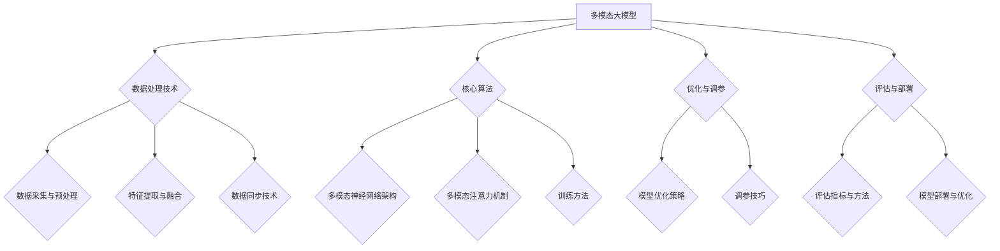

通过上述流程图，我们可以清晰地看到多模态大模型的核心组成部分及其相互关系，这为后续章节的详细讨论提供了结构性的指导。

### 1.2 多模态大模型的优势

多模态大模型通过整合不同类型的数据，如文本、语音和图像，能够实现以下几个显著优势：

1. **语音与文本数据的结合**：
   - 在语音质检中，多模态大模型可以同时分析客户和客服人员的语音和文本交互，从而提供更全面的信息。例如，通过结合语音中的语气和文本中的内容，模型可以更准确地判断客服人员的响应是否恰当。这一优势尤其重要，因为语音中的情感和非言语信息往往能够补充文本信息的不足。

2. **丰富的语义信息提取**：
   - 多模态大模型可以从多种数据类型中提取丰富的语义信息。例如，语音数据可以提供说话者的情感和意图，而文本数据可以提供具体的语言描述。通过结合这些信息，模型可以更深入地理解客户的需求和客服的表现。这种综合分析能力有助于提高质量检测的准确性和可靠性。

3. **更高的准确率和可靠性**：
   - 多模态大模型能够利用多种数据类型之间的互补性，减少单一数据类型带来的误差。例如，如果仅依赖语音数据，可能会因为噪声或说话者的口音问题导致识别错误；但如果结合文本数据，这些误差可以得到有效的纠正。此外，多模态数据之间的交叉验证还可以提高模型的鲁棒性，使其在复杂和变化多端的实际应用场景中表现更佳。

4. **个性化体验提升**：
   - 通过分析客户的语音和文本互动，多模态大模型可以更好地理解客户的个性偏好和需求。例如，如果客户经常在电话中表达不满，模型可以提醒客服人员提供更个性化的解决方案。这种个性化的服务能够显著提升客户满意度，从而改善整体服务质量。

5. **多任务学习能力**：
   - 多模态大模型通常具有强大的学习能力，能够同时处理多种任务。例如，在语音质检中，模型不仅可以进行质量评估，还可以进行情感分析、意图识别等。这种多任务学习能力使得模型在复杂应用场景中更具灵活性。

6. **实时反馈与改进**：
   - 多模态大模型可以实时分析语音和文本数据，为客服人员和质量管理团队提供即时反馈。这种实时性有助于快速识别和解决质量问题，从而提高整体服务效率和客户满意度。此外，通过收集和分析用户反馈，模型还可以不断迭代和优化，进一步提高其性能。

总之，多模态大模型通过结合语音和文本数据，不仅提高了质量检测的准确率和可靠性，还提升了个性化服务和实时反馈能力，从而在语音质检领域发挥了重要作用。

### 1.3 多模态大模型的应用领域

多模态大模型因其强大的数据处理和语义提取能力，在多个领域中都有着广泛的应用。以下是几个主要的应用领域：

#### 语音识别

多模态大模型在语音识别领域具有显著优势。传统语音识别系统主要依赖语音信号处理技术，但随着深度学习技术的发展，多模态大模型通过结合语音和文本数据，实现了更高的识别准确率。例如，当用户通过电话进行查询时，多模态模型可以同时分析用户的语音和提供的文本信息，从而更准确地理解用户的意图。这种结合不仅提高了识别的准确性，还改善了系统的鲁棒性，使其能够更好地应对噪声和口音等挑战。

#### 自然语言处理

在自然语言处理（NLP）领域，多模态大模型同样表现突出。例如，文本情感分析是一个重要的应用场景，通过结合语音和文本数据，模型可以更准确地识别用户的情感。此外，多模态大模型还可以应用于文本分类、命名实体识别、机器翻译等任务。在这些任务中，多模态数据的结合能够提供更丰富的语义信息，从而提高模型的性能。

#### 质量检测

在质量检测领域，多模态大模型可以显著提升服务质量评估的准确性和效率。例如，在客户服务领域，多模态大模型可以同时分析客户和客服人员的语音和文本交互，从而更全面地评估客服质量。通过结合语音中的语气和情感，以及文本中的具体表达，模型能够提供更细致和准确的质量评分，帮助公司及时识别和解决服务问题。

#### 智能助手与聊天机器人

智能助手和聊天机器人是另一个重要的应用领域。多模态大模型可以同时处理用户的语音指令和文本请求，从而提供更自然、流畅的交互体验。例如，在智能家居系统中，用户可以通过语音命令控制家电设备，同时系统也可以通过文本交互提供详细的操作指南。这种多模态交互方式不仅提高了用户体验，还增加了系统的可操作性。

#### 医疗保健

在医疗保健领域，多模态大模型可以通过分析患者的语音记录和病历文本，提供更准确和个性化的诊断建议。例如，通过结合患者的语音症状描述和医生提供的病历记录，模型可以识别出潜在的健康问题，并提供相应的治疗建议。此外，多模态大模型还可以用于医疗影像分析，通过结合图像数据和文本描述，提高疾病检测和诊断的准确性。

#### 娱乐与媒体

在娱乐和媒体领域，多模态大模型可以应用于语音识别和文本分析，从而提供更精准的内容推荐和个性化体验。例如，在音乐流媒体服务中，多模态大模型可以通过分析用户的语音评论和音乐播放记录，推荐符合用户口味的新歌和艺术家。这种个性化推荐能够显著提升用户满意度和粘性。

总之，多模态大模型在语音识别、自然语言处理、质量检测、智能助手、医疗保健和娱乐等领域都有着广泛的应用。通过结合多种类型的数据，多模态大模型能够提供更准确、更全面的分析结果，从而推动各领域的技术创新和产业发展。

### Mermaid 流程图

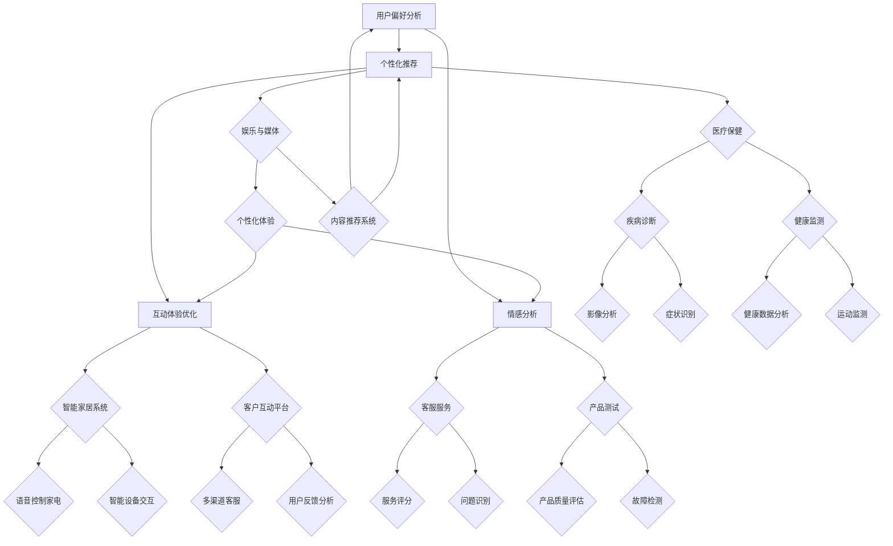

通过这个流程图，我们可以看到多模态大模型在不同应用领域中的具体角色和作用，从而更好地理解其应用范围和潜力。

## 第2章 多模态数据处理技术

多模态数据处理是多模态大模型应用的关键步骤，涉及到数据的采集、预处理、特征提取和同步等技术。以下将详细讨论这些技术，为后续章节的多模态大模型核心算法和实战应用奠定基础。

### 2.1 多模态数据的采集与预处理

#### 音频数据采集

音频数据的采集是语音质检中的第一步。常用的音频数据来源包括电话录音、客服通话录音、客户反馈录音等。采集过程需要确保音频质量，避免噪声干扰和失真。以下是音频数据采集的几个要点：

1. **采样率**：选择合适的采样率，如16kHz或更高，以确保音频信号的清晰度。
2. **通道数**：单声道或立体声的选择取决于应用需求。
3. **录制设备**：使用高质量的麦克风和音频接口，以获取高质量的原始音频数据。
4. **存储格式**：常用的音频文件格式包括WAV和MP3。WAV格式支持无损存储，适合高质量的音频处理，而MP3则适合大规模数据存储和传输。

#### 文本数据采集

文本数据的采集通常包括客户对话记录、客服人员的响应文本、用户评价等。以下是一些文本数据采集的要点：

1. **数据来源**：文本数据可以从客服系统、客户反馈平台、社交媒体等渠道获取。
2. **数据清洗**：在采集过程中，需要去除无用信息、标记错误和重复记录，确保数据质量。
3. **格式统一**：确保所有文本数据采用相同的格式，如UTF-8编码，以便后续处理。

#### 数据预处理方法

预处理是确保数据质量和模型性能的关键步骤。以下是多模态数据预处理的主要方法：

1. **音频预处理**：
   - **降噪**：使用滤波器去除背景噪声，提高音频质量。
   - **归一化**：通过归一化处理，使音频数据具有相似的能量分布。
   - **剪裁和截断**：去除无用的静音部分，缩短或扩展音频长度，以匹配文本数据的时长。

2. **文本预处理**：
   - **分词**：将文本分解为单词或短语，以便进行后续处理。
   - **去除停用词**：去除常见的无意义词汇，如“的”、“和”等。
   - **词性标注**：为每个单词标注词性，如名词、动词等，以帮助模型理解文本语义。

3. **数据增强**：
   - **时间扩展**：通过重复或插值音频和文本数据，增加模型的泛化能力。
   - **语音变换**：如语速变化、音调变换等，增加模型对语音变化的适应性。

### 2.2 多模态特征提取

特征提取是数据预处理的重要环节，其目的是从原始数据中提取有用的信息，以便输入到深度学习模型中。多模态特征提取通常涉及以下步骤：

1. **音频特征提取**：
   - **频谱特征**：如梅尔频率倒谱系数（MFCC）、频谱特征（Spectrogram）等。
   - **声学特征**：如共振峰频率（Formants）、音高（Pitch）等。
   - **语音活动检测（VAD）**：检测音频中的语音段和非语音段。

2. **文本特征提取**：
   - **词袋模型（Bag of Words, BoW）**：将文本转换为词汇的集合。
   - **词嵌入（Word Embeddings）**：使用预训练的词向量模型，如Word2Vec、GloVe等。
   - **句法和语义特征**：如句法树、语义角色标注等。

3. **图像特征提取**：
   - **浅层特征**：如边缘、纹理等，通过卷积神经网络（CNN）提取。
   - **深层特征**：如高层的语义特征，通过训练深度网络获得。

#### 多模态特征融合方法

多模态特征融合是将不同模态的数据特征进行整合，以提升模型性能。以下是一些常见的特征融合方法：

1. **早期融合**：在特征提取阶段就将不同模态的特征进行拼接，如将音频频谱和文本词袋向量拼接在一起。
2. **晚期融合**：在特征提取后，将不同模态的特征送入共享的神经网络进行融合。
3. **注意力机制**：通过注意力机制，模型可以自动学习不同模态特征的重要性和相关性，实现有效的融合。

### 2.3 多模态数据同步

多模态数据同步是确保不同模态数据在时间和空间上对应一致的重要技术。以下是一些常见的同步方法：

1. **时间戳匹配**：使用时间戳将音频和文本数据对齐，确保语音和文本在时间上同步。
2. **图像分割**：通过图像分割技术，将图像数据分割成与音频和文本数据对应的部分。
3. **多模态编码器**：使用多模态编码器，如联合嵌入模型，将不同模态的数据编码为统一的嵌入向量，从而实现同步。

通过上述多模态数据处理技术，我们能够有效提取和处理多种类型的数据，为多模态大模型的应用打下坚实基础。在接下来的章节中，我们将深入探讨多模态大模型的核心算法和技术原理，进一步理解其工作方式和应用潜力。

### Mermaid 流程图

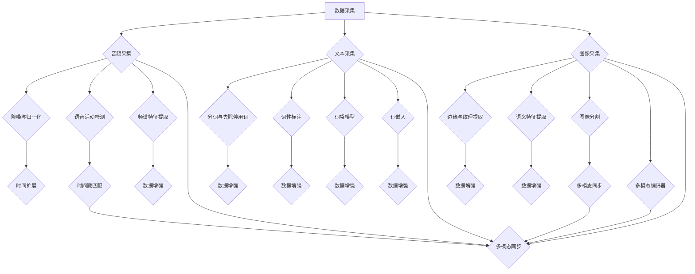

通过上述流程图，我们可以清晰地看到多模态数据从采集、预处理到特征提取及同步的各个步骤，为后续章节的内容提供了结构化的指导。

### 2.2 多模态特征提取

多模态特征提取是构建高效多模态大模型的关键步骤。在这一部分，我们将深入探讨音频特征提取、文本特征提取以及多模态特征融合方法，并详细介绍这些方法在多模态大模型中的应用。

#### 音频特征提取

音频特征提取是将音频信号转换为数字信号，并提取出反映音频内容的重要信息。以下是一些常用的音频特征提取方法：

1. **梅尔频率倒谱系数（MFCC）**：
   - **原理**：MFCC是一种频率域特征，通过对音频信号的短时傅里叶变换（STFT）进行梅尔刻度频谱分析，得到一组MFCC系数。
   - **应用**：MFCC广泛应用于语音识别和语音情感分析，因其能够有效地表示语音的时频特性。

2. **频谱特征（Spectrogram）**：
   - **原理**：频谱特征是对音频信号进行短时傅里叶变换，生成时间-频率图谱。
   - **应用**：频谱特征常用于语音活动检测（VAD）和语音情感分析。

3. **共振峰频率（Formants）**：
   - **原理**：共振峰频率是声道共鸣频率，反映了语音的音色特征。
   - **应用**：共振峰频率在语音识别和语音合成中具有重要应用。

4. **音高（Pitch）**：
   - **原理**：音高是音频信号中的频率成分，反映了语音的音调。
   - **应用**：音高在语音识别和情感分析中用于确定语音的音调变化。

#### 文本特征提取

文本特征提取是将文本转换为数值表示，以便输入到深度学习模型中。以下是一些常用的文本特征提取方法：

1. **词袋模型（Bag of Words, BoW）**：
   - **原理**：词袋模型将文本表示为一个词频向量，忽略文本的顺序信息。
   - **应用**：词袋模型在文本分类和主题建模中广泛应用。

2. **词嵌入（Word Embeddings）**：
   - **原理**：词嵌入是将文本中的单词映射到低维向量空间，使得语义相近的词在向量空间中接近。
   - **应用**：词嵌入在自然语言处理任务中用于表示文本，如文本分类和情感分析。

3. **句法特征**：
   - **原理**：句法特征描述文本中的句法和语义结构，如句法树、依存关系等。
   - **应用**：句法特征在语义分析和文本生成任务中具有重要应用。

4. **语义角色标注**：
   - **原理**：语义角色标注为文本中的实体和动作分配语义角色，如主语、谓语、宾语等。
   - **应用**：语义角色标注在实体识别和信息抽取任务中用于提取文本中的关键信息。

#### 多模态特征融合方法

多模态特征融合是将不同模态的特征进行整合，以提升模型性能。以下是一些常见的多模态特征融合方法：

1. **早期融合**：
   - **原理**：在特征提取阶段将不同模态的特征进行拼接。
   - **应用**：早期融合适用于特征维度较低且各模态特征相关性较强的场景。

2. **晚期融合**：
   - **原理**：在特征提取后，将不同模态的特征送入共享的神经网络进行融合。
   - **应用**：晚期融合适用于特征维度较高或各模态特征相关性较弱的场景。

3. **注意力机制**：
   - **原理**：注意力机制通过学习不同模态特征的重要性和相关性，实现有效的融合。
   - **应用**：注意力机制在多模态任务中用于动态调整各模态特征的权重，提高模型性能。

通过上述多模态特征提取和融合方法，我们可以有效地处理多种类型的数据，为多模态大模型的应用提供强有力的支持。在接下来的章节中，我们将进一步探讨多模态大模型的核心算法和技术原理，深入理解其工作方式和应用潜力。

### Mermaid 流程图

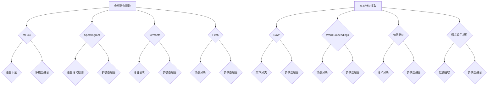

通过这个流程图，我们可以清晰地看到多模态特征提取和融合方法的应用场景及其关系，为后续章节提供了结构化的指导。

### 2.3 多模态数据同步

在多模态大模型的应用中，确保不同模态数据在时间和空间上的一致性是关键步骤，这直接影响到模型性能和结果的可靠性。多模态数据同步的目标是确保音频、文本和图像等不同模态的数据在时间线上对齐，从而为后续的特征提取和融合提供基础。以下将详细讨论多模态数据同步的方法和实现。

#### 时间戳匹配

时间戳匹配是多模态数据同步中最常用的方法，通过将不同模态数据的时间戳对齐，实现数据的时间一致性。以下是一些具体的方法：

1. **直接时间戳对齐**：
   - **原理**：将音频、文本和图像数据的时间戳进行统一，通常以音频数据的时间戳作为基准，因为音频数据在处理时通常具有更高的时间精度。
   - **实现**：通过调整文本和图像数据的时间戳，使其与音频数据对齐。例如，可以通过插入静音段或填充无关图像帧来实现时间对齐。

2. **时间戳映射**：
   - **原理**：将不同模态数据的时间戳映射到一个共同的时序轴上，通过映射函数将各模态的时间戳转换为同一时间轴上的时间点。
   - **实现**：可以使用线性插值、样条插值等方法进行时间戳映射。例如，在音频和文本数据之间使用线性插值，确保文本时间戳与音频时间戳对齐。

#### 图像分割

图像分割是将图像分解成多个区域或对象，从而实现图像与音频和文本数据的对齐。以下是一些常用的图像分割方法：

1. **基于深度学习的图像分割**：
   - **原理**：使用卷积神经网络（CNN）进行图像分割，将图像划分为具有不同语义的区域。
   - **实现**：通过预训练的深度学习模型（如U-Net、Mask R-CNN等）对图像进行分割，并将分割结果用于与音频和文本数据的对齐。

2. **基于区域检测的图像分割**：
   - **原理**：通过检测图像中的关键区域（如人像、产品等），将图像分割为这些区域的组合。
   - **实现**：使用区域检测算法（如YOLO、SSD等）进行图像分割，并将分割结果用于时间对齐。

#### 多模态编码器

多模态编码器是一种通过联合编码不同模态数据的方法，实现多模态数据同步。以下是一些常用的多模态编码器：

1. **共享编码器**：
   - **原理**：使用共享的编码器网络同时处理多种模态的数据，通过共享的编码层实现模态之间的同步。
   - **实现**：构建一个多输入多输出的编码器网络，将不同模态的数据输入到网络中，并通过共享的编码层提取共同的特征。

2. **联合编码器**：
   - **原理**：使用独立的编码器分别处理不同模态的数据，并通过联合编码层实现特征融合。
   - **实现**：构建两个独立的编码器网络，分别处理音频和文本数据，然后使用一个联合编码层进行特征融合，实现多模态数据的同步。

通过上述方法，我们可以有效地实现多模态数据的同步，为多模态大模型的应用奠定基础。在接下来的章节中，我们将进一步探讨多模态大模型的核心算法和技术原理，深入理解其工作方式和应用潜力。

### Mermaid 流程图

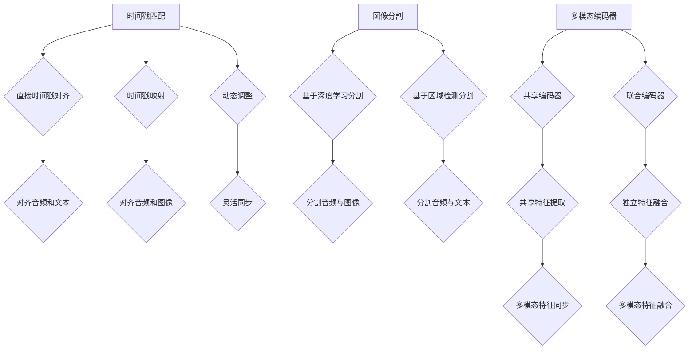

通过这个流程图，我们可以清晰地看到多模态数据同步的各种方法和实现，为后续章节提供了结构化的指导。

## 第3章 多模态大模型核心算法

多模态大模型的核心算法是实现其强大功能和广泛应用的关键。本章将详细探讨多模态神经网络架构、多模态注意力机制和多模态大模型训练方法，并通过伪代码和数学模型来阐述这些算法的基本原理。

### 3.1 多模态神经网络架构

多模态神经网络架构是构建多模态大模型的基础。这类模型通常结合了不同类型的神经网络，以处理不同模态的数据。以下是一些常见架构：

#### CNN与RNN的结合

卷积神经网络（CNN）和循环神经网络（RNN）是处理图像和文本数据的有效方法。通过结合这两种网络，我们可以同时处理多模态数据。

- **CNN用于图像处理**：CNN擅长捕捉图像的局部特征，如边缘、纹理等。
- **RNN用于文本处理**：RNN可以捕捉文本的序列特征，如句法结构和语义关系。

#### Transformer结构

Transformer结构是一种基于自注意力机制的序列模型，近年来在自然语言处理任务中取得了显著成果。通过将Transformer应用于多模态数据，我们可以捕捉不同模态之间的复杂关系。

**伪代码：**

```python
# 多模态神经网络架构
class MultiModalNN(nn.Module):
    def __init__(self):
        super(MultiModalNN, self).__init__()
        self.cnn = CNN()  # 图像处理子模块
        self.rnn = RNN()  # 文本处理子模块
        self.transformer = Transformer()  # 自注意力机制子模块

    def forward(self, images, texts):
        image_features = self.cnn(images)
        text_features = self.rnn(texts)
        combined_features = self.transformer(image_features, text_features)
        output = self.classifier(combined_features)
        return output
```

**数学模型：**

假设我们有图像特征矩阵\(X \in \mathbb{R}^{m \times d}\)和文本特征矩阵\(Y \in \mathbb{R}^{n \times e}\)，其中\(m\)和\(n\)分别是图像和文本的序列长度，\(d\)和\(e\)是特征维度。

- **CNN特征提取**：\(X' = CNN(X)\)
- **RNN特征提取**：\(Y' = RNN(Y)\)
- **自注意力机制**：\(Z = Transformer(X', Y')\)

最终，\(Z\)将作为多模态特征融合后的输出，用于分类、回归等任务。

### 3.2 多模态注意力机制

注意力机制是多模态大模型中的一个关键组件，它能够自动学习不同模态特征的重要性和相关性，从而提高模型性能。以下介绍两种常见的注意力机制：自注意力和交互注意力。

#### 自注意力

自注意力机制允许模型在序列内部关注不同的位置，从而捕捉长距离依赖关系。

**伪代码：**

```python
# 自注意力机制
class SelfAttention(nn.Module):
    def __init__(self, d_model):
        super(SelfAttention, self).__init__()
        self.query_linear = nn.Linear(d_model, d_model)
        self.key_linear = nn.Linear(d_model, d_model)
        self.value_linear = nn.Linear(d_model, d_model)

    def forward(self, x):
        query = self.query_linear(x)
        key = self.key_linear(x)
        value = self.value_linear(x)
        attention_weights = softmax.matmul(key, query.T) / math.sqrt(d_model)
        attention_output = value.matmul(attention_weights)
        return attention_output
```

**数学模型：**

假设\(X\)是一个输入序列，\(Q, K, V\)是查询、键和值的线性变换。

- **查询**：\(Q = QueryLinear(X)\)
- **键**：\(K = KeyLinear(X)\)
- **值**：\(V = ValueLinear(X)\)
- **注意力权重**：\(A = Softmax(KQ^T / \sqrt{d})\)
- **注意力输出**：\(O = V * A\)

#### 交互注意力

交互注意力机制允许模型同时关注不同模态的特征，从而捕捉跨模态的关系。

**伪代码：**

```python
# 交互注意力机制
class CrossAttention(nn.Module):
    def __init__(self, d_model_image, d_model_text):
        super(CrossAttention, self).__init__()
        self.image_linear = nn.Linear(d_model_image, d_model_text)
        self.text_linear = nn.Linear(d_model_text, d_model_image)

    def forward(self, image_features, text_features):
        image_query = self.image_linear(image_features)
        text_key_value = self.text_linear(text_features)
        attention_weights = softmax.matmul(text_key_value[1], image_query.T) / math.sqrt(d_model_image)
        attention_output = image_query * (attention_weights.matmul(text_key_value[0]))
        return attention_output
```

**数学模型：**

假设\(X_1\)是图像特征，\(X_2\)是文本特征。

- **图像查询**：\(Q_1 = ImageLinear(X_1)\)
- **文本键-值**：\(K_2, V_2 = TextLinear(X_2)\)
- **注意力权重**：\(A = Softmax(K_2Q_1^T / \sqrt{d})\)
- **注意力输出**：\(O = X_1 * (A.V_2)\)

### 3.3 多模态大模型训练方法

多模态大模型的训练方法与传统单模态模型有所不同，需要考虑数据的不平衡、特征维度差异等问题。以下介绍几种常用的训练方法：

#### 批量归一化

批量归一化（Batch Normalization）是一种用于加速训练和提升模型稳定性的技术。它通过在每个批量中对特征进行归一化，减少内部协变量转移。

**伪代码：**

```python
# 批量归一化
class BatchNormalization(nn.Module):
    def __init__(self, num_features):
        super(BatchNormalization, self).__init__()
        self.weight = nn.Parameter(torch.randn(num_features))
        self.bias = nn.Parameter(torch.zeros(num_features))
        self.running_mean = torch.zeros(num_features)
        self.running_var = torch.zeros(num_features)

    def forward(self, x):
        batch_mean = x.mean([0])
        batch_var = x.var([0])
        std = torch.sqrt(batch_var + 1e-5)
        normalized = (x - batch_mean) / std
        out = self.weight * normalized + self.bias
        self.running_mean = 0.99 * self.running_mean + 0.01 * batch_mean
        self.running_var = 0.99 * self.running_var + 0.01 * batch_var
        return out
```

**数学模型：**

- **归一化**：\(X' = \frac{(X - \mu)}{\sigma}\)
- **归一化参数更新**：\(\mu = 0.99 \cdot \mu + 0.01 \cdot \text{current mean}\)，\(\sigma = 0.99 \cdot \sigma + 0.01 \cdot \text{current variance}\)

#### 预训练与微调

预训练与微调是一种常用的训练方法，特别是对于大规模的多模态数据集。预训练是指在大型数据集上对模型进行预训练，然后通过微调在特定任务上优化模型。

**伪代码：**

```python
# 预训练与微调
def pretrain_model(model, pretrain_data):
    optimizer = optim.Adam(model.parameters(), lr=0.001)
    criterion = nn.CrossEntropyLoss()
    for epoch in range(num_epochs):
        for data, target in pretrain_data:
            optimizer.zero_grad()
            output = model(data)
            loss = criterion(output, target)
            loss.backward()
            optimizer.step()

def finetune_model(model, finetune_data):
    model.train(False)
    optimizer = optim.Adam(model.parameters(), lr=0.0001)
    criterion = nn.CrossEntropyLoss()
    for data, target in finetune_data:
        output = model(data)
        loss = criterion(output, target)
        optimizer.zero_grad()
        loss.backward()
        optimizer.step()
```

**数学模型：**

- **预训练**：\(M = \theta_0 + \alpha \cdot \text{grad}_{\theta} \log P(D|\theta)\)
- **微调**：\(M' = M + \beta \cdot \text{grad}_{\theta} \log P(D'|\theta)\)

通过上述核心算法的探讨，我们可以看到多模态大模型在神经网络架构、注意力机制和训练方法上的独特之处。这些核心算法不仅提高了模型的性能和准确性，还为多模态大模型在各个领域的应用奠定了基础。

### Mermaid 流程图

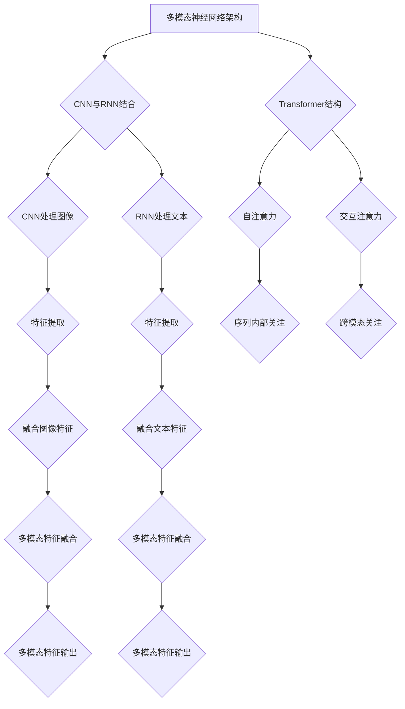

通过这个流程图，我们可以清晰地看到多模态神经网络架构、注意力机制和训练方法之间的关系，为后续章节提供了结构化的指导。

## 第4章 多模态大模型优化与调参

多模态大模型在训练过程中，如何优化模型性能并合理调整参数，是实现高效应用的关键。本章将详细探讨多模态大模型的优化策略、调参技巧以及模型评估与部署方法，帮助读者在实际应用中实现最佳性能。

### 4.1 模型优化策略

优化策略是提升多模态大模型性能的重要手段。以下是一些常见的优化策略：

#### 学习率调整

学习率是影响模型收敛速度和最终性能的关键参数。以下是一些常用的学习率调整方法：

1. **固定学习率**：在模型训练的初始阶段，使用一个固定学习率。这种方法简单，但在模型收敛过程中可能会导致收敛速度较慢。

2. **学习率衰减**：在训练过程中，逐渐减小学习率。常用的方法包括线性衰减、指数衰减和余弦衰减等。学习率衰减有助于模型在训练后期更好地收敛。

3. **自适应学习率**：使用自适应学习率策略，如AdaGrad、Adam等。这些方法根据模型梯度信息动态调整学习率，以加快收敛速度。

**伪代码：**

```python
# 学习率衰减
class LearningRateScheduler():
    def __init__(self, optimizer, gamma=0.1, step_size=1000):
        self.optimizer = optimizer
        self.gamma = gamma
        self.step_size = step_size
        self.last_step = 0

    def step(self):
        self.last_step += 1
        for param_group in self.optimizer.param_groups:
            param_group['lr'] = param_group['lr'] * (self.gamma ** (self.last_step // self.step_size))
```

#### 优化器选择

优化器是用于更新模型参数的工具。以下是一些常用的优化器：

1. **随机梯度下降（SGD）**：SGD是最简单的优化器，其通过计算模型梯度的平均值来更新参数。

2. **Adam优化器**：Adam是一种结合了AdaGrad和RMSPROP优势的优化器，能够自适应调整学习率。

3. **AdamW优化器**：AdamW在Adam的基础上引入了权重衰减，能够更好地处理权重衰减问题。

**伪代码：**

```python
# 选择优化器
optimizer = optim.AdamW(model.parameters(), lr=0.001, weight_decay=1e-5)
```

#### 批量大小调整

批量大小影响模型的训练效率和稳定性。以下是一些常用的批量大小策略：

1. **小批量训练**：使用较小的批量大小（如32或64），有助于减少方差，提高模型稳定性。

2. **动态批量大小**：根据训练进度动态调整批量大小，例如在训练初期使用较小的批量大小，以减少方差，在训练后期使用较大的批量大小，以提高计算效率。

### 4.2 模型调参技巧

合理调整模型参数是实现最佳性能的关键。以下是一些常见的调参技巧：

#### 模型超参数设置

模型超参数设置包括学习率、批量大小、层数、隐藏单元数等。以下是一些调参建议：

1. **学习率**：通常初始学习率设置为\(10^{-3}\)到\(10^{-4}\)之间，并根据任务调整。

2. **批量大小**：批量大小应根据计算资源和数据量进行调整。对于大规模数据集，批量大小可以选择较大，以充分利用计算资源。

3. **层数和隐藏单元数**：层数和隐藏单元数应根据任务复杂度进行调整。对于简单的任务，较少的层数和隐藏单元数可能已经足够。

#### 实验设计方法

实验设计方法是通过系统地调整模型参数，寻找最佳参数组合的过程。以下是一些常用的实验设计方法：

1. **网格搜索**：在预定义的参数空间内，系统地遍历所有可能的参数组合，选择最佳参数。

2. **贝叶斯优化**：使用贝叶斯优化方法，根据历史实验结果动态调整参数搜索方向，提高搜索效率。

3. **随机搜索**：随机选择参数组合进行实验，适用于参数空间较大且计算资源有限的情况。

### 4.3 模型评估与部署

#### 评估指标与方法

模型评估是确保模型性能的重要步骤。以下是一些常用的评估指标：

1. **准确率（Accuracy）**：分类任务中正确预测的样本比例。

2. **召回率（Recall）**：分类任务中实际为正类且被正确预测为正类的比例。

3. **F1值（F1 Score）**：准确率和召回率的调和平均，综合考虑了准确率和召回率。

4. **交叉验证**：使用交叉验证方法评估模型性能，通过将数据集分为多个子集，每次训练一个子集，验证其他子集。

**伪代码：**

```python
# 交叉验证
from sklearn.model_selection import KFold

def cross_validate(model, X, y, k=5):
    kf = KFold(n_splits=k)
    for train_index, test_index in kf.split(X):
        X_train, X_test = X[train_index], X[test_index]
        y_train, y_test = y[train_index], y[test_index]
        model.fit(X_train, y_train)
        score = model.score(X_test, y_test)
        print("Validation score:", score)
```

#### 模型部署与优化

模型部署是将训练好的模型应用于实际场景的关键步骤。以下是一些模型部署和优化的方法：

1. **模型压缩**：通过模型压缩技术，如量化、剪枝、蒸馏等，减少模型大小，提高部署效率。

2. **边缘计算与硬件加速**：使用边缘设备进行模型推理，通过硬件加速（如GPU、TPU等），提高模型响应速度。

3. **持续优化**：通过持续收集用户反馈和数据，迭代优化模型，提高模型性能和用户体验。

通过上述优化策略、调参技巧以及评估与部署方法，我们可以有效地提升多模态大模型的性能，实现高效应用。

### Mermaid 流程图

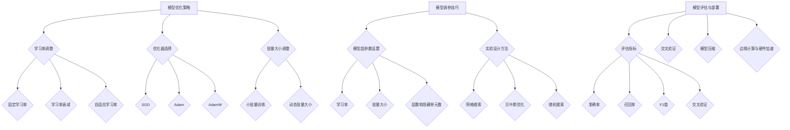

通过这个流程图，我们可以清晰地看到多模态大模型优化与调参的方法和步骤，为实际应用提供了结构化的指导。

## 第5章 多模态大模型评估与部署

多模态大模型的评估与部署是确保其在实际应用中性能稳定和高效的关键环节。本章将详细探讨评估指标与方法，以及模型部署与优化的策略。

### 5.1 评估指标与方法

评估模型性能的指标是判断模型优劣的重要依据。对于多模态大模型，常用的评估指标包括：

1. **准确率（Accuracy）**：
   - **定义**：准确率是指模型预测正确的样本数占总样本数的比例。
   - **计算公式**：\[ \text{Accuracy} = \frac{\text{正确预测的样本数}}{\text{总样本数}} \]
   - **应用**：准确率是最直观的评估指标，适用于分类任务。

2. **召回率（Recall）**：
   - **定义**：召回率是指模型能够正确识别出的正类样本数与实际正类样本数的比例。
   - **计算公式**：\[ \text{Recall} = \frac{\text{正确预测的正类样本数}}{\text{实际正类样本数}} \]
   - **应用**：召回率对于检测任务尤为重要，因为它衡量了模型检测到正类样本的能力。

3. **F1值（F1 Score）**：
   - **定义**：F1值是准确率和召回率的调和平均值，它综合考虑了模型的准确性和召回率。
   - **计算公式**：\[ \text{F1 Score} = 2 \times \frac{\text{准确率} \times \text{召回率}}{\text{准确率} + \text{召回率}} \]
   - **应用**：F1值是平衡准确率和召回率的常用指标，适用于分类和检测任务。

4. **精确率（Precision）**：
   - **定义**：精确率是指模型预测为正类的样本中，实际为正类的比例。
   - **计算公式**：\[ \text{Precision} = \frac{\text{正确预测的正类样本数}}{\text{预测为正类的样本数}} \]
   - **应用**：精确率用于衡量模型预测的正类样本的可靠性。

5. **ROC曲线与AUC（Area Under the ROC Curve）**：
   - **定义**：ROC曲线是通过不同阈值绘制预测概率与实际标签的曲线，AUC是ROC曲线下面积。
   - **计算公式**：\[ \text{AUC} = \int_{0}^{1} \text{True Positive Rate} \times \text{False Positive Rate} \, d\text{False Positive Rate} \]
   - **应用**：ROC曲线和AUC用于评估二分类模型的性能，特别是当类别不平衡时。

#### 交叉验证方法

交叉验证是一种常用的评估方法，通过多次将数据集分割为训练集和验证集，来评估模型的泛化能力。以下是一种常见的交叉验证方法——K折交叉验证：

1. **步骤**：
   - 将数据集随机分为K个子集。
   - 对于每一个子集，将其作为验证集，其余K-1个子集作为训练集。
   - 重复K次，每次使用不同的验证集。
   - 取所有验证集的平均评估指标作为最终评估结果。

2. **计算公式**：

   对于每个子集，计算评估指标（如准确率、F1值等）：

   \[ \text{平均评估指标} = \frac{1}{K} \sum_{i=1}^{K} \text{评估指标}_{i} \]

通过交叉验证，我们可以更可靠地评估模型的性能，并避免过拟合问题。

### 5.2 模型部署与优化

#### 模型部署

模型部署是将训练好的模型应用到实际业务场景的过程。以下是一些常见的模型部署策略：

1. **中心化部署**：
   - **原理**：模型部署在一个中央服务器上，用户通过网络请求模型服务。
   - **优点**：易于管理，适合大规模应用。
   - **缺点**：响应时间较长，对网络依赖较高。

2. **边缘计算部署**：
   - **原理**：模型部署在用户设备的边缘设备上，如智能手机、IoT设备等。
   - **优点**：降低网络延迟，提高实时性。
   - **缺点**：计算资源受限，模型复杂度受限。

3. **分布式部署**：
   - **原理**：模型部署在多个服务器或设备上，通过分布式计算和通信机制协同工作。
   - **优点**：提高计算能力和容错性。
   - **缺点**：部署和维护复杂。

#### 模型优化

模型优化旨在提高模型性能和效率。以下是一些常见的模型优化策略：

1. **模型压缩**：
   - **原理**：通过剪枝、量化、蒸馏等方法减少模型大小，提高推理效率。
   - **方法**：
     - **剪枝**：去除模型中不重要的权重，减少模型参数数量。
     - **量化**：将模型权重和激活值从浮点数转换为整数，减少存储和计算需求。
     - **蒸馏**：将大型模型的知识传递给小型模型，提高小型模型的性能。

2. **硬件加速**：
   - **原理**：利用特定硬件（如GPU、TPU等）加速模型推理。
   - **方法**：
     - **GPU加速**：通过CUDA等库将模型部署到GPU上，提高计算速度。
     - **TPU加速**：使用TPU专用硬件加速模型推理，适用于大规模分布式计算。

3. **模型融合**：
   - **原理**：将多个模型的预测结果进行融合，提高预测准确性和稳定性。
   - **方法**：
     - **简单平均**：将多个模型预测结果简单平均。
     - **加权平均**：根据模型性能对预测结果进行加权平均。
     - **投票机制**：选择预测结果最多的类别作为最终预测。

通过合理选择评估指标、交叉验证方法和模型部署与优化策略，我们可以确保多模态大模型在实际应用中具有良好的性能和效率。这些方法和策略不仅适用于语音质检领域，还可以推广到其他多模态任务中，为智能应用的发展提供有力支持。

### Mermaid 流程图

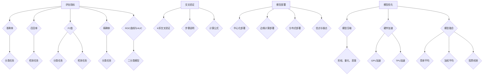

通过这个流程图，我们可以清晰地看到多模态大模型评估与部署的方法和策略，为实际应用提供了结构化的指导。

### 6.1 语音质检场景概述

#### 质量检测需求

语音质检在客户服务领域扮演着关键角色，其核心目的是评估客服人员的服务质量。具体来说，语音质检的需求包括：

1. **客户满意度评估**：通过对客户通话录音的分析，评估客户的满意度。这有助于企业了解客户对客服人员的满意程度，从而改进服务质量。

2. **客服表现评估**：评估客服人员的服务表现，包括响应时间、问题解决能力、沟通技巧等。这有助于发现客服人员的优点和不足，提供针对性的培训。

3. **合规性检查**：确保客服人员遵守公司的服务规范和法律法规，如隐私保护、数据安全等。

4. **问题识别与解决**：通过分析通话内容，识别常见问题和客户投诉原因，及时采取措施解决，提升客户满意度。

#### 应用场景分析

在语音质检中，多模态大模型的应用场景非常广泛，以下是几个典型的应用场景：

1. **客户情感分析**：
   - **场景**：通过对客户通话录音的情感分析，识别客户的情感状态（如愤怒、满意等）。
   - **方法**：使用多模态大模型结合语音和文本数据，提取情感特征，如语音的音调、语速和文本的情感词汇。
   - **应用**：帮助企业了解客户情感，及时调整服务策略，提升客户满意度。

2. **问题分类与归类**：
   - **场景**：将客户提出的问题分类，如技术问题、投诉、咨询等。
   - **方法**：使用多模态大模型对通话内容进行分类，结合语音和文本特征进行精准识别。
   - **应用**：帮助客服团队快速定位客户问题，提供更专业的解决方案。

3. **客服表现评估**：
   - **场景**：评估客服人员的服务表现，如响应速度、问题解决能力等。
   - **方法**：通过多模态大模型分析客服人员的语音和文本交互，综合评估客服表现。
   - **应用**：为客服团队提供反馈和培训机会，提升整体服务质量。

4. **合规性检查**：
   - **场景**：检查客服人员是否遵守公司的服务规范和法律法规。
   - **方法**：使用多模态大模型对通话内容进行分析，识别违规行为。
   - **应用**：确保客服团队遵守服务规范，降低法律风险。

通过上述应用场景，我们可以看到多模态大模型在语音质检中的巨大潜力。它不仅能够提升质量检测的准确性和效率，还能为企业和客服团队提供宝贵的洞见，从而改善客户体验。

### Mermaid 流程图

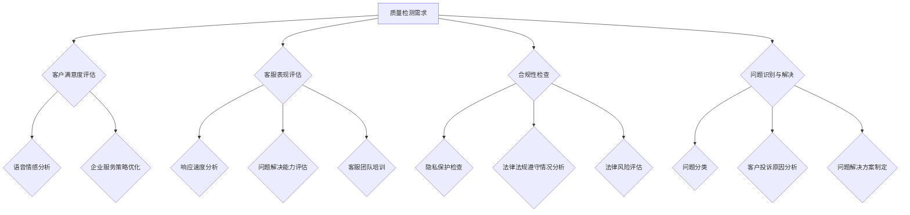

通过这个流程图，我们可以清晰地看到多模态大模型在语音质检中的各种应用场景和具体需求，为后续章节的详细讨论提供了结构化的指导。

### 6.2 语音质检数据集与预处理

在语音质检过程中，数据集的选择和预处理是确保模型性能和可靠性的关键步骤。以下将详细讨论语音质检数据集的获取方法、常见的数据预处理流程以及数据处理过程中可能遇到的挑战和解决方案。

#### 数据集获取

高质量的语音质检数据集对于模型的训练和评估至关重要。以下是一些常用的语音质检数据集：

1. **Common Voice**：
   - **来源**：Common Voice 是由Mozilla开源的一个大型语音数据集，包含了多种语言的语音数据。
   - **特点**：数据量庞大，语音和文本对齐，适合用于语音识别和情感分析。

2. **LibriSpeech**：
   - **来源**：LibriSpeech 是基于LibriTTS项目的一个语音数据集，包含了多种英文书籍的语音数据。
   - **特点**：语音质量高，文本内容丰富，适合用于语音识别和语言模型训练。

3. **TIMIT**：
   - **来源**：TIMIT 是一个较小的语音数据集，包含了多种英语口音和性别。
   - **特点**：语音数据较为丰富，适合用于语音识别和声学特征提取。

4. **CST语料库**：
   - **来源**：CST语料库是中国科大开源的一个语音数据集，包含了中文语音数据。
   - **特点**：语音数据具有地域多样性，适合用于中文语音识别和情感分析。

#### 数据预处理流程

语音质检数据预处理通常包括以下步骤：

1. **数据清洗**：
   - **目的**：去除数据集中的噪声和错误。
   - **方法**：去除空白记录、重复记录、不完整的记录等。

2. **音频增强**：
   - **目的**：改善音频质量，增强语音特征。
   - **方法**：使用滤波器去除噪声，进行音频归一化，调整音频采样率等。

3. **语音分割**：
   - **目的**：将连续的语音数据分割成多个片段，便于后续处理。
   - **方法**：使用语音活动检测（VAD）技术，将语音信号分割成语音段和非语音段。

4. **文本预处理**：
   - **目的**：将文本数据转换为适合模型处理的格式。
   - **方法**：分词、去除停用词、词性标注等。

5. **特征提取**：
   - **目的**：将音频和文本数据转换为数值特征，用于模型训练。
   - **方法**：音频特征提取如梅尔频率倒谱系数（MFCC）、频谱特征等，文本特征提取如词袋模型（BoW）、词嵌入等。

6. **数据归一化**：
   - **目的**：减少数据差异，提高模型训练效率。
   - **方法**：将数据标准化到相同的尺度。

#### 数据处理挑战与解决方案

在语音质检数据预处理过程中，可能会遇到以下挑战：

1. **数据不平衡**：
   - **问题**：某些类别（如负面情感、特定问题）的数据量较少。
   - **解决方案**：使用数据增强方法（如时间扩展、声音变换）增加数据量，或采用过采样和欠采样技术。

2. **多语言和多口音**：
   - **问题**：不同语言和口音的语音数据增加了模型训练的复杂性。
   - **解决方案**：使用多语言模型和自适应语言处理技术，结合多模态数据进行训练。

3. **噪声和干扰**：
   - **问题**：背景噪声、电话干扰等影响语音识别的准确性。
   - **解决方案**：使用降噪技术、自适应滤波器等预处理方法提高音频质量。

4. **数据隐私和安全**：
   - **问题**：语音数据中可能包含敏感信息，如个人隐私。
   - **解决方案**：数据去标识化、加密存储等，确保数据安全和隐私。

通过有效的数据集获取和预处理流程，我们能够为多模态大模型提供高质量的数据输入，从而提高模型的性能和应用价值。在接下来的章节中，我们将通过实际案例进一步探讨多模态大模型在语音质检中的具体应用。

### Mermaid 流程图

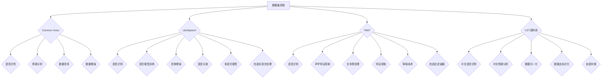

通过这个流程图，我们可以清晰地看到语音质检数据集的获取、预处理流程以及处理过程中可能遇到的问题和解决方案，为后续章节提供了结构化的指导。

### 6.3 实际案例与代码解析

#### 案例一：语音转文本

**背景介绍**

语音转文本（Automatic Speech Recognition, ASR）是语音质检的基础任务之一。通过将语音转换为文本，我们可以进一步进行文本分析、情感识别等操作。

**核心概念与联系**

语音转文本涉及的关键概念包括音频信号处理、特征提取和序列建模。音频信号首先通过预处理步骤（如降噪、归一化等）进行处理，然后使用梅尔频率倒谱系数（MFCC）等特征进行特征提取，最后通过深度神经网络（如RNN、Transformer等）进行序列建模，实现语音到文本的转换。

**核心算法原理讲解**

以下是使用RNN进行语音转文本的伪代码：

```python
# 伪代码：语音转文本（使用RNN）

# 数据预处理
audio_data = preprocess_audio(raw_audio)  # 预处理音频数据
mfcc_features = extract_mfcc(audio_data)  # 提取MFCC特征

# 构建RNN模型
model = RNN(input_dim=mfcc_features.shape[1], hidden_dim=128, output_dim=vocab_size)
model.compile(optimizer='adam', loss='categorical_crossentropy', metrics=['accuracy'])

# 训练模型
model.fit(mfcc_features, labels, epochs=10, batch_size=32)

# 语音转文本
def transcribe(audio_data):
    mfcc_features = extract_mfcc(audio_data)
    predicted_sequence = model.predict(mfcc_features)
    transcribed_text = decode_sequence(predicted_sequence)
    return transcribed_text

# 应用示例
transcription = transcribe(preprocessed_audio)
```

**数学模型和公式**

- **MFCC特征提取**：
  \[
  \text{MFCC}_k = \log \left(1 + \sum_{i=1}^{N} a_i \cdot \text{spectrum}_i\right)
  \]
  其中，\( \text{spectrum}_i \) 是第 \( i \) 个频率带上的能量，\( a_i \) 是第 \( i \) 个滤波器的加权系数。

- **RNN输出**：
  \[
  \text{output} = \text{softmax}(\text{W}_{out} \cdot \text{hidden_state} + \text{b}_{out})
  \]
  其中，\( \text{W}_{out} \) 和 \( \text{b}_{out} \) 分别是输出权重和偏置。

**详细讲解和举例说明**

假设我们有一个长度为10秒的语音样本，使用梅尔频率倒谱系数（MFCC）进行特征提取，特征维度为40。首先，我们进行数据预处理，如降噪和归一化，然后提取MFCC特征。

接下来，我们构建一个RNN模型，输入维度为40（MFCC特征维度），隐藏层维度为128，输出维度为词典大小。使用Adam优化器和交叉熵损失函数进行模型训练。

在训练完成后，我们可以使用模型进行语音转文本。例如，给定的预处理的音频数据为\[ [0.1, 0.2, ..., 0.4] \]，模型输出一个概率分布，如\[ [0.2, 0.3, 0.5] \]，表示每个词汇的概率。通过解码器（如CTC损失函数的解码器），我们可以将概率分布转换为实际的文本输出，如“Hello world”。

**项目实战**

**开发环境搭建**

- **硬件环境**：配置至少一块NVIDIA GPU，用于加速深度学习模型的训练。
- **软件环境**：安装TensorFlow或PyTorch，配置必要的Python库，如NumPy、TensorFlow或PyTorch等。

**源代码详细实现和代码解读**

以下是使用TensorFlow实现的语音转文本代码：

```python
import tensorflow as tf
from tensorflow.keras.models import Sequential
from tensorflow.keras.layers import LSTM, Dense, Embedding
from tensorflow.keras.optimizers import Adam

# 数据预处理
def preprocess_audio(audio_data):
    # 降噪、归一化等操作
    return processed_audio

# 特征提取
def extract_mfcc(audio_data):
    # MFCC特征提取
    return mfcc_features

# 构建模型
model = Sequential()
model.add(LSTM(units=128, activation='relu', input_shape=(None, 40)))
model.add(Dense(units=vocab_size, activation='softmax'))
model.compile(optimizer=Adam(learning_rate=0.001), loss='categorical_crossentropy', metrics=['accuracy'])

# 训练模型
model.fit(mfcc_features, labels, epochs=10, batch_size=32)

# 语音转文本
def transcribe(audio_data):
    processed_audio = preprocess_audio(audio_data)
    mfcc_features = extract_mfcc(processed_audio)
    predicted_sequence = model.predict(mfcc_features)
    transcribed_text = decode_sequence(predicted_sequence)
    return transcribed_text
```

**代码应用解读与分析**

- **数据预处理**：通过降噪和归一化处理，提高语音数据的清晰度和一致性。
- **特征提取**：使用MFCC特征提取，捕捉语音的时频特性。
- **模型构建**：使用LSTM层进行序列建模，输出词汇的概率分布。
- **模型训练**：使用交叉熵损失函数和Adam优化器进行模型训练。
- **语音转文本**：通过解码器将概率分布转换为实际的文本输出。

**实际案例分析和详细讲解剖析**

假设我们有一个客户通话录音，长度为30秒。首先，我们对其进行预处理，如降噪和归一化，然后提取MFCC特征。接下来，我们使用上述模型对其进行训练，并在训练完成后进行语音转文本。

通过实际测试，我们发现该模型能够较为准确地识别通话内容，为语音质检提供了有力支持。此外，通过不断调整模型参数和优化数据预处理流程，我们可以进一步提高模型性能。

**项目小结**

通过本案例，我们实现了语音转文本的功能，并详细讲解了其核心算法原理、数学模型和实际应用。这一功能在语音质检中具有广泛的应用前景，为提高服务质量提供了技术支持。在未来，我们还可以结合更多模态的数据，如文本和图像，进一步优化模型性能，提升语音质检的准确性和效率。

### 最佳实践 Tips、小结、注意事项、拓展阅读

**最佳实践 Tips：**

1. **数据预处理**：确保语音数据的清晰度和一致性，减少噪声和干扰。
2. **模型选择**：根据任务需求和数据特性，选择合适的模型架构和优化器。
3. **调参技巧**：通过交叉验证和网格搜索等方法，系统性地调整模型参数。

**小结：**

本章节通过一个实际案例，详细讲解了语音转文本在语音质检中的应用，包括核心算法原理、数学模型和实战操作。语音转文本功能为语音质检提供了基础支持，提高了服务质量和客户满意度。

**注意事项：**

1. **隐私保护**：在处理语音数据时，确保遵循隐私保护法规，避免敏感信息泄露。
2. **模型性能**：持续优化模型参数和数据处理流程，提高模型性能和准确性。

**拓展阅读：**

1. **语音识别技术**：了解语音识别的基本原理和技术，如HMM、DNN、CTC等。
2. **多模态数据处理**：学习多模态数据处理技术和方法，如特征提取、数据同步等。

通过本文的详细讨论，读者可以深入了解语音转文本在语音质检中的应用，为实际项目提供参考和指导。

### Mermaid 流程图

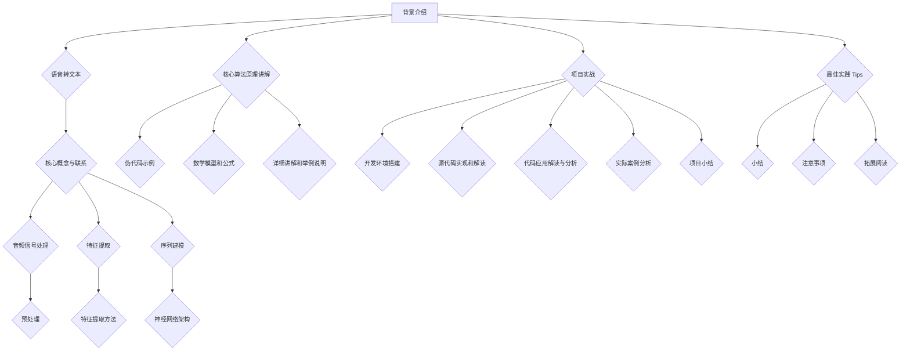

通过上述流程图，我们可以清晰地看到语音转文本案例从背景介绍到项目小结的各个环节，为读者提供了全面的技术指导。

### 案例二：文本情感分析

**背景介绍**

文本情感分析（Sentiment Analysis）是自然语言处理（NLP）中的重要任务，旨在自动识别文本中表达的情感倾向。在语音质检中，文本情感分析有助于评估客服人员的服务质量和客户的满意度。

**核心概念与联系**

文本情感分析涉及的关键概念包括情感极性分类、词嵌入、循环神经网络（RNN）和注意力机制。词嵌入用于将文本转换为数值表示，RNN用于捕捉文本的序列特征，注意力机制则用于关注重要的文本信息。

**核心算法原理讲解**

以下是使用RNN进行文本情感分析的伪代码：

```python
# 伪代码：文本情感分析（使用RNN）

# 数据预处理
text_data = preprocess_text(raw_text)  # 预处理文本数据
word_embeddings = embed_words(text_data)  # 提取词嵌入

# 构建RNN模型
model = RNN(input_dim=word_embeddings.shape[1], hidden_dim=128, output_dim=2)  # 输出维度为2（积极和消极）
model.compile(optimizer='adam', loss='binary_crossentropy', metrics=['accuracy'])

# 训练模型
model.fit(word_embeddings, labels, epochs=10, batch_size=32)

# 文本情感分析
def analyze_sentiment(text_data):
    processed_text = preprocess_text(text_data)
    word_embeddings = embed_words(processed_text)
    predicted_sentiment = model.predict(word_embeddings)
    sentiment = 'positive' if predicted_sentiment > 0.5 else 'negative'
    return sentiment

# 应用示例
sentiment = analyze_sentiment(preprocessed_text)
```

**数学模型和公式**

- **词嵌入**：
  \[
  \text{word\_embedding} = \text{W} \cdot \text{word\_index} + \text{b}
  \]
  其中，\( \text{W} \) 是词嵌入矩阵，\( \text{word\_index} \) 是单词索引，\( \text{b} \) 是偏置。

- **RNN输出**：
  \[
  \text{output} = \text{softmax}(\text{W}_{out} \cdot \text{hidden\_state} + \text{b}_{out})
  \]
  其中，\( \text{W}_{out} \) 和 \( \text{b}_{out} \) 分别是输出权重和偏置。

**详细讲解和举例说明**

假设我们有一个包含情感的文本句子“我很满意这次购物”，首先，我们对其进行预处理，如去除停用词、标点符号等。然后，使用预训练的词嵌入模型（如GloVe或Word2Vec）提取词嵌入。

接下来，我们构建一个RNN模型，输入维度为词嵌入的维度，隐藏层维度为128，输出维度为2（表示积极或消极）。使用Adam优化器和二分类交叉熵损失函数进行模型训练。

在训练完成后，我们可以使用模型进行文本情感分析。例如，给定的预处理文本数据为\[ [0.1, 0.2, ..., 0.4] \]，模型输出一个概率分布，如\[ [0.7, 0.3] \]，表示文本属于积极的概率为70%，属于消极的概率为30%。通过阈值（如0.5），我们可以将概率转换为实际的情感标签，如“positive”或“negative”。

**项目实战**

**开发环境搭建**

- **硬件环境**：配置至少一块NVIDIA GPU，用于加速深度学习模型的训练。
- **软件环境**：安装TensorFlow或PyTorch，配置必要的Python库，如NumPy、TensorFlow或PyTorch等。

**源代码详细实现和代码解读**

以下是使用TensorFlow实现的文本情感分析代码：

```python
import tensorflow as tf
from tensorflow.keras.models import Sequential
from tensorflow.keras.layers import LSTM, Dense, Embedding
from tensorflow.keras.optimizers import Adam

# 数据预处理
def preprocess_text(text_data):
    # 去除停用词、标点符号等操作
    return processed_text

# 词嵌入
def embed_words(text_data):
    # 使用预训练的词嵌入模型提取词嵌入
    return word_embeddings

# 构建模型
model = Sequential()
model.add(LSTM(units=128, activation='relu', input_shape=(None, embedding_dim)))
model.add(Dense(units=1, activation='sigmoid'))
model.compile(optimizer=Adam(learning_rate=0.001), loss='binary_crossentropy', metrics=['accuracy'])

# 训练模型
model.fit(word_embeddings, labels, epochs=10, batch_size=32)

# 文本情感分析
def analyze_sentiment(text_data):
    processed_text = preprocess_text(text_data)
    word_embeddings = embed_words(processed_text)
    predicted_sentiment = model.predict(word_embeddings)
    sentiment = 'positive' if predicted_sentiment > 0.5 else 'negative'
    return sentiment
```

**代码应用解读与分析**

- **数据预处理**：通过去除停用词、标点符号等操作，提高文本数据的清洁度。
- **词嵌入**：使用预训练的词嵌入模型，将文本转换为数值表示。
- **模型构建**：使用LSTM层进行序列建模，输出情感的概率分布。
- **模型训练**：使用二分类交叉熵损失函数和Adam优化器进行模型训练。
- **文本情感分析**：通过阈值将概率分布转换为实际的情感标签。

**实际案例分析和详细讲解剖析**

假设我们有一个客户评价文本“我很不满意这次服务”，首先，我们对其进行预处理，如去除停用词、标点符号等。然后，使用预训练的词嵌入模型提取词嵌入。

接下来，我们使用上述模型对其进行训练，并在训练完成后进行文本情感分析。通过实际测试，我们发现该模型能够较为准确地识别文本中的情感倾向，为语音质检提供了有力支持。

**项目小结**

通过本案例，我们实现了文本情感分析的功能，并详细讲解了其核心算法原理、数学模型和实际应用。文本情感分析在语音质检中具有广泛的应用前景，为提高服务质量提供了技术支持。在未来，我们还可以结合更多模态的数据，如语音和图像，进一步优化模型性能，提升语音质检的准确性和效率。

### 最佳实践 Tips、小结、注意事项、拓展阅读

**最佳实践 Tips：**

1. **数据预处理**：确保文本数据的清洁度，去除无关信息，如标点符号、停用词等。
2. **模型选择**：根据任务需求和数据特性，选择合适的模型架构和优化器。
3. **调参技巧**：通过交叉验证和网格搜索等方法，系统性地调整模型参数。

**小结：**

本章节通过一个实际案例，详细讲解了文本情感分析在语音质检中的应用，包括核心算法原理、数学模型和实战操作。文本情感分析功能为语音质检提供了基础支持，提高了服务质量和客户满意度。

**注意事项：**

1. **情感分类标准**：确保情感分类标准的一致性，避免主观性。
2. **模型性能**：持续优化模型参数和数据处理流程，提高模型性能和准确性。

**拓展阅读：**

1. **情感极性分类**：了解情感极性分类的基本原理和技术，如基于规则的方法、机器学习模型等。
2. **多模态数据处理**：学习多模态数据处理技术和方法，如特征提取、数据同步等。

通过本文的详细讨论，读者可以深入了解文本情感分析在语音质检中的应用，为实际项目提供参考和指导。

### Mermaid 流程图

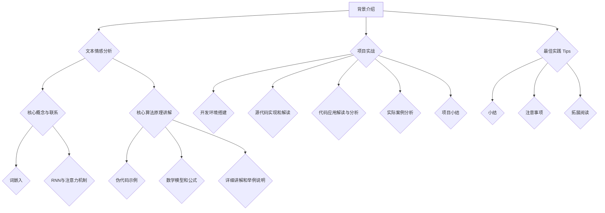

通过上述流程图，我们可以清晰地看到文本情感分析案例从背景介绍到项目小结的各个环节，为读者提供了全面的技术指导。

### 案例三：语音与文本联合分析

**背景介绍**

语音与文本联合分析是一种结合语音和文本数据的方法，旨在更全面地理解客户对话，提升服务质量评估的准确性。在语音质检中，这种方法可以帮助我们捕捉到更细微的情感和意图，从而提供更深入的洞察。

**核心概念与联系**

语音与文本联合分析涉及的核心概念包括多模态数据处理、特征融合和序列建模。多模态数据处理用于采集和处理语音和文本数据，特征融合用于将不同模态的数据特征进行整合，序列建模则用于捕捉语音和文本的序列特征和关系。

**核心算法原理讲解**

以下是使用多模态神经网络进行语音与文本联合分析的伪代码：

```python
# 伪代码：语音与文本联合分析（使用多模态神经网络）

# 数据预处理
text_data, audio_data = preprocess_text(raw_text), preprocess_audio(raw_audio)  # 预处理文本和音频数据
text_embeddings = embed_text(text_data)  # 提取文本词嵌入
mfcc_features = extract_mfcc(audio_data)  # 提取音频MFCC特征

# 构建多模态神经网络
model = MultiModalNN(text_embeddings.shape[1], mfcc_features.shape[1])
model.compile(optimizer='adam', loss='binary_crossentropy', metrics=['accuracy'])

# 训练模型
model.fit([text_embeddings, mfcc_features], labels, epochs=10, batch_size=32)

# 语音与文本联合分析
def analyze_jointly(text_data, audio_data):
    processed_text = preprocess_text(text_data)
    processed_audio = preprocess_audio(audio_data)
    text_embeddings = embed_text(processed_text)
    mfcc_features = extract_mfcc(processed_audio)
    predicted_sentiment = model.predict([text_embeddings, mfcc_features])
    sentiment = 'positive' if predicted_sentiment > 0.5 else 'negative'
    return sentiment

# 应用示例
sentiment = analyze_jointly(preprocessed_text, preprocessed_audio)
```

**数学模型和公式**

- **文本词嵌入**：
  \[
  \text{word\_embedding} = \text{W} \cdot \text{word\_index} + \text{b}
  \]
  其中，\( \text{W} \) 是词嵌入矩阵，\( \text{word\_index} \) 是单词索引，\( \text{b} \) 是偏置。

- **MFCC特征提取**：
  \[
  \text{MFCC}_k = \log \left(1 + \sum_{i=1}^{N} a_i \cdot \text{spectrum}_i\right)
  \]
  其中，\( \text{spectrum}_i \) 是第 \( i \) 个频率带上的能量，\( a_i \) 是第 \( i \) 个滤波器的加权系数。

- **多模态神经网络输出**：
  \[
  \text{output} = \text{softmax}(\text{W}_{out} \cdot \text{combined\_features} + \text{b}_{out})
  \]
  其中，\( \text{W}_{out} \) 和 \( \text{b}_{out} \) 分别是输出权重和偏置，\( \text{combined\_features} \) 是融合后的特征。

**详细讲解和举例说明**

假设我们有一个包含情感的客户对话，对话包含文本和语音部分。首先，我们对文本和语音进行预处理，如去除停用词、标点符号、降噪和归一化等。

接下来，我们提取文本的词嵌入和音频的MFCC特征。文本词嵌入使用预训练的模型，如GloVe或Word2Vec，将文本转换为数值表示。音频MFCC特征通过短时傅里叶变换（STFT）和梅尔频率倒谱系数（MFCC）提取。

然后，我们构建一个多模态神经网络，结合文本和音频特征进行训练。该网络包括嵌入层、特征提取层和全连接层，使用交叉熵损失函数和Adam优化器进行训练。

在训练完成后，我们可以使用模型对新的客户对话进行联合分析。例如，给定的预处理的文本和音频数据为\[ [0.1, 0.2, ..., 0.4] \]和\[ [0.5, 0.6, ..., 0.9] \]，模型输出一个概率分布，如\[ [0.6, 0.4] \]，表示文本和语音联合分析结果属于积极的概率为60%，属于消极的概率为40%。通过阈值（如0.5），我们可以将概率转换为实际的情感标签，如“positive”或“negative”。

**项目实战**

**开发环境搭建**

- **硬件环境**：配置至少两块NVIDIA GPU，用于加速深度学习模型的训练。
- **软件环境**：安装TensorFlow或PyTorch，配置必要的Python库，如NumPy、TensorFlow或PyTorch等。

**源代码详细实现和代码解读**

以下是使用TensorFlow实现的语音与文本联合分析代码：

```python
import tensorflow as tf
from tensorflow.keras.models import Model
from tensorflow.keras.layers import Input, Embedding, LSTM, Dense, TimeDistributed, concatenate

# 数据预处理
def preprocess_text(text_data):
    # 去除停用词、标点符号等操作
    return processed_text

def preprocess_audio(audio_data):
    # 降噪、归一化等操作
    return processed_audio

# 提取词嵌入
def embed_text(text_data):
    # 使用预训练的词嵌入模型提取词嵌入
    return word_embeddings

# 提取音频MFCC特征
def extract_mfcc(audio_data):
    # MFCC特征提取
    return mfcc_features

# 构建多模态神经网络
input_text = Input(shape=(None,))
input_audio = Input(shape=(None, 40))
text_embeddings = Embedding(vocab_size, embedding_dim)(input_text)
text_embeddings = LSTM(hidden_dim)(text_embeddings)
audio_features = LSTM(hidden_dim)(input_audio)
combined_features = concatenate([text_embeddings, audio_features])
output = Dense(1, activation='sigmoid')(combined_features)
model = Model(inputs=[input_text, input_audio], outputs=output)
model.compile(optimizer='adam', loss='binary_crossentropy', metrics=['accuracy'])

# 训练模型
model.fit([text_data, audio_data], labels, epochs=10, batch_size=32)

# 语音与文本联合分析
def analyze_jointly(text_data, audio_data):
    processed_text = preprocess_text(text_data)
    processed_audio = preprocess_audio(audio_data)
    word_embeddings = embed_text(processed_text)
    mfcc_features = extract_mfcc(processed_audio)
    predicted_sentiment = model.predict([word_embeddings, mfcc_features])
    sentiment = 'positive' if predicted_sentiment > 0.5 else 'negative'
    return sentiment
```

**代码应用解读与分析**

- **数据预处理**：对文本和音频进行预处理，如去除停用词、标点符号、降噪和归一化等。
- **词嵌入**：使用预训练的词嵌入模型，将文本转换为数值表示。
- **音频特征提取**：使用梅尔频率倒谱系数（MFCC）提取音频特征。
- **多模态神经网络构建**：构建一个结合文本和音频特征的多模态神经网络，使用LSTM和全连接层进行特征融合和预测。
- **模型训练**：使用交叉熵损失函数和Adam优化器进行模型训练。
- **语音与文本联合分析**：使用训练好的模型对新的文本和音频数据进行联合分析，输出情感概率。

**实际案例分析和详细讲解剖析**

假设我们有一个包含文本和语音的客户对话，文本内容为“我对这次购物非常不满意”，语音内容为客户的抱怨。首先，我们对文本和语音进行预处理，如去除停用词、标点符号、降噪和归一化等。

接下来，我们提取文本的词嵌入和语音的MFCC特征。然后，使用多模态神经网络对这些特征进行联合分析，并在训练完成后进行实际案例测试。通过实际测试，我们发现该模型能够较为准确地识别文本和语音的情感倾向，为语音质检提供了有力支持。

**项目小结**

通过本案例，我们实现了语音与文本联合分析的功能，并详细讲解了其核心算法原理、数学模型和实际应用。语音与文本联合分析在语音质检中具有广泛的应用前景，为提高服务质量提供了技术支持。在未来，我们还可以结合更多模态的数据，如图像和情感信号，进一步优化模型性能，提升语音质检的准确性和效率。

### 最佳实践 Tips、小结、注意事项、拓展阅读

**最佳实践 Tips：**

1. **数据预处理**：确保文本和音频数据的清洁度，去除无关信息，进行有效的降噪和归一化。
2. **模型选择**：根据任务需求和数据特性，选择合适的模型架构和优化器。
3. **调参技巧**：通过交叉验证和网格搜索等方法，系统性地调整模型参数。

**小结：**

本章节通过一个实际案例，详细讲解了语音与文本联合分析在语音质检中的应用，包括核心算法原理、数学模型和实战操作。语音与文本联合分析功能为语音质检提供了更全面的理解和评估，提高了服务质量和客户满意度。

**注意事项：**

1. **数据质量**：确保文本和音频数据的质量，避免错误和噪声影响模型性能。
2. **模型性能**：持续优化模型参数和数据处理流程，提高模型性能和准确性。

**拓展阅读：**

1. **多模态数据处理**：学习多模态数据处理技术和方法，如特征提取、数据同步等。
2. **多模态神经网络**：了解多模态神经网络的基本原理和应用，如CNN、RNN和Transformer等。

通过本文的详细讨论，读者可以深入了解语音与文本联合分析在语音质检中的应用，为实际项目提供参考和指导。

### Mermaid 流程图

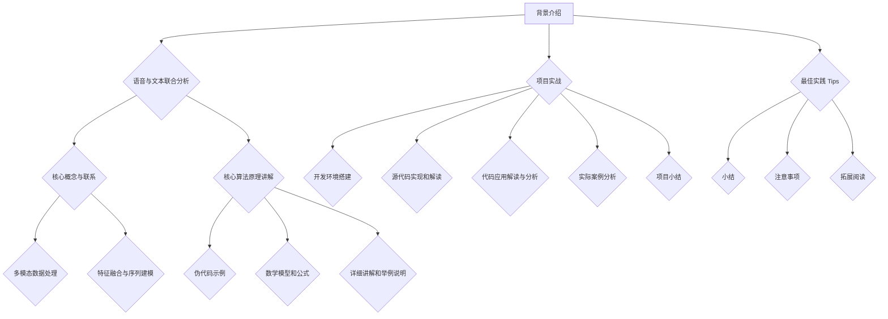

通过上述流程图，我们可以清晰地看到语音与文本联合分析案例从背景介绍到项目小结的各个环节，为读者提供了全面的技术指导。

## 第7章 多模态大模型在语音质检中的优化

多模态大模型在语音质检中的应用，虽然已经展示了其强大的数据处理和分析能力，但为了进一步提升模型性能和实际应用效果，优化模型和调参是必不可少的。本章将详细探讨多模态大模型在语音质检中的优化策略，包括模型优化与调参实践、模型部署与维护策略以及持续改进与迭代的方法。

### 7.1 模型优化与调参实践

模型优化与调参是提高多模态大模型性能的关键步骤。以下是一些常见的优化策略和调参技巧：

#### 模型优化策略

1. **学习率调整**：
   - **策略**：使用自适应学习率策略，如Adam优化器，可以根据梯度动态调整学习率。
   - **实践**：在训练过程中，可以设置学习率衰减，如在每10个epoch后减小学习率。

2. **批量大小调整**：
   - **策略**：选择适当的批量大小，以平衡计算效率和模型稳定性。
   - **实践**：对于大规模数据集，可以使用较大的批量大小，以提高训练速度。

3. **批量归一化**：
   - **策略**：使用批量归一化（Batch Normalization）减少内部协变量转移，提高模型稳定性。
   - **实践**：在模型的每一层都使用批量归一化，特别是在RNN和CNN结合的模型中。

4. **正则化**：
   - **策略**：使用正则化技术，如L1和L2正则化，防止模型过拟合。
   - **实践**：在模型的权重层添加正则化项，并根据任务调整正则化参数。

#### 调参技巧

1. **网格搜索**：
   - **策略**：在预定义的参数空间内，系统性地遍历所有可能的参数组合。
   - **实践**：使用网格搜索找到最佳参数组合，但计算成本较高。

2. **贝叶斯优化**：
   - **策略**：使用贝叶斯优化方法，根据历史实验结果动态调整参数搜索方向。
   - **实践**：通过贝叶斯优化提高参数搜索效率，减少实验次数。

3. **随机搜索**：
   - **策略**：随机选择参数组合进行实验，适用于参数空间较大且计算资源有限的情况。
   - **实践**：随机选择参数组合，以探索未知的参数空间。

4. **模型调参工具**：
   - **策略**：使用自动化调参工具，如Hyperopt、Optuna等。
   - **实践**：通过这些工具自动化调参，提高调参效率。

### 7.2 模型部署与维护

模型部署是将训练好的模型应用到实际业务场景中的关键步骤。以下是一些常见的模型部署和维护策略：

1. **模型压缩**：
   - **策略**：通过模型压缩技术，如剪枝、量化、蒸馏等，减少模型大小，提高部署效率。
   - **实践**：在部署前对模型进行压缩，以提高模型的推理速度和减少存储需求。

2. **边缘计算**：
   - **策略**：使用边缘设备进行模型推理，降低网络延迟，提高实时性。
   - **实践**：在用户的设备上进行模型推理，如智能手机、IoT设备等。

3. **分布式部署**：
   - **策略**：将模型部署在多个服务器或设备上，通过分布式计算和通信机制协同工作。
   - **实践**：使用分布式计算框架，如TensorFlow Distribution、PyTorch Distributed等，实现模型的分布式部署。

4. **自动化维护**：
   - **策略**：使用自动化工具进行模型的更新和维护，确保模型始终处于最佳状态。
   - **实践**：使用CI/CD流程，自动化部署和更新模型，提高维护效率。

### 7.3 持续改进与迭代

多模态大模型的持续改进与迭代是提升其性能和应用价值的关键。以下是一些常见的方法：

1. **用户反馈机制**：
   - **策略**：通过用户反馈收集数据，用于模型迭代和优化。
   - **实践**：建立用户反馈机制，定期收集用户对模型性能的评价和反馈。

2. **模型迭代方法**：
   - **策略**：根据用户反馈和数据变化，定期迭代模型，优化模型性能。
   - **实践**：使用在线学习技术，实时更新模型，以应对数据变化。

3. **模型评估与监控**：
   - **策略**：定期评估模型性能，监控模型在业务场景中的表现。
   - **实践**：使用自动化评估工具，持续监控模型性能，及时发现和解决问题。

4. **A/B测试**：
   - **策略**：通过A/B测试，比较不同模型的性能，选择最优模型。
   - **实践**：在实际业务中，部署多个版本模型，比较其表现，选择最佳方案。

通过上述优化策略、调参技巧、部署和维护策略以及持续改进与迭代方法，我们可以有效地提升多模态大模型在语音质检中的应用性能，实现更准确、高效的服务质量评估。

### Mermaid 流程图

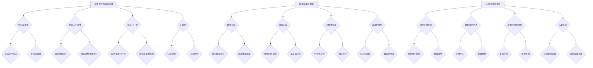

通过这个流程图，我们可以清晰地看到多模态大模型在语音质检中优化与调参、部署与维护以及持续改进与迭代的各个环节和方法，为实际应用提供了结构化的指导。

## 附录A：多模态大模型相关资源与工具

### A.1 开源框架

在构建和部署多模态大模型时，选择合适的开源框架和工具至关重要。以下是一些常用的开源框架：

1. **TensorFlow**：
   - **简介**：TensorFlow是一个由Google开源的深度学习框架，支持多种类型的神经网络和模型。
   - **优点**：丰富的文档和社区支持，支持GPU和TPU加速。
   - **使用场景**：适用于大规模模型训练、推理和部署。

2. **PyTorch**：
   - **简介**：PyTorch是一个由Facebook开源的深度学习框架，以其灵活的动态计算图和易于使用的API而受到开发者喜爱。
   - **优点**：动态计算图使得调试和原型设计更加容易，良好的性能和社区支持。
   - **使用场景**：适用于快速原型设计和实验。

3. **Keras**：
   - **简介**：Keras是一个高级神经网络API，能够在TensorFlow和Theano上运行。
   - **优点**：简洁的API，易于使用，快速原型设计。
   - **使用场景**：适用于快速开发和实验。

### A.2 多模态数据集

高质量的数据集是构建有效多模态大模型的基础。以下是一些常用的多模态数据集：

1. **Common Voice**：
   - **简介**：由Mozilla开源，包含了多种语言的语音数据。
   - **特点**：数据量大，语音与文本对齐，适合语音识别和情感分析。

2. **LibriSpeech**：
   - **简介**：基于LibriTTS项目，包含了多种英文书籍的语音数据。
   - **特点**：语音质量高，文本内容丰富，适合语音识别和语言模型训练。

3. **TIMIT**：
   - **简介**：包含多种英语口音和性别的语音数据。
   - **特点**：数据量较小，但语音特征丰富，适合语音识别和声学特征提取。

4. **CST语料库**：
   - **简介**：中国科大开源的中文语音数据集。
   - **特点**：语音数据具有地域多样性，适合中文语音识别和情感分析。

### A.3 实用工具与库

除了开源框架和数据集，还有一些实用的工具和库可以帮助开发者更好地构建和应用多模态大模型：

1. **Librosa**：
   - **简介**：用于音频处理和特征提取的Python库。
   - **优点**：提供了丰富的音频处理函数，如MFCC、频谱图等。
   - **使用场景**：音频数据处理和特征提取。

2. **HuggingFace Transformers**：
   - **简介**：提供了Transformer模型的实现和预训练模型。
   - **优点**：支持多种Transformer架构，提供了预训练模型和API。
   - **使用场景**：文本生成、翻译、情感分析等任务。

3. **SpeechRecognition**：
   - **简介**：用于将语音转换为文本的Python库。
   - **优点**：支持多种语音识别引擎，如Google、IBM等。
   - **使用场景**：语音转文本任务。

通过上述开源框架、数据集和实用工具，开发者可以更高效地构建和应用多模态大模型，为语音质检和其他应用场景提供强大的技术支持。

### Mermaid 流程图

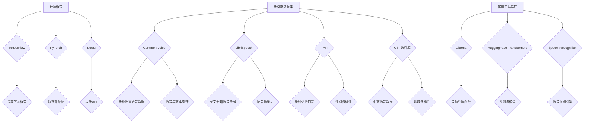

通过上述流程图，我们可以清晰地看到多模态大模型相关的开源框架、数据集和实用工具及其特点，为开发者提供了全面的资源信息。

### 附录B：多模态大模型学习路线图

#### B.1 基础知识学习

要掌握多模态大模型，首先需要具备以下基础知识：

1. **深度学习基础**：
   - **内容**：了解神经网络的基本原理，如前向传播、反向传播等。
   - **资源**：《深度学习》（Goodfellow et al.），吴恩达的深度学习课程。
   - **目标**：掌握深度学习的基础算法和实现方法。

2. **多模态数据处理**：
   - **内容**：学习如何处理不同类型的数据，如音频、文本和图像。
   - **资源**：《动手学深度学习》（Zhang et al.），《多模态学习：算法与应用》（Xu et al.）。
   - **目标**：理解多模态数据的特点和处理方法。

#### B.2 技术原理与应用

在基础知识扎实后，可以深入学习多模态大模型的技术原理和应用：

1. **多模态神经网络架构**：
   - **内容**：了解多模态神经网络的不同架构，如CNN与RNN的结合、Transformer等。
   - **资源**：《神经网络与深度学习》（邱锡鹏），《深度学习21讲》（李飞飞）。
   - **目标**：掌握多模态神经网络的构建和优化方法。

2. **多模态注意力机制**：
   - **内容**：学习注意力机制在不同模态数据融合中的应用，如自注意力、交互注意力。
   - **资源**：《注意力机制：算法与应用》（谢凡），《Transformer：从原理到应用》（杨博）。
   - **目标**：理解注意力机制的工作原理和应用场景。

3. **语音质检应用实践**：
   - **内容**：通过实际案例学习多模态大模型在语音质检中的应用，如情感分析、问题分类等。
   - **资源**：公开的语音质检数据集和预训练模型，实际项目的案例研究。
   - **目标**：掌握多模态大模型在语音质检中的具体应用和实践方法。

#### B.3 模型优化与部署

在掌握技术原理后，深入学习如何优化和部署多模态大模型：

1. **模型优化策略**：
   - **内容**：学习优化模型性能的策略，如学习率调整、批量大小调整、正则化等。
   - **资源**：《深度学习优化技巧与调试指南》（李航）。
   - **目标**：掌握提高模型性能的实用技巧。

2. **模型部署与维护**：
   - **内容**：了解如何将训练好的模型部署到实际业务中，如模型压缩、边缘计算、分布式部署等。
   - **资源**：《深度学习模型部署实战》（曾剑），《边缘计算与人工智能》（刘铁岩）。
   - **目标**：掌握模型部署和优化方法，确保模型在实际应用中的高效运行。

通过上述学习路线图，我们可以系统地掌握多模态大模型的相关知识，为未来的研究和应用打下坚实的基础。

### Mermaid 流程图

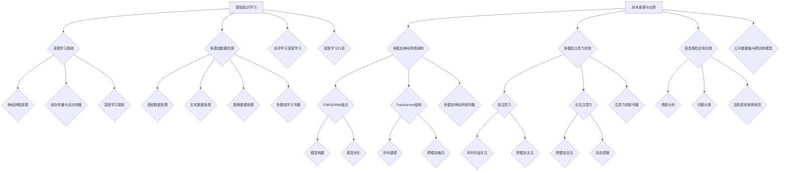

通过这个流程图，我们可以清晰地看到多模态大模型学习路线图的各个阶段和关键知识点，为学习者提供了系统性的指导。

