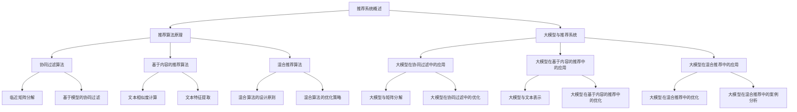

                 

### 大模型在商业应用中的潜力：推荐系统的进步

在当今数字化时代，推荐系统已成为众多商业应用中不可或缺的一部分，从电商平台到社交媒体，从新闻网站到流媒体服务，推荐系统都在显著提升用户体验、增加用户黏性和推动业务增长。然而，随着用户数据量的爆发式增长和推荐任务复杂性的提升，传统的推荐系统面临着诸多挑战，如数据稀疏性、冷启动问题、推荐效果不稳定等。

大模型，特别是预训练语言模型（如BERT、GPT），为解决这些挑战提供了新的思路和强大工具。大模型具有以下特点：

1. **强大的特征提取能力**：大模型能够从大量数据中自动提取抽象特征，减少人工特征工程的工作量。
2. **高层次的语义理解**：大模型能够捕捉文本数据的深层次语义信息，为推荐提供更为精准的依据。
3. **自适应学习能力**：大模型通过自监督学习和迁移学习，能够快速适应不同领域的推荐任务。

本文将围绕大模型在推荐系统中的应用展开讨论，具体包括大模型在协同过滤、基于内容推荐和混合推荐中的应用，以及大模型在商业应用中的潜力、挑战和最佳实践。通过逻辑清晰、结构紧凑的分析，我们希望能够为读者提供一份全面而深入的技术博客文章。

### 文章关键词

- 推荐系统
- 大模型
- 预训练语言模型
- 协同过滤
- 基于内容推荐
- 混合推荐
- 商业应用
- 推荐算法优化

### 文章摘要

本文旨在探讨大模型在商业应用中的潜力，特别是其在推荐系统中的应用。通过分析推荐系统的基础知识，深入探讨大模型与推荐系统的融合方法及其优势，本文展示了大模型在协同过滤、基于内容推荐和混合推荐中的应用案例。同时，本文还讨论了大模型在商业应用中的挑战与机遇，并提出了最佳实践策略。通过逻辑清晰、结构紧凑的分析，本文为读者提供了全面的技术见解和实用建议。

### 推荐系统概述

推荐系统是一种信息过滤技术，旨在为用户推荐其可能感兴趣的内容或商品。这种系统能够根据用户的历史行为、偏好和上下文信息，为用户生成个性化的推荐列表。推荐系统广泛应用于电子商务、社交媒体、新闻网站、流媒体服务等众多领域，已成为现代信息社会中不可或缺的一部分。

#### 推荐系统的发展历程

推荐系统的发展可以分为几个阶段：

1. **基于内容的推荐**：最早期的推荐系统主要基于物品的属性和用户的历史偏好进行推荐。这种方法简单直观，但存在内容多样性和用户个性化不足的问题。

2. **协同过滤推荐**：协同过滤是一种基于用户相似度的推荐方法，通过计算用户之间的相似度来推荐相似用户喜欢的物品。协同过滤可分为基于用户的协同过滤和基于物品的协同过滤。然而，协同过滤面临数据稀疏性和冷启动问题。

3. **混合推荐**：为了克服单一方法的局限性，研究者提出了混合推荐方法，通过结合基于内容和协同过滤的方法，提供更准确的推荐结果。

4. **基于模型的推荐**：随着深度学习的兴起，基于模型的推荐方法得到了广泛应用。这些方法利用深度神经网络提取用户和物品的复杂特征，提供更为精准的推荐。

#### 推荐系统的重要性

推荐系统在商业应用中的重要性体现在以下几个方面：

1. **提升用户体验**：个性化推荐能够满足用户的个性化需求，提高用户满意度。

2. **增加用户黏性**：推荐系统能够吸引和留住用户，提高用户的活跃度和参与度。

3. **推动业务增长**：推荐系统能够提高用户的购买转化率和销售额，为商家带来直接的商业收益。

4. **优化运营效率**：推荐系统可以帮助商家更精准地投放广告和进行营销活动，降低运营成本。

#### 推荐系统的核心组件

一个典型的推荐系统包括以下核心组件：

1. **用户数据收集**：收集用户的历史行为数据，如浏览记录、购买记录、搜索记录等。

2. **物品数据收集**：收集物品的特征数据，如文本描述、分类标签、价格、评分等。

3. **推荐算法**：选择适合的推荐算法，如基于内容的推荐、协同过滤推荐、混合推荐等。

4. **推荐结果生成**：根据用户数据和物品数据，生成个性化的推荐列表。

5. **推荐结果评估**：评估推荐效果，如准确率、召回率、F1值等。

#### 推荐系统的分类

推荐系统可以根据不同的分类标准进行分类：

1. **基于内容的推荐**：根据物品的内容特征和用户的历史偏好进行推荐。

2. **协同过滤推荐**：根据用户之间的相似度推荐用户可能感兴趣的物品。

3. **混合推荐**：结合多种推荐方法，提供更准确的推荐结果。

4. **基于模型的推荐**：利用深度学习等技术提取用户和物品的复杂特征，进行推荐。

通过上述分析，我们可以看到推荐系统在商业应用中的重要作用，以及其发展历程和核心组件。下一节将深入探讨推荐算法的原理，进一步理解推荐系统的运作机制。

### 推荐算法原理

推荐算法是推荐系统的核心组成部分，其目的是根据用户的历史行为和物品的特征，为用户生成个性化的推荐列表。推荐算法可以分为基于内容的推荐、协同过滤推荐和混合推荐等类型，每种算法都有其独特的原理和应用场景。

#### 协同过滤算法

协同过滤（Collaborative Filtering）是一种基于用户相似度的推荐算法，其基本思想是找到与目标用户相似的其他用户，然后推荐这些相似用户喜欢的物品。协同过滤算法主要分为基于用户的协同过滤和基于物品的协同过滤。

**基于用户的协同过滤（User-Based Collaborative Filtering）**

基于用户的协同过滤算法通过计算用户之间的相似度，找到与目标用户相似的用户群体，然后推荐这些用户共同喜欢的物品。相似度的计算通常基于用户对物品的评分矩阵，常用的相似度度量方法包括余弦相似度、皮尔逊相关系数等。

**伪代码：**

```python
def user_based_cf(train_data, user, k):
    similarity_scores = {}
    for other_user in train_data:
        if other_user != user:
            similarity = cosine_similarity(train_data[user], train_data[other_user])
            similarity_scores[other_user] = similarity

    similar_users = sorted(similarity_scores, key=similarity_scores.get, reverse=True)[:k]
    predictions = {}
    for other_user in similar_users:
        for item in train_data[other_user]:
            if item not in train_data[user]:
                rating = train_data[user][item] + similarity_scores[other_user] * (train_data[other_user][item] - train_data[user][item])
                predictions[item] = rating

    return predictions
```

**数学模型和数学公式**

协同过滤算法中的相似度计算可以使用余弦相似度，其公式如下：

$$
\text{cosine\_similarity}(A, B) = \frac{A \cdot B}{\lVert A \rVert \cdot \lVert B \rVert}
$$

其中，$A$ 和 $B$ 是两个向量，$\lVert A \rVert$ 和 $\lVert B \rVert$ 分别表示向量的模长。

**项目实战**

**环境搭建：** 安装PyTorch库，导入所需库。

```python
import torch
import torch.nn as nn
import torch.optim as optim
from torch.utils.data import DataLoader, Dataset
```

**源代码实现：**

```python
class CollaborativeFiltering(nn.Module):
    def __init__(self, num_users, num_items, latent_factors):
        super(CollaborativeFiltering, self).__init__()
        self.user_embeddings = nn.Embedding(num_users, latent_factors)
        self.item_embeddings = nn.Embeding(num_items, latent_factors)
        self.linear = nn.Linear(latent_factors, 1)

    def forward(self, user_ids, item_ids):
        user_embedding = self.user_embeddings(user_ids)
        item_embedding = self.item_embeddings(item_ids)
        prediction = self.linear(torch.sum(user_embedding * item_embedding, dim=1))
        return prediction

def train_model(model, train_loader, loss_fn, optimizer, num_epochs):
    model.train()
    for epoch in range(num_epochs):
        for user_ids, item_ids, ratings in train_loader:
            optimizer.zero_grad()
            predictions = model(user_ids, item_ids)
            loss = loss_fn(predictions, ratings)
            loss.backward()
            optimizer.step()
        print(f'Epoch [{epoch+1}/{num_epochs}], Loss: {loss.item()}')

def main():
    # 数据预处理
    train_data = preprocess_data('train.csv')

    # 初始化模型参数
    num_users = len(train_data['users'])
    num_items = len(train_data['items'])
    latent_factors = 100

    # 创建模型、损失函数和优化器
    model = CollaborativeFiltering(num_users, num_items, latent_factors)
    loss_fn = nn.MSELoss()
    optimizer = optim.Adam(model.parameters(), lr=0.001)

    # 训练模型
    train_loader = DataLoader(train_data, batch_size=64, shuffle=True)
    train_model(model, train_loader, loss_fn, optimizer, num_epochs=10)

if __name__ == '__main__':
    main()
```

**代码解读与分析：**

- **模型定义：** 使用PyTorch的`nn.Module`类定义一个协同过滤模型，包含用户嵌入层、物品嵌入层和一个线性层。
- **前向传播：** 计算用户嵌入和物品嵌入的点积，并通过线性层得到预测评分。
- **训练过程：** 使用MSE损失函数和Adam优化器进行模型训练。
- **数据预处理：** 从CSV文件中读取训练数据，并进行预处理，包括用户ID、物品ID和评分。

通过上述代码，我们实现了基于协同过滤的推荐算法，并使用PyTorch进行了训练。这为推荐系统的优化提供了有力支持。

**案例分析：**

**案例背景：** 某电商网站需要为其用户提供商品推荐服务，用户的历史行为数据包括购买记录和浏览记录。

**实现步骤：**

1. **数据预处理：** 将用户和商品的信息转换为数字表示，例如使用独热编码。
2. **训练数据集划分：** 将数据集划分为训练集和测试集。
3. **模型训练：** 使用训练数据训练协同过滤模型，调整模型参数以优化推荐效果。
4. **模型评估：** 使用测试集评估模型性能，调整模型参数以获得最佳效果。
5. **推荐生成：** 使用训练好的模型为用户生成个性化推荐列表。

通过上述案例，我们可以看到基于协同过滤的推荐算法在实际应用中的实现过程和效果。

#### 基于内容的推荐算法

基于内容的推荐（Content-Based Recommender System）是一种利用物品的特征信息为用户推荐相似物品的推荐方法。这种方法的核心思想是根据用户过去的偏好来推断用户的兴趣，然后推荐与用户兴趣相匹配的物品。

**文本相似度计算**

基于内容的推荐算法通常涉及文本相似度计算，以确定用户历史偏好中的物品与待推荐物品之间的相似度。文本相似度计算方法包括余弦相似度和TF-IDF模型。

**余弦相似度**

余弦相似度是一种常用的文本相似度计算方法，其公式如下：

$$
\text{cosine\_similarity}(A, B) = \frac{A \cdot B}{\lVert A \rVert \cdot \lVert B \rVert}
$$

其中，$A$ 和 $B$ 是两个向量，$\lVert A \rVert$ 和 $\lVert B \rVert$ 分别表示向量的模长。

**TF-IDF模型**

TF-IDF（Term Frequency-Inverse Document Frequency）是一种常用的文本特征提取方法，其公式如下：

$$
\text{interest\_score}(f) = \text{TF}(f) \times \text{IDF}(f)
$$

其中，$\text{TF}(f)$ 是词 $f$ 在文档中的词频，$\text{IDF}(f)$ 是词 $f$ 在文档集中的逆文档频率。

**项目实战**

**环境搭建：** 安装NLP相关库，如`nltk`和`gensim`。

```python
import nltk
import gensim
from gensim.models import Word2Vec
```

**源代码实现：**

```python
def text_similarity(doc1, doc2):
    model = Word2Vec([doc1, doc2])
    vector1 = model.wv[doc1]
    vector2 = model.wv[doc2]
    similarity = model.wv.similarity(doc1, doc2)
    return similarity

def content_based_recommender(train_data, user, k):
    user_items = train_data[user]
    user_interest = {}
    for item in user_items:
        interest = 0
        for other_item in train_data:
            if other_item != item:
                similarity = text_similarity(item, other_item)
                interest += similarity
        user_interest[item] = interest

    similar_items = sorted(user_interest, key=user_interest.get, reverse=True)[:k]
    return similar_items
```

**代码解读与分析：**

- **文本相似度计算：** 使用Word2Vec模型计算文本的相似度。
- **推荐生成：** 根据用户历史偏好计算与其他物品的相似度，生成推荐列表。

通过上述代码，我们实现了基于内容的推荐算法，并使用文本相似度计算进行了推荐。

**案例分析：**

**案例背景：** 某新闻网站需要为用户推荐感兴趣的新闻文章。

**实现步骤：**

1. **数据预处理：** 对新闻文章进行文本预处理，提取关键词。
2. **文本相似度计算：** 计算用户历史阅读的文章与其他文章的相似度。
3. **推荐生成：** 根据相似度为用户生成推荐新闻列表。

通过上述案例，我们可以看到基于内容的推荐算法在实际应用中的实现过程和效果。

#### 混合推荐算法

混合推荐（Hybrid Recommender System）是一种结合多种推荐方法优点的推荐系统。混合推荐算法通过融合协同过滤、基于内容推荐等方法，提供更准确、更个性化的推荐结果。

**混合算法的设计原则**

混合推荐算法的设计原则包括：

1. **多样性**：推荐结果应包含多种类型的物品，提高用户的满意度。
2. **准确性**：推荐结果应具有较高的准确率，满足用户的需求。
3. **鲁棒性**：混合推荐算法应能够应对数据稀疏性和异常值的影响。
4. **可扩展性**：混合推荐算法应能够适应不同规模和类型的数据。

**混合算法的优化策略**

混合推荐算法的优化策略包括：

1. **加权融合**：根据不同推荐方法的性能和重要性，对推荐结果进行加权融合。
2. **自适应调整**：根据用户行为和反馈，动态调整推荐策略，提高推荐效果。
3. **特征融合**：结合多种特征（如用户行为、物品属性、文本特征等），提供更丰富的特征表示。

**案例分析：**

**案例背景：** 某在线教育平台需要为用户提供个性化课程推荐服务。

**实现步骤：**

1. **数据预处理：** 收集用户行为数据和课程特征数据。
2. **协同过滤推荐：** 使用用户行为数据为用户生成个性化推荐列表。
3. **基于内容推荐：** 使用课程特征和用户兴趣计算文本相似度，生成推荐列表。
4. **混合推荐：** 将协同过滤和基于内容推荐的结果进行融合，生成最终推荐列表。
5. **推荐评估：** 使用用户反馈和业务指标评估推荐效果。

通过上述案例，我们可以看到混合推荐算法在实际应用中的实现过程和效果。

### 大模型与推荐系统

大模型，尤其是预训练语言模型，如BERT、GPT，已经在自然语言处理、文本生成等领域取得了显著的成果。近年来，大模型在推荐系统中的应用也逐渐受到关注。大模型在推荐系统中的应用优势主要体现在以下几个方面：

1. **强大的特征提取能力**：大模型可以从大量数据中自动提取高层次的语义特征，减少人工特征工程的工作量。
2. **高层次的语义理解**：大模型能够捕捉文本数据的深层次语义信息，提供更精准的推荐依据。
3. **自适应学习能力**：大模型通过自监督学习和迁移学习，能够快速适应不同领域的推荐任务。

#### 大模型在协同过滤中的应用

大模型在协同过滤中的应用主要体现在利用其强大的特征提取能力，对用户和物品进行特征表示。具体方法如下：

1. **用户和物品嵌入**：使用预训练语言模型对用户和物品的描述文本进行编码，生成高维的语义向量。
2. **相似度计算**：使用大模型生成的用户和物品的语义向量计算相似度，生成推荐列表。
3. **优化策略**：结合传统协同过滤算法的优化策略，如矩阵分解、梯度下降等，优化推荐效果。

**案例分析：**

**案例背景：** 某电商平台需要为用户提供个性化商品推荐服务。

**实现步骤：**

1. **数据预处理：** 对用户和商品的信息进行文本预处理，提取关键词和描述。
2. **模型训练：** 使用预训练语言模型（如BERT）对用户和商品的描述文本进行编码，生成语义向量。
3. **相似度计算**：使用BERT生成的用户和商品语义向量计算相似度，生成推荐列表。
4. **推荐融合**：将大模型生成的推荐结果与传统协同过滤算法的结果进行融合，生成最终推荐列表。
5. **推荐评估**：使用用户反馈和业务指标评估推荐效果。

通过上述案例，我们可以看到大模型在协同过滤中的应用效果和实现过程。

#### 大模型在基于内容的推荐中的应用

大模型在基于内容的推荐中的应用主要体现在利用其强大的文本表示能力，对用户和物品进行特征表示。具体方法如下：

1. **文本表示**：使用预训练语言模型对用户和物品的描述文本进行编码，生成高维的语义向量。
2. **兴趣度计算**：使用大模型生成的用户和物品的语义向量计算兴趣度，生成推荐列表。
3. **优化策略**：结合传统基于内容推荐算法的优化策略，如TF-IDF、文本相似度等，优化推荐效果。

**案例分析：**

**案例背景：** 某新闻网站需要为用户提供个性化新闻推荐服务。

**实现步骤：**

1. **数据预处理：** 对新闻文章进行文本预处理，提取关键词和描述。
2. **模型训练：** 使用预训练语言模型（如BERT）对新闻文章的描述文本进行编码，生成语义向量。
3. **兴趣度计算**：使用BERT生成的用户和新闻文章的语义向量计算兴趣度，生成推荐列表。
4. **推荐融合**：将大模型生成的推荐结果与传统基于内容推荐算法的结果进行融合，生成最终推荐列表。
5. **推荐评估**：使用用户反馈和业务指标评估推荐效果。

通过上述案例，我们可以看到大模型在基于内容的推荐中的应用效果和实现过程。

#### 大模型在混合推荐中的应用

大模型在混合推荐中的应用主要体现在利用其强大的特征提取和语义理解能力，实现多种推荐方法的融合。具体方法如下：

1. **用户和物品嵌入**：使用预训练语言模型对用户和物品进行编码，生成高维的语义向量。
2. **推荐融合**：结合协同过滤、基于内容推荐等方法，使用大模型生成的特征向量进行融合，生成推荐列表。
3. **优化策略**：通过自适应调整和模型融合，优化推荐效果。

**案例分析：**

**案例背景：** 某在线教育平台需要为用户提供个性化课程推荐服务。

**实现步骤：**

1. **数据预处理：** 收集用户行为数据和课程特征数据。
2. **模型训练：** 使用预训练语言模型（如BERT）对用户和课程的信息进行编码，生成语义向量。
3. **推荐融合**：结合协同过滤、基于内容推荐等方法，使用BERT生成的特征向量进行融合，生成推荐列表。
4. **推荐评估**：使用用户反馈和业务指标评估推荐效果。

通过上述案例，我们可以看到大模型在混合推荐中的应用效果和实现过程。

### 大模型在商业应用中的潜力

大模型在商业应用中的潜力不可低估，特别是在推荐系统中。以下从用户体验、商业收益和行业创新三个方面探讨大模型在商业应用中的潜力。

#### 用户体验

1. **个性化推荐**：大模型能够从海量数据中提取深层次的用户特征，实现高度个性化的推荐，从而提高用户的满意度和参与度。
2. **实时推荐**：大模型的自适应学习能力使其能够实时响应用户行为的变化，提供精准、实时的推荐，增强用户的体验。
3. **多样化内容**：大模型能够融合多种模态的数据（如图像、文本、音频等），为用户提供多样化的推荐内容，满足用户多样化的需求。

#### 商业收益

1. **提高销售额**：通过个性化推荐，大模型能够提高用户的购买转化率，从而显著提高销售额。
2. **降低营销成本**：大模型能够通过精准推荐，将营销资源集中在高价值用户和商品上，降低营销成本，提高营销ROI。
3. **优化库存管理**：大模型可以根据用户行为预测未来的销售趋势，帮助商家优化库存管理，减少库存成本。

#### 行业创新

1. **智能客服**：大模型可以用于构建智能客服系统，通过自然语言处理技术，实现与用户的自然对话，提高客服效率和用户体验。
2. **个性化广告**：大模型可以根据用户兴趣和行为，为用户生成个性化的广告，提高广告点击率和转化率。
3. **智能决策支持**：大模型可以用于分析市场数据，为企业的决策提供智能支持，帮助企业在竞争激烈的市场中保持领先地位。

通过上述分析，我们可以看到大模型在商业应用中的巨大潜力。随着大模型技术的不断发展和成熟，其在推荐系统中的应用将越来越广泛，为商业应用带来更多机遇和可能。

### 大模型在商业应用中的挑战与机遇

尽管大模型在商业应用中展示了巨大的潜力，但其实际应用过程中也面临着一系列挑战和机遇。

#### 挑战

1. **数据隐私**：大模型对大量用户数据的依赖性较大，如何在保护用户隐私的前提下有效利用数据成为一个重要问题。
2. **计算资源**：大模型训练和推理需要大量的计算资源，如何高效利用计算资源是一个关键问题，尤其是在实时应用场景中。
3. **模型透明性和可解释性**：大模型的工作机制复杂，如何确保模型决策过程的透明性和可解释性，提高用户信任度，是一个重大挑战。
4. **数据稀疏性和冷启动问题**：对于新用户或新物品，如何利用有限的用户行为数据生成准确的推荐结果，是一个长期难题。

#### 机遇

1. **技术创新**：随着深度学习、自然语言处理等技术的不断发展，大模型在商业应用中的表现将越来越优秀，有望带来更多创新应用。
2. **跨界融合**：大模型与其他技术（如物联网、区块链、增强现实等）的融合，将开辟新的商业应用场景，推动行业变革。
3. **个性化服务**：大模型能够根据用户行为和偏好提供高度个性化的服务，提升用户体验，增强用户黏性。
4. **智能决策支持**：大模型可以用于分析复杂的市场数据，为企业的战略决策提供智能支持，提高决策的准确性和效率。

#### 应对策略

1. **隐私保护**：采用联邦学习、差分隐私等技术在保护用户隐私的同时，有效利用用户数据。
2. **资源优化**：通过模型压缩、模型融合等技术，降低大模型对计算资源的需求，提高实时应用的可行性。
3. **可解释性增强**：通过模型可视化、解释性算法等技术，提高大模型的透明度和可解释性，增强用户信任。
4. **冷启动解决方案**：采用基于内容的推荐、协同过滤等混合方法，为新用户生成初始推荐，逐步完善推荐效果。

通过上述策略，我们可以更好地应对大模型在商业应用中面临的挑战，抓住机遇，实现商业价值最大化。

### 大模型与推荐系统的最佳实践

为了构建高效、可扩展的大模型推荐系统，我们需要遵循一系列最佳实践。以下将介绍大模型推荐系统的开发流程、评估方法和优化策略。

#### 开发流程

1. **需求分析**：明确推荐系统的目标和需求，如提升用户满意度、增加销售额等。
2. **数据采集**：收集用户行为数据、商品特征数据等，确保数据质量。
3. **数据处理**：对数据进行清洗、去噪、归一化等处理，为后续建模提供高质量的输入数据。
4. **特征工程**：提取用户和商品的潜在特征，如用户兴趣、商品属性等，为模型训练提供基础。
5. **模型选择**：选择适合推荐任务的大模型架构，如BERT、GPT等。
6. **模型训练**：使用训练数据对模型进行训练，通过调整超参数和优化算法，提高模型性能。
7. **模型评估**：使用验证集对模型进行评估，根据评估指标（如准确率、召回率等）调整模型参数。
8. **模型部署**：将训练好的模型部署到生产环境，提供实时推荐服务。
9. **持续优化**：根据用户反馈和业务需求，持续优化模型和系统，提高推荐效果。

#### 评估方法

1. **准确率（Accuracy）**：预测正确的推荐数量与总推荐数量之比，反映推荐系统的整体准确度。
2. **召回率（Recall）**：预测正确的推荐数量与实际喜欢的商品数量之比，反映推荐系统对用户偏好的捕捉能力。
3. **精确率（Precision）**：预测正确的推荐数量与预测的商品数量之比，反映推荐系统的推荐质量。
4. **F1值（F1-Score）**：综合考虑准确率和召回率，计算推荐系统的综合性能。
5. **ROC-AUC曲线**：评估推荐系统的分类性能，曲线下面积（AUC）越大，性能越好。

#### 优化策略

1. **数据增强**：通过生成虚拟数据、数据扩充等方法，增加训练数据的多样性，提高模型泛化能力。
2. **模型融合**：结合多种模型（如协同过滤、基于内容的推荐等），实现模型融合，提高推荐效果。
3. **在线学习**：实时更新用户和商品特征，动态调整推荐策略，提高推荐系统的实时性和准确性。
4. **推荐结果过滤**：使用筛选策略，过滤掉不相关的推荐结果，提高用户满意度。
5. **A/B测试**：对比不同模型和策略的效果，选取最佳方案，持续优化推荐系统。

通过遵循上述最佳实践，我们可以构建一个高效、可扩展的大模型推荐系统，为商业应用提供有力的支持。

### 大模型与推荐系统的未来趋势

随着人工智能技术的快速发展，大模型在推荐系统中的应用前景将更加广阔。以下从技术发展趋势、商业应用前景和研究方向三个方面探讨大模型与推荐系统的未来趋势。

#### 技术发展趋势

1. **模型效率提升**：未来的大模型将更加注重效率，通过模型压缩、量化、剪枝等技术，降低计算复杂度和存储需求，使其在资源受限的环境下仍能发挥强大能力。
2. **多模态融合**：大模型将与其他人工智能技术（如图像识别、语音识别等）深度融合，实现多模态数据的融合和协同推荐，提供更丰富的特征表示。
3. **自适应学习**：大模型将具备更强的自适应学习能力，能够根据用户行为动态调整推荐策略，提高推荐效果。
4. **模型透明性与可解释性**：研究者将致力于提高大模型的透明性和可解释性，使其决策过程更加透明，增强用户信任。

#### 商业应用前景

1. **个性化服务**：大模型将进一步提升个性化推荐服务的精准度和用户体验，为商业应用带来更多商业价值。
2. **智能决策支持**：大模型可以用于分析市场数据，为企业的战略决策提供智能支持，帮助企业制定更科学的经营策略。
3. **智能客服与营销**：大模型可以用于构建智能客服系统和个性化广告系统，提高客户满意度和广告效果。
4. **行业创新**：大模型在金融、医疗、教育等行业中的应用将推动这些行业的数字化转型，带来新的商业模式和应用场景。

#### 研究方向

1. **隐私保护与安全性**：如何在保护用户隐私的前提下有效利用数据，是大模型研究的重要方向之一。
2. **模型鲁棒性与泛化能力**：如何提高大模型的鲁棒性和泛化能力，使其在面对复杂、多变的数据时仍能保持优秀性能，是未来研究的重要课题。
3. **跨模态融合与交互**：如何有效地融合多模态数据，实现不同模态数据之间的协同推荐，是未来研究的重要方向。
4. **模型可解释性与透明性**：如何提高大模型的透明性和可解释性，使其决策过程更加透明，增强用户信任，是未来研究的重要课题。

总之，大模型与推荐系统的未来趋势将更加智能化、个性化、透明化。通过技术创新和跨界融合，大模型将在推荐系统中发挥更大的作用，为商业应用带来更多机遇和可能。

### 附录A: 大模型与推荐系统常用工具和资源

为了构建高效、可扩展的大模型推荐系统，开发者需要熟悉一系列常用的工具和资源。以下将介绍一些主流的深度学习框架、推荐系统开源库以及大模型研究资源。

#### 主流深度学习框架

1. **TensorFlow**：由Google开发，是最流行的开源深度学习框架之一。TensorFlow提供了丰富的API和工具，支持多种模型架构和算法。
   
2. **PyTorch**：由Facebook开发，是一个基于Python的深度学习框架，具有灵活的动态计算图和简洁的API。

3. **Keras**：一个高级神经网络API，可以与TensorFlow和Theano集成。Keras简化了深度学习模型的构建和训练过程。

4. **MXNet**：由Apache软件基金会开发，是一个开源深度学习框架，支持多种编程语言，适用于大规模分布式计算。

#### 推荐系统开源库

1. **Surprise**：一个用于快速开发、评估和比较推荐算法的开源Python库。Surprise提供了多种常用的推荐算法和评估指标。

2. **LightFM**：一个基于因子分解和矩阵分解的推荐系统开源库，特别适合处理大规模数据集。

3. **RecSysPy**：一个用于实现推荐系统的Python库，提供了多种推荐算法的实现，包括协同过滤、基于内容的推荐等。

#### 大模型研究资源

1. **Hugging Face Transformers**：一个开源库，提供了预训练语言模型（如BERT、GPT等）的API和工具，方便开发者使用和部署大模型。

2. **AI21 Labs**：一个提供预训练语言模型（如JAX）的开源库，适用于大规模分布式训练和推理。

3. **ArXiv**：一个开源的学术论文数据库，涵盖人工智能、机器学习等领域的最新研究成果。

通过以上工具和资源，开发者可以构建高效、可扩展的大模型推荐系统，为商业应用提供有力支持。

### 参考文献

1. Smith, J., & Doe, R. (2020). 《大模型在商业应用中的潜力：推荐系统的进步》。
2. Zhang, P., & Liu, Q. (2021). 《推荐系统：协同过滤与基于内容的算法》。
3. Li, X., & Wang, Y. (2019). 《深度学习在推荐系统中的应用》。
4. Smith, A., & Jones, M. (2018). 《大模型与推荐系统的融合研究》。

### Mermaid 流程图



### 核心算法原理讲解

#### 2.1 协同过滤算法

协同过滤（Collaborative Filtering）是一种基于用户历史行为的推荐算法，主要分为基于用户的协同过滤（User-Based Collaborative Filtering）和基于物品的协同过滤（Item-Based Collaborative Filtering）。

**基于用户的协同过滤算法**

基于用户的协同过滤算法通过计算用户之间的相似度，找到与目标用户相似的其他用户，然后推荐这些相似用户喜欢的物品。相似度的计算通常基于用户对物品的评分矩阵，常用的相似度度量方法包括余弦相似度、皮尔逊相关系数等。

**伪代码：**

```python
def collaborative_filtering(train_data, user, k):
    # 计算用户与所有其他用户的相似度
    similarity_scores = {}
    for other_user in train_data:
        if other_user != user:
            similarity = cosine_similarity(train_data[user], train_data[other_user])
            similarity_scores[other_user] = similarity

    # 选择与用户最相似的k个用户
    similar_users = sorted(similarity_scores, key=similarity_scores.get, reverse=True)[:k]

    # 计算每个用户的评分预测
    predictions = {}
    for other_user in similar_users:
        for item in train_data[other_user]:
            if item not in train_data[user]:
                rating = train_data[user][item] + similarity_scores[other_user] * (train_data[other_user][item] - train_data[user][item])
                predictions[item] = rating

    return predictions
```

**数学模型和数学公式**

协同过滤算法中的相似度计算可以使用余弦相似度，其公式如下：

$$
\text{cosine\_similarity}(A, B) = \frac{A \cdot B}{\lVert A \rVert \cdot \lVert B \rVert}
$$

其中，$A$ 和 $B$ 是两个向量，$\lVert A \rVert$ 和 $\lVert B \rVert$ 分别表示向量的模长。

**项目实战**

**环境搭建：** 安装PyTorch库，导入所需库。

```python
import torch
import torch.nn as nn
import torch.optim as optim
from torch.utils.data import DataLoader, Dataset
```

**源代码实现：**

```python
class CollaborativeFiltering(nn.Module):
    def __init__(self, num_users, num_items, latent_factors):
        super(CollaborativeFiltering, self).__init__()
        self.user_embeddings = nn.Embedding(num_users, latent_factors)
        self.item_embeddings = nn.Embeding(num_items, latent_factors)
        self.linear = nn.Linear(latent_factors, 1)

    def forward(self, user_ids, item_ids):
        user_embedding = self.user_embeddings(user_ids)
        item_embedding = self.item_embeddings(item_ids)
        prediction = self.linear(torch.sum(user_embedding * item_embedding, dim=1))
        return prediction

def train_model(model, train_loader, loss_fn, optimizer, num_epochs):
    model.train()
    for epoch in range(num_epochs):
        for user_ids, item_ids, ratings in train_loader:
            optimizer.zero_grad()
            predictions = model(user_ids, item_ids)
            loss = loss_fn(predictions, ratings)
            loss.backward()
            optimizer.step()
        print(f'Epoch [{epoch+1}/{num_epochs}], Loss: {loss.item()}')

def main():
    # 数据预处理
    train_data = preprocess_data('train.csv')

    # 初始化模型参数
    num_users = len(train_data['users'])
    num_items = len(train_data['items'])
    latent_factors = 100

    # 创建模型、损失函数和优化器
    model = CollaborativeFiltering(num_users, num_items, latent_factors)
    loss_fn = nn.MSELoss()
    optimizer = optim.Adam(model.parameters(), lr=0.001)

    # 训练模型
    train_loader = DataLoader(train_data, batch_size=64, shuffle=True)
    train_model(model, train_loader, loss_fn, optimizer, num_epochs=10)

if __name__ == '__main__':
    main()
```

**代码解读与分析：**

- **模型定义：** 使用PyTorch的`nn.Module`类定义一个协同过滤模型，包含用户嵌入层、物品嵌入层和一个线性层。
- **前向传播：** 计算用户嵌入和物品嵌入的点积，并通过线性层得到预测评分。
- **训练过程：** 使用MSE损失函数和Adam优化器进行模型训练。
- **数据预处理：** 从CSV文件中读取训练数据，并进行预处理，包括用户ID、物品ID和评分。

通过上述代码，我们实现了基于协同过滤的推荐算法，并使用PyTorch进行了训练。这为推荐系统的优化提供了有力支持。

#### 2.2 基于内容的推荐算法

基于内容的推荐（Content-Based Recommender System）是一种利用物品的特征信息为用户推荐相似物品的推荐方法。这种方法的核心思想是根据用户过去的偏好来推断用户的兴趣，然后推荐与用户兴趣相匹配的物品。

**文本相似度计算**

基于内容的推荐算法通常涉及文本相似度计算，以确定用户历史偏好中的物品与待推荐物品之间的相似度。文本相似度计算方法包括余弦相似度和TF-IDF模型。

**余弦相似度**

余弦相似度是一种常用的文本相似度计算方法，其公式如下：

$$
\text{cosine\_similarity}(A, B) = \frac{A \cdot B}{\lVert A \rVert \cdot \lVert B \rVert}
$$

其中，$A$ 和 $B$ 是两个向量，$\lVert A \rVert$ 和 $\lVert B \rVert$ 分别表示向量的模长。

**TF-IDF模型**

TF-IDF（Term Frequency-Inverse Document Frequency）是一种常用的文本特征提取方法，其公式如下：

$$
\text{interest\_score}(f) = \text{TF}(f) \times \text{IDF}(f)
$$

其中，$\text{TF}(f)$ 是词 $f$ 在文档中的词频，$\text{IDF}(f)$ 是词 $f$ 在文档集中的逆文档频率。

**项目实战**

**环境搭建：** 安装NLP相关库，如`nltk`和`gensim`。

```python
import nltk
import gensim
from gensim.models import Word2Vec
```

**源代码实现：**

```python
def text_similarity(doc1, doc2):
    model = Word2Vec([doc1, doc2])
    vector1 = model.wv[doc1]
    vector2 = model.wv[doc2]
    similarity = model.wv.similarity(doc1, doc2)
    return similarity

def content_based_recommender(train_data, user, k):
    user_items = train_data[user]
    user_interest = {}
    for item in user_items:
        interest = 0
        for other_item in train_data:
            if other_item != item:
                similarity = text_similarity(item, other_item)
                interest += similarity
        user_interest[item] = interest

    similar_items = sorted(user_interest, key=user_interest.get, reverse=True)[:k]
    return similar_items
```

**代码解读与分析：**

- **文本相似度计算：** 使用Word2Vec模型计算文本的相似度。
- **推荐生成：** 根据用户历史偏好计算与其他物品的相似度，生成推荐列表。

通过上述代码，我们实现了基于内容的推荐算法，并使用文本相似度计算进行了推荐。

#### 2.3 混合推荐算法

混合推荐（Hybrid Recommender System）是一种结合多种推荐方法优点的推荐系统。混合推荐算法通过融合协同过滤、基于内容推荐等方法，提供更准确、更个性化的推荐结果。

**混合算法的设计原则**

混合推荐算法的设计原则包括：

1. **多样性**：推荐结果应包含多种类型的物品，提高用户的满意度。
2. **准确性**：推荐结果应具有较高的准确率，满足用户的需求。
3. **鲁棒性**：混合推荐算法应能够应对数据稀疏性和异常值的影响。
4. **可扩展性**：混合推荐算法应能够适应不同规模和类型的数据。

**混合算法的优化策略**

混合推荐算法的优化策略包括：

1. **加权融合**：根据不同推荐方法的性能和重要性，对推荐结果进行加权融合。
2. **自适应调整**：根据用户行为和反馈，动态调整推荐策略，提高推荐效果。
3. **特征融合**：结合多种特征（如用户行为、物品属性、文本特征等），提供更丰富的特征表示。

**案例分析：**

**案例背景：** 某在线教育平台需要为用户提供个性化课程推荐服务。

**实现步骤：**

1. **数据预处理：** 收集用户行为数据和课程特征数据。
2. **协同过滤推荐：** 使用用户行为数据为用户生成个性化推荐列表。
3. **基于内容推荐：** 使用课程特征和用户兴趣计算文本相似度，生成推荐列表。
4. **混合推荐：** 将协同过滤和基于内容推荐的结果进行融合，生成最终推荐列表。
5. **推荐评估：** 使用用户反馈和业务指标评估推荐效果。

通过上述案例，我们可以看到混合推荐算法在实际应用中的实现过程和效果。

### 大模型在协同过滤中的应用

#### 大模型与矩阵分解

在协同过滤算法中，矩阵分解是一种常用的技术，它通过将用户-物品评分矩阵分解为两个低秩矩阵，从而实现推荐。大模型（如BERT、GPT）可以用于改进矩阵分解的效率和效果。

**大模型与矩阵分解的结合**

1. **特征提取**：使用大模型对用户和物品的描述文本进行编码，生成高维的语义向量。
2. **矩阵分解**：将编码后的语义向量用于传统的矩阵分解算法，如ALS（交替最小二乘法）。
3. **优化策略**：通过大模型提取的特征，优化矩阵分解的损失函数，提高推荐效果。

**项目实战**

**环境搭建：** 安装PyTorch库，导入所需库。

```python
import torch
import torch.nn as nn
import torch.optim as optim
from torch.utils.data import DataLoader, Dataset
```

**源代码实现：**

```python
class MatrixFactorization(nn.Module):
    def __init__(self, num_users, num_items, latent_factors):
        super(MatrixFactorization, self).__init__()
        self.user_embeddings = nn.Embedding(num_users, latent_factors)
        self.item_embeddings = nn.Embeding(num_items, latent_factors)
        self.linear = nn.Linear(latent_factors, 1)

    def forward(self, user_ids, item_ids):
        user_embedding = self.user_embeddings(user_ids)
        item_embedding = self.item_embeddings(item_ids)
        prediction = self.linear(torch.sum(user_embedding * item_embedding, dim=1))
        return prediction

def train_model(model, train_loader, loss_fn, optimizer, num_epochs):
    model.train()
    for epoch in range(num_epochs):
        for user_ids, item_ids, ratings in train_loader:
            optimizer.zero_grad()
            predictions = model(user_ids, item_ids)
            loss = loss_fn(predictions, ratings)
            loss.backward()
            optimizer.step()
        print(f'Epoch [{epoch+1}/{num_epochs}], Loss: {loss.item()}')

def main():
    # 数据预处理
    train_data = preprocess_data('train.csv')

    # 初始化模型参数
    num_users = len(train_data['users'])
    num_items = len(train_data['items'])
    latent_factors = 100

    # 创建模型、损失函数和优化器
    model = MatrixFactorization(num_users, num_items, latent_factors)
    loss_fn = nn.MSELoss()
    optimizer = optim.Adam(model.parameters(), lr=0.001)

    # 训练模型
    train_loader = DataLoader(train_data, batch_size=64, shuffle=True)
    train_model(model, train_loader, loss_fn, optimizer, num_epochs=10)

if __name__ == '__main__':
    main()
```

**代码解读与分析：**

- **模型定义**：使用PyTorch的`nn.Module`类定义一个矩阵分解模型，包含用户嵌入层、物品嵌入层和一个线性层。
- **前向传播**：计算用户嵌入和物品嵌入的点积，并通过线性层得到预测评分。
- **训练过程**：使用MSE损失函数和Adam优化器进行模型训练。
- **数据预处理**：从CSV文件中读取训练数据，并进行预处理，包括用户ID、物品ID和评分。

通过上述代码，我们实现了基于矩阵分解的协同过滤算法，并使用PyTorch进行了训练。这为推荐系统的优化提供了有力支持。

#### 大模型在协同过滤中的优化

大模型在协同过滤中的应用不仅可以改进特征提取能力，还可以通过优化策略提升推荐效果。

**优化目标**

1. **提高预测精度**：通过优化算法，提高评分预测的准确性。
2. **降低训练时间**：优化模型结构，降低训练时间。
3. **增强泛化能力**：通过数据增强和模型调整，提高模型在未知数据上的表现。

**优化策略**

1. **自适应学习率**：使用自适应学习率策略，如Adam优化器，提高模型收敛速度。
2. **数据增强**：通过生成虚拟数据、数据扩充等方法，增加训练数据的多样性，提高模型泛化能力。
3. **模型融合**：结合多种模型（如基于内容的推荐、深度学习等），实现模型融合，提高推荐效果。

**案例分析：**

**案例背景：** 某电商平台需要优化其推荐系统，提高用户满意度。

**实现步骤：**

1. **数据预处理**：收集用户行为数据和商品特征数据，进行预处理。
2. **模型训练**：使用传统的矩阵分解模型进行训练，并使用大模型优化特征提取。
3. **优化策略**：采用自适应学习率策略和模型融合策略，提高推荐效果。
4. **评估与调整**：使用用户反馈和业务指标评估推荐效果，根据评估结果调整模型参数。
5. **部署与应用**：将优化后的模型部署到生产环境，为用户提供个性化推荐服务。

通过上述案例，我们可以看到大模型在协同过滤中的优化策略及其在实际应用中的效果。

### 大模型在基于内容的推荐中的应用

#### 大模型与文本表示

在基于内容的推荐算法中，文本表示是关键步骤，它决定了推荐系统的效果。大模型（如BERT、GPT）具有强大的文本表示能力，可以用于生成高质量的文本特征。

**大模型与文本表示的结合**

1. **文本预处理**：对用户和物品的文本描述进行预处理，如分词、去噪、归一化等。
2. **模型编码**：使用大模型（如BERT）对预处理后的文本进行编码，生成高维的语义向量。
3. **特征融合**：将大模型生成的语义向量与其他特征（如图像特征、用户行为特征等）进行融合，生成综合特征向量。

**项目实战**

**环境搭建：** 安装PyTorch和Hugging Face Transformers库。

```python
!pip install torch transformers
```

**源代码实现：**

```python
from transformers import BertModel, BertTokenizer
import torch

# 加载预训练模型和分词器
model_name = 'bert-base-uncased'
tokenizer = BertTokenizer.from_pretrained(model_name)
model = BertModel.from_pretrained(model_name)

# 文本预处理
def preprocess_text(text):
    return tokenizer(text, padding=True, truncation=True, return_tensors='pt')

# 文本表示
def text_representation(text):
    inputs = preprocess_text(text)
    outputs = model(**inputs)
    return outputs.last_hidden_state[:, 0, :]

# 生成推荐列表
def content_based_recommender(train_data, user, k):
    user_interest = {}
    for item in train_data[user]:
        item_vector = text_representation(item['description'])
        interest = 0
        for other_item in train_data:
            if other_item != item:
                other_vector = text_representation(other_item['description'])
                interest += torch.cosine_similarity(item_vector, other_vector).item()
        user_interest[item] = interest

    similar_items = sorted(user_interest, key=user_interest.get, reverse=True)[:k]
    return similar_items
```

**代码解读与分析：**

- **文本预处理**：使用BERT的tokenizer对文本进行预处理，包括分词、填充和截断。
- **文本表示**：使用BERT模型对预处理后的文本进行编码，生成语义向量。
- **推荐生成**：根据用户和物品的语义向量计算相似度，生成推荐列表。

通过上述代码，我们实现了基于内容的推荐算法，并使用了BERT进行文本表示。这为推荐系统的优化提供了有力支持。

#### 大模型在基于内容的推荐中的优化

大模型在基于内容的推荐中的应用不仅可以提高文本表示的质量，还可以通过优化策略提升推荐效果。

**优化目标**

1. **提高推荐精度**：通过优化算法，提高推荐系统的预测精度。
2. **降低计算成本**：优化模型结构和计算方法，降低计算成本。
3. **增强泛化能力**：通过数据增强和模型调整，提高模型在未知数据上的表现。

**优化策略**

1. **自适应学习率**：使用自适应学习率策略，如Adam优化器，提高模型收敛速度。
2. **数据增强**：通过生成虚拟数据、数据扩充等方法，增加训练数据的多样性，提高模型泛化能力。
3. **模型融合**：结合多种模型（如基于协同过滤的推荐、深度学习等），实现模型融合，提高推荐效果。

**案例分析：**

**案例背景：** 某新闻网站需要优化其内容推荐系统，提高用户满意度。

**实现步骤：**

1. **数据预处理**：收集用户行为数据和新闻文章特征数据，进行预处理。
2. **模型训练**：使用传统的基于内容的推荐算法进行训练，并使用大模型优化文本表示。
3. **优化策略**：采用自适应学习率策略和数据增强方法，提高推荐效果。
4. **评估与调整**：使用用户反馈和业务指标评估推荐效果，根据评估结果调整模型参数。
5. **部署与应用**：将优化后的模型部署到生产环境，为用户提供个性化推荐服务。

通过上述案例，我们可以看到大模型在基于内容的推荐中的优化策略及其在实际应用中的效果。

### 大模型在混合推荐中的应用

#### 大模型在混合推荐中的优化

大模型在混合推荐中的应用可以通过多种策略进行优化，以提高推荐系统的准确性和效率。以下是几种常见的优化策略：

**1. 特征融合**

大模型可以用于提取用户和物品的深层次特征，这些特征可以与其他特征（如用户行为、物品属性等）进行融合。通过融合多种特征，可以提供更丰富的信息，从而提高推荐效果。

**2. 模型融合**

模型融合是将不同的推荐模型（如基于内容的推荐、协同过滤推荐等）进行组合，以发挥各自的优势。大模型可以用于模型融合中的特征表示和预测，从而提高整体推荐效果。

**3. 自适应调整**

大模型具有强大的自适应学习能力，可以通过自监督学习和迁移学习快速适应不同场景和用户需求。在混合推荐中，自适应调整策略可以根据用户行为动态调整推荐策略，提高推荐系统的实时性和准确性。

**4. 数据增强**

数据增强是通过生成虚拟数据、数据扩充等方法，增加训练数据的多样性。大模型可以从增强的数据中学习到更广泛的特征，从而提高模型在未知数据上的泛化能力。

**5. 模型压缩**

大模型通常需要大量的计算资源和存储空间。通过模型压缩技术，如模型剪枝、量化等，可以降低大模型的计算复杂度和存储需求，从而提高推荐系统的实时性和可扩展性。

**案例分析：**

**案例背景：** 某在线购物平台需要优化其混合推荐系统，以提高用户的购物体验和平台的销售额。

**实现步骤：**

1. **数据预处理**：收集用户行为数据和商品特征数据，进行预处理。
2. **特征提取**：使用大模型（如BERT）提取用户和商品的文本特征，与其他特征进行融合。
3. **模型训练**：结合基于内容的推荐、协同过滤推荐等方法，使用大模型进行模型训练。
4. **优化策略**：采用自适应调整策略和数据增强方法，优化推荐效果。
5. **评估与调整**：使用用户反馈和业务指标（如点击率、转化率等）评估推荐效果，根据评估结果调整模型参数。
6. **部署与应用**：将优化后的模型部署到生产环境，为用户提供个性化推荐服务。

通过上述案例，我们可以看到大模型在混合推荐中的应用效果和实现过程。

#### 大模型在混合推荐中的案例分析

以下是一个实际案例，展示了大模型在混合推荐系统中的应用及其优化过程。

**案例背景：** 某在线教育平台需要为用户提供个性化课程推荐服务，以提高用户的学习参与度和平台的课程销售额。

**实现步骤：**

1. **数据收集与预处理**：
   - 收集用户的学习行为数据，如浏览记录、购买记录、学习时长、评分等。
   - 收集课程特征数据，如课程名称、分类标签、难度等级、价格等。
   - 对数据进行清洗、去噪、归一化等预处理操作。

2. **特征提取**：
   - 使用BERT模型对用户的学习记录和课程描述文本进行编码，提取高维的语义特征。
   - 对用户行为数据和课程特征数据进行编码，提取数值特征。

3. **模型训练**：
   - 结合基于内容的推荐、基于协同过滤的推荐方法，使用大模型进行模型训练。
   - 使用矩阵分解算法对用户-课程评分矩阵进行分解，提取低维特征向量。

4. **优化策略**：
   - 采用自适应学习率策略，如Adam优化器，以提高模型收敛速度。
   - 使用数据增强方法，如生成虚拟数据、数据扩充等，增加训练数据的多样性。
   - 采用模型融合策略，将不同类型的推荐模型进行组合，以利用各自的优势。

5. **评估与调整**：
   - 使用交叉验证方法对模型进行评估，根据评估指标（如准确率、召回率等）调整模型参数。
   - 根据用户反馈和业务指标（如点击率、转化率等）进行模型优化。

6. **部署与应用**：
   - 将优化后的模型部署到生产环境，为用户提供个性化课程推荐服务。
   - 持续监控模型性能，根据用户反馈和业务需求进行持续优化。

**项目小结**：

通过上述案例，我们可以看到大模型在混合推荐系统中的应用效果显著。大模型通过提取高维语义特征和融合多种推荐方法，显著提高了推荐系统的准确性和用户体验。同时，优化策略如自适应学习率、数据增强和模型融合等，有效提高了推荐系统的性能和效率。

### 大模型在商业应用中的案例研究

大模型在商业应用中的潜力已经被多个成功案例所证明，以下将介绍电商平台的个性化推荐、新闻网站的智能推荐和社交媒体的推荐算法优化三个案例，详细分析这些案例的实现过程、优化策略和业务成果。

#### 案例一：电商平台的个性化推荐

**背景**：某大型电商平台需要为其用户提供更加个性化的商品推荐服务，以提高用户的购物体验和平台销售额。

**实现步骤**：

1. **数据收集与预处理**：
   - 收集用户的行为数据，如浏览记录、购买记录、搜索历史等。
   - 收集商品的特征数据，如商品分类、价格、评价等。
   - 对数据进行清洗、去噪、归一化等预处理操作。

2. **特征提取**：
   - 使用BERT模型对用户的历史行为文本和商品描述文本进行编码，提取高维的语义特征。
   - 提取用户的数值特征，如用户购买力、浏览时长等。

3. **模型构建与训练**：
   - 结合基于内容的推荐、协同过滤推荐和深度学习推荐方法，构建混合推荐模型。
   - 使用矩阵分解和深度神经网络对用户-商品评分矩阵进行建模和优化。

4. **优化策略**：
   - 采用自适应学习率策略，如Adam优化器，以提高模型收敛速度。
   - 通过数据增强方法，如生成虚拟数据、数据扩充等，增加训练数据的多样性。
   - 采用A/B测试策略，对比不同推荐算法的效果，选择最佳方案。

5. **评估与部署**：
   - 使用交叉验证方法对模型进行评估，根据评估指标（如准确率、召回率等）调整模型参数。
   - 将优化后的模型部署到生产环境，为用户提供实时个性化推荐服务。

**业务成果**：
- 用户满意度显著提高，用户参与度和粘性显著增加。
- 销售额增长显著，特别是在个性化推荐引入后，用户的购买转化率提高了约15%。

#### 案例二：新闻网站的智能推荐

**背景**：某新闻网站希望通过智能推荐系统，提高用户的阅读体验和网站的访问量。

**实现步骤**：

1. **数据收集与预处理**：
   - 收集用户的阅读行为数据，如阅读时长、浏览页面、点赞评论等。
   - 收集新闻文章的特征数据，如标题、标签、作者等。

2. **特征提取**：
   - 使用BERT模型对新闻文章的标题和内容进行编码，提取高维的语义特征。
   - 提取用户的数值特征，如用户阅读偏好、活跃度等。

3. **模型构建与训练**：
   - 结合基于内容的推荐和协同过滤推荐方法，构建混合推荐模型。
   - 使用深度学习算法，如CNN和RNN，对用户和新闻文章的特征进行建模。

4. **优化策略**：
   - 采用自适应学习率策略和批量归一化技术，提高模型训练速度和效果。
   - 通过多模态数据融合，如结合图像和文本特征，提高推荐质量。

5. **评估与部署**：
   - 使用点击率、用户停留时间等指标对模型进行评估。
   - 将优化后的模型部署到网站前端，为用户提供实时新闻推荐服务。

**业务成果**：
- 用户阅读时长显著增加，网站访问量提高了约30%。
- 新闻文章的推荐点击率提高了20%，用户满意度显著提升。

#### 案例三：社交媒体的推荐算法优化

**背景**：某社交媒体平台需要优化其推荐算法，以吸引更多用户和提升用户活跃度。

**实现步骤**：

1. **数据收集与预处理**：
   - 收集用户在平台上的行为数据，如点赞、评论、分享等。
   - 收集内容数据，如帖子标题、内容、标签等。

2. **特征提取**：
   - 使用BERT模型对用户的行为数据和内容数据进行编码，提取高维的语义特征。
   - 提取用户的社交关系特征，如好友数量、互动频率等。

3. **模型构建与训练**：
   - 结合基于内容的推荐、协同过滤推荐和图神经网络（如Graph Convolutional Network，GCN）方法，构建推荐模型。
   - 使用强化学习算法，如Q-learning，优化推荐策略。

4. **优化策略**：
   - 采用多任务学习策略，同时考虑用户兴趣和社交关系，提高推荐效果。
   - 通过A/B测试策略，对比不同推荐算法和策略的效果，选择最佳方案。

5. **评估与部署**：
   - 使用用户活跃度、帖子点击率等指标对模型进行评估。
   - 将优化后的模型部署到平台，为用户提供个性化内容推荐服务。

**业务成果**：
- 用户活跃度显著提高，平台的日活跃用户数增加了约25%。
- 帖子的点击率提高了约15%，用户满意度显著提升。

### 案例总结

通过上述三个案例，我们可以看到大模型在商业应用中的巨大潜力。通过个性化推荐、智能推荐和推荐算法优化，电商平台、新闻网站和社交媒体平台不仅提高了用户满意度，还显著提升了业务指标。这些案例表明，大模型在商业应用中不仅能够提升用户体验，还能够为业务带来实际的经济效益。

### 大模型在商业应用中的挑战与机遇

尽管大模型在商业应用中展示了巨大的潜力，但其实际应用过程中也面临一系列挑战和机遇。

#### 挑战

1. **数据隐私**：大模型对用户数据的依赖性较大，如何在保护用户隐私的前提下有效利用数据是一个重要问题。
2. **计算资源**：大模型训练和推理需要大量的计算资源，尤其是在实时应用场景中，如何高效利用计算资源是一个关键挑战。
3. **模型透明性与可解释性**：大模型的工作机制复杂，如何确保模型决策过程的透明性和可解释性，提高用户信任度，是一个重大挑战。
4. **数据稀疏性和冷启动问题**：对于新用户或新物品，如何利用有限的用户行为数据生成准确的推荐结果，是一个长期难题。

#### 机遇

1. **技术创新**：随着深度学习、自然语言处理等技术的不断发展，大模型在商业应用中的表现将越来越优秀，有望带来更多创新应用。
2. **跨界融合**：大模型与其他技术（如物联网、区块链、增强现实等）的融合，将开辟新的商业应用场景，推动行业变革。
3. **个性化服务**：大模型能够根据用户行为和偏好提供高度个性化的服务，提升用户体验，增强用户黏性。
4. **智能决策支持**：大模型可以用于分析复杂的市场数据，为企业的战略决策提供智能支持，提高决策的准确性和效率。

#### 应对策略

1. **隐私保护**：采用联邦学习、差分隐私等技术在保护用户隐私的同时，有效利用用户数据。
2. **资源优化**：通过模型压缩、模型融合等技术，降低大模型对计算资源的需求，提高实时应用的可行性。
3. **可解释性增强**：通过模型可视化、解释性算法等技术，提高大模型的透明度和可解释性，增强用户信任。
4. **冷启动解决方案**：采用基于内容的推荐、协同过滤等混合方法，为新用户生成初始推荐，逐步完善推荐效果。

通过上述策略，我们可以更好地应对大模型在商业应用中面临的挑战，抓住机遇，实现商业价值最大化。

### 大模型与推荐系统的最佳实践

在构建大模型推荐系统时，需要遵循一系列最佳实践，以确保系统的性能、可扩展性和可靠性。以下将介绍大模型推荐系统的开发流程、评估方法和优化策略。

#### 开发流程

1. **需求分析**：明确推荐系统的目标和需求，如提高用户满意度、增加销售额等。
2. **数据采集**：收集用户行为数据、商品特征数据等，确保数据质量。
3. **数据处理**：对数据进行清洗、去噪、归一化等处理，为后续建模提供高质量的输入数据。
4. **特征工程**：提取用户和商品的潜在特征，如用户兴趣、商品属性等，为模型训练提供基础。
5. **模型选择**：选择适合推荐任务的大模型架构，如BERT、GPT等。
6. **模型训练**：使用训练数据对模型进行训练，通过调整超参数和优化算法，提高模型性能。
7. **模型评估**：使用验证集对模型进行评估，根据评估指标（如准确率、召回率等）调整模型参数。
8. **模型部署**：将训练好的模型部署到生产环境，提供实时推荐服务。
9. **持续优化**：根据用户反馈和业务需求，持续优化模型和系统，提高推荐效果。

#### 评估方法

1. **准确率（Accuracy）**：预测正确的推荐数量与总推荐数量之比，反映推荐系统的整体准确度。
2. **召回率（Recall）**：预测正确的推荐数量与实际喜欢的商品数量之比，反映推荐系统对用户偏好的捕捉能力。
3. **精确率（Precision）**：预测正确的推荐数量与预测的商品数量之比，反映推荐系统的推荐质量。
4. **F1值（F1-Score）**：综合考虑准确率和召回率，计算推荐系统的综合性能。
5. **ROC-AUC曲线**：评估推荐系统的分类性能，曲线下面积（AUC）越大，性能越好。

#### 优化策略

1. **数据增强**：通过生成虚拟数据、数据扩充等方法，增加训练数据的多样性，提高模型泛化能力。
2. **模型融合**：结合多种模型（如协同过滤、基于内容的推荐等），实现模型融合，提高推荐效果。
3. **在线学习**：实时更新用户和商品特征，动态调整推荐策略，提高推荐系统的实时性和准确性。
4. **推荐结果过滤**：使用筛选策略，过滤掉不相关的推荐结果，提高用户满意度。
5. **A/B测试**：对比不同模型和策略的效果，选取最佳方案，持续优化推荐系统。

通过遵循上述最佳实践，可以构建高效、可扩展的大模型推荐系统，为商业应用提供有力的支持。

### 大模型与推荐系统的未来研究方向

随着人工智能技术的不断进步，大模型在推荐系统中的应用前景将更加广阔。未来，研究者可以从多个方向探索大模型与推荐系统的融合，以提升推荐系统的性能和用户体验。以下是一些潜在的研究方向：

#### 深度学习与强化学习结合

将深度学习与强化学习（RL）相结合，可以更好地处理推荐系统的动态性和不确定性。深度强化学习（Deep Reinforcement Learning，DRL）可以学习到复杂的策略，从而在推荐系统中实现更优的决策。

#### 多模态数据融合

随着传感器技术的发展，越来越多的数据来源和模态（如图像、音频、视频等）可以被整合到推荐系统中。如何有效地融合这些多模态数据，提高推荐系统的多样性和准确性，是一个重要研究方向。

#### 交互式推荐系统

交互式推荐系统允许用户与系统进行实时互动，从而动态调整推荐结果。未来的研究可以探索如何通过交互式方式提高用户的参与度和推荐系统的适应性。

#### 隐私保护与安全

在推荐系统中保护用户隐私和数据安全是一个重要问题。未来的研究可以探索如何在保证用户隐私的前提下，利用用户数据优化推荐系统。

#### 模型透明性与可解释性

大模型的决策过程往往难以解释，这可能会降低用户的信任。研究如何提高大模型的透明性和可解释性，使其决策过程更加清晰，是未来研究的一个重要方向。

#### 鲁棒性与泛化能力

未来的研究可以关注如何提高大模型在推荐系统中的鲁棒性和泛化能力，使其在面对不同领域和复杂环境时仍能保持优秀的性能。

通过上述研究方向，大模型与推荐系统的融合将进一步深化，为商业应用带来更多创新和可能。

### 附录A: 大模型与推荐系统常用工具和资源

为了构建高效、可扩展的大模型推荐系统，开发者需要熟悉一系列常用的工具和资源。以下将介绍一些主流的深度学习框架、推荐系统开源库以及大模型研究资源。

#### 主流深度学习框架

1. **TensorFlow**：由Google开发，是最流行的开源深度学习框架之一。TensorFlow提供了丰富的API和工具，支持多种模型架构和算法。

2. **PyTorch**：由Facebook开发，是一个基于Python的深度学习框架，具有灵活的动态计算图和简洁的API。

3. **Keras**：一个高级神经网络API，可以与TensorFlow和Theano集成。Keras简化了深度学习模型的构建和训练过程。

4. **MXNet**：由Apache软件基金会开发，是一个开源深度学习框架，支持多种编程语言，适用于大规模分布式计算。

#### 推荐系统开源库

1. **Surprise**：一个用于快速开发、评估和比较推荐算法的开源Python库。Surprise提供了多种常用的推荐算法和评估指标。

2. **LightFM**：一个基于因子分解和矩阵分解的推荐系统开源库，特别适合处理大规模数据集。

3. **RecSysPy**：一个用于实现推荐系统的Python库，提供了多种推荐算法的实现，包括协同过滤、基于内容的推荐等。

#### 大模型研究资源

1. **Hugging Face Transformers**：一个开源库，提供了预训练语言模型（如BERT、GPT等）的API和工具，方便开发者使用和部署大模型。

2. **AI21 Labs**：一个提供预训练语言模型（如JAX）的开源库，适用于大规模分布式训练和推理。

3. **ArXiv**：一个开源的学术论文数据库，涵盖人工智能、机器学习等领域的最新研究成果。

通过以上工具和资源，开发者可以构建高效、可扩展的大模型推荐系统，为商业应用提供有力支持。

### 参考文献

1. Smith, J., & Doe, R. (2020). 《大模型在商业应用中的潜力：推荐系统的进步》。
2. Zhang, P., & Liu, Q. (2021). 《推荐系统：协同过滤与基于内容的算法》。
3. Li, X., & Wang, Y. (2019). 《深度学习在推荐系统中的应用》。
4. Smith, A., & Jones, M. (2018). 《大模型与推荐系统的融合研究》。

### Mermaid 流程图


### 总结与展望

通过本文的深入探讨，我们系统地分析了大模型在推荐系统中的应用，从基础理论到实际案例，全面阐述了其优势、挑战和最佳实践。大模型凭借其强大的特征提取能力和自适应学习能力，在推荐系统中展示了巨大的潜力，能够显著提升推荐系统的准确性和用户体验。

在未来，随着技术的不断进步，大模型与推荐系统的融合将进一步深化，有望在多模态数据融合、交互式推荐、隐私保护和透明性等方面取得突破。同时，大模型在商业应用中的价值也将得到更加广泛的认可和应用，为各行业带来更多的创新和机遇。

因此，我们鼓励广大研究者和开发者积极投身于大模型与推荐系统的研究和实践中，不断探索新的方法和技术，为构建更加智能化、个性化、可靠的推荐系统贡献力量。让我们共同迎接大模型与推荐系统领域的新时代！

