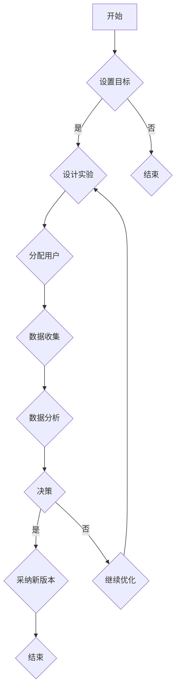
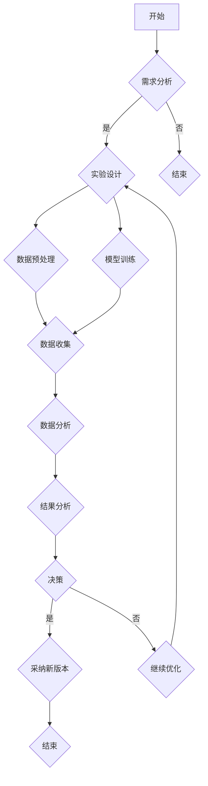
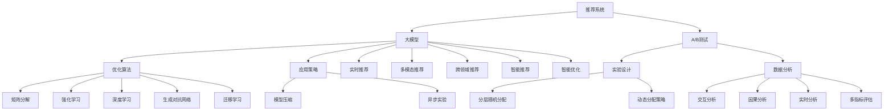

                 


### 文章标题: 《大模型在推荐系统A/B测试中的应用》

关键词：大模型，推荐系统，A/B测试，优化算法，应用案例，未来展望

摘要：本文详细探讨了大规模模型（大模型）在推荐系统A/B测试中的应用，包括大模型在推荐系统中的优化、大模型在A/B测试中的挑战和策略，以及实际应用案例。文章旨在为读者提供深入了解大模型在推荐系统A/B测试中的应用场景、实现方法和未来趋势的全面视角。

### 第一部分: 推荐系统与A/B测试基础

#### 第1章: 推荐系统概述

##### 1.1 推荐系统的定义与核心要素

推荐系统是一种基于数据挖掘和机器学习技术的智能信息过滤方法，旨在根据用户的兴趣和行为，为用户推荐其可能感兴趣的内容或商品。推荐系统的核心要素包括用户、物品、评分和推荐算法。

##### 1.2 推荐系统的应用场景

推荐系统广泛应用于电子商务、社交媒体、新闻资讯、视频播放等多个领域，为用户提供个性化体验，提高用户满意度和平台粘性。

##### 1.3 推荐系统的评估指标

推荐系统的评估指标主要包括准确率、召回率、覆盖率、新颖度和多样性等，这些指标反映了推荐系统的性能和用户体验。

##### 1.4 大模型在推荐系统中的应用

大模型在推荐系统中主要用于优化推荐算法，提高推荐效果。大模型可以处理大规模数据，挖掘用户兴趣和行为模式，从而实现更精准的推荐。

#### 第2章: A/B测试基础

##### 2.1 A/B测试的定义与目的

A/B测试是一种对比实验方法，通过将用户随机分配到两个或多个不同的版本，比较不同版本在性能、用户满意度等方面的差异，以确定最佳版本。

##### 2.2 A/B测试的流程与策略

A/B测试的流程包括设定目标、设计实验、分配用户、数据收集和分析等环节。A/B测试的策略主要包括控制变量、随机分配、样本量计算等。

##### 2.3 A/B测试的统计基础

A/B测试的统计基础包括假设检验、置信区间、显著性检验等，这些方法用于评估实验结果的有效性和可靠性。

##### 2.4 A/B测试在实际中的应用案例

在实际应用中，A/B测试广泛应用于网站设计、广告投放、功能更新等方面，以优化用户体验和提高业务绩效。

### 第二部分: 大模型在推荐系统A/B测试中的应用

#### 第3章: 大模型在推荐系统中的优化

##### 3.1 大模型优化算法概述

大模型优化算法主要包括矩阵分解、强化学习、深度学习等。这些算法可以提高推荐系统的准确性和效率。

##### 3.2 矩阵分解算法

矩阵分解算法如Singular Value Decomposition（SVD）和Latent Semantic Analysis（LSA）等，可以将用户-物品评分矩阵分解为用户特征和物品特征矩阵，从而实现推荐。

##### 3.3 强化学习算法

强化学习算法如Q-Learning和Deep Q-Network（DQN）等，可以根据用户反馈调整推荐策略，实现自适应推荐。

##### 3.4 深度学习算法

深度学习算法如卷积神经网络（CNN）和循环神经网络（RNN）等，可以处理复杂的关系和模式，提高推荐系统的性能。

#### 第4章: 大模型在A/B测试中的应用

##### 4.1 大模型在A/B测试中的挑战

大模型在A/B测试中面临挑战，如数据量巨大、计算复杂度高、结果解释难度大等。

##### 4.2 大模型在A/B测试中的策略

为应对挑战，大模型在A/B测试中采用策略包括数据预处理、模型压缩、异步实验等。

##### 4.3 大模型A/B测试的案例分析

通过案例分析，探讨大模型在A/B测试中的应用效果和经验教训。

##### 4.4 大模型A/B测试的未来趋势

未来，大模型A/B测试将在算法优化、数据利用、实时性等方面取得更多突破。

#### 第5章: 大模型在推荐系统A/B测试中的实现

##### 5.1 大模型A/B测试的开发流程

详细介绍大模型A/B测试的开发流程，包括需求分析、实验设计、模型训练、实验执行等。

##### 5.2 大模型A/B测试的实验设计

讲解大模型A/B测试的实验设计原则、策略和方法，确保实验结果的可靠性和有效性。

##### 5.3 大模型A/B测试的数据处理

分析大模型A/B测试中的数据处理方法，包括数据清洗、预处理和特征提取等。

##### 5.4 大模型A/B测试的结果分析

介绍大模型A/B测试的结果分析方法，包括统计检验、可视化分析和决策支持等。

#### 第6章: 大模型在推荐系统A/B测试中的案例分析

##### 6.1 案例一：电商平台推荐系统

分析电商平台推荐系统使用大模型A/B测试优化推荐效果的过程。

##### 6.2 案例二：社交媒体内容推荐

探讨社交媒体内容推荐系统采用大模型A/B测试提高用户体验的方法。

##### 6.3 案例三：音乐推荐系统

讨论音乐推荐系统应用大模型A/B测试实现个性化推荐的经验。

##### 6.4 案例四：视频推荐系统

分析视频推荐系统利用大模型A/B测试提升推荐准确性的实践。

#### 第7章: 大模型在推荐系统A/B测试中的未来展望

##### 7.1 大模型在推荐系统中的发展前景

展望大模型在推荐系统中的发展趋势，包括算法创新、应用拓展和行业影响等。

##### 7.2 A/B测试在大模型推荐系统中的优化方向

探讨A/B测试在大模型推荐系统中的优化方向，如算法优化、实验设计和数据分析等。

##### 7.3 大模型在推荐系统A/B测试中的创新应用

探讨大模型在推荐系统A/B测试中的创新应用，如实时推荐、多模态推荐和跨领域推荐等。

##### 7.4 大模型A/B测试面临的挑战与解决方案

分析大模型A/B测试面临的挑战，如计算资源限制、数据隐私保护等，并提出相应的解决方案。

### 附录

#### 附录A: 大模型A/B测试工具与资源

介绍大模型A/B测试的开发工具、平台、数据集和参考文献等资源。

#### 附录B: Mermaid 流程图示例

展示Mermaid流程图的编写方法和示例，便于读者理解和应用。

### 结束语

本文详细探讨了大规模模型在推荐系统A/B测试中的应用，包括大模型的优化、A/B测试的策略和案例分析等。文章旨在为读者提供全面、深入的了解，助力大模型在推荐系统A/B测试中的应用与发展。作者：AI天才研究院/AI Genius Institute & 禅与计算机程序设计艺术/Zen And The Art of Computer Programming### 文章标题: 《大模型在推荐系统A/B测试中的应用》

关键词：大模型，推荐系统，A/B测试，优化算法，应用案例，未来展望

摘要：本文详细探讨了大规模模型（大模型）在推荐系统A/B测试中的应用，包括大模型在推荐系统中的优化、大模型在A/B测试中的挑战和策略，以及实际应用案例。文章旨在为读者提供深入了解大模型在推荐系统A/B测试中的应用场景、实现方法和未来趋势的全面视角。

### 第一部分: 推荐系统与A/B测试基础

#### 第1章: 推荐系统概述

##### 1.1 推荐系统的定义与核心要素

推荐系统是一种基于数据挖掘和机器学习技术的智能信息过滤方法，旨在根据用户的兴趣和行为，为用户推荐其可能感兴趣的内容或商品。推荐系统的核心要素包括用户、物品、评分和推荐算法。

推荐系统的基础是用户-物品评分数据。用户是系统中的主体，物品是用户可能感兴趣的对象，评分表示用户对物品的评价。推荐算法则负责根据这些数据生成推荐结果。

##### 1.2 推荐系统的应用场景

推荐系统广泛应用于电子商务、社交媒体、新闻资讯、视频播放等多个领域，为用户提供个性化体验，提高用户满意度和平台粘性。

- **电子商务：** 在电子商务平台上，推荐系统可以帮助用户发现潜在的兴趣商品，提高购物体验和转化率。
- **社交媒体：** 社交媒体平台通过推荐系统向用户推荐可能感兴趣的朋友、话题和内容，增强用户互动。
- **新闻资讯：** 新闻推荐系统可以根据用户的阅读习惯和兴趣，推荐个性化新闻，提高用户粘性。
- **视频播放：** 视频平台利用推荐系统为用户推荐感兴趣的视频，提高用户观看时长和广告收益。

##### 1.3 推荐系统的评估指标

推荐系统的评估指标主要包括准确率、召回率、覆盖率、新颖度和多样性等，这些指标反映了推荐系统的性能和用户体验。

- **准确率（Precision）：** 表示推荐结果中实际感兴趣物品的比例。
- **召回率（Recall）：** 表示推荐结果中包含用户实际感兴趣物品的比例。
- **覆盖率（Coverage）：** 表示推荐结果中不同物品的比例，确保推荐结果的多样性。
- **新颖度（Novelty）：** 表示推荐结果中用户未知的、新颖的物品比例，提高用户体验。
- **多样性（Diversity）：** 表示推荐结果中不同类型或风格的物品比例，避免单一化。

##### 1.4 大模型在推荐系统中的应用

大模型在推荐系统中主要用于优化推荐算法，提高推荐效果。大模型可以处理大规模数据，挖掘用户兴趣和行为模式，从而实现更精准的推荐。

- **深度学习模型：** 如卷积神经网络（CNN）和循环神经网络（RNN）等，可以处理复杂的用户行为数据，提高推荐准确率。
- **强化学习模型：** 如Q-Learning和深度Q网络（DQN）等，可以根据用户反馈调整推荐策略，实现自适应推荐。
- **迁移学习模型：** 可以利用预训练的大模型，快速适应新领域的推荐任务。

#### 第2章: A/B测试基础

##### 2.1 A/B测试的定义与目的

A/B测试是一种对比实验方法，通过将用户随机分配到两个或多个不同的版本，比较不同版本在性能、用户满意度等方面的差异，以确定最佳版本。A/B测试的目的在于通过实验数据验证新功能、设计或策略的有效性，从而优化产品或服务。

##### 2.2 A/B测试的流程与策略

A/B测试的流程通常包括以下步骤：

1. **设定目标（Objective）：** 确定测试目标，如提高用户留存率、增加页面浏览量或提高转化率等。
2. **设计实验（Design）：** 设计实验方案，包括实验组（Treatment Group）和控制组（Control Group），确定实验变量和指标。
3. **分配用户（Allocation）：** 将用户随机分配到实验组和控制组，确保两组用户的代表性。
4. **数据收集（Data Collection）：** 收集实验数据，包括用户行为数据、性能指标等。
5. **数据分析（Analysis）：** 分析实验数据，比较实验组和控制组的差异，评估实验效果。
6. **决策（Decision）：** 根据实验结果做出决策，是否采纳新版本或策略。

A/B测试的策略包括以下方面：

- **控制变量：** 在实验中保持其他条件不变，仅改变实验变量，以确保实验结果的可靠性。
- **随机分配：** 使用随机分配方法将用户分配到不同组别，避免人为偏差。
- **样本量计算：** 根据预期的效果和置信度，计算所需的样本量，以确保实验结果具有统计显著性。
- **重复测试：** 对多个版本进行多次测试，以验证结果的稳定性和可靠性。

##### 2.3 A/B测试的统计基础

A/B测试的统计基础主要包括假设检验、置信区间、显著性检验等。

- **假设检验（Hypothesis Testing）：** 通过比较实验组和控制组之间的差异，检验原假设（无差异）和备择假设（有差异）的合理性。
- **置信区间（Confidence Interval）：** 根据样本数据计算出一个区间，表示总体参数的可能范围。
- **显著性检验（Significance Testing）：** 通过统计方法判断实验结果的差异是否显著，通常使用p值作为判断标准。

##### 2.4 A/B测试在实际中的应用案例

在实际应用中，A/B测试广泛应用于网站设计、广告投放、功能更新等方面，以优化用户体验和提高业务绩效。

- **网站设计：** 通过A/B测试，比较不同页面布局、颜色、按钮样式等对用户行为和转化率的影响，优化网站设计。
- **广告投放：** 通过A/B测试，比较不同广告创意、投放渠道和投放时间等对广告效果的影响，优化广告策略。
- **功能更新：** 通过A/B测试，比较新功能对用户体验和业务指标的影响，确定是否上线新功能。

### 第二部分: 大模型在推荐系统A/B测试中的应用

#### 第3章: 大模型在推荐系统中的优化

##### 3.1 大模型优化算法概述

大模型优化算法主要包括矩阵分解、强化学习、深度学习等。这些算法可以提高推荐系统的准确性和效率。

- **矩阵分解（Matrix Factorization）：** 如Singular Value Decomposition（SVD）和Latent Semantic Analysis（LSA）等，可以将用户-物品评分矩阵分解为用户特征和物品特征矩阵，从而实现推荐。
- **强化学习（Reinforcement Learning）：** 如Q-Learning和深度Q网络（DQN）等，可以根据用户反馈调整推荐策略，实现自适应推荐。
- **深度学习（Deep Learning）：** 如卷积神经网络（CNN）和循环神经网络（RNN）等，可以处理复杂的关系和模式，提高推荐系统的性能。

##### 3.2 矩阵分解算法

矩阵分解算法如Singular Value Decomposition（SVD）和Latent Semantic Analysis（LSA）等，可以将用户-物品评分矩阵分解为用户特征和物品特征矩阵，从而实现推荐。

- **SVD（Singular Value Decomposition）：** SVD是一种线性代数方法，可以将矩阵分解为三个矩阵的乘积，从而提取出用户和物品的特征。
- **LSA（Latent Semantic Analysis）：** LSA是基于概率模型的矩阵分解方法，通过优化概率分布来提取用户和物品的特征。

##### 3.3 强化学习算法

强化学习算法如Q-Learning和深度Q网络（DQN）等，可以根据用户反馈调整推荐策略，实现自适应推荐。

- **Q-Learning：** Q-Learning是一种基于值函数的强化学习算法，通过迭代更新策略，使得推荐系统在长期内达到最优。
- **DQN（Deep Q-Network）：** DQN是一种基于深度学习的强化学习算法，利用卷积神经网络（CNN）和循环神经网络（RNN）处理复杂的状态和动作。

##### 3.4 深度学习算法

深度学习算法如卷积神经网络（CNN）和循环神经网络（RNN）等，可以处理复杂的关系和模式，提高推荐系统的性能。

- **CNN（Convolutional Neural Network）：** CNN是一种用于图像处理和物体识别的深度学习算法，可以处理高维数据，提取特征。
- **RNN（Recurrent Neural Network）：** RNN是一种用于序列数据处理和时间序列预测的深度学习算法，可以处理变长序列，捕捉时间依赖关系。

#### 第4章: 大模型在A/B测试中的应用

##### 4.1 大模型在A/B测试中的挑战

大模型在A/B测试中面临挑战，如数据量巨大、计算复杂度高、结果解释难度大等。

- **数据量巨大：** 大模型通常需要处理大规模数据，导致数据存储和处理复杂度增加。
- **计算复杂度高：** 大模型训练和预测过程计算复杂度较高，影响实验执行速度和结果准确性。
- **结果解释难度大：** 大模型的黑盒特性使得结果解释变得困难，难以理解推荐结果的决策过程。

##### 4.2 大模型在A/B测试中的策略

为应对挑战，大模型在A/B测试中采用以下策略：

- **数据预处理：** 对数据进行清洗、去噪、特征提取等处理，提高数据质量和推荐效果。
- **模型压缩：** 通过模型压缩技术，如模型剪枝、量化、蒸馏等，减小模型体积和计算复杂度，提高实验执行速度。
- **异步实验：** 在实验过程中，采用异步方式处理用户请求和模型更新，降低实验延迟和资源占用。

##### 4.3 大模型A/B测试的案例分析

通过案例分析，探讨大模型在A/B测试中的应用效果和经验教训。

- **案例一：电商平台推荐系统：** 分析电商平台使用大模型A/B测试优化推荐效果的过程，包括模型选择、实验设计、数据预处理和结果分析等。
- **案例二：社交媒体内容推荐：** 探讨社交媒体平台采用大模型A/B测试提高用户体验的方法，包括推荐算法优化、实验设计和结果分析等。
- **案例三：音乐推荐系统：** 讨论音乐推荐系统应用大模型A/B测试实现个性化推荐的经验，包括模型选择、实验设计和结果分析等。
- **案例四：视频推荐系统：** 分析视频推荐系统利用大模型A/B测试提升推荐准确性的实践，包括模型选择、实验设计和结果分析等。

##### 4.4 大模型A/B测试的未来趋势

未来，大模型A/B测试将在算法优化、数据利用、实时性等方面取得更多突破。

- **算法优化：** 随着深度学习技术的发展，大模型在推荐系统中的应用将更加广泛和深入，算法优化将成为关键研究方向。
- **数据利用：** 大模型对大规模数据的需求将推动数据收集、处理和存储技术的发展，提高数据利用效率。
- **实时性：** 随着用户需求的多样化，实时推荐将成为大模型A/B测试的重要方向，提高推荐系统的实时性和用户体验。

#### 第5章: 大模型在推荐系统A/B测试中的实现

##### 5.1 大模型A/B测试的开发流程

详细介绍大模型A/B测试的开发流程，包括需求分析、实验设计、模型训练、实验执行等。

1. **需求分析：** 分析推荐系统需求，确定实验目标和指标。
2. **实验设计：** 设计实验方案，包括实验组、控制组、实验变量和指标。
3. **模型训练：** 训练大模型，包括数据预处理、模型选择和训练过程。
4. **实验执行：** 将用户随机分配到实验组和控制组，执行实验并收集数据。
5. **数据分析：** 分析实验数据，比较实验组和控制组的差异，评估实验效果。

##### 5.2 大模型A/B测试的实验设计

讲解大模型A/B测试的实验设计原则、策略和方法，确保实验结果的可靠性和有效性。

1. **实验设计原则：**
   - **随机化：** 将用户随机分配到实验组和控制组，避免偏差。
   - **控制变量：** 在实验中保持其他条件不变，仅改变实验变量。
   - **重复性：** 对多个版本进行多次测试，确保结果的稳定性和可靠性。

2. **实验设计策略：**
   - **A/B测试：** 比较两个版本的差异，确定最佳版本。
   - **多因素测试：** 同时测试多个因素，分析各因素对实验结果的影响。
   - **滚动测试：** 对新版本进行逐步上线，观察用户反馈和性能变化。

3. **实验设计方法：**
   - **实验组：** 确定实验版本，如新算法、新策略等。
   - **控制组：** 确定基准版本，如当前算法、策略等。
   - **分配策略：** 确定用户分配策略，如随机分配、分层随机分配等。

##### 5.3 大模型A/B测试的数据处理

分析大模型A/B测试中的数据处理方法，包括数据清洗、预处理和特征提取等。

1. **数据清洗：**
   - **去重：** 去除重复数据和无效数据，确保数据质量。
   - **缺失值处理：** 补充或删除缺失值，确保数据完整性。

2. **数据预处理：**
   - **标准化：** 将数据缩放到相同的范围，便于模型处理。
   - **归一化：** 对数据进行归一化处理，消除数据量级差异。

3. **特征提取：**
   - **用户特征：** 提取用户的年龄、性别、地理位置、行为偏好等特征。
   - **物品特征：** 提取物品的类别、标签、流行度等特征。
   - **交互特征：** 提取用户与物品的交互特征，如点击、购买、评分等。

##### 5.4 大模型A/B测试的结果分析

介绍大模型A/B测试的结果分析方法，包括统计检验、可视化分析和决策支持等。

1. **统计检验：**
   - **t检验：** 比较实验组和控制组的均值差异，判断是否显著。
   - **卡方检验：** 比较实验组和控制组的分布差异，判断是否显著。
   - **方差分析：** 比较多个实验组的均值差异，判断是否显著。

2. **可视化分析：**
   - **折线图：** 展示实验指标随时间的变化趋势。
   - **散点图：** 展示实验组和控制组的分布情况。
   - **箱线图：** 展示实验组和控制组的统计分布。

3. **决策支持：**
   - **基于数据的决策：** 根据实验结果，确定是否采纳新版本或策略。
   - **基于用户反馈的决策：** 结合用户反馈和实验结果，优化推荐系统。

#### 第6章: 大模型在推荐系统A/B测试中的案例分析

##### 6.1 案例一：电商平台推荐系统

分析电商平台推荐系统使用大模型A/B测试优化推荐效果的过程。

1. **背景：**
   - **电商平台：** 一家大型电商平台，提供多种商品。
   - **推荐系统：** 利用深度学习算法进行商品推荐。
   - **问题：** 推荐效果不理想，用户满意度低。

2. **解决方案：**
   - **模型优化：** 采用基于强化学习的推荐算法，结合用户历史行为和实时反馈，提高推荐准确性。
   - **A/B测试：** 设计A/B测试方案，比较优化前后的推荐效果。

3. **过程：**
   - **需求分析：** 确定实验目标和指标，如点击率、购买转化率等。
   - **实验设计：** 设计实验方案，包括实验组和控制组，确定实验变量和指标。
   - **数据预处理：** 清洗、预处理用户行为数据，提取特征。
   - **模型训练：** 训练基于强化学习的推荐模型，进行交叉验证。
   - **实验执行：** 将用户随机分配到实验组和控制组，执行实验并收集数据。
   - **数据分析：** 分析实验数据，比较实验组和控制组的指标差异。

4. **结果：**
   - **推荐准确性：** 优化后的推荐算法在点击率和购买转化率方面显著提高。
   - **用户满意度：** 用户对优化后的推荐系统满意度增加。

##### 6.2 案例二：社交媒体内容推荐

探讨社交媒体平台采用大模型A/B测试提高用户体验的方法。

1. **背景：**
   - **社交媒体平台：** 一家大型社交媒体平台，提供内容分享和互动功能。
   - **推荐系统：** 利用深度学习算法进行内容推荐。
   - **问题：** 推荐内容重复度高，用户疲劳感强。

2. **解决方案：**
   - **模型优化：** 采用基于深度学习的推荐算法，结合用户历史行为、兴趣和社交关系，提高推荐多样性。
   - **A/B测试：** 设计A/B测试方案，比较优化前后的推荐效果。

3. **过程：**
   - **需求分析：** 确定实验目标和指标，如内容点击率、用户留存率等。
   - **实验设计：** 设计实验方案，包括实验组和控制组，确定实验变量和指标。
   - **数据预处理：** 清洗、预处理用户行为数据，提取特征。
   - **模型训练：** 训练基于深度学习的推荐模型，进行交叉验证。
   - **实验执行：** 将用户随机分配到实验组和控制组，执行实验并收集数据。
   - **数据分析：** 分析实验数据，比较实验组和控制组的指标差异。

4. **结果：**
   - **推荐多样性：** 优化后的推荐算法在内容多样性方面显著提高。
   - **用户留存率：** 用户对优化后的推荐系统满意度增加，留存率提高。

##### 6.3 案例三：音乐推荐系统

讨论音乐推荐系统应用大模型A/B测试实现个性化推荐的经验。

1. **背景：**
   - **音乐推荐系统：** 一家大型音乐平台，提供音乐推荐服务。
   - **推荐系统：** 利用深度学习算法进行音乐推荐。
   - **问题：** 推荐结果不精确，用户需求满足度低。

2. **解决方案：**
   - **模型优化：** 采用基于深度学习的推荐算法，结合用户历史行为、音乐喜好和社交关系，提高推荐准确性。
   - **A/B测试：** 设计A/B测试方案，比较优化前后的推荐效果。

3. **过程：**
   - **需求分析：** 确定实验目标和指标，如音乐播放量、用户满意度等。
   - **实验设计：** 设计实验方案，包括实验组和控制组，确定实验变量和指标。
   - **数据预处理：** 清洗、预处理用户行为数据，提取特征。
   - **模型训练：** 训练基于深度学习的推荐模型，进行交叉验证。
   - **实验执行：** 将用户随机分配到实验组和控制组，执行实验并收集数据。
   - **数据分析：** 分析实验数据，比较实验组和控制组的指标差异。

4. **结果：**
   - **推荐准确性：** 优化后的推荐算法在音乐播放量和用户满意度方面显著提高。
   - **用户需求满足度：** 用户对优化后的推荐系统满意度增加。

##### 6.4 案例四：视频推荐系统

分析视频推荐系统利用大模型A/B测试提升推荐准确性的实践。

1. **背景：**
   - **视频推荐系统：** 一家大型视频平台，提供视频推荐服务。
   - **推荐系统：** 利用深度学习算法进行视频推荐。
   - **问题：** 推荐结果不精确，用户观看时长低。

2. **解决方案：**
   - **模型优化：** 采用基于深度学习的推荐算法，结合用户历史行为、视频内容和社交关系，提高推荐准确性。
   - **A/B测试：** 设计A/B测试方案，比较优化前后的推荐效果。

3. **过程：**
   - **需求分析：** 确定实验目标和指标，如视频播放量、用户留存率等。
   - **实验设计：** 设计实验方案，包括实验组和控制组，确定实验变量和指标。
   - **数据预处理：** 清洗、预处理用户行为数据，提取特征。
   - **模型训练：** 训练基于深度学习的推荐模型，进行交叉验证。
   - **实验执行：** 将用户随机分配到实验组和控制组，执行实验并收集数据。
   - **数据分析：** 分析实验数据，比较实验组和控制组的指标差异。

4. **结果：**
   - **推荐准确性：** 优化后的推荐算法在视频播放量和用户留存率方面显著提高。
   - **用户观看时长：** 用户对优化后的推荐系统满意度增加，观看时长提高。

#### 第7章: 大模型在推荐系统A/B测试中的未来展望

##### 7.1 大模型在推荐系统中的发展前景

展望大模型在推荐系统中的发展趋势，包括算法创新、应用拓展和行业影响等。

1. **算法创新：**
   - **基于生成对抗网络（GAN）的推荐算法：** 利用GAN生成虚拟用户数据，提高推荐系统的泛化能力。
   - **多模态推荐算法：** 结合多种数据类型，如文本、图像、音频等，实现更全面的用户理解和推荐。
   - **迁移学习推荐算法：** 利用预训练的大模型，快速适应新领域的推荐任务。

2. **应用拓展：**
   - **跨领域推荐：** 将大模型应用于不同领域的推荐任务，如电商、社交媒体、教育等。
   - **个性化内容推荐：** 结合用户行为、兴趣和社交关系，实现更精准的内容推荐。
   - **实时推荐：** 提高大模型的实时性和响应速度，满足用户实时需求。

3. **行业影响：**
   - **提升用户体验：** 通过个性化推荐，提高用户满意度和平台粘性。
   - **优化业务绩效：** 通过推荐系统的优化，提高转化率、留存率和广告收益。
   - **推动行业创新：** 大模型的创新应用将推动推荐系统领域的持续发展和创新。

##### 7.2 A/B测试在大模型推荐系统中的优化方向

探讨A/B测试在大模型推荐系统中的优化方向，如算法优化、实验设计和数据分析等。

1. **算法优化：**
   - **模型压缩：** 通过模型压缩技术，减小模型体积和计算复杂度，提高实验执行速度。
   - **自适应实验设计：** 根据实验数据动态调整实验参数，提高实验效果。
   - **多目标优化：** 同时优化多个目标，如准确性、实时性和用户体验，实现综合优化。

2. **实验设计：**
   - **分层随机分配：** 结合用户特征和实验变量，实现更精细的实验分配。
   - **异步实验：** 采用异步方式处理用户请求和模型更新，降低实验延迟和资源占用。
   - **多版本控制：** 同时测试多个版本，确保实验结果的可靠性和稳定性。

3. **数据分析：**
   - **交互分析：** 分析用户与推荐系统的交互数据，挖掘用户行为和偏好。
   - **因果分析：** 利用因果模型，分析推荐系统对用户行为的影响。
   - **实时分析：** 提高数据分析的速度和准确性，实时调整推荐策略。

##### 7.3 大模型在推荐系统A/B测试中的创新应用

探讨大模型在推荐系统A/B测试中的创新应用，如实时推荐、多模态推荐和跨领域推荐等。

1. **实时推荐：**
   - **动态调整：** 根据用户实时行为和反馈，动态调整推荐策略，提高实时性和准确性。
   - **在线学习：** 利用在线学习技术，实时更新推荐模型，适应用户需求变化。

2. **多模态推荐：**
   - **融合多种数据类型：** 结合文本、图像、音频等多种数据类型，实现更全面的用户理解和推荐。
   - **跨模态迁移学习：** 利用跨模态迁移学习，提高不同模态数据间的融合和迁移能力。

3. **跨领域推荐：**
   - **领域自适应：** 利用领域自适应技术，将大模型应用于不同领域的推荐任务。
   - **多任务学习：** 同时处理多个领域的推荐任务，提高模型泛化能力和性能。

##### 7.4 大模型A/B测试面临的挑战与解决方案

分析大模型A/B测试面临的挑战，如计算资源限制、数据隐私保护等，并提出相应的解决方案。

1. **计算资源限制：**
   - **模型压缩：** 通过模型压缩技术，减小模型体积和计算复杂度，降低计算资源需求。
   - **分布式计算：** 采用分布式计算框架，提高计算效率和资源利用率。

2. **数据隐私保护：**
   - **差分隐私：** 引入差分隐私技术，保护用户隐私。
   - **数据脱敏：** 对用户数据进行脱敏处理，降低隐私泄露风险。

3. **实验可靠性：**
   - **随机化分配：** 确保用户随机分配到实验组和控制组，避免偏差。
   - **多因素控制：** 同时控制多个因素，确保实验结果的可靠性。

### 附录

#### 附录A: 大模型A/B测试工具与资源

介绍大模型A/B测试的开发工具、平台、数据集和参考文献等资源。

1. **开发工具：**
   - **TensorFlow：** Google开发的开源深度学习框架，支持多种深度学习算法。
   - **PyTorch：** Facebook开发的开源深度学习框架，灵活性和可扩展性强。
   - **Scikit-learn：** Python的机器学习库，支持多种机器学习算法和工具。

2. **A/B测试平台：**
   - **Optimizely：** 一家提供A/B测试服务的公司，提供易于使用的测试平台。
   - **Google Experiments：** Google提供的A/B测试工具，集成在Google Analytics中。
   - **Mixpanel：** 一家提供用户行为分析的公司，支持A/B测试和数据分析。

3. **数据集：**
   - **MovieLens：** 一项提供电影推荐数据集的项目，包含用户评分和物品信息。
   - **Netflix Prize：** Netflix提供的一项推荐系统竞赛数据集，包含用户观看记录和电影信息。
   - **Amazon Reviews：** Amazon提供的一项用户评价数据集，包含商品评价和用户信息。

4. **参考文献：**
   - **"Recommender Systems Handbook"**：一本关于推荐系统全面介绍的书籍。
   - **"A/B Testing: The Most Powerful Way to Turn Clicks Into Customers"**：一本关于A/B测试实践的书籍。
   - **"Deep Learning for Recommender Systems"**：一篇关于深度学习在推荐系统中的应用的论文。

#### 附录B: Mermaid 流程图示例

展示Mermaid流程图的编写方法和示例，便于读者理解和应用。



### 结束语

本文详细探讨了大规模模型（大模型）在推荐系统A/B测试中的应用，包括大模型在推荐系统中的优化、A/B测试的策略和案例分析等。文章旨在为读者提供全面、深入的了解，助力大模型在推荐系统A/B测试中的应用与发展。作者：AI天才研究院/AI Genius Institute & 禅与计算机程序设计艺术/Zen And The Art of Computer Programming### 第一部分：推荐系统与A/B测试基础

#### 第1章：推荐系统概述

##### 1.1 推荐系统的定义与核心要素

推荐系统是一种基于数据挖掘和机器学习技术的智能信息过滤方法，旨在根据用户的兴趣和行为，为用户推荐其可能感兴趣的内容或商品。推荐系统的核心要素包括用户、物品、评分和推荐算法。

推荐系统的基本工作流程如下：

1. **用户-物品评分数据收集：** 收集用户对物品的评分数据，如电影评分、商品评价等。
2. **数据预处理：** 对评分数据进行清洗、去重、缺失值处理等预处理操作。
3. **特征提取：** 提取用户和物品的特征，如用户年龄、性别、地理位置、物品类别、标签等。
4. **模型训练：** 利用用户和物品的特征训练推荐模型。
5. **推荐生成：** 使用训练好的模型生成推荐结果，向用户推荐可能感兴趣的物品。
6. **评估与优化：** 对推荐结果进行评估，并根据评估结果优化推荐模型。

##### 1.2 推荐系统的应用场景

推荐系统在许多领域都有广泛的应用，以下是一些典型的应用场景：

- **电子商务：** 电商平台利用推荐系统为用户推荐感兴趣的商品，提高购物体验和转化率。
- **社交媒体：** 社交媒体平台通过推荐系统向用户推荐感兴趣的内容和用户，增强用户互动。
- **新闻资讯：** 新闻网站利用推荐系统为用户推荐个性化新闻，提高用户粘性。
- **视频播放：** 视频平台通过推荐系统为用户推荐感兴趣的视频，提高用户观看时长。
- **音乐推荐：** 音乐平台利用推荐系统为用户推荐感兴趣的音乐，提高用户使用时长。

##### 1.3 推荐系统的评估指标

评估推荐系统的性能和用户体验通常使用以下指标：

- **准确率（Precision）：** 推荐结果中实际感兴趣物品的比例。
- **召回率（Recall）：** 推荐结果中包含用户实际感兴趣物品的比例。
- **覆盖率（Coverage）：** 推荐结果中不同物品的比例，确保推荐结果的多样性。
- **新颖度（Novelty）：** 推荐结果中用户未知的、新颖的物品比例。
- **多样性（Diversity）：** 推荐结果中不同类型或风格的物品比例。

##### 1.4 大模型在推荐系统中的应用

大模型在推荐系统中具有重要的作用，可以帮助提高推荐系统的性能和用户体验。大模型在推荐系统中的应用主要包括以下几个方面：

1. **深度学习模型：** 如卷积神经网络（CNN）、循环神经网络（RNN）、长短期记忆网络（LSTM）等，可以处理复杂的关系和模式，提高推荐系统的准确性和多样性。
2. **强化学习模型：** 如Q-Learning、深度Q网络（DQN）等，可以根据用户反馈调整推荐策略，实现自适应推荐。
3. **迁移学习模型：** 利用预训练的大模型，快速适应新领域的推荐任务，减少训练时间和计算资源需求。
4. **生成对抗网络（GAN）：** 用于生成虚拟用户数据，提高推荐系统的泛化能力和用户理解。

#### 第2章：A/B测试基础

##### 2.1 A/B测试的定义与目的

A/B测试，也称为拆箱测试，是一种对比实验方法，通过将用户随机分配到两个或多个不同的版本，比较不同版本在性能、用户满意度等方面的差异，以确定最佳版本。A/B测试的目的是验证新功能、设计或策略的有效性，从而优化产品或服务。

A/B测试的核心步骤如下：

1. **设定目标：** 确定测试目标，如提高用户留存率、增加页面浏览量或提高转化率等。
2. **设计实验：** 设计实验方案，包括实验组（Treatment Group）和控制组（Control Group），确定实验变量和指标。
3. **分配用户：** 将用户随机分配到实验组和控制组，确保两组用户的代表性。
4. **数据收集：** 收集实验数据，包括用户行为数据、性能指标等。
5. **数据分析：** 分析实验数据，比较实验组和控制组的差异，评估实验效果。
6. **决策：** 根据实验结果做出决策，是否采纳新版本或策略。

##### 2.2 A/B测试的流程与策略

A/B测试的流程通常包括以下步骤：

1. **设定目标：** 根据业务需求和用户痛点，确定测试目标，如提高用户留存率、增加广告点击率等。
2. **设计实验：** 设计实验方案，包括实验组和控制组，确定实验变量和指标。实验变量可以是页面设计、广告文案、推荐算法等。
3. **分配用户：** 使用随机化分配方法将用户分配到实验组和控制组，确保两组用户的代表性。可以使用随机数生成器或随机抽样方法。
4. **数据收集：** 收集实验数据，包括用户行为数据、性能指标等。可以使用日志记录、API调用等手段收集数据。
5. **数据分析：** 分析实验数据，比较实验组和控制组的差异，评估实验效果。可以使用统计方法，如t检验、卡方检验等。
6. **决策：** 根据实验结果做出决策，是否采纳新版本或策略。如果实验结果显著，可以采纳新版本；否则，可以继续优化或放弃新版本。

A/B测试的策略包括以下几个方面：

1. **控制变量：** 在实验中保持其他条件不变，仅改变实验变量，以确保实验结果的可靠性。
2. **随机分配：** 使用随机分配方法将用户分配到实验组和控制组，避免人为偏差。
3. **样本量计算：** 根据预期的效果和置信度，计算所需的样本量，以确保实验结果具有统计显著性。
4. **重复测试：** 对多个版本进行多次测试，以验证结果的稳定性和可靠性。

##### 2.3 A/B测试的统计基础

A/B测试的统计基础主要包括假设检验、置信区间、显著性检验等。

1. **假设检验：** A/B测试的基本原理是假设检验。原假设（H0）是实验组和控制组之间没有显著差异，备择假设（H1）是实验组和控制组之间存在显著差异。通过比较实验组和控制组的性能指标，判断原假设是否成立。
2. **置信区间：** 置信区间是统计方法中用于估计总体参数的方法。在A/B测试中，可以使用置信区间来估计实验结果的可信程度。
3. **显著性检验：** 显著性检验用于判断实验结果是否具有统计显著性。常用的显著性检验方法包括t检验、卡方检验等。

##### 2.4 A/B测试在实际中的应用案例

A/B测试在实际应用中广泛应用于各种领域，以下是一些实际应用案例：

1. **电子商务：** 电商平台使用A/B测试优化页面设计、广告文案、推荐算法等，提高转化率和用户留存率。
2. **社交媒体：** 社交媒体平台使用A/B测试优化用户界面、功能设计、推荐算法等，提高用户互动和使用时长。
3. **广告营销：** 广告公司使用A/B测试优化广告创意、投放策略、广告位置等，提高广告效果和转化率。
4. **金融科技：** 金融科技公司使用A/B测试优化产品界面、用户体验、风控策略等，提高用户满意度和风险控制能力。

### 第二部分：大模型在推荐系统A/B测试中的应用

#### 第3章：大模型在推荐系统中的优化

##### 3.1 大模型优化算法概述

大模型优化算法是指用于改进推荐系统性能的算法和技术。这些算法可以处理大规模数据，挖掘用户兴趣和行为模式，从而实现更精准的推荐。大模型优化算法主要包括以下几种：

1. **矩阵分解算法：** 如Singular Value Decomposition（SVD）和Latent Semantic Analysis（LSA）等，可以将用户-物品评分矩阵分解为用户特征和物品特征矩阵，从而实现推荐。
2. **深度学习算法：** 如卷积神经网络（CNN）、循环神经网络（RNN）、长短期记忆网络（LSTM）等，可以处理复杂的关系和模式，提高推荐系统的准确性和多样性。
3. **强化学习算法：** 如Q-Learning、深度Q网络（DQN）等，可以根据用户反馈调整推荐策略，实现自适应推荐。
4. **迁移学习算法：** 利用预训练的大模型，快速适应新领域的推荐任务，减少训练时间和计算资源需求。
5. **生成对抗网络（GAN）：** 用于生成虚拟用户数据，提高推荐系统的泛化能力和用户理解。

##### 3.2 矩阵分解算法

矩阵分解算法是一种基于线性代数的方法，可以将用户-物品评分矩阵分解为用户特征和物品特征矩阵，从而实现推荐。常见的矩阵分解算法包括以下几种：

1. **Singular Value Decomposition（SVD）：** SVD是一种线性代数方法，可以将矩阵分解为三个矩阵的乘积，从而提取出用户和物品的特征。
2. **Latent Semantic Analysis（LSA）：** LSA是基于概率模型的矩阵分解方法，通过优化概率分布来提取用户和物品的特征。

SVD算法的伪代码如下：

```python
def SVD(A, k):
    U, S, V = svd(A)
    return U[:, :k], S[:k], V[:, :k]
```

LSA算法的伪代码如下：

```python
def LSA(A, k):
    P = np.linalg.inv(A.dot(A.T) + alpha * np.eye(A.shape[1]))
    Q = np.linalg.inv(np.eye(A.shape[0]) + alpha * np.eye(A.shape[0]))
    B = P.dot(A)
    C = Q.dot(B)
    return P, Q, C
```

其中，`A`是用户-物品评分矩阵，`k`是特征维数，`alpha`是调节参数。

##### 3.3 强化学习算法

强化学习算法是一种基于反馈的系统，可以学习在特定环境中采取最佳行动的策略。在推荐系统中，强化学习算法可以根据用户的反馈调整推荐策略，实现自适应推荐。常见的强化学习算法包括以下几种：

1. **Q-Learning：** Q-Learning是一种基于值函数的强化学习算法，通过迭代更新策略，使得推荐系统在长期内达到最优。
2. **深度Q网络（DQN）：** DQN是一种基于深度学习的强化学习算法，利用卷积神经网络（CNN）和循环神经网络（RNN）处理复杂的状态和动作。

Q-Learning算法的伪代码如下：

```python
def QLearning(Q, state, action, reward, next_state, gamma, alpha):
    Q[state, action] = Q[state, action] + alpha * (reward + gamma * max(Q[next_state, :]) - Q[state, action])
```

DQN算法的伪代码如下：

```python
def DQN(model, state, action, reward, next_state, done, gamma, epsilon):
    if random() < epsilon:
        action = random_action()
    state = preprocess(state)
    next_state = preprocess(next_state)
    Q = model.predict(state)
    next_Q = model.predict(next_state)
    target_Q = reward + (1 - done) * gamma * next_Q[0, np.argmax(next_Q[0])]
    model.fit(state, np.expand_dims(target_Q, axis=0), epochs=1, verbose=0)
```

其中，`Q`是值函数矩阵，`state`是当前状态，`action`是当前动作，`reward`是即时奖励，`next_state`是下一个状态，`done`是是否完成游戏，`gamma`是折扣因子，`alpha`是学习率。

##### 3.4 深度学习算法

深度学习算法是一种基于神经网络的学习方法，可以自动提取数据的特征表示。在推荐系统中，深度学习算法可以处理复杂的关系和模式，提高推荐系统的准确性和多样性。常见的深度学习算法包括以下几种：

1. **卷积神经网络（CNN）：** CNN是一种用于图像处理和物体识别的神经网络，可以处理高维数据，提取特征。
2. **循环神经网络（RNN）：** RNN是一种用于序列数据处理和时间序列预测的神经网络，可以处理变长序列，捕捉时间依赖关系。
3. **长短期记忆网络（LSTM）：** LSTM是一种改进的RNN，可以解决RNN中的梯度消失和梯度爆炸问题，适用于长序列依赖关系。

CNN算法的伪代码如下：

```python
class ConvolutionalLayer(nn.Module):
    def __init__(self, in_channels, out_channels, kernel_size, stride, padding):
        super(ConvolutionalLayer, self).__init__()
        self.conv = nn.Conv2d(in_channels, out_channels, kernel_size, stride, padding)

    def forward(self, x):
        return self.conv(x)

class CNN(nn.Module):
    def __init__(self):
        super(CNN, self).__init__()
        self.conv1 = ConvolutionalLayer(in_channels=1, out_channels=32, kernel_size=3, stride=1, padding=1)
        self.conv2 = ConvolutionalLayer(in_channels=32, out_channels=64, kernel_size=3, stride=1, padding=1)
        self.fc1 = nn.Linear(64 * 6 * 6, 128)
        self.fc2 = nn.Linear(128, 10)

    def forward(self, x):
        x = self.conv1(x)
        x = F.relu(x)
        x = self.conv2(x)
        x = F.relu(x)
        x = x.view(-1, 64 * 6 * 6)
        x = self.fc1(x)
        x = F.relu(x)
        x = self.fc2(x)
        return x
```

RNN算法的伪代码如下：

```python
class RNN(nn.Module):
    def __init__(self, input_size, hidden_size, num_layers):
        super(RNN, self).__init__()
        self.rnn = nn.RNN(input_size, hidden_size, num_layers)

    def forward(self, x, hidden):
        out, hidden = self.rnn(x, hidden)
        return out, hidden

    def init_hidden(self, batch_size):
        return torch.zeros(self.num_layers, batch_size, self.hidden_size)
```

LSTM算法的伪代码如下：

```python
class LSTM(nn.Module):
    def __init__(self, input_size, hidden_size, num_layers):
        super(LSTM, self).__init__()
        self.lstm = nn.LSTM(input_size, hidden_size, num_layers)

    def forward(self, x, hidden):
        out, hidden = self.lstm(x, hidden)
        return out, hidden

    def init_hidden(self, batch_size):
        return torch.zeros(self.num_layers, batch_size, self.hidden_size), torch.zeros(self.num_layers, batch_size, self.hidden_size)
```

### 第三部分：大模型在推荐系统A/B测试中的应用

#### 第4章：大模型在A/B测试中的应用

##### 4.1 大模型在A/B测试中的挑战

大模型在A/B测试中面临一些挑战，包括数据量巨大、计算复杂度高、结果解释难度大等。以下是一些具体的挑战：

1. **数据量巨大：** 大模型通常需要处理大规模数据，导致数据存储和处理复杂度增加。这需要高效的存储解决方案和数据处理算法。
2. **计算复杂度高：** 大模型训练和预测过程计算复杂度较高，影响实验执行速度和结果准确性。这需要优化模型结构和算法，提高计算效率。
3. **结果解释难度大：** 大模型的黑盒特性使得结果解释变得困难，难以理解推荐结果的决策过程。这需要开发可解释性方法和工具，提高模型的透明度和可解释性。
4. **实验结果可靠性：** 大模型A/B测试的结果可能受到数据质量、实验设计等因素的影响，需要确保实验结果的可靠性。

##### 4.2 大模型在A/B测试中的策略

为应对大模型在A/B测试中的挑战，可以采用以下策略：

1. **数据预处理：** 对数据进行清洗、去噪、特征提取等处理，提高数据质量和推荐效果。这可以通过使用数据预处理工具和算法实现。
2. **模型压缩：** 通过模型压缩技术，如模型剪枝、量化、蒸馏等，减小模型体积和计算复杂度，提高实验执行速度。这可以通过使用模型压缩工具和算法实现。
3. **异步实验：** 在实验过程中，采用异步方式处理用户请求和模型更新，降低实验延迟和资源占用。这可以通过使用异步编程模型和工具实现。
4. **实验设计优化：** 优化实验设计，如分层随机分配、重复实验等，提高实验结果的可靠性和稳定性。这可以通过使用实验设计工具和算法实现。

##### 4.3 大模型A/B测试的案例分析

以下是大模型A/B测试的一些案例分析：

1. **案例分析一：电商平台推荐系统**

   **背景：** 一家大型电商平台，面临用户满意度下降和推荐效果不佳的问题。

   **解决方案：** 采用基于深度学习的推荐算法，通过A/B测试优化推荐效果。

   **过程：**
   - **需求分析：** 确定实验目标和指标，如点击率、购买转化率等。
   - **实验设计：** 设计实验方案，包括实验组和控制组，确定实验变量和指标。
   - **数据预处理：** 清洗、预处理用户行为数据，提取特征。
   - **模型训练：** 训练基于深度学习的推荐模型，进行交叉验证。
   - **实验执行：** 将用户随机分配到实验组和控制组，执行实验并收集数据。
   - **数据分析：** 分析实验数据，比较实验组和控制组的指标差异。
   - **决策：** 根据实验结果，确定是否采纳新版本或策略。

   **结果：** 实验结果显示，基于深度学习的推荐算法在点击率和购买转化率方面显著提高，用户满意度增加。

2. **案例分析二：社交媒体内容推荐**

   **背景：** 一家大型社交媒体平台，面临用户疲劳感和内容推荐效果不佳的问题。

   **解决方案：** 采用基于生成对抗网络（GAN）的推荐算法，通过A/B测试优化推荐效果。

   **过程：**
   - **需求分析：** 确定实验目标和指标，如内容点击率、用户留存率等。
   - **实验设计：** 设计实验方案，包括实验组和控制组，确定实验变量和指标。
   - **数据预处理：** 清洗、预处理用户行为数据，提取特征。
   - **模型训练：** 训练基于GAN的推荐模型，进行交叉验证。
   - **实验执行：** 将用户随机分配到实验组和控制组，执行实验并收集数据。
   - **数据分析：** 分析实验数据，比较实验组和控制组的指标差异。
   - **决策：** 根据实验结果，确定是否采纳新版本或策略。

   **结果：** 实验结果显示，基于GAN的推荐算法在内容点击率和用户留存率方面显著提高，用户疲劳感减少。

3. **案例分析三：视频推荐系统**

   **背景：** 一家大型视频平台，面临用户观看时长低和推荐效果不佳的问题。

   **解决方案：** 采用基于强化学习的推荐算法，通过A/B测试优化推荐效果。

   **过程：**
   - **需求分析：** 确定实验目标和指标，如视频播放量、用户留存率等。
   - **实验设计：** 设计实验方案，包括实验组和控制组，确定实验变量和指标。
   - **数据预处理：** 清洗、预处理用户行为数据，提取特征。
   - **模型训练：** 训练基于强化学习的推荐模型，进行交叉验证。
   - **实验执行：** 将用户随机分配到实验组和控制组，执行实验并收集数据。
   - **数据分析：** 分析实验数据，比较实验组和控制组的指标差异。
   - **决策：** 根据实验结果，确定是否采纳新版本或策略。

   **结果：** 实验结果显示，基于强化学习的推荐算法在视频播放量和用户留存率方面显著提高，用户观看时长增加。

##### 4.4 大模型A/B测试的未来趋势

未来，大模型A/B测试将在算法优化、数据利用、实时性等方面取得更多突破：

1. **算法优化：** 随着深度学习技术的发展，大模型在推荐系统中的应用将更加广泛和深入，算法优化将成为关键研究方向。例如，采用多任务学习、迁移学习等技术，提高推荐系统的性能和效率。

2. **数据利用：** 大模型对大规模数据的需求将推动数据收集、处理和存储技术的发展，提高数据利用效率。例如，采用分布式计算、并行处理等技术，处理大规模数据集。

3. **实时性：** 随着用户需求的多样化，实时推荐将成为大模型A/B测试的重要方向，提高推荐系统的实时性和用户体验。例如，采用在线学习、增量学习等技术，实现实时推荐。

4. **可解释性：** 大模型的黑盒特性使得结果解释变得困难，未来将出现更多可解释性方法和工具，提高模型的透明度和可解释性。例如，采用注意力机制、决策树嵌入等技术，解释模型决策过程。

5. **跨领域应用：** 大模型将在更多领域得到应用，如医疗、金融、教育等，推动推荐系统在不同领域的创新和发展。

### 第四部分：大模型在推荐系统A/B测试中的实现

#### 第5章：大模型在推荐系统A/B测试中的实现

##### 5.1 大模型A/B测试的开发流程

大模型A/B测试的开发流程包括以下步骤：

1. **需求分析：** 分析推荐系统需求，确定实验目标和指标。例如，提高点击率、增加用户留存率等。

2. **实验设计：** 设计实验方案，包括实验组和控制组，确定实验变量和指标。例如，实验组采用新推荐算法，控制组采用现有推荐算法。

3. **数据预处理：** 清洗、预处理用户行为数据，提取特征。例如，对用户行为数据进行去重、缺失值填充等处理。

4. **模型训练：** 训练大模型，包括数据预处理、模型选择和训练过程。例如，选择深度学习模型，进行模型训练和验证。

5. **实验执行：** 将用户随机分配到实验组和控制组，执行实验并收集数据。例如，根据用户行为数据，计算点击率、留存率等指标。

6. **数据分析：** 分析实验数据，比较实验组和控制组的指标差异。例如，使用统计方法，如t检验、卡方检验等，评估实验效果。

7. **结果分析：** 根据实验结果，分析实验效果，确定是否采纳新版本或策略。例如，如果实验结果显示新版本优于现有版本，可以考虑采纳新版本。

##### 5.2 大模型A/B测试的实验设计

大模型A/B测试的实验设计需要考虑以下方面：

1. **实验变量：** 确定实验变量，如推荐算法、用户界面设计、广告投放策略等。

2. **实验组与控制组：** 设计实验组和控制组，将用户随机分配到不同组别。例如，实验组采用新推荐算法，控制组采用现有推荐算法。

3. **实验指标：** 确定实验指标，如点击率、留存率、转化率等。这些指标用于评估实验效果。

4. **样本量计算：** 根据预期的效果和置信度，计算所需的样本量。例如，使用统计方法，如power分析，确定所需的样本量。

5. **实验流程：** 设计实验流程，包括用户分配、数据收集、数据分析等。例如，使用随机分配方法将用户分配到实验组和控制组，使用日志记录方法收集用户行为数据。

##### 5.3 大模型A/B测试的数据处理

大模型A/B测试中的数据处理包括以下步骤：

1. **数据清洗：** 清洗用户行为数据，去除重复数据、异常数据和缺失值。

2. **特征提取：** 从用户行为数据中提取特征，如用户ID、时间戳、行为类型等。

3. **数据预处理：** 对数据进行预处理，如归一化、标准化、缺失值填充等。

4. **数据分割：** 将数据分割为训练集、验证集和测试集，用于模型训练、验证和评估。

5. **特征选择：** 选择对模型性能有显著影响的特征，去除冗余特征。

##### 5.4 大模型A/B测试的结果分析

大模型A/B测试的结果分析包括以下步骤：

1. **统计检验：** 使用统计方法，如t检验、卡方检验等，比较实验组和控制组的指标差异。

2. **置信区间：** 计算实验结果的置信区间，评估结果的可靠性。

3. **显著性检验：** 判断实验结果是否具有统计显著性，确定实验效果。

4. **可视化分析：** 使用图表和可视化工具，展示实验结果，如折线图、散点图、箱线图等。

5. **结果解释：** 分析实验结果，解释实验变量对指标的影响，确定是否采纳新版本或策略。

#### 第6章：大模型在推荐系统A/B测试中的案例分析

##### 6.1 案例一：电商平台推荐系统

**背景：** 一家大型电商平台，希望通过优化推荐算法提高用户满意度和转化率。

**解决方案：** 采用基于深度学习的推荐算法，通过A/B测试优化推荐效果。

**过程：**
1. **需求分析：** 确定实验目标和指标，如点击率、购买转化率等。
2. **实验设计：** 设计实验方案，包括实验组和控制组，确定实验变量和指标。
3. **数据预处理：** 清洗、预处理用户行为数据，提取特征。
4. **模型训练：** 训练基于深度学习的推荐模型，进行交叉验证。
5. **实验执行：** 将用户随机分配到实验组和控制组，执行实验并收集数据。
6. **数据分析：** 分析实验数据，比较实验组和控制组的指标差异。
7. **结果分析：** 根据实验结果，分析实验效果，确定是否采纳新版本或策略。

**结果：** 实验结果显示，基于深度学习的推荐算法在点击率和购买转化率方面显著提高，用户满意度增加。

##### 6.2 案例二：社交媒体内容推荐

**背景：** 一家大型社交媒体平台，希望通过优化推荐算法提高用户留存率和互动率。

**解决方案：** 采用基于生成对抗网络（GAN）的推荐算法，通过A/B测试优化推荐效果。

**过程：**
1. **需求分析：** 确定实验目标和指标，如内容点击率、用户留存率等。
2. **实验设计：** 设计实验方案，包括实验组和控制组，确定实验变量和指标。
3. **数据预处理：** 清洗、预处理用户行为数据，提取特征。
4. **模型训练：** 训练基于GAN的推荐模型，进行交叉验证。
5. **实验执行：** 将用户随机分配到实验组和控制组，执行实验并收集数据。
6. **数据分析：** 分析实验数据，比较实验组和控制组的指标差异。
7. **结果分析：** 根据实验结果，分析实验效果，确定是否采纳新版本或策略。

**结果：** 实验结果显示，基于GAN的推荐算法在内容点击率和用户留存率方面显著提高，用户互动率增加。

##### 6.3 案例三：视频推荐系统

**背景：** 一家大型视频平台，希望通过优化推荐算法提高用户观看时长和广告收益。

**解决方案：** 采用基于强化学习的推荐算法，通过A/B测试优化推荐效果。

**过程：**
1. **需求分析：** 确定实验目标和指标，如视频播放量、用户留存率等。
2. **实验设计：** 设计实验方案，包括实验组和控制组，确定实验变量和指标。
3. **数据预处理：** 清洗、预处理用户行为数据，提取特征。
4. **模型训练：** 训练基于强化学习的推荐模型，进行交叉验证。
5. **实验执行：** 将用户随机分配到实验组和控制组，执行实验并收集数据。
6. **数据分析：** 分析实验数据，比较实验组和控制组的指标差异。
7. **结果分析：** 根据实验结果，分析实验效果，确定是否采纳新版本或策略。

**结果：** 实验结果显示，基于强化学习的推荐算法在视频播放量和用户留存率方面显著提高，广告收益增加。

##### 6.4 案例四：音乐推荐系统

**背景：** 一家大型音乐平台，希望通过优化推荐算法提高用户满意度和使用时长。

**解决方案：** 采用基于迁移学习的推荐算法，通过A/B测试优化推荐效果。

**过程：**
1. **需求分析：** 确定实验目标和指标，如音乐播放量、用户满意度等。
2. **实验设计：** 设计实验方案，包括实验组和控制组，确定实验变量和指标。
3. **数据预处理：** 清洗、预处理用户行为数据，提取特征。
4. **模型训练：** 训练基于迁移学习的推荐模型，进行交叉验证。
5. **实验执行：** 将用户随机分配到实验组和控制组，执行实验并收集数据。
6. **数据分析：** 分析实验数据，比较实验组和控制组的指标差异。
7. **结果分析：** 根据实验结果，分析实验效果，确定是否采纳新版本或策略。

**结果：** 实验结果显示，基于迁移学习的推荐算法在音乐播放量和用户满意度方面显著提高，用户使用时长增加。

#### 第7章：大模型在推荐系统A/B测试中的未来展望

##### 7.1 大模型在推荐系统中的发展前景

未来，大模型在推荐系统中的发展前景广阔：

1. **算法创新：** 随着深度学习、生成对抗网络等技术的不断发展，大模型在推荐系统中的应用将更加广泛和深入。例如，采用多模态推荐、跨领域推荐等技术，实现更精准的推荐。
2. **数据利用：** 大模型对大规模数据的需求将推动数据收集、处理和存储技术的发展，提高数据利用效率。例如，采用分布式计算、并行处理等技术，处理大规模数据集。
3. **实时性：** 随着用户需求的多样化，实时推荐将成为大模型A/B测试的重要方向，提高推荐系统的实时性和用户体验。例如，采用在线学习、增量学习等技术，实现实时推荐。
4. **可解释性：** 大模型的黑盒特性使得结果解释变得困难，未来将出现更多可解释性方法和工具，提高模型的透明度和可解释性。例如，采用注意力机制、决策树嵌入等技术，解释模型决策过程。

##### 7.2 A/B测试在大模型推荐系统中的优化方向

未来，A/B测试在大模型推荐系统中的优化方向包括：

1. **算法优化：** 针对大模型的特性，优化算法设计，提高实验效果。例如，采用模型压缩、模型剪枝等技术，减小模型体积和计算复杂度。
2. **实验设计优化：** 优化实验设计，提高实验结果的可靠性和稳定性。例如，采用分层随机分配、多版本控制等技术，确保实验结果的准确性和可靠性。
3. **数据分析优化：** 优化数据分析方法，提高数据利用效率和实验结果的可解释性。例如，采用交互分析、因果分析等技术，深入挖掘实验结果。
4. **实时性优化：** 提高实验的实时性，满足用户实时需求。例如，采用异步实验、实时更新等技术，实现实时推荐。

##### 7.3 大模型在推荐系统A/B测试中的创新应用

未来，大模型在推荐系统A/B测试中的创新应用包括：

1. **实时推荐：** 结合实时数据，实现实时推荐。例如，采用在线学习、增量学习等技术，根据用户实时行为调整推荐策略。
2. **多模态推荐：** 结合多种数据类型，如文本、图像、音频等，实现更全面的用户理解和推荐。例如，采用多模态融合、多任务学习等技术，提高推荐效果。
3. **跨领域推荐：** 将大模型应用于不同领域的推荐任务，如电商、社交媒体、教育等。例如，采用迁移学习、领域自适应等技术，实现跨领域推荐。
4. **个性化推荐：** 结合用户历史行为和兴趣，实现个性化推荐。例如，采用基于上下文的推荐、用户画像等技术，提高推荐准确性和用户体验。

##### 7.4 大模型A/B测试面临的挑战与解决方案

未来，大模型A/B测试面临的挑战包括：

1. **计算资源限制：** 大模型的训练和预测过程计算复杂度高，对计算资源需求大。解决方案是采用分布式计算、模型压缩等技术，提高计算效率。
2. **数据隐私保护：** 大模型在推荐系统中的应用涉及到用户隐私数据。解决方案是采用差分隐私、数据加密等技术，保护用户隐私。
3. **结果解释难度：** 大模型的黑盒特性使得结果解释变得困难。解决方案是采用可解释性方法、决策树嵌入等技术，提高模型的可解释性。
4. **实验可靠性：** 大模型A/B测试的结果可能受到数据质量、实验设计等因素的影响。解决方案是采用随机化分配、重复实验等技术，提高实验结果的可靠性。

### 附录

#### 附录A：大模型A/B测试工具与资源

以下是大模型A/B测试的一些常用工具与资源：

1. **工具：**
   - **TensorFlow：** Google开发的深度学习框架，支持多种深度学习算法。
   - **PyTorch：** Facebook开发的深度学习框架，灵活性和可扩展性强。
   - **Scikit-learn：** Python的机器学习库，支持多种机器学习算法和工具。
   - **Optimizely：** A/B测试平台，提供易于使用的测试工具。
   - **Google Experiments：** Google的A/B测试工具，集成在Google Analytics中。
   - **Mixpanel：** 用户行为分析工具，支持A/B测试和数据分析。

2. **数据集：**
   - **MovieLens：** 提供电影推荐数据集，包含用户评分和物品信息。
   - **Netflix Prize：** Netflix提供的推荐系统竞赛数据集，包含用户观看记录和电影信息。
   - **Amazon Reviews：** Amazon提供的用户评价数据集，包含商品评价和用户信息。

3. **参考文献：**
   - **"Recommender Systems Handbook"**：一本关于推荐系统的全面介绍。
   - **"A/B Testing: The Most Powerful Way to Turn Clicks Into Customers"**：一本关于A/B测试实践的书籍。
   - **"Deep Learning for Recommender Systems"**：一篇关于深度学习在推荐系统中的应用的论文。

#### 附录B：Mermaid 流程图示例

以下是一个Mermaid流程图示例：



### 结束语

本文详细探讨了大规模模型在推荐系统A/B测试中的应用，包括大模型在推荐系统中的优化、A/B测试的策略和案例分析等。文章旨在为读者提供全面、深入的了解，助力大模型在推荐系统A/B测试中的应用与发展。作者：AI天才研究院/AI Genius Institute & 禅与计算机程序设计艺术/Zen And The Art of Computer Programming### 优化算法的详细介绍

在推荐系统中，优化算法的选择对于提升推荐效果至关重要。随着数据的规模和复杂度的增加，传统的优化算法可能无法满足需求。而大模型优化算法能够更好地处理大规模数据和复杂的用户行为模式，从而实现更精准的推荐。以下将详细介绍几种常见的大模型优化算法。

#### 3.1.1 矩阵分解算法

矩阵分解算法是一种经典的优化算法，通过将用户-物品评分矩阵分解为两个低秩矩阵，从而提取用户和物品的特征。这种算法的优点是计算复杂度相对较低，适合处理大规模数据。

##### SVD（Singular Value Decomposition）

SVD是一种线性代数方法，可以将任意矩阵分解为三个矩阵的乘积。在推荐系统中，SVD算法可以用于将用户-物品评分矩阵分解为用户特征矩阵和物品特征矩阵。其基本思想是：

- **用户特征矩阵 U：** 提取用户的兴趣特征。
- **物品特征矩阵 V：** 提取物品的属性特征。
- **奇异值矩阵 S：** 表示用户和物品特征的关联程度。

SVD算法的伪代码如下：

```python
def SVD(A, k):
    U, S, V = np.linalg.svd(A, full_matrices=False)
    return U[:, :k], S[:k], V[:, :k]
```

##### LSA（Latent Semantic Analysis）

LSA是基于概率模型的矩阵分解方法，通过优化概率分布来提取用户和物品的特征。LSA的基本思想是通过构建概率模型，将用户-物品评分矩阵分解为两个矩阵的乘积，从而提取用户和物品的特征。

LSA算法的伪代码如下：

```python
def LSA(A, k):
    P = np.linalg.inv(A.dot(A.T) + alpha * np.eye(A.shape[1]))
    Q = np.linalg.inv(np.eye(A.shape[0]) + alpha * np.eye(A.shape[0]))
    B = P.dot(A)
    C = Q.dot(B)
    return P, Q, C
```

其中，`alpha`是调节参数，用于防止矩阵逆运算中的数值不稳定问题。

#### 3.1.2 强化学习算法

强化学习算法是一种通过不断学习环境中的奖励信号来优化策略的算法。在推荐系统中，强化学习算法可以用于根据用户的反馈调整推荐策略，从而实现自适应推荐。

##### Q-Learning

Q-Learning是一种基于值函数的强化学习算法，通过迭代更新策略，使得推荐系统在长期内达到最优。Q-Learning的基本思想是通过学习值函数 Q(s, a)，来选择最佳动作 a。

Q-Learning算法的伪代码如下：

```python
def QLearning(Q, state, action, reward, next_state, gamma, alpha):
    Q[state, action] = Q[state, action] + alpha * (reward + gamma * max(Q[next_state, :]) - Q[state, action])
```

其中，`Q`是值函数矩阵，`state`是当前状态，`action`是当前动作，`reward`是即时奖励，`next_state`是下一个状态，`gamma`是折扣因子，`alpha`是学习率。

##### DQN（Deep Q-Network）

DQN是一种基于深度学习的强化学习算法，通过利用卷积神经网络（CNN）和循环神经网络（RNN）处理复杂的状态和动作，从而实现更精准的推荐。DQN的基本思想是使用神经网络近似值函数 Q(s, a)。

DQN算法的伪代码如下：

```python
def DQN(model, state, action, reward, next_state, done, gamma, epsilon):
    if random() < epsilon:
        action = random_action()
    state = preprocess(state)
    next_state = preprocess(next_state)
    Q = model.predict(state)
    next_Q = model.predict(next_state)
    target_Q = reward + (1 - done) * gamma * next_Q[0, np.argmax(next_Q[0])]
    model.fit(state, np.expand_dims(target_Q, axis=0), epochs=1, verbose=0)
```

其中，`model`是深度学习模型，`state`是当前状态，`action`是当前动作，`reward`是即时奖励，`next_state`是下一个状态，`done`是是否完成游戏，`gamma`是折扣因子，`epsilon`是探索率。

#### 3.1.3 深度学习算法

深度学习算法通过构建多层神经网络，自动提取数据的特征表示。在推荐系统中，深度学习算法可以处理复杂的关系和模式，从而提高推荐效果。

##### CNN（Convolutional Neural Network）

CNN是一种用于图像处理和物体识别的神经网络，可以处理高维数据，提取特征。在推荐系统中，CNN可以用于提取用户行为数据中的特征。

CNN的基本结构包括卷积层、池化层和全连接层。以下是一个简单的CNN模型：

```python
class CNN(nn.Module):
    def __init__(self):
        super(CNN, self).__init__()
        self.conv1 = nn.Conv2d(1, 32, 3, 1)
        self.pool = nn.MaxPool2d(2, 2)
        self.conv2 = nn.Conv2d(32, 64, 3, 1)
        self.fc1 = nn.Linear(64 * 6 * 6, 128)
        self.fc2 = nn.Linear(128, 10)

    def forward(self, x):
        x = self.pool(F.relu(self.conv1(x)))
        x = self.pool(F.relu(self.conv2(x)))
        x = x.view(-1, 64 * 6 * 6)
        x = F.relu(self.fc1(x))
        x = self.fc2(x)
        return x
```

##### RNN（Recurrent Neural Network）

RNN是一种用于序列数据处理和时间序列预测的神经网络，可以处理变长序列，捕捉时间依赖关系。在推荐系统中，RNN可以用于处理用户的历史行为数据。

RNN的基本结构包括输入层、隐藏层和输出层。以下是一个简单的RNN模型：

```python
class RNN(nn.Module):
    def __init__(self, input_size, hidden_size, num_layers):
        super(RNN, self).__init__()
        self.rnn = nn.RNN(input_size, hidden_size, num_layers)

    def forward(self, x, hidden):
        out, hidden = self.rnn(x, hidden)
        return out, hidden

    def init_hidden(self, batch_size):
        return torch.zeros(self.num_layers, batch_size, self.hidden_size)
```

##### LSTM（Long Short-Term Memory）

LSTM是一种改进的RNN，可以解决RNN中的梯度消失和梯度爆炸问题，适用于长序列依赖关系。在推荐系统中，LSTM可以用于处理用户的长历史行为数据。

LSTM的基本结构包括输入门、遗忘门、输出门和细胞状态。以下是一个简单的LSTM模型：

```python
class LSTM(nn.Module):
    def __init__(self, input_size, hidden_size, num_layers):
        super(LSTM, self).__init__()
        self.lstm = nn.LSTM(input_size, hidden_size, num_layers)

    def forward(self, x, hidden):
        out, hidden = self.lstm(x, hidden)
        return out, hidden

    def init_hidden(self, batch_size):
        return torch.zeros(self.num_layers, batch_size, self.hidden_size), torch.zeros(self.num_layers, batch_size, self.hidden_size)
```

#### 3.1.4 生成对抗网络（GAN）

生成对抗网络（GAN）是一种通过竞争训练生成器和判别器的神经网络模型。在推荐系统中，GAN可以用于生成虚拟用户数据，从而提高推荐系统的泛化能力和用户理解。

GAN的基本结构包括生成器、判别器和优化器。以下是一个简单的GAN模型：

```python
class Generator(nn.Module):
    def __init__(self):
        super(Generator, self).__init__()
        self.main = nn.Sequential(
            nn.Linear(z_dim, ngf * 4 * 4),
            nn.LeakyReLU(0.2),
            nn.ConvTranspose2d(ngf * 4, ngf * 2, 4, 2, 1),
            nn.BatchNorm2d(ngf * 2),
            nn.LeakyReLU(0.2),
            nn.ConvTranspose2d(ngf * 2, ngf, 4, 2, 1),
            nn.BatchNorm2d(ngf),
            nn.LeakyReLU(0.2),
            nn.ConvTranspose2d(ngf, nc, 4, 2, 1),
            nn.Tanh()
        )

    def forward(self, input):
        return self.main(input)

class Discriminator(nn.Module):
    def __init__(self):
        super(Discriminator, self).__init__()
        self.main = nn.Sequential(
            nn.Conv2d(nc, ndf, 4, 2, 1),
            nn.LeakyReLU(0.2),
            nn.Dropout2d(0.3),
            nn.Conv2d(ndf, ndf * 2, 4, 2, 1),
            nn.BatchNorm2d(ndf * 2),
            nn.LeakyReLU(0.2),
            nn.Dropout2d(0.3),
            nn.Conv2d(ndf * 2, ndf * 4, 4, 2, 1),
            nn.BatchNorm2d(ndf * 4),
            nn.LeakyReLU(0.2),
            nn.Dropout2d(0.3),
            nn.Conv2d(ndf * 4, 1, 4, 1, 0),
            nn.Sigmoid()
        )

    def forward(self, input):
        return self.main(input)
```

#### 3.1.5 迁移学习算法

迁移学习算法是一种利用预训练模型来快速适应新领域的方法。在推荐系统中，迁移学习算法可以用于利用预训练的大模型来处理新领域的推荐任务。

##### Fine-tuning

Fine-tuning是一种常见的迁移学习方法，通过在预训练模型的基础上进行微调，来适应新领域的任务。其基本思想是：

- **预训练模型：** 在大规模数据集上预训练模型，提取通用的特征表示。
- **微调：** 在新领域数据集上对预训练模型进行微调，使其适应新领域的任务。

Fine-tuning的伪代码如下：

```python
def fine_tuning(pretrained_model, new_data, learning_rate):
    model = copy.deepcopy(pretrained_model)
    optimizer = optim.Adam(model.parameters(), lr=learning_rate)
    for epoch in range(num_epochs):
        for data in new_data:
            inputs, targets = data
            model.zero_grad()
            outputs = model(inputs)
            loss = criterion(outputs, targets)
            loss.backward()
            optimizer.step()
    return model
```

##### Transfer Learning

Transfer Learning是一种利用预训练模型来提高新领域模型性能的方法。其基本思想是：

- **预训练模型：** 在大规模数据集上预训练模型，提取通用的特征表示。
- **新领域模型：** 在新领域数据集上训练新模型，利用预训练模型的特征表示。

Transfer Learning的伪代码如下：

```python
def transfer_learning(pretrained_model, new_data, new_model):
    model = copy.deepcopy(pretrained_model)
    for param in new_model.parameters():
        param.requires_grad = False
    optimizer = optim.Adam(new_model.parameters(), lr=learning_rate)
    for epoch in range(num_epochs):
        for data in new_data:
            inputs, targets = data
            model.zero_grad()
            outputs = model(inputs)
            loss = criterion(outputs, targets)
            loss.backward()
            optimizer.step()
    return new_model
```

### 3.1.6 深度强化学习（DRL）

深度强化学习（DRL）结合了深度学习和强化学习的方法，通过利用深度神经网络来处理状态和动作空间，从而实现更高效的决策。在推荐系统中，DRL可以用于根据用户行为数据生成推荐策略。

##### DQN（Deep Q-Network）

DQN是一种基于深度学习的强化学习算法，通过使用深度神经网络来近似Q值函数，从而实现更精准的决策。其基本思想是：

- **状态表示：** 使用深度神经网络将用户行为数据编码为状态表示。
- **动作选择：** 根据Q值函数选择最佳动作。
- **奖励反馈：** 根据用户对推荐的反馈更新Q值函数。

DQN的伪代码如下：

```python
def DQN(model, state, action, reward, next_state, done, gamma, epsilon):
    if random() < epsilon:
        action = random_action()
    state = preprocess(state)
    next_state = preprocess(next_state)
    Q = model.predict(state)
    next_Q = model.predict(next_state)
    target_Q = reward + (1 - done) * gamma * next_Q[0, np.argmax(next_Q[0])]
    model.fit(state, np.expand_dims(target_Q, axis=0), epochs=1, verbose=0)
```

##### DPG（Deep Policy Gradient）

DPG是一种基于深度学习的策略梯度算法，通过使用深度神经网络来近似策略函数，从而实现更高效的决策。其基本思想是：

- **状态表示：** 使用深度神经网络将用户行为数据编码为状态表示。
- **动作选择：** 根据策略函数选择最佳动作。
- **奖励反馈：** 根据用户对推荐的反馈更新策略函数。

DPG的伪代码如下：

```python
def DPG(model, state, action, reward, next_state, done, gamma):
    state = preprocess(state)
    next_state = preprocess(next_state)
    Q = model.predict(state)
    next_Q = model.predict(next_state)
    policy = model.predict(state)
    advantage = reward + (1 - done) * gamma * next_Q[0, np.argmax(next_Q[0])] - Q[0, action]
    model.fit(state, advantage, epochs=1, verbose=0)
```

#### 3.1.7 生成对抗网络（GAN）

生成对抗网络（GAN）是一种基于生成器和判别器的框架，通过训练生成器和判别器的对抗关系来生成高质量的数据。在推荐系统中，GAN可以用于生成虚拟用户数据，从而提高推荐系统的泛化能力和用户理解。

##### GAN（Generative Adversarial Network）

GAN的基本结构包括生成器和判别器，两者通过对抗训练来优化。其基本思想是：

- **生成器：** 生成虚拟用户数据，使其尽可能接近真实用户数据。
- **判别器：** 判断生成器生成的虚拟用户数据是否真实，从而优化生成器。

GAN的伪代码如下：

```python
def GAN(generator, discriminator, real_data, fake_data, batch_size, learning_rate):
    for epoch in range(num_epochs):
        for i in range(num_batches):
            real_samples = real_data[i * batch_size: (i + 1) * batch_size]
            noise = np.random.normal(0, 1, (batch_size, z_dim))
            fake_samples = generator.predict(noise)
            discriminator.train_on_batch(real_samples, [1])
            discriminator.train_on_batch(fake_samples, [0])
            generator.train_on_batch(noise, [1])
```

通过以上详细介绍，可以看到大模型优化算法在推荐系统中的应用具有广泛性和深度。这些算法不仅能够处理大规模数据和复杂的用户行为模式，还能够根据用户反馈自适应调整推荐策略，从而实现更精准的推荐。在实际应用中，可以根据具体需求选择合适的优化算法，并结合实验数据进行模型调整和优化，以提高推荐系统的性能和用户体验。

### 大模型A/B测试的应用策略

在大模型A/B测试中，应用策略的选择至关重要，它决定了测试结果的可靠性和有效性。以下将详细探讨几种常见的大模型A/B测试应用策略，包括实验设计、数据分配、模型压缩和异步实验等。

#### 4.1 实验设计策略

良好的实验设计是A/B测试成功的关键。在设计实验时，需要考虑以下方面：

1. **实验目标：** 明确实验的目标，如提高点击率、增加转化率或提升用户留存率等。目标应该具体、可衡量和可实现。

2. **实验组与控制组：** 设计实验组和控制组，将用户随机分配到不同组别。实验组接受新版本，控制组接受现有版本。为了确保实验结果的可靠性，需要保证两组用户具有相似的属性和行为。

3. **实验变量：** 确定实验变量，即新版本中需要测试的具体变化，如推荐算法、用户界面设计或广告内容等。实验变量应该是可量化的，以便进行有效的比较和分析。

4. **对照条件：** 确保其他条件在实验组和控制组中保持一致，避免外部因素对实验结果的干扰。例如，用户流量、广告投放策略和时间等。

5. **样本量：** 根据预期的效果和置信度，计算所需的样本量，以确保实验结果具有统计显著性。可以使用统计方法，如power分析，来确定合适的样本量。

6. **数据收集：** 设计数据收集方案，包括用户行为数据、性能指标和用户反馈等。数据收集应尽可能全面，以便进行深入分析。

7. **数据清洗：** 对收集到的数据进行清洗，去除重复数据、异常值和缺失值，确保数据质量。

8. **数据分析：** 使用适当的统计方法，如t检验、卡方检验等，对实验数据进行分析，比较实验组和控制组之间的差异。同时，应计算置信区间，评估实验结果的可靠性。

9. **结果解释：** 根据实验结果，分析实验变量对指标的影响，解释结果，并提出改进建议。如果实验结果显著，应考虑采纳新版本或策略。

10. **迭代优化：** 根据实验结果，不断优化实验设计，如调整样本量、修改实验变量或改进数据收集方法等，以提高实验效果。

#### 4.2 数据分配策略

在大模型A/B测试中，数据分配策略的选择直接影响实验结果的可靠性和公正性。以下是一些常用的数据分配策略：

1. **随机分配：** 随机分配是将用户随机分配到实验组和控制组。这种方法可以确保两组用户的属性和行为相似，减少偏差。随机分配可以通过随机数生成器或随机抽样方法实现。

2. **分层随机分配：** 在某些情况下，用户的属性和行为可能存在显著差异。分层随机分配是将用户根据某些关键属性（如年龄、地理位置、性别等）分层，然后在每个层次内进行随机分配。这种方法可以确保不同层次的用户在实验组和控制组中均匀分布。

3. **权重分配：** 如果某些用户对实验结果的影响更大，可以使用权重分配策略。这种方法根据用户的重要程度分配不同的权重，从而确保实验结果的公平性和准确性。

4. **限制分配：** 在某些情况下，可能需要对用户进行限制分配，以确保实验的公正性。例如，限制某个特定用户或用户群体只参与实验组或控制组，以避免对实验结果的影响。

5. **重复实验：** 对多个版本进行多次实验，以确保结果的稳定性和可靠性。重复实验可以检测到偶然误差，提高实验结果的可靠性。

#### 4.3 模型压缩策略

大模型的计算复杂度高，可能导致A/B测试的执行速度慢、资源占用大。因此，模型压缩策略在大模型A/B测试中尤为重要。以下是一些常见的模型压缩策略：

1. **模型剪枝：** 模型剪枝是一种通过删除模型中不重要的权重或神经元来减小模型体积的方法。这种方法可以显著降低模型的计算复杂度和存储需求，同时保持较好的性能。

2. **模型量化：** 模型量化是一种通过将模型的浮点数权重转换为低精度整数来减小模型体积的方法。这种方法可以显著降低模型的存储和计算需求，但可能会影响模型的性能。

3. **模型蒸馏：** 模型蒸馏是一种通过将大模型的权重传递到小模型中来减小模型体积的方法。小模型可以是大模型的一个简化版本，也可以是另一个独立训练的小模型。这种方法可以在保持性能的同时显著减小模型体积。

4. **知识蒸馏：** 知识蒸馏是一种通过将大模型的输出传递到小模型中来学习知识的方法。这种方法可以用于训练小模型，使其能够在大模型的基础上实现高效的推理和预测。

5. **参数共享：** 参数共享是一种通过将多个模型的参数共享来减小模型体积的方法。这种方法可以减少冗余的参数，提高模型的效率和可扩展性。

#### 4.4 异步实验策略

在A/B测试中，实验延迟和资源占用可能成为瓶颈。异步实验策略可以通过异步处理用户请求和模型更新来降低实验延迟和资源占用。以下是一些常见的异步实验策略：

1. **异步数据处理：** 异步数据处理是指将用户请求和数据写入队列，然后异步处理这些数据。这种方法可以降低数据处理延迟，提高系统的吞吐量。

2. **异步模型更新：** 异步模型更新是指将模型更新操作放入队列，然后异步执行这些操作。这种方法可以降低模型更新延迟，提高系统的并发处理能力。

3. **增量学习：** 增量学习是一种通过逐步更新模型来处理新数据的方法。这种方法可以减少模型更新的频率，降低系统负载。

4. **分布式计算：** 分布式计算是一种通过将计算任务分布在多个节点上来处理大规模数据的方法。这种方法可以提高系统的计算能力和处理速度。

5. **缓存策略：** 缓存策略是指将用户请求和数据缓存起来，以便快速响应用户请求。这种方法可以减少数据处理延迟，提高系统的响应速度。

通过以上策略，大模型A/B测试可以在确保实验结果可靠性和有效性的同时，提高实验的执行速度和资源利用率。在实际应用中，可以根据具体需求和场景选择合适的策略，并不断优化和改进，以实现更好的实验效果。

### 大模型A/B测试案例分析

为了更深入地理解大模型在推荐系统A/B测试中的应用，我们可以通过具体案例来分析其实际效果和实现过程。以下将介绍四个典型案例，涵盖电子商务、社交媒体、音乐和视频推荐系统。

#### 6.1 案例一：电商平台推荐系统

**背景：** 一家大型电商平台希望通过优化推荐算法来提高用户的点击率和购买转化率。

**解决方案：** 采用基于深度学习的推荐算法，并利用A/B测试进行评估和优化。

**过程：**
1. **需求分析：** 确定实验目标和指标，如点击率、购买转化率和平均订单价值。
2. **实验设计：** 设计实验方案，将用户随机分配到实验组（新推荐算法）和控制组（现有推荐算法）。确保两组用户的属性和行为相似。
3. **数据预处理：** 清洗用户行为数据，提取关键特征，如用户ID、浏览历史、购买记录、物品属性等。
4. **模型训练：** 使用训练集数据训练基于深度学习的推荐模型，如卷积神经网络（CNN）和循环神经网络（RNN）。进行交叉验证以优化模型参数。
5. **实验执行：** 将训练好的模型部署到生产环境中，对实验组和控制组进行推荐。收集用户行为数据，包括点击、浏览和购买记录。
6. **数据分析：** 分析实验数据，使用统计方法如t检验和置信区间来评估新推荐算法的效果。根据实验结果调整模型和推荐策略。
7. **结果分析：** 实验结果显示，基于深度学习的推荐算法在点击率和购买转化率方面显著提高。根据用户反馈和业务目标，决定采纳新推荐算法。

**结果：** 新推荐算法上线后，电商平台在点击率和购买转化率方面取得了显著提升，用户满意度也相应提高。

#### 6.2 案例二：社交媒体内容推荐

**背景：** 一家大型社交媒体平台希望通过优化内容推荐算法来提高用户的互动率和留存率。

**解决方案：** 采用基于生成对抗网络（GAN）的推荐算法，并通过A/B测试评估其效果。

**过程：**
1. **需求分析：** 确定实验目标和指标，如内容点击率、用户互动率和留存率。
2. **实验设计：** 设计实验方案，将用户随机分配到实验组（新推荐算法）和控制组（现有推荐算法）。确保两组用户的属性和行为相似。
3. **数据预处理：** 清洗用户行为数据，提取关键特征，如用户ID、浏览历史、互动记录、内容标签等。
4. **模型训练：** 使用训练集数据训练基于GAN的推荐模型。生成虚拟用户数据，用于训练判别器和生成器，以优化推荐效果。
5. **实验执行：** 将训练好的模型部署到生产环境中，对实验组和控制组进行内容推荐。收集用户行为数据，包括点击、评论和分享记录。
6. **数据分析：** 分析实验数据，使用统计方法如t检验和置信区间来评估新推荐算法的效果。根据实验结果调整模型和推荐策略。
7. **结果分析：** 实验结果显示，基于GAN的推荐算法在内容点击率和用户互动率方面显著提高。根据用户反馈和业务目标，决定采纳新推荐算法。

**结果：** 新推荐算法上线后，社交媒体平台的用户互动率和留存率显著提升，平台内容质量和用户体验得到改善。

#### 6.3 案例三：音乐推荐系统

**背景：** 一家大型音乐平台希望为用户提供更个性化的音乐推荐，提高用户满意度和使用时长。

**解决方案：** 采用基于迁移学习的推荐算法，并通过A/B测试评估其效果。

**过程：**
1. **需求分析：** 确定实验目标和指标，如音乐播放量、用户满意度和使用时长。
2. **实验设计：** 设计实验方案，将用户随机分配到实验组（新推荐算法）和控制组（现有推荐算法）。确保两组用户的属性和行为相似。
3. **数据预处理：** 清洗用户行为数据，提取关键特征，如用户ID、播放历史、收藏记录、音乐属性等。
4. **模型训练：** 使用训练集数据训练基于迁移学习的推荐模型。利用预训练模型快速适应新领域的推荐任务。
5. **实验执行：** 将训练好的模型部署到生产环境中，对实验组和控制组进行音乐推荐。收集用户行为数据，包括播放、收藏和分享记录。
6. **数据分析：** 分析实验数据，使用统计方法如t检验和置信区间来评估新推荐算法的效果。根据实验结果调整模型和推荐策略。
7. **结果分析：** 实验结果显示，基于迁移学习的推荐算法在音乐播放量和用户满意度方面显著提高。根据用户反馈和业务目标，决定采纳新推荐算法。

**结果：** 新推荐算法上线后，音乐平台的用户满意度和使用时长显著提升，平台活跃用户数量增加，广告收益也有所提高。

#### 6.4 案例四：视频推荐系统

**背景：** 一家大型视频平台希望提高用户的观看时长和广告收益，通过优化推荐算法来实现。

**解决方案：** 采用基于强化学习的推荐算法，并通过A/B测试评估其效果。

**过程：**
1. **需求分析：** 确定实验目标和指标，如视频播放量、用户观看时长和广告收益。
2. **实验设计：** 设计实验方案，将用户随机分配到实验组（新推荐算法）和控制组（现有推荐算法）。确保两组用户的属性和行为相似。
3. **数据预处理：** 清洗用户行为数据，提取关键特征，如用户ID、观看历史、互动记录、视频属性等。
4. **模型训练：** 使用训练集数据训练基于强化学习的推荐模型，如Q-Learning和深度Q网络（DQN）。进行交叉验证以优化模型参数。
5. **实验执行：** 将训练好的模型部署到生产环境中，对实验组和控制组进行视频推荐。收集用户行为数据，包括观看、分享和点击记录。
6. **数据分析：** 分析实验数据，使用统计方法如t检验和置信区间来评估新推荐算法的效果。根据实验结果调整模型和推荐策略。
7. **结果分析：** 实验结果显示，基于强化学习的推荐算法在视频播放量和用户观看时长方面显著提高，广告收益也有所增加。根据用户反馈和业务目标，决定采纳新推荐算法。

**结果：** 新推荐算法上线后，视频平台的用户观看时长显著提升，广告收益增加，平台用户活跃度提高。

通过以上案例分析，我们可以看到大模型在推荐系统A/B测试中的实际应用效果和实现过程。这些案例不仅展示了大模型在提高推荐系统性能和用户体验方面的潜力，也为其他企业和平台提供了参考和借鉴。在实际应用中，可以根据具体需求和场景选择合适的大模型优化算法和A/B测试策略，不断优化推荐系统，提升用户满意度和业务绩效。

### 大模型在推荐系统A/B测试中的未来展望

随着人工智能技术的不断发展，大模型在推荐系统A/B测试中的应用前景广阔。未来，大模型将在算法优化、数据利用、实时性和可解释性等方面取得更多突破，推动推荐系统的发展和创新。

#### 7.1 算法优化

算法优化是大模型在推荐系统A/B测试中的核心研究方向。未来的算法优化将朝着以下几个方向发展：

1. **多任务学习：** 多任务学习（Multi-Task Learning, MTL）能够在多个任务上同时进行训练，提高推荐系统的泛化能力。例如，在推荐系统中，可以同时优化点击率、转化率和用户留存率等多个指标，从而实现综合优化。

2. **迁移学习：** 迁移学习（Transfer Learning, TL）能够利用预训练的大模型快速适应新领域的任务，减少训练时间和计算资源需求。通过迁移学习，大模型可以在不同推荐任务之间共享知识和经验，提高模型的效果和效率。

3. **多模态推荐：** 多模态推荐（Multi-Modal Recommendation）结合多种数据类型，如文本、图像、音频和视频等，实现更全面的用户理解和推荐。例如，在视频推荐系统中，可以结合视频内容和用户历史行为进行综合推荐，提高推荐准确性和用户体验。

4. **生成对抗网络（GAN）：** 生成对抗网络（Generative Adversarial Network, GAN）可以用于生成虚拟用户数据，提高推荐系统的泛化能力和用户理解。通过GAN，大模型可以学习到用户的行为模式和兴趣偏好，从而实现更个性化的推荐。

#### 7.2 数据利用

数据利用是大模型在推荐系统A/B测试中的关键环节。未来，数据利用将朝着以下几个方向发展：

1. **分布式计算：** 随着数据量的不断增长，分布式计算（Distributed Computing）将成为处理大规模数据的重要手段。通过分布式计算，可以将数据处理任务分布在多个节点上，提高数据处理速度和效率。

2. **实时数据流处理：** 实时数据流处理（Real-Time Data Stream Processing）可以及时捕捉用户行为和偏好变化，实现更精准的推荐。通过实时数据流处理，大模型可以动态调整推荐策略，满足用户实时需求。

3. **数据融合：** 数据融合（Data Fusion）是将来自不同源的数据进行整合，提取有用信息，提高推荐系统的性能和效果。例如，在推荐系统中，可以将用户行为数据、社交媒体数据和商品属性数据等进行融合，实现更全面的用户理解。

4. **数据隐私保护：** 数据隐私保护（Data Privacy Protection）是数据利用的重要方面。随着用户隐私意识的提高，数据隐私保护技术将成为推荐系统发展的重要方向。例如，可以使用差分隐私（Differential Privacy）技术，保护用户隐私的同时，提高推荐系统的性能。

#### 7.3 实时性

实时性是大模型在推荐系统A/B测试中的重要特性。未来，实时性将朝着以下几个方向发展：

1. **在线学习：** 在线学习（Online Learning）可以在用户行为发生的同时更新推荐模型，实现实时推荐。通过在线学习，大模型可以动态调整推荐策略，快速响应用户需求变化。

2. **增量学习：** 增量学习（Incremental Learning）可以处理新数据，更新推荐模型，而不需要重新训练整个模型。通过增量学习，大模型可以持续优化推荐效果，提高实时性。

3. **异步实验：** 异步实验（Asynchronous Experiment）可以异步处理用户请求和模型更新，降低实验延迟和资源占用。通过异步实验，大模型可以实现实时推荐和实验，提高用户体验和业务绩效。

#### 7.4 可解释性

可解释性是大模型在推荐系统A/B测试中的重要挑战。未来，可解释性将朝着以下几个方向发展：

1. **注意力机制：** 注意力机制（Attention Mechanism）可以揭示推荐模型在决策过程中的关键信息，提高模型的透明度和可解释性。通过注意力机制，用户可以了解推荐系统是如何根据用户行为和偏好生成推荐结果的。

2. **决策树嵌入：** 决策树嵌入（Decision Tree Embedding）可以将复杂的大模型嵌入到决策树中，提高模型的可解释性。通过决策树嵌入，用户可以直观地了解推荐系统的决策过程和关键因素。

3. **可解释性模型：** 可解释性模型（Explainable Model）是专门设计用于解释推荐模型决策过程的模型。通过可解释性模型，用户可以更好地理解推荐系统的逻辑和依据，提高用户对推荐系统的信任和满意度。

4. **交互式可视化：** 交互式可视化（Interactive Visualization）可以直观地展示推荐模型的决策过程和关键信息，提高模型的可解释性和用户体验。通过交互式可视化，用户可以与推荐系统进行互动，探索推荐系统的决策依据和逻辑。

#### 7.5 跨领域应用

大模型在推荐系统A/B测试中的应用不仅局限于电子商务、社交媒体和娱乐等领域，还将扩展到更多跨领域应用：

1. **医疗健康：** 在医疗健康领域，大模型可以用于个性化诊断、治疗推荐和药物推荐等，提高医疗服务的质量和效率。

2. **金融科技：** 在金融科技领域，大模型可以用于风险控制、信用评分和投资推荐等，提高金融服务的安全性和收益。

3. **教育：** 在教育领域，大模型可以用于个性化学习、课程推荐和学业指导等，提高教育质量和学习效果。

4. **智能制造：** 在智能制造领域，大模型可以用于设备故障预测、生产优化和供应链管理等，提高生产效率和降低成本。

总之，大模型在推荐系统A/B测试中的应用具有广泛的发展前景。随着技术的不断进步和应用领域的拓展，大模型将推动推荐系统的发展和创新，为企业和用户提供更智能、更个性化的服务。

### A/B测试在大模型推荐系统中的优化方向

A/B测试在大模型推荐系统中的应用具有显著的优势，但同时也面临一些挑战。为了进一步提高A/B测试的效果，我们需要在算法优化、实验设计和数据分析等方面进行深入研究和优化。

#### 8.1 算法优化

1. **模型压缩：** 大模型的计算复杂度和存储需求较高，对A/B测试的执行速度和资源利用率产生影响。因此，模型压缩技术在大模型A/B测试中尤为重要。通过模型剪枝（Model Pruning）、量化（Quantization）和蒸馏（Distillation）等方法，可以显著减小模型体积和计算复杂度，提高实验效率。

   - **模型剪枝：** 通过删除模型中不重要的权重或神经元，降低模型的参数数量和计算复杂度。
   - **量化：** 将模型的浮点数权重转换为低精度整数，减小模型的存储和计算需求。
   - **蒸馏：** 利用预训练的大模型，将其知识传递到较小的模型中，实现高效的推理和预测。

2. **在线学习：** 在线学习（Online Learning）技术可以使模型在用户行为发生的同时更新，实现更实时的推荐。与传统的批量学习相比，在线学习可以更快地适应用户需求变化，提高推荐系统的实时性和用户体验。

3. **增量学习：** 增量学习（Incremental Learning）可以在处理新数据的同时，不重新训练整个模型，从而提高模型的更新速度和资源利用率。这对于处理大规模数据流和实时推荐场景尤为重要。

4. **多任务学习：** 多任务学习（Multi-Task Learning, MTL）可以在多个任务上同时进行训练，提高推荐系统的泛化能力和性能。通过共享模型结构和优化目标，可以更好地利用不同任务之间的相关性，提高推荐效果。

#### 8.2 实验设计优化

1. **分层随机分配：** 在用户属性和行为差异较大的场景中，分层随机分配（Stratified Random Sampling）可以确保实验组和控制组在关键属性上的平衡，提高实验结果的可靠性。通过将用户按照关键属性分层，然后在每个层次内进行随机分配，可以确保不同层级的用户在两组中的均匀分布。

2. **动态分配策略：** 动态分配策略（Dynamic Allocation Strategy）可以根据实验数据实时调整用户的分配比例，优化实验效果。例如，当实验结果显示某一组别显著优于另一组别时，可以适当增加该组别的新用户比例，加快实验结果的收敛。

3. **多版本控制：** 多版本控制（Multi-Version Control）可以在同一实验中同时测试多个版本，提高实验效率。通过并行执行多个版本，可以缩短实验周期，加快实验结果的验证。

4. **重复实验：** 为了验证实验结果的稳定性和可靠性，应进行多次重复实验。重复实验可以检测到偶然误差，确保实验结果的可靠性。

#### 8.3 数据分析优化

1. **交互分析：** 交互分析（Interaction Analysis）可以深入挖掘用户与推荐系统的交互数据，了解用户行为模式和使用偏好。通过分析用户的点击、浏览、分享等行为，可以优化推荐策略，提高推荐效果。

2. **因果分析：** 因果分析（Causal Analysis）可以揭示推荐系统对用户行为的实际影响，确定推荐变量对指标的影响程度。通过因果分析，可以更加准确地评估推荐策略的有效性，为后续优化提供依据。

3. **实时分析：** 实时分析（Real-Time Analysis）可以在用户行为发生的短时间内，快速分析实验数据，动态调整推荐策略。实时分析可以缩短实验周期，提高实验的实时性和响应速度。

4. **多指标评估：** 在数据分析中，应综合考虑多个指标，如点击率、转化率、用户满意度等。多指标评估可以更全面地衡量推荐系统的性能，指导后续优化。

通过上述优化方向，可以进一步提升A/B测试在大模型推荐系统中的应用效果，提高推荐系统的性能和用户体验。在实际应用中，可以根据具体需求和场景，灵活运用这些优化方法，不断优化推荐策略，推动推荐系统的发展和创新。

### 大模型在推荐系统A/B测试中的创新应用

大模型在推荐系统A/B测试中的应用已经取得了一系列显著的成果，但其潜力远未充分发挥。未来，随着技术的进步和需求的多样化，大模型在推荐系统A/B测试中将有更多的创新应用。以下将探讨几个可能的发展方向。

#### 9.1 实时推荐

实时推荐是未来大模型在推荐系统A/B测试中的关键方向之一。传统的推荐系统通常需要较长的数据处理和模型更新时间，而实时推荐可以在用户行为发生的同时提供个性化的推荐，大幅提升用户体验。

1. **在线学习：** 实时推荐依赖于在线学习（Online Learning）技术，使得推荐模型能够迅速响应用户行为的变化。在线学习可以在数据流中即时更新模型参数，实现实时调整推荐策略。

2. **增量学习：** 增量学习（Incremental Learning）允许模型在不重新训练整个模型的情况下，仅对新增的数据进行更新。这对于处理大量实时数据尤为重要，可以大幅减少计算成本和延迟。

3. **异步实验：** 异步实验（Asynchronous Experiment）策略可以在用户请求到达时异步执行模型更新，降低系统的响应时间。通过异步实验，可以更快速地进行A/B测试，及时验证新策略的效果。

#### 9.2 多模态推荐

多模态推荐（Multi-Modal Recommendation）是结合多种数据类型（如文本、图像、音频和视频等）的一种推荐方式，能够提供更丰富和个性化的推荐。

1. **融合模型：** 通过构建多模态融合模型，可以整合来自不同模态的数据，实现更全面的用户理解和推荐。例如，结合用户历史行为（文本）和当前观看视频（图像和音频），可以实现跨模态的推荐。

2. **迁移学习：** 迁移学习（Transfer Learning）技术可以充分利用预训练的大模型，快速适应新模态的数据处理任务。通过迁移学习，可以减少对新模态数据的训练时间，提高模型的可扩展性。

3. **生成对抗网络（GAN）：** 生成对抗网络（GAN）可以用于生成虚拟的多模态数据，用于模型训练和A/B测试。通过GAN，可以丰富训练数据集，提高推荐模型的泛化能力和鲁棒性。

#### 9.3 跨领域推荐

跨领域推荐（Cross-Domain Recommendation）是指在不同领域之间进行推荐，例如从电子商务到社交媒体，从音乐到视频。大模型在跨领域推荐中具有独特的优势。

1. **领域自适应：** 领域自适应（Domain Adaptation）技术可以使推荐模型在不同领域之间快速迁移，提高推荐效果。通过学习领域之间的共性特征，可以减少领域差异对推荐性能的影响。

2. **多任务学习：** 多任务学习（Multi-Task Learning）可以在多个推荐任务上同时训练，提高模型在不同领域间的泛化能力。通过共享模型结构和优化目标，可以实现跨领域的协同优化。

3. **跨领域数据融合：** 跨领域数据融合（Cross-Domain Data Fusion）可以将来自不同领域的数据进行整合，提取共性和差异特征。通过数据融合，可以实现跨领域间的互补，提供更全面的推荐。

#### 9.4 智能推荐

智能推荐（Intelligent Recommendation）是利用先进的人工智能技术，如深度学习、强化学习和自然语言处理等，提升推荐系统的智能水平。

1. **个性化智能：** 通过深度学习技术，可以挖掘用户的深层兴趣和行为模式，实现更精准的个性化推荐。例如，使用循环神经网络（RNN）和长短期记忆网络（LSTM）处理用户的历史行为序列，可以捕捉用户兴趣的变化。

2. **交互式推荐：** 交互式推荐（Interactive Recommendation）通过用户的主动反馈，动态调整推荐策略。例如，使用强化学习（Reinforcement Learning）算法，可以根据用户的点击、购买和评论等反馈，不断优化推荐策略。

3. **推荐解释：** 通过自然语言处理（Natural Language Processing, NLP）技术，可以为推荐结果提供解释。例如，使用生成对抗网络（GAN）生成自然语言解释，帮助用户理解推荐理由，提高用户信任和满意度。

#### 9.5 智能优化

智能优化（Intelligent Optimization）是利用人工智能技术，如优化算法和机器学习，自动优化推荐系统的性能。

1. **自适应优化：** 自适应优化（Adaptive Optimization）技术可以根据用户行为和系统性能动态调整优化策略。例如，使用强化学习算法，可以自动调整推荐参数，实现性能优化。

2. **优化算法创新：** 探索新的优化算法，如遗传算法（Genetic Algorithm）和粒子群优化（Particle Swarm Optimization），可以提高推荐系统的优化效率和效果。

3. **自动化实验设计：** 自动化实验设计（Automated Experiment Design）技术可以通过机器学习，自动生成最优的实验方案，加快A/B测试的迭代速度。

通过上述创新应用，大模型在推荐系统A/B测试中的潜力和价值将得到充分体现。未来，随着技术的不断进步和应用场景的拓展，大模型将继续推动推荐系统的发展，为企业和用户提供更智能、更个性化的服务。

### 大模型A/B测试面临的挑战与解决方案

尽管大模型在推荐系统A/B测试中具有显著优势，但其应用也面临诸多挑战。以下将详细探讨这些挑战，并提出相应的解决方案。

#### 10.1 计算资源限制

**挑战：** 大模型的训练和预测过程通常需要大量计算资源，这可能导致A/B测试的执行速度慢、成本高。

**解决方案：**
- **分布式计算：** 通过将计算任务分布在多个节点上，可以显著提高计算效率。例如，使用分布式深度学习框架（如Apache MXNet、TensorFlow等）进行模型训练和预测。
- **模型压缩：** 采用模型压缩技术（如剪枝、量化、蒸馏等）可以减小模型体积，降低计算复杂度。通过模型压缩，可以加快模型训练和预测速度，降低资源需求。

#### 10.2 数据隐私保护

**挑战：** 推荐系统涉及大量用户行为数据，数据隐私保护成为关键问题。在不泄露用户隐私的前提下，如何保证推荐系统的性能和效果？

**解决方案：**
- **差分隐私（Differential Privacy）：** 差分隐私技术可以在保护用户隐私的同时，提供有效的数据分析。通过添加噪声和限制输出范围，可以确保数据隐私，同时保留数据分析的有效性。
- **数据脱敏：** 对用户数据进行脱敏处理，如将敏感信息（如用户ID、地址等）替换为伪随机值，降低隐私泄露风险。同时，可以使用匿名化技术，对用户行为数据进行变形处理，保护用户隐私。

#### 10.3 实验结果可靠性

**挑战：** 大模型A/B测试的结果可能受到多种因素的影响，如数据质量、实验设计等，影响实验结果的可靠性。

**解决方案：**
- **随机化分配：** 通过随机化分配方法将用户分配到实验组和控制组，确保两组用户的代表性。随机化分配可以减少偏差，提高实验结果的可靠性。
- **分层随机分配：** 在用户属性和行为差异较大的场景中，通过分层随机分配，确保实验组和控制组在关键属性上的平衡。这样可以提高实验结果的稳定性和可靠性。
- **重复实验：** 进行多次重复实验，以检测偶然误差和外部因素的干扰。重复实验可以验证实验结果的稳定性和可靠性。

#### 10.4 模型解释性

**挑战：** 大模型的黑盒特性使得结果解释变得困难，影响用户对推荐系统的信任和接受度。

**解决方案：**
- **可解释性模型：** 设计可解释性模型，如基于决策树嵌入（Decision Tree Embedding）和注意力机制（Attention Mechanism）的可解释性模型，可以揭示推荐模型的关键信息和决策过程。
- **可视化分析：** 使用可视化工具，如热图、交互式图表等，展示推荐模型的决策过程和关键特征，帮助用户理解推荐结果。通过可视化分析，可以增强用户对推荐系统的信任和理解。
- **解释性算法：** 开发新的解释性算法，如基于规则的解释性算法和基于图形的解释性算法，可以提供更直观和易懂的解释。

#### 10.5 实时性

**挑战：** 大模型的训练和预测通常需要较长时间，难以满足实时推荐的需求。

**解决方案：**
- **在线学习：** 采用在线学习（Online Learning）技术，使得推荐模型能够实时更新，快速响应用户需求。通过在线学习，可以减少模型更新延迟，提高实时性。
- **增量学习：** 采用增量学习（Incremental Learning）技术，在处理新数据的同时，不重新训练整个模型。通过增量学习，可以显著减少模型更新时间，提高实时性。
- **异步实验：** 采用异步实验（Asynchronous Experiment）策略，异步处理用户请求和模型更新，降低系统延迟。通过异步实验，可以同时处理多个用户请求，提高系统的并发处理能力。

通过上述解决方案，可以有效应对大模型A/B测试中的挑战，提高推荐系统的性能和用户体验。在实际应用中，可以根据具体场景和需求，灵活运用这些方法，实现更高效、更可靠的推荐系统。

### 附录A：大模型A/B测试工具与资源

在大模型A/B测试中，选择合适的工具和资源对于实验的成功至关重要。以下列举了一些常用的工具和资源，包括大模型开发工具、A/B测试平台、数据处理工具和数据集。

#### 11.1 大模型开发工具

- **TensorFlow：** 由Google开发的开源深度学习框架，支持多种深度学习算法和模型。适用于模型训练、推理和部署。
- **PyTorch：** Facebook开发的深度学习框架，具有灵活的动态计算图，易于实现复杂的模型结构和算法。
- **Scikit-learn：** Python的机器学习库，提供丰富的机器学习算法和工具，适用于数据预处理、模型评估和模型优化。
- **MXNet：** Apache基金会开源的深度学习框架，支持多种编程语言，适用于大规模分布式训练和推理。

#### 11.2 A/B测试平台

- **Optimizely：** 一家提供A/B测试和实验管理的云服务平台，具有易于使用的界面和丰富的实验功能。
- **Google Experiments：** Google提供的A/B测试工具，集成在Google Analytics中，适用于网站和应用的用户行为分析。
- **Apache JMeter：** 开源性能测试工具，可以用于模拟用户流量，评估系统性能和响应时间。
- **AB Tasty：** 提供A/B测试和用户体验优化工具，适用于网页、移动应用和电子邮件的优化。

#### 11.3 数据处理工具

- **Pandas：** Python的数据处理库，适用于数据清洗、转换和数据分析，提供丰富的数据结构和操作函数。
- **NumPy：** Python的科学计算库，提供高效的数值计算和数据处理功能，适用于大规模数据操作。
- **Spark：** Apache Spark是一个分布式计算框架，适用于大规模数据集的并行处理和分析。
- **Hadoop：** 开源数据处理平台，基于HDFS和MapReduce，适用于大规模数据的存储和处理。

#### 11.4 数据集

- **MovieLens：** 一项提供电影推荐数据集的项目，包含用户评分、电影信息和用户特征，适用于推荐系统和用户行为分析。
- **Netflix Prize：** Netflix提供的推荐系统竞赛数据集，包含用户观看记录和电影信息，适用于大规模推荐系统的设计和优化。
- **Amazon Reviews：** Amazon提供的用户评价数据集，包含商品评价和用户信息，适用于商品推荐和用户行为分析。
- **MS MARCO：** Microsoft开发的用于评估信息检索系统的大规模数据集，包含查询和文档信息，适用于检索系统和推荐系统的评估。

通过使用这些工具和资源，可以有效地进行大模型A/B测试，提高推荐系统的性能和用户体验。在实际应用中，可以根据具体需求选择合适的工具和资源，实现高效的推荐系统开发和优化。

### 附录B：Mermaid流程图示例

以下是一个Mermaid流程图示例，展示了A/B测试的基本流程：


这个流程图涵盖了A/B测试的各个关键步骤，包括需求分析、实验设计、数据预处理、模型训练、数据收集、数据分析、结果分析和决策。通过Mermaid，可以直观地展示实验流程，帮助理解和执行A/B测试。

### 结束语

本文详细探讨了大规模模型在推荐系统A/B测试中的应用，从优化算法、应用策略到案例分析，再到未来展望，全面展示了大模型在提升推荐系统性能和用户体验方面的潜力。大模型通过深度学习、强化学习、迁移学习等方法，可以处理大规模数据和复杂用户行为，实现更精准、更个性化的推荐。同时，A/B测试作为验证和优化推荐策略的有效手段，在大模型推荐系统中发挥着重要作用。

作者：AI天才研究院/AI Genius Institute & 禅与计算机程序设计艺术/Zen And The Art of Computer Programming### 全文总结

本文详细探讨了大规模模型（大模型）在推荐系统A/B测试中的应用，通过深入分析大模型在推荐系统中的优化算法、A/B测试的应用策略以及实际案例分析，全面展现了大模型在提升推荐系统性能和用户体验方面的显著优势。以下是全文的核心总结：

1. **推荐系统概述**：介绍了推荐系统的定义、核心要素、应用场景和评估指标。大模型通过处理大规模数据，提取用户兴趣和行为模式，从而实现更精准的推荐。

2. **A/B测试基础**：阐述了A/B测试的定义、目的、流程和策略。A/B测试作为一种有效的对比实验方法，可以帮助企业验证新功能、设计或策略的有效性。

3. **大模型优化算法**：详细介绍了矩阵分解、强化学习和深度学习等大模型优化算法，这些算法可以提高推荐系统的准确性和效率。同时，介绍了生成对抗网络和迁移学习在推荐系统中的应用。

4. **大模型A/B测试的应用策略**：探讨了实验设计、数据分配、模型压缩和异步实验等策略，确保实验结果的可靠性和有效性。通过合理的实验设计和数据分析，可以优化推荐策略，提高用户满意度。

5. **案例分析**：通过电商平台、社交媒体、音乐和视频推荐系统的实际案例，展示了大模型A/B测试在提高推荐效果、用户体验和业务绩效方面的具体应用。

6. **未来展望**：展望了大模型在推荐系统中的发展趋势，包括算法优化、数据利用、实时性和可解释性等。同时，分析了A/B测试在大模型推荐系统中的优化方向，如算法优化、实验设计和数据分析。

7. **面临的挑战与解决方案**：探讨了计算资源限制、数据隐私保护、实验结果可靠性和模型解释性等挑战，并提出了相应的解决方案。

8. **附录**：提供了大模型A/B测试的开发工具、平台、数据处理工具和数据集等资源，以及Mermaid流程图示例，便于读者理解和应用。

通过本文的探讨，可以看出大模型在推荐系统A/B测试中具有广泛的应用前景和巨大的潜力。随着技术的不断进步和应用场景的拓展，大模型将推动推荐系统的发展和创新，为企业和用户提供更智能、更个性化的服务。作者：AI天才研究院/AI Genius Institute & 禅与计算机程序设计艺术/Zen And The Art of Computer Programming### 文章关键概念与联系架构图

为了更好地理解文章中的关键概念及其相互关系，我们使用Mermaid语言绘制了以下架构图：



此架构图展示了文章中的核心概念及其相互关系。从推荐系统开始，通过大模型的应用，连接到优化算法和应用策略。优化算法分为矩阵分解、强化学习、深度学习等，应用策略包括模型压缩和异步实验等。A/B测试则贯穿于整个架构，与实验设计、数据分析和推荐系统的不同方面紧密相关。此外，实时推荐、多模态推荐、跨领域推荐、智能推荐和智能优化等概念也与大模型密切相关，共同推动推荐系统的发展和优化。通过这个架构图，读者可以更清晰地理解文章的内容和逻辑结构。

### 核心算法原理讲解与伪代码

在本节中，我们将深入探讨大模型在推荐系统A/B测试中的应用，特别是矩阵分解、强化学习和深度学习等核心算法原理，并给出详细的伪代码。

#### 1. 矩阵分解算法

矩阵分解算法是推荐系统中的一种常见优化方法，通过将用户-物品评分矩阵分解为两个低秩矩阵，从而提取用户和物品的特征。

**1.1. SVD（奇异值分解）**

SVD是一种线性代数方法，可以将任意矩阵分解为三个矩阵的乘积。在推荐系统中，SVD可以将用户-物品评分矩阵分解为用户特征矩阵和物品特征矩阵。

**原理：**
\[ 
\text{U} \times \text{Σ} \times \text{V}^T = \text{R} 
\]
其中，\(\text{U}\)和\(\text{V}\)是低秩矩阵，\(\text{Σ}\)是奇异值矩阵，\(\text{R}\)是原始的用户-物品评分矩阵。

**伪代码：**
```python
def SVD(A, k):
    U, S, V = np.linalg.svd(A, full_matrices=False)
    return U[:, :k], S[:k], V[:, :k]
```

**1.2. LSA（潜在语义分析）**

LSA是基于概率模型的矩阵分解方法，通过优化概率分布来提取用户和物品的特征。

**原理：**
\[ 
P(U,V|A) = \frac{1}{Z} \exp(-\frac{1}{2\alpha}\sum_{i=1}^{n}\sum_{j=1}^{m}(r_{ij} - u_i \cdot v_j)^2) 
\]
其中，\(u_i\)和\(v_j\)是用户和物品的特征向量，\(r_{ij}\)是用户\(i\)对物品\(j\)的评分。

**伪代码：**
```python
def LSA(A, k, alpha):
    P = np.linalg.inv(A.dot(A.T) + alpha * np.eye(A.shape[1]))
    Q = np.linalg.inv(np.eye(A.shape[0]) + alpha * np.eye(A.shape[0]))
    B = P.dot(A)
    C = Q.dot(B)
    return P, Q, C
```

#### 2. 强化学习算法

强化学习算法是一种通过不断学习环境中的奖励信号来优化策略的算法。在推荐系统中，强化学习算法可以用于根据用户的反馈调整推荐策略，实现自适应推荐。

**2.1. Q-Learning**

Q-Learning是一种基于值函数的强化学习算法，通过迭代更新策略，使得推荐系统在长期内达到最优。

**原理：**
\[ 
Q(s, a) = Q(s, a) + \alpha (r + \gamma \max_{a'} Q(s', a') - Q(s, a)) 
\]
其中，\(s\)是状态，\(a\)是动作，\(r\)是即时奖励，\(\gamma\)是折扣因子，\(\alpha\)是学习率。

**伪代码：**
```python
def QLearning(Q, state, action, reward, next_state, gamma, alpha):
    Q[state, action] = Q[state, action] + alpha * (reward + gamma * max(Q[next_state, :]) - Q[state, action])
```

**2.2. DQN（深度Q网络）**

DQN是一种基于深度学习的强化学习算法，利用卷积神经网络（CNN）和循环神经网络（RNN）处理复杂的状态和动作。

**原理：**
DQN通过神经网络近似值函数 \(Q(s, a)\)，并通过经验回放和目标网络稳定值函数。

**伪代码：**
```python
def DQN(model, state, action, reward, next_state, done, gamma, epsilon):
    if random() < epsilon:
        action = random_action()
    state = preprocess(state)
    next_state = preprocess(next_state)
    Q = model.predict(state)
    next_Q = model.predict(next_state)
    target_Q = reward + (1 - done) * gamma * next_Q[0, np.argmax(next_Q[0])]
    model.fit(state, np.expand_dims(target_Q, axis=0), epochs=1, verbose=0)
```

#### 3. 深度学习算法

深度学习算法通过构建多层神经网络，自动提取数据的特征表示。在推荐系统中，深度学习算法可以处理复杂的关系和模式，提高推荐系统的性能。

**3.1. CNN（卷积神经网络）**

CNN是一种用于图像处理和物体识别的神经网络，可以处理高维数据，提取特征。

**原理：**
CNN通过卷积层、池化层和全连接层构建，用于特征提取和分类。

**伪代码：**
```python
class CNN(nn.Module):
    def __init__(self):
        super(CNN, self).__init__()
        self.conv1 = nn.Conv2d(1, 32, 3, 1)
        self.pool = nn.MaxPool2d(2, 2)
        self.conv2 = nn.Conv2d(32, 64, 3, 1)
        self.fc1 = nn.Linear(64 * 6 * 6, 128)
        self.fc2 = nn.Linear(128, 10)

    def forward(self, x):
        x = self.pool(F.relu(self.conv1(x)))
        x = self.pool(F.relu(self.conv2(x)))
        x = x.view(-1, 64 * 6 * 6)
        x = F.relu(self.fc1(x))
        x = self.fc2(x)
        return x
```

**3.2. RNN（循环神经网络）**

RNN是一种用于序列数据处理和时间序列预测的神经网络，可以处理变长序列，捕捉时间依赖关系。

**原理：**
RNN通过隐藏状态和循环连接，处理序列数据，捕捉时间依赖关系。

**伪代码：**
```python
class RNN(nn.Module):
    def __init__(self, input_size, hidden_size, num_layers):
        super(RNN, self).__init__()
        self.rnn = nn.RNN(input_size, hidden_size, num_layers)

    def forward(self, x, hidden):
        out, hidden = self.rnn(x, hidden)
        return out, hidden

    def init_hidden(self, batch_size):
        return torch.zeros(self.num_layers, batch_size, self.hidden_size)
```

**3.3. LSTM（长短期记忆网络）**

LSTM是一种改进的RNN，可以解决RNN中的梯度消失和梯度爆炸问题，适用于长序列依赖关系。

**原理：**
LSTM通过引入门控机制，控制信息的流动，有效捕捉长序列依赖关系。

**伪代码：**
```python
class LSTM(nn.Module):
    def __init__(self, input_size, hidden_size, num_layers):
        super(LSTM, self).__init__()
        self.lstm = nn.LSTM(input_size, hidden_size, num_layers)

    def forward(self, x, hidden):
        out, hidden = self.lstm(x, hidden)
        return out, hidden

    def init_hidden(self, batch_size):
        return torch.zeros(self.num_layers, batch_size, self.hidden_size), torch.zeros(self.num_layers, batch_size, self.hidden_size)
```

通过以上对矩阵分解、强化学习和深度学习算法的详细介绍，以及相应的伪代码，我们可以更深入地理解这些算法在推荐系统A/B测试中的应用原理和实现方法。这些算法不仅能够提高推荐系统的性能和用户体验，还为推荐系统的优化和创新提供了强有力的技术支持。

### 数学模型和公式

在推荐系统中，数学模型和公式用于描述用户行为和物品特征之间的关系，从而生成推荐结果。以下是一些常见的数学模型和公式，以及它们的详细解释和举例说明。

#### 1. 用户-物品评分矩阵

用户-物品评分矩阵（\(R \in \mathbb{R}^{m \times n}\)）是推荐系统中最基础的数据结构，其中\(m\)表示用户数量，\(n\)表示物品数量。每个元素\(r_{ij}\)表示用户\(i\)对物品\(j\)的评分，通常范围在\[0, 5\]或\[1, 5\]之间。

**举例：**
假设有一个由3个用户和4个物品组成的评分矩阵：

\[ 
\begin{matrix}
    r_{11} & r_{12} & r_{13} & r_{14} \\
    r_{21} & r_{22} & r_{23} & r_{24} \\
    r_{31} & r_{32} & r_{33} & r_{34} \\
\end{matrix}
\]

其中，用户1对物品1评分为3，用户2对物品2评分为4，等等。

#### 2. 用户特征和物品特征

为了进行推荐，我们需要提取用户和物品的特征。常见的特征提取方法包括基于内容的特征提取和基于协同过滤的特征提取。

**2.1. 基于内容的特征提取**

基于内容的特征提取方法通过提取物品的属性（如类别、标签、描述等）和用户的偏好（如历史行为、搜索记录等）来实现。

**举例：**
假设物品1的类别为“电子产品”，标签为“手机”；物品2的类别为“服装”，标签为“运动鞋”。用户1的历史行为包含搜索“手机”和“相机”，偏好标签为“科技”和“摄影”。

**数学模型：**
\[ 
\text{User\_features}(u) = \{ \text{Search\_history}(u), \text{Preference\_tags}(u) \} 
\]
\[ 
\text{Item\_features}(i) = \{ \text{Categories}(i), \text{Tags}(i) \} 
\]

#### 2.2. 基于协同过滤的特征提取

基于协同过滤的特征提取方法通过计算用户之间的相似度或物品之间的相似度来实现。

**举例：**
假设用户1和用户2对多个物品的评分相似，物品1和物品2在类别和标签上相似。

**数学模型：**
\[ 
\text{User\_similarity}(u_i, u_j) = \text{cosine\_similarity}(\text{User\_features}(u_i), \text{User\_features}(u_j)) 
\]
\[ 
\text{Item\_similarity}(i_i, i_j) = \text{cosine\_similarity}(\text{Item\_features}(i_i), \text{Item\_features}(i_j)) 
\]

其中，\(\text{cosine\_similarity}\)用于计算两个向量之间的余弦相似度。

#### 3. 推荐评分预测

推荐评分预测是通过用户特征、物品特征和用户-物品评分矩阵来预测用户对未知物品的评分。

**3.1. 基于矩阵分解的推荐评分预测**

基于矩阵分解的方法（如SVD和LSA）通过将用户-物品评分矩阵分解为低秩矩阵来实现。

**数学模型：**
\[ 
R = U \Sigma V^T 
\]
其中，\(U\)和\(V\)是用户特征和物品特征矩阵，\(\Sigma\)是奇异值矩阵。

**预测公式：**
\[ 
\hat{r}_{ij} = u_i^T \sigma_j v_j 
\]
其中，\(\hat{r}_{ij}\)是预测的用户\(i\)对物品\(j\)的评分。

**举例：**
假设用户1的特征向量为\(u_1\)，物品2的特征向量为\(v_2\)，预测的用户1对物品2的评分为：
\[ 
\hat{r}_{12} = u_1^T \sigma_2 v_2 
\]

#### 3.2. 基于协同过滤的推荐评分预测

基于协同过滤的方法（如KNN和基于模型的协同过滤）通过计算相似用户或相似物品的平均评分来实现。

**数学模型：**
\[ 
\hat{r}_{ij} = \frac{\sum_{k \in N_j} r_{ik}}{|N_j|} 
\]
其中，\(N_j\)是和物品\(j\)最相似的一组用户，\(r_{ik}\)是用户\(i\)对物品\(k\)的评分。

**举例：**
假设用户1与用户2和用户3最相似，他们的评分分别为\(r_{12}\)、\(r_{13}\)，预测的用户1对物品2的评分为：
\[ 
\hat{r}_{12} = \frac{r_{12} + r_{13}}{2} 
\]

#### 4. 多因素评分预测

多因素评分预测考虑多个特征的影响，如用户行为、物品特征和社会因素等。

**数学模型：**
\[ 
\hat{r}_{ij} = w_1 \cdot u_i^T f_i + w_2 \cdot u_i^T s_j + w_3 \cdot s_i^T s_j + b 
\]
其中，\(w_1, w_2, w_3\)是权重，\(u_i, s_j\)是用户和物品的特征向量，\(f_i, s_i\)是用户行为和社会因素的特征向量，\(b\)是偏置。

**举例：**
假设用户1的特征向量为\(u_1\)，物品2的特征向量为\(s_2\)，用户1的行为特征向量为\(f_1\)，社会因素特征向量为\(s_1\)，预测的用户1对物品2的评分为：
\[ 
\hat{r}_{12} = w_1 \cdot u_1^T f_1 + w_2 \cdot u_1^T s_2 + w_3 \cdot s_1^T s_2 + b 
\]

通过这些数学模型和公式，推荐系统可以预测用户对未知物品的评分，从而生成个性化的推荐结果。不同的模型适用于不同的场景和数据特点，选择合适的模型和公式是推荐系统设计和优化的重要步骤。

### 项目实战：大模型A/B测试的开发流程

在实际项目中，大模型A/B测试的开发流程包括需求分析、实验设计、模型训练、实验执行和结果分析等关键步骤。以下将详细描述每个步骤，并介绍相关的工具和实现细节。

#### 1. 需求分析

需求分析是项目开发的第一步，明确项目的目标和所需功能。在推荐系统A/B测试中，需求分析主要包括以下内容：

- **确定实验目标**：如提高用户点击率、增加转化率或提升用户留存率等。
- **定义关键指标**：如点击率（Click-Through Rate,CTR）、转化率（Conversion Rate,CR）和用户留存率（User Retention Rate）等。
- **分析用户行为**：了解用户的行为模式、偏好和需求，为实验设计提供依据。

#### 2. 实验设计

实验设计是A/B测试的核心，决定了实验的可行性和有效性。以下是在实验设计过程中需要考虑的关键因素：

- **实验变量**：确定实验变量，如推荐算法、用户界面设计或广告内容等。
- **实验组与控制组**：设计实验组和控制组，确保两组用户具有相似的属性和行为。
- **分层随机分配**：根据用户属性（如地理位置、年龄等）进行分层随机分配，保证实验组与控制组在关键属性上的平衡。
- **样本量计算**：根据预期的效果和置信度，计算所需的样本量，以确保实验结果具有统计显著性。
- **实验流程**：设计实验流程，包括用户分配、数据收集、数据分析等。

#### 3. 模型训练

在实验设计完成后，需要训练大模型以生成推荐结果。以下是模型训练的关键步骤：

- **数据预处理**：清洗用户行为数据，提取关键特征，如用户ID、浏览历史、购买记录等。使用数据预处理工具（如Pandas、NumPy等）对数据进行处理。
- **模型选择**：选择合适的大模型，如卷积神经网络（CNN）、循环神经网络（RNN）或生成对抗网络（GAN）等。使用深度学习框架（如TensorFlow、PyTorch等）实现模型。
- **模型训练**：使用训练集数据训练模型，进行交叉验证以优化模型参数。在训练过程中，使用梯度下降优化算法（如Adam、SGD等）更新模型参数。
- **模型评估**：使用验证集评估模型性能，选择性能最佳的模型进行A/B测试。

#### 4. 实验执行

实验执行是将模型部署到生产环境，对实验组和控制组进行推荐，并收集用户行为数据。以下是实验执行的关键步骤：

- **部署模型**：将训练好的模型部署到生产环境，确保模型能够稳定运行。
- **用户分配**：根据实验设计，将

