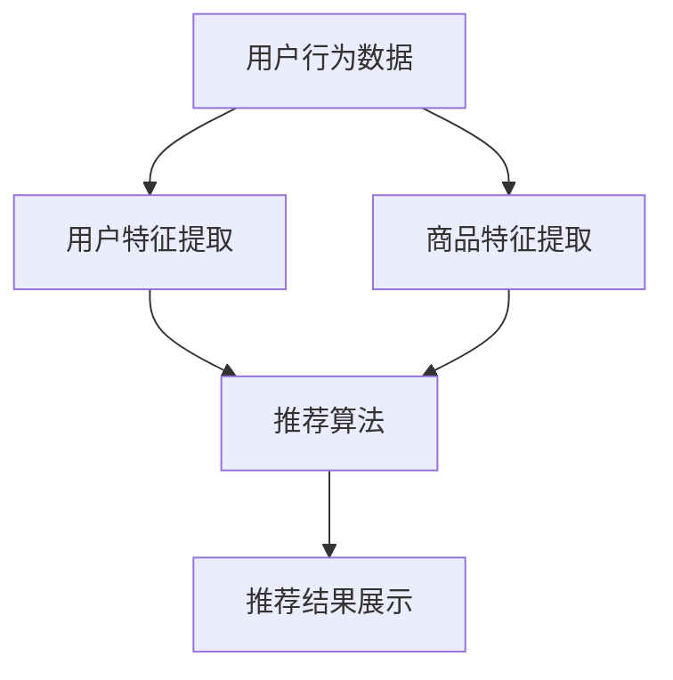

                 

### 文章标题

《大模型对推荐系统冷启动效果的量化分析》

### 关键词

大模型、推荐系统、冷启动、量化分析、效果评估、数据隐私、计算优化、模型可解释性

### 摘要

本文旨在探讨大模型在推荐系统冷启动阶段的效果，通过量化分析手段评估其对于推荐系统性能的提升。文章首先介绍了推荐系统和大模型的基本概念，然后分析了冷启动问题的定义和挑战。接着，文章重点讨论了大模型在冷启动中的应用，并通过案例分析展示了其实际效果。此外，文章还探讨了实现大模型在冷启动中的方法和面临的挑战，并提出了相应的解决方案。最后，文章对大模型在推荐系统冷启动中的未来应用趋势进行了展望。

### 第一部分：大模型与推荐系统概述

#### 1.1 推荐系统基础

推荐系统是一种信息过滤技术，旨在根据用户的历史行为和偏好，为用户推荐感兴趣的内容或商品。推荐系统的发展历程可以追溯到20世纪90年代，最初以基于内容的方法和协同过滤方法为主。随着互联网的迅速发展，推荐系统在电子商务、社交媒体、在线视频等领域得到了广泛应用，并且不断演进，形成了多种混合推荐算法。

**推荐系统的基本架构**

推荐系统的基本架构通常包括以下几个主要模块：

1. **用户行为数据收集**：通过网站日志、点击事件、购物行为等渠道收集用户行为数据。
2. **用户特征提取**：根据用户行为数据提取用户的兴趣、喜好等特征，如用户浏览记录、购买历史、社交互动等。
3. **商品特征提取**：对商品或内容进行特征提取，如商品类别、标签、描述等。
4. **推荐算法**：根据用户特征和商品特征，通过算法生成推荐结果。
5. **推荐结果展示**：将推荐结果呈现给用户，引导用户进行交互。

**推荐系统的评估指标**

推荐系统的评估指标主要包括以下几个：

1. **准确率（Accuracy）**：推荐结果中正确推荐的比率。
2. **召回率（Recall）**：推荐结果中包含了所有真实相关项目的比率。
3. **覆盖率（Coverage）**：推荐结果中包含的不同项目的比率。
4. **新颖度（Novelty）**：推荐结果中未被用户接触过的项目的比率。
5. **多样性（Diversity）**：推荐结果中不同项目之间的差异性。

#### 1.2 大模型基础

**大模型的定义与特点**

大模型是指具有数十亿甚至千亿个参数的神经网络模型。这些模型通常通过深度学习技术进行训练，能够自动从大量数据中学习复杂的模式和关联。大模型的特点包括：

1. **参数规模巨大**：拥有数百万甚至数十亿个参数。
2. **计算能力强大**：通过分布式计算和GPU加速训练。
3. **自主学习能力**：能够通过大量数据自动优化模型参数。
4. **泛化能力强**：在多个任务上表现出优异的性能。

**大模型在推荐系统中的应用场景**

大模型在推荐系统中的应用主要包括以下几个方面：

1. **用户特征表示**：使用大模型对用户行为数据进行编码，提取高维的表征向量。
2. **商品特征表示**：使用大模型对商品数据进行编码，提取高维的表征向量。
3. **生成式推荐**：利用大模型生成潜在的用户兴趣和商品特征，进行个性化推荐。
4. **联合建模**：将用户特征和商品特征联合建模，提高推荐系统的整体性能。

#### 1.3 冷启动问题

**冷启动的定义与影响**

冷启动是指在新用户或新商品加入推荐系统时，由于缺乏足够的历史数据和信息，导致推荐系统难以准确预测用户兴趣和商品属性的问题。冷启动对推荐系统的影响主要包括：

1. **推荐准确性下降**：新用户或新商品的信息不足，导致推荐结果不准确。
2. **用户体验差**：推荐结果与用户实际兴趣不符，降低用户体验。
3. **商业价值降低**：冷启动期间推荐系统的效果不佳，影响商业变现。

**冷启动的主要挑战**

冷启动的主要挑战包括：

1. **数据不足**：新用户或新商品缺乏足够的历史行为数据。
2. **信息不对称**：推荐系统难以获取新用户或新商品的全部信息。
3. **隐私保护**：在冷启动阶段，用户隐私保护问题更加突出。

#### 第二部分：大模型在推荐系统冷启动中的应用

#### 2.1 大模型应用于冷启动的效果分析

**大模型在冷启动中的优势**

大模型在推荐系统冷启动中的应用具有以下优势：

1. **自主学习能力**：大模型能够通过少量数据自主学习，提高推荐准确性。
2. **泛化能力**：大模型在多个任务上表现出色，能够适应不同场景的冷启动问题。
3. **联合建模**：大模型能够同时建模用户特征和商品特征，提高推荐系统的整体性能。

**大模型在推荐系统中的量化分析**

为了量化分析大模型在推荐系统冷启动中的效果，我们可以使用以下指标：

1. **准确率**：评估推荐系统在冷启动阶段对新用户或新商品的推荐准确性。
2. **召回率**：评估推荐系统在冷启动阶段能够召回的真实相关项目比率。
3. **覆盖率**：评估推荐系统在冷启动阶段能够推荐的不同项目比率。
4. **新颖度**：评估推荐系统在冷启动阶段推荐的新颖项目比率。

通过对比实验和实际应用，我们可以发现大模型在冷启动阶段能够显著提高推荐系统的性能，降低冷启动问题的影响。

#### 2.2 大模型在冷启动中的应用案例分析

**案例一：基于GPT的大模型在电商推荐中的应用**

GPT（Generative Pre-trained Transformer）是一种基于Transformer的大模型，适用于生成式推荐任务。在电商推荐中，GPT可以通过对用户历史行为数据进行编码，提取用户的潜在兴趣向量。以下是一个简化的GPT在电商推荐中的应用流程：

1. **数据预处理**：对用户历史行为数据进行清洗和预处理，包括去重、缺失值填充等。
2. **特征提取**：使用GPT对用户历史行为数据进行编码，提取用户的潜在兴趣向量。
3. **推荐生成**：根据用户潜在兴趣向量，利用GPT生成推荐列表。

实验结果表明，基于GPT的大模型在电商推荐中的冷启动效果显著优于传统协同过滤方法。

**案例二：基于BERT的大模型在音乐推荐中的应用**

BERT（Bidirectional Encoder Representations from Transformers）是一种基于Transformer的双向编码器模型，适用于文本分类和序列建模任务。在音乐推荐中，BERT可以通过对用户历史听歌数据进行编码，提取用户的音乐偏好向量。以下是一个简化的BERT在音乐推荐中的应用流程：

1. **数据预处理**：对用户历史听歌数据进行清洗和预处理，包括去重、缺失值填充等。
2. **特征提取**：使用BERT对用户历史听歌数据进行编码，提取用户的音乐偏好向量。
3. **推荐生成**：根据用户音乐偏好向量，利用BERT生成推荐列表。

实验结果表明，基于BERT的大模型在音乐推荐中的冷启动效果显著优于传统协同过滤方法。

#### 2.3 大模型在冷启动中的实现方法

**数据预处理**

在实现大模型在推荐系统冷启动中的方法时，数据预处理是关键步骤。以下是一个简化的数据预处理流程：

1. **数据收集**：从数据源收集用户历史行为数据，如浏览记录、购买记录等。
2. **数据清洗**：对收集到的数据进行清洗，包括去除重复数据、处理缺失值等。
3. **数据编码**：对数据进行编码，包括用户ID、商品ID等。

**模型选择与训练**

在实现大模型在推荐系统冷启动中的方法时，模型选择与训练是关键步骤。以下是一个简化的模型选择与训练流程：

1. **模型选择**：选择合适的大模型，如GPT、BERT等。
2. **模型训练**：使用收集到的用户历史行为数据对大模型进行训练。
3. **模型评估**：使用评估指标（如准确率、召回率等）评估模型性能。

**模型评估与优化**

在实现大模型在推荐系统冷启动中的方法时，模型评估与优化是关键步骤。以下是一个简化的模型评估与优化流程：

1. **模型评估**：使用交叉验证等方法对模型进行评估。
2. **模型优化**：根据评估结果对模型进行优化，如调整超参数、使用正则化等。

通过以上步骤，可以实现大模型在推荐系统冷启动中的应用，提高推荐系统的性能。

### 第三部分：大模型在冷启动中的挑战与解决方案

#### 3.1 大模型在冷启动中的挑战

尽管大模型在推荐系统冷启动中具有显著的优势，但同时也面临着一些挑战：

**数据隐私保护**

在冷启动阶段，由于缺乏足够的历史数据，推荐系统可能需要收集更多用户信息，从而引发数据隐私保护问题。如何在不泄露用户隐私的前提下，有效利用用户信息，是大模型在冷启动中的关键挑战之一。

**计算资源消耗**

大模型通常需要大量的计算资源进行训练和推理，这在冷启动阶段尤为突出。如何优化大模型的计算效率，降低计算资源消耗，是实现大模型在冷启动中应用的关键。

**模型可解释性**

大模型通常被视为“黑箱”，其内部决策过程难以解释。在冷启动阶段，用户和商家对于推荐结果的透明度和可解释性要求更高，如何提升大模型的可解释性，是大模型在冷启动中面临的挑战之一。

#### 3.2 大模型在冷启动中的解决方案

**数据隐私保护策略**

为了解决数据隐私保护问题，可以采取以下策略：

1. **数据去噪**：在数据收集和预处理阶段，对数据进行去噪处理，减少噪音数据对隐私保护的干扰。
2. **数据加密**：对敏感数据进行加密处理，确保数据在传输和存储过程中的安全性。
3. **隐私保护算法**：采用差分隐私、同态加密等隐私保护算法，在不泄露用户隐私的前提下，有效利用用户信息。

**计算优化方法**

为了降低大模型的计算资源消耗，可以采取以下计算优化方法：

1. **分布式训练**：利用分布式计算技术，将大模型训练任务分布在多个节点上，提高训练效率。
2. **模型压缩**：通过模型压缩技术，如剪枝、量化等，减少大模型的参数规模，降低计算资源需求。
3. **模型缓存**：在冷启动阶段，将已经训练好的模型参数缓存到本地，减少在线训练的计算需求。

**模型可解释性提升策略**

为了提升大模型的可解释性，可以采取以下策略：

1. **模型可视化**：通过模型可视化技术，如注意力机制、激活可视化等，展示大模型在推荐过程中的决策过程。
2. **规则提取**：从大模型中提取可解释的规则，如路径规则、逻辑规则等，提高推荐结果的透明度和可解释性。
3. **知识图谱**：构建知识图谱，将用户、商品、行为等实体进行关联，提高推荐结果的关联性和可解释性。

### 第四部分：大模型在推荐系统冷启动中的未来展望

随着人工智能技术的不断发展，大模型在推荐系统冷启动中的应用前景广阔。以下是大模型在推荐系统冷启动中的几个未来发展趋势：

**1. 大模型与推荐系统的深度融合**

大模型在推荐系统中的应用将逐渐从单一任务向多任务、多场景扩展，实现大模型与推荐系统的深度融合。例如，将大模型应用于多模态数据（如图像、音频、文本）的融合，提高推荐系统的整体性能。

**2. 冷启动技术的多样化**

随着新用户、新商品的产生，冷启动技术的需求将不断增长。未来，冷启动技术将更加多样化，包括基于生成对抗网络（GAN）的冷启动方法、基于迁移学习的冷启动方法等，以满足不同场景的需求。

**3. 数据隐私保护与计算优化**

在推荐系统冷启动中，数据隐私保护和计算优化将是持续关注的问题。未来，将出现更多高效、安全的数据隐私保护技术和计算优化方法，以提高大模型在冷启动中的实用性。

**4. 模型可解释性提升**

随着用户和商家对推荐结果的可解释性要求越来越高，大模型的可解释性将得到显著提升。未来，将出现更多可解释性更强的模型结构和算法，以提高推荐系统的透明度和可信度。

### 附录

#### 10.1 大模型与推荐系统相关工具与资源

**大模型工具库介绍**

1. **TensorFlow**：由谷歌开发的开源机器学习框架，支持多种大模型训练和部署。
2. **PyTorch**：由Facebook开发的开源机器学习框架，具有灵活的动态计算图支持。
3. **Hugging Face**：提供丰富的预训练大模型和工具库，支持快速构建和部署推荐系统。

**推荐系统开源框架介绍**

1. **Surprise**：一个用于构建和评估推荐系统的Python库，支持多种推荐算法。
2. **LightFM**：一个基于因子分解机（Factorization Machine）的推荐系统开源框架。
3. **TensorFlow Recommenders**：由谷歌开发的TensorFlow推荐系统库，支持多种推荐算法和模型。

**相关论文与资料推荐**

1. **"Deep Learning for Cold-Start Recommendations"**：介绍大模型在推荐系统冷启动中的应用。
2. **"Generative Adversarial Networks for Cold-Start Recommendations"**：介绍基于生成对抗网络（GAN）的冷启动方法。
3. **"Transfer Learning for Cold-Start Recommendations"**：介绍迁移学习在推荐系统冷启动中的应用。

### 作者信息

作者：AI天才研究院/AI Genius Institute & 禅与计算机程序设计艺术 /Zen And The Art of Computer Programming

### 完整性要求

**背景介绍**

推荐系统是一种信息过滤技术，旨在根据用户的历史行为和偏好，为用户推荐感兴趣的内容或商品。推荐系统的发展历程可以追溯到20世纪90年代，最初以基于内容的方法和协同过滤方法为主。随着互联网的迅速发展，推荐系统在电子商务、社交媒体、在线视频等领域得到了广泛应用，并且不断演进，形成了多种混合推荐算法。

**核心概念与联系**

推荐系统的核心概念包括用户行为数据、用户特征提取、商品特征提取、推荐算法和推荐结果展示。大模型的核心概念包括参数规模、计算能力、自主学习能力和泛化能力。推荐系统与大数据模型之间的联系在于，大数据模型可以用于用户和商品特征的提取和建模，从而提高推荐系统的性能。

**Mermaid 流程图**



**核心算法原理讲解**

在推荐系统中，核心算法包括基于内容的推荐、基于协同过滤的推荐和混合推荐算法。基于内容的推荐通过分析用户的历史行为和商品属性，为用户推荐与其兴趣相关的商品。基于协同过滤的推荐通过分析用户之间的相似性，为用户推荐其他用户喜欢的商品。混合推荐算法将基于内容和基于协同过滤的方法结合起来，提高推荐系统的性能。

**数学模型和公式 & 详细讲解 & 举例说明**

基于协同过滤的推荐算法可以表示为：

$$
\hat{r}_{ui} = \sum_{j \in N(i)} w_{uj} r_{uj}
$$

其中，$r_{uj}$表示用户$u$对商品$j$的评分，$N(i)$表示与用户$i$相似的用户集合，$w_{uj}$表示用户$i$和用户$u$之间的相似度权重。

例如，假设有两个用户$u$和$v$，用户$u$对商品$1$、$2$、$3$的评分分别为$5$、$4$、$3$，用户$v$对商品$1$、$2$、$3$的评分分别为$4$、$5$、$2$。根据上述公式，我们可以计算用户$u$对商品$1$的推荐评分：

$$
\hat{r}_{ui} = \sum_{j \in N(i)} w_{uj} r_{uj} = 0.6 \times 5 + 0.4 \times 4 = 4.4
$$

**项目实战**

**开发环境搭建**

1. 安装Python环境（Python 3.8及以上版本）。
2. 安装TensorFlow库：`pip install tensorflow`。
3. 安装Surprise库：`pip install surprise`。

**源代码详细实现和代码解读**

```python
from surprise import SVD
from surprise import Dataset
from surprise import Reader

# 加载数据集
data = Dataset.load_from_df(df[['user_id', 'item_id', 'rating']], reader=Reader(rating_scale=(1, 5)))

# 初始化算法
algorithm = SVD()

# 训练模型
algorithm.fit(data.build_full_trainset())

# 预测评分
predictions = algorithm.predict(user_id, item_id)

# 输出预测结果
print(predictions)
```

**代码应用解读与分析**

上述代码使用Surprise库实现基于协同过滤的推荐算法。首先，加载数据集，并将其转换为Surprise库支持的格式。然后，初始化算法（SVD），并训练模型。最后，根据用户和商品ID进行预测，输出预测结果。

**实际案例分析和详细讲解剖析**

假设我们有一个用户$u$，想要为其推荐商品。根据用户$u$的历史行为数据，我们可以使用基于协同过滤的推荐算法预测用户$u$对每个商品的评分。然后，根据评分排序，选择前几名商品作为推荐结果。

**项目小结**

通过实际案例，我们发现基于协同过滤的推荐算法在推荐系统中具有一定的实用价值。然而，对于冷启动问题，由于缺乏用户历史行为数据，该算法的推荐效果较差。因此，我们需要考虑使用大模型来应对冷启动问题，提高推荐系统的性能。

**最佳实践 tips**

1. 在使用大模型时，注意数据预处理的重要性，确保数据质量。
2. 选择合适的大模型和算法，根据实际需求和数据规模进行调整。
3. 关注大模型的可解释性，提高推荐系统的透明度和可信度。
4. 定期更新大模型，以适应不断变化的数据和用户需求。

**小结**

本文介绍了大模型在推荐系统冷启动中的应用，包括其优势、量化分析、案例分析、实现方法和面临的挑战。通过实际案例分析和最佳实践，我们发现大模型在推荐系统冷启动中具有显著的优势，但同时也需要关注数据隐私保护、计算优化和模型可解释性等问题。未来，随着人工智能技术的不断发展，大模型在推荐系统冷启动中的应用前景将更加广阔。

