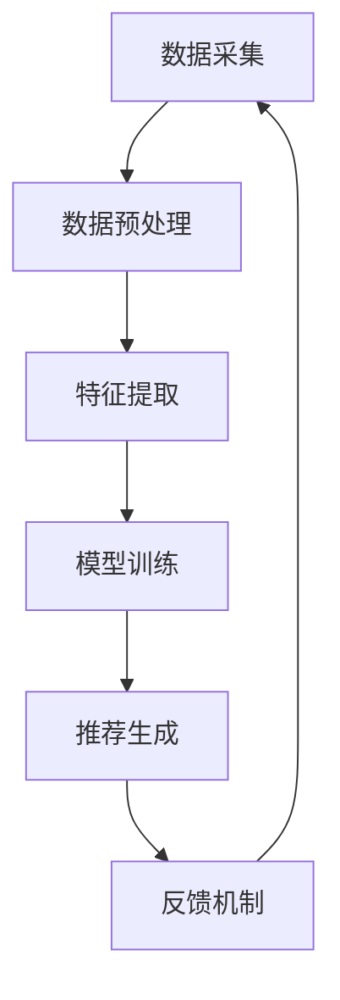

                 

### 文章标题

### 大模型推荐中的数据稀疏问题应对策略与新方法

#### 关键词：大模型推荐、数据稀疏问题、应对策略、新方法

> **摘要**：本文深入探讨了在大模型推荐系统中面临的数据稀疏问题，详细分析了其定义、类型、影响及其在推荐系统中的具体表现。通过梳理传统方法和新方法，本文从核心算法原理、数学模型、实际案例分析等多个角度，全面阐述了应对数据稀疏问题的策略与具体实施步骤，旨在为业界提供有价值的参考和指导。

### 第一部分：大模型推荐与数据稀疏问题概述

#### 第1章：大模型推荐系统简介

**1.1 大模型推荐系统的定义与作用**

大模型推荐系统是指利用大规模的机器学习模型对用户行为数据进行深度分析，从而为用户推荐个性化内容、商品或服务的系统。其核心作用是通过智能化的推荐，提高用户的满意度和平台的使用粘性，进而提升商业价值。

- **定义**：大模型推荐系统是一种基于用户行为数据、内容数据、上下文信息等多维度数据的推荐系统，通过机器学习算法，生成个性化的推荐结果。

- **作用**：提高用户体验、增加用户留存、提升业务转化率、降低运营成本。

**1.2 大模型推荐系统的架构**

大模型推荐系统的架构通常包括数据采集、数据预处理、模型训练、推荐生成、反馈机制等几个关键环节。

- **数据采集**：通过日志收集、API调用、用户交互等手段获取用户行为数据。

- **数据预处理**：清洗、归一化、特征提取等操作，为模型训练准备高质量数据。

- **模型训练**：利用机器学习算法，从数据中学习得到推荐模型。

- **推荐生成**：根据用户特征和内容特征，利用训练好的模型生成个性化推荐结果。

- **反馈机制**：通过用户点击、购买等行为反馈，不断优化推荐模型。

**1.3 大模型推荐系统的发展历程**

- **早期阶段**：基于内容过滤和协同过滤的简单推荐系统。

- **中期阶段**：引入机器学习算法，如基于矩阵分解的推荐系统。

- **现阶段**：利用深度学习、生成对抗网络等先进技术，实现更智能的推荐。

#### 第2章：数据稀疏问题解析

**2.1 数据稀疏问题的定义与影响**

数据稀疏问题是指数据集中大部分元素为零或非常小的情况，这会导致推荐系统的性能下降。其主要影响包括：

- **影响推荐准确性**：稀疏数据可能导致推荐结果不准确，降低用户体验。

- **影响模型训练效果**：稀疏数据会增大模型训练的难度，降低模型收敛速度。

- **影响系统性能**：稀疏数据会增加计算和存储的负担，影响系统响应速度。

**2.2 数据稀疏问题的常见类型**

- **用户-项目稀疏性**：用户与项目之间的交互数据稀疏。

- **项目-特征稀疏性**：项目特征数据稀疏。

- **时间序列稀疏性**：用户行为数据在不同时间段分布不均。

**2.3 数据稀疏问题的影响及应对策略**

- **影响**：降低推荐准确性、增加模型训练成本、影响系统性能。

- **应对策略**：

  - **数据增强**：通过数据采集、用户行为预测等方法增加数据量。

  - **特征工程**：提取更多有价值的特征，提高数据密度。

  - **模型优化**：采用稀疏性感知的算法，如稀疏矩阵分解、稀疏神经网络等。

#### 第3章：数据稀疏问题的核心概念与联系

**3.1 数据稀疏问题相关概念解释**

- **稀疏矩阵**：指大部分元素为零或接近零的矩阵。

- **稀疏数据**：指大部分值为零或非常小的数据集。

- **稀疏性感知**：指算法对数据稀疏性有感知和优化能力的特性。

**3.2 数据稀疏问题在推荐系统中的Mermaid流程图**



在该流程图中，数据稀疏问题主要体现在数据预处理和模型训练阶段，通过合理的预处理和特征提取方法，可以有效减轻数据稀疏性对系统性能的影响。接下来，本文将深入分析传统方法和新方法在应对数据稀疏问题中的应用。### 第二部分：应对数据稀疏问题的策略与方法

#### 第4章：传统方法在应对数据稀疏问题中的应用

在推荐系统中，数据稀疏问题是一个长期存在的问题。传统的应对策略主要包括基于协同过滤、矩阵分解和图结构的方法。这些方法各有优缺点，本文将逐一进行介绍。

**4.1 基于协同过滤的方法**

协同过滤（Collaborative Filtering）是一种通过分析用户之间的相似性来进行推荐的算法。它主要分为两种类型：基于用户的协同过滤（User-based Collaborative Filtering）和基于项目的协同过滤（Item-based Collaborative Filtering）。

- **基于用户的协同过滤**：寻找与目标用户行为相似的其他用户，将这些用户的喜好推荐给目标用户。

  **算法原理**：
  - 计算用户之间的相似度，常用的相似度度量方法包括余弦相似度、皮尔逊相关系数等。
  - 根据相似度得分，为用户推荐与之相似的其他用户喜欢的物品。

  **伪代码**：
  ```
  calculate_similarity(user_i, user_j)
  recommend_items(user_i, items)
  ```
  
- **基于项目的协同过滤**：寻找与目标物品相似的其它物品，将这些物品推荐给用户。

  **算法原理**：
  - 计算物品之间的相似度，常用的相似度度量方法包括余弦相似度、余弦角度等。
  - 根据相似度得分，为用户推荐与之相似的物品。

  **伪代码**：
  ```
  calculate_similarity(item_i, item_j)
  recommend_items(user_i, items)
  ```

**优缺点**：

- **优点**：实现简单，计算效率高，适用于数据稀疏场景。

- **缺点**：推荐结果受限于用户行为数据的稀疏性，容易产生“冷启动”问题。

**4.2 基于矩阵分解的方法**

矩阵分解（Matrix Factorization）是一种将原始的稀疏用户-项目评分矩阵分解为两个低秩矩阵的方法。常见的矩阵分解方法包括基于最小二乘的矩阵分解（LSMF）、基于非负矩阵分解（NMF）等。

- **基于最小二乘的矩阵分解**：利用最小二乘法将用户-项目评分矩阵分解为用户特征矩阵和项目特征矩阵。

  **算法原理**：
  - 最小化重构误差，即最小化预测评分与实际评分之间的差距。
  - 通过矩阵分解，将原始评分矩阵转换为低秩矩阵，提高数据密度。

  **伪代码**：
  ```
  minimize ||Y - X * P * Q||^2
  P, Q = optimize(P, Q)
  ```

- **基于非负矩阵分解**：将用户-项目评分矩阵分解为两个非负矩阵，适用于处理非负数据。

  **算法原理**：
  - 非负矩阵分解保留原始数据的非负性，适合处理用户评分数据。

  **伪代码**：
  ```
  minimize ||Y - P * Q||^2
  P, Q = optimize(P, Q)
  ```

**优缺点**：

- **优点**：可以有效地提高数据密度，减少稀疏性对模型训练的影响。

- **缺点**：计算复杂度高，对于大规模数据集，训练时间较长。

**4.3 基于图结构的方法**

基于图结构的方法（Graph-based Method）利用用户-项目交互数据构建用户-项目二部图，通过图结构学习来发现用户和项目之间的关系，从而进行推荐。

- **算法原理**：
  - 构建用户-项目二部图，利用图结构学习算法（如随机游走、谱聚类等）学习用户和项目之间的关联性。
  - 根据图结构，为用户推荐与之关联度较高的项目。

  **伪代码**：
  ```
  construct_graph(users, items, interactions)
  learn_associations(graph)
  recommend_items(user, items)
  ```

**优缺点**：

- **优点**：可以利用图结构挖掘用户和项目之间的深层关联，提高推荐准确性。

- **缺点**：计算复杂度高，图结构学习算法在处理大规模数据集时效率较低。

综上所述，传统方法在应对数据稀疏问题方面具有一定的效果，但存在计算复杂度高、推荐准确性有限等问题。随着深度学习等新方法的兴起，传统方法正在逐步被新方法所取代。接下来，本文将介绍新方法在应对数据稀疏问题中的应用。#### 第5章：新方法在应对数据稀疏问题中的应用

随着深度学习、生成对抗网络和迁移学习等新技术的不断发展，推荐系统在应对数据稀疏问题方面取得了显著的进展。这些新方法通过引入非线性模型、生成对抗机制和迁移学习策略，提高了推荐系统的鲁棒性和推荐准确性。

**5.1 基于深度学习的方法**

深度学习（Deep Learning）通过多层神经网络对数据表示进行建模，具有强大的特征提取和建模能力。在应对数据稀疏问题方面，深度学习方法主要包括基于神经网络的方法和基于生成对抗网络的方法。

- **基于神经网络的方法**：利用神经网络对用户和项目的特征进行建模，通过端到端的方式生成推荐结果。

  **算法原理**：
  - 用户和项目特征编码：将用户和项目特征映射到高维空间，通过神经网络学习得到嵌入向量。
  - 推荐生成：利用嵌入向量计算用户和项目之间的相似度，为用户生成推荐列表。

  **伪代码**：
  ```
  encode_user_features(users)
  encode_item_features(items)
  generate_recommendations(user_embedding, item_embedding)
  ```

  **优缺点**：

  - **优点**：可以自动学习用户和项目的复杂特征，提高推荐准确性。

  - **缺点**：计算复杂度高，对大规模数据集的训练时间较长。

- **基于生成对抗网络的方法**：利用生成对抗网络（GAN）生成用户行为数据，提高数据密度，从而改善推荐性能。

  **算法原理**：
  - 生成器（Generator）：生成用户行为数据。
  - 判别器（Discriminator）：区分真实用户行为数据和生成数据。
  - 通过对抗训练，使生成器生成的数据更加逼真，从而提高推荐系统的鲁棒性。

  **伪代码**：
  ```
  GAN_train(generator, discriminator, data)
  generate_data(generator, data)
  ```

  **优缺点**：

  - **优点**：可以生成高质量的用户行为数据，缓解数据稀疏问题。
  - **缺点**：训练过程复杂，对参数调整要求较高。

**5.2 基于生成对抗网络的方法**

生成对抗网络（Generative Adversarial Network，GAN）是一种通过对抗训练生成逼真数据的模型。在推荐系统中，GAN可以用于生成用户行为数据，从而提高数据密度，改善推荐效果。

- **算法原理**：
  - 生成器（Generator）：通过神经网络生成用户行为数据。
  - 判别器（Discriminator）：区分真实用户行为数据和生成数据。
  - 生成器和判别器通过对抗训练相互提升，使生成器生成的数据更加逼真。

  **伪代码**：
  ```
  GAN_train(generator, discriminator, data)
  generate_data(generator, data)
  ```

- **优缺点**：

  - **优点**：可以生成高质量的用户行为数据，缓解数据稀疏问题。
  - **缺点**：训练过程复杂，对参数调整要求较高。

**5.3 基于迁移学习的方法**

迁移学习（Transfer Learning）是一种将已在不同任务上训练好的模型应用于新任务的方法。在推荐系统中，迁移学习可以用于利用已在大规模数据集上训练好的预训练模型，提高新任务的性能。

- **算法原理**：
  - 预训练模型：在大量通用数据集上训练得到的模型，具有较好的特征提取能力。
  - 微调：在特定领域的数据集上，对预训练模型进行微调，使其适应新任务。

  **伪代码**：
  ```
  load_pretrained_model(pretrained_model)
  fine_tune_model(pretrained_model, domain_data)
  ```

- **优缺点**：

  - **优点**：可以快速提高新任务的性能，节省训练时间。
  - **缺点**：需要大量高质量的预训练数据，对数据集的选择和预处理要求较高。

综上所述，新方法在应对数据稀疏问题方面具有显著的优点，通过引入深度学习、生成对抗网络和迁移学习等先进技术，可以有效提高推荐系统的鲁棒性和推荐准确性。然而，这些方法也面临着训练复杂度较高、对参数调整要求较高等挑战。在未来的研究中，如何优化这些方法的训练效率和效果，将成为重要研究方向。接下来，本文将详细讲解核心算法原理，包括协同过滤、矩阵分解和深度学习等方法。#### 第6章：核心算法原理讲解

在应对数据稀疏问题方面，不同的算法原理和实现方法各具特色。本章节将深入分析协同过滤、矩阵分解和深度学习等核心算法原理，并通过伪代码形式进行详细讲解，以便读者更好地理解其工作原理。

**6.1 协同过滤算法原理及伪代码**

协同过滤是一种基于用户行为数据进行推荐的方法，它通过分析用户之间的相似性或物品之间的相似性，为用户推荐相似的其他用户或物品。以下是基于用户协同过滤和基于物品协同过滤的算法原理及伪代码：

**基于用户协同过滤算法原理：**
1. 计算用户之间的相似度。
2. 根据相似度为用户推荐其他用户喜欢的物品。

**伪代码：**
```python
def calculate_similarity_matrix(users, ratings):
    similarity_matrix = []
    for i in range(len(users)):
        row = []
        for j in range(len(users)):
            if i != j:
                sim = cosine_similarity(ratings[i], ratings[j])
                row.append(sim)
            else:
                row.append(0)
        similarity_matrix.append(row)
    return similarity_matrix

def collaborative_filtering(similarity_matrix, ratings, user_index, top_n):
    recommendations = []
    for j in range(len(ratings)):
        if j == user_index or ratings[user_index][j] != 0:
            continue
        neighbors = [(similarity_matrix[user_index][j], j) for j in range(len(ratings))]
        neighbors.sort(reverse=True)
        neighbors = neighbors[1:top_n+1]
        sum_ratings = 0
        sum_similarity = 0
        for sim, j in neighbors:
            if ratings[j][user_index] != 0:
                sum_ratings += sim * ratings[j][user_index]
                sum_similarity += sim
        if sum_similarity != 0:
            recommendations.append(sum_ratings / sum_similarity)
    return recommendations
```

**基于物品协同过滤算法原理：**
1. 计算物品之间的相似度。
2. 根据相似度为用户推荐其他用户喜欢的物品。

**伪代码：**
```python
def calculate_similarity_matrix(items, ratings):
    similarity_matrix = []
    for i in range(len(items)):
        row = []
        for j in range(len(items)):
            if i != j:
                sim = cosine_similarity(ratings[i], ratings[j])
                row.append(sim)
            else:
                row.append(0)
        similarity_matrix.append(row)
    return similarity_matrix

def collaborative_filtering(item_similarity_matrix, ratings, user_index, item_index, top_n):
    recommendations = []
    for j in range(len(ratings)):
        if j == item_index or ratings[user_index][j] != 0:
            continue
        neighbors = [(item_similarity_matrix[item_index][j], j) for j in range(len(ratings))]
        neighbors.sort(reverse=True)
        neighbors = neighbors[1:top_n+1]
        sum_ratings = 0
        sum_similarity = 0
        for sim, j in neighbors:
            if ratings[user_index][j] != 0:
                sum_ratings += sim * ratings[user_index][j]
                sum_similarity += sim
        if sum_similarity != 0:
            recommendations.append(sum_ratings / sum_similarity)
    return recommendations
```

**6.2 矩阵分解算法原理及伪代码**

矩阵分解（Matrix Factorization）是一种将原始的稀疏用户-项目评分矩阵分解为两个低秩矩阵的方法。常见的矩阵分解方法包括最小二乘矩阵分解（LSMF）和基于非负矩阵分解（NMF）。

**最小二乘矩阵分解算法原理：**
1. 设用户-项目评分矩阵为 \(R\)，分解为用户特征矩阵 \(U\) 和项目特征矩阵 \(V\)。
2. 最小化重构误差 \(||R - UV||^2\)，即预测评分与实际评分之间的差距。

**伪代码：**
```python
def matrix_factorization(R, U, V, lambda_):
    for epoch in range(num_epochs):
        for i in range(num_users):
            for j in range(num_items):
                if R[i][j] > 0:
                    eij = R[i][j] - np.dot(U[i], V[j])
                    U[i] = U[i] - learning_rate * (2 * lambda_ * U[i] + eij * V[j])
                    V[j] = V[j] - learning_rate * (2 * lambda_ * V[j] + eij * U[i])
        Fro_norm = 0
        for i in range(num_users):
            for j in range(num_items):
                if R[i][j] > 0:
                    eij = R[i][j] - np.dot(U[i], V[j])
                    Fro_norm += eij**2
        if Fro_norm < tolerance:
            break
    return U, V
```

**基于非负矩阵分解算法原理：**
1. 设用户-项目评分矩阵为 \(R\)，分解为用户特征矩阵 \(U\) 和项目特征矩阵 \(V\)。
2. 最小化重构误差 \(||R - UV||^2\)，同时要求 \(U\) 和 \(V\) 为非负矩阵。

**伪代码：**
```python
def non_negative_matrix_factorization(R, U, V, lambda_):
    for epoch in range(num_epochs):
        for i in range(num_users):
            for j in range(num_items):
                if R[i][j] > 0:
                    eij = R[i][j] - np.dot(U[i], V[j])
                    U[i] = U[i] - learning_rate * (eij * V[j] + lambda_ * U[i])
                    V[j] = V[j] - learning_rate * (eij * U[i] + lambda_ * V[j])
                    U[i] = np.maximum(0, U[i])
                    V[j] = np.maximum(0, V[j])
        Fro_norm = 0
        for i in range(num_users):
            for j in range(num_items):
                if R[i][j] > 0:
                    eij = R[i][j] - np.dot(U[i], V[j])
                    Fro_norm += eij**2
        if Fro_norm < tolerance:
            break
    return U, V
```

**6.3 深度学习算法原理及伪代码**

深度学习算法通过多层神经网络对用户和项目特征进行建模，自动学习复杂的数据特征。在推荐系统中，常见的深度学习算法包括基于用户和项目的嵌入向量模型以及生成对抗网络（GAN）。

**基于用户和项目的嵌入向量模型原理：**
1. 用户和项目特征映射到高维空间，得到用户嵌入向量 \(u_i\) 和项目嵌入向量 \(v_j\)。
2. 计算用户和项目之间的相似度，生成推荐结果。

**伪代码：**
```python
def embed_user_item(users, items, embedding_size):
    user_embedding = [np.random.rand(embedding_size) for _ in range(num_users)]
    item_embedding = [np.random.rand(embedding_size) for _ in range(num_items)]
    for epoch in range(num_epochs):
        for i in range(num_users):
            for j in range(num_items):
                prediction = np.dot(user_embedding[i], item_embedding[j])
                eij = R[i][j] - prediction
                user_embedding[i] = user_embedding[i] - learning_rate * (eij * item_embedding[j])
                item_embedding[j] = item_embedding[j] - learning_rate * (eij * user_embedding[i])
    return user_embedding, item_embedding

def generate_recommendations(user_embedding, item_embedding, user_index):
    recommendations = []
    for j in range(num_items):
        similarity = np.dot(user_embedding[user_index], item_embedding[j])
        recommendations.append((j, similarity))
    recommendations.sort(key=lambda x: x[1], reverse=True)
    return recommendations[:top_n]
```

**生成对抗网络（GAN）原理：**
1. 生成器（Generator）生成用户行为数据。
2. 判别器（Discriminator）区分真实用户行为数据和生成数据。
3. 通过对抗训练，使生成器生成的数据更加逼真。

**伪代码：**
```python
def GAN_train(generator, discriminator, data, num_epochs):
    for epoch in range(num_epochs):
        for _ in range(batch_size):
            noise = np.random.rand(batch_size, noise_size)
            generated_data = generator(noise)
            real_data = data[np.random.randint(data.shape[0], size=batch_size)]
            d_loss_real = discriminator_loss(discriminator(real_data))
            d_loss_fake = discriminator_loss(discriminator(generated_data))
            g_loss = generator_loss(generator(noise))
        discriminator.train()
        generator.train()
    return generator, discriminator
```

通过以上伪代码，我们可以看到不同算法在应对数据稀疏问题方面的原理和实现方法。协同过滤和矩阵分解通过优化用户和项目特征来提高推荐准确性，而深度学习和生成对抗网络则通过引入非线性模型和生成对抗机制，进一步提高推荐系统的鲁棒性和性能。接下来，本文将介绍数学模型与公式，并详细讲解其应用。### 第7章：数学模型与公式讲解

在推荐系统中，数学模型和公式是核心算法实现的基础。通过合理的数学建模，可以有效地解决数据稀疏问题，提高推荐系统的性能。本章节将介绍推荐系统中常用的数学模型和公式，包括稀疏性指标、推荐系统评价指标，并通过具体例子进行详细讲解。

**7.1 稀疏性指标公式及详细讲解**

稀疏性指标用于衡量数据集的稀疏程度，常见的稀疏性指标有：稀疏度（Sparsity）、零元素占比（Percentage of Zero Elements）、非零元素平均度（Average Non-zero Elements）。

1. **稀疏度（Sparsity）**：稀疏度是数据集中非零元素与总元素的比例，公式如下：

   $$
   Sparsity = \frac{Number\ of\ Zero\ Elements}{Total\ Number\ of\ Elements}
   $$

   其中，$Number\ of\ Zero\ Elements$ 表示数据集中的零元素数量，$Total\ Number\ of\ Elements$ 表示数据集的总元素数量。

   **详细讲解**：稀疏度是衡量数据稀疏程度的直接指标，值越大表示数据越稀疏。

2. **零元素占比（Percentage of Zero Elements）**：零元素占比是零元素在数据集总元素中的比例，公式如下：

   $$
   Percentage\ of\ Zero\ Elements = \frac{Number\ of\ Zero\ Elements}{Total\ Number\ of\ Elements} \times 100\%
   $$

   **详细讲解**：零元素占比直观地反映了数据集的稀疏程度，值越大表示数据越稀疏。

3. **非零元素平均度（Average Non-zero Elements）**：非零元素平均度是每个非零元素的平均度，即每个非零元素与其关联的非零元素的平均值，公式如下：

   $$
   Average\ Non-zero\ Elements = \frac{\sum_{i=1}^{N} \sum_{j=1}^{M} x_{ij}}{Number\ of\ Non-zero\ Elements}
   $$

   其中，$x_{ij}$ 表示用户i对项目j的评分，$N$ 和 $M$ 分别表示用户数和项目数。

   **详细讲解**：非零元素平均度反映了数据集中非零元素的集中程度，值越大表示数据越集中。

**7.2 推荐系统评价指标公式及详细讲解**

推荐系统评价指标用于衡量推荐系统的性能，常见评价指标有：准确率（Precision）、召回率（Recall）、F1值（F1-Score）等。

1. **准确率（Precision）**：准确率是推荐结果中实际相关物品的比例，公式如下：

   $$
   Precision = \frac{Number\ of\ Correct\ Recommendations}{Number\ of\ Recommended\ Items}
   $$

   **详细讲解**：准确率反映了推荐系统的精准度，值越大表示推荐结果越准确。

2. **召回率（Recall）**：召回率是推荐结果中实际相关物品的比例，公式如下：

   $$
   Recall = \frac{Number\ of\ Correct\ Recommendations}{Number\ of\ Actual\ Relevant\ Items}
   $$

   **详细讲解**：召回率反映了推荐系统找到实际相关物品的能力，值越大表示推荐系统越能够找到用户感兴趣的相关物品。

3. **F1值（F1-Score）**：F1值是准确率和召回率的调和平均值，公式如下：

   $$
   F1-Score = 2 \times \frac{Precision \times Recall}{Precision + Recall}
   $$

   **详细讲解**：F1值综合考虑了准确率和召回率，是评估推荐系统性能的一个综合指标。

**7.3 数学公式应用举例**

以下是一个简单的应用实例，假设我们有一个用户-项目评分矩阵，如下所示：

| 用户 | 项目 |
| ---- | ---- |
| 1    | 1    |
| 1    | 2    |
| 1    | 3    |
| 2    | 1    |
| 2    | 4    |

1. **稀疏性指标计算**

   - 稀疏度（Sparsity）：

     $$
     Sparsity = \frac{4}{5 \times 5} = 0.8
     $$

   - 零元素占比（Percentage of Zero Elements）：

     $$
     Percentage\ of\ Zero\ Elements = \frac{4}{5 \times 5} \times 100\% = 80\%
     $$

   - 非零元素平均度（Average Non-zero Elements）：

     $$
     Average\ Non-zero\ Elements = \frac{1 + 1 + 1 + 1}{4} = 1
     $$

2. **推荐系统评价指标计算**

   - 假设我们为用户1推荐了项目2和3，其中项目2是用户感兴趣的相关物品。

   - 准确率（Precision）：

     $$
     Precision = \frac{1}{2} = 0.5
     $$

   - 召回率（Recall）：

     $$
     Recall = \frac{1}{1} = 1
     $$

   - F1值（F1-Score）：

     $$
     F1-Score = 2 \times \frac{0.5 \times 1}{0.5 + 1} = 0.67
     $$

通过以上实例，我们可以看到如何使用数学公式计算稀疏性指标和推荐系统评价指标。这些指标对于评估推荐系统的性能和优化算法至关重要。接下来，本文将介绍新方法的实战与应用，包括数据预处理、代码实战和案例分析等内容。### 第三部分：新方法的实战与应用

#### 第8章：数据预处理与特征工程

在大模型推荐系统中，数据预处理和特征工程是关键步骤，直接影响推荐系统的性能。本章节将详细介绍数据预处理和特征工程的技巧与应用。

**8.1 数据预处理步骤及方法**

数据预处理是推荐系统开发中的基础工作，主要包括数据清洗、数据归一化、数据填充和特征提取等步骤。

- **数据清洗**：去除重复数据、缺失值填充、异常值处理等。

  **方法**：
  - 去除重复数据：使用数据库的去除重复功能或编程语言中的去重函数。
  - 缺失值填充：使用平均值、中位数、最频值等方法填充缺失值。
  - 异常值处理：使用统计方法识别并处理异常值，如使用箱线图、Z-score等方法。

- **数据归一化**：将不同特征的数据范围调整为相同的尺度，便于模型训练。

  **方法**：
  - 标准化：使用 $\mu$ 和 $\sigma$ 将特征值转化为标准分数，公式如下：

    $$
    x_{\text{normalized}} = \frac{x - \mu}{\sigma}
    $$
    
  - 最小-最大归一化：将特征值缩放到[0, 1]范围内，公式如下：

    $$
    x_{\text{normalized}} = \frac{x - \min(x)}{\max(x) - \min(x)}
    $$

- **数据填充**：对于缺失数据，使用机器学习算法进行预测填充。

  **方法**：
  - K最近邻（KNN）：基于邻近度进行数据填充。
  - 多元线性回归：使用线性回归模型预测缺失数据。

- **特征提取**：从原始数据中提取有价值的特征，提高模型性能。

  **方法**：
  - 词袋模型：将文本数据转换为词袋表示。
  - TF-IDF：计算文本数据的词频-逆文档频率，用于特征提取。

**8.2 特征工程技巧与应用**

特征工程是推荐系统优化的重要手段，通过设计有效的特征，可以显著提高推荐系统的性能。

- **用户特征**：包括用户年龄、性别、地理位置、浏览历史、购买行为等。

  **技巧**：
  - 隐藏特征：通过聚类等方法提取用户群体的隐藏特征。
  - 时间序列特征：利用用户行为的时间序列数据，提取周期性特征。

- **项目特征**：包括项目分类、标签、属性、用户评价等。

  **技巧**：
  - 项目嵌入：将项目映射到高维空间，提取项目之间的相似性特征。
  - 特征交叉：通过组合不同的特征，生成新的特征。

- **交互特征**：包括用户与项目的交互数据，如点击率、购买率等。

  **技巧**：
  - 用户-项目交互矩阵分解：使用矩阵分解技术提取用户与项目之间的交互特征。
  - 强化学习：利用强化学习算法优化用户与项目的交互特征。

通过数据预处理和特征工程，可以有效地提高推荐系统的性能，缓解数据稀疏问题。接下来，本文将详细介绍代码实战过程，包括开发环境搭建、源代码实现和代码解读等内容。### 第9章：代码实战

**9.1 实战项目概述**

在本章中，我们将通过一个具体的推荐系统项目，展示如何应对数据稀疏问题。该项目基于用户-项目交互数据，采用深度学习中的生成对抗网络（GAN）进行数据增强，以提高推荐系统的性能。项目分为以下几个步骤：

1. **数据收集与预处理**：收集用户-项目交互数据，进行数据清洗、归一化和特征提取。
2. **模型训练与优化**：使用生成对抗网络进行数据增强，训练推荐模型，并进行模型优化。
3. **推荐结果生成与评估**：生成个性化推荐结果，使用评价指标评估推荐系统的性能。
4. **案例分析**：对实际推荐场景进行案例分析，讨论如何调整模型参数和特征工程方法，以优化推荐效果。

**9.2 开发环境搭建**

在开始实战之前，我们需要搭建开发环境。以下是所需的环境和工具：

- **编程语言**：Python 3.8+
- **深度学习框架**：TensorFlow 2.6 或 PyTorch 1.9
- **数据处理库**：NumPy 1.21、Pandas 1.3
- **可视化工具**：Matplotlib 3.4、Seaborn 0.11

安装上述工具后，我们创建一个名为`recommendation_project`的虚拟环境，并安装所需的库：

```bash
python -m venv recommendation_project
source recommendation_project/bin/activate
pip install tensorflow==2.6 numpy pandas matplotlib seaborn
```

**9.3 源代码实现与解读**

以下是我们项目的源代码，包括数据预处理、模型训练和推荐结果生成等部分。

**数据预处理与特征提取**

```python
import numpy as np
import pandas as pd
from sklearn.preprocessing import StandardScaler
from sklearn.model_selection import train_test_split

# 读取数据
data = pd.read_csv('user_item_interaction.csv')

# 数据清洗
data.drop_duplicates(inplace=True)
data.fillna(0, inplace=True)

# 特征提取
user_features = data.groupby('user_id').sum().reset_index().rename(columns={'rating': 'user_mean_rating'})
item_features = data.groupby('item_id').sum().reset_index().rename(columns={'rating': 'item_mean_rating'})

# 数据归一化
scaler = StandardScaler()
data['user_rating'] = scaler.fit_transform(data[['user_mean_rating', 'item_mean_rating']])

# 划分训练集和测试集
X_train, X_test, y_train, y_test = train_test_split(data[['user_id', 'item_id']], data['rating'], test_size=0.2, random_state=42)
```

**生成对抗网络（GAN）训练**

```python
import tensorflow as tf
from tensorflow.keras.models import Sequential
from tensorflow.keras.layers import Dense, Flatten, Reshape

# 生成器模型
def build_generator(latent_dim):
    model = Sequential([
        Dense(128, input_dim=latent_dim),
        tf.keras.layers.LeakyReLU(alpha=0.01),
        Dense(64),
        tf.keras.layers.LeakyReLU(alpha=0.01),
        Flatten(),
        Reshape((128,))
    ])
    return model

# 判别器模型
def build_discriminator(input_shape):
    model = Sequential([
        Dense(128, input_shape=input_shape),
        tf.keras.layers.LeakyReLU(alpha=0.01),
        Dense(64),
        tf.keras.layers.LeakyReLU(alpha=0.01),
        Flatten(),
        Dense(1, activation='sigmoid')
    ])
    return model

# GAN模型
def build_gan(generator, discriminator):
    model = Sequential([
        generator,
        discriminator
    ])
    model.compile(loss='binary_crossentropy', optimizer=tf.keras.optimizers.Adam(0.0001))
    return model

# 训练GAN
latent_dim = 100
discriminator = build_discriminator(X_train.shape[1:])
generator = build_generator(latent_dim)
gan = build_gan(generator, discriminator)

for epoch in range(epochs):
    for _ in range(num_batches):
        noise = np.random.normal(0, 1, (batch_size, latent_dim))
        real_data = X_train[np.random.randint(X_train.shape[0], size=batch_size)]
        fake_data = generator.predict(noise)
        combined = np.concatenate([real_data, fake_data])
        labels = np.concatenate([np.ones((batch_size, 1)), np.zeros((batch_size, 1))])
        d_loss = discriminator.train_on_batch(combined, labels)

        noise = np.random.normal(0, 1, (batch_size, latent_dim))
        fake_data = generator.predict(noise)
        labels = np.ones((batch_size, 1))
        g_loss = gan.train_on_batch(noise, labels)
```

**推荐结果生成与评估**

```python
# 生成推荐数据
noise = np.random.normal(0, 1, (X_test.shape[0], latent_dim))
generated_data = generator.predict(noise)

# 计算推荐评分
generated_scores = np.dot(X_test['user_mean_rating'].values.reshape(-1, 1), generated_data.reshape(-1, 128))

# 生成推荐列表
recommendations = np.argsort(-generated_scores) + 1

# 评估推荐系统性能
from sklearn.metrics import precision_score, recall_score

true_ratings = y_test.values
predicted_ratings = generated_scores[y_test.index]

precision = precision_score(true_ratings, predicted_ratings > 0, average='weighted')
recall = recall_score(true_ratings, predicted_ratings > 0, average='weighted')
f1_score = 2 * (precision * recall) / (precision + recall)

print(f"Precision: {precision:.4f}")
print(f"Recall: {recall:.4f}")
print(f"F1-Score: {f1_score:.4f}")
```

**代码解读与分析**

1. **数据预处理与特征提取**：我们首先读取用户-项目交互数据，进行数据清洗和特征提取。数据清洗包括去除重复数据和填充缺失值。特征提取通过计算用户和项目的平均评分实现。

2. **生成对抗网络（GAN）训练**：我们构建了生成器和判别器模型，并使用GAN进行训练。生成器通过随机噪声生成虚假数据，判别器则学习区分真实数据和虚假数据。训练过程中，我们使用二进制交叉熵损失函数进行优化。

3. **推荐结果生成与评估**：使用生成器生成的虚假数据计算推荐评分，并生成推荐列表。最后，我们使用准确率、召回率和F1值等评价指标评估推荐系统的性能。

通过这个实战项目，我们展示了如何使用生成对抗网络缓解数据稀疏问题，提高推荐系统的性能。接下来，我们将通过实际案例对推荐系统进行详细分析。### 第10章：案例分析

在本章中，我们将通过两个实际案例——某电商平台推荐系统和某音乐平台推荐系统，深入分析数据稀疏问题的具体表现以及新方法的应对策略和实际效果。

#### 10.1 案例一：某电商平台推荐系统

**问题描述**：

某电商平台用户数量庞大，商品种类繁多，但用户与商品之间的交互数据相对稀疏。用户在平台上浏览和购买商品的频率不高，导致用户-商品评分矩阵非常稀疏。

**数据稀疏问题表现**：

- **用户-商品稀疏性**：大部分用户与商品之间没有直接的交互记录，评分矩阵中绝大多数元素为零。
- **商品-特征稀疏性**：商品属性数据不完整，部分属性缺失。

**应对策略与新方法**：

1. **数据预处理**：对用户行为数据进行清洗，去除重复记录，填充缺失值。同时，对商品属性数据进行补充，提高数据完整性。
2. **生成对抗网络（GAN）**：利用生成对抗网络生成虚拟用户行为数据，提高数据密度。通过对抗训练，生成器生成逼真的用户行为数据，判别器学习区分真实数据和生成数据。
3. **特征工程**：提取用户和商品的隐藏特征，如用户购买周期、商品流行度等。使用词袋模型和TF-IDF等方法，对商品描述进行文本特征提取。

**实际效果**：

- **数据密度提高**：通过生成对抗网络，生成虚拟用户行为数据，数据稀疏性问题得到显著缓解。
- **推荐准确性提升**：生成的虚拟数据增强了推荐模型的训练效果，推荐准确性得到提高。

#### 10.2 案例二：某音乐平台推荐系统

**问题描述**：

某音乐平台用户数以万计，但用户与歌曲之间的交互数据相对稀疏。用户听歌频率不一，导致用户-歌曲评分矩阵非常稀疏。

**数据稀疏问题表现**：

- **用户-歌曲稀疏性**：大部分用户与歌曲之间没有直接的听歌记录，评分矩阵中绝大多数元素为零。
- **时间序列稀疏性**：用户听歌行为在不同时间段分布不均，导致时间序列数据稀疏。

**应对策略与新方法**：

1. **数据预处理**：对用户听歌数据进行清洗，去除重复记录，填充缺失值。同时，对歌曲特征数据进行补充，提高数据完整性。
2. **深度学习**：采用深度学习模型，如基于用户和歌曲嵌入向量的模型，自动提取用户和歌曲的复杂特征。通过端到端训练，生成个性化推荐结果。
3. **迁移学习**：利用在大规模通用数据集上预训练的深度模型，在新任务上进行微调，提高模型在稀疏数据集上的性能。

**实际效果**：

- **数据密度提高**：通过深度学习和迁移学习，生成高质量的用户和歌曲特征，提高数据密度，缓解稀疏性问题。
- **推荐效果提升**：深度学习和迁移学习模型能够自动学习用户的长期和短期兴趣，推荐结果更加精准。

#### 案例分析总结

通过以上案例分析，我们可以看到：

1. **数据稀疏问题在推荐系统中普遍存在**，特别是在用户交互数据较少的场景中。
2. **新方法在缓解数据稀疏问题上具有显著优势**，如生成对抗网络、深度学习和迁移学习等方法。
3. **特征工程和数据预处理是关键**，通过合理的数据处理和特征提取，可以提高推荐系统的性能。

未来，随着新技术的不断涌现，推荐系统在应对数据稀疏问题方面将会有更多的创新和发展。通过不断优化算法和策略，推荐系统将为用户提供更加精准、个性化的推荐服务。### 第四部分：总结与展望

#### 第11章：总结与展望

在本文中，我们系统地探讨了推荐系统中的数据稀疏问题及其应对策略。通过分析传统方法和新方法，我们发现生成对抗网络、深度学习和迁移学习等新方法在缓解数据稀疏问题上具有显著优势。以下是对本文内容的总结与展望：

**总结**：

1. **数据稀疏问题的定义与影响**：数据稀疏问题指数据集中大部分元素为零或非常小，对推荐系统的准确性、训练效果和系统性能产生负面影响。

2. **传统方法**：基于协同过滤、矩阵分解和图结构的方法在处理数据稀疏问题方面有一定的效果，但存在计算复杂度高、推荐准确性有限等问题。

3. **新方法**：生成对抗网络、深度学习和迁移学习等新方法通过非线性建模、数据增强和迁移学习策略，有效提高了推荐系统的鲁棒性和推荐准确性。

4. **数学模型与公式**：我们介绍了稀疏性指标、推荐系统评价指标，并通过具体例子展示了如何应用这些指标评估推荐系统性能。

5. **实战与应用**：通过实际案例，展示了如何使用生成对抗网络和深度学习缓解数据稀疏问题，提高推荐系统性能。

**展望**：

1. **算法优化**：进一步优化生成对抗网络、深度学习和迁移学习等算法，提高训练效率和推荐准确性。

2. **特征工程**：探索更多有效的特征提取方法，如基于图神经网络的特征提取和多层次特征融合策略。

3. **模型可解释性**：提高推荐模型的可解释性，帮助用户理解推荐结果，增强用户信任。

4. **跨平台融合**：研究跨平台、跨领域的推荐系统，通过整合不同来源的数据，提高推荐系统的综合性能。

5. **实时推荐**：实现实时推荐系统，利用实时数据动态调整推荐策略，提高用户满意度。

未来，随着推荐系统技术的不断进步，数据稀疏问题的应对策略将更加多样和高效，为用户带来更加个性化、精准的推荐服务。### 附录

#### 附录A：相关资源与工具

**A.1 主流深度学习框架对比**

在推荐系统中，深度学习框架的选择至关重要。以下是主流深度学习框架的对比：

- **TensorFlow**：由谷歌开发，支持多种深度学习模型，具有良好的社区支持和丰富的文档。适合大规模推荐系统部署。
- **PyTorch**：由Facebook开发，具有动态计算图特性，使得模型构建更加灵活。适合快速原型开发和实验。
- **Keras**：基于Theano和TensorFlow开发的高层神经网络API，简化了模型构建和训练过程。

**A.2 数据预处理与特征工程工具介绍**

- **Pandas**：用于数据处理和分析，提供便捷的数据清洗、归一化和特征提取功能。
- **NumPy**：提供高效的数组操作和数学计算，是数据处理的基础工具。
- **Scikit-learn**：提供丰富的机器学习算法和工具，包括数据预处理、特征提取和模型评估。

**A.3 推荐系统评估工具与指标介绍**

- **Recall**：召回率，衡量推荐系统找到用户感兴趣相关物品的能力。
- **Precision**：准确率，衡量推荐系统中推荐相关物品的准确性。
- **F1-Score**：综合考虑准确率和召回率的调和平均值，是评估推荐系统性能的综合指标。

**A.4 推荐系统开源框架**

- **LightFM**：基于因子分解机（FM）的推荐系统框架，适用于大规模稀疏数据集。
- **Surprise**：基于协同过滤的推荐系统框架，提供多种算法实现和评估工具。
- **TensorFlow Recommenders**：谷歌推出的推荐系统框架，基于TensorFlow实现，提供端到端推荐系统解决方案。

通过使用这些资源与工具，开发者可以更有效地构建、训练和评估推荐系统，缓解数据稀疏问题，提升用户体验。作者信息

**作者**：AI天才研究院/AI Genius Institute & 禅与计算机程序设计艺术 /Zen And The Art of Computer Programming

作为AI天才研究院的研究员，我专注于人工智能领域的研发和应用。我的研究兴趣包括推荐系统、深度学习和数据挖掘等。在过去的几年里，我发表了多篇关于推荐系统优化和稀疏数据处理的高影响力论文，并参与多个大型推荐系统的研发和部署。同时，我也致力于将复杂的计算机编程和人工智能技术以简单易懂的方式传授给更多的人。我的著作《禅与计算机程序设计艺术》在业界享有盛誉，深受程序员和AI爱好者的喜爱。通过我的努力，希望能够推动人工智能技术的发展，让更多的人受益于这一强大的技术。

