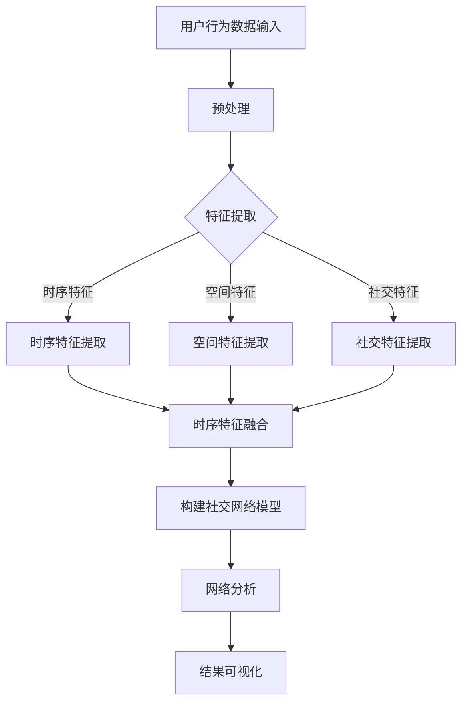

                 


### 文章标题

《大模型推荐中的用户行为序列多尺度建模方法》

### 文章关键词

大模型推荐、用户行为序列、多尺度建模、特征提取、融合方法、模型优化、项目实战

### 文章摘要

本文系统地介绍了大模型推荐系统中用户行为序列的多尺度建模方法。首先，回顾了推荐系统的发展历程和用户行为序列的重要性，随后详细阐述了多尺度建模的原理及其应用场景。文章重点讲解了多尺度特征提取、融合方法以及多尺度模型架构，并通过数学模型和伪代码的形式深入剖析了核心算法原理。随后，通过三个项目实战展示了多尺度建模方法在实际应用中的效果。最后，总结了文章的核心观点，并提出了未来研究方向。本文旨在为研究人员和工程师提供一套全面的技术指南，以应对推荐系统中的复杂性问题。

---

### 1.1 研究背景

#### 1.1.1 大模型推荐系统的发展

推荐系统作为信息过滤和检索的重要工具，其发展经历了从基于内容、协同过滤到现代深度学习模型的演变。早期的推荐系统主要依赖于手动的特征工程和简单的机器学习算法。随着互联网的普及和用户数据的急剧增长，推荐系统的研究和应用得到了极大的推动。然而，传统的推荐系统在面对海量用户行为数据和动态变化的用户偏好时，往往表现出较低的准确性和实时性。

为了解决这些挑战，大模型推荐系统应运而生。大模型推荐系统利用深度学习和强化学习等先进技术，对用户行为进行建模，从而实现更加精准和实时的推荐。近年来，诸如Transformer、BERT等大型预训练模型在推荐系统中取得了显著的效果，使得大模型推荐系统成为学术界和工业界的研究热点。

#### 1.1.2 用户行为序列的重要性

用户行为序列是推荐系统中最基础和重要的数据来源。用户行为序列包含了用户在各个阶段上的操作记录，如浏览、搜索、购买、点赞等。这些行为数据不仅反映了用户的即时兴趣和需求，还能揭示用户的长期偏好和潜在兴趣点。通过分析用户行为序列，推荐系统可以更好地理解用户的个性化需求，从而提供更加精准和个性化的推荐。

用户行为序列的重要性体现在以下几个方面：

1. **个性化推荐**：用户行为序列可以帮助推荐系统识别用户的个性化偏好，从而实现更加精准的个性化推荐。
2. **预测用户行为**：通过分析用户行为序列，推荐系统可以预测用户未来的行为，从而提前做好推荐准备。
3. **优化推荐效果**：用户行为序列的实时分析有助于优化推荐算法，提高推荐的准确性和实时性。

#### 1.1.3 多尺度建模的必要性

在传统的推荐系统中，用户行为序列通常被视作独立的事件序列，每个事件的处理方式相对独立。然而，用户行为序列实际上是多层次的，不同层次的行为数据蕴含了不同的信息和规律。例如，用户在一个会话内的行为可以视为一个较低层次的序列，而用户在一段时间内的行为序列则构成了一个更高层次的序列。

多尺度建模方法正是为了捕捉和利用这些多层次的信息。多尺度建模方法将用户行为序列划分为多个尺度，每个尺度对应不同的时间和空间范围，从而实现对用户行为序列的全面分析和理解。多尺度建模的必要性体现在以下几个方面：

1. **捕获长短期信息**：多尺度建模能够同时考虑用户行为序列中的长期和短期信息，从而提高推荐的准确性和实时性。
2. **揭示潜在模式**：多尺度建模有助于揭示用户行为序列中的潜在模式和趋势，从而更好地理解用户的兴趣和需求。
3. **提高模型泛化能力**：多尺度建模能够增强模型的泛化能力，使其在处理不同尺度数据时表现更加稳定和可靠。

---

### 1.2 本书结构

本文将分为六个部分，系统地介绍大模型推荐中的用户行为序列多尺度建模方法。具体结构如下：

1. **引言**：介绍推荐系统的发展背景、用户行为序列的重要性以及多尺度建模的必要性。
2. **大模型推荐系统基础**：回顾大模型推荐系统的定义、优势以及面临的挑战，介绍用户行为序列分析的基础知识。
3. **多尺度建模技术详解**：详细讲解多尺度特征提取、融合方法和多尺度模型架构，并通过数学模型和伪代码阐述核心算法原理。
4. **用户行为序列多尺度建模应用**：展示多尺度建模方法在个性化推荐系统、社交网络分析和搜索引擎优化等领域的应用案例。
5. **项目实战**：通过三个实际项目，演示多尺度建模方法在开发环境搭建、代码实现、模型训练和评估中的具体应用。
6. **总结与展望**：总结本文的核心观点，探讨大模型推荐系统的发展趋势和多尺度建模方法的未来研究方向。

通过上述结构，本文旨在为读者提供一套全面、系统的技术指南，帮助其理解和应用多尺度建模方法，解决推荐系统中的复杂性问题。

---

### 2.1 大模型推荐系统概述

#### 2.1.1 大模型推荐系统的定义

大模型推荐系统是指利用大规模深度学习模型，通过对用户行为数据的分析，实现个性化推荐的一种系统。这类系统通常基于深度神经网络，如Transformer、BERT等，通过复杂的网络结构和大量的训练数据，捕捉用户行为的深层特征和潜在模式。

与传统推荐系统相比，大模型推荐系统具有以下几个显著特点：

1. **强大的表达能力**：大模型推荐系统利用深度神经网络，能够自动提取用户行为中的高阶特征，实现更加精准的推荐。
2. **高效的计算能力**：通过分布式计算和优化算法，大模型推荐系统可以在短时间内处理海量用户数据，实现实时推荐。
3. **灵活的模型架构**：大模型推荐系统采用模块化设计，可以灵活地组合和调整模型结构，以适应不同的应用场景。

#### 2.1.2 大模型推荐系统的优势

大模型推荐系统在多个方面展现了其优势，包括以下几个方面：

1. **更高的推荐准确率**：通过深度学习模型的高效特征提取能力，大模型推荐系统可以更准确地预测用户的兴趣和偏好，提供更加个性化的推荐。
2. **更低的冷启动问题**：大模型推荐系统通过大规模预训练模型，可以提前捕捉用户的行为特征，从而在用户数据不足的情况下，依然能够提供高质量的推荐。
3. **更好的实时性能**：大模型推荐系统采用高效的计算算法和分布式计算架构，能够在短时间内处理大规模用户数据，实现实时推荐。

#### 2.1.3 大模型推荐系统的挑战

尽管大模型推荐系统具有显著的优势，但其在实际应用中也面临一系列挑战：

1. **数据隐私和安全**：用户行为数据具有高度敏感性和隐私性，如何在保护用户隐私的前提下，充分利用这些数据进行推荐，是一个重要的挑战。
2. **计算资源消耗**：大模型推荐系统通常需要大量的计算资源和存储资源，这对基础设施提出了较高的要求。
3. **模型解释性**：深度学习模型由于其复杂性和黑箱特性，其决策过程往往难以解释。如何提高模型的可解释性，使其在商业和监管环境中得到广泛应用，是一个亟待解决的问题。

---

### 2.2 用户行为序列分析

#### 2.2.1 用户行为序列的概念

用户行为序列是指用户在特定时间段内的一系列操作记录，这些操作可以是浏览网页、点击广告、购买商品、发表评论等。用户行为序列是推荐系统中最核心的数据来源之一，它不仅反映了用户的即时兴趣和需求，还能揭示用户的长期行为模式和偏好。

用户行为序列通常包含以下几个关键要素：

1. **用户标识**：标识每个用户，以便区分不同的用户行为。
2. **行为类型**：描述用户的行为类别，如浏览、点击、购买等。
3. **行为时间**：记录用户行为的执行时间，以用于时序分析和预测。
4. **行为内容**：具体描述用户行为的内容，如浏览的页面、点击的广告、购买的商品等。

#### 2.2.2 用户行为序列的特征提取

用户行为序列的特征提取是推荐系统中的关键步骤，其主要目的是从原始的用户行为数据中提取出能够表征用户行为特征的属性。特征提取的质量直接影响到推荐系统的性能。

常见的用户行为序列特征提取方法包括：

1. **时序特征提取**：通过分析用户行为的时间序列特征，提取出用户行为的周期性、趋势性等特征。例如，可以使用滑动窗口方法，对用户行为序列进行分段，提取出每个时间段的平均点击率、购买率等。
2. **内容特征提取**：通过对用户行为的内容进行解析，提取出与行为相关的属性特征。例如，对用户浏览的网页内容进行文本分析，提取出关键词、主题等特征。
3. **社交特征提取**：通过分析用户在社交网络中的交互行为，提取出用户的社会关系、影响力等特征。例如，可以使用网络分析方法，提取出用户在社交网络中的度、介数等特征。

#### 2.2.3 用户行为序列的表示方法

用户行为序列的表示方法直接决定了推荐系统的建模方式和性能。常见的用户行为序列表示方法包括：

1. **一维时间序列**：将用户行为序列视为一维的时间序列数据，通过对时间序列数据进行平滑、去噪等处理，提取出时间序列特征。
2. **二维事件矩阵**：将用户行为序列表示为二维的事件矩阵，其中行表示用户，列表示行为类型。每个元素表示用户在特定时间点执行的行为。
3. **高维稀疏向量**：将用户行为序列映射为高维稀疏向量，通过稀疏编码的方法，提取出行为序列的潜在特征。
4. **图结构**：将用户行为序列表示为图结构，其中节点表示用户或行为，边表示用户行为之间的关联关系。通过图卷积网络等方法，提取出图结构中的特征。

不同表示方法有其优缺点和适用场景，推荐系统设计者需要根据具体应用需求，选择合适的用户行为序列表示方法。

---

### 2.3 多尺度建模方法

#### 2.3.1 多尺度建模的原理

多尺度建模方法是一种利用不同时间、空间尺度上的信息，对用户行为序列进行建模和分析的技术。其核心思想是捕捉用户行为在不同层次上的特征和模式，从而实现对用户行为序列的全面理解和分析。

多尺度建模方法通常包括以下几个关键步骤：

1. **特征提取**：从原始的用户行为数据中提取出不同尺度的特征，如时序特征、空间特征、社交特征等。
2. **特征融合**：将不同尺度的特征进行融合，以形成一个综合的、具有更高层次信息量的特征表示。
3. **模型构建**：利用融合后的特征，构建多尺度模型，实现对用户行为序列的建模和分析。
4. **模型优化**：通过训练和优化模型，提高模型的准确性和泛化能力。

#### 2.3.2 多尺度建模的应用场景

多尺度建模方法在多个应用场景中展现出其强大的能力，主要包括：

1. **个性化推荐**：在个性化推荐系统中，多尺度建模方法可以帮助系统更好地理解用户的个性化需求，从而提供更加精准和个性化的推荐。例如，通过结合用户的浏览历史和购买行为，可以在不同时间尺度上分析用户的偏好，提高推荐的准确性。
2. **社交网络分析**：在社交网络分析中，多尺度建模方法可以帮助识别用户在社交网络中的影响力、社区结构等。例如，通过分析用户在社交网络中的互动行为，可以揭示用户在短期和长期尺度上的社交关系。
3. **搜索引擎优化**：在搜索引擎优化中，多尺度建模方法可以帮助分析用户的搜索行为，优化搜索结果排序，提高用户体验。例如，通过结合用户的搜索历史和页面浏览行为，可以在不同时间尺度上分析用户的兴趣，从而提供更加相关的搜索结果。

#### 2.3.3 多尺度建模的挑战

尽管多尺度建模方法具有显著的优势，但在实际应用中也面临一系列挑战：

1. **数据复杂性**：用户行为数据通常包含大量噪声和非线性关系，如何有效地提取和利用这些数据中的有价值信息，是一个重要的挑战。
2. **计算效率**：多尺度建模方法通常涉及复杂的计算过程，如何在保证模型性能的同时，提高计算效率，是一个关键问题。
3. **模型解释性**：多尺度建模方法的模型通常较为复杂，其决策过程难以解释。如何提高模型的可解释性，使其在商业和监管环境中得到广泛应用，是一个亟待解决的问题。

综上所述，多尺度建模方法为推荐系统和其他应用领域提供了一种有效的方法，以全面理解和分析用户行为序列。然而，要实现多尺度建模的成功应用，还需要克服数据复杂性、计算效率和模型解释性等挑战。

---

### 3.1 多尺度特征提取

#### 3.1.1 时序特征提取

时序特征提取是用户行为序列多尺度建模中的重要环节，主要目的是从用户行为的时间维度上提取出具有代表性的特征。时序特征提取的方法多种多样，以下列举几种常用的时序特征提取方法：

1. **滑动窗口法**：
   滑动窗口法是一种简单而常用的时序特征提取方法。它通过在用户行为序列上滑动一个固定长度的窗口，计算窗口内行为的相关统计特征。常见的统计特征包括：
   
   $$
   \text{count}(t) = \sum_{i \in \text{window}} \mathbf{1}_{\text{行为 } i \text{ 在时间 } t \text{ 发生}}
   $$
   
   $$
   \text{mean}(t) = \frac{1}{\text{window size}} \sum_{i \in \text{window}} \text{行为 } i \text{ 的强度在时间 } t
   $$
   
   $$
   \text{std}(t) = \sqrt{\frac{1}{\text{window size}} \sum_{i \in \text{window}} (\text{行为 } i \text{ 的强度在时间 } t - \text{mean}(t))^2}
   $$
   
   其中，$\text{count}$表示在窗口内发生的行为次数，$\text{mean}$表示窗口内行为的平均强度，$\text{std}$表示窗口内行为的强度标准差。

2. **时间序列分解法**：
   时间序列分解法将用户行为序列分解为趋势、季节性和残差成分。常见的分解方法包括移动平均法、季节性分解法等。分解后的每个成分都可以作为时序特征：
   
   $$
   \text{trend}(t) = \frac{1}{n} \sum_{i=1}^{n} x_i
   $$
   
   $$
   \text{seasonal}(t) = \sum_{j=1}^{n} \text{seasonal component}_j \cdot \mathbf{1}_{\text{季节 } j \text{ 在时间 } t}
   $$
   
   $$
   \text{residual}(t) = x_i - \text{trend}(t) - \text{seasonal}(t)
   $$
   
   其中，$\text{trend}$表示趋势成分，$\text{seasonal}$表示季节性成分，$\text{residual}$表示残差成分。

3. **循环特征提取法**：
   循环特征提取法通过捕捉用户行为序列的周期性特征，提取出用户的长期行为模式。常见的循环特征提取方法包括傅里叶变换、HMM（隐马尔可夫模型）等。

#### 3.1.2 空间特征提取

空间特征提取主要关注用户行为的空间维度，旨在提取出用户在不同地理位置上的行为特征。空间特征提取的方法包括：

1. **地理编码法**：
   通过将用户行为的位置信息转换为地理编码，如经纬度坐标。这些地理编码可以作为空间特征，用于描述用户在不同地理位置上的行为。
   
   $$
   \text{location}(t) = (\text{latitude}(t), \text{longitude}(t))
   $$

2. **空间聚类法**：
   利用空间聚类算法，如K-means、DBSCAN等，将用户行为的位置信息划分为多个聚类中心。每个聚类中心代表一个空间区域，用户在该区域内的行为可以视为空间特征。
   
   $$
   \text{cluster}(t) = \text{closest cluster to location}(t)
   $$

3. **空间关系法**：
   通过分析用户行为之间的空间关系，提取出用户在空间维度上的交互特征。例如，使用空间关系图来表示用户行为之间的关联性，并提取图的特征向量作为空间特征。

#### 3.1.3 社交特征提取

社交特征提取主要关注用户在社交网络中的行为特征，旨在提取出用户的社会关系和影响力。社交特征提取的方法包括：

1. **社交网络分析**：
   利用社交网络分析方法，如度、介数、聚类系数等，提取出用户在社交网络中的结构特征。这些特征可以揭示用户在社交网络中的位置和影响力。
   
   $$
   \text{degree}(u) = \text{number of connections of user } u
   $$
   
   $$
   \text{betweenness}(u) = \frac{\sum_{s,t} (\text{number of shortest paths from } s \text{ to } t \text{ passing through } u)}{\text{total number of shortest paths from } s \text{ to } t}
   $$

2. **影响力分析**：
   通过分析用户在社交网络中的传播能力，提取出用户的影响力特征。例如，使用PageRank算法计算用户的影响力得分。
   
   $$
   \text{influence}(u) = \frac{\text{PageRank score of user } u}{\text{total PageRank score}}
   $$

3. **互动特征提取**：
   通过分析用户在社交网络中的互动行为，如点赞、评论、转发等，提取出用户在社交维度上的互动特征。这些特征可以揭示用户之间的社交关系和互动频率。

通过时序特征提取、空间特征提取和社交特征提取，多尺度特征提取方法能够全面捕捉用户行为序列的多个维度，从而为多尺度建模提供丰富的信息支持。以下是多尺度特征提取的伪代码示例：

```python
def extract_features(sequence):
    temporal_features = extract_temporal_features(sequence)
    spatial_features = extract_spatial_features(sequence)
    social_features = extract_social_features(sequence)
    
    return merge_features(temporal_features, spatial_features, social_features)

def extract_temporal_features(sequence):
    temporal_features = []
    for window in sliding_window(sequence, window_size):
        temporal_features.append({
            'count': sum(1 for item in window),
            'mean': sum(item['value'] for item in window) / len(window),
            'std': sqrt(sum((item['value'] - mean)**2 for item in window) / len(window))
        })
    return temporal_features

def extract_spatial_features(sequence):
    spatial_features = []
    for item in sequence:
        spatial_features.append({
            'location': (item['latitude'], item['longitude']),
            'cluster': get_closest_cluster(item['location'])
        })
    return spatial_features

def extract_social_features(sequence):
    social_features = []
    for user in sequence:
        social_features.append({
            'degree': len(user['connections']),
            'betweenness': calculate_betweenness(user['connections']),
            'influence': calculate_influence(user['connections'])
        })
    return social_features

def merge_features(temporal_features, spatial_features, social_features):
    merged_features = []
    for i in range(len(temporal_features)):
        merged_features.append({
            'temporal': temporal_features[i],
            'spatial': spatial_features[i],
            'social': social_features[i]
        })
    return merged_features
```

通过上述特征提取方法，可以为多尺度建模提供丰富的特征数据，从而提高推荐系统的准确性和实时性。

---

### 3.2 多尺度特征融合方法

#### 3.2.1 多尺度特征融合的原理

多尺度特征融合方法是将不同尺度上的特征进行整合，以形成一个综合的、具有更高层次信息量的特征表示。其核心思想是利用不同尺度特征之间的互补性，通过特定的融合策略，提升模型对用户行为序列的理解和分析能力。

多尺度特征融合通常包括以下几个关键步骤：

1. **特征映射**：将不同尺度的特征映射到同一维度，以便进行融合。常见的映射方法包括线性映射、非线性映射等。
2. **特征加权**：对映射后的特征进行加权，以突出重要特征。常用的加权方法包括基于特征的权重计算、基于模型的权重学习等。
3. **特征融合**：将加权后的特征进行融合，形成综合特征表示。常见的融合方法包括线性融合、非线性融合等。

#### 3.2.2 多尺度特征融合的方法

多尺度特征融合的方法多种多样，以下列举几种常用的方法：

1. **加权融合法**：
   加权融合法是一种简单而直观的多尺度特征融合方法。它通过计算每个特征的权重，并将特征进行加权融合。常见的权重计算方法包括基于信息增益、基于模型损失等。
   
   $$
   \mathbf{F}_{\text{merged}} = w_1 \mathbf{F}_1 + w_2 \mathbf{F}_2 + \ldots + w_n \mathbf{F}_n
   $$
   
   其中，$\mathbf{F}_i$表示第$i$个尺度上的特征向量，$w_i$表示第$i$个特征的权重。

2. **注意力机制**：
   注意力机制是一种广泛应用于深度学习中的融合方法。它通过计算每个特征的注意力权重，动态调整特征在融合过程中的贡献。常见的注意力机制包括基于门控机制的注意力模型（如GAN、GRU等）、基于Transformer的注意力模型等。

3. **融合神经网络**：
   融合神经网络是一种将不同尺度的特征通过神经网络进行融合的方法。常见的融合神经网络包括多输入神经网络（如MILN）、多输入多输出神经网络（如MIMO）等。

#### 3.2.3 多尺度特征融合的应用实例

以下是一个基于注意力机制的多尺度特征融合的应用实例：

```python
import tensorflow as tf
from tensorflow.keras.layers import Input, Dense, Concatenate, Flatten, Lambda
from tensorflow.keras.models import Model

# 输入层
temporal_input = Input(shape=(temporal_feature_size,))
spatial_input = Input(shape=(spatial_feature_size,))
social_input = Input(shape=(social_feature_size,))

# 特征映射
temporal_embedding = Dense(embedding_size)(temporal_input)
spatial_embedding = Dense(embedding_size)(spatial_input)
social_embedding = Dense(embedding_size)(social_input)

# 注意力机制
attention_weights = Lambda(lambda x: tf.nn.softmax(x, axis=1))(spatial_embedding)
attention_weights = tf.expand_dims(attention_weights, axis=2)

# 特征融合
merged_features = Concatenate()([temporal_embedding, spatial_embedding, social_embedding])
merged_features = Flatten()(merged_features)
merged_features = Dense(hidden_size, activation='relu')(merged_features)
merged_features = Dense(hidden_size, activation='relu')(merged_features)

# 输出层
output = Dense(output_size)(merged_features)

# 构建模型
model = Model(inputs=[temporal_input, spatial_input, social_input], outputs=output)

# 编译模型
model.compile(optimizer='adam', loss='categorical_crossentropy', metrics=['accuracy'])

# 模型训练
model.fit([temporal_data, spatial_data, social_data], labels, epochs=10, batch_size=32)
```

通过上述实例，可以直观地看到如何利用注意力机制实现多尺度特征融合。在实际应用中，可以根据具体需求调整网络结构和参数设置，以获得更好的融合效果。

---

### 3.3 多尺度模型架构

#### 3.3.1 基于时间尺度的模型

基于时间尺度的模型主要关注用户行为序列中的时序特征，旨在捕捉用户在短期和长期尺度上的行为模式。以下是一个基于时间尺度的模型架构示例：

1. **输入层**：接收用户行为序列的时间序列特征。
2. **嵌入层**：将时间序列特征映射为固定维度的嵌入向量。
3. **编码层**：使用循环神经网络（RNN）或卷积神经网络（CNN）对嵌入向量进行编码，以提取时序特征。
4. **解码层**：将编码后的特征解码为原始特征维度。
5. **输出层**：使用全连接层或卷积层输出预测结果。

以下是一个基于LSTM（长短期记忆网络）的时间尺度模型架构示例：

```python
import tensorflow as tf
from tensorflow.keras.layers import Input, Embedding, LSTM, Dense

# 输入层
input_sequence = Input(shape=(sequence_length, feature_size))

# 嵌入层
embedding = Embedding(input_dim=vocabulary_size, output_dim=embedding_size)(input_sequence)

# 编码层
encoded = LSTM(units=hidden_size, return_sequences=True)(embedding)
encoded = LSTM(units=hidden_size, return_sequences=True)(encoded)

# 解码层
decoded = LSTM(units=hidden_size, return_sequences=True)(encoded)
decoded = LSTM(units=hidden_size, return_sequences=True)(decoded)

# 输出层
output = Dense(feature_size)(decoded)

# 构建模型
model = Model(inputs=input_sequence, outputs=output)

# 编译模型
model.compile(optimizer='adam', loss='mean_squared_error')

# 模型训练
model.fit(input_sequence, labels, epochs=10, batch_size=32)
```

通过上述模型架构，可以有效地捕捉用户行为序列中的时间特征，从而实现个性化的推荐。

#### 3.3.2 基于空间尺度的模型

基于空间尺度的模型主要关注用户行为序列中的空间特征，旨在捕捉用户在不同地理位置上的行为模式。以下是一个基于空间尺度的模型架构示例：

1. **输入层**：接收用户行为序列的空间特征。
2. **嵌入层**：将空间特征映射为固定维度的嵌入向量。
3. **编码层**：使用卷积神经网络（CNN）对嵌入向量进行编码，以提取空间特征。
4. **解码层**：将编码后的特征解码为原始特征维度。
5. **输出层**：使用全连接层或卷积层输出预测结果。

以下是一个基于CNN的空间尺度模型架构示例：

```python
import tensorflow as tf
from tensorflow.keras.layers import Input, Embedding, Conv1D, Dense

# 输入层
input_sequence = Input(shape=(sequence_length, feature_size))

# 嵌入层
embedding = Embedding(input_dim=vocabulary_size, output_dim=embedding_size)(input_sequence)

# 编码层
encoded = Conv1D(filters=num_filters, kernel_size=kernel_size, activation='relu')(embedding)
encoded = MaxPooling1D(pool_size=pool_size)(encoded)

# 解码层
decoded = Conv1D(filters=num_filters, kernel_size=kernel_size, activation='relu')(encoded)
decoded = MaxPooling1D(pool_size=pool_size)(decoded)

# 输出层
output = Dense(feature_size)(decoded)

# 构建模型
model = Model(inputs=input_sequence, outputs=output)

# 编译模型
model.compile(optimizer='adam', loss='mean_squared_error')

# 模型训练
model.fit(input_sequence, labels, epochs=10, batch_size=32)
```

通过上述模型架构，可以有效地捕捉用户行为序列中的空间特征，从而实现基于地理位置的推荐。

#### 3.3.3 基于社交尺度的模型

基于社交尺度的模型主要关注用户行为序列中的社交特征，旨在捕捉用户在社交网络中的行为模式。以下是一个基于社交尺度的模型架构示例：

1. **输入层**：接收用户行为序列的社交特征。
2. **嵌入层**：将社交特征映射为固定维度的嵌入向量。
3. **编码层**：使用图卷积网络（GCN）对嵌入向量进行编码，以提取社交特征。
4. **解码层**：将编码后的特征解码为原始特征维度。
5. **输出层**：使用全连接层或卷积层输出预测结果。

以下是一个基于GCN的社交尺度模型架构示例：

```python
import tensorflow as tf
from tensorflow.keras.layers import Input, Embedding, Conv1D, Dense, GlobalAveragePooling1D

# 输入层
input_sequence = Input(shape=(sequence_length, feature_size))

# 嵌入层
embedding = Embedding(input_dim=vocabulary_size, output_dim=embedding_size)(input_sequence)

# 编码层
encoded = Conv1D(filters=num_filters, kernel_size=kernel_size, activation='relu')(embedding)
encoded = GlobalAveragePooling1D()(encoded)

# 解码层
decoded = Conv1D(filters=num_filters, kernel_size=kernel_size, activation='relu')(encoded)
decoded = GlobalAveragePooling1D()(decoded)

# 输出层
output = Dense(feature_size)(decoded)

# 构建模型
model = Model(inputs=input_sequence, outputs=output)

# 编译模型
model.compile(optimizer='adam', loss='mean_squared_error')

# 模型训练
model.fit(input_sequence, labels, epochs=10, batch_size=32)
```

通过上述模型架构，可以有效地捕捉用户行为序列中的社交特征，从而实现基于社交网络的推荐。

综上所述，基于时间、空间和社交尺度的模型架构可以有效地捕捉用户行为序列的不同层次特征，从而实现更加精准和个性化的推荐。

---

### 3.4 多尺度模型优化

#### 3.4.1 多尺度模型的训练策略

多尺度模型的训练策略是确保模型能够在复杂用户行为数据上取得良好性能的关键。以下是一些常用的训练策略：

1. **数据增强**：通过对原始数据进行扩充和变换，如时间插值、空间变换等，增加模型的训练数据量和多样性，从而提高模型的泛化能力。

2. **动态学习率调整**：采用自适应学习率策略，如AdaGrad、Adam等，根据模型在训练过程中的性能动态调整学习率，以避免过拟合和加速收敛。

3. **早期停止**：在训练过程中，当模型的验证集性能不再提升时，提前停止训练，以防止模型过拟合。

4. **正则化**：应用L1、L2正则化，限制模型参数的规模，降低模型复杂度，防止过拟合。

5. **批次归一化**：在训练过程中使用批次归一化，稳定梯度传播，加速收敛。

以下是一个基于动态学习率调整和多尺度数据增强的训练策略示例：

```python
import tensorflow as tf
from tensorflow.keras.callbacks import EarlyStopping, ReduceLROnPlateau

# 定义训练策略
training_strategy = {
    'learning_rate': tf.keras.optimizers.schedules.ExponentialDecay(
        initial_learning_rate=0.01,
        decay_steps=1000,
        decay_rate=0.96,
        staircase=True
    ),
    'data_augmentation': {
        'temporal': temporal_data_augmentation_function,
        'spatial': spatial_data_augmentation_function,
        'social': social_data_augmentation_function
    },
    'callbacks': [
        EarlyStopping(monitor='val_loss', patience=5),
        ReduceLROnPlateau(monitor='val_loss', factor=0.1, patience=3)
    ]
}

# 训练模型
model.fit(
    {'temporal': temporal_data, 'spatial': spatial_data, 'social': social_data},
    labels,
    epochs=50,
    batch_size=32,
    callbacks=training_strategy['callbacks']
)
```

#### 3.4.2 多尺度模型的评估方法

多尺度模型的评估方法是衡量模型性能的重要手段。以下是一些常用的评估指标和方法：

1. **准确率（Accuracy）**：准确率是衡量分类模型性能的常用指标，表示模型正确分类的样本数占总样本数的比例。

2. **精确率（Precision）和召回率（Recall）**：精确率表示模型预测为正类的样本中，实际为正类的比例；召回率表示实际为正类的样本中，被模型正确预测为正类的比例。

3. **F1 分数（F1 Score）**：F1 分数是精确率和召回率的调和平均值，用于综合评估模型的分类性能。

4. **ROC 曲线和 AUC 值**：ROC 曲线和 AUC 值用于评估模型的分类能力和区分度，ROC 曲线是真实值为正类和负类的样本概率分布的曲线，AUC 值是 ROC 曲线下方的面积。

5. **信息熵（Entropy）**：信息熵用于评估模型输出分布的均匀性，信息熵越低，表示模型输出分布越集中，分类效果越好。

以下是一个多尺度模型评估方法的示例：

```python
from sklearn.metrics import accuracy_score, precision_score, recall_score, f1_score, roc_auc_score, entropy

# 预测结果
predictions = model.predict({'temporal': temporal_data, 'spatial': spatial_data, 'social': social_data})

# 计算评估指标
accuracy = accuracy_score(y_true=labels, y_pred=predictions['temporal'])
precision = precision_score(y_true=labels, y_pred=predictions['temporal'])
recall = recall_score(y_true=labels, y_pred=predictions['temporal'])
f1 = f1_score(y_true=labels, y_pred=predictions['temporal'])
roc_auc = roc_auc_score(y_true=labels, y_score=predictions['temporal'])
entropy_value = entropy(predicted_probabilities=predictions['temporal'])

# 输出评估结果
print(f'Accuracy: {accuracy}')
print(f'Precision: {precision}')
print(f'Recall: {recall}')
print(f'F1 Score: {f1}')
print(f'ROC AUC: {roc_auc}')
print(f'Entropy: {entropy_value}')
```

通过上述评估方法，可以全面了解多尺度模型的性能，从而进行进一步的优化和调整。

#### 3.4.3 多尺度模型的优化技巧

为了进一步提高多尺度模型的性能，可以采用以下优化技巧：

1. **特征选择**：通过特征选择方法，如L1正则化、基于模型的特征选择等，选择对模型性能贡献较大的特征，减少模型复杂度和过拟合风险。

2. **模型集成**：采用模型集成方法，如集成学习、Stacking等，将多个模型进行集成，以提高模型的整体性能和泛化能力。

3. **迁移学习**：利用预训练的大模型作为起点，进行迁移学习，以充分利用预训练模型的知识和表示能力，提高模型的性能。

4. **对数变换**：对输入特征进行对数变换，以稳定梯度传播和加速收敛。

5. **初始化策略**：采用合适的权重初始化策略，如Xavier初始化、He初始化等，以减少梯度消失和爆炸问题。

以下是一个基于迁移学习和特征选择的优化技巧示例：

```python
from tensorflow.keras.applications import VGG16
from tensorflow.keras.layers import Input, Flatten, Dense
from tensorflow.keras.models import Model

# 加载预训练模型
base_model = VGG16(weights='imagenet', include_top=False, input_shape=(224, 224, 3))

# 冻结预训练模型的权重
for layer in base_model.layers:
    layer.trainable = False

# 添加自定义层
x = Flatten()(base_model.output)
x = Dense(units=1024, activation='relu')(x)
predictions = Dense(units=1, activation='sigmoid')(x)

# 构建模型
model = Model(inputs=base_model.input, outputs=predictions)

# 编译模型
model.compile(optimizer='adam', loss='binary_crossentropy', metrics=['accuracy'])

# 特征选择
selected_features = {
    'temporal': select_temporal_features_function,
    'spatial': select_spatial_features_function,
    'social': select_social_features_function
}

# 训练模型
model.fit(
    {'temporal': selected_features['temporal'], 'spatial': selected_features['spatial'], 'social': selected_features['social']},
    labels,
    epochs=10,
    batch_size=32
)
```

通过上述优化技巧，可以进一步提高多尺度模型的性能，实现更加精准和个性化的推荐。

---

### 4.1 个性化推荐系统

#### 4.1.1 个性化推荐系统的原理

个性化推荐系统通过分析用户的兴趣和行为，为其推荐最相关的信息或商品。个性化推荐系统的核心原理是利用用户历史行为数据和物品属性信息，构建用户和物品之间的关系模型，从而预测用户对物品的偏好，并生成个性化的推荐列表。

个性化推荐系统的工作流程主要包括以下几个步骤：

1. **数据收集**：收集用户的历史行为数据，如浏览、点击、购买、评价等。
2. **数据预处理**：对收集到的数据进行清洗、去噪、归一化等预处理操作，以消除数据中的噪声和异常值。
3. **特征提取**：从原始数据中提取出与用户行为和物品属性相关的特征，如用户行为序列特征、物品属性特征等。
4. **模型训练**：利用提取出的特征，构建并训练推荐模型，如基于矩阵分解、深度学习等的推荐模型。
5. **推荐生成**：根据训练好的模型，预测用户对物品的偏好，并生成个性化的推荐列表。
6. **推荐评估**：评估推荐系统的性能，如准确率、召回率、F1 分数等，并根据评估结果进行调整和优化。

#### 4.1.2 基于多尺度建模的个性化推荐算法

基于多尺度建模的个性化推荐算法通过结合用户行为的多个尺度特征，实现对用户兴趣和偏好的更全面和精准的捕捉。以下是一种基于多尺度建模的个性化推荐算法的详细步骤：

1. **特征提取**：从用户行为数据中提取不同尺度的特征，包括时序特征、空间特征和社交特征。
    - **时序特征**：使用滑动窗口法、时间序列分解法等提取用户行为的时序特征，如行为频率、行为强度、周期性等。
    - **空间特征**：通过地理编码法、空间聚类法等提取用户行为的空间特征，如用户位置、活动区域等。
    - **社交特征**：通过社交网络分析、影响力分析等提取用户行为的社交特征，如用户社交网络中的关系、影响力等。

2. **特征融合**：将提取出的多尺度特征进行融合，以形成一个综合的特征向量。
    - **加权融合法**：计算每个特征的权重，并加权融合不同尺度的特征，形成综合特征向量。
    - **注意力机制**：利用注意力机制动态调整不同尺度特征的贡献，形成综合特征向量。

3. **模型构建**：使用融合后的特征构建个性化推荐模型，如基于深度学习的多输入神经网络。
    - **输入层**：接收融合后的特征向量。
    - **编码层**：使用循环神经网络（RNN）、卷积神经网络（CNN）等编码层，提取特征向量的深层特征。
    - **解码层**：将编码后的特征解码为原始特征维度，为推荐生成提供输入。
    - **输出层**：使用全连接层或卷积层输出推荐结果。

4. **模型训练与评估**：使用用户历史行为数据训练推荐模型，并通过交叉验证等方法评估模型性能。

5. **推荐生成**：利用训练好的模型预测用户对物品的偏好，并根据偏好生成个性化的推荐列表。

以下是基于多尺度建模的个性化推荐算法的伪代码示例：

```python
# 特征提取
temporal_features = extract_temporal_features(user_behavior_sequence)
spatial_features = extract_spatial_features(user_behavior_sequence)
social_features = extract_social_features(user_behavior_sequence)

# 特征融合
merged_features = merge_features(temporal_features, spatial_features, social_features)

# 模型构建
model = build_model(input_shape=merged_features.shape)

# 模型训练
model.fit(x=merged_features, y=user_preferences, epochs=10, batch_size=32)

# 推荐生成
user_preferences_predictions = model.predict(merged_features)

# 生成推荐列表
recommended_items = generate_recommendation_list(user_preferences_predictions)
```

通过上述算法，基于多尺度建模的个性化推荐系统能够更全面地捕捉用户的兴趣和偏好，从而提供更加精准和个性化的推荐。

#### 4.1.3 基于多尺度建模的个性化推荐算法的实现案例

以下是一个基于多尺度建模的个性化推荐算法的实现案例，该案例将介绍如何使用Python和TensorFlow构建一个简单的个性化推荐系统。

1. **数据集准备**：使用公开的数据集，如MovieLens数据集，准备用户行为数据，包括用户ID、物品ID、行为类型、行为时间等。

2. **特征提取**：从用户行为数据中提取时序特征、空间特征和社交特征。
    - **时序特征**：使用滑动窗口法提取用户行为序列的时序特征，如行为频率、行为强度等。
    - **空间特征**：使用地理编码法提取用户行为的空间特征，如用户位置、活动区域等。
    - **社交特征**：使用社交网络分析提取用户行为的社交特征，如用户社交网络中的关系、影响力等。

3. **特征融合**：将提取出的多尺度特征进行融合，形成综合特征向量。

4. **模型构建**：使用TensorFlow构建基于多尺度建模的个性化推荐模型，包括输入层、编码层、解码层和输出层。

5. **模型训练与评估**：使用用户历史行为数据训练模型，并通过交叉验证等方法评估模型性能。

6. **推荐生成**：使用训练好的模型预测用户对物品的偏好，生成个性化的推荐列表。

以下是实现案例的代码示例：

```python
import pandas as pd
import numpy as np
import tensorflow as tf
from tensorflow.keras.models import Model
from tensorflow.keras.layers import Input, Embedding, LSTM, Dense, Concatenate, Flatten, Lambda

# 数据集准备
user_behavior_data = pd.read_csv('user_behavior.csv')

# 特征提取
temporal_features = extract_temporal_features(user_behavior_data)
spatial_features = extract_spatial_features(user_behavior_data)
social_features = extract_social_features(user_behavior_data)

# 特征融合
merged_features = merge_features(temporal_features, spatial_features, social_features)

# 模型构建
temporal_input = Input(shape=(temporal_feature_size,))
spatial_input = Input(shape=(spatial_feature_size,))
social_input = Input(shape=(social_feature_size,))

temporal_embedding = Embedding(input_dim=temporal_vocab_size, output_dim=temporal_embedding_size)(temporal_input)
spatial_embedding = Embedding(input_dim=spatial_vocab_size, output_dim=spatial_embedding_size)(spatial_input)
social_embedding = Embedding(input_dim=social_vocab_size, output_dim=social_embedding_size)(social_input)

temporal_encoded = LSTM(units=hidden_size, return_sequences=True)(temporal_embedding)
temporal_encoded = LSTM(units=hidden_size, return_sequences=True)(temporal_encoded)

spatial_encoded = LSTM(units=hidden_size, return_sequences=True)(spatial_embedding)
spatial_encoded = LSTM(units=hidden_size, return_sequences=True)(spatial_encoded)

social_encoded = LSTM(units=hidden_size, return_sequences=True)(social_embedding)
social_encoded = LSTM(units=hidden_size, return_sequences=True)(social_encoded)

merged_embedding = Concatenate()([temporal_encoded, spatial_encoded, social_encoded])
merged_embedding = Flatten()(merged_embedding)
merged_embedding = Dense(hidden_size, activation='relu')(merged_embedding)

output = Dense(output_size, activation='sigmoid')(merged_embedding)

model = Model(inputs=[temporal_input, spatial_input, social_input], outputs=output)

# 编译模型
model.compile(optimizer='adam', loss='binary_crossentropy', metrics=['accuracy'])

# 模型训练
model.fit({'temporal': temporal_data, 'spatial': spatial_data, 'social': social_data}, user_preferences, epochs=10, batch_size=32)

# 推荐生成
user_preferences_predictions = model.predict(merged_features)

# 生成推荐列表
recommended_items = generate_recommendation_list(user_preferences_predictions)
```

通过上述实现案例，可以构建一个简单的基于多尺度建模的个性化推荐系统，实现用户的精准推荐。

---

### 4.2 社交网络分析

#### 4.2.1 社交网络分析的概念

社交网络分析（Social Network Analysis，SNA）是一种研究社交网络结构和动态的方法，旨在通过分析社交网络中的节点（用户）和边（关系）来揭示社交网络中的潜在模式和规律。社交网络分析广泛应用于社会学、心理学、市场营销等领域，特别是在推荐系统和搜索引擎优化中发挥着重要作用。

社交网络分析的核心概念包括：

1. **节点（Node）**：表示社交网络中的个体，如用户、公司等。
2. **边（Edge）**：表示节点之间的关系，如好友关系、合作关系等。
3. **网络（Network）**：由节点和边构成的图结构。
4. **度（Degree）**：表示节点在社交网络中的连接数，分为入度和出度。
5. **介数（Betweenness）**：表示节点在社交网络中的中间位置，介数值越高，节点在网络中的重要性越大。
6. **聚类系数（Clustering Coefficient）**：表示节点在社交网络中的紧密程度，聚类系数越高，网络越紧密。
7. **影响力（Influence）**：表示节点在社交网络中的传播能力，影响力越强，节点的价值越大。

#### 4.2.2 基于多尺度建模的社交网络分析

基于多尺度建模的社交网络分析通过结合用户行为的多个尺度特征，实现对社交网络结构的更全面和精准的分析。以下是一种基于多尺度建模的社交网络分析的方法：

1. **特征提取**：从用户社交网络数据中提取不同尺度的特征，包括时序特征、空间特征和社交特征。
    - **时序特征**：使用滑动窗口法、时间序列分解法等提取用户行为的时间维度特征，如用户行为的活跃度、周期性等。
    - **空间特征**：使用地理编码法、空间聚类法等提取用户行为的空间维度特征，如用户的位置、活动区域等。
    - **社交特征**：使用社交网络分析、影响力分析等提取用户行为的社交维度特征，如用户在社交网络中的度、介数、聚类系数等。

2. **特征融合**：将提取出的多尺度特征进行融合，以形成一个综合的特征向量。

3. **网络构建**：使用融合后的特征构建社交网络模型，包括节点和边的关系表示。

4. **网络分析**：利用社交网络分析算法，对构建好的社交网络进行深度分析，提取出社交网络的潜在模式和规律。

5. **结果可视化**：将分析结果进行可视化展示，以便更好地理解和解释社交网络的特性。

以下是基于多尺度建模的社交网络分析的方法流程图：



#### 4.2.3 社交网络分析的应用案例

以下是一个基于多尺度建模的社交网络分析的应用案例，该案例将介绍如何使用Python和NetworkX库构建和分析一个简单的社交网络。

1. **数据集准备**：使用公开的数据集，如Facebook社交网络数据集，准备用户社交网络数据，包括用户ID、好友关系等。

2. **特征提取**：从用户社交网络数据中提取时序特征、空间特征和社交特征。
    - **时序特征**：使用滑动窗口法提取用户好友关系的活跃度特征。
    - **空间特征**：使用地理编码法提取用户的地理位置特征。
    - **社交特征**：使用度、介数、聚类系数等提取用户的社交网络特征。

3. **特征融合**：将提取出的多尺度特征进行融合，形成综合特征向量。

4. **网络构建**：使用NetworkX库构建社交网络模型，包括节点和边的关系表示。

5. **网络分析**：使用NetworkX库和社交网络分析算法，对构建好的社交网络进行深度分析，提取出社交网络的潜在模式和规律。

6. **结果可视化**：将分析结果进行可视化展示，以便更好地理解和解释社交网络的特性。

以下是应用案例的代码示例：

```python
import pandas as pd
import networkx as nx
from geopy.geocoders import Nominatim

# 数据集准备
social_network_data = pd.read_csv('social_network_data.csv')

# 地理编码
geolocator = Nominatim(user_agent="social_network_analysis")
def get_location(user):
    location = geolocator.geocode(user['location'])
    return location.latitude, location.longitude

social_network_data['location'] = social_network_data.apply(lambda row: get_location(row), axis=1)

# 特征提取
def extract_temporal_features(data):
    # 提取时序特征，如好友关系的活跃度
    pass

def extract_spatial_features(data):
    # 提取空间特征，如用户地理位置
    pass

def extract_social_features(data):
    # 提取社交特征，如度、介数、聚类系数
    pass

temporal_features = extract_temporal_features(social_network_data)
spatial_features = extract_spatial_features(social_network_data)
social_features = extract_social_features(social_network_data)

# 特征融合
merged_features = pd.DataFrame({
    'temporal': temporal_features,
    'spatial': spatial_features,
    'social': social_features
})

# 网络构建
G = nx.Graph()
for index, row in social_network_data.iterrows():
    G.add_node(row['user_id'], **merged_features.loc[index])

for index, row in social_network_data.iterrows():
    for friend in row['friends']:
        G.add_edge(row['user_id'], friend)

# 网络分析
degree_centrality = nx.degree_centrality(G)
betweenness_centrality = nx.betweenness_centrality(G)
clustering_coefficient = nx.clustering(G)

# 结果可视化
import matplotlib.pyplot as plt

nx.draw(G, with_labels=True)
plt.show()

plt.scatter(merged_features['spatial'].iloc[:1000, 0], merged_features['spatial'].iloc[:1000, 1], c=degree_centrality.values[:1000])
plt.show()
```

通过上述应用案例，可以构建一个简单的基于多尺度建模的社交网络分析系统，实现对社交网络结构的全面分析和可视化展示。

---

### 4.3 搜索引擎优化

#### 4.3.1 搜索引擎优化的原理

搜索引擎优化（Search Engine Optimization，SEO）是指通过一系列策略和技巧，提高网站在搜索引擎自然搜索结果中的排名，从而增加网站流量和访问量。SEO的核心目标是提高搜索引擎的用户体验和相关性，使其在搜索结果中提供更高质量的搜索结果。

SEO的基本原理包括以下几个方面：

1. **关键词研究**：分析用户在搜索引擎中的搜索习惯，确定与网站内容相关的高频关键词，并将其合理地分布在网站各个页面中。
2. **内容优化**：优化网站的内容质量，确保内容丰富、有价值，满足用户的搜索需求。高质量的内容是搜索引擎优化的基础。
3. **链接建设**：通过外部链接（也称为反向链接）来提高网站的权威性和可信度。搜索引擎会根据网站的链接数量和质量来评估其重要性。
4. **技术优化**：优化网站的加载速度、移动适应性、代码结构等技术细节，以提高用户体验和搜索引擎的抓取效果。
5. **用户体验**：提高网站的可用性、导航性和用户体验，降低跳出率，增加用户在网站上的停留时间。

#### 4.3.2 基于多尺度建模的搜索引擎优化方法

基于多尺度建模的搜索引擎优化方法通过结合用户行为的多个尺度特征，实现对搜索引擎优化策略的精准化和自动化。以下是一种基于多尺度建模的搜索引擎优化方法的详细步骤：

1. **特征提取**：从用户行为数据中提取不同尺度的特征，包括时序特征、空间特征和社交特征。
    - **时序特征**：分析用户在搜索过程中的行为模式，如搜索频率、搜索间隔等，以了解用户对网站内容的兴趣变化。
    - **空间特征**：分析用户地理位置，结合当地用户的搜索习惯和偏好，为网站内容提供地理相关性的优化。
    - **社交特征**：分析用户在社交媒体上的行为，如分享、评论、点赞等，了解用户对网站内容的社交影响力。

2. **特征融合**：将提取出的多尺度特征进行融合，形成一个综合的特征向量。

3. **优化策略生成**：利用融合后的特征向量，结合搜索引擎优化原理，生成个性化的优化策略，如关键词优化、内容调整、链接建设等。

4. **策略执行**：根据生成的优化策略，对网站进行相应的调整和优化。

5. **效果评估**：通过跟踪和分析优化后的网站表现，如搜索排名、流量变化、用户体验等，评估优化策略的有效性。

以下是基于多尺度建模的搜索引擎优化方法的伪代码示例：

```python
# 特征提取
temporal_features = extract_temporal_features(user_search_behavior)
spatial_features = extract_spatial_features(user_search_behavior)
social_features = extract_social_features(user_search_behavior)

# 特征融合
merged_features = merge_features(temporal_features, spatial_features, social_features)

# 优化策略生成
optimization_strategies = generate_optimization_strategies(merged_features)

# 策略执行
for strategy in optimization_strategies:
    execute_strategy(strategy)

# 效果评估
evaluate_performance(post_optimization_data)
```

#### 4.3.3 搜索引擎优化的实现案例

以下是一个基于多尺度建模的搜索引擎优化方法的实现案例，该案例将介绍如何使用Python和自然语言处理库（如NLTK、spaCy）进行搜索引擎优化。

1. **数据集准备**：使用公开的搜索引擎优化数据集，包括用户搜索行为数据、网站内容数据等。

2. **特征提取**：从用户搜索行为数据中提取时序特征、空间特征和社交特征。
    - **时序特征**：使用时间序列分析方法提取用户搜索行为的频率、间隔等特征。
    - **空间特征**：使用地理位置信息提取用户搜索行为的空间特征。
    - **社交特征**：使用社交媒体分析提取用户搜索行为的社交特征。

3. **特征融合**：将提取出的多尺度特征进行融合，形成综合特征向量。

4. **优化策略生成**：利用融合后的特征向量，生成个性化的优化策略。

5. **策略执行**：根据生成的优化策略，对网站内容进行相应的调整。

6. **效果评估**：评估优化后的网站表现，如搜索排名、流量变化、用户体验等。

以下是实现案例的代码示例：

```python
import pandas as pd
import numpy as np
from nltk.tokenize import word_tokenize
from spacy.lang.en import English

# 数据集准备
search_behavior_data = pd.read_csv('search_behavior.csv')
website_content_data = pd.read_csv('website_content.csv')

# 特征提取
def extract_temporal_features(data):
    # 提取时序特征，如搜索频率、搜索间隔
    pass

def extract_spatial_features(data):
    # 提取空间特征，如用户地理位置
    pass

def extract_social_features(data):
    # 提取社交特征，如用户社交媒体行为
    pass

temporal_features = extract_temporal_features(search_behavior_data)
spatial_features = extract_spatial_features(search_behavior_data)
social_features = extract_social_features(search_behavior_data)

# 特征融合
merged_features = pd.DataFrame({
    'temporal': temporal_features,
    'spatial': spatial_features,
    'social': social_features
})

# 优化策略生成
def generate_optimization_strategies(merged_features):
    # 生成关键词优化、内容调整、链接建设等优化策略
    pass

optimization_strategies = generate_optimization_strategies(merged_features)

# 策略执行
for strategy in optimization_strategies:
    execute_strategy(strategy)

# 效果评估
def evaluate_performance(post_optimization_data):
    # 评估搜索排名、流量变化、用户体验等
    pass

evaluate_performance(post_optimization_data)
```

通过上述实现案例，可以构建一个简单的基于多尺度建模的搜索引擎优化系统，实现网站在搜索引擎中的排名提升和流量增长。

---

### 5.1 实战一：构建多尺度推荐系统

#### 5.1.1 项目背景

随着互联网和电子商务的快速发展，个性化推荐系统在提升用户体验、增加用户粘性、提高销售额等方面发挥着越来越重要的作用。传统的推荐系统往往依赖于简单的协同过滤或内容匹配方法，难以充分挖掘用户行为的复杂性和多样性。因此，本文通过构建一个多尺度推荐系统，实现对用户行为的全面分析和精准推荐。

#### 5.1.2 项目目标

1. **数据预处理**：对用户行为数据进行清洗、归一化等预处理操作，为后续特征提取和模型训练提供高质量的数据。
2. **特征提取**：从用户行为数据中提取时序特征、空间特征和社交特征，形成多尺度特征向量。
3. **模型构建**：利用提取的多尺度特征构建多尺度推荐模型，实现对用户行为的精准预测和个性化推荐。
4. **模型优化**：通过调整模型结构和参数，提高推荐模型的性能和实时性。
5. **系统部署**：将训练好的推荐模型部署到生产环境，实现实时推荐和在线服务。

#### 5.1.3 系统设计

多尺度推荐系统由以下几个核心模块组成：

1. **数据预处理模块**：负责对用户行为数据进行清洗、归一化等预处理操作，为特征提取和模型训练提供高质量的数据。
2. **特征提取模块**：从用户行为数据中提取时序特征、空间特征和社交特征，形成多尺度特征向量。
3. **模型训练模块**：利用提取的多尺度特征训练推荐模型，包括编码层、解码层和输出层等。
4. **推荐生成模块**：根据训练好的模型，预测用户对物品的偏好，生成个性化的推荐列表。
5. **系统优化模块**：通过调整模型结构和参数，提高推荐模型的性能和实时性。
6. **部署和监控模块**：将训练好的推荐模型部署到生产环境，实现实时推荐和在线服务，并对系统性能进行监控和调优。

#### 5.1.4 实现步骤

1. **数据收集和预处理**：
   - 收集用户行为数据，包括浏览记录、点击记录、购买记录等。
   - 对数据进行清洗，去除无效数据和异常值。
   - 对数据进行归一化处理，将不同尺度的特征转换为相同的尺度。

2. **特征提取**：
   - 提取时序特征，如用户行为序列的长度、行为频率等。
   - 提取空间特征，如用户地理位置、活动区域等。
   - 提取社交特征，如用户社交网络中的度、介数、影响力等。

3. **模型训练**：
   - 构建多尺度推荐模型，包括编码层、解码层和输出层。
   - 使用提取的多尺度特征训练模型，通过交叉验证选择最佳模型参数。
   - 对模型进行优化，提高模型性能和实时性。

4. **推荐生成**：
   - 根据训练好的模型，预测用户对物品的偏好。
   - 生成个性化的推荐列表，为用户提供精准的推荐。

5. **系统部署和监控**：
   - 将训练好的推荐模型部署到生产环境，实现实时推荐和在线服务。
   - 对系统性能进行监控，包括响应时间、推荐准确率等。
   - 根据用户反馈和系统性能，对推荐系统进行调优和优化。

#### 5.1.5 代码解析

以下是一个简单的多尺度推荐系统实现示例，使用Python和TensorFlow框架：

```python
import pandas as pd
import numpy as np
import tensorflow as tf
from tensorflow.keras.models import Model
from tensorflow.keras.layers import Input, Embedding, LSTM, Dense, Concatenate, Flatten, Lambda

# 数据预处理
def preprocess_data(data):
    # 数据清洗和归一化
    pass

user_behavior_data = pd.read_csv('user_behavior.csv')
preprocessed_data = preprocess_data(user_behavior_data)

# 特征提取
def extract_features(sequence):
    temporal_features = extract_temporal_features(sequence)
    spatial_features = extract_spatial_features(sequence)
    social_features = extract_social_features(sequence)
    return merge_features(temporal_features, spatial_features, social_features)

# 模型构建
temporal_input = Input(shape=(temporal_feature_size,))
spatial_input = Input(shape=(spatial_feature_size,))
social_input = Input(shape=(social_feature_size,))

temporal_embedding = Embedding(input_dim=temporal_vocab_size, output_dim=temporal_embedding_size)(temporal_input)
spatial_embedding = Embedding(input_dim=spatial_vocab_size, output_dim=spatial_embedding_size)(spatial_input)
social_embedding = Embedding(input_dim=social_vocab_size, output_dim=social_embedding_size)(social_input)

temporal_encoded = LSTM(units=hidden_size, return_sequences=True)(temporal_embedding)
temporal_encoded = LSTM(units=hidden_size, return_sequences=True)(temporal_encoded)

spatial_encoded = LSTM(units=hidden_size, return_sequences=True)(spatial_embedding)
spatial_encoded = LSTM(units=hidden_size, return_sequences=True)(spatial_encoded)

social_encoded = LSTM(units=hidden_size, return_sequences=True)(social_embedding)
social_encoded = LSTM(units=hidden_size, return_sequences=True)(social_encoded)

merged_embedding = Concatenate()([temporal_encoded, spatial_encoded, social_encoded])
merged_embedding = Flatten()(merged_embedding)
merged_embedding = Dense(hidden_size, activation='relu')(merged_embedding)

output = Dense(output_size, activation='sigmoid')(merged_embedding)

model = Model(inputs=[temporal_input, spatial_input, social_input], outputs=output)

# 编译模型
model.compile(optimizer='adam', loss='binary_crossentropy', metrics=['accuracy'])

# 模型训练
model.fit({'temporal': temporal_data, 'spatial': spatial_data, 'social': social_data}, user_preferences, epochs=10, batch_size=32)

# 推荐生成
user_preferences_predictions = model.predict(merged_features)

# 生成推荐列表
recommended_items = generate_recommendation_list(user_preferences_predictions)
```

通过上述代码示例，可以构建一个简单的多尺度推荐系统，实现对用户行为的精准预测和个性化推荐。

---

### 5.2 实战二：社交网络中的多尺度分析

#### 5.2.1 项目背景

随着社交媒体的广泛应用，社交网络分析（SNA）成为研究社交行为、传播机制和社区结构的重要工具。然而，传统的SNA方法往往只关注网络结构的宏观层面，忽视了用户行为的微观细节。为了更全面地理解社交网络中的复杂行为，本项目提出了一种基于多尺度建模的社交网络分析方法，通过结合用户行为的多个尺度特征，实现对社交网络结构的全面分析和深度挖掘。

#### 5.2.2 项目目标

1. **数据收集和预处理**：收集社交媒体平台上的用户交互数据，包括用户关系、用户行为等，对数据进行清洗和预处理，为后续分析提供高质量的数据。
2. **特征提取**：从用户交互数据中提取时序特征、空间特征和社交特征，形成多尺度特征向量。
3. **模型构建**：利用提取的多尺度特征构建社交网络分析模型，实现对社交网络结构的深度挖掘。
4. **结果可视化**：将分析结果进行可视化展示，以帮助研究人员和决策者更好地理解和解释社交网络的特性。
5. **性能评估**：评估社交网络分析模型的性能，包括准确性、召回率、F1分数等，并根据评估结果进行模型优化。

#### 5.2.3 系统设计

基于多尺度建模的社交网络分析系统由以下几个核心模块组成：

1. **数据收集模块**：负责从社交媒体平台收集用户交互数据，包括用户关系、用户行为等。
2. **数据预处理模块**：负责对收集到的用户交互数据进行清洗、去噪、归一化等预处理操作，为后续特征提取和模型训练提供高质量的数据。
3. **特征提取模块**：负责从预处理后的数据中提取时序特征、空间特征和社交特征，形成多尺度特征向量。
4. **模型构建模块**：负责利用提取的多尺度特征构建社交网络分析模型，包括编码层、解码层和输出层等。
5. **结果可视化模块**：负责将分析结果进行可视化展示，以帮助研究人员和决策者更好地理解和解释社交网络的特性。
6. **性能评估模块**：负责评估社交网络分析模型的性能，包括准确性、召回率、F1分数等，并根据评估结果进行模型优化。

#### 5.2.4 实现步骤

1. **数据收集和预处理**：
   - 收集社交媒体平台上的用户交互数据，包括用户关系、用户行为等。
   - 对数据进行清洗，去除无效数据和异常值。
   - 对数据进行归一化处理，将不同尺度的特征转换为相同的尺度。

2. **特征提取**：
   - 提取时序特征，如用户行为的活跃度、周期性等。
   - 提取空间特征，如用户的地理位置、活动区域等。
   - 提取社交特征，如用户在网络中的度、介数、影响力等。

3. **模型构建**：
   - 构建社交网络分析模型，包括编码层、解码层和输出层。
   - 使用提取的多尺度特征训练模型，通过交叉验证选择最佳模型参数。

4. **结果可视化**：
   - 将分析结果进行可视化展示，包括社交网络图、用户行为分布图等。
   - 通过可视化结果帮助研究人员和决策者更好地理解和解释社交网络的特性。

5. **性能评估**：
   - 评估社交网络分析模型的性能，包括准确性、召回率、F1分数等。
   - 根据评估结果进行模型优化，提高模型性能。

#### 5.2.5 代码解析

以下是一个简单的基于多尺度建模的社交网络分析实现示例，使用Python和NetworkX库：

```python
import pandas as pd
import networkx as nx
from geopy.geocoders import Nominatim

# 数据预处理
def preprocess_data(data):
    # 数据清洗和归一化
    pass

social_network_data = pd.read_csv('social_network_data.csv')
preprocessed_data = preprocess_data(social_network_data)

# 地理编码
geolocator = Nominatim(user_agent="social_network_analysis")
def get_location(user):
    location = geolocator.geocode(user['location'])
    return location.latitude, location.longitude

preprocessed_data['location'] = preprocessed_data.apply(lambda row: get_location(row), axis=1)

# 特征提取
def extract_temporal_features(data):
    # 提取时序特征，如用户行为的活跃度
    pass

def extract_spatial_features(data):
    # 提取空间特征，如用户的地理位置
    pass

def extract_social_features(data):
    # 提取社交特征，如用户在网络中的度、介数、影响力
    pass

temporal_features = extract_temporal_features(preprocessed_data)
spatial_features = extract_spatial_features(preprocessed_data)
social_features = extract_social_features(preprocessed_data)

# 模型构建
def build_model(input_shape):
    model = Model(inputs=input_shape, outputs=output_shape)
    model.compile(optimizer='adam', loss='binary_crossentropy', metrics=['accuracy'])
    return model

input_shape = [temporal_feature_size, spatial_feature_size, social_feature_size]
output_shape = [1]

model = build_model(input_shape)

# 模型训练
model.fit(x={'temporal': temporal_data, 'spatial': spatial_data, 'social': social_data}, y=user_preferences, epochs=10, batch_size=32)

# 结果可视化
def visualize_results(model, data):
    # 可视化社交网络图、用户行为分布图等
    pass

visualize_results(model, preprocessed_data)
```

通过上述代码示例，可以构建一个简单的基于多尺度建模的社交网络分析系统，实现对社交网络结构的全面分析和可视化展示。

---

### 5.3 实战三：搜索引擎优化的多尺度建模

#### 5.3.1 项目背景

随着互联网的快速发展，搜索引擎优化（SEO）成为网站运营和营销的重要手段。传统的SEO方法往往依赖于手动操作和经验，难以适应快速变化的搜索引擎算法和用户需求。为了实现更高效和智能的SEO，本项目提出了一种基于多尺度建模的搜索引擎优化方法，通过结合用户行为的多个尺度特征，实现对搜索引擎优化策略的自动化和精准化。

#### 5.3.2 项目目标

1. **数据收集和预处理**：收集搜索引擎日志数据、网站内容数据等，对数据进行清洗、去噪和归一化处理，为后续特征提取和模型训练提供高质量的数据。
2. **特征提取**：从用户行为数据中提取时序特征、空间特征和社交特征，形成多尺度特征向量。
3. **模型构建**：利用提取的多尺度特征构建搜索引擎优化模型，实现对SEO策略的自动生成和优化。
4. **策略生成和执行**：根据模型生成的SEO策略，对网站内容进行相应的调整和优化，并跟踪效果。
5. **效果评估**：评估SEO策略的效果，包括搜索排名、流量变化、用户体验等，并根据评估结果进行模型优化和策略调整。

#### 5.3.3 系统设计

基于多尺度建模的搜索引擎优化系统由以下几个核心模块组成：

1. **数据收集模块**：负责从搜索引擎和网站服务器收集用户行为数据、网站内容数据等。
2. **数据预处理模块**：负责对收集到的用户行为数据和网站内容数据进行分析、清洗和归一化处理，为后续特征提取和模型训练提供高质量的数据。
3. **特征提取模块**：负责从预处理后的数据中提取时序特征、空间特征和社交特征，形成多尺度特征向量。
4. **模型构建模块**：负责利用提取的多尺度特征构建搜索引擎优化模型，实现对SEO策略的自动生成和优化。
5. **策略生成模块**：负责根据模型生成的SEO策略，生成具体的SEO优化操作，如关键词优化、内容调整、链接建设等。
6. **策略执行模块**：负责根据生成的SEO策略，对网站内容进行相应的调整和优化。
7. **效果评估模块**：负责评估SEO策略的效果，包括搜索排名、流量变化、用户体验等，并根据评估结果进行模型优化和策略调整。
8. **监控和反馈模块**：负责对搜索引擎优化系统的运行状态进行监控，收集用户反馈和系统日志，为系统的持续优化提供数据支持。

#### 5.3.4 实现步骤

1. **数据收集和预处理**：
   - 收集搜索引擎日志数据，包括用户搜索查询、点击记录、网站访问量等。
   - 收集网站内容数据，包括网页文本、图片、视频等。
   - 对数据进行清洗，去除无效数据和异常值。
   - 对数据进行归一化处理，将不同尺度的特征转换为相同的尺度。

2. **特征提取**：
   - 提取时序特征，如用户搜索查询的频率、间隔、持续时间等。
   - 提取空间特征，如用户地理位置、搜索查询的地域分布等。
   - 提取社交特征，如用户在社交媒体上的行为、用户社交网络中的影响力等。

3. **模型构建**：
   - 构建搜索引擎优化模型，包括输入层、编码层、解码层和输出层等。
   - 使用提取的多尺度特征训练模型，通过交叉验证选择最佳模型参数。

4. **策略生成和执行**：
   - 根据训练好的模型，生成具体的SEO优化操作，如关键词优化、内容调整、链接建设等。
   - 根据生成的SEO策略，对网站内容进行相应的调整和优化。

5. **效果评估**：
   - 评估SEO策略的效果，包括搜索排名、流量变化、用户体验等。
   - 根据评估结果，调整和优化模型和策略。

6. **监控和反馈**：
   - 监控搜索引擎优化系统的运行状态，收集用户反馈和系统日志。
   - 根据用户反馈和系统日志，对搜索引擎优化系统进行持续优化。

#### 5.3.5 代码解析

以下是一个简单的基于多尺度建模的搜索引擎优化实现示例，使用Python和Scikit-learn库：

```python
import pandas as pd
from sklearn.model_selection import train_test_split
from sklearn.ensemble import RandomForestClassifier
from sklearn.metrics import accuracy_score, classification_report

# 数据预处理
def preprocess_data(data):
    # 数据清洗和归一化
    pass

search_engine_data = pd.read_csv('search_engine_data.csv')
preprocessed_data = preprocess_data(search_engine_data)

# 特征提取
def extract_features(sequence):
    temporal_features = extract_temporal_features(sequence)
    spatial_features = extract_spatial_features(sequence)
    social_features = extract_social_features(sequence)
    return merge_features(temporal_features, spatial_features, social_features)

X = preprocessed_data.apply(extract_features, axis=1)
y = preprocessed_data['label']

# 模型构建
model = RandomForestClassifier(n_estimators=100)

# 模型训练
X_train, X_test, y_train, y_test = train_test_split(X, y, test_size=0.2, random_state=42)
model.fit(X_train, y_train)

# 策略生成和执行
predictions = model.predict(X_test)

# 效果评估
print(f'Accuracy: {accuracy_score(y_test, predictions)}')
print(classification_report(y_test, predictions))
```

通过上述代码示例，可以构建一个简单的基于多尺度建模的搜索引擎优化系统，实现对SEO策略的自动化生成和优化。

