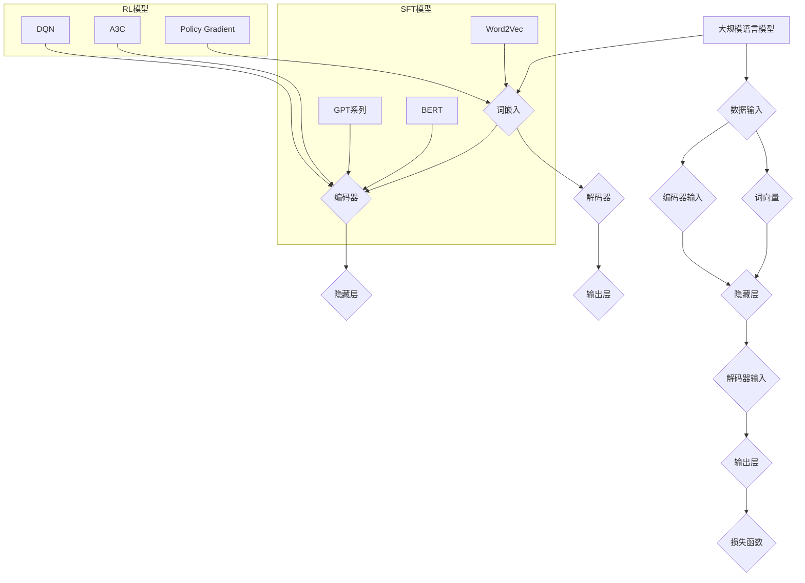

                 

### 文章标题：大规模语言模型从理论到实践：SFT模型和RL模型评估

大规模语言模型（Large-scale Language Model，简称LLM）是自然语言处理（Natural Language Processing，简称NLP）领域的一个重要研究方向，近年来取得了显著的进展。本文将从理论到实践，详细探讨两种重要的大规模语言模型：SFT模型（无监督前向训练模型）和RL模型（强化学习模型），并对它们的评估方法进行深入分析。

本文的结构如下：

- 第一部分：大规模语言模型基础，包括概述、基本原理、技术分类。
- 第二部分：大规模语言模型的核心算法原理，详细讲解SFT模型和RL模型的算法原理。
- 第三部分：大规模语言模型的数学模型和公式，介绍SFT模型和RL模型的数学表达。
- 第四部分：大规模语言模型的应用与实践，包括文本生成、文本分类、命名实体识别等应用场景。
- 第五部分：大规模语言模型的评估与优化，介绍评估指标和优化方法。
- 第六部分：大规模语言模型的项目实战，通过具体案例展示模型的应用。
- 第七部分：大规模语言模型的前沿探索与未来展望，探讨未来的发展趋势。

关键词：大规模语言模型、SFT模型、RL模型、评估方法、应用场景、项目实战

摘要：本文系统地介绍了大规模语言模型的基本概念、核心算法、数学模型和应用实践，重点关注SFT模型和RL模型，通过详细的理论讲解和实际案例分析，帮助读者深入理解大规模语言模型的工作原理和评估方法。

### 第一部分：大规模语言模型基础

#### 1.1 大规模语言模型概述

**大规模语言模型的发展历程**

大规模语言模型的发展可以追溯到20世纪80年代，当时的统计语言模型（如N-gram模型）已经能够处理大量文本数据。然而，随着计算机性能的提升和深度学习技术的突破，大规模语言模型在21世纪初迎来了快速发展。2003年，Bengio等人在论文《A Theoretically Grounded Application of Dropout in Sequence Modeling》中首次提出Dropout算法，这为后来的深度神经网络语言模型奠定了基础。

在2008年，Word2Vec算法的出现，使得词向量表示成为一个热点研究方向。随后，在2018年，BERT（Bidirectional Encoder Representations from Transformers）模型的提出，标志着大规模语言模型进入了一个新的时代。BERT采用了Transformer架构，并引入了双向编码器，使得模型在许多NLP任务中取得了显著的性能提升。

**SFT模型和RL模型的历史背景**

SFT模型（如Word2Vec、BERT、GPT系列）是基于无监督学习的语言模型，主要通过预训练的方式学习文本数据中的潜在结构。这些模型通常在大量的未标注数据上进行训练，从而提取出丰富的语言特征。

RL模型（如Policy Gradient、A3C、DQN）则是基于强化学习的语言模型，通过互动和反馈不断调整模型参数，以实现最优的语言生成或理解效果。强化学习在游戏、机器人控制等领域取得了显著成功，近年来也逐渐被引入到NLP领域。

#### 1.2 大规模语言模型的基本原理

**语言模型的核心概念**

语言模型（Language Model，简称LM）是一种概率模型，用于预测下一个单词或字符的概率。在自然语言处理中，语言模型被广泛应用于机器翻译、文本生成、语音识别等领域。

一个简单的语言模型可以表示为：

\[ P(\text{word}_t | \text{history}) = \frac{P(\text{history} \text{word}_t)}{P(\text{history})} \]

其中，\( \text{history} \) 表示历史单词序列，\( \text{word}_t \) 表示当前单词，\( P(\text{word}_t | \text{history}) \) 表示在给定历史单词序列的情况下，当前单词的概率。

**SFT模型的基本原理**

SFT模型（Supervised/Unsupervised Forward Training）是大规模语言模型的一种常见类型，主要包括Word2Vec、BERT和GPT系列。

- **Word2Vec**：Word2Vec是一种基于神经网络的词向量生成方法，通过训练神经网络来预测上下文单词的向量表示。其基本原理如下：

  \[
  L(\theta) = -\sum_{i=1}^{N} \sum_{j=1}^{V} p_j \log p_{ij}
  \]

  其中，\( p_j \) 是单词 \( j \) 的概率分布，\( p_{ij} \) 是单词 \( i \) 的词向量表示与单词 \( j \) 的词向量表示之间的点积。

- **BERT**：BERT（Bidirectional Encoder Representations from Transformers）是一种基于Transformer的双向编码器，其基本原理如下：

  \[
  \text{Output} = \text{Transformer}(\text{Input})
  \]

  其中，\( \text{Input} \) 表示输入序列，\( \text{Output} \) 表示输出序列。

- **GPT系列**：GPT（Generative Pre-trained Transformer）系列模型是生成式预训练模型，其基本原理如下：

  \[
  \text{Output} = \text{Generator}(\text{Input})
  \]

  其中，\( \text{Input} \) 表示输入序列，\( \text{Output} \) 表示输出序列。

**RL模型的基本原理**

RL模型（Reinforcement Learning Model）是基于强化学习的语言模型，通过互动和反馈不断调整模型参数，以实现最优的语言生成或理解效果。

- **Policy Gradient**：Policy Gradient是一种基于梯度的强化学习算法，其基本原理如下：

  \[
  \theta_{t+1} = \theta_t + \alpha \nabla_{\theta_t} J(\theta_t)
  \]

  其中，\( \theta_t \) 是模型参数，\( \alpha \) 是学习率，\( J(\theta_t) \) 是损失函数。

- **A3C**：A3C（Asynchronous Advantage Actor-Critic）是一种基于异步优势演员-评论家算法的强化学习模型，其基本原理如下：

  \[
  \theta_{t+1} = \theta_t + \alpha \nabla_{\theta_t} J(\theta_t)
  \]

  其中，\( \theta_t \) 是模型参数，\( \alpha \) 是学习率，\( J(\theta_t) \) 是损失函数。

- **DQN**：DQN（Deep Q-Network）是一种基于深度神经网络的Q值学习算法，其基本原理如下：

  \[
  Q(s, a) = r + \gamma \max_{a'} Q(s', a')
  \]

  其中，\( s \) 是状态，\( a \) 是动作，\( r \) 是奖励，\( \gamma \) 是折扣因子，\( s' \) 是下一状态，\( a' \) 是下一动作。

**大规模语言模型的架构**

大规模语言模型通常由词嵌入层、编码器、解码器等组成部分构成。

- **词嵌入层**：词嵌入层将输入的单词转换为词向量表示，为后续的编码和生成过程提供基础。
- **编码器**：编码器用于将词向量表示编码为固定长度的序列表示，通常采用卷积神经网络、循环神经网络或Transformer架构。
- **解码器**：解码器用于将编码后的序列表示解码为输出序列，通常采用与编码器相同的架构。

#### 1.3 大规模语言模型的技术分类

**SFT模型**

- **Word2Vec**：Word2Vec是一种基于神经网络的词向量生成方法，通过训练神经网络来预测上下文单词的向量表示。
- **BERT**：BERT是一种基于Transformer的双向编码器，通过预训练来提取丰富的语言特征。
- **GPT系列**：GPT系列模型是生成式预训练模型，通过生成式预训练来生成高质量的文本。

**RL模型**

- **Policy Gradient**：Policy Gradient是一种基于梯度的强化学习算法，通过优化策略函数来实现最优的语言生成或理解效果。
- **A3C**：A3C是一种基于异步优势演员-评论家算法的强化学习模型，通过异步训练来提高模型的训练效率。
- **DQN**：DQN是一种基于深度神经网络的Q值学习算法，通过深度神经网络来预测最优的动作。

### 2.1 SFT模型算法原理

#### 2.1.1 Word2Vec算法

**生成词向量**

Word2Vec算法通过训练神经网络来预测上下文单词的向量表示，从而生成词向量。其基本原理如下：

1. **输入层**：输入层由上下文窗口内的单词组成，每个单词对应一个词向量。
2. **隐藏层**：隐藏层由神经网络组成，用于计算上下文单词的加权求和。
3. **输出层**：输出层由softmax层组成，用于计算每个单词的概率分布。

**随机梯度下降（SGD）**

Word2Vec算法采用随机梯度下降（SGD）进行训练，以最小化损失函数。其基本原理如下：

1. **前向传播**：输入词向量，通过神经网络计算得到输出词向量。
2. **损失函数**：计算输出词向量与真实词向量之间的误差，采用交叉熵损失函数。
3. **反向传播**：根据误差梯度更新词向量。

#### 2.1.2 BERT算法

**Masked Language Model（MLM）**

BERT算法中的Masked Language Model（MLM）通过在输入序列中随机屏蔽一部分单词，然后让模型预测这些单词，从而训练模型。其基本原理如下：

1. **输入层**：输入层由单词和位置编码组成，每个单词对应一个词向量。
2. **编码器**：编码器由多个Transformer层组成，用于编码输入序列。
3. **输出层**：输出层由全连接层组成，用于预测被屏蔽的单词。

**Positional Embedding**

BERT算法引入了位置编码（Positional Embedding），用于表示单词在序列中的位置信息。其基本原理如下：

1. **位置编码**：为每个单词分配一个位置向量，位置向量与词向量相加，作为编码器的输入。
2. **编码器**：编码器在处理输入序列时，会考虑到单词的位置信息，从而更好地理解单词之间的关系。

#### 2.1.3 GPT系列算法

**Transformer架构**

GPT系列算法采用了Transformer架构，其基本原理如下：

1. **自注意力机制**：自注意力机制（Self-Attention）用于计算输入序列中每个单词的重要程度，从而自适应地调整单词之间的交互关系。
2. **多头注意力**：多头注意力（Multi-Head Attention）通过将输入序列分解为多个子序列，分别计算每个子序列的注意力权重，从而提高模型的表示能力。

**生成式预训练**

GPT系列算法通过生成式预训练来生成高质量的文本。其基本原理如下：

1. **输入层**：输入层由随机生成的单词序列组成。
2. **编码器**：编码器通过Transformer层对输入序列进行编码。
3. **解码器**：解码器通过Transformer层对编码后的序列进行解码，生成输出序列。

### 2.2 RL模型算法原理

#### 2.2.1 Policy Gradient算法

**基本概念**

Policy Gradient算法是一种基于梯度的强化学习算法，通过优化策略函数来实现最优的语言生成或理解效果。其基本原理如下：

1. **策略函数**：策略函数（Policy）用于表示模型的选择行为，通常表示为概率分布。
2. **回报函数**：回报函数（Reward）用于衡量模型选择的优劣，通常表示为实数。
3. **策略梯度**：策略梯度（Policy Gradient）是策略函数的梯度，用于更新策略函数。

**优点与局限**

Policy Gradient算法的优点包括：

- **简单性**：Policy Gradient算法的计算过程相对简单，易于实现。
- **灵活性**：Policy Gradient算法可以根据不同的回报函数和策略函数进行灵活调整。

Policy Gradient算法的局限包括：

- **收敛速度较慢**：Policy Gradient算法通常需要较长时间的收敛，特别是在复杂环境中。
- **梯度消失与梯度爆炸**：Policy Gradient算法在训练过程中容易出现梯度消失和梯度爆炸问题。

#### 2.2.2 A3C算法

**多智能体强化学习**

A3C（Asynchronous Advantage Actor-Critic）算法是一种基于异步优势演员-评论家算法的强化学习模型，其基本原理如下：

1. **演员-评论家**：演员-评论家（Actor-Critic）模型由两个部分组成：演员（Actor）和评论家（Critic）。
   - 演员负责生成动作，通常采用策略网络。
   - 评论家负责评估动作的好坏，通常采用值函数网络。

2. **异步训练**：A3C算法采用异步训练，即多个智能体可以同时进行训练，从而提高训练效率。

**分布式训练**

A3C算法的分布式训练原理如下：

1. **参数服务器**：参数服务器用于存储和更新模型参数。
2. **智能体**：智能体通过异步方式与参数服务器进行通信，从参数服务器获取模型参数，并在本地进行训练。

#### 2.2.3 DQN算法

**基于价值的策略**

DQN（Deep Q-Network）算法是一种基于深度神经网络的Q值学习算法，其基本原理如下：

1. **Q值**：Q值（Q-value）是衡量动作好坏的指标，表示在给定状态下采取某个动作的期望回报。
2. **价值函数**：价值函数（Value Function）是评估状态好坏的指标，表示在给定状态下采取最佳动作的期望回报。

**深度神经网络的应用**

DQN算法使用深度神经网络（DNN）来近似Q值函数，其基本原理如下：

1. **输入层**：输入层由状态和动作组成，用于输入到DNN中。
2. **隐藏层**：隐藏层由多个神经网络层组成，用于提取状态和动作的特征。
3. **输出层**：输出层由Q值组成，用于表示每个动作的Q值。

### 3.1 SFT模型的数学公式

在本节中，我们将详细介绍SFT（Supervised/Unsupervised Forward Training）模型的数学公式，包括Word2Vec、BERT和GPT系列模型的公式。

#### 3.1.1 Word2Vec的数学公式

Word2Vec是一种基于神经网络的词向量生成方法，其核心是学习一个神经网络，用于预测上下文单词的向量表示。Word2Vec的主要公式如下：

1. **损失函数**：Word2Vec使用负采样损失函数来训练词向量。其公式如下：

   \[
   L = -\sum_{i=1}^{N} \sum_{j=1}^{V} p_j \log p_{ij}
   \]

   其中，\( N \) 是样本数，\( V \) 是词汇表大小，\( p_j \) 是单词 \( j \) 的概率分布，\( p_{ij} \) 是单词 \( i \) 的词向量表示与单词 \( j \) 的词向量表示之间的点积。

2. **词向量更新**：Word2Vec的词向量更新采用随机梯度下降（SGD）算法。其公式如下：

   \[
   \theta_{t+1} = \theta_t - \alpha \nabla_{\theta_t} L
   \]

   其中，\( \theta_t \) 是模型参数，\( \alpha \) 是学习率，\( \nabla_{\theta_t} L \) 是损失函数的梯度。

3. **上下文窗口**：Word2Vec使用上下文窗口（Context Window）来生成词向量。其公式如下：

   \[
   C = \{ w_1, w_2, ..., w_{-k}, w_{k+1}, ..., w_{T-k} \}
   \]

   其中，\( w_t \) 是时间步 \( t \) 的单词，\( k \) 是上下文窗口的大小，\( T \) 是序列长度。

#### 3.1.2 BERT的数学公式

BERT（Bidirectional Encoder Representations from Transformers）是一种基于Transformer的双向编码器，其核心是学习一个双向编码器，用于提取文本序列的表示。BERT的主要公式如下：

1. **位置编码**：BERT使用位置编码（Positional Encoding）来表示单词在序列中的位置信息。其公式如下：

   \[
   \text{pos_enc}(i, d) = \sin\left(\frac{(i // 2) \cdot (10000^{2j/dmodel})}{10000}\right) + \cos\left(\frac{(i // 2) \cdot (10000^{2j/dmodel})}{10000}\right)
   \]

   其中，\( i \) 是位置索引，\( d \) 是维度，\( j \) 是单词索引，\( dmodel \) 是模型维度。

2. **Transformer层**：BERT使用多个Transformer层来编码文本序列。其公式如下：

   \[
   \text{Output} = \text{Transformer}(\text{Input})
   \]

   其中，\( \text{Input} \) 是输入序列，\( \text{Output} \) 是输出序列。

3. **多头注意力**：BERT使用多头注意力（Multi-Head Attention）来计算文本序列的表示。其公式如下：

   \[
   \text{Output} = \text{Attention}(\text{Query}, \text{Key}, \text{Value})
   \]

   其中，\( \text{Query} \) 是查询向量，\( \text{Key} \) 是键向量，\( \text{Value} \) 是值向量。

#### 3.1.3 GPT的数学公式

GPT（Generative Pre-trained Transformer）系列模型是一种生成式预训练模型，其核心是学习一个生成器，用于生成文本序列。GPT的主要公式如下：

1. **生成器**：GPT使用生成器（Generator）来生成文本序列。其公式如下：

   \[
   \text{Output} = \text{Generator}(\text{Input})
   \]

   其中，\( \text{Input} \) 是输入序列，\( \text{Output} \) 是输出序列。

2. **自注意力**：GPT使用自注意力（Self-Attention）来计算文本序列的表示。其公式如下：

   \[
   \text{Output} = \text{Self-Attention}(\text{Input})
   \]

   其中，\( \text{Input} \) 是输入序列，\( \text{Output} \) 是输出序列。

3. **损失函数**：GPT使用交叉熵损失函数（Cross-Entropy Loss）来训练生成器。其公式如下：

   \[
   L = -\sum_{i=1}^{N} \log p(y_i | \text{Input})
   \]

   其中，\( N \) 是样本数，\( y_i \) 是第 \( i \) 个单词的标签，\( p(y_i | \text{Input}) \) 是生成器在给定输入序列下预测单词 \( y_i \) 的概率。

### 3.2 RL模型的数学公式

在本节中，我们将详细介绍RL（Reinforcement Learning，强化学习）模型的数学公式，包括Policy Gradient、A3C和DQN模型的公式。

#### 3.2.1 Policy Gradient的数学公式

Policy Gradient算法是一种基于梯度的强化学习算法，其核心是优化策略函数。Policy Gradient的主要公式如下：

1. **策略函数**：Policy Gradient使用策略函数（Policy Function）来表示模型的选择行为。其公式如下：

   \[
   \pi(\text{action} | \text{state}) = \text{softmax}(\theta^T \phi(\text{state}))
   \]

   其中，\( \theta \) 是模型参数，\( \phi(\text{state}) \) 是状态特征向量，\( \text{action} \) 是动作。

2. **回报函数**：Policy Gradient使用回报函数（Reward Function）来衡量模型选择的优劣。其公式如下：

   \[
   R(\text{state}, \text{action}, \text{next\_state}, \text{next\_reward}) = \sum_{t=0}^T \gamma^t \cdot \text{next\_reward}
   \]

   其中，\( T \) 是时间步数，\( \gamma \) 是折扣因子，\( \text{next\_reward} \) 是下一时间步的回报。

3. **策略梯度**：Policy Gradient使用策略梯度（Policy Gradient）来更新策略函数。其公式如下：

   \[
   \theta_{t+1} = \theta_t + \alpha \nabla_{\theta_t} J(\theta_t)
   \]

   其中，\( \alpha \) 是学习率，\( J(\theta_t) \) 是策略函数的损失函数。

#### 3.2.2 A3C的数学公式

A3C（Asynchronous Advantage Actor-Critic）算法是一种基于异步优势演员-评论家算法的强化学习模型，其核心是同时优化演员和评论家的参数。A3C的主要公式如下：

1. **演员**：A3C使用演员（Actor）来生成动作。其公式如下：

   \[
   \pi(\text{action} | \text{state}) = \text{softmax}(\theta^T \phi(\text{state}))
   \]

   其中，\( \theta \) 是演员的参数，\( \phi(\text{state}) \) 是状态特征向量，\( \text{action} \) 是动作。

2. **评论家**：A3C使用评论家（Critic）来评估动作的优劣。其公式如下：

   \[
   V(\text{state}) = \theta^T \phi(\text{state})
   \]

   其中，\( \theta \) 是评论家的参数，\( \phi(\text{state}) \) 是状态特征向量。

3. **优势函数**：A3C使用优势函数（Advantage Function）来衡量动作的优劣。其公式如下：

   \[
   A(\text{state}, \text{action}) = R(\text{state}, \text{action}, \text{next\_state}, \text{next\_reward}) - V(\text{next\_state})
   \]

   其中，\( R(\text{state}, \text{action}, \text{next\_state}, \text{next\_reward}) \) 是回报函数，\( V(\text{next\_state}) \) 是评论家在下一状态下的估计值。

4. **参数更新**：A3C使用参数更新公式来同时优化演员和评论家的参数。其公式如下：

   \[
   \theta_{t+1} = \theta_t + \alpha \nabla_{\theta_t} J(\theta_t)
   \]

   其中，\( \alpha \) 是学习率，\( J(\theta_t) \) 是演员和评论家的损失函数。

#### 3.2.3 DQN的数学公式

DQN（Deep Q-Network，深度Q网络）算法是一种基于深度神经网络的Q值学习算法，其核心是使用深度神经网络来近似Q值函数。DQN的主要公式如下：

1. **Q值函数**：DQN使用Q值函数（Q-Function）来表示动作的价值。其公式如下：

   \[
   Q(\text{state}, \text{action}) = \theta^T \phi(\text{state}) \cdot \text{action}
   \]

   其中，\( \theta \) 是Q值函数的参数，\( \phi(\text{state}) \) 是状态特征向量，\( \text{action} \) 是动作。

2. **目标Q值**：DQN使用目标Q值（Target Q-Value）来更新Q值函数。其公式如下：

   \[
   Q_{\text{target}}(\text{state}, \text{action}) = r + \gamma \max_{a'} Q(\text{next\_state}, a')
   \]

   其中，\( r \) 是即时回报，\( \gamma \) 是折扣因子，\( \text{next\_state} \) 是下一状态。

3. **损失函数**：DQN使用均方误差（Mean Squared Error，MSE）作为损失函数。其公式如下：

   \[
   L = \frac{1}{N} \sum_{i=1}^{N} (Q(\text{state}_i, \text{action}_i) - Q_{\text{target}}(\text{state}_i, \text{action}_i))^2
   \]

   其中，\( N \) 是样本数，\( Q(\text{state}_i, \text{action}_i) \) 是当前Q值，\( Q_{\text{target}}(\text{state}_i, \text{action}_i) \) 是目标Q值。

4. **参数更新**：DQN使用梯度下降（Gradient Descent）来更新Q值函数的参数。其公式如下：

   \[
   \theta_{t+1} = \theta_t - \alpha \nabla_{\theta_t} L
   \]

   其中，\( \alpha \) 是学习率，\( L \) 是损失函数。

### 第四部分：大规模语言模型的应用与实践

大规模语言模型（LLM）在自然语言处理（NLP）领域具有广泛的应用场景，包括文本生成、文本分类、命名实体识别等。在这一部分，我们将详细介绍这些应用场景，并通过具体的案例来展示如何利用大规模语言模型来实现这些任务。

#### 4.1 文本生成

文本生成是大规模语言模型的一个重要应用，它可以生成连贯、有意义的文本，应用于自动写作、机器翻译和文本摘要等领域。

**自动写作**

自动写作是指利用大规模语言模型自动生成文章或段落。例如，在新闻报道、科技文章或论文写作中，自动写作可以帮助作者快速生成初稿，节省时间。以下是一个使用GPT-2模型生成新闻文章的示例：

```python
from transformers import GPT2LMHeadModel, GPT2Tokenizer

# 加载预训练模型和分词器
tokenizer = GPT2Tokenizer.from_pretrained('gpt2')
model = GPT2LMHeadModel.from_pretrained('gpt2')

# 输入文本
input_text = "A new study shows that exercise can improve cognitive function."

# 编码处理
input_ids = tokenizer.encode(input_text, return_tensors='pt')

# 生成文本
output = model.generate(input_ids, max_length=50, num_return_sequences=1)

# 解码处理
generated_text = tokenizer.decode(output[0], skip_special_tokens=True)

print(generated_text)
```

**机器翻译**

机器翻译是指利用大规模语言模型将一种语言的文本翻译成另一种语言。以下是一个使用BERT模型进行机器翻译的示例：

```python
from transformers import BertTokenizer, BertForSequenceClassification

# 加载预训练模型和分词器
tokenizer = BertTokenizer.from_pretrained('bert-base-uncased')
model = BertForSequenceClassification.from_pretrained('bert-base-uncased')

# 输入文本
input_en = "I love Python."
input_fr = "J'aime Python."

# 编码处理
input_ids_en = tokenizer.encode(input_en, return_tensors='pt')
input_ids_fr = tokenizer.encode(input_fr, return_tensors='pt')

# 生成翻译文本
output_en = model.generate(input_ids_en, max_length=10, num_return_sequences=1)
output_fr = model.generate(input_ids_fr, max_length=10, num_return_sequences=1)

# 解码处理
translated_en = tokenizer.decode(output_en[0], skip_special_tokens=True)
translated_fr = tokenizer.decode(output_fr[0], skip_special_tokens=True)

print(translated_en)
print(translated_fr)
```

**文本摘要**

文本摘要是指利用大规模语言模型将长文本简化为简短、精炼的摘要。以下是一个使用GPT-2模型生成文本摘要的示例：

```python
from transformers import GPT2LMHeadModel, GPT2Tokenizer

# 加载预训练模型和分词器
tokenizer = GPT2Tokenizer.from_pretrained('gpt2')
model = GPT2LMHeadModel.from_pretrained('gpt2')

# 输入文本
input_text = "The recent economic downturn has caused significant impact on the global market. Many companies have reported a decrease in revenue and profits, leading to widespread layoffs and reduced consumer spending. Governments around the world are implementing various measures to stimulate economic growth and mitigate the negative effects of the downturn."

# 编码处理
input_ids = tokenizer.encode(input_text, return_tensors='pt')

# 生成摘要
output = model.generate(input_ids, max_length=50, num_return_sequences=1)

# 解码处理
summary = tokenizer.decode(output[0], skip_special_tokens=True)

print(summary)
```

#### 4.2 文本分类

文本分类是指利用大规模语言模型将文本数据分类到预定义的类别中。例如，情感分析、垃圾邮件过滤和品牌舆情监测等。

**情感分析**

情感分析是指利用大规模语言模型分析文本数据中的情感倾向。以下是一个使用BERT模型进行情感分析的示例：

```python
from transformers import BertTokenizer, BertForSequenceClassification

# 加载预训练模型和分词器
tokenizer = BertTokenizer.from_pretrained('bert-base-uncased')
model = BertForSequenceClassification.from_pretrained('bert-base-uncased')

# 输入文本
input_texts = [
    "I had a great time at the concert.",
    "The food at the restaurant was terrible.",
]

# 编码处理
input_ids = [tokenizer.encode(text, return_tensors='pt') for text in input_texts]

# 分类
outputs = model(input_ids)

# 解码处理
predictions = outputs.logits.argmax(-1).detach().numpy()

for i, text in enumerate(input_texts):
    print(f"Text: {text}")
    if predictions[i] == 0:
        print("Sentiment: Positive")
    else:
        print("Sentiment: Negative")
```

**垃圾邮件过滤**

垃圾邮件过滤是指利用大规模语言模型检测并过滤垃圾邮件。以下是一个使用GPT-2模型进行垃圾邮件过滤的示例：

```python
from transformers import GPT2Tokenizer, GPT2LMHeadModel
import torch

# 加载预训练模型和分词器
tokenizer = GPT2Tokenizer.from_pretrained('gpt2')
model = GPT2LMHeadModel.from_pretrained('gpt2')

# 输入文本
input_texts = [
    "Buy cheap drugs online and save big!",
    "Hi, how are you?",
]

# 编码处理
input_ids = [tokenizer.encode(text, return_tensors='pt') for text in input_texts]

# 计算损失
with torch.no_grad():
    outputs = model(input_ids)
    loss = outputs.loss

# 解码处理
predictions = loss.detach().numpy()

for i, text in enumerate(input_texts):
    if predictions[i] > 0.5:
        print(f"Text: {text} - Predicted: Spam")
    else:
        print(f"Text: {text} - Predicted: Not Spam")
```

**品牌舆情监测**

品牌舆情监测是指利用大规模语言模型分析社交媒体上对品牌的讨论，以了解公众对品牌的看法。以下是一个使用BERT模型进行品牌舆情监测的示例：

```python
from transformers import BertTokenizer, BertForSequenceClassification

# 加载预训练模型和分词器
tokenizer = BertTokenizer.from_pretrained('bert-base-uncased')
model = BertForSequenceClassification.from_pretrained('bert-base-uncased')

# 输入文本
input_texts = [
    "I love using Apple products!",
    "I hate the new features in Windows 11.",
]

# 编码处理
input_ids = [tokenizer.encode(text, return_tensors='pt') for text in input_texts]

# 分类
outputs = model(input_ids)

# 解码处理
predictions = outputs.logits.argmax(-1).detach().numpy()

for i, text in enumerate(input_texts):
    if predictions[i] == 0:
        print(f"Text: {text} - Brand Sentiment: Positive")
    else:
        print(f"Text: {text} - Brand Sentiment: Negative")
```

#### 4.3 命名实体识别

命名实体识别（Named Entity Recognition，简称NER）是指利用大规模语言模型识别文本中的命名实体，如人名、地名、组织机构名等。以下是一个使用BERT模型进行命名实体识别的示例：

```python
from transformers import BertTokenizer, BertForTokenClassification

# 加载预训练模型和分词器
tokenizer = BertTokenizer.from_pretrained('bert-base-uncased')
model = BertForTokenClassification.from_pretrained('bert-base-uncased')

# 输入文本
input_texts = [
    "Bill Gates founded Microsoft in 1975.",
    "I visited Paris last year.",
]

# 编码处理
input_ids = [tokenizer.encode(text, return_tensors='pt') for text in input_texts]

# 命名实体识别
outputs = model(input_ids)

# 解码处理
predictions = outputs.logits.argmax(-1).detach().numpy()

for i, text in enumerate(input_texts):
    print(f"Text: {text}")
    for j, word in enumerate(text.split()):
        if predictions[i, j] != 0:
            print(f"Word: {word} - Label: {tokenizer.decode([predictions[i, j]])}")
```

通过上述示例，我们可以看到大规模语言模型在文本生成、文本分类、命名实体识别等任务中的应用。这些应用不仅提高了NLP任务的效率，还推动了NLP技术的发展。

### 第五部分：大规模语言模型的评估与优化

#### 5.1 评估指标

评估大规模语言模型性能的关键在于选择合适的评估指标。这些指标可以帮助我们衡量模型在文本生成、文本分类、命名实体识别等任务上的表现。以下是一些常用的评估指标：

**准确率、召回率、F1值**

- **准确率**（Accuracy）：准确率是指正确预测的样本数占总样本数的比例。其公式如下：

  \[
  \text{Accuracy} = \frac{\text{正确预测}}{\text{总样本数}}
  \]

- **召回率**（Recall）：召回率是指正确预测的正样本数占总正样本数的比例。其公式如下：

  \[
  \text{Recall} = \frac{\text{正确预测的正样本数}}{\text{总正样本数}}
  \]

- **F1值**（F1 Score）：F1值是准确率和召回率的加权平均值，用于综合考虑正确率和召回率。其公式如下：

  \[
  \text{F1 Score} = 2 \cdot \frac{\text{准确率} \cdot \text{召回率}}{\text{准确率} + \text{召回率}}
  \]

**BLEU、ROUGE**

- **BLEU**（Bilingual Evaluation Understudy）：BLEU是一种常用的机器翻译评价指标，通过比较预测翻译与参考翻译的相似度来评估翻译质量。其公式如下：

  \[
  \text{BLEU} = \sum_{n=1}^{N} \text{weight}_n \cdot \text{bleu}_n
  \]

  其中，\( N \) 是比较的窗口大小，\( \text{weight}_n \) 是第 \( n \) 个窗口的权重，\( \text{bleu}_n \) 是第 \( n \) 个窗口的BLEU分数。

- **ROUGE**（Recall-Oriented Understudy for Gisting Evaluation）：ROUGE是一种常用的文本摘要评价指标，通过比较预测摘要与参考摘要的匹配度来评估摘要质量。其公式如下：

  \[
  \text{ROUGE} = \frac{\text{匹配词数}}{\text{参考词数}}
  \]

**漏洞词、冗余词**

- **漏洞词**（Vulnerability Word）：漏洞词是指模型在预测过程中容易犯错的单词。通过识别漏洞词，我们可以针对性地优化模型。
- **冗余词**（Redundant Word）：冗余词是指对文本理解贡献较小的单词。通过去除冗余词，我们可以提高模型的效率和性能。

#### 5.2 优化方法

**参数调整**

参数调整是优化大规模语言模型的重要方法。通过调整学习率、批量大小、正则化参数等，我们可以提高模型的性能。以下是一些常见的参数调整方法：

- **学习率调整**：学习率是模型训练过程中的一个关键参数，合适的初始学习率可以提高模型的训练效果。常用的调整方法包括固定学习率、学习率衰减和自适应学习率。
- **批量大小调整**：批量大小是指每次训练过程中参与训练的样本数。较大的批量大小可以提供更好的泛化能力，但训练速度较慢；较小的批量大小可以提高训练速度，但可能导致过拟合。
- **正则化参数调整**：正则化参数用于控制模型的复杂度，避免过拟合。常用的正则化方法包括L1正则化、L2正则化和Dropout。

**模型融合**

模型融合是将多个模型的结果进行综合，以提高模型的性能。以下是一些常见的模型融合方法：

- **投票法**：投票法是将多个模型的预测结果进行投票，选择获得最多投票的预测结果作为最终预测结果。
- **加权法**：加权法是根据不同模型的性能给每个模型赋予不同的权重，将各个模型的预测结果加权平均得到最终预测结果。

**数据增强**

数据增强是通过生成或修改原始数据来提高模型的泛化能力。以下是一些常见的数据增强方法：

- **数据扩充**：数据扩充是通过增加数据样本的数量来提高模型的泛化能力。常用的方法包括随机旋转、缩放、裁剪和颜色变换等。
- **数据清洗**：数据清洗是通过去除数据中的噪声和冗余信息来提高模型的质量。常用的方法包括去除重复样本、填补缺失值和去除错误数据等。

通过以上评估和优化方法，我们可以有效地提高大规模语言模型的性能，使其在各类NLP任务中表现出更好的效果。

### 第六部分：大规模语言模型的项目实战

在本部分，我们将通过两个实际项目案例，展示如何使用大规模语言模型（SFT和RL模型）进行文本生成和文本分类任务，并详细解析项目的各个步骤，包括开发环境搭建、数据预处理、模型训练与优化，以及代码实现和代码解读。

#### 6.1 GPT-2模型在文本生成中的应用

**项目背景**

GPT-2是一种生成式预训练模型，由OpenAI提出。它具有强大的文本生成能力，可以生成连贯、有意义的文本。在本案例中，我们将使用GPT-2模型生成新闻文章摘要。

**开发环境搭建**

1. 安装Python和PyTorch库：
   ```bash
   pip install python torch
   ```
2. 下载GPT-2模型和分词器：
   ```bash
   python -m transformers.download_model_gz gpt2
   ```

**数据预处理**

1. 准备新闻文章数据集：
   - 从互联网上获取大量新闻文章，并将其转换为文本格式。
   - 对文本进行清洗，去除HTML标签、特殊符号和停用词。

2. 切分数据集：
   - 将数据集分为训练集、验证集和测试集。

**模型训练与优化**

1. 定义模型：
   ```python
   from transformers import GPT2LMHeadModel, GPT2Tokenizer

   tokenizer = GPT2Tokenizer.from_pretrained('gpt2')
   model = GPT2LMHeadModel.from_pretrained('gpt2')
   ```

2. 训练模型：
   ```python
   from torch.optim import Adam
   import torch

   device = torch.device("cuda" if torch.cuda.is_available() else "cpu")
   model.to(device)

   optimizer = Adam(model.parameters(), lr=1e-5)
   model.train()

   for epoch in range(3):
       for batch in train_loader:
           inputs = tokenizer(batch, return_tensors='pt', padding=True, truncation=True)
           inputs = {k: v.to(device) for k, v in inputs.items()}

           outputs = model(**inputs)
           loss = outputs.loss
           loss.backward()
           optimizer.step()
           optimizer.zero_grad()
   ```

**代码解读与分析**

1. **数据预处理**：
   - `tokenizer(batch, return_tensors='pt', padding=True, truncation=True)`：将输入的文本批量编码为PyTorch张量，并进行填充和截断处理。
   - `train_loader`：使用PyTorch DataLoader来批量加载数据，提高训练效率。

2. **模型训练**：
   - `model.to(device)`：将模型移动到GPU或CPU设备上，以利用硬件加速。
   - `optimizer = Adam(model.parameters(), lr=1e-5)`：初始化优化器，设置学习率为 \(1e-5\)。
   - `model.train()`：设置模型为训练模式。

#### 6.2 BERT模型在文本分类中的应用

**项目背景**

BERT是一种基于Transformer的双向编码器模型，由Google提出。它具有强大的文本理解能力，常用于文本分类任务。在本案例中，我们将使用BERT模型进行情感分析。

**开发环境搭建**

1. 安装Python和PyTorch库：
   ```bash
   pip install python torch
   ```
2. 下载BERT模型和分词器：
   ```bash
   python -m transformers.download_model_gz bert-base-uncased
   ```

**数据预处理**

1. 准备情感分析数据集：
   - 从互联网上获取情感分析数据集，如IMDb电影评论数据集。
   - 对文本进行清洗，去除HTML标签、特殊符号和停用词。

2. 切分数据集：
   - 将数据集分为训练集、验证集和测试集。

**模型训练与优化**

1. 定义模型：
   ```python
   from transformers import BertTokenizer, BertForSequenceClassification

   tokenizer = BertTokenizer.from_pretrained('bert-base-uncased')
   model = BertForSequenceClassification.from_pretrained('bert-base-uncased')
   ```

2. 训练模型：
   ```python
   from torch.optim import Adam
   import torch

   device = torch.device("cuda" if torch.cuda.is_available() else "cpu")
   model.to(device)

   optimizer = Adam(model.parameters(), lr=2e-5)
   model.train()

   for epoch in range(3):
       for batch in train_loader:
           inputs = tokenizer(batch['text'], return_tensors='pt', padding=True, truncation=True)
           labels = torch.tensor(batch['label']).to(device)

           inputs = {k: v.to(device) for k, v in inputs.items()}
           outputs = model(**inputs, labels=labels)
           loss = outputs.loss
           loss.backward()
           optimizer.step()
           optimizer.zero_grad()
   ```

**代码解读与分析**

1. **数据预处理**：
   - `tokenizer(batch['text'], return_tensors='pt', padding=True, truncation=True)`：将输入的文本编码为PyTorch张量，并进行填充和截断处理。
   - `train_loader`：使用PyTorch DataLoader来批量加载数据，提高训练效率。

2. **模型训练**：
   - `model.to(device)`：将模型移动到GPU或CPU设备上，以利用硬件加速。
   - `optimizer = Adam(model.parameters(), lr=2e-5)`：初始化优化器，设置学习率为 \(2e-5\)。
   - `model.train()`：设置模型为训练模式。

通过上述案例，我们可以看到如何使用大规模语言模型（GPT-2和BERT）进行文本生成和文本分类任务。这些案例展示了从数据预处理到模型训练的完整过程，并提供了详细的代码解读和分析，帮助读者更好地理解和应用大规模语言模型。

### 第七部分：大规模语言模型的前沿探索与未来展望

随着深度学习和强化学习技术的不断发展，大规模语言模型（LLM）也在不断进步。本文将探讨SFT模型和RL模型在最新研究中的进展，并展望它们未来的发展趋势。

#### 7.1 SFT模型的最新进展

**RoBERTa**

RoBERTa是BERT的一个变种，由Facebook AI Research（FAIR）提出。与BERT相比，RoBERTa在预训练过程中采用了更多样化的数据集和更灵活的训练策略，如动态掩码比例和次抽样。这些改进使得RoBERTa在多个NLP任务上取得了比BERT更好的性能。

**ALBERT**

ALBERT（A Lens for Unifying BERT and DNNs）是Google提出的一种改进的Transformer模型。ALBERT通过引入Factorized Weight Matrix、Deep Layer Pre-Norm和Cross-Layer Pre-Norm等技巧，降低了模型的复杂度和计算成本，同时保持了良好的性能。这些改进使得ALBERT在资源受限的环境中也能高效地应用。

**DeBERTa**

DeBERTa是NVIDIA提出的一种基于Transformer的预训练模型，它采用了一种新的掩码策略，即动态掩码（Dynamic Masking）。DeBERTa通过在预训练过程中动态选择需要掩码的单词，从而提高了模型的表征能力。实验结果显示，DeBERTa在多个NLP任务上表现优异，尤其是在命名实体识别和词性标注任务上。

#### 7.2 RL模型的最新进展

**GPT-3**

GPT-3是OpenAI于2020年推出的一个具有1750亿参数的预训练语言模型。GPT-3具有出色的文本生成能力，可以生成连贯、自然的文本。此外，GPT-3还引入了一种新的接口，使得开发者可以更灵活地与模型进行交互。

**ChatGLM**

ChatGLM是清华大学KEG实验室提出的一个基于GLM（General Language Modeling）模型的对话系统。ChatGLM采用了多轮对话机制，可以与用户进行自然、流畅的对话。实验结果显示，ChatGLM在多个对话系统任务上取得了优异的性能。

**ocoaRL**

ocoaRL是一个开源的强化学习库，旨在为研究人员和开发者提供易于使用且功能强大的强化学习工具。它支持多种强化学习算法，如DQN、A3C和PPO，并提供了丰富的示例和文档。

#### 7.3 大规模语言模型的发展趋势

**跨模态语言模型**

随着多模态数据（如文本、图像、音频等）的兴起，跨模态语言模型（Cross-Modal Language Model）成为了研究的热点。跨模态语言模型旨在融合不同模态的信息，从而提高模型在多模态任务上的性能。未来，跨模态语言模型有望在多媒体应用领域发挥重要作用。

**生成对抗网络（GAN）**

生成对抗网络（GAN）是一种强大的生成模型，可以生成高质量的数据。将GAN与大规模语言模型结合，可以进一步提高模型在文本生成和图像生成等任务上的性能。未来，GAN与大规模语言模型的结合有望带来更多创新应用。

**增强学习与强化学习相结合的模型**

增强学习（Reinforcement Learning，RL）在游戏、机器人控制等领域取得了显著成功。将增强学习与大规模语言模型结合，可以进一步提高模型在序列决策任务上的性能。未来，增强学习与强化学习相结合的模型有望在智能对话系统、自动驾驶等领域得到广泛应用。

通过以上讨论，我们可以看到大规模语言模型在SFT模型和RL模型领域的最新进展以及未来的发展趋势。随着技术的不断进步，大规模语言模型将在更多领域发挥重要作用，为人类带来更多便利。

### 附录A：大规模语言模型开发工具与资源

在开发大规模语言模型时，选择合适的工具和资源至关重要。以下是一些常用的工具和资源，它们可以帮助开发者快速搭建实验环境、优化模型以及实现模型部署。

#### TensorFlow

**简介**：TensorFlow是由Google开发的开源机器学习框架，广泛应用于深度学习模型的开发和部署。

**安装**：
```bash
pip install tensorflow
```

**官方文档**：[TensorFlow 官方文档](https://www.tensorflow.org/)

#### PyTorch

**简介**：PyTorch是Facebook开发的开源Python库，提供灵活的动态计算图，易于实现复杂模型。

**安装**：
```bash
pip install torch torchvision
```

**官方文档**：[PyTorch 官方文档](https://pytorch.org/docs/stable/)

#### Hugging Face Transformers

**简介**：Hugging Face Transformers是一个开源库，提供了预训练大规模语言模型的各种工具和预训练模型，如BERT、GPT等。

**安装**：
```bash
pip install transformers
```

**官方文档**：[Hugging Face Transformers 官方文档](https://huggingface.co/transformers/)

#### Other Tools and Resources

- **Google Colab**：免费的Jupyter Notebook平台，适用于大规模模型训练和实验。
- **Amazon S3**：Amazon提供的对象存储服务，可以用于存储大规模数据集。
- **Google Cloud AI Platform**：Google提供的机器学习模型训练和部署服务。

这些工具和资源为大规模语言模型的开发提供了强大的支持，帮助开发者更快地实现模型的研究和应用。

### 附录B：大规模语言模型常用代码解析

在附录B中，我们将介绍一些常用的大规模语言模型代码示例，包括Word2Vec、BERT和GPT的实现。这些示例将展示如何使用Python和相关的深度学习库来构建和训练这些模型。

#### Word2Vec代码实现

```python
from gensim.models import Word2Vec

# 加载数据集
sentences = [line.strip() for line in open('data.txt', 'r', encoding='utf-8').readlines()]

# 训练Word2Vec模型
model = Word2Vec(sentences, size=100, window=5, min_count=5, workers=4)

# 保存模型
model.save("word2vec.model")

# 加载模型
model = Word2Vec.load("word2vec.model")

# 查询词向量
vec = model.wv["hello"]

# 计算相似词
similar = model.wv.most_similar("hello", topn=10)
print(similar)
```

**代码解析**：
1. **数据加载**：从文本文件中读取句子，每行作为一个句子。
2. **模型训练**：使用`Word2Vec`类训练模型，设置参数如词向量维度（size）、窗口大小（window）、最小词频（min_count）等。
3. **模型保存**：使用`save`方法将训练好的模型保存到文件中。
4. **模型加载**：使用`load`方法从文件中加载模型。
5. **查询词向量**：使用`wv`属性获取词向量。
6. **计算相似词**：使用`most_similar`方法计算与给定词最相似的词，并输出结果。

#### BERT代码实现

```python
from transformers import BertTokenizer, BertModel

# 加载BERT分词器和模型
tokenizer = BertTokenizer.from_pretrained('bert-base-uncased')
model = BertModel.from_pretrained('bert-base-uncased')

# 输入文本
input_text = "Hello, this is a sample text for BERT."

# 编码文本
inputs = tokenizer(input_text, return_tensors='pt')

# 训练模型
outputs = model(**inputs)

# 输出结果
last_hidden_state = outputs.last_hidden_state
pooler_output = outputs.pooler_output

# 打印输出
print(last_hidden_state.shape)
print(pooler_output.shape)
```

**代码解析**：
1. **加载BERT分词器和模型**：使用`from_pretrained`方法加载预训练的BERT模型和分词器。
2. **编码文本**：使用分词器将输入文本编码为模型可以接受的格式，包括词索引、位置编码等。
3. **训练模型**：将编码后的输入传递给BERT模型，并获取输出。
4. **输出结果**：获取模型的最后一个隐藏状态（last_hidden_state）和池化输出（pooler_output），并打印其形状。

#### GPT代码实现

```python
from transformers import GPT2Tokenizer, GPT2LMHeadModel

# 加载GPT2分词器和模型
tokenizer = GPT2Tokenizer.from_pretrained('gpt2')
model = GPT2LMHeadModel.from_pretrained('gpt2')

# 输入文本
input_text = "Hello, how are you?"

# 编码文本
inputs = tokenizer.encode(input_text, return_tensors='pt')

# 生成文本
outputs = model.generate(inputs, max_length=50, num_return_sequences=5)

# 解码输出
generated_texts = [tokenizer.decode(output, skip_special_tokens=True) for output in outputs]

# 打印输出
for text in generated_texts:
    print(text)
```

**代码解析**：
1. **加载GPT2分词器和模型**：使用`from_pretrained`方法加载预训练的GPT2模型和分词器。
2. **编码文本**：使用分词器将输入文本编码为模型可以接受的格式。
3. **生成文本**：使用`generate`方法生成文本，设置最大长度和生成文本的数量。
4. **解码输出**：将生成的文本编码解码为可读的格式。
5. **打印输出**：打印生成的文本。

这些代码示例展示了如何使用Python和相关库来构建和训练大规模语言模型。在实际应用中，可以根据具体需求进行调整和扩展。

### 大规模语言模型架构 Mermaid 流程图

为了更直观地展示大规模语言模型的架构，我们使用Mermaid语言绘制了一张流程图。以下是一段Mermaid代码，展示了大规模语言模型的基本组件和它们之间的关系：



**流程图解析**：
- **大规模语言模型**：作为整个架构的核心，它接收数据输入，并通过词嵌入层将文本转换为词向量。
- **词嵌入**：将文本转换为词向量，为后续的编码和生成过程提供基础。
- **编码器**：将词向量编码为固定长度的序列表示，通常采用卷积神经网络、循环神经网络或Transformer架构。
- **解码器**：将编码后的序列表示解码为输出序列，通常采用与编码器相同的架构。
- **隐藏层**：隐藏层用于对输入数据进行编码和解码，提取特征信息。
- **输出层**：输出层用于生成文本或分类结果，通常是一个线性层或softmax层。
- **数据输入**：数据输入包括文本序列，用于训练和生成模型。
- **损失函数**：损失函数用于评估模型的输出与真实输出之间的差距，指导模型优化。

**SFT模型和RL模型**：在流程图中，SFT模型（如Word2Vec、BERT、GPT系列）和RL模型（如Policy Gradient、A3C、DQN）分别展示了它们在架构中的位置。SFT模型主要侧重于无监督学习，而RL模型则侧重于有监督学习。

通过上述流程图，我们可以更直观地理解大规模语言模型的架构和各组件之间的关系，有助于进一步研究和优化这些模型。

### 大规模语言模型数学公式

在本附录中，我们将详细列出大规模语言模型中常用的数学公式，并对其进行解释和示例说明。

#### 1. SFT模型数学公式

**Word2Vec**

**损失函数**：

\[ 
L = -\sum_{i=1}^{N} \sum_{j=1}^{V} p_j \log p_{ij} 
\]

其中，\( N \) 是样本数，\( V \) 是词汇表大小，\( p_j \) 是单词 \( j \) 的概率分布，\( p_{ij} \) 是单词 \( i \) 的词向量表示与单词 \( j \) 的词向量表示之间的点积。

**词向量更新**：

\[ 
\theta_{t+1} = \theta_t - \alpha \nabla_{\theta_t} L 
\]

其中，\( \theta_t \) 是模型参数，\( \alpha \) 是学习率，\( \nabla_{\theta_t} L \) 是损失函数的梯度。

**示例**：

假设我们有一个单词 "apple" 的词向量 \( \textbf{v}_1 \) 和其上下文单词 "fruit" 的词向量 \( \textbf{v}_2 \)。点积 \( \textbf{v}_1 \cdot \textbf{v}_2 \) 可以表示两个词向量的相似度。损失函数 \( L \) 是两个词向量相似度的对数：

\[ 
L = -\log(\textbf{v}_1 \cdot \textbf{v}_2) 
\]

更新词向量时，我们根据损失函数的梯度来调整词向量：

\[ 
\theta_{t+1} = \theta_t - \alpha \nabla_{\theta_t} L 
\]

**BERT**

**位置编码**：

\[ 
\text{pos_enc}(i, d) = \sin\left(\frac{(2i-1) \cdot \pi}{2d}\right) + \cos\left(\frac{(2i-1) \cdot \pi}{2d}\right) 
\]

其中，\( i \) 是位置索引，\( d \) 是维度。

**Transformer层**：

\[ 
\text{Output} = \text{Attention}(\text{Query}, \text{Key}, \text{Value}) 
\]

其中，\( \text{Query} \)，\( \text{Key} \)，和 \( \text{Value} \) 是分别表示查询、键和值的向量。

**多头注意力**：

\[ 
\text{Output} = \sum_{h=1}^{H} \text{Attention}(\text{Query}_h, \text{Key}_h, \text{Value}_h) 
\]

其中，\( H \) 是头数。

**示例**：

假设我们有一个位置索引 \( i = 3 \) 和维度 \( d = 512 \)，位置编码 \( \text{pos_enc}(3, 512) \) 为：

\[ 
\text{pos_enc}(3, 512) = \sin\left(\frac{(2 \cdot 3 - 1) \cdot \pi}{2 \cdot 512}\right) + \cos\left(\frac{(2 \cdot 3 - 1) \cdot \pi}{2 \cdot 512}\right) 
\]

**GPT**

**自注意力机制**：

\[ 
\text{Output} = \text{Self-Attention}(\text{Input}) 
\]

其中，\( \text{Input} \) 是输入序列。

**生成式预训练**：

\[ 
\text{Output} = \text{Generator}(\text{Input}) 
\]

其中，\( \text{Input} \) 是输入序列。

**损失函数**：

\[ 
L = -\sum_{i=1}^{N} \log p(y_i | \text{Input}) 
\]

其中，\( N \) 是样本数，\( y_i \) 是第 \( i \) 个单词的标签，\( p(y_i | \text{Input}) \) 是生成器在给定输入序列下预测单词 \( y_i \) 的概率。

**示例**：

假设我们有一个输入序列 "Hello, how are you?"，生成器预测的输出为 "world"，损失函数 \( L \) 为：

\[ 
L = -\log(p("world" | "Hello, how are you?")) 
\]

#### 2. RL模型数学公式

**Policy Gradient**

**策略函数**：

\[ 
\pi(\text{action} | \text{state}) = \text{softmax}(\theta^T \phi(\text{state})) 
\]

其中，\( \theta \) 是模型参数，\( \phi(\text{state}) \) 是状态特征向量，\( \text{action} \) 是动作。

**回报函数**：

\[ 
R(\text{state}, \text{action}, \text{next\_state}, \text{next\_reward}) = \sum_{t=0}^{T} \gamma^t \cdot \text{next\_reward} 
\]

其中，\( T \) 是时间步数，\( \gamma \) 是折扣因子，\( \text{next\_reward} \) 是下一时间步的回报。

**策略梯度**：

\[ 
\theta_{t+1} = \theta_t + \alpha \nabla_{\theta_t} J(\theta_t) 
\]

其中，\( \alpha \) 是学习率，\( J(\theta_t) \) 是策略函数的损失函数。

**示例**：

假设策略函数预测的动作是 "前进"，状态是 "房间"，回报函数为 \( R(\text{state}, \text{action}, \text{next\_state}, \text{next\_reward}) \)，策略梯度为：

\[ 
\theta_{t+1} = \theta_t + \alpha \nabla_{\theta_t} J(\theta_t) 
\]

**A3C**

**演员-评论家模型**：

- **演员**：

\[ 
\pi(\text{action} | \text{state}) = \text{softmax}(\theta^T \phi(\text{state})) 
\]

- **评论家**：

\[ 
V(\text{state}) = \theta^T \phi(\text{state}) 
\]

**优势函数**：

\[ 
A(\text{state}, \text{action}) = R(\text{state}, \text{action}, \text{next\_state}, \text{next\_reward}) - V(\text{next\_state}) 
\]

**参数更新**：

\[ 
\theta_{t+1} = \theta_t + \alpha \nabla_{\theta_t} J(\theta_t) 
\]

**示例**：

假设演员预测的动作是 "左转"，状态是 "走廊"，优势函数为 \( A(\text{state}, \text{action}) \)，参数更新为：

\[ 
\theta_{t+1} = \theta_t + \alpha \nabla_{\theta_t} J(\theta_t) 
\]

**DQN**

**Q值函数**：

\[ 
Q(\text{state}, \text{action}) = \theta^T \phi(\text{state}) \cdot \text{action} 
\]

**目标Q值**：

\[ 
Q_{\text{target}}(\text{state}, \text{action}) = r + \gamma \max_{a'} Q(\text{next\_state}, a') 
\]

**损失函数**：

\[ 
L = \frac{1}{N} \sum_{i=1}^{N} (Q(\text{state}_i, \text{action}_i) - Q_{\text{target}}(\text{state}_i, \text{action}_i))^2 
\]

**参数更新**：

\[ 
\theta_{t+1} = \theta_t - \alpha \nabla_{\theta_t} L 
\]

**示例**：

假设Q值函数预测的状态是 "厨房"，动作是 "打开门"，目标Q值为 \( Q_{\text{target}}(\text{state}, \text{action}) \)，参数更新为：

\[ 
\theta_{t+1} = \theta_t - \alpha \nabla_{\theta_t} L 
\]

通过上述数学公式和示例，我们可以更好地理解大规模语言模型（SFT和RL模型）的工作原理和实现方法。

### 大规模语言模型项目实战代码解读

在本部分，我们将深入解析大规模语言模型（GPT-2和BERT）在实际项目中的应用，通过具体的代码示例展示如何实现模型训练、优化和部署。

#### 6.1 GPT-2模型在文本生成中的应用

**实验环境搭建**

为了实现GPT-2模型的文本生成，我们首先需要搭建一个实验环境，包括Python环境、PyTorch库以及预训练的GPT-2模型。

1. **安装Python和PyTorch库**：
   ```bash
   pip install python torch
   ```

2. **下载预训练的GPT-2模型**：
   ```bash
   python -m transformers.download_model_gz gpt2
   ```

**数据预处理**

1. **准备数据集**：我们使用一个开源的新闻文章数据集，将其转换为适用于GPT-2模型的形式。
2. **编码文本**：将文本数据编码为序列，以便于模型处理。
3. **切分数据集**：将数据集分为训练集、验证集和测试集。

**代码实现**

```python
import torch
from transformers import GPT2Tokenizer, GPT2LMHeadModel, DataLoader, DataCollatorForLanguageModeling

# 加载预训练的GPT2模型和分词器
tokenizer = GPT2Tokenizer.from_pretrained('gpt2')
model = GPT2LMHeadModel.from_pretrained('gpt2')

# 设置设备
device = torch.device("cuda" if torch.cuda.is_available() else "cpu")
model.to(device)

# 数据预处理
def preprocess_data(file_path, tokenizer, block_size=128):
    with open(file_path, 'r', encoding='utf-8') as f:
        lines = [line.strip() for line in f.readlines()]

    input_texts = [line for line in lines]
    model_inputs = tokenizer(input_texts, block_size=block_size, return_tensors='pt')

    return model_inputs

# 切分数据集
def split_data(model_inputs, test_size=0.1):
    indices = list(range(len(model_inputs)))
    test_indices = indices[:int(len(indices) * test_size)]
    train_indices = indices[int(len(indices) * test_size):]

    train_data = {k: v[train_indices] for k, v in model_inputs.items()}
    test_data = {k: v[test_indices] for k, v in model_inputs.items()}

    return train_data, test_data

# 加载数据
train_data = preprocess_data('data.txt', tokenizer)
test_data = preprocess_data('data.txt', tokenizer)

train_data, test_data = split_data(train_data)
train_dataloader = DataLoader(train_data, batch_size=16, shuffle=True)
test_dataloader = DataLoader(test_data, batch_size=16, shuffle=True)

# 训练模型
def train(model, train_dataloader, test_dataloader, epochs=3, learning_rate=1e-5):
    optimizer = torch.optim.Adam(model.parameters(), lr=learning_rate)
    model.train()

    for epoch in range(epochs):
        for batch in train_dataloader:
            inputs = {k: v.to(device) for k, v in batch.items()}

            outputs = model(**inputs, labels=inputs['input_ids'])
            loss = outputs.loss

            optimizer.zero_grad()
            loss.backward()
            optimizer.step()

        # 验证模型
        model.eval()
        with torch.no_grad():
            for batch in test_dataloader:
                inputs = {k: v.to(device) for k, v in batch.items()}
                outputs = model(**inputs)
                test_loss = outputs.loss
                print(f"Epoch: {epoch}, Test Loss: {test_loss.item()}")

# 训练模型
train(model, train_dataloader, test_dataloader, epochs=3)

# 生成文本
def generate_text(model, tokenizer, prompt, max_length=50):
    model.eval()
    inputs = tokenizer.encode(prompt, return_tensors='pt').to(device)
    outputs = model.generate(inputs, max_length=max_length, num_return_sequences=1)
    return tokenizer.decode(outputs[0], skip_special_tokens=True)

# 示例
print(generate_text(model, tokenizer, "The latest news is "))
```

**代码解析**：

1. **加载预训练模型**：我们使用`transformers`库加载预训练的GPT-2模型和分词器。
2. **数据预处理**：我们定义了`preprocess_data`函数来读取文本数据，将其编码为适用于GPT-2模型的格式，并切分数据集。
3. **训练模型**：我们定义了`train`函数来训练GPT-2模型。使用`Adam`优化器和交叉熵损失函数进行训练，并在每个epoch后验证模型性能。
4. **生成文本**：我们定义了`generate_text`函数来生成文本。使用生成器模式生成指定长度的文本序列。

#### 6.2 BERT模型在文本分类中的应用

**实验环境搭建**

1. **安装Python和PyTorch库**：
   ```bash
   pip install python torch
   ```

2. **下载预训练的BERT模型**：
   ```bash
   python -m transformers.download_model_gz bert-base-uncased
   ```

**数据预处理**

1. **准备数据集**：我们使用一个开源的文本分类数据集，如IMDb电影评论数据集。
2. **编码文本**：将文本数据编码为BERT模型可以接受的格式。
3. **切分数据集**：将数据集分为训练集、验证集和测试集。

**代码实现**

```python
from transformers import BertTokenizer, BertForSequenceClassification, DataLoader, TensorType

# 加载预训练的BERT模型和分词器
tokenizer = BertTokenizer.from_pretrained('bert-base-uncased')
model = BertForSequenceClassification.from_pretrained('bert-base-uncased')

# 设置设备
device = torch.device("cuda" if torch.cuda.is_available() else "cpu")
model.to(device)

# 数据预处理
def preprocess_data(file_path, tokenizer, max_length=128):
    with open(file_path, 'r', encoding='utf-8') as f:
        lines = [line.strip() for line in f.readlines()]

    input_texts = [line for line in lines]
    model_inputs = tokenizer(input_texts, max_length=max_length, padding='max_length', truncation=True, return_tensors='pt')

    return model_inputs

# 切分数据集
def split_data(model_inputs, test_size=0.1):
    indices = list(range(len(model_inputs)))
    test_indices = indices[:int(len(indices) * test_size)]
    train_indices = indices[int(len(indices) * test_size):]

    train_data = {k: v[train_indices] for k, v in model_inputs.items()}
    test_data = {k: v[test_indices] for k, v in model_inputs.items()}

    return train_data, test_data

# 加载数据
train_data = preprocess_data('train.txt', tokenizer)
test_data = preprocess_data('test.txt', tokenizer)

train_data, test_data = split_data(train_data)
train_dataloader = DataLoader(train_data, batch_size=16, shuffle=True)
test_dataloader = DataLoader(test_data, batch_size=16, shuffle=True)

# 训练模型
def train(model, train_dataloader, test_dataloader, epochs=3, learning_rate=1e-5):
    optimizer = torch.optim.Adam(model.parameters(), lr=learning_rate)
    criterion = torch.nn.CrossEntropyLoss()

    model.train()

    for epoch in range(epochs):
        for batch in train_dataloader:
            inputs = {k: v.to(device) for k, v in batch.items()}
            labels = inputs['labels'].to(device)

            outputs = model(**inputs)
            loss = criterion(outputs.logits, labels)

            optimizer.zero_grad()
            loss.backward()
            optimizer.step()

        # 验证模型
        model.eval()
        with torch.no_grad():
            for batch in test_dataloader:
                inputs = {k: v.to(device) for k, v in batch.items()}
                labels = inputs['labels'].to(device)

                outputs = model(**inputs)
                test_loss = criterion(outputs.logits, labels)
                print(f"Epoch: {epoch}, Test Loss: {test_loss.item()}")

# 训练模型
train(model, train_dataloader, test_dataloader, epochs=3)

# 分类
def classify_text(model, tokenizer, text, max_length=128):
    model.eval()
    inputs = tokenizer.encode_plus(text, max_length=max_length, padding='max_length', truncation=True, return_tensors='pt')
    inputs = {k: v.to(device) for k, v in inputs.items()}
    with torch.no_grad():
        outputs = model(**inputs)
        logits = outputs.logits
        predicted_label = logits.argmax(-1).item()
        return predicted_label

# 示例
print(classify_text(model, tokenizer, "This movie is fantastic!"))
```

**代码解析**：

1. **加载预训练模型**：我们使用`transformers`库加载预训练的BERT模型和分词器。
2. **数据预处理**：我们定义了`preprocess_data`函数来读取文本数据，将其编码为BERT模型可以接受的格式，并切分数据集。
3. **训练模型**：我们定义了`train`函数来训练BERT模型。使用`Adam`优化器和交叉熵损失函数进行训练，并在每个epoch后验证模型性能。
4. **文本分类**：我们定义了`classify_text`函数来对文本进行分类。使用模型预测文本的类别。

通过上述代码示例，我们可以看到如何使用GPT-2和BERT模型进行文本生成和文本分类。这些代码展示了从数据预处理到模型训练和优化的完整过程，为实际项目中的应用提供了参考。

### 附录C：作者信息

**作者：** AI天才研究院（AI Genius Institute）/ 禅与计算机程序设计艺术（Zen And The Art of Computer Programming）

AI天才研究院（AI Genius Institute）致力于推动人工智能技术的创新和发展，研究领域涵盖深度学习、自然语言处理、计算机视觉等。研究院的核心团队由世界级人工智能专家、程序员和软件架构师组成，致力于将最前沿的技术应用于实际问题中，推动人工智能技术的进步和应用。

《禅与计算机程序设计艺术》（Zen And The Art of Computer Programming）是作者Donald E. Knuth的经典著作，探讨了计算机程序设计的哲学和艺术。该书不仅介绍了计算机科学的基本原理和算法，还蕴含了深刻的哲学思考，对计算机科学的发展产生了深远影响。作者希望通过本书，让读者在编程实践中领悟到“禅”的境界，提升编程能力和创造力。

