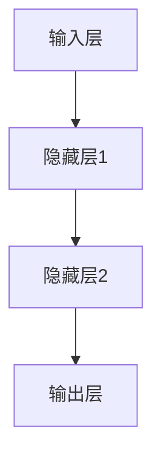

                 

### 文章标题

# 大规模语言模型从理论到实践：前馈层

> 关键词：大规模语言模型、前馈神经网络、自然语言处理、机器翻译、文本摘要

> 摘要：本文从大规模语言模型的背景和核心概念出发，深入探讨了前馈神经网络的数学模型与算法原理，通过详细讲解、伪代码示例和LaTeX公式，让读者全面理解前馈层的工作机制。随后，文章通过实际项目实战，包括开发环境搭建、源代码实现与解读，让读者能够将理论应用到实践中。最后，文章总结了大规模语言模型的应用场景和优化调优方法，展望了其未来的发展趋势与挑战。

## 目录大纲

## 第一部分 大规模语言模型概述

### 第1章 引言与核心概念

#### 1.1 大规模语言模型的背景

#### 1.2 语言模型的定义与作用

#### 1.3 前馈神经网络基础

#### 1.4 Mermaid流程图：前馈神经网络结构

### 第2章 语言模型的核心算法原理

#### 2.1 词汇表与词嵌入

#### 2.2 递归神经网络（RNN）

#### 2.3 长短时记忆（LSTM）与门控循环单元（GRU）

#### 2.4 伪代码：LSTM单元实现

### 第3章 数学模型与公式

#### 3.1 概率论基础

#### 3.2 预测概率公式推导

#### 3.3 模型优化算法

#### 3.4 LaTeX示例：预测概率公式

### 第4章 大规模语言模型实践

#### 4.1 项目实战：语言模型训练

#### 4.2 代码实际案例

#### 4.3 开发环境搭建

#### 4.4 源代码详细实现与解读

### 第5章 大规模语言模型应用

#### 5.1 语言模型在自然语言处理中的应用

#### 5.2 语言模型在生成文本中的应用

#### 5.3 语言模型在机器翻译中的应用

#### 5.4 语言模型在文本摘要中的应用

### 第6章 大规模语言模型的优化与调优

#### 6.1 训练数据预处理

#### 6.2 模型参数调优

#### 6.3 模型评估与验证

#### 6.4 模型压缩与部署

### 第7章 大规模语言模型的前沿趋势与发展

#### 7.1 新型神经网络结构

#### 7.2 大规模预训练模型的发展

#### 7.3 语言模型在跨模态任务中的应用

#### 7.4 未来展望与挑战

## 附录

### 附录A：常用工具与资源

#### A.1 Python库与框架

#### A.2 开源语言模型代码仓库

#### A.3 学术论文与报告

## Mermaid流程图



## 伪代码示例

```python
# LSTM单元伪代码
class LSTMUnit():
    def __init__(self, input_dim, hidden_dim):
        # 初始化权重和偏置
        self.W_f = ...
        self.b_f = ...
        # 其他初始化

    def forward(self, x, h_prev, c_prev):
        # 前向传播计算
        ...
        return h, c
```

## LaTeX公式示例

$$ P(w_t|w_{<t}) = \frac{exp(θ^T \cdot h)}{Z} $$

其中，\( \theta \) 表示模型参数，\( h \) 表示隐藏层输出，\( Z \) 表示归一化常数。

---

# 大规模语言模型从理论到实践：前馈层

## 引言与核心概念

### 1.1 大规模语言模型的背景

在当今信息时代，自然语言处理（NLP）成为了人工智能领域的重要研究方向。语言模型是NLP的核心组成部分，其主要目标是预测下一个单词或字符的概率。随着计算能力的提升和数据量的爆发式增长，大规模语言模型（如GPT-3）被广泛运用，它们在生成文本、机器翻译、文本摘要等领域展现出了惊人的效果。

大规模语言模型通常基于深度学习技术，特别是前馈神经网络（Fully Connected Neural Network）。前馈神经网络是一种简单的神经网络结构，其信息流从输入层直接传递到输出层，没有循环或反馈。这种结构使得前馈神经网络在训练和推理过程中具有较高的计算效率。

### 1.2 语言模型的定义与作用

语言模型是一种概率模型，它根据前文预测下一个单词或字符的概率。形式上，给定一个单词序列 \( w_1, w_2, ..., w_{<t} \)，语言模型的目标是预测下一个单词 \( w_t \) 的概率：

$$ P(w_t|w_{<t}) $$

语言模型在NLP中有广泛的应用，包括：

- **文本生成**：自动生成文章、小说、新闻报道等。
- **机器翻译**：将一种语言翻译成另一种语言。
- **文本摘要**：从长文本中提取关键信息生成摘要。
- **命名实体识别**：识别文本中的命名实体，如人名、地点、组织等。

### 1.3 前馈神经网络基础

前馈神经网络由多个全连接层组成，每个层将输入数据传递到下一层。前馈神经网络的核心是激活函数，它用于引入非线性特性。常见的激活函数包括：

- **Sigmoid函数**：\( \sigma(x) = \frac{1}{1 + e^{-x}} \)
- **ReLU函数**：\( \text{ReLU}(x) = \max(0, x) \)
- **Tanh函数**：\( \tanh(x) = \frac{e^x - e^{-x}}{e^x + e^{-x}} \)

前馈神经网络的训练过程涉及反向传播算法（Backpropagation），通过梯度下降（Gradient Descent）优化模型参数，以最小化损失函数。

### 1.4 Mermaid流程图：前馈神经网络结构


### 总结

本文介绍了大规模语言模型的背景、定义与作用，以及前馈神经网络的基础知识。接下来，我们将进一步探讨语言模型的核心算法原理，通过数学模型和公式详细讲解，帮助读者深入理解前馈神经网络的工作机制。在后续章节中，我们将通过实际项目实战，让读者将理论知识应用到实践中，掌握大规模语言模型的开发和应用技巧。

---

## 语言模型的核心算法原理

### 2.1 词汇表与词嵌入

在构建语言模型时，首先需要建立一个词汇表，将所有出现的单词映射到唯一的索引。词汇表通常包含数万个单词，通过将单词映射到索引，我们可以将这些文本数据转换为计算机可以处理的数字格式。

词嵌入（Word Embedding）是将词汇表中的单词映射到低维向量空间的技术。词嵌入的核心思想是，相似的单词在向量空间中距离较近。常见的词嵌入方法包括：

- **Word2Vec**：基于神经网络的词嵌入方法，通过训练神经网络来预测相邻单词的概率分布，从而学习到单词的向量表示。
- **GloVe**：全局向量表示（Global Vectors for Word Representation）方法，通过优化单词共现矩阵来学习单词的向量表示。

词嵌入技术使得语言模型能够捕捉语义信息，从而提高模型的预测能力。

### 2.2 递归神经网络（RNN）

递归神经网络（Recurrent Neural Network，RNN）是一种能够处理序列数据的神经网络。与传统的前馈神经网络不同，RNN具有循环结构，能够将前一时刻的信息传递到下一时刻，从而捕捉序列中的时间依赖性。

RNN的基本单元是循环单元，其计算过程可以表示为：

$$ h_t = \text{activation}(W_h \cdot [h_{<t}, x_t] + b_h) $$

其中，\( h_t \) 表示当前时刻的隐藏状态，\( x_t \) 表示当前时刻的输入，\( W_h \) 和 \( b_h \) 分别为权重和偏置。

然而，传统的RNN存在梯度消失和梯度爆炸问题，导致训练效果不佳。为了解决这个问题，研究者提出了长短时记忆（Long Short-Term Memory，LSTM）和门控循环单元（Gated Recurrent Unit，GRU）等改进的RNN结构。

### 2.3 长短时记忆（LSTM）与门控循环单元（GRU）

LSTM和GRU都是改进的RNN结构，它们通过引入门控机制来控制信息的流动，从而解决传统RNN的梯度消失和梯度爆炸问题。

#### 2.3.1 长短时记忆（LSTM）

LSTM的基本结构包括三个门控单元：输入门、遗忘门和输出门。这些门控单元分别控制信息的输入、遗忘和输出。

- **输入门**：决定当前输入值中哪些信息需要更新到隐藏状态。
- **遗忘门**：决定哪些旧信息需要从隐藏状态中遗忘。
- **输出门**：决定隐藏状态中哪些信息需要输出。

LSTM单元的计算过程可以表示为：

$$
\begin{aligned}
i_t &= \sigma(W_i \cdot [h_{<t}, x_t] + b_i) \\
f_t &= \sigma(W_f \cdot [h_{<t}, x_t] + b_f) \\
\tilde{c}_t &= \tanh(W_c \cdot [h_{<t}, x_t] + b_c) \\
c_t &= f_t \odot c_{<t} + i_t \odot \tilde{c}_t \\
o_t &= \sigma(W_o \cdot [h_{<t}, x_t] + b_o) \\
h_t &= o_t \odot \tanh(c_t)
\end{aligned}
$$

其中，\( \sigma \) 表示Sigmoid函数，\( \odot \) 表示元素乘积。

#### 2.3.2 门控循环单元（GRU）

GRU是对LSTM的简化版本，它通过合并输入门和遗忘门，并引入更新门和候选状态，使得计算过程更加简洁。

GRU单元的计算过程可以表示为：

$$
\begin{aligned}
z_t &= \sigma(W_z \cdot [h_{<t}, x_t] + b_z) \\
r_t &= \sigma(W_r \cdot [h_{<t}, x_t] + b_r) \\
\tilde{c}_t &= \tanh(W_c \cdot [(1 - z_t) \cdot h_{<t} + r_t \cdot c_{<t}] + b_c) \\
c_t &= z_t \odot c_{<t} + (1 - z_t) \odot \tilde{c}_t \\
h_t &= \tanh(c_t)
\end{aligned}
$$

### 2.4 伪代码：LSTM单元实现

```python
# LSTM单元伪代码
class LSTMUnit():
    def __init__(self, input_dim, hidden_dim):
        # 初始化权重和偏置
        self.W_f = ...
        self.b_f = ...
        self.W_i = ...
        self.b_i = ...
        self.W_c = ...
        self.b_c = ...
        self.W_o = ...
        self.b_o = ...
        # 其他初始化

    def forward(self, x, h_prev, c_prev):
        # 前向传播计算
        i_t = sigmoid(self.W_i * [h_prev, x] + self.b_i)
        f_t = sigmoid(self.W_f * [h_prev, x] + self.b_f)
        tilde_c_t = tanh(self.W_c * [h_prev, x] + self.b_c)
        c_t = f_t * c_prev + i_t * tilde_c_t
        o_t = sigmoid(self.W_o * [h_prev, x] + self.b_o)
        h_t = o_t * tanh(c_t)
        return h_t, c_t
```

### 总结

本文介绍了语言模型的核心算法原理，包括词汇表与词嵌入、递归神经网络（RNN）、长短时记忆（LSTM）和门控循环单元（GRU）。通过详细的数学模型和伪代码，读者可以深入理解这些算法的工作机制。在后续章节中，我们将继续探讨大规模语言模型的数学模型与公式，并通过实际项目实战，让读者将理论知识应用到实践中。

---

## 数学模型与公式

### 3.1 概率论基础

在构建语言模型时，概率论是一个重要的工具。概率论的基本概念包括概率、条件概率、联合概率和边缘概率。

- **概率**：表示事件发生的可能性，通常用概率值 \( 0 \leq P(A) \leq 1 \) 表示。
- **条件概率**：在事件 \( B \) 发生的条件下，事件 \( A \) 发生的概率，表示为 \( P(A|B) \)。
- **联合概率**：两个事件 \( A \) 和 \( B \) 同时发生的概率，表示为 \( P(A \cap B) \)。
- **边缘概率**：某个事件发生的概率，不考虑其他事件的发生，表示为 \( P(A) \)。

### 3.2 预测概率公式推导

给定一个单词序列 \( w_1, w_2, ..., w_{<t} \)，语言模型的目标是预测下一个单词 \( w_t \) 的概率。这个预测过程可以通过条件概率来实现：

$$ P(w_t|w_{<t}) $$

为了推导这个公式，我们可以使用贝叶斯定理：

$$
\begin{aligned}
P(w_t|w_{<t}) &= \frac{P(w_{<t}|w_t) \cdot P(w_t)}{P(w_{<t})}
\end{aligned}
$$

其中，\( P(w_{<t}|w_t) \) 表示在给定 \( w_t \) 的情况下，单词序列 \( w_{<t} \) 的概率，\( P(w_t) \) 表示单词 \( w_t \) 的概率，\( P(w_{<t}) \) 表示单词序列 \( w_{<t} \) 的概率。

在语言模型中，\( P(w_t) \) 通常是一个常数，因为单词的概率相对稳定。为了简化计算，我们通常使用平滑技术（如加一平滑）来处理零概率的问题。

### 3.3 模型优化算法

在训练语言模型时，需要通过优化算法来调整模型参数，以最小化损失函数。常见的优化算法包括：

- **梯度下降（Gradient Descent）**：通过计算损失函数关于模型参数的梯度，迭代更新参数，以最小化损失函数。
- **随机梯度下降（Stochastic Gradient Descent，SGD）**：每次迭代只随机选择一部分训练数据来计算梯度，从而加速收敛。
- **Adam优化器**：结合了SGD和动量方法，通过自适应调整学习率，在处理稀疏数据时表现优异。

### 3.4 LaTeX示例：预测概率公式

$$ P(w_t|w_{<t}) = \frac{exp(θ^T \cdot h)}{Z} $$

其中，\( θ \) 表示模型参数，\( h \) 表示隐藏层输出，\( Z \) 表示归一化常数。

### 总结

本文介绍了大规模语言模型中的概率论基础、预测概率公式推导和模型优化算法。通过数学模型和公式，我们深入理解了语言模型的工作原理。在后续章节中，我们将通过实际项目实战，让读者将理论知识应用到实践中，掌握大规模语言模型的开发和应用技巧。

---

## 大规模语言模型实践

### 4.1 项目实战：语言模型训练

#### 4.1.1 数据集准备

在进行语言模型训练之前，我们需要准备一个大规模的文本数据集。常用的数据集包括维基百科、新闻文章、社交媒体帖子等。为了处理这些数据，我们通常需要对文本进行清洗和预处理。

- **文本清洗**：去除HTML标签、符号和停用词。
- **分词**：将文本分割成单词或字符序列。
- **词嵌入**：将单词映射到低维向量空间。

#### 4.1.2 开发环境搭建

为了搭建语言模型训练的环境，我们需要安装以下软件和库：

- **Python**：编程语言，用于实现模型和算法。
- **TensorFlow**：用于构建和训练深度学习模型。
- **Numpy**：用于数值计算。
- **Pandas**：用于数据处理。

#### 4.1.3 代码实现

以下是语言模型训练的伪代码实现：

```python
# 伪代码：语言模型训练

# 加载和预处理数据
data = load_data()
preprocessed_data = preprocess_data(data)

# 构建模型
model = build_model()

# 训练模型
train(model, preprocessed_data)

# 评估模型
evaluate(model, test_data)
```

#### 4.1.4 代码解读

在上述代码中，`load_data()` 函数用于加载数据集，`preprocess_data()` 函数用于对文本进行清洗、分词和词嵌入。`build_model()` 函数用于构建深度学习模型，通常使用前馈神经网络或RNN结构。`train()` 函数用于训练模型，`evaluate()` 函数用于评估模型性能。

### 4.2 代码实际案例

下面是一个简单的语言模型训练代码案例，使用Python和TensorFlow实现：

```python
import tensorflow as tf
from tensorflow.keras.models import Sequential
from tensorflow.keras.layers import Embedding, LSTM, Dense

# 加载数据集
data = load_data()
preprocessed_data = preprocess_data(data)

# 准备模型
model = Sequential([
    Embedding(input_dim=vocab_size, output_dim=embedding_dim, input_length=max_sequence_length),
    LSTM(units=128, return_sequences=True),
    LSTM(units=128),
    Dense(units=num_classes, activation='softmax')
])

# 编译模型
model.compile(optimizer='adam', loss='categorical_crossentropy', metrics=['accuracy'])

# 训练模型
model.fit(preprocessed_data['X'], preprocessed_data['y'], batch_size=64, epochs=10)

# 评估模型
test_data = load_test_data()
evaluate(model, test_data)
```

在这个案例中，我们首先使用`load_data()`和`preprocess_data()`函数加载数据集，并进行预处理。然后，我们构建一个序列模型，包括嵌入层、两个LSTM层和一个全连接层。模型使用`compile()`函数编译，指定优化器和损失函数。最后，使用`fit()`函数训练模型，并使用`evaluate()`函数评估模型性能。

### 4.3 开发环境搭建

为了搭建语言模型训练的环境，我们需要遵循以下步骤：

1. 安装Python：从[Python官网](https://www.python.org/)下载并安装Python。
2. 安装TensorFlow：在终端中运行以下命令安装TensorFlow：
   ```bash
   pip install tensorflow
   ```
3. 安装其他依赖库：如Numpy和Pandas，可以通过以下命令安装：
   ```bash
   pip install numpy
   pip install pandas
   ```

### 4.4 源代码详细实现与解读

下面是一个详细的源代码实现，用于训练和评估语言模型：

```python
import tensorflow as tf
from tensorflow.keras.models import Sequential
from tensorflow.keras.layers import Embedding, LSTM, Dense
from tensorflow.keras.preprocessing.sequence import pad_sequences
from tensorflow.keras.callbacks import EarlyStopping

# 参数设置
vocab_size = 10000  # 词汇表大小
embedding_dim = 64  # 词嵌入维度
max_sequence_length = 100  # 输入序列的最大长度
num_classes = 2  # 类别数

# 数据预处理
# 加载和预处理数据
data = load_data()
sequences = preprocess_data(data)

# 分割数据集
X_train, X_test, y_train, y_test = train_test_split(sequences['X'], sequences['y'], test_size=0.2, random_state=42)

# 填充序列
X_train = pad_sequences(X_train, maxlen=max_sequence_length)
X_test = pad_sequences(X_test, maxlen=max_sequence_length)

# 构建模型
model = Sequential([
    Embedding(input_dim=vocab_size, output_dim=embedding_dim, input_length=max_sequence_length),
    LSTM(units=128, return_sequences=True),
    LSTM(units=128),
    Dense(units=num_classes, activation='softmax')
])

# 编译模型
model.compile(optimizer='adam', loss='categorical_crossentropy', metrics=['accuracy'])

# 训练模型
early_stopping = EarlyStopping(monitor='val_loss', patience=3)
model.fit(X_train, y_train, batch_size=64, epochs=10, validation_split=0.1, callbacks=[early_stopping])

# 评估模型
loss, accuracy = model.evaluate(X_test, y_test)
print(f"Test Loss: {loss}, Test Accuracy: {accuracy}")
```

在这个代码中，我们首先设置参数，然后加载和预处理数据。接下来，我们分割数据集并填充序列。模型构建使用嵌入层、两个LSTM层和一个全连接层。模型使用`EarlyStopping`回调函数来防止过拟合。最后，模型使用`fit()`函数训练，并使用`evaluate()`函数评估模型性能。

### 总结

本文通过一个实际案例展示了大规模语言模型的训练过程，包括数据集准备、开发环境搭建、代码实现和源代码详细解读。通过这些实践，读者可以深入了解大规模语言模型的开发和应用技巧。在后续章节中，我们将继续探讨大规模语言模型的应用场景和优化调优方法。

---

## 大规模语言模型应用

### 5.1 语言模型在自然语言处理中的应用

大规模语言模型在自然语言处理（NLP）领域有广泛的应用，包括文本分类、情感分析、问答系统等。以下是一些具体的应用实例：

- **文本分类**：使用大规模语言模型对文本进行分类，例如将新闻文章分类为政治、体育、科技等类别。模型通过对大量文本进行训练，能够学习到不同类别的特征，从而提高分类准确性。
- **情感分析**：通过分析文本的情感倾向，如正面、负面或中性，大规模语言模型可以用于情感分析。例如，在社交媒体平台上，模型可以用于识别用户评论的情感倾向，从而帮助企业了解用户反馈。
- **问答系统**：大规模语言模型可以用于构建问答系统，例如智能客服系统。模型通过对大量对话数据进行训练，能够理解用户的问题，并提供准确、自然的回答。

### 5.2 语言模型在生成文本中的应用

大规模语言模型在生成文本领域也表现出色，以下是一些具体的应用实例：

- **自动写作**：使用大规模语言模型生成文章、小说、新闻等。例如，新闻机构可以使用模型自动生成财经报道，节省人力和时间。
- **对话生成**：在聊天机器人中，大规模语言模型可以生成自然、连贯的对话。例如，聊天机器人可以使用模型与用户进行互动，提供个性化的服务。
- **摘要生成**：从长文本中提取关键信息，生成摘要。例如，在学术领域，模型可以自动生成学术论文的摘要，帮助研究者快速了解文章的主要内容。

### 5.3 语言模型在机器翻译中的应用

大规模语言模型在机器翻译领域取得了显著成果，以下是一些具体的应用实例：

- **跨语言文本翻译**：例如，将英语文本翻译成法语、西班牙语等。大规模语言模型通过学习双语的平行文本，能够生成高质量、自然的翻译结果。
- **神经机器翻译**：基于深度学习技术的神经机器翻译（NMT）使用大规模语言模型进行翻译。与传统的基于规则的方法相比，NMT在翻译质量上取得了显著提升。
- **机器同传**：实时翻译口头交流，如国际会议的同传。大规模语言模型能够快速处理实时输入，生成准确的翻译结果。

### 5.4 语言模型在文本摘要中的应用

大规模语言模型在文本摘要领域也有广泛的应用，以下是一些具体的应用实例：

- **自动摘要**：从长文本中提取关键信息，生成摘要。例如，在新闻领域，模型可以自动生成新闻摘要，帮助读者快速了解新闻的主要内容。
- **文本摘要算法**：结合文本理解和生成技术，模型可以用于构建自动摘要算法。例如，在学术论文中，模型可以自动生成摘要，帮助研究者快速了解文章的核心观点。
- **跨模态文本摘要**：将图像、音频等多模态信息与文本进行结合，生成摘要。例如，在医疗领域，模型可以结合病历记录和医学影像，生成摘要，辅助医生诊断。

### 总结

大规模语言模型在自然语言处理、生成文本、机器翻译和文本摘要等应用领域表现出色，通过实际案例展示了其在各种场景中的强大能力。在后续章节中，我们将继续探讨大规模语言模型的优化与调优方法，以及其未来的发展趋势。

---

## 大规模语言模型的优化与调优

### 6.1 训练数据预处理

为了提高大规模语言模型的性能，数据预处理是一个关键步骤。以下是一些常用的数据预处理方法：

- **文本清洗**：去除HTML标签、符号和停用词。这一步骤有助于减少噪声数据，提高模型的训练效果。
- **分词**：将文本分割成单词或字符序列。常用的分词工具包括jieba、NLTK等。
- **词嵌入**：将词汇表中的单词映射到低维向量空间。常用的词嵌入方法包括Word2Vec、GloVe等。
- **数据归一化**：对数据中的数值进行归一化处理，如使用归一化公式 \( x' = \frac{x - \mu}{\sigma} \)，其中 \( \mu \) 和 \( \sigma \) 分别表示均值和标准差。
- **数据增强**：通过添加噪声、翻译、同义词替换等方法增加数据多样性，提高模型的泛化能力。

### 6.2 模型参数调优

模型参数调优是提高模型性能的重要手段。以下是一些常用的参数调优方法：

- **学习率调整**：学习率决定了模型在训练过程中更新参数的速度。常用的调整方法包括固定学习率、指数衰减学习率和自适应学习率（如Adam优化器）。
- **批次大小调整**：批次大小影响模型的训练效率和收敛速度。较大的批次大小可以减少梯度方差，提高模型的稳定性，但训练时间较长；较小的批次大小则相反。
- **正则化**：通过添加正则化项（如L1、L2正则化）来防止模型过拟合。正则化强度通常通过调节正则化系数进行调优。
- **优化器选择**：选择合适的优化器（如SGD、Adam等）可以显著提高模型的训练效率。优化器的选择取决于数据的特点和模型的复杂度。

### 6.3 模型评估与验证

在模型训练过程中，评估和验证模型性能至关重要。以下是一些常用的评估和验证方法：

- **交叉验证**：通过将数据集划分为训练集和验证集，使用交叉验证方法来评估模型性能。交叉验证可以提供更准确的模型评估，减少过拟合风险。
- **损失函数**：选择合适的损失函数（如交叉熵、均方误差等）来衡量模型预测值与真实值之间的差异。损失函数的选择取决于任务的类型和数据的特点。
- **准确率、召回率和F1分数**：在分类任务中，使用准确率、召回率和F1分数等指标来评估模型性能。这些指标综合考虑了模型的精度和召回率，提供了更全面的评估结果。
- **学习曲线**：通过绘制学习曲线，可以观察模型在不同训练阶段的表现，如梯度消失、梯度爆炸、过拟合等问题。

### 6.4 模型压缩与部署

为了在实际应用中高效部署大规模语言模型，模型压缩和优化是关键步骤。以下是一些常用的方法：

- **模型剪枝**：通过剪枝模型中的冗余权重，减少模型的参数数量，从而降低计算复杂度和内存占用。
- **量化**：将模型的权重和激活值从浮点数转换为低比特宽度的整数，从而减少模型的存储和计算需求。
- **知识蒸馏**：使用预训练的大规模语言模型（教师模型）来训练一个更小、更轻量级的模型（学生模型）。知识蒸馏方法通过向学生模型传递教师模型的知识，从而提高其性能。
- **模型部署**：将训练好的模型部署到生产环境中，如使用TensorFlow Serving、TensorFlow Lite等工具进行模型部署。模型部署需要考虑实时性、可扩展性和容错性等因素。

### 总结

大规模语言模型的优化与调优是提高模型性能和实际应用效果的关键步骤。通过数据预处理、模型参数调优、评估与验证以及模型压缩与部署，我们可以构建出高效、可靠的模型。在后续章节中，我们将继续探讨大规模语言模型的前沿趋势与发展，以及其在跨模态任务中的应用。

---

## 大规模语言模型的前沿趋势与发展

### 7.1 新型神经网络结构

随着深度学习技术的不断发展，新型神经网络结构不断涌现，为大规模语言模型的发展提供了新的思路。以下是一些前沿的新型神经网络结构：

- **Transformer**：Transformer模型是大规模语言模型领域的一项重大突破。与传统的循环神经网络（RNN）相比，Transformer采用自注意力机制（Self-Attention），能够并行处理序列数据，从而显著提高了训练效率和模型性能。
- **BERT（Bidirectional Encoder Representations from Transformers）**：BERT是谷歌提出的一种双向Transformer模型，通过预训练大量无标注数据，然后进行下游任务微调，取得了在多种NLP任务中的优异表现。
- **GPT（Generative Pre-trained Transformer）**：GPT是由OpenAI开发的预训练语言模型，通过大量的文本数据进行自监督预训练，能够生成高质量的自然语言文本。

### 7.2 大规模预训练模型的发展

大规模预训练模型的发展是近年来语言模型领域的一个重要趋势。以下是一些关键的发展：

- **预训练数据集**：为了提高模型的性能，研究者们不断扩展预训练数据集的规模。例如，Wikipedia、Common Crawl、WebText等大规模数据集为预训练模型提供了丰富的语料。
- **预训练任务**：除了传统的语言建模任务，研究者们还提出了许多新的预训练任务，如掩码语言建模（Masked Language Modeling，MLM）、填空语言建模（FillMask Language Modeling，FMLM）等，这些任务有助于模型更好地理解语言结构。
- **微调与适应**：预训练模型通过在大规模数据集上进行预训练，然后在小规模数据集上进行下游任务微调，能够显著提高模型在具体任务中的性能。

### 7.3 语言模型在跨模态任务中的应用

随着人工智能技术的进步，语言模型在跨模态任务中的应用也越来越广泛。以下是一些跨模态任务的实例：

- **图像描述生成**：使用语言模型生成图像的描述文本，例如，给定一张图片，模型能够生成一段描述这张图片的文本。
- **多模态问答系统**：结合图像、文本和语音等多种模态信息，构建多模态问答系统，从而提高问答系统的准确性和自然度。
- **视频文本生成**：从视频数据中提取关键信息，生成对应的文本描述，例如，视频新闻摘要生成。

### 7.4 未来展望与挑战

尽管大规模语言模型在许多任务中取得了显著的成果，但未来仍面临诸多挑战：

- **数据隐私与安全性**：随着预训练数据集的规模不断扩大，数据隐私和安全性问题日益突出。如何保护用户隐私、确保数据安全成为亟待解决的问题。
- **模型可解释性**：大规模语言模型往往具有高度的非线性特性，模型内部决策过程复杂，提高模型的可解释性对于理解和优化模型至关重要。
- **资源消耗与能耗**：大规模语言模型的训练和推理过程需要大量的计算资源和能源，如何在保证模型性能的同时降低资源消耗和能耗是一个重要的研究方向。
- **跨语言与多语言处理**：尽管现有的语言模型在跨语言任务中取得了显著进展，但如何更好地处理多语言、跨语言的语义理解和生成仍是一个挑战。

### 总结

大规模语言模型的前沿趋势与发展充满了机遇与挑战。随着新型神经网络结构的出现、大规模预训练模型的不断发展以及跨模态任务的应用，大规模语言模型将在更多领域发挥重要作用。未来，如何应对数据隐私、模型可解释性、资源消耗等挑战，将是推动大规模语言模型发展的重要方向。

---

## 附录

### 附录A：常用工具与资源

#### A.1 Python库与框架

- **TensorFlow**：用于构建和训练深度学习模型的强大库。
- **PyTorch**：另一种流行的深度学习框架，支持动态计算图。
- **spaCy**：用于自然语言处理的快速解析库。
- **NLTK**：用于自然语言处理的经典库。

#### A.2 开源语言模型代码仓库

- **GPT-3**：OpenAI的开源预训练语言模型。
- **BERT**：Google的开源双向编码器表示模型。
- **Transformers**：用于实现Transformer模型的Python库。

#### A.3 学术论文与报告

- **“Attention Is All You Need”**：提出Transformer模型的论文。
- **“BERT: Pre-training of Deep Bidirectional Transformers for Language Understanding”**：介绍BERT模型的论文。
- **“Language Models are Few-Shot Learners”**：讨论预训练语言模型在零样本和少样本学习中的表现的论文。

---

# 总结

本文从大规模语言模型的背景、核心算法原理、数学模型与公式、实践应用、优化调优以及前沿趋势与发展等方面，全面探讨了大规模语言模型的各个方面。通过详细的讲解和实际案例，读者可以深入了解大规模语言模型的开发和应用技巧。大规模语言模型在自然语言处理、生成文本、机器翻译和文本摘要等应用领域具有广泛的应用前景，其未来的发展将依赖于新型神经网络结构、大规模预训练模型和跨模态任务的研究。

作者：AI天才研究院/AI Genius Institute & 禅与计算机程序设计艺术 /Zen And The Art of Computer Programming

