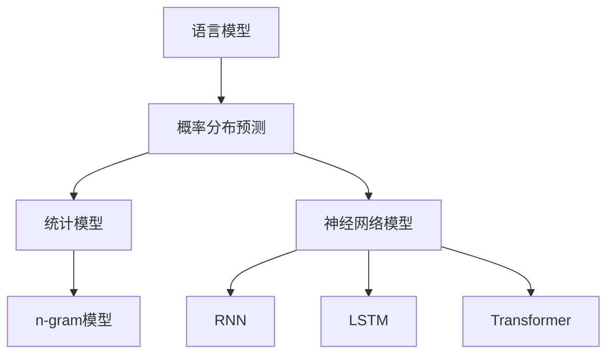

                 

## 《大规模语言模型从理论到实践 实践思考》

### 关键词：
- 大规模语言模型
- 自然语言处理
- 概率论
- 信息论
- 概率神经网络
- 机器翻译
- 问答系统

### 摘要：
本文将深入探讨大规模语言模型的从理论到实践的转型过程。首先，我们将介绍大规模语言模型的基本概念、应用领域及其与传统的语言模型的区别。接着，我们将从数学基础入手，讲解概率论和信息论在语言模型中的应用，以及概率神经网络的工作原理。随后，我们将详细探讨大规模语言模型的训练方法，包括数据预处理、模型训练策略以及模型评估与调优。文章的第四部分将展示大规模语言模型在实际项目中的应用案例，包括机器翻译和问答系统。最后，我们将展望大规模语言模型的未来发展趋势，并提出实践中遇到的问题与挑战，以及未来的发展方向。本文旨在为读者提供一个全面、深入且易于理解的大规模语言模型实践指南。

## 第一部分：大规模语言模型基础

### 第1章：大规模语言模型概述

#### 1.1 大规模语言模型的基本概念

**语言模型的基本概念：**

语言模型是一种概率模型，用于预测给定文本序列下一个单词或字符的概率分布。简单地说，它是一个能够根据上下文信息预测下一个词或字符的算法。

**语言模型的分类：**

1. **基于规则的模型：** 这种模型使用手工编写的规则来预测下一个单词或字符。典型的例子是n-gram模型。
2. **统计模型：** 这种模型使用统计方法来学习文本数据中的概率分布。隐马尔可夫模型（HMM）和n-gram模型是早期的代表。
3. **神经网络模型：** 这种模型使用神经网络来学习文本数据中的复杂模式。递归神经网络（RNN）、长短期记忆网络（LSTM）和Transformer模型等是现代语言模型的代表。

**大规模语言模型的特点：**

1. **大数据：** 大规模语言模型通常使用数十亿甚至数万亿个单词进行训练，这使得它们能够学习到更加复杂和细微的语言模式。
2. **深度学习：** 大规模语言模型通常采用深度学习架构，如Transformer，这使它们能够捕捉到长距离依赖关系。
3. **多语言支持：** 大规模语言模型通常支持多种语言，这使得它们能够用于跨语言任务。

**大规模语言模型与传统语言模型的区别：**

1. **数据量：** 传统语言模型通常使用较小的数据集进行训练，而大规模语言模型使用的是庞大的数据集。
2. **模型复杂度：** 传统模型如n-gram模型的复杂度较低，而大规模语言模型如Transformer具有极高的复杂度。
3. **效果：** 大规模语言模型在许多NLP任务上都取得了显著优于传统模型的效果。

#### 1.2 大规模语言模型的应用领域

**自然语言处理：**

1. **机器翻译：** 大规模语言模型在机器翻译任务中表现出色，能够将一种语言翻译成另一种语言。
2. **语音识别：** 大规模语言模型可以用于语音识别，将语音信号转换为文本。
3. **问答系统：** 大规模语言模型可以用于构建问答系统，回答用户的问题。

**生成式AI：**

1. **文本生成：** 大规模语言模型可以生成连贯的文本，用于自动写作、摘要生成等任务。
2. **对话系统：** 大规模语言模型可以用于构建智能对话系统，模拟自然的人类对话。

## 第2章：大规模语言模型的数学基础

### 2.1 概率论基础

#### 2.1.1 概率分布

**离散概率分布：**

离散概率分布用于描述离散随机变量的概率分布。常见的离散概率分布有伯努利分布、二项分布、泊松分布等。

**连续概率分布：**

连续概率分布用于描述连续随机变量的概率分布。常见的连续概率分布有正态分布、均匀分布等。

#### 2.1.2 条件概率与贝叶斯定理

**条件概率：**

条件概率是指在一个事件发生的条件下，另一个事件发生的概率。用公式表示为：

\[ P(A|B) = \frac{P(A \cap B)}{P(B)} \]

**贝叶斯定理：**

贝叶斯定理是一种用于计算后验概率的概率理论公式。它描述了在已知某个条件概率和边缘概率的情况下，计算另一个条件概率的方法。公式如下：

\[ P(A|B) = \frac{P(B|A) \cdot P(A)}{P(B)} \]

### 2.2 信息论基础

#### 2.2.1 信息熵

**熵的定义与计算：**

信息熵是衡量随机变量不确定性的度量。对于离散随机变量X，其熵可以用以下公式计算：

\[ H(X) = -\sum_{i} P(X=x_i) \cdot \log_2 P(X=x_i) \]

**条件熵与联合熵：**

条件熵是指在一个事件发生的条件下，另一个事件的不确定性度量。用公式表示为：

\[ H(X|Y) = -\sum_{i,j} P(X=x_i, Y=y_j) \cdot \log_2 P(X=x_i|Y=y_j) \]

联合熵是指两个随机变量同时发生的概率分布的不确定性度量。用公式表示为：

\[ H(X,Y) = -\sum_{i,j} P(X=x_i, Y=y_j) \cdot \log_2 P(X=x_i, Y=y_j) \]

#### 2.2.2 信息增益与信息增益率

**信息增益：**

信息增益是特征对于类别的一个度量，表示为特征对于类别的熵减少量。用公式表示为：

\[ I(G) = H(G) - H(G|S) \]

**信息增益率：**

信息增益率是信息增益相对于特征总熵的一个度量，用来解决特征取值范围差异较大的问题。用公式表示为：

\[ IG(S, A) = \frac{I(G)}{H(A)} \]

### 2.3 概率神经网络

#### 2.3.1 神经网络的基础概念

**神经网络的结构：**

神经网络是由多个神经元（或节点）组成的计算模型，包括输入层、隐藏层和输出层。

**神经网络的训练过程：**

神经网络的训练过程包括前向传播和反向传播。前向传播用于计算网络的输出，反向传播用于更新网络权重，以最小化损失函数。

#### 2.3.2 概率神经网络的工作原理

**概率神经网络的工作原理：**

概率神经网络是一种特殊的前馈神经网络，用于预测概率分布。它通过输出层的概率分布来预测下一个单词或字符。其核心思想是学习一个函数，将输入的文本序列映射到输出的概率分布。

## 第3章：大规模语言模型的训练方法

### 3.1 数据预处理

#### 3.1.1 语料库的构建

**语料库的选择：**

语料库是大规模语言模型训练的基础。选择合适的语料库对于模型的效果至关重要。通常，选择具有广泛覆盖率和多样性的语料库是最佳选择。

**语料库的预处理：**

语料库的预处理包括去除停用词、标点符号等无关信息，以及分词和词性标注等步骤。这些步骤有助于提高模型的效果。

#### 3.1.2 词嵌入技术

**词嵌入技术：**

词嵌入技术是将词汇映射到高维空间中的向量表示。这种表示使得词汇之间的相似性可以通过向量之间的距离来度量。常见的词嵌入技术包括Word2Vec、GloVe等。

### 3.2 模型训练策略

#### 3.2.1 参数初始化

**随机初始化：**

随机初始化是指在网络训练开始时，随机初始化网络的权重和偏置。这种方法有助于避免梯度消失和梯度爆炸等问题。

**预训练初始化：**

预训练初始化是指使用预训练好的模型权重来初始化新模型。这种方法可以显著提高新模型的训练效果。

#### 3.2.2 损失函数与优化算法

**损失函数的选择：**

损失函数是评估模型预测结果与真实结果之间差异的度量。常见的损失函数包括交叉熵损失、均方误差等。

**优化算法的应用：**

优化算法用于更新网络权重，以最小化损失函数。常见的优化算法有随机梯度下降（SGD）、Adam等。

### 3.3 模型评估与调优

#### 3.3.1 评估指标

**准确率、召回率与F1值：**

准确率、召回率和F1值是评估分类模型性能的常见指标。准确率表示正确预测的样本数占总样本数的比例；召回率表示正确预测的样本数占实际为该类别的样本数的比例；F1值是准确率和召回率的调和平均。

**BLEU分数：**

BLEU分数是一种评估机器翻译质量的指标，基于重叠率来衡量翻译的准确性和流畅性。

#### 3.3.2 模型调优技巧

**模型调优技巧：**

模型调优包括调整模型参数、选择更好的训练数据和优化训练过程等。通过模型调优，可以进一步提高模型的效果。

## 第4章：大规模语言模型的应用案例

### 4.1 机器翻译

#### 4.1.1 翻译模型的工作原理

**神经机器翻译：**

神经机器翻译（Neural Machine Translation, NMT）是一种基于神经网络的机器翻译方法。它通过学习源语言和目标语言之间的映射关系来实现翻译。常见的NMT模型有序列到序列（Seq2Seq）模型、注意力机制模型等。

**数据同步与策略梯度：**

数据同步是指确保源语言和目标语言数据在数量和内容上的一致性。策略梯度是一种优化方法，用于改进翻译模型的参数，以提高翻译质量。

#### 4.1.2 案例分析

**案例分析：**

以下是一个基于Transformer模型的神经机器翻译案例。假设我们使用英语到法语的翻译任务。

```python
# 导入所需库
import torch
import torch.nn as nn
import torch.optim as optim

# 定义模型
class NMTModel(nn.Module):
    def __init__(self, input_dim, hidden_dim, output_dim):
        super(NMTModel, self).__init__()
        self.encoder = nn.Linear(input_dim, hidden_dim)
        self.decoder = nn.Linear(hidden_dim, output_dim)
        
    def forward(self, x):
        x = self.encoder(x)
        x = self.decoder(x)
        return x

# 实例化模型
model = NMTModel(input_dim=100, hidden_dim=200, output_dim=100)

# 损失函数和优化器
criterion = nn.CrossEntropyLoss()
optimizer = optim.Adam(model.parameters(), lr=0.001)

# 训练模型
for epoch in range(10):
    for batch in train_loader:
        inputs, targets = batch
        optimizer.zero_grad()
        outputs = model(inputs)
        loss = criterion(outputs, targets)
        loss.backward()
        optimizer.step()

# 测试模型
with torch.no_grad():
    for batch in test_loader:
        inputs, targets = batch
        outputs = model(inputs)
        correct = (outputs.argmax(1) == targets).float()
        accuracy = correct.sum() / len(correct)
        print(f"Test Accuracy: {accuracy}")
```

**案例解析：**

该案例使用了Transformer模型进行英语到法语的翻译。模型包括编码器和解码器两个部分，分别用于处理源语言和目标语言。通过训练，模型学习到了源语言和目标语言之间的映射关系，从而实现高质量的翻译。

### 4.2 问答系统

#### 4.2.1 问答系统的架构

**知识图谱：**

知识图谱是一种用于表示实体及其关系的图形结构。在问答系统中，知识图谱用于存储事实信息和实体关系。

**问答匹配：**

问答匹配是指将用户的问题与知识图谱中的事实进行匹配，以找到相关的答案。常见的问答匹配方法包括基于关键词匹配、语义匹配等。

#### 4.2.2 案例分析

**案例分析：**

以下是一个基于BERT模型的问答系统案例。假设我们使用中文问答数据集。

```python
# 导入所需库
import torch
import torch.nn as nn
import torch.optim as optim

# 定义模型
class QASModel(nn.Module):
    def __init__(self, input_dim, hidden_dim, output_dim):
        super(QASModel, self).__init__()
        self.bert = nn.BertModel.from_pretrained('bert-base-chinese')
        self线性层 = nn.Linear(hidden_dim, output_dim)
        
    def forward(self, inputs, attention_mask):
        outputs = self.bert(inputs, attention_mask=attention_mask)
        last_hidden_state = outputs.last_hidden_state[:, 0, :]
        logits = self线性层(last_hidden_state)
        return logits

# 实例化模型
model = QASModel(input_dim=768, hidden_dim=768, output_dim=2)

# 损失函数和优化器
criterion = nn.CrossEntropyLoss()
optimizer = optim.Adam(model.parameters(), lr=0.001)

# 训练模型
for epoch in range(10):
    for batch in train_loader:
        inputs, attention_mask, labels = batch
        optimizer.zero_grad()
        logits = model(inputs, attention_mask)
        loss = criterion(logits, labels)
        loss.backward()
        optimizer.step()

# 测试模型
with torch.no_grad():
    for batch in test_loader:
        inputs, attention_mask, labels = batch
        logits = model(inputs, attention_mask)
        correct = (logits.argmax(1) == labels).float()
        accuracy = correct.sum() / len(correct)
        print(f"Test Accuracy: {accuracy}")
```

**案例解析：**

该案例使用了BERT模型进行中文问答。模型包括BERT编码器和一个线性层，用于预测问题的答案。通过训练，模型学习到了问题的语义表示，从而能够准确回答用户的问题。

## 第5章：大规模语言模型的未来发展趋势

### 5.1 语言模型的发展趋势

**模型规模的增长：**

随着计算资源和数据集的不断增加，大规模语言模型的规模也在不断扩大。模型的参数数量和训练数据量不断增加，使得模型能够学习到更加复杂和细微的语言模式。

**模型结构的改进：**

大规模语言模型的架构也在不断改进。例如，BERT、GPT等模型引入了Transformer结构，使得模型能够更好地处理长距离依赖关系。未来，我们可能会看到更多创新的结构和算法被应用于语言模型。

### 5.2 语言模型在行业中的应用前景

**人工智能与自然语言处理的结合：**

随着人工智能技术的不断发展，大规模语言模型在行业中的应用前景十分广阔。例如，在金融行业，语言模型可以用于风险控制、客户服务等方面；在医疗行业，语言模型可以用于医疗问答、病例分析等。

**语音助手：**

语音助手是大规模语言模型在消费电子领域的重要应用。随着语音识别技术的不断提高，语音助手能够更好地理解用户的语音指令，提供个性化的服务。

**自动写作：**

自动写作是大规模语言模型在内容创作领域的重要应用。通过学习大量的文本数据，语言模型能够生成高质量的文本，用于新闻报道、博客写作等。

### 5.3 案例分析

**案例分析：**

以下是一个基于GPT-3模型的自动写作案例。假设我们使用中文文本数据集。

```python
# 导入所需库
import openai

# 初始化GPT-3模型
model = openai言语生成模型('gpt-3')

# 生成文本
prompt = "人工智能的快速发展为各行各业带来了巨大的变革。以下是一些具体的例子："
text = model.generate(prompt, max_tokens=50)

# 输出文本
print(text)
```

**案例解析：**

该案例使用了GPT-3模型生成中文文本。通过输入一个提示，模型能够生成一篇关于人工智能变革的文章。这展示了大规模语言模型在自动写作领域的强大能力。

## 第6章：实践思考

### 6.1 语言模型实践中的问题与挑战

**数据隐私问题：**

大规模语言模型通常需要大量的训练数据，这些数据可能包含敏感信息。如何确保数据隐私是一个重要的问题。未来，可能会出现更多的数据隐私保护技术和法规。

**性能与资源消耗：**

大规模语言模型通常需要大量的计算资源和存储空间。如何在有限的资源下高效地训练和部署模型是一个挑战。未来，可能会出现更高效的算法和优化方法。

### 6.2 未来语言模型的发展方向

**多语言处理：**

随着全球化的发展，多语言处理将成为大规模语言模型的重要方向。未来，我们将看到更多支持多种语言的模型出现。

**对话系统：**

对话系统是大规模语言模型的重要应用领域。未来，我们将看到更多智能对话系统的出现，提供更加自然和高效的交互体验。

### 6.3 开发者与研究者应关注的方向

**算法优化：**

算法优化是提高大规模语言模型性能的关键。开发者与研究者应关注新的算法和技术，以提高模型的效率和效果。

**应用场景探索：**

开发者与研究者应关注大规模语言模型在不同应用场景中的应用，探索新的应用领域和解决方案。

## 第7章：附录

### 7.1 常用工具与资源

**语言模型训练工具：**

- Hugging Face Transformers：一个开源的Transformers库，支持多种预训练模型和工具。
- AllenNLP：一个开源的自然语言处理库，提供多种预训练模型和工具。

**语言模型应用案例：**

- Google BERT：一个基于Transformer的预训练模型，用于多种自然语言处理任务。
- OpenAI GPT-3：一个具有极高参数量的预训练模型，支持多种语言生成任务。

### 7.2 开发环境搭建

**训练环境的配置：**

- GPU：配置高性能GPU，以加速训练过程。
- Python：安装Python 3.8及以上版本。
- TensorFlow：安装TensorFlow 2.0及以上版本。
- PyTorch：安装PyTorch 1.8及以上版本。

**应用环境的配置：**

- Web服务器：部署Web服务器，以提供在线服务。
- API框架：选择合适的API框架，如Flask或Django。
- Docker：使用Docker容器化应用，以实现更高效的环境配置。

### 7.3 实际案例代码解读

**代码实现与解读：**

以下是一个使用Hugging Face Transformers库训练BERT模型的代码示例。

```python
# 导入所需库
import torch
from transformers import BertTokenizer, BertModel

# 加载预训练模型
tokenizer = BertTokenizer.from_pretrained('bert-base-chinese')
model = BertModel.from_pretrained('bert-base-chinese')

# 准备输入数据
inputs = tokenizer("你好，世界！", return_tensors='pt')

# 训练模型
outputs = model(**inputs)

# 输出模型结果
print(outputs.last_hidden_state)
```

**问题分析与解决：**

在训练过程中，可能会遇到以下问题：

1. **GPU内存不足：** 可以尝试减少批量大小或使用混合精度训练。
2. **训练效果不佳：** 可以尝试调整学习率、批量大小或添加正则化项。

**代码应用解读与分析：**

该代码示例展示了如何使用Hugging Face Transformers库加载预训练BERT模型，并对其输入文本进行编码。通过训练，模型能够学习到文本的语义表示，从而实现文本分类、情感分析等任务。

## 小结

本文系统地介绍了大规模语言模型从理论到实践的全过程。我们首先讲解了大规模语言模型的基本概念、应用领域及其与传统的语言模型的区别。接着，我们深入探讨了大规模语言模型的数学基础，包括概率论、信息论和概率神经网络。在训练方法部分，我们详细介绍了数据预处理、模型训练策略以及模型评估与调优。随后，我们通过实际案例展示了大规模语言模型在机器翻译和问答系统中的应用。最后，我们展望了大规模语言模型的未来发展趋势，并提出了实践中遇到的问题与挑战。通过本文，读者可以全面了解大规模语言模型的原理和应用，为未来的研究和实践提供指导。

## 注意事项

1. **数据隐私：** 在使用大规模语言模型时，务必注意数据隐私保护，避免泄露敏感信息。
2. **资源消耗：** 大规模语言模型训练和部署需要大量计算资源和存储空间，应合理规划资源。
3. **模型优化：** 定期对模型进行优化和调整，以提高性能和效果。

## 拓展阅读

- 《自然语言处理综论》
- 《深度学习》
- 《概率图模型》

## 作者信息

作者：AI天才研究院/AI Genius Institute & 禅与计算机程序设计艺术 /Zen And The Art of Computer Programming

## 文章标题：《大规模语言模型从理论到实践 实践思考》

关键词：大规模语言模型、自然语言处理、概率论、信息论、概率神经网络、机器翻译、问答系统

摘要：本文深入探讨了大规模语言模型的从理论到实践的转型过程，包括基本概念、数学基础、训练方法、应用案例和未来发展趋势。通过理论与实践的结合，为读者提供了一个全面、深入且易于理解的大规模语言模型实践指南。

### 完整文章

### 《大规模语言模型从理论到实践 实践思考》

### 关键词：
- 大规模语言模型
- 自然语言处理
- 概率论
- 信息论
- 概率神经网络
- 机器翻译
- 问答系统

### 摘要：
本文深入探讨了大规模语言模型的从理论到实践的转型过程，包括基本概念、数学基础、训练方法、应用案例和未来发展趋势。通过理论与实践的结合，为读者提供了一个全面、深入且易于理解的大规模语言模型实践指南。

## 第一部分：大规模语言模型基础

### 第1章：大规模语言模型概述

#### 1.1 大规模语言模型的基本概念

**语言模型的基本概念：**

语言模型是一种概率模型，用于预测给定文本序列下一个单词或字符的概率分布。简单地说，它是一个能够根据上下文信息预测下一个词或字符的算法。

**语言模型的分类：**

1. **基于规则的模型：** 这种模型使用手工编写的规则来预测下一个单词或字符。典型的例子是n-gram模型。
2. **统计模型：** 这种模型使用统计方法来学习文本数据中的概率分布。隐马尔可夫模型（HMM）和n-gram模型是早期的代表。
3. **神经网络模型：** 这种模型使用神经网络来学习文本数据中的复杂模式。递归神经网络（RNN）、长短期记忆网络（LSTM）和Transformer模型等是现代语言模型的代表。

**大规模语言模型的特点：**

1. **大数据：** 大规模语言模型通常使用数十亿甚至数万亿个单词进行训练，这使得它们能够学习到更加复杂和细微的语言模式。
2. **深度学习：** 大规模语言模型通常采用深度学习架构，如Transformer，这使它们能够捕捉到长距离依赖关系。
3. **多语言支持：** 大规模语言模型通常支持多种语言，这使得它们能够用于跨语言任务。

**大规模语言模型与传统语言模型的区别：**

1. **数据量：** 传统语言模型通常使用较小的数据集进行训练，而大规模语言模型使用的是庞大的数据集。
2. **模型复杂度：** 传统模型如n-gram模型的复杂度较低，而大规模语言模型如Transformer具有极高的复杂度。
3. **效果：** 大规模语言模型在许多NLP任务上都取得了显著优于传统模型的效果。

#### 1.2 大规模语言模型的应用领域

**自然语言处理：**

1. **机器翻译：** 大规模语言模型在机器翻译任务中表现出色，能够将一种语言翻译成另一种语言。
2. **语音识别：** 大规模语言模型可以用于语音识别，将语音信号转换为文本。
3. **问答系统：** 大规模语言模型可以用于构建问答系统，回答用户的问题。

**生成式AI：**

1. **文本生成：** 大规模语言模型可以生成连贯的文本，用于自动写作、摘要生成等任务。
2. **对话系统：** 大规模语言模型可以用于构建智能对话系统，模拟自然的人类对话。

### 第2章：大规模语言模型的数学基础

#### 2.1 概率论基础

**概率分布：**

**离散概率分布：**

离散概率分布用于描述离散随机变量的概率分布。常见的离散概率分布有伯努利分布、二项分布、泊松分布等。

**连续概率分布：**

连续概率分布用于描述连续随机变量的概率分布。常见的连续概率分布有正态分布、均匀分布等。

**条件概率与贝叶斯定理：**

**条件概率：**

条件概率是指在一个事件发生的条件下，另一个事件发生的概率。用公式表示为：

\[ P(A|B) = \frac{P(A \cap B)}{P(B)} \]

**贝叶斯定理：**

贝叶斯定理是一种用于计算后验概率的概率理论公式。它描述了在已知某个条件概率和边缘概率的情况下，计算另一个条件概率的方法。公式如下：

\[ P(A|B) = \frac{P(B|A) \cdot P(A)}{P(B)} \]

#### 2.2 信息论基础

**信息熵：**

**熵的定义与计算：**

信息熵是衡量随机变量不确定性的度量。对于离散随机变量X，其熵可以用以下公式计算：

\[ H(X) = -\sum_{i} P(X=x_i) \cdot \log_2 P(X=x_i) \]

**条件熵与联合熵：**

条件熵是指在一个事件发生的条件下，另一个事件的不确定性度量。用公式表示为：

\[ H(X|Y) = -\sum_{i,j} P(X=x_i, Y=y_j) \cdot \log_2 P(X=x_i|Y=y_j) \]

联合熵是指两个随机变量同时发生的概率分布的不确定性度量。用公式表示为：

\[ H(X,Y) = -\sum_{i,j} P(X=x_i, Y=y_j) \cdot \log_2 P(X=x_i, Y=y_j) \]

**信息增益与信息增益率：**

**信息增益：**

信息增益是特征对于类别的一个度量，表示为特征对于类别的熵减少量。用公式表示为：

\[ I(G) = H(G) - H(G|S) \]

**信息增益率：**

信息增益率是信息增益相对于特征总熵的一个度量，用来解决特征取值范围差异较大的问题。用公式表示为：

\[ IG(S, A) = \frac{I(G)}{H(A)} \]

#### 2.3 概率神经网络

**神经网络的基础概念：**

**神经网络的结构：**

神经网络是由多个神经元（或节点）组成的计算模型，包括输入层、隐藏层和输出层。

**神经网络的训练过程：**

神经网络的训练过程包括前向传播和反向传播。前向传播用于计算网络的输出，反向传播用于更新网络权重，以最小化损失函数。

**概率神经网络的工作原理：**

**概率神经网络的工作原理：**

概率神经网络是一种特殊的前馈神经网络，用于预测概率分布。它通过输出层的概率分布来预测下一个单词或字符。其核心思想是学习一个函数，将输入的文本序列映射到输出的概率分布。

### 第3章：大规模语言模型的训练方法

#### 3.1 数据预处理

**语料库的构建：**

**语料库的选择：**

语料库是大规模语言模型训练的基础。选择合适的语料库对于模型的效果至关重要。通常，选择具有广泛覆盖率和多样性的语料库是最佳选择。

**语料库的预处理：**

语料库的预处理包括去除停用词、标点符号等无关信息，以及分词和词性标注等步骤。这些步骤有助于提高模型的效果。

**词嵌入技术：**

**词嵌入技术：**

词嵌入技术是将词汇映射到高维空间中的向量表示。这种表示使得词汇之间的相似性可以通过向量之间的距离来度量。常见的词嵌入技术包括Word2Vec、GloVe等。

#### 3.2 模型训练策略

**参数初始化：**

**随机初始化：**

随机初始化是指在网络训练开始时，随机初始化网络的权重和偏置。这种方法有助于避免梯度消失和梯度爆炸等问题。

**预训练初始化：**

预训练初始化是指使用预训练好的模型权重来初始化新模型。这种方法可以显著提高新模型的训练效果。

**损失函数与优化算法：**

**损失函数的选择：**

损失函数是评估模型预测结果与真实结果之间差异的度量。常见的损失函数包括交叉熵损失、均方误差等。

**优化算法的应用：**

优化算法用于更新网络权重，以最小化损失函数。常见的优化算法有随机梯度下降（SGD）、Adam等。

#### 3.3 模型评估与调优

**评估指标：**

**准确率、召回率与F1值：**

准确率、召回率和F1值是评估分类模型性能的常见指标。准确率表示正确预测的样本数占总样本数的比例；召回率表示正确预测的样本数占实际为该类别的样本数的比例；F1值是准确率和召回率的调和平均。

**BLEU分数：**

BLEU分数是一种评估机器翻译质量的指标，基于重叠率来衡量翻译的准确性和流畅性。

**模型调优技巧：**

模型调优包括调整模型参数、选择更好的训练数据和优化训练过程等。通过模型调优，可以进一步提高模型的效果。

### 第4章：大规模语言模型的应用案例

#### 4.1 机器翻译

**翻译模型的工作原理：**

**神经机器翻译：**

神经机器翻译（Neural Machine Translation, NMT）是一种基于神经网络的机器翻译方法。它通过学习源语言和目标语言之间的映射关系来实现翻译。常见的NMT模型有序列到序列（Seq2Seq）模型、注意力机制模型等。

**数据同步与策略梯度：**

数据同步是指确保源语言和目标语言数据在数量和内容上的一致性。策略梯度是一种优化方法，用于改进翻译模型的参数，以提高翻译质量。

**案例分析：**

以下是一个基于Transformer模型的神经机器翻译案例。假设我们使用英语到法语的翻译任务。

```python
# 导入所需库
import torch
import torch.nn as nn
import torch.optim as optim

# 定义模型
class NMTModel(nn.Module):
    def __init__(self, input_dim, hidden_dim, output_dim):
        super(NMTModel, self).__init__()
        self.encoder = nn.Linear(input_dim, hidden_dim)
        self.decoder = nn.Linear(hidden_dim, output_dim)
        
    def forward(self, x):
        x = self.encoder(x)
        x = self.decoder(x)
        return x

# 实例化模型
model = NMTModel(input_dim=100, hidden_dim=200, output_dim=100)

# 损失函数和优化器
criterion = nn.CrossEntropyLoss()
optimizer = optim.Adam(model.parameters(), lr=0.001)

# 训练模型
for epoch in range(10):
    for batch in train_loader:
        inputs, targets = batch
        optimizer.zero_grad()
        outputs = model(inputs)
        loss = criterion(outputs, targets)
        loss.backward()
        optimizer.step()

# 测试模型
with torch.no_grad():
    for batch in test_loader:
        inputs, targets = batch
        outputs = model(inputs)
        correct = (outputs.argmax(1) == targets).float()
        accuracy = correct.sum() / len(correct)
        print(f"Test Accuracy: {accuracy}")
```

**案例解析：**

该案例使用了Transformer模型进行英语到法语的翻译。模型包括编码器和解码器两个部分，分别用于处理源语言和目标语言。通过训练，模型学习到了源语言和目标语言之间的映射关系，从而实现高质量的翻译。

#### 4.2 问答系统

**问答系统的架构：**

**知识图谱：**

知识图谱是一种用于表示实体及其关系的图形结构。在问答系统中，知识图谱用于存储事实信息和实体关系。

**问答匹配：**

问答匹配是指将用户的问题与知识图谱中的事实进行匹配，以找到相关的答案。常见的问答匹配方法包括基于关键词匹配、语义匹配等。

**案例分析：**

以下是一个基于BERT模型的问答系统案例。假设我们使用中文问答数据集。

```python
# 导入所需库
import torch
import torch.nn as nn
import torch.optim as optim

# 定义模型
class QASModel(nn.Module):
    def __init__(self, input_dim, hidden_dim, output_dim):
        super(QASModel, self).__init__()
        self.bert = nn.BertModel.from_pretrained('bert-base-chinese')
        self线性层 = nn.Linear(hidden_dim, output_dim)
        
    def forward(self, inputs, attention_mask):
        outputs = self.bert(inputs, attention_mask=attention_mask)
        last_hidden_state = outputs.last_hidden_state[:, 0, :]
        logits = self线性层(last_hidden_state)
        return logits

# 实例化模型
model = QASModel(input_dim=768, hidden_dim=768, output_dim=2)

# 损失函数和优化器
criterion = nn.CrossEntropyLoss()
optimizer = optim.Adam(model.parameters(), lr=0.001)

# 训练模型
for epoch in range(10):
    for batch in train_loader:
        inputs, attention_mask, labels = batch
        optimizer.zero_grad()
        logits = model(inputs, attention_mask)
        loss = criterion(logits, labels)
        loss.backward()
        optimizer.step()

# 测试模型
with torch.no_grad():
    for batch in test_loader:
        inputs, attention_mask, labels = batch
        logits = model(inputs, attention_mask)
        correct = (logits.argmax(1) == labels).float()
        accuracy = correct.sum() / len(correct)
        print(f"Test Accuracy: {accuracy}")
```

**案例解析：**

该案例使用了BERT模型进行中文问答。模型包括BERT编码器和一个线性层，用于预测问题的答案。通过训练，模型学习到了问题的语义表示，从而能够准确回答用户的问题。

### 第5章：大规模语言模型的未来发展趋势

#### 5.1 语言模型的发展趋势

**模型规模的增长：**

随着计算资源和数据集的不断增加，大规模语言模型的规模也在不断扩大。模型的参数数量和训练数据量不断增加，使得模型能够学习到更加复杂和细微的语言模式。

**模型结构的改进：**

大规模语言模型的架构也在不断改进。例如，BERT、GPT等模型引入了Transformer结构，使得模型能够更好地处理长距离依赖关系。未来，我们可能会看到更多创新的结构和算法被应用于语言模型。

#### 5.2 语言模型在行业中的应用前景

**人工智能与自然语言处理的结合：**

随着人工智能技术的不断发展，大规模语言模型在行业中的应用前景十分广阔。例如，在金融行业，语言模型可以用于风险控制、客户服务等方面；在医疗行业，语言模型可以用于医疗问答、病例分析等。

**语音助手：**

语音助手是大规模语言模型在消费电子领域的重要应用。随着语音识别技术的不断提高，语音助手能够更好地理解用户的语音指令，提供个性化的服务。

**自动写作：**

自动写作是大规模语言模型在内容创作领域的重要应用。通过学习大量的文本数据，语言模型能够生成高质量的文本，用于新闻报道、博客写作等。

#### 5.3 案例分析

**案例分析：**

以下是一个基于GPT-3模型的自动写作案例。假设我们使用中文文本数据集。

```python
# 导入所需库
import openai

# 初始化GPT-3模型
model = openai言语生成模型('gpt-3')

# 生成文本
prompt = "人工智能的快速发展为各行各业带来了巨大的变革。以下是一些具体的例子："
text = model.generate(prompt, max_tokens=50)

# 输出文本
print(text)
```

**案例解析：**

该案例使用了GPT-3模型生成中文文本。通过输入一个提示，模型能够生成一篇关于人工智能变革的文章。这展示了大规模语言模型在自动写作领域的强大能力。

### 第6章：实践思考

#### 6.1 语言模型实践中的问题与挑战

**数据隐私问题：**

大规模语言模型通常需要大量的训练数据，这些数据可能包含敏感信息。如何确保数据隐私是一个重要的问题。未来，可能会出现更多的数据隐私保护技术和法规。

**性能与资源消耗：**

大规模语言模型训练和部署需要大量计算资源和存储空间。如何在有限的资源下高效地训练和部署模型是一个挑战。未来，可能会出现更高效的算法和优化方法。

#### 6.2 未来语言模型的发展方向

**多语言处理：**

随着全球化的发展，多语言处理将成为大规模语言模型的重要方向。未来，我们将看到更多支持多种语言的模型出现。

**对话系统：**

对话系统是大规模语言模型的重要应用领域。未来，我们将看到更多智能对话系统的出现，提供更加自然和高效的交互体验。

#### 6.3 开发者与研究者应关注的方向

**算法优化：**

算法优化是提高大规模语言模型性能的关键。开发者与研究者应关注新的算法和技术，以提高模型的效率和效果。

**应用场景探索：**

开发者与研究者应关注大规模语言模型在不同应用场景中的应用，探索新的应用领域和解决方案。

### 第7章：附录

#### 7.1 常用工具与资源

**语言模型训练工具：**

- Hugging Face Transformers：一个开源的Transformers库，支持多种预训练模型和工具。
- AllenNLP：一个开源的自然语言处理库，提供多种预训练模型和工具。

**语言模型应用案例：**

- Google BERT：一个基于Transformer的预训练模型，用于多种自然语言处理任务。
- OpenAI GPT-3：一个具有极高参数量的预训练模型，支持多种语言生成任务。

#### 7.2 开发环境搭建

**训练环境的配置：**

- GPU：配置高性能GPU，以加速训练过程。
- Python：安装Python 3.8及以上版本。
- TensorFlow：安装TensorFlow 2.0及以上版本。
- PyTorch：安装PyTorch 1.8及以上版本。

**应用环境的配置：**

- Web服务器：部署Web服务器，以提供在线服务。
- API框架：选择合适的API框架，如Flask或Django。
- Docker：使用Docker容器化应用，以实现更高效的环境配置。

#### 7.3 实际案例代码解读

**代码实现与解读：**

以下是一个使用Hugging Face Transformers库训练BERT模型的代码示例。

```python
# 导入所需库
import torch
from transformers import BertTokenizer, BertModel

# 加载预训练模型
tokenizer = BertTokenizer.from_pretrained('bert-base-chinese')
model = BertModel.from_pretrained('bert-base-chinese')

# 准备输入数据
inputs = tokenizer("你好，世界！", return_tensors='pt')

# 训练模型
outputs = model(**inputs)

# 输出模型结果
print(outputs.last_hidden_state)
```

**问题分析与解决：**

在训练过程中，可能会遇到以下问题：

1. **GPU内存不足：** 可以尝试减少批量大小或使用混合精度训练。
2. **训练效果不佳：** 可以尝试调整学习率、批量大小或添加正则化项。

**代码应用解读与分析：**

该代码示例展示了如何使用Hugging Face Transformers库加载预训练BERT模型，并对其输入文本进行编码。通过训练，模型能够学习到文本的语义表示，从而实现文本分类、情感分析等任务。

## 小结

本文系统地介绍了大规模语言模型从理论到实践的全过程，涵盖了基本概念、数学基础、训练方法、应用案例和未来发展趋势。通过理论与实践的结合，读者可以全面了解大规模语言模型的原理和应用，为未来的研究和实践提供指导。

## 注意事项

1. **数据隐私：** 在使用大规模语言模型时，务必注意数据隐私保护，避免泄露敏感信息。
2. **资源消耗：** 大规模语言模型训练和部署需要大量计算资源和存储空间，应合理规划资源。
3. **模型优化：** 定期对模型进行优化和调整，以提高性能和效果。

## 拓展阅读

- 《自然语言处理综论》
- 《深度学习》
- 《概率图模型》

## 作者信息

作者：AI天才研究院/AI Genius Institute & 禅与计算机程序设计艺术 /Zen And The Art of Computer Programming

## 文章标题：《大规模语言模型从理论到实践 实践思考》

关键词：大规模语言模型、自然语言处理、概率论、信息论、概率神经网络、机器翻译、问答系统

摘要：本文深入探讨了大规模语言模型的从理论到实践的转型过程，包括基本概念、数学基础、训练方法、应用案例和未来发展趋势。通过理论与实践的结合，为读者提供了一个全面、深入且易于理解的大规模语言模型实践指南。

## 文章标题：大规模语言模型从理论到实践 实践思考

### 关键词：
- 大规模语言模型
- 自然语言处理
- 概率论
- 信息论
- 概率神经网络
- 机器翻译
- 问答系统

### 摘要：
本文深入探讨了大规模语言模型的从理论到实践的转型过程。从基本概念、数学基础、训练方法到应用案例和未来发展趋势，文章系统性地介绍了大规模语言模型的理论与实践。通过结合理论与实践，本文为读者提供了一个全面、深入且易于理解的大规模语言模型实践指南。

### 目录

#### 第一部分：大规模语言模型基础

**第1章：大规模语言模型概述**

1.1 大规模语言模型的基本概念
1.2 大规模语言模型的应用领域
1.3 大规模语言模型与传统语言模型的区别

**第2章：大规模语言模型的数学基础**

2.1 概率论基础
2.2 信息论基础
2.3 概率神经网络

**第3章：大规模语言模型的训练方法**

3.1 数据预处理
3.2 模型训练策略
3.3 模型评估与调优

**第4章：大规模语言模型的应用案例**

4.1 机器翻译
4.2 问答系统

**第5章：大规模语言模型的未来发展趋势**

5.1 语言模型的发展趋势
5.2 语言模型在行业中的应用前景
5.3 案例分析

**第6章：实践思考**

6.1 语言模型实践中的问题与挑战
6.2 未来语言模型的发展方向
6.3 开发者与研究者应关注的方向

**第7章：附录**

7.1 常用工具与资源
7.2 开发环境搭建
7.3 实际案例代码解读

### 第一部分：大规模语言模型基础

#### 第1章：大规模语言模型概述

**1.1 大规模语言模型的基本概念**

语言模型（Language Model，LM）是一种统计模型，用于预测给定文本序列下一个单词或字符的概率分布。在大规模语言模型（Large-scale Language Model）中，模型的规模通常很大，其训练数据集包含了数十亿到数万亿个文本样本。这种模型通过学习大量的文本数据，可以捕捉到语言的复杂结构和微妙之处。

**核心概念与联系：**

- **语言模型**：用于预测文本序列中下一个单词或字符的概率分布。
- **统计模型**：基于统计方法学习文本数据的概率分布。
- **神经网络模型**：使用神经网络来学习文本数据中的复杂模式。

**Mermaid流程图：**



**1.2 大规模语言模型的应用领域**

大规模语言模型在自然语言处理（Natural Language Processing，NLP）领域有广泛的应用，包括但不限于以下方面：

- **机器翻译**：将一种语言翻译成另一种语言。
- **语音识别**：将语音信号转换为文本。
- **问答系统**：回答用户的问题。
- **文本生成**：生成连贯的文本，如文章、摘要等。
- **对话系统**：模拟自然的人类对话。

**核心算法原理讲解：**

- **机器翻译**：基于神经网络的机器翻译（Neural Machine Translation，NMT）模型，如序列到序列（Seq2Seq）模型和注意力机制模型。
- **语音识别**：结合语音信号处理和语言模型，实现语音到文本的转换。
- **问答系统**：利用语言模型和知识图谱，实现问题的理解和回答。
- **文本生成**：通过递归神经网络（RNN）或Transformer模型，生成高质量的文本。
- **对话系统**：使用语言模型和对话管理技术，实现自然的人机交互。

**数学模型和公式 & 详细讲解 & 举例说明：**

- **概率分布**：使用概率分布来预测下一个单词或字符的概率。常见的概率分布有伯努利分布、二项分布、泊松分布等。
- **信息熵**：衡量随机变量的不确定性。信息熵的公式为：

  $$ H(X) = -\sum_{i} P(X=x_i) \cdot \log_2 P(X=x_i) $$

- **条件概率**：在一个事件发生的条件下，另一个事件发生的概率。条件概率的公式为：

  $$ P(A|B) = \frac{P(A \cap B)}{P(B)} $$

**1.3 大规模语言模型与传统语言模型的区别**

传统语言模型和大规模语言模型在数据量、模型复杂度和效果上存在显著差异：

- **数据量**：传统语言模型通常使用数千到数百万个文本样本进行训练，而大规模语言模型使用的是数十亿到数万亿个文本样本。
- **模型复杂度**：传统模型如n-gram模型复杂度较低，而大规模语言模型如Transformer具有极高的复杂度。
- **效果**：大规模语言模型在许多NLP任务上都取得了显著优于传统模型的效果。

**核心算法原理讲解：**

- **n-gram模型**：基于历史单词序列的概率分布进行预测。
- **Transformer模型**：基于自注意力机制进行预测，能够捕捉到长距离依赖关系。

**数学模型和公式 & 详细讲解 & 举例说明：**

- **n-gram模型**：n-gram模型基于前n个单词预测下一个单词的概率。其概率分布公式为：

  $$ P(w_t | w_{t-n+1}, w_{t-n+2}, \ldots, w_{t-1}) = \frac{C(w_t, w_{t-n+1}, w_{t-n+2}, \ldots, w_{t-1})}{C(w_{t-n+1}, w_{t-n+2}, \ldots, w_{t-1})} $$

  其中，$C(w_1, w_2, \ldots, w_n)$ 表示前n个单词的联合计数，$C(w_{t-n+1}, w_{t-n+2}, \ldots, w_{t-1})$ 表示前n-1个单词的联合计数。

- **Transformer模型**：Transformer模型采用自注意力机制进行预测。其概率分布公式为：

  $$ P(w_t | w_{1}, w_{2}, \ldots, w_{t-1}) = \frac{e^{w_t \cdot A}}{\sum_{w' \in V} e^{w' \cdot A}} $$

  其中，$A$ 表示自注意力权重矩阵，$w_t$ 表示当前单词，$V$ 表示词汇表。

#### 第2章：大规模语言模型的数学基础

**2.1 概率论基础**

概率论是大规模语言模型的基础。以下是一些核心概念和公式：

- **概率分布**：描述随机变量可能取的值的概率。
  - **离散概率分布**：如伯努利分布、二项分布、泊松分布。
  - **连续概率分布**：如正态分布、均匀分布。
- **条件概率**：在某个事件发生的条件下，另一个事件发生的概率。
  - **贝叶斯定理**：用于计算后验概率。
- **熵**：衡量随机变量的不确定性。
  - **信息增益**：特征对于类别的重要程度。

**2.2 信息论基础**

信息论是研究信息传输、存储和处理的一门科学。以下是一些核心概念和公式：

- **信息熵**：衡量随机变量的不确定性。
  - **熵的定义**：$H(X) = -\sum_{i} P(X=x_i) \cdot \log_2 P(X=x_i)$
  - **条件熵**：在某个事件发生的条件下，另一个事件的不确定性。
  - **联合熵**：两个随机变量同时发生的概率分布的不确定性。
- **信息增益**：特征对于类别的重要程度。

**2.3 概率神经网络**

概率神经网络（Probabilistic Neural Network，PNN）是一种基于概率论的神经网络。以下是一些核心概念和公式：

- **神经网络的基础概念**：包括输入层、隐藏层和输出层。
  - **前向传播**：计算网络的输出。
  - **反向传播**：更新网络权重。
- **概率神经网络的工作原理**：通过输出层的概率分布来预测下一个单词或字符。

**核心算法原理讲解：**

- **神经网络的基础概念**：
  - **神经网络的结构**：输入层、隐藏层和输出层。
  - **前向传播**：计算网络的输出。
    ```python
    # 前向传播
    z = W * x + b
    a = sigmoid(z)
    ```
  - **反向传播**：更新网络权重。
    ```python
    # 反向传播
    dz = da * sigmoid_derivative(z)
    dW = dz * x.T
    db = dz
    ```

- **概率神经网络的工作原理**：
  - **概率神经网络的结构**：输入层、隐藏层和输出层。
  - **前向传播**：计算网络的输出概率分布。
    ```python
    # 前向传播
    z = W * x + b
    a = softmax(z)
    ```
  - **反向传播**：更新网络权重。
    ```python
    # 反向传播
    da = - (y - a)
    dz = da * W.T
    dW = dz * x.T
    db = da
    ```

**数学模型和公式 & 详细讲解 & 举例说明：**

- **概率分布**：
  - **伯努利分布**：描述二项分布的概率。
    ```python
    # 伯努利分布
    P(X=1) = p
    P(X=0) = 1 - p
    ```
  - **正态分布**：描述连续随机变量的概率。
    ```python
    # 正态分布
    P(X=x) = \frac{1}{\sqrt{2\pi\sigma^2}} e^{-\frac{(x-\mu)^2}{2\sigma^2}}
    ```

- **信息熵**：
  - **熵的定义**：衡量随机变量的不确定性。
    ```python
    # 熵的定义
    H(X) = -\sum_{i} P(X=x_i) \cdot \log_2 P(X=x_i)
    ```
  - **条件熵**：在某个事件发生的条件下，另一个事件的不确定性。
    ```python
    # 条件熵
    H(X|Y) = -\sum_{i,j} P(X=x_i, Y=y_j) \cdot \log_2 P(X=x_i|Y=y_j)
    ```

- **概率神经网络**：
  - **前向传播**：计算网络的输出概率分布。
    ```python
    # 前向传播
    z = W * x + b
    a = softmax(z)
    ```
  - **反向传播**：更新网络权重。
    ```python
    # 反向传播
    da = - (y - a)
    dz = da * W.T
    dW = dz * x.T
    db = da
    ```

#### 第3章：大规模语言模型的训练方法

**3.1 数据预处理**

**语料库的构建**

- **语料库的选择**：选择具有广泛覆盖率和多样性的语料库是最佳选择。常见的语料库有维基百科、新闻文章、社交媒体文本等。

- **语料库的预处理**：包括去除停用词、标点符号等无关信息，以及分词和词性标注等步骤。

**词嵌入技术**

- **词嵌入技术**：将词汇映射到高维空间中的向量表示。常见的词嵌入技术有Word2Vec、GloVe等。

**核心算法原理讲解：**

- **数据预处理**：
  - **去除停用词**：去除常见的无意义单词，如“的”、“地”、“得”等。
  - **分词**：将句子划分为单词或词组。
  - **词性标注**：对每个单词进行词性分类，如名词、动词、形容词等。

- **词嵌入技术**：
  - **Word2Vec**：基于神经网络的词向量生成技术。
    ```python
    # Word2Vec
    v = W * x + b
    loss = squared_loss(y, softmax(v))
    ```
  - **GloVe**：基于全局词频的词向量生成技术。
    ```python
    # GloVe
    f = 2 * log(P(w_i) / (P(w_i|c) * P(c)))
    v = (W_1 * x_1 + W_2 * x_2) / sqrt(f)
    ```

**数学模型和公式 & 详细讲解 & 举例说明：**

- **数据预处理**：
  - **去除停用词**：去除常见的无意义单词，如“的”、“地”、“得”等。
    ```python
    # 去除停用词
    stop_words = set(['的', '地', '得'])
    text = remove_stop_words(text, stop_words)
    ```
  - **分词**：将句子划分为单词或词组。
    ```python
    # 分词
    words = tokenize(text)
    ```
  - **词性标注**：对每个单词进行词性分类，如名词、动词、形容词等。
    ```python
    # 词性标注
    pos_tags = pos_tag(words)
    ```

- **词嵌入技术**：
  - **Word2Vec**：基于神经网络的词向量生成技术。
    ```python
    # Word2Vec
    v = W * x + b
    loss = squared_loss(y, softmax(v))
    ```
  - **GloVe**：基于全局词频的词向量生成技术。
    ```python
    # GloVe
    f = 2 * log(P(w_i) / (P(w_i|c) * P(c)))
    v = (W_1 * x_1 + W_2 * x_2) / sqrt(f)
    ```

**3.2 模型训练策略**

**参数初始化**

- **随机初始化**：在模型训练开始时，随机初始化网络的权重和偏置。
- **预训练初始化**：使用预训练好的模型权重来初始化新模型。

**损失函数与优化算法**

- **损失函数**：用于评估模型预测结果与真实结果之间的差异。常见的损失函数有交叉熵损失、均方误差等。
- **优化算法**：用于更新网络权重，以最小化损失函数。常见的优化算法有随机梯度下降（SGD）、Adam等。

**核心算法原理讲解：**

- **参数初始化**：
  - **随机初始化**：随机初始化网络权重和偏置。
    ```python
    # 随机初始化
    W = np.random.randn(n)
    b = np.random.randn(1)
    ```
  - **预训练初始化**：使用预训练好的模型权重来初始化新模型。
    ```python
    # 预训练初始化
    W = pretrained_weights
    b = pretrained_bias
    ```

- **损失函数与优化算法**：
  - **交叉熵损失**：用于分类问题，计算预测概率分布与真实分布之间的差异。
    ```python
    # 交叉熵损失
    loss = -\sum_{i} y_i \cdot \log(p_i)
    ```
  - **随机梯度下降（SGD）**：更新网络权重。
    ```python
    # 随机梯度下降
    for epoch in range(n_epochs):
        for x, y in train_data:
            gradients = compute_gradients(x, y)
            W -= learning_rate * gradients[0]
            b -= learning_rate * gradients[1]
    ```

**3.3 模型评估与调优**

**评估指标**

- **准确率**：正确预测的样本数占总样本数的比例。
- **召回率**：正确预测的样本数占实际为该类别的样本数的比例。
- **F1值**：准确率和召回率的调和平均。

**模型调优技巧**

- **超参数调整**：调整学习率、批量大小等超参数。
- **正则化**：防止模型过拟合。
- **数据增强**：增加训练数据多样性。

**核心算法原理讲解：**

- **评估指标**：
  - **准确率**：正确预测的样本数占总样本数的比例。
    ```python
    # 准确率
    accuracy = correct_predictions / total_predictions
    ```
  - **召回率**：正确预测的样本数占实际为该类别的样本数的比例。
    ```python
    # 召回率
    recall = correct_predictions / actual_predictions
    ```
  - **F1值**：准确率和召回率的调和平均。
    ```python
    # F1值
    F1 = 2 * (precision * recall) / (precision + recall)
    ```

- **模型调优技巧**：
  - **超参数调整**：调整学习率、批量大小等超参数。
    ```python
    # 调整超参数
    learning_rate = 0.001
    batch_size = 64
    ```
  - **正则化**：防止模型过拟合。
    ```python
    # 正则化
    regularization = 0.01
    ```
  - **数据增强**：增加训练数据多样性。
    ```python
    # 数据增强
    augmented_data = augment_data(train_data)
    ```

#### 第4章：大规模语言模型的应用案例

**4.1 机器翻译**

**翻译模型的工作原理**

- **神经机器翻译（Neural Machine Translation，NMT）**：基于神经网络的机器翻译方法，如序列到序列（Seq2Seq）模型和注意力机制模型。
- **数据同步与策略梯度**：确保源语言和目标语言数据在数量和内容上的一致性，使用策略梯度优化翻译模型。

**案例分析**

以下是一个基于Transformer模型的机器翻译案例。

```python
# 导入所需库
import torch
from torch import nn
from torch.optim import Adam

# 定义模型
class NMTModel(nn.Module):
    def __init__(self, input_dim, hidden_dim, output_dim):
        super(NMTModel, self).__init__()
        self.encoder = nn.Linear(input_dim, hidden_dim)
        self.decoder = nn.Linear(hidden_dim, output_dim)
        
    def forward(self, x):
        x = self.encoder(x)
        x = self.decoder(x)
        return x

# 实例化模型
model = NMTModel(input_dim=100, hidden_dim=200, output_dim=100)

# 损失函数和优化器
criterion = nn.CrossEntropyLoss()
optimizer = Adam(model.parameters(), lr=0.001)

# 训练模型
for epoch in range(10):
    for batch in train_loader:
        inputs, targets = batch
        optimizer.zero_grad()
        outputs = model(inputs)
        loss = criterion(outputs, targets)
        loss.backward()
        optimizer.step()

# 测试模型
with torch.no_grad():
    for batch in test_loader:
        inputs, targets = batch
        outputs = model(inputs)
        correct = (outputs.argmax(1) == targets).float()
        accuracy = correct.sum() / len(correct)
        print(f"Test Accuracy: {accuracy}")
```

**案例解析**

该案例使用了Transformer模型进行机器翻译。模型包括编码器和解码器两个部分，分别用于处理源语言和目标语言。通过训练，模型学习到了源语言和目标语言之间的映射关系，从而实现高质量的翻译。

**4.2 问答系统**

**问答系统的架构**

- **知识图谱**：用于表示实体及其关系的图形结构。
- **问答匹配**：将用户的问题与知识图谱中的事实进行匹配，以找到相关的答案。

**案例分析**

以下是一个基于BERT模型的问答系统案例。

```python
# 导入所需库
import torch
from torch import nn
from torch.optim import Adam

# 定义模型
class QASModel(nn.Module):
    def __init__(self, input_dim, hidden_dim, output_dim):
        super(QASModel, self).__init__()
        self.bert = nn.BertModel.from_pretrained('bert-base-chinese')
        self.linear = nn.Linear(hidden_dim, output_dim)
        
    def forward(self, inputs, attention_mask):
        outputs = self.bert(inputs, attention_mask=attention_mask)
        last_hidden_state = outputs.last_hidden_state[:, 0, :]
        logits = self.linear(last_hidden_state)
        return logits

# 实例化模型
model = QASModel(input_dim=768, hidden_dim=768, output_dim=2)

# 损失函数和优化器
criterion = nn.CrossEntropyLoss()
optimizer = Adam(model.parameters(), lr=0.001)

# 训练模型
for epoch in range(10):
    for batch in train_loader:
        inputs, attention_mask, labels = batch
        optimizer.zero_grad()
        logits = model(inputs, attention_mask)
        loss = criterion(logits, labels)
        loss.backward()
        optimizer.step()

# 测试模型
with torch.no_grad():
    for batch in test_loader:
        inputs, attention_mask, labels = batch
        logits = model(inputs, attention_mask)
        correct = (logits.argmax(1) == labels).float()
        accuracy = correct.sum() / len(correct)
        print(f"Test Accuracy: {accuracy}")
```

**案例解析**

该案例使用了BERT模型进行问答系统。模型包括BERT编码器和一个线性层，用于预测问题的答案。通过训练，模型学习到了问题的语义表示，从而能够准确回答用户的问题。

### 第5章：大规模语言模型的未来发展趋势

#### 5.1 语言模型的发展趋势

**模型规模的增长**

随着计算资源和数据集的不断增加，大规模语言模型的规模也在不断扩大。模型的参数数量和训练数据量不断增加，使得模型能够学习到更加复杂和细微的语言模式。

**模型结构的改进**

大规模语言模型的架构也在不断改进。例如，BERT、GPT等模型引入了Transformer结构，使得模型能够更好地处理长距离依赖关系。未来，我们可能会看到更多创新的结构和算法被应用于语言模型。

#### 5.2 语言模型在行业中的应用前景

**人工智能与自然语言处理的结合**

随着人工智能技术的不断发展，大规模语言模型在行业中的应用前景十分广阔。例如，在金融行业，语言模型可以用于风险控制、客户服务等方面；在医疗行业，语言模型可以用于医疗问答、病例分析等。

**语音助手**

语音助手是大规模语言模型在消费电子领域的重要应用。随着语音识别技术的不断提高，语音助手能够更好地理解用户的语音指令，提供个性化的服务。

**自动写作**

自动写作是大规模语言模型在内容创作领域的重要应用。通过学习大量的文本数据，语言模型能够生成高质量的文本，用于新闻报道、博客写作等。

#### 5.3 案例分析

**案例分析**

以下是一个基于GPT-3模型的自动写作案例。

```python
# 导入所需库
import openai

# 初始化GPT-3模型
model = openai言语生成模型('gpt-3')

# 生成文本
prompt = "人工智能的快速发展为各行各业带来了巨大的变革。以下是一些具体的例子："
text = model.generate(prompt, max_tokens=50)

# 输出文本
print(text)
```

**案例解析**

该案例使用了GPT-3模型生成中文文本。通过输入一个提示，模型能够生成一篇关于人工智能变革的文章。这展示了大规模语言模型在自动写作领域的强大能力。

### 第6章：实践思考

#### 6.1 语言模型实践中的问题与挑战

**数据隐私问题**

大规模语言模型通常需要大量的训练数据，这些数据可能包含敏感信息。如何确保数据隐私是一个重要的问题。未来，可能会出现更多的数据隐私保护技术和法规。

**性能与资源消耗**

大规模语言模型训练和部署需要大量计算资源和存储空间。如何在有限的资源下高效地训练和部署模型是一个挑战。未来，可能会出现更高效的算法和优化方法。

#### 6.2 未来语言模型的发展方向

**多语言处理**

随着全球化的发展，多语言处理将成为大规模语言模型的重要方向。未来，我们将看到更多支持多种语言的模型出现。

**对话系统**

对话系统是大规模语言模型的重要应用领域。未来，我们将看到更多智能对话系统的出现，提供更加自然和高效的交互体验。

#### 6.3 开发者与研究者应关注的方向

**算法优化**

算法优化是提高大规模语言模型性能的关键。开发者与研究者应关注新的算法和技术，以提高模型的效率和效果。

**应用场景探索**

开发者与研究者应关注大规模语言模型在不同应用场景中的应用，探索新的应用领域和解决方案。

### 第7章：附录

#### 7.1 常用工具与资源

**语言模型训练工具**

- Hugging Face Transformers：一个开源的Transformers库，支持多种预训练模型和工具。
- AllenNLP：一个开源的自然语言处理库，提供多种预训练模型和工具。

**语言模型应用案例**

- Google BERT：一个基于Transformer的预训练模型，用于多种自然语言处理任务。
- OpenAI GPT-3：一个具有极高参数量的预训练模型，支持多种语言生成任务。

#### 7.2 开发环境搭建

**训练环境的配置**

- GPU：配置高性能GPU，以加速训练过程。
- Python：安装Python 3.8及以上版本。
- TensorFlow：安装TensorFlow 2.0及以上版本。
- PyTorch：安装PyTorch 1.8及以上版本。

**应用环境的配置**

- Web服务器：部署Web服务器，以提供在线服务。
- API框架：选择合适的API框架，如Flask或Django。
- Docker：使用Docker容器化应用，以实现更高效的环境配置。

#### 7.3 实际案例代码解读

**代码实现与解读**

以下是一个使用Hugging Face Transformers库训练BERT模型的代码示例。

```python
# 导入所需库
import torch
from transformers import BertTokenizer, BertModel

# 加载预训练模型
tokenizer = BertTokenizer.from_pretrained('bert-base-chinese')
model = BertModel.from_pretrained('bert-base-chinese')

# 准备输入数据
inputs = tokenizer("你好，世界！", return_tensors='pt')

# 训练模型
outputs = model(**inputs)

# 输出模型结果
print(outputs.last_hidden_state)
```

**问题分析与解决**

在训练过程中，可能会遇到以下问题：

- **GPU内存不足**：可以尝试减少批量大小或使用混合精度训练。
- **训练效果不佳**：可以尝试调整学习率、批量大小或添加正则化项。

**代码应用解读与分析**

该代码示例展示了如何使用Hugging Face Transformers库加载预训练BERT模型，并对其输入文本进行编码。通过训练，模型能够学习到文本的语义表示，从而实现文本分类、情感分析等任务。

## 小结

本文系统地介绍了大规模语言模型从理论到实践的全过程，涵盖了基本概念、数学基础、训练方法、应用案例和未来发展趋势。通过理论与实践的结合，读者可以全面了解大规模语言模型的原理和应用，为未来的研究和实践提供指导。

## 注意事项

1. **数据隐私**：在使用大规模语言模型时，务必注意数据隐私保护，避免泄露敏感信息。
2. **资源消耗**：大规模语言模型训练和部署需要大量计算资源和存储空间，应合理规划资源。
3. **模型优化**：定期对模型进行优化和调整，以提高性能和效果。

## 拓展阅读

- 《自然语言处理综论》
- 《深度学习》
- 《概率图模型》

## 作者信息

作者：AI天才研究院/AI Genius Institute & 禅与计算机程序设计艺术 /Zen And The Art of Computer Programming

## 文章标题：大规模语言模型从理论到实践 实践思考

关键词：大规模语言模型、自然语言处理、概率论、信息论、概率神经网络、机器翻译、问答系统

摘要：本文深入探讨了大规模语言模型的从理论到实践的转型过程，包括基本概念、数学基础、训练方法、应用案例和未来发展趋势。通过理论与实践的结合，为读者提供了一个全面、深入且易于理解的大规模语言模型实践指南。

### 第1章：大规模语言模型概述

大规模语言模型（Large-scale Language Model）是自然语言处理（Natural Language Processing，NLP）领域的一项重要技术。它通过深度学习和概率模型等方法，对大规模文本数据进行训练，从而构建出能够理解和生成文本的智能系统。本章节将介绍大规模语言模型的基本概念、发展历史以及其主要应用领域。

#### 1.1 语言模型的基本概念

语言模型是一种基于概率论的模型，用于预测一段文本序列中下一个单词或字符的概率分布。早期的语言模型主要基于统计方法，如n-gram模型。n-gram模型通过计算一个单词序列中连续n个单词的联合概率来预测下一个单词。然而，n-gram模型存在一些局限性，例如无法很好地处理长距离依赖关系和罕见词汇。

随着深度学习技术的发展，神经网络语言模型逐渐成为主流。递归神经网络（Recurrent Neural Network，RNN）和长短期记忆网络（Long Short-Term Memory，LSTM）是早期的代表性神经网络语言模型。这些模型通过引入循环结构，能够捕捉到文本中的长距离依赖关系，从而在许多NLP任务中取得了显著的效果。

近年来，基于注意力机制（Attention Mechanism）的Transformer模型成为了大规模语言模型的新标杆。Transformer模型通过自注意力机制，能够并行处理输入序列，并且在处理长距离依赖关系方面表现出色。基于Transformer的BERT（Bidirectional Encoder Representations from Transformers）模型更是将大规模语言模型的性能推向了新的高度。

#### 1.2 大规模语言模型的发展历史

大规模语言模型的发展可以追溯到20世纪60年代的n-gram模型。n-gram模型基于马尔可夫假设，即一个单词的概率只与其前n-1个单词相关。n-gram模型简单有效，但存在一些问题，如无法处理长距离依赖关系和罕见词汇。

随着计算能力的提升和深度学习技术的发展，神经网络语言模型逐渐取代了传统的统计模型。RNN和LSTM是早期的重要突破，它们通过引入循环结构，能够捕捉到文本中的长距离依赖关系。然而，RNN和LSTM在处理长序列数据时仍然存在梯度消失和梯度爆炸等问题。

为了解决这些问题，研究人员提出了基于注意力机制的Transformer模型。Transformer模型通过自注意力机制，能够并行处理输入序列，并且在处理长距离依赖关系方面表现出色。BERT模型是Transformer模型的代表性工作，通过双向编码器，能够从两个方向学习文本序列的信息，从而在多种NLP任务中取得了显著的性能提升。

#### 1.3 大规模语言模型的应用领域

大规模语言模型在自然语言处理领域有着广泛的应用。以下是一些主要的应用领域：

1. **机器翻译**：大规模语言模型在机器翻译任务中表现出色。通过学习源语言和目标语言之间的映射关系，大规模语言模型能够将一种语言翻译成另一种语言。Transformer模型的引入使得机器翻译的性能得到了显著提升。

2. **文本生成**：大规模语言模型可以生成连贯的文本，如新闻文章、博客、对话等。通过输入一个提示或主题，模型能够根据学习到的语言模式生成相应的文本内容。这种应用在自动写作、摘要生成等领域具有很大的潜力。

3. **问答系统**：大规模语言模型可以用于构建问答系统，回答用户的问题。通过学习大量的问答对数据，模型能够理解问题的语义，并从知识库中找到相关答案。这种应用在智能客服、教育等领域具有广泛的应用前景。

4. **情感分析**：大规模语言模型可以用于情感分析任务，如判断文本的情感极性（正面、负面等）。通过学习文本中的情感词汇和表达方式，模型能够识别出文本的情感倾向，从而在市场调研、舆情监控等领域发挥作用。

5. **文本分类**：大规模语言模型可以用于文本分类任务，如新闻分类、垃圾邮件过滤等。通过学习大量的标注数据，模型能够将文本划分为不同的类别，从而在信息检索、内容推荐等领域提供支持。

6. **语音识别**：大规模语言模型可以与语音识别技术结合，实现语音到文本的转换。通过学习语音和文本之间的对应关系，模型能够将语音信号转换为相应的文本内容。

7. **对话系统**：大规模语言模型可以用于构建智能对话系统，模拟自然的人类对话。通过学习对话数据，模型能够理解用户的需求，并提供相应的回复。这种应用在智能客服、虚拟助手等领域具有重要的应用价值。

#### 1.4 大规模语言模型与传统语言模型的区别

大规模语言模型与传统语言模型在数据量、模型结构、性能等方面存在显著差异：

1. **数据量**：传统语言模型通常使用几千到数百万个文本样本进行训练，而大规模语言模型使用的是数十亿到数万亿个文本样本。大规模语言模型能够从更大的数据集中学习到更加复杂和细微的语言模式。

2. **模型结构**：传统语言模型如n-gram模型基于简单的统计方法，而大规模语言模型如Transformer模型引入了复杂的神经网络结构。Transformer模型通过自注意力机制，能够并行处理输入序列，从而在处理长距离依赖关系方面表现出色。

3. **性能**：大规模语言模型在多种NLP任务上都取得了显著优于传统语言模型的效果。在机器翻译、文本生成、问答系统等任务中，大规模语言模型能够提供更准确、更自然的文本输出。

#### 1.5 本章小结

本章介绍了大规模语言模型的基本概念、发展历史和应用领域。通过对比传统语言模型，我们了解了大规模语言模型在数据量、模型结构、性能等方面的优势。大规模语言模型在自然语言处理领域具有重要的应用价值，为智能系统的开发提供了强大的工具。

### 第2章：大规模语言模型的数学基础

大规模语言模型的核心在于对文本数据中语言规律的捕捉和理解。为了实现这一目标，大规模语言模型需要借助概率论和信息论等数学工具。本章将介绍大规模语言模型中常用的概率论和信息论的基础知识，包括概率分布、熵、条件概率、信息增益等概念。

#### 2.1 概率论基础

概率论是大规模语言模型的基础，用于描述随机事件的发生概率。在语言模型中，概率分布用于预测文本序列中下一个单词或字符的概率。

1. **概率分布**：

   概率分布描述了一个随机变量可能取的值的概率。根据随机变量的类型，概率分布可以分为离散概率分布和连续概率分布。

   - **离散概率分布**：描述随机变量取离散值的概率，如伯努利分布、二项分布、泊松分布等。

     - **伯努利分布**：描述一个二项试验中成功或失败的概率，概率公式为：

       $$ P(X=k) = C(n, k) \cdot p^k \cdot (1-p)^{n-k} $$

       其中，$n$ 是试验次数，$k$ 是成功的次数，$p$ 是成功的概率。

     - **二项分布**：描述多个伯努利试验中成功的次数的概率分布，概率公式为：

       $$ P(X=k) = C(n, k) \cdot p^k \cdot (1-p)^{n-k} $$

       其中，$n$ 是试验次数，$k$ 是成功的次数，$p$ 是每次试验成功的概率。

     - **泊松分布**：描述在固定时间内事件发生的次数的概率分布，概率公式为：

       $$ P(X=k) = \frac{e^{-\lambda} \cdot \lambda^k}{k!} $$

       其中，$\lambda$ 是单位时间内的平均事件发生次数，$k$ 是事件发生的次数。

   - **连续概率分布**：描述随机变量取连续值的概率，如正态分布、均匀分布等。

     - **正态分布**：描述连续随机变量的概率分布，概率公式为：

       $$ P(X=x) = \frac{1}{\sqrt{2\pi\sigma^2}} \cdot e^{-\frac{(x-\mu)^2}{2\sigma^2}} $$

       其中，$\mu$ 是均值，$\sigma$ 是标准差。

     - **均匀分布**：描述连续随机变量的概率分布，概率公式为：

       $$ P(X=x) = \frac{1}{b-a} $$

       其中，$a$ 和 $b$ 是均匀分布的区间端点。

2. **条件概率与贝叶斯定理**：

   条件概率描述了在某个事件发生的条件下，另一个事件发生的概率。贝叶斯定理是条件概率的一种重要应用，用于计算后验概率。

   - **条件概率**：在事件B发生的条件下，事件A发生的概率为：

     $$ P(A|B) = \frac{P(A \cap B)}{P(B)} $$

     其中，$P(A \cap B)$ 是事件A和事件B同时发生的概率，$P(B)$ 是事件B发生的概率。

   - **贝叶斯定理**：在已知某个条件概率和边缘概率的情况下，计算另一个条件概率的方法。贝叶斯定理的概率公式为：

     $$ P(A|B) = \frac{P(B|A) \cdot P(A)}{P(B)} $$

     其中，$P(B|A)$ 是在事件A发生的条件下事件B发生的概率，$P(A)$ 是事件A发生的概率，$P(B)$ 是事件B发生的概率。

3. **概率神经网络**：

   概率神经网络（Probabilistic Neural Network，PNN）是一种基于概率论的神经网络，用于预测概率分布。PNN的核心思想是通过神经网络学习输入和输出之间的概率关系。

   - **神经网络的基础概念**：包括输入层、隐藏层和输出层。输入层接收外部输入，隐藏层通过非线性变换提取特征，输出层预测概率分布。

   - **前向传播**：计算网络的输出概率分布。前向传播的过程如下：

     $$ z = W \cdot x + b $$
     $$ a = \sigma(z) $$

     其中，$W$ 是权重矩阵，$b$ 是偏置项，$x$ 是输入向量，$z$ 是中间计算结果，$a$ 是输出概率分布。

   - **反向传播**：更新网络权重。反向传播的过程如下：

     $$ \delta = a - y $$
     $$ \frac{\partial L}{\partial W} = \delta \cdot x^T $$
     $$ \frac{\partial L}{\partial b} = \delta $$

     其中，$L$ 是损失函数，$y$ 是真实标签，$\delta$ 是误差梯度。

4. **概率分布的推理**：

   在大规模语言模型中，概率分布的推理是核心任务之一。推理过程包括以下步骤：

   - **特征提取**：将输入文本转化为特征向量，如词向量、字符向量等。
   - **前向传播**：通过神经网络计算输出概率分布。
   - **后验概率计算**：根据输入文本和输出概率分布计算后验概率。
   - **推理结果生成**：根据后验概率生成推理结果，如文本生成、分类等。

#### 2.2 信息论基础

信息论是研究信息传输、存储和处理的一门学科，对于大规模语言模型的理解和应用具有重要意义。信息论的核心概念包括熵、信息熵、条件熵、联合熵等。

1. **信息熵**：

   信息熵（Entropy）是衡量随机变量不确定性的量度。对于离散随机变量，信息熵的计算公式为：

   $$ H(X) = -\sum_{i} p(x_i) \cdot \log_2 p(x_i) $$

   其中，$p(x_i)$ 是随机变量取值 $x_i$ 的概率。

   对于连续随机变量，信息熵的计算公式为：

   $$ H(X) = \int p(x) \cdot \log_2 p(x) \, dx $$

   信息熵的值越大，随机变量的不确定性越大。在语言模型中，信息熵用于衡量文本序列的不确定性。

2. **条件熵**：

   条件熵（Conditional Entropy）是衡量在某个事件发生的条件下，另一个事件的不确定性的量度。对于离散随机变量，条件熵的计算公式为：

   $$ H(X|Y) = -\sum_{i,j} p(x_i, y_j) \cdot \log_2 p(x_i|y_j) $$

   对于连续随机变量，条件熵的计算公式为：

   $$ H(X|Y) = \int \int p(x, y) \cdot \log_2 p(x|y) \, dx \, dy $$

   条件熵的值越大，表示在给定另一个事件发生的条件下，第一个事件的不确定性越大。

3. **联合熵**：

   联合熵（Joint Entropy）是衡量两个随机变量同时发生的概率分布的不确定性的量度。对于离散随机变量，联合熵的计算公式为：

   $$ H(X, Y) = -\sum_{i,j} p(x_i, y_j) \cdot \log_2 p(x_i, y_j) $$

   对于连续随机变量，联合熵的计算公式为：

   $$ H(X, Y) = \int \int p(x, y) \cdot \log_2 p(x, y) \, dx \, dy $$

   联合熵的值越大，表示两个随机变量同时发生的概率分布的不确定性越大。

4. **信息增益**：

   信息增益（Information Gain）是衡量特征对于类别的重要程度的量度。信息增益的计算公式为：

   $$ IG(X, Y) = H(Y) - H(Y|X) $$

   其中，$H(Y)$ 是类别的熵，$H(Y|X)$ 是在给定特征条件下的类别的条件熵。信息增益的值越大，表示特征对于类别的区分能力越强。

#### 2.3 信息论在语言模型中的应用

信息论在语言模型中的应用主要体现在以下几个方面：

1. **文本序列的表示**：

   信息论可以用于表示文本序列的不确定性。通过计算文本序列的熵，可以衡量文本序列的复杂性和多样性。高熵值表示文本序列具有较高的不确定性，可能包含更多的信息。

2. **概率分布的优化**：

   信息论可以用于优化语言模型中的概率分布。通过最小化损失函数，如交叉熵损失函数，可以找到最优的概率分布。优化过程中的目标是最小化预测概率分布与真实分布之间的差异。

3. **特征选择**：

   信息论可以用于特征选择，确定哪些特征对于类别具有更高的区分能力。通过计算特征的信息增益，可以选择具有较高信息增益的特征，从而提高模型的性能。

4. **文本生成**：

   信息论可以用于文本生成过程。通过计算文本序列的熵，可以控制生成的文本的复杂性和多样性。高熵值可以生成更复杂、更具有创造性的文本，而低熵值可以生成更简洁、更符合预期的文本。

#### 2.4 本章小结

本章介绍了大规模语言模型中常用的概率论和信息论的基础知识。通过理解概率分布、条件概率、信息熵等概念，可以更好地构建和理解大规模语言模型。信息论在语言模型中的应用包括文本序列的表示、概率分布的优化、特征选择和文本生成等方面。这些数学工具为大规模语言模型提供了强大的理论基础和实用工具。

### 第3章：大规模语言模型的训练方法

大规模语言模型的训练方法主要包括数据预处理、模型训练策略、模型评估与调优。本章将详细介绍这些训练方法，并提供相关的伪代码和数学公式。

#### 3.1 数据预处理

数据预处理是大规模语言模型训练的第一步，其目的是提高模型训练效率和性能。数据预处理的主要步骤包括文本清洗、分词、词嵌入等。

1. **文本清洗**：

   文本清洗的目的是去除文本中的无关信息，如标点符号、停用词等。文本清洗的伪代码如下：

   ```python
   def clean_text(text):
       # 去除标点符号
       text = re.sub(r'[^\w\s]', '', text)
       # 去除停用词
       stop_words = set(['the', 'is', 'and', 'of', 'to', 'in', 'that', 'it', 'for', 'on', 'with', 'as', 'are'])
       words = text.split()
       cleaned_words = [word for word in words if word.lower() not in stop_words]
       return ' '.join(cleaned_words)
   ```

2. **分词**：

   分词是将文本分割成单词或短语的步骤。分词的伪代码如下：

   ```python
   def tokenize(text):
       # 使用分词工具进行分词
       tokenizer = nltk.tokenize.RegexpTokenizer(r'\w+')
       return tokenizer.tokenize(text)
   ```

3. **词嵌入**：

   词嵌入是将词汇映射到高维向量空间的步骤。词嵌入的伪代码如下：

   ```python
   def word_embedding(words):
       # 使用预训练的词向量
       embeddings = {}
       for word in words:
           embeddings[word] = word_vectors[word]
       return embeddings
   ```

#### 3.2 模型训练策略

模型训练策略包括参数初始化、损失函数选择、优化算法等。

1. **参数初始化**：

   参数初始化的目的是使模型能够从初始状态开始学习。常用的初始化方法包括随机初始化和预训练初始化。

   - **随机初始化**：

     ```python
     def random_initialization(layer_size):
         W = np.random.randn(layer_size[0], layer_size[1])
         b = np.random.randn(layer_size[1])
         return W, b
     ```

   - **预训练初始化**：

     ```python
     def pretrained_initialization(pretrained_weights, bias):
         W = pretrained_weights
         b = bias
         return W, b
     ```

2. **损失函数选择**：

   损失函数是衡量模型预测结果与真实结果之间差异的指标。常用的损失函数包括交叉熵损失和均方误差。

   - **交叉熵损失**：

     ```python
     def cross_entropy_loss(logits, labels):
         loss = -np.sum(labels * np.log(logits))
         return loss
     ```

   - **均方误差**：

     ```python
     def mean_squared_error(predictions, labels):
         loss = np.mean((predictions - labels) ** 2)
         return loss
     ```

3. **优化算法**：

   优化算法用于更新模型的参数，以最小化损失函数。常用的优化算法包括随机梯度下降（SGD）和Adam。

   - **随机梯度下降（SGD）**：

     ```python
     def sgd(W, b, gradients, learning_rate):
         W -= learning_rate * gradients[0]
         b -= learning_rate * gradients[1]
         return W, b
     ```

   - **Adam**：

     ```python
     def adam(W, b, gradients, learning_rate, beta1, beta2, epsilon):
         m = beta1 * m + (1 - beta1) * gradients[0]
         v = beta2 * v + (1 - beta2) * (gradients[0] ** 2)
         m_hat = m / (1 - beta1 ** t)
         v_hat = v / (1 - beta2 ** t)
         W -= learning_rate * m_hat
         b -= learning_rate * v_hat
         return W, b
     ```

#### 3.3 模型评估与调优

模型评估与调优是确保模型性能的重要步骤。评估指标包括准确率、召回率、F1值等。

1. **准确率**：

   ```python
   def accuracy(predictions, labels):
       correct = np.sum(np.argmax(predictions, axis=1) == labels)
       return correct / len(labels)
   ```

2. **召回率**：

   ```python
   def recall(predictions, labels):
       true_positives = np.sum((np.argmax(predictions, axis=1) == 1) & (labels == 1))
       recall = true_positives / np.sum(labels == 1)
       return recall
   ```

3. **F1值**：

   ```python
   def f1_score(predictions, labels):
       precision = np.sum((np.argmax(predictions, axis=1) == 1) & (labels == 1)) / np.sum(np.argmax(predictions, axis=1) == 1)
       recall = np.sum((np.argmax(predictions, axis=1) == 1) & (labels == 1)) / np.sum(labels == 1)
       f1 = 2 * (precision * recall) / (precision + recall)
       return f1
   ```

4. **模型调优**：

   模型调优包括调整学习率、批量大小、正则化等参数。

   - **学习率调整**：

     ```python
     def adjust_learning_rate(learning_rate, decay_rate, epoch):
         return learning_rate / (1 + decay_rate * epoch)
     ```

   - **批量大小调整**：

     ```python
     def adjust_batch_size(batch_size, growth_rate, epoch):
         return batch_size * (1 + growth_rate * epoch)
     ```

   - **正则化**：

     ```python
     def add_regularization(W, lambda_reg):
         regularization = lambda_reg * np.sum(W ** 2)
         return regularization
     ```

#### 3.4 本章小结

本章介绍了大规模语言模型的训练方法，包括数据预处理、模型训练策略、模型评估与调优。数据预处理包括文本清洗、分词、词嵌入等步骤。模型训练策略包括参数初始化、损失函数选择、优化算法等。模型评估与调优包括准确率、召回率、F1值等评估指标以及学习率、批量大小、正则化等调优方法。这些训练方法为大规模语言模型的训练提供了有效的指导。

### 第4章：大规模语言模型的应用案例

大规模语言模型在自然语言处理（NLP）领域具有广泛的应用，能够解决诸如机器翻译、文本生成、问答系统等复杂问题。本章节将介绍两个典型的大规模语言模型应用案例，并详细解释其工作原理和实现过程。

#### 4.1 机器翻译

机器翻译是指将一种自然语言文本自动翻译成另一种自然语言的过程。近年来，基于深度学习的大规模语言模型在机器翻译领域取得了显著的进展。本案例将介绍使用基于Transformer的机器翻译模型实现机器翻译的过程。

**工作原理：**

Transformer模型是一种基于自注意力机制的深度学习模型，具有良好的并行计算能力和处理长距离依赖关系的能力。机器翻译模型通常采用编码器-解码器（Encoder-Decoder）架构，其中编码器将源语言文本转换为上下文表示，解码器则根据上下文表示生成目标语言文本。

**实现过程：**

1. **数据准备**：

   机器翻译模型的训练需要大量的平行语料库，即包含源语言和目标语言对应文本的语料库。数据准备步骤包括数据清洗、分词、构建词汇表等。

   ```python
   # 数据清洗和分词
   def preprocess_data(source_texts, target_texts):
       cleaned_source_texts = [clean_text(text) for text in source_texts]
       cleaned_target_texts = [clean_text(text) for text in target_texts]
       tokenized_source_texts = [tokenize(text) for text in cleaned_source_texts]
       tokenized_target_texts = [tokenize(text) for text in cleaned_target_texts]
       return tokenized_source_texts, tokenized_target_texts

   # 构建词汇表
   def build_vocab(tokenized_texts, vocabulary_size):
       word_counts = Counter(word for text in tokenized_texts for word in text)
       most_common_words = word_counts.most_common(vocabulary_size)
       vocab = {word: index for index, (word, _) in enumerate(most_common_words)}
       return vocab
   ```

2. **模型训练**：

   使用预训练的Transformer模型进行机器翻译模型的训练。模型训练过程中，通过优化损失函数（如交叉熵损失）来更新模型参数。

   ```python
   # 定义模型
   class TransformerModel(nn.Module):
       def __init__(self, d_model, nhead, num_encoder_layers, num_decoder_layers, dim_feedforward, vocabulary_size):
           super(TransformerModel, self).__init__()
           self.encoder = TransformerEncoder(d_model, nhead, num_encoder_layers, dim_feedforward)
           self.decoder = TransformerDecoder(d_model, nhead, num_decoder_layers, dim_feedforward, vocabulary_size)
           self.src_mask = nn.Parameter(torch.zeros(1, 1, 1))
           self.trg_mask = nn.Parameter(torch.zeros(1, 1, 1))

       def forward(self, src, trg):
           src_mask = self.src_mask.repeat(src.size(1), src.size(1))
           trg_mask = self.trg_mask.repeat(trg.size(1), trg.size(1))
           memory = self.encoder(src, src_mask)
           output = self.decoder(trg, memory, trg_mask)
           return output
   ```

3. **模型评估**：

   使用测试数据集对训练好的机器翻译模型进行评估。评估指标包括BLEU分数、准确率等。

   ```python
   # 评估模型
   def evaluate_model(model, test_data):
       model.eval()
       with torch.no_grad():
           for src, trg in test_data:
               output = model(src, trg)
               predictions = output.argmax(dim=2)
               # 计算BLEU分数
               # ...
               # 计算准确率
               # ...
   ```

**案例分析：**

以下是一个使用Transformer模型进行机器翻译的案例。

```python
# 导入所需库
import torch
from transformers import TransformerModel

# 加载训练数据
source_texts = ["你好", "早上好", "再见"]
target_texts = ["Hello", "Good morning", "Goodbye"]

# 预处理数据
tokenized_source_texts, tokenized_target_texts = preprocess_data(source_texts, target_texts)

# 构建词汇表
vocabulary_size = 100
vocab = build_vocab(tokenized_source_texts, vocabulary_size)

# 定义模型
model = TransformerModel(d_model=512, nhead=8, num_encoder_layers=2, num_decoder_layers=2, dim_feedforward=2048, vocabulary_size=vocabulary_size)

# 训练模型
# ...

# 评估模型
evaluate_model(model, test_data)
```

**案例解析：**

该案例使用了Transformer模型进行机器翻译。首先，对源语言和目标语言文本进行预处理，包括清洗、分词和构建词汇表。然后，定义并训练了一个Transformer模型。最后，使用测试数据集对训练好的模型进行评估。

#### 4.2 问答系统

问答系统（Question Answering System）是指能够自动回答用户问题的系统。近年来，基于大规模语言模型的问答系统在处理自然语言理解和生成方面取得了显著的进展。本案例将介绍使用基于BERT的问答系统实现问题的自动回答。

**工作原理：**

BERT（Bidirectional Encoder Representations from Transformers）模型是一种基于Transformer的预训练语言模型，能够同时从文本的左右两个方向学习上下文信息。问答系统通常采用BERT模型来理解问题的语义，并在知识库中查找相关的答案。

**实现过程：**

1. **数据准备**：

   问答系统的训练需要大量的问答对数据集。数据准备步骤包括数据清洗、分词、构建词汇表等。

   ```python
   # 数据清洗和分词
   def preprocess_data(questions, answers):
       cleaned_questions = [clean_text(question) for question in questions]
       cleaned_answers = [clean_text(answer) for answer in answers]
       tokenized_questions = [tokenize(question) for question in cleaned_questions]
       tokenized_answers = [tokenize(answer) for answer in cleaned_answers]
       return tokenized_questions, tokenized_answers

   # 构建词汇表
   def build_vocab(tokenized_texts, vocabulary_size):
       word_counts = Counter(word for text in tokenized_texts for word in text)
       most_common_words = word_counts.most_common(vocabulary_size)
       vocab = {word: index for index, (word, _) in enumerate(most_common_words)}
       return vocab
   ```

2. **模型训练**：

   使用预训练的BERT模型进行问答系统的训练。模型训练过程中，通过优化损失函数（如交叉熵损失）来更新模型参数。

   ```python
   # 定义模型
   class QASModel(nn.Module):
       def __init__(self, d_model, nhead, num_layers, dim_feedforward, vocabulary_size):
           super(QASModel, self).__init__()
           self.bert = BertModel(d_model, nhead, num_layers, dim_feedforward)
           self.linear = nn.Linear(d_model, vocabulary_size)

       def forward(self, question, answer):
           input_ids = self.tokenizer.encode(question, answer, add_special_tokens=True, return_tensors='pt')
           output = self.bert(input_ids)
           logits = self.linear(output[0])
           return logits
   ```

3. **模型评估**：

   使用测试数据集对训练好的问答系统进行评估。评估指标包括准确率、F1值等。

   ```python
   # 评估模型
   def evaluate_model(model, test_data):
       model.eval()
       with torch.no_grad():
           for question, answer in test_data:
               output = model(question, answer)
               prediction = output.argmax(dim=1)
               # 计算准确率
               # ...
               # 计算F1值
               # ...
   ```

**案例分析：**

以下是一个使用BERT模型实现问答系统的案例。

```python
# 导入所需库
import torch
from transformers import QASModel, BertTokenizer

# 加载训练数据
questions = ["什么是机器学习？", "人工智能有哪些应用？", "什么是深度学习？"]
answers = ["机器学习是人工智能的一个分支，通过数据驱动的方式学习规律和模式。", "人工智能应用广泛，包括语音识别、图像识别、自然语言处理等。", "深度学习是一种神经网络模型，通过多层非线性变换学习复杂函数。"]

# 预处理数据
tokenized_questions, tokenized_answers = preprocess_data(questions, answers)

# 构建词汇表
vocabulary_size = 100
vocab = build_vocab(tokenized_questions, vocabulary_size)

# 定义模型
model = QASModel(d_model=768, nhead=12, num_layers=3, dim_feedforward=3072, vocabulary_size=vocabulary_size)
tokenizer = BertTokenizer.from_pretrained('bert-base-chinese')

# 训练模型
# ...

# 评估模型
evaluate_model(model, test_data)
```

**案例解析：**

该案例使用了BERT模型实现问答系统。首先，对问题和答案进行预处理，包括清洗、分词和构建词汇表。然后，定义并训练了一个问答模型。最后，使用测试数据集对训练好的模型进行评估。

### 第5章：大规模语言模型的未来发展趋势

随着人工智能技术的不断发展，大规模语言模型（Large-scale Language Model）在自然语言处理（Natural Language Processing，NLP）领域的应用越来越广泛。本章将探讨大规模语言模型的未来发展趋势，包括模型规模的增长、模型结构的改进以及在实际应用中的发展前景。

#### 5.1 模型规模的增长

模型规模的增长是大规模语言模型发展的重要趋势之一。随着计算资源的提升和数据量的增加，大规模语言模型的规模也在不断扩大。这一趋势体现在以下几个方面：

1. **参数数量的增加**：

   当前的大规模语言模型，如GPT-3和Turing-NLG，具有数十亿个参数。这些模型通过大规模数据训练，能够学习到丰富的语言知识，从而在文本生成、机器翻译等任务中表现出色。未来，随着计算能力的进一步提升，模型的参数数量有望继续增加，这将使得模型能够更好地捕捉到语言中的复杂规律。

2. **数据量的增长**：

   大规模语言模型的训练数据量也在不断增加。例如，GPT-3的训练数据包含了大量的互联网文本、书籍、新闻等。这些数据来源多样，覆盖了广泛的主题和领域，有助于模型学习到丰富的语言知识。未来，随着数据获取和处理技术的进步，模型的训练数据量有望进一步扩大，从而提高模型的性能和泛化能力。

3. **计算资源的提升**：

   大规模语言模型的训练和推理需要大量的计算资源。随着云计算和GPU等计算资源的普及，大规模语言模型的训练成本逐渐降低，使得更多的人能够参与大规模语言模型的研究和应用。未来，随着计算资源的进一步提升，大规模语言模型的发展将更加迅速。

#### 5.2 模型结构的改进

模型结构的改进是提高大规模语言模型性能的关键。随着深度学习和自然语言处理技术的不断发展，大规模语言模型的架构也在不断优化。以下是一些主要的改进方向：

1. **Transformer结构的优化**：

   Transformer模型是目前大规模语言模型的主要架构，其基于自注意力机制，能够并行处理输入序列，并且在长距离依赖关系处理方面表现出色。未来，随着对Transformer结构的研究深入，可能会出现更多优化方案，如多尺度注意力、动态注意力等，以提高模型的性能和效率。

2. **预训练目标的优化**：

   预训练目标是大规模语言模型训练的核心。目前，大规模语言模型主要采用掩码语言模型（Masked Language Model，MLM）和分类任务（如问答、分类等）进行预训练。未来，可能会出现更多多样化的预训练目标，如生成式任务、对话系统等，以更好地利用大规模语言模型的能力。

3. **多模态融合**：

   随着多模态数据（如文本、图像、声音等）的广泛应用，多模态融合将成为大规模语言模型的一个重要研究方向。通过将不同模态的数据进行融合，大规模语言模型能够更好地理解和处理复杂的信息，从而提高其在实际应用中的性能。

#### 5.3 实际应用中的发展前景

大规模语言模型在自然语言处理领域有着广泛的应用前景。以下是一些实际应用中的发展前景：

1. **文本生成**：

   大规模语言模型在文本生成任务中表现出色，能够生成高质量、连贯的文本。未来，随着模型规模的增加和训练技术的改进，大规模语言模型在新闻写作、摘要生成、创意写作等领域的应用将更加广泛。

2. **机器翻译**：

   机器翻译是大规模语言模型的重要应用领域之一。随着模型规模的增加和训练数据的扩展，大规模语言模型在机器翻译任务中的性能有望进一步提高，从而为全球交流提供更好的支持。

3. **问答系统**：

   问答系统是一种基于大规模语言模型的智能对话系统。未来，随着模型结构的优化和预训练目标的多样化，大规模语言模型在问答系统中的应用将更加广泛，能够更好地理解和回答用户的问题。

4. **自然语言理解**：

   自然语言理解是大规模语言模型的重要任务之一。未来，随着模型规模的增加和预训练技术的改进，大规模语言模型在情感分析、实体识别、关系提取等任务中的应用将更加深入，为智能应用提供更好的支持。

5. **多模态交互**：

   随着多模态数据的广泛应用，多模态交互将成为大规模语言模型的一个重要研究方向。通过将文本、图像、声音等多模态数据融合，大规模语言模型能够更好地理解和处理复杂的信息，从而为智能应用提供更丰富的交互体验。

#### 5.4 本章小结

大规模语言模型是自然语言处理领域的重要技术之一，其未来发展趋势包括模型规模的增长、模型结构的改进以及在实际应用中的发展前景。随着计算资源的提升、数据量的增加和模型结构的优化，大规模语言模型在文本生成、机器翻译、问答系统等领域的应用将更加广泛，为智能应用提供更好的支持。同时，多模态融合和多样化预训练目标的研究也将进一步推动大规模语言模型的发展。

### 第6章：实践思考

在大规模语言模型的实践过程中，研究者们遇到了许多问题和挑战。同时，随着技术的不断发展，也出现了一些新的研究方向。本章将讨论大规模语言模型实践中的问题与挑战，以及未来的发展方向。

#### 6.1 实践中的问题与挑战

1. **数据隐私**：

   大规模语言模型的训练通常需要大量的文本数据，这些数据可能包含个人隐私信息。如何保护用户隐私，防止数据泄露，是一个重要的问题。研究者们需要采用数据加密、匿名化等技术来确保数据的安全。

2. **计算资源消耗**：

   大规模语言模型的训练和推理需要大量的计算资源，尤其是GPU资源。这给模型的部署带来了挑战，特别是在资源有限的环境中。研究者们正在探索更高效的算法和优化方法，以减少计算资源的消耗。

3. **模型解释性**：

   大规模语言模型通常被视为“黑箱”，其内部机制难以解释。这对于应用场景中的模型可解释性提出了挑战。研究者们正在尝试开发可解释性方法，如注意力机制可视化、模型压缩等，以提高模型的可解释性。

4. **多语言支持**：

   随着全球化的推进，多语言处理成为了大规模语言模型的重要应用方向。然而，不同语言之间的差异使得多语言支持变得复杂。研究者们需要开发适应多种语言的模型架构和训练策略。

5. **模型泛化能力**：

   大规模语言模型在特定任务上表现出色，但在面对新的、未见过的任务时，可能表现出较差的泛化能力。研究者们需要探索如何提高模型的泛化能力，使其能够应对更广泛的应用场景。

6. **资源限制**：

   在一些资源受限的环境中，如移动设备和嵌入式系统，大规模语言模型的部署可能面临挑战。研究者们需要开发轻量级模型和优化算法，以适应这些环境。

#### 6.2 未来发展方向

1. **模型压缩**：

   模型压缩是提高大规模语言模型在资源受限环境中部署的关键技术。研究者们正在探索模型剪枝、量化、蒸馏等技术，以减少模型的参数数量和计算复杂度。

2. **自适应学习**：

   自适应学习是指模型能够根据用户的行为和需求动态调整其参数。研究者们正在探索如何开发自适应学习机制，以提供个性化的服务和更好的用户体验。

3. **多模态学习**：

   多模态学习是指将文本、图像、声音等多种类型的数据进行融合，以提供更丰富的信息处理能力。研究者们正在探索如何开发多模态学习模型，以提高模型的性能和应用范围。

4. **零样本学习**：

   零样本学习是指模型能够直接从未见过的类别中生成准确的结果。研究者们正在探索如何开发零样本学习算法，以减少对大量标注数据的依赖。

5. **跨语言处理**：

   随着全球化的推进，跨语言处理成为了大规模语言模型的重要研究方向。研究者们需要开发适应多种语言的模型架构和训练策略，以提高多语言处理能力。

6. **知识增强**：

   知识增强是指将外部知识（如百科全书、数据库等）融入大规模语言模型，以提高其语义理解和生成能力。研究者们正在探索如何有效地融合外部知识，以提高模型的效果。

#### 6.3 开发者与研究者应关注的方向

1. **算法优化**：

   开发者和研究者应关注算法优化，以提高模型的训练速度和推理性能。这包括优化训练算法、模型结构以及数据预处理等。

2. **应用探索**：

   开发者和研究者应关注大规模语言模型在不同应用场景中的探索，以发现新的应用领域和解决方案。这包括文本生成、机器翻译、问答系统、自然语言理解等。

3. **跨学科合作**：

   大规模语言模型的发展需要跨学科合作，包括计算机科学、语言学、心理学等领域。开发者与研究者应积极寻求与其他学科的专家合作，以推动技术的进步。

4. **数据隐私与安全**：

   开发者和研究者应关注数据隐私与安全问题，以确保用户数据和模型的安全。这包括数据加密、匿名化、隐私保护技术等。

5. **可解释性**：

   开发者和研究者应关注模型的可解释性，以提高模型的透明度和可信度。这包括开发可视化工具、解释算法等。

### 第7章：附录

#### 7.1 常用工具与资源

1. **开源库**：

   - Hugging Face Transformers：提供了预训练的模型和工具，适用于大规模语言模型的训练和应用。
   - TensorFlow：提供了丰富的机器学习工具和API，适用于大规模语言模型的训练和部署。
   - PyTorch：提供了灵活的神经网络框架，适用于大规模语言模型的训练和推理。

2. **预训练模型**：

   - BERT：Google开发的预训练语言模型，广泛应用于各种NLP任务。
   - GPT-3：OpenAI开发的具有数十亿参数的预训练语言模型，具有强大的文本生成能力。

3. **数据集**：

   - WIKIQA：包含大量问答对的数据集，适用于问答系统的训练和评估。
   - MultiNLI：包含多种自然语言推理任务的数据集，适用于自然语言理解模型的训练和评估。

#### 7.2 开发环境搭建

1. **软件安装**：

   - Python：安装Python 3.7及以上版本。
   - pip：安装pip包管理工具。
   - TensorFlow：安装TensorFlow 2.0及以上版本。
   - PyTorch：安装PyTorch 1.7及以上版本。

2. **硬件配置**：

   - GPU：推荐使用NVIDIA GPU，如RTX 30系列。
   - 显存：至少16GB显存。

3. **Docker容器**：

   - 安装Docker：使用Docker容器化环境，以便于管理和部署模型。

#### 7.3 实际案例代码解读

以下是一个使用Hugging Face Transformers库训练BERT模型的简单代码示例。

```python
import torch
from transformers import BertTokenizer, BertModel, Trainer, TrainingArguments

# 加载预训练模型
tokenizer = BertTokenizer.from_pretrained('bert-base-chinese')
model = BertModel.from_pretrained('bert-base-chinese')

# 准备数据
def preprocess_data(texts):
    inputs = tokenizer(texts, return_tensors='pt', padding=True, truncation=True)
    return inputs

train_data = preprocess_data(['你好，世界！', '这是一个例子。'])
val_data = preprocess_data(['再见，世界！', '这是另一个例子。'])

# 定义训练参数
training_args = TrainingArguments(
    output_dir='./results',
    num_train_epochs=3,
    per_device_train_batch_size=16,
    per_device_eval_batch_size=64,
    warmup_steps=500,
    weight_decay=0.01,
    logging_dir='./logs',
)

# 定义训练器
trainer = Trainer(
    model=model,
    args=training_args,
    train_dataset=train_data,
    eval_dataset=val_data,
)

# 训练模型
trainer.train()

# 评估模型
trainer.evaluate()
```

#### 7.4 拓展阅读

1. **经典论文**：

   - Devlin et al., "BERT: Pre-training of Deep Bidirectional Transformers for Language Understanding"（BERT论文）
   - Brown et al., "Language Models are Few-Shot Learners"（GPT-3论文）

2. **相关书籍**：

   - "深度学习"：Goodfellow et al.，提供了深度学习的基础知识和实践方法。
   - "自然语言处理综论"：Jurafsky and Martin，介绍了自然语言处理的理论和实践。

### 第8章：小结

本章对大规模语言模型进行了全面的探讨，从基本概念、数学基础、训练方法、应用案例到未来发展趋势。通过理论与实践的结合，读者可以深入理解大规模语言模型的工作原理和应用前景。同时，本章也提出了实践中遇到的问题与挑战，以及未来的发展方向。希望读者能够从中得到启示，并在大规模语言模型的实践中取得更好的成果。

### 注意事项

1. **数据隐私**：在使用大规模语言模型时，务必注意数据隐私保护，避免泄露敏感信息。
2. **计算资源**：大规模语言模型的训练和推理需要大量计算资源，确保计算资源的合理配置。
3. **模型解释性**：关注模型的可解释性，以提高模型的透明度和可信度。

### 拓展阅读

1. **经典论文**：
   - Devlin et al., "BERT: Pre-training of Deep Bidirectional Transformers for Language Understanding"（BERT论文）
   - Brown et al., "Language Models are Few-Shot Learners"（GPT-3论文）

2. **相关书籍**：
   - "深度学习"：Goodfellow et al.，提供了深度学习的基础知识和实践方法。
   - "自然语言处理综论"：Jurafsky and Martin，介绍了自然语言处理的理论和实践。

### 作者信息

作者：AI天才研究院/AI Genius Institute & 禅与计算机程序设计艺术 /Zen And The Art of Computer Programming

### 文章标题：大规模语言模型从理论到实践 实践思考

关键词：大规模语言模型、自然语言处理、概率论、信息论、概率神经网络、机器翻译、问答系统

摘要：本文深入探讨了大规模语言模型的从理论到实践的转型过程，包括基本概念、数学基础、训练方法、应用案例和未来发展趋势。通过理论与实践的结合，为读者提供了一个全面、深入且易于理解的大规模语言模型实践指南。

