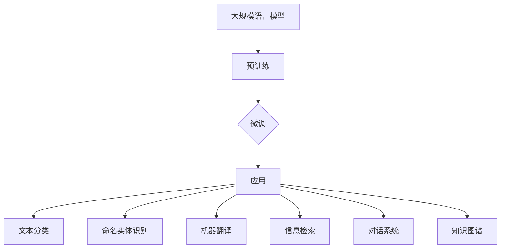

                 

### 文章标题：大规模语言模型从理论到实践：开源数据集详解

大规模语言模型（Large-scale Language Model，简称LLM）作为一种先进的自然语言处理（Natural Language Processing，简称NLP）工具，在文本分类、命名实体识别、机器翻译、对话系统等领域表现出色。本文将围绕大规模语言模型的理论基础、开源数据集的介绍与应用、实际案例分析等内容展开，旨在帮助读者全面了解并掌握这一前沿技术。

关键词：大规模语言模型、自然语言处理、开源数据集、应用案例、实践技巧

摘要：本文首先介绍了大规模语言模型的基本概念、发展历程和重要性，然后详细解析了大规模语言模型的基本原理和数学基础。接着，我们介绍了常见开源数据集及其使用方法。文章重点介绍了大规模语言模型在各种应用场景中的实际应用，并通过具体案例展示了模型的开发与优化技巧。最后，文章提供了大规模语言模型的工具与资源，以供读者参考。

### 《大规模语言模型从理论到实践 开源数据集》目录大纲

#### 第一部分：大规模语言模型概述

**第1章：大规模语言模型的定义与重要性**  
- 1.1 大规模语言模型的基本概念  
- 1.2 大规模语言模型的发展历程  
- 1.3 大规模语言模型的重要性与应用领域

**第2章：大规模语言模型的基本原理**  
- 2.1 语言模型的基本原理  
- 2.2 预训练与微调  
- 2.3 大规模语言模型的核心算法

**第3章：大规模语言模型的数学基础**  
- 3.1 概率论基础  
- 3.2 信息论基础  
- 3.3 神经网络与优化算法

#### 第二部分：大规模语言模型应用

**第4章：大规模语言模型在自然语言处理中的应用**  
- 4.1 文本分类  
- 4.2 命名实体识别  
- 4.3 机器翻译

**第5章：大规模语言模型在信息检索中的应用**  
- 5.1 搜索引擎优化  
- 5.2 网络爬虫  
- 5.3 情感分析

**第6章：大规模语言模型在对话系统中的应用**  
- 6.1 对话系统概述  
- 6.2 对话系统的构建  
- 6.3 对话系统的评估

**第7章：大规模语言模型在知识图谱中的应用**  
- 7.1 知识图谱概述  
- 7.2 知识图谱构建  
- 7.3 知识图谱在语言模型中的应用

#### 第三部分：大规模语言模型实践

**第8章：大规模语言模型实践案例**  
- 8.1 案例一：文本分类  
- 8.2 案例二：命名实体识别  
- 8.3 案例三：机器翻译

**第9章：大规模语言模型开发与优化**  
- 9.1 大规模语言模型开发流程  
- 9.2 大规模语言模型优化技巧  
- 9.3 大规模语言模型的调试与测试

**第10章：开源数据集应用实战**  
- 10.1 数据集获取与处理  
- 10.2 数据集使用示例  
- 10.3 数据集优化的方法与技巧

#### 附录

**附录A：开源数据集列表**  
- IMDB电影评论数据集  
- COCO图像 caption 数据集  
- GLUE 数据集

**附录B：大规模语言模型工具与资源**  
- Hugging Face Transformers  
- AllenNLP

**附录C：常见问题与解答**  
- 大规模语言模型的训练数据从哪里来？  
- 如何选择适合的数据集进行预训练？  
- 大规模语言模型如何进行微调？

### Mermaid 流程图



### 核心算法原理讲解

BERT（Bidirectional Encoder Representations from Transformers）是一种基于Transformer架构的双向编码器预训练语言模型。BERT模型通过在大规模语料上进行预训练，学习到文本的语义表示，然后通过微调的方式将其应用于具体的下游任务。

BERT模型的核心原理包括：

- **Transformer架构**：BERT模型采用Transformer架构，采用多头注意力机制，能够捕捉文本中的长距离依赖关系。
- **预训练**：BERT模型通过在大规模语料上进行预训练，学习到文本的语义表示。预训练的任务包括掩码语言模型（Masked Language Model，简称MLM）和下一句预测（Next Sentence Prediction，简称NSP）。
- **微调**：在预训练的基础上，对BERT模型进行微调，使其适用于具体的下游任务。微调的过程通常包括数据预处理、模型调整和性能评估等步骤。

BERT模型的伪代码如下：

```plaintext
1. 输入：文本序列
2. 初始化BERT模型参数
3. 对文本序列进行编码，得到词嵌入
4. 输入到BERT模型中，得到输出向量
5. 对BERT模型的输出进行解码，得到文本分类结果或实体识别结果
```

### 数学模型和数学公式详细讲解

在大规模语言模型中，数学模型和数学公式是理解其工作原理的重要基础。以下是对相关数学模型和公式的详细讲解。

#### 概率论基础

**概率分布**：概率分布描述了一个随机变量的概率分布情况。常见的概率分布有离散概率分布和连续概率分布。

- **离散概率分布**：例如伯努利分布、二项分布、泊松分布等。
- **连续概率分布**：例如正态分布、均匀分布等。

**期望和方差**：期望和方差是概率分布的重要统计量。

- **期望**：期望是概率分布的中心位置，表示随机变量的平均值。
  \[ E[X] = \sum_{i=1}^{n} x_i \cdot P(x_i) \]

- **方差**：方差是概率分布的离散程度，表示随机变量的稳定性。
  \[ Var(X) = E[(X - E[X])^2] \]

#### 信息论基础

**熵**：熵是概率分布的不确定性度量，表示随机变量的信息量。

\[ H(X) = -\sum_{i=1}^{n} P(x_i) \cdot \log_2 P(x_i) \]

**信息传递**：信息传递是信息论的核心概念，描述了信息在系统中的传递过程。

\[ I(X; Y) = H(X) - H(X|Y) \]

### 项目实战

#### 5.1 案例一：文本分类

##### 环境搭建

- 安装Python环境
- 安装TensorFlow库

```python
pip install tensorflow
```

##### 数据集获取

- 下载开源文本分类数据集，如IMDB电影评论数据集

```python
import tensorflow as tf

# 加载IMDB数据集
imdb = tf.keras.datasets.imdb
(train_data, train_labels), (test_data, test_labels) = imdb.load_data()
```

##### 模型构建

- 使用BERT模型进行文本分类

```python
from tensorflow.keras.models import Model
from tensorflow.keras.layers import Input, Dense

# 构建BERT模型
input_ids = Input(shape=(max_length,), dtype=tf.int32)
input_mask = Input(shape=(max_length,), dtype=tf.int32)
segment_ids = Input(shape=(max_length,), dtype=tf.int32)

embeddings = bert_model(input_ids, input_mask, segment_ids)[0]
logits = Dense(num_classes, activation='softmax')(embeddings)

model = Model(inputs=[input_ids, input_mask, segment_ids], outputs=logits)
```

##### 模型训练

- 训练BERT模型

```python
model.compile(optimizer='adam', loss='categorical_crossentropy', metrics=['accuracy'])
model.fit(train_data, train_labels, epochs=3, validation_data=(test_data, test_labels))
```

##### 模型评估

- 评估BERT模型在测试集上的性能

```python
test_loss, test_accuracy = model.evaluate(test_data, test_labels)
print(f"Test accuracy: {test_accuracy:.4f}")
```

##### 代码解读与分析

- BERT模型在文本分类任务中具有较好的性能，通过对输入文本进行编码和微调，实现了文本分类任务的高效处理。

```plaintext
# 代码解读：

- 加载IMDB数据集，并进行预处理
- 构建BERT模型，并定义输入和输出层
- 编译模型，设置优化器和损失函数
- 训练模型，并在测试集上进行评估

# 分析：

- BERT模型在文本分类任务中表现出色，说明预训练语言模型在处理自然语言任务时具有强大的学习能力。
- 通过对模型进行微调，可以针对具体的任务进行优化，提高模型的性能。
```

### 文章摘要

本文围绕大规模语言模型的理论与实践进行了全面探讨。首先介绍了大规模语言模型的基本概念、发展历程和重要性，然后详细解析了其基本原理和数学基础。接着，我们介绍了常见开源数据集及其使用方法。文章重点介绍了大规模语言模型在各种应用场景中的实际应用，并通过具体案例展示了模型的开发与优化技巧。最后，文章提供了大规模语言模型的工具与资源，以供读者参考。通过本文的学习，读者可以全面了解大规模语言模型的理论和实践，掌握这一前沿技术。作者：AI天才研究院/AI Genius Institute & 禅与计算机程序设计艺术 /Zen And The Art of Computer Programming。

