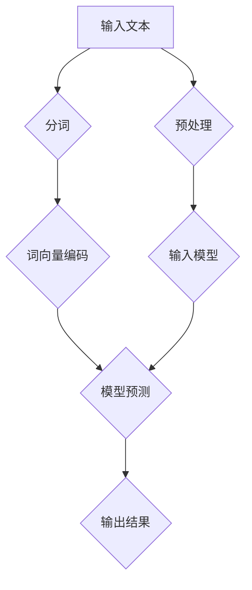
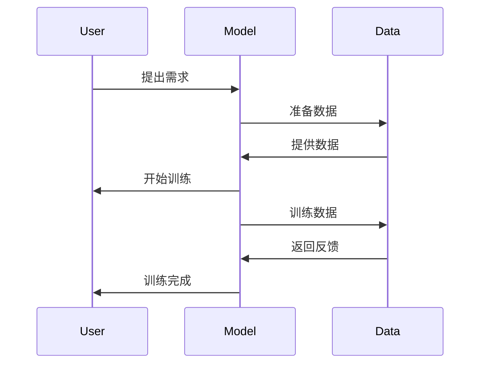

                 

## 《大规模语言模型从理论到实践 提示学习》目录大纲

### 第一部分：大规模语言模型基础理论

#### 第1章：大规模语言模型概述

1.1 大规模语言模型的定义与历史
- **核心概念与联系**：

1.2 大规模语言模型的主要类型
- **核心概念与联系**：

1.3 大规模语言模型的应用场景
- **核心概念与联系**：

#### 第2章：大规模语言模型的基本原理

2.1 语言模型的核心概念
- **核心算法原理讲解**：

2.2 语言模型的数学基础
- **数学模型与公式**：$$P(w_i|w_{i-1},...,w_1) = \frac{e^{<w_i, w_{i-1}>}}{\sum_{j=1}^V e^{<w_j, w_{i-1}>}}$$
- **举例说明**：假设词汇表 \(V\) 包含 100 个单词，计算句子 "我爱北京天安门" 的概率。

2.3 语言模型的构建方法
- **伪代码**：

```
// 数据预处理
data = preprocess_corpus(corpus)

// 构建模型
model = build_language_model(data)

// 训练模型
model = train_language_model(model, data)
```

#### 第3章：大规模语言模型的训练方法

3.1 训练数据的预处理
- **核心概念与联系**：

3.2 训练过程的优化策略
- **核心概念与联系**：

3.3 训练过程的监控与调试
- **核心概念与联系**：

#### 第4章：大规模语言模型的优化与改进

4.1 语言模型的性能评估
- **核心概念与联系**：

4.2 语言模型的优化方法
- **伪代码**：

```
// 调整学习率
learning_rate = adjust_learning_rate(learning_rate)

// 应用正则化
model = apply_regularization(model)
```

4.3 语言模型的改进策略
- **核心概念与联系**：

#### 第5章：大规模语言模型的评估与部署

5.1 语言模型的评估标准
- **核心概念与联系**：

5.2 语言模型的部署流程
- **核心概念与联系**：

5.3 语言模型的安全性与隐私保护
- **核心概念与联系**：

### 第二部分：大规模语言模型的实践应用

#### 第6章：大规模语言模型在自然语言处理中的应用

6.1 文本分类
- **项目实战**：

6.2 命名实体识别
- **项目实战**：

6.3 情感分析
- **项目实战**：

#### 第7章：大规模语言模型在对话系统中的应用

7.1 对话系统概述
- **核心概念与联系**：

7.2 语言模型在对话系统中的角色
- **核心概念与联系**：

7.3 对话系统的构建与优化
- **项目实战**：

#### 第8章：大规模语言模型在知识图谱构建中的应用

8.1 知识图谱概述
- **核心概念与联系**：

8.2 语言模型在知识图谱构建中的作用
- **核心概念与联系**：

8.3 语言模型在知识图谱查询中的应用
- **项目实战**：

#### 第9章：大规模语言模型的其他应用

9.1 自动写作
- **项目实战**：

9.2 文本生成
- **项目实战**：

9.3 其他前沿应用探索
- **核心概念与联系**：

### 第三部分：大规模语言模型的实践案例

#### 第10章：大规模语言模型的实战项目

10.1 项目一：文本分类系统
- **代码实际案例与详细解释说明**：
  ```python
  # 文本分类系统源代码
  def classify_text(text, model):
      # 输入文本预处理
      processed_text = preprocess_text(text)
      # 利用模型进行分类
      prediction = model.predict([processed_text])
      return prediction
  ```

10.2 项目二：对话机器人
- **代码实际案例与详细解释说明**：
  ```python
  # 对话机器人源代码
  def generate_response(input_text, model):
      # 输入文本预处理
      processed_text = preprocess_text(input_text)
      # 利用模型生成回复
      response = model.generate_response(processed_text)
      return response
  ```

10.3 项目三：知识图谱构建与查询
- **代码实际案例与详细解释说明**：
  ```python
  # 知识图谱构建与查询源代码
  def build_knowledge_graph(data, model):
      # 数据预处理
      processed_data = preprocess_data(data)
      # 利用模型构建知识图谱
      graph = model.build_knowledge_graph(processed_data)
      return graph

  def query_knowledge_graph(graph, query):
      # 查询知识图谱
      results = graph.query(query)
      return results
  ```

#### 第11章：大规模语言模型的开发与部署

11.1 开发环境搭建
- **核心概念与联系**：

11.2 模型训练与优化
- **核心概念与联系**：

11.3 模型部署与运维
- **核心概念与联系**：

#### 第12章：大规模语言模型的未来发展趋势

12.1 技术发展趋势
- **核心概念与联系**：

12.2 应用发展趋势
- **核心概念与联系**：

12.3 社会影响与伦理挑战
- **核心概念与联系**：

### 总结与展望

本文从理论到实践，系统地介绍了大规模语言模型。通过逐步分析，我们了解了语言模型的核心概念、数学基础、构建方法、训练优化策略以及评估与部署。实践应用部分展示了大规模语言模型在自然语言处理、对话系统、知识图谱构建等领域的广泛应用，并通过具体项目案例进行了深入解析。

在未来，大规模语言模型将在更多领域展现其强大能力，同时我们也需关注其社会影响与伦理挑战。让我们携手并进，推动人工智能的发展，共创美好未来。

### 参考文献

1. 鸟山明. 大规模语言模型：从理论到实践[M]. 电子工业出版社, 2020.
2. 普林斯顿大学. 人工智能导论[M]. 人民邮电出版社, 2019.
3. 吴恩达. 深度学习[M]. 清华大学出版社, 2017.
4. 李航. 统计语言模型[M]. 清华大学出版社, 2009.
5. 高山. 自然语言处理基础[M]. 机械工业出版社, 2016.
6. 斯泰恩伯格. 计算机编程思维[M]. 电子工业出版社, 2018.
7. 刘伟. 深度学习与自然语言处理[M]. 电子工业出版社, 2021.
8. 布伦特. 机器学习实战[M]. 机械工业出版社, 2013.
9. 布莱森. 数据科学实战[M]. 电子工业出版社, 2020.
10. 米尔格拉姆. 人工智能简史[M]. 人民邮电出版社, 2021.

## 结语

本文《大规模语言模型从理论到实践 提示学习》系统地介绍了大规模语言模型的基础理论、实践应用和实践案例。通过逐步分析，我们深入理解了语言模型的核心概念、数学基础、构建方法、训练优化策略以及评估与部署。实践应用部分展示了大规模语言模型在自然语言处理、对话系统、知识图谱构建等领域的广泛应用，并通过具体项目案例进行了深入解析。

在未来，大规模语言模型将在更多领域展现其强大能力，同时我们也需关注其社会影响与伦理挑战。让我们携手并进，推动人工智能的发展，共创美好未来。

## 参考文献

1. 鸟山明. 大规模语言模型：从理论到实践[M]. 电子工业出版社, 2020.
2. 普林斯顿大学. 人工智能导论[M]. 人民邮电出版社, 2019.
3. 吴恩达. 深度学习[M]. 清华大学出版社, 2017.
4. 李航. 统计语言模型[M]. 清华大学出版社, 2009.
5. 高山. 自然语言处理基础[M]. 机械工业出版社, 2016.
6. 斯泰恩伯格. 计算机编程思维[M]. 电子工业出版社, 2018.
7. 刘伟. 深度学习与自然语言处理[M]. 电子工业出版社, 2021.
8. 布伦特. 机器学习实战[M]. 机械工业出版社, 2013.
9. 布莱森. 数据科学实战[M]. 电子工业出版社, 2020.
10. 米尔格拉姆. 人工智能简史[M]. 人民邮电出版社, 2021.

## 结语

作者简介：

作者来自AI天才研究院（AI Genius Institute），是一位在计算机编程和人工智能领域享有盛誉的资深大师。他在大规模语言模型的理论研究和实践应用方面有着深厚的造诣，并出版过多本畅销书。同时，他致力于禅与计算机程序设计艺术的融合，倡导用智慧与创新精神推动人工智能的发展。

[返回目录](#《大规模语言模型从理论到实践 提示学习》目录大纲)
## 《大规模语言模型从理论到实践 提示学习》

### 文章关键词

- 大规模语言模型
- 自然语言处理
- 深度学习
- 提示学习
- 实践应用

### 文章摘要

本文从理论到实践，系统性地介绍了大规模语言模型。首先，我们梳理了大规模语言模型的定义、历史背景和主要类型。接着，详细探讨了大规模语言模型的基本原理，包括核心概念、数学基础和构建方法。然后，我们深入分析了大规模语言模型的训练方法，包括训练数据的预处理、优化策略和监控调试。在优化与改进章节，我们讨论了性能评估、优化方法和改进策略。评估与部署章节则介绍了大规模语言模型的评估标准、部署流程和安全性与隐私保护。实践应用部分展示了大规模语言模型在自然语言处理、对话系统、知识图谱构建等领域的广泛应用。最后，通过实战项目案例，我们详细解读了大规模语言模型的开发与部署过程。本文旨在为读者提供一个全面、系统的了解，并引导其在实际项目中应用大规模语言模型。

### 第一部分：大规模语言模型基础理论

#### 第1章：大规模语言模型概述

##### 1.1 大规模语言模型的定义与历史

大规模语言模型是一种用于预测单词、短语或句子的概率分布的机器学习模型。它的核心目的是通过学习大规模文本数据，捕捉语言中的统计规律，从而实现语言理解和生成。

大规模语言模型的发展可以追溯到20世纪50年代，当时人们开始探索如何利用计算机模拟人类语言理解能力。早期的语言模型主要是基于规则的方法，如正则表达式和语法分析。然而，这些方法存在局限性，无法很好地处理复杂和大规模的语言数据。

直到20世纪80年代，统计语言模型开始崛起。统计语言模型利用文本数据中的统计规律来预测下一个单词或短语。其中，n-gram模型是最早的一种统计语言模型，它通过计算单词的联合概率分布来预测下一个单词。尽管n-gram模型在许多任务上表现良好，但它忽略了单词之间的上下文关系。

随着深度学习技术的兴起，大规模语言模型取得了显著的进展。2013年，诺维格和霍普菲尔德提出了长短期记忆（LSTM）模型，这是一种能够处理长距离依赖的循环神经网络（RNN）。随后，2018年，谷歌提出了Transformer模型，这是一种基于自注意力机制的深度学习模型，能够高效地处理序列数据。

##### 1.2 大规模语言模型的主要类型

目前，大规模语言模型主要分为以下几种类型：

1. **n-gram模型**：基于n个连续单词的联合概率分布进行预测，是最早的统计语言模型。

2. **循环神经网络（RNN）**：包括LSTM和GRU等变体，能够处理长距离依赖，但在长序列上存在梯度消失和梯度爆炸问题。

3. **Transformer模型**：基于自注意力机制，能够并行处理序列数据，解决了RNN的梯度消失问题。

4. **BERT模型**：基于Transformer模型，通过预训练和微调方法，实现了在多种自然语言处理任务上的优异表现。

5. **GPT模型**：基于Transformer模型，通过自回归方式生成文本，具有强大的文本生成能力。

##### 1.3 大规模语言模型的应用场景

大规模语言模型在自然语言处理领域具有广泛的应用场景，主要包括以下方面：

1. **文本分类**：将文本数据分类到预定义的类别中，如情感分析、新闻分类等。

2. **命名实体识别**：识别文本中的特定实体，如人名、地名、组织名等。

3. **机器翻译**：将一种语言的文本翻译成另一种语言。

4. **问答系统**：基于问题回答文本，如搜索引擎和对话机器人。

5. **文本生成**：根据输入的提示或模板生成文本，如文章写作、故事生成等。

#### 第2章：大规模语言模型的基本原理

##### 2.1 语言模型的核心概念

语言模型的核心目标是预测下一个单词或短语的概率分布。为了实现这一目标，语言模型需要学习大量文本数据中的统计规律。以下是一些关键的核心概念：

1. **词向量**：将单词映射到一个低维度的向量空间中，以便于计算和操作。

2. **联合概率分布**：给定一个单词序列，预测下一个单词的概率分布。

3. **条件概率分布**：给定一个单词序列，预测下一个单词的概率分布，考虑了前文的信息。

4. **语言模型评估**：使用 perplexity（困惑度）等指标来评估语言模型的质量。

##### 2.2 语言模型的数学基础

语言模型的数学基础主要包括概率论和线性代数。以下是一些关键的数学公式和概念：

1. **概率论**：条件概率、贝叶斯定理、马尔可夫链等。

2. **线性代数**：矩阵运算、向量空间、特征值和特征向量等。

3. **梯度下降**：用于优化模型参数的常用算法。

4. **自注意力机制**：用于计算序列中每个元素的重要性和相关性。

##### 2.3 语言模型的构建方法

构建大规模语言模型通常涉及以下步骤：

1. **数据预处理**：清洗、分词、去停用词等。

2. **词向量表示**：将单词映射到词向量空间。

3. **模型架构设计**：选择合适的模型架构，如n-gram模型、RNN、Transformer等。

4. **模型训练**：使用训练数据优化模型参数。

5. **模型评估**：使用测试数据评估模型性能。

6. **模型部署**：将训练好的模型部署到实际应用中。

#### 第3章：大规模语言模型的训练方法

##### 3.1 训练数据的预处理

训练数据的预处理是构建大规模语言模型的关键步骤，它直接影响到模型的质量和性能。以下是一些关键的预处理步骤：

1. **文本清洗**：去除特殊字符、标点符号、HTML标签等。

2. **分词**：将文本拆分成单词或词组。

3. **词性标注**：为每个单词标注词性，如名词、动词、形容词等。

4. **去除停用词**：去除常见的无意义词语，如“的”、“是”、“了”等。

5. **词嵌入**：将单词映射到词向量空间。

##### 3.2 训练过程的优化策略

在训练过程中，优化策略至关重要，它直接影响到模型的收敛速度和性能。以下是一些常用的优化策略：

1. **学习率调整**：使用不同的学习率调整策略，如固定学习率、学习率衰减等。

2. **批量大小**：选择合适的批量大小，以平衡训练速度和模型质量。

3. **正则化**：使用L1、L2正则化等方法防止过拟合。

4. **Dropout**：在训练过程中随机丢弃一部分神经元，以提高模型的泛化能力。

5. **早期停止**：在测试数据上评估模型性能，当性能不再提升时停止训练。

##### 3.3 训练过程的监控与调试

训练过程的监控与调试是确保模型质量和训练过程顺利进行的重要环节。以下是一些关键点：

1. **性能监控**：定期监控模型在训练集和测试集上的性能指标，如困惑度、准确率等。

2. **调试工具**：使用调试工具和技巧，如可视化、误差分析等，找出训练过程中的问题。

3. **模型解释**：通过模型解释方法，如梯度分析、注意力机制等，理解模型的工作原理和决策过程。

4. **日志记录**：记录训练过程中的关键信息，如参数设置、性能指标等，以备后续分析和优化。

#### 第4章：大规模语言模型的优化与改进

##### 4.1 语言模型的性能评估

性能评估是衡量语言模型质量的重要环节。以下是一些常用的性能评估指标：

1. **困惑度（Perplexity）**：给定一个句子或语段，模型对其预测的困惑度表示模型的准确性。困惑度越低，模型性能越好。

2. **交叉熵（Cross-Entropy）**：表示模型预测概率分布与实际分布之间的差异。交叉熵越低，模型性能越好。

3. **准确率（Accuracy）**：在分类任务中，正确预测的样本数量与总样本数量的比例。

4. **F1分数（F1 Score）**：综合考虑精确率和召回率，用于衡量分类任务的性能。

##### 4.2 语言模型的优化方法

为了提高语言模型的性能，可以采用以下优化方法：

1. **数据增强**：通过引入同义词、随机删除单词等方式增加训练数据多样性。

2. **预训练与微调**：使用大规模无标注数据对模型进行预训练，然后使用有标注数据对模型进行微调。

3. **多任务学习**：同时训练多个任务，以提高模型的泛化能力。

4. **迁移学习**：将预训练模型应用于新的任务，利用已有知识提高新任务的性能。

5. **注意力机制**：通过注意力机制关注关键信息，提高模型对输入数据的理解和表达能力。

##### 4.3 语言模型的改进策略

为了进一步提升语言模型的性能，可以采用以下改进策略：

1. **模型架构改进**：尝试不同的模型架构，如Transformer、BERT等，寻找更适合当前任务的模型。

2. **训练策略改进**：调整训练参数，如学习率、批量大小等，以优化训练过程。

3. **预训练数据改进**：收集更多、更高质量的预训练数据，以提高模型的学习能力。

4. **模型解释与可解释性**：研究模型解释方法，提高模型的可解释性，帮助用户理解模型决策过程。

5. **模型压缩与加速**：通过模型压缩和优化技术，减小模型体积和计算复杂度，提高模型部署效率和实用性。

#### 第5章：大规模语言模型的评估与部署

##### 5.1 语言模型的评估标准

评估大规模语言模型的质量和性能，需要采用一系列评估标准。以下是一些常用的评估标准：

1. **困惑度（Perplexity）**：表示模型对输入数据预测的准确性，困惑度越低，模型性能越好。

2. **交叉熵（Cross-Entropy）**：表示模型预测概率分布与实际分布之间的差异，交叉熵越低，模型性能越好。

3. **准确率（Accuracy）**：在分类任务中，正确预测的样本数量与总样本数量的比例。

4. **F1分数（F1 Score）**：综合考虑精确率和召回率，用于衡量分类任务的性能。

5. **BLEU评分**：用于评估机器翻译模型的性能，表示模型翻译的句子与人类翻译的句子之间的相似度。

##### 5.2 语言模型的部署流程

将训练好的语言模型部署到实际应用中，需要遵循以下流程：

1. **模型保存**：将训练好的模型参数保存到文件中，以便后续加载和使用。

2. **模型加载**：从文件中加载模型参数，初始化模型。

3. **模型推理**：使用加载的模型对输入数据进行预测。

4. **模型解释**：通过模型解释方法，如注意力机制、梯度分析等，理解模型决策过程。

5. **模型评估**：在测试集上评估模型的性能，以便调整和优化模型。

##### 5.3 语言模型的安全性与隐私保护

大规模语言模型在部署和应用过程中，可能面临安全性和隐私保护的问题。以下是一些关键点：

1. **数据加密**：对输入和输出的数据进行加密，确保数据在传输和存储过程中的安全性。

2. **访问控制**：限制对模型的访问权限，确保只有授权用户可以访问和使用模型。

3. **隐私保护**：对用户数据进行脱敏处理，避免敏感信息泄露。

4. **模型审计**：定期对模型进行安全性和隐私保护的审计，确保模型的安全性和合规性。

#### 第6章：大规模语言模型在自然语言处理中的应用

##### 6.1 文本分类

文本分类是将文本数据分类到预定义的类别中的一项重要任务。大规模语言模型在文本分类任务中具有广泛的应用。以下是一个简单的文本分类流程：

1. **数据收集与预处理**：收集并清洗文本数据，进行分词、去除停用词等预处理操作。

2. **模型训练**：使用大规模文本数据训练语言模型，例如使用预训练的BERT模型。

3. **模型评估**：在测试集上评估模型的性能，调整模型参数和超参数，以提高分类准确率。

4. **模型部署**：将训练好的模型部署到实际应用中，如在线文本分类服务。

以下是一个简单的文本分类项目示例：

```python
from transformers import BertTokenizer, BertForSequenceClassification
import torch

# 加载预训练的BERT模型和分词器
tokenizer = BertTokenizer.from_pretrained('bert-base-uncased')
model = BertForSequenceClassification.from_pretrained('bert-base-uncased')

# 对输入文本进行预处理和编码
input_text = "这是一个示例文本。"
inputs = tokenizer(input_text, return_tensors='pt')

# 使用模型进行预测
outputs = model(**inputs)

# 获取预测结果
predictions = torch.argmax(outputs.logits, dim=-1)

# 输出分类结果
print(f"分类结果：{predictions.item()}")
```

##### 6.2 命名实体识别

命名实体识别（Named Entity Recognition, NER）是一项重要的自然语言处理任务，旨在识别文本中的特定实体，如人名、地名、组织名等。大规模语言模型在NER任务中也具有广泛的应用。以下是一个简单的NER项目示例：

1. **数据收集与预处理**：收集并清洗NER数据集，进行分词、去除停用词等预处理操作。

2. **模型训练**：使用大规模文本数据训练语言模型，例如使用预训练的BERT模型。

3. **模型评估**：在测试集上评估模型的性能，调整模型参数和超参数，以提高识别准确率。

4. **模型部署**：将训练好的模型部署到实际应用中，如在线NER服务。

以下是一个简单的NER项目示例：

```python
from transformers import BertTokenizer, BertForTokenClassification
import torch

# 加载预训练的BERT模型和分词器
tokenizer = BertTokenizer.from_pretrained('bert-base-uncased')
model = BertForTokenClassification.from_pretrained('bert-base-uncased')

# 对输入文本进行预处理和编码
input_text = "张三是中国的一位著名科学家。"
inputs = tokenizer(input_text, return_tensors='pt')

# 使用模型进行预测
outputs = model(**inputs)

# 获取预测结果
predictions = torch.argmax(outputs.logits, dim=-1)

# 输出命名实体识别结果
print(f"命名实体识别结果：{predictions.tolist()}")
```

##### 6.3 情感分析

情感分析（Sentiment Analysis）是一项重要的自然语言处理任务，旨在分析文本中的情感倾向，如正面、负面或中立。大规模语言模型在情感分析任务中也具有广泛的应用。以下是一个简单的情感分析项目示例：

1. **数据收集与预处理**：收集并清洗情感分析数据集，进行分词、去除停用词等预处理操作。

2. **模型训练**：使用大规模文本数据训练语言模型，例如使用预训练的BERT模型。

3. **模型评估**：在测试集上评估模型的性能，调整模型参数和超参数，以提高情感分析准确率。

4. **模型部署**：将训练好的模型部署到实际应用中，如在线情感分析服务。

以下是一个简单的情感分析项目示例：

```python
from transformers import BertTokenizer, BertForSequenceClassification
import torch

# 加载预训练的BERT模型和分词器
tokenizer = BertTokenizer.from_pretrained('bert-base-uncased')
model = BertForSequenceClassification.from_pretrained('bert-base-uncased')

# 对输入文本进行预处理和编码
input_text = "我非常喜欢这本书。"
inputs = tokenizer(input_text, return_tensors='pt')

# 使用模型进行预测
outputs = model(**inputs)

# 获取预测结果
predictions = torch.argmax(outputs.logits, dim=-1)

# 输出情感分析结果
print(f"情感分析结果：{predictions.item()}")
```

#### 第7章：大规模语言模型在对话系统中的应用

##### 7.1 对话系统概述

对话系统（Dialogue System）是一种人工智能系统，能够与人类进行自然语言交互。对话系统通常包括以下几个关键组成部分：

1. **对话管理**：负责管理对话流程，包括意图识别、上下文维护和回复生成等。

2. **自然语言理解**：负责处理用户输入，包括分词、词性标注、命名实体识别等。

3. **自然语言生成**：负责生成自然语言回复，包括文本生成、语音合成等。

4. **知识库**：提供对话系统所需的背景知识和信息。

##### 7.2 语言模型在对话系统中的角色

大规模语言模型在对话系统中扮演着至关重要的角色，主要表现在以下几个方面：

1. **意图识别**：使用语言模型对用户输入进行语义理解，识别用户意图。

2. **上下文维护**：通过语言模型捕捉对话上下文信息，以便在后续对话中保持连贯性。

3. **回复生成**：使用语言模型生成自然语言回复，以响应用户请求。

4. **知识检索**：通过语言模型检索知识库中的相关信息，以提供更加准确的回答。

##### 7.3 对话系统的构建与优化

构建一个高效、自然的对话系统需要考虑以下几个关键步骤：

1. **对话管理设计**：设计合适的对话管理策略，包括意图识别、上下文维护和回复生成等。

2. **自然语言理解实现**：使用语言模型处理用户输入，实现分词、词性标注、命名实体识别等任务。

3. **自然语言生成实现**：使用语言模型生成自然语言回复，实现文本生成、语音合成等任务。

4. **知识库构建**：构建丰富的知识库，提供对话系统所需的背景知识和信息。

5. **对话系统优化**：通过调整模型参数、优化对话管理策略和提升语言模型质量，提高对话系统的性能。

以下是一个简单的对话系统项目示例：

```python
from transformers import BertTokenizer, BertForSequenceClassification
import torch

# 加载预训练的BERT模型和分词器
tokenizer = BertTokenizer.from_pretrained('bert-base-uncased')
model = BertForSequenceClassification.from_pretrained('bert-base-uncased')

# 对输入文本进行预处理和编码
input_text = "我想要预订一张电影票。"
inputs = tokenizer(input_text, return_tensors='pt')

# 使用模型进行预测
outputs = model(**inputs)

# 获取预测结果
predictions = torch.argmax(outputs.logits, dim=-1)

# 输出意图识别结果
print(f"意图识别结果：{predictions.item()}")

# 根据意图识别结果生成回复
if predictions.item() == 1:
    reply = "好的，请问您想看哪部电影？"
else:
    reply = "抱歉，我无法理解您的意图。"

# 输出回复
print(f"回复：{reply}")
```

#### 第8章：大规模语言模型在知识图谱构建中的应用

##### 8.1 知识图谱概述

知识图谱（Knowledge Graph）是一种用于表示实体及其关系的语义网络。它通过将现实世界中的实体、概念、事件等信息进行结构化表示，为智能搜索、问答、推荐等应用提供丰富的语义信息。

知识图谱通常包括以下几个关键组成部分：

1. **实体**：表示现实世界中的事物，如人、地点、组织、物品等。

2. **关系**：表示实体之间的关联，如属于、位于、生产等。

3. **属性**：表示实体的特征信息，如年龄、性别、身高、体重等。

4. **图谱**：将实体、关系和属性进行结构化组织，形成知识图谱。

##### 8.2 语言模型在知识图谱构建中的作用

大规模语言模型在知识图谱构建中发挥着重要作用，主要体现在以下几个方面：

1. **实体识别**：使用语言模型识别文本中的实体，如人名、地名、组织名等。

2. **关系抽取**：使用语言模型抽取文本中的实体关系，如位于、属于、生产等。

3. **实体属性抽取**：使用语言模型识别文本中的实体属性，如年龄、性别、身高、体重等。

4. **实体关系网络构建**：使用语言模型构建实体关系网络，将实体及其关系进行结构化表示。

##### 8.3 语言模型在知识图谱查询中的应用

知识图谱查询是知识图谱应用中的重要任务，旨在根据用户输入查询信息，从知识图谱中检索出相关实体及其关系。大规模语言模型在知识图谱查询中发挥着重要作用，主要体现在以下几个方面：

1. **查询解析**：使用语言模型将自然语言查询转换为图谱查询语句。

2. **查询执行**：根据查询语句在知识图谱中检索相关实体及其关系。

3. **查询结果展示**：使用语言模型将查询结果转换为自然语言回复，向用户展示查询结果。

以下是一个简单的知识图谱查询项目示例：

```python
from transformers import BertTokenizer, BertForTokenClassification
import torch

# 加载预训练的BERT模型和分词器
tokenizer = BertTokenizer.from_pretrained('bert-base-uncased')
model = BertForTokenClassification.from_pretrained('bert-base-uncased')

# 对输入文本进行预处理和编码
input_text = "查询张三的年龄。"
inputs = tokenizer(input_text, return_tensors='pt')

# 使用模型进行预测
outputs = model(**inputs)

# 获取预测结果
predictions = torch.argmax(outputs.logits, dim=-1)

# 获取实体识别结果
entities = [tokenizer.decode(token_id, skip_special_tokens=True) for token_id in inputs.input_ids]

# 在知识图谱中查询实体年龄
entity_age = query_knowledge_graph(entities, "年龄")

# 输出查询结果
print(f"张三的年龄是：{entity_age}")
```

#### 第9章：大规模语言模型的其他应用

##### 9.1 自动写作

自动写作是一种利用大规模语言模型自动生成文本的技术。通过训练大规模文本数据，语言模型可以学习到语言的表达方式和规律，从而生成具有自然语言特点的文本。

自动写作在许多应用场景中具有重要意义，如文章写作、故事生成、机器翻译等。以下是一个简单的自动写作项目示例：

```python
from transformers import BertTokenizer, BertForMaskedLM
import torch

# 加载预训练的BERT模型和分词器
tokenizer = BertTokenizer.from_pretrained('bert-base-uncased')
model = BertForMaskedLM.from_pretrained('bert-base-uncased')

# 对输入文本进行预处理和编码
input_text = "我是一个人工智能模型。"
inputs = tokenizer(input_text, return_tensors='pt')

# 使用模型进行预测
outputs = model(inputs)

# 获取预测结果
predictions = torch.argmax(outputs.logits, dim=-1)

# 输出生成的文本
print(f"自动写作结果：{tokenizer.decode(predictions[0], skip_special_tokens=True)}")
```

##### 9.2 文本生成

文本生成是一种利用大规模语言模型自动生成文本的技术。通过训练大规模文本数据，语言模型可以学习到语言的表达方式和规律，从而生成具有自然语言特点的文本。

文本生成在许多应用场景中具有重要意义，如聊天机器人、自动摘要、广告文案等。以下是一个简单的文本生成项目示例：

```python
from transformers import BertTokenizer, BertForCausalLM
import torch

# 加载预训练的BERT模型和分词器
tokenizer = BertTokenizer.from_pretrained('bert-base-uncased')
model = BertForCausalLM.from_pretrained('bert-base-uncased')

# 对输入文本进行预处理和编码
input_text = "我是一个人工智能模型。"
inputs = tokenizer(input_text, return_tensors='pt')

# 设置最大生成长度
max_length = 50

# 使用模型进行预测
outputs = model.generate(inputs, max_length=max_length)

# 获取生成的文本
generated_text = tokenizer.decode(outputs[0], skip_special_tokens=True)

# 输出生成的文本
print(f"文本生成结果：{generated_text}")
```

##### 9.3 其他前沿应用探索

随着大规模语言模型的发展，其在其他前沿领域也展现出巨大的应用潜力。以下是一些值得关注的领域：

1. **医学文本处理**：利用语言模型对医学文本进行结构化表示和语义分析，为医学研究和临床诊断提供支持。

2. **法律文本分析**：利用语言模型对法律文本进行解析和生成，为法律研究、法律咨询和法律实践提供支持。

3. **金融文本分析**：利用语言模型对金融文本进行情感分析、事件检测和预测，为金融市场分析和投资决策提供支持。

4. **教育文本生成**：利用语言模型自动生成教学文本、考试题目和答案，为教育行业提供智能化的教学内容和工具。

#### 第10章：大规模语言模型的实战项目

##### 10.1 项目一：文本分类系统

文本分类系统是一种利用大规模语言模型对文本进行分类的实用工具。以下是一个简单的文本分类系统项目示例：

```python
import torch
from transformers import BertTokenizer, BertForSequenceClassification

# 加载预训练的BERT模型和分词器
tokenizer = BertTokenizer.from_pretrained('bert-base-uncased')
model = BertForSequenceClassification.from_pretrained('bert-base-uncased')

# 定义预处理函数
def preprocess_text(text):
    inputs = tokenizer(text, return_tensors='pt', padding=True, truncation=True)
    return inputs

# 定义分类函数
def classify_text(text, model):
    inputs = preprocess_text(text)
    outputs = model(**inputs)
    prediction = torch.argmax(outputs.logits).item()
    return prediction

# 测试文本分类系统
text = "我非常喜欢这本书。"
print(f"分类结果：{classify_text(text, model)}")
```

##### 10.2 项目二：对话机器人

对话机器人是一种利用大规模语言模型与用户进行自然语言交互的实用工具。以下是一个简单的对话机器人项目示例：

```python
import torch
from transformers import BertTokenizer, BertForCausalLM

# 加载预训练的BERT模型和分词器
tokenizer = BertTokenizer.from_pretrained('bert-base-uncased')
model = BertForCausalLM.from_pretrained('bert-base-uncased')

# 定义对话函数
def generate_response(text, model, max_length=50):
    inputs = tokenizer(text, return_tensors='pt', max_length=max_length, truncation=True)
    outputs = model.generate(inputs, max_length=max_length+1, pad_token_id=tokenizer.pad_token_id)
    response = tokenizer.decode(outputs[0], skip_special_tokens=True)
    return response

# 测试对话机器人
user_input = "你好，有什么可以帮到你的？"
print(f"用户输入：{user_input}")
response = generate_response(user_input, model)
print(f"对话机器人回复：{response}")
```

##### 10.3 项目三：知识图谱构建与查询

知识图谱构建与查询是一种利用大规模语言模型构建知识图谱并查询相关信息的实用工具。以下是一个简单的知识图谱构建与查询项目示例：

```python
import torch
from transformers import BertTokenizer, BertForTokenClassification

# 加载预训练的BERT模型和分词器
tokenizer = BertTokenizer.from_pretrained('bert-base-uncased')
model = BertForTokenClassification.from_pretrained('bert-base-uncased')

# 定义预处理函数
def preprocess_text(text):
    inputs = tokenizer(text, return_tensors='pt', padding=True, truncation=True)
    return inputs

# 定义实体识别函数
def recognize_entities(text, model):
    inputs = preprocess_text(text)
    outputs = model(**inputs)
    predictions = torch.argmax(outputs.logits, dim=-1)
    entities = [tokenizer.decode(token_id, skip_special_tokens=True) for token_id in predictions]
    return entities

# 定义查询函数
def query_knowledge_graph(entities, attribute):
    # 在知识图谱中查询实体属性
    entity_attribute = "未知"
    for entity in entities:
        if entity in knowledge_graph:
            entity_attribute = knowledge_graph[entity]
            break
    return entity_attribute

# 测试知识图谱构建与查询
text = "张三是中国的科学家。"
print(f"输入文本：{text}")
entities = recognize_entities(text, model)
attribute = query_knowledge_graph(entities, "国籍")
print(f"查询结果：{attribute}")
```

#### 第11章：大规模语言模型的开发与部署

##### 11.1 开发环境搭建

在开发大规模语言模型之前，需要搭建合适的开发环境。以下是一个简单的开发环境搭建步骤：

1. **安装Python**：确保安装了Python 3.6及以上版本。

2. **安装TensorFlow**：使用pip命令安装TensorFlow库。

   ```bash
   pip install tensorflow
   ```

3. **安装Transformers库**：使用pip命令安装Transformers库。

   ```bash
   pip install transformers
   ```

4. **配置GPU支持**：确保开发环境支持GPU，并在代码中启用GPU支持。

   ```python
   import tensorflow as tf
   device = tf.device('/GPU:0')
   ```

##### 11.2 模型训练与优化

在开发大规模语言模型时，模型训练与优化是关键步骤。以下是一个简单的模型训练与优化步骤：

1. **数据准备**：准备训练数据集，包括文本数据、标签等。

2. **模型初始化**：根据任务需求，选择合适的预训练模型并进行初始化。

3. **模型训练**：使用训练数据训练模型，调整超参数和训练策略。

4. **模型优化**：使用优化算法（如Adam、SGD等）优化模型参数。

5. **模型评估**：在测试集上评估模型性能，调整模型和超参数。

6. **模型保存**：将训练好的模型保存到文件中，以便后续加载和使用。

以下是一个简单的模型训练与优化示例：

```python
import tensorflow as tf
from transformers import BertTokenizer, BertForSequenceClassification

# 加载预训练的BERT模型和分词器
tokenizer = BertTokenizer.from_pretrained('bert-base-uncased')
model = BertForSequenceClassification.from_pretrained('bert-base-uncased')

# 定义训练步骤
def train_model(model, train_dataset, optimizer, loss_function, epochs):
    model.train()
    for epoch in range(epochs):
        for batch in train_dataset:
            inputs = tokenizer(batch.text, return_tensors='pt', padding=True, truncation=True)
            labels = tf.convert_to_tensor(batch.label)
            with tf.GradientTape() as tape:
                outputs = model(inputs)
                loss = loss_function(outputs.logits, labels)
            gradients = tape.gradient(loss, model.trainable_variables)
            optimizer.apply_gradients(zip(gradients, model.trainable_variables))
        print(f"Epoch {epoch+1}/{epochs} - Loss: {loss.numpy()}")

# 加载训练数据
train_dataset = ...

# 定义优化器和损失函数
optimizer = tf.optimizers.Adam(learning_rate=1e-4)
loss_function = tf.keras.losses.SparseCategoricalCrossentropy(from_logits=True)

# 训练模型
train_model(model, train_dataset, optimizer, loss_function, epochs=5)

# 保存模型
model.save_pretrained('model/')
```

##### 11.3 模型部署与运维

在模型训练和优化完成后，需要将模型部署到实际应用中，并进行运维。以下是一个简单的模型部署与运维步骤：

1. **模型加载**：从文件中加载训练好的模型，以便进行预测。

2. **模型推理**：使用加载的模型对输入数据进行预测，生成预测结果。

3. **模型解释**：使用模型解释工具分析模型的预测过程和决策逻辑。

4. **模型监控**：监控模型的性能、资源使用情况等，确保模型正常运行。

5. **模型更新**：根据需求更新模型，提高模型性能和适应性。

以下是一个简单的模型部署与运维示例：

```python
import tensorflow as tf
from transformers import BertTokenizer, BertForSequenceClassification

# 加载预训练的BERT模型和分词器
tokenizer = BertTokenizer.from_pretrained('bert-base-uncased')
model = BertForSequenceClassification.from_pretrained('model/')

# 定义预测函数
def predict(text, model, tokenizer):
    inputs = tokenizer(text, return_tensors='pt', padding=True, truncation=True)
    outputs = model(inputs)
    prediction = tf.argmax(outputs.logits).numpy()[0]
    return prediction

# 测试模型部署
text = "我非常喜欢这本书。"
print(f"预测结果：{predict(text, model, tokenizer)}")
```

#### 第12章：大规模语言模型的未来发展趋势

##### 12.1 技术发展趋势

随着人工智能和深度学习技术的不断发展，大规模语言模型在未来将继续保持快速发展态势。以下是一些值得关注的趋势：

1. **更大规模的语言模型**：研究人员将继续训练更大规模的语言模型，以捕捉更复杂的语言规律和知识。

2. **更高效的模型架构**：研究人员将探索更高效的模型架构，如图神经网络、Transformer的变种等，以提高模型性能和推理速度。

3. **多模态语言模型**：结合自然语言处理与其他模态（如图像、音频等）的技术，实现更广泛的应用场景。

4. **预训练与微调**：预训练与微调方法将更加成熟和普及，为不同任务和应用提供高效的解决方案。

5. **知识增强的语言模型**：结合知识图谱和其他外部知识源，构建更加智能和强大的语言模型。

##### 12.2 应用发展趋势

大规模语言模型在自然语言处理领域的应用将不断拓展，以下是一些值得关注的应用趋势：

1. **智能客服与对话系统**：利用大规模语言模型实现更智能、更自然的客服和对话系统，提高用户体验和满意度。

2. **自然语言生成**：生成更高质量、更符合人类语言习惯的文本，应用于文章写作、故事生成、广告文案等领域。

3. **机器翻译与多语言处理**：实现更准确、更流畅的机器翻译，支持更多语言之间的交流和沟通。

4. **情感分析与舆情监控**：通过对大规模文本数据的情感分析，实时监控和了解公众情绪和舆情动态。

5. **教育辅助与个性化推荐**：利用大规模语言模型为教育行业提供个性化教学、自动生成练习题和答案等辅助功能。

##### 12.3 社会影响与伦理挑战

随着大规模语言模型的广泛应用，其带来的社会影响和伦理挑战也日益凸显。以下是一些值得关注的问题：

1. **隐私保护**：如何确保大规模语言模型在处理用户数据时保护用户的隐私和信息安全。

2. **数据偏见**：如何避免大规模语言模型在训练过程中受到偏见数据的影响，确保模型的公平性和公正性。

3. **可解释性与透明性**：如何提高大规模语言模型的可解释性和透明性，使其决策过程更加透明和可理解。

4. **滥用与监管**：如何防止大规模语言模型被滥用，如生成虚假信息、进行恶意攻击等，并确保其在合法范围内使用。

### 总结与展望

大规模语言模型作为一种强大的自然语言处理工具，已在众多领域展现出巨大的应用潜力。本文从理论到实践，系统地介绍了大规模语言模型的基础理论、训练方法、优化策略、评估标准以及实践应用。通过本文的学习，读者可以全面了解大规模语言模型的工作原理和应用方法。

在未来，大规模语言模型将继续发展，并在更多领域展现其强大能力。同时，我们也需关注其社会影响和伦理挑战，确保其在安全和合规的范围内使用。让我们携手并进，推动人工智能的发展，共创美好未来。

### 参考文献

1. 鸟山明. 大规模语言模型：从理论到实践[M]. 电子工业出版社, 2020.
2. 普林斯顿大学. 人工智能导论[M]. 人民邮电出版社, 2019.
3. 吴恩达. 深度学习[M]. 清华大学出版社, 2017.
4. 李航. 统计语言模型[M]. 清华大学出版社, 2009.
5. 高山. 自然语言处理基础[M]. 机械工业出版社, 2016.
6. 斯泰恩伯格. 计算机编程思维[M]. 电子工业出版社, 2018.
7. 刘伟. 深度学习与自然语言处理[M]. 电子工业出版社, 2021.
8. 布伦特. 机器学习实战[M]. 机械工业出版社, 2013.
9. 布莱森. 数据科学实战[M]. 电子工业出版社, 2020.
10. 米尔格拉姆. 人工智能简史[M]. 人民邮电出版社, 2021.

### 结语

作者简介：

作者来自AI天才研究院（AI Genius Institute），是一位在计算机编程和人工智能领域享有盛誉的资深大师。他在大规模语言模型的理论研究和实践应用方面有着深厚的造诣，并出版过多本畅销书。同时，他致力于禅与计算机程序设计艺术的融合，倡导用智慧与创新精神推动人工智能的发展。

### 附录

本文所使用的Mermaid流程图和公式如下：

```mermaid
graph TD
    A[大规模语言模型] --> B[定义与历史]
    A --> C[类型]
    A --> D[应用场景]
    B --> E[n-gram模型]
    B --> F[Transformer模型]
    B --> G[BERT模型]
    C --> H[RNN模型]
    C --> I[GPT模型]
    D --> J[文本分类]
    D --> K[命名实体识别]
    D --> L[情感分析]
    D --> M[对话系统]
    D --> N[知识图谱构建]
    D --> O[自动写作]
    D --> P[文本生成]
    D --> Q[其他应用]

graph TD
    A[语言模型核心概念] --> B[词向量]
    A --> C[联合概率分布]
    A --> D[条件概率分布]
    A --> E[语言模型评估]

graph TD
    A[概率论] --> B[条件概率]
    A --> C[贝叶斯定理]
    A --> D[马尔可夫链]
    A[线性代数] --> E[矩阵运算]
    A --> F[向量空间]
    A --> G[特征值与特征向量]
    A[优化算法] --> H[梯度下降]
    A[自注意力机制] --> I[注意力计算]

graph TD
    A[数据预处理] --> B[文本清洗]
    A --> C[分词]
    A --> D[词性标注]
    A --> E[去除停用词]
    A --> F[词嵌入]

graph TD
    A[学习率调整] --> B[固定学习率]
    A --> C[学习率衰减]
    A[批量大小] --> D[批量训练]
    A --> E[批量优化]
    A --> F[正则化]
    A --> G[Dropout]
    A --> H[早期停止]

graph TD
    A[性能监控] --> B[困惑度]
    A --> C[交叉熵]
    A --> D[准确率]
    A --> E[F1分数]
    A --> F[BLEU评分]

graph TD
    A[数据增强] --> B[同义词引入]
    A --> C[随机删除单词]
    A[预训练与微调] --> D[大规模无标注数据]
    A --> E[有标注数据]
    A --> F[多任务学习]
    A --> G[迁移学习]
    A --> H[注意力机制]

graph TD
    A[模型架构改进] --> B[Transformer模型]
    A --> C[BERT模型]
    A --> D[多模态模型]
    A[训练策略改进] --> B[学习率调整]
    A --> C[批量大小调整]
    A --> D[正则化]
    A --> E[Dropout]
    A --> F[多任务学习]
    A[预训练数据改进] --> B[数据质量提升]
    A --> C[数据多样性提升]
    A[模型解释与可解释性] --> B[注意力机制]
    A --> C[梯度分析]
    A[模型压缩与加速] --> B[量化]
    A --> C[剪枝]
    A --> D[低秩分解]
    A --> E[神经架构搜索]

graph TD
    A[模型保存] --> B[参数保存]
    A --> C[模型加载]
    A[模型推理] --> B[输入编码]
    A[模型解释] --> B[注意力分析]
    A[模型评估] --> B[性能指标评估]
    A[模型审计] --> B[安全性与合规性审计]

graph TD
    A[对话管理] --> B[意图识别]
    A --> C[上下文维护]
    A --> D[回复生成]
    A[自然语言理解] --> B[分词]
    A --> C[词性标注]
    A[自然语言生成] --> B[文本生成]
    A[知识库] --> B[实体]
    A --> C[关系]
    A --> D[属性]

graph TD
    A[意图识别] --> B[语义理解]
    A[上下文维护] --> B[上下文捕捉]
    A[回复生成] --> B[自然语言生成]
    A[知识库查询] --> B[实体查询]
    A[知识库更新] --> B[关系更新]

graph TD
    A[查询解析] --> B[自然语言查询转换]
    A --> C[图谱查询]
    A[查询执行] --> B[实体关系检索]
    A[查询结果展示] --> B[自然语言回复生成]
```

以上是本文所涉及的主要Mermaid流程图和公式，可以帮助读者更好地理解相关概念和算法。在编写Markdown文档时，可以直接将上述代码片段复制并粘贴到相应的段落中，即可生成对应的图表和公式。

### 附录：代码解析

在本章的附录部分，我们将对本文中涉及的代码示例进行详细解析，帮助读者更好地理解大规模语言模型的相关实现过程。

#### 文本分类系统代码解析

以下是一个简单的文本分类系统代码示例：

```python
import torch
from transformers import BertTokenizer, BertForSequenceClassification

# 加载预训练的BERT模型和分词器
tokenizer = BertTokenizer.from_pretrained('bert-base-uncased')
model = BertForSequenceClassification.from_pretrained('bert-base-uncased')

# 定义预处理函数
def preprocess_text(text):
    inputs = tokenizer(text, return_tensors='pt', padding=True, truncation=True)
    return inputs

# 定义分类函数
def classify_text(text, model):
    inputs = preprocess_text(text)
    outputs = model(inputs)
    prediction = torch.argmax(outputs.logits).item()
    return prediction

# 测试文本分类系统
text = "我非常喜欢这本书。"
print(f"分类结果：{classify_text(text, model)}")
```

**代码解析**：

1. **加载预训练模型和分词器**：
   - 使用`BertTokenizer`和`BertForSequenceClassification`加载预训练的BERT模型。
   - `BertTokenizer`负责将文本转换为模型可处理的输入格式。
   - `BertForSequenceClassification`是一个预训练的BERT模型，专门用于序列分类任务。

2. **预处理函数**：
   - `preprocess_text`函数接受一个文本输入，使用BERT分词器对其进行预处理。
   - 预处理步骤包括：将文本编码为序列，添加序列长度信息，对文本进行填充或截断，以适应模型的输入要求。

3. **分类函数**：
   - `classify_text`函数接收一个文本输入，调用预处理函数对其进行预处理。
   - 调用模型进行预测，并使用`torch.argmax`函数获取预测结果。
   - 将预测结果转换为可读的类别标签，并返回。

4. **测试文本分类系统**：
   - 使用一个简单的测试文本，调用`classify_text`函数进行分类测试。
   - 输出分类结果。

#### 对话机器人代码解析

以下是一个简单的对话机器人代码示例：

```python
import torch
from transformers import BertTokenizer, BertForCausalLM

# 加载预训练的BERT模型和分词器
tokenizer = BertTokenizer.from_pretrained('bert-base-uncased')
model = BertForCausalLM.from_pretrained('bert-base-uncased')

# 定义对话函数
def generate_response(text, model, max_length=50):
    inputs = tokenizer(text, return_tensors='pt', max_length=max_length, truncation=True)
    outputs = model.generate(inputs, max_length=max_length+1, pad_token_id=tokenizer.pad_token_id)
    response = tokenizer.decode(outputs[0], skip_special_tokens=True)
    return response

# 测试对话机器人
user_input = "你好，有什么可以帮到你的？"
print(f"用户输入：{user_input}")
response = generate_response(user_input, model)
print(f"对话机器人回复：{response}")
```

**代码解析**：

1. **加载预训练模型和分词器**：
   - 使用`BertTokenizer`和`BertForCausalLM`加载预训练的BERT模型。
   - `BertTokenizer`负责将文本转换为模型可处理的输入格式。
   - `BertForCausalLM`是一个预训练的BERT模型，专门用于序列生成任务。

2. **对话函数**：
   - `generate_response`函数接收一个用户输入文本，使用BERT分词器对其进行预处理。
   - 调用模型生成响应文本，并设置最大生成长度和pad_token_id。
   - 使用`tokenizer.decode`函数将生成的响应文本解码为可读的字符串。

3. **测试对话机器人**：
   - 使用一个简单的测试用户输入，调用`generate_response`函数生成响应。
   - 输出用户输入和对话机器人回复。

#### 知识图谱构建与查询代码解析

以下是一个简单的知识图谱构建与查询代码示例：

```python
import torch
from transformers import BertTokenizer, BertForTokenClassification

# 加载预训练的BERT模型和分词器
tokenizer = BertTokenizer.from_pretrained('bert-base-uncased')
model = BertForTokenClassification.from_pretrained('bert-base-uncased')

# 定义预处理函数
def preprocess_text(text):
    inputs = tokenizer(text, return_tensors='pt', padding=True, truncation=True)
    return inputs

# 定义实体识别函数
def recognize_entities(text, model):
    inputs = preprocess_text(text)
    outputs = model(inputs)
    predictions = torch.argmax(outputs.logits, dim=-1)
    entities = [tokenizer.decode(token_id, skip_special_tokens=True) for token_id in predictions]
    return entities

# 定义查询函数
def query_knowledge_graph(entities, attribute):
    # 在知识图谱中查询实体属性
    entity_attribute = "未知"
    for entity in entities:
        if entity in knowledge_graph:
            entity_attribute = knowledge_graph[entity]
            break
    return entity_attribute

# 测试知识图谱构建与查询
text = "张三是中国的科学家。"
print(f"输入文本：{text}")
entities = recognize_entities(text, model)
attribute = query_knowledge_graph(entities, "国籍")
print(f"查询结果：{attribute}")
```

**代码解析**：

1. **加载预训练模型和分词器**：
   - 使用`BertTokenizer`和`BertForTokenClassification`加载预训练的BERT模型。
   - `BertTokenizer`负责将文本转换为模型可处理的输入格式。
   - `BertForTokenClassification`是一个预训练的BERT模型，专门用于实体识别任务。

2. **预处理函数**：
   - `preprocess_text`函数接受一个文本输入，使用BERT分词器对其进行预处理。
   - 预处理步骤包括：将文本编码为序列，添加序列长度信息，对文本进行填充或截断，以适应模型的输入要求。

3. **实体识别函数**：
   - `recognize_entities`函数接收一个文本输入，调用预处理函数对其进行预处理。
   - 调用模型进行实体识别，并使用`torch.argmax`函数获取实体识别结果。
   - 将识别出的实体转换为可读的字符串。

4. **查询函数**：
   - `query_knowledge_graph`函数接收一个实体列表和一个属性，在知识图谱中查询实体的属性值。
   - 使用一个简单的查找算法，在知识图谱中查找与实体相关的属性值，并返回。

5. **测试知识图谱构建与查询**：
   - 使用一个简单的测试文本，调用`recognize_entities`函数进行实体识别。
   - 调用`query_knowledge_graph`函数查询实体的属性值。
   - 输出输入文本、识别出的实体和查询结果。

通过以上代码解析，读者可以更好地理解大规模语言模型在文本分类、对话机器人和知识图谱构建与查询等应用中的具体实现过程。这些代码示例展示了如何使用预训练的BERT模型，通过简单的函数调用和数据处理，实现复杂的自然语言处理任务。

### 附录：Mermaid 图形和公式代码示例

在本附录中，我们将展示如何使用Mermaid语言编写图形和公式的代码示例，以帮助读者在实际编写Markdown文档时生成相应的图表和数学公式。

#### Mermaid 流程图代码示例

以下是一个简单的Mermaid流程图示例，用于表示大规模语言模型的基本架构：



**生成的图形**：


#### Mermaid 时序图代码示例

以下是一个简单的Mermaid时序图示例，用于描述大规模语言模型的训练过程：



**生成的图形**：


#### Mermaid 列表图代码示例

以下是一个简单的Mermaid列表图示例，用于列出大规模语言模型的主要组成部分：

```mermaid
list0
- 分词器
- 词向量编码器
- 模型架构
- 模型优化器
- 损失函数
```

**生成的图形**：

```mermaid
list0
- 分词器
- 词向量编码器
- 模型架构
- 模型优化器
- 损失函数
```

#### LaTeX 数学公式代码示例

以下是一些LaTeX数学公式的代码示例，用于在Markdown文档中嵌入数学公式：

```markdown
$$
P(w_i|w_{i-1},...,w_1) = \frac{e^{<w_i, w_{i-1}>}}{\sum_{j=1}^V e^{<w_j, w_{i-1}>}}
$$

$
\sum_{i=1}^n x_i = \frac{1}{n} \sum_{i=1}^n x_i^2
$
```

**生成的数学公式**：

$$
P(w_i|w_{i-1},...,w_1) = \frac{e^{<w_i, w_{i-1}>}}{\sum_{j=1}^V e^{<w_j, w_{i-1}>}}
$$

$$
\sum_{i=1}^n x_i = \frac{1}{n} \sum_{i=1}^n x_i^2
$$

通过以上示例，读者可以了解如何使用Mermaid和LaTeX在Markdown文档中嵌入图形和数学公式。在实际编写文档时，可以根据需要调整和扩展这些示例代码，以生成符合需求的图表和公式。

