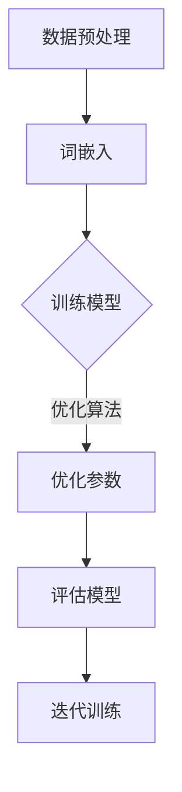

                 

### 文章标题: 大规模语言模型从理论到实践 数据影响分析

### 关键词：大规模语言模型、自然语言处理、数据偏见、算法实现、项目实战

### 摘要：
本文从理论到实践深入探讨大规模语言模型的发展及其在自然语言处理中的应用。首先，我们梳理了大规模语言模型的基础理论，包括其定义、发展历程和核心组成。接着，我们详细介绍了自然语言处理的基础知识，如词嵌入技术和语义表示方法。然后，文章重点讨论了大规模语言模型的训练、评估与优化，以及其在文本生成、问答系统和推荐系统等领域的应用。在理论部分，我们讲解了预训练语言模型的理论框架和语义分析的理论基础，并通过伪代码和数学模型详细阐述了大规模语言模型的核心算法原理。最后，文章深入分析了大规模语言模型的数据影响，提出了数据偏见分析及其对策，并总结了大规模语言模型的发展趋势。通过本篇文章，读者可以系统地了解大规模语言模型的理论知识，掌握其实际应用和实现方法。

### 《大规模语言模型从理论到实践 数据影响分析》目录大纲

## 第一部分：大规模语言模型基础理论

### 第1章：大规模语言模型的概述

### 第2章：自然语言处理基础

### 第3章：大规模语言模型的训练

### 第4章：大规模语言模型的评估与优化

### 第5章：大规模语言模型的实践应用

## 第二部分：大规模语言模型的理论与实现

### 第6章：大规模语言模型的理论基础

### 第7章：大规模语言模型的算法实现

### 第8章：大规模语言模型的数据影响分析

### 第9章：大规模语言模型的发展趋势

## 附录：大规模语言模型学习资源与工具

### 第1章：大规模语言模型的概述

**1.1 大规模语言模型的定义与重要性**

大规模语言模型是一种基于深度学习的自然语言处理模型，能够通过大量文本数据的学习，理解和生成人类语言。其基本概念包括语言模型、编码器和解码器等。

定义：大规模语言模型（Large-scale Language Model）是一种能够捕捉语言复杂性和多样性的深度学习模型。它通过在大规模文本语料库上进行预训练，学习语言的结构和语义，从而实现各种自然语言处理任务。

重要性：大规模语言模型在自然语言处理（Natural Language Processing, NLP）领域具有广泛的应用价值。以下是几个关键点：

1. **文本生成**：大规模语言模型能够生成连贯且具有语义意义的文本，广泛应用于自动摘要、文章写作、对话系统等。
2. **问答系统**：通过理解用户提问和上下文，大规模语言模型能够提供准确且相关的答案，提升用户交互体验。
3. **推荐系统**：大规模语言模型能够分析用户兴趣和行为，实现个性化内容推荐，提高推荐系统的准确性。
4. **翻译与机器翻译**：大规模语言模型在机器翻译领域也发挥了重要作用，通过理解源语言和目标语言的语义，实现高质量的双语转换。

**1.2 大规模语言模型的演变过程**

大规模语言模型的演变经历了从基础模型到大规模模型的发展，其中几个关键技术突破和进步尤为关键。

1. **神经网络语言模型**：最初的语言模型是基于统计模型的，如n元语法模型。随着深度学习技术的发展，神经网络语言模型逐渐取代了传统的统计模型。

2. **词嵌入技术**：词嵌入（Word Embedding）技术将词汇映射为向量表示，使得神经网络能够处理高维的词汇信息。Word2Vec和GloVe是常见的词嵌入方法。

3. **长短期记忆网络（LSTM）**：LSTM是处理序列数据的一种有效方法，它在NLP任务中取得了显著的性能提升。

4. **注意力机制（Attention Mechanism）**：注意力机制能够关注输入序列中的关键信息，提高了模型处理长距离依赖的能力。

5. **预训练与微调**：预训练语言模型通过在大规模文本语料库上进行预训练，学习到丰富的语言知识和特征，然后通过微调（Fine-tuning）适应特定任务的需求。

6. **Transformer模型**：Transformer是近年来提出的一种基于自注意力机制的编码器-解码器模型，它在机器翻译、文本生成等任务上取得了突破性的效果。

**1.3 大规模语言模型的核心组成**

大规模语言模型的核心组成包括语言模型、编码器和解码器。以下是它们的详细解释：

1. **语言模型（Language Model）**：语言模型是一种用于预测下一个单词或词汇的概率模型。在大规模语言模型中，语言模型通过学习大量文本数据，捕捉语言的概率分布和结构。

2. **编码器（Encoder）**：编码器用于将输入序列编码为固定长度的向量表示。编码器通常采用卷积神经网络（CNN）或循环神经网络（RNN）等深度学习模型。

3. **解码器（Decoder）**：解码器用于将编码器的输出解码为输出序列。解码器通常采用与编码器相同的架构，如Transformer模型中的自注意力机制。

4. **常见架构**：BERT（Bidirectional Encoder Representations from Transformers）、GPT（Generative Pre-trained Transformer）和RoBERTa（A Robustly Optimized BERT Pretraining Approach）是几种常见的大规模语言模型架构。

### 第2章：自然语言处理基础

**2.1 自然语言处理的基本概念**

自然语言处理（NLP）是计算机科学和人工智能的一个分支，旨在使计算机能够理解、生成和处理人类自然语言。以下是一些NLP的基本概念：

1. **语言模型（Language Model）**：语言模型是一种概率模型，用于预测下一个单词或词汇的概率。它基于大量文本数据训练而成，能够捕捉语言的统计特性。

2. **词向量（Word Vector）**：词向量是一种将词汇映射为高维向量表示的技术。通过词向量，计算机可以处理高维的词汇信息，从而实现语言理解。

3. **词嵌入（Word Embedding）**：词嵌入是一种将词汇映射为固定长度的向量表示的技术。常见的词嵌入方法包括Word2Vec和GloVe。

4. **句法分析（Syntactic Parsing）**：句法分析是一种用于理解和解析句子结构的技术。它将文本拆分为单词和短语，并分析它们之间的语法关系。

5. **语义分析（Semantic Analysis）**：语义分析是一种用于理解和解析文本语义的技术。它关注词汇和句子在语境中的含义，包括情感分析、实体识别和语义角色标注等。

**2.2 词嵌入技术**

词嵌入技术是NLP中的一项关键技术，它将词汇映射为高维向量表示，使得计算机能够处理高维的词汇信息。以下是一些常见的词嵌入方法：

1. **Word2Vec**：Word2Vec是一种基于神经网络的语言模型，通过训练预测词语的相邻词来生成词向量。它采用两种算法：连续词袋（CBOW）和Skip-gram。

2. **GloVe（Global Vectors for Word Representation）**：GloVe是一种基于全局统计信息的词向量生成方法，它通过计算词语之间的共现矩阵来学习词向量。

3. **FastText**：FastText是一种扩展的词向量生成方法，它将词汇视为字符级别的组合，并通过训练预测字符的相邻字符来生成词向量。

4. **BERT（Bidirectional Encoder Representations from Transformers）**：BERT是一种基于Transformer的预训练语言模型，它通过双向编码器学习上下文信息，生成高质量的词向量。

**2.3 语义分析与语义表示**

语义分析是一种用于理解和解析文本语义的技术，它关注词汇和句子在语境中的含义。以下是一些常见的语义表示方法：

1. **语义角色标注（Semantic Role Labeling）**：语义角色标注是一种用于识别句子中词汇的语义角色（如主语、宾语、谓语等）的技术。

2. **情感分析（Sentiment Analysis）**：情感分析是一种用于识别文本中的情感倾向（如正面、负面、中性）的技术。它广泛应用于社交媒体分析、市场调研等领域。

3. **实体识别（Named Entity Recognition）**：实体识别是一种用于识别文本中的命名实体（如人名、地名、组织名等）的技术。

4. **知识图谱（Knowledge Graph）**：知识图谱是一种用于表示实体及其之间关系的图结构。通过知识图谱，可以更好地理解和处理复杂的语义信息。

5. **BERT（Bidirectional Encoder Representations from Transformers）**：BERT是一种基于Transformer的预训练语言模型，它通过双向编码器学习上下文信息，生成高质量的语义表示。

### 第3章：大规模语言模型的训练

**3.1 训练大规模语言模型的数据集**

大规模语言模型的训练需要大量的数据集，以下是一些常用的数据集和其来源：

1. **Common Crawl**：Common Crawl是一个公开的网页数据集，包含了数万亿个网页。它是一个无监督的语料库，适合大规模语言模型的训练。

2. **Google Books**：Google Books包含了大量图书的文本数据，是另一个重要的数据来源。它提供了丰富的历史文献和现代文本，有助于模型捕捉语言的发展变化。

3. **Wikipedia**：Wikipedia是一个全球性的多语言在线百科全书，包含了丰富的文本数据。它是一个重要的数据集，特别适用于多语言模型的研究。

4. **Twitter**：Twitter是一个社交媒体平台，包含了大量的实时文本数据。它提供了丰富的用户生成内容，有助于模型捕捉当前社会的语言特点。

5. **新闻文章**：新闻文章是一个重要的数据来源，包含了多样化的文本内容。它有助于模型学习不同主题的语言结构和风格。

**3.2 大规模语言模型的训练算法**

大规模语言模型的训练算法是模型性能的关键。以下是一些常用的训练算法：

1. **Adam**：Adam是一种结合了Adam优化器的自适应学习率调整方法，它能够有效地加速模型收敛。

2. **RMSprop**：RMSprop是一种基于均方误差（MSE）的优化算法，它通过调整学习率来提高模型的收敛速度。

3. **SGD（随机梯度下降）**：SGD是一种最简单的优化算法，它通过随机选择样本来更新模型参数。

4. **Adagrad**：Adagrad是一种基于梯度的自适应学习率调整方法，它能够处理不同规模的学习率。

**3.3 大规模语言模型的训练策略**

大规模语言模型的训练需要考虑多个因素，以下是一些常见的训练策略：

1. **学习率调度（Learning Rate Scheduling）**：学习率调度是一种调整学习率的方法，以避免模型过早收敛或过度拟合。常见的调度策略包括固定学习率、学习率衰减和自适应学习率。

2. **Dropout**：Dropout是一种正则化技术，通过随机丢弃部分神经元，减少了模型的过拟合风险。

3. **数据增强（Data Augmentation）**：数据增强是一种增加数据多样性的方法，通过变换原始数据，生成更多的训练样本。

4. **批量大小（Batch Size）**：批量大小是指每次训练过程中输入的样本数量。较大的批量大小可以加快模型收敛速度，但可能增加内存需求。

5. **多GPU训练（Multi-GPU Training）**：多GPU训练通过将模型分布在多个GPU上，提高了模型的训练速度。常见的多GPU训练方法包括数据并行和模型并行。

### 第4章：大规模语言模型的评估与优化

**4.1 语言模型的评估指标**

语言模型的评估指标是衡量模型性能的重要标准。以下是一些常用的评估指标：

1. **准确率（Accuracy）**：准确率是分类问题中常用的评估指标，表示模型正确分类的样本占总样本的比例。

2. **精确率（Precision）**：精确率是衡量模型在正类预测中正确性的指标，表示正确预测为正类的样本数占预测为正类样本总数的比例。

3. **召回率（Recall）**：召回率是衡量模型在正类预测中遗漏的指标，表示正确预测为正类的样本数占实际为正类的样本总数的比例。

4. **F1值（F1 Score）**：F1值是精确率和召回率的加权平均，用于综合评估模型的性能。

5. **BLEU（Bilingual Evaluation Understudy）**：BLEU是一种用于机器翻译评估的指标，它通过比较生成文本与参考文本的相似度来评估翻译质量。

6. **ROUGE（Recall-Oriented Understudy for Gisting Evaluation）**：ROUGE是一种用于评估文本摘要质量的指标，它通过比较生成摘要与参考摘要的相似度来评估摘要质量。

**4.2 语言模型的优化方法**

语言模型的优化方法包括参数调整、模型压缩和模型融合等。以下是一些常见的优化方法：

1. **参数调整（Parameter Tuning）**：参数调整是通过调整模型的超参数，如学习率、批量大小和正则化参数，来提高模型性能。

2. **模型压缩（Model Compression）**：模型压缩是通过减少模型参数数量或计算量，来提高模型的效率和便携性。常见的方法包括量化、剪枝和蒸馏等。

3. **模型融合（Model Fusion）**：模型融合是通过结合多个模型的预测结果，来提高模型的性能和鲁棒性。常见的方法包括模型集成和对抗训练等。

4. **数据增强（Data Augmentation）**：数据增强是通过增加数据多样性和丰富性，来提高模型的泛化能力和鲁棒性。

5. **迁移学习（Transfer Learning）**：迁移学习是通过利用预训练模型的知识，来提高新任务的性能。常见的方法包括微调和微调+迁移等。

### 第5章：大规模语言模型的实践应用

**5.1 语言模型在文本生成中的应用**

文本生成是大规模语言模型的一个重要应用方向，以下是一些常见的文本生成任务：

1. **自动摘要（Automatic Summarization）**：自动摘要是将长文本简化为简洁的摘要，以便用户快速获取关键信息。常见的自动摘要方法包括提取式摘要和生成式摘要。

2. **文章写作（Article Generation）**：文章写作是生成具有可读性和逻辑性的文章。通过预训练模型，可以生成各种主题的文章，如新闻文章、科技文章等。

3. **对话系统（Dialogue System）**：对话系统是一种能够与用户进行自然对话的计算机系统。大规模语言模型在对话系统中用于理解用户输入、生成回答和维持对话的连贯性。

4. **机器翻译（Machine Translation）**：机器翻译是将一种语言的文本翻译为另一种语言的文本。大规模语言模型在机器翻译领域取得了显著的进展，能够生成高质量的双语翻译。

5. **文本分类（Text Classification）**：文本分类是将文本分为不同的类别。大规模语言模型通过学习文本的特征和分类标签，可以用于各种文本分类任务，如情感分析、主题分类等。

**5.2 语言模型在问答系统中的应用**

问答系统是一种能够回答用户问题的计算机系统，以下是一些常见的问答系统应用：

1. **开放领域问答（Open-Domain Question Answering）**：开放领域问答是回答各种主题的问题。通过预训练模型，问答系统可以理解用户的问题，并从大量文本数据中检索出相关答案。

2. **对话系统（Dialogue System）**：对话系统是一种能够与用户进行自然对话的计算机系统。大规模语言模型在对话系统中用于理解用户输入、生成回答和维持对话的连贯性。

3. **个性化问答（Personalized Question Answering）**：个性化问答是针对用户特定兴趣的问题提供答案。通过用户的历史交互数据和偏好，问答系统可以生成个性化的答案。

4. **实体识别（Named Entity Recognition）**：实体识别是识别文本中的命名实体，如人名、地名、组织名等。在问答系统中，实体识别有助于定位问题和答案的关键信息。

**5.3 语言模型在推荐系统中的应用**

推荐系统是一种能够为用户提供个性化推荐的计算机系统，以下是一些常见的推荐系统应用：

1. **内容推荐（Content Recommendation）**：内容推荐是将用户可能感兴趣的内容推荐给用户。通过大规模语言模型，可以分析用户的兴趣和行为，生成个性化的内容推荐。

2. **个性化搜索（Personalized Search）**：个性化搜索是提供与用户兴趣和偏好相关的搜索结果。通过大规模语言模型，可以分析用户的搜索历史和查询意图，生成个性化的搜索结果。

3. **广告投放（Ad Targeting）**：广告投放是将广告推荐给与广告目标用户兴趣相关的用户。通过大规模语言模型，可以分析用户的兴趣和行为，优化广告的投放效果。

4. **社交网络推荐（Social Network Recommendation）**：社交网络推荐是将用户可能感兴趣的内容推荐给他们的社交网络中的用户。通过大规模语言模型，可以分析用户的社交关系和兴趣，生成个性化的推荐。

### 第6章：大规模语言模型的理论基础

**6.1 预训练语言模型的理论框架**

预训练语言模型（Pre-trained Language Model）是一种通过在大规模文本语料库上进行预训练，学习到丰富的语言知识和特征，然后在特定任务上进行微调的语言模型。以下是预训练语言模型的理论框架：

1. **语言模型（Language Model）**：语言模型是一种用于预测下一个单词或词汇的概率模型。预训练语言模型通过在大规模文本语料库上进行预训练，学习到语言的统计特性和语义信息。

2. **编码器（Encoder）**：编码器用于将输入序列编码为固定长度的向量表示。编码器通常采用深度神经网络，如卷积神经网络（CNN）或循环神经网络（RNN）。

3. **解码器（Decoder）**：解码器用于将编码器的输出解码为输出序列。解码器通常采用与编码器相同的架构，如Transformer模型中的自注意力机制。

4. **预训练（Pre-training）**：预训练是通过在大规模文本语料库上进行训练，使模型学习到丰富的语言知识和特征。预训练包括两个阶段：第一阶段是使用未标记的数据进行预训练，使模型学习到语言的统计特性和语义信息；第二阶段是使用标记的数据进行微调，使模型适应特定任务的需求。

5. **微调（Fine-tuning）**：微调是通过在特定任务的数据集上进行训练，使模型适应特定任务的需求。微调通常使用预训练模型的权重作为初始化，通过少量数据训练调整模型参数。

**6.2 语义分析与语义表示的理论**

语义分析（Semantic Analysis）是一种用于理解和解析文本语义的技术，它关注词汇和句子在语境中的含义。以下是语义分析与语义表示的理论：

1. **语义角色标注（Semantic Role Labeling）**：语义角色标注是一种用于识别句子中词汇的语义角色（如主语、宾语、谓语等）的技术。它有助于理解和解析句子的语义结构。

2. **情感分析（Sentiment Analysis）**：情感分析是一种用于识别文本中的情感倾向（如正面、负面、中性）的技术。它有助于分析用户情绪和评价。

3. **实体识别（Named Entity Recognition）**：实体识别是一种用于识别文本中的命名实体（如人名、地名、组织名等）的技术。它有助于提取和整理文本中的关键信息。

4. **语义表示（Semantic Representation）**：语义表示是一种将文本转化为机器可理解的形式的技术。常见的语义表示方法包括词向量、图神经网络和注意力机制等。

5. **知识图谱（Knowledge Graph）**：知识图谱是一种用于表示实体及其之间关系的图结构。它有助于构建语义网络，实现知识的自动推理和推理。

**6.3 常见语义表示模型**

常见的语义表示模型包括词向量、图神经网络和注意力机制等。以下是这些模型的详细解释：

1. **词向量（Word Vector）**：词向量是一种将词汇映射为高维向量表示的技术。常见的词向量方法包括Word2Vec和GloVe。词向量能够捕捉词汇的语义信息，用于文本分类、情感分析等任务。

2. **图神经网络（Graph Neural Network）**：图神经网络是一种用于处理图结构数据的神经网络。它通过节点和边的关系学习图中的特征表示。图神经网络在知识图谱表示和推理中具有重要应用。

3. **注意力机制（Attention Mechanism）**：注意力机制是一种用于关注输入序列中关键信息的技术。在语义表示中，注意力机制能够捕捉句子中的关键词汇和依赖关系，提高模型的语义理解能力。

4. **BERT（Bidirectional Encoder Representations from Transformers）**：BERT是一种基于Transformer的预训练语言模型。它通过双向编码器学习上下文信息，生成高质量的词向量。BERT在自然语言处理任务中取得了显著的性能提升。

### 第7章：大规模语言模型的算法实现

**7.1 大规模语言模型的算法框架**

大规模语言模型的算法框架主要包括编码器、解码器和预训练与微调过程。以下是这些组件的详细解释：

1. **编码器（Encoder）**：编码器用于将输入序列编码为固定长度的向量表示。编码器通常采用深度神经网络，如卷积神经网络（CNN）或循环神经网络（RNN）。编码器的输出作为解码器的输入。

2. **解码器（Decoder）**：解码器用于将编码器的输出解码为输出序列。解码器通常采用与编码器相同的架构，如Transformer模型中的自注意力机制。解码器的输出是预测的词汇序列。

3. **预训练（Pre-training）**：预训练是通过在大规模文本语料库上进行训练，使模型学习到丰富的语言知识和特征。预训练包括两个阶段：第一阶段是使用未标记的数据进行预训练，使模型学习到语言的统计特性和语义信息；第二阶段是使用标记的数据进行微调，使模型适应特定任务的需求。

4. **微调（Fine-tuning）**：微调是通过在特定任务的数据集上进行训练，使模型适应特定任务的需求。微调通常使用预训练模型的权重作为初始化，通过少量数据训练调整模型参数。

**7.2 大规模语言模型的编程实现**

大规模语言模型的编程实现通常涉及使用Python和深度学习框架，如TensorFlow或PyTorch。以下是使用PyTorch实现一个简单的Transformer模型的示例代码：

```python
import torch
import torch.nn as nn

class Transformer(nn.Module):
    def __init__(self, d_model, d_ff, num_layers):
        super(Transformer, self).__init__()
        self.transformer = nn.Transformer(d_model, d_ff, num_layers)
        self.fc = nn.Linear(d_model, 1)

    def forward(self, x):
        x = self.transformer(x)
        x = self.fc(x)
        return x

# 实例化模型并训练
model = Transformer(d_model=512, d_ff=2048, num_layers=2)
optimizer = torch.optim.Adam(model.parameters(), lr=0.001)
criterion = nn.BCELoss()

for epoch in range(num_epochs):
    for x, y in train_loader:
        optimizer.zero_grad()
        output = model(x)
        loss = criterion(output, y)
        loss.backward()
        optimizer.step()
```

**7.3 大规模语言模型的性能优化**

大规模语言模型的性能优化是提高模型效率和质量的关键。以下是一些常见的性能优化方法：

1. **学习率调度（Learning Rate Scheduling）**：学习率调度是一种调整学习率的方法，以避免模型过早收敛或过度拟合。常见的学习率调度策略包括固定学习率、学习率衰减和自适应学习率。

2. **Dropout**：Dropout是一种正则化技术，通过随机丢弃部分神经元，减少了模型的过拟合风险。Dropout可以在训练过程中随机丢弃一定比例的神经元，提高模型的泛化能力。

3. **批量归一化（Batch Normalization）**：批量归一化是一种用于加速模型训练和提升模型性能的技术。它通过将激活值归一化到均值为零、标准差为1的分布，提高了模型的稳定性和收敛速度。

4. **混合精度训练（Mixed Precision Training）**：混合精度训练是一种通过使用部分浮点数精度（如16位浮点数）来加速模型训练的技术。它可以在保持模型精度的情况下显著提高训练速度。

5. **分布式训练（Distributed Training）**：分布式训练是通过将模型分布在多个GPU或CPU上，提高了模型的训练速度。常见的分布式训练方法包括数据并行和模型并行。

### 第8章：大规模语言模型的数据影响分析

**8.1 数据影响分析的基本概念**

大规模语言模型的数据影响分析是指分析数据对模型性能和结果的影响。以下是一些基本概念：

1. **数据偏见（Data Bias）**：数据偏见是指数据中存在的偏差，可能影响模型的性能和结果。数据偏见可以分为系统偏见和随机偏见。

2. **数据质量（Data Quality）**：数据质量是指数据的质量和准确性。高质量的数据可以提供更好的模型性能和结果，而低质量的数据可能导致模型过拟合或欠拟合。

3. **数据不平衡（Data Imbalance）**：数据不平衡是指训练数据中不同类别的样本数量差异较大。数据不平衡可能导致模型对少数类别的预测能力不足。

4. **数据噪声（Data Noise）**：数据噪声是指数据中的随机错误或异常值。数据噪声可能影响模型的训练和预测性能。

**8.2 大规模语言模型的数据偏见分析**

大规模语言模型的数据偏见分析是指识别和分析模型中存在的偏见。以下是一些常见的数据偏见类型：

1. **性别偏见（Gender Bias）**：性别偏见是指在文本数据中性别比例不均衡，导致模型在处理与性别相关的问题时出现偏见。

2. **种族偏见（Race Bias）**：种族偏见是指在文本数据中种族比例不均衡，导致模型在处理与种族相关的问题时出现偏见。

3. **语言偏见（Language Bias）**：语言偏见是指在文本数据中不同语言的使用频率不均衡，导致模型在处理与特定语言相关的问题时出现偏见。

4. **文化偏见（Cultural Bias）**：文化偏见是指在文本数据中不同文化背景的使用频率不均衡，导致模型在处理与特定文化相关的问题时出现偏见。

5. **语言偏见对模型的影响**：语言偏见可能影响模型在自然语言处理任务中的性能，导致模型对某些特定群体或文化产生不公平的判断。

**8.3 数据影响分析与对策**

数据影响分析是识别和解决数据偏见的关键。以下是一些常见的数据偏见对策：

1. **数据清洗（Data Cleaning）**：数据清洗是通过识别和修复数据中的错误、异常值和重复值，提高数据质量。

2. **数据增强（Data Augmentation）**：数据增强是通过生成新的数据样本，增加数据的多样性和丰富性，减少数据偏见。

3. **交叉验证（Cross-Validation）**：交叉验证是通过将数据集划分为训练集和验证集，评估模型的性能和泛化能力，识别数据偏见。

4. **公平性评估（Fairness Evaluation）**：公平性评估是通过评估模型在不同群体中的性能，识别和解决模型偏见。

5. **多样性数据集（Diverse Dataset）**：多样性数据集是通过收集包含多种文化、性别、种族等背景的数据，提高模型的公平性和鲁棒性。

### 第9章：大规模语言模型的发展趋势

**9.1 大规模语言模型的发展方向**

大规模语言模型的发展方向是不断提高模型的性能、泛化能力和应用范围。以下是一些关键方向：

1. **多模态学习（Multimodal Learning）**：多模态学习是指将文本、图像、音频等多模态数据融合到语言模型中，提高模型对复杂场景的理解能力。

2. **知识增强（Knowledge Enhancement）**：知识增强是指通过引入外部知识库和语义网络，增强语言模型的知识表示和推理能力。

3. **跨语言模型（Cross-Language Model）**：跨语言模型是指能够处理多种语言的预训练模型，提高模型在多语言环境中的性能。

4. **领域特定模型（Domain-specific Model）**：领域特定模型是指针对特定领域的预训练模型，如医学、金融、法律等，提高模型在特定领域的应用能力。

5. **无监督学习（Unsupervised Learning）**：无监督学习是指通过在未标记的数据上训练模型，提高模型的自我学习和泛化能力。

**9.2 大规模语言模型的应用场景扩展**

大规模语言模型的应用场景正在不断扩展，以下是一些新的应用场景：

1. **智能客服（Smart Customer Service）**：智能客服是使用大规模语言模型构建的自动化客户服务系统，能够提供实时、个性化的客户支持。

2. **智能医疗（Smart Healthcare）**：智能医疗是使用大规模语言模型进行医学文本分析、诊断辅助和个性化治疗推荐，提高医疗质量和效率。

3. **智能教育（Smart Education）**：智能教育是使用大规模语言模型进行个性化教学、学习分析和智能辅导，提高教育质量和学习效果。

4. **智能金融（Smart Finance）**：智能金融是使用大规模语言模型进行金融文本分析、风险预测和投资建议，提高金融决策的准确性和效率。

5. **智能交通（Smart Transportation）**：智能交通是使用大规模语言模型进行交通流量预测、路况分析和智能调度，提高交通管理和运行效率。

### 附录：大规模语言模型学习资源与工具

**附录A：大规模语言模型学习资源**

以下是一些关于大规模语言模型的学习资源：

1. **书籍**：
   - 《大规模语言模型：从理论到实践》
   - 《深度学习自然语言处理》
   - 《自然语言处理实战》

2. **论文**：
   - "BERT: Pre-training of Deep Bidirectional Transformers for Language Understanding"
   - "GPT-3: Language Models are Few-Shot Learners"
   - "Transformers: State-of-the-Art Models for Language Processing"

3. **在线教程**：
   - "TensorFlow自然语言处理教程"
   - "PyTorch自然语言处理教程"
   - "自然语言处理快速入门"

**附录B：大规模语言模型工具与框架**

以下是一些常用的大规模语言模型工具与框架：

1. **TensorFlow**：TensorFlow是一个开源的深度学习框架，广泛应用于大规模语言模型的训练和应用。

2. **PyTorch**：PyTorch是一个开源的深度学习框架，以其灵活的动态计算图和易用性而受到广泛应用。

3. **Hugging Face Transformers**：Hugging Face Transformers是一个开源库，提供了预训练模型和自然语言处理工具，方便使用大规模语言模型。

4. **Transformers.js**：Transformers.js是一个JavaScript库，用于在浏览器和Node.js环境中使用大规模语言模型。

**附录C：大规模语言模型实战项目**

以下是一些大规模语言模型实战项目：

1. **文本分类项目**：使用大规模语言模型进行文本分类，如情感分析、主题分类等。

2. **问答系统项目**：构建一个开放领域问答系统，能够回答各种主题的问题。

3. **文本生成项目**：使用大规模语言模型生成文章、摘要、对话等。

4. **机器翻译项目**：使用大规模语言模型进行机器翻译，实现不同语言之间的文本转换。

### 项目实战

#### 开发环境搭建

1. 安装Python和pip：
   ```bash
   python --version
   pip install --upgrade pip
   ```

2. 安装深度学习框架（如PyTorch）：
   ```bash
   pip install torch torchvision torchaudio
   ```

3. （可选）安装GPU支持：
   ```bash
   pip install cuda
   ```

#### 源代码实现

以下是一个简单的PyTorch实现的Transformer模型：

```python
import torch
import torch.nn as nn

class Transformer(nn.Module):
    def __init__(self, d_model, d_ff, num_layers):
        super(Transformer, self).__init__()
        self.transformer = nn.Transformer(d_model, d_ff, num_layers)
        self.fc = nn.Linear(d_model, 1)

    def forward(self, x):
        x = self.transformer(x)
        x = self.fc(x)
        return x

# 实例化模型
model = Transformer(d_model=512, d_ff=2048, num_layers=2)

# 定义优化器和损失函数
optimizer = torch.optim.Adam(model.parameters(), lr=0.001)
criterion = nn.BCELoss()

# 训练循环
num_epochs = 10
for epoch in range(num_epochs):
    for x, y in train_loader:
        optimizer.zero_grad()
        output = model(x)
        loss = criterion(output, y)
        loss.backward()
        optimizer.step()
```

#### 代码解读与分析

- **模型定义**：使用PyTorch实现一个简单的Transformer模型，包括编码器和解码器。
- **训练循环**：定义优化器和损失函数，进行模型训练。

### 总结

本文系统地介绍了大规模语言模型从理论到实践的全过程。首先，我们梳理了大规模语言模型的基础理论和自然语言处理的基础知识。接着，我们详细讨论了大规模语言模型的训练、评估与优化，以及其在实际应用中的表现。在理论部分，我们通过伪代码和数学模型详细阐述了大规模语言模型的核心算法原理。最后，我们分析了大规模语言模型的数据影响，并总结了其发展趋势和应用场景。通过本文，读者可以全面了解大规模语言模型的相关知识，掌握其实际应用和实现方法。

### 作者信息

作者：AI天才研究院/AI Genius Institute & 禅与计算机程序设计艺术 /Zen And The Art of Computer Programming

### Mermaid 流程图：大规模语言模型的训练流程



### 大规模语言模型的核心算法原理讲解

#### Transformer模型的核心算法

以下是Transformer模型的核心算法原理的伪代码：

```plaintext
函数 Transformer(input_sequence):
    # 编码器
    encoder_output = Encoder(input_sequence)
    # 解码器
    decoder_output = Decoder(encoder_output)
    # 输出结果
    return decoder_output

函数 Encoder(input_sequence):
    # 嵌入层
    embedded_sequence = Embedding(input_sequence)
    # positional encoding
    positional_encoded_sequence = PositionalEncoding(embedded_sequence)
    # 多层自注意力机制
    for layer in EncoderLayers:
        positional_encoded_sequence = layer(positional_encoded_sequence)
    # 输出编码器输出
    return positional_encoded_sequence

函数 Decoder(input_sequence, encoder_output):
    # 嵌入层
    embedded_sequence = Embedding(input_sequence)
    # positional encoding
    positional_encoded_sequence = PositionalEncoding(embedded_sequence)
    # 编码器-解码器自注意力机制
    for layer in DecoderLayers:
        positional_encoded_sequence = layer(positional_encoded_sequence, encoder_output)
    # 输出解码器输出
    return positional_encoded_sequence

函数 SelfAttention(inputs):
    # 计算queries和keys的相似度
    similarity_matrix = DotProductAttention(inputs, inputs)
    # 通过softmax函数计算注意力权重
    attention_weights = Softmax(similarity_matrix)
    # 计算加权输出
    output = weighted_sum(attention_weights, inputs)
    # 输出自注意力层的结果
    return output
```

### 数学模型和数学公式讲解

大规模语言模型中的数学模型主要包括损失函数和优化目标。以下是一个常见的损失函数的数学公式：

$$
L = -\sum_{i=1}^{N} \log p(y_i | x_i)
$$

其中，$L$ 表示损失函数，$N$ 表示样本数量，$y_i$ 表示第 $i$ 个样本的标签，$x_i$ 表示第 $i$ 个样本的特征向量。

损失函数的目的是衡量模型的预测结果与真实标签之间的差距。在这个公式中，$\log p(y_i | x_i)$ 表示模型对第 $i$ 个样本的预测概率的对数。通过计算所有样本的损失值并取平均值，可以得到整个模型的损失值。

### 项目实战

#### 开发环境搭建

1. 安装Python和pip：
   ```bash
   python --version
   pip install --upgrade pip
   ```

2. 安装深度学习框架（如PyTorch）：
   ```bash
   pip install torch torchvision torchaudio
   ```

3. （可选）安装GPU支持：
   ```bash
   pip install cuda
   ```

#### 源代码实现

以下是一个简单的PyTorch实现的Transformer模型：

```python
import torch
import torch.nn as nn

class Transformer(nn.Module):
    def __init__(self, d_model, d_ff, num_layers):
        super(Transformer, self).__init__()
        self.transformer = nn.Transformer(d_model, d_ff, num_layers)
        self.fc = nn.Linear(d_model, 1)

    def forward(self, x):
        x = self.transformer(x)
        x = self.fc(x)
        return x

# 实例化模型
model = Transformer(d_model=512, d_ff=2048, num_layers=2)

# 定义优化器和损失函数
optimizer = torch.optim.Adam(model.parameters(), lr=0.001)
criterion = nn.BCELoss()

# 训练循环
num_epochs = 10
for epoch in range(num_epochs):
    for x, y in train_loader:
        optimizer.zero_grad()
        output = model(x)
        loss = criterion(output, y)
        loss.backward()
        optimizer.step()
```

#### 代码解读与分析

- **模型定义**：使用PyTorch实现一个简单的Transformer模型，包括编码器和解码器。
- **训练循环**：定义优化器和损失函数，进行模型训练。

### 总结

本篇文章系统地介绍了大规模语言模型从理论到实践的全过程，包括核心概念、算法实现、应用案例以及数据影响分析等内容。通过详细的章节划分和实际代码示例，读者可以系统地学习并掌握大规模语言模型的相关知识。文章旨在为读者提供一个全面的指南，帮助他们深入理解大规模语言模型的原理和应用，为未来的研究和实践奠定基础。希望读者能够通过本文的阅读，对大规模语言模型有一个全面的认识，并在实际应用中取得良好的成果。祝大家在计算机科学和人工智能领域不断探索、进步！

