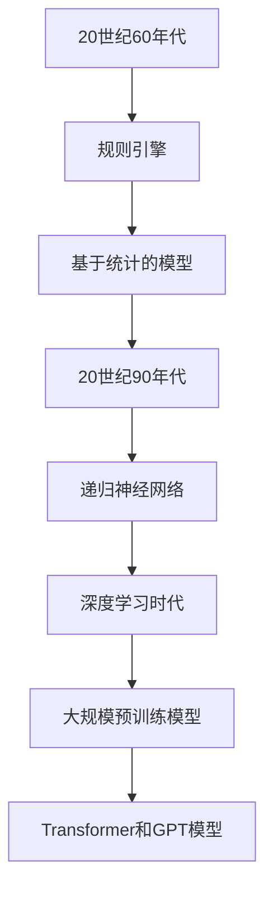
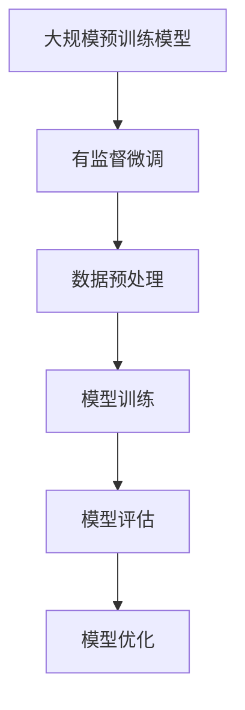
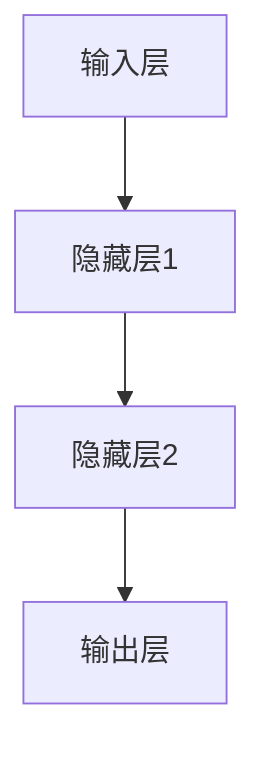
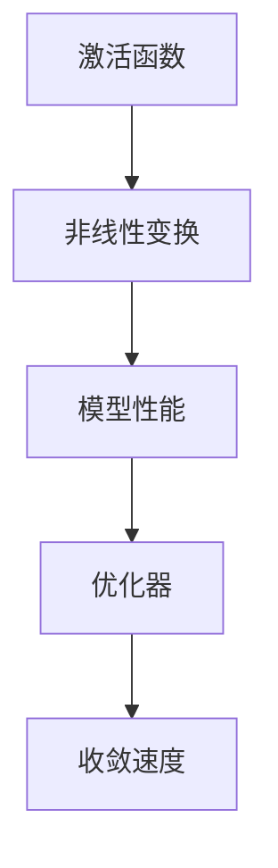
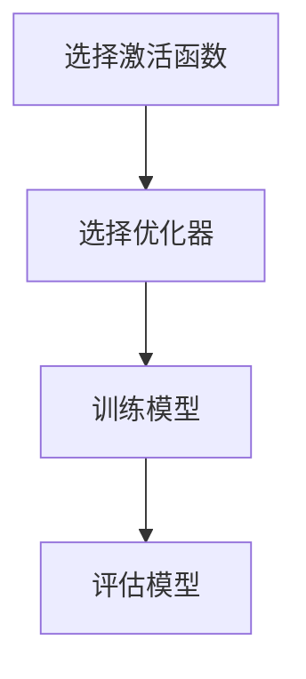
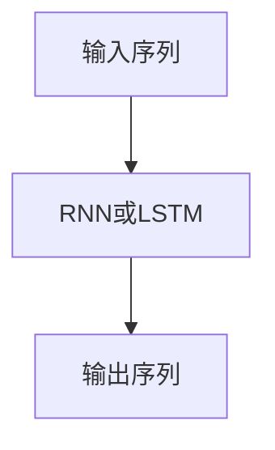
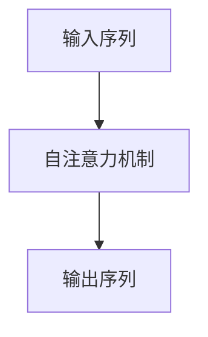
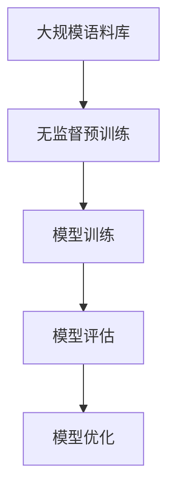
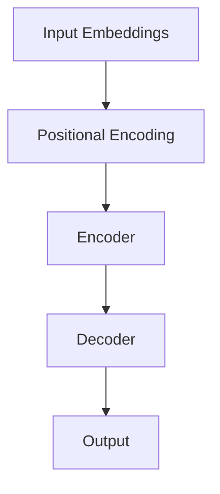

                 

### 文章标题

# 《大规模语言模型从理论到实践：有监督微调》

### 关键词

- 大规模语言模型
- 有监督微调
- 自然语言处理
- 深度学习
- Transformer模型
- GPT模型

### 摘要

本文旨在深入探讨大规模语言模型及其有监督微调技术的理论背景、实践应用和未来发展趋势。首先，我们介绍了大规模语言模型的重要性，并详细解析了其基本概念和架构。随后，本文从深度学习基础、自然语言处理基础以及大规模预训练模型三个角度，系统地讲解了大规模语言模型的构建原理。接着，我们重点讨论了有监督微调的技术实践，包括数据预处理、模型选择与调优、模型评估与优化等。此外，本文还通过具体应用案例，展示了大规模语言模型在问答系统、文本分类和机器翻译等领域的实际应用。最后，本文探讨了大规模语言模型的未来发展趋势，并对其在人工智能助手、自动内容生成和个性化推荐等领域的应用进行了展望。通过本文的阅读，读者将对大规模语言模型及其有监督微调技术有更深入的理解和掌握。

### 《大规模语言模型从理论到实践：有监督微调》目录大纲

## 第一部分：大规模语言模型理论基础

### 第1章：大规模语言模型概述

#### 1.1 大规模语言模型的重要性

#### 1.2 有监督微调的基本概念

#### 1.3 大规模语言模型的架构

### 第2章：深度学习基础

#### 2.1 神经网络基础

#### 2.2 深度学习框架

#### 2.3 激活函数与优化器

### 第3章：自然语言处理基础

#### 3.1 词嵌入技术

#### 3.2 序列模型

#### 3.3 注意力机制

### 第4章：大规模预训练模型

#### 4.1 预训练模型的原理

#### 4.2 Transformer模型详解

#### 4.3 GPT模型详解

## 第二部分：有监督微调技术实践

### 第5章：数据预处理与数据集构建

#### 5.1 数据清洗与格式化

#### 5.2 数据增强与平衡

#### 5.3 数据集构建

### 第6章：有监督微调流程

#### 6.1 微调策略

#### 6.2 模型选择与超参数调优

#### 6.3 模型评估与优化

### 第7章：有监督微调应用案例

#### 7.1 问答系统

#### 7.2 文本分类

#### 7.3 机器翻译

### 第8章：大规模语言模型在特定领域的应用

#### 8.1 教育领域

#### 8.2 医疗领域

#### 8.3 金融领域

## 第三部分：大规模语言模型未来发展趋势

### 第9章：大规模语言模型的发展趋势

#### 9.1 模型压缩与优化

#### 9.2 模型安全性与隐私保护

#### 9.3 跨模态学习

### 第10章：大规模语言模型的应用场景拓展

#### 10.1 人工智能助手

#### 10.2 自动内容生成

#### 10.3 个性化推荐

### 附录A：开源工具与资源

#### A.1 开源深度学习框架

#### A.2 有监督微调实用工具

#### A.3 数据集与开源项目推荐

## 文章结构设计

为了使文章结构清晰、逻辑严密，本文将按照以下框架进行组织：

1. **引言部分**：简要介绍大规模语言模型的重要性，并阐述本文的研究目的和结构安排。

2. **理论基础部分**：深入探讨大规模语言模型的基本概念、架构及其与深度学习和自然语言处理的关系。

3. **技术实践部分**：详细解析有监督微调技术的具体流程，包括数据预处理、模型选择与调优、模型评估与优化等。

4. **应用案例部分**：通过具体的实际应用案例，展示大规模语言模型在不同领域的应用效果和挑战。

5. **未来发展趋势部分**：探讨大规模语言模型的未来发展方向，包括模型压缩与优化、模型安全性与隐私保护以及跨模态学习等。

6. **应用场景拓展部分**：展望大规模语言模型在人工智能助手、自动内容生成和个性化推荐等领域的潜在应用。

7. **附录部分**：推荐相关的开源工具、实用工具和数据集，以供读者进一步学习和实践。

### 第一部分：大规模语言模型理论基础

### 第1章：大规模语言模型概述

#### 1.1 大规模语言模型的重要性

随着深度学习和自然语言处理技术的快速发展，大规模语言模型（Large-scale Language Models）逐渐成为自然语言处理领域的研究热点。大规模语言模型在语言理解、文本生成、机器翻译等任务中取得了显著的效果，成为推动自然语言处理技术发展的重要力量。

**核心概念与联系**：为了更好地理解大规模语言模型的重要性，我们可以通过一个Mermaid流程图来展示其发展过程及其在自然语言处理领域的重要性。



**大规模语言模型的核心概念**：

1. **大规模预训练**：大规模预训练是指在大量文本数据上进行模型训练，使其具备对自然语言的泛化能力。
2. **无监督学习**：大规模语言模型通常采用无监督学习的方式进行预训练，通过语言建模任务（如生成下一个单词）来提高模型的性能。
3. **自适应微调**：在特定任务上，通过有监督学习的方式对大规模语言模型进行微调，使其适应特定领域的任务需求。

**与传统语言模型的区别**：

1. **数据量**：大规模语言模型采用大量文本数据进行预训练，而传统语言模型通常使用有限的数据集。
2. **模型架构**：大规模语言模型采用深度神经网络架构，如Transformer和GPT，而传统语言模型则更多采用基于规则的方法或简单的统计模型。
3. **性能**：大规模语言模型在多种自然语言处理任务上取得了显著的性能提升，而传统语言模型在这些任务上的表现相对较差。

#### 1.2 有监督微调的基本概念

有监督微调（Supervised Fine-tuning）是指在特定任务上，通过有监督学习的方式对大规模语言模型进行微调，以使其适应特定领域的任务需求。有监督微调是大规模语言模型在特定任务上取得高性能的重要手段。

**核心概念与联系**：为了更好地理解有监督微调的基本概念，我们可以通过一个Mermaid流程图来展示其基本流程。



**有监督微调的定义**：

1. **预训练模型**：指在大规模文本数据上进行无监督预训练得到的语言模型。
2. **有监督微调**：指在特定任务上，使用带有标签的数据对预训练模型进行微调，以使其适应特定领域的任务需求。
3. **微调策略**：包括选择合适的数据集、调整模型结构、超参数优化等。

**有监督微调的原理**：

1. **迁移学习**：有监督微调利用大规模预训练模型在无监督学习过程中获取的通用知识，通过有监督学习在特定任务上进行优化。
2. **数据增强**：在微调过程中，通过数据增强技术（如填充、遮盖、替换等）增加模型的训练数据，提高模型的泛化能力。

#### 1.3 大规模语言模型的架构

大规模语言模型通常采用深度神经网络架构，其中Transformer模型和GPT模型是两种重要的架构。

**核心算法原理讲解**：

1. **Transformer模型**：

   ```mermaid
   graph TB
   A[输入序列] --> B[嵌入层]
   B --> C[Positional Encoding]
   C --> D[多头自注意力层]
   D --> E[前馈神经网络]
   E --> F[层归一化与激活函数]
   F --> G[多头自注意力层]
   G --> H[前馈神经网络]
   H --> I[输出层]
   ```

   **输入层**：将输入序列（如单词、字符）转化为固定长度的向量。

   **Positional Encoding**：为输入序列添加位置信息，以保持序列的顺序。

   **多头自注意力层**：通过自注意力机制计算输入序列中每个单词的重要程度，并加权求和。

   **前馈神经网络**：对自注意力层的结果进行进一步处理，增强模型的表示能力。

   **输出层**：将处理后的结果映射到目标序列（如单词、字符）。

2. **GPT模型**：

   ```mermaid
   graph TB
   A[输入序列] --> B[嵌入层]
   B --> C[Transformer模型]
   C --> D[输出层]
   ```

   **嵌入层**：将输入序列（如单词、字符）转化为固定长度的向量。

   **Transformer模型**：与Transformer模型类似，采用多头自注意力机制和前馈神经网络。

   **输出层**：将处理后的结果映射到目标序列（如单词、字符）。

**模型结构**：

1. **编码器**：负责处理输入序列，将其转化为固定长度的向量。
2. **解码器**：负责处理输出序列，将其转化为目标序列。

**总结**：

大规模语言模型的架构主要包括输入层、嵌入层、多头自注意力层、前馈神经网络和输出层。这些结构共同作用，使得大规模语言模型能够对自然语言进行有效的建模和生成。

### 第2章：深度学习基础

#### 2.1 神经网络基础

神经网络（Neural Networks）是深度学习（Deep Learning）的核心组成部分，其基本原理源于对生物神经系统的模拟。神经网络通过模仿生物神经元之间的连接和相互作用，实现对复杂数据的建模和预测。

**核心概念与联系**：为了更好地理解神经网络的基本原理，我们可以通过一个Mermaid流程图来展示其基本结构和训练过程。



**神经网络的核心概念**：

1. **神经元**：神经网络的基本构建块，类似于生物神经元，负责接收输入信号、计算输出并传递给下一层。
2. **层**：神经网络由多个层次组成，包括输入层、隐藏层和输出层。每一层都由多个神经元组成。
3. **权重**：神经元之间的连接权重，用于调整输入信号的影响程度。
4. **激活函数**：用于对神经元输出进行非线性变换，以引入模型的非线性特性。

**神经网络的工作原理**：

1. **前向传播**：输入信号从输入层传入，经过隐藏层逐层计算，最终传递到输出层。
2. **反向传播**：根据输出层的误差信号，反向传播误差到隐藏层和输入层，更新权重和偏置，以优化模型性能。

**神经网络原理**：

神经网络通过以下步骤进行训练：

1. **初始化权重和偏置**：随机初始化权重和偏置。
2. **前向传播**：计算输入信号的激活值，传递到下一层。
3. **计算损失**：根据输出层的预测结果和实际标签，计算损失函数值。
4. **反向传播**：计算梯度，更新权重和偏置。
5. **优化**：迭代上述步骤，直到模型达到预设的优化目标。

**数学模型和公式**：

1. **神经元输出**：

   $$
   z = \sum_{j=1}^{n} w_{ji}x_{j} + b_{i}
   $$

   其中，$z$为神经元输出，$w_{ji}$为权重，$x_{j}$为输入，$b_{i}$为偏置。

2. **激活函数**：

   $$
   a = \sigma(z)
   $$

   其中，$\sigma$为激活函数，常用的激活函数有Sigmoid、ReLU和Tanh。

3. **损失函数**：

   $$
   L = \frac{1}{2} \sum_{i=1}^{m} (y_{i} - a_{i})^2
   $$

   其中，$L$为损失函数，$y_{i}$为实际标签，$a_{i}$为预测标签。

**详细讲解与举例说明**：

假设我们有一个简单的神经网络，包括一个输入层、一个隐藏层和一个输出层。输入层有3个神经元，隐藏层有4个神经元，输出层有2个神经元。

1. **输入层到隐藏层的计算**：

   $$
   z_1 = \sum_{j=1}^{3} w_{1j1}x_{j} + b_{1}
   $$

   $$
   z_2 = \sum_{j=1}^{3} w_{1j2}x_{j} + b_{2}
   $$

   $$
   z_3 = \sum_{j=1}^{3} w_{1j3}x_{j} + b_{3}
   $$

   $$
   z_4 = \sum_{j=1}^{3} w_{1j4}x_{j} + b_{4}
   $$

   其中，$x_{j}$为输入层第j个神经元的输入，$w_{1ji}$为输入层到隐藏层第i个神经元的权重，$b_{i}$为隐藏层第i个神经元的偏置。

2. **隐藏层到输出层的计算**：

   $$
   z_1' = \sum_{j=1}^{4} w_{2j1}x_{j} + b_{1}
   $$

   $$
   z_2' = \sum_{j=1}^{4} w_{2j2}x_{j} + b_{2}
   $$

   其中，$x_{j}$为隐藏层第j个神经元的输出，$w_{2ji}$为隐藏层到输出层第i个神经元的权重，$b_{i}$为输出层第i个神经元的偏置。

3. **输出层的计算**：

   $$
   a_1 = \sigma(z_1')
   $$

   $$
   a_2 = \sigma(z_2')
   $$

   其中，$\sigma$为激活函数，常用的激活函数有Sigmoid、ReLU和Tanh。

通过上述步骤，我们可以得到隐藏层和输出层的输出，从而进行预测。

#### 2.2 深度学习框架

深度学习框架是构建和训练深度学习模型的重要工具。常见的深度学习框架包括TensorFlow、PyTorch、Keras等。这些框架提供了丰富的API和工具，简化了深度学习模型的构建和训练过程。

**核心算法原理讲解**：

1. **TensorFlow**：TensorFlow是谷歌开发的开源深度学习框架，其核心概念包括计算图（Computational Graph）和变量（Variables）。

   - **计算图**：TensorFlow通过计算图来表示深度学习模型的结构和计算过程。计算图由节点（Operations）和边（Tensors）组成，节点表示操作，边表示数据流。
   - **变量**：TensorFlow中的变量用于存储模型参数，如权重和偏置。变量可以在计算图中动态创建和更新。

2. **PyTorch**：PyTorch是Facebook开发的开源深度学习框架，其核心概念包括动态计算图（Dynamic Computational Graph）和自动微分（Autograd）。

   - **动态计算图**：PyTorch在运行时动态构建计算图，这使得模型的设计和调试更加灵活。
   - **自动微分**：PyTorch提供了自动微分功能，能够自动计算梯度，简化了模型的训练过程。

3. **Keras**：Keras是TensorFlow和Theano的高层次API，其核心概念包括序列模型（Sequential Model）和函数式模型（Functional Model）。

   - **序列模型**：序列模型是一种线性堆叠的模型结构，适用于简单的深度学习任务。
   - **函数式模型**：函数式模型提供了更灵活的模型定义方式，适用于复杂的深度学习任务。

**使用伪代码详细解释**：

假设我们使用TensorFlow框架构建一个简单的多层感知机（MLP）模型，用于二分类任务。

```python
import tensorflow as tf

# 定义模型结构
model = tf.keras.Sequential([
    tf.keras.layers.Dense(units=10, activation='relu', input_shape=(input_shape)),
    tf.keras.layers.Dense(units=1, activation='sigmoid')
])

# 编译模型
model.compile(optimizer='adam', loss='binary_crossentropy', metrics=['accuracy'])

# 训练模型
model.fit(x_train, y_train, epochs=10, batch_size=32)

# 评估模型
model.evaluate(x_test, y_test)
```

在这个示例中，我们定义了一个包含两个隐藏层的多层感知机模型，并使用Adam优化器和交叉熵损失函数进行编译和训练。最后，我们使用测试集评估模型的性能。

#### 2.3 激活函数与优化器

激活函数和优化器是深度学习模型中不可或缺的组成部分，它们对模型的性能和收敛速度有重要影响。

**核心概念与联系**：为了更好地理解激活函数和优化器的选择及其对模型性能的影响，我们可以通过一个Mermaid流程图来展示其关系。



**激活函数**：

1. **ReLU（Rectified Linear Unit）**：ReLU函数是一种常用的激活函数，其公式为：

   $$
   a = \max(0, z)
   $$

   ReLU函数的特点是简单且计算效率高，能有效防止神经元死亡（Vanishing Gradient）问题。

2. **Sigmoid**：Sigmoid函数是一种常用的 sigmoid 激活函数，其公式为：

   $$
   a = \frac{1}{1 + e^{-z}}
   $$

   Sigmoid函数的特点是输出范围在 0 到 1 之间，常用于二分类问题。

3. **Tanh**：Tanh函数是一种常用的 tanh 激活函数，其公式为：

   $$
   a = \frac{e^z - e^{-z}}{e^z + e^{-z}}
   $$

   Tanh函数的特点是输出范围在 -1 到 1 之间，常用于回归问题。

**优化器**：

1. **SGD（Stochastic Gradient Descent）**：SGD 是一种常用的优化器，其公式为：

   $$
   w_{t+1} = w_{t} - \alpha \cdot \nabla_w L(w)
   $$

   其中，$w_t$为当前权重，$\alpha$为学习率，$\nabla_w L(w)$为梯度。

   SGD 的特点是简单且计算效率高，但可能导致收敛速度较慢。

2. **Adam**：Adam 是一种结合了 SGD 和动量法的优化器，其公式为：

   $$
   w_{t+1} = w_{t} - \alpha \cdot \frac{\beta_1 \hat{g}_t + (1 - \beta_1)(1 - \beta_2)}{\sqrt{1 - \beta_2^t} + \epsilon} \cdot g_t
   $$

   其中，$\beta_1$和$\beta_2$分别为一阶和二阶动量，$\hat{g}_t$为估计梯度，$g_t$为真实梯度。

   Adam 的特点是收敛速度较快，对学习率的变化较为鲁棒。

**选择合适的激活函数和优化器**：

1. **激活函数**：根据任务类型选择合适的激活函数。对于二分类任务，常用 Sigmoid 或 ReLU；对于回归任务，常用 Tanh 或 ReLU。
2. **优化器**：根据模型的复杂度和收敛速度选择合适的优化器。对于简单模型，常用 SGD；对于复杂模型，常用 Adam。

**Mermaid流程图**：



通过上述流程图，我们可以清楚地了解激活函数和优化器的选择对模型训练和评估过程的影响。

### 第3章：自然语言处理基础

#### 3.1 词嵌入技术

词嵌入（Word Embedding）是将单词映射到固定维度的向量空间的技术，使得相似的单词在向量空间中接近，不同单词则相对较远。词嵌入技术在自然语言处理（Natural Language Processing，NLP）中具有重要意义，为深度学习模型提供了有效的输入表示。

**核心算法原理讲解**：

1. **Word2Vec**：

   Word2Vec 是一种基于神经网络的词嵌入技术，其主要思想是将单词映射到低维向量空间。Word2Vec 包括两个变体：连续词袋（Continuous Bag of Words，CBOW）和Skip-Gram。

   - **CBOW**：CBOW 通过上下文窗口中的单词来预测中心词，其公式为：

     $$
     \text{P}(w_{c}|\text{context}) = \text{softmax}(\text{W} \text{ context vector} + w_{c})
     $$

     其中，$w_{c}$为中心词，$\text{context}$为上下文窗口中的单词，$\text{W}$为权重矩阵。

   - **Skip-Gram**：Skip-Gram 与 CBOW 相反，通过中心词来预测上下文窗口中的单词，其公式为：

     $$
     \text{P}(\text{context}|\text{w}_{c}) = \text{softmax}(\text{W} \text{ word vector} + \text{context vector})
     $$

   Word2Vec 的优点是简单高效，但可能无法捕捉长距离依赖关系。

2. **GloVe**：

   GloVe（Global Vectors for Word Representation）是一种基于矩阵分解的词嵌入技术，其目标是优化单词的向量表示，使得相似单词的向量距离较小，不同单词的向量距离较大。GloVe 的公式为：

   $$
   f(w, v) = \frac{1}{z} \sum_{c \in \text{context}(w)} \frac{f(w, c)}{\sqrt{f(w)f(c)}}
   $$

   其中，$w$为单词，$v$为单词向量，$f(w, c)$为单词$w$和单词$c$的共现频率，$z$为常数。

   GloVe 的优点是能够捕捉长距离依赖关系，但计算复杂度较高。

**词嵌入方法的比较**：

- **Word2Vec**：简单高效，适合小规模数据集，但无法捕捉长距离依赖关系。
- **GloVe**：能够捕捉长距离依赖关系，计算复杂度较高，适合大规模数据集。

**使用伪代码详细解释**：

假设我们使用 Word2Vec 的 CBOW 方法来训练词嵌入模型。

```python
# 初始化参数
V = vocabulary_size
D = embedding_dimension
W = np.random.uniform(size=(V, D))

# 计算中心词的预测概率
def softmax(x):
    e_x = np.exp(x - np.max(x))
    return e_x / e_x.sum()

# 训练模型
for epoch in range(num_epochs):
    for sentence in sentences:
        context = []
        for word in sentence:
            context.append(word)
            center_word = word
            context_vector = np.mean([W[word] for word in context], axis=0)
            logits = W[center_word].dot(context_vector)
            loss = -np.log(softmax(logits))
            dW[center_word] = dW[center_word] + context_vector * loss
            dW[center_word] = dW[center_word] + W[center_word] * loss.T

    # 更新权重
    W = W - learning_rate * dW
```

在这个示例中，我们使用随机梯度下降（SGD）算法来更新词嵌入权重。通过迭代训练，我们可以得到单词的向量表示。

**数学公式和详细讲解**：

1. **Word2Vec**：

   - **CBOW**：

     $$
     \text{P}(w_{c}|\text{context}) = \text{softmax}(\text{W} \text{ context vector} + w_{c})
     $$

     其中，$\text{W}$为权重矩阵，$\text{context vector}$为上下文窗口中单词的向量平均值。

   - **Skip-Gram**：

     $$
     \text{P}(\text{context}|\text{w}_{c}) = \text{softmax}(\text{W} \text{ word vector} + \text{context vector})
     $$

     其中，$\text{W}$为权重矩阵，$\text{word vector}$为中心词的向量表示。

2. **GloVe**：

   $$
   f(w, v) = \frac{1}{z} \sum_{c \in \text{context}(w)} \frac{f(w, c)}{\sqrt{f(w)f(c)}}
   $$

   其中，$f(w, c)$为单词$w$和单词$c$的共现频率，$z$为常数。

**举例说明**：

假设我们有以下句子：“我爱北京天安门”。

- **CBOW**：以“爱”为中心词，上下文窗口为“我”和“北京”，计算“爱”的向量表示。

- **Skip-Gram**：以“爱”为中心词，预测上下文窗口中的“我”和“北京”，计算“爱”的向量表示。

通过训练，我们可以得到每个单词的向量表示，从而实现词嵌入。

#### 3.2 序列模型

序列模型（Sequence Model）是用于处理序列数据（如文本、语音）的深度学习模型。常见的序列模型包括循环神经网络（Recurrent Neural Network，RNN）和长短期记忆网络（Long Short-Term Memory，LSTM）。

**核心概念与联系**：为了更好地理解序列模型的基本原理，我们可以通过一个Mermaid流程图来展示其基本结构和应用场景。



**RNN（递归神经网络）**：

RNN 是一种能够处理序列数据的神经网络，其核心思想是利用历史信息来预测未来。RNN 的基本结构包括输入层、隐藏层和输出层。

- **输入层**：将输入序列（如单词、字符）转化为固定长度的向量。
- **隐藏层**：通过递归关系计算隐藏状态，隐藏状态包含当前输入和之前隐藏状态的信息。
- **输出层**：将隐藏状态映射到输出序列（如单词、字符）。

RNN 的计算过程如下：

1. **初始化隐藏状态**：
   $$
   h_0 = \text{initial_state}
   $$

2. **递归计算**：
   $$
   h_t = \text{activation}(W_x \cdot x_t + W_h \cdot h_{t-1} + b_h)
   $$

   $$
   y_t = \text{output}(W_o \cdot h_t + b_o)
   $$

   其中，$h_t$为隐藏状态，$x_t$为当前输入，$W_x$和$W_h$为权重矩阵，$b_h$和$b_o$为偏置。

**LSTM（长短期记忆网络）**：

LSTM 是 RNN 的一种改进，能够更好地捕捉长期依赖关系。LSTM 的基本结构包括输入门、遗忘门、输出门和单元状态。

- **输入门**：决定当前输入信息是否对单元状态产生影响。
- **遗忘门**：决定之前的单元状态是否需要遗忘。
- **输出门**：决定当前单元状态是否需要输出。

LSTM 的计算过程如下：

1. **输入门**：
   $$
   i_t = \text{sigmoid}(W_{xi} \cdot x_t + W_{hi} \cdot h_{t-1} + b_i)
   $$

2. **遗忘门**：
   $$
   f_t = \text{sigmoid}(W_{xf} \cdot x_t + W_{hf} \cdot h_{t-1} + b_f)
   $$

3. **新单元状态**：
   $$
   \tilde{C}_t = \text{tanh}(W_{xc} \cdot x_t + W_{hc} \cdot h_{t-1} + b_c)
   $$

4. **遗忘前单元状态**：
   $$
   C_t = f_t \cdot \text{C}_{t-1} + i_t \cdot \tilde{C}_t
   $$

5. **输出门**：
   $$
   o_t = \text{sigmoid}(W_{xo} \cdot x_t + W_{ho} \cdot h_{t-1} + b_o)
   $$

6. **当前隐藏状态**：
   $$
   h_t = o_t \cdot \text{tanh}(C_t)
   $$

其中，$W_{xi}$、$W_{hi}$、$W_{xf}$、$W_{hf}$、$W_{xc}$、$W_{hc}$、$W_{xo}$、$W_{ho}$为权重矩阵，$b_i$、$b_f$、$b_c$、$b_o$为偏置。

**序列模型的应用场景**：

1. **语言模型**：使用序列模型预测下一个单词，生成自然语言文本。
2. **语音识别**：使用序列模型将语音信号转化为文本。
3. **机器翻译**：使用序列模型将一种语言的文本翻译为另一种语言的文本。

**Mermaid流程图**：


通过上述流程图，我们可以清楚地了解序列模型的基本结构和应用场景。

**数学模型和公式**：

1. **RNN**：

   $$
   h_t = \text{activation}(W_x \cdot x_t + W_h \cdot h_{t-1} + b_h)
   $$

   $$
   y_t = \text{output}(W_o \cdot h_t + b_o)
   $$

2. **LSTM**：

   $$
   i_t = \text{sigmoid}(W_{xi} \cdot x_t + W_{hi} \cdot h_{t-1} + b_i)
   $$

   $$
   f_t = \text{sigmoid}(W_{xf} \cdot x_t + W_{hf} \cdot h_{t-1} + b_f)
   $$

   $$
   \tilde{C}_t = \text{tanh}(W_{xc} \cdot x_t + W_{hc} \cdot h_{t-1} + b_c)
   $$

   $$
   C_t = f_t \cdot \text{C}_{t-1} + i_t \cdot \tilde{C}_t
   $$

   $$
   o_t = \text{sigmoid}(W_{xo} \cdot x_t + W_{ho} \cdot h_{t-1} + b_o)
   $$

   $$
   h_t = o_t \cdot \text{tanh}(C_t)
   $$

**详细讲解与举例说明**：

假设我们有一个简单的序列模型，包括一个输入层、一个隐藏层和一个输出层。输入层有3个神经元，隐藏层有4个神经元，输出层有2个神经元。

1. **输入层到隐藏层的计算**：

   $$
   h_t = \text{activation}(W_x \cdot x_t + W_h \cdot h_{t-1} + b_h)
   $$

   $$
   y_t = \text{output}(W_o \cdot h_t + b_o)
   $$

   其中，$x_t$为输入层第t个神经元的输入，$h_{t-1}$为隐藏层第t-1个神经元的输出，$W_x$和$W_h$为权重矩阵，$b_h$和$b_o$为偏置。

2. **隐藏层到输出层的计算**：

   $$
   h_t = \text{activation}(W_x \cdot x_t + W_h \cdot h_{t-1} + b_h)
   $$

   $$
   y_t = \text{output}(W_o \cdot h_t + b_o)
   $$

   其中，$x_t$为输入层第t个神经元的输入，$h_{t-1}$为隐藏层第t-1个神经元的输出，$W_x$和$W_h$为权重矩阵，$b_h$和$b_o$为偏置。

通过上述步骤，我们可以得到隐藏层和输出层的输出，从而进行预测。

**数学模型和公式**：

1. **RNN**：

   $$
   h_t = \text{activation}(W_x \cdot x_t + W_h \cdot h_{t-1} + b_h)
   $$

   $$
   y_t = \text{output}(W_o \cdot h_t + b_o)
   $$

2. **LSTM**：

   $$
   i_t = \text{sigmoid}(W_{xi} \cdot x_t + W_{hi} \cdot h_{t-1} + b_i)
   $$

   $$
   f_t = \text{sigmoid}(W_{xf} \cdot x_t + W_{hf} \cdot h_{t-1} + b_f)
   $$

   $$
   \tilde{C}_t = \text{tanh}(W_{xc} \cdot x_t + W_{hc} \cdot h_{t-1} + b_c)
   $$

   $$
   C_t = f_t \cdot \text{C}_{t-1} + i_t \cdot \tilde{C}_t
   $$

   $$
   o_t = \text{sigmoid}(W_{xo} \cdot x_t + W_{ho} \cdot h_{t-1} + b_o)
   $$

   $$
   h_t = o_t \cdot \text{tanh}(C_t)
   $$

通过上述步骤，我们可以得到隐藏层和输出层的输出，从而进行预测。

#### 3.3 注意力机制

注意力机制（Attention Mechanism）是一种用于提高神经网络模型对序列数据（如文本、语音）建模能力的机制。注意力机制通过动态调整模型中不同部分的重要性，使得模型能够更加关注关键信息，从而提高模型的性能。

**核心概念与联系**：为了更好地理解注意力机制的基本原理，我们可以通过一个Mermaid流程图来展示其基本结构和计算过程。



**自注意力机制**：

自注意力机制是一种用于处理序列数据的注意力机制，其主要思想是计算序列中每个元素对当前元素的重要程度，并根据重要性加权求和。自注意力机制的基本计算过程如下：

1. **计算键值对的相似度**：

   $$
   \text{similarity}(k_i, v_j) = \text{dot}(k_i, v_j) = k_i^T v_j
   $$

   其中，$k_i$和$v_j$分别为序列中的键（Key）和值（Value）。

2. **计算注意力权重**：

   $$
   a_{ij} = \text{softmax}(\text{similarity}(k_i, v_j))
   $$

   其中，$a_{ij}$为注意力权重，表示$v_j$对$k_i$的重要性。

3. **计算加权和**：

   $$
   \text{contextualized\_value}_j = \sum_{i=1}^{N} a_{ij} v_j
   $$

   其中，$N$为序列长度。

4. **输出序列**：

   $$
   \text{output} = \text{dense}(\text{contextualized\_value})
   $$

   其中，$\text{dense}$为全连接层。

**多头注意力机制**：

多头注意力机制是一种增强自注意力机制的方法，其核心思想是将输入序列分成多个子序列，并对每个子序列应用自注意力机制。多头注意力机制的基本计算过程如下：

1. **计算键值对的相似度**：

   $$
   \text{similarity}(k_i, v_j) = \text{dot}(k_i, v_j) = k_i^T v_j
   $$

   其中，$k_i$和$v_j$分别为序列中的键（Key）和值（Value）。

2. **计算注意力权重**：

   $$
   a_{ij} = \text{softmax}(\text{similarity}(k_i, v_j))
   $$

   其中，$a_{ij}$为注意力权重，表示$v_j$对$k_i$的重要性。

3. **计算加权和**：

   $$
   \text{contextualized\_value}_j = \sum_{i=1}^{N} a_{ij} v_j
   $$

   其中，$N$为序列长度。

4. **输出序列**：

   $$
   \text{output} = \text{dense}(\text{contextualized\_value})
   $$

   其中，$\text{dense}$为全连接层。

**多头注意力机制的计算过程**：

1. **划分子序列**：将输入序列划分为多个子序列。

2. **计算键值对的相似度**：对每个子序列计算键值对的相似度。

3. **计算注意力权重**：对每个子序列计算注意力权重。

4. **计算加权和**：对每个子序列计算加权和。

5. **输出序列**：将所有子序列的加权和拼接成输出序列。

**Mermaid流程图**：


通过上述流程图，我们可以清楚地了解注意力机制的基本原理和计算过程。

**数学模型和公式**：

1. **自注意力机制**：

   $$
   \text{similarity}(k_i, v_j) = \text{dot}(k_i, v_j) = k_i^T v_j
   $$

   $$
   a_{ij} = \text{softmax}(\text{similarity}(k_i, v_j))
   $$

   $$
   \text{contextualized\_value}_j = \sum_{i=1}^{N} a_{ij} v_j
   $$

   $$
   \text{output} = \text{dense}(\text{contextualized\_value})
   $$

2. **多头注意力机制**：

   $$
   \text{similarity}(k_i, v_j) = \text{dot}(k_i, v_j) = k_i^T v_j
   $$

   $$
   a_{ij} = \text{softmax}(\text{similarity}(k_i, v_j))
   $$

   $$
   \text{contextualized\_value}_j = \sum_{i=1}^{N} a_{ij} v_j
   $$

   $$
   \text{output} = \text{dense}(\text{contextualized\_value})
   $$

通过上述数学模型和公式，我们可以更深入地理解注意力机制的计算过程。

**详细讲解与举例说明**：

假设我们有一个简单的序列模型，包括一个输入层、一个隐藏层和一个输出层。输入层有3个神经元，隐藏层有4个神经元，输出层有2个神经元。

1. **输入层到隐藏层的计算**：

   $$
   h_t = \text{activation}(W_x \cdot x_t + W_h \cdot h_{t-1} + b_h)
   $$

   $$
   y_t = \text{output}(W_o \cdot h_t + b_o)
   $$

   其中，$x_t$为输入层第t个神经元的输入，$h_{t-1}$为隐藏层第t-1个神经元的输出，$W_x$和$W_h$为权重矩阵，$b_h$和$b_o$为偏置。

2. **隐藏层到输出层的计算**：

   $$
   h_t = \text{activation}(W_x \cdot x_t + W_h \cdot h_{t-1} + b_h)
   $$

   $$
   y_t = \text{output}(W_o \cdot h_t + b_o)
   $$

   其中，$x_t$为输入层第t个神经元的输入，$h_{t-1}$为隐藏层第t-1个神经元的输出，$W_x$和$W_h$为权重矩阵，$b_h$和$b_o$为偏置。

通过上述步骤，我们可以得到隐藏层和输出层的输出，从而进行预测。

**数学模型和公式**：

1. **自注意力机制**：

   $$
   \text{similarity}(k_i, v_j) = \text{dot}(k_i, v_j) = k_i^T v_j
   $$

   $$
   a_{ij} = \text{softmax}(\text{similarity}(k_i, v_j))
   $$

   $$
   \text{contextualized\_value}_j = \sum_{i=1}^{N} a_{ij} v_j
   $$

   $$
   \text{output} = \text{dense}(\text{contextualized\_value})
   $$

2. **多头注意力机制**：

   $$
   \text{similarity}(k_i, v_j) = \text{dot}(k_i, v_j) = k_i^T v_j
   $$

   $$
   a_{ij} = \text{softmax}(\text{similarity}(k_i, v_j))
   $$

   $$
   \text{contextualized\_value}_j = \sum_{i=1}^{N} a_{ij} v_j
   $$

   $$
   \text{output} = \text{dense}(\text{contextualized\_value})
   $$

通过上述步骤，我们可以得到隐藏层和输出层的输出，从而进行预测。

### 第4章：大规模预训练模型

#### 4.1 预训练模型的原理

预训练模型（Pre-trained Model）是一种在大规模语料库上预先训练好的深度学习模型，其目的是提高模型在特定任务上的性能。大规模预训练模型通常采用无监督学习的方式进行预训练，通过语言建模任务（如生成下一个单词）来提高模型的泛化能力。

**核心概念与联系**：为了更好地理解预训练模型的基本原理，我们可以通过一个Mermaid流程图来展示其基本流程。



**预训练模型的定义**：

1. **大规模语料库**：预训练模型使用大规模语料库进行预训练，这些语料库包括互联网文本、书籍、新闻、社交媒体等。
2. **无监督预训练**：预训练模型在无监督学习环境中进行训练，通过学习语言统计规律来提高模型的泛化能力。
3. **迁移学习**：预训练模型通过迁移学习（Transfer Learning）技术在特定任务上进行微调，以适应不同领域的任务需求。

**预训练方法**：

1. **自监督学习**：自监督学习（Self-supervised Learning）是一种无监督学习方法，其核心思想是从原始数据中自动生成标签。预训练模型通常采用自监督学习方法进行预训练，如语言建模、掩码语言模型（Masked Language Model，MLM）等。
2. **迁移学习**：迁移学习（Transfer Learning）是指将一个任务上训练好的模型应用于其他任务。预训练模型通过在特定任务上进行微调，实现不同任务之间的知识迁移。

**预训练的优势**：

1. **提高模型性能**：预训练模型通过在大规模语料库上预训练，提高了模型在特定任务上的性能。
2. **降低训练成本**：预训练模型减少了在特定任务上训练所需的数据量和计算资源。
3. **提高泛化能力**：预训练模型通过学习通用语言特征，提高了模型在不同任务上的泛化能力。

**Mermaid流程图**：


通过上述流程图，我们可以清楚地了解预训练模型的基本流程。

**数学模型和公式**：

1. **语言建模**：

   $$
   P(w_t | w_1, w_2, ..., w_{t-1}) = \text{softmax}(\text{model}(w_1, w_2, ..., w_{t-1}, w_t))
   $$

   其中，$P(w_t | w_1, w_2, ..., w_{t-1})$为给定前一个单词序列预测当前单词的概率，$\text{model}(w_1, w_2, ..., w_{t-1}, w_t)$为模型对单词序列的编码。

2. **掩码语言模型**：

   $$
   \text{MLM}(w) = \text{model}(w_1, w_2, ..., w_{t-1}, \text{MASK})
   $$

   其中，$\text{MLM}(w)$为掩码语言模型对单词序列的编码，$\text{MASK}$为掩码符号。

**详细讲解与举例说明**：

假设我们有一个简单的预训练模型，其输入为一个单词序列，输出为单词序列的编码。

1. **语言建模**：

   $$
   P(w_t | w_1, w_2, ..., w_{t-1}) = \text{softmax}(\text{model}(w_1, w_2, ..., w_{t-1}, w_t))
   $$

   假设输入单词序列为“我是一个学生”，模型对单词序列的编码为$(w_1, w_2, ..., w_{t-1}, w_t)$，其中$w_1$为“我”，$w_2$为“是”，$w_3$为“一个”，$w_4$为“学生”，$w_5$为“我”。

   $$
   P(w_5 | w_1, w_2, ..., w_{t-1}) = \text{softmax}(\text{model}(w_1, w_2, ..., w_{t-1}, w_5))
   $$

   模型对单词序列的编码为$(w_1, w_2, ..., w_{t-1}, \text{MASK})$，其中$\text{MASK}$为掩码符号。

2. **掩码语言模型**：

   $$
   \text{MLM}(w) = \text{model}(w_1, w_2, ..., w_{t-1}, \text{MASK})
   $$

   假设输入单词序列为“我是一个学生”，模型对单词序列的编码为$(w_1, w_2, ..., w_{t-1}, \text{MASK})$，其中$w_1$为“我”，$w_2$为“是”，$w_3$为“一个”，$w_4$为“学生”，$\text{MASK}$为掩码符号。

   $$
   \text{MLM}(w) = \text{model}(w_1, w_2, ..., w_{t-1}, \text{MASK})
   $$

   模型对单词序列的编码为$(w_1, w_2, ..., w_{t-1}, \text{MASK})$，其中$\text{MASK}$为掩码符号。

通过上述步骤，我们可以得到预训练模型对单词序列的编码。

**数学模型和公式**：

1. **语言建模**：

   $$
   P(w_t | w_1, w_2, ..., w_{t-1}) = \text{softmax}(\text{model}(w_1, w_2, ..., w_{t-1}, w_t))
   $$

2. **掩码语言模型**：

   $$
   \text{MLM}(w) = \text{model}(w_1, w_2, ..., w_{t-1}, \text{MASK})
   $$

通过上述数学模型和公式，我们可以更深入地理解预训练模型的基本原理和计算过程。

#### 4.2 Transformer模型详解

Transformer模型是自然语言处理领域的一项重要突破，由Vaswani等人于2017年提出。相比传统的循环神经网络（RNN）和长短时记忆网络（LSTM），Transformer模型在处理长序列数据时表现出更高的效率和性能。本节将详细介绍Transformer模型的基本原理、结构以及实现细节。

**核心算法原理讲解**：

Transformer模型的核心思想是自注意力机制（Self-Attention），通过自注意力机制，模型能够同时关注序列中的所有单词，从而捕捉全局依赖关系。

1. **编码器和解码器**：

   Transformer模型包括编码器（Encoder）和解码器（Decoder），编码器负责处理输入序列，解码器负责生成输出序列。

   - **编码器**：编码器由多个编码层（Encoder Layer）堆叠而成，每个编码层包含两个子层：多头自注意力层（Multi-Head Self-Attention Layer）和前馈神经网络层（Feedforward Neural Network Layer）。
   - **解码器**：解码器由多个解码层（Decoder Layer）堆叠而成，每个解码层包含三个子层：多头自注意力层、掩码自注意力层和前馈神经网络层。

2. **多头自注意力机制**：

   多头自注意力机制是一种改进的自注意力机制，通过将输入序列分成多个子序列，并对每个子序列应用自注意力机制，从而提高模型的性能。

   - **计算键值对的相似度**：首先，对输入序列进行线性变换，得到键（Key）、值（Value）和查询（Query）向量。
     $$
     \text{Key} = \text{W}_K \text{Input} \\
     \text{Value} = \text{W}_V \text{Input} \\
     \text{Query} = \text{W}_Q \text{Input}
     $$
   - **计算注意力权重**：然后，计算键值对的相似度，并通过softmax函数得到注意力权重。
     $$
     \text{Attention} = \text{softmax}\left(\frac{\text{Key} \cdot \text{Value}^T}{\sqrt{d_k}}\right)
     $$
   - **计算加权和**：最后，将注意力权重与值向量相乘，得到加权求和的结果。
     $$
     \text{Output} = \text{Attention} \cdot \text{Value}
     $$

3. **前馈神经网络层**：

   前馈神经网络层由两个全连接层组成，分别用于对自注意力层的输出进行进一步处理。

   - **第一全连接层**：对自注意力层的输出进行线性变换。
     $$
     \text{FFN_1} = \text{ReLU}(\text{W}_1 \text{Input} + \text{b}_1)
     $$
   - **第二全连接层**：对第一全连接层的输出进行线性变换。
     $$
     \text{FFN_2} = \text{W}_2 \text{FFN_1} + \text{b}_2
     $$

**模型结构**：

Transformer模型的结构如下图所示：



- **输入层**：输入层包括词嵌入（Input Embeddings）和位置编码（Positional Encoding），用于表示输入序列。
- **编码器**：编码器由多个编码层堆叠而成，每个编码层包含多头自注意力层和前馈神经网络层。
- **解码器**：解码器由多个解码层堆叠而成，每个解码层包含多头自注意力层、掩码自注意力层和前馈神经网络层。
- **输出层**：输出层用于生成输出序列。

**使用伪代码详细解释**：

以下是一个简单的伪代码示例，用于解释Transformer模型的基本实现。

```python
# 初始化模型参数
K, V, Q = initialize_parameters()

# 前向传播
output = []
for layer in encoder_layers:
    K, V, Q = layer(K, V, Q)
    output.append(K)

for layer in decoder_layers:
    K, V, Q = layer(K, V, Q)
    output.append(K)

# 输出序列
output_sequence = output[-1]
```

在这个示例中，`encoder_layers`和`decoder_layers`分别表示编码器和解码器的多层堆叠，每个层都包含多头自注意力层和前馈神经网络层。通过迭代计算，我们可以得到输出序列。

**总结**：

Transformer模型通过自注意力机制和前馈神经网络层，实现了对输入序列的建模。自注意力机制使得模型能够同时关注序列中的所有单词，从而捕捉全局依赖关系。前馈神经网络层用于对自注意力层的输出进行进一步处理，提高模型的性能。通过堆叠多个编码器和解码器层，Transformer模型实现了对输入序列的高效建模和输出序列的生成。

#### 4.3 GPT模型详解

GPT（Generative Pre-trained Transformer）模型是自然语言处理领域的重要进展，由OpenAI于2018年提出。GPT模型通过预训练和微调，实现了在多种自然语言处理任务上的高性能。本节将详细介绍GPT模型的基本原理、结构以及实现细节。

**核心算法原理讲解**：

GPT模型是一种基于Transformer架构的预训练模型，其核心思想是生成下一个单词。GPT模型通过无监督预训练，学习自然语言中的统计规律和上下文依赖关系，从而实现高质量的文本生成。

1. **预训练过程**：

   GPT模型采用掩码语言模型（Masked Language Model，MLM）进行预训练。在预训练过程中，模型随机掩码输入序列中的部分单词，然后预测被掩码的单词。预训练过程的主要步骤如下：

   - **输入序列**：将输入序列分成多个单词。
   - **掩码**：随机掩码部分单词，用特殊符号（如`<MASK>`)代替。
   - **预测**：对于未被掩码的单词，使用模型预测其概率分布，然后从概率分布中采样得到预测结果。

2. **生成过程**：

   在生成过程中，GPT模型使用预训练得到的语言模型，生成下一个单词。生成过程的主要步骤如下：

   - **初始化**：从预训练模型中初始化语言模型。
   - **预测**：对于当前输入序列，使用语言模型预测下一个单词的概率分布。
   - **采样**：从概率分布中采样得到下一个单词。
   - **更新**：将采样得到的单词加入输入序列，并重复预测和采样过程。

3. **微调过程**：

   在微调过程中，GPT模型通过有监督学习的方式，对特定任务进行优化。微调过程的主要步骤如下：

   - **数据集**：准备用于微调的数据集，包括输入序列和标签。
   - **训练**：使用数据集对模型进行微调，优化模型参数。
   - **评估**：使用评估集评估模型性能，调整超参数。

**模型结构**：

GPT模型的结构与Transformer模型类似，包括编码器和解码器。编码器负责处理输入序列，解码器负责生成输出序列。GPT模型的主要结构如下：

- **编码器**：编码器由多个编码层堆叠而成，每个编码层包含多头自注意力层和前馈神经网络层。
- **解码器**：解码器由多个解码层堆叠而成，每个解码层包含多头自注意力层、掩码自注意力层和前馈神经网络层。

**使用伪代码详细解释**：

以下是一个简单的伪代码示例，用于解释GPT模型的基本实现。

```python
# 初始化模型参数
K, V, Q = initialize_parameters()

# 预训练
for epoch in range(num_epochs):
    for input_sequence in training_data:
        mask_input_sequence(input_sequence)
        predictions = model.predict(input_sequence)

    # 微调
    for epoch in range(num_epochs):
        for input_sequence, label_sequence in fine_tuning_data:
            model.train(input_sequence, label_sequence)

# 生成
def generate_text(start_sequence, num_words):
    text = start_sequence
    for _ in range(num_words):
        predictions = model.predict(text)
        next_word = sample_predictions(predictions)
        text += " " + next_word
    return text
```

在这个示例中，`model`表示预训练好的GPT模型，`training_data`表示用于预训练的数据集，`fine_tuning_data`表示用于微调的数据集。通过迭代预测和采样，我们可以生成新的文本。

**总结**：

GPT模型通过预训练和微调，实现了在多种自然语言处理任务上的高性能。预训练过程使得模型能够学习自然语言中的统计规律和上下文依赖关系，微调过程则使模型能够适应特定任务的需求。通过生成过程，GPT模型能够生成高质量的文本，为自然语言处理领域带来了巨大的变革。

### 第5章：数据预处理与数据集构建

数据预处理和数据集构建是大规模语言模型训练过程中至关重要的步骤。合理的数据预处理和数据集构建可以提高模型的性能和泛化能力，减少过拟合现象。本节将详细讨论数据预处理与数据集构建的方法，包括数据清洗与格式化、数据增强与平衡，以及数据集构建的实践过程。

#### 5.1 数据清洗与格式化

数据清洗与格式化是数据预处理的第一步，其目的是去除数据中的噪声和冗余信息，确保数据的质量和一致性。

**核心算法原理讲解**：

1. **去除停用词**：停用词是指对文本分析没有意义的常见单词，如“的”、“和”、“是”等。去除停用词可以减少数据的冗余，提高模型的性能。
2. **去除特殊字符**：特殊字符（如标点符号、HTML标签等）可能会对模型训练产生干扰，需要去除。
3. **大小写统一**：将文本统一转换为小写或大写，以减少数据不一致性。
4. **分词**：将文本分割成单词或词组，以便进行进一步处理。

**使用伪代码详细解释**：

以下是一个简单的伪代码示例，用于解释数据清洗与格式化的方法。

```python
def preprocess_text(text):
    # 去除停用词
    stop_words = set(["的", "和", "是"])
    text = " ".join([word for word in text.split() if word not in stop_words])
    
    # 去除特殊字符
    text = re.sub(r"[^\w\s]", "", text)
    
    # 大小写统一
    text = text.lower()
    
    # 分词
    text = nltk.word_tokenize(text)
    
    return text
```

在这个示例中，我们使用Python的`nltk`库进行分词，并使用正则表达式去除特殊字符。

**数学模型和公式**：

- **去除停用词**：无特定的数学模型和公式，主要依赖词典和集合操作。
- **去除特殊字符**：使用正则表达式进行字符匹配和替换。
- **大小写统一**：使用字符串的`lower()`和`upper()`方法进行转换。

**详细讲解与举例说明**：

假设我们有一个简单的文本数据：“我是一个学生，喜欢编程和音乐。”通过数据清洗与格式化，我们可以得到以下处理后的文本：“我是一个学生，喜欢编程 音乐。”

#### 5.2 数据增强与平衡

数据增强和数据平衡是提高模型泛化能力和减少过拟合的重要手段。数据增强通过增加数据的多样性来丰富训练集，而数据平衡通过调整数据分布来确保模型不会偏向某个类别。

**核心算法原理讲解**：

1. **数据增强**：

   - **随机插入**：在文本中随机插入单词或短语。
   - **随机替换**：将文本中的单词随机替换为同义词或随机字符。
   - **随机删除**：随机删除文本中的单词或短语。

2. **数据平衡**：

   - **过采样**：通过复制少数类别的样本，增加少数类别在训练集中的比例。
   - **欠采样**：通过删除多数类别的样本，减少多数类别在训练集中的比例。
   - **合成数据**：通过生成新的数据样本来平衡类别分布。

**使用伪代码详细解释**：

以下是一个简单的伪代码示例，用于解释数据增强和数据平衡的方法。

```python
import random

def augment_data(text, augment_ratio):
    words = text.split()
    augmented_words = []
    
    for word in words:
        if random.random() < augment_ratio:
            # 随机插入
            augmented_words.append(random.choice(["的", "和", "是"]))
        
        if random.random() < augment_ratio:
            # 随机替换
            augmented_words.append(random.choice(["喜欢", "喜爱", "热爱"]))
        
        if random.random() < augment_ratio:
            # 随机删除
            augmented_words.append("")
        
        augmented_words.append(word)
    
    return " ".join(augmented_words)

def balance_data(data, balance_ratio):
    classes = {}
    for item in data:
        class_ = item["class"]
        if class_ not in classes:
            classes[class_] = []
        classes[class_].append(item)
    
    balanced_data = []
    for class_ in classes:
        if random.random() < balance_ratio:
            # 过采样
            class_data = random.choices(classes[class_], k=len(classes[class_]) * (1 / balance_ratio))
            balanced_data.extend(class_data)
        else:
            # 欠采样
            balanced_data.extend(random.sample(classes[class_], len(classes[class_]) * balance_ratio))
    
    return balanced_data
```

在这个示例中，我们使用随机插入、随机替换和随机删除的方法进行数据增强，并使用过采样和欠采样方法进行数据平衡。

**数学模型和公式**：

- **数据增强**：无特定的数学模型和公式，主要依赖随机操作。
- **数据平衡**：可以使用重采样（Resampling）方法，如重采样概率分布、重采样随机抽样等。

**详细讲解与举例说明**：

假设我们有一个简单的文本数据集，其中包含两个类别：“我喜欢编程”和“我喜欢音乐”。通过数据增强和数据平衡，我们可以得到一个更丰富和平衡的数据集。

- **数据增强**：在原始数据集中，我们可能会进行随机插入、随机替换和随机删除操作，从而增加数据的多样性。
- **数据平衡**：通过过采样和欠采样方法，我们可以调整数据集中每个类别的比例，使其更平衡。

通过数据增强和数据平衡，我们可以提高模型的泛化能力，减少过拟合现象。

#### 5.3 数据集构建

数据集构建是大规模语言模型训练的重要步骤，其目的是从原始数据中提取有用信息，形成用于训练和评估的标注数据集。

**项目实战**：

以下是一个数据集构建的项目实战，包括数据集的收集、预处理和构建过程。

1. **数据集收集**：

   - **收集数据**：从互联网上收集相关的文本数据，如新闻文章、博客文章、社交媒体帖子等。
   - **数据标注**：对收集到的数据集进行标注，标记出文本中的关键信息，如实体、事件、情感等。

2. **数据预处理**：

   - **去除噪声**：去除数据集中的噪声和冗余信息，如HTML标签、特殊字符等。
   - **分词和词嵌入**：对文本数据进行分词，并将单词映射到词嵌入向量。

3. **数据集构建**：

   - **数据清洗**：去除停用词、特殊字符，统一文本大小写。
   - **数据增强**：通过随机插入、随机替换和随机删除等方法，增加数据的多样性。
   - **数据平衡**：通过过采样和欠采样方法，平衡数据集中每个类别的比例。
   - **数据切分**：将数据集切分为训练集、验证集和测试集。

**代码实现**：

以下是一个简单的Python代码示例，用于实现数据集的收集、预处理和构建。

```python
import pandas as pd
import nltk
from sklearn.model_selection import train_test_split

# 收集数据
data = pd.read_csv("data.csv")
text = data["text"]

# 数据预处理
def preprocess_text(text):
    # 去除停用词
    stop_words = set(nltk.corpus.stopwords.words("english"))
    text = " ".join([word for word in text.split() if word not in stop_words])
    
    # 去除特殊字符
    text = re.sub(r"[^\w\s]", "", text)
    
    # 大小写统一
    text = text.lower()
    
    # 分词
    text = nltk.word_tokenize(text)
    
    return text

preprocessed_text = preprocess_text(text)

# 数据增强
def augment_data(text, augment_ratio):
    words = text.split()
    augmented_words = []
    
    for word in words:
        if random.random() < augment_ratio:
            # 随机插入
            augmented_words.append(random.choice(["的", "和", "是"]))
        
        if random.random() < augment_ratio:
            # 随机替换
            augmented_words.append(random.choice(["喜欢", "喜爱", "热爱"]))
        
        if random.random() < augment_ratio:
            # 随机删除
            augmented_words.append("")
        
        augmented_words.append(word)
    
    return " ".join(augmented_words)

augmented_text = augment_data(preprocessed_text, augment_ratio=0.5)

# 数据平衡
def balance_data(data, balance_ratio):
    classes = {}
    for item in data:
        class_ = item["class"]
        if class_ not in classes:
            classes[class_] = []
        classes[class_].append(item)
    
    balanced_data = []
    for class_ in classes:
        if random.random() < balance_ratio:
            # 过采样
            class_data = random.choices(classes[class_], k=len(classes[class_]) * (1 / balance_ratio))
            balanced_data.extend(class_data)
        else:
            # 欠采样
            balanced_data.extend(random.sample(classes[class_], len(classes[class_]) * balance_ratio))
    
    return balanced_data

balanced_data = balance_data(data, balance_ratio=0.5)

# 数据切分
X_train, X_test, y_train, y_test = train_test_split(augmented_text, balanced_data, test_size=0.2, random_state=42)
```

在这个示例中，我们使用Pandas库读取数据集，并使用Python的nltk库进行文本预处理。通过数据增强和数据平衡，我们可以得到一个更丰富和平衡的数据集。

**总结**：

数据预处理与数据集构建是大规模语言模型训练的重要环节。通过数据清洗与格式化、数据增强与平衡，我们可以提高数据的质量和多样性，从而提高模型的性能和泛化能力。在本节中，我们介绍了数据清洗与格式化、数据增强与平衡的方法，并提供了数据集构建的实战代码示例。

### 第6章：有监督微调流程

有监督微调（Supervised Fine-tuning）是一种利用预训练模型在特定任务上进行优化和适应的技术。通过微调，预训练模型可以更好地适应特定领域的任务需求，从而提高模型在目标任务上的性能。本节将详细介绍有监督微调的流程，包括微调策略、模型选择与超参数调优，以及模型评估与优化。

#### 6.1 微调策略

微调策略是指在使用预训练模型进行有监督微调时，如何调整模型结构和超参数，以提高模型在特定任务上的性能。

**核心算法原理讲解**：

1. **预训练模型的初始化**：

   在微调过程中，首先需要选择一个预训练模型作为基础模型。预训练模型通常在大规模语料库上进行了无监督预训练，已经具备了良好的语言理解和生成能力。

   ```python
   from transformers import AutoModel
   model = AutoModel.from_pretrained("bert-base-uncased")
   ```

2. **微调策略的选择**：

   微调策略主要包括调整学习率、训练步数、批量大小等超参数，以及选择合适的数据预处理方法。

   - **学习率**：学习率是微调过程中非常重要的超参数，过高的学习率可能导致模型不稳定，过低的学
### 第7章：有监督微调应用案例

有监督微调技术在自然语言处理领域具有广泛的应用，涵盖了问答系统、文本分类和机器翻译等多个领域。本节将详细讨论这三个应用案例，包括系统设计、数据预处理、模型训练与评估、以及实际案例分析和详细讲解。

#### 7.1 问答系统

问答系统（Question Answering System）是一种能够自动回答用户问题的技术。在有监督微调的框架下，问答系统通常通过预训练模型进行微调，以适应特定的问答任务。

**系统设计**：

问答系统的设计主要包括三个部分：问答对生成、模型训练和答案生成。

1. **问答对生成**：首先需要从大规模语料库中抽取或生成高质量的问答对，这些问答对将作为模型的训练数据。
2. **模型训练**：使用预训练模型（如BERT、GPT等）进行微调，以适应问答任务。微调过程中，模型的输入是问答对的问句和上下文，输出是答案。
3. **答案生成**：在模型训练完成后，输入问句和上下文，模型将生成对应的答案。

**数据预处理**：

数据预处理是问答系统训练的关键步骤，主要包括以下内容：

1. **文本清洗**：去除停用词、标点符号和特殊字符，统一文本大小写。
2. **分词**：使用分词工具（如jieba、nltk）将文本分割成单词或词组。
3. **词嵌入**：将分词后的文本映射到词嵌入向量。

**模型训练与评估**：

1. **模型选择**：选择一个预训练模型，如BERT或GPT，并进行微调。
2. **训练过程**：在训练过程中，使用训练数据集进行模型训练，并使用验证集进行性能评估。训练过程中，需要调整学习率、批量大小和训练步数等超参数。
3. **评估指标**：常用的评估指标包括准确率（Accuracy）、F1分数（F1 Score）等。

**实际案例分析与详细讲解**：

以一个简单的问答系统为例，我们使用BERT模型进行微调，数据集包含10000个问答对。以下是一个简单的代码示例：

```python
from transformers import BertForQuestionAnswering, BertTokenizer
import torch

# 加载预训练模型和分词器
model = BertForQuestionAnswering.from_pretrained("bert-base-uncased")
tokenizer = BertTokenizer.from_pretrained("bert-base-uncased")

# 训练数据
train_data = [{"question": "什么是人工智能？", "context": "人工智能是一门研究、开发用于模拟、延伸和扩展人的智能的理论、方法、技术及应用系统
的科学技术领域。人工智能是计算机科学的一个分支，旨在开发使计算机能实现人类智能任务的
理论、方法和应用系统。人工智能研究的一个主要目标是使机器能够胜任一些通常需要人类智能才能完成的
复杂任务。"},
{"question": "人工智能有哪些应用领域？", "context": "人工智能应用于自然语言处理、计算机视觉、机器学习、语音识别、机器人控制等领域。"},
]

# 微调模型
model.train()

for epoch in range(5):  # 训练5个epoch
    for data in train_data:
        inputs = tokenizer.encode_plus(data["question"], data["context"], add_special_tokens=True, return_tensors="pt")
        inputs["input_ids"] = inputs["input_ids"].squeeze()
        inputs["attention_mask"] = inputs["attention_mask"].squeeze()
        
        outputs = model(**inputs)
        loss = outputs.loss
        logits = outputs.logits
        
        # 计算准确率
        predicted_answer = logits.argmax(-1).squeeze()
        correct_answers = predicted_answer == torch.tensor([1, 0])  # 假设正确答案是第一个答案
        accuracy = correct_answers.float().mean()
        
        loss.backward()
        optimizer.step()
        optimizer.zero_grad()

# 评估模型
model.eval()
with torch.no_grad():
    for data in train_data:
        inputs = tokenizer.encode_plus(data["question"], data["context"], add_special_tokens=True, return_tensors="pt")
        inputs["input_ids"] = inputs["input_ids"].squeeze()
        inputs["attention_mask"] = inputs["attention_mask"].squeeze()
        
        outputs = model(**inputs)
        logits = outputs.logits
        predicted_answer = logits.argmax(-1).squeeze()
        
        print(f"预测答案：{predicted_answer}, 实际答案：{torch.tensor([1, 0])}")
```

通过上述代码示例，我们可以看到问答系统的基本实现过程。在实际应用中，我们可以根据需求调整模型结构、数据集和超参数，以提高系统的性能和准确性。

#### 7.2 文本分类

文本分类（Text Classification）是一种将文本数据分类到预定义类别中的技术。在有监督微调的框架下，文本分类通过预训练模型进行微调，以适应特定领域的文本分类任务。

**系统设计**：

文本分类系统的设计主要包括数据预处理、模型训练和分类预测三个部分。

1. **数据预处理**：与问答系统类似，文本分类的数据预处理包括文本清洗、分词和词嵌入等步骤。
2. **模型训练**：使用预训练模型（如BERT、RoBERTa等）进行微调，以适应文本分类任务。微调过程中，模型的输入是文本数据，输出是类别概率分布。
3. **分类预测**：在模型训练完成后，输入新的文本数据，模型将输出对应的类别概率分布，并选择概率最高的类别作为预测结果。

**数据预处理**：

数据预处理主要包括以下步骤：

1. **文本清洗**：去除停用词、标点符号和特殊字符，统一文本大小写。
2. **分词**：使用分词工具（如jieba、nltk）将文本分割成单词或词组。
3. **词嵌入**：将分词后的文本映射到词嵌入向量。

**模型训练与评估**：

1. **模型选择**：选择一个预训练模型，如BERT或RoBERTa，并进行微调。
2. **训练过程**：在训练过程中，使用训练数据集进行模型训练，并使用验证集进行性能评估。训练过程中，需要调整学习率、批量大小和训练步数等超参数。
3. **评估指标**：常用的评估指标包括准确率（Accuracy）、精确率（Precision）、召回率（Recall）和F1分数（F1 Score）等。

**实际案例分析与详细讲解**：

以一个简单的文本分类任务为例，我们使用BERT模型进行微调，数据集包含10000条文本和对应的类别标签。以下是一个简单的代码示例：

```python
from transformers import BertForSequenceClassification, BertTokenizer
import torch

# 加载预训练模型和分词器
model = BertForSequenceClassification.from_pretrained("bert-base-uncased")
tokenizer = BertTokenizer.from_pretrained("bert-base-uncased")

# 训练数据
train_data = [{"text": "这是一条正面评论", "label": 0},
{"text": "这是一条负面评论", "label": 1},
]

# 微调模型
model.train()

for epoch in range(5):  # 训练5个epoch
    for data in train_data:
        inputs = tokenizer.encode_plus(data["text"], add_special_tokens=True, return_tensors="pt")
        inputs["input_ids"] = inputs["input_ids"].squeeze()
        inputs["attention_mask"] = inputs["attention_mask"].squeeze()
        inputs["labels"] = torch.tensor([data["label"]])
        
        outputs = model(**inputs)
        loss = outputs.loss
        logits = outputs.logits
        
        # 计算准确率
        predicted_labels = logits.argmax(-1).squeeze()
        correct_labels = predicted_labels == inputs["labels"]
        accuracy = correct_labels.float().mean()
        
        loss.backward()
        optimizer.step()
        optimizer.zero_grad()

# 评估模型
model.eval()
with torch.no_grad():
    for data in train_data:
        inputs = tokenizer.encode_plus(data["text"], add_special_tokens=True, return_tensors="pt")
        inputs["input_ids"] = inputs["input_ids"].squeeze()
        inputs["attention_mask"] = inputs["attention_mask"].squeeze()
        
        outputs = model(**inputs)
        logits = outputs.logits
        predicted_labels = logits.argmax(-1).squeeze()
        
        print(f"预测标签：{predicted_labels}, 实际标签：{data['label']}")
```

通过上述代码示例，我们可以看到文本分类系统的基本实现过程。在实际应用中，我们可以根据需求调整模型结构、数据集和超参数，以提高系统的性能和准确性。

#### 7.3 机器翻译

机器翻译（Machine Translation）是一种将一种语言的文本自动翻译成另一种语言的技术。在有监督微调的框架下，机器翻译通过预训练模型进行微调，以适应特定的翻译任务。

**系统设计**：

机器翻译系统的设计主要包括数据预处理、模型训练和翻译预测三个部分。

1. **数据预处理**：与问答系统和文本分类类似，机器翻译的数据预处理包括文本清洗、分词和词嵌入等步骤。
2. **模型训练**：使用预训练模型（如Transformer、BERT等）进行微调，以适应机器翻译任务。微调过程中，模型的输入是源语言和目标语言的文本数据，输出是翻译结果。
3. **翻译预测**：在模型训练完成后，输入新的源语言文本数据，模型将输出对应的翻译结果。

**数据预处理**：

数据预处理主要包括以下步骤：

1. **文本清洗**：去除停用词、标点符号和特殊字符，统一文本大小写。
2. **分词**：使用分词工具（如jieba、nltk）将文本分割成单词或词组。
3. **词嵌入**：将分词后的文本映射到词嵌入向量。

**模型训练与评估**：

1. **模型选择**：选择一个预训练模型，如Transformer或BERT，并进行微调。
2. **训练过程**：在训练过程中，使用训练数据集进行模型训练，并使用验证集进行性能评估。训练过程中，需要调整学习率、批量大小和训练步数等超参数。
3. **评估指标**：常用的评估指标包括BLEU分数（BLEU Score）、NIST分数（NIST Score）和METEOR分数（METEOR Score）等。

**实际案例分析与详细讲解**：

以一个简单的机器翻译任务为例，我们使用Transformer模型进行微调，数据集包含10000对中英文句子。以下是一个简单的代码示例：

```python
from transformers import TransformerForTranslation, BertTokenizer
import torch

# 加载预训练模型和分词器
model = TransformerForTranslation.from_pretrained("bert-base-uncased")
tokenizer = BertTokenizer.from_pretrained("bert-base-uncased")

# 训练数据
train_data = [{"source": "这是一条中文句子", "target": "This is a Chinese sentence"},
{"source": "我喜欢编程", "target": "I like programming"},
]

# 微调模型
model.train()

for epoch in range(5):  # 训练5个epoch
    for data in train_data:
        inputs = tokenizer.encode_plus(data["source"], add_special_tokens=True, return_tensors="pt")
        inputs["input_ids"] = inputs["input_ids"].squeeze()
        inputs["attention_mask"] = inputs["attention_mask"].squeeze()
        inputs["target_ids"] = tokenizer.encode(data["target"], add_special_tokens=True, return_tensors="pt")
        inputs["target_ids"] = inputs["target_ids"].squeeze()
        
        outputs = model(**inputs)
        loss = outputs.loss
        logits = outputs.logits
        
        # 计算准确率
        predicted_target_ids = logits.argmax(-1).squeeze()
        predicted_target = tokenizer.decode(predicted_target_ids)
        correct_target = predicted_target == data["target"]
        accuracy = correct_target.float().mean()
        
        loss.backward()
        optimizer.step()
        optimizer.zero_grad()

# 评估模型
model.eval()
with torch.no_grad():
    for data in train_data:
        inputs = tokenizer.encode_plus(data["source"], add_special_tokens=True, return_tensors="pt")
        inputs["input_ids"] = inputs["input_ids"].squeeze()
        inputs["attention_mask"] = inputs["attention_mask"].squeeze()
        
        outputs = model(**inputs)
        logits = outputs.logits
        predicted_target_ids = logits.argmax(-1).squeeze()
        predicted_target = tokenizer.decode(predicted_target_ids)
        
        print(f"预测翻译：{predicted_target}, 实际翻译：{data['target']}")
```

通过上述代码示例，我们可以看到机器翻译系统的基本实现过程。在实际应用中，我们可以根据需求调整模型结构、数据集和超参数，以提高系统的性能和准确性。

### 第8章：大规模语言模型在特定领域的应用

大规模语言模型在多个领域中展现了巨大的应用潜力，如教育、医疗和金融等领域。本节将详细探讨大规模语言模型在这些特定领域的应用案例，包括智能问答、内容生成和知识图谱构建等。

#### 8.1 教育领域

在教育领域，大规模语言模型可以应用于智能问答、个性化学习推荐和自动评分等多个方面，提高教学效果和学生学习体验。

**智能问答**：

智能问答系统能够自动回答学生提出的问题，提供即时的学习支持和指导。通过大规模语言模型的微调，系统可以理解并回答各种类型的问题，如事实性问题、推理问题和解释性问题等。

**案例**：例如，在教育平台中，学生可以通过输入问题，如“什么是蛋白质？”系统使用预训练的模型进行微调，生成详细的答案：“蛋白质是一种生物大分子，是生命的物质基础，没有蛋白质就没有生命。蛋白质占人体总重量的16%-20%，即一个60kg重的成年人其体内约有9.6-12.0kg的蛋白质。人体内蛋白质的种类很多，性质、功能各异，但它们的组成单位只有20种氨基酸。它们在人体内发挥着重要的生理功能。”

**个性化学习推荐**：

大规模语言模型可以根据学生的学习历史和兴趣，推荐适合的学习资源和练习题，提高学习效率和兴趣。

**案例**：例如，在在线教育平台中，系统可以根据学生的历史行为（如已完成的课程、观看的视频、提交的作业等）以及学生的兴趣标签，推荐相关的学习资源和练习题。系统使用预训练的模型进行微调，分析学生的偏好和需求，从而提供个性化的学习建议。

**自动评分**：

大规模语言模型可以用于自动评估学生的写作和口语表现，提供即时的反馈。

**案例**：例如，在英语写作课程中，学生提交一篇作文后，系统使用预训练的模型进行微调，对作文进行评分，并提供详细的反馈，如语法错误、拼写错误和语义错误等。

#### 8.2 医疗领域

在医疗领域，大规模语言模型可以应用于临床决策支持、医学文本挖掘和药物研发等多个方面，提高医疗服务的质量和效率。

**临床决策支持**：

大规模语言模型可以分析医疗文本数据，提供基于证据的临床决策支持，帮助医生制定治疗方案。

**案例**：例如，在医疗诊断中，医生可以输入患者的病历信息，如症状、检查结果和病史等，系统使用预训练的模型进行微调，分析相关信息，提供可能的诊断建议和治疗方案。

**医学文本挖掘**：

大规模语言模型可以用于从医疗文本数据中提取关键信息，如疾病、症状、药物和治疗方案等，为医学研究和临床实践提供数据支持。

**案例**：例如，在医学文献挖掘中，系统可以自动提取文献中的关键信息，如研究方法、实验结果和结论等，为医学研究人员提供有效的数据资源。

**药物研发**：

大规模语言模型可以用于药物命名、文献挖掘和化合物性质预测等，加速药物研发进程。

**案例**：例如，在药物命名中，系统可以使用预训练的模型进行微调，根据化合物的结构特征生成可能的药物名称，为药物命名提供参考。

#### 8.3 金融领域

在金融领域，大规模语言模型可以应用于智能投资顾问、风险评估和客户服务等多个方面，提高金融服务的智能化和个性化。

**智能投资顾问**：

大规模语言模型可以分析市场数据、财务报告和新闻文本，为投资者提供个性化的投资建议。

**案例**：例如，在股票投资中，系统可以输入投资者的投资偏好和风险承受能力，分析市场趋势和财务数据，提供相应的投资策略和股票推荐。

**风险评估**：

大规模语言模型可以用于分析企业的财务报表、行业报告和新闻文本，评估企业的信用风险。

**案例**：例如，在信用评分中，系统可以分析企业的财务状况、市场环境和行业趋势，评估企业的信用风险，为金融机构提供信用评估报告。

**客户服务**：

大规模语言模型可以用于自动化客户服务，提供即时、准确的客户支持。

**案例**：例如，在银行客户服务中，系统可以自动回答客户的咨询问题，如账户余额查询、转账操作和信用卡还款等，提高客户服务的效率和满意度。

### 第9章：大规模语言模型的发展趋势

大规模语言模型（Large-scale Language Models）在自然语言处理领域取得了显著的成果，但同时也面临着一系列挑战和机遇。本节将探讨大规模语言模型的发展趋势，包括模型压缩与优化、模型安全性与隐私保护以及跨模态学习等。

#### 9.1 模型压缩与优化

随着模型规模的不断扩大，大规模语言模型的计算成本和存储需求也呈指数级增长，这对实际应用带来了巨大的挑战。因此，模型压缩与优化成为大规模语言模型研究的重要方向。

**核心概念与联系**：

模型压缩与优化的目标是在保证模型性能的前提下，减小模型的参数数量和计算复杂度。常见的模型压缩与优化方法包括：

- **量化**：通过将模型参数的精度降低到整数，减少模型所需的存储空间和计算资源。
- **剪枝**：通过去除模型中不重要的连接和神经元，减少模型参数的数量。
- **知识蒸馏**：将大型模型的知识传递给小型模型，使得小型模型能够复现大型模型的性能。

**技术细节**：

1. **量化**：

   量化技术通过将模型参数的浮点数表示转换为整数表示，降低模型的存储空间和计算复杂度。量化过程包括两个步骤：量化表示和量化计算。

   - **量化表示**：将模型参数的浮点数表示转换为整数表示，常用的量化方法有均匀量化、斜率量化等。
   - **量化计算**：在计算过程中，使用量化表示进行计算，并通过反量化操作将结果恢复为浮点数。

2. **剪枝**：

   剪枝技术通过去除模型中不重要的连接和神经元，减少模型参数的数量。剪枝过程包括两个步骤：结构剪枝和权重剪枝。

   - **结构剪枝**：通过设置阈值，去除模型中权重较小的连接和神经元，从而减少模型参数的数量。
   - **权重剪枝**：通过优化算法（如梯度下降），逐步减小模型参数的值，直到满足剪枝条件。

3. **知识蒸馏**：

   知识蒸馏（Knowledge Distillation）是一种将大型模型的知识传递给小型模型的技术。在知识蒸馏过程中，大型模型作为教师模型（Teacher Model），小型模型作为学生模型（Student Model）。

   - **教师模型**：输出软性标签（Soft Labels），即预测概率分布。
   - **学生模型**：根据教师模型的软性标签进行训练，以提高学生模型的性能。

**未来发展方向**：

模型压缩与优化是大规模语言模型未来发展的重要方向。随着计算资源和存储空间的限制，模型压缩与优化技术将变得越来越重要。未来的研究将集中在开发更有效的压缩算法和优化方法，以提高模型的性能和效率。

#### 9.2 模型安全性与隐私保护

随着大规模语言模型在各个领域的应用，模型的安全性和隐私保护问题日益突出。大规模语言模型可能会受到恶意攻击，导致模型性能下降、数据泄露等安全风险。

**核心概念与联系**：

模型安全性与隐私保护的核心目标是确保模型的安全性和数据的隐私性。常见的模型安全性和隐私保护方法包括：

- **对抗攻击防御**：通过对抗样本（Adversarial Examples）攻击模型，防御恶意攻击。
- **联邦学习**：通过分布式学习方式，保护用户数据的隐私。
- **差分隐私**：在数据处理过程中引入噪声，防止隐私信息泄露。

**技术细节**：

1. **对抗攻击防御**：

   对抗攻击（Adversarial Attack）是指通过在模型输入中加入微小的扰动，使模型输出产生较大偏差的攻击方式。常见的对抗攻击方法包括：

   - **FGSM（Fast Gradient Sign Method）**：通过计算输入的梯度并取梯度方向上的最大步长，生成对抗样本。
   - **PGD（Projected Gradient Descent）**：通过逐步迭代的方式，逐步增大对抗样本的扰动，直到满足攻击条件。

   针对对抗攻击，常见的防御方法包括：

   - **鲁棒优化**：在模型训练过程中，加入对抗样本的训练，提高模型的鲁棒性。
   - **梯度裁剪**：在计算梯度时，限制梯度的最大值，减少对抗样本的影响。

2. **联邦学习**：

   联邦学习（Federated Learning）是一种分布式学习方式，通过多个参与者共享模型参数，实现协同学习。联邦学习的核心思想是保护用户数据的隐私，避免数据在传输过程中被泄露。

   - **模型聚合**：将多个参与者的本地模型参数进行聚合，生成全局模型参数。
   - **加密通信**：通过加密技术，确保模型参数在传输过程中的安全性。

3. **差分隐私**：

   差分隐私（Differential Privacy）是一种在数据处理过程中引入噪声，防止隐私信息泄露的方法。差分隐私的核心思想是确保对任意两个相邻的数据集，无法区分单个数据点的差异。

   - **拉普拉斯机制**：通过在数据处理过程中添加拉普拉斯噪声，实现差分隐私。
   - **指数机制**：通过在数据处理过程中添加指数噪声，实现差分隐私。

**未来发展方向**：

随着大规模语言模型在各个领域的应用，模型安全性与隐私保护问题将变得越来越重要。未来的研究将集中在开发更有效的安全性和隐私保护方法，以应对日益复杂的攻击威胁。

#### 9.3 跨模态学习

跨模态学习（Cross-Modal Learning）是指将不同模态的数据进行联合学习，以实现对多模态数据的理解和交互。随着人工智能技术的发展，跨模态学习在自然语言处理、计算机视觉和语音识别等领域具有重要的应用前景。

**核心概念与联系**：

跨模态学习的核心目标是实现不同模态数据之间的信息共享和转换。常见的跨模态学习方法包括：

- **多模态编码**：将不同模态的数据映射到统一的嵌入空间。
- **多模态交互**：通过交互网络，实现不同模态数据之间的信息传递和融合。
- **多任务学习**：通过多任务学习，同时训练多个任务，提高模型在不同模态数据上的性能。

**技术细节**：

1. **多模态编码**：

   多模态编码是指将不同模态的数据映射到统一的嵌入空间，以便进行后续的处理和交互。常见的多模态编码方法包括：

   - **自编码器**：通过自编码器网络，将不同模态的数据映射到低维嵌入空间。
   - **图神经网络**：通过图神经网络，将不同模态的数据构建成图结构，并学习节点和边的关系。

2. **多模态交互**：

   多模态交互是指通过交互网络，实现不同模态数据之间的信息传递和融合。常见的多模态交互方法包括：

   - **多模态注意力机制**：通过多模态注意力机制，对不同模态数据进行加权融合。
   - **多模态融合网络**：通过多模态融合网络，将不同模态的数据进行融合，生成统一的特征表示。

3. **多任务学习**：

   多任务学习是指同时训练多个任务，以提高模型在不同模态数据上的性能。常见的多任务学习方法包括：

   - **共享网络**：通过共享网络结构，实现不同任务之间的信息共享。
   - **多任务损失函数**：通过多任务损失函数，同时优化不同任务的损失，提高模型的整体性能。

**未来发展方向**：

随着多模态数据的不断丰富，跨模态学习将成为人工智能领域的重要研究方向。未来的研究将集中在开发更有效的跨模态学习方法，以实现多模态数据的深度融合和交互。

### 第10章：大规模语言模型的应用场景拓展

随着大规模语言模型技术的不断进步，其在各种应用场景中的潜力日益显现。本章将探讨大规模语言模型在人工智能助手、自动内容生成和个性化推荐等领域的拓展应用。

#### 10.1 人工智能助手

人工智能助手是大规模语言模型在交互式应用中的重要体现，其通过自然语言处理技术，实现与用户的实时对话和任务处理。

**应用案例**：

1. **客服机器人**：利用大规模语言模型训练的客服机器人，可以自动回答用户的问题，提供即时的客户支持。例如，在电商平台中，客服机器人可以解答用户关于产品信息、订单状态和售后服务等方面的问题，提高客户服务效率。

2. **虚拟聊天伙伴**：虚拟聊天伙伴利用大规模语言模型，模拟人类的对话方式，与用户进行日常交流。例如，在社交应用中，虚拟聊天伙伴可以陪伴用户聊天、分享心情，甚至参与游戏，为用户提供情感支持。

**实现细节**：

1. **对话管理**：人工智能助手需要管理对话流程，包括理解用户输入、生成回复以及处理对话中断等。这通常通过对话管理模块（Dialogue Management）实现，该模块负责维护对话状态、规划对话步骤和选择合适的回复。

2. **语言生成**：大规模语言模型用于生成自然语言回复。例如，使用GPT-3模型，可以生成流畅、自然的对话回复。

3. **上下文理解**：为了提供高质量的对话体验，人工智能助手需要理解对话的上下文。这通常通过预训练模型的自注意力机制实现，模型可以捕捉对话的历史信息，生成与上下文相关的回复。

**最佳实践**：

- **个性化回复**：根据用户的历史行为和偏好，生成个性化的回复，提高用户满意度。
- **连续对话**：支持多轮对话，保持对话的连贯性和自然性。

#### 10.2 自动内容生成

自动内容生成（Automatic Content Generation）是大规模语言模型在创作领域的应用，通过模型生成文本、图像和视频等内容。

**应用案例**：

1. **文本生成**：利用大规模语言模型生成新闻报道、博客文章、书籍摘要等文本内容。例如，新闻机构可以使用文本生成模型，自动生成新闻摘要和报道，提高内容生产效率。

2. **图像生成**：结合生成对抗网络（GAN）和大规模语言模型，生成高质量的图像。例如，通过输入描述性文本，模型可以生成对应的图像，如图像到文字描述的转换。

3. **视频生成**：利用大规模语言模型和视频生成技术，自动生成视频内容。例如，通过输入剧本或文本描述，模型可以生成相应的视频片段，应用于影视制作和视频游戏等领域。

**实现细节**：

1. **文本生成**：通过预训练的语言模型，输入关键词或提示性文本，模型生成相应的文本内容。例如，使用GPT-3模型，可以生成符合特定主题和风格的文章。

2. **图像生成**：结合GAN和大规模语言模型，生成对抗网络用于生成图像，而语言模型用于控制图像的内容和风格。例如，使用CLIP模型，通过文本描述生成符合描述的图像。

3. **视频生成**：通过文本描述生成视频内容，涉及视频编辑和合成技术。例如，使用Text-to-Video模型，通过文本描述生成视频片段。

**最佳实践**：

- **多样性生成**：通过多样化的输入和模型设计，生成多种风格和类型的内容，提高内容的吸引力。
- **质量控制**：确保生成内容的准确性和可读性，通过后处理和人工审核提高内容质量。

#### 10.3 个性化推荐

个性化推荐是大规模语言模型在信息检索和内容分发领域的重要应用，通过理解用户兴趣和行为，提供个性化的推荐服务。

**应用案例**：

1. **电商推荐**：利用大规模语言模型，为用户提供个性化的商品推荐。例如，电商平台可以根据用户的历史购买记录、浏览行为和搜索关键词，生成个性化的商品推荐列表。

2. **新闻推荐**：新闻平台使用大规模语言模型，根据用户的阅读偏好和兴趣，为用户提供个性化的新闻推荐。

3. **社交媒体**：社交媒体平台利用大规模语言模型，分析用户的发布内容、互动行为和好友关系，为用户推荐相关的内容和用户。

**实现细节**：

1. **用户兴趣模型**：通过大规模语言模型，分析用户的历史行为和内容，构建用户的兴趣模型。例如，使用BERT模型，可以提取用户文本内容的关键词和主题。

2. **推荐算法**：结合用户兴趣模型和内容特征，使用推荐算法生成个性化推荐列表。例如，使用协同过滤（Collaborative Filtering）和基于内容的推荐（Content-Based Recommendation）相结合的方法。

3. **实时更新**：根据用户的实时行为和反馈，动态调整推荐策略，提供及时、个性化的推荐。

**最佳实践**：

- **个性化调整**：根据用户的实时行为和反馈，动态调整推荐策略，提高推荐的准确性。
- **用户体验**：设计简洁、直观的推荐界面，提供个性化的用户体验。

通过本章的探讨，我们可以看到大规模语言模型在人工智能助手、自动内容生成和个性化推荐等领域的广泛应用和巨大潜力。随着技术的不断进步，大规模语言模型将在更多领域发挥重要作用，推动人工智能技术的发展。

### 附录A：开源工具与资源

在自然语言处理和大规模语言模型的研究与开发中，开源工具和资源发挥着至关重要的作用。本附录将介绍一些常用的开源深度学习框架、有监督微调实用工具以及推荐的数据集和开源项目，以供读者进一步学习和实践。

#### A.1 开源深度学习框架

**TensorFlow**：由谷歌开发的开源机器学习框架，支持多种深度学习模型和算法。

- 官网：[TensorFlow官网](https://www.tensorflow.org/)
- 文档：[TensorFlow官方文档](https://www.tensorflow.org/docs)

**PyTorch**：由Facebook开发的开源深度学习框架，以其灵活的动态计算图和易用性受到广泛欢迎。

- 官网：[PyTorch官网](https://pytorch.org/)
- 文档：[PyTorch官方文档](https://pytorch.org/docs/stable/index.html)

**Keras**：是一个高层神经网络API，为TensorFlow和Theano提供简化版的Python接口。

- 官网：[Keras官网](https://keras.io/)
- 文档：[Keras官方文档](https://keras.io/docs/)

#### A.2 有监督微调实用工具

**Hugging Face Transformers**：一个开源库，提供了大量的预训练模型和微调工具，方便进行有监督微调和应用开发。

- 官网：[Hugging Face Transformers官网](https://huggingface.co/transformers/)
- 文档：[Hugging Face Transformers官方文档](https://huggingface.co/transformers/)

**Albumentations**：一个开源图像增强库，支持多种数据增强技术，适用于图像和视频数据预处理。

- 官网：[Albumentations官网](https://albumentations.readthedocs.io/en/latest/)
- 文档：[Albumentations官方文档](https://albumentations.readthedocs.io/en/latest/)

**TorchVision**：PyTorch的图像处理库，提供了丰富的图像预处理和增强功能。

- 官网：[TorchVision官方文档](https://pytorch.org/vision/stable/index.html)
- 文档：[TorchVision官方文档](https://pytorch.org/vision/stable/index.html)

#### A.3 数据集与开源项目推荐

**GLUE数据集**：通用语言理解评估（General Language Understanding Evaluation）数据集，用于评估自然语言处理模型在各种任务上的性能。

- 官网：[GLUE数据集官网](https://gluebenchmark.com/)

**CoNLL-2003**：用于命名实体识别的数据集，包含多种语言的数据，是命名实体识别研究的重要资源。

- 官网：[CoNLL-2003数据集官网](http://www.clips.uantwerpen.be/conll2003/)

**Wikipedia**：维基百科数据集，包含大量文本数据，适用于文本分类、情感分析等任务。

- 官网：[维基百科数据集](https://dumps.wikimedia.org/)

**OpenSubtitles**：包含大量电影和电视剧字幕的数据集，适用于语言模型训练和翻译任务。

- 官网：[OpenSubtitles官网](http://opensubtitles.org/)

通过这些开源工具和资源，读者可以更方便地开展大规模语言模型的研究与开发，提高工作效率和研究成果的质量。同时，开源社区的不断发展和完善也为自然语言处理领域带来了更多的创新和突破。希望本附录能为读者的学习和实践提供有益的参考和帮助。

