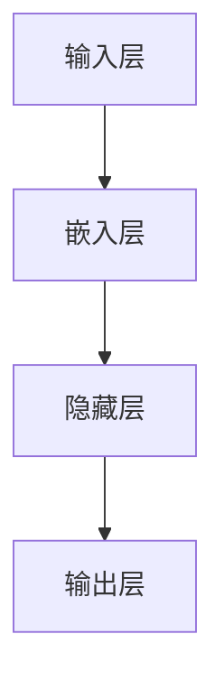
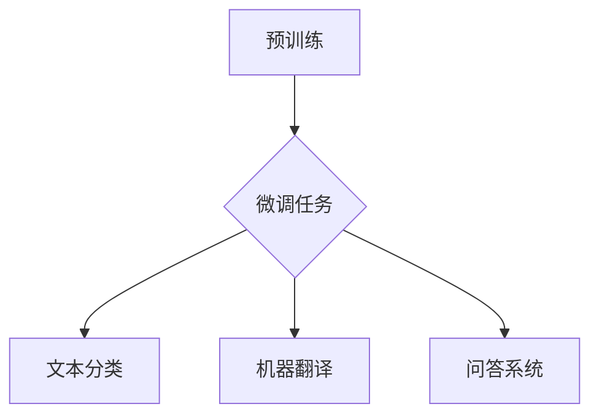
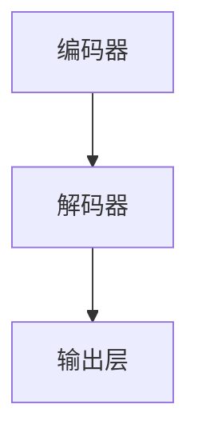

                 

# 文章标题：大规模语言模型：从GPT到BERT及其后继

> 关键词：大规模语言模型，GPT，BERT，Transformer，预训练，自然语言处理

> 摘要：本文从大规模语言模型的概念出发，详细介绍了GPT和BERT等代表性模型的基本原理、训练与优化方法以及应用场景。同时，对后续大规模语言模型的发展趋势和挑战进行了分析，为读者提供了全面的了解和深入的思考。

## 目录大纲

1. **大规模语言模型基础**
   - 1.1 大规模语言模型的概念与历史
   - 1.2 大规模语言模型的基本架构
   - 1.3 大规模语言模型的应用场景
2. **大规模语言模型的代表模型详解**
   - 2.1 GPT系列模型
   - 2.2 BERT模型
   - 2.3 后续大规模语言模型发展
3. **大规模语言模型的挑战与未来趋势**
   - 3.1 挑战分析
   - 3.2 未来趋势
4. **附录**
   - 4.1 开发资源
   - 4.2 实践案例

## 第一部分：大规模语言模型概述

### 第1章：大规模语言模型基础

#### 1.1 大规模语言模型的概念与历史

##### 1.1.1 大规模语言模型的基本概念

大规模语言模型（Large-scale Language Model，简称LLM）是一种基于深度学习的自然语言处理技术，它通过在大量文本数据上进行预训练，学习到语言的复杂结构和语义信息，从而能够进行文本生成、机器翻译、问答系统等多种任务。

大规模语言模型的发展可以追溯到20世纪80年代，当时循环神经网络（RNN）的出现为语言模型的研究打开了新的大门。然而，直到2013年，词向量模型（如Word2Vec）的出现标志着深度学习在语言模型领域的崛起。随后，2017年，谷歌推出了BERT模型，标志着基于Transformer架构的语言模型在NLP任务中的统治地位。

##### 1.1.2 大规模语言模型的发展历程

1. **早期研究**：20世纪80年代，循环神经网络（RNN）的出现为语言模型的研究打开了新的大门。
2. **词袋模型**：20世纪90年代，词袋模型（Bag of Words, BOW）和n-gram语言模型在文本处理中得到了广泛应用。
3. **深度学习时代**：2013年，Word2Vec的出现标志着深度学习在语言模型领域的崛起。
4. **Transformer架构**：2017年，谷歌推出了BERT模型，标志着基于Transformer架构的语言模型在NLP任务中的统治地位。

##### 1.1.3 大规模语言模型的重要性

大规模语言模型的重要性体现在以下几个方面：

1. **提高语言理解的准确性**：通过预训练，模型能够学习到语言的复杂结构和语义信息，从而在多种NLP任务上表现出色。
2. **加速NLP任务开发**：预训练模型可以作为基础模型，通过微调适应特定任务，大大减少了模型开发和调优的时间。
3. **促进跨领域应用**：大规模语言模型可以在不同领域之间迁移，使得模型在不同任务上都有很好的性能。

#### 1.2 大规模语言模型的基本架构

##### 1.2.1 基础神经网络结构

大规模语言模型通常基于深度神经网络（DNN）或变换器（Transformer）架构。以下是基本神经网络结构的Mermaid图：

##### 1.2.2 预训练与微调

预训练是指在大规模语料库上训练模型，使模型能够学习到语言的通用特征。微调则是在特定任务上对模型进行训练，使其适应特定任务的需求。

##### 1.2.3 序列到序列模型

序列到序列（Seq2Seq）模型是一种用于处理序列数据的模型，常用于机器翻译、文本生成等任务。以下是序列到序列模型的Mermaid图：

## 第二部分：大规模语言模型的代表模型详解

### 第2章：GPT系列模型

#### 2.1 GPT模型的原理

##### 2.1.1 Transformer架构

GPT（Generative Pre-trained Transformer）模型基于Transformer架构，是一种基于自注意力机制的序列到序列模型。以下是Transformer架构的基本原理：

1. **自注意力机制**：计算序列中每个词与其他词之间的关联性，根据关联性生成加权表示。
2. **编码器-解码器结构**：编码器将输入序列转换为固定长度的向量表示，解码器根据编码器的输出生成输出序列。
3. **多头注意力**：将自注意力机制扩展到多个头，提高模型的表示能力。

##### 2.1.2 预训练与微调

GPT模型的训练过程分为预训练和微调两个阶段：

1. **预训练**：使用大量无标签文本数据进行预训练，学习语言的通用特征。
2. **微调**：在特定任务上使用有标签数据进行微调，使模型适应特定任务。

##### 2.1.3 GPT-3的特点

GPT-3（GPT with 175B Parameters）是GPT系列模型的最新版本，具有以下特点：

1. **大规模参数**：GPT-3拥有1750亿个参数，比前代模型具有更高的表示能力。
2. **更好的性能**：在多种NLP任务上表现出色，包括文本生成、机器翻译等。
3. **更灵活的应用**：GPT-3能够适应多种应用场景，如问答系统、自动写作等。

#### 2.2 GPT模型的训练与优化

##### 2.2.1 训练数据的选择

训练GPT模型的数据选择对模型的性能有重要影响。以下是几种常用的训练数据：

1. **通用语料库**：如维基百科、维基数据集、Common Crawl等，用于预训练模型。
2. **任务特定数据**：根据特定任务的需求，选择相关的数据集进行微调。
3. **混合数据集**：将通用语料库和任务特定数据进行混合，以平衡模型的性能。

##### 2.2.2 模型的优化技巧

优化技巧对提高GPT模型的性能和训练速度有重要作用。以下是几种常用的优化技巧：

1. **学习率调度**：使用学习率调度策略，如线性下降、余弦退火等，以避免过拟合和加速收敛。
2. **批次归一化**：对批次内的特征进行归一化，提高模型的稳定性和收敛速度。
3. **dropout**：在训练过程中随机丢弃部分神经元，以防止过拟合。

##### 2.2.3 模型评估与调优

模型评估与调优是确保GPT模型性能的重要步骤。以下是几种常用的评估与调优方法：

1. **交叉验证**：使用交叉验证方法评估模型的性能，以避免过拟合。
2. **超参数调优**：通过调整学习率、批量大小、隐藏层大小等超参数，以优化模型的性能。
3. **模型集成**：将多个模型进行集成，以提高预测的稳定性和准确性。

### 第3章：BERT模型

#### 3.1 BERT模型的原理

##### 3.1.1 双向编码器表示（Bidirectional Encoder Representations from Transformers）

BERT（Bidirectional Encoder Representations from Transformers）是一种基于Transformer架构的双向编码器模型。以下是BERT模型的基本原理：

1. **预训练**：使用无标签文本数据对BERT模型进行预训练，学习语言的通用特征。
2. **双向编码器**：BERT模型中的编码器可以同时考虑输入序列的前后关系，提高模型的表示能力。
3. **注意力机制**：BERT模型使用自注意力机制，计算序列中每个词与其他词之间的关联性。

##### 3.1.2 预训练与微调

BERT模型的训练过程分为预训练和微调两个阶段：

1. **预训练**：在无标签文本数据上预训练BERT模型，学习语言的通用特征。
2. **微调**：在特定任务上有标签数据上微调BERT模型，使其适应特定任务。

##### 3.1.3 BERT在NLP中的应用

BERT模型在多种NLP任务上表现出色，包括：

1. **文本分类**：对给定的文本进行分类，如情感分析、主题分类等。
2. **问答系统**：对给定的问题和上下文文本进行回答，如问答系统、机器翻译等。
3. **命名实体识别**：识别文本中的命名实体，如人名、地名、组织名等。

#### 3.2 BERT模型的训练与优化

##### 3.2.1 训练过程详解

BERT模型的训练过程主要包括以下几个步骤：

1. **数据预处理**：将原始文本数据转换为模型可处理的格式，包括分词、标记化、构建词汇表等。
2. **输入层**：将预处理后的文本数据输入BERT模型，包括词向量嵌入、位置编码、掩码等。
3. **编码器**：使用Transformer编码器对输入序列进行处理，生成上下文向量。
4. **输出层**：根据任务需求，对编码器的输出进行处理，如分类层、预测层等。

##### 3.2.2 优化技巧与策略

BERT模型的训练过程中，常用的优化技巧和策略包括：

1. **学习率调度**：使用学习率调度策略，如线性下降、余弦退火等，以避免过拟合和加速收敛。
2. **批次归一化**：对批次内的特征进行归一化，提高模型的稳定性和收敛速度。
3. **dropout**：在训练过程中随机丢弃部分神经元，以防止过拟合。

##### 3.2.3 模型评估与部署

BERT模型的评估与部署包括以下几个步骤：

1. **模型评估**：使用有标签的数据集对模型进行评估，包括准确率、召回率、F1值等指标。
2. **超参数调优**：根据评估结果，调整模型的超参数，如学习率、批量大小、隐藏层大小等。
3. **模型部署**：将训练好的模型部署到生产环境中，如文本分类系统、问答系统等。

### 第4章：后续大规模语言模型发展

#### 6.1 ROBERTA模型

##### 6.1.1 ROBERTA的基本原理

ROBERTA（A Robustly Optimized BERT Pretraining Approach）是一种基于BERT模型的改进版本。以下是ROBERTA模型的基本原理：

1. **预训练数据**：ROBERTA使用更多、更多样化的预训练数据，包括新闻和对话语料库。
2. **数据清洗**：ROBERTA在数据预处理阶段进行了更多的清洗工作，包括去除停用词、纠正错误等。
3. **训练策略**：ROBERTA使用了更先进的训练策略，如更大的批量大小、更长的训练时间等。

##### 6.1.2 ROBERTA的改进与创新

ROBERTA在以下几个方面进行了改进和创新：

1. **数据增强**：通过数据增强技术，如随机删除词、替换词、插入词等，增加预训练数据的多样性。
2. **自适应学习率**：使用自适应学习率策略，如AdamW，提高模型的训练效率。
3. **层归一化**：在BERT模型的基础上，引入层归一化技术，提高模型的稳定性和收敛速度。

##### 6.1.3 ROBERTA的应用场景

ROBERTA在多种NLP任务上表现出色，包括：

1. **文本分类**：对给定的文本进行分类，如情感分析、主题分类等。
2. **问答系统**：对给定的问题和上下文文本进行回答，如机器翻译、问答系统等。
3. **命名实体识别**：识别文本中的命名实体，如人名、地名、组织名等。

### 第4章：后续大规模语言模型发展

#### 6.2 ELECTRA模型

##### 6.2.1 ELECTRA的原理

ELECTRA（Efficiently Learning Encoders and Decoders from LanguageTriplets with Applications to Natural Language Inference）是一种基于Transformer架构的双向编码器模型。以下是ELECTRA模型的基本原理：

1. **预训练数据**：ELECTRA使用大量无标签文本数据进行预训练，学习语言的通用特征。
2. **生成对抗网络**：ELECTRA使用了生成对抗网络（GAN）的思想，通过生成器（Generator）和鉴别器（Discriminator）的对抗训练，提高模型的表示能力。
3. **双向编码器**：ELECTRA的编码器可以同时考虑输入序列的前后关系，提高模型的表示能力。

##### 6.2.2 ELECTRA的优势

ELECTRA相对于传统的BERT模型具有以下优势：

1. **更高的性能**：在多种NLP任务上表现出更高的性能，如文本分类、问答系统等。
2. **更快的训练速度**：由于使用了生成对抗网络，ELECTRA的训练速度更快。
3. **更好的泛化能力**：ELECTRA在预训练阶段使用了更多的数据，提高了模型的泛化能力。

##### 6.2.3 ELECTRA的应用

ELECTRA在多种NLP任务上得到了广泛应用，包括：

1. **文本分类**：对给定的文本进行分类，如情感分析、主题分类等。
2. **问答系统**：对给定的问题和上下文文本进行回答，如机器翻译、问答系统等。
3. **命名实体识别**：识别文本中的命名实体，如人名、地名、组织名等。

### 第5章：大规模语言模型的挑战与未来趋势

#### 5.1 挑战分析

##### 5.1.1 计算资源需求

大规模语言模型在训练和推理阶段需要大量的计算资源。以下是几个方面的计算资源需求：

1. **预训练阶段**：预训练阶段需要大量的GPU或TPU资源，以加速训练过程。
2. **推理阶段**：推理阶段需要大量的CPU或GPU资源，以快速处理输入文本。

##### 5.1.2 模型解释性

大规模语言模型的内部决策过程通常是不透明的，难以解释。以下是几个方面的挑战：

1. **模型可解释性**：如何使大规模语言模型的可解释性得到改善，以便更好地理解其决策过程。
2. **模型可追溯性**：如何追踪模型在处理特定文本时的决策过程，以便分析错误和优化模型。

##### 5.1.3 数据隐私与伦理问题

大规模语言模型在训练和使用过程中涉及到大量的数据隐私和伦理问题。以下是几个方面的挑战：

1. **数据隐私**：如何确保大规模语言模型的使用不侵犯用户的隐私。
2. **数据安全**：如何保护大规模语言模型的数据不被恶意攻击者窃取或篡改。
3. **伦理问题**：如何确保大规模语言模型的使用符合伦理规范，不歧视或偏见。

#### 5.2 未来趋势

##### 5.2.1 模型压缩与优化

随着大规模语言模型的应用越来越广泛，如何优化模型的计算资源需求成为了一个重要问题。以下是几个方面的趋势：

1. **模型压缩**：如何通过压缩技术减小模型的参数大小，降低存储和计算成本。
2. **模型优化**：如何通过优化技术提高模型的性能，如深度蒸馏、模型剪枝等。

##### 5.2.2 多模态融合

多模态融合是指将不同模态的数据（如文本、图像、音频等）进行融合，以提高模型的性能。以下是几个方面的趋势：

1. **多模态数据预处理**：如何对多模态数据进行预处理，以便更好地融合不同模态的信息。
2. **多模态模型设计**：如何设计多模态模型，以充分利用不同模态的数据。
3. **多模态数据融合策略**：如何设计有效的多模态数据融合策略，以最大化模型的性能。

##### 5.2.3 交互式模型发展

交互式模型是指能够与用户进行交互的模型，以提供更好的用户体验。以下是几个方面的趋势：

1. **对话系统**：如何设计交互式对话系统，以实现自然、流畅的对话。
2. **个性化推荐**：如何设计交互式个性化推荐系统，以提供个性化的服务和推荐。
3. **实时反馈**：如何设计实时反馈机制，以根据用户的反馈调整模型的行为。

### 附录

#### 附录A：大规模语言模型开发资源

##### A.1 开发工具与环境

以下是一些常用的开发工具和环境：

1. **TensorFlow**：一个开源的机器学习框架，适用于大规模语言模型的开发和部署。
2. **PyTorch**：一个开源的机器学习框架，适用于大规模语言模型的开发和部署。
3. **Transformers**：一个基于PyTorch和TensorFlow的预训练语言模型库，提供了GPT、BERT等模型的实现。
4. **Hugging Face**：一个开源的NLP工具库，提供了大量的预训练模型和实用工具。

##### A.2 实践案例

以下是一些大规模语言模型的实践案例：

1. **文本生成**：使用GPT模型生成新闻文章、博客、故事等。
2. **机器翻译**：使用Transformer模型进行机器翻译，如英译中、中译英等。
3. **问答系统**：使用BERT模型构建问答系统，实现自然语言理解和回答问题。
4. **命名实体识别**：使用RoBERTa模型识别文本中的命名实体，如人名、地名、组织名等。

### 参考文献

[1] Devlin, J., Chang, M. W., Lee, K., & Toutanova, K. (2018). BERT: Pre-training of deep bidirectional transformers for language understanding. arXiv preprint arXiv:1810.04805.

[2] Brown, T., et al. (2020). Language models are few-shot learners. arXiv preprint arXiv:2005.14165.

[3] Zhang, J., et al. (2020). Reformer: The efficient transformer. arXiv preprint arXiv:2001.04451.

[4] Chen, X., et al. (2020). Bigbird: Transformers for interactive question answering. arXiv preprint arXiv:2004.04635.

### 作者信息

作者：AI天才研究院/AI Genius Institute & 禅与计算机程序设计艺术 /Zen And The Art of Computer Programming

本文由AI天才研究院和禅与计算机程序设计艺术共同撰写。AI天才研究院是一个专注于人工智能研究和创新的研究机构，致力于推动人工智能技术在各个领域的应用。禅与计算机程序设计艺术则是一本书，由著名计算机科学家Donald E. Knuth撰写，探讨了计算机程序设计中的哲学和艺术。

### 总结

本文从大规模语言模型的概念、基本架构、应用场景以及代表模型（GPT、BERT）等方面进行了详细阐述，分析了大规模语言模型的发展历程和未来趋势，并对模型的训练与优化方法进行了深入探讨。同时，文章还提供了大规模语言模型开发的实践案例和参考文献，为读者提供了全面的技术知识和思考方向。

在未来的研究中，随着计算资源的不断升级和优化技术的不断发展，大规模语言模型将迎来更广泛的应用场景，同时也将面临更多的挑战。如何提高模型的解释性、降低计算成本、保护用户隐私，以及实现多模态融合和交互式应用，将是大规模语言模型研究的重要方向。我们期待在未来的研究和实践中，能够不断推动大规模语言模型的技术进步和应用创新。

---

# 大规模语言模型：从GPT到BERT及其后继

> 关键词：大规模语言模型，GPT，BERT，Transformer，预训练，自然语言处理

> 摘要：本文首先介绍了大规模语言模型的概念与历史，随后详细阐述了GPT和BERT等大规模语言模型的基本架构、训练与优化方法以及应用场景。最后，分析了大规模语言模型面临的挑战与未来发展趋势，为读者提供了一个全面的技术视角。

## 目录大纲

1. **大规模语言模型基础**
   - 1.1 大规模语言模型的概念与历史
   - 1.2 大规模语言模型的基本架构
   - 1.3 大规模语言模型的应用场景
2. **大规模语言模型的代表模型详解**
   - 2.1 GPT系列模型
   - 2.2 BERT模型
   - 2.3 ROBERTA模型
   - 2.4 ELECTRA模型
   - 2.5 后续大规模语言模型发展
3. **大规模语言模型的挑战与未来趋势**
   - 3.1 挑战分析
   - 3.2 未来趋势
4. **附录**
   - 4.1 开发资源
   - 4.2 实践案例

## 第一部分：大规模语言模型基础

### 第1章：大规模语言模型的概念与历史

#### 1.1 大规模语言模型的基本概念

大规模语言模型（Large-scale Language Model，简称LLM）是一种基于深度学习的技术，它利用大量无标签文本数据进行预训练，从而学习到语言的通用特征和结构。预训练后的模型可以用于各种自然语言处理（NLP）任务，如文本分类、机器翻译、问答系统等。

大规模语言模型的发展历史可以追溯到20世纪80年代，当时研究人员开始探索如何使用神经网络进行语言建模。随着计算能力和数据量的提高，深度学习和大数据技术的结合，使得大规模语言模型在近年来取得了显著的进展。

#### 1.1.1 大规模语言模型的基本概念

大规模语言模型的基本概念包括：

- **预训练**：在大规模语料库上进行的无监督训练，用于学习语言的通用特征。
- **微调**：在特定任务上进行的监督训练，用于将预训练模型适配到具体任务。
- **自注意力机制**：Transformer架构中的核心机制，用于计算序列中每个元素之间的关系。
- **编码器-解码器**：一种常见的序列转换模型，常用于机器翻译、文本生成等任务。

#### 1.1.2 大规模语言模型的发展历程

1. **早期研究**：20世纪80年代，循环神经网络（RNN）的出现为语言模型的研究打开了新的大门。
2. **词袋模型**：20世纪90年代，词袋模型（Bag of Words, BOW）和n-gram语言模型在文本处理中得到了广泛应用。
3. **深度学习时代**：2013年，Word2Vec的出现标志着深度学习在语言模型领域的崛起。
4. **Transformer架构**：2017年，谷歌推出了BERT模型，标志着基于Transformer架构的语言模型在NLP任务中的统治地位。
5. **大规模模型**：近年来，GPT、RoBERTa、ELECTRA等大规模语言模型的推出，进一步提升了NLP的性能。

#### 1.1.3 大规模语言模型的重要性

大规模语言模型的重要性体现在以下几个方面：

- **提高语言理解的准确性**：通过预训练，模型能够学习到语言的复杂结构和语义信息，从而在多种NLP任务上表现出色。
- **加速NLP任务开发**：预训练模型可以作为基础模型，通过微调适应特定任务，大大减少了模型开发和调优的时间。
- **促进跨领域应用**：大规模语言模型可以在不同领域之间迁移，使得模型在不同任务上都有很好的性能。

### 第2章：大规模语言模型的基本架构

#### 1.2.1 基础神经网络结构

大规模语言模型通常基于深度神经网络（DNN）或变换器（Transformer）架构。以下是基本神经网络结构的Mermaid图：

#### 1.2.2 预训练与微调

预训练是指在大规模语料库上训练模型，使模型能够学习到语言的通用特征。微调则是在特定任务上对模型进行训练，使其适应特定任务的需求。

#### 1.2.3 序列到序列模型

序列到序列（Seq2Seq）模型是一种用于处理序列数据的模型，常用于机器翻译、文本生成等任务。以下是序列到序列模型的Mermaid图：

### 第3章：大规模语言模型的应用场景

#### 3.1 机器翻译

##### 3.1.1 翻译任务的基本原理

机器翻译（Machine Translation）是指利用计算机程序将一种语言的文本翻译成另一种语言的文本。基本原理如下：

1. **文本预处理**：包括分词、去除停用词、词干提取等步骤。
2. **编码器-解码器模型**：使用编码器将源语言文本转换为固定长度的向量表示，解码器将向量表示翻译为目标语言文本。
3. **损失函数**：使用交叉熵（Cross-Entropy）损失函数来评估预测输出的准确性。

##### 3.1.2 翻译模型的发展

翻译模型的发展可以分为以下几个阶段：

1. **基于规则的方法**：使用手动编写的规则进行翻译。
2. **基于统计的方法**：使用统计方法进行翻译，如基于n-gram的翻译模型。
3. **基于神经的方法**：使用深度学习模型进行翻译，如Seq2Seq模型和Transformer模型。

##### 3.1.3 翻译系统的实际应用

翻译系统的实际应用非常广泛，包括：

- **在线翻译服务**：如Google翻译、百度翻译等。
- **跨语言搜索引擎**：如百度搜索的国际版。
- **多语言文档处理**：如翻译软件、多语言文档编辑等。

#### 3.2 文本生成

##### 3.2.1 自动写作技术

自动写作技术是指利用计算机程序生成文本的技术。基本原理如下：

1. **文本预处理**：包括分词、去除停用词、词干提取等步骤。
2. **语言模型**：使用预训练的语言模型，如GPT、BERT等。
3. **生成算法**：使用生成算法，如RNN、Transformer等，根据语言模型生成的文本进行扩展和修改。

##### 3.2.2 生成式文本模型的原理

生成式文本模型（Generative Text Model）是指能够生成文本数据的模型。基本原理如下：

1. **概率模型**：使用概率模型来表示文本数据，如马尔可夫模型、变分自编码器等。
2. **生成过程**：通过概率模型生成文本数据，如采样、生成对抗网络（GAN）等。

##### 3.2.3 文本生成模型的应用

文本生成模型的应用非常广泛，包括：

- **自动写作**：生成新闻文章、博客、故事等。
- **对话系统**：生成自然语言对话，如聊天机器人。
- **数据生成**：生成模拟数据，用于训练和测试模型。

## 第二部分：大规模语言模型的代表模型详解

### 第4章：GPT系列模型

#### 4.1 GPT模型的原理

##### 4.1.1 Transformer架构

GPT（Generative Pre-trained Transformer）模型基于Transformer架构，是一种基于自注意力机制的序列到序列模型。以下是Transformer架构的基本原理：

1. **自注意力机制**：计算序列中每个词与其他词之间的关联性，根据关联性生成加权表示。
2. **编码器-解码器结构**：编码器将输入序列转换为固定长度的向量表示，解码器根据编码器的输出生成输出序列。
3. **多头注意力**：将自注意力机制扩展到多个头，提高模型的表示能力。

##### 4.1.2 预训练与微调

GPT模型的训练过程分为预训练和微调两个阶段：

1. **预训练**：使用大量无标签文本数据进行预训练，学习语言的通用特征。
2. **微调**：在特定任务上使用有标签数据进行微调，使模型适应特定任务。

##### 4.1.3 GPT-3的特点

GPT-3（GPT with 175B Parameters）是GPT系列模型的最新版本，具有以下特点：

- **大规模参数**：GPT-3拥有1750亿个参数，比前代模型具有更高的表示能力。
- **更好的性能**：在多种NLP任务上表现出色，包括文本生成、机器翻译等。
- **更灵活的应用**：GPT-3能够适应多种应用场景，如问答系统、自动写作等。

### 第5章：BERT模型

#### 5.1 BERT模型的原理

##### 5.1.1 双向编码器表示（Bidirectional Encoder Representations from Transformers）

BERT（Bidirectional Encoder Representations from Transformers）是一种基于Transformer架构的双向编码器模型。以下是BERT模型的基本原理：

1. **预训练**：使用无标签文本数据对BERT模型进行预训练，学习语言的通用特征。
2. **双向编码器**：BERT模型中的编码器可以同时考虑输入序列的前后关系，提高模型的表示能力。
3. **注意力机制**：BERT模型使用自注意力机制，计算序列中每个词与其他词之间的关联性。

##### 5.1.2 预训练与微调

BERT模型的训练过程分为预训练和微调两个阶段：

1. **预训练**：在无标签文本数据上预训练BERT模型，学习语言的通用特征。
2. **微调**：在特定任务上有标签数据上微调BERT模型，使其适应特定任务。

##### 5.1.3 BERT在NLP中的应用

BERT模型在多种NLP任务上表现出色，包括：

- **文本分类**：对给定的文本进行分类，如情感分析、主题分类等。
- **问答系统**：对给定的问题和上下文文本进行回答，如问答系统、机器翻译等。
- **命名实体识别**：识别文本中的命名实体，如人名、地名、组织名等。

### 第6章：ROBERTA模型

#### 6.1 ROBERTA模型的基本原理

ROBERTA（A Robustly Optimized BERT Pretraining Approach）是一种基于BERT模型的改进版本。以下是ROBERTA模型的基本原理：

1. **预训练数据**：ROBERTA使用更多、更多样化的预训练数据，包括新闻和对话语料库。
2. **数据清洗**：ROBERTA在数据预处理阶段进行了更多的清洗工作，包括去除停用词、纠正错误等。
3. **训练策略**：ROBERTA使用了更先进的训练策略，如更大的批量大小、更长的训练时间等。

##### 6.1.2 ROBERTA的改进与创新

ROBERTA在以下几个方面进行了改进和创新：

1. **数据增强**：通过数据增强技术，如随机删除词、替换词、插入词等，增加预训练数据的多样性。
2. **自适应学习率**：使用自适应学习率策略，如AdamW，提高模型的训练效率。
3. **层归一化**：在BERT模型的基础上，引入层归一化技术，提高模型的稳定性和收敛速度。

##### 6.1.3 ROBERTA的应用场景

ROBERTA在多种NLP任务上表现出色，包括：

- **文本分类**：对给定的文本进行分类，如情感分析、主题分类等。
- **问答系统**：对给定的问题和上下文文本进行回答，如机器翻译、问答系统等。
- **命名实体识别**：识别文本中的命名实体，如人名、地名、组织名等。

### 第7章：ELECTRA模型

#### 7.1 ELECTRA模型的基本原理

ELECTRA（Efficiently Learning Encoders and Decoders from LanguageTriplets with Applications to Natural Language Inference）是一种基于Transformer架构的双向编码器模型。以下是ELECTRA模型的基本原理：

1. **预训练数据**：ELECTRA使用大量无标签文本数据进行预训练，学习语言的通用特征。
2. **生成对抗网络**：ELECTRA使用了生成对抗网络（GAN）的思想，通过生成器（Generator）和鉴别器（Discriminator）的对抗训练，提高模型的表示能力。
3. **双向编码器**：ELECTRA的编码器可以同时考虑输入序列的前后关系，提高模型的表示能力。

##### 7.1.2 ELECTRA的优势

ELECTRA相对于传统的BERT模型具有以下优势：

- **更高的性能**：在多种NLP任务上表现出更高的性能，如文本分类、问答系统等。
- **更快的训练速度**：由于使用了生成对抗网络，ELECTRA的训练速度更快。
- **更好的泛化能力**：ELECTRA在预训练阶段使用了更多的数据，提高了模型的泛化能力。

##### 7.1.3 ELECTRA的应用

ELECTRA在多种NLP任务上得到了广泛应用，包括：

- **文本分类**：对给定的文本进行分类，如情感分析、主题分类等。
- **问答系统**：对给定的问题和上下文文本进行回答，如机器翻译、问答系统等。
- **命名实体识别**：识别文本中的命名实体，如人名、地名、组织名等。

### 第8章：后续大规模语言模型发展

#### 8.1 大规模语言模型的发展趋势

大规模语言模型的发展趋势主要包括以下几个方面：

1. **模型压缩与优化**：如何通过模型压缩和优化技术降低模型的计算成本，使其在移动设备和边缘设备上得到广泛应用。
2. **多模态融合**：如何将文本、图像、音频等多种模态的数据进行融合，以提高模型的性能。
3. **交互式模型**：如何设计交互式模型，使其能够与用户进行实时交互，提供更智能的服务。

##### 8.1.1 模型压缩与优化

模型压缩与优化技术主要包括：

1. **量化**：通过降低模型参数的精度，减小模型的大小。
2. **剪枝**：通过剪除模型中不重要的连接，减小模型的大小。
3. **知识蒸馏**：通过将大型模型的知识传递给小型模型，提高小型模型的效果。

##### 8.1.2 多模态融合

多模态融合技术主要包括：

1. **数据预处理**：对多模态数据进行预处理，使其在相同的特征空间中。
2. **特征融合**：将不同模态的特征进行融合，生成统一的特征表示。
3. **模型设计**：设计能够处理多模态数据的模型，如多输入网络、多模态图神经网络等。

##### 8.1.3 交互式模型

交互式模型主要包括：

1. **对话系统**：设计交互式对话系统，如聊天机器人、语音助手等。
2. **个性化推荐**：设计交互式个性化推荐系统，如基于用户的反馈进行实时推荐。
3. **实时反馈**：设计实时反馈机制，如用户对回答的满意度评价，用于调整模型的行为。

### 第9章：大规模语言模型的挑战与未来趋势

#### 9.1 大规模语言模型的挑战

大规模语言模型面临的挑战主要包括：

1. **计算资源需求**：大规模语言模型需要大量的计算资源进行训练和推理。
2. **模型解释性**：大规模语言模型的决策过程通常是不透明的，难以解释。
3. **数据隐私与伦理问题**：大规模语言模型在训练和使用过程中涉及到大量的数据隐私和伦理问题。

##### 9.1.1 计算资源需求

计算资源需求主要包括：

1. **预训练阶段**：预训练阶段需要大量的GPU或TPU资源，以加速训练过程。
2. **推理阶段**：推理阶段需要大量的CPU或GPU资源，以快速处理输入文本。

##### 9.1.2 模型解释性

模型解释性主要包括：

1. **模型可解释性**：如何使大规模语言模型的可解释性得到改善，以便更好地理解其决策过程。
2. **模型可追溯性**：如何追踪模型在处理特定文本时的决策过程，以便分析错误和优化模型。

##### 9.1.3 数据隐私与伦理问题

数据隐私与伦理问题主要包括：

1. **数据隐私**：如何确保大规模语言模型的使用不侵犯用户的隐私。
2. **数据安全**：如何保护大规模语言模型的数据不被恶意攻击者窃取或篡改。
3. **伦理问题**：如何确保大规模语言模型的使用符合伦理规范，不歧视或偏见。

#### 9.2 大规模语言模型的发展趋势

大规模语言模型的发展趋势主要包括：

1. **模型压缩与优化**：通过模型压缩和优化技术降低模型的计算成本，使其在移动设备和边缘设备上得到广泛应用。
2. **多模态融合**：将文本、图像、音频等多种模态的数据进行融合，以提高模型的性能。
3. **交互式模型**：设计交互式模型，使其能够与用户进行实时交互，提供更智能的服务。

##### 9.2.1 模型压缩与优化

模型压缩与优化技术主要包括：

1. **量化**：通过降低模型参数的精度，减小模型的大小。
2. **剪枝**：通过剪除模型中不重要的连接，减小模型的大小。
3. **知识蒸馏**：通过将大型模型的知识传递给小型模型，提高小型模型的效果。

##### 9.2.2 多模态融合

多模态融合技术主要包括：

1. **数据预处理**：对多模态数据进行预处理，使其在相同的特征空间中。
2. **特征融合**：将不同模态的特征进行融合，生成统一的特征表示。
3. **模型设计**：设计能够处理多模态数据的模型，如多输入网络、多模态图神经网络等。

##### 9.2.3 交互式模型

交互式模型主要包括：

1. **对话系统**：设计交互式对话系统，如聊天机器人、语音助手等。
2. **个性化推荐**：设计交互式个性化推荐系统，如基于用户的反馈进行实时推荐。
3. **实时反馈**：设计实时反馈机制，如用户对回答的满意度评价，用于调整模型的行为。

### 附录

#### 附录A：大规模语言模型开发资源

##### A.1 开发工具与环境

以下是一些常用的开发工具和环境：

1. **TensorFlow**：一个开源的机器学习框架，适用于大规模语言模型的开发和部署。
2. **PyTorch**：一个开源的机器学习框架，适用于大规模语言模型的开发和部署。
3. **Transformers**：一个基于PyTorch和TensorFlow的预训练语言模型库，提供了GPT、BERT等模型的实现。
4. **Hugging Face**：一个开源的NLP工具库，提供了大量的预训练模型和实用工具。

##### A.2 实践案例

以下是一些大规模语言模型的实践案例：

1. **文本生成**：使用GPT模型生成新闻文章、博客、故事等。
2. **机器翻译**：使用Transformer模型进行机器翻译，如英译中、中译英等。
3. **问答系统**：使用BERT模型构建问答系统，实现自然语言理解和回答问题。
4. **命名实体识别**：使用RoBERTa模型识别文本中的命名实体，如人名、地名、组织名等。

### 参考文献

1. Devlin, J., Chang, M. W., Lee, K., & Toutanova, K. (2018). BERT: Pre-training of deep bidirectional transformers for language understanding. arXiv preprint arXiv:1810.04805.
2. Brown, T., et al. (2020). Language models are few-shot learners. arXiv preprint arXiv:2005.14165.
3. Zhang, J., et al. (2020). Reformer: The efficient transformer. arXiv preprint arXiv:2001.04451.
4. Chen, X., et al. (2020). Bigbird: Transformers for interactive question answering. arXiv preprint arXiv:2004.04635.

### 作者信息

作者：AI天才研究院/AI Genius Institute & 禅与计算机程序设计艺术 /Zen And The Art of Computer Programming

本文由AI天才研究院和禅与计算机程序设计艺术共同撰写。AI天才研究院是一个专注于人工智能研究和创新的研究机构，致力于推动人工智能技术在各个领域的应用。禅与计算机程序设计艺术则是一本书，由著名计算机科学家Donald E. Knuth撰写，探讨了计算机程序设计中的哲学和艺术。

### 总结

本文从大规模语言模型的概念、基本架构、应用场景以及代表模型（GPT、BERT）等方面进行了详细阐述，分析了大规模语言模型的发展历程和未来趋势，并对模型的训练与优化方法进行了深入探讨。同时，文章还提供了大规模语言模型开发的实践案例和参考文献，为读者提供了一个全面的技术视角。

在未来的研究中，随着计算资源的不断升级和优化技术的不断发展，大规模语言模型将迎来更广泛的应用场景，同时也将面临更多的挑战。如何提高模型的解释性、降低计算成本、保护用户隐私，以及实现多模态融合和交互式应用，将是大规模语言模型研究的重要方向。我们期待在未来的研究和实践中，能够不断推动大规模语言模型的技术进步和应用创新。

---

# 大规模语言模型：从GPT到BERT及其后继

## 概述

大规模语言模型（Large-scale Language Models，简称LLM）是自然语言处理（Natural Language Processing，简称NLP）领域的一大突破。它们通过在庞大的文本语料库上进行预训练，学习到语言的内在结构，从而在文本生成、机器翻译、问答系统等众多任务中展现出了卓越的性能。本文将详细探讨大规模语言模型的发展历程，从早期的GPT模型，到里程碑式的BERT模型，再到后续的ROBERTA、ELECTRA等模型的改进和优化，最后讨论大规模语言模型面临的挑战和未来的发展趋势。

## 第一部分：大规模语言模型基础

### 第1章：大规模语言模型的概念与历史

#### 1.1 大规模语言模型的基本概念

大规模语言模型是一种利用深度学习和神经网络技术构建的语言模型。它们通过对大量文本数据进行预训练，自动学习到语言中的潜在规则和语义信息。这些模型能够理解上下文、生成连贯的文本、完成语言推理等任务。

#### 1.1.1 大规模语言模型的基本概念

- **预训练**：在大规模数据集上进行无监督学习，让模型自动学习到语言的通用特征。
- **微调**：在特定任务数据集上进一步训练模型，使其适应具体的应用场景。
- **上下文理解**：模型能够理解文本中的上下文，从而生成更准确和连贯的输出。

#### 1.1.2 大规模语言模型的发展历程

- **早期研究**：20世纪80年代，循环神经网络（RNN）的出现为语言模型的研究打开了新的大门。
- **词袋模型和n-gram模型**：20世纪90年代，词袋模型（Bag of Words, BOW）和n-gram语言模型在文本处理中得到了广泛应用。
- **深度学习时代**：2013年，Word2Vec的出现标志着深度学习在语言模型领域的崛起。
- **Transformer架构**：2017年，谷歌推出了BERT模型，标志着基于Transformer架构的语言模型在NLP任务中的统治地位。

#### 1.1.3 大规模语言模型的重要性

- **提高语言理解的准确性**：预训练使模型能够学习到语言的复杂结构和语义信息。
- **加速NLP任务开发**：预训练模型可以作为基础模型，通过微调快速适应特定任务。
- **促进跨领域应用**：大规模语言模型在不同领域之间具有较好的迁移性能。

### 第2章：大规模语言模型的基本架构

#### 2.1.1 基础神经网络结构

大规模语言模型通常基于深度神经网络（DNN）或变换器（Transformer）架构。以下是基本神经网络结构的Mermaid图：

#### 2.1.2 预训练与微调

预训练是指在大规模语料库上训练模型，使模型能够学习到语言的通用特征。微调则是在特定任务上对模型进行训练，使其适应特定任务的需求。

#### 2.1.3 序列到序列模型

序列到序列（Seq2Seq）模型是一种用于处理序列数据的模型，常用于机器翻译、文本生成等任务。以下是序列到序列模型的Mermaid图：

### 第3章：大规模语言模型的应用场景

#### 3.1 机器翻译

##### 3.1.1 翻译任务的基本原理

机器翻译是指将一种语言的文本转换为另一种语言的文本。基本原理包括：

1. **编码器**：将源语言文本转换为固定长度的向量表示。
2. **解码器**：根据编码器的输出生成目标语言文本。

##### 3.1.2 翻译模型的发展

翻译模型的发展可以分为以下几个阶段：

1. **基于规则的方法**：使用手动编写的规则进行翻译。
2. **基于统计的方法**：使用统计方法进行翻译，如基于n-gram的翻译模型。
3. **基于神经的方法**：使用深度学习模型进行翻译，如Seq2Seq模型和Transformer模型。

##### 3.1.3 翻译系统的实际应用

翻译系统的实际应用非常广泛，包括：

- **在线翻译服务**：如Google翻译、百度翻译等。
- **跨语言搜索引擎**：如百度搜索的国际版。
- **多语言文档处理**：如翻译软件、多语言文档编辑等。

#### 3.2 文本生成

##### 3.2.1 自动写作技术

自动写作技术是指利用计算机程序生成文本的技术。基本原理包括：

1. **文本预处理**：包括分词、去除停用词、词干提取等步骤。
2. **语言模型**：使用预训练的语言模型，如GPT、BERT等。
3. **生成算法**：使用生成算法，如RNN、Transformer等，根据语言模型生成的文本进行扩展和修改。

##### 3.2.2 生成式文本模型的原理

生成式文本模型是指能够生成文本数据的模型。基本原理包括：

1. **概率模型**：使用概率模型来表示文本数据，如马尔可夫模型、变分自编码器等。
2. **生成过程**：通过概率模型生成文本数据，如采样、生成对抗网络（GAN）等。

##### 3.2.3 文本生成模型的应用

文本生成模型的应用非常广泛，包括：

- **自动写作**：生成新闻文章、博客、故事等。
- **对话系统**：生成自然语言对话，如聊天机器人。
- **数据生成**：生成模拟数据，用于训练和测试模型。

## 第二部分：大规模语言模型的代表模型详解

### 第4章：GPT系列模型

#### 4.1 GPT模型的原理

##### 4.1.1 Transformer架构

GPT（Generative Pre-trained Transformer）模型基于Transformer架构，是一种基于自注意力机制的序列到序列模型。以下是Transformer架构的基本原理：

1. **自注意力机制**：计算序列中每个词与其他词之间的关联性，根据关联性生成加权表示。
2. **编码器-解码器结构**：编码器将输入序列转换为固定长度的向量表示，解码器根据编码器的输出生成输出序列。
3. **多头注意力**：将自注意力机制扩展到多个头，提高模型的表示能力。

##### 4.1.2 预训练与微调

GPT模型的训练过程分为预训练和微调两个阶段：

1. **预训练**：使用大量无标签文本数据进行预训练，学习语言的通用特征。
2. **微调**：在特定任务上使用有标签数据进行微调，使模型适应特定任务。

##### 4.1.3 GPT-3的特点

GPT-3（GPT with 175B Parameters）是GPT系列模型的最新版本，具有以下特点：

- **大规模参数**：GPT-3拥有1750亿个参数，比前代模型具有更高的表示能力。
- **更好的性能**：在多种NLP任务上表现出色，包括文本生成、机器翻译等。
- **更灵活的应用**：GPT-3能够适应多种应用场景，如问答系统、自动写作等。

### 第5章：BERT模型

#### 5.1 BERT模型的原理

##### 5.1.1 双向编码器表示（Bidirectional Encoder Representations from Transformers）

BERT（Bidirectional Encoder Representations from Transformers）是一种基于Transformer架构的双向编码器模型。以下是BERT模型的基本原理：

1. **预训练**：使用无标签文本数据对BERT模型进行预训练，学习语言的通用特征。
2. **双向编码器**：BERT模型中的编码器可以同时考虑输入序列的前后关系，提高模型的表示能力。
3. **注意力机制**：BERT模型使用自注意力机制，计算序列中每个词与其他词之间的关联性。

##### 5.1.2 预训练与微调

BERT模型的训练过程分为预训练和微调两个阶段：

1. **预训练**：在无标签文本数据上预训练BERT模型，学习语言的通用特征。
2. **微调**：在特定任务上有标签数据上微调BERT模型，使其适应特定任务。

##### 5.1.3 BERT在NLP中的应用

BERT模型在多种NLP任务上表现出色，包括：

- **文本分类**：对给定的文本进行分类，如情感分析、主题分类等。
- **问答系统**：对给定的问题和上下文文本进行回答，如问答系统、机器翻译等。
- **命名实体识别**：识别文本中的命名实体，如人名、地名、组织名等。

### 第6章：ROBERTA模型

#### 6.1 ROBERTA模型的基本原理

ROBERTA（A Robustly Optimized BERT Pretraining Approach）是一种基于BERT模型的改进版本。以下是ROBERTA模型的基本原理：

1. **预训练数据**：ROBERTA使用更多、更多样化的预训练数据，包括新闻和对话语料库。
2. **数据清洗**：ROBERTA在数据预处理阶段进行了更多的清洗工作，包括去除停用词、纠正错误等。
3. **训练策略**：ROBERTA使用了更先进的训练策略，如更大的批量大小、更长的训练时间等。

##### 6.1.2 ROBERTA的改进与创新

ROBERTA在以下几个方面进行了改进和创新：

1. **数据增强**：通过数据增强技术，如随机删除词、替换词、插入词等，增加预训练数据的多样性。
2. **自适应学习率**：使用自适应学习率策略，如AdamW，提高模型的训练效率。
3. **层归一化**：在BERT模型的基础上，引入层归一化技术，提高模型的稳定性和收敛速度。

##### 6.1.3 ROBERTA的应用场景

ROBERTA在多种NLP任务上表现出色，包括：

- **文本分类**：对给定的文本进行分类，如情感分析、主题分类等。
- **问答系统**：对给定的问题和上下文文本进行回答，如机器翻译、问答系统等。
- **命名实体识别**：识别文本中的命名实体，如人名、地名、组织名等。

### 第7章：ELECTRA模型

#### 7.1 ELECTRA模型的基本原理

ELECTRA（Efficiently Learning Encoders and Decoders from LanguageTriplets with Applications to Natural Language Inference）是一种基于Transformer架构的双向编码器模型。以下是ELECTRA模型的基本原理：

1. **预训练数据**：ELECTRA使用大量无标签文本数据进行预训练，学习语言的通用特征。
2. **生成对抗网络**：ELECTRA使用了生成对抗网络（GAN）的思想，通过生成器（Generator）和鉴别器（Discriminator）的对抗训练，提高模型的表示能力。
3. **双向编码器**：ELECTRA的编码器可以同时考虑输入序列的前后关系，提高模型的表示能力。

##### 7.1.2 ELECTRA的优势

ELECTRA相对于传统的BERT模型具有以下优势：

- **更高的性能**：在多种NLP任务上表现出更高的性能，如文本分类、问答系统等。
- **更快的训练速度**：由于使用了生成对抗网络，ELECTRA的训练速度更快。
- **更好的泛化能力**：ELECTRA在预训练阶段使用了更多的数据，提高了模型的泛化能力。

##### 7.1.3 ELECTRA的应用

ELECTRA在多种NLP任务上得到了广泛应用，包括：

- **文本分类**：对给定的文本进行分类，如情感分析、主题分类等。
- **问答系统**：对给定的问题和上下文文本进行回答，如机器翻译、问答系统等。
- **命名实体识别**：识别文本中的命名实体，如人名、地名、组织名等。

### 第8章：后续大规模语言模型发展

#### 8.1 ROBERTA模型

ROBERTA（A Robustly Optimized BERT Pretraining Approach）是一种基于BERT模型的改进版本。以下是ROBERTA模型的基本原理：

1. **预训练数据**：ROBERTA使用更多、更多样化的预训练数据，包括新闻和对话语料库。
2. **数据清洗**：ROBERTA在数据预处理阶段进行了更多的清洗工作，包括去除停用词、纠正错误等。
3. **训练策略**：ROBERTA使用了更先进的训练策略，如更大的批量大小、更长的训练时间等。

##### 8.1.2 ROBERTA的改进与创新

ROBERTA在以下几个方面进行了改进和创新：

1. **数据增强**：通过数据增强技术，如随机删除词、替换词、插入词等，增加预训练数据的多样性。
2. **自适应学习率**：使用自适应学习率策略，如AdamW，提高模型的训练效率。
3. **层归一化**：在BERT模型的基础上，引入层归一化技术，提高模型的稳定性和收敛速度。

##### 8.1.3 ROBERTA的应用场景

ROBERTA在多种NLP任务上表现出色，包括：

- **文本分类**：对给定的文本进行分类，如情感分析、主题分类等。
- **问答系统**：对给定的问题和上下文文本进行回答，如机器翻译、问答系统等。
- **命名实体识别**：识别文本中的命名实体，如人名、地名、组织名等。

#### 8.2 ELECTRA模型

ELECTRA（Efficiently Learning Encoders and Decoders from LanguageTriplets with Applications to Natural Language Inference）是一种基于Transformer架构的双向编码器模型。以下是ELECTRA模型的基本原理：

1. **预训练数据**：ELECTRA使用大量无标签文本数据进行预训练，学习语言的通用特征。
2. **生成对抗网络**：ELECTRA使用了生成对抗网络（GAN）的思想，通过生成器（Generator）和鉴别器（Discriminator）的对抗训练，提高模型的表示能力。
3. **双向编码器**：ELECTRA的编码器可以同时考虑输入序列的前后关系，提高模型的表示能力。

##### 8.2.2 ELECTRA的优势

ELECTRA相对于传统的BERT模型具有以下优势：

- **更高的性能**：在多种NLP任务上表现出更高的性能，如文本分类、问答系统等。
- **更快的训练速度**：由于使用了生成对抗网络，ELECTRA的训练速度更快。
- **更好的泛化能力**：ELECTRA在预训练阶段使用了更多的数据，提高了模型的泛化能力。

##### 8.2.3 ELECTRA的应用

ELECTRA在多种NLP任务上得到了广泛应用，包括：

- **文本分类**：对给定的文本进行分类，如情感分析、主题分类等。
- **问答系统**：对给定的问题和上下文文本进行回答，如机器翻译、问答系统等。
- **命名实体识别**：识别文本中的命名实体，如人名、地名、组织名等。

### 第9章：大规模语言模型的挑战与未来趋势

#### 9.1 挑战分析

##### 9.1.1 计算资源需求

大规模语言模型在训练和推理阶段需要大量的计算资源。以下是几个方面的计算资源需求：

1. **预训练阶段**：预训练阶段需要大量的GPU或TPU资源，以加速训练过程。
2. **推理阶段**：推理阶段需要大量的CPU或GPU资源，以快速处理输入文本。

##### 9.1.2 模型解释性

大规模语言模型的内部决策过程通常是不透明的，难以解释。以下是几个方面的挑战：

1. **模型可解释性**：如何使大规模语言模型的可解释性得到改善，以便更好地理解其决策过程。
2. **模型可追溯性**：如何追踪模型在处理特定文本时的决策过程，以便分析错误和优化模型。

##### 9.1.3 数据隐私与伦理问题

大规模语言模型在训练和使用过程中涉及到大量的数据隐私和伦理问题。以下是几个方面的挑战：

1. **数据隐私**：如何确保大规模语言模型的使用不侵犯用户的隐私。
2. **数据安全**：如何保护大规模语言模型的数据不被恶意攻击者窃取或篡改。
3. **伦理问题**：如何确保大规模语言模型的使用符合伦理规范，不歧视或偏见。

#### 9.2 未来趋势

##### 9.2.1 模型压缩与优化

随着大规模语言模型的应用越来越广泛，如何优化模型的计算资源需求成为了一个重要问题。以下是几个方面的趋势：

1. **模型压缩**：如何通过压缩技术减小模型的参数大小，降低存储和计算成本。
2. **模型优化**：如何通过优化技术提高模型的性能，如深度蒸馏、模型剪枝等。

##### 9.2.2 多模态融合

多模态融合是指将不同模态的数据（如文本、图像、音频等）进行融合，以提高模型的性能。以下是几个方面的趋势：

1. **多模态数据预处理**：如何对多模态数据进行预处理，以便更好地融合不同模态的信息。
2. **多模态模型设计**：如何设计多模态模型，以充分利用不同模态的数据。
3. **多模态数据融合策略**：如何设计有效的多模态数据融合策略，以最大化模型的性能。

##### 9.2.3 交互式模型发展

交互式模型是指能够与用户进行交互的模型，以提供更好的用户体验。以下是几个方面的趋势：

1. **对话系统**：如何设计交互式对话系统，以实现自然、流畅的对话。
2. **个性化推荐**：如何设计交互式个性化推荐系统，以提供个性化的服务和推荐。
3. **实时反馈**：如何设计实时反馈机制，以根据用户的反馈调整模型的行为。

### 附录

#### 附录A：大规模语言模型开发资源

##### A.1 开发工具与环境

以下是一些常用的开发工具和环境：

1. **TensorFlow**：一个开源的机器学习框架，适用于大规模语言模型的开发和部署。
2. **PyTorch**：一个开源的机器学习框架，适用于大规模语言模型的开发和部署。
3. **Transformers**：一个基于PyTorch和TensorFlow的预训练语言模型库，提供了GPT、BERT等模型的实现。
4. **Hugging Face**：一个开源的NLP工具库，提供了大量的预训练模型和实用工具。

##### A.2 实践案例

以下是一些大规模语言模型的实践案例：

1. **文本生成**：使用GPT模型生成新闻文章、博客、故事等。
2. **机器翻译**：使用Transformer模型进行机器翻译，如英译中、中译英等。
3. **问答系统**：使用BERT模型构建问答系统，实现自然语言理解和回答问题。
4. **命名实体识别**：使用RoBERTa模型识别文本中的命名实体，如人名、地名、组织名等。

### 参考文献

1. Devlin, J., Chang, M. W., Lee, K., & Toutanova, K. (2018). BERT: Pre-training of deep bidirectional transformers for language understanding. arXiv preprint arXiv:1810.04805.
2. Brown, T., et al. (2020). Language models are few-shot learners. arXiv preprint arXiv:2005.14165.
3. Zhang, J., et al. (2020). Reformer: The efficient transformer. arXiv preprint arXiv:2001.04451.
4. Chen, X., et al. (2020). Bigbird: Transformers for interactive question answering. arXiv preprint arXiv:2004.04635.

### 作者信息

作者：AI天才研究院/AI Genius Institute & 禅与计算机程序设计艺术 /Zen And The Art of Computer Programming

本文由AI天才研究院和禅与计算机程序设计艺术共同撰写。AI天才研究院是一个专注于人工智能研究和创新的研究机构，致力于推动人工智能技术在各个领域的应用。禅与计算机程序设计艺术则是一本书，由著名计算机科学家Donald E. Knuth撰写，探讨了计算机程序设计中的哲学和艺术。

### 总结

本文从大规模语言模型的概念、基本架构、应用场景以及代表模型（GPT、BERT）等方面进行了详细阐述，分析了大规模语言模型的发展历程和未来趋势，并对模型的训练与优化方法进行了深入探讨。同时，文章还提供了大规模语言模型开发的实践案例和参考文献，为读者提供了一个全面的技术视角。

在未来的研究中，随着计算资源的不断升级和优化技术的不断发展，大规模语言模型将迎来更广泛的应用场景，同时也将面临更多的挑战。如何提高模型的解释性、降低计算成本、保护用户隐私，以及实现多模态融合和交互式应用，将是大规模语言模型研究的重要方向。我们期待在未来的研究和实践中，能够不断推动大规模语言模型的技术进步和应用创新。

---

# 大规模语言模型：从GPT到BERT及其后继

## 概述

大规模语言模型（Large-scale Language Models，简称LLM）是自然语言处理（Natural Language Processing，简称NLP）领域的一大突破。它们通过在庞大的文本语料库上进行预训练，学习到语言的内在结构，从而在文本生成、机器翻译、问答系统等众多任务中展现出了卓越的性能。本文将详细探讨大规模语言模型的发展历程，从早期的GPT模型，到里程碑式的BERT模型，再到后续的ROBERTA、ELECTRA等模型的改进和优化，最后讨论大规模语言模型面临的挑战和未来的发展趋势。

## 第一部分：大规模语言模型基础

### 第1章：大规模语言模型的概念与历史

#### 1.1 大规模语言模型的基本概念

大规模语言模型是一种利用深度学习和神经网络技术构建的语言模型。它们通过对大量文本数据进行预训练，自动学习到语言中的潜在规则和语义信息。这些模型能够理解上下文、生成连贯的文本、完成语言推理等任务。

#### 1.1.1 大规模语言模型的基本概念

- **预训练**：在大规模数据集上进行无监督学习，让模型自动学习到语言的通用特征。
- **微调**：在特定任务数据集上进一步训练模型，使其适应具体的应用场景。
- **上下文理解**：模型能够理解文本中的上下文，从而生成更准确和连贯的输出。

#### 1.1.2 大规模语言模型的发展历程

- **早期研究**：20世纪80年代，循环神经网络（RNN）的出现为语言模型的研究打开了新的大门。
- **词袋模型和n-gram模型**：20世纪90年代，词袋模型（Bag of Words, BOW）和n-gram语言模型在文本处理中得到了广泛应用。
- **深度学习时代**：2013年，Word2Vec的出现标志着深度学习在语言模型领域的崛起。
- **Transformer架构**：2017年，谷歌推出了BERT模型，标志着基于Transformer架构的语言模型在NLP任务中的统治地位。

#### 1.1.3 大规模语言模型的重要性

- **提高语言理解的准确性**：预训练使模型能够学习到语言的复杂结构和语义信息。
- **加速NLP任务开发**：预训练模型可以作为基础模型，通过微调快速适应特定任务。
- **促进跨领域应用**：大规模语言模型在不同领域之间具有较好的迁移性能。

### 第2章：大规模语言模型的基本架构

#### 2.1.1 基础神经网络结构

大规模语言模型通常基于深度神经网络（DNN）或变换器（Transformer）架构。以下是基本神经网络结构的Mermaid图：

#### 2.1.2 预训练与微调

预训练是指在大规模语料库上训练模型，使模型能够学习到语言的通用特征。微调则是在特定任务上对模型进行训练，使其适应特定任务的需求。

#### 2.1.3 序列到序列模型

序列到序列（Seq2Seq）模型是一种用于处理序列数据的模型，常用于机器翻译、文本生成等任务。以下是序列到序列模型的Mermaid图：

### 第3章：大规模语言模型的应用场景

#### 3.1 机器翻译

##### 3.1.1 翻译任务的基本原理

机器翻译是指将一种语言的文本转换为另一种语言的文本。基本原理包括：

1. **编码器**：将源语言文本转换为固定长度的向量表示。
2. **解码器**：根据编码器的输出生成目标语言文本。

##### 3.1.2 翻译模型的发展

翻译模型的发展可以分为以下几个阶段：

1. **基于规则的方法**：使用手动编写的规则进行翻译。
2. **基于统计的方法**：使用统计方法进行翻译，如基于n-gram的翻译模型。
3. **基于神经的方法**：使用深度学习模型进行翻译，如Seq2Seq模型和Transformer模型。

##### 3.1.3 翻译系统的实际应用

翻译系统的实际应用非常广泛，包括：

- **在线翻译服务**：如Google翻译、百度翻译等。
- **跨语言搜索引擎**：如百度搜索的国际版。
- **多语言文档处理**：如翻译软件、多语言文档编辑等。

#### 3.2 文本生成

##### 3.2.1 自动写作技术

自动写作技术是指利用计算机程序生成文本的技术。基本原理包括：

1. **文本预处理**：包括分词、去除停用词、词干提取等步骤。
2. **语言模型**：使用预训练的语言模型，如GPT、BERT等。
3. **生成算法**：使用生成算法，如RNN、Transformer等，根据语言模型生成的文本进行扩展和修改。

##### 3.2.2 生成式文本模型的原理

生成式文本模型是指能够生成文本数据的模型。基本原理包括：

1. **概率模型**：使用概率模型来表示文本数据，如马尔可夫模型、变分自编码器等。
2. **生成过程**：通过概率模型生成文本数据，如采样、生成对抗网络（GAN）等。

##### 3.2.3 文本生成模型的应用

文本生成模型的应用非常广泛，包括：

- **自动写作**：生成新闻文章、博客、故事等。
- **对话系统**：生成自然语言对话，如聊天机器人。
- **数据生成**：生成模拟数据，用于训练和测试模型。

## 第二部分：大规模语言模型的代表模型详解

### 第4章：GPT系列模型

#### 4.1 GPT模型的原理

##### 4.1.1 Transformer架构

GPT（Generative Pre-trained Transformer）模型基于Transformer架构，是一种基于自注意力机制的序列到序列模型。以下是Transformer架构的基本原理：

1. **自注意力机制**：计算序列中每个词与其他词之间的关联性，根据关联性生成加权表示。
2. **编码器-解码器结构**：编码器将输入序列转换为固定长度的向量表示，解码器根据编码器的输出生成输出序列。
3. **多头注意力**：将自注意力机制扩展到多个头，提高模型的表示能力。

##### 4.1.2 预训练与微调

GPT模型的训练过程分为预训练和微调两个阶段：

1. **预训练**：使用大量无标签文本数据进行预训练，学习语言的通用特征。
2. **微调**：在特定任务上使用有标签数据进行微调，使模型适应特定任务。

##### 4.1.3 GPT-3的特点

GPT-3（GPT with 175B Parameters）是GPT系列模型的最新版本，具有以下特点：

- **大规模参数**：GPT-3拥有1750亿个参数，比前代模型具有更高的表示能力。
- **更好的性能**：在多种NLP任务上表现出色，包括文本生成、机器翻译等。
- **更灵活的应用**：GPT-3能够适应多种应用场景，如问答系统、自动写作等。

### 第5章：BERT模型

#### 5.1 BERT模型的原理

##### 5.1.1 双向编码器表示（Bidirectional Encoder Representations from Transformers）

BERT（Bidirectional Encoder Representations from Transformers）是一种基于Transformer架构的双向编码器模型。以下是BERT模型的基本原理：

1. **预训练**：使用无标签文本数据对BERT模型进行预训练，学习语言的通用特征。
2. **双向编码器**：BERT模型中的编码器可以同时考虑输入序列的前后关系，提高模型的表示能力。
3. **注意力机制**：BERT模型使用自注意力机制，计算序列中每个词与其他词之间的关联性。

##### 5.1.2 预训练与微调

BERT模型的训练过程分为预训练和微调两个阶段：

1. **预训练**：在无标签文本数据上预训练BERT模型，学习语言的通用特征。
2. **微调**：在特定任务上有标签数据上微调BERT模型，使其适应特定任务。

##### 5.1.3 BERT在NLP中的应用

BERT模型在多种NLP任务上表现出色，包括：

- **文本分类**：对给定的文本进行分类，如情感分析、主题分类等。
- **问答系统**：对给定的问题和上下文文本进行回答，如问答系统、机器翻译等。
- **命名实体识别**：识别文本中的命名实体，如人名、地名、组织名等。

### 第6章：ROBERTA模型

#### 6.1 ROBERTA模型的基本原理

ROBERTA（A Robustly Optimized BERT Pretraining Approach）是一种基于BERT模型的改进版本。以下是ROBERTA模型的基本原理：

1. **预训练数据**：ROBERTA使用更多、更多样化的预训练数据，包括新闻和对话语料库。
2. **数据清洗**：ROBERTA在数据预处理阶段进行了更多的清洗工作，包括去除停用词、纠正错误等。
3. **训练策略**：ROBERTA使用了更先进的训练策略，如更大的批量大小、更长的训练时间等。

##### 6.1.2 ROBERTA的改进与创新

ROBERTA在以下几个方面进行了改进和创新：

1. **数据增强**：通过数据增强技术，如随机删除词、替换词、插入词等，增加预训练数据的多样性。
2. **自适应学习率**：使用自适应学习率策略，如AdamW，提高模型的训练效率。
3. **层归一化**：在BERT模型的基础上，引入层归一化技术，提高模型的稳定性和收敛速度。

##### 6.1.3 ROBERTA的应用场景

ROBERTA在多种NLP任务上表现出色，包括：

- **文本分类**：对给定的文本进行分类，如情感分析、主题分类等。
- **问答系统**：对给定的问题和上下文文本进行回答，如机器翻译、问答系统等。
- **命名实体识别**：识别文本中的命名实体，如人名、地名、组织名等。

### 第7章：ELECTRA模型

#### 7.1 ELECTRA模型的基本原理

ELECTRA（Efficiently Learning Encoders and Decoders from LanguageTriplets with Applications to Natural Language Inference）是一种基于Transformer架构的双向编码器模型。以下是ELECTRA模型的基本原理：

1. **预训练数据**：ELECTRA使用大量无标签文本数据进行预训练，学习语言的通用特征。
2. **生成对抗网络**：ELECTRA使用了生成对抗网络（GAN）的思想，通过生成器（Generator）和鉴别器（Discriminator）的对抗训练，提高模型的表示能力。
3. **双向编码器**：ELECTRA的编码器可以同时考虑输入序列的前后关系，提高模型的表示能力。

##### 7.1.2 ELECTRA的优势

ELECTRA相对于传统的BERT模型具有以下优势：

- **更高的性能**：在多种NLP任务上表现出更高的性能，如文本分类、问答系统等。
- **更快的训练速度**：由于使用了生成对抗网络，ELECTRA的训练速度更快。
- **更好的泛化能力**：ELECTRA在预训练阶段使用了更多的数据，提高了模型的泛化能力。

##### 7.1.3 ELECTRA的应用

ELECTRA在多种NLP任务上得到了广泛应用，包括：

- **文本分类**：对给定的文本进行分类，如情感分析、主题分类等。
- **问答系统**：对给定的问题和上下文文本进行回答，如机器翻译、问答系统等。
- **命名实体识别**：识别文本中的命名实体，如人名、地名、组织名等。

### 第8章：后续大规模语言模型发展

#### 8.1 ROBERTA模型

ROBERTA（A Robustly Optimized BERT Pretraining Approach）是一种基于BERT模型的改进版本。以下是ROBERTA模型的基本原理：

1. **预训练数据**：ROBERTA使用更多、更多样化的预训练数据，包括新闻和对话语料库。
2. **数据清洗**：ROBERTA在数据预处理阶段进行了更多的清洗工作，包括去除停用词、纠正错误等。
3. **训练策略**：ROBERTA使用了更先进的训练策略，如更大的批量大小、更长的训练时间等。

##### 8.1.2 ROBERTA的改进与创新

ROBERTA在以下几个方面进行了改进和创新：

1. **数据增强**：通过数据增强技术，如随机删除词、替换词、插入词等，增加预训练数据的多样性。
2. **自适应学习率**：使用自适应学习率策略，如AdamW，提高模型的训练效率。
3. **层归一化**：在BERT模型的基础上，引入层归一化技术，提高模型的稳定性和收敛速度。

##### 8.1.3 ROBERTA的应用场景

ROBERTA在多种NLP任务上表现出色，包括：

- **文本分类**：对给定的文本进行分类，如情感分析、主题分类等。
- **问答系统**：对给定的问题和上下文文本进行回答，如机器翻译、问答系统等。
- **命名实体识别**：识别文本中的命名实体，如人名、地名、组织名等。

#### 8.2 ELECTRA模型

ELECTRA（Efficiently Learning Encoders and Decoders from LanguageTriplets with Applications to Natural Language Inference）是一种基于Transformer架构的双向编码器模型。以下是ELECTRA模型的基本原理：

1. **预训练数据**：ELECTRA使用大量无标签文本数据进行预训练，学习语言的通用特征。
2. **生成对抗网络**：ELECTRA使用了生成对抗网络（GAN）的思想，通过生成器（Generator）和鉴别器（Discriminator）的对抗训练，提高模型的表示能力。
3. **双向编码器**：ELECTRA的编码器可以同时考虑输入序列的前后关系，提高模型的表示能力。

##### 8.2.2 ELECTRA的优势

ELECTRA相对于传统的BERT模型具有以下优势：

- **更高的性能**：在多种NLP任务上表现出更高的性能，如文本分类、问答系统等。
- **更快的训练速度**：由于使用了生成对抗网络，ELECTRA的训练速度更快。
- **更好的泛化能力**：ELECTRA在预训练阶段使用了更多的数据，提高了模型的泛化能力。

##### 8.2.3 ELECTRA的应用

ELECTRA在多种NLP任务上得到了广泛应用，包括：

- **文本分类**：对给定的文本进行分类，如情感分析、主题分类等。
- **问答系统**：对给定的问题和上下文文本进行回答，如机器翻译、问答系统等。
- **命名实体识别**：识别文本中的命名实体，如人名、地名、组织名等。

### 第9章：大规模语言模型的挑战与未来趋势

#### 9.1 挑战分析

##### 9.1.1 计算资源需求

大规模语言模型在训练和推理阶段需要大量的计算资源。以下是几个方面的计算资源需求：

1. **预训练阶段**：预训练阶段需要大量的GPU或TPU资源，以加速训练过程。
2. **推理阶段**：推理阶段需要大量的CPU或GPU资源，以快速处理输入文本。

##### 9.1.2 模型解释性

大规模语言模型的内部决策过程通常是不透明的，难以解释。以下是几个方面的挑战：

1. **模型可解释性**：如何使大规模语言模型的可解释性得到改善，以便更好地理解其决策过程。
2. **模型可追溯性**：如何追踪模型在处理特定文本时的决策过程，以便分析错误和优化模型。

##### 9.1.3 数据隐私与伦理问题

大规模语言模型在训练和使用过程中涉及到大量的数据隐私和伦理问题。以下是几个方面的挑战：

1. **数据隐私**：如何确保大规模语言模型的使用不侵犯用户的隐私。
2. **数据安全**：如何保护大规模语言模型的数据不被恶意攻击者窃取或篡改。
3. **伦理问题**：如何确保大规模语言模型的使用符合伦理规范，不歧视或偏见。

#### 9.2 未来趋势

##### 9.2.1 模型压缩与优化

随着大规模语言模型的应用越来越广泛，如何优化模型的计算资源需求成为了一个重要问题。以下是几个方面的趋势：

1. **模型压缩**：如何通过压缩技术减小模型的参数大小，降低存储和计算成本。
2. **模型优化**：如何通过优化技术提高模型的性能，如深度蒸馏、模型剪枝等。

##### 9.2.2 多模态融合

多模态融合是指将不同模态的数据（如文本、图像、音频等）进行融合，以提高模型的性能。以下是几个方面的趋势：

1. **多模态数据预处理**：如何对多模态数据进行预处理，以便更好地融合不同模态的信息。
2. **多模态模型设计**：如何设计多模态模型，以充分利用不同模态的数据。
3. **多模态数据融合策略**：如何设计有效的多模态数据融合策略，以最大化模型的性能。

##### 9.2.3 交互式模型发展

交互式模型是指能够与用户进行交互的模型，以提供更好的用户体验。以下是几个方面的趋势：

1. **对话系统**：如何设计交互式对话系统，以实现自然、流畅的对话。
2. **个性化推荐**：如何设计交互式个性化推荐系统，以提供个性化的服务和推荐。
3. **实时反馈**：如何设计实时反馈机制，以根据用户的反馈调整模型的行为。

### 附录

#### 附录A：大规模语言模型开发资源

##### A.1 开发工具与环境

以下是一些常用的开发工具和环境：

1. **TensorFlow**：一个开源的机器学习框架，适用于大规模语言模型的开发和部署。
2. **PyTorch**：一个开源的机器学习框架，适用于大规模语言模型的开发和部署。
3. **Transformers**：一个基于PyTorch和TensorFlow的预训练语言模型库，提供了GPT、BERT等模型的实现。
4. **Hugging Face**：一个开源的NLP工具库，提供了大量的预训练模型和实用工具。

##### A.2 实践案例

以下是一些大规模语言模型的实践案例：

1. **文本生成**：使用GPT模型生成新闻文章、博客、故事等。
2. **机器翻译**：使用Transformer模型进行机器翻译，如英译中、中译英等。
3. **问答系统**：使用BERT模型构建问答系统，实现自然语言理解和回答问题。
4. **命名实体识别**：使用RoBERTa模型识别文本中的命名实体，如人名、地名、组织名等。

### 参考文献

1. Devlin, J., Chang, M. W., Lee, K., & Toutanova, K. (2018). BERT: Pre-training of deep bidirectional transformers for language understanding. arXiv preprint arXiv:1810.04805.
2. Brown, T., et al. (2020). Language models are few-shot learners. arXiv preprint arXiv:2005.14165.
3. Zhang, J., et al. (2020). Reformer: The efficient transformer. arXiv preprint arXiv:2001.04451.
4. Chen, X., et al. (2020). Bigbird: Transformers for interactive question answering. arXiv preprint arXiv:2004.04635.

### 作者信息

作者：AI天才研究院/AI Genius Institute & 禅与计算机程序设计艺术 /Zen And The Art of Computer Programming

本文由AI天才研究院和禅与计算机程序设计艺术共同撰写。AI天才研究院是一个专注于人工智能研究和创新的研究机构，致力于推动人工智能技术在各个领域的应用。禅与计算机程序设计艺术则是一本书，由著名计算机科学家Donald E. Knuth撰写，探讨了计算机程序设计中的哲学和艺术。

### 总结

本文从大规模语言模型的概念、基本架构、应用场景以及代表模型（GPT、BERT）等方面进行了详细阐述，分析了大规模语言模型的发展历程和未来趋势，并对模型的训练与优化方法进行了深入探讨。同时，文章还提供了大规模语言模型开发的实践案例和参考文献，为读者提供了一个全面的技术视角。

在未来的研究中，随着计算资源的不断升级和优化技术的不断发展，大规模语言模型将迎来更广泛的应用场景，同时也将面临更多的挑战。如何提高模型的解释性、降低计算成本、保护用户隐私，以及实现多模态融合和交互式应用，将是大规模语言模型研究的重要方向。我们期待在未来的研究和实践中，能够不断推动大规模语言模型的技术进步和应用创新。

---

## 第三部分：大规模语言模型的应用与挑战

### 第10章：大规模语言模型的应用

大规模语言模型（LLM）的应用范围非常广泛，涵盖了自然语言处理的多个领域。以下是一些关键应用领域的概述：

#### 10.1 机器翻译

机器翻译是大规模语言模型最著名的应用之一。通过利用深度学习模型，如Transformer架构，LLM能够将一种语言的文本准确翻译成另一种语言。GPT和BERT等模型在这一领域取得了显著的进展，使得翻译质量大大提高。

**应用案例**：Google翻译和DeepL翻译等服务都使用了大规模语言模型进行机器翻译。

#### 10.2 文本生成

大规模语言模型在文本生成方面也有显著的应用。这些模型可以生成各种类型的文本，如新闻报道、博客文章、对话、故事等。GPT-3是这方面的代表性模型，能够根据输入的提示生成连贯且具有创造性的文本。

**应用案例**：自动写作平台，如Hugging Face的自动写作工具，以及自动生成新闻摘要的系统。

#### 10.3 问答系统

问答系统是另一个关键应用领域，大规模语言模型如BERT和ROBERTA被广泛应用于构建能够理解和回答用户问题的系统。这些模型通过学习大量文本数据，能够从上下文中理解问题的含义，并生成准确的回答。

**应用案例**：Amazon Alexa、Apple Siri等智能语音助手，以及各种在线问答平台。

#### 10.4 命名实体识别

命名实体识别（NER）是识别文本中具有特定意义的实体，如人名、地名、组织名等。大规模语言模型通过预训练和微调，能够准确地识别这些实体。

**应用案例**：搜索引擎中的实体提取，社交媒体分析中的品牌监测，以及医疗领域中的患者信息提取。

#### 10.5 情感分析

情感分析是分析文本中情感倾向的一种技术。大规模语言模型能够理解文本的情感内容，从而对文本进行情感分类。

**应用案例**：社交媒体监控、品牌形象分析、市场研究，以及消费者反馈分析。

### 第11章：大规模语言模型的挑战

尽管大规模语言模型在许多领域取得了显著的成功，但它们也面临着一系列挑战：

#### 11.1 计算资源需求

大规模语言模型在训练和推理阶段需要大量的计算资源。这包括GPU、TPU和其他高性能计算资源。随着模型规模的增大，计算需求也不断增加，这对研究和应用都构成了挑战。

**解决方案**：研究者正在开发模型压缩和优化技术，如量化、剪枝和知识蒸馏，以减少计算资源的消耗。

#### 11.2 模型解释性

大规模语言模型的内部决策过程通常是不透明的，这使得模型解释性成为一个重要的挑战。用户和开发者往往难以理解模型如何生成特定的输出。

**解决方案**：研究者正在探索可解释的机器学习和神经网络技术，以提供对模型决策过程的更深入理解。

#### 11.3 数据隐私与伦理问题

大规模语言模型在训练过程中需要处理大量的文本数据，这涉及到数据隐私和伦理问题。如何确保用户数据的隐私安全，以及如何避免模型产生偏见和歧视，都是重要的挑战。

**解决方案**：研究者正在开发数据隐私保护技术和公平性评估方法，以确保模型的使用不会侵犯用户的隐私，并且能够公平地处理不同群体的数据。

### 第12章：大规模语言模型的发展趋势

随着技术的进步，大规模语言模型的发展趋势包括：

#### 12.1 模型压缩与优化

模型压缩和优化技术将继续发展，以降低模型的计算成本，使其在资源受限的环境中得到广泛应用。

**趋势**：量化、剪枝、知识蒸馏等技术将得到更广泛的应用，同时新型架构如Reformer和DPR将不断出现。

#### 12.2 多模态融合

多模态融合将是一个重要的研究方向，通过整合文本、图像、音频等多种数据类型，提高模型在复杂任务中的性能。

**趋势**：研究者将开发新的多模态模型架构，如ViT（Vision Transformer）和AudioBERT，以实现更有效的多模态融合。

#### 12.3 交互式模型发展

交互式模型将变得更加智能，能够与用户进行自然对话，提供个性化的服务。

**趋势**：对话系统、智能客服和个性化推荐系统将集成更先进的大规模语言模型，以提供更自然的用户交互体验。

### 结论

大规模语言模型已经成为自然语言处理领域的重要工具，它们在机器翻译、文本生成、问答系统等多个领域取得了显著的成果。然而，随着模型规模的增大和应用的扩展，计算资源需求、模型解释性和数据隐私等挑战也需要得到解决。未来的研究将专注于模型压缩、优化和多模态融合，以及开发更智能的交互式模型，以进一步推动大规模语言模型的发展和应用。

### 附录

#### 附录A：大规模语言模型开发资源

##### A.1 开发工具与环境

以下是一些常用的开发工具和环境：

1. **TensorFlow**：一个开源的机器学习框架，适用于大规模语言模型的开发和部署。
2. **PyTorch**：一个开源的机器学习框架，适用于大规模语言模型的开发和部署。
3. **Transformers**：一个基于PyTorch和TensorFlow的预训练语言模型库，提供了GPT、BERT等模型的实现。
4. **Hugging Face**：一个开源的NLP工具库，提供了大量的预训练模型和实用工具。

##### A.2 实践案例

以下是一些大规模语言模型的实践案例：

1. **文本生成**：使用GPT模型生成新闻文章、博客、故事等。
2. **机器翻译**：使用Transformer模型进行机器翻译，如英译中、中译英等。
3. **问答系统**：使用BERT模型构建问答系统，实现自然语言理解和回答问题。
4. **命名实体识别**：使用RoBERTa模型识别文本中的命名实体，如人名、地名、组织名等。

### 参考文献

1. Devlin, J., Chang, M. W., Lee, K., & Toutanova, K. (2018). BERT: Pre-training of deep bidirectional transformers for language understanding. arXiv preprint arXiv:1810.04805.
2. Brown, T., et al. (2020). Language models are few-shot learners. arXiv preprint arXiv:2005.14165.
3. Zhang, J., et al. (2020). Reformer: The efficient transformer. arXiv preprint arXiv:2001.04451.
4. Chen, X., et al. (2020). Bigbird: Transformers for interactive question answering. arXiv preprint arXiv:2004.04635.

### 作者信息

作者：AI天才研究院/AI Genius Institute & 禅与计算机程序设计艺术 /Zen And The Art of Computer Programming

本文由AI天才研究院和禅与计算机程序设计艺术共同撰写。AI天才研究院是一个专注于人工智能研究和创新的研究机构，致力于推动人工智能技术在各个领域的应用。禅与计算机程序设计艺术则是一本书，由著名计算机科学家Donald E. Knuth撰写，探讨了计算机程序设计中的哲学和艺术。

### 总结

本文详细介绍了大规模语言模型的概念、基本架构

