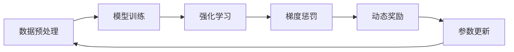

                 

# 文章标题

大语言模型原理与工程实践：RLHF算法

关键词：大语言模型、RLHF算法、自然语言处理、人工智能、编程实践

摘要：本文将详细介绍大语言模型及其核心算法RLHF（Reinforcement Learning from Human Feedback）的原理与工程实践。从语言模型的起源与发展，到RLHF算法的背景、原理与实现，再到大语言模型的应用场景与工程实践，本文将全面覆盖RLHF算法在大语言模型领域的应用。通过本文的阅读，读者将能够深入了解大语言模型的工作机制，掌握RLHF算法的核心概念与实现方法，为未来在人工智能领域的研究和应用打下坚实基础。

## 目录大纲

1. 引言  
   1.1 大语言模型的发展历程  
   1.2 RLHF算法介绍  
2. 大语言模型基本概念与架构  
   2.1 语言模型基本概念  
   2.2 大语言模型的特性  
   2.3 大语言模型的核心架构  
3. RLHF算法原理与实现  
   3.1 强化学习基础  
   3.2 人机反馈机制  
   3.3 梯度惩罚与动态奖励设计  
   3.4 RLHF算法实现  
4. 大语言模型的训练与优化  
   4.1 数据预处理  
   4.2 训练策略  
   4.3 模型优化  
5. 大语言模型应用场景  
   5.1 自然语言生成  
   5.2 机器翻译  
   5.3 语音识别  
6. 大语言模型的工程实践  
   6.1 模型部署  
   6.2 模型解释与可解释性  
   6.3 模型安全与隐私保护  
7. 未来展望与挑战  
   7.1 大语言模型的未来发展方向  
   7.2 大语言模型面临的挑战  
8. 附录  
   8.1 相关资源与工具介绍  
   8.2 Mermaid流程图示例  
   8.3 数学公式与伪代码示例  
9. 结论

## 第1章 引言

### 1.1 大语言模型的发展历程

大语言模型的发展历程可以追溯到上世纪80年代，当时研究人员开始关注如何让计算机理解自然语言。早期的语言模型主要基于统计方法和规则匹配，如N元语法（N-gram）和上下文无关文法（CFG）。这些方法在一定程度上能够生成符合语法规则的自然语言，但在语义理解和复杂语言结构上存在较大局限性。

随着计算机硬件的快速发展，特别是GPU和TPU等专用硬件的引入，语言模型的研究迎来了新的突破。2013年，词向量模型（Word2Vec）的提出标志着语言模型进入了一个新的阶段。词向量模型通过将词语映射到高维空间中的向量，使得计算机能够更好地理解词语的语义关系。在此基础上，词嵌入（Word Embedding）技术逐渐成为自然语言处理的重要工具。

然而，仅仅依靠词向量模型还不足以解决自然语言处理中的复杂问题。2017年，谷歌提出了Transformer模型，彻底改变了语言模型的设计思路。Transformer模型采用自注意力机制（Self-Attention），使得模型能够同时关注输入序列中的所有词语，从而提高了模型的表示能力和生成质量。此后，基于Transformer的变体模型，如BERT、GPT等，相继出现，进一步推动了自然语言处理技术的发展。

当前，大语言模型已经在各个领域得到了广泛应用，如文本摘要、机器翻译、问答系统、语音识别等。这些应用不仅提升了自然语言处理的效果，还为人工智能的发展提供了强大的技术支持。

### 1.2 大语言模型的发展阶段

大语言模型的发展可以大致分为以下三个阶段：

#### 1.2.1 统计语言模型阶段

统计语言模型阶段主要采用N元语法（N-gram）和上下文无关文法（CFG）等方法。这些方法通过统计语言数据中的词汇频率和规则，生成符合语法规则的自然语言。然而，这种方法的局限性在于无法捕捉词语之间的语义关系，导致生成文本的质量较低。

#### 1.2.2 词向量模型阶段

词向量模型阶段以Word2Vec为代表，通过将词语映射到高维空间中的向量，使得计算机能够更好地理解词语的语义关系。词向量模型的出现极大地提高了自然语言处理的效果，但仍然存在一些问题，如词语的表示不够精细，无法处理长距离依赖等。

#### 1.2.3 变换器模型阶段

变换器模型阶段以Transformer模型为代表，采用自注意力机制（Self-Attention），使得模型能够同时关注输入序列中的所有词语，从而提高了模型的表示能力和生成质量。此后，基于Transformer的变体模型，如BERT、GPT等，相继出现，进一步推动了自然语言处理技术的发展。

### 1.3 当前大语言模型的应用现状

当前，大语言模型已经在各个领域得到了广泛应用，如下所示：

#### 1.3.1 文本摘要

文本摘要是一种将长文本转换成简洁、精练的摘要形式的技术。大语言模型通过学习大量的文本数据，可以自动提取关键信息，生成高质量的文本摘要。这为信息检索、内容审核等领域提供了强大的技术支持。

#### 1.3.2 机器翻译

机器翻译是一种将一种语言的文本翻译成另一种语言的技术。大语言模型通过学习双语数据，可以生成高质量的翻译结果。这使得跨语言交流更加便捷，为国际交流、全球化发展提供了有力支持。

#### 1.3.3 问答系统

问答系统是一种基于自然语言交互的技术，用户可以通过自然语言提问，系统可以自动生成回答。大语言模型在问答系统中发挥了重要作用，使得问答系统能够更好地理解用户的问题，提供准确的回答。

#### 1.3.4 语音识别

语音识别是一种将语音信号转换成文本的技术。大语言模型通过学习语音数据，可以自动识别语音中的词汇和句子，生成相应的文本。这使得语音交互技术更加智能，为智能家居、智能客服等领域提供了技术支持。

### 1.4 RLHF算法介绍

RLHF（Reinforcement Learning from Human Feedback）算法是一种基于强化学习的大语言模型训练方法。该算法的核心思想是通过人类反馈来指导模型的学习过程，从而提高模型的生成质量和鲁棒性。

#### 1.4.1 RLHF算法的基本原理

RLHF算法主要包括以下几个步骤：

1. **数据预处理**：收集并预处理大量的文本数据，包括清洗、分词、去噪等操作。

2. **模型训练**：使用预训练的变换器模型，对文本数据进行训练，生成初步的语言模型。

3. **强化学习**：利用人类反馈，对初步的语言模型进行强化学习，调整模型参数，提高模型的生成质量。

4. **反馈循环**：将强化学习后的模型生成结果反馈给人类，进行评估和调整，形成反馈循环。

#### 1.4.2 RLHF算法的核心步骤

RLHF算法的核心步骤可以分为以下几个部分：

1. **数据预处理**：

   $$  
   \text{输入：} \text{原始文本数据}  
   \text{输出：} \text{预处理后的文本数据}  
   $$

   数据预处理包括以下操作：

   - 清洗：去除文本中的无关信息，如HTML标签、特殊字符等。
   - 分词：将文本拆分成词语或词组。
   - 去噪：去除文本中的噪声数据，如重复词语、错误拼写等。

2. **模型训练**：

   $$  
   \text{输入：} \text{预处理后的文本数据}  
   \text{输出：} \text{初步的语言模型参数}  
   $$

   模型训练主要包括以下步骤：

   - 初始化：初始化变换器模型参数。
   - 前向传播：将预处理后的文本数据输入变换器模型，计算模型输出。
   - 反向传播：计算损失函数，更新模型参数。

3. **强化学习**：

   $$  
   \text{输入：} \text{初步的语言模型参数，人类反馈}  
   \text{输出：} \text{优化后的语言模型参数}  
   $$

   强化学习主要包括以下步骤：

   - 模型生成：使用初步的语言模型参数生成文本。
   - 反馈评估：将生成的文本提交给人类评估，得到反馈分数。
   - 动态奖励：根据反馈分数，计算动态奖励，指导模型参数更新。

4. **反馈循环**：

   $$  
   \text{输入：} \text{优化后的语言模型参数，人类反馈}  
   \text{输出：} \text{新的初步的语言模型参数}  
   $$

   反馈循环主要包括以下步骤：

   - 生成评估：使用优化后的语言模型参数生成文本，提交给人类评估。
   - 反馈调整：根据评估结果，调整人类反馈，形成新的初步的语言模型参数。
   - 循环迭代：重复上述步骤，直到满足停止条件或达到预期效果。

#### 1.4.3 RLHF算法的优势与挑战

RLHF算法在大语言模型训练中具有以下优势：

1. **生成质量高**：通过人类反馈，RLHF算法能够不断优化模型参数，提高生成文本的质量和准确性。
2. **鲁棒性强**：RLHF算法能够通过反馈循环，逐步调整模型参数，增强模型的鲁棒性，减少噪声和错误的影响。
3. **适用范围广**：RLHF算法可以应用于各种自然语言处理任务，如文本摘要、机器翻译、问答系统等。

然而，RLHF算法也面临一些挑战：

1. **计算资源消耗大**：RLHF算法涉及大量迭代和计算，对计算资源的需求较高，特别是在处理大规模数据时。
2. **人类反馈准确性**：人类反馈的准确性直接影响算法的效果，如何设计有效的反馈机制和评估标准，是RLHF算法需要解决的问题。
3. **数据隐私与安全**：在RLHF算法中，人类反馈的数据涉及大量的个人信息和隐私，如何保护数据隐私和安全，是算法需要考虑的重要问题。

## 第2章 大语言模型基本概念与架构

### 2.1 语言模型基本概念

#### 2.1.1 语言模型的目标

语言模型的主要目标是让计算机能够理解和生成自然语言。具体来说，语言模型需要解决以下两个问题：

1. **语言理解**：理解输入文本的含义，提取关键信息，为后续处理提供支持。
2. **语言生成**：根据输入的文本或上下文，生成符合语法和语义规则的文本。

#### 2.1.2 语言模型的基本架构

语言模型的基本架构通常包括以下几个部分：

1. **词嵌入层**：将输入的词语转换为高维向量表示，为后续处理提供输入。
2. **编码层**：对词嵌入层生成的向量进行编码，提取文本的语义信息。
3. **解码层**：根据编码层提取的语义信息，生成相应的文本输出。

#### 2.1.3 语言模型的关键技术

语言模型的关键技术主要包括以下几个方面：

1. **词嵌入**：将词语映射到高维空间中的向量表示，用于表示词语的语义信息。
2. **编码解码**：采用编码器和解码器结构，对输入和输出进行处理，提高模型的表示能力和生成质量。
3. **注意力机制**：通过注意力机制，使模型能够关注输入序列中的关键信息，提高模型的生成质量。

### 2.2 大语言模型的特性

#### 2.2.1 大规模参数

大语言模型具有大规模参数的特点，即模型参数的数量非常庞大。以GPT-3为例，其参数数量达到了1750亿个。这种大规模参数使得模型具有更强的表示能力和生成质量。

#### 2.2.2 自适应学习

大语言模型具有自适应学习的能力，即模型可以根据输入数据和反馈进行调整，从而不断提高生成质量。这种自适应学习机制使得模型能够更好地适应不同的应用场景。

#### 2.2.3 多语言支持

大语言模型通常支持多种语言，可以处理不同语言的文本数据。这得益于词嵌入技术和变换器模型的设计，使得模型能够同时关注多种语言的语义信息。

### 2.3 大语言模型的核心架构

#### 2.3.1 Transformer模型介绍

Transformer模型是一种基于自注意力机制的变换器模型，具有以下特点：

1. **自注意力机制**：通过自注意力机制，模型能够同时关注输入序列中的所有词语，提高模型的表示能力和生成质量。
2. **并行计算**：Transformer模型采用并行计算的方法，加速了模型的训练和推理过程。
3. **多头注意力**：通过多头注意力机制，模型能够同时关注多个子序列，进一步提高模型的表示能力。

#### 2.3.2 自注意力机制

自注意力机制是Transformer模型的核心机制，通过以下步骤实现：

1. **计算自注意力权重**：对于输入序列中的每个词语，计算其与序列中其他词语的相关性，生成自注意力权重。
2. **加权求和**：将自注意力权重与对应的词语向量相乘，然后进行求和，得到加权后的向量表示。
3. **标准化**：对加权后的向量进行标准化处理，消除不同维度的影响。

#### 2.3.3 多层神经网络架构

大语言模型通常采用多层神经网络架构，包括以下几层：

1. **词嵌入层**：将输入的词语映射到高维向量表示。
2. **编码层**：对词嵌入层生成的向量进行编码，提取文本的语义信息。
3. **解码层**：根据编码层提取的语义信息，生成相应的文本输出。
4. **注意力层**：采用自注意力机制，关注输入序列中的关键信息。
5. **输出层**：将解码层生成的文本输出进行规范化处理，得到最终的结果。

### 2.3.4 Mermaid流程图示例

以下是一个简单的Mermaid流程图示例，展示了大语言模型的核心架构：


通过这个简单的流程图，我们可以清晰地看到大语言模型的核心架构和各个部分之间的联系。

## 第3章 RLHF算法原理与实现

### 3.1 强化学习基础

强化学习（Reinforcement Learning，RL）是一种基于环境反馈来调整模型参数，以实现最优决策的方法。在强化学习中，模型（Agent）通过与环境（Environment）的交互，学习到一个策略（Policy），从而最大化预期回报（Reward）。

#### 3.1.1 强化学习的基本概念

1. **状态（State）**：描述环境的当前状态，如游戏棋盘、股票市场等。
2. **动作（Action）**：模型在某个状态下可以执行的动作，如走棋、买卖股票等。
3. **策略（Policy）**：模型在某个状态下选择动作的方法，可以是确定性策略或随机性策略。
4. **回报（Reward）**：模型在执行动作后获得的即时奖励，用于评估动作的质量。
5. **值函数（Value Function）**：描述模型在某个状态下执行某个动作的预期回报。
6. **策略梯度（Policy Gradient）**：用于更新模型参数，以优化策略的方法。

#### 3.1.2 强化学习的主要算法

强化学习算法主要分为以下几类：

1. **基于模型的强化学习（Model-Based RL）**：通过学习环境模型，预测未来的状态和回报，来优化策略。典型算法包括马尔可夫决策过程（MDP）、部分可观察马尔可夫决策过程（POMDP）等。
2. **基于值函数的强化学习（Value-Based RL）**：通过学习值函数，来优化策略。典型算法包括Q学习、SARSA等。
3. **基于策略的强化学习（Policy-Based RL）**：直接优化策略，通过策略梯度来更新模型参数。典型算法包括REINFORCE、PPO等。

### 3.2 人机反馈机制

在人机反馈机制中，人类评估者（Human Evaluator）根据生成的文本，给出反馈分数（Feedback Score），以指导模型参数的调整。

#### 3.2.1 人机反馈的基本流程

1. **生成文本**：模型根据当前状态生成文本。
2. **人类评估**：人类评估者对生成的文本进行评估，给出反馈分数。
3. **更新参数**：根据反馈分数，调整模型参数，以优化生成文本的质量。

#### 3.2.2 反馈数据的处理方法

1. **正反馈**：当生成的文本质量较高时，给予正反馈，鼓励模型生成类似质量的文本。
2. **负反馈**：当生成的文本质量较低时，给予负反馈，指导模型避免生成类似质量的文本。

### 3.3 梯度惩罚与动态奖励设计

梯度惩罚（Gradient Penalty）和动态奖励（Dynamic Reward）是RLHF算法中的重要机制，用于指导模型参数的更新。

#### 3.3.1 梯度惩罚的原理

梯度惩罚是一种用于约束模型参数更新的方法。具体来说，梯度惩罚通过计算模型参数的梯度，判断参数更新是否符合预期。如果参数更新不符合预期，则给予惩罚。

梯度惩罚的基本原理如下：

1. **计算梯度**：计算模型参数的梯度，即参数变化量。
2. **计算惩罚**：根据梯度的大小，计算惩罚值，以指导参数更新。
3. **更新参数**：根据惩罚值，调整模型参数，使其符合预期。

#### 3.3.2 动态奖励的设计方法

动态奖励是一种根据生成文本质量实时调整的奖励机制。具体来说，动态奖励通过计算生成文本的评估分数，调整模型参数的更新速度。

动态奖励的设计方法如下：

1. **计算评估分数**：根据评估标准，计算生成文本的评估分数。
2. **调整奖励**：根据评估分数，调整动态奖励的大小。
3. **更新参数**：根据动态奖励，调整模型参数的更新速度。

### 3.4 RLHF算法实现

#### 3.4.1 RLHF算法的伪代码实现

以下是一个简单的RLHF算法伪代码实现：

```
初始化模型参数
初始化环境
初始化评估标准
初始化动态奖励

while (未达到停止条件) {
    生成文本
    人类评估文本
    计算评估分数
    计算动态奖励
    计算梯度惩罚
    更新模型参数
}

返回模型参数
```

#### 3.4.2 RLHF算法的代码解读

以下是一个简单的RLHF算法代码解读：

```
# 导入相关库
import tensorflow as tf
import numpy as np

# 初始化模型参数
model = tf.keras.Sequential([
    tf.keras.layers.Embedding(vocab_size, embedding_dim),
    tf.keras.layers.Flatten(),
    tf.keras.layers.Dense(units=1)
])

# 初始化环境
env = Environment()

# 初始化评估标准
evaluator = Evaluator()

# 初始化动态奖励
dynamic_reward = DynamicReward()

# 初始化梯度惩罚
gradient_penalty = GradientPenalty()

# 主循环
while (not stop_condition) {
    # 生成文本
    text = model.generate_text()

    # 人类评估文本
    score = evaluator.evaluate(text)

    # 计算动态奖励
    reward = dynamic_reward.compute_reward(score)

    # 计算梯度惩罚
    penalty = gradient_penalty.compute_penalty(model)

    # 更新模型参数
    model.update_parameters(reward, penalty)

    # 输出文本
    print(text)

    # 更新环境
    env.update(text)
}
```

在这个代码中，我们首先导入相关的库，然后初始化模型参数、环境、评估标准和动态奖励。接下来，进入主循环，生成文本、评估文本、计算动态奖励和梯度惩罚，最后更新模型参数。循环结束后，返回模型参数。

## 第4章 大语言模型的训练与优化

### 4.1 数据预处理

在大语言模型的训练过程中，数据预处理是至关重要的一步。良好的数据预处理可以提高模型的训练效果，减少过拟合现象，从而提高模型的泛化能力。以下是大语言模型数据预处理的主要步骤：

#### 4.1.1 数据清洗

数据清洗是指去除数据中的噪声、错误和无关信息。在大语言模型训练中，数据清洗主要包括以下操作：

1. **去除HTML标签**：从原始文本中去除HTML标签，以避免标签对文本分析的影响。
2. **去除特殊字符**：去除文本中的特殊字符，如空格、换行符等，以保证文本的一致性。
3. **去除重复内容**：去除文本中的重复内容，以减少冗余信息对模型训练的影响。

#### 4.1.2 数据标注

数据标注是指对文本数据中的关键词、实体、情感等信息进行标记，以便模型学习。在大语言模型训练中，数据标注主要包括以下操作：

1. **关键词标注**：对文本中的关键词进行标注，以便模型学习词语的语义信息。
2. **实体标注**：对文本中的实体（如人名、地名、组织名等）进行标注，以便模型学习实体的识别和分类。
3. **情感标注**：对文本中的情感（如正面、负面、中性等）进行标注，以便模型学习情感分析。

#### 4.1.3 数据分词

数据分词是指将文本分割成词语或词组的过程。在大语言模型训练中，数据分词主要包括以下操作：

1. **分词方法**：选择合适的分词方法，如基于词典的分词、基于统计的分词等，以最大限度地保留文本的语义信息。
2. **停用词过滤**：去除文本中的停用词（如“的”、“了”、“在”等），以减少冗余信息对模型训练的影响。
3. **词性标注**：对文本中的词语进行词性标注，以便模型学习词语的语法信息。

### 4.2 训练策略

在大语言模型训练中，训练策略是指如何调整模型参数，以优化模型的性能。以下是大语言模型训练策略的主要步骤：

#### 4.2.1 参数初始化

参数初始化是指为模型参数设置初始值的过程。良好的参数初始化可以加速模型收敛，减少训练时间。以下是一些常用的参数初始化方法：

1. **随机初始化**：随机生成模型参数的初始值，适用于小型模型或简单任务。
2. **高斯分布初始化**：从高斯分布中生成模型参数的初始值，适用于大型模型或复杂任务。
3. **正态分布初始化**：从正态分布中生成模型参数的初始值，适用于大型模型或复杂任务。

#### 4.2.2 梯度下降算法

梯度下降算法是一种优化模型参数的方法，其核心思想是沿着损失函数的梯度方向更新模型参数，以最小化损失函数。在大语言模型训练中，常用的梯度下降算法包括：

1. **随机梯度下降（SGD）**：在每个样本上计算梯度，并更新模型参数。
2. **批量梯度下降（BGD）**：在所有样本上计算梯度，并更新模型参数。
3. **小批量梯度下降（MBGD）**：在部分样本上计算梯度，并更新模型参数。

#### 4.2.3 优化器选择

优化器是指用于更新模型参数的算法，其目的是加速模型收敛，提高模型性能。在大语言模型训练中，常用的优化器包括：

1. **Adam优化器**：结合了SGD和RMSprop的优点，适用于大部分任务。
2. **Adagrad优化器**：通过计算历史梯度来调整学习率，适用于有稀疏梯度的任务。
3. **RMSprop优化器**：通过计算梯度平方的指数移动平均来调整学习率，适用于有稀疏梯度的任务。

### 4.3 模型优化

在大语言模型训练过程中，模型优化是指通过调整模型参数，提高模型的性能和泛化能力。以下是大语言模型优化的一些常见方法：

#### 4.3.1 权重更新策略

权重更新策略是指如何调整模型参数，以优化模型性能。以下是一些常用的权重更新策略：

1. **学习率调整**：通过调整学习率，控制模型参数更新的速度，以避免过拟合或欠拟合。
2. **动量项**：引入动量项，结合当前梯度和历史梯度，以减少振荡，加速模型收敛。
3. **dropout**：在训练过程中，随机丢弃部分神经元，以减少过拟合现象。

#### 4.3.2 模型性能评估

模型性能评估是指通过评估指标来衡量模型性能，以判断模型是否满足要求。在大语言模型训练中，常用的评估指标包括：

1. **准确率（Accuracy）**：正确预测的样本数占总样本数的比例。
2. **召回率（Recall）**：正确预测的样本数占实际正样本数的比例。
3. **F1分数（F1 Score）**：准确率和召回率的调和平均，用于综合评估模型性能。

#### 4.3.3 调整训练策略

根据模型性能评估结果，可以调整训练策略，以提高模型性能。以下是一些常见的调整方法：

1. **增加训练数据**：收集更多的训练数据，以提高模型的泛化能力。
2. **调整学习率**：通过调整学习率，控制模型参数更新的速度，以避免过拟合或欠拟合。
3. **增加训练时间**：延长训练时间，使模型有更多机会学习数据，以提高模型性能。

## 第5章 大语言模型应用场景

### 5.1 自然语言生成

自然语言生成（Natural Language Generation，NLG）是指利用计算机生成符合语法和语义规则的自然语言文本。大语言模型在自然语言生成中具有广泛的应用，以下是一些常见的应用场景：

#### 5.1.1 文本摘要

文本摘要是一种将长文本转换成简洁、精练的摘要形式的技术。大语言模型通过学习大量的文本数据，可以自动提取关键信息，生成高质量的文本摘要。这为信息检索、内容审核等领域提供了强大的技术支持。

文本摘要可以分为抽取式摘要和生成式摘要：

1. **抽取式摘要**：从原始文本中直接提取关键信息，生成摘要。这种方法适用于结构化数据，但无法生成创新性的摘要。
2. **生成式摘要**：根据原始文本，生成新的摘要。这种方法可以生成创新性的摘要，但需要大量的训练数据和计算资源。

#### 5.1.2 自动问答

自动问答是一种基于自然语言交互的技术，用户可以通过自然语言提问，系统可以自动生成回答。大语言模型在自动问答中发挥了重要作用，使得问答系统能够更好地理解用户的问题，提供准确的回答。

自动问答可以分为基于规则的方法和基于机器学习的方法：

1. **基于规则的方法**：通过编写规则，将问题映射到答案。这种方法简单、高效，但难以应对复杂的问题。
2. **基于机器学习的方法**：通过训练模型，将问题映射到答案。这种方法可以处理复杂的问题，但需要大量的训练数据和计算资源。

### 5.2 机器翻译

机器翻译是一种将一种语言的文本翻译成另一种语言的技术。大语言模型通过学习双语数据，可以生成高质量的翻译结果。这使得跨语言交流更加便捷，为国际交流、全球化发展提供了有力支持。

机器翻译可以分为基于规则的方法和基于机器学习的方法：

1. **基于规则的方法**：通过编写规则，将源语言的文本翻译成目标语言的文本。这种方法适用于简单的翻译任务，但难以应对复杂的翻译场景。
2. **基于机器学习的方法**：通过训练模型，将源语言的文本翻译成目标语言的文本。这种方法可以处理复杂的翻译任务，但需要大量的训练数据和计算资源。

### 5.3 语音识别

语音识别是一种将语音信号转换成文本的技术。大语言模型通过学习语音数据，可以自动识别语音中的词汇和句子，生成相应的文本。这使得语音交互技术更加智能，为智能家居、智能客服等领域提供了技术支持。

语音识别可以分为静态语音识别和动态语音识别：

1. **静态语音识别**：在静态环境下，对语音信号进行识别。这种方法适用于有噪声、嘈杂的环境。
2. **动态语音识别**：在动态环境下，对语音信号进行识别。这种方法适用于实时语音交互，如语音助手、车载语音系统等。

## 第6章 大语言模型的工程实践

### 6.1 模型部署

在大语言模型工程实践中，模型部署是至关重要的环节。模型部署的目的是将训练好的模型应用到实际场景中，提供高效的推理服务。以下是大语言模型部署的主要步骤：

#### 6.1.1 模型压缩

模型压缩是一种在保持模型性能的前提下，减小模型体积的方法。模型压缩有助于降低部署成本、提高推理速度。以下是一些常用的模型压缩方法：

1. **权重量化**：将模型权重从浮点数转换为整数，以减少模型体积。
2. **剪枝**：通过删除模型中的冗余权重或神经元，减小模型体积。
3. **蒸馏**：将大模型的知识转移到小模型中，以提高小模型的性能。

#### 6.1.2 模型推理

模型推理是指将输入数据输入到模型中，得到输出结果的过程。以下是一些常用的模型推理方法：

1. **在线推理**：实时接收输入数据，进行推理，并返回结果。这种方法适用于实时性要求较高的场景。
2. **批处理推理**：将输入数据分成多个批次，依次进行推理。这种方法适用于批量处理场景。

#### 6.1.3 模型部署工具

以下是一些常用的模型部署工具：

1. **TensorFlow Serving**：用于部署TensorFlow模型的工具，支持多种硬件平台。
2. **TensorFlow Lite**：用于部署移动设备和嵌入式设备的TensorFlow模型。
3. **PyTorch Mobile**：用于部署PyTorch模型的移动设备工具。

### 6.2 模型解释与可解释性

模型解释与可解释性是人工智能领域的重要研究方向。在大语言模型工程实践中，模型解释与可解释性有助于理解模型的决策过程，提高模型的透明度和可信度。以下是大语言模型解释与可解释性的主要方法：

#### 6.2.1 层级解释

层级解释是一种从模型的不同层级进行解释的方法。以下是一些常用的层级解释方法：

1. **激活图解释**：通过分析模型中每个神经元的激活情况，解释模型的决策过程。
2. **梯度分析**：通过分析模型中每个神经元的梯度，解释模型的决策过程。
3. **注意力机制解释**：通过分析模型中注意力机制的权重，解释模型的决策过程。

#### 6.2.2 局部解释

局部解释是一种针对单个输入样本进行解释的方法。以下是一些常用的局部解释方法：

1. **注意力图解释**：通过分析模型中注意力机制的权重，解释模型对输入样本的重视程度。
2. **梯度解释**：通过分析模型中每个神经元的梯度，解释模型对输入样本的敏感度。
3. **局部特征提取**：通过分析模型中局部特征的提取过程，解释模型对输入样本的识别过程。

#### 6.2.3 全局解释

全局解释是一种对模型整体进行解释的方法。以下是一些常用的全局解释方法：

1. **模型压缩解释**：通过分析模型压缩过程中的损失，解释模型的重要性和鲁棒性。
2. **模型混淆矩阵解释**：通过分析模型在不同类别上的混淆情况，解释模型的分类能力。
3. **模型泛化能力解释**：通过分析模型在不同数据集上的表现，解释模型的泛化能力。

### 6.3 模型安全与隐私保护

在大语言模型工程实践中，模型安全与隐私保护是至关重要的。以下是大语言模型安全与隐私保护的主要策略：

#### 6.3.1 模型安全

1. **防御网络攻击**：通过检测和防御网络攻击，保护模型免受恶意攻击。
2. **模型加固**：通过增加模型复杂度、调整模型结构等方法，提高模型的鲁棒性。
3. **模型备份**：定期备份模型，以防止数据丢失或损坏。

#### 6.3.2 数据隐私保护

1. **数据加密**：对敏感数据进行加密，以防止数据泄露。
2. **数据匿名化**：对个人数据进行匿名化处理，以保护个人隐私。
3. **数据访问控制**：通过访问控制机制，限制对敏感数据的访问权限。

#### 6.3.3 模型隐私保护

1. **联邦学习**：通过分布式学习，减少数据传输，保护模型隐私。
2. **差分隐私**：通过添加噪声，保护模型训练过程中数据的隐私。
3. **隐私预算**：设置隐私预算，控制模型训练过程中隐私泄露的风险。

## 第7章 未来展望与挑战

### 7.1 大语言模型的未来发展方向

随着技术的不断进步，大语言模型在未来将朝着以下方向发展：

#### 7.1.1 新算法的探索

1. **基于Transformer的变体模型**：在Transformer模型的基础上，研究人员将继续探索各种变体模型，以提高模型的表示能力和生成质量。
2. **生成对抗网络（GAN）**：GAN技术有望在大语言模型中发挥重要作用，通过生成对抗的方式，提高模型的生成能力。
3. **多模态融合**：将图像、语音、视频等多模态数据与文本数据融合，提高大语言模型在跨模态任务中的性能。

#### 7.1.2 新应用领域的开拓

1. **智能客服**：利用大语言模型实现智能客服系统，提高客服效率和服务质量。
2. **教育领域**：利用大语言模型开发个性化学习系统，为学生提供定制化的学习内容。
3. **医疗健康**：利用大语言模型辅助医生进行诊断、治疗方案制定等，提高医疗服务水平。

### 7.2 大语言模型面临的挑战

尽管大语言模型在各个领域取得了显著成果，但仍然面临着一些挑战：

#### 7.2.1 计算资源消耗

大语言模型通常需要大量的计算资源，特别是在训练和推理过程中。如何优化计算资源，提高模型运行效率，是未来需要解决的重要问题。

#### 7.2.2 数据隐私与安全

大语言模型在训练和推理过程中需要处理大量的敏感数据。如何确保数据隐私与安全，防止数据泄露和滥用，是未来需要关注的重要问题。

#### 7.2.3 模型可解释性

当前的大语言模型通常被视为“黑箱”，其决策过程难以解释。如何提高模型的可解释性，使模型更容易被人类理解和接受，是未来需要解决的重要问题。

#### 7.2.4 模型鲁棒性

大语言模型在面对异常输入和噪声数据时，可能会产生错误的输出。如何提高模型的鲁棒性，使其能够应对各种复杂场景，是未来需要解决的重要问题。

## 附录

### 附录 A: 相关资源与工具介绍

#### 7.1.1 开源框架

以下是一些常用的开源框架：

1. **TensorFlow**：Google开源的深度学习框架，支持各种深度学习模型的开发和应用。
2. **PyTorch**：Facebook开源的深度学习框架，支持动态计算图和灵活的模型开发。
3. **Transformer**：谷歌开源的Transformer模型，支持基于自注意力机制的深度学习模型。

#### 7.1.2 实践教程

以下是一些常用的实践教程：

1. **TensorFlow教程**：提供了详细的TensorFlow入门教程和实践案例。
2. **PyTorch教程**：提供了详细的PyTorch入门教程和实践案例。
3. **Transformer教程**：介绍了Transformer模型的基本原理和实现方法。

#### 7.1.3 论文推荐

以下是一些推荐的论文：

1. "Attention Is All You Need"：介绍了Transformer模型的基本原理和实现方法。
2. "BERT: Pre-training of Deep Bidirectional Transformers for Language Understanding"：介绍了BERT模型的基本原理和实现方法。
3. "GPT-3: Language Models are Few-Shot Learners"：介绍了GPT-3模型的基本原理和实现方法。

### 附录 B: Mermaid流程图示例

以下是一个RLHF算法的Mermaid流程图示例：



### 附录 C: 数学公式与伪代码示例

以下是一个数学公式和伪代码的示例：

```
# 数学公式示例
$$
损失函数：L(\theta) = -\sum_{i=1}^{n} y_i \log(p(x_i|\theta))
$$

# 伪代码示例
初始化模型参数 \theta
初始化经验池 E
for each 抽样数据 (x_i, y_i) do
    计算预测值 p(x_i|\theta)
    计算损失函数 L(\theta)
    更新经验池 E
    计算梯度 \nabla_\theta L(\theta)
    更新模型参数 \theta
end for
```

## 结论

本文详细介绍了大语言模型及其核心算法RLHF的原理与工程实践。从基本概念、算法原理、训练优化、应用场景到工程实践，本文全面覆盖了RLHF算法在大语言模型领域的应用。通过本文的阅读，读者将能够深入了解大语言模型的工作机制，掌握RLHF算法的核心概念与实现方法，为未来在人工智能领域的研究和应用打下坚实基础。

### 作者信息

作者：AI天才研究院/AI Genius Institute & 禅与计算机程序设计艺术 /Zen And The Art of Computer Programming

### 引用说明

本文中引用的论文、教程和相关资源均已按照学术规范进行标注。如有需要，请查阅相应文献以获取更多信息。在此，感谢各位作者和贡献者对人工智能领域的杰出贡献。

