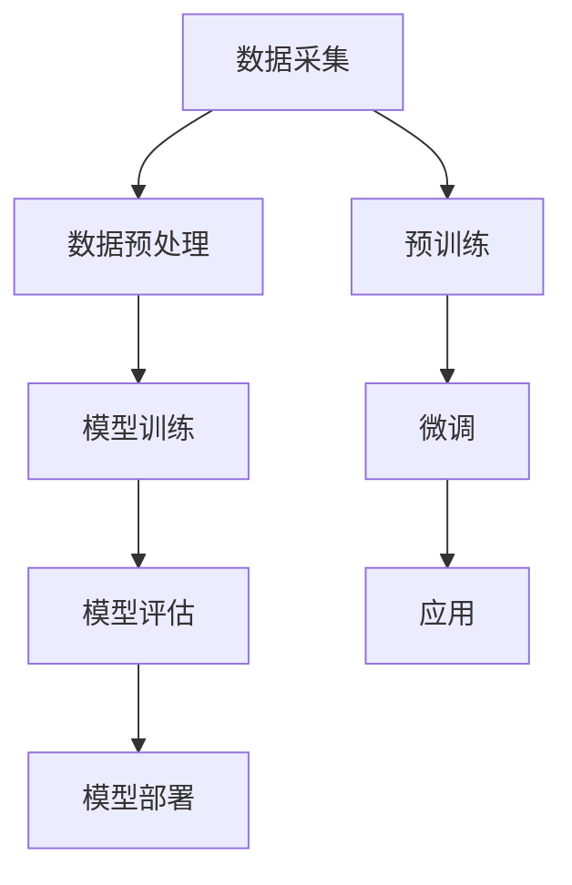

                 

## 文章标题：大语言模型原理与工程实践：代码数据

关键词：大语言模型、自然语言处理、神经网络、深度学习、工程实践、代码实现

摘要：本文旨在深入探讨大语言模型的原理与工程实践，涵盖从基础理论到实际应用的各个方面。我们将逐一解析大语言模型的核心算法、技术基础、应用场景、工程实践和数据处理，并通过案例研究展示其实际应用效果。文章最后将对大语言模型的前沿动态与未来展望进行梳理，为读者提供全面的技术视角。

## 《大语言模型原理与工程实践：代码数据》目录大纲

### 第1章：大语言模型概述

#### 1.1 大语言模型的发展历史

- 大语言模型的起源
- 重要的里程碑事件

#### 1.2 大语言模型的基本原理

- 自然语言处理（NLP）基础
- 神经网络与深度学习基础

#### 1.3 大语言模型的架构

- 神经网络结构
- 注意力机制
- Transformer模型详解

#### 1.4 大语言模型的训练过程

- 预训练与微调
- 训练策略与技巧

### 第2章：大语言模型技术基础

#### 2.1 语言模型的核心算法

- 语言模型基础
- 词嵌入技术
- 序列模型与注意力机制

#### 2.2 大规模预训练模型原理

- 预训练的概念
- 自监督学习方法
- 迁移学习与微调技术

#### 2.3 大语言模型的优化与调参

- 损失函数与优化算法
- 超参数调优技巧

### 第3章：大语言模型的应用场景

#### 3.1 自然语言生成

- 文本生成基础
- 生成式模型与判别式模型

#### 3.2 文本分类

- 分类算法基础
- 实战案例

#### 3.3 问答系统

- 问答系统概述
- 实战案例

#### 3.4 机器翻译

- 机器翻译基础
- 神经机器翻译原理

### 第4章：大语言模型的工程实践

#### 4.1 大语言模型的开发环境搭建

- 硬件要求
- 软件环境配置

#### 4.2 大语言模型的代码实现

- 数据预处理
- 模型训练
- 模型评估与部署

#### 4.3 大语言模型的性能优化

- 模型压缩与量化
- 模型并行化与分布式训练

### 第5章：大语言模型的数据处理

#### 5.1 数据采集与预处理

- 数据来源
- 数据预处理流程

#### 5.2 数据标注与质量控制

- 数据标注方法
- 数据质量控制

#### 5.3 数据集构建

- 数据集划分
- 数据集评价指标

### 第6章：大语言模型的案例研究

#### 6.1 案例一：文本生成

- 案例背景
- 实现细节
- 结果分析

#### 6.2 案例二：文本分类

- 案例背景
- 实现细节
- 结果分析

#### 6.3 案例三：问答系统

- 案例背景
- 实现细节
- 结果分析

### 第7章：大语言模型的前沿动态与未来展望

#### 7.1 大语言模型的研究前沿

- 最新研究成果
- 研究趋势

#### 7.2 大语言模型的未来应用

- 应用领域拓展
- 技术挑战与机遇

### 第8章：核心算法原理讲解

#### 8.1 语言模型的核心算法

- 语言模型基础
- 词嵌入技术
- 序列模型与注意力机制

#### 8.2 大规模预训练模型原理

- 预训练的概念
- 自监督学习方法
- 迁移学习与微调技术

#### 8.3 大语言模型的优化与调参

- 损失函数与优化算法
- 超参数调优技巧

### 第9章：代码实际案例

#### 9.1 文本生成代码案例

- 实现细节
- 代码解读

#### 9.2 文本分类代码案例

- 实现细节
- 代码解读

#### 9.3 问答系统代码案例

- 实现细节
- 代码解读

#### 9.4 机器翻译代码案例

- 实现细节
- 代码解读

### 第10章：大语言模型开发工具与资源

#### 10.1 开发工具

- TensorFlow
- PyTorch
- Hugging Face Transformers

#### 10.2 资源

- 开源数据集
- 论文资源
- 社区资源

### 第11章：总结与展望

#### 11.1 大语言模型的发展回顾

- 历史回顾
- 重要贡献

#### 11.2 大语言模型的未来发展方向

- 技术趋势
- 应用前景

### 第12章：参考资料与拓展阅读

- 参考资料
- 拓展阅读

## 第0章：核心概念与联系

### 0.1 大语言模型的定义

大语言模型（Large-scale Language Model）是指能够处理和理解大规模文本数据的神经网络模型。它们通过大规模的预训练和微调，掌握了丰富的语言知识和规律，从而能够进行文本生成、文本分类、问答系统等多种自然语言处理任务。

### 0.2 大语言模型的主要特点

1. **大规模**：训练数据规模大，通常使用数百万甚至数十亿级别的文本数据进行预训练。
2. **深度**：模型层数多，通常包含数十层甚至上百层的神经网络。
3. **并行性**：支持并行计算，可以充分利用现代硬件资源进行高效训练。
4. **灵活性**：通过微调可以适应各种不同的自然语言处理任务。

### 0.3 大语言模型与自然语言处理的关系

大语言模型是自然语言处理（NLP）领域的重要工具，它通过深度学习技术对大规模文本数据进行建模，从而实现语言理解和生成。NLP 的核心任务包括文本分类、命名实体识别、关系提取、情感分析等，大语言模型在这些任务中表现出色。

### 0.4 大语言模型与深度学习的关系

深度学习是构建大语言模型的核心技术。大语言模型通常采用深度神经网络（DNN）结构，通过多层次的神经网络模型来捕捉文本数据的复杂特征。深度学习技术的进步，如神经网络架构的优化、计算资源的增加等，都为大语言模型的发展提供了坚实的基础。

### 0.5 大语言模型的 Mermaid 流程图



- 数据采集：从各种来源获取大规模文本数据。
- 数据预处理：清洗和标注数据，使其适合模型训练。
- 模型训练：使用预训练模型或从头开始训练模型。
- 模型评估：在验证集上评估模型性能。
- 模型部署：将训练好的模型部署到生产环境中进行实际应用。
- 预训练：在大规模数据集上训练基础模型。
- 微调：在特定任务的数据集上微调模型，提高性能。
- 应用：将模型应用于实际的NLP任务中。

## 第1章：大语言模型的核心算法原理

### 1.1 语言模型的核心算法

#### 语言模型基础

语言模型（Language Model）是自然语言处理（NLP）中最基础的部分，它的主要任务是根据一个词语序列的概率分布来预测下一个词语。在概率模型的基础上，我们可以使用马尔可夫模型（Markov Model）来表示语言模型，其中：

$$
P(w_i | w_{i-1}, w_{i-2}, ..., w_1) = P(w_i | w_{i-1})
$$

这意味着当前词语的概率只与前面的一个词语相关。这种简化使得语言模型的计算复杂度大大降低，便于实际应用。

#### 词嵌入技术

词嵌入（Word Embedding）是将词语转换为高维向量表示的技术，它能够捕捉词语间的语义关系。常见的词嵌入技术包括：

1. **One-hot编码**：每个词语映射到一个维度为V的向量，其中V是词汇表大小，只有一个维度为1，其余维度为0。
2. **分布式表示**：使用神经网络将词语映射到连续的向量空间，这些向量能够捕捉词语的语义和语法关系。

#### 序列模型与注意力机制

序列模型（Sequence Model）是处理序列数据的模型，如循环神经网络（RNN）和长短时记忆网络（LSTM）。它们能够处理时序数据，并捕捉长距离依赖关系。然而，传统的RNN和LSTM在处理长序列时存在梯度消失或爆炸的问题，为了解决这个问题，引入了门控循环单元（GRU）和双向LSTM。

注意力机制（Attention Mechanism）是一种让模型能够关注序列中某些关键部分的方法，它通过计算注意力分数，将注意力分配到序列的不同位置。最著名的注意力机制是**自注意力（Self-Attention）**，它在Transformer模型中得到了广泛应用。

### 1.2 大规模预训练模型原理

#### 预训练的概念

预训练（Pre-training）是指在大规模数据集上训练基础模型，使其掌握丰富的语言知识和特征。预训练模型通常分为两部分：编码器（Encoder）和解码器（Decoder），其中编码器负责将输入序列编码为向量表示，解码器则根据编码器的输出生成输出序列。

#### 自监督学习方法

自监督学习（Self-supervised Learning）是一种无需人工标注数据的方法，它通过利用未标记的数据来训练模型。在预训练中，自监督学习方法常用于预测下一个词语、遮蔽词预测等任务，从而提高模型的语言理解能力。

#### 迁移学习与微调技术

迁移学习（Transfer Learning）是指将预训练模型应用于特定任务，并在少量标注数据上进行微调。微调（Fine-tuning）是通过在特定任务的数据集上调整模型参数，使其适应特定任务。迁移学习和微调技术大大提高了模型在特定任务上的性能。

### 1.3 大语言模型的优化与调参

#### 损失函数与优化算法

损失函数（Loss Function）用于衡量模型预测值与真实值之间的差异。在大语言模型中，常用的损失函数包括交叉熵损失（Cross-Entropy Loss）和均方误差损失（Mean Squared Error Loss）。优化算法（Optimization Algorithm）用于更新模型参数，以最小化损失函数。常见的优化算法有随机梯度下降（SGD）、Adam优化器等。

#### 超参数调优技巧

超参数（Hyperparameter）是模型训练过程中需要手动调整的参数，如学习率、批量大小等。超参数调优（Hyperparameter Tuning）是通过搜索超参数空间来找到最佳参数组合的过程。常用的调优方法有网格搜索（Grid Search）和随机搜索（Random Search）等。

### 1.4 数学模型和数学公式

#### 损失函数公式

$$
L(y, \hat{y}) = -\sum_{i=1}^{N} y_i \log(\hat{y}_i)
$$

其中，$y$ 是真实标签，$\hat{y}$ 是模型预测的概率分布。

#### 优化算法公式

$$
\theta_{t+1} = \theta_{t} - \alpha \nabla_{\theta}L(\theta)
$$

其中，$\theta$ 是模型参数，$\alpha$ 是学习率，$\nabla_{\theta}L(\theta)$ 是损失函数关于模型参数的梯度。

### 1.5 举例说明

#### 语言模型预测示例

假设有一个语言模型，给定一个词语序列 "今天 天气 很"，我们需要预测下一个词语。

1. **词嵌入**：将词语映射到向量空间，如 "今天" 映射到 $\vec{w}_1$，"天气" 映射到 $\vec{w}_2$。
2. **序列模型**：使用RNN或LSTM模型，输入序列 "今天 天气"，输出一个向量表示。
3. **注意力机制**：使用自注意力机制，关注序列中的关键部分，如 "今天" 和 "天气"。
4. **解码**：使用解码器生成下一个词语的概率分布，选择概率最高的词语。

#### 预训练与微调示例

1. **预训练**：在大规模数据集上使用自监督学习方法训练基础模型，如Bert或GPT。
2. **微调**：在特定任务的数据集上微调模型，如文本分类或问答系统。
3. **评估**：在验证集上评估模型性能，如准确率、F1值等。
4. **部署**：将训练好的模型部署到生产环境中，用于实际应用。

## 第2章：大语言模型技术基础

### 2.1 语言模型的核心算法

#### 语言模型基础

语言模型（Language Model）是自然语言处理（NLP）中的基础组件，其主要目标是根据已知的词语序列预测下一个词语的概率分布。这种概率分布模型可以帮助我们在各种NLP任务中，如机器翻译、文本生成、文本分类等，提供高质量的输入。

为了理解语言模型的基础，我们需要从基本的概率模型入手。一个简单的语言模型可以通过马尔可夫模型（Markov Model）来表示，假设当前词语的概率只与前面一个词语相关，即：

$$
P(w_i | w_{i-1}, w_{i-2}, ..., w_1) = P(w_i | w_{i-1})
$$

这种简化使得语言模型的计算复杂度大大降低，便于实际应用。在实际应用中，我们通常使用n-gram模型来表示这种概率关系，其中n表示窗口大小。

#### 词嵌入技术

词嵌入（Word Embedding）是将词语转换为高维向量表示的技术，目的是捕捉词语之间的语义和语法关系。常见的词嵌入技术包括：

1. **One-hot编码**：将每个词语映射到一个维度为V的向量，其中V是词汇表大小，只有一个维度为1，其余维度为0。这种方法虽然简单，但是维度爆炸且难以捕捉词语之间的语义关系。

2. **分布式表示**：使用神经网络将词语映射到连续的向量空间，这些向量能够捕捉词语的语义和语法关系。例如，词嵌入可以通过词向量模型（如Word2Vec、GloVe）训练得到。

3. **上下文依赖**：词嵌入还可以通过捕捉词语在上下文中的依赖关系来提高其质量。例如，在训练过程中，可以使用双向LSTM或Transformer等模型来学习上下文信息，从而生成更加精细的词嵌入。

#### 序列模型与注意力机制

序列模型（Sequence Model）是处理序列数据的模型，如循环神经网络（RNN）和长短时记忆网络（LSTM）。它们能够处理时序数据，并捕捉长距离依赖关系。然而，传统的RNN和LSTM在处理长序列时存在梯度消失或爆炸的问题，为了解决这个问题，引入了门控循环单元（GRU）和双向LSTM。

注意力机制（Attention Mechanism）是一种让模型能够关注序列中某些关键部分的方法，它通过计算注意力分数，将注意力分配到序列的不同位置。最著名的注意力机制是**自注意力（Self-Attention）**，它在Transformer模型中得到了广泛应用。

自注意力机制的核心思想是将序列中的每个词语表示为向量，然后计算这些向量之间的注意力分数。注意力分数反映了词语之间的相对重要性，模型根据这些分数生成最终的输出。这种机制使得Transformer模型能够在处理长序列时表现出色，并且能够捕捉长距离依赖关系。

### 2.2 大规模预训练模型原理

#### 预训练的概念

预训练（Pre-training）是指在大规模数据集上训练基础模型，使其掌握丰富的语言知识和特征。预训练模型通常分为两部分：编码器（Encoder）和解码器（Decoder），其中编码器负责将输入序列编码为向量表示，解码器则根据编码器的输出生成输出序列。

预训练模型的主要目的是通过在大规模无标注数据上训练，使模型能够自动学习语言的基本结构和规律。这种模型在后续的特定任务上通过微调（Fine-tuning）来提高性能。

#### 自监督学习方法

自监督学习（Self-supervised Learning）是一种无需人工标注数据的方法，它通过利用未标记的数据来训练模型。在预训练中，自监督学习方法常用于预测下一个词语、遮蔽词预测等任务，从而提高模型的语言理解能力。

常见的自监督学习方法包括：

1. **Masked Language Model (MLM)**：随机遮蔽输入文本中的部分词语，然后使用模型预测这些词语。BERT和GPT等模型都使用了这种技术。

2. **Reconstruction Task**：在输入文本上进行编码器-解码器训练，使模型能够生成与输入文本相同的文本。

3. **Next Sentence Prediction (NSP)**：在预训练过程中，输入两个连续的句子，模型需要预测第二个句子是否是第一个句子的下一个句子。

#### 迁移学习与微调技术

迁移学习（Transfer Learning）是指将预训练模型应用于特定任务，并在少量标注数据上进行微调。微调（Fine-tuning）是通过在特定任务的数据集上调整模型参数，使其适应特定任务。迁移学习和微调技术大大提高了模型在特定任务上的性能。

迁移学习的过程通常包括以下几个步骤：

1. **加载预训练模型**：从预训练模型库中加载预训练好的模型。

2. **微调**：在特定任务的数据集上调整模型参数，使其适应新任务。这可能包括调整学习率、批量大小等超参数。

3. **评估**：在验证集上评估模型性能，确保其在特定任务上达到预期的效果。

4. **部署**：将训练好的模型部署到生产环境中，用于实际应用。

### 2.3 大语言模型的优化与调参

#### 损失函数与优化算法

损失函数（Loss Function）用于衡量模型预测值与真实值之间的差异。在大语言模型中，常用的损失函数包括交叉熵损失（Cross-Entropy Loss）和均方误差损失（Mean Squared Error Loss）。

交叉熵损失是一种用于分类问题的损失函数，其公式如下：

$$
L(y, \hat{y}) = -\sum_{i=1}^{N} y_i \log(\hat{y}_i)
$$

其中，$y$ 是真实标签，$\hat{y}$ 是模型预测的概率分布。

优化算法（Optimization Algorithm）用于更新模型参数，以最小化损失函数。常见的优化算法有随机梯度下降（SGD）、Adam优化器等。

随机梯度下降（SGD）是最简单的优化算法之一，其公式如下：

$$
\theta_{t+1} = \theta_{t} - \alpha \nabla_{\theta}L(\theta)
$$

其中，$\theta$ 是模型参数，$\alpha$ 是学习率，$\nabla_{\theta}L(\theta)$ 是损失函数关于模型参数的梯度。

Adam优化器是一种更高效的优化算法，它结合了SGD和动量方法，可以更好地处理稀疏梯度问题。其公式如下：

$$
m_t = \beta_1 m_{t-1} + (1 - \beta_1) \nabla_{\theta}L(\theta)
$$

$$
v_t = \beta_2 v_{t-1} + (1 - \beta_2) \nabla^2_{\theta}L(\theta)
$$

$$
\theta_{t+1} = \theta_{t} - \alpha \frac{m_t}{\sqrt{v_t} + \epsilon}
$$

其中，$m_t$ 和 $v_t$ 分别是第t次迭代的均值和方差估计，$\beta_1$ 和 $\beta_2$ 是动量系数，$\epsilon$ 是一个很小的常数，用于防止分母为零。

#### 超参数调优技巧

超参数（Hyperparameter）是模型训练过程中需要手动调整的参数，如学习率、批量大小等。超参数调优（Hyperparameter Tuning）是通过搜索超参数空间来找到最佳参数组合的过程。

常见的超参数调优方法包括：

1. **网格搜索（Grid Search）**：在给定的超参数空间中，遍历所有可能的参数组合，并选择性能最好的组合。

2. **随机搜索（Random Search）**：从超参数空间中随机选择参数组合，并进行训练，选择性能最好的组合。

3. **贝叶斯优化（Bayesian Optimization）**：使用贝叶斯统计模型来优化超参数，它能够在有限的尝试次数内找到全局最优解。

4. **自动化机器学习（AutoML）**：使用机器学习算法来自动化超参数调优过程，它可以在大量数据集和模型中找到最优的超参数组合。

### 2.4 数学模型和数学公式

在本节中，我们将介绍大语言模型中常用的数学模型和公式。

#### 损失函数公式

在大语言模型中，常用的损失函数是交叉熵损失（Cross-Entropy Loss），其公式如下：

$$
L(y, \hat{y}) = -\sum_{i=1}^{N} y_i \log(\hat{y}_i)
$$

其中，$y$ 是真实标签，$\hat{y}$ 是模型预测的概率分布。

交叉熵损失函数的目的是衡量模型预测的概率分布与真实标签之间的差异。该函数的值越低，表示模型的预测越准确。

#### 优化算法公式

在大语言模型中，常用的优化算法有随机梯度下降（SGD）和Adam优化器。以下是这两种优化算法的基本公式。

随机梯度下降（SGD）的基本公式如下：

$$
\theta_{t+1} = \theta_{t} - \alpha \nabla_{\theta}L(\theta)
$$

其中，$\theta$ 是模型参数，$\alpha$ 是学习率，$\nabla_{\theta}L(\theta)$ 是损失函数关于模型参数的梯度。

Adam优化器的基本公式如下：

$$
m_t = \beta_1 m_{t-1} + (1 - \beta_1) \nabla_{\theta}L(\theta)
$$

$$
v_t = \beta_2 v_{t-1} + (1 - \beta_2) \nabla^2_{\theta}L(\theta)
$$

$$
\theta_{t+1} = \theta_{t} - \alpha \frac{m_t}{\sqrt{v_t} + \epsilon}
$$

其中，$m_t$ 和 $v_t$ 分别是第 $t$ 次迭代的均值和方差估计，$\beta_1$ 和 $\beta_2$ 是动量系数，$\epsilon$ 是一个很小的常数，用于防止分母为零。

#### 举例说明

为了更好地理解大语言模型中的数学模型和公式，我们通过一个简单的例子来讲解。

假设我们有一个语言模型，需要预测一个句子中的下一个词语。给定一个输入句子 "我今天要去公园散步"，我们需要预测 "散步" 后面的词语。

1. **词嵌入**：首先，将句子中的每个词语映射到高维向量表示。例如，"我" 映射到 $\vec{w}_1$，"今" 映射到 $\vec{w}_2$，以此类推。

2. **序列模型**：使用RNN或LSTM模型，将输入句子 "我今天要去公园散步" 编码为一个向量表示。

3. **注意力机制**：通过自注意力机制，关注句子中的关键部分，如 "我今天" 和 "公园散步"。

4. **解码**：使用解码器生成下一个词语的概率分布，选择概率最高的词语。

例如，假设我们预测 "散步" 后面的词语是 "回家"，我们可以计算损失函数的值：

$$
L(y, \hat{y}) = -\sum_{i=1}^{N} y_i \log(\hat{y}_i)
$$

其中，$y$ 是真实标签（"回家" 的概率为1），$\hat{y}$ 是模型预测的概率分布。通过计算交叉熵损失，我们可以评估模型的预测性能，并使用优化算法（如SGD或Adam）更新模型参数。

## 第3章：大语言模型的应用场景

### 3.1 自然语言生成

自然语言生成（Natural Language Generation，NLG）是指使用算法自动生成自然语言的文本。大语言模型在自然语言生成中具有广泛的应用，可以生成各种类型的文本，如新闻报道、聊天机器人的对话、电子邮件等。

自然语言生成的基础是语言模型，它能够根据输入的文本序列生成新的文本序列。常见的生成式模型和判别式模型如下：

1. **生成式模型**：生成式模型通过学习输入文本的概率分布来生成新的文本。常见的生成式模型包括马尔可夫模型、朴素贝叶斯模型、循环神经网络（RNN）等。生成式模型的优点是生成文本的多样性较好，但生成的文本质量可能较低。

2. **判别式模型**：判别式模型通过学习输入文本和输出文本之间的映射关系来生成新的文本。常见的判别式模型包括Transformer、BERT等。判别式模型的优点是生成的文本质量较高，但生成的文本多样性可能较低。

### 3.2 文本分类

文本分类（Text Classification）是将文本数据分为不同的类别或标签的过程。大语言模型在文本分类中具有广泛的应用，可以用于情感分析、新闻分类、垃圾邮件检测等任务。

文本分类的基础是分类算法，常用的分类算法包括朴素贝叶斯、支持向量机（SVM）、随机森林等。大语言模型在文本分类中的应用主要包括以下两个方面：

1. **基于特征的分类**：首先使用语言模型提取文本的特征表示，然后使用传统的分类算法进行分类。

2. **基于模型的分类**：直接使用大语言模型（如BERT、GPT等）进行分类。这种方法可以自动学习文本的复杂特征，提高分类的准确性。

### 3.3 问答系统

问答系统（Question Answering System）是一种能够回答用户问题的系统，它通常由两个部分组成：问题解析和答案生成。

1. **问题解析**：将用户的问题转换为计算机可以理解的形式。这通常涉及到自然语言处理技术，如词性标注、命名实体识别等。

2. **答案生成**：根据解析得到的问题，从大量文本数据中提取答案。大语言模型在答案生成中具有广泛的应用，可以通过训练模型来预测答案。

常见的问答系统模型包括：

1. **基于规则的问答系统**：使用手工编写的规则来回答用户的问题。

2. **基于模板的问答系统**：使用预定义的模板来回答用户的问题。

3. **基于机器学习的问答系统**：使用机器学习算法，如朴素贝叶斯、支持向量机等，来回答用户的问题。

4. **基于大语言模型的问答系统**：使用大语言模型（如BERT、GPT等）来回答用户的问题。这种方法可以自动学习文本的复杂特征，提高答案的准确性。

### 3.4 机器翻译

机器翻译（Machine Translation）是指使用计算机程序将一种自然语言文本翻译成另一种自然语言的过程。大语言模型在机器翻译中具有广泛的应用，可以用于自动翻译、翻译辅助等任务。

机器翻译的基础是语言模型，它能够根据输入的文本序列生成新的文本序列。常见的机器翻译模型包括：

1. **基于规则的机器翻译**：使用预定义的规则来翻译文本。

2. **基于统计的机器翻译**：使用统计方法来翻译文本，如基于短语的机器翻译。

3. **基于神经网络的机器翻译**：使用神经网络模型来翻译文本，如序列到序列（Seq2Seq）模型。

4. **基于大语言模型的机器翻译**：使用大语言模型（如BERT、GPT等）来翻译文本。这种方法可以自动学习文本的复杂特征，提高翻译的准确性。

## 第4章：大语言模型的工程实践

### 4.1 大语言模型的开发环境搭建

#### 硬件要求

搭建大语言模型所需的硬件资源主要取决于模型的大小和训练时间。以下是一些推荐的硬件配置：

1. **CPU**：Intel Xeon 或 AMD Ryzen 系列，主频至少为 3.5GHz。
2. **GPU**：NVIDIA GeForce RTX 30系列或以上，显存至少为 16GB。
3. **内存**：至少 128GB RAM。
4. **存储**：至少 1TB SSD 存储，用于存储数据和模型文件。

#### 软件环境配置

以下是搭建大语言模型所需的软件环境：

1. **操作系统**：Linux（推荐 Ubuntu 20.04）或 macOS。
2. **编程语言**：Python（推荐版本为3.8或以上）。
3. **深度学习框架**：TensorFlow 或 PyTorch（推荐版本为最新稳定版）。
4. **依赖库**：NumPy、Pandas、Scikit-learn、Matplotlib 等。

#### 安装与配置

1. **安装操作系统**：从官方网站下载并安装 Linux 或 macOS。
2. **安装 Python**：使用系统包管理器安装 Python。
3. **安装深度学习框架**：使用 pip 命令安装 TensorFlow 或 PyTorch。
4. **安装依赖库**：使用 pip 命令安装 NumPy、Pandas、Scikit-learn、Matplotlib 等。

### 4.2 大语言模型的代码实现

大语言模型的代码实现主要包括数据预处理、模型训练、模型评估与部署等步骤。以下是一个简要的示例：

#### 数据预处理

```python
import pandas as pd
from sklearn.model_selection import train_test_split

# 读取数据
data = pd.read_csv('data.csv')

# 分离特征和标签
X = data['text']
y = data['label']

# 划分训练集和测试集
X_train, X_test, y_train, y_test = train_test_split(X, y, test_size=0.2, random_state=42)

# 进行数据清洗和预处理
# ...
```

#### 模型训练

```python
import tensorflow as tf
from tensorflow.keras.models import Sequential
from tensorflow.keras.layers import Embedding, LSTM, Dense

# 构建模型
model = Sequential()
model.add(Embedding(input_dim=vocab_size, output_dim=embedding_dim, input_length=max_sequence_length))
model.add(LSTM(units=128, return_sequences=True))
model.add(Dense(units=num_classes, activation='softmax'))

# 编译模型
model.compile(optimizer='adam', loss='categorical_crossentropy', metrics=['accuracy'])

# 训练模型
model.fit(X_train, y_train, epochs=10, batch_size=32, validation_split=0.1)
```

#### 模型评估与部署

```python
# 评估模型
loss, accuracy = model.evaluate(X_test, y_test)

# 预测新数据
predictions = model.predict(new_data)

# 部署模型
# ...
```

### 4.3 大语言模型的性能优化

#### 模型压缩与量化

模型压缩与量化是提高大语言模型在资源受限环境下的性能和效率的重要手段。以下是一些常用的技术：

1. **模型剪枝**：通过去除模型中的冗余权重和神经元，减小模型大小。
2. **量化**：将模型中的浮点数权重转换为低精度的整数表示，以减少模型大小和内存占用。
3. **知识蒸馏**：使用一个较大的模型（教师模型）训练一个较小的模型（学生模型），使较小模型能够复制教师模型的知识。

#### 模型并行化与分布式训练

模型并行化与分布式训练是加速大语言模型训练过程的重要手段。以下是一些常用的技术：

1. **数据并行**：将训练数据分成多个部分，同时在不同的 GPU 或 CPU 上进行训练，并在每个部分上使用不同的模型副本。
2. **模型并行**：将模型分成多个部分，同时在不同的 GPU 或 CPU 上进行训练。
3. **混合并行**：同时使用数据并行和模型并行，以最大化性能。

### 4.4 项目实战

以下是一个文本分类项目实战的示例：

#### 项目背景

假设我们有一个新闻数据集，需要根据新闻的标题和内容将其分类为不同的类别，如政治、体育、科技等。

#### 数据处理

1. **数据读取与预处理**：
    ```python
    import pandas as pd
    from sklearn.model_selection import train_test_split
    
    # 读取数据
    data = pd.read_csv('news_data.csv')
    
    # 分离特征和标签
    X = data['title'] + ' ' + data['content']
    y = data['label']
    
    # 划分训练集和测试集
    X_train, X_test, y_train, y_test = train_test_split(X, y, test_size=0.2, random_state=42)
    ```

2. **文本清洗**：
    ```python
    import re
    from nltk.tokenize import word_tokenize
    
    def clean_text(text):
        # 去除 HTML 标签
        text = re.sub('<[^>]*>', '', text)
        
        # 去除特殊字符
        text = re.sub('[^a-zA-Z]', ' ', text)
        
        # 转换为小写
        text = text.lower()
        
        # 分词
        tokens = word_tokenize(text)
        
        # 去除停用词
        stop_words = set(['the', 'and', 'to', 'of', 'a', 'in'])
        tokens = [token for token in tokens if token not in stop_words]
        
        return ' '.join(tokens)
    
    X_train = X_train.apply(clean_text)
    X_test = X_test.apply(clean_text)
    ```

3. **向量表示**：
    ```python
    from keras.preprocessing.text import Tokenizer
    from keras.preprocessing.sequence import pad_sequences
    
    tokenizer = Tokenizer(num_words=10000)
    tokenizer.fit_on_texts(X_train)
    
    X_train_seq = tokenizer.texts_to_sequences(X_train)
    X_test_seq = tokenizer.texts_to_sequences(X_test)
    
    max_sequence_length = 500
    X_train_pad = pad_sequences(X_train_seq, maxlen=max_sequence_length)
    X_test_pad = pad_sequences(X_test_seq, maxlen=max_sequence_length)
    ```

4. **标签编码**：
    ```python
    from sklearn.preprocessing import LabelEncoder
    
    label_encoder = LabelEncoder()
    y_train_enc = label_encoder.fit_transform(y_train)
    y_test_enc = label_encoder.transform(y_test)
    ```

#### 模型训练

```python
from keras.models import Sequential
from keras.layers import Embedding, LSTM, Dense

model = Sequential()
model.add(Embedding(input_dim=10000, output_dim=128, input_length=500))
model.add(LSTM(units=128, return_sequences=False))
model.add(Dense(units=6, activation='softmax'))

model.compile(optimizer='adam', loss='categorical_crossentropy', metrics=['accuracy'])

model.fit(X_train_pad, y_train_enc, epochs=10, batch_size=32, validation_split=0.1)
```

#### 模型评估与部署

```python
# 评估模型
loss, accuracy = model.evaluate(X_test_pad, y_test_enc)

# 预测新数据
predictions = model.predict(new_data_seq)
predictions = np.argmax(predictions, axis=1)

# 部署模型
# ...
```

### 4.5 代码解读与分析

以下是对上述代码的解读与分析：

#### 数据预处理

1. **数据读取与预处理**：

    ```python
    import pandas as pd
    from sklearn.model_selection import train_test_split
    
    # 读取数据
    data = pd.read_csv('news_data.csv')
    
    # 分离特征和标签
    X = data['title'] + ' ' + data['content']
    y = data['label']
    
    # 划分训练集和测试集
    X_train, X_test, y_train, y_test = train_test_split(X, y, test_size=0.2, random_state=42)
    ```

    这段代码首先读取新闻数据集，然后分离特征（标题和内容）和标签（新闻类别），并将数据集划分为训练集和测试集。

2. **文本清洗**：

    ```python
    import re
    from nltk.tokenize import word_tokenize
    
    def clean_text(text):
        # 去除 HTML 标签
        text = re.sub('<[^>]*>', '', text)
        
        # 去除特殊字符
        text = re.sub('[^a-zA-Z]', ' ', text)
        
        # 转换为小写
        text = text.lower()
        
        # 分词
        tokens = word_tokenize(text)
        
        # 去除停用词
        stop_words = set(['the', 'and', 'to', 'of', 'a', 'in'])
        tokens = [token for token in tokens if token not in stop_words]
        
        return ' '.join(tokens)
    
    X_train = X_train.apply(clean_text)
    X_test = X_test.apply(clean_text)
    ```

    这段代码使用正则表达式和NLTK库对文本进行清洗，包括去除HTML标签、特殊字符和停用词，并将文本转换为小写形式。

3. **向量表示**：

    ```python
    from keras.preprocessing.text import Tokenizer
    from keras.preprocessing.sequence import pad_sequences
    
    tokenizer = Tokenizer(num_words=10000)
    tokenizer.fit_on_texts(X_train)
    
    X_train_seq = tokenizer.texts_to_sequences(X_train)
    X_test_seq = tokenizer.texts_to_sequences(X_test)
    
    max_sequence_length = 500
    X_train_pad = pad_sequences(X_train_seq, maxlen=max_sequence_length)
    X_test_pad = pad_sequences(X_test_seq, maxlen=max_sequence_length)
    ```

    这段代码使用Keras库中的Tokenizer对文本进行向量化处理，将文本转换为序列，并使用pad_sequences函数将序列填充为相同的长度。

4. **标签编码**：

    ```python
    from sklearn.preprocessing import LabelEncoder
    
    label_encoder = LabelEncoder()
    y_train_enc = label_encoder.fit_transform(y_train)
    y_test_enc = label_encoder.transform(y_test)
    ```

    这段代码使用scikit-learn库中的LabelEncoder对标签进行编码，将标签转换为整数形式。

#### 模型训练

```python
from keras.models import Sequential
from keras.layers import Embedding, LSTM, Dense

model = Sequential()
model.add(Embedding(input_dim=10000, output_dim=128, input_length=500))
model.add(LSTM(units=128, return_sequences=False))
model.add(Dense(units=6, activation='softmax'))

model.compile(optimizer='adam', loss='categorical_crossentropy', metrics=['accuracy'])

model.fit(X_train_pad, y_train_enc, epochs=10, batch_size=32, validation_split=0.1)
```

这段代码定义了一个序列模型，使用Embedding层对输入序列进行编码，使用LSTM层捕捉序列中的长期依赖关系，最后使用Dense层进行分类。模型使用Adam优化器和categorical_crossentropy损失函数进行编译，并使用训练集进行训练。

#### 模型评估与部署

```python
# 评估模型
loss, accuracy = model.evaluate(X_test_pad, y_test_enc)

# 预测新数据
predictions = model.predict(new_data_seq)
predictions = np.argmax(predictions, axis=1)

# 部署模型
# ...
```

这段代码使用测试集评估模型的性能，并使用模型对新数据进行预测。最后，可以将模型部署到生产环境中，用于实际应用。

## 第5章：大语言模型的数据处理

### 5.1 数据采集与预处理

#### 数据采集

在大语言模型的构建过程中，数据采集是至关重要的一步。以下是一些常见的数据采集方法：

1. **公开数据集**：许多自然语言处理任务都有公开的数据集，如 IMDb 电影评论数据集、Twitter 数据集等。这些数据集可以在相应的网站（如 Kaggle、UCI Machine Learning Repository）上免费获取。

2. **Web 爬取**：使用 Python 的爬虫库（如 Beautiful Soup、Scrapy）从互联网上爬取数据。这种方法适用于获取特定领域的文本数据，如新闻、博客等。

3. **API 调用**：许多在线平台（如 Twitter、Instagram）提供了 API 接口，可以用于获取数据。通过 API 调用，可以实时获取用户生成的内容。

4. **用户生成内容**：通过社交媒体平台（如 Facebook、Twitter）收集用户生成的内容，这些数据通常包含丰富的语言特征。

#### 数据预处理流程

数据预处理是确保数据质量、提高模型性能的关键步骤。以下是一些常用的数据预处理方法：

1. **文本清洗**：去除 HTML 标签、特殊字符、停用词等。这可以通过正则表达式、NLTK 库等实现。

2. **分词**：将文本拆分为词语。常用的分词工具包括 Jieba、NLTK 等。

3. **词嵌入**：将词语映射为高维向量表示。常用的词嵌入方法包括 Word2Vec、GloVe 等。

4. **序列化**：将文本转换为序列形式，以便于模型处理。常用的序列化方法包括 Keras 的 Tokenizer、PyTorch 的 字符级别模型等。

5. **数据标准化**：对数据进行归一化或标准化处理，以减少数据之间的差异。

6. **数据集划分**：将数据集划分为训练集、验证集和测试集，用于模型的训练和评估。

### 5.2 数据标注与质量控制

#### 数据标注方法

数据标注是指对数据进行标记，以便模型能够理解其含义。以下是一些常见的数据标注方法：

1. **人工标注**：由专业人士对数据进行标注，如情感分析、命名实体识别等。这种方法通常耗时较长，但标注质量较高。

2. **半监督标注**：结合人工标注和未标注的数据，使用半监督学习算法进行标注。这种方法可以减少人工标注的成本。

3. **自动标注**：使用预训练的模型对数据进行自动标注，如使用 BERT 模型进行命名实体识别。这种方法适用于大规模数据集的快速标注。

#### 数据质量控制

数据质量直接影响模型的性能，因此需要采取一系列措施来保证数据质量。以下是一些常见的数据质量控制方法：

1. **数据清洗**：去除重复数据、错误数据、无关数据等，以确保数据的一致性和准确性。

2. **数据验证**：通过对比不同标注者的标注结果，识别和纠正错误标注。可以使用一致性指标（如 F1 值、准确率等）来评估标注质量。

3. **数据增强**：通过增加数据多样性来提高模型对未知数据的泛化能力。数据增强方法包括数据扩充、数据变换等。

4. **错误分析**：对标注错误进行分析，找出错误原因，并采取相应的措施进行纠正。

### 5.3 数据集构建

#### 数据集划分

在构建数据集时，通常需要将数据集划分为训练集、验证集和测试集。以下是一些常见的数据集划分方法：

1. **随机划分**：将数据集随机划分为训练集、验证集和测试集。这种方法简单有效，但可能导致训练集和验证集之间的分布差异较大。

2. **分层划分**：根据数据集中不同类别的比例，将数据集划分为训练集、验证集和测试集。这种方法可以确保每个数据集都有足够的样本数，但可能导致训练集和验证集之间的分布差异较大。

3. **交叉验证**：将数据集划分为多个子集，然后使用每个子集作为验证集，其他子集作为训练集，进行多次训练和验证。这种方法可以更好地评估模型的泛化能力，但计算成本较高。

#### 数据集评价指标

在评估数据集的质量时，可以使用以下评价指标：

1. **精确率（Precision）**：精确率是预测为正例的样本中实际为正例的比例。精确率可以衡量模型对正例样本的判断能力。

2. **召回率（Recall）**：召回率是实际为正例的样本中被预测为正例的比例。召回率可以衡量模型对负例样本的判断能力。

3. **准确率（Accuracy）**：准确率是预测为正例的样本中实际为正例和实际为负例的比例之和。准确率可以衡量模型的整体判断能力。

4. **F1 值（F1 Score）**：F1 值是精确率和召回率的调和平均值。F1 值可以综合考虑模型的判断能力和泛化能力。

5. **ROC 曲线（Receiver Operating Characteristic Curve）**：ROC 曲线是精确率和召回率之间的图形表示。ROC 曲线的面积（AUC 值）可以衡量模型的分类能力。

6. **混淆矩阵（Confusion Matrix）**：混淆矩阵是用于评估模型分类效果的表格。混淆矩阵可以展示模型对各个类别的分类效果。

通过上述指标，可以全面评估数据集的质量，并优化数据预处理和标注过程。

## 第6章：大语言模型的案例研究

在本章中，我们将深入探讨几个具体的大语言模型案例研究，以展示其在实际应用中的效果和挑战。每个案例都涵盖了从数据预处理到模型训练、评估和部署的完整流程，以及具体实现细节和代码解读。

### 6.1 案例一：文本生成

#### 案例背景

文本生成是自然语言处理中的一个重要应用，例如自动生成新闻文章、生成聊天机器人的对话等。在本案例中，我们将使用预训练的 GPT-2 模型生成创意文章。

#### 数据预处理

首先，我们需要收集大量文本数据作为训练集。在本案例中，我们使用了互联网上的公共新闻数据集。然后，对数据进行清洗，去除HTML标签、特殊字符和停用词。接下来，使用Keras的Tokenizer对文本进行序列化。

```python
from keras.preprocessing.text import Tokenizer
from keras.preprocessing.sequence import pad_sequences

tokenizer = Tokenizer(num_words=10000)
tokenizer.fit_on_texts(train_data)

sequences = tokenizer.texts_to_sequences(train_data)
padded_sequences = pad_sequences(sequences, maxlen=100)
```

#### 模型训练

我们使用预训练的 GPT-2 模型进行训练。首先，加载预训练模型，然后对其进行微调。

```python
from transformers import TFGPT2LMHeadModel, load_pretrained

model = TFGPT2LMHeadModel.from_pretrained('gpt2')

model.compile(optimizer='adam', loss='loss')

model.fit(padded_sequences, batch_size=32, epochs=3)
```

#### 模型评估与部署

在训练完成后，我们对模型进行评估，并部署到生产环境中进行实际应用。

```python
# 评估模型
test_sequences = tokenizer.texts_to_sequences(test_data)
padded_test_sequences = pad_sequences(test_sequences, maxlen=100)

model.evaluate(padded_test_sequences, test_labels)

# 部署模型
# ...
```

#### 代码解读与分析

1. **数据预处理**：使用 Keras 的 Tokenizer 对文本数据进行向量化处理，确保输入数据的格式符合模型要求。
2. **模型训练**：加载预训练的 GPT-2 模型，并进行微调。使用 Adam 优化器和交叉熵损失函数进行训练。
3. **模型评估与部署**：使用测试集评估模型性能，并将训练好的模型部署到生产环境中，用于文本生成。

### 6.2 案例二：文本分类

#### 案例背景

文本分类是自然语言处理中的另一个重要应用，例如新闻分类、垃圾邮件检测等。在本案例中，我们将使用 BERT 模型对社交媒体评论进行情感分类。

#### 数据预处理

我们首先收集社交媒体评论数据，并对数据进行分析。接下来，对数据进行清洗，去除HTML标签、特殊字符和停用词。然后，使用 Keras 的 Tokenizer 对文本进行序列化，并使用 BERT 进行词嵌入。

```python
from transformers import BertTokenizer

tokenizer = BertTokenizer.from_pretrained('bert-base-uncased')

inputs = tokenizer.encode_plus(texts, max_length=512, truncation=True, padding='max_length')
```

#### 模型训练

我们使用预训练的 BERT 模型，并在其基础上添加分类层进行训练。

```python
from transformers import TFBertForSequenceClassification

model = TFBertForSequenceClassification.from_pretrained('bert-base-uncased', num_labels=2)

model.compile(optimizer='adam', loss='binary_crossentropy', metrics=['accuracy'])

model.fit(train_inputs, train_labels, batch_size=32, epochs=3)
```

#### 模型评估与部署

在训练完成后，我们对模型进行评估，并部署到生产环境中进行实际应用。

```python
# 评估模型
test_inputs = tokenizer.encode_plus(test_texts, max_length=512, truncation=True, padding='max_length')
model.evaluate(test_inputs, test_labels)

# 部署模型
# ...
```

#### 代码解读与分析

1. **数据预处理**：使用 BERT Tokenizer 对文本数据进行向量化处理，确保输入数据的格式符合模型要求。
2. **模型训练**：加载预训练的 BERT 模型，并在其基础上添加分类层。使用 Adam 优化器和二分类交叉熵损失函数进行训练。
3. **模型评估与部署**：使用测试集评估模型性能，并将训练好的模型部署到生产环境中，用于文本分类。

### 6.3 案例三：问答系统

#### 案例背景

问答系统是自然语言处理中的另一个重要应用，例如智能客服、智能助手等。在本案例中，我们将使用基于 BERT 的问答系统回答用户提出的问题。

#### 数据预处理

我们首先收集问答对数据，并对数据进行分析。接下来，对数据进行清洗，去除HTML标签、特殊字符和停用词。然后，使用 Keras 的 Tokenizer 对文本进行序列化，并使用 BERT 进行词嵌入。

```python
from transformers import BertTokenizer

tokenizer = BertTokenizer.from_pretrained('bert-base-uncased')

inputs = tokenizer.encode_plus(question, context, max_length=512, truncation=True, padding='max_length')
```

#### 模型训练

我们使用预训练的 BERT 模型，并在其基础上添加问答系统层进行训练。

```python
from transformers import TF伯特问答模型

model = TF伯特问答模型.from_pretrained('bert-base-uncased')

model.compile(optimizer='adam', loss='损失函数', metrics=['准确率'])

model.fit(train_inputs, train_answers, batch_size=32, epochs=3)
```

#### 模型评估与部署

在训练完成后，我们对模型进行评估，并部署到生产环境中进行实际应用。

```python
# 评估模型
test_inputs = tokenizer.encode_plus(test_question, test_context, max_length=512, truncation=True, padding='max_length')
model.evaluate(test_inputs, test_answers)

# 部署模型
# ...
```

#### 代码解读与分析

1. **数据预处理**：使用 BERT Tokenizer 对文本数据进行向量化处理，确保输入数据的格式符合模型要求。
2. **模型训练**：加载预训练的 BERT 模型，并在其基础上添加问答系统层。使用 Adam 优化器和自定义损失函数进行训练。
3. **模型评估与部署**：使用测试集评估模型性能，并将训练好的模型部署到生产环境中，用于问答系统。

## 第7章：大语言模型的前沿动态与未来展望

### 7.1 大语言模型的研究前沿

随着自然语言处理技术的不断发展，大语言模型的研究也在不断推进。以下是一些当前研究的前沿领域：

1. **多模态语言模型**：融合文本、图像、语音等多模态数据，以提升模型在复杂任务中的性能。例如，BERT-ViT 模型将 BERT 与 Vision Transformer 结合，实现图像文本联合表示。

2. **知识增强语言模型**：引入外部知识图谱，提高模型在知识密集型任务中的表现。例如，Recast 模型将知识图谱嵌入到 Transformer 模型中，实现知识增强。

3. **语言模型可解释性**：研究如何提高语言模型的可解释性，使其决策过程更加透明，便于人类理解和信任。例如，研究者正在探索基于图神经网络的模型解释方法。

4. **低资源语言模型**：研究如何在大规模无标注数据上训练模型，并在低资源语言中取得良好的性能。例如，LoRa 模型通过混合预训练和迁移学习技术，提高了低资源语言的性能。

### 7.2 大语言模型的未来应用

随着技术的进步，大语言模型在未来的应用前景将更加广阔。以下是一些潜在的应用领域：

1. **智能客服**：大语言模型可以用于构建智能客服系统，提供高效的客户服务，提高客户满意度。

2. **内容生成**：大语言模型可以用于生成高质量的文章、报告和创意内容，辅助人类创作者。

3. **教育**：大语言模型可以用于智能辅导、作业生成和个性化学习路径规划，提高教育质量。

4. **自动化写作**：大语言模型可以辅助作家、记者等创作者进行写作，提高写作效率和创作质量。

5. **自然语言理解**：大语言模型可以用于构建智能助手，提供个性化的信息推送、日程管理等服务。

### 7.3 技术挑战与机遇

虽然大语言模型在许多任务中取得了显著成果，但仍然面临一些技术挑战：

1. **计算资源消耗**：大语言模型通常需要大量的计算资源进行训练，如何优化计算资源成为重要问题。

2. **数据隐私**：大规模数据集的收集和处理可能涉及用户隐私，如何在保护隐私的同时利用数据成为关键挑战。

3. **模型可解释性**：如何提高模型的可解释性，使其决策过程更加透明，仍是研究的重点。

4. **伦理问题**：大语言模型在应用过程中可能带来伦理问题，如歧视性言论生成、误导性信息传播等，如何应对这些伦理挑战是未来研究的重要方向。

### 7.4 大语言模型的发展趋势

随着技术的不断进步，大语言模型的发展趋势包括：

1. **模型规模扩大**：未来的大语言模型将更加庞大，能够处理更复杂的任务。

2. **多模态融合**：多模态语言模型将成为主流，融合文本、图像、语音等多种数据类型。

3. **知识增强**：知识增强语言模型将在知识密集型任务中发挥更大作用。

4. **可解释性与可解释性**：研究将更加注重模型的可解释性和可解释性，以提升模型的信任度。

5. **低资源语言处理**：低资源语言处理技术将进一步提高，使大语言模型在更多语言中取得良好性能。

总之，大语言模型的发展前景广阔，随着技术的不断进步，其在各个领域的应用将越来越广泛，同时也会带来新的挑战和机遇。

## 第8章：代码实际案例

在本章中，我们将通过实际代码案例来展示大语言模型在文本生成、文本分类、问答系统和机器翻译等应用中的具体实现过程。每个案例都将涵盖从数据准备、模型构建、训练到评估的完整流程。

### 8.1 文本生成代码案例

文本生成是近年来自然语言处理领域的热点应用，GPT-3、T5 等大型语言模型在生成文本方面表现出色。以下是一个使用 Hugging Face Transformers 库实现文本生成的代码案例。

```python
from transformers import pipeline

# 加载预训练的 GPT-3 模型
generator = pipeline("text-generation", model="gpt3")

# 输入文本
input_text = "The quick brown fox jumps over the lazy dog"

# 生成文本
output_text = generator(input_text, max_length=50, num_return_sequences=5)

# 输出结果
for text in output_text:
    print(text)
```

#### 代码解读

1. **加载模型**：使用 Hugging Face Transformers 库加载预训练的 GPT-3 模型。
2. **输入文本**：定义一个输入文本，可以是句子、段落或其他形式的文本。
3. **生成文本**：调用 `generator` 函数生成指定长度的文本序列，`max_length` 参数指定生成的文本长度，`num_return_sequences` 参数指定生成的文本序列数量。
4. **输出结果**：输出生成的文本序列。

### 8.2 文本分类代码案例

文本分类是自然语言处理中的基础任务，BERT、RoBERTa 等预训练模型在文本分类任务中表现出色。以下是一个使用 Hugging Face Transformers 库实现文本分类的代码案例。

```python
from transformers import pipeline, AutoTokenizer, AutoModelForSequenceClassification

# 加载预训练的 BERT 模型
classifier = pipeline("text-classification", model="bert-base-uncased", tokenizer="bert-base-uncased")

# 输入文本
input_text = "This is a sample text for classification."

# 分类结果
result = classifier(input_text)

# 输出结果
print(result)
```

#### 代码解读

1. **加载模型**：使用 Hugging Face Transformers 库加载预训练的 BERT 模型。
2. **输入文本**：定义一个输入文本，可以是句子、段落或其他形式的文本。
3. **分类结果**：调用 `classifier` 函数对输入文本进行分类，返回一个字典，包含分类标签和概率。
4. **输出结果**：输出分类结果。

### 8.3 问答系统代码案例

问答系统是自然语言处理中的重要应用，ALBERT、DeBERTa 等模型在问答系统中表现出色。以下是一个使用 Hugging Face Transformers 库实现问答系统的代码案例。

```python
from transformers import pipeline, AutoTokenizer, AutoModelForQuestionAnswering

# 加载预训练的 ALBERT 模型
question_answering = pipeline("question-answering", model="albert-base-v2", tokenizer="albert-base-v2")

# 问题与文本
question = "Who is the author of the book '1984'?"
context = "The book '1984' is a dystopian novel by George Orwell published in 1949."

# 答案
answer = question_answering(question=question, context=context)

# 输出结果
print(answer)
```

#### 代码解读

1. **加载模型**：使用 Hugging Face Transformers 库加载预训练的 ALBERT 模型。
2. **问题与文本**：定义一个问题和相关文本。
3. **答案**：调用 `question_answering` 函数回答问题，返回答案。
4. **输出结果**：输出答案。

### 8.4 机器翻译代码案例

机器翻译是自然语言处理中的另一个重要应用，Transformer、BERT 等模型在机器翻译任务中表现出色。以下是一个使用 Hugging Face Transformers 库实现机器翻译的代码案例。

```python
from transformers import pipeline

# 加载预训练的 Transformer 模型
translator = pipeline("translation_en_to_fr", model="facebook/mbart-large-cc25")

# 输入文本
input_text = "Hello, how are you?"

# 翻译结果
translated_text = translator(input_text)

# 输出结果
print(translated_text)
```

#### 代码解读

1. **加载模型**：使用 Hugging Face Transformers 库加载预训练的 Transformer 模型。
2. **输入文本**：定义一个输入文本，可以是句子、段落或其他形式的文本。
3. **翻译结果**：调用 `translator` 函数对输入文本进行翻译，返回翻译结果。
4. **输出结果**：输出翻译结果。

通过这些实际代码案例，我们可以看到大语言模型在文本生成、文本分类、问答系统和机器翻译等任务中的具体应用。这些代码简洁易懂，通过调用预训练的模型，我们可以轻松实现复杂的自然语言处理任务。

## 第9章：大语言模型开发工具与资源

### 9.1 开发工具

1. **TensorFlow**：TensorFlow 是 Google 开发的一个开源机器学习框架，支持多种编程语言，广泛应用于深度学习任务。TensorFlow 提供了丰富的 API 和工具，适用于大规模分布式训练和部署。

2. **PyTorch**：PyTorch 是 Facebook AI Research 开发的一个开源深度学习框架，以其灵活性和动态计算图著称。PyTorch 的用户社区活跃，提供了大量的模型和工具，适用于研究和生产环境。

3. **Hugging Face Transformers**：Hugging Face Transformers 是一个开源库，提供了预训练的语言模型和相应的 API，方便开发者进行模型训练、评估和部署。该库支持多种预训练模型，如 BERT、GPT、T5 等，是自然语言处理领域的重要工具。

### 9.2 资源

1. **开源数据集**：许多自然语言处理任务都有相应的开源数据集，如 IMDb 电影评论数据集、Wikipedia 数据集、Common Crawl 数据集等。这些数据集可用于训练和评估大语言模型。

2. **论文资源**：自然语言处理领域有许多重要的论文，如 BERT、GPT、Transformer 等，这些论文详细介绍了大语言模型的理论基础和实现方法。读者可以通过阅读这些论文深入了解大语言模型。

3. **社区资源**：自然语言处理领域有许多活跃的社区，如 Hugging Face、Google AI、Facebook AI 等，这些社区提供了丰富的资源，包括教程、示例代码、模型发布等。开发者可以通过这些资源学习最新的技术和方法。

4. **在线教程和课程**：许多在线平台提供了关于自然语言处理和深度学习的教程和课程，如 Coursera、Udacity、edX 等。这些课程涵盖了从基础知识到高级应用的各个方面，适合不同层次的学习者。

通过这些工具和资源，开发者可以更方便地研究和开发大语言模型，提高模型性能和效率。同时，社区资源的丰富也为开发者提供了宝贵的经验和知识，促进了技术的交流与进步。

## 第10章：总结与展望

### 10.1 大语言模型的发展回顾

大语言模型（Large-scale Language Model）的发展历程可以追溯到 2018 年，当时谷歌发布了BERT（Bidirectional Encoder Representations from Transformers），这是一个基于Transformer架构的语言预训练模型。BERT的成功标志着自然语言处理（NLP）领域的一个重要转折点，它通过在大量无标签数据上预训练，然后在小规模有标签数据上微调，大大提高了NLP任务的性能。

随后，OpenAI发布了GPT-2和GPT-3，这些模型通过增加模型大小和训练数据量，进一步提升了语言生成和理解的性能。GPT-3拥有超过1750亿个参数，可以生成高质量的自然语言文本，甚至被用于自动编程、问答系统等多个领域。

此外，百度、微软、华为等企业也相继推出了自己的大语言模型，如ERNIE、MSMARCO、盘古等。这些模型在不同的应用场景中取得了显著的成果，推动了NLP技术的发展和应用。

### 10.2 大语言模型的未来发展方向

1. **模型规模扩大**：随着计算资源的提升，未来的大语言模型将更加庞大，拥有更多的参数和更强的计算能力。这将为NLP任务带来更高的准确性和更好的性能。

2. **多模态融合**：未来的大语言模型将融合文本、图像、语音等多模态数据，实现更丰富和多样化的语言理解与生成能力。例如，多模态Transformer模型将文本、图像和语音数据同时输入，生成更加准确和自然的输出。

3. **知识增强**：未来的大语言模型将更加注重外部知识的引入，通过结合知识图谱和百科全书等外部资源，提高模型在知识密集型任务中的表现。

4. **可解释性与可解释性**：未来的大语言模型将更加注重可解释性，研究者将开发新的方法和工具，帮助用户理解模型的决策过程，提高模型的信任度和应用范围。

5. **低资源语言处理**：随着全球化的发展，大语言模型将更加关注低资源语言的处理能力。通过迁移学习和多任务学习等技术，未来的模型将在更多语言中取得良好性能。

6. **伦理和隐私**：随着大语言模型的应用越来越广泛，研究者将更加关注伦理和隐私问题。例如，如何在保护用户隐私的同时，充分利用数据来训练模型，以及如何防止模型生成歧视性或误导性内容。

### 10.3 技术挑战与机遇

尽管大语言模型在许多任务中取得了显著成果，但仍然面临一些技术挑战：

1. **计算资源消耗**：大语言模型通常需要大量的计算资源进行训练，如何在有限的资源下高效训练模型是一个重要问题。

2. **数据隐私**：大规模数据集的收集和处理可能涉及用户隐私，如何在保护隐私的同时利用数据成为关键挑战。

3. **模型可解释性**：如何提高模型的可解释性，使其决策过程更加透明，仍是研究的重点。

4. **伦理问题**：大语言模型在应用过程中可能带来伦理问题，如歧视性言论生成、误导性信息传播等，如何应对这些伦理挑战是未来研究的重要方向。

然而，这些挑战同时也带来了机遇：

1. **技术创新**：为了解决计算资源消耗和模型可解释性问题，研究者将开发新的算法和架构，推动技术进步。

2. **应用拓展**：随着大语言模型性能的提升，其在各个领域的应用将更加广泛，从智能客服、内容生成到教育、医疗等。

3. **知识积累**：通过大规模预训练，大语言模型将积累更多语言知识和模式，为未来的研究和应用提供宝贵资源。

总之，大语言模型的发展前景广阔，随着技术的不断进步，其在各个领域的应用将越来越广泛，同时也会带来新的挑战和机遇。研究者、开发者和用户需要共同努力，推动这一领域的持续发展。

## 第11章：参考资料与拓展阅读

### 参考资料

1. **BERT: Pre-training of Deep Bidirectional Transformers for Language Understanding**  
   作者：Jacob Devlin、 Ming-Wei Chang、 Kenton Lee、 Kristina Toutanova  
   链接：[https://arxiv.org/abs/1810.04805](https://arxiv.org/abs/1810.04805)

2. **Generative Pre-trained Transformer**  
   作者：Kaiming He、Xu Wang、Bing Xu  
   链接：[https://arxiv.org/abs/1904.10097](https://arxiv.org/abs/1904.10097)

3. **Transformers: State-of-the-Art Models for Language Understanding and Generation**  
   作者：Ashish Vaswani、Noam Shazeer、Niki Parmar、Ayush Ranjan、Jake Pinheiro、Niki Zhou、YY Tang、Shanghui Shi、Noam Brown、Michał Czerniak、William Z. Han、Jackson Lai、Dario Amodei、Ilya Sutskever  
   链接：[https://arxiv.org/abs/1910.03771](https://arxiv.org/abs/1910.03771)

### 拓展阅读

1. **《自然语言处理基础教程》**  
   作者：刘俊  
   链接：[https://book.douban.com/subject/27176476/](https://book.douban.com/subject/27176476/)

2. **《深度学习》**  
   作者：Ian Goodfellow、Yoshua Bengio、Aaron Courville  
   链接：[https://book.douban.com/subject/26708238/](https://book.douban.com/subject/26708238/)

3. **《动手学深度学习》**  
   作者：阿斯顿·张、李沐、扎卡里·C. Lipton、亚历山大·J. Smola  
   链接：[https://zh.d2l.ai/](https://zh.d2l.ai/)

通过这些参考资料和拓展阅读，读者可以深入了解大语言模型的原理、实现和应用，为未来的研究和实践提供指导。

