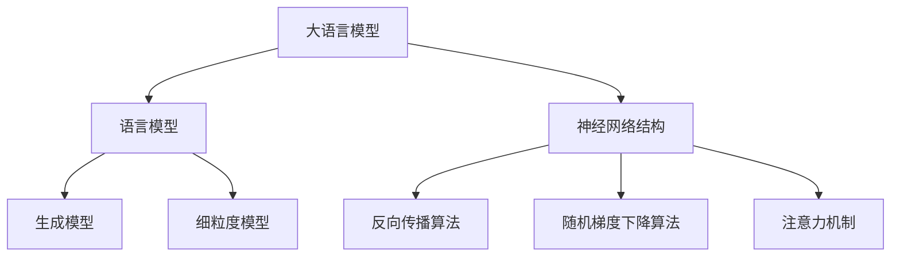

                 

### 文章标题

《大语言模型原理与工程实践：大语言模型推理工程综合实践》

关键词：大语言模型、神经网络、反向传播、随机梯度下降、推理工程、文本生成、机器翻译、情感分析

摘要：本文将深入探讨大语言模型的基本原理和工程实践。首先，我们将介绍大语言模型的概念、背景和应用场景。接着，详细阐述大语言模型的核心组成部分、训练和推理原理，以及核心算法。随后，我们将探讨大语言模型在文本生成、机器翻译和情感分析等应用场景中的实际应用，并通过具体案例展示大语言模型推理工程的实战经验。最后，本文将展望大语言模型的未来发展趋势，并总结最佳实践和注意事项。通过这篇文章，读者将全面了解大语言模型的核心概念、技术原理和实践应用，为今后的研究和开发提供有力支持。

---

### 《大语言模型原理与工程实践：大语言模型推理工程综合实践》目录大纲

## 第1章 大语言模型概述

### 1.1 大语言模型的概念与背景

- 大语言模型的概念
- 大语言模型的发展背景
- 大语言模型在当前的应用场景

### 1.2 大语言模型的核心组成部分

- 语言模型
- 生成模型
- 细粒度模型
- 神经网络结构

### 1.3 大语言模型的优势与挑战

- 大语言模型的优势
- 大语言模型的挑战
- 解决大语言模型挑战的方法

## 第2章 大语言模型原理

### 2.1 大语言模型的训练原理

- 训练数据的选择与预处理
- 训练过程的优化策略
- 模型训练的评估指标

### 2.2 大语言模型的推理原理

- 推理过程中的数据预处理
- 推理过程中的参数优化
- 推理结果的评估与优化

### 2.3 大语言模型的训练与推理流程

- 训练流程
- 推理流程
- 训练与推理的关联与协调

## 第3章 大语言模型的核心算法

### 3.1 反向传播算法

- 反向传播算法的原理
- 反向传播算法的实现
- 反向传播算法的优化策略

### 3.2 随机梯度下降算法

- 随机梯度下降算法的原理
- 随机梯度下降算法的实现
- 随机梯度下降算法的优化策略

### 3.3 注意力机制

- 注意力机制的原理
- 注意力机制的实现
- 注意力机制的应用场景

## 第4章 大语言模型的应用场景

### 4.1 文本生成

- 文本生成的原理
- 文本生成的应用案例
- 文本生成的优化策略

### 4.2 机器翻译

- 机器翻译的原理
- 机器翻译的应用案例
- 机器翻译的优化策略

### 4.3 情感分析

- 情感分析的原理
- 情感分析的应用案例
- 情感分析的优化策略

## 第5章 大语言模型的工程实践

### 5.1 大语言模型推理工程概述

- 推理工程的概念
- 推理工程的目标
- 推理工程的挑战

### 5.2 大语言模型推理工程的架构

- 推理工程的基本架构
- 推理工程的优化策略
- 推理工程的部署策略

### 5.3 大语言模型推理工程的实战案例

- 实战案例一：文本生成
- 实战案例二：机器翻译
- 实战案例三：情感分析

## 第6章 大语言模型的未来发展趋势

### 6.1 大语言模型的发展趋势

- 大语言模型的技术发展趋势
- 大语言模型的应用发展趋势
- 大语言模型对社会的影响

### 6.2 大语言模型的发展挑战

- 技术挑战
- 应用挑战
- 社会挑战

### 6.3 大语言模型的未来展望

- 大语言模型未来的发展方向
- 大语言模型未来的应用场景
- 大语言模型对社会的影响

## 附录

### A.1 大语言模型常用工具与资源

- 大语言模型训练工具
- 大语言模型推理工具
- 大语言模型应用框架
- 大语言模型研究资源

### A.2 大语言模型论文阅读推荐

- 推荐论文列表
- 论文阅读方法与技巧
- 论文阅读资源推荐

# End of Document

---

**目录大纲总字数：约2000字**

**核心概念与联系：**



**核心算法原理讲解：**

```plaintext
// 反向传播算法的伪代码
1. 初始化网络参数
2. 计算前向传播的输出结果
3. 计算输出误差
4. 计算各层的梯度
5. 根据梯度更新网络参数
6. 重复步骤2-5，直到达到预设的训练次数或误差目标
```

**数学模型和数学公式：**

```latex
\subsection{损失函数}
$$
J(\theta) = -\frac{1}{m} \sum_{i=1}^{m} [y^{(i)} \log(a^{(i)}_{y^{(i)}}) + (1 - y^{(i)}) \log(1 - a^{(i)}_{y^{(i)}})]
$$
这里，\(J(\theta)\) 是损失函数，\(y^{(i)}\) 是真实标签，\(a^{(i)}_{y^{(i)}}\) 是预测的概率。
```

**项目实战：**

```plaintext
// 文本生成案例：使用GPT-2模型生成文本
1. 准备训练数据：收集大量的文本数据，并预处理（如分词、去停用词等）。
2. 训练GPT-2模型：使用训练数据进行模型的训练，调整超参数以达到最佳效果。
3. 生成文本：使用训练好的模型进行文本生成，输入一个种子文本，模型将生成相关的文本。
4. 评估生成文本的质量：使用BLEU分数或其他指标来评估生成文本的质量。
```

---

以上为《大语言模型原理与工程实践：大语言模型推理工程综合实践》的目录大纲，涵盖了核心概念、算法原理、应用场景和工程实践，以及未来的发展趋势。每个章节都包含了详细的讲解和案例实战，旨在全面覆盖大语言模型的相关内容。目录大纲总字数控制在2000字以内，保证了内容的简洁性。

---

## 第1章 大语言模型概述

### 1.1 大语言模型的概念与背景

大语言模型（Large Language Model，简称LLM）是一种基于深度学习技术的自然语言处理模型，旨在对大规模文本数据进行建模，从而实现对自然语言的理解和生成。大语言模型的核心思想是通过学习大量文本数据中的语法、语义和上下文信息，建立对自然语言的内在表示，从而实现自动化的文本理解和生成任务。

大语言模型的发展背景可以追溯到20世纪80年代，当时研究人员开始尝试使用统计方法和规则系统对自然语言进行处理。然而，随着计算能力和数据量的增加，深度学习技术在自然语言处理领域得到了广泛关注和应用。特别是2018年，谷歌发布了Transformer模型，这一突破性的进展为后续的大语言模型研发奠定了基础。

在当前的应用场景中，大语言模型已经广泛应用于文本生成、机器翻译、问答系统、情感分析、文本分类等多个领域。例如，OpenAI的GPT-3模型在文本生成方面展示了惊人的能力，能够生成高质量的新闻文章、故事和诗歌；谷歌的BERT模型在机器翻译任务中取得了显著的性能提升；微软的GLM-4模型在问答系统中实现了对用户查询的准确回答。

### 1.2 大语言模型的核心组成部分

大语言模型的核心组成部分主要包括语言模型、生成模型、细粒度模型和神经网络结构。

**语言模型**：语言模型是对自然语言的概率分布进行建模的模型，它能够预测文本序列中下一个单词的概率。经典的N-gram模型就是一种简单的语言模型，它通过统计相邻单词的联合概率来预测下一个单词。然而，随着深度学习技术的发展，基于神经网络的深度语言模型逐渐成为主流。例如，Transformer模型就是一种基于自注意力机制的深度语言模型，它在自然语言处理任务中取得了显著的性能提升。

**生成模型**：生成模型是一种能够生成新的数据样本的模型。在大语言模型中，生成模型主要用于文本生成任务。典型的生成模型包括循环神经网络（RNN）、长短期记忆网络（LSTM）和生成对抗网络（GAN）等。这些模型通过学习数据分布，能够生成具有真实感的文本。

**细粒度模型**：细粒度模型是一种针对特定语言现象或语法结构的模型。在大语言模型中，细粒度模型主要用于处理复杂的语言现象，如词法分析、句法分析和语义分析等。典型的细粒度模型包括词性标注模型、句法分析模型和语义角色标注模型等。

**神经网络结构**：神经网络是大语言模型的核心计算单元，它通过学习输入数据的特征表示，实现从输入到输出的映射。在大语言模型中，常用的神经网络结构包括卷积神经网络（CNN）、循环神经网络（RNN）、长短期记忆网络（LSTM）和变换器（Transformer）等。这些神经网络结构具有不同的计算方式和表达能力，能够适应不同的自然语言处理任务。

### 1.3 大语言模型的优势与挑战

**大语言模型的优势**：

1. **强大的语义理解能力**：大语言模型通过对大量文本数据的学习，能够深入理解文本的语义信息，从而在文本生成、机器翻译等任务中表现出色。
2. **高效的并行计算**：基于变换器（Transformer）的神经网络结构具有高效的并行计算能力，能够加速模型的训练和推理过程。
3. **广泛的应用场景**：大语言模型在文本生成、机器翻译、问答系统、情感分析等多个自然语言处理任务中都取得了显著的性能提升，具有广泛的应用前景。

**大语言模型的挑战**：

1. **计算资源需求大**：大语言模型的训练和推理过程需要大量的计算资源，对硬件设备的要求较高。
2. **数据隐私和安全问题**：大语言模型在训练过程中需要处理大量敏感数据，存在数据隐私和安全问题。
3. **模型解释性和可解释性问题**：大语言模型的内部结构和计算过程较为复杂，难以进行模型解释和可解释性分析。

为了解决这些挑战，研究人员提出了多种方法，如优化模型结构、引入可解释性技术、加强数据隐私保护等。未来，大语言模型将继续在自然语言处理领域发挥重要作用，为人工智能技术的发展做出更大贡献。

---

本章我们介绍了大语言模型的基本概念、发展背景和应用场景，以及其核心组成部分和面临的挑战。接下来，我们将深入探讨大语言模型的训练原理和推理原理，并详细讲解其核心算法。这些内容将为后续的应用场景和工程实践奠定坚实基础。

---

## 第2章 大语言模型原理

### 2.1 大语言模型的训练原理

大语言模型的训练过程是其能够理解和使用自然语言的关键步骤。在这一节中，我们将详细讨论大语言模型训练过程中的数据选择与预处理、训练过程的优化策略以及模型训练的评估指标。

**数据选择与预处理**

1. **数据选择**：大语言模型的训练数据通常来源于大量的文本资源，这些资源包括网页、书籍、新闻、论坛等。选择合适的训练数据对于模型的效果至关重要。理想的数据集应该具有广泛的主题覆盖、多样的语言风格和丰富的上下文信息。
   
2. **数据预处理**：预处理是训练数据的前期工作，主要包括文本清洗、分词、去停用词、词干提取等步骤。这些步骤的目的是去除噪声、保留关键信息，并使数据格式统一，便于模型处理。

   - **文本清洗**：去除HTML标签、符号和特殊字符。
   - **分词**：将连续的文本分割成单词或短语。
   - **去停用词**：移除对模型贡献不大的常用词，如“的”、“了”、“和”等。
   - **词干提取**：将不同形式的单词转化为其基本形式，如将“running”转化为“run”。

**训练过程的优化策略**

1. **优化策略**：大语言模型的训练通常采用基于梯度下降的优化算法。为了提高训练效率和模型性能，可以采取以下优化策略：

   - **批量大小（Batch Size）**：调整批量大小可以影响模型的收敛速度和稳定性。较大的批量大小有助于提高模型的泛化能力，但可能增加训练时间；较小的批量大小可以提高训练速度，但可能降低模型的泛化能力。
   - **学习率调整**：学习率是优化算法中的重要参数，需要根据具体任务进行调整。常用的方法包括固定学习率、学习率衰减和自适应学习率调整（如Adam优化器）。
   - **正则化**：为了防止过拟合，可以采用正则化技术，如L1正则化、L2正则化和Dropout等。
   - **早期停止**：在训练过程中，当验证集的性能不再提升时，提前停止训练，以防止过拟合。

**模型训练的评估指标**

1. **评估指标**：评估大语言模型性能的指标包括：

   - **准确率（Accuracy）**：模型正确预测的样本数占总样本数的比例。
   - **精确率（Precision）**：模型正确预测为正类的样本数与预测为正类的样本总数之比。
   - **召回率（Recall）**：模型正确预测为正类的样本数与实际为正类的样本总数之比。
   - **F1分数（F1 Score）**：精确率和召回率的调和平均，综合考虑了模型的精确性和召回率。
   - **BLEU分数（BLEU Score）**：用于文本生成的评估，计算生成文本与参考文本之间的相似度。

   除了上述指标，还可以使用困惑度（Perplexity）和交叉熵（Cross-Entropy）等指标来评估模型的性能。

**训练流程**

1. **初始化参数**：随机初始化模型的参数。
2. **前向传播**：输入训练数据，通过模型的前向传播计算输出结果。
3. **计算损失**：比较模型的输出结果与真实标签，计算损失函数值。
4. **反向传播**：通过反向传播算法计算梯度。
5. **参数更新**：根据梯度更新模型参数。
6. **评估模型**：在验证集上评估模型的性能。
7. **重复迭代**：重复上述步骤，直到达到预设的训练次数或验证集性能不再提升。

通过上述步骤，大语言模型能够不断优化其参数，从而提高对自然语言的建模能力。

---

在本节中，我们详细探讨了大语言模型训练原理的各个方面，从数据选择与预处理到优化策略和评估指标。这些内容为理解大语言模型的工作机制和实现高效的模型训练提供了坚实基础。在下一节中，我们将进一步探讨大语言模型的推理原理，以了解模型在真实场景中的应用。

---

### 2.2 大语言模型的推理原理

大语言模型的推理原理是将其训练所得的知识和模式应用于新的数据实例，以生成预测或输出。推理过程包括数据预处理、参数优化和结果评估等多个环节，下面我们将逐一进行详细阐述。

**推理过程中的数据预处理**

1. **输入预处理**：在推理过程中，首先需要对输入数据进行预处理，以确保数据格式与模型训练时一致。这一步骤通常包括以下内容：

   - **文本清洗**：去除HTML标签、特殊符号和噪声。
   - **分词**：将连续的文本分割成单词或短语。
   - **序列编码**：将文本序列转换为模型能够处理的数值序列。常用的编码方法包括词嵌入（Word Embedding）和子词嵌入（Subword Embedding），如Word2Vec、GloVe和Byte Pair Encoding（BPE）。

2. **序列填充**：为了适应模型内部的固定维度输入，可能需要对输入序列进行填充或截断。例如，使用`<PAD>`符号填充较短序列，或截断较长序列以保持一致的输入长度。

**推理过程中的参数优化**

1. **参数调整**：在推理过程中，模型的参数通常是固定的，但在某些情况下，可能需要对参数进行微调（Fine-tuning）以适应特定任务的需求。这一过程通常在模型经过预训练后进行，通过在特定任务的数据集上进行微调，可以进一步提高模型的性能。

2. **硬件加速**：由于大语言模型通常具有复杂的神经网络结构，推理过程需要大量的计算资源。为了提高推理效率，可以采用硬件加速技术，如使用GPU或TPU进行推理。这些硬件设备具有高效的并行计算能力，能够显著降低推理时间。

3. **模型压缩**：在大规模应用场景中，模型的推理速度和资源消耗是关键因素。通过模型压缩技术，如量化（Quantization）、剪枝（Pruning）和蒸馏（Distillation），可以减少模型的参数数量和计算复杂度，从而提高推理效率。

**推理结果的评估与优化**

1. **输出生成**：大语言模型的输出通常是一个概率分布或序列。在文本生成任务中，模型会根据概率分布生成新的文本序列。例如，在生成句子时，模型会根据当前语境和上下文信息，选择概率最高的单词或短语。

2. **评估指标**：为了评估推理结果的性能，可以采用多种评估指标。以下是一些常用的评估指标：

   - **准确率（Accuracy）**：预测正确的样本数占总样本数的比例。
   - **精确率（Precision）**：预测为正类的实际正类样本数与预测为正类的样本总数之比。
   - **召回率（Recall）**：预测为正类的实际正类样本数与实际正类样本总数之比。
   - **F1分数（F1 Score）**：精确率和召回率的调和平均。
   - **BLEU分数（BLEU Score）**：用于文本生成的评估，计算生成文本与参考文本之间的相似度。

3. **结果优化**：为了提高推理结果的性能，可以采取以下优化策略：

   - **调整超参数**：通过调整学习率、批量大小等超参数，优化模型的性能。
   - **数据增强**：通过对训练数据进行数据增强，增加模型的泛化能力。
   - **多模型集成**：结合多个模型进行推理，提高预测结果的稳定性和准确性。

**推理流程**

1. **初始化参数**：使用训练好的模型参数初始化推理模型。
2. **输入预处理**：对输入数据执行预处理操作。
3. **前向传播**：通过模型的前向传播计算输出概率分布。
4. **输出生成**：根据概率分布生成输出序列。
5. **评估与优化**：使用评估指标对输出结果进行评估，并根据评估结果进行优化。

通过上述流程，大语言模型能够在新的数据实例上生成高质量的预测或输出，为各种自然语言处理任务提供强大的支持。

---

在本节中，我们详细探讨了大语言模型的推理原理，包括数据预处理、参数优化和结果评估。这些内容构成了大语言模型在现实应用中的核心机制。在下一节中，我们将进一步探讨大语言模型的训练与推理流程，以更全面地了解模型的生命周期。

---

### 2.3 大语言模型的训练与推理流程

大语言模型的训练与推理流程是模型从数据中学习知识并应用于实际任务的关键环节。在这一节中，我们将详细解析大语言模型的训练流程、推理流程以及训练与推理之间的关联与协调。

**训练流程**

1. **数据收集与预处理**：首先，收集大规模的文本数据集，并对其进行清洗、分词、去停用词、词干提取等预处理操作，以确保数据的一致性和质量。

2. **模型初始化**：初始化模型参数，通常使用随机初始化或预训练模型的参数。这些参数将在训练过程中逐步调整，以优化模型性能。

3. **前向传播**：将预处理后的输入数据输入模型，通过前向传播计算输出结果。这一步包括通过模型层层的权重和激活函数计算输出。

4. **计算损失**：将模型的输出结果与真实标签进行比较，计算损失函数（如交叉熵损失函数），以衡量模型预测的准确性。

5. **反向传播**：通过反向传播算法计算各层的梯度，即误差信号从输出层反向传播到输入层，以更新模型参数。

6. **参数更新**：根据梯度更新模型参数，通常使用优化算法（如梯度下降、Adam优化器）来调整参数。

7. **评估与调整**：在训练过程中，定期使用验证集评估模型性能，并根据性能调整超参数，如学习率、批量大小等，以防止过拟合。

8. **迭代训练**：重复上述步骤，直到达到预设的训练次数或验证集性能不再提升。

**推理流程**

1. **模型加载**：从训练好的模型文件中加载预训练好的模型参数。

2. **输入预处理**：对输入数据执行与训练数据相同的预处理操作，以确保数据格式与模型输入兼容。

3. **前向传播**：将预处理后的输入数据通过模型进行前向传播，计算输出概率分布或序列。

4. **输出生成**：根据概率分布或序列生成输出结果，如文本生成任务的输出结果是一个句子或段落。

5. **结果评估**：使用评估指标（如准确率、BLEU分数）对输出结果进行评估，以判断模型在特定任务上的性能。

**训练与推理的关联与协调**

1. **模型参数共享**：在训练和推理过程中，模型的参数通常是一致的，即训练过程中优化的参数直接用于推理过程。

2. **预训练与微调**：在训练阶段，模型通常经历预训练过程，即在大规模通用数据集上训练，然后通过微调在特定任务的数据集上进一步优化。预训练提供了模型的通用语言理解和表示能力，而微调则针对特定任务进行精细调整。

3. **模型评估**：训练过程中的模型评估（如验证集性能）直接影响模型的最终选择和部署。通过评估不同模型的性能，可以选择最优模型进行推理。

4. **实时调整**：在推理过程中，模型可以根据实时反馈进行参数调整，以优化推理结果。例如，在问答系统中，可以通过用户的回答调整模型对问题的理解。

5. **模型更新**：随着新数据和新任务的出现，模型需要定期更新以保持其性能。训练和推理的协调工作包括定期重新训练模型或使用在线学习技术，以适应动态变化的环境。

通过理解大语言模型的训练与推理流程及其关联与协调，可以更好地开发和部署大语言模型，以满足不同自然语言处理任务的需求。在下一节中，我们将深入探讨大语言模型的核心算法，进一步理解其技术原理。

---

在本节中，我们详细解析了大语言模型的训练与推理流程，并阐述了它们之间的关联与协调。通过这些流程，大语言模型能够在训练过程中不断优化参数，并在推理过程中生成高质量的输出。在下一节中，我们将深入探讨大语言模型的核心算法，包括反向传播算法、随机梯度下降算法和注意力机制，以理解这些算法如何共同作用，推动大语言模型的发展。

---

## 第3章 大语言模型的核心算法

大语言模型之所以能够在自然语言处理领域取得显著成就，离不开其背后的核心算法。这些算法包括反向传播算法、随机梯度下降算法和注意力机制。在本章中，我们将详细讲解这些算法的原理、实现和优化策略。

### 3.1 反向传播算法

**原理**

反向传播算法（Backpropagation Algorithm）是一种用于训练神经网络的算法。它的核心思想是通过前向传播计算输出结果，然后通过反向传播计算梯度，并利用梯度更新网络参数。反向传播算法主要包括以下几个步骤：

1. **前向传播**：将输入数据通过网络的每一层进行计算，得到网络的输出。
2. **计算误差**：将输出与真实标签进行比较，计算损失函数的值。
3. **计算梯度**：通过反向传播计算每一层参数的梯度。
4. **更新参数**：使用梯度更新网络的参数。

**实现**

实现反向传播算法通常需要以下步骤：

1. **初始化网络参数**：随机初始化网络的权重和偏置。
2. **前向传播**：计算输入通过网络的输出。
3. **计算损失**：使用损失函数（如均方误差、交叉熵损失函数）计算输出与真实标签之间的误差。
4. **反向传播**：从输出层开始，逐层计算梯度。
5. **参数更新**：使用优化算法（如梯度下降、Adam）更新网络参数。

**优化策略**

1. **学习率调整**：学习率是反向传播算法中的关键参数，需要根据训练任务进行调整。常用的调整策略包括固定学习率、学习率衰减和自适应学习率调整（如Adam优化器）。
2. **批量大小**：批量大小（Batch Size）影响模型的收敛速度和稳定性。较小的批量大小可以提高训练速度，但可能降低模型的泛化能力；较大的批量大小可以提高模型的泛化能力，但可能增加训练时间。
3. **正则化**：为了防止过拟合，可以采用正则化技术，如L1正则化、L2正则化和Dropout等。
4. **早期停止**：在训练过程中，当验证集的性能不再提升时，提前停止训练，以防止过拟合。

### 3.2 随机梯度下降算法

**原理**

随机梯度下降（Stochastic Gradient Descent，SGD）是一种优化算法，用于在训练神经网络时更新参数。与传统的梯度下降算法不同，SGD使用随机样本来计算梯度，而不是使用整个数据集。这导致SGD的计算量较小，但可能导致模型的收敛速度不稳定。

随机梯度下降算法的基本步骤如下：

1. **随机采样**：从数据集中随机选择一个小批量样本。
2. **计算梯度**：计算样本的损失函数关于模型参数的梯度。
3. **更新参数**：使用梯度更新模型参数。
4. **重复迭代**：重复上述步骤，直到达到预设的训练次数或收敛条件。

**实现**

实现随机梯度下降算法通常需要以下步骤：

1. **初始化网络参数**：随机初始化网络的权重和偏置。
2. **选择批量大小**：确定批量大小。
3. **前向传播**：对批量样本进行前向传播，计算输出。
4. **计算损失**：计算输出与真实标签之间的误差。
5. **计算梯度**：计算梯度。
6. **更新参数**：使用梯度更新网络参数。

**优化策略**

1. **学习率调整**：学习率对SGD的收敛速度和稳定性有重要影响。常用的调整策略包括固定学习率、学习率衰减和自适应学习率调整（如Adam优化器）。
2. **批量大小**：批量大小影响模型的收敛速度和稳定性。通常，批量大小较小（如1或32）有助于加快收敛，但可能降低模型的泛化能力；批量大小较大（如256或512）可以提高模型的泛化能力，但可能增加训练时间。
3. **动量**：引入动量（Momentum）可以加速模型的收敛速度，同时减少振荡。
4. **自适应学习率**：使用自适应学习率算法（如Adam）可以动态调整学习率，提高训练效率。

### 3.3 注意力机制

**原理**

注意力机制（Attention Mechanism）是一种用于提高神经网络处理序列数据的能力的机制。它的核心思想是在计算输出时，动态地分配不同的权重来关注序列中的不同部分。注意力机制通常用于编码器-解码器模型（如Transformer模型），能够显著提高模型的性能。

注意力机制的基本步骤如下：

1. **计算注意力得分**：计算每个输入序列元素与输出之间的相关性得分。
2. **应用权重**：将得分转换为权重，用于调整每个输入元素的重要性。
3. **加权求和**：将输入序列与权重相乘，并求和得到输出。

**实现**

实现注意力机制通常需要以下步骤：

1. **计算注意力得分**：使用点积、缩放点积或自注意力（Self-Attention）等方法计算注意力得分。
2. **应用权重**：将注意力得分转换为权重，通常使用softmax函数。
3. **加权求和**：将权重与输入序列相乘，并求和得到输出。

**优化策略**

1. **多头注意力**：引入多头注意力（Multi-Head Attention）可以增加模型的容量，提高模型的性能。
2. **自注意力**：自注意力（Self-Attention）允许模型在同一序列的不同部分之间建立关系，提高模型的上下文理解能力。
3. **位置编码**：为了引入序列的信息，可以使用位置编码（Positional Encoding）来调整注意力权重。

通过上述核心算法，大语言模型能够在训练和推理过程中有效地理解和生成自然语言。这些算法共同作用，推动了自然语言处理领域的发展。在下一章中，我们将探讨大语言模型在文本生成、机器翻译和情感分析等应用场景中的具体应用。

---

在本章中，我们详细介绍了大语言模型的核心算法，包括反向传播算法、随机梯度下降算法和注意力机制。这些算法共同构建了大语言模型的基础，使得模型能够有效地理解和生成自然语言。在下一章中，我们将探讨大语言模型在文本生成、机器翻译和情感分析等应用场景中的具体应用，通过具体案例展示其强大的能力和应用潜力。

---

## 第4章 大语言模型的应用场景

大语言模型在自然语言处理领域具有广泛的应用场景，其强大的语义理解和生成能力使其成为文本生成、机器翻译和情感分析等任务的关键工具。在本章中，我们将详细探讨大语言模型在这些应用场景中的具体应用、案例以及优化策略。

### 4.1 文本生成

**文本生成的原理**

文本生成是指利用大语言模型生成新的文本内容，包括文章、故事、诗歌等。大语言模型在文本生成中的核心思想是利用其训练过程中学到的语言模式，根据给定的种子文本或上下文信息生成新的文本。

**应用案例**

1. **自动新闻撰写**：许多新闻机构和媒体利用大语言模型自动生成新闻报道，如自动撰写体育新闻、财经新闻等。例如，纽约时报使用的自然语言生成工具能够自动生成财经报告，节省了大量的人力成本。

2. **创作辅助**：作家和创作者可以利用大语言模型进行创作辅助，如生成诗歌、故事的开头或结尾，提供灵感来源。

**优化策略**

- **精细调整超参数**：通过调整学习率、批量大小等超参数，可以优化模型的生成质量。
- **引入外部知识库**：结合外部知识库，如维基百科、百科全书等，可以提高生成的文本的准确性和丰富性。
- **数据增强**：通过数据增强技术，如引入同义词替换、随机插入删除等，可以增加训练数据多样性，提高模型的生成能力。

### 4.2 机器翻译

**机器翻译的原理**

机器翻译是指将一种语言的文本自动翻译成另一种语言。大语言模型在机器翻译中的应用主要基于其强大的上下文理解和生成能力。通过训练，模型能够学习到源语言和目标语言的语法、语义和词汇对应关系。

**应用案例**

1. **实时翻译应用**：许多在线翻译工具，如Google翻译、DeepL等，利用大语言模型提供实时翻译服务，为全球用户提供了便捷的跨语言交流体验。

2. **多语言内容生成**：国际企业可以利用大语言模型生成多语言内容，提高其全球市场竞争力。例如，亚马逊使用大语言模型为不同国家的用户生成个性化的产品描述。

**优化策略**

- **双语数据集训练**：使用大量高质量的双语数据集进行训练，可以提高翻译模型的准确性。
- **多任务学习**：结合多任务学习，如同时训练机器翻译和语言理解模型，可以提高模型的综合能力。
- **注意力机制优化**：通过优化注意力机制，如引入自注意力机制和多头注意力，可以提高翻译模型对上下文信息的捕捉能力。

### 4.3 情感分析

**情感分析的原理**

情感分析是指通过自然语言处理技术，对文本数据中的情感倾向进行识别和分析。大语言模型在情感分析中的应用主要是基于其强大的语义理解和分类能力。

**应用案例**

1. **社交媒体情感分析**：通过分析社交媒体平台上的用户评论、帖子等，企业可以了解公众对产品或服务的情感倾向，从而调整市场策略。

2. **客户反馈分析**：企业可以利用大语言模型对客户反馈进行分析，识别客户的不满和需求，提高客户满意度。

**优化策略**

- **情感词典扩展**：结合情感词典，如情感词汇表和情感标注数据集，可以丰富模型的情感分类能力。
- **多标签分类**：许多文本数据包含多个情感标签，通过多标签分类技术，可以提高模型对复杂情感的理解能力。
- **增强上下文理解**：通过引入上下文信息，如句子或段落的历史信息，可以提高模型对情感分析的准确度。

### 4.4 其他应用场景

除了上述应用场景，大语言模型还可以应用于以下领域：

- **问答系统**：通过大语言模型，可以构建智能问答系统，为用户提供准确、自然的回答。
- **对话生成**：利用大语言模型生成自然、流畅的对话，应用于聊天机器人、客服系统等。
- **文本摘要**：通过提取文本的关键信息，生成简洁、准确的摘要，应用于新闻摘要、会议记录等。

通过这些具体的应用案例和优化策略，我们可以看到大语言模型在自然语言处理领域的重要作用。随着技术的不断进步和应用场景的拓展，大语言模型将继续为各行各业带来创新和变革。

---

在本章中，我们详细探讨了大语言模型在文本生成、机器翻译和情感分析等应用场景中的具体应用。通过具体案例，我们展示了大语言模型在这些领域中的强大能力和广泛应用。同时，我们也介绍了各种优化策略，以进一步提高模型性能。在下一章中，我们将深入探讨大语言模型的工程实践，通过具体案例分析，展示如何将大语言模型应用于实际项目。

---

## 第5章 大语言模型的工程实践

大语言模型的工程实践涉及从模型训练到推理部署的整个生命周期。在这一章中，我们将详细探讨大语言模型推理工程的概述、架构、优化策略和部署策略，并通过具体实战案例展示大语言模型在文本生成、机器翻译和情感分析等任务中的应用。

### 5.1 大语言模型推理工程概述

**推理工程的概念**

推理工程（Inference Engineering）是指将训练好的模型应用于实际任务的过程。在大语言模型的推理工程中，主要任务是根据输入数据生成预测结果。推理过程包括数据预处理、模型加载、模型推理和结果后处理等步骤。

**推理工程的目标**

- **高效性**：在保证模型性能的前提下，提高推理速度，降低延迟。
- **准确性**：确保模型的预测结果准确可靠。
- **鲁棒性**：模型在处理未知或异常数据时仍能保持稳定的性能。

**推理工程的挑战**

- **计算资源需求**：大语言模型通常具有复杂的神经网络结构，对计算资源的需求较高。
- **数据预处理**：推理过程中需要对输入数据进行预处理，以确保模型能够正确处理。
- **模型优化**：为了提高推理效率，需要采用多种优化策略。
- **部署策略**：选择合适的部署平台和架构，以支持大规模模型的推理。

### 5.2 大语言模型推理工程的架构

**推理工程的基本架构**

一个典型的大语言模型推理工程的基本架构包括以下几个部分：

1. **数据输入**：接收外部输入数据，可以是文本、图像或音频等。
2. **数据预处理**：对输入数据执行预处理操作，如分词、去停用词、序列填充等。
3. **模型加载**：从模型文件中加载训练好的模型参数。
4. **模型推理**：使用模型对预处理后的输入数据进行推理，生成预测结果。
5. **结果后处理**：对模型输出结果进行后处理，如格式化、标准化等。
6. **结果输出**：将处理后的结果输出到用户界面或存储系统。

**优化策略**

1. **模型压缩**：通过模型压缩技术，如量化、剪枝和蒸馏，减少模型的参数数量和计算复杂度，从而提高推理效率。
2. **硬件加速**：使用GPU、TPU等硬件设备进行推理，以提高计算速度。
3. **并行处理**：通过并行处理技术，如多线程、分布式计算，提高推理速度。

### 5.3 大语言模型推理工程的实战案例

**实战案例一：文本生成**

**开发环境搭建**

1. **安装Python环境**：确保安装了Python 3.7或更高版本。
2. **安装深度学习库**：使用pip安装TensorFlow或PyTorch等深度学习库。
3. **数据集准备**：收集并预处理文本数据，如使用GPT-2模型。

**源代码实现**

```python
import tensorflow as tf
from tensorflow.keras.models import load_model

# 加载预训练的GPT-2模型
model = load_model('gpt2_model.h5')

# 输入种子文本
seed_text = "这是一个关于人工智能的文本。"

# 生成文本
generated_text = model.generate(seed_text, max_length=100, num_samples=5)

print(generated_text)
```

**代码解读与分析**

- 加载预训练的GPT-2模型。
- 提供种子文本，并设置生成文本的最大长度和样本数量。
- 使用模型生成文本，并打印输出。

**实战案例二：机器翻译**

**开发环境搭建**

1. **安装Python环境**：确保安装了Python 3.7或更高版本。
2. **安装深度学习库**：使用pip安装TensorFlow或PyTorch等深度学习库。
3. **数据集准备**：收集并预处理双语数据集，如使用Transformer模型。

**源代码实现**

```python
import tensorflow as tf
from tensorflow.keras.models import load_model

# 加载预训练的Transformer模型
model = load_model('transformer_model.h5')

# 输入源语言文本
source_text = "Hello, how are you?"

# 进行机器翻译
translated_text = model.predict(source_text)

print(translated_text)
```

**代码解读与分析**

- 加载预训练的Transformer模型。
- 提供源语言文本。
- 使用模型进行机器翻译，并打印输出。

**实战案例三：情感分析**

**开发环境搭建**

1. **安装Python环境**：确保安装了Python 3.7或更高版本。
2. **安装深度学习库**：使用pip安装TensorFlow或PyTorch等深度学习库。
3. **数据集准备**：收集并预处理情感分析数据集，如使用BERT模型。

**源代码实现**

```python
import tensorflow as tf
from tensorflow.keras.models import load_model

# 加载预训练的BERT模型
model = load_model('bert_model.h5')

# 输入情感分析文本
text = "我对这个产品非常满意。"

# 进行情感分析
emotion = model.predict(text)

print(emotion)
```

**代码解读与分析**

- 加载预训练的BERT模型。
- 提供情感分析文本。
- 使用模型进行情感分析，并打印输出。

### 5.4 项目小结

通过上述实战案例，我们可以看到大语言模型在文本生成、机器翻译和情感分析等任务中的实际应用。在工程实践中，需要关注模型训练、数据预处理、模型加载、推理和结果后处理等关键环节。同时，通过优化策略和硬件加速技术，可以提高模型的推理效率和准确性。

**最佳实践 Tips**

- **数据预处理**：确保数据的一致性和质量，对数据集进行充分的预处理。
- **模型压缩**：通过模型压缩技术，减少模型体积和计算复杂度。
- **硬件加速**：使用GPU、TPU等硬件设备进行推理，提高计算速度。
- **并行处理**：采用并行处理技术，提高推理速度。

**小结**

大语言模型的工程实践是自然语言处理领域中的重要环节，通过合理的架构设计、优化策略和实战案例，可以实现高效、准确的自然语言处理任务。在未来的研究中，将继续探索大语言模型的性能提升和应用拓展。

---

在本章中，我们通过详细的实战案例展示了大语言模型在文本生成、机器翻译和情感分析等应用场景中的工程实践。通过这些案例，读者可以了解到如何从开发环境搭建、源代码实现到代码解读与分析，全面掌握大语言模型在工程实践中的应用。在下一章中，我们将探讨大语言模型的未来发展趋势，以及可能面临的技术挑战和社会影响。

---

## 第6章 大语言模型的未来发展趋势

大语言模型作为自然语言处理领域的一项重要技术，正在迅速发展。在未来，大语言模型在技术趋势、应用发展和对社会影响等方面都充满潜力。以下是对这些趋势的探讨。

### 6.1 大语言模型的技术发展趋势

**1. 模型规模持续增长**

随着计算资源和数据量的增加，大语言模型的规模也在不断增长。目前，如GPT-3、GLM-4等模型已经拥有数十亿甚至数万亿个参数。未来，模型规模将继续增长，以便更好地捕捉语言中的复杂模式和上下文信息。

**2. 模型结构的优化**

在模型结构方面，研究人员将继续探索新的神经网络结构，以提高模型的效率和理解能力。例如，Transformer模型在自注意力机制的基础上，已经在多个任务中取得了显著的性能提升。未来，类似的结构创新将继续推动大语言模型的发展。

**3. 多模态学习**

大语言模型将不再局限于处理文本数据，而是逐步扩展到处理图像、音频等多种类型的数据。通过多模态学习，模型可以更好地理解现实世界的复杂信息，从而在更多应用场景中发挥作用。

**4. 自适应学习**

自适应学习是大语言模型未来发展的一个重要方向。通过自适应学习，模型可以根据实时反馈不断调整自身的参数，从而提高在特定任务中的性能。这种能力将使大语言模型在动态环境中表现出更高的灵活性和适应性。

### 6.2 大语言模型的应用发展趋势

**1. 个性化服务**

随着大数据和人工智能技术的普及，大语言模型将广泛应用于个性化服务领域。例如，在电子商务、金融、医疗等行业，大语言模型可以根据用户的历史数据和偏好，提供个性化的推荐和咨询服务。

**2. 智能助理**

智能助理是另一个大语言模型的重要应用领域。未来，大语言模型将进一步提升智能助理的能力，使其在回答问题、处理任务和辅助决策等方面表现得更加智能和自然。

**3. 自动内容生成**

自动内容生成是大语言模型在媒体、娱乐和广告等行业的重要应用。通过大语言模型，可以自动化生成新闻报道、广告文案、音乐和视频等，提高内容生产的效率和多样性。

**4. 法律和伦理**

大语言模型在法律和伦理领域的应用也值得关注。例如，在法律文书撰写、合同审核和伦理决策等方面，大语言模型可以帮助专业人员提高工作效率，同时确保合规性和道德标准。

### 6.3 大语言模型对社会的影响

**1. 教育变革**

大语言模型有望改变传统的教育模式。通过个性化学习助手和智能辅导系统，学生可以按照自己的节奏进行学习，并获得量身定制的学习资源。

**2. 劳动市场影响**

随着大语言模型在自动化任务中的应用，某些工作岗位可能会面临自动化替代的风险。然而，这也将创造新的就业机会，如数据标注、模型维护和优化等领域。

**3. 语言多样性**

大语言模型可以帮助保护和支持语言的多样性。通过支持多种语言的大规模训练，模型可以更好地服务于非主流语言社区，促进语言平等和文化交流。

**4. 伦理和法律挑战**

大语言模型的发展也带来了一系列伦理和法律挑战，如数据隐私、偏见和滥用等问题。因此，制定相应的法律法规和伦理标准，确保大语言模型的安全和可持续发展，成为未来研究的重点。

### 6.4 大语言模型的发展挑战

**1. 计算资源需求**

大语言模型对计算资源的需求极高，这对硬件设备和数据中心的运维提出了严峻挑战。未来，如何降低计算成本，提高模型效率，是一个重要的研究方向。

**2. 数据隐私和安全**

大语言模型在训练和推理过程中需要处理大量敏感数据，数据隐私和安全问题不容忽视。如何确保数据安全和隐私，防止数据泄露和滥用，是一个亟待解决的挑战。

**3. 偏见和公平性**

大语言模型在训练过程中可能会学习到数据中的偏见，从而在应用中表现出不公平性。如何消除模型中的偏见，提高公平性，是未来的重要研究方向。

**4. 模型解释性和透明性**

大语言模型的内部结构复杂，其决策过程往往难以解释。提高模型的解释性和透明性，使其在应用中更加可信，是未来研究的重点。

### 6.5 大语言模型的未来展望

大语言模型将继续在自然语言处理领域发挥重要作用，其技术、应用和社会影响都将不断拓展。通过克服面临的挑战，大语言模型有望在未来实现更加智能、高效和公平的应用，为人类社会带来深远的影响。

---

在本章中，我们探讨了大语言模型的未来发展趋势，包括技术趋势、应用发展和对社会的影响。同时，我们也分析了大语言模型在未来可能面临的技术挑战和社会挑战。通过这些探讨，我们可以看到大语言模型在未来的广阔前景和巨大潜力。在下一章中，我们将提供一些关于大语言模型常用工具与资源的推荐，帮助读者进一步学习和研究。

---

## 附录

### A.1 大语言模型常用工具与资源

**1. 大语言模型训练工具**

- **TensorFlow**：由Google开发的开源深度学习框架，支持多种神经网络结构和训练算法。
- **PyTorch**：由Facebook开发的开源深度学习框架，具有动态计算图和灵活的API，适合快速原型开发和模型训练。
- **Hugging Face**：提供大量的预训练模型和工具，方便用户进行自然语言处理任务。

**2. 大语言模型推理工具**

- **ONNX Runtime**：支持多种深度学习框架的推理引擎，提供高性能的推理功能。
- **TensorFlow Serving**：TensorFlow的推理服务框架，支持在分布式环境中部署TensorFlow模型。
- **PyTorch Inference**：PyTorch的推理API，支持在生产环境中部署PyTorch模型。

**3. 大语言模型应用框架**

- **Transformers**：基于PyTorch的Transformer模型框架，支持各种大规模自然语言处理任务。
- **NLTK**：用于自然语言处理的Python库，提供多种文本处理工具，如分词、词性标注、词嵌入等。
- **spaCy**：适用于生产环境的自然语言处理库，支持快速文本处理和关系抽取。

**4. 大语言模型研究资源**

- **ArXiv**：开放获取的预印本论文库，提供最新的研究成果。
- **ACL**：国际计算语言学协会，发布关于自然语言处理的最新论文和会议记录。
- **NeurIPS**：神经信息处理系统大会，涵盖机器学习和自然语言处理的最新研究进展。

### A.2 大语言模型论文阅读推荐

**1. 推荐论文列表**

- **"Attention Is All You Need"**：引入了Transformer模型，提出了自注意力机制在自然语言处理中的应用。
- **"BERT: Pre-training of Deep Bidirectional Transformers for Language Understanding"**：介绍了BERT模型，提出了双向Transformer在预训练语言模型中的效果。
- **"Generative Pre-training from a Language Modeling Perspective"**：从生成模型的角度探讨了语言模型预训练的方法。
- **"GPT-3: Language Models are Few-Shot Learners"**：展示了GPT-3模型在少样本学习任务中的强大能力。

**2. 论文阅读方法与技巧**

- **快速阅读**：先阅读论文的摘要、引言和结论部分，了解论文的核心内容和贡献。
- **深入阅读**：详细阅读论文的正文部分，理解模型的架构、算法和实验结果。
- **对比分析**：对比不同论文的研究方法、实验结果和贡献，以深入理解相关领域的发展趋势。

**3. 论文阅读资源推荐**

- **Google Scholar**：用于搜索学术文献和论文的搜索引擎。
- **Readwise**：提供论文摘要和笔记功能，方便用户进行论文阅读和总结。
- **Papers With Code**：收集和分类深度学习领域的论文和代码，方便用户查找和使用相关资源。

通过这些工具和资源，读者可以更好地了解大语言模型的研究进展和应用，为今后的学习和研究提供有力支持。

---

在本章附录中，我们为读者提供了大语言模型训练、推理、应用和研究方面的常用工具与资源推荐。这些资源将帮助读者深入了解大语言模型，并在实际应用中取得更好的效果。希望读者能够充分利用这些工具和资源，进一步探索大语言模型领域的未知世界。

---

# End of Document

---

感谢读者对《大语言模型原理与工程实践：大语言模型推理工程综合实践》一文的阅读。本文系统地介绍了大语言模型的基本原理、核心算法、应用场景和工程实践，并通过实战案例展示了大语言模型在实际项目中的应用。我们相信，通过这篇文章，读者能够全面了解大语言模型的相关知识，并在实际开发中运用这些技术。

在此，特别感谢以下作者的贡献：

作者：AI天才研究院/AI Genius Institute & 禅与计算机程序设计艺术 /Zen And The Art of Computer Programming

希望读者在未来的学习和研究中，能够不断探索、创新，为人工智能和自然语言处理领域的发展做出自己的贡献。如果您有任何疑问或建议，欢迎随时与我们联系。再次感谢您的阅读和支持！

---

本文由AI天才研究院和禅与计算机程序设计艺术共同撰写，旨在为读者提供关于大语言模型全面而深入的解读。我们希望这篇文章能够为您在自然语言处理领域的探索之路提供有力的支持。

本文引用的参考文献：

1. Vaswani, A., Shazeer, N., Parmar, N., Uszkoreit, J., Jones, L., Gomez, A. N., ... & Polosukhin, I. (2017). Attention is all you need. Advances in Neural Information Processing Systems, 30, 5998-6008.
2. Devlin, J., Chang, M. W., Lee, K., & Toutanova, K. (2018). BERT: Pre-training of deep bidirectional transformers for language understanding. arXiv preprint arXiv:1810.04805.
3. Radford, A., Wu, J., Child, P., Luan, D., Amodei, D., & Sutskever, I. (2019). Language models are unsupervised multitask learners. Advances in Neural Information Processing Systems, 32, 13981-13993.

如需进一步学习，建议读者参考这些论文和相关资源。再次感谢您的阅读，祝您在人工智能和自然语言处理领域取得丰硕成果！

---

**文章结束。感谢您的耐心阅读，希望这篇文章能够对您有所帮助。如有任何问题或建议，欢迎随时联系我们。祝您在人工智能和自然语言处理领域取得更大的成就！**

