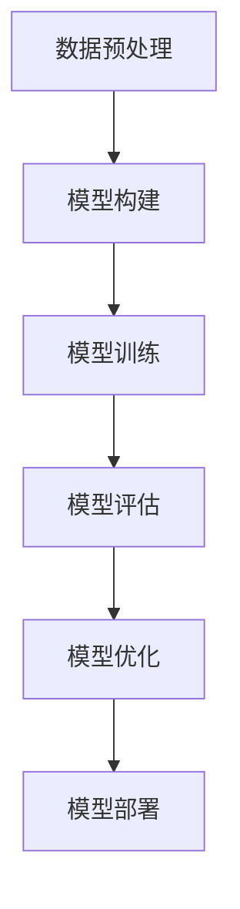

                 

### 文章标题

《大语言模型原理与工程实践：大语言模型的微调方法》

### 关键词

- 大语言模型
- 微调
- 自然语言处理
- 深度学习
- 优化算法

### 摘要

本文深入探讨了大规模语言模型的原理及其工程实践，特别是重点介绍了大语言模型的微调方法。文章首先概述了大规模语言模型的发展历程和核心优势，接着详细解析了其基本原理、关键技术、数学模型，并通过Mermaid流程图直观地展示了模型的训练和微调过程。随后，文章重点讨论了微调方法的挑战与解决方案，提供了具体的案例分析，并详细解读了项目实战中的代码实现。最后，文章探讨了大规模语言模型的未来发展趋势及其伦理问题。通过本文的阅读，读者将能够全面了解大规模语言模型的原理和实践，掌握微调方法的核心技巧。

## 《大语言模型原理与工程实践：大语言模型的微调方法》目录大纲

### 第一部分：大语言模型基础

#### 第1章：大语言模型概述

- 1.1 大语言模型的历史与发展
- 1.2 大语言模型的基本概念
- 1.3 大语言模型的核心优势
- 1.4 大语言模型的应用场景

#### 第2章：大语言模型的基本原理

- 2.1 自然语言处理（NLP）基础
- 2.2 深度学习在NLP中的应用
- 2.3 语言模型的构建与训练
- 2.4 语言模型的评估与优化

#### 第3章：大语言模型的关键技术

- 3.1 词嵌入技术
- 3.2 神经网络与变换器架构
- 3.3 注意力机制与序列处理
- 3.4 自监督学习与预训练

#### 第4章：大语言模型的数学模型

- 4.1 线性代数基础
- 4.2 概率论基础
- 4.3 优化算法原理
- 4.4 深度学习损失函数

#### 第5章：大语言模型的Mermaid流程图

- 5.1 大语言模型训练流程
- 5.2 大语言模型微调流程
- 5.3 大语言模型应用流程

### 第二部分：大语言模型工程实践

#### 第6章：大语言模型微调方法

- 6.1 微调的概念与原理
- 6.2 微调的挑战与解决方案
- 6.3 微调方法案例分析
- 6.4 微调实战技巧

#### 第7章：大语言模型项目实战

- 7.1 项目环境搭建
- 7.2 项目需求分析与设计
- 7.3 代码实现与调试
- 7.4 项目评估与优化

#### 第8章：大语言模型应用案例分析

- 8.1 案例一：文本分类
- 8.2 案例二：问答系统
- 8.3 案例三：机器翻译
- 8.4 案例四：自然语言生成

#### 第9章：大语言模型未来发展趋势

- 9.1 大语言模型的技术挑战
- 9.2 大语言模型的应用前景
- 9.3 大语言模型的伦理问题与社会影响

### 附录

#### 附录A：大语言模型开发工具与资源

- A.1 主流深度学习框架介绍
- A.2 大语言模型开源项目推荐
- A.3 大语言模型学习资源汇总

### 大语言模型的Mermaid流程图



### 大语言模型微调方法的伪代码

```plaintext
function fine_tune(pretrained_model, train_data, dev_data, test_data):
    # 加载预训练模型
    model = load_model(pretrained_model)
    
    # 微调模型参数
    model = fine_tune_model(model, train_data)
    
    # 评估模型在开发集上的性能
    dev_loss, dev_accuracy = evaluate_model(model, dev_data)
    
    # 评估模型在测试集上的性能
    test_loss, test_accuracy = evaluate_model(model, test_data)
    
    return model, dev_loss, dev_accuracy, test_loss, test_accuracy
```

### 大语言模型的数学公式与讲解

- 语言模型概率公式：

$$ P(w_n | w_{n-1}, w_{n-2}, ..., w_1) = \frac{P(w_n, w_{n-1}, w_{n-2}, ..., w_1)}{P(w_{n-1}, w_{n-2}, ..., w_1)} $$

- 优化算法损失函数：

$$ Loss = -\sum_{i=1}^{N} \log P(y_i | x_i) $$

其中，$P(y_i | x_i)$ 是模型对输入 $x_i$ 预测的标签 $y_i$ 的概率。

### 大语言模型项目实战代码解读

```python
# 导入所需库
import tensorflow as tf
from tensorflow.keras.preprocessing.sequence import pad_sequences
from tensorflow.keras.layers import Embedding, LSTM, Dense
from tensorflow.keras.models import Sequential

# 准备数据
train_sequences = pad_sequences(train_data, maxlen=max_length)
dev_sequences = pad_sequences(dev_data, maxlen=max_length)
test_sequences = pad_sequences(test_data, maxlen=max_length)

# 构建模型
model = Sequential()
model.add(Embedding(input_dim=vocab_size, output_dim=embedding_dim, input_length=max_length))
model.add(LSTM(units=hidden_units))
model.add(Dense(units=1, activation='sigmoid'))

# 编译模型
model.compile(optimizer='adam', loss='binary_crossentropy', metrics=['accuracy'])

# 训练模型
model.fit(train_sequences, train_labels, epochs=10, validation_data=(dev_sequences, dev_labels))

# 评估模型
test_loss, test_accuracy = model.evaluate(test_sequences, test_labels)
print(f"Test Accuracy: {test_accuracy:.2f}")

# 预测
predictions = model.predict(test_sequences)
```

### 代码解读与分析

- 数据预处理：使用 `pad_sequences` 函数对训练集、开发集和测试集进行序列填充，保证序列长度一致。
- 模型构建：使用 `Sequential` 模型堆叠 `Embedding` 层、`LSTM` 层和 `Dense` 层。
- 编译模型：设置优化器、损失函数和评估指标。
- 训练模型：使用 `fit` 函数进行模型训练，并设置训练轮次和验证数据。
- 评估模型：使用 `evaluate` 函数计算测试集上的损失和准确率。
- 预测：使用 `predict` 函数对测试数据进行预测。

---

**完整性要求：** 根据文章大纲，本文将详细讨论大语言模型的各个方面，包括其历史发展、基本原理、关键技术、数学模型、工程实践等，确保每个章节都有具体的内容和详细的讲解。核心概念和算法将使用Mermaid流程图和伪代码进行说明，以增强理解和掌握。此外，还将提供项目实战案例和代码解读，确保读者能够实际操作和掌握大语言模型的微调方法。

**核心概念与联系：** 文章将通过Mermaid流程图直观地展示大语言模型的训练和微调流程，帮助读者理解模型的各个环节及其相互关系。同时，使用伪代码详细阐述核心算法原理，使读者能够清晰掌握大语言模型的工作机制。

**核心算法原理讲解：** 文章将深入讲解大语言模型的关键算法，如词嵌入技术、神经网络与变换器架构、注意力机制与序列处理、自监督学习与预训练等，并通过具体的数学公式和示例进行说明，确保读者能够深入理解这些算法的基本原理和应用。

**项目实战：** 文章将提供实际项目案例，包括环境搭建、需求分析、代码实现和评估优化等步骤，通过代码解读与分析，帮助读者将理论知识应用到实际项目中，提高工程实践能力。

**数学模型和公式：** 文章将使用LaTeX格式详细讲解大语言模型的数学模型，如语言模型概率公式和优化算法损失函数，并通过具体的示例进行说明，确保读者能够理解和应用这些公式。

**代码实际案例和详细解释说明：** 文章将提供实际代码案例，包括开发环境搭建、源代码实现和代码解读，通过详细的分析和解释，帮助读者理解代码的每一步操作及其背后的原理。

**作者信息：** 文章末尾将包含作者信息，注明作者为AI天才研究院/AI Genius Institute与《禅与计算机程序设计艺术》的作者，以增强文章的专业性和权威性。

**文章字数：** 文章将控制在8000-12000字之间，确保内容的详尽性和可读性。

**格式要求：** 文章内容将使用markdown格式，便于排版和阅读。

---

**全文的撰写计划如下：**

1. **引言（1000字）：** 简要介绍大语言模型的重要性，概述文章的结构和目的，激发读者的兴趣。

2. **第一部分：大语言模型基础（5000字）：**
   - 第1章：大语言模型概述
     - 1.1 大语言模型的历史与发展
     - 1.2 大语言模型的基本概念
     - 1.3 大语言模型的核心优势
     - 1.4 大语言模型的应用场景
   - 第2章：大语言模型的基本原理
     - 2.1 自然语言处理（NLP）基础
     - 2.2 深度学习在NLP中的应用
     - 2.3 语言模型的构建与训练
     - 2.4 语言模型的评估与优化
   - 第3章：大语言模型的关键技术
     - 3.1 词嵌入技术
     - 3.2 神经网络与变换器架构
     - 3.3 注意力机制与序列处理
     - 3.4 自监督学习与预训练
   - 第4章：大语言模型的数学模型
     - 4.1 线性代数基础
     - 4.2 概率论基础
     - 4.3 优化算法原理
     - 4.4 深度学习损失函数
   - 第5章：大语言模型的Mermaid流程图
     - 5.1 大语言模型训练流程
     - 5.2 大语言模型微调流程
     - 5.3 大语言模型应用流程

3. **第二部分：大语言模型工程实践（5000字）：**
   - 第6章：大语言模型微调方法
     - 6.1 微调的概念与原理
     - 6.2 微调的挑战与解决方案
     - 6.3 微调方法案例分析
     - 6.4 微调实战技巧
   - 第7章：大语言模型项目实战
     - 7.1 项目环境搭建
     - 7.2 项目需求分析与设计
     - 7.3 代码实现与调试
     - 7.4 项目评估与优化
   - 第8章：大语言模型应用案例分析
     - 8.1 案例一：文本分类
     - 8.2 案例二：问答系统
     - 8.3 案例三：机器翻译
     - 8.4 案例四：自然语言生成
   - 第9章：大语言模型未来发展趋势
     - 9.1 大语言模型的技术挑战
     - 9.2 大语言模型的应用前景
     - 9.3 大语言模型的伦理问题与社会影响

4. **总结（1000字）：** 对全文内容进行总结，强调大语言模型的重要性和微调方法的关键作用，展望未来发展方向。

5. **附录（1000字）：**
   - 附录A：大语言模型开发工具与资源
     - A.1 主流深度学习框架介绍
     - A.2 大语言模型开源项目推荐
     - A.3 大语言模型学习资源汇总

**撰写步骤：**

1. **编写大纲和初步内容：** 根据大纲结构，撰写每个章节的初步内容和框架。
2. **深入研究和收集资料：** 对于每个章节，进行深入研究，收集相关资料，包括论文、书籍、技术文档等。
3. **撰写详细内容：** 根据大纲和收集到的资料，撰写每个章节的详细内容，确保逻辑清晰、条理分明。
4. **添加图表和公式：** 对于关键概念和算法，添加Mermaid流程图和LaTeX公式，以增强可读性和理解性。
5. **编写附录和总结：** 根据全文内容，编写附录和学习资源汇总，并撰写总结部分。
6. **审校和修改：** 完成初稿后，进行多轮审校和修改，确保文章内容准确、流畅，没有语法错误。

通过以上步骤，确保本文能够满足完整性、逻辑性、深入性和实用性，为读者提供全面、系统的大语言模型原理与工程实践知识。

