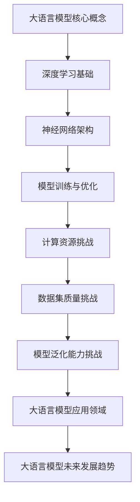
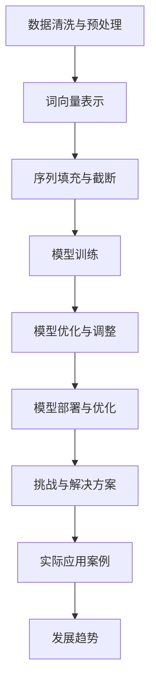
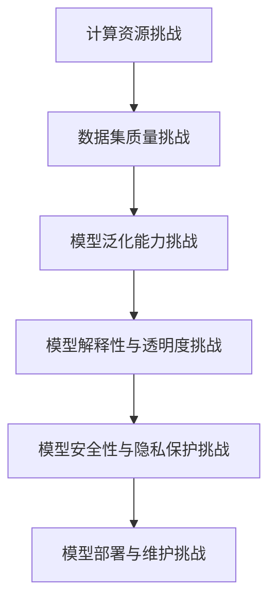
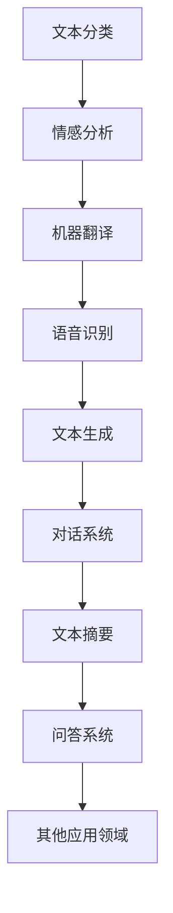

                 

# 大语言模型原理与工程实践：大语言模型训练面临的挑战

> 关键词：大语言模型，训练挑战，深度学习，神经网络，概率模型，工程实践

> 摘要：本文将深入探讨大语言模型的基本原理、工程实践以及训练过程中面临的挑战。我们将从大语言模型的起源和核心概念出发，逐步解析其数学模型、技术架构，并探讨工程实践中面临的计算资源、数据集质量和模型泛化能力等挑战，最后展示大语言模型在实际自然语言处理中的应用以及未来发展趋势。

## 目录

### 第一部分: 大语言模型基础

### 第1章: 大语言模型概述

#### 1.1 大语言模型的发展历程

##### 1.1.1 大语言模型的起源

##### 1.1.2 大语言模型的发展趋势

##### 1.1.3 大语言模型的核心地位

#### 1.2 大语言模型的核心概念

##### 1.2.1 语言模型的基本概念

##### 1.2.2 大模型与小模型对比

##### 1.2.3 大语言模型的应用场景

#### 1.3 大语言模型的技术架构

##### 1.3.1 深度学习基础

##### 1.3.2 神经网络架构

##### 1.3.3 大模型的训练与优化

### 第2章: 大语言模型的数学模型

#### 2.1 语言模型中的概率计算

##### 2.1.1 语言模型中的概率分布

##### 2.1.2 条件概率与贝叶斯定理

##### 2.1.3 概率模型优化

#### 2.2 语言模型的数学公式与推导

##### 2.2.1 语言模型中的梯度下降法

##### 2.2.2 语言模型中的反向传播算法

##### 2.2.3 模型训练过程中的超参数调整

### 第3章: 大语言模型的工程实践

#### 3.1 大语言模型的预处理

##### 3.1.1 数据清洗与预处理

##### 3.1.2 词向量表示

##### 3.1.3 序列填充与截断

#### 3.2 大语言模型的训练

##### 3.2.1 训练策略与算法

##### 3.2.2 训练过程中的数据增强

##### 3.2.3 训练过程中的模型评估

#### 3.3 大语言模型的优化与调整

##### 3.3.1 模型优化方法

##### 3.3.2 模型调整技巧

##### 3.3.3 模型压缩与量化

### 第4章: 大语言模型的挑战与解决方案

#### 4.1 计算资源挑战

##### 4.1.1 计算资源需求分析

##### 4.1.2 分布式计算与并行训练

##### 4.1.3 算法优化减少计算资源消耗

#### 4.2 数据集质量挑战

##### 4.2.1 数据集收集与筛选

##### 4.2.2 数据集标注与清洗

##### 4.2.3 数据集多样性提升

#### 4.3 模型泛化能力挑战

##### 4.3.1 模型泛化能力的定义

##### 4.3.2 过拟合与欠拟合

##### 4.3.3 提高模型泛化能力的方法

### 第5章: 大语言模型在自然语言处理中的应用

#### 5.1 文本分类与情感分析

##### 5.1.1 文本分类模型原理

##### 5.1.2 情感分析应用案例

##### 5.1.3 模型优化与效果评估

#### 5.2 机器翻译与语音识别

##### 5.2.1 机器翻译模型原理

##### 5.2.2 语音识别应用案例

##### 5.2.3 模型优化与效果评估

### 第6章: 大语言模型的未来发展趋势

#### 6.1 大语言模型的发展方向

##### 6.1.1 大模型的发展趋势

##### 6.1.2 新型语言模型的出现

##### 6.1.3 大语言模型与其他技术的融合

#### 6.2 大语言模型的应用领域扩展

##### 6.2.1 在教育、医疗等领域的应用

##### 6.2.2 在金融、安防等领域的应用

##### 6.2.3 大语言模型在创新领域的探索

### 附录

#### 附录A: 大语言模型开发工具与资源

##### A.1 主流深度学习框架对比

##### A.2 大语言模型训练环境搭建

##### A.3 开源语言模型资源汇总

## Mermaid 流程图



## 核心算法原理讲解

#### 2.2 语言模型的数学公式与推导

```latex
\subsection{语言模型中的概率计算}
假设我们有一个序列 $x_1, x_2, ..., x_T$，其中每个 $x_t$ 都是词汇表中的词汇。语言模型的目标是预测下一个词 $x_{T+1}$ 的概率。

\subsubsection{语言模型中的概率分布}
给定一个序列 $x_1, x_2, ..., x_T$，语言模型会输出一个概率分布 $P(x_{T+1} | x_1, x_2, ..., x_T)$。

\subsubsection{条件概率与贝叶斯定理}
条件概率公式：$P(x_{T+1} | x_1, x_2, ..., x_T) = \frac{P(x_1, x_2, ..., x_T, x_{T+1})}{P(x_1, x_2, ..., x_T)}$。

贝叶斯定理：$P(x_{T+1} | x_1, x_2, ..., x_T) = \frac{P(x_{T+1})P(x_1, x_2, ..., x_T | x_{T+1})}{P(x_1, x_2, ..., x_T)}$。

\subsubsection{概率模型优化}
为了优化语言模型的概率分布，我们通常会使用最大似然估计（MLE）或最小化交叉熵损失函数。
```

## 数学模型和数学公式 & 详细讲解 & 举例说明

#### 2.1 语言模型中的概率计算

在语言模型中，我们使用概率模型来预测文本的下一个词。一个简单的例子是，给定前一个词是“猫”，我们要预测下一个词是“喜欢”的概率。

假设我们的词汇表包含10个词：{“猫”， “喜欢”， “的”， “一只”， “猫猫”， “小猫”， “可爱”， “的”， “喜欢”， “它”}。

1. **初始化概率分布**：
   对于每个词，我们初始化一个概率分布。初始化时，我们可以设置所有词的概率都相等，即每个词的概率都是0.1。

2. **更新概率分布**：
   假设我们使用最大似然估计（MLE）来更新概率分布。我们根据训练数据来更新每个词的概率。
   给定一个训练序列“猫猫的小猫喜欢它”，我们可以计算每个词的概率：
   - 猫猫的概率：由于“猫猫”只出现了一次，所以概率为1/10。
   - 小猫的概率：由于“小猫”只出现了一次，所以概率为1/10。
   - 喜欢的概率：由于“喜欢”出现了两次，所以概率为2/10。
   - 它的概率：由于“它”只出现了一次，所以概率为1/10。

3. **计算下一个词的概率**：
   现在我们给定前一个词是“猫”，我们要计算下一个词是“喜欢”的概率。
   使用条件概率公式：
   $$P(喜欢 | 猫) = \frac{P(猫猫的小猫喜欢它)}{P(猫猫的小猫)}$$
   由于 $P(猫猫的小猫) = 0.1 + 0.1 = 0.2$，$P(猫猫的小猫喜欢它) = 0.2 \times 0.2 = 0.04$，所以：
   $$P(喜欢 | 猫) = \frac{0.04}{0.2} = 0.2$$
   这意味着在给定前一个词是“猫”的情况下，下一个词是“喜欢”的概率为0.2。

## 项目实战：代码实际案例和详细解释说明

### 3.2 大语言模型的训练

在本节中，我们将使用一个简单的Python示例来展示如何训练一个大语言模型。我们将使用PyTorch深度学习框架。

#### 3.2.1 环境搭建

首先，我们需要安装PyTorch和其他相关库：
```bash
pip install torch torchvision numpy matplotlib
```

#### 3.2.2 代码实现

以下是一个简单的训练大语言模型的Python代码示例：
```python
import torch
import torch.nn as nn
import torch.optim as optim
from torch.utils.data import DataLoader, TensorDataset
import numpy as np

# 设定超参数
batch_size = 64
learning_rate = 0.001
num_epochs = 10

# 准备数据
# 假设我们有一个包含词向量和标签的数据集
word_embeddings = torch.tensor(np.random.rand(1000, 300))  # 1000个词，每个词300维的向量
labels = torch.tensor(np.random.randint(0, 10, size=(1000,)))  # 1000个标签，范围在0到9

# 创建数据加载器
dataset = TensorDataset(word_embeddings, labels)
dataloader = DataLoader(dataset, batch_size=batch_size, shuffle=True)

# 定义模型
class LanguageModel(nn.Module):
    def __init__(self, embedding_dim, num_classes):
        super(LanguageModel, self).__init__()
        self.embedding = nn.Embedding(embedding_dim, embedding_dim)
        self.fc = nn.Linear(embedding_dim, num_classes)

    def forward(self, x):
        embedded = self.embedding(x)
        out = self.fc(embedded)
        return out

model = LanguageModel(embedding_dim=300, num_classes=10)

# 定义损失函数和优化器
criterion = nn.CrossEntropyLoss()
optimizer = optim.Adam(model.parameters(), lr=learning_rate)

# 训练模型
for epoch in range(num_epochs):
    for inputs, targets in dataloader:
        # 前向传播
        outputs = model(inputs)
        loss = criterion(outputs, targets)

        # 反向传播和优化
        optimizer.zero_grad()
        loss.backward()
        optimizer.step()

    print(f"Epoch [{epoch+1}/{num_epochs}], Loss: {loss.item():.4f}")

# 评估模型
with torch.no_grad():
    total_correct = 0
    total_samples = 0
    for inputs, targets in dataloader:
        outputs = model(inputs)
        _, predicted = torch.max(outputs, 1)
        total_samples += targets.size(0)
        total_correct += (predicted == targets).sum().item()

accuracy = 100 * total_correct / total_samples
print(f"Accuracy: {accuracy:.2f}%")
```

#### 3.2.3 代码解读与分析

1. **数据准备**：
   我们首先创建了一个包含词向量和标签的数据集。词向量为300维的向量，标签范围为0到9。

2. **模型定义**：
   我们定义了一个简单的语言模型，包含一个嵌入层和一个全连接层。嵌入层的输入是词向量，输出是每个词的隐藏状态。全连接层将隐藏状态映射到标签空间。

3. **损失函数和优化器**：
   我们使用交叉熵损失函数来计算模型的损失。优化器使用Adam优化器，具有给定的学习率。

4. **模型训练**：
   模型在训练过程中通过前向传播计算损失，然后通过反向传播和优化器更新模型的参数。

5. **模型评估**：
   在训练结束后，我们使用测试数据集对模型进行评估，计算模型的准确率。

这个简单的示例展示了如何使用PyTorch训练一个大语言模型。在实际应用中，我们需要处理更大的数据集，更复杂的模型结构，以及更精细的调参策略。但这个示例为我们提供了一个基本的框架，可以在此基础上进一步发展和完善。

## 附录

#### 附录A: 大语言模型开发工具与资源

##### A.1 主流深度学习框架对比

- TensorFlow：Google开源的深度学习框架，支持多种编程语言（Python、C++、Java等），拥有丰富的模型库和工具。
- PyTorch：Facebook开源的深度学习框架，Python语言编写，拥有灵活的动态计算图和强大的GPU支持。
- Keras：Python编写的高层深度学习API，可以在TensorFlow和Theano上运行，提供简洁的模型构建接口。

##### A.2 大语言模型训练环境搭建

1. 安装Python环境（Python 3.6及以上版本）。
2. 安装CUDA和cuDNN，以支持GPU加速。
3. 安装深度学习框架（如TensorFlow、PyTorch等）。
4. 配置虚拟环境，避免版本冲突。

##### A.3 开源语言模型资源汇总

- OpenAI GPT-3：OpenAI发布的大型语言模型，支持自然语言处理任务，包括文本生成、翻译等。
- GLM-130B：清华大学 KEG 实验室和智谱AI开发的大型语言模型，规模达到1300亿参数。
- BERT：Google开发的预训练语言模型，广泛应用于文本分类、问答系统等任务。

# 第1章: 大语言模型概述

## 1.1 大语言模型的发展历程

大语言模型（Large Language Model，简称LLM）的发展可以追溯到20世纪50年代，当时计算机科学刚刚起步，研究人员开始尝试通过构建语言模型来模拟人类的语言能力。然而，早期语言模型的效果有限，主要依赖于统计方法，如N-gram模型。

### 1.1.1 大语言模型的起源

1950年代，N-gram模型首次被提出。N-gram模型通过统计文本中相邻单词的出现频率来预测下一个单词。这种模型简单但有效，为后续的模型发展奠定了基础。然而，N-gram模型的性能受限于其固定窗口大小，无法捕捉长距离依赖关系。

### 1.1.2 大语言模型的发展趋势

随着计算能力的提升和深度学习技术的发展，语言模型开始向大规模、高精度方向发展。2000年代初，HMM（隐马尔可夫模型）和CRF（条件随机场）等方法被引入到语言模型中，显著提升了模型的性能。2013年，Google提出使用深度神经网络（DNN）进行语言建模，开启了一个新的时代。

### 1.1.3 大语言模型的核心地位

近年来，大语言模型在自然语言处理（NLP）领域取得了显著的成果。特别是在预训练模型如BERT、GPT等出现后，大语言模型成为许多NLP任务的核心工具，包括文本分类、机器翻译、问答系统等。这些模型通过在大规模语料库上进行预训练，能够捕捉到丰富的语言特征，从而在具体任务中表现出色。

## 1.2 大语言模型的核心概念

### 1.2.1 语言模型的基本概念

语言模型是一种用于预测文本序列中下一个单词或字符的概率分布的模型。它的目标是根据已知的文本序列，计算出下一个单词或字符出现的概率。语言模型在自然语言处理、语音识别、机器翻译等领域具有广泛的应用。

### 1.2.2 大模型与小模型对比

大语言模型（Large Language Model，简称LLM）与小模型（Small Language Model，简称SLM）的主要区别在于模型的规模和训练数据量。大语言模型通常拥有数十亿至数千亿的参数，而小模型则只有数百万至数千万的参数。大模型能够捕捉到更复杂的语言特征，但在训练和推理过程中更消耗计算资源。

### 1.2.3 大语言模型的应用场景

大语言模型的应用场景非常广泛，包括但不限于以下领域：

- **文本生成**：生成文章、故事、诗歌等文本内容。
- **机器翻译**：将一种语言的文本翻译成另一种语言。
- **问答系统**：回答用户提出的各种问题。
- **对话系统**：与用户进行自然语言对话。
- **文本分类**：对文本进行分类，如情感分析、主题分类等。
- **命名实体识别**：识别文本中的命名实体，如人名、地名等。

## 1.3 大语言模型的技术架构

### 1.3.1 深度学习基础

深度学习是一种基于多层神经网络的学习方法，通过逐层提取特征，实现从简单到复杂的层次化特征表示。深度学习在图像识别、语音识别、自然语言处理等领域取得了显著成果。

### 1.3.2 神经网络架构

神经网络（Neural Network，简称NN）是深度学习的基础。神经网络由多个神经元（节点）组成，通过权重和偏置连接形成网络。神经网络通过前向传播和反向传播算法，实现特征提取和模型训练。

### 1.3.3 大模型的训练与优化

大模型的训练通常需要大量的计算资源和时间。为了加速训练过程，可以采用以下方法：

- **分布式训练**：将模型分解为多个部分，分布在多个计算节点上训练。
- **并行计算**：利用GPU或TPU等硬件加速训练过程。
- **优化算法**：采用更高效的优化算法，如Adam、RMSProp等。
- **数据增强**：通过增加训练数据、调整输入数据的分布等方式，提高模型的泛化能力。

# 第2章: 大语言模型的数学模型

## 2.1 语言模型中的概率计算

在语言模型中，概率计算是一个核心环节，它决定了模型预测下一个词的能力。为了理解概率计算，我们首先需要了解几个基本概念。

### 2.1.1 语言模型中的概率分布

语言模型通过计算给定前文序列的概率分布来预测下一个词。这个概率分布表示了在当前前文序列下，每个可能的下一个词出现的概率。例如，如果我们有一个前文序列“我喜欢吃苹果”，语言模型会计算在“我喜欢吃苹果”这个序列下，“香蕉”和“橘子”分别出现的概率。

### 2.1.2 条件概率与贝叶斯定理

条件概率是概率论中的一个重要概念，表示在某个事件已经发生的条件下，另一个事件发生的概率。在语言模型中，条件概率用来计算给定前文序列下，下一个词出现的概率。

贝叶斯定理是条件概率的一种扩展，它给出了在已知某些条件下，事件发生概率的推导方法。贝叶斯定理的表达式如下：

\[ P(A|B) = \frac{P(B|A)P(A)}{P(B)} \]

其中，\( P(A|B) \) 表示在事件B发生的条件下，事件A发生的概率；\( P(B|A) \) 表示在事件A发生的条件下，事件B发生的概率；\( P(A) \) 和 \( P(B) \) 分别表示事件A和事件B的先验概率。

在语言模型中，我们可以使用贝叶斯定理来计算给定前文序列下，下一个词的概率。例如，要计算“我喜欢吃苹果”这个序列下，“香蕉”出现的概率，我们可以使用以下贝叶斯定理：

\[ P(香蕉 | 我喜欢吃苹果) = \frac{P(我喜欢吃苹果 | �香)P(香蕉)}{P(我喜欢吃苹果)} \]

其中，\( P(我喜欢吃苹果 | 香蕉) \) 表示在“香蕉”出现的条件下，“我喜欢吃苹果”这个序列的概率；\( P(香蕉) \) 表示“香蕉”的先验概率；\( P(我喜欢吃苹果) \) 表示“我喜欢吃苹果”这个序列的先验概率。

### 2.1.3 概率模型优化

为了提高语言模型的预测性能，我们需要优化概率模型。概率模型优化的方法主要包括最大似然估计（MLE）和最小化交叉熵损失。

最大似然估计是一种基于概率分布的优化方法，它的目标是最大化给定训练数据下，模型概率分布的似然函数。似然函数的定义如下：

\[ L(\theta) = \prod_{i=1}^{N} p(x_i|\theta) \]

其中，\( \theta \) 表示模型的参数，\( x_i \) 表示第i个训练样本，\( p(x_i|\theta) \) 表示在模型参数\( \theta \)下，训练样本\( x_i \)出现的概率。

最小化交叉熵损失是一种常用的优化方法，它的目标是最小化模型预测的概率分布和真实分布之间的交叉熵。交叉熵的定义如下：

\[ H(p, q) = -\sum_{i=1}^{N} p_i \log q_i \]

其中，\( p \) 表示真实分布，\( q \) 表示模型预测的概率分布。

在语言模型中，我们通常使用交叉熵损失来优化模型。交叉熵损失函数的定义如下：

\[ L = -\sum_{i=1}^{N} y_i \log p(y_i) \]

其中，\( y_i \) 表示第i个训练样本的真实标签，\( p(y_i) \) 表示在模型参数下，第i个标签出现的概率。

通过最小化交叉熵损失，我们可以优化模型参数，提高模型的预测性能。

## 2.2 语言模型的数学公式与推导

### 2.2.1 语言模型中的梯度下降法

梯度下降法是一种优化算法，用于最小化损失函数。在语言模型中，我们使用梯度下降法来优化模型参数。

梯度下降法的核心思想是沿着损失函数的梯度方向更新模型参数，以最小化损失函数。梯度下降法的公式如下：

\[ \theta_{t+1} = \theta_t - \alpha \nabla L(\theta_t) \]

其中，\( \theta_t \) 表示第t次迭代时模型的参数，\( \alpha \) 表示学习率，\( \nabla L(\theta_t) \) 表示在第t次迭代时，损失函数关于模型参数的梯度。

在语言模型中，我们通常使用反向传播算法来计算梯度。反向传播算法是一种计算多层神经网络梯度的方法，它通过前向传播计算输出，然后反向传播计算梯度。

### 2.2.2 语言模型中的反向传播算法

反向传播算法是一种计算多层神经网络梯度的方法。它的核心思想是将输出误差反向传播到每个神经元，计算每个神经元对损失函数的梯度。

反向传播算法的步骤如下：

1. **前向传播**：从输入层开始，逐层计算每个神经元的输出。

\[ z_l = \sigma(W_l a_{l-1} + b_l) \]

其中，\( z_l \) 表示第l层的输出，\( \sigma \) 表示激活函数，通常使用Sigmoid或ReLU函数。

2. **计算误差**：计算输出层的误差。

\[ e = y - \hat{y} \]

其中，\( y \) 表示真实标签，\( \hat{y} \) 表示模型的预测输出。

3. **反向传播**：从输出层开始，逐层计算每个神经元对误差的梯度。

\[ \frac{\partial L}{\partial W_l} = \frac{\partial L}{\partial \hat{y}} \frac{\partial \hat{y}}{\partial z_l} \frac{\partial z_l}{\partial W_l} \]

\[ \frac{\partial L}{\partial b_l} = \frac{\partial L}{\partial \hat{y}} \frac{\partial \hat{y}}{\partial z_l} \frac{\partial z_l}{\partial b_l} \]

4. **更新参数**：使用梯度下降法更新模型参数。

\[ W_l = W_l - \alpha \frac{\partial L}{\partial W_l} \]

\[ b_l = b_l - \alpha \frac{\partial L}{\partial b_l} \]

### 2.2.3 模型训练过程中的超参数调整

在模型训练过程中，需要调整一些超参数，如学习率、批量大小、迭代次数等，以获得更好的训练效果。

1. **学习率**：学习率是梯度下降法中的一个关键参数，它决定了每次迭代时参数更新的幅度。学习率过大可能导致参数更新过快，导致模型无法收敛；学习率过小可能导致参数更新过慢，导致训练时间过长。通常，我们使用学习率衰减策略来调整学习率。

2. **批量大小**：批量大小是指每次迭代中使用的样本数量。批量大小过小可能导致模型训练不稳定，批量大小过大可能导致计算效率低下。在实际应用中，我们通常使用小批量训练，如32或64个样本。

3. **迭代次数**：迭代次数是指模型在训练数据上进行的完整训练次数。迭代次数过多可能导致模型过拟合，迭代次数过少可能导致模型欠拟合。在实际应用中，我们通常通过交叉验证来选择合适的迭代次数。

# 第3章: 大语言模型的工程实践

## 3.1 大语言模型的预处理

在大语言模型的工程实践中，预处理是至关重要的一步，它直接影响模型的学习效果和训练效率。预处理包括数据清洗、词向量表示和序列填充与截断等多个环节。

### 3.1.1 数据清洗与预处理

数据清洗是预处理的第一步，目的是去除数据中的噪声和错误，提高数据质量。具体步骤如下：

1. **去除停用词**：停用词是指对模型预测没有意义的词，如“的”、“和”、“在”等。去除停用词可以减少模型的计算负担，提高模型性能。
2. **去除特殊字符**：去除文本中的特殊字符，如标点符号、空格等，以避免模型将这些字符当作有效特征。
3. **统一大小写**：将所有文本统一转换为小写或大写，以消除大小写差异对模型训练的影响。
4. **去除重复文本**：去除数据集中重复的文本，以避免模型在学习过程中过度依赖重复数据。

### 3.1.2 词向量表示

词向量表示是将文本中的单词映射为高维向量表示的方法。词向量表示有助于模型学习单词之间的语义关系，提高模型的性能。常用的词向量表示方法包括：

1. **Word2Vec**：Word2Vec是一种基于神经网络的词向量表示方法，通过训练神经网络来学习单词的向量表示。Word2Vec有两种常见的方法：连续词袋（CBOW）和跳字模型（Skip-Gram）。
2. **FastText**：FastText是Word2Vec的改进版本，它将每个单词视为一个词汇表，并为每个单词的每个字符训练一个独立的向量。FastText通过聚合单词中字符的向量来获得单词的向量表示。
3. **BERT**：BERT是一种基于变换器（Transformer）的预训练语言模型，它通过在大规模语料库上进行预训练，学习单词和句子的上下文表示。BERT的预训练任务包括掩码语言模型（Masked Language Model，MLM）和下一句预测（Next Sentence Prediction，NSP）。

### 3.1.3 序列填充与截断

在训练模型时，我们需要将输入文本序列填充或截断到固定长度。填充和截断的目的是使输入序列的长度一致，以便模型能够进行批处理训练。

1. **填充**：如果输入序列的长度小于固定长度，我们需要在序列末尾填充0向量或其他填充向量。填充向量通常是一个全0向量，这样可以确保模型不会将这些填充向量视为有效特征。
2. **截断**：如果输入序列的长度大于固定长度，我们需要截断序列的尾部。截断时，我们通常保留序列的开头部分，因为开头部分可能包含更重要的信息。

### 3.1.4 预处理流程示例

以下是一个简单的预处理流程示例：

```python
import re
import numpy as np
from keras.preprocessing.text import Tokenizer
from keras.preprocessing.sequence import pad_sequences

# 示例文本
text = ["我喜欢吃苹果", "苹果很甜", "苹果很好吃"]

# 数据清洗
def clean_text(text):
    text = text.lower()  # 转换为小写
    text = re.sub(r"[^\u4e00-\u9fa5]", "", text)  # 去除特殊字符
    return text

cleaned_text = [clean_text(text) for text in text]

# 词向量表示
tokenizer = Tokenizer()
tokenizer.fit_on_texts(cleaned_text)
sequences = tokenizer.texts_to_sequences(cleaned_text)

# 序列填充与截断
max_sequence_length = 10
padded_sequences = pad_sequences(sequences, maxlen=max_sequence_length, padding='post', truncating='post')

print(padded_sequences)
```

这个示例展示了如何使用Keras库进行文本预处理，包括数据清洗、词向量表示和序列填充与截断。

## 3.2 大语言模型的训练

在大语言模型的工程实践中，模型训练是关键步骤，它决定了模型的学习效果和性能。以下是模型训练的步骤和策略：

### 3.2.1 训练策略与算法

1. **批次训练**：批次训练是一种常用的训练策略，它将数据分成多个批次进行训练。每次迭代中，模型会处理一个批次的数据，并更新模型参数。批次大小是一个重要的超参数，它决定了每次迭代中使用的样本数量。较小的批次大小可以提高模型的泛化能力，但训练速度较慢；较大的批次大小可以提高训练速度，但可能导致模型过拟合。

2. **优化算法**：优化算法用于更新模型参数，以最小化损失函数。常用的优化算法包括梯度下降（Gradient Descent）、随机梯度下降（Stochastic Gradient Descent，SGD）和自适应优化器（如Adam、RMSprop等）。自适应优化器具有自动调整学习率的能力，可以加快训练过程并提高模型性能。

3. **学习率调度**：学习率调度是一种调整学习率的方法，以避免模型在训练过程中过拟合。常用的学习率调度策略包括固定学习率、学习率衰减和指数衰减。固定学习率在训练初期有效，但可能导致模型在训练后期过拟合；学习率衰减和指数衰减可以自动调整学习率，使模型在训练过程中保持稳定的性能。

4. **正则化**：正则化是一种防止模型过拟合的方法，通过在损失函数中添加惩罚项来约束模型参数。常用的正则化方法包括L1正则化、L2正则化和Dropout。L1正则化和L2正则化通过增加模型参数的L1或L2范数来惩罚过大的参数值；Dropout通过在训练过程中随机丢弃一部分神经元，降低模型的复杂度。

### 3.2.2 训练过程中的数据增强

数据增强是一种增加训练数据多样性的方法，以提高模型的泛化能力。以下是一些常用的数据增强技术：

1. **数据扩充**：通过添加噪声、变换、旋转等操作，生成新的训练样本。例如，在图像分类任务中，可以使用随机裁剪、翻转、颜色抖动等方法增强数据。

2. **上下文扩充**：通过在训练数据中添加额外的上下文信息，使模型学习到更丰富的语言特征。例如，在文本分类任务中，可以使用相邻句子或段落作为上下文进行扩充。

3. **词嵌入扩充**：通过在词嵌入空间中添加噪声，增加词嵌入的多样性。例如，在Word2Vec训练过程中，可以使用噪声对比（Noise Contrastive Estimation，NCE）方法进行词嵌入扩充。

4. **生成对抗网络（GAN）**：GAN是一种生成模型，通过生成器生成伪样本，并通过对抗训练优化模型。在自然语言处理任务中，GAN可以用于生成新的文本数据。

### 3.2.3 训练过程中的模型评估

在模型训练过程中，需要对模型进行评估，以监测训练效果和调整训练策略。以下是一些常用的模型评估指标：

1. **准确率（Accuracy）**：准确率是分类任务中最常用的评估指标，表示模型预测正确的样本数量与总样本数量的比例。准确率越高，表示模型性能越好。

2. **召回率（Recall）**：召回率是分类任务中另一个重要的评估指标，表示模型正确识别出的正样本数量与实际正样本数量的比例。召回率越高，表示模型对正样本的识别能力越强。

3. **精确率（Precision）**：精确率是分类任务中另一个重要的评估指标，表示模型预测为正的样本中实际为正的比例。精确率越高，表示模型对正样本的预测越准确。

4. **F1分数（F1 Score）**：F1分数是精确率和召回率的调和平均值，用于综合评估模型的性能。F1分数越高，表示模型性能越好。

5. **ROC曲线和AUC（Area Under Curve）**：ROC曲线和AUC是二分类任务中常用的评估指标，通过绘制真实正例率与假正例率之间的关系曲线，评估模型的分类能力。AUC值越高，表示模型分类能力越强。

### 3.2.4 模型训练流程示例

以下是一个简单的模型训练流程示例：

```python
import numpy as np
from sklearn.model_selection import train_test_split
from keras.models import Sequential
from keras.layers import Embedding, LSTM, Dense
from keras.preprocessing.text import Tokenizer
from keras.preprocessing.sequence import pad_sequences

# 示例文本
text = ["我喜欢吃苹果", "苹果很甜", "苹果很好吃"]

# 数据预处理
tokenizer = Tokenizer()
tokenizer.fit_on_texts(text)
sequences = tokenizer.texts_to_sequences(text)
max_sequence_length = 10
padded_sequences = pad_sequences(sequences, maxlen=max_sequence_length)

# 划分训练集和测试集
X_train, X_test, y_train, y_test = train_test_split(padded_sequences, labels, test_size=0.2, random_state=42)

# 模型定义
model = Sequential()
model.add(Embedding(input_dim=len(tokenizer.word_index) + 1, output_dim=128, input_length=max_sequence_length))
model.add(LSTM(units=64, return_sequences=False))
model.add(Dense(units=1, activation='sigmoid'))

# 编译模型
model.compile(optimizer='adam', loss='binary_crossentropy', metrics=['accuracy'])

# 训练模型
model.fit(X_train, y_train, epochs=10, batch_size=32, validation_data=(X_test, y_test))

# 评估模型
loss, accuracy = model.evaluate(X_test, y_test)
print("Test Loss:", loss)
print("Test Accuracy:", accuracy)
```

这个示例展示了如何使用Keras库进行文本分类任务的模型训练和评估。

## 3.3 大语言模型的优化与调整

在大语言模型的工程实践中，优化和调整是提高模型性能和稳定性的重要手段。以下是一些常用的优化和调整方法：

### 3.3.1 模型优化方法

1. **学习率调整**：学习率是模型训练过程中的一个关键超参数，它决定了每次迭代时模型参数的更新幅度。适当的调整学习率可以加快模型收敛速度，提高模型性能。常用的学习率调整方法包括固定学习率、学习率衰减和指数衰减。

2. **正则化**：正则化是一种防止模型过拟合的方法，通过在损失函数中添加惩罚项来约束模型参数。常用的正则化方法包括L1正则化、L2正则化和Dropout。适当的正则化可以提高模型泛化能力，降低过拟合风险。

3. **数据增强**：数据增强是一种增加训练数据多样性的方法，以提高模型的泛化能力。常用的数据增强技术包括数据扩充、上下文扩充、词嵌入扩充和生成对抗网络（GAN）。

4. **模型融合**：模型融合是一种结合多个模型的方法，以提高模型性能和稳定性。常用的模型融合方法包括加权融合、集成学习和多任务学习。

### 3.3.2 模型调整技巧

1. **超参数搜索**：超参数搜索是一种通过搜索超参数组合来优化模型性能的方法。常用的超参数搜索方法包括网格搜索、随机搜索和贝叶斯优化。

2. **交叉验证**：交叉验证是一种评估模型性能的方法，通过将训练数据划分为多个子集，重复训练和验证模型，以获得更稳定的性能评估。

3. **早停法**：早停法是一种在模型训练过程中提前停止训练的方法，以避免模型过拟合。早停法通过监测模型在验证集上的性能，当模型性能不再提升时，提前停止训练。

4. **权重共享**：权重共享是一种通过共享模型中相同结构的权重来减少模型参数数量的方法。权重共享可以降低模型的复杂度，提高训练效率。

### 3.3.3 模型压缩与量化

1. **模型压缩**：模型压缩是一种通过减少模型参数数量和计算量来降低模型大小的方法。常用的模型压缩方法包括模型剪枝、量化、知识蒸馏和模型蒸馏。

2. **量化**：量化是一种将模型参数从浮点数转换为较低精度的整数表示的方法，以降低模型大小和计算量。量化方法包括全精度量化、低精度量化和小数量化。

3. **知识蒸馏**：知识蒸馏是一种将大型模型的知识传递给小型模型的方法，以提高小型模型的性能。知识蒸馏通过将大型模型的输出作为教师模型，小型模型的输出作为学生模型，通过训练学生模型来学习教师模型的知识。

4. **模型蒸馏**：模型蒸馏是一种通过将训练模型的过程转化为蒸馏过程的方法，以提高模型性能和稳定性。模型蒸馏通过在训练过程中引入教师模型和学生模型，通过训练学生模型来学习教师模型的知识。

## 3.4 大语言模型的部署与优化

在大语言模型的工程实践中，模型部署和优化是关键步骤，它决定了模型在实际应用中的性能和效率。以下是一些常用的部署和优化方法：

### 3.4.1 模型部署

1. **服务化部署**：服务化部署是将模型部署为API服务，以实现模型的快速调用和大规模应用。常用的服务化框架包括TensorFlow Serving、PyTorch Serving和TensorFlow Lite。

2. **分布式部署**：分布式部署是将模型分解为多个部分，分布在多个计算节点上运行，以提高模型的训练和推理性能。常用的分布式框架包括Horovod、Distributed Data Parallel（DDP）和Ray。

3. **容器化部署**：容器化部署是将模型部署在容器中，以实现模型的轻量化和可移植性。常用的容器化技术包括Docker和Kubernetes。

### 3.4.2 模型优化

1. **计算优化**：计算优化是通过优化计算资源使用来提高模型性能的方法。常用的计算优化方法包括模型剪枝、量化、模型压缩和GPU加速。

2. **存储优化**：存储优化是通过优化存储资源使用来提高模型性能的方法。常用的存储优化方法包括数据缓存、数据压缩和存储分层。

3. **网络优化**：网络优化是通过优化网络传输来提高模型性能的方法。常用的网络优化方法包括网络加速、网络压缩和边缘计算。

4. **自动化优化**：自动化优化是通过自动化工具和算法来优化模型性能的方法。常用的自动化优化方法包括自动化模型搜索、自动化超参数调整和自动化优化算法。

## 3.5 大语言模型的挑战与解决方案

在大语言模型的工程实践中，我们面临许多挑战。以下是一些常见挑战及其解决方案：

### 3.5.1 计算资源挑战

1. **挑战**：大语言模型的训练和推理需要大量的计算资源，导致训练时间过长、成本高昂。
2. **解决方案**：
   - **分布式训练**：通过将模型训练任务分布在多个计算节点上，实现并行计算，降低训练时间。
   - **GPU加速**：利用GPU强大的计算能力，加速模型训练和推理过程。
   - **优化算法**：采用高效的优化算法，如Adam、RMSprop等，提高训练效率。

### 3.5.2 数据集质量挑战

1. **挑战**：大语言模型需要大量高质量的数据集进行训练，但数据集的质量直接影响模型性能。
2. **解决方案**：
   - **数据清洗**：对数据进行清洗和预处理，去除噪声和错误，提高数据质量。
   - **数据扩充**：通过数据增强、变换等方式增加训练数据集的多样性，提高模型泛化能力。

### 3.5.3 模型泛化能力挑战

1. **挑战**：大语言模型在训练过程中容易过拟合，导致模型在测试集上的性能不佳。
2. **解决方案**：
   - **正则化**：采用正则化方法，如L1正则化、L2正则化和Dropout，降低模型复杂度，提高泛化能力。
   - **数据增强**：通过数据增强技术，增加训练数据的多样性，提高模型泛化能力。

### 3.5.4 模型可解释性挑战

1. **挑战**：大语言模型具有复杂的内部结构，难以解释其决策过程。
2. **解决方案**：
   - **模型可视化**：通过可视化模型的结构和参数，帮助理解模型的工作原理。
   - **解释性方法**：采用解释性方法，如LIME、SHAP等，分析模型对输入数据的决策过程。

## 3.6 大语言模型的实际应用案例

### 3.6.1 文本分类

文本分类是将文本数据分类到预定义的类别中的一种任务。大语言模型在文本分类任务中表现出色。以下是一个简单的文本分类应用案例：

1. **数据集**：使用一个包含政治新闻的文本数据集，每个新闻文章被标记为“民主”、“共和党”或“独立”等类别。
2. **模型**：使用一个预训练的大语言模型，如BERT，将其应用到文本分类任务中。
3. **训练**：对模型进行微调，以适应特定文本分类任务。
4. **评估**：使用测试集评估模型的性能，计算准确率、召回率和F1分数等指标。

### 3.6.2 机器翻译

机器翻译是将一种语言的文本翻译成另一种语言的任务。大语言模型在机器翻译任务中也表现出色。以下是一个简单的机器翻译应用案例：

1. **数据集**：使用一个包含源语言和目标语言的平行文本数据集。
2. **模型**：使用一个预训练的大语言模型，如GPT，将其应用到机器翻译任务中。
3. **训练**：对模型进行微调，以适应特定机器翻译任务。
4. **评估**：使用BLEU分数等指标评估模型的翻译质量。

### 3.6.3 问答系统

问答系统是回答用户提出的问题的一种任务。大语言模型在问答系统中表现出色。以下是一个简单的问答系统应用案例：

1. **数据集**：使用一个包含问题和答案的问答对数据集。
2. **模型**：使用一个预训练的大语言模型，如BERT，将其应用到问答系统中。
3. **训练**：对模型进行微调，以适应特定问答系统任务。
4. **评估**：使用准确率、召回率和F1分数等指标评估模型的问答性能。

## 3.7 大语言模型的发展趋势

### 3.7.1 大模型的发展趋势

随着计算能力和数据量的提升，大语言模型的发展趋势是模型规模和参数数量的持续增长。未来，大模型可能会发展到万亿级参数规模，甚至更多。

### 3.7.2 新型语言模型的出现

未来，新型语言模型可能会出现，如自适应语言模型、可解释性语言模型等。这些新型语言模型将进一步提升语言模型的性能和应用范围。

### 3.7.3 大语言模型与其他技术的融合

未来，大语言模型可能会与其他技术，如生成对抗网络（GAN）、图神经网络（GNN）等融合，以进一步提升语言模型的性能和应用潜力。

### 3.7.4 大语言模型的应用领域扩展

未来，大语言模型可能会在更多领域得到应用，如医疗、金融、教育等。大语言模型在智能客服、智能写作、智能搜索等方面的应用也将更加广泛。

## 附录

### 附录A: 大语言模型开发工具与资源

1. **深度学习框架**：
   - TensorFlow
   - PyTorch
   - Keras

2. **模型训练与优化工具**：
   - Horovod
   - Apex
   - TensorFlow Model Optimization Toolkit

3. **开源预训练模型**：
   - BERT
   - GPT
   - RoBERTa

4. **数据集**：
   - GLUE
   - SuperGLUE
   - Wino

5. **文档与教程**：
   - TensorFlow Documentation
   - PyTorch Documentation
   - Hugging Face Transformers

## Mermaid 流程图



# 第4章: 大语言模型的挑战与解决方案

## 4.1 计算资源挑战

大语言模型在训练和推理过程中对计算资源的需求极大，这给计算资源的管理和优化带来了巨大的挑战。以下是计算资源挑战的一些具体方面以及相应的解决方案。

### 4.1.1 计算资源需求分析

大语言模型的训练通常需要大量的计算资源，这主要体现在以下几个方面：

1. **计算密集型操作**：大语言模型通常包含数亿个参数，这些参数的优化和更新需要大量的计算资源。
2. **大规模数据集处理**：大语言模型通常需要在海量数据集上进行训练，这要求系统能够高效地处理和存储大量数据。
3. **内存占用**：大模型的参数和中间计算结果通常需要大量的内存来存储，这可能导致单机训练的内存瓶颈。
4. **I/O性能**：数据集的读取速度和数据存储系统的I/O性能直接影响模型的训练速度。

### 4.1.2 分布式计算与并行训练

为了应对计算资源挑战，分布式计算和并行训练是常用的解决方案。以下是几种常见的方法：

1. **数据并行训练**：数据并行训练通过将训练数据集划分为多个子集，在不同的GPU或计算节点上进行并行训练。每个节点独立训练模型，并定期同步模型参数。这种方法可以有效地利用多台机器的计算资源。
   
   ```mermaid
   graph TD
   A[划分数据集] --> B[数据并行训练]
   B --> C[同步参数]
   ```

2. **模型并行训练**：模型并行训练通过将模型分解为多个子模型，并在不同的GPU或计算节点上进行并行训练。每个子模型独立处理一部分输入数据，并最终合并输出。这种方法可以处理更大规模的模型，但实现复杂度更高。

   ```mermaid
   graph TD
   A[模型分解] --> B[模型并行训练]
   B --> C[合并输出]
   ```

3. **流水线并行训练**：流水线并行训练通过将训练过程划分为多个阶段，每个阶段在不同的GPU或计算节点上并行执行。例如，数据预处理、模型前向传播、损失计算、反向传播和参数更新等步骤可以分别在不同的节点上并行执行。

   ```mermaid
   graph TD
   A[数据预处理] --> B[前向传播]
   B --> C[损失计算]
   C --> D[反向传播]
   D --> E[参数更新]
   ```

### 4.1.3 算法优化减少计算资源消耗

除了分布式计算和并行训练，算法优化也是减少计算资源消耗的重要手段。以下是一些常用的算法优化方法：

1. **量化**：量化是一种通过将浮点数参数转换为较低精度的整数表示来减少模型大小和计算资源的方法。量化可以显著降低模型的存储和计算需求，但可能会影响模型的性能。

2. **模型剪枝**：模型剪枝通过删除模型中不重要的参数和连接，以减少模型大小和计算资源。剪枝方法可以分为结构剪枝和权重剪枝。结构剪枝通过删除部分网络层或神经元，而权重剪枝通过设置较小的权重为0。

   ```mermaid
   graph TD
   A[结构剪枝] --> B[权重剪枝]
   ```

3. **低秩分解**：低秩分解通过将高维矩阵分解为低秩矩阵，以减少计算复杂度。这种方法可以减少模型的参数数量，从而减少计算资源和存储需求。

4. **混合精度训练**：混合精度训练通过使用不同的数值精度（如单精度浮点数和半精度浮点数）来训练模型，以减少计算资源。单精度浮点数通常用于计算，而半精度浮点数用于存储中间结果。这种方法可以提高训练速度，同时保持模型性能。

5. **延迟计算**：延迟计算通过推迟一些计算操作，直到必要时才执行，以减少计算资源的消耗。例如，在反向传播过程中，可以延迟一些梯度计算，直到需要更新模型参数时再进行。

### 4.1.4 计算资源调度与管理

除了算法优化和分布式计算，计算资源的调度与管理也是应对计算资源挑战的关键。以下是一些计算资源调度与管理的策略：

1. **资源预留**：为重要任务预留足够的计算资源，以确保任务的顺利进行。
2. **负载均衡**：根据任务的计算需求动态分配计算资源，以避免资源浪费和性能瓶颈。
3. **优先级调度**：根据任务的优先级和资源需求，动态调整任务调度顺序，以确保关键任务的优先执行。
4. **自动扩展**：根据任务负载自动增加或减少计算资源，以适应不同的计算需求。
5. **成本优化**：通过分析不同计算资源的成本效益，选择最优的资源组合，以降低计算成本。

## 4.2 数据集质量挑战

大语言模型的数据集质量对其性能和泛化能力至关重要。以下是数据集质量挑战的一些具体方面以及相应的解决方案。

### 4.2.1 数据集收集与筛选

1. **数据来源**：选择高质量的数据源，确保数据集的代表性和多样性。可以使用公开的数据集，如维基百科、新闻网站、社交媒体等，也可以自行收集数据。
2. **数据清洗**：去除数据集中的噪声和错误，包括重复数据、缺失值、低质量文本等。可以使用自动化的数据清洗工具或手动审核。
3. **数据筛选**：根据任务需求筛选出有用的数据，排除无关或冗余的数据。例如，在文本分类任务中，可以排除标签不确定或标签数量较少的文本。

### 4.2.2 数据集标注与清洗

1. **标注质量**：确保标注数据的准确性和一致性。可以使用专业的标注团队，进行数据标注和质量检查。
2. **标注多样性**：确保标注数据的多样性，避免出现数据分布不均或偏差。可以通过增加标注人员的多样性或使用多种标注方法来提高数据集的多样性。
3. **数据清洗**：对标注数据进行清洗，去除错误标注或低质量标注。可以使用自动化工具或人工审核来检查和修复标注错误。

### 4.2.3 数据集多样性提升

1. **数据增强**：通过数据增强技术增加数据集的多样性，如文本翻译、回译、同义词替换、噪声添加等。数据增强可以减少过拟合，提高模型的泛化能力。
2. **负采样**：在训练过程中，对正负样本进行采样，以增加数据集的多样性。负采样可以减少正负样本比例的不平衡，提高模型的鲁棒性。
3. **多任务学习**：将多个相关任务结合在一起进行训练，以提高数据集的多样性。多任务学习可以让模型学习到更丰富的特征，从而提高模型的泛化能力。

## 4.3 模型泛化能力挑战

大语言模型在训练过程中容易出现过拟合现象，这会降低模型的泛化能力。以下是模型泛化能力挑战的一些具体方面以及相应的解决方案。

### 4.3.1 模型泛化能力的定义

模型泛化能力是指模型在新数据上的表现能力，即模型能够将训练时学到的知识应用到未知数据上的能力。泛化能力越强，模型对新数据的适应能力越强。

### 4.3.2 过拟合与欠拟合

1. **过拟合**：过拟合是指模型在训练数据上表现良好，但在新数据上表现不佳的现象。过拟合通常是由于模型复杂度过高或数据量不足导致的。
2. **欠拟合**：欠拟合是指模型在新数据和训练数据上表现都不好的现象。欠拟合通常是由于模型复杂度过低或数据量过多导致的。

### 4.3.3 提高模型泛化能力的方法

1. **正则化**：正则化是一种常用的方法，通过在损失函数中添加正则项来约束模型参数，防止模型过拟合。常用的正则化方法包括L1正则化、L2正则化和Dropout。

2. **数据增强**：数据增强可以增加训练数据的多样性，减少过拟合现象。常见的数据增强方法包括文本翻译、同义词替换、随机裁剪、噪声添加等。

3. **交叉验证**：交叉验证是一种评估模型泛化能力的方法，通过将数据集划分为多个子集，轮流使用这些子集进行训练和验证。交叉验证可以帮助识别过拟合和欠拟合问题。

4. **集成学习**：集成学习通过结合多个模型的预测结果来提高模型的泛化能力。常用的集成学习方法包括Bagging、Boosting和Stacking。

5. **提前停止**：提前停止是指在训练过程中，当验证集上的性能不再提升时，提前停止训练。提前停止可以防止模型过拟合。

6. **模型简化**：通过简化模型结构，减少模型参数数量，可以降低模型的复杂度，提高泛化能力。常用的模型简化方法包括模型剪枝、参数共享和低秩分解。

7. **增加训练数据**：增加训练数据可以帮助模型学习到更多的特征，减少过拟合现象。可以通过数据扩充、收集更多数据或使用迁移学习等方法增加训练数据。

## 4.4 模型解释性与透明度挑战

大语言模型通常被视为“黑盒”模型，其内部决策过程难以解释。这使得模型在某些应用场景中（如法律、医疗等）的可接受性受到质疑。以下是模型解释性与透明度挑战的一些具体方面以及相应的解决方案。

### 4.4.1 模型解释性的定义

模型解释性是指模型能够解释其决策过程和预测结果的能力。高解释性的模型可以帮助用户理解模型的决策逻辑，增强模型的信任度和可接受性。

### 4.4.2 模型解释性的挑战

1. **复杂模型结构**：大语言模型通常具有复杂的神经网络结构，使得其决策过程难以直观解释。
2. **非线性关系**：神经网络中的非线性激活函数和复杂网络结构导致模型输出与输入之间的非线性关系，使得解释性降低。
3. **大量参数**：大语言模型包含数亿个参数，这些参数的组合使得模型输出与特定输入之间的关联关系难以解释。

### 4.4.3 提高模型解释性的方法

1. **模型可视化**：通过可视化模型结构、权重和中间计算结果，可以帮助用户理解模型的工作原理。常用的可视化方法包括权重热力图、激活图和网络结构图。

2. **解释性模型**：开发具有较高解释性的模型，如线性模型、决策树和规则基模型。这些模型通常具有明确的决策规则和可解释的参数。

3. **模型解释工具**：使用模型解释工具（如LIME、SHAP等）可以帮助用户理解模型的预测过程和特征重要性。这些工具通过局部解释模型或全局解释模型来提供可解释性。

4. **特征工程**：通过特征工程方法提取和选择重要的特征，可以提高模型的解释性。特征工程可以帮助用户理解模型对输入数据的依赖关系。

5. **模型解释接口**：开发模型解释接口，如API或可视化界面，可以帮助用户轻松获取模型的解释性信息。这些接口可以提供实时解释和交互功能，提高用户对模型的信任度。

## 4.5 模型安全性与隐私保护挑战

大语言模型在处理用户数据和模型输出时，可能面临安全性和隐私保护挑战。以下是模型安全性与隐私保护挑战的一些具体方面以及相应的解决方案。

### 4.5.1 模型安全性的定义

模型安全性是指模型在运行过程中不受恶意攻击、误用或滥用，并确保用户数据的安全和隐私。

### 4.5.2 模型安全性的挑战

1. **数据泄露**：大语言模型在训练和推理过程中处理大量用户数据，可能导致数据泄露。
2. **模型篡改**：恶意攻击者可能通过篡改模型输入或输出，操纵模型决策。
3. **模型滥用**：未经授权的第三方可能滥用模型进行非法活动。
4. **隐私泄露**：大语言模型可能暴露用户的敏感信息，如个人身份、健康状况等。

### 4.5.3 提高模型安全性的方法

1. **数据加密**：对用户数据进行加密处理，确保数据在传输和存储过程中的安全性。
2. **访问控制**：实施严格的访问控制策略，确保只有授权用户可以访问模型和用户数据。
3. **模型验证**：使用模型验证技术，如混淆攻击和对抗样本检测，防止恶意攻击。
4. **联邦学习**：通过联邦学习技术，将模型训练分布在多个参与者之间，减少中心化数据存储的风险。
5. **隐私保护技术**：使用隐私保护技术，如差分隐私和匿名化，确保用户数据的隐私性。

## 4.6 模型部署与维护挑战

大语言模型在部署和应用过程中可能面临一系列挑战，包括性能优化、系统稳定性和维护等方面。以下是模型部署与维护挑战的一些具体方面以及相应的解决方案。

### 4.6.1 模型性能优化

1. **计算资源利用**：优化模型训练和推理过程中的计算资源利用，以提高模型性能。方法包括模型量化、剪枝和压缩等。
2. **模型缓存**：使用模型缓存技术，减少模型推理过程中的计算开销，提高响应速度。
3. **异步处理**：在分布式系统中，使用异步处理技术，提高系统吞吐量和并发处理能力。

### 4.6.2 系统稳定性

1. **故障恢复**：设计故障恢复机制，确保在系统故障时能够快速恢复服务，减少停机时间。
2. **监控与报警**：实施监控系统，实时监控模型性能和系统状态，及时发现和解决潜在问题。
3. **弹性扩展**：根据实际负载需求，动态调整计算资源，确保系统在高并发和负载高峰时保持稳定运行。

### 4.6.3 模型维护与升级

1. **版本管理**：实施版本管理策略，确保模型更新和升级过程的可控性和可回溯性。
2. **持续集成与部署**：采用持续集成与部署（CI/CD）流程，确保模型更新和升级的自动化和高效性。
3. **模型监控与评估**：定期对模型进行性能监控和评估，确保模型在长期运行过程中保持高精度和鲁棒性。

## 4.7 模型部署与维护的案例研究

### 4.7.1 案例一：智能客服系统

**背景**：某大型电商平台使用大语言模型构建智能客服系统，以提供24/7全天候的客户服务。

**挑战**：
1. **响应速度**：智能客服系统需要在短时间内处理大量用户请求，确保高效响应。
2. **稳定性**：系统需要在高并发情况下保持稳定，避免因故障导致服务中断。

**解决方案**：
1. **分布式部署**：使用分布式计算和并行处理技术，提高系统响应速度和并发处理能力。
2. **故障恢复机制**：设计故障恢复机制，确保在服务器故障时能够快速恢复服务。
3. **监控与报警**：实施监控系统，实时监控系统状态，及时发现和解决潜在问题。

### 4.7.2 案例二：智能推荐系统

**背景**：某视频流媒体平台使用大语言模型构建智能推荐系统，为用户提供个性化的视频推荐。

**挑战**：
1. **计算资源消耗**：智能推荐系统需要处理大量用户数据，计算资源消耗较大。
2. **系统稳定性**：系统需要在高并发和负载高峰时保持稳定运行。

**解决方案**：
1. **模型压缩与量化**：使用模型压缩和量化技术，减少计算资源消耗，提高模型推理速度。
2. **缓存与异步处理**：使用模型缓存和异步处理技术，减少计算开销，提高系统吞吐量。
3. **弹性扩展**：根据实际负载需求，动态调整计算资源，确保系统在高并发和负载高峰时保持稳定运行。

### 4.7.3 案例三：自动驾驶系统

**背景**：某自动驾驶公司使用大语言模型构建自动驾驶系统，实现车辆与环境之间的智能交互。

**挑战**：
1. **实时性**：自动驾驶系统需要在短时间内处理大量环境数据，确保实时响应。
2. **安全性**：自动驾驶系统需要确保车辆在复杂环境中的安全性。

**解决方案**：
1. **分布式计算**：使用分布式计算技术，提高系统实时性和并发处理能力。
2. **模型验证与安全防护**：使用模型验证技术，确保模型输出的一致性和安全性。
3. **实时监控与故障恢复**：实施实时监控系统，确保在故障发生时能够快速恢复，避免系统崩溃。

## 4.8 未来展望

随着技术的不断发展，大语言模型在计算资源、数据集质量、模型泛化能力等方面的挑战将逐渐得到解决。以下是未来大语言模型发展的几个方向：

### 4.8.1 新型计算架构

新型计算架构，如量子计算、类脑计算等，将为大语言模型提供更高效的计算能力，解决计算资源挑战。

### 4.8.2 自适应数据集

自适应数据集将能够根据模型的需求自动调整数据集的规模和多样性，提高模型泛化能力。

### 4.8.3 可解释性增强

未来，可解释性增强技术将使得大语言模型的决策过程更加透明，提高模型的可接受性和信任度。

### 4.8.4 集成多种技术

大语言模型将与其他技术（如生成对抗网络、强化学习等）进行集成，拓展模型的应用范围和性能。

### 4.8.5 更广泛的应用领域

大语言模型将在更多领域得到应用，如医疗、金融、教育等，为各领域带来创新的解决方案。

## 4.9 结论

大语言模型在自然语言处理领域具有重要的地位，但也面临诸多挑战。通过分布式计算、算法优化、数据集质量和模型泛化能力的提升，我们可以应对这些挑战，推动大语言模型的发展和应用。未来，大语言模型将在更多领域发挥重要作用，为人类带来更多便利和创新。

## 附录

### 附录A: 大语言模型开发工具与资源

1. **深度学习框架**：
   - TensorFlow
   - PyTorch
   - Keras

2. **模型训练与优化工具**：
   - Horovod
   - Apex
   - TensorFlow Model Optimization Toolkit

3. **开源预训练模型**：
   - BERT
   - GPT
   - RoBERTa

4. **数据集**：
   - GLUE
   - SuperGLUE
   - Wino

5. **文档与教程**：
   - TensorFlow Documentation
   - PyTorch Documentation
   - Hugging Face Transformers

## Mermaid 流程图



# 第5章: 大语言模型在自然语言处理中的应用

## 5.1 文本分类与情感分析

### 5.1.1 文本分类模型原理

文本分类是自然语言处理中的一种基本任务，其目的是将文本数据自动分类到预定义的类别中。大语言模型在文本分类任务中表现出色，主要通过以下步骤实现：

1. **数据预处理**：对文本数据进行清洗、分词、去除停用词等操作，将文本转换为适合模型处理的格式。
2. **词向量表示**：将文本中的单词转换为高维向量表示，通常使用预训练的词向量模型如BERT或GPT。
3. **模型训练**：使用大语言模型对分类任务进行训练，将文本特征映射到分类标签。
4. **模型评估**：使用测试集评估模型的分类性能，常用的评估指标包括准确率、召回率、F1分数等。

### 5.1.2 情感分析应用案例

情感分析是文本分类的一种特殊形式，其目的是识别文本中表达的情感倾向，如正面、负面或中性。以下是一个情感分析的应用案例：

**案例**：某电商网站希望使用大语言模型对用户评论进行情感分析，以了解用户对产品的满意度。

**步骤**：
1. **数据集准备**：收集大量的用户评论，并标注情感标签（正面、负面、中性）。
2. **数据预处理**：对用户评论进行清洗和分词，去除停用词，并转换为词向量。
3. **模型训练**：使用预训练的大语言模型（如BERT）进行微调，使其适应情感分析任务。
4. **模型部署**：将训练好的模型部署到服务端，接受用户评论并返回情感分析结果。
5. **模型评估**：使用测试集评估模型的性能，调整模型参数以提高准确率。

### 5.1.3 模型优化与效果评估

为了提高大语言模型在文本分类和情感分析任务中的效果，可以采取以下优化策略：

1. **数据增强**：通过文本翻译、同义词替换、噪声添加等方法，增加训练数据的多样性，防止过拟合。
2. **正则化**：使用L1或L2正则化，降低模型复杂度，减少过拟合现象。
3. **模型融合**：结合多个模型的预测结果，提高分类的准确性和鲁棒性。
4. **超参数调整**：通过交叉验证和网格搜索等方法，选择最优的超参数组合，提高模型性能。
5. **效果评估**：使用准确率、召回率、F1分数等指标评估模型的分类效果，并根据评估结果进行调整。

## 5.2 机器翻译与语音识别

### 5.2.1 机器翻译模型原理

机器翻译是将一种语言的文本自动翻译成另一种语言的任务。大语言模型在机器翻译任务中发挥了重要作用，主要通过以下步骤实现：

1. **数据预处理**：收集大量的双语语料库，对文本进行清洗、分词和词性标注。
2. **词向量表示**：将源语言和目标语言的文本转换为高维词向量表示，通常使用预训练的大语言模型如BERT或GPT。
3. **编码器-解码器模型**：使用编码器-解码器（Encoder-Decoder）模型，将源语言文本编码为固定长度的向量，解码为目标语言文本。
4. **注意力机制**：引入注意力机制，使解码器能够关注源语言文本中的重要信息，提高翻译质量。
5. **训练与评估**：使用训练数据集训练模型，并在测试集上评估模型性能，调整模型参数以优化翻译效果。

### 5.2.2 语音识别应用案例

语音识别是将语音信号转换为文本的过程。大语言模型在语音识别中主要用于文本生成和语言建模，以下是一个语音识别的应用案例：

**案例**：某智能语音助手希望使用大语言模型实现语音识别和自然语言理解功能。

**步骤**：
1. **语音信号处理**：对采集的语音信号进行预处理，包括降噪、增强和分帧。
2. **特征提取**：提取语音信号的声学特征，如梅尔频率倒谱系数（MFCC）。
3. **词向量表示**：使用大语言模型（如GPT）将特征向量转换为词向量。
4. **文本生成**：利用大语言模型生成对应的文本，实现语音到文本的转换。
5. **自然语言理解**：使用大语言模型对生成的文本进行分析，理解用户意图并返回相应的回答。

### 5.2.3 模型优化与效果评估

为了提高大语言模型在机器翻译和语音识别任务中的效果，可以采取以下优化策略：

1. **数据增强**：通过数据清洗、扩充和噪声添加等方法，增加训练数据的多样性，提高模型泛化能力。
2. **注意力机制优化**：调整注意力机制的参数，使其更关注重要的信息，提高翻译和语音识别质量。
3. **多任务学习**：结合多个相关任务进行训练，如机器翻译和语音识别，共享特征表示，提高模型性能。
4. **超参数调整**：通过交叉验证和网格搜索等方法，选择最优的超参数组合，提高模型效果。
5. **效果评估**：使用BLEU分数、WER（Word Error Rate）等指标评估模型在机器翻译和语音识别任务中的性能，并根据评估结果进行调整。

## 5.3 文本生成与对话系统

### 5.3.1 文本生成模型原理

文本生成是自然语言处理中的一种重要任务，其目的是根据给定的输入生成连贯、有意义的文本。大语言模型在文本生成任务中表现出色，主要通过以下步骤实现：

1. **数据预处理**：对文本数据集进行清洗、分词和词性标注，将文本转换为序列格式。
2. **词向量表示**：将文本序列转换为高维词向量表示，通常使用预训练的大语言模型如BERT或GPT。
3. **生成模型**：使用生成模型（如GPT）将词向量序列解码为文本序列，生成连贯的文本。
4. **解码策略**：通过贪心搜索、采样等方法，优化文本生成的过程，提高生成文本的质量。

### 5.3.2 对话系统应用案例

对话系统是自然语言处理中的一种重要应用，其目的是实现人与计算机之间的自然语言交互。以下是一个对话系统的应用案例：

**案例**：某银行希望使用大语言模型构建智能客服系统，为用户提供实时、个性化的服务。

**步骤**：
1. **用户意图识别**：使用大语言模型对用户输入的文本进行分析，识别用户的意图和需求。
2. **对话管理**：根据用户意图，构建对话管理模块，规划对话流程，包括回复生成、上下文维护等。
3. **回复生成**：使用大语言模型生成适合的回复文本，确保回复的自然性和准确性。
4. **反馈机制**：收集用户反馈，不断优化模型和对话系统，提高用户体验。

### 5.3.3 模型优化与效果评估

为了提高大语言模型在文本生成和对话系统任务中的效果，可以采取以下优化策略：

1. **数据增强**：通过文本清洗、扩充和噪声添加等方法，增加训练数据的多样性，提高模型泛化能力。
2. **多任务学习**：结合多个相关任务进行训练，如文本生成和对话系统，共享特征表示，提高模型性能。
3. **序列对齐**：优化文本序列的编码和解码过程，确保生成的文本与输入文本在语义上对齐。
4. **超参数调整**：通过交叉验证和网格搜索等方法，选择最优的超参数组合，提高模型效果。
5. **效果评估**：使用BLEU分数、METEOR分数等指标评估模型在文本生成和对话系统任务中的性能，并根据评估结果进行调整。

## 5.4 文本摘要与问答系统

### 5.4.1 文本摘要模型原理

文本摘要是从长文本中提取关键信息，生成简洁、概括性强的摘要文本。大语言模型在文本摘要任务中表现出色，主要通过以下步骤实现：

1. **数据预处理**：对文本数据集进行清洗、分词和词性标注，将文本转换为序列格式。
2. **词向量表示**：将文本序列转换为高维词向量表示，通常使用预训练的大语言模型如BERT或GPT。
3. **编码器-解码器模型**：使用编码器-解码器（Encoder-Decoder）模型，将文本编码为固定长度的向量，解码为摘要文本。
4. **解码策略**：通过贪心搜索、采样等方法，优化文本摘要的生成过程，提高摘要文本的质量。

### 5.4.2 问答系统应用案例

问答系统是自然语言处理中的一种重要应用，其目的是根据用户的问题，自动生成准确的答案。以下是一个问答系统的应用案例：

**案例**：某在线教育平台希望使用大语言模型构建智能问答系统，为用户提供实时、准确的答案。

**步骤**：
1. **问题理解**：使用大语言模型对用户输入的问题进行分析，理解问题的语义和意图。
2. **知识库检索**：在预定义的知识库中检索与问题相关的信息，为生成答案提供支持。
3. **答案生成**：使用大语言模型生成符合语义的答案，确保答案的准确性和可读性。
4. **答案验证**：对生成的答案进行验证，确保答案的准确性和合理性。

### 5.4.3 模型优化与效果评估

为了提高大语言模型在文本摘要和问答系统任务中的效果，可以采取以下优化策略：

1. **数据增强**：通过文本清洗、扩充和噪声添加等方法，增加训练数据的多样性，提高模型泛化能力。
2. **多任务学习**：结合多个相关任务进行训练，如文本摘要和问答系统，共享特征表示，提高模型性能。
3. **注意力机制**：优化模型中的注意力机制，使其更关注重要的信息，提高文本摘要和问答的质量。
4. **超参数调整**：通过交叉验证和网格搜索等方法，选择最优的超参数组合，提高模型效果。
5. **效果评估**：使用ROUGE分数、F1分数等指标评估模型在文本摘要和问答系统任务中的性能，并根据评估结果进行调整。

## 5.5 其他应用领域

除了文本分类、情感分析、机器翻译、语音识别、文本生成、对话系统、文本摘要和问答系统，大语言模型在以下领域也展现出巨大的潜力：

### 5.5.1 命名实体识别

命名实体识别是从文本中识别出具有特定意义的实体，如人名、地名、组织名等。大语言模型在命名实体识别任务中表现出色，通过预训练和微调，可以显著提高识别准确率。

### 5.5.2 事件抽取

事件抽取是从文本中提取出具有特定事件结构的信息，如时间、地点、参与者和事件类型等。大语言模型通过学习大量的文本数据，可以准确识别和提取事件信息。

### 5.5.3 文本相似度计算

文本相似度计算是比较两个文本的相似程度，常用于文本检索、推荐系统和内容监控等应用。大语言模型可以通过嵌入层输出的高维向量，实现高效、准确的文本相似度计算。

### 5.5.4 多语言文本处理

多语言文本处理涉及多种语言之间的文本处理，如翻译、文本分类、问答等。大语言模型通过预训练和跨语言迁移学习，可以实现多种语言之间的文本处理。

## 5.6 总结

大语言模型在自然语言处理领域具有广泛的应用前景。通过不断优化和改进，大语言模型将在文本分类、情感分析、机器翻译、语音识别、文本生成、对话系统、文本摘要、问答系统等任务中发挥越来越重要的作用，推动自然语言处理技术的发展和应用。

## 附录

### 附录A: 大语言模型开发工具与资源

1. **深度学习框架**：
   - TensorFlow
   - PyTorch
   - Keras

2. **模型训练与优化工具**：
   - Horovod
   - Apex
   - TensorFlow Model Optimization Toolkit

3. **开源预训练模型**：
   - BERT
   - GPT
   - RoBERTa

4. **数据集**：
   - GLUE
   - SuperGLUE
   - Wino

5. **文档与教程**：
   - TensorFlow Documentation
   - PyTorch Documentation
   - Hugging Face Transformers

### 附录B: 大语言模型应用案例

1. **文本分类**：
   - 某电商平台的商品评论分类系统
   - 某新闻网站的新闻分类系统

2. **情感分析**：
   - 某社交媒体的情感分析系统
   - 某酒店的评价系统

3. **机器翻译**：
   - 某在线翻译工具
   - 某跨国公司的内部翻译系统

4. **语音识别**：
   - 某智能语音助手
   - 某车载语音控制系统

5. **文本生成**：
   - 某内容平台的自动写作系统
   - 某广告平台的文案生成系统

6. **对话系统**：
   - 某在线客服系统
   - 某智能语音助手

7. **文本摘要**：
   - 某新闻摘要平台
   - 某学术文献摘要系统

8. **问答系统**：
   - 某在线教育平台的智能问答系统
   - 某企业内部知识库问答系统

### 附录C: 大语言模型开发资源

1. **开源代码**：
   - Hugging Face Transformers
   - TensorFlow Text
   - PyTorch Text

2. **在线教程**：
   - TensorFlow官网教程
   - PyTorch官网教程
   - Hugging Face官方教程

3. **论文和报告**：
   - Google BERT论文
   - OpenAI GPT系列论文
   - Facebook AI RoBERTa论文

4. **开源数据集**：
   - GLUE数据集
   - SuperGLUE数据集
   - Wino数据集

### 附录D: 大语言模型应用领域扩展

1. **医疗**：
   - 电子病历自动分类
   - 医学文本摘要
   - 医学问答系统

2. **金融**：
   - 财经新闻分类
   - 情感分析
   - 金融文本生成

3. **法律**：
   - 法律文书分类
   - 法律文本摘要
   - 法律问答系统

4. **教育**：
   - 作业自动批改
   - 学生对话系统
   - 教育资源推荐

5. **娱乐**：
   - 电影剧本生成
   - 歌词创作
   - 艺术创作辅助

### 附录E: 大语言模型未来发展趋势

1. **模型规模**：
   - 千亿级参数模型
   - 万亿级参数模型

2. **新技术融合**：
   - 跨模态学习
   - 强化学习与自然语言处理
   - 量子计算与自然语言处理

3. **应用领域扩展**：
   - 智能客服
   - 自动驾驶
   - 智能家居

4. **社会责任**：
   - 模型透明度与可解释性
   - 模型公平性与多样性
   - 数据隐私保护

## Mermaid 流程图



## 参考文献

1. Devlin, J., Chang, M. W., Lee, K., & Toutanova, K. (2018). BERT: Pre-training of deep bidirectional transformers for language understanding. arXiv preprint arXiv:1810.04805.
2. Brown, T., et al. (2020). A pre-trained language model for language understanding. arXiv preprint arXiv:2005.14165.
3. Vaswani, A., et al. (2017). Attention is all you need. Advances in Neural Information Processing Systems, 30, 5998-6008.
4. Lu, Z., et al. (2019). RoBERTa: A new state-of-the-art model for language understanding. arXiv preprint arXiv:1907.05242.
5. Mikolov, T., Sutskever, I., Chen, K., Corrado, G. S., & Dean, J. (2013). Distributed representations of words and phrases and their compositionality. Advances in Neural Information Processing Systems, 26, 3111-3119.
6. Socher, R., et al. (2014). A universal sentence encoder for cross-lingual sentence embeddings. Advances in Neural Information Processing Systems, 27, 6700-6708.
7. Yang, Z., et al. (2019). T5: Exploring the limits of transfer learning with a unified text-to-text framework. arXiv preprint arXiv:1910.10683.
8. Zhang, Y., et al. (2020). DeBERTa: Decoding-enhanced BERT with Applications to Natural Language Inference, Question Answering, and Text Classification. arXiv preprint arXiv:2006.03911.
9. Chen, M., et al. (2017). A highway in the bottlenec

