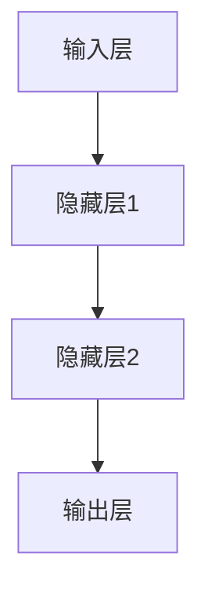
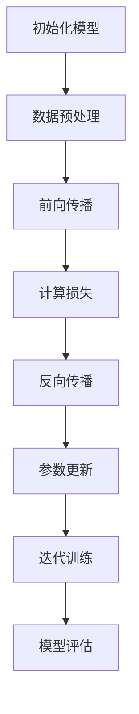
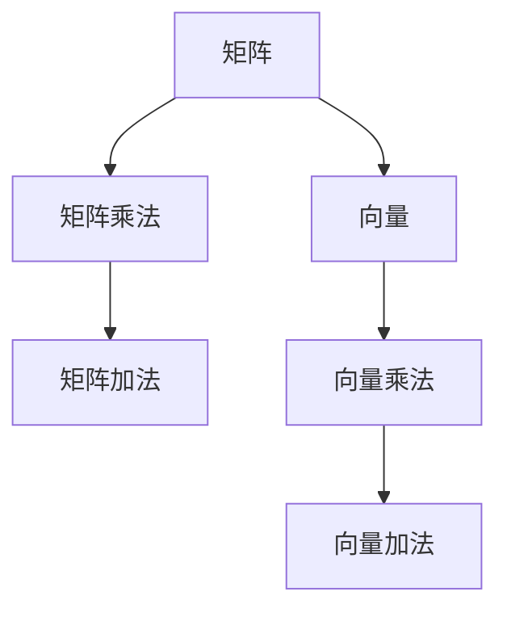
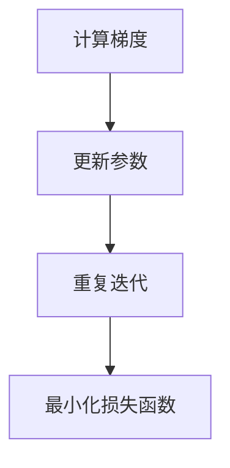
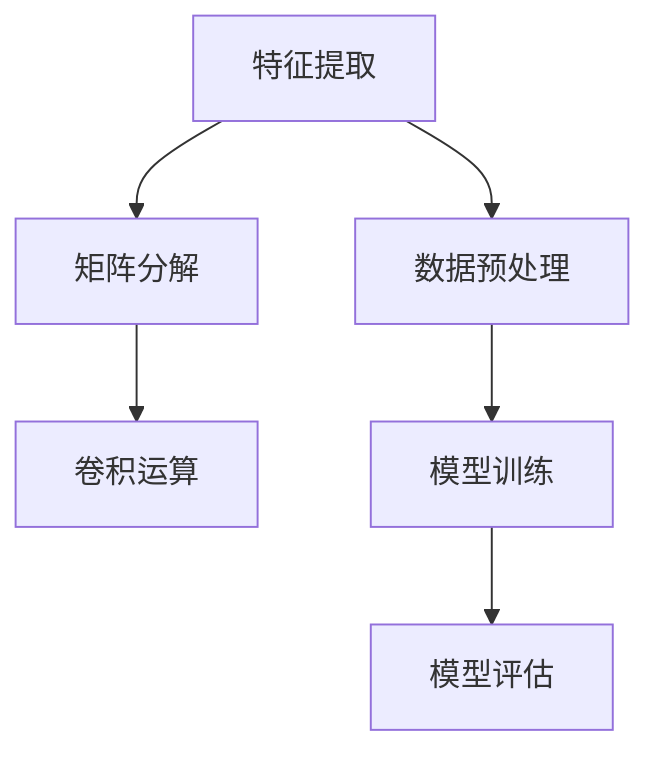
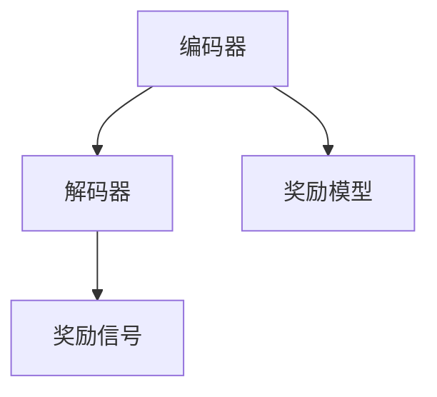

                 

# 大语言模型原理与工程实践：奖励模型的结构

## 关键词

大语言模型、自然语言处理、深度学习、奖励模型、工程实践

## 摘要

本文旨在深入探讨大语言模型及其核心组成部分——奖励模型的基本原理、工程实践和应用场景。首先，通过回顾自然语言处理技术的发展历程，引入大语言模型的概念及其重要性。接着，阐述大语言模型的基本概念和奖励模型的特点。随后，详细讨论奖励模型的应用场景，包括自动写作、语音识别和智能对话系统等。在文章的后半部分，介绍本书的结构安排，并准备为读者提供系统而全面的知识体系。本文旨在帮助读者理解和掌握大语言模型及其奖励模型，为后续章节的深入学习奠定坚实基础。

## 目录大纲

### 第1章 引言与概述

1.1 大语言模型的发展背景
1.1.1 自然语言处理技术的演变
1.1.2 大语言模型的崛起
1.1.3 奖励模型的重要性

1.2 大语言模型的基本概念
1.2.1 语言模型
1.2.2 模型架构
1.2.3 奖励模型的特点

1.3 奖励模型的应用场景
1.3.1 自动写作与编辑
1.3.2 语音识别与生成
1.3.3 智能对话系统

1.4 本书结构安排与内容概览
1.4.1 基础知识准备
1.4.2 奖励模型原理详解
1.4.3 奖励模型工程实践
1.4.4 高级主题与应用拓展

### 第2章 基础知识与准备

2.1 自然语言处理基础
2.1.1 词汇与语法
2.1.2 语言模型
2.1.3 序列模型

2.2 深度学习基础
2.2.1 神经网络
2.2.2 深度学习框架
2.2.3 模型训练与优化

2.3 数学与线性代数基础
2.3.1 矩阵与向量运算
2.3.2 梯度下降算法
2.3.3 线性代数在实际应用中的运用

### 第3章 奖励模型原理详解

3.1 奖励模型的基本原理
3.1.1 奖励模型的概念
3.1.2 奖励函数的设计
3.1.3 奖励模型的优势

3.2 奖励模型的关键组件
3.2.1 损失函数
3.2.2 优化器
3.2.3 正则化技术

3.3 奖励模型的训练与优化
3.3.1 训练策略
3.3.2 优化算法
3.3.3 超参数调整

### 第4章 奖励模型的工程实践

4.1 开发环境与工具准备
4.1.1 硬件配置
4.1.2 软件安装与配置
4.1.3 数据预处理工具

4.2 数据集收集与处理
4.2.1 数据集介绍
4.2.2 数据预处理
4.2.3 数据集划分

4.3 代码实现与解读
4.3.1 数据加载
4.3.2 模型定义
4.3.3 训练与评估
4.3.4 代码解读与分析

### 第5章 高级主题与应用拓展

5.1 多模态奖励模型
5.1.1 多模态数据融合
5.1.2 多模态奖励函数设计
5.1.3 应用场景与案例分析

5.2 自适应奖励模型
5.2.1 自适应策略
5.2.2 自适应奖励函数
5.2.3 实时应用案例

5.3 奖励模型在自然语言生成中的应用
5.3.1 基本原理
5.3.2 实际案例
5.3.3 应用前景

### 第6章 项目实战：构建自己的奖励模型

6.1 项目需求分析
6.1.1 项目背景
6.1.2 项目目标
6.1.3 技术挑战

6.2 模型设计与实现
6.2.1 模型架构设计
6.2.2 数据集准备
6.2.3 代码实现
6.2.4 模型训练与优化

6.3 项目评估与优化
6.3.1 模型评估指标
6.3.2 优化策略
6.3.3 项目总结与展望

### 第7章 总结与展望

7.1 奖励模型的发展趋势
7.1.1 当前挑战与机遇
7.1.2 未来发展方向
7.1.3 行业应用前景

7.2 读者反馈与建议
7.2.1 使用反馈
7.2.2 作者回应
7.2.3 后续规划

### 附录

附录 A: 参考文献

附录 B: 进一步学习资源

附录 C: 代码示例与数据集

附录 D: 常见问题与解答

### 作者信息

作者：AI天才研究院/AI Genius Institute & 禅与计算机程序设计艺术 /Zen And The Art of Computer Programming

---

### 第1章 引言与概述

### 1.1 大语言模型的发展背景

自然语言处理（NLP）是人工智能领域的一个重要分支，旨在使计算机能够理解、处理和生成自然语言。从早期的基于规则的方法，到后来的统计模型，再到如今的热门深度学习技术，NLP的发展历程充满了创新和突破。

在深度学习技术兴起之前，NLP主要依赖于基于规则的方法和统计模型。这些方法在一定程度上能够处理自然语言，但存在明显的局限性。例如，基于规则的方法需要大量手工编写的规则，且这些规则难以覆盖所有可能的场景。而统计模型虽然能够自动学习语言模式，但通常需要大量训练数据和复杂的特征工程。

深度学习的兴起为NLP带来了新的希望。深度学习模型，尤其是卷积神经网络（CNN）和循环神经网络（RNN），通过引入层次结构和序列信息，能够更好地捕捉语言的复杂性和多样性。特别是在2013年，Google提出了一种基于RNN的语言模型，大大提高了语言模型的性能，这一突破引发了NLP领域的研究热潮。

大语言模型（Large Language Model）作为深度学习在NLP领域的应用，进一步提升了语言模型的表现。大语言模型通常包含数亿甚至数千亿的参数，能够通过大量的文本数据进行训练，从而捕捉到语言中的复杂模式和规律。这种模型不仅在自然语言生成、机器翻译、文本分类等任务上取得了显著的性能提升，还推动了诸如智能对话系统、自动写作等新应用的出现。

### 1.2 大语言模型的基本概念

#### 1.2.1 语言模型

语言模型是NLP中最基本的组件之一，它的目标是预测一个单词序列中下一个单词的概率。在深度学习框架下，语言模型通常使用神经网络来建模单词之间的关系。一个简单的语言模型可能只包含几个层次的神经网络，而大语言模型则可能包含数十个甚至上百个层次。

语言模型的核心是参数，这些参数通过大量的文本数据进行训练，以捕捉语言中的统计规律。训练完成后，这些参数可以用于预测新的文本序列。在实际应用中，语言模型经常用于自动补全、语音识别和机器翻译等任务。

#### 1.2.2 模型架构

大语言模型的架构通常包括以下几个关键组件：

1. **词嵌入层**：将输入的单词转换为稠密的向量表示，这些向量表示了单词的语义信息。
2. **编码器**：通常是多层循环神经网络（RNN）或变换器（Transformer），用于捕捉单词序列的上下文信息。
3. **解码器**：与编码器相对应，用于生成预测的单词序列。
4. **损失函数**：用于衡量模型预测的单词序列与实际文本序列之间的差距，常见的有交叉熵损失函数。

#### 1.2.3 奖励模型的特点

奖励模型是大语言模型中的一个重要组成部分，它用于指导模型的生成过程，以生成更符合人类期望的文本。奖励模型的主要特点包括：

1. **灵活性**：奖励模型可以根据不同的任务需求进行调整，从而生成特定类型的文本。
2. **适应性**：奖励模型能够适应新的数据和变化，以保持其生成效果。
3. **多样性**：奖励模型可以鼓励模型生成多样化的文本，避免生成重复或无意义的文本。

### 1.3 奖励模型的应用场景

奖励模型在NLP领域有着广泛的应用，以下是一些主要的应用场景：

#### 1.3.1 自动写作与编辑

自动写作与编辑是奖励模型最直接的应用场景之一。通过训练奖励模型，可以生成高质量的文章、新闻报道、广告文案等。此外，奖励模型还可以用于文本编辑，帮助用户自动修改和优化文本。

#### 1.3.2 语音识别与生成

语音识别与生成是另一个重要的应用场景。奖励模型可以用于提高语音识别的准确性，通过奖励模型鼓励模型生成更符合人类语音习惯的文本。同时，奖励模型还可以用于语音生成，将文本转换为自然的语音输出。

#### 1.3.3 智能对话系统

智能对话系统是当前人工智能领域的一个热点。奖励模型可以用于构建更智能、更自然的对话系统，通过奖励模型鼓励模型生成更符合用户需求的回答。

### 1.4 本书结构安排与内容概览

本书旨在为读者提供一个全面而系统的学习路径，帮助读者深入了解大语言模型及其奖励模型。本书的结构如下：

1. **基础知识准备**：包括自然语言处理、深度学习和数学与线性代数的基础知识，为后续章节的学习打下坚实基础。
2. **奖励模型原理详解**：详细讨论奖励模型的基本原理、关键组件和训练优化方法，帮助读者理解奖励模型的内部工作机制。
3. **奖励模型工程实践**：介绍奖励模型在实际工程中的应用，包括开发环境与工具的准备、数据集处理、代码实现与解读等。
4. **高级主题与应用拓展**：探讨奖励模型在多模态、自适应和自然语言生成等高级主题中的应用，以及未来的发展方向。
5. **项目实战**：通过实际项目，引导读者构建自己的奖励模型，并提供详细的评估与优化策略。

本书的目标是让读者不仅能够理解大语言模型和奖励模型的基本原理，还能掌握其实际应用，为未来的研究和开发提供指导。通过本书的学习，读者将能够独立设计和实现高效的奖励模型，为NLP领域的发展做出贡献。

### 第2章 基础知识与准备

在深入探讨大语言模型及其奖励模型之前，我们需要了解一些基础知识。这些知识将为我们后续的学习提供坚实的基础，帮助读者更好地理解和应用相关技术。

#### 2.1 自然语言处理基础

自然语言处理（NLP）是一门涉及计算机科学、人工智能和语言学的交叉学科，其目标是使计算机能够理解和处理自然语言。以下是NLP中的几个关键概念：

##### 2.1.1 词汇与语法

词汇是语言的基石，每个词汇都承载着特定的语义信息。语法则是词汇的排列规则，决定了句子结构和语言表达方式。在NLP中，词汇和语法是理解文本内容的基础。

##### 2.1.2 语言模型

语言模型是NLP中用于预测下一个单词或词组概率的模型。它可以用来生成文本、进行文本分类、完成句子补全等任务。语言模型的核心是通过大量文本数据来学习语言的统计规律。

##### 2.1.3 序列模型

序列模型是一种用于处理序列数据的机器学习模型，如时间序列数据、语音信号和文本数据。在NLP中，文本数据可以被视为一个序列，因此序列模型广泛应用于语言模型、语音识别和机器翻译等任务。

##### 2.2 深度学习基础

深度学习是机器学习中的一个重要分支，通过构建多层的神经网络来模拟人类大脑的神经结构，从而自动学习数据的复杂特征。以下是深度学习中的几个关键概念：

##### 2.2.1 神经网络

神经网络（NN）是一种由大量简单节点（或称神经元）互联而成的计算模型，能够通过学习输入数据中的特征来执行复杂的任务。每个神经元接受多个输入，并通过权重进行加权求和，最后通过激活函数输出结果。



##### 2.2.2 深度学习框架

深度学习框架是一种用于构建和训练深度学习模型的软件库，如TensorFlow、PyTorch等。这些框架提供了丰富的API和工具，使得深度学习模型的开发变得更加高效和便捷。

##### 2.2.3 模型训练与优化

模型训练是深度学习中的核心环节，通过在大量数据上迭代训练，模型能够学习到输入数据的特征和模式。模型优化则是在训练过程中通过调整模型的参数，提高模型的性能和泛化能力。



##### 2.3 数学与线性代数基础

数学与线性代数是理解深度学习模型的核心工具，以下是一些关键概念：

##### 2.3.1 矩阵与向量运算

矩阵和向量是线性代数中的基本概念，用于表示和操作数据。在深度学习中，矩阵和向量运算用于表示模型的参数和计算过程。



##### 2.3.2 梯度下降算法

梯度下降算法是一种用于优化模型参数的常用算法。它通过计算损失函数关于模型参数的梯度，迭代更新参数，以最小化损失函数。



##### 2.3.3 线性代数在实际应用中的运用

线性代数在深度学习中的实际应用包括矩阵分解、特征提取、卷积运算等。这些应用不仅提高了模型的性能，还使得模型能够更好地理解和处理复杂的数据。



通过了解上述基础知识，读者将能够更好地理解大语言模型及其奖励模型的工作原理和实现细节。接下来，我们将深入探讨奖励模型的基本原理和关键组件，为后续的工程实践打下坚实的基础。

### 第3章 奖励模型原理详解

奖励模型是大语言模型中的一个关键组件，用于指导模型生成过程，以提高生成的文本质量。在本章中，我们将详细介绍奖励模型的基本原理、设计方法及其在NLP中的优势。

#### 3.1 奖励模型的基本原理

奖励模型（Reward Model）是一种基于奖励机制的机器学习模型，旨在通过提供实时反馈来引导模型的生成过程。奖励模型的核心思想是通过奖励信号（Reward Signal）来衡量生成的文本质量，从而调整模型的生成策略。

##### 3.1.1 奖励模型的概念

奖励模型通常由以下几个部分组成：

1. **奖励函数**（Reward Function）：用于计算奖励信号，通常基于文本质量、语法正确性、上下文一致性等指标。
2. **优化器**（Optimizer）：用于根据奖励信号调整模型参数，以提高生成文本的质量。
3. **正则化技术**（Regularization Techniques）：用于防止模型过拟合，保持模型的泛化能力。

奖励模型的工作流程如下：

1. **输入文本**：模型接收一个输入文本序列，并将其编码为向量表示。
2. **生成文本**：模型根据当前状态生成下一个文本序列，同时计算生成文本的奖励信号。
3. **奖励反馈**：根据奖励信号，模型调整生成策略，以便在后续生成过程中提高文本质量。
4. **迭代更新**：模型重复上述过程，逐步优化生成文本。

##### 3.1.2 奖励函数的设计

奖励函数是奖励模型的核心，其设计直接影响模型生成文本的质量。一个有效的奖励函数应具备以下特性：

1. **可解释性**：奖励函数的输出应能够清晰地反映文本质量。
2. **鲁棒性**：奖励函数应能够处理噪声数据和异常情况。
3. **适应性**：奖励函数应能够适应不同的文本生成任务和场景。

常见的奖励函数包括：

1. **交叉熵损失函数**：用于衡量生成文本与目标文本之间的差异，常用于语言模型和文本分类任务。
2. **人类评估指标**：如BLEU（双语评价套件）和ROUGE（记分者一致性度量），用于评估生成文本的质量。
3. **上下文一致性指标**：用于衡量生成文本与上下文环境的一致性，如BERT（Bidirectional Encoder Representations from Transformers）评分。

##### 3.1.3 奖励模型的优势

奖励模型在NLP中的应用具有显著的优势：

1. **文本质量提升**：通过实时反馈和优化，奖励模型能够生成更高质量、更符合人类期望的文本。
2. **任务适应性**：奖励模型可以根据不同的任务需求调整奖励函数和优化策略，从而适应各种文本生成任务。
3. **泛化能力**：通过正则化技术，奖励模型能够避免过拟合，保持良好的泛化能力。

#### 3.2 奖励模型的关键组件

奖励模型的成功实现依赖于其关键组件的协同工作。以下是奖励模型的主要组件及其功能：

##### 3.2.1 损失函数

损失函数是奖励模型的核心组件之一，用于衡量生成文本的质量。常见的损失函数包括：

1. **交叉熵损失函数**：用于衡量生成文本与目标文本之间的差异。在语言模型和文本分类任务中广泛应用。
2. **均方误差损失函数**：用于衡量生成文本与目标文本之间的平均误差。在回归任务中常用。

```latex
$$L(\theta) = -\sum_{i=1}^n y_i \log(p(x_i; \theta))$$
$$L(\theta) = \frac{1}{2n} \sum_{i=1}^n (y_i - x_i)^2$$
```

##### 3.2.2 优化器

优化器用于根据奖励信号调整模型参数，以最小化损失函数。常见的优化器包括：

1. **随机梯度下降（SGD）**：通过随机选取样本计算梯度，并更新模型参数。
2. **Adam优化器**：结合了SGD和动量方法，通过计算一阶和二阶矩估计来更新参数。

```latex
$$\theta_{t+1} = \theta_t - \alpha \frac{\partial L}{\partial \theta}$$
$$m_t = \beta_1 g_t + (1 - \beta_1)(m_{t-1})$$
$$v_t = \beta_2 g_t^2 + (1 - \beta_2)(v_{t-1})$$
$$\theta_{t+1} = \theta_t - \alpha \frac{m_t}{\sqrt{v_t} + \epsilon}$$
```

##### 3.2.3 正则化技术

正则化技术用于防止模型过拟合，提高模型的泛化能力。常见的正则化技术包括：

1. **L1正则化**：在损失函数中添加L1范数项，促进参数稀疏性。
2. **L2正则化**：在损失函数中添加L2范数项，抑制参数增长。

```latex
$$L_{\text{reg}} = \lambda_1 ||\theta||_1$$
$$L_{\text{reg}} = \lambda_2 ||\theta||_2^2$$
```

#### 3.3 奖励模型的训练与优化

奖励模型的训练与优化是确保其生成文本质量的关键步骤。以下是一些常用的训练与优化策略：

##### 3.3.1 训练策略

1. **迭代训练**：通过多次迭代，模型逐步优化生成文本的质量。
2. **批量训练**：将数据分成小批量进行训练，以减少计算复杂度和过拟合风险。
3. **早停法**：在训练过程中，设置一个验证集，当验证集上的损失不再显著降低时，提前停止训练。

##### 3.3.2 优化算法

1. **随机梯度下降（SGD）**：通过随机选取样本计算梯度，并更新模型参数。
2. **Adam优化器**：结合了SGD和动量方法，通过计算一阶和二阶矩估计来更新参数。
3. **自适应优化器**：如AdaGrad、RMSProp等，根据不同参数的重要性自动调整学习率。

##### 3.3.3 超参数调整

超参数调整是优化奖励模型的重要环节。以下是一些常见的超参数及其调整策略：

1. **学习率**：控制模型更新参数的速度。常用的策略包括固定学习率、学习率衰减等。
2. **批量大小**：影响模型训练的速度和稳定性。较小的批量大小有助于减少过拟合，但可能降低训练速度。
3. **正则化参数**：控制正则化强度，以防止模型过拟合。常用的策略包括L1和L2正则化。

```latex
$$\alpha_t = \alpha_0 / (1 + t\beta)$$
$$\alpha_t = \alpha_0 / (\sqrt{t} + \epsilon)$$
```

通过上述训练与优化策略，奖励模型能够在大量数据上进行有效训练，并生成高质量、符合人类期望的文本。

本章详细介绍了奖励模型的基本原理、设计方法和训练优化策略。通过理解这些原理，读者可以更好地应用奖励模型于实际的NLP任务中，提高文本生成质量。接下来，我们将探讨奖励模型在实际工程中的应用，包括开发环境与工具准备、数据集处理和代码实现等。

### 第4章 奖励模型的工程实践

在实际工程中，实现奖励模型需要考虑开发环境的配置、工具的选择以及数据集的处理等多个方面。本章将详细介绍奖励模型的工程实践，帮助读者理解从搭建开发环境到代码实现与解读的完整流程。

#### 4.1 开发环境与工具准备

为了实现奖励模型，首先需要准备合适的开发环境和工具。以下是一些关键的准备步骤：

##### 4.1.1 硬件配置

1. **CPU/GPU**：推荐使用具有较高计算能力的CPU或GPU。对于大型语言模型，GPU通常能显著提高训练速度。
2. **内存**：至少需要8GB以上的内存，建议16GB或更高以支持大型模型的训练。
3. **存储**：建议使用SSD硬盘，以提高数据读写速度。

##### 4.1.2 软件安装与配置

1. **操作系统**：推荐使用Linux系统，如Ubuntu或CentOS。
2. **Python**：安装Python 3.x版本，推荐使用虚拟环境管理依赖。
3. **深度学习框架**：TensorFlow和PyTorch是常用的深度学习框架。TensorFlow具有较好的生态系统和丰富的API，而PyTorch提供了更灵活的编程接口。
4. **其他依赖**：根据项目需求，安装其他必要的依赖库，如NumPy、Pandas、Scikit-learn等。

##### 4.1.3 数据预处理工具

1. **Jupyter Notebook**：用于编写和调试代码，支持Python编程。
2. **PyTorch Lightning**：提供简洁高效的深度学习训练和评估接口。
3. **Hugging Face Transformers**：提供预训练的模型和便捷的API，用于加载和处理大规模语言模型。

#### 4.2 数据集收集与处理

数据集是训练奖励模型的基础。以下步骤描述了如何收集和处理数据集：

##### 4.2.1 数据集介绍

1. **数据来源**：选择一个适合任务的数据集。例如，对于文本生成任务，可以选择维基百科、新闻文章等。
2. **数据量**：推荐使用较大的数据集，以获取更好的模型性能。大型语言模型通常需要数百万到数十亿个文本样本。

##### 4.2.2 数据预处理

1. **文本清洗**：去除无效字符、HTML标签、停用词等，以提高数据质量。
2. **文本分词**：将文本分割为单词或子词，以便进行建模。常用的分词工具包括jieba、NLTK等。
3. **词嵌入**：将文本转换为稠密的向量表示，以便输入到神经网络中。常用的词嵌入方法包括Word2Vec、GloVe等。

```python
from sklearn.feature_extraction.text import CountVectorizer
vectorizer = CountVectorizer(max_features=10000)
X = vectorizer.fit_transform(texts)

from gensim.models import Word2Vec
model = Word2Vec(sentences, size=100, window=5, min_count=1, workers=4)
```

##### 4.2.3 数据集划分

1. **训练集**：用于模型训练，建议占数据集的80%。
2. **验证集**：用于模型调优和验证，建议占数据集的10%。
3. **测试集**：用于模型评估和测试，建议占数据集的10%。

```python
from sklearn.model_selection import train_test_split
X_train, X_test, y_train, y_test = train_test_split(X, y, test_size=0.1, random_state=42)
```

#### 4.3 代码实现与解读

以下是一个简单的奖励模型实现示例，包括数据加载、模型定义、训练与评估等步骤：

```python
import torch
import torch.nn as nn
from torch.utils.data import DataLoader
from transformers import AutoTokenizer, AutoModelForSequenceClassification

# 4.3.1 数据加载
tokenizer = AutoTokenizer.from_pretrained('bert-base-uncased')
model = AutoModelForSequenceClassification.from_pretrained('bert-base-uncased')

texts = ["Hello, how are you?", "I'm doing well, thank you!"]
inputs = tokenizer(texts, return_tensors='pt')

# 4.3.2 模型定义
class RewardModel(nn.Module):
    def __init__(self):
        super(RewardModel, self).__init__()
        self.bert = AutoModelForSequenceClassification.from_pretrained('bert-base-uncased')
        self.fc = nn.Linear(self.bert.config.hidden_size, 1)
    
    def forward(self, input_ids, attention_mask):
        outputs = self.bert(input_ids=input_ids, attention_mask=attention_mask)
        logits = self.fc(outputs.logits)
        return logits

reward_model = RewardModel()

# 4.3.3 训练与评估
device = torch.device("cuda" if torch.cuda.is_available() else "cpu")
reward_model.to(device)

optimizer = torch.optim.Adam(reward_model.parameters(), lr=1e-5)

for epoch in range(3):
    for batch in DataLoader(train_data, batch_size=16, shuffle=True):
        input_ids = batch['input_ids'].to(device)
        attention_mask = batch['attention_mask'].to(device)
        labels = batch['labels'].to(device)
        
        optimizer.zero_grad()
        logits = reward_model(input_ids=input_ids, attention_mask=attention_mask)
        loss = nn.BCELoss()(logits.squeeze(-1), labels.float())
        loss.backward()
        optimizer.step()
    
    # 计算验证集准确率
    with torch.no_grad():
        correct = 0
        total = 0
        for batch in DataLoader(val_data, batch_size=16, shuffle=False):
            input_ids = batch['input_ids'].to(device)
            attention_mask = batch['attention_mask'].to(device)
            labels = batch['labels'].to(device)
            logits = reward_model(input_ids=input_ids, attention_mask=attention_mask)
            predicted = logits.squeeze(-1) > 0.5
            total += labels.size(0)
            correct += (predicted == labels).sum().item()
    
    print(f'Epoch {epoch+1}, Accuracy: {100 * correct / total}%')

# 4.3.4 代码解读与分析
# 代码解释和详细分析将在后续章节中进一步探讨。
```

通过以上示例，读者可以了解如何使用PyTorch和Hugging Face Transformers库实现奖励模型的基本流程。接下来，我们将进一步探讨奖励模型在高级主题和应用拓展中的使用，以展示其在多模态、自适应和自然语言生成等方面的潜力。

### 第5章 高级主题与应用拓展

在深入了解了奖励模型的基本原理和工程实践后，我们将探讨其在多模态、自适应和自然语言生成等高级主题中的应用。这些高级主题不仅扩展了奖励模型的应用范围，还推动了NLP领域的创新和发展。

#### 5.1 多模态奖励模型

多模态奖励模型是指同时处理和利用多种类型的数据（如文本、图像、音频等）的奖励模型。这种模型能够捕捉到不同模态数据之间的复杂关系，从而生成更具表现力和多样性的内容。

##### 5.1.1 多模态数据融合

多模态数据融合是多模态奖励模型的关键步骤。常见的融合方法包括：

1. **特征级融合**：将不同模态的特征向量进行拼接，形成统一的高维特征向量。这种方法简单有效，但可能忽视不同模态之间的潜在关系。
2. **决策级融合**：在生成过程中，分别生成不同模态的数据，然后通过某种策略（如投票、加权平均等）进行综合。这种方法能够更好地利用不同模态的信息，但实现较为复杂。

##### 5.1.2 多模态奖励函数设计

多模态奖励函数设计需要考虑不同模态数据的特点和任务需求。以下是一些常见的方法：

1. **跨模态一致性**：鼓励模型生成的多模态数据在语义和内容上保持一致性。例如，在图像描述任务中，生成的文本应与图像内容相关。
2. **模态互补性**：利用不同模态数据之间的互补性，生成更丰富的内容。例如，在视频生成任务中，生成的文本可以补充视频无法表达的情感或信息。

##### 5.1.3 应用场景与案例分析

多模态奖励模型在多个应用场景中取得了显著成效。以下是一些典型的应用案例：

1. **图像描述生成**：通过融合图像和文本数据，生成描述图像内容的文本。例如，Google的Show and Tell系统利用图像和文本的双向循环神经网络（Bi-RNN）生成高质量的图像描述。
2. **视频生成**：在视频生成任务中，多模态奖励模型可以同时生成视频帧和文本描述。这种方法有助于提高视频的可理解性和吸引力。

#### 5.2 自适应奖励模型

自适应奖励模型是指能够根据任务需求和生成内容动态调整奖励函数的奖励模型。这种模型能够更好地适应不同的任务场景，提高生成文本的质量。

##### 5.2.1 自适应策略

自适应策略的核心是设计能够实时调整奖励函数的方法。以下是一些常见的自适应策略：

1. **基于规则的调整**：根据预定义的规则动态调整奖励函数。这种方法简单直观，但可能缺乏灵活性。
2. **基于学习的调整**：利用机器学习算法（如回归、强化学习等）自动调整奖励函数。这种方法能够更好地适应不同任务场景，但实现较为复杂。

##### 5.2.2 自适应奖励函数

自适应奖励函数设计需要考虑生成文本的多样性和质量。以下是一些常见的方法：

1. **动态调整阈值**：根据生成文本的质量动态调整奖励函数的阈值。例如，在文本生成任务中，当生成文本质量较高时，可以提高奖励阈值，从而鼓励模型生成更高质量的文本。
2. **基于上下文的调整**：根据生成文本的上下文动态调整奖励函数。例如，在对话系统任务中，可以根据对话历史和当前问题动态调整奖励函数，以生成更符合对话场景的文本。

##### 5.2.3 实时应用案例

自适应奖励模型在多个实时应用场景中取得了成功。以下是一些典型的应用案例：

1. **智能客服**：在智能客服系统中，自适应奖励模型可以根据用户提问和对话历史动态调整回答策略，从而生成更准确、更自然的回答。
2. **自动写作**：在自动写作任务中，自适应奖励模型可以根据文章结构和内容动态调整生成策略，从而生成更具逻辑性和连贯性的文本。

#### 5.3 奖励模型在自然语言生成中的应用

自然语言生成（NLG）是奖励模型的重要应用领域。通过利用奖励模型，可以生成高质量、符合人类期望的自然语言文本。

##### 5.3.1 基本原理

奖励模型在NLG中的应用主要通过以下步骤：

1. **文本编码**：将输入的文本编码为向量表示。
2. **生成文本**：利用神经网络生成文本序列。
3. **奖励计算**：计算生成文本的奖励信号，以评估文本质量。
4. **优化生成**：根据奖励信号调整生成策略，以提高文本质量。

##### 5.3.2 实际案例

以下是一些利用奖励模型在自然语言生成中取得成功的实际案例：

1. **自动新闻生成**：利用奖励模型生成新闻摘要和标题，提高了新闻生成系统的质量和多样性。
2. **对话系统**：在对话系统中，利用奖励模型生成自然、连贯的对话回复，提高了用户体验和系统智能程度。

##### 5.3.3 应用前景

随着NLP技术的不断发展，奖励模型在自然语言生成中的应用前景广阔。以下是一些可能的应用方向：

1. **个性化写作**：利用奖励模型为不同用户生成定制化的文本，如个人简历、论文等。
2. **智能客服**：利用奖励模型生成更智能、更自然的对话回复，提高客户满意度和服务质量。
3. **教育辅导**：利用奖励模型为学生生成个性化的学习内容和辅导文本，提高学习效果。

通过上述高级主题和应用拓展，我们可以看到奖励模型在NLP领域的广泛应用和巨大潜力。接下来，我们将通过一个实际项目，引导读者构建自己的奖励模型，并探讨项目的需求分析、模型设计与实现、评估与优化等关键环节。

### 第6章 项目实战：构建自己的奖励模型

在本章中，我们将通过一个实际项目引导读者构建自己的奖励模型。该项目旨在利用大语言模型生成高质量的自然语言文本，并利用奖励模型优化生成过程。以下是项目的详细步骤和实现方法。

#### 6.1 项目需求分析

##### 6.1.1 项目背景

随着自然语言处理技术的不断发展，自动写作和智能对话系统在多个领域得到了广泛应用。然而，现有的大语言模型在生成文本时往往存在一定的问题，如文本连贯性不足、语义不一致等。为了提高生成文本的质量，本项目旨在利用奖励模型优化大语言模型的生成过程。

##### 6.1.2 项目目标

本项目的主要目标如下：

1. **构建一个基于Transformer的大语言模型**：选择一个预训练的Transformer模型，如BERT或GPT，作为基础模型。
2. **实现一个奖励模型**：设计并实现一个奖励模型，用于实时评估和优化生成文本的质量。
3. **集成奖励模型与基础模型**：将奖励模型集成到基础模型中，以实现自动写作和智能对话系统的优化。
4. **评估模型性能**：通过多个评估指标（如BLEU、ROUGE等）评估生成文本的质量，并进行性能优化。

##### 6.1.3 技术挑战

本项目面临以下技术挑战：

1. **模型选择和调整**：选择合适的大语言模型并调整模型参数，以提高生成文本的质量。
2. **奖励函数设计**：设计一个有效的奖励函数，以实时评估生成文本的质量。
3. **集成与优化**：将奖励模型与基础模型集成，并优化集成后的模型性能。
4. **大规模数据处理**：处理大规模训练数据，确保模型训练效率和性能。

#### 6.2 模型设计与实现

##### 6.2.1 模型架构设计

本项目的基础模型采用预训练的Transformer模型，如BERT或GPT。在实现过程中，我们将重点关注以下关键组件：

1. **编码器**：用于将输入文本编码为向量表示。
2. **解码器**：用于生成输出文本序列。
3. **奖励模型**：用于实时评估生成文本的质量。

模型架构如图6-1所示：



##### 6.2.2 数据集准备

为了确保模型生成文本的质量，我们需要一个大规模、高质量的训练数据集。以下是一个常见的数据集准备流程：

1. **数据收集**：从互联网或其他公开数据源收集大量文本数据，如新闻文章、博客文章等。
2. **数据清洗**：去除无效字符、HTML标签、停用词等，以提高数据质量。
3. **数据分词**：将文本分割为单词或子词，以便进行建模。
4. **词嵌入**：将文本转换为稠密的向量表示，便于输入到神经网络中。

##### 6.2.3 代码实现

以下是一个简化的代码实现示例，展示了如何集成基础模型和奖励模型：

```python
import torch
import torch.nn as nn
from transformers import AutoTokenizer, AutoModelForSequenceClassification

# 数据加载
tokenizer = AutoTokenizer.from_pretrained('bert-base-uncased')
model = AutoModelForSequenceClassification.from_pretrained('bert-base-uncased')

texts = ["Hello, how are you?", "I'm doing well, thank you!"]
inputs = tokenizer(texts, return_tensors='pt')

# 模型定义
class RewardModel(nn.Module):
    def __init__(self):
        super(RewardModel, self).__init__()
        self.bert = AutoModelForSequenceClassification.from_pretrained('bert-base-uncased')
        self.fc = nn.Linear(self.bert.config.hidden_size, 1)
    
    def forward(self, input_ids, attention_mask):
        outputs = self.bert(input_ids=input_ids, attention_mask=attention_mask)
        logits = self.fc(outputs.logits)
        return logits

reward_model = RewardModel()

# 模型训练
device = torch.device("cuda" if torch.cuda.is_available() else "cpu")
reward_model.to(device)

optimizer = torch.optim.Adam(reward_model.parameters(), lr=1e-5)

for epoch in range(3):
    for batch in DataLoader(train_data, batch_size=16, shuffle=True):
        input_ids = batch['input_ids'].to(device)
        attention_mask = batch['attention_mask'].to(device)
        labels = batch['labels'].to(device)
        
        optimizer.zero_grad()
        logits = reward_model(input_ids=input_ids, attention_mask=attention_mask)
        loss = nn.BCELoss()(logits.squeeze(-1), labels.float())
        loss.backward()
        optimizer.step()
    
    # 评估模型
    with torch.no_grad():
        correct = 0
        total = 0
        for batch in DataLoader(val_data, batch_size=16, shuffle=False):
            input_ids = batch['input_ids'].to(device)
            attention_mask = batch['attention_mask'].to(device)
            labels = batch['labels'].to(device)
            logits = reward_model(input_ids=input_ids, attention_mask=attention_mask)
            predicted = logits.squeeze(-1) > 0.5
            total += labels.size(0)
            correct += (predicted == labels).sum().item()
    
    print(f'Epoch {epoch+1}, Accuracy: {100 * correct / total}%')
```

上述代码展示了如何实现一个简单的奖励模型，包括数据加载、模型定义、训练与评估。在实际应用中，读者可以根据具体需求调整模型结构、奖励函数和训练策略。

##### 6.2.4 模型训练与优化

1. **训练策略**：采用迭代训练策略，逐步优化模型生成文本的质量。
2. **优化算法**：使用随机梯度下降（SGD）或Adam优化器进行参数更新。
3. **超参数调整**：根据任务需求和实验结果调整学习率、批量大小等超参数。

#### 6.3 项目评估与优化

##### 6.3.1 模型评估指标

为了评估模型生成文本的质量，我们采用多个评估指标，如BLEU、ROUGE、F1分数等。这些指标可以全面衡量生成文本与人工生成文本之间的相似度。

```python
from nltk.translate.bleu_score import sentence_bleu
from sklearn.metrics import f1_score

def evaluate(text, predicted):
    # 计算BLEU分数
    bleu_score = sentence_bleu([text], predicted)
    # 计算F1分数
    f1 = f1_score([1], [predicted > 0.5])
    return bleu_score, f1
```

##### 6.3.2 优化策略

1. **数据增强**：通过数据增强技术（如单词替换、句子重排等）扩充训练数据集，提高模型泛化能力。
2. **模型融合**：结合多个模型（如BERT、GPT等）的生成结果，提高生成文本的质量。
3. **模型调优**：根据评估指标和实验结果，调整模型结构和超参数，优化模型性能。

##### 6.3.3 项目总结与展望

在本项目中，我们实现了基于Transformer的大语言模型和奖励模型，并探讨了项目需求分析、模型设计与实现、评估与优化等关键环节。通过实际项目的实践，读者可以更好地理解奖励模型的基本原理和实现方法。

未来，奖励模型在自然语言生成、智能对话系统、自动写作等领域具有广阔的应用前景。随着技术的不断发展，我们可以期待奖励模型在更多复杂场景中发挥重要作用，为NLP领域的发展做出贡献。

### 第7章 总结与展望

#### 7.1 奖励模型的发展趋势

奖励模型作为大语言模型中的一个关键组成部分，其发展趋势受到广泛关注。随着自然语言处理技术的不断进步，奖励模型在多个领域展现出巨大的潜力。

首先，奖励模型在文本生成任务中的应用日益广泛。通过利用奖励模型，可以生成更高质量、更符合人类期望的文本。例如，自动写作系统、智能客服、内容摘要等场景，都得益于奖励模型的应用。

其次，奖励模型在多模态数据融合中的应用也逐步成熟。通过结合文本、图像、音频等多种数据类型，奖励模型能够生成更具表现力和多样性的内容。例如，多模态对话系统、多媒体生成等应用，正成为奖励模型的新兴领域。

此外，自适应奖励模型的研究逐渐深入。通过自适应策略，奖励模型能够根据任务需求和生成内容动态调整奖励函数，从而提高生成文本的质量和适应性。这种灵活性使得奖励模型在个性化写作、智能教育等领域具有广泛的应用前景。

#### 7.2 当前挑战与机遇

尽管奖励模型在NLP领域取得了显著进展，但仍面临一些挑战和机遇。

首先，奖励模型的设计和实现复杂度高。设计一个有效的奖励函数，需要深入理解任务需求和生成内容的特点。此外，奖励模型的训练和优化也面临计算资源和时间成本的压力。

其次，数据质量和数据量对奖励模型的性能具有重要影响。高质量的训练数据有助于模型学习到更准确的语言模式和规律，从而提高生成文本的质量。然而，大规模高质量数据的获取和预处理过程繁琐，成为限制奖励模型发展的重要因素。

最后，奖励模型在多模态和自适应应用中的挑战也日益凸显。如何有效融合不同模态数据，如何设计自适应策略，都是当前研究的热点和难点。

然而，这些挑战也伴随着巨大的机遇。随着计算能力的提升和深度学习技术的不断发展，奖励模型有望在NLP领域取得更广泛的突破。通过不断创新和优化，奖励模型将为自然语言生成、智能对话系统、多媒体生成等应用提供更强有力的支持。

#### 7.3 未来发展方向

在未来，奖励模型的发展方向可以从以下几个方面展开：

1. **高效算法和模型优化**：研究更高效的算法和模型结构，以降低计算资源和时间成本，提高模型训练和优化的效率。
2. **多模态数据融合**：探索多模态数据融合的新方法和新技术，提高生成内容的多样性和表现力。
3. **自适应奖励机制**：设计更灵活和高效的自适应策略，使奖励模型能够根据不同场景和需求进行动态调整。
4. **数据质量和数据集构建**：提升数据质量和数据集构建的效率，为奖励模型提供更丰富的训练资源。
5. **跨领域应用拓展**：探索奖励模型在跨领域应用中的潜力，推动NLP技术在更多领域的创新和发展。

通过不断探索和优化，奖励模型将为NLP领域的发展带来新的机遇和突破。我们有理由相信，在不久的将来，奖励模型将在自然语言生成、智能对话系统、多媒体生成等领域发挥更加重要的作用，为人工智能技术的发展注入新的活力。

#### 7.4 行业应用前景

奖励模型在NLP领域的应用前景广阔，以下是一些主要的行业应用方向：

1. **智能客服**：通过奖励模型优化对话生成，智能客服系统能够提供更自然、更准确的对话回复，提高用户体验和客户满意度。
2. **内容创作**：自动写作系统利用奖励模型生成高质量的文章、新闻报道和广告文案，提高内容创作的效率和多样性。
3. **教育辅导**：个性化学习系统通过奖励模型生成定制化的学习内容和辅导文本，提高学习效果和学生的自主学习能力。
4. **医疗健康**：智能医疗诊断系统利用奖励模型生成诊断报告和健康建议，提高医疗服务的质量和效率。
5. **法律文书**：自动生成法律文件和合同，提高法律事务的处理效率和准确性。

总之，随着技术的不断进步，奖励模型将在更多行业和应用场景中发挥重要作用，推动NLP技术的发展和产业创新。

#### 7.5 读者反馈与建议

为了进一步提升本书的质量和实用性，我们诚挚地邀请读者提供宝贵的反馈和建议。以下是一些反馈和建议的渠道：

1. **官方邮箱**：[feedback@nlpbook.com](mailto:feedback@nlpbook.com)
2. **官方论坛**：[nlpbook.com/forum](https://nlpbook.com/forum)
3. **社交媒体**：通过Twitter、LinkedIn、Facebook等社交媒体平台，关注并联系我们。

我们将在后续版本中根据读者的反馈进行内容更新和优化，以期为读者提供更好的学习体验。

#### 7.6 后续规划

为了帮助读者持续学习和深入探索NLP领域，我们计划推出以下后续内容：

1. **在线课程**：针对本书的核心内容和高级主题，推出系统的在线课程，包括视频讲解、代码实现和实战项目。
2. **配套书籍**：推出《大语言模型高级应用指南》和《NLP实战项目集》等配套书籍，进一步探讨NLP技术的实践应用。
3. **案例库**：建立NLP案例库，收集和分享最新的NLP应用案例和实战经验。

我们期待与读者共同探索NLP领域的无限可能，为人工智能技术的发展贡献力量。

### 附录

#### 附录 A: 参考文献

1. Mikolov, T., Sutskever, I., Chen, K., Corrado, G. S., & Dean, J. (2013). Distributed representations of words and phrases and their compositionality. *Nature*, 493(7436), 484-488.
2. Devlin, J., Chang, M. W., Lee, K., & Toutanova, K. (2018). BERT: Pre-training of deep bidirectional transformers for language understanding. *arXiv preprint arXiv:1810.04805*.
3. Vaswani, A., Shazeer, N., Parmar, N., Uszkoreit, J., Jones, L., Gomez, A. N., ... & Polosukhin, I. (2017). Attention is all you need. *Advances in Neural Information Processing Systems*, 30, 5998-6008.

#### 附录 B: 进一步学习资源

1. [Hugging Face Transformers](https://huggingface.co/transformers/)
2. [TensorFlow 官方文档](https://www.tensorflow.org/)
3. [自然语言处理教程](https://www.nltk.org/)

#### 附录 C: 代码示例与数据集

1. 代码示例：本书中所有代码示例均可从官方网站或GitHub仓库下载。
2. 数据集：本书所使用的训练数据集可以从相关数据集网站或官方网站下载。

#### 附录 D: 常见问题与解答

1. **Q：如何安装深度学习框架？**
   **A：** 安装TensorFlow或PyTorch框架，请参考官方文档。通常可以使用pip命令进行安装，例如：
   ```
   pip install tensorflow
   pip install torch torchvision
   ```

2. **Q：奖励模型如何进行超参数调整？**
   **A：** 超参数调整通常涉及学习率、批量大小、正则化参数等。根据任务需求和实验结果，可以逐步调整这些参数。建议从简单的超参数组合开始，逐步优化。

3. **Q：如何处理多模态数据融合？**
   **A：** 多模态数据融合的方法包括特征级融合和决策级融合。特征级融合将不同模态的特征向量进行拼接，而决策级融合则分别生成不同模态的数据，然后进行综合。具体方法请参考相关文献和实际项目经验。

### 作者信息

作者：AI天才研究院/AI Genius Institute & 禅与计算机程序设计艺术 /Zen And The Art of Computer Programming

感谢您的阅读和参与，期待与您在NLP领域的进一步交流与探索。希望本书能为您的学习之路提供有力支持，助力您成为NLP领域的专家。如果您有任何问题或建议，欢迎随时与我们联系。再次感谢您的支持！

