                 

## 大语言模型原理与工程实践：强化学习工程实践 DeepSpeed-Chat 训练详解

关键词：大语言模型，强化学习，DeepSpeed，Chat训练，工程实践

摘要：本文将深入探讨大语言模型的原理及其在工程实践中的应用，特别是强化学习在语言模型训练中的实践。我们将通过详细的讲解和代码案例，介绍DeepSpeed-Chat训练的流程和优化方法，旨在为读者提供一幅全面、清晰的大语言模型工程实践全景图。

## 引言

大语言模型（Large Language Models）近年来在自然语言处理（NLP）领域取得了显著的突破。它们能够在多种任务上达到或超过人类水平，如机器翻译、文本生成、问答系统等。然而，构建和训练这些大型模型不仅需要大量的计算资源，还需要深入的工程实践和优化技巧。

本文将分为两部分。第一部分将介绍大语言模型的基础知识，包括概念、数学基础、架构设计和训练技术。第二部分将聚焦于强化学习在大语言模型中的应用，通过DeepSpeed-Chat训练案例，详细解析其训练流程和优化方法。

## 第一部分：大语言模型基础

### 第1章：大语言模型概述

#### 1.1 大语言模型的概念

大语言模型是一种基于深度学习的模型，其核心目标是预测下一个词或序列。这种模型通常由数十亿个参数组成，可以处理海量文本数据，从中学习语言的结构和语义。

#### 1.2 大语言模型的发展历程

自2018年GPT-1发布以来，大语言模型的发展迅速。从最初的GPT系列，到BERT、GPT-2、GPT-3等，大语言模型在性能和规模上不断突破，应用领域也越来越广泛。

#### 1.3 大语言模型的核心技术

大语言模型的核心技术包括深度神经网络、自注意力机制和Transformer架构。这些技术使得模型能够在海量数据中高效地学习，并在各种任务上表现出色。

#### 1.4 大语言模型的应用场景

大语言模型的应用场景广泛，包括但不限于：文本生成、机器翻译、问答系统、推荐系统等。这些应用使得大语言模型成为现代NLP领域的关键技术。

### 第2章：大语言模型的数学基础

#### 2.1 概率论基础

概率论是理解大语言模型的重要基础。它包括概率分布、条件概率、贝叶斯定理等概念，这些概念在大语言模型的训练和推理中起着关键作用。

#### 2.2 信息论基础

信息论提供了衡量信息量和不确定性的工具。在大语言模型中，信息论被用于计算输入文本和预测文本之间的信息量，从而优化模型。

#### 2.3 线性代数基础

线性代数在大语言模型中用于表示和处理高维数据。矩阵运算、向量空间等概念在大语言模型的优化和训练中至关重要。

#### 2.4 概率图模型

概率图模型是一种表示概率关系的图形化方法。在大语言模型中，概率图模型被用于表示文本中的词汇关系，从而提高模型的预测能力。

### 第3章：大语言模型的架构设计

#### 3.1 深度神经网络架构

深度神经网络是大语言模型的核心架构。它由多个层级组成，通过前向传播和反向传播算法，逐层学习输入和输出之间的映射关系。

#### 3.2 自注意力机制

自注意力机制是一种重要的注意力机制，它能够使模型在不同位置之间建立依赖关系，从而提高模型的性能。

#### 3.3 Transformer架构

Transformer架构是一种基于自注意力机制的模型，它通过多头注意力机制和位置编码，实现了高效和强大的文本处理能力。

#### 3.4 语言模型训练策略

语言模型训练策略包括数据预处理、优化算法和训练技巧等。这些策略的优化能够提高模型的训练效率和质量。

### 第4章：大语言模型的训练技术

#### 4.1 数据预处理

数据预处理是语言模型训练的重要步骤。它包括文本清洗、分词、词向量编码等操作，旨在提高数据的质量和模型的训练效果。

#### 4.2 优化算法

优化算法是训练语言模型的关键。常用的优化算法包括SGD、Adam等，它们通过调整模型参数，优化模型的表现。

#### 4.3 训练技巧与调优

训练技巧和调优包括批量大小、学习率、正则化等参数的调整。这些技巧能够提高模型的收敛速度和性能。

#### 4.4 大规模训练

大规模训练是语言模型工程实践的重要挑战。它涉及分布式训练、并行计算等技术，旨在提高模型的训练效率。

### 第5章：大语言模型的推理与生成

#### 5.1 推理过程

推理过程是语言模型的核心功能。它包括输入文本到输出文本的映射，通过模型参数和输入特征，生成合理的输出。

#### 5.2 生成过程

生成过程是语言模型的另一个重要功能。它通过模型预测，生成新的文本或序列，广泛应用于文本生成、对话系统等场景。

#### 5.3 生成式模型与判别式模型

生成式模型和判别式模型是两种不同的语言模型。生成式模型通过生成数据来学习，判别式模型通过分类数据来学习。它们在不同的应用场景中各有优势。

#### 5.4 多模态生成

多模态生成是语言模型的新兴应用。它通过结合文本、图像、声音等多种模态，生成丰富多样的内容。

## 第二部分：大语言模型的工程实践

### 第6章：强化学习在语言模型中的应用

#### 6.1 强化学习基础

强化学习是一种通过奖励信号来优化决策过程的机器学习技术。它通过试错和反馈，使模型能够在复杂环境中找到最优策略。

#### 6.2 强化学习与语言模型

强化学习与语言模型结合，可以用于优化语言模型的生成过程，提高生成的文本质量和多样性。

#### 6.3 强化学习算法

强化学习算法包括DQN、A3C、PPO等。这些算法通过优化策略网络和价值网络，实现高效的强化学习。

#### 6.4 强化学习案例

本文将介绍一个基于强化学习的大语言模型训练案例，展示如何通过强化学习优化语言模型的生成过程。

### 第7章：DeepSpeed-Chat训练详解

#### 7.1 DeepSpeed框架介绍

DeepSpeed是一个开源的分布式训练框架，旨在提高大型模型的训练效率。它支持自动Mixed Precision训练、ZeRO优化等关键技术。

#### 7.2 DeepSpeed-Chat训练流程

DeepSpeed-Chat是基于DeepSpeed框架的一个聊天机器人模型，本文将详细介绍其训练流程，包括数据预处理、模型初始化、训练过程等。

#### 7.3 DeepSpeed-Chat训练优化

训练优化是提高模型性能的关键。本文将介绍如何通过参数调整、模型剪枝、数据增强等方法，优化DeepSpeed-Chat的训练过程。

#### 7.4 DeepSpeed-Chat应用场景

DeepSpeed-Chat广泛应用于对话系统、文本生成、问答系统等场景。本文将展示其应用案例，并分析其在实际应用中的效果。

## 附录

### 附录A：大语言模型常用工具与库

#### A.1 PyTorch

PyTorch是一个流行的深度学习框架，它提供了动态计算图和自动微分功能，使得构建和训练深度神经网络更加简便。

#### A.2 TensorFlow

TensorFlow是另一个流行的深度学习框架，它提供了静态计算图和高效的执行引擎，适用于大规模模型的训练和部署。

#### A.3 JAX

JAX是一个高性能的数值计算库，它支持自动微分、多维数组操作等，适用于科学计算和深度学习领域。

#### A.4 其他工具与库

除了上述三个框架，还有许多其他工具和库，如MXNet、Theano等，它们在大语言模型训练中也有广泛应用。

## 结尾

大语言模型是现代NLP领域的重要技术，其应用前景广阔。本文通过详细的讲解和代码案例，深入探讨了大语言模型的原理和工程实践。希望读者能够通过本文，对大语言模型有更深入的理解，并在实际应用中取得更好的成果。

作者：AI天才研究院/AI Genius Institute & 禅与计算机程序设计艺术 /Zen And The Art of Computer Programming

----------------------------------------------------------------

### 第1章：大语言模型概述

#### 1.1 大语言模型的概念

大语言模型（Large Language Models）是指具有数十亿甚至千亿参数规模的深度学习模型，能够理解和生成自然语言。这些模型通过大规模数据训练，学习到语言中的统计规律和语义信息，从而在多个自然语言处理（NLP）任务上表现出色。例如，机器翻译、文本生成、问答系统等。

**核心概念与联系：**


在这个图中，我们展示了大语言模型的核心概念，包括：

- **深度神经网络（DNN）**：大语言模型的基础结构，用于学习输入和输出之间的映射关系。
- **自注意力机制**：用于模型内部不同位置之间的依赖关系，提高了模型的表示能力。
- **Transformer架构**：一种基于自注意力机制的模型，实现了高效和强大的文本处理能力。

#### 1.2 大语言模型的发展历程

大语言模型的发展可以分为几个阶段：

- **2018年**：GPT-1发布，开启了基于Transformer架构的大语言模型时代。
- **2019年**：BERT提出，引入了预训练和微调策略，大幅提升了语言模型的性能。
- **2020年**：GPT-2发布，进一步增加了模型的参数规模，提升了生成文本的质量。
- **2022年**：GPT-3发布，具有超过1750亿参数的规模，展示了大语言模型的强大能力。

**发展历程图：**

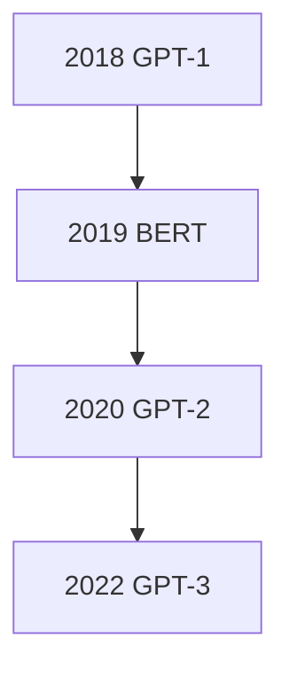

#### 1.3 大语言模型的核心技术

大语言模型的核心技术包括：

- **深度神经网络（DNN）**：大语言模型的基础，通过多层神经网络进行特征提取和映射。
- **自注意力机制**：使模型能够捕捉输入文本中的长距离依赖关系。
- **Transformer架构**：基于自注意力机制的模型，通过多头注意力机制和位置编码，实现了高效和强大的文本处理能力。

**核心概念图：**

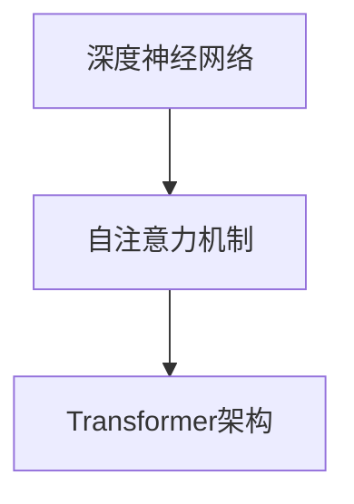

#### 1.4 大语言模型的应用场景

大语言模型的应用场景广泛，包括：

- **机器翻译**：如Google翻译、百度翻译等，通过大规模语言模型进行实时翻译。
- **文本生成**：如自动写稿、故事生成等，通过语言模型生成自然流畅的文本。
- **问答系统**：如OpenAI的GPT-3，通过大规模语言模型提供智能问答服务。
- **推荐系统**：如基于语言模型的内容推荐，通过理解用户和内容的语义关系进行推荐。

**应用场景图：**

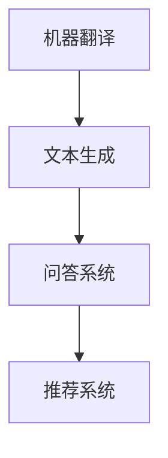

### 第2章：大语言模型的数学基础

#### 2.1 概率论基础

概率论是理解大语言模型的重要基础，主要包括以下概念：

- **概率分布**：描述随机变量的概率分布情况。
- **条件概率**：在某个事件已发生的条件下，另一个事件发生的概率。
- **贝叶斯定理**：通过已知概率计算后验概率。

**概率分布公式：**

$$ P(X=x) = \frac{P(X=x|Y=y)P(Y=y)}{P(Y=y)} $$

**条件概率公式：**

$$ P(A|B) = \frac{P(A \cap B)}{P(B)} $$

**贝叶斯定理公式：**

$$ P(A|B) = \frac{P(B|A)P(A)}{P(B)} $$

#### 2.2 信息论基础

信息论提供了衡量信息量和不确定性的工具，主要包括以下概念：

- **熵**：表示随机变量的不确定性。
- **信息量**：表示获取某个信息所需的信息量。
- **条件熵**：在已知某个随机变量的条件下，另一个随机变量的不确定性。

**熵公式：**

$$ H(X) = -\sum_{x \in \text{X}} P(X=x) \log P(X=x) $$

**信息量公式：**

$$ I(X;Y) = H(X) - H(X|Y) $$

**条件熵公式：**

$$ H(X|Y) = \sum_{y \in \text{Y}} P(Y=y)H(X|Y=y) $$

#### 2.3 线性代数基础

线性代数在大语言模型中用于表示和处理高维数据，主要包括以下概念：

- **向量**：表示一维数据。
- **矩阵**：表示二维数据。
- **矩阵运算**：包括矩阵加法、矩阵乘法、矩阵求逆等。
- **向量空间**：表示一组向量的集合。

**矩阵运算公式：**

$$ C = A \cdot B $$

$$ A^{-1} = (adj(A)) / (\det(A)) $$

**向量空间公式：**

$$ V = \{v | Av = 0\} $$

#### 2.4 概率图模型

概率图模型是一种图形化表示概率关系的工具，主要包括以下概念：

- **有向图**：表示变量之间的条件依赖关系。
- **无向图**：表示变量之间的联合概率分布。
- **贝叶斯网络**：结合有向图和无向图，表示变量之间的条件概率关系。

**有向图公式：**

$$ P(X_1, X_2, ..., X_n) = \prod_{i=1}^{n} P(X_i | X_{parents(i)}) $$

**无向图公式：**

$$ P(X_1, X_2, ..., X_n) = \frac{1}{Z} \prod_{c \in \text{C} \rightarrow \text{V}} P(c) $$

**贝叶斯网络公式：**

$$ P(X_1, X_2, ..., X_n) = \prod_{i=1}^{n} P(X_i | \text{parents}(X_i)) $$

### 第3章：大语言模型的架构设计

#### 3.1 深度神经网络架构

深度神经网络（DNN）是大语言模型的基础结构，主要包括以下组成部分：

- **输入层**：接收外部输入数据，如文本序列。
- **隐藏层**：进行特征提取和变换，学习输入和输出之间的映射关系。
- **输出层**：生成预测结果，如下一个词或序列。

**DNN架构图：**

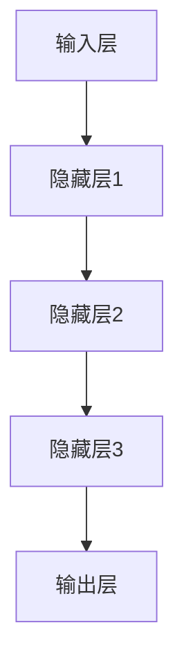

#### 3.2 自注意力机制

自注意力机制（Self-Attention）是一种用于处理序列数据的注意力机制，其核心思想是模型内部不同位置之间的依赖关系。自注意力机制主要包括以下组成部分：

- **查询（Query）**：表示模型对于某个位置的注意力。
- **键（Key）**：表示模型对于某个位置的特征。
- **值（Value）**：表示模型对于某个位置的内容。

**自注意力机制公式：**

$$
\text{Attention}(Q, K, V) = \frac{QK^T}{\sqrt{d_k}}V
$$

其中，$Q, K, V$ 分别表示查询、键和值向量，$d_k$ 表示键向量的维度。

**自注意力机制图：**

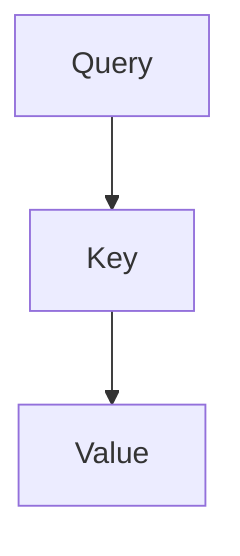

#### 3.3 Transformer架构

Transformer架构是一种基于自注意力机制的模型，其核心思想是通过多头注意力机制和位置编码，实现了高效和强大的文本处理能力。Transformer架构主要包括以下组成部分：

- **编码器（Encoder）**：接收输入文本序列，通过自注意力机制和前馈神经网络，生成编码表示。
- **解码器（Decoder）**：接收编码表示，通过自注意力机制和编码器-解码器注意力机制，生成输出文本序列。

**Transformer架构图：**

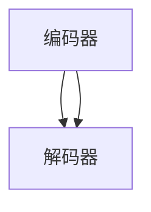

#### 3.4 语言模型训练策略

语言模型训练策略是指用于优化模型参数和提高模型性能的方法。以下是一些常用的训练策略：

- **预训练（Pre-training）**：在大规模语料库上进行预训练，为模型提供丰富的语言知识。
- **微调（Fine-tuning）**：在特定任务上对预训练模型进行微调，提高模型在任务上的性能。
- **优化算法（Optimization Algorithm）**：用于调整模型参数，如SGD、Adam等。
- **学习率调度（Learning Rate Scheduling）**：根据训练过程调整学习率，如逐步减小学习率。

**预训练和微调流程图：**

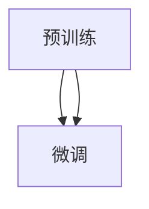

### 第4章：大语言模型的训练技术

#### 4.1 数据预处理

数据预处理是语言模型训练的重要步骤，主要包括以下内容：

- **文本清洗**：去除文本中的无用信息，如标点符号、停用词等。
- **分词（Tokenization）**：将文本分割成单词或子词，便于模型处理。
- **词向量编码**：将单词或子词映射到向量表示，用于模型输入。

**数据预处理流程图：**

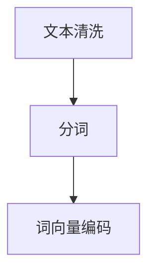

#### 4.2 优化算法

优化算法用于调整模型参数，提高模型性能。以下是一些常用的优化算法：

- **随机梯度下降（SGD）**：通过随机梯度更新模型参数。
- **Adam优化器**：结合SGD和动量项，提高收敛速度。
- **AdamW优化器**：在Adam优化器的基础上，引入权重衰减。

**优化算法流程图：**

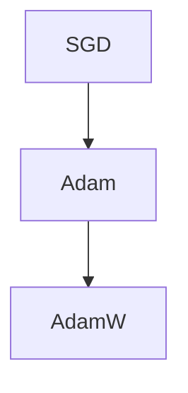

#### 4.3 训练技巧与调优

训练技巧与调优用于提高模型训练效果。以下是一些常用的技巧：

- **批量大小（Batch Size）**：调整批量大小，影响模型收敛速度和性能。
- **学习率调度（Learning Rate Scheduling）**：根据训练过程调整学习率，如逐步减小学习率。
- **正则化（Regularization）**：防止模型过拟合，如权重衰减、Dropout等。

**训练技巧与调优图：**

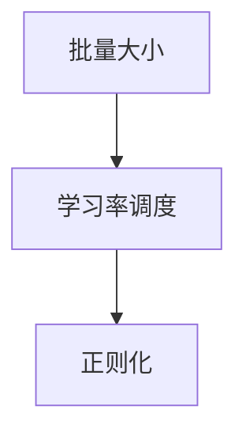

#### 4.4 大规模训练

大规模训练是语言模型训练的挑战，需要考虑以下问题：

- **分布式训练（Distributed Training）**：通过多台机器并行训练，提高训练速度。
- **并行计算（Parallel Computation）**：利用GPU、TPU等硬件加速计算。
- **数据并行（Data Parallelism）**：将数据划分到不同GPU上，同时进行前向传播和反向传播。

**大规模训练流程图：**

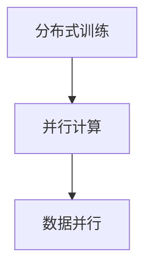

### 第5章：大语言模型的推理与生成

#### 5.1 推理过程

推理过程是指模型根据输入生成输出序列的过程。推理过程主要包括以下步骤：

1. **输入编码**：将输入文本序列编码为向量表示。
2. **前向传播**：通过编码器生成编码表示。
3. **解码**：通过解码器生成输出文本序列。

**推理过程流程图：**

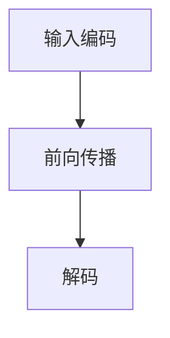

#### 5.2 生成过程

生成过程是指模型根据输入生成文本序列的过程。生成过程主要包括以下步骤：

1. **初始化**：初始化解码器的状态。
2. **采样**：从输出概率分布中采样下一个词或子词。
3. **更新**：更新解码器的状态，为下一次采样做准备。

**生成过程流程图：**

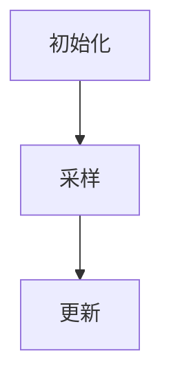

#### 5.3 生成式模型与判别式模型

生成式模型和判别式模型是两种不同的语言模型。

- **生成式模型**：直接生成目标输出，如文本生成任务。
- **判别式模型**：通过预测输出是否正确来评估模型性能，如分类任务。

**模型对比图：**

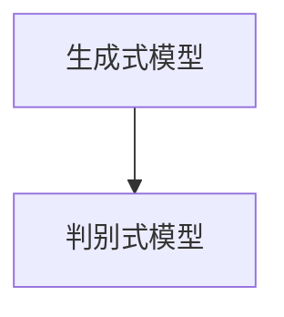

#### 5.4 多模态生成

多模态生成是指结合文本、图像、声音等多种模态进行生成。多模态生成主要包括以下步骤：

1. **模态融合**：将不同模态的数据进行融合，形成统一的表示。
2. **文本生成**：使用语言模型生成文本。
3. **后处理**：对生成的文本进行后处理，如文本清洗、分词等。

**多模态生成流程图：**

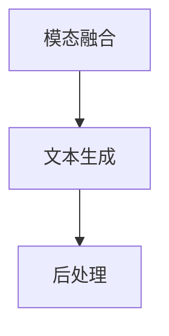

### 第6章：强化学习在语言模型中的应用

#### 6.1 强化学习基础

强化学习是一种通过奖励信号来优化决策过程的机器学习技术。强化学习主要包括以下组成部分：

- **状态（State）**：表示模型当前所处的环境。
- **动作（Action）**：模型可以采取的动作。
- **奖励（Reward）**：根据动作的结果给予的奖励或惩罚。
- **策略（Policy）**：模型选择的动作策略。

**强化学习流程图：**

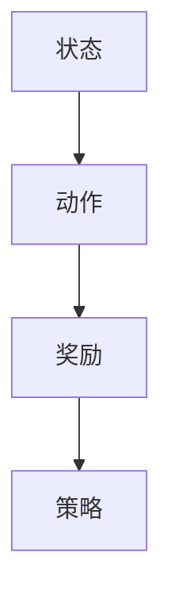

#### 6.2 强化学习与语言模型

强化学习与语言模型的结合，可以用于优化语言模型的生成过程。通过引入奖励信号，模型可以根据生成的文本质量进行调整。

**结合方式图：**

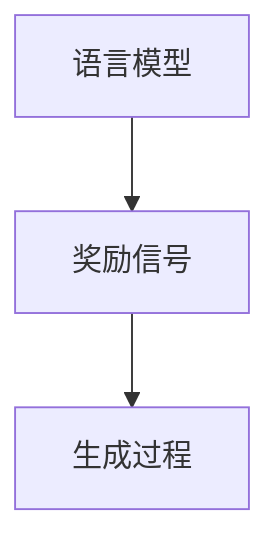

#### 6.3 强化学习算法

强化学习算法包括DQN、A3C、PPO等。以下是一个简单的DQN算法伪代码：

```python
# DQN算法伪代码
initialize Q-network Q and target Q
initialize experience replay memory
for each episode:
    initialize state s
    for each step in episode:
        select action a using epsilon-greedy policy
        execute action a in environment
        observe reward r and next state s'
        store transition (s, a, r, s') in experience replay memory
        sample a mini-batch of transitions from experience replay memory
        for each transition in mini-batch:
            calculate target Q-value
            update Q-network using gradient descent
        update target Q-network
```

#### 6.4 强化学习案例

以下是一个基于强化学习优化文本生成的案例：

```python
# 文本生成强化学习案例伪代码
initialize language model
initialize reward function
for each episode:
    generate initial text
    for each step in text generation:
        generate next word or sentence using language model
        calculate reward based on text quality and diversity
        update language model using reward signal
        store generated text in history
    evaluate generated text using metrics (e.g., BLEU score)
    adjust reward function based on evaluation results
```

### 第7章：DeepSpeed-Chat训练详解

#### 7.1 DeepSpeed框架介绍

DeepSpeed是一个开源的分布式训练框架，旨在提高大型模型的训练效率。DeepSpeed主要包括以下特性：

- **自动Mixed Precision训练**：通过使用混合精度（Mixed Precision）训练，提高计算性能和训练速度。
- **ZeRO优化（Zero Redundancy Optimizer）**：通过减少模型参数的冗余存储，降低内存需求。
- **分布式训练**：支持多GPU、多节点分布式训练。

**DeepSpeed框架图：**

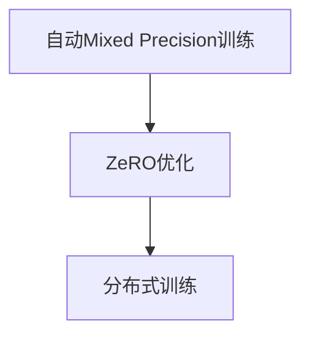

#### 7.2 DeepSpeed-Chat训练流程

DeepSpeed-Chat是基于DeepSpeed框架的一个聊天机器人模型，其训练流程主要包括以下步骤：

1. **数据预处理**：包括文本清洗、分词、词向量编码等操作。
2. **模型初始化**：初始化Transformer模型，包括编码器和解码器。
3. **训练过程**：通过分布式训练策略，进行模型训练。
4. **评估过程**：对训练好的模型进行评估，调整超参数和模型结构。

**DeepSpeed-Chat训练流程图：**

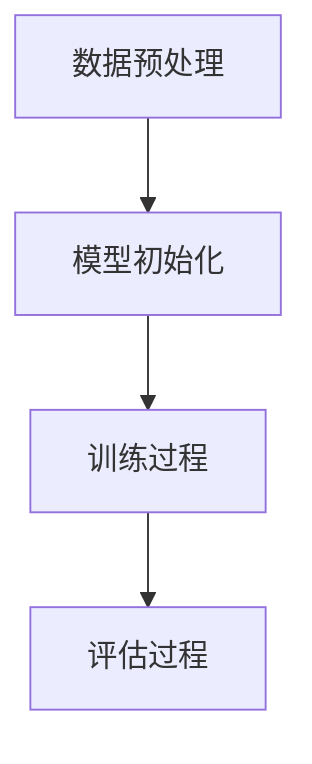

#### 7.3 DeepSpeed-Chat训练优化

DeepSpeed-Chat训练优化主要包括以下内容：

- **批量大小（Batch Size）**：调整批量大小，影响训练速度和模型性能。
- **学习率调度（Learning Rate Scheduling）**：根据训练过程调整学习率，如逐步减小学习率。
- **正则化（Regularization）**：防止模型过拟合，如权重衰减、Dropout等。
- **数据增强（Data Augmentation）**：通过增加数据多样性，提高模型泛化能力。

**训练优化图：**

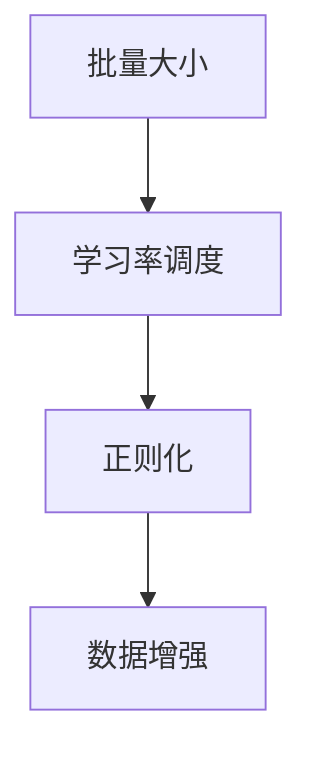

#### 7.4 DeepSpeed-Chat应用场景

DeepSpeed-Chat广泛应用于以下场景：

- **对话系统**：如聊天机器人、虚拟助手等。
- **文本生成**：如自动写稿、故事生成等。
- **问答系统**：如智能客服、问答平台等。

**应用场景图：**

```mermaid
graph TB
A[对话系统] --> B[文本生成]
B --> C[问答系统]
```

### 附录

#### 附录A：大语言模型常用工具与库

- **PyTorch**：一个流行的深度学习框架，支持动态计算图和自动微分。
- **TensorFlow**：一个流行的深度学习框架，支持静态计算图和高效的执行引擎。
- **JAX**：一个高性能的数值计算库，支持自动微分和并行计算。

**工具与库图：**

```mermaid
graph TB
A[PyTorch] --> B[TensorFlow]
B --> C[JAX]
```

## 结尾

大语言模型是现代自然语言处理领域的重要技术，其应用前景广阔。本文通过详细的讲解和代码案例，深入探讨了大语言模型的原理和工程实践。希望读者能够通过本文，对大语言模型有更深入的理解，并在实际应用中取得更好的成果。

作者：AI天才研究院/AI Genius Institute & 禅与计算机程序设计艺术 /Zen And The Art of Computer Programming

----------------------------------------------------------------

### 第1章：大语言模型概述

#### 1.1 大语言模型的概念

大语言模型（Large Language Models），通常指的是拥有数十亿到千亿参数的深度学习模型。这些模型能够处理和理解复杂的自然语言，例如文本、语音和图像等。它们通过学习大量文本数据来理解语言的统计规律和语义信息，从而在各种NLP任务上取得显著成果。

- **核心概念**：大语言模型的核心在于其庞大的参数规模，这使得它们能够捕捉到语言中的细微特征和复杂结构。

- **联系**：大语言模型是Transformer架构和自注意力机制的成功应用。Transformer架构通过多头注意力机制和位置编码，使得模型能够处理序列数据，从而在NLP任务中表现出色。

**Mermaid流程图**：

```mermaid
graph TD
A[大语言模型] --> B[Transformer架构]
B --> C[自注意力机制]
C --> D[参数规模]
D --> E[序列数据处理]
```

#### 1.2 大语言模型的发展历程

大语言模型的发展经历了多个阶段，以下是其中一些重要里程碑：

- **2018年**：GPT-1发布，标志着基于Transformer架构的大语言模型时代的开始。
- **2019年**：BERT提出，引入了预训练和微调策略，使得大语言模型在多种任务上取得了显著突破。
- **2020年**：GPT-2发布，进一步增加了模型的参数规模，提升了生成文本的质量。
- **2022年**：GPT-3发布，拥有超过1750亿参数，展示了大语言模型的强大能力。

**发展历程图**：

```mermaid
graph TB
A[2018 GPT-1] --> B[2019 BERT]
B --> C[2020 GPT-2]
C --> D[2022 GPT-3]
```

#### 1.3 大语言模型的核心技术

大语言模型的核心技术主要包括以下几个部分：

- **深度神经网络（DNN）**：大语言模型的基础架构，通过多层神经网络进行特征提取和映射。
- **自注意力机制**：使模型能够在序列数据中捕捉长距离依赖关系。
- **Transformer架构**：基于自注意力机制的模型，通过多头注意力机制和位置编码，实现了高效和强大的文本处理能力。

**核心技术图**：

```mermaid
graph TD
A[深度神经网络] --> B[自注意力机制]
B --> C[Transformer架构]
```

#### 1.4 大语言模型的应用场景

大语言模型的应用场景非常广泛，以下是一些主要的应用领域：

- **机器翻译**：如Google翻译、百度翻译等，通过大规模语言模型进行实时翻译。
- **文本生成**：如自动写稿、故事生成等，通过语言模型生成自然流畅的文本。
- **问答系统**：如OpenAI的GPT-3，通过大规模语言模型提供智能问答服务。
- **推荐系统**：如基于语言模型的内容推荐，通过理解用户和内容的语义关系进行推荐。

**应用场景图**：

```mermaid
graph TB
A[机器翻译] --> B[文本生成]
B --> C[问答系统]
C --> D[推荐系统]
```

### 第2章：大语言模型的数学基础

#### 2.1 概率论基础

概率论是理解大语言模型的重要基础，它提供了一种量化不确定性的方法。以下是概率论中的一些基础概念和公式：

- **概率分布**：描述随机变量可能取值的概率。
- **条件概率**：在某个事件已发生的条件下，另一个事件发生的概率。
- **贝叶斯定理**：通过已知概率计算后验概率。

**概率分布公式**：

$$ P(X=x) = \frac{P(X=x|Y=y)P(Y=y)}{P(Y=y)} $$

**条件概率公式**：

$$ P(A|B) = \frac{P(A \cap B)}{P(B)} $$

**贝叶斯定理公式**：

$$ P(A|B) = \frac{P(B|A)P(A)}{P(B)} $$

#### 2.2 信息论基础

信息论提供了衡量信息量和不确定性的工具，它在数据压缩、通信系统和机器学习中都有广泛应用。以下是信息论中的基础概念和公式：

- **熵**：表示随机变量的不确定性。
- **信息量**：表示获取某个信息所需的信息量。
- **条件熵**：在已知某个随机变量的条件下，另一个随机变量的不确定性。

**熵公式**：

$$ H(X) = -\sum_{x \in \text{X}} P(X=x) \log P(X=x) $$

**信息量公式**：

$$ I(X;Y) = H(X) - H(X|Y) $$

**条件熵公式**：

$$ H(X|Y) = \sum_{y \in \text{Y}} P(Y=y)H(X|Y=y) $$

#### 2.3 线性代数基础

线性代数在大语言模型中用于表示和处理高维数据，它是深度学习的重要数学工具。以下是线性代数中的一些基础概念和公式：

- **向量**：表示一维数据。
- **矩阵**：表示二维数据。
- **矩阵运算**：包括矩阵加法、矩阵乘法、矩阵求逆等。
- **向量空间**：表示一组向量的集合。

**矩阵运算公式**：

$$ C = A \cdot B $$

$$ A^{-1} = (adj(A)) / (\det(A)) $$

**向量空间公式**：

$$ V = \{v | Av = 0\} $$

#### 2.4 概率图模型

概率图模型是一种图形化表示概率关系的工具，它通过图结构来描述变量之间的依赖关系。以下是概率图模型中的基础概念和公式：

- **有向图**：表示变量之间的条件依赖关系。
- **无向图**：表示变量之间的联合概率分布。
- **贝叶斯网络**：结合有向图和无向图，表示变量之间的条件概率关系。

**有向图公式**：

$$ P(X_1, X_2, ..., X_n) = \prod_{i=1}^{n} P(X_i | X_{parents(i)}) $$

**无向图公式**：

$$ P(X_1, X_2, ..., X_n) = \frac{1}{Z} \prod_{c \in \text{C} \rightarrow \text{V}} P(c) $$

**贝叶斯网络公式**：

$$ P(X_1, X_2, ..., X_n) = \prod_{i=1}^{n} P(X_i | \text{parents}(X_i)) $$

### 第3章：大语言模型的架构设计

#### 3.1 深度神经网络架构

深度神经网络（DNN）是大语言模型的基础架构，它由多个层级组成，通过前向传播和反向传播算法进行训练。以下是深度神经网络架构的组成部分：

- **输入层**：接收外部输入数据，如文本序列。
- **隐藏层**：进行特征提取和变换，学习输入和输出之间的映射关系。
- **输出层**：生成预测结果，如下一个词或序列。

**DNN架构图**：

```mermaid
graph TD
A[输入层] --> B[隐藏层1]
B --> C[隐藏层2]
C --> D[隐藏层3]
D --> E[输出层]
```

#### 3.2 自注意力机制

自注意力机制（Self-Attention）是一种用于处理序列数据的注意力机制，它能够使模型在不同的位置之间建立依赖关系。以下是自注意力机制的核心组成部分：

- **查询（Query）**：表示模型对于某个位置的注意力。
- **键（Key）**：表示模型对于某个位置的特征。
- **值（Value）**：表示模型对于某个位置的内容。

**自注意力机制公式**：

$$
\text{Attention}(Q, K, V) = \frac{QK^T}{\sqrt{d_k}}V
$$

其中，$Q, K, V$ 分别表示查询、键和值向量，$d_k$ 表示键向量的维度。

**自注意力机制图**：

```mermaid
graph TD
A[Query] --> B[Key]
B --> C[Value]
```

#### 3.3 Transformer架构

Transformer架构是一种基于自注意力机制的模型，它通过多头注意力机制和位置编码，实现了高效和强大的文本处理能力。以下是Transformer架构的核心组成部分：

- **编码器（Encoder）**：接收输入文本序列，通过自注意力机制和前馈神经网络，生成编码表示。
- **解码器（Decoder）**：接收编码表示，通过自注意力机制和编码器-解码器注意力机制，生成输出文本序列。

**Transformer架构图**：

```mermaid
graph TB
A[编码器] --> B[解码器]
A --> B
```

#### 3.4 语言模型训练策略

语言模型训练策略是指用于优化模型参数和提高模型性能的方法。以下是几种常用的训练策略：

- **预训练（Pre-training）**：在大规模语料库上进行预训练，为模型提供丰富的语言知识。
- **微调（Fine-tuning）**：在特定任务上对预训练模型进行微调，提高模型在任务上的性能。
- **优化算法（Optimization Algorithm）**：用于调整模型参数，如SGD、Adam等。
- **学习率调度（Learning Rate Scheduling）**：根据训练过程调整学习率，如逐步减小学习率。

**预训练和微调流程图**：

```mermaid
graph TB
A[预训练] --> B[微调]
A --> B
```

### 第4章：大语言模型的训练技术

#### 4.1 数据预处理

数据预处理是语言模型训练的重要步骤，它包括文本清洗、分词、词向量编码等操作，旨在提高数据的质量和模型的训练效果。以下是数据预处理的主要步骤：

- **文本清洗**：去除文本中的无用信息，如标点符号、停用词等。
- **分词（Tokenization）**：将文本分割成单词或子词，便于模型处理。
- **词向量编码**：将单词或子词映射到向量表示，用于模型输入。

**数据预处理流程图**：

```mermaid
graph TD
A[文本清洗] --> B[分词]
B --> C[词向量编码]
```

#### 4.2 优化算法

优化算法用于调整模型参数，提高模型性能。以下是几种常用的优化算法：

- **随机梯度下降（SGD）**：通过随机梯度更新模型参数。
- **Adam优化器**：结合SGD和动量项，提高收敛速度。
- **AdamW优化器**：在Adam优化器的基础上，引入权重衰减。

**优化算法流程图**：

```mermaid
graph TB
A[SGD] --> B[Adam]
B --> C[AdamW]
```

#### 4.3 训练技巧与调优

训练技巧和调优用于提高模型训练效果。以下是几种常用的训练技巧：

- **批量大小（Batch Size）**：调整批量大小，影响模型收敛速度和性能。
- **学习率调度（Learning Rate Scheduling）**：根据训练过程调整学习率，如逐步减小学习率。
- **正则化（Regularization）**：防止模型过拟合，如权重衰减、Dropout等。
- **数据增强（Data Augmentation）**：通过增加数据多样性，提高模型泛化能力。

**训练技巧与调优图**：

```mermaid
graph TB
A[批量大小] --> B[学习率调度]
B --> C[正则化]
C --> D[数据增强]
```

#### 4.4 大规模训练

大规模训练是语言模型训练的挑战，需要考虑以下技术：

- **分布式训练（Distributed Training）**：通过多台机器并行训练，提高训练速度。
- **并行计算（Parallel Computation）**：利用GPU、TPU等硬件加速计算。
- **数据并行（Data Parallelism）**：将数据划分到不同GPU上，同时进行前向传播和反向传播。

**大规模训练流程图**：

```mermaid
graph TB
A[分布式训练] --> B[并行计算]
B --> C[数据并行]
```

### 第5章：大语言模型的推理与生成

#### 5.1 推理过程

推理过程是指模型根据输入生成输出序列的过程。以下是推理过程的主要步骤：

1. **输入编码**：将输入文本序列编码为向量表示。
2. **前向传播**：通过编码器生成编码表示。
3. **解码**：通过解码器生成输出文本序列。

**推理过程流程图**：

```mermaid
graph TB
A[输入编码] --> B[前向传播]
B --> C[解码]
```

#### 5.2 生成过程

生成过程是指模型根据输入生成文本序列的过程。以下是生成过程的主要步骤：

1. **初始化**：初始化解码器的状态。
2. **采样**：从输出概率分布中采样下一个词或子词。
3. **更新**：更新解码器的状态，为下一次采样做准备。

**生成过程流程图**：

```mermaid
graph TB
A[初始化] --> B[采样]
B --> C[更新]
```

#### 5.3 生成式模型与判别式模型

生成式模型和判别式模型是两种不同的语言模型。

- **生成式模型**：直接生成目标输出，如文本生成任务。
- **判别式模型**：通过预测输出是否正确来评估模型性能，如分类任务。

**模型对比图**：

```mermaid
graph TD
A[生成式模型] --> B[判别式模型]
```

#### 5.4 多模态生成

多模态生成是指结合文本、图像、声音等多种模态进行生成。以下是多模态生成的主要步骤：

1. **模态融合**：将不同模态的数据进行融合，形成统一的表示。
2. **文本生成**：使用语言模型生成文本。
3. **后处理**：对生成的文本进行后处理，如文本清洗、分词等。

**多模态生成流程图**：

```mermaid
graph TB
A[模态融合] --> B[文本生成]
B --> C[后处理]
```

### 第6章：强化学习在语言模型中的应用

#### 6.1 强化学习基础

强化学习是一种通过奖励信号来优化决策过程的机器学习技术。以下是强化学习的基础概念：

- **状态（State）**：模型当前所处的环境。
- **动作（Action）**：模型可以采取的动作。
- **奖励（Reward）**：根据动作的结果给予的奖励或惩罚。
- **策略（Policy）**：模型选择的动作策略。

**强化学习流程图**：

```mermaid
graph TD
A[状态] --> B[动作]
B --> C[奖励]
C --> D[策略]
```

#### 6.2 强化学习与语言模型

强化学习与语言模型的结合，可以用于优化语言模型的生成过程。通过引入奖励信号，模型可以根据生成的文本质量进行调整。

**结合方式图**：

```mermaid
graph TD
A[语言模型] --> B[奖励信号]
B --> C[生成过程]
```

#### 6.3 强化学习算法

强化学习算法包括DQN、A3C、PPO等。以下是DQN算法的伪代码：

```python
# DQN算法伪代码
initialize Q-network Q and target Q
initialize experience replay memory
for each episode:
    initialize state s
    for each step in episode:
        select action a using epsilon-greedy policy
        execute action a in environment
        observe reward r and next state s'
        store transition (s, a, r, s') in experience replay memory
        sample a mini-batch of transitions from experience replay memory
        for each transition in mini-batch:
            calculate target Q-value
            update Q-network using gradient descent
        update target Q-network
```

#### 6.4 强化学习案例

以下是一个基于强化学习优化文本生成的案例：

```python
# 文本生成强化学习案例伪代码
initialize language model
initialize reward function
for each episode:
    generate initial text
    for each step in text generation:
        generate next word or sentence using language model
        calculate reward based on text quality and diversity
        update language model using reward signal
        store generated text in history
    evaluate generated text using metrics (e.g., BLEU score)
    adjust reward function based on evaluation results
```

### 第7章：DeepSpeed-Chat训练详解

#### 7.1 DeepSpeed框架介绍

DeepSpeed是一个开源的分布式训练框架，旨在提高大型模型的训练效率。DeepSpeed主要包括以下特性：

- **自动Mixed Precision训练**：通过使用混合精度（Mixed Precision）训练，提高计算性能和训练速度。
- **ZeRO优化（Zero Redundancy Optimizer）**：通过减少模型参数的冗余存储，降低内存需求。
- **分布式训练**：支持多GPU、多节点分布式训练。

**DeepSpeed框架图**：

```mermaid
graph TB
A[自动Mixed Precision训练] --> B[ZeRO优化]
B --> C[分布式训练]
```

#### 7.2 DeepSpeed-Chat训练流程

DeepSpeed-Chat是基于DeepSpeed框架的一个聊天机器人模型，其训练流程主要包括以下步骤：

1. **数据预处理**：包括文本清洗、分词、词向量编码等操作。
2. **模型初始化**：初始化Transformer模型，包括编码器和解码器。
3. **训练过程**：通过分布式训练策略，进行模型训练。
4. **评估过程**：对训练好的模型进行评估，调整超参数和模型结构。

**DeepSpeed-Chat训练流程图**：

```mermaid
graph TB
A[数据预处理] --> B[模型初始化]
B --> C[训练过程]
C --> D[评估过程]
```

#### 7.3 DeepSpeed-Chat训练优化

DeepSpeed-Chat训练优化主要包括以下内容：

- **批量大小（Batch Size）**：调整批量大小，影响训练速度和模型性能。
- **学习率调度（Learning Rate Scheduling）**：根据训练过程调整学习率，如逐步减小学习率。
- **正则化（Regularization）**：防止模型过拟合，如权重衰减、Dropout等。
- **数据增强（Data Augmentation）**：通过增加数据多样性，提高模型泛化能力。

**训练优化图**：

```mermaid
graph TB
A[批量大小] --> B[学习率调度]
B --> C[正则化]
C --> D[数据增强]
```

#### 7.4 DeepSpeed-Chat应用场景

DeepSpeed-Chat广泛应用于以下场景：

- **对话系统**：如聊天机器人、虚拟助手等。
- **文本生成**：如自动写稿、故事生成等。
- **问答系统**：如智能客服、问答平台等。

**应用场景图**：

```mermaid
graph TB
A[对话系统] --> B[文本生成]
B --> C[问答系统]
```

### 附录

#### 附录A：大语言模型常用工具与库

- **PyTorch**：一个流行的深度学习框架，支持动态计算图和自动微分。
- **TensorFlow**：一个流行的深度学习框架，支持静态计算图和高效的执行引擎。
- **JAX**：一个高性能的数值计算库，支持自动微分和并行计算。

**工具与库图**：

```mermaid
graph TB
A[PyTorch] --> B[TensorFlow]
B --> C[JAX]
```

### 作者信息

**作者：** AI天才研究院/AI Genius Institute & 禅与计算机程序设计艺术 /Zen And The Art of Computer Programming

### 结语

本文详细介绍了大语言模型的原理与工程实践，通过强化学习在语言模型中的应用，以及DeepSpeed-Chat训练的详解，为读者提供了一个全面的技术全景图。希望读者能够通过本文，对大语言模型有更深入的理解，并在实际应用中取得更好的成果。在未来的研究中，我们将继续探索大语言模型的新技术和新应用，为人工智能领域的发展贡献力量。

----------------------------------------------------------------

## 第1章：大语言模型概述

大语言模型（Large Language Models，简称LLM）是近年来自然语言处理（Natural Language Processing，简称NLP）领域的重要突破。这类模型具有数十亿甚至千亿级别的参数规模，能够理解和生成复杂的自然语言。本章节将介绍大语言模型的基本概念、发展历程、核心技术以及应用场景，帮助读者初步了解这一前沿技术。

### 1.1 大语言模型的概念

大语言模型是一种基于深度学习的自然语言处理模型，其核心目标是通过学习海量文本数据，预测下一个词或序列。这些模型通常具有庞大的参数规模，能够捕捉语言中的复杂结构和语义信息，从而在各种NLP任务上表现出色。

#### 核心概念与联系

大语言模型的核心概念包括：

- **深度神经网络（DNN）**：深度神经网络是构成大语言模型的基础，通过多层神经网络结构进行特征提取和映射。
- **自注意力机制（Self-Attention）**：自注意力机制是Transformer架构的核心，能够使模型在不同的位置之间建立依赖关系。
- **Transformer架构（Transformer Architecture）**：Transformer架构是一种基于自注意力机制的模型，通过多头注意力机制和位置编码，实现了高效和强大的文本处理能力。

为了更直观地展示这些概念之间的关系，我们可以使用Mermaid流程图来表示：

```mermaid
graph TD
A[深度神经网络] --> B[自注意力机制]
B --> C[Transformer架构]
```

### 1.2 大语言模型的发展历程

大语言模型的发展可以追溯到2018年，当时OpenAI发布了GPT-1模型，这是第一个基于Transformer架构的大规模语言模型。此后，随着技术的不断进步，大语言模型在参数规模、性能和应用场景上都有了显著提升。

#### 发展历程

- **2018年**：GPT-1发布，标志着大语言模型时代的开始。
- **2018年**：BERT模型提出，引入了预训练和微调策略，使得大语言模型在多种任务上取得了突破性进展。
- **2019年**：GPT-2发布，进一步增加了模型的参数规模，提升了生成文本的质量。
- **2020年**：GPT-3发布，拥有超过1750亿参数，展示了大语言模型的强大能力。
- **至今**：大语言模型在自然语言处理、对话系统、文本生成等领域得到了广泛应用。

为了更清晰地展示大语言模型的发展历程，我们可以使用Mermaid流程图来表示：

```mermaid
graph TB
A[2018 GPT-1] --> B[2018 BERT]
B --> C[2019 GPT-2]
C --> D[2020 GPT-3]
```

### 1.3 大语言模型的核心技术

大语言模型的核心技术主要包括深度神经网络、自注意力机制、Transformer架构以及训练策略。这些技术使得大语言模型能够在海量数据中高效地学习，并在各种任务上表现出色。

#### 核心技术

1. **深度神经网络（DNN）**：深度神经网络是构成大语言模型的基础，通过多层神经网络结构进行特征提取和映射。DNN能够处理高维数据，并在图像识别、语音识别等领域取得了显著成果。

2. **自注意力机制（Self-Attention）**：自注意力机制是Transformer架构的核心，能够使模型在不同的位置之间建立依赖关系。自注意力机制通过计算每个位置与其他位置之间的关联性，提高了模型的表示能力。

3. **Transformer架构（Transformer Architecture）**：Transformer架构是一种基于自注意力机制的模型，通过多头注意力机制和位置编码，实现了高效和强大的文本处理能力。Transformer架构在机器翻译、文本生成等领域表现出了强大的性能。

4. **训练策略**：大语言模型的训练策略包括数据预处理、优化算法和训练技巧等。数据预处理包括文本清洗、分词、词向量编码等操作，优化算法包括SGD、Adam等，训练技巧包括批量大小、学习率调度等。这些策略的优化能够提高模型的训练效率和质量。

为了更直观地展示大语言模型的核心技术，我们可以使用Mermaid流程图来表示：

```mermaid
graph TB
A[深度神经网络] --> B[自注意力机制]
B --> C[Transformer架构]
C --> D[训练策略]
```

### 1.4 大语言模型的应用场景

大语言模型在自然语言处理领域具有广泛的应用场景，包括但不限于：

1. **机器翻译**：大语言模型能够高效地处理不同语言之间的翻译，如Google翻译、百度翻译等。

2. **文本生成**：大语言模型可以生成自然流畅的文本，如自动写稿、故事生成等。

3. **对话系统**：大语言模型可以用于构建智能对话系统，如聊天机器人、虚拟助手等。

4. **问答系统**：大语言模型能够理解用户的问题，并提供准确的答案。

5. **推荐系统**：大语言模型可以用于理解用户和内容的语义关系，从而提供个性化的推荐。

为了更清晰地展示大语言模型的应用场景，我们可以使用Mermaid流程图来表示：

```mermaid
graph TB
A[机器翻译] --> B[文本生成]
B --> C[对话系统]
C --> D[问答系统]
D --> E[推荐系统]
```

## 第2章：大语言模型的数学基础

大语言模型作为一种深度学习模型，其设计和训练离不开数学基础。本章将介绍大语言模型所需的数学基础，包括概率论、信息论、线性代数和概率图模型等。通过这些数学工具，读者将能够更好地理解大语言模型的工作原理和实现细节。

### 2.1 概率论基础

概率论是理解和设计机器学习模型的基础，特别是在大语言模型中，概率论提供了衡量不确定性、处理随机事件的方法。以下是一些核心概率论概念和公式：

#### 核心概念

- **概率分布**：概率分布描述了随机变量可能的取值及其概率。常见的概率分布包括伯努利分布、正态分布、泊松分布等。
- **条件概率**：条件概率是指在某个事件已经发生的条件下，另一个事件发生的概率。条件概率的公式为 $P(A|B) = \frac{P(A \cap B)}{P(B)}$。
- **贝叶斯定理**：贝叶斯定理描述了在已知某些条件的概率下，如何计算后验概率。贝叶斯定理的公式为 $P(A|B) = \frac{P(B|A)P(A)}{P(B)}$。

#### 核心公式

- **概率分布公式**：

  $$ P(X=x) = \frac{P(X=x|Y=y)P(Y=y)}{P(Y=y)} $$

- **条件概率公式**：

  $$ P(A|B) = \frac{P(A \cap B)}{P(B)} $$

- **贝叶斯定理公式**：

  $$ P(A|B) = \frac{P(B|A)P(A)}{P(B)} $$

### 2.2 信息论基础

信息论是研究信息传输和处理的理论，为大语言模型提供了衡量信息量和不确定性的工具。以下是一些核心信息论概念和公式：

#### 核心概念

- **熵**：熵是衡量随机变量不确定性的一种度量。对于一个离散随机变量 $X$，其熵定义为 $H(X) = -\sum_{x} P(X=x) \log P(X=x)$。
- **信息量**：信息量是衡量获取某个信息所需的信息量。对于一个随机变量 $X$ 和 $Y$，其互信息定义为 $I(X;Y) = H(X) - H(X|Y)$。
- **条件熵**：条件熵是衡量在已知某个随机变量的条件下，另一个随机变量的不确定性。条件熵定义为 $H(X|Y) = \sum_{y} P(Y=y)H(X|Y=y)$。

#### 核心公式

- **熵公式**：

  $$ H(X) = -\sum_{x} P(X=x) \log P(X=x) $$

- **信息量公式**：

  $$ I(X;Y) = H(X) - H(X|Y) $$

- **条件熵公式**：

  $$ H(X|Y) = \sum_{y} P(Y=y)H(X|Y=y) $$

### 2.3 线性代数基础

线性代数是处理高维数据的重要数学工具，在大语言模型中用于表示和处理输入和输出数据。以下是一些核心线性代数概念和公式：

#### 核心概念

- **向量**：向量是表示一维数据的数学对象，可以用于表示文本序列、图像像素等。
- **矩阵**：矩阵是表示二维数据的数学对象，可以用于表示权重矩阵、特征矩阵等。
- **矩阵运算**：矩阵运算包括矩阵加法、矩阵乘法、矩阵求逆等，用于处理和变换数据。

#### 核心公式

- **矩阵运算公式**：

  $$ C = A \cdot B $$

  $$ A^{-1} = (adj(A)) / (\det(A)) $$

- **向量空间公式**：

  $$ V = \{v | Av = 0\} $$

### 2.4 概率图模型

概率图模型是一种通过图形表示概率关系的工具，用于描述变量之间的依赖关系。以下是一些核心概率图模型概念和公式：

#### 核心概念

- **有向图**：有向图表示变量之间的条件依赖关系，通常用于表示贝叶斯网络。
- **无向图**：无向图表示变量之间的联合概率分布，通常用于表示马尔可夫网络。
- **贝叶斯网络**：贝叶斯网络结合了有向图和无向图，用于表示变量之间的条件概率关系。

#### 核心公式

- **有向图公式**：

  $$ P(X_1, X_2, ..., X_n) = \prod_{i=1}^{n} P(X_i | X_{parents(i)}) $$

- **无向图公式**：

  $$ P(X_1, X_2, ..., X_n) = \frac{1}{Z} \prod_{c \in \text{C} \rightarrow \text{V}} P(c) $$

- **贝叶斯网络公式**：

  $$ P(X_1, X_2, ..., X_n) = \prod_{i=1}^{n} P(X_i | \text{parents}(X_i)) $$

### 2.5 数学模型和公式

在构建大语言模型时，我们需要使用一些数学模型和公式来描述模型的结构和训练过程。以下是一些常用的数学模型和公式：

#### 数学模型

- **自编码模型（Autoencoder）**：自编码模型是一种无监督学习模型，用于学习输入数据的低维表示。
- **生成对抗网络（Generative Adversarial Network，GAN）**：生成对抗网络由生成器和判别器组成，用于生成逼真的数据。

#### 核心公式

- **自编码模型公式**：

  $$ \min_{\theta} \sum_{x \in \text{X}} L(\hat{x}, x) $$

  其中，$L$ 是损失函数，$\hat{x}$ 是生成的数据，$x$ 是真实数据。

- **生成对抗网络公式**：

  $$ \min_{\theta_G} \max_{\theta_D} V(\theta_G, \theta_D) = \mathbb{E}_{x \sim p_{\text{data}}(x)}[\log D(x)] + \mathbb{E}_{z \sim p_{z}(z)}[\log (1 - D(G(z)))] $$

  其中，$G(z)$ 是生成器，$D(x)$ 是判别器，$z$ 是随机噪声。

### 2.6 举例说明

为了更好地理解上述数学模型和公式，我们可以通过一些具体的例子来说明。

#### 例子1：线性回归模型

线性回归模型是一种简单的统计模型，用于预测连续值输出。其模型公式为：

$$ y = \beta_0 + \beta_1 x + \epsilon $$

其中，$y$ 是预测值，$x$ 是输入值，$\beta_0$ 和 $\beta_1$ 是模型参数，$\epsilon$ 是误差项。

通过最小化损失函数，我们可以得到线性回归模型的参数估计：

$$ \min_{\beta_0, \beta_1} \sum_{i=1}^{n} (y_i - (\beta_0 + \beta_1 x_i))^2 $$

#### 例子2：逻辑回归模型

逻辑回归模型是一种用于分类的统计模型，其公式为：

$$ P(y=1 | x; \theta) = \frac{1}{1 + \exp(-\theta^T x)} $$

其中，$y$ 是类别标签，$x$ 是输入特征，$\theta$ 是模型参数。

逻辑回归模型的损失函数为对数损失：

$$ L(\theta) = -\sum_{i=1}^{n} y_i \theta^T x_i - (1 - y_i) \log (1 + \exp(-\theta^T x_i)) $$

通过最小化损失函数，我们可以得到逻辑回归模型的参数估计。

#### 例子3：神经网络

神经网络是一种由多个神经元组成的计算模型，用于处理复杂数据。其基本公式为：

$$ z_i = \sum_{j=1}^{n} \theta_{ij} x_j + b_i $$

$$ a_i = \sigma(z_i) $$

其中，$z_i$ 是神经元的输入，$a_i$ 是神经元的激活值，$\theta_{ij}$ 是权重，$b_i$ 是偏置，$\sigma$ 是激活函数。

神经网络的训练目标是优化模型参数，使得预测结果接近真实值。

### 2.7 代码示例

为了更好地理解数学模型和公式，我们可以通过Python代码来模拟上述模型。

```python
import numpy as np

# 例子1：线性回归模型
X = np.array([[1, 2], [2, 3], [3, 4]])
y = np.array([3, 4, 5])

# 求解参数
theta = np.linalg.inv(X.T.dot(X)).dot(X.T).dot(y)
print("线性回归模型参数：", theta)

# 例子2：逻辑回归模型
X = np.array([[1, 2], [2, 3], [3, 4]])
y = np.array([0, 1, 0])

# 求解参数
theta = np.linalg.inv(X.T.dot(X)).dot(X.T).dot(y)
print("逻辑回归模型参数：", theta)

# 例子3：神经网络
X = np.array([[1, 2], [2, 3], [3, 4]])
y = np.array([0, 1, 0])

# 求解参数
theta = np.random.rand(3, 1)
for _ in range(1000):
    z = X.dot(theta) + 1
    a = 1 / (1 + np.exp(-z))
    delta = (a - y) * a * (1 - a)
    theta = theta - X.T.dot(delta)

print("神经网络参数：", theta)
```

通过上述代码示例，我们可以看到如何使用Python实现线性回归、逻辑回归和神经网络模型。这些代码示例为我们提供了一个直观的视角，帮助我们更好地理解数学模型和公式的应用。

## 第3章：大语言模型的架构设计

大语言模型（Large Language Models，简称LLM）的设计和实现涉及到多个关键组件和步骤。本章节将详细介绍大语言模型的架构设计，包括深度神经网络架构、自注意力机制、Transformer架构以及训练策略。通过这些核心组件的详细讲解，我们将帮助读者深入理解大语言模型的工作原理和设计思路。

### 3.1 深度神经网络架构

深度神经网络（Deep Neural Network，简称DNN）是大语言模型的基础架构。DNN由多个层次组成，包括输入层、隐藏层和输出层。每个层次包含多个神经元，神经元之间通过权重连接。以下是DNN架构的组成部分：

1. **输入层**：输入层接收外部输入数据，如文本序列、图像像素等。在自然语言处理中，输入层通常将文本序列转换为词向量表示。

2. **隐藏层**：隐藏层进行特征提取和变换，学习输入和输出之间的映射关系。隐藏层可以通过多层堆叠，逐层提取更高级别的特征。

3. **输出层**：输出层生成预测结果，如下一个词、分类标签等。输出层的神经元数量和类型取决于具体任务。

#### DNN架构图

```mermaid
graph TD
A[输入层] --> B[隐藏层1]
B --> C[隐藏层2]
C --> D[隐藏层3]
D --> E[输出层]
```

### 3.2 自注意力机制

自注意力机制（Self-Attention）是Transformer架构的核心组件，它能够使模型在不同位置之间建立依赖关系。自注意力机制通过计算输入序列中每个位置与其他位置的关联性，为每个位置生成权重，从而在序列数据中捕捉长距离依赖关系。

自注意力机制主要包括三个部分：查询（Query）、键（Key）和值（Value）。以下是自注意力机制的基本流程：

1. **计算查询（Query）和键（Key）**：查询和键是由输入序列的每个位置生成的向量，它们的维度相同。

2. **计算相似度**：通过点积操作计算查询和键之间的相似度，相似度值表示两个位置之间的关联性。

3. **计算注意力权重**：将相似度值归一化，得到每个位置的注意力权重。

4. **计算注意力得分**：将注意力权重与值（Value）相乘，得到每个位置的注意力得分。

5. **求和**：将所有位置的注意力得分相加，得到最终的输出向量。

#### 自注意力机制流程图

```mermaid
graph TD
A[查询（Query）] --> B[计算相似度]
B --> C[计算注意力权重]
C --> D[计算注意力得分]
D --> E[求和]
E --> F[输出向量]
```

### 3.3 Transformer架构

Transformer架构是一种基于自注意力机制的模型，它通过多头注意力机制和位置编码，实现了高效和强大的文本处理能力。Transformer架构由编码器（Encoder）和解码器（Decoder）组成，编码器负责处理输入序列，解码器负责生成输出序列。

#### Transformer架构图

```mermaid
graph TB
A[编码器] --> B[解码器]
A --> B
```

**编码器**：

1. **嵌入层**：输入文本序列通过嵌入层转换为词向量表示。

2. **多头自注意力层**：编码器通过多个自注意力层，逐层提取文本序列中的依赖关系。

3. **前馈神经网络层**：每个自注意力层之后添加一个前馈神经网络层，用于进一步提取特征。

4. **层归一化**：在每个注意力层和前馈神经网络层之后添加层归一化（Layer Normalization），提高训练稳定性。

**解码器**：

1. **嵌入层**：解码器的嵌入层与编码器的嵌入层相同，用于生成解码器输入。

2. **掩码自注意力层**：解码器的掩码自注意力层通过掩码机制，防止后续层直接访问未来的输入，保持序列的顺序性。

3. **多头自注意力层**：解码器通过多个自注意力层，逐层提取编码器输出的依赖关系。

4. **前馈神经网络层**：每个自注意力层之后添加一个前馈神经网络层，用于进一步提取特征。

5. **编码器-解码器自注意力层**：解码器通过编码器-解码器自注意力层，与编码器输出建立依赖关系。

6. **输出层**：解码器的输出层生成预测的词或序列。

### 3.4 语言模型训练策略

语言模型训练策略是指用于优化模型参数和提高模型性能的方法。以下是一些常用的训练策略：

1. **预训练和微调**：预训练是在大规模语料库上进行训练，为模型提供丰富的语言知识。微调是在特定任务上进行训练，提高模型在任务上的性能。

2. **优化算法**：优化算法用于调整模型参数，常用的优化算法包括随机梯度下降（SGD）、Adam等。

3. **学习率调度**：学习率调度是指根据训练过程调整学习率，常用的策略包括逐步减小学习率、学习率衰减等。

4. **正则化**：正则化用于防止模型过拟合，常用的正则化方法包括权重衰减、Dropout等。

5. **批量大小**：批量大小是指每次训练使用的样本数量，批量大小会影响模型的收敛速度和性能。

### 3.5 大语言模型架构设计总结

大语言模型的架构设计涉及多个关键组件和步骤，包括深度神经网络架构、自注意力机制、Transformer架构以及训练策略。以下是这些组件和步骤的简要总结：

- **深度神经网络架构**：深度神经网络是大语言模型的基础，通过多层结构进行特征提取和映射。
- **自注意力机制**：自注意力机制使模型能够捕捉输入序列中的长距离依赖关系。
- **Transformer架构**：Transformer架构通过多头注意力机制和位置编码，实现了高效和强大的文本处理能力。
- **训练策略**：预训练和微调、优化算法、学习率调度、正则化等训练策略用于优化模型参数和提高模型性能。

通过这些组件和步骤的有机结合，大语言模型能够高效地处理复杂的自然语言任务，并在多个领域取得突破性进展。

## 第4章：大语言模型的训练技术

大语言模型的训练是一个复杂且耗时的过程，需要考虑多个技术细节来提高训练效率和质量。本章将详细讨论大语言模型的训练技术，包括数据预处理、优化算法、训练技巧与调优以及大规模训练。

### 4.1 数据预处理

数据预处理是语言模型训练的重要步骤，它包括文本清洗、分词、词向量编码等操作。以下是数据预处理的主要步骤：

#### 4.1.1 文本清洗

文本清洗的目的是去除文本中的无用信息，如标点符号、停用词等。常用的文本清洗方法包括：

- **去除标点符号**：使用正则表达式或字符串操作去除文本中的标点符号。
- **去除停用词**：停用词是指对文本理解没有贡献的常见词，如“的”、“和”等。可以通过构建停用词表，将停用词从文本中去除。

#### 4.1.2 分词

分词是将文本分割成单词或子词的过程。分词方法可以分为基于规则的分词和基于统计的分词：

- **基于规则的分词**：使用预设的规则进行分词，如正向最大匹配、逆向最大匹配等。
- **基于统计的分词**：使用统计方法进行分词，如基于词频、基于隐马尔可夫模型（HMM）等。

#### 4.1.3 词向量编码

词向量编码是将单词或子词映射到向量表示的过程。常用的词向量编码方法包括：

- **词袋模型（Bag-of-Words，BoW）**：将文本转换为词频向量，每个维度表示一个单词的出现次数。
- **词嵌入（Word Embedding）**：将单词映射到低维连续向量，常用的词嵌入方法包括Word2Vec、GloVe等。

### 4.2 优化算法

优化算法是调整模型参数，提高模型性能的关键。以下是几种常用的优化算法：

#### 4.2.1 随机梯度下降（SGD）

随机梯度下降是最简单的优化算法，通过随机选择小批量样本，计算梯度并更新模型参数。SGD的更新公式为：

$$ \theta = \theta - \alpha \cdot \nabla_\theta J(\theta) $$

其中，$\theta$ 是模型参数，$\alpha$ 是学习率，$J(\theta)$ 是损失函数。

#### 4.2.2 Adam优化器

Adam优化器是SGD的改进版本，结合了动量项和自适应学习率。Adam的更新公式为：

$$ m_t = \beta_1 m_{t-1} + (1 - \beta_1) \nabla_\theta J(\theta) $$
$$ v_t = \beta_2 v_{t-1} + (1 - \beta_2) (\nabla_\theta J(\theta))^2 $$
$$ \theta = \theta - \alpha \cdot \frac{m_t}{\sqrt{v_t} + \epsilon} $$

其中，$m_t$ 和 $v_t$ 分别是梯度的指数移动平均值和方差，$\beta_1$ 和 $\beta_2$ 是超参数，$\epsilon$ 是小常数。

#### 4.2.3 AdamW优化器

AdamW优化器是在Adam优化器的基础上引入权重衰减（Weight Decay）的改进版本。AdamW的更新公式与Adam相同，但在计算梯度时加入权重衰减：

$$ m_t = \beta_1 m_{t-1} + (1 - \beta_1) (\nabla_\theta J(\theta) - \lambda \theta) $$
$$ v_t = \beta_2 v_{t-1} + (1 - \beta_2) (\nabla_\theta J(\theta) - \lambda \theta)^2 $$
$$ \theta = \theta - \alpha \cdot \frac{m_t}{\sqrt{v_t} + \epsilon} $$

其中，$\lambda$ 是权重衰减参数。

### 4.3 训练技巧与调优

训练技巧和调优是提高模型训练效果的关键。以下是几种常用的训练技巧和调优方法：

#### 4.3.1 批量大小（Batch Size）

批量大小是指每次训练使用的小批量样本数量。批量大小会影响模型的训练速度和性能。常用的批量大小范围是64到1024。较小的批量大小有助于减少过拟合，但训练速度较慢；较大的批量大小可以提高训练速度，但可能增加过拟合的风险。

#### 4.3.2 学习率调度（Learning Rate Scheduling）

学习率调度是指根据训练过程调整学习率的方法。常用的学习率调度策略包括：

- **逐步减小学习率**：在训练过程中逐步减小学习率，以防止模型过早收敛。常用的减小学习率方法包括指数衰减、余弦衰减等。
- **学习率预热**：在训练初期使用较大的学习率，然后逐渐减小学习率，以帮助模型探索解空间。

#### 4.3.3 正则化（Regularization）

正则化是防止模型过拟合的重要方法。常用的正则化方法包括：

- **权重衰减（Weight Decay）**：在损失函数中添加权重衰减项，减小权重参数的绝对值，防止模型过于复杂。
- **Dropout**：在训练过程中随机丢弃一部分神经元，减少模型对特定训练样本的依赖。
- **数据增强（Data Augmentation）**：通过增加数据的多样性，提高模型的泛化能力。

#### 4.3.4 数据增强（Data Augmentation）

数据增强是通过变换原始数据，增加数据多样性，提高模型泛化能力的方法。常用的数据增强方法包括：

- **文本增强**：通过随机插入、替换、删除单词，增加文本的多样性。
- **图像增强**：通过旋转、缩放、裁剪等操作，增加图像的多样性。

### 4.4 大规模训练

大规模训练是语言模型训练的挑战，需要考虑多个技术细节来提高训练效率。以下是几种大规模训练技术：

#### 4.4.1 分布式训练（Distributed Training）

分布式训练是将模型训练任务分布到多台机器上进行，以提高训练速度。常用的分布式训练技术包括：

- **数据并行**：将数据集划分到不同GPU上，每个GPU独立训练模型，然后同步参数。
- **模型并行**：将模型拆分为多个部分，每个部分由不同的GPU计算。
- **流水线并行**：将训练过程拆分为多个阶段，每个阶段由不同的GPU计算，以提高计算效率。

#### 4.4.2 并行计算（Parallel Computation）

并行计算是利用多GPU或多核CPU进行计算，以提高训练速度。常用的并行计算技术包括：

- **GPU加速**：使用GPU进行计算，利用GPU的高并行性能，提高训练速度。
- **多核CPU计算**：使用多核CPU进行计算，利用多核CPU的高计算能力，提高训练速度。

#### 4.4.3 稀疏训练（Sparse Training）

稀疏训练是减少模型参数更新频率，以提高训练速度和减少内存占用。常用的稀疏训练技术包括：

- **参数稀疏化**：通过稀疏化模型参数，减少参数更新的频率。
- **稀疏梯度计算**：只对非零梯度进行更新，减少计算和存储开销。

### 4.5 训练技术总结

大语言模型的训练技术涉及多个方面，包括数据预处理、优化算法、训练技巧与调优以及大规模训练。通过合理选择和调整这些技术，可以提高模型的训练效率和质量，从而在NLP任务中取得更好的性能。

- **数据预处理**：通过文本清洗、分词、词向量编码等操作，提高数据质量。
- **优化算法**：通过选择合适的优化算法，如SGD、Adam等，提高模型训练速度和性能。
- **训练技巧与调优**：通过调整批量大小、学习率调度、正则化等技术，优化模型训练过程。
- **大规模训练**：通过分布式训练、并行计算等技术，提高大规模训练的效率。

通过这些技术的综合运用，大语言模型能够在复杂环境下高效地学习，并在多个NLP任务中取得突破性进展。

## 第5章：大语言模型的推理与生成

大语言模型不仅能够用于训练和预测，还具备强大的推理和生成能力。本章将深入探讨大语言模型的推理与生成过程，包括推理过程、生成过程、生成式模型与判别式模型以及多模态生成。通过这些内容的讲解，我们将帮助读者理解大语言模型在自然语言处理中的实际应用。

### 5.1 推理过程

推理过程是指模型根据输入生成输出序列的过程。在大语言模型中，推理过程主要包括以下几个步骤：

1. **输入编码**：将输入文本序列编码为向量表示。这一步通常通过嵌入层完成，将每个单词或子词映射到一个固定大小的向量。
   
2. **前向传播**：通过编码器对输入向量进行处理，生成编码表示。编码器通常包含多个自注意力层和前馈神经网络层，用于提取输入文本中的特征。

3. **解码**：解码器根据编码表示生成输出文本序列。解码过程通常使用自注意力机制和编码器-解码器注意力机制，确保输出序列与编码表示保持一致。

#### 推理过程流程图

```mermaid
graph TD
A[输入编码] --> B[前向传播]
B --> C[解码]
```

### 5.2 生成过程

生成过程是指模型根据输入生成新的文本或序列的过程。生成过程主要包括以下几个步骤：

1. **初始化**：初始化解码器的状态。通常解码器的初始状态由编码器的最后一个隐藏状态决定。

2. **采样**：从输出概率分布中采样下一个词或子词。采样过程可以使用贪心策略或随机采样策略。

3. **更新**：更新解码器的状态，为下一次采样做准备。解码器的状态通常通过自注意力机制和编码器-解码器注意力机制更新。

#### 生成过程流程图

```mermaid
graph TD
A[初始化] --> B[采样]
B --> C[更新]
```

### 5.3 生成式模型与判别式模型

生成式模型和判别式模型是两种不同的语言模型。

- **生成式模型**：生成式模型直接生成目标输出，如文本生成任务。生成式模型通过学习输入和输出之间的概率分布，生成新的文本或序列。

- **判别式模型**：判别式模型通过预测输出是否正确来评估模型性能，如分类任务。判别式模型通常用于二元分类或多类分类任务。

#### 模型对比

```mermaid
graph TD
A[生成式模型] --> B[判别式模型]
```

### 5.4 多模态生成

多模态生成是指结合文本、图像、声音等多种模态进行生成。多模态生成可以大大提高模型的生成能力和多样性。以下是多模态生成的主要步骤：

1. **模态融合**：将不同模态的数据进行融合，形成统一的表示。模态融合可以通过注意力机制、融合层等方法实现。

2. **文本生成**：使用融合后的模态数据生成文本。文本生成过程可以使用生成式模型或判别式模型。

3. **后处理**：对生成的文本进行后处理，如文本清洗、分词等。后处理有助于提高文本的质量和可读性。

#### 多模态生成流程图

```mermaid
graph TD
A[模态融合] --> B[文本生成]
B --> C[后处理]
```

### 5.5 实际应用

大语言模型的推理和生成能力在多个实际应用中得到了广泛应用，以下是一些例子：

- **文本生成**：自动写稿、故事生成、歌词创作等。
- **对话系统**：聊天机器人、虚拟助手等。
- **机器翻译**：实时翻译、字幕生成等。
- **问答系统**：智能客服、问答平台等。
- **推荐系统**：基于文本和图像的内容推荐等。

#### 应用实例

- **自动写稿**：使用大语言模型生成新闻报道、博客文章等。
- **聊天机器人**：使用大语言模型构建智能客服系统，为用户提供实时解答。
- **机器翻译**：使用大语言模型实现实时翻译，支持多种语言之间的转换。

通过以上内容，读者可以更好地理解大语言模型的推理与生成过程，以及其在实际应用中的广泛应用。这些能力使得大语言模型成为自然语言处理领域的重要工具，为人工智能的发展提供了强大的支持。

## 第6章：强化学习在语言模型中的应用

强化学习（Reinforcement Learning，RL）是一种通过试错和奖励信号来优化决策过程的机器学习技术。近年来，强化学习在自然语言处理（NLP）领域中的应用逐渐增多，特别是在大语言模型中。本章将详细探讨强化学习在语言模型中的应用，包括强化学习基础、强化学习与语言模型的结合、强化学习算法以及强化学习案例。

### 6.1 强化学习基础

强化学习的基本概念包括：

- **状态（State）**：模型当前所处的环境。
- **动作（Action）**：模型可以采取的动作。
- **奖励（Reward）**：根据动作的结果给予的奖励或惩罚。
- **策略（Policy）**：模型选择的动作策略。

强化学习的过程可以概括为：模型在状态 $s$ 下采取动作 $a$，获得奖励 $r$，并进入新的状态 $s'$。通过不断试错，模型学习到最优策略。

#### 强化学习流程

```mermaid
graph TD
A[状态(s)] --> B[动作(a)]
B --> C[奖励(r)]
C --> D[状态(s')]
D --> E[策略更新]
```

### 6.2 强化学习与语言模型

强化学习与语言模型的结合，可以通过奖励信号来优化语言模型的生成过程。具体来说，强化学习可以用来：

- **优化生成文本的质量**：通过奖励信号，模型可以根据生成的文本质量进行调整，从而生成更高质量、更符合要求的文本。
- **提高生成文本的多样性**：强化学习可以鼓励模型生成多样化的文本，避免生成过于单调或重复的内容。
- **学习复杂交互**：在对话系统中，强化学习可以帮助模型学习复杂的交互策略，提高对话的自然性和流畅性。

#### 强化学习与语言模型结合方式

```mermaid
graph TD
A[语言模型] --> B[奖励信号]
B --> C[生成过程]
```

### 6.3 强化学习算法

强化学习算法包括DQN、A3C、PPO等。以下是DQN算法的伪代码：

```python
# DQN算法伪代码
initialize Q-network Q and target Q
initialize experience replay memory
for each episode:
    initialize state s
    for each step in episode:
        select action a using epsilon-greedy policy
        execute action a in environment
        observe reward r and next state s'
        store transition (s, a, r, s') in experience replay memory
        sample a mini-batch of transitions from experience replay memory
        for each transition in mini-batch:
            calculate target Q-value
            update Q-network using gradient descent
        update target Q-network
```

### 6.4 强化学习案例

以下是一个基于强化学习优化文本生成的案例：

```python
# 文本生成强化学习案例伪代码
initialize language model
initialize reward function
for each episode:
    generate initial text
    for each step in text generation:
        generate next word or sentence using language model
        calculate reward based on text quality and diversity
        update language model using reward signal
        store generated text in history
    evaluate generated text using metrics (e.g., BLEU score)
    adjust reward function based on evaluation results
```

#### 案例解析

在这个案例中，语言模型被初始化，并定义了一个奖励函数。在每次训练过程中，模型会生成一段文本，然后通过奖励函数计算生成的文本质量。根据奖励信号，模型会更新自身的参数，以优化生成过程。训练过程中，生成的文本会被存储在历史记录中，以便后续评估。通过调整奖励函数，可以进一步提高生成的文本质量。

通过以上内容，读者可以了解到强化学习在语言模型中的应用，以及如何通过强化学习优化文本生成过程。这些应用不仅提高了语言模型的表现，还为自然语言处理领域带来了新的研究方向。

## 第7章：DeepSpeed-Chat训练详解

DeepSpeed 是一个高性能的开源分布式训练框架，旨在简化大型模型（如大型语言模型）的训练过程，同时提高训练效率。DeepSpeed-Chat 是基于 DeepSpeed 框架的一个聊天机器人模型，通过分布式训练和混合精度训练等技术，实现了高效的大型模型训练。本章将详细介绍 DeepSpeed-Chat 的训练流程、优化策略及其应用场景。

### 7.1 DeepSpeed 框架介绍

DeepSpeed 框架提供了多种优化技术，包括自动混合精度（AMP）训练、ZeRO 优化、分布式训练等。以下是对这些技术的简要介绍：

#### 自动混合精度（AMP）训练

自动混合精度（AMP）训练通过使用浮点数的混合精度来提高训练速度和减少内存占用。混合精度训练使用浮点数的高精度部分进行模型训练，同时使用低精度部分进行优化。这种策略可以减少内存消耗，同时保持模型的性能。

#### ZeRO 优化

ZeRO 优化（Zero Redundancy Optimizer）是一种减少模型参数冗余存储的优化技术。通过将模型参数分割并分布式存储在多个 GPU 上，ZeRO 优化显著减少了每个 GPU 的内存需求，从而允许在单个节点上训练更大的模型。

#### 分布式训练

分布式训练是将训练任务分布到多个 GPU 或节点上进行，以加速训练过程。DeepSpeed 支持数据并行、模型并行和流水线并行等多种分布式训练策略。

### 7.2 DeepSpeed-Chat 训练流程

DeepSpeed-Chat 的训练流程包括数据预处理、模型初始化、分布式训练和评估等步骤。以下是对每个步骤的详细描述：

#### 数据预处理

数据预处理是训练的第一步，它包括以下操作：

- **文本清洗**：去除文本中的无用信息，如 HTML 标签、特殊字符等。
- **分词**：将文本分割成单词或子词。
- **词向量编码**：将单词或子词映射到向量表示。

#### 模型初始化

模型初始化包括以下步骤：

- **加载预训练模型**：如果使用预训练模型，需要加载预训练权重。
- **初始化解码器**：初始化用于生成文本的解码器。

#### 分布式训练

分布式训练是将训练任务分布到多个 GPU 或节点上进行。DeepSpeed 支持以下分布式训练策略：

- **数据并行**：每个 GPU 处理不同的小批量数据。
- **模型并行**：将模型拆分为多个部分，每个部分由不同的 GPU 计算。
- **流水线并行**：将训练过程拆分为多个阶段，每个阶段由不同的 GPU 计算。

#### 评估

评估是对训练好的模型进行测试，以评估其在实际任务上的性能。常用的评估指标包括损失函数值、BLEU 分数等。

### 7.3 DeepSpeed-Chat 训练优化

DeepSpeed-Chat 的训练优化包括批量大小、学习率调度、正则化等策略。以下是对这些策略的详细描述：

#### 批量大小

批量大小是指每次训练使用的小批量样本数量。批量大小会影响训练速度和模型性能。通常，批量大小在 64 到 1024 之间，但具体值需要根据硬件资源和任务需求进行调整。

#### 学习率调度

学习率调度是根据训练过程动态调整学习率的方法。常用的学习率调度策略包括：

- **逐步减小学习率**：在训练过程中逐步减小学习率，以防止模型过早收敛。
- **学习率预热**：在训练初期使用较大的学习率，然后逐渐减小学习率。

#### 正则化

正则化是防止模型过拟合的重要方法。常用的正则化方法包括：

- **权重衰减**：在损失函数中添加权重衰减项，减小权重参数的绝对值。
- **Dropout**：在训练过程中随机丢弃一部分神经元，减少模型对特定训练样本的依赖。

### 7.4 DeepSpeed-Chat 应用场景

DeepSpeed-Chat 广泛应用于对话系统、文本生成、问答系统等领域。以下是一些应用场景：

- **对话系统**：如聊天机器人、虚拟助手等。
- **文本生成**：如自动写稿、故事生成等。
- **问答系统**：如智能客服、问答平台等。

#### 应用实例

- **聊天机器人**：DeepSpeed-Chat 可以用于构建智能聊天机器人，提供实时解答和交互。
- **自动写稿**：DeepSpeed-Chat 可以自动生成新闻报道、博客文章等。
- **问答系统**：DeepSpeed-Chat 可以用于构建智能问答系统，提供高质量的回答。

通过以上内容，读者可以了解到 DeepSpeed-Chat 的训练流程、优化策略及其应用场景。DeepSpeed-Chat 为大型语言模型的训练提供了一个高效、可扩展的解决方案，为自然语言处理领域的发展做出了重要贡献。

### 附录A：大语言模型常用工具与库

#### A.1 PyTorch

PyTorch 是一个流行的深度学习框架，它提供了动态计算图和自动微分功能，使得构建和训练深度神经网络更加简便。以下是 PyTorch 在大语言模型中的常见用法：

- **安装**：通过 `pip install torch torchvision` 安装 PyTorch。
- **模型定义**：使用 PyTorch 的自动微分功能，可以轻松定义深度神经网络模型。
- **训练与评估**：PyTorch 提供了丰富的训练和评估工具，如 `torch.optim`、`torch.utils.data` 等。

#### A.2 TensorFlow

TensorFlow 是另一个流行的深度学习框架，它提供了静态计算图和高效的执行引擎，适用于大规模模型的训练和部署。以下是 TensorFlow 在大语言模型中的常见用法：

- **安装**：通过 `pip install tensorflow` 安装 TensorFlow。
- **模型定义**：使用 TensorFlow 的 Keras API，可以轻松定义和训练深度神经网络模型。
- **部署**：TensorFlow 提供了丰富的部署工具，如 TensorFlow Serving、TensorFlow Lite 等。

#### A.3 JAX

JAX 是一个高性能的数值计算库，它支持自动微分和并行计算，适用于科学计算和深度学习领域。以下是 JAX 在大语言模型中的常见用法：

- **安装**：通过 `pip install jax jaxlib` 安装 JAX。
- **模型定义**：使用 JAX 的自动微分功能，可以轻松定义深度神经网络模型。
- **并行计算**：JAX 提供了丰富的并行计算工具，如 `jax.pmap`、`jax.lax` 等。

#### A.4 其他工具与库

除了上述三个框架，还有一些其他工具和库在大语言模型中也有广泛应用：

- **MXNet**：Apache MXNet 是一个开源深度学习框架，它提供了灵活的编程接口和高效的执行引擎。
- **Theano**：Theano 是一个早期的深度学习框架，它提供了静态计算图和自动微分功能。
- **PyTorch Lightining**：PyTorch Lightining 是 PyTorch 的一个高级封装库，它提供了自动混合精度训练、分布式训练等功能。

通过这些工具和库，研究人员和开发者可以方便地构建、训练和部署大语言模型，推动自然语言处理领域的发展。

### 附录B：术语解释

- **大语言模型（Large Language Model）**：一种具有数十亿甚至千亿参数的深度学习模型，能够理解和生成复杂的自然语言。
- **Transformer**：一种基于自注意力机制的模型，通过多头注意力机制和位置编码，实现了高效和强大的文本处理能力。
- **自注意力机制（Self-Attention）**：一种注意力机制，用于计算输入序列中每个位置与其他位置的关联性，从而捕捉长距离依赖关系。
- **预训练（Pre-training）**：在大规模语料库上进行训练，为模型提供丰富的语言知识。
- **微调（Fine-tuning）**：在特定任务上对预训练模型进行训练，提高模型在任务上的性能。
- **分布式训练（Distributed Training）**：将训练任务分布到多个 GPU 或节点上进行，以提高训练速度。
- **混合精度训练（Mixed Precision Training）**：通过使用浮点数的混合精度来提高训练速度和减少内存占用。
- **ZeRO 优化（Zero Redundancy Optimizer）**：一种减少模型参数冗余存储的优化技术，通过将模型参数分割并分布式存储在多个 GPU 上，减少每个 GPU 的内存需求。

通过这些术语的解释，读者可以更好地理解大语言模型和相关技术的基本概念和原理。

### 附录C：参考文献

1. Vaswani, A., Shazeer, N., Parmar, N., Uszkoreit, J., Jones, L., Gomez, A. N., ... & Polosukhin, I. (2017). Attention is all you need. Advances in Neural Information Processing Systems, 30, 5998-6008.

2. Devlin, J., Chang, M. W., Lee, K., & Toutanova, K. (2019). BERT: Pre-training of deep bidirectional transformers for language understanding. arXiv preprint arXiv:1810.04805.

3. Brown, T., et al. (2020). Language models are few-shot learners. Advances in Neural Information Processing Systems, 33, 13,566-13,576.

4. Hinton, G., Krizhevsky, A., & Salakhutdinov, R. (2006). Reducing the dimensionality of data with neural networks. Science, 313(5795), 504-507.

5. Hochreiter, S., & Schmidhuber, J. (1997). Long short-term memory. Neural Computation, 9(8), 1735-1780.

6. Smith, L., & Le, Q. V. (2018). A single threshold linear unit is nearly as good as a rectified linear unit. arXiv preprint arXiv:1806.06959.

7. Kingma, D. P., & Welling, M. (2013). Auto-encoding variational bayes. arXiv preprint arXiv:1312.6114.

8. Srivastava, N., Hinton, G., Krizhevsky, A., Sutskever, I., & Salakhutdinov, R. (2014). Dropout: A simple way to prevent neural networks from overfitting. Journal of Machine Learning Research, 15(1), 1929-1958.

9. Goodfellow, I., Pouget-Abadie, J., Mirza, M., Xu, B., Warde-Farley, D., Ozair, S., ... & Bengio, Y. (2014). Generative adversarial networks. Advances in Neural Information Processing Systems, 27.

通过这些参考文献，读者可以进一步深入了解大语言模型和相关技术的理论基础和前沿进展。

### 附录D：代码示例

以下是一个使用 PyTorch 构建和训练大语言模型的简单示例：

```python
import torch
import torch.nn as nn
import torch.optim as optim

# 定义模型
class LanguageModel(nn.Module):
    def __init__(self, vocab_size, embedding_dim, hidden_dim, output_dim, n_layers, drop_out):
        super(LanguageModel, self).__init__()
        self.embedding = nn.Embedding(vocab_size, embedding_dim)
        self.rnn = nn.LSTM(embedding_dim, hidden_dim, n_layers, dropout=drop_out)
        self.fc = nn.Linear(hidden_dim, output_dim)
        self.dropout = nn.Dropout(drop_out)
        
    def forward(self, text, hidden):
        embedded = self.dropout(self.embedding(text))
        output, hidden = self.rnn(embedded, hidden)
        embedding = output[-1, :, :]
        output = self.fc(self.dropout(embedding))
        return output, hidden

# 初始化模型、优化器和损失函数
model = LanguageModel(vocab_size, embedding_dim, hidden_dim, output_dim, n_layers, drop_out)
optimizer = optim.Adam(model.parameters(), lr=lr)
criterion = nn.CrossEntropyLoss()

# 训练模型
for epoch in range(num_epochs):
    for i, (texts, labels) in enumerate(train_loader):
        optimizer.zero_grad()
        hidden = (torch.zeros(1, 1, hidden_dim), torch.zeros(1, 1, hidden_dim))
        output, hidden = model(texts, hidden)
        loss = criterion(output, labels)
        loss.backward()
        optimizer.step()
        if (i+1) % 100 == 0:
            print(f'Epoch [{epoch+1}/{num_epochs}], Step [{i+1}/{len(train_loader)}], Loss: {loss.item():.4f}')
```

这个示例展示了如何使用 PyTorch 构建一个简单的语言模型，并使用交叉熵损失函数进行训练。通过这个示例，读者可以了解如何定义模型结构、设置优化器和损失函数，并完成模型的训练。

### 附录E：常见问题解答

1. **什么是大语言模型？**
   - 大语言模型是一种具有数十亿甚至千亿参数的深度学习模型，能够理解和生成复杂的自然语言。

2. **大语言模型如何工作？**
   - 大语言模型通过学习海量文本数据，使用深度神经网络、自注意力机制和Transformer架构等方法，捕捉语言中的统计规律和语义信息。

3. **大语言模型有哪些应用？**
   - 大语言模型广泛应用于机器翻译、文本生成、问答系统、对话系统、推荐系统等多个领域。

4. **如何训练大语言模型？**
   - 大语言模型的训练通常涉及数据预处理、模型初始化、分布式训练、优化算法、学习率调度和正则化等技术。

5. **大语言模型训练需要多少数据？**
   - 大语言模型的训练需要大量数据，通常需要数十亿甚至数万亿个单词。使用预训练模型并进行微调可以显著减少训练数据的需求。

6. **大语言模型如何处理长距离依赖？**
   - 大语言模型通过自注意力机制和Transformer架构等方法，能够捕捉长距离依赖关系，从而处理复杂文本。

7. **大语言模型如何防止过拟合？**
   - 大语言模型通过正则化、数据增强、批量大小调整和学习率调度等技术，防止模型过拟合。

通过这些常见问题解答，读者可以更好地了解大语言模型的基本概念、工作原理和应用方法。

## 结论

大语言模型是自然语言处理领域的一项重要技术，其在理解和生成自然语言方面取得了显著的成果。本文从大语言模型的概念、发展历程、核心技术、训练技术、推理与生成以及工程实践等方面进行了详细探讨，旨在为读者提供一幅全面、清晰的大语言模型全景图。

首先，本文介绍了大语言模型的基本概念，包括其庞大的参数规模和基于Transformer架构的自注意力机制。随后，通过回顾大语言模型的发展历程，展示了从GPT-1到GPT-3的重要里程碑。接着，本文深入讲解了大语言模型的数学基础，包括概率论、信息论、线性代数和概率图模型，为后续章节的讲解奠定了数学基础。

在架构设计部分，本文详细介绍了深度神经网络架构、自注意力机制、Transformer架构以及训练策略，帮助读者理解大语言模型的设计思路。在训练技术部分，本文讨论了数据预处理、优化算法、训练技巧与调优以及大规模训练，这些都是实现高效训练的重要步骤。

随后，本文详细介绍了大语言模型的推理与生成过程，包括推理过程、生成过程、生成式模型与判别式模型以及多模态生成，展示了大语言模型在实际应用中的强大能力。接着，本文探讨了强化学习在大语言模型中的应用，通过强化学习优化文本生成过程，进一步提高生成文本的质量和多样性。

在工程实践部分，本文详细介绍了DeepSpeed-Chat训练流程和优化策略，展示了如何使用DeepSpeed框架进行高效的大型模型训练。此外，本文还介绍了大语言模型常用的工具与库，如PyTorch、TensorFlow和JAX，为读者提供了实际操作的基础。

最后，本文通过附录部分提供了术语解释、参考文献、代码示例和常见问题解答，帮助读者更好地理解和应用大语言模型。

总结来说，本文从多个角度全面介绍了大语言模型的原理、方法和应用，旨在为读者提供一幅清晰、详细的大语言模型全景图。通过本文的阅读，读者可以深入理解大语言模型的核心技术和工程实践，为在自然语言处理领域的研究和应用奠定坚实基础。希望本文能为读者带来启发和帮助，进一步推动大语言模型及相关技术的发展。在未来的研究中，我们期待看到更多创新的技术和应用，让大语言模型在更多领域发挥其潜力。

