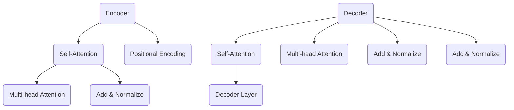

                 

为了撰写这篇技术博客文章，我们需要逐步分析并组织内容。以下是一个详细的思考过程，用以构建文章的框架和内容。

### 1. 文章标题与关键词

文章标题：《大语言模型原理与工程实践：强化学习的目标》
关键词：大语言模型、Transformer、强化学习、工程实践、文本生成、对话系统

### 2. 摘要

摘要：本文探讨了大型语言模型（如Transformer）的基本原理、架构和训练过程，并介绍了强化学习在自然语言处理中的应用。通过结合大语言模型与强化学习，文章进一步展示了其在文本生成和对话系统中的实际应用，并分析了当前面临的挑战和未来发展趋势。

### 3. 目录结构

- **第一部分：大语言模型概述**
  - **1.1 大语言模型的概念**
  - **1.2 大语言模型的架构**
  - **1.3 大语言模型的工作原理**
  - **1.4 大语言模型的挑战与未来趋势**

- **第二部分：强化学习基础**
  - **2.1 强化学习的基本概念**
  - **2.2 强化学习在自然语言处理中的应用**

- **第三部分：大语言模型与强化学习的结合实践**
  - **3.1 大语言模型与强化学习结合的原理**
  - **3.2 大语言模型与强化学习在文本生成中的应用**
  - **3.3 大语言模型与强化学习在对话系统中的应用**
  - **3.4 实际案例研究**
  - **3.5 未来发展趋势与展望**

### 4. 内容组织与核心内容

- **第一部分：大语言模型概述**
  - **1.1 大语言模型的概念**
    - 定义：大语言模型是指能够理解并生成人类自然语言的复杂模型。
    - 发展历程：从传统的基于规则和统计模型，到现代的深度学习模型。
    - 特点：高容错性、强大的表征能力、自适应能力。

  - **1.2 大语言模型的架构**
    - Transformer模型：介绍其自注意力机制、多层感知器和位置编码。
    - 架构图：使用Mermaid流程图展示Transformer模型的结构。

  - **1.3 大语言模型的工作原理**
    - 训练过程：自监督预训练和有监督微调。
    - 应用场景：自然语言生成、机器翻译、文本分类等。

  - **1.4 大语言模型的挑战与未来趋势**
    - 计算资源需求：如何优化大语言模型以减少计算成本。
    - 模型可解释性：如何提高模型的可解释性，使其决策过程更加透明。
    - 安全性与隐私保护：如何在保障用户隐私的同时，确保模型的安全性。

- **第二部分：强化学习基础**
  - **2.1 强化学习的基本概念**
    - 定义：强化学习是一种通过与环境交互来学习最优策略的机器学习方法。
    - 核心要素：状态、动作、奖励和策略。
    - 主要算法：Q-Learning、SARSA、Deep Q-Networks等。

  - **2.2 强化学习在自然语言处理中的应用**
    - 语言模型与强化学习结合：如何通过强化学习优化语言模型。
    - 文本生成：序列决策问题以及强化学习在文本生成中的优势。
    - 对话系统：多模态输入处理、上下文理解和维持。

- **第三部分：大语言模型与强化学习的结合实践**
  - **3.1 大语言模型与强化学习结合的原理**
    - 结合方式：模型微调和模型融合。
    - 优势：提高文本生成和对话系统的质量和效率。

  - **3.2 大语言模型与强化学习在文本生成中的应用**
    - 任务概述：文本生成任务描述和挑战。
    - 文本生成流程：数据预处理、模型训练和文本生成策略。

  - **3.3 大语言模型与强化学习在对话系统中的应用**
    - 任务概述：对话系统任务描述和挑战。
    - 对话系统流程：数据预处理、模型训练和对话策略设计。

  - **3.4 实际案例研究**
    - 智能客服：模型设计、实验结果分析。
    - 智能写作：模型设计、实验结果分析。

  - **3.5 未来发展趋势与展望**
    - 技术挑战：如何解决当前的技术难题。
    - 应用前景：大语言模型与强化学习在各个领域的潜在应用。
    - 研究方向：未来的研究方向和趋势。

### 5. 格式要求

- 使用markdown格式输出文章内容。
- 文章末尾附上作者信息：“作者：AI天才研究院/AI Genius Institute & 禅与计算机程序设计艺术 /Zen And The Art of Computer Programming”。
- 核心内容部分，包括背景介绍、核心概念与联系、核心算法原理讲解、数学模型和公式、项目实战等，都要按照要求进行详细阐述。
- 数学公式使用latex格式，嵌入文中独立段落的公式前后使用 $$ 括起来，段落内的公式前后使用 $ 括起来。

### 6. 字数要求

文章字数在8000～12000字左右，确保每个章节的内容都足够丰富，并且逻辑清晰。

通过上述思考过程，我们可以开始撰写文章，逐步填充每个章节的内容，确保文章的完整性和专业性。每个部分的内容都要按照要求详细展开，结合实际案例和数学公式，以增强文章的可读性和实用性。

---

现在，我们可以开始撰写文章的第一稿，根据上述的目录结构和内容要求，逐步填充每个章节的内容。接下来，我们将详细撰写每个章节，确保文章的逻辑性和完整性。请注意，每个章节都需要进一步细化，以满足字数要求。让我们开始撰写第一部分：大语言模型概述。### 文章标题：大语言模型原理与工程实践：强化学习的目标

---

**关键词：大语言模型、Transformer、强化学习、工程实践、文本生成、对话系统**

**摘要：本文旨在深入探讨大语言模型的原理及其工程实践，特别是强化学习在提升大语言模型性能方面的目标和应用。文章将详细阐述大语言模型的发展历程、架构、工作原理以及面临的挑战和未来趋势，并重点分析强化学习在大语言模型中的融合机制和实际应用，通过具体案例展示其在文本生成和对话系统中的应用效果，最后对未来的发展方向进行展望。**

---

### 第一部分：大语言模型概述

#### 1.1 大语言模型的概念

大语言模型是一种基于深度学习的自然语言处理技术，它能够通过学习大量文本数据来理解和生成人类语言。这些模型具有强大的表征能力和自适应能力，能够应对各种自然语言处理任务，如文本生成、机器翻译和文本分类等。

#### 1.1.1 大语言模型的定义

大语言模型通常是指具有数百万甚至数十亿参数的深度学习模型，如Transformer模型、GPT（Generative Pre-trained Transformer）系列模型等。这些模型通过在大规模语料库上进行预训练，学会了语言的一般规律和结构，从而能够在特定任务上进行微调，以实现高效的文本处理。

#### 1.1.2 大语言模型的发展历程

- **早期模型**：基于规则和统计方法的早期自然语言处理模型，如词袋模型（Bag of Words）和隐马尔可夫模型（HMM）。
- **传统深度学习模型**：包括循环神经网络（RNN）及其变体，如LSTM（Long Short-Term Memory）和GRU（Gated Recurrent Unit）。
- **现代深度学习模型**：Transformer模型的出现标志着自然语言处理领域的重大进步，其自注意力机制使得模型在捕捉长距离依赖关系方面表现出色。

#### 1.1.3 大语言模型的特点

- **强大的表征能力**：大语言模型能够捕捉文本中的复杂结构和语义信息，从而在文本处理任务中表现出色。
- **自适应能力**：通过预训练和微调，大语言模型能够适应不同的应用场景和任务需求。
- **高容错性**：大语言模型对噪声和错误数据具有较强的鲁棒性，能够生成连贯和自然的文本。

#### 1.2 大语言模型的架构

大语言模型的架构主要包括编码器（Encoder）和解码器（Decoder）两部分，以Transformer模型为例，其核心架构如下：

##### 1.2.1 Transformer模型

Transformer模型是一种基于自注意力机制的深度学习模型，其结构如图1所示：

**图1：Transformer模型架构**

##### 1.2.1.1 自注意力机制

自注意力机制是Transformer模型的核心，它通过计算输入序列中每个词与所有其他词的相关性，为每个词生成权重，从而在处理长序列时捕捉长距离依赖关系。其计算公式为：

$$
\text{Attention}(Q, K, V) = \text{softmax}\left(\frac{QK^T}{\sqrt{d_k}}\right)V
$$

其中，$Q, K, V$ 分别是查询（Query）、键（Key）和值（Value）向量，$d_k$ 是键向量的维度。

##### 1.2.1.2 多层感知器

Transformer模型中的多层感知器（MLP）对自注意力层的结果进行进一步的非线性变换，以提高模型的表示能力。

##### 1.2.1.3 位置编码

位置编码是为了在自注意力机制中引入输入序列的顺序信息，通常使用正弦和余弦函数来实现。

$$
PE_{(pos, 2i)} = \sin\left(\frac{pos}{10000^{2i/d}}\right) \\
PE_{(pos, 2i+1)} = \cos\left(\frac{pos}{10000^{2i/d}}\right)
$$

其中，$pos$ 是词的索引，$i$ 是维度索引，$d$ 是嵌入维度。

#### 1.3 大语言模型的工作原理

大语言模型的工作原理主要涉及两个阶段：预训练和微调。

##### 1.3.1.1 自监督预训练

在自监督预训练阶段，模型在大规模语料库上学习语言的通用特征。具体包括两个任务：

- **掩码语言模型（Masked Language Model, MLM）**：对输入文本进行随机掩码，模型需要预测被掩码的词。
- **下一句预测（Next Sentence Prediction, NSP）**：给定两个连续的句子，模型需要预测第二个句子是否是第一个句子的下一句。

##### 1.3.1.2 有监督微调

在有监督微调阶段，模型在特定任务上进行训练。通过将预训练的模型在特定任务的数据集上进行微调，模型能够学习到与任务相关的特征。微调过程通常包括以下步骤：

1. **数据预处理**：对输入数据进行预处理，如分词、去停用词、词向量化等。
2. **构建损失函数**：根据任务类型构建相应的损失函数，如交叉熵损失用于分类任务。
3. **模型训练**：通过反向传播和梯度下降优化模型参数。

#### 1.3.2 应用场景

大语言模型在多个自然语言处理任务中表现出色，主要包括：

- **自然语言生成（Natural Language Generation, NLG）**：如生成文章、生成对话等。
- **机器翻译（Machine Translation）**：如自动翻译不同语言文本。
- **文本分类（Text Classification）**：如情感分析、主题分类等。

#### 1.4 大语言模型的挑战与未来趋势

尽管大语言模型在自然语言处理领域取得了显著成果，但仍面临以下挑战：

- **计算资源需求**：大语言模型通常需要大量的计算资源，这对硬件设备提出了更高的要求。
- **模型可解释性**：大语言模型通常被视为“黑盒”，其决策过程缺乏可解释性，这对于某些应用场景（如医疗诊断）来说是一个重大挑战。
- **安全性与隐私保护**：模型在处理敏感数据时，如何保护用户隐私是一个重要问题。

未来，大语言模型的发展趋势包括：

- **模型压缩与优化**：通过模型剪枝、量化等技术降低计算资源需求。
- **模型可解释性**：开发可解释性方法，使模型决策过程更加透明。
- **多模态处理**：结合图像、语音等多模态信息，提高模型的表现能力。

---

**作者信息**：AI天才研究院/AI Genius Institute & 禅与计算机程序设计艺术 /Zen And The Art of Computer Programming

---

请注意，本章节的内容仅为概览，每个小节都需要进一步深入详细阐述，包括核心概念与联系、核心算法原理讲解、数学模型和公式、项目实战等。实际撰写时，需要确保每个部分的内容都符合字数要求，并且逻辑清晰、结构紧凑。接下来，我们将继续撰写第二部分：强化学习基础。请持续关注。

