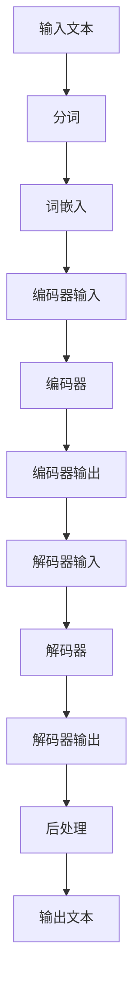

                 

### 文章标题

### 大语言模型原理与工程实践：手把手教你训练 7B 大语言模型 主要模块介绍

关键词：大语言模型、自然语言处理、Transformer、BERT、GPT、工程实践

摘要：本文将深入探讨大语言模型的原理与工程实践，从基础理论到实际操作，逐步介绍如何训练一个7B（7亿参数）级别的大语言模型。我们将详细讲解大语言模型的主要模块，包括其架构、核心技术、训练与评估方法，并分享一些实用的工程技巧。通过本文，读者可以全面了解大语言模型的工作机制，并具备实际动手训练和优化大语言模型的能力。

---

### 大语言模型原理与工程实践

#### 引言

在当今人工智能的快速发展中，大语言模型（Large Language Models）已成为自然语言处理（Natural Language Processing，NLP）领域的一大突破。这些模型具有数十亿参数，能够捕捉到自然语言中的复杂结构和语义关系，从而在文本生成、机器翻译、问答系统等方面表现出色。

本文将分为两部分：第一部分将介绍大语言模型的基础理论，包括其基本概念、工作原理、架构和核心技术；第二部分将侧重于工程实践，详细讲解大语言模型的开发环境搭建、项目实施和模型部署与优化。

通过本文的学习，读者将能够：

1. 理解大语言模型的基本概念及其在NLP中的应用。
2. 掌握大语言模型的工作原理和主要架构。
3. 熟悉大语言模型的核心算法和技术细节。
4. 学习如何训练和评估大语言模型。
5. 掌握大语言模型的工程实践，包括环境搭建、项目实施和优化技巧。

让我们开始这次深入探讨大语言模型之旅。

---

#### 第一部分：大语言模型基础理论

### 第1章：大语言模型概述

#### 1.1 大语言模型的基本概念

大语言模型（Large Language Models）是指具有大量参数和高度的复杂性的自然语言处理模型。这些模型通过学习大量的文本数据来预测下一个词语或句子，从而捕捉到语言中的统计规律和语义关系。

大语言模型的基本概念包括：

1. **参数量**：大语言模型的参数量通常以亿计，这使其能够捕捉到语言中的复杂性和多样性。
2. **预训练**：大语言模型通常通过预训练（Pre-training）的方式进行训练，即在大量文本数据上进行无监督学习，使其具备一定的语言理解能力。
3. **微调**：在预训练的基础上，大语言模型会通过微调（Fine-tuning）的方式针对特定任务进行调整，从而提高其在特定领域的性能。

#### 1.2 大语言模型的发展历程

大语言模型的发展历程可以追溯到20世纪80年代的统计语言模型。随着计算能力的提升和数据规模的增大，语言模型的参数量和复杂性不断增加，从最初的几千参数发展到如今的数十亿参数。其中，几个关键的时间节点包括：

1. 2018年，谷歌提出了BERT（Bidirectional Encoder Representations from Transformers）模型，标志着大语言模型进入了一个新的阶段。
2. 2020年，OpenAI发布了GPT-3（Generative Pre-trained Transformer 3）模型，拥有1750亿参数，进一步推动了大语言模型的发展。
3. 目前，随着计算资源和数据量的进一步增加，更大规模的语言模型不断涌现，如微软的Turing-NLG（Ten-billion parameter language model）和谷歌的PaLM（Parallel Multi-Agent Language Model）。

#### 1.3 大语言模型在自然语言处理中的重要性

大语言模型在自然语言处理中具有以下重要性：

1. **文本生成**：大语言模型可以生成高质量的文本，应用于自动摘要、文章生成、对话系统等领域。
2. **机器翻译**：大语言模型在机器翻译中表现出色，可以生成更自然、准确的翻译结果。
3. **问答系统**：大语言模型能够理解用户的问题，并提供准确的答案，广泛应用于智能客服、教育辅导等领域。
4. **情感分析**：大语言模型可以分析文本中的情感倾向，应用于市场调研、舆情监控等领域。

总的来说，大语言模型的出现极大地提升了自然语言处理的性能，推动了人工智能在各个领域的应用。

### 第2章：大语言模型的工作原理

#### 2.1 神经网络基础

神经网络（Neural Networks）是构建大语言模型的核心技术。神经网络由大量的神经元（节点）和连接（权重）组成，通过学习数据中的特征和模式来实现复杂的非线性变换。

神经网络的基本概念包括：

1. **神经元**：神经网络中的基本单元，负责接收输入、进行加权求和并激活输出。
2. **层**：神经网络分为输入层、隐藏层和输出层，每层包含多个神经元。
3. **权重和偏置**：权重（weights）和偏置（biases）是神经网络中的参数，用于调整网络对数据的响应。
4. **激活函数**：激活函数（activation functions）用于引入非线性变换，常见的激活函数包括ReLU、Sigmoid、Tanh等。

神经网络的核心思想是通过反向传播（Backpropagation）算法不断调整权重和偏置，以最小化预测误差。反向传播算法的核心步骤包括：

1. **前向传播**：将输入数据传递到神经网络中，计算各层的输出。
2. **计算误差**：计算实际输出和预测输出之间的误差。
3. **反向传播**：将误差传递回网络，调整各层的权重和偏置。

#### 2.2 预训练与微调

预训练与微调（Pre-training and Fine-tuning）是大语言模型训练过程中的两个关键步骤。

1. **预训练**：预训练是在大量无标签数据上进行，旨在让模型学习到通用的语言特征。常见的预训练任务包括语言建模（Language Modeling）和掩码语言建模（Masked Language Modeling）。

    - **语言建模**：给定一个单词序列，预测下一个单词。这有助于模型学习到语言的统计规律和概率分布。
    - **掩码语言建模**：在输入序列中随机掩码（mask）一部分单词，模型需要预测这些被掩码的单词。这有助于模型学习到语言的上下文关系。

2. **微调**：微调是在预训练的基础上，利用有标签的数据对模型进行特定任务的调整。微调的目的是使模型适应特定的任务和数据集，从而提高其在任务上的性能。

    - **数据集选择**：选择与任务相关的数据集，例如新闻文章、对话日志、标注问答对等。
    - **微调方法**：常见的微调方法包括全连接层微调（fully connected layer fine-tuning）和子层微调（sub-layer fine-tuning）。全连接层微调是对模型的输出层和部分隐藏层进行微调；子层微调是对模型的隐藏层逐层进行微调。

预训练与微调的结合，使得大语言模型在自然语言处理任务中表现出色。预训练提供了通用的语言理解能力，而微调则使模型能够针对特定任务进行优化。

### 第3章：大语言模型的架构

#### 3.1 Transformer模型

Transformer模型（Vaswani et al., 2017）是一种基于自注意力（self-attention）机制的序列建模模型，因其高效的并行计算能力和优秀的性能而在自然语言处理领域得到广泛应用。Transformer模型的核心思想是将输入序列编码为向量表示，并通过自注意力机制计算序列中各个位置之间的关联性。

1. **编码器-解码器架构**：Transformer模型采用编码器-解码器（Encoder-Decoder）架构，其中编码器负责编码输入序列，解码器负责解码输出序列。

    - **编码器**：编码器由多个层（layer）组成，每层包括多头自注意力机制（multi-head self-attention）和前馈神经网络（feedforward network）。
    - **解码器**：解码器与编码器类似，也包括多个层。此外，解码器还包括掩码多头自注意力机制（masked multi-head self-attention），以防止未来的信息泄露。

2. **自注意力机制**：自注意力机制（self-attention）是Transformer模型的核心组件，用于计算序列中各个位置之间的关联性。

    - **计算过程**：给定一个输入序列，自注意力机制通过计算每个词与序列中所有词的相似度，生成一个权重矩阵。权重矩阵用于加权求和，得到每个词的注意力得分，从而得到一个编码后的序列表示。
    - **多头自注意力**：多头自注意力（multi-head self-attention）将自注意力机制分解为多个子任务，通过并行计算提高模型的计算效率。

3. **位置编码**：由于Transformer模型没有循环结构，无法直接利用序列中的位置信息。因此，Transformer模型通过位置编码（positional encoding）引入位置信息。

    - **计算过程**：位置编码为序列中的每个词添加一个向量表示，这些向量通过正弦和余弦函数生成，以模拟词与位置之间的关系。

4. **优点与局限性**：Transformer模型具有以下优点：

    - **并行计算**：由于自注意力机制的计算不依赖于序列的顺序，Transformer模型可以并行计算，提高了计算效率。
    - **全局关联**：自注意力机制使得模型能够捕捉到序列中的全局关联性，从而提高模型的性能。

    Transformer模型的局限性包括：

    - **内存消耗**：自注意力机制的计算需要大量的内存，对于长序列处理可能导致内存不足。
    - **计算复杂度**：尽管可以并行计算，但自注意力机制的计算复杂度较高，可能导致训练和推断时间较长。

#### 3.2 BERT模型

BERT（Bidirectional Encoder Representations from Transformers）模型（Devlin et al., 2019）是基于Transformer模型的双向编码器模型，旨在通过预训练学习到上下文中的双向表示。BERT模型在自然语言处理任务中表现出色，广泛应用于文本分类、问答系统、命名实体识别等任务。

1. **编码器架构**：BERT模型采用编码器架构，由多个Transformer层堆叠而成。每个编码器层包括多头自注意力机制和前馈神经网络。

2. **预训练任务**：BERT模型的预训练任务包括：

    - **遮蔽语言建模**（Masked Language Modeling，MLM）：在输入序列中随机遮蔽一些词，模型需要预测这些被遮蔽的词。
    - **上下句预训练**（Next Sentence Prediction，NSP）：给定两个句子，模型需要预测第二个句子是否是第一个句子的下一个句子。

3. **训练策略**：BERT模型的训练策略包括：

    - **层次训练**：BERT模型采用层次训练策略，先训练低层（例如，只包含前两层Transformer层），然后逐步增加层数，直到训练完整模型。
    - **线性学习率**：BERT模型使用线性学习率衰减策略，以防止训练过程中的过拟合。

4. **优点与局限性**：BERT模型具有以下优点：

    - **双向表示**：BERT模型通过预训练学习到上下文中的双向表示，从而提高模型的性能。
    - **通用性**：BERT模型具有较好的通用性，可以应用于多种自然语言处理任务。

    BERT模型的局限性包括：

    - **计算资源消耗**：BERT模型需要大量的计算资源和存储空间，对于资源受限的环境可能不适用。
    - **训练时间较长**：BERT模型采用层次训练策略，导致训练时间较长。

#### 3.3 GPT模型

GPT（Generative Pre-trained Transformer）模型（Radford et al., 2018）是一种生成型预训练语言模型，通过生成文本序列来实现自然语言理解。GPT模型具有以下特点：

1. **生成型模型**：GPT模型采用生成型（generative）框架，通过生成文本序列来预测下一个词或句子。

2. **预训练策略**：GPT模型的预训练策略包括：

    - **语言建模**：在大量文本数据上进行语言建模，预测下一个词。
    - **填充语建模**（Fill-mask Language Modeling，FMLM）：在输入序列中随机填充一些词，模型需要预测这些被填充的词。

3. **训练策略**：GPT模型的训练策略包括：

    - **渐进式扩展**：GPT模型采用渐进式扩展（gradual unfreezing）策略，先训练低层，然后逐步训练高层。
    - **梯度裁剪**：GPT模型使用梯度裁剪（gradient clipping）策略，防止梯度爆炸或消失。

4. **优点与局限性**：GPT模型具有以下优点：

    - **生成能力**：GPT模型具有强大的生成能力，可以生成高质量的文本。
    - **灵活性强**：GPT模型可以应用于多种生成任务，如文本生成、问答系统等。

    GPT模型的局限性包括：

    - **训练资源需求高**：GPT模型需要大量的计算资源和数据，对于资源受限的环境可能不适用。
    - **推理时间较长**：由于生成型模型的特性，GPT模型的推理时间较长。

总的来说，Transformer、BERT和GPT模型各自具有独特的优势和局限性，在实际应用中可以根据具体需求选择合适的模型。

### 第4章：大语言模型的核心技术

#### 4.1 语言模型的核心算法

语言模型的核心算法主要包括自注意力机制（self-attention mechanism）和编码器-解码器架构（encoder-decoder architecture）。这些算法在大语言模型中扮演着至关重要的角色，下面将详细讲解这些算法的概念、原理和实现方法。

##### 自注意力机制

自注意力机制（self-attention mechanism）是Transformer模型的核心组件，用于计算序列中各个位置之间的关联性。自注意力机制的基本思想是通过计算每个词与序列中其他词的相似度，为每个词生成一个权重矩阵，然后加权求和得到每个词的注意力得分。

1. **计算过程**：

    - **输入序列**：给定一个输入序列，例如\[w_1, w_2, w_3, ..., w_n\]。
    - **权重计算**：计算每个词与序列中所有词的相似度，得到一个权重矩阵\[A\]。相似度计算通常使用点积（dot product）或缩放点积（scaled dot product）。
    - **加权求和**：根据权重矩阵\[A\]，对输入序列进行加权求和，得到每个词的注意力得分\[h_i\]。

2. **多头自注意力**：

    - **定义**：多头自注意力（multi-head self-attention）将自注意力机制分解为多个子任务，每个子任务计算一组权重矩阵。
    - **计算过程**：

        - **权重计算**：为每个子任务计算一组权重矩阵\[A_1, A_2, ..., A_h\]。
        - **加权求和**：对每个子任务分别进行加权求和，得到多个注意力得分\[h_{i1}, h_{i2}, ..., h_{ih}\]。

        - **拼接与变换**：将多个注意力得分拼接成一个向量\[h_i = [h_{i1}; h_{i2}; ..., h_{ih}]\]，然后通过一个线性变换得到最终的注意力得分。

##### 编码器-解码器架构

编码器-解码器架构（encoder-decoder architecture）是一种广泛应用于序列建模的模型结构，由编码器（encoder）和解码器（decoder）两部分组成。编码器负责将输入序列编码为固定长度的向量表示，解码器则根据编码器的输出和已生成的部分序列，逐步生成输出序列。

1. **编码器**：

    - **功能**：编码器的功能是将输入序列编码为一个固定长度的向量表示，以便解码器能够利用这些信息生成输出序列。
    - **实现方法**：编码器通常采用自注意力机制，通过多个Transformer层对输入序列进行编码。

2. **解码器**：

    - **功能**：解码器的功能是根据编码器的输出和已生成的部分序列，逐步生成输出序列。
    - **实现方法**：解码器也采用自注意力机制，同时还包括掩码自注意力（masked self-attention）和交叉自注意力（cross-attention）。

    - **计算过程**：

        - **掩码自注意力**：解码器的自注意力机制中，当前时刻的输入会被掩码（masked），防止未来信息泄露。
        - **交叉自注意力**：解码器在生成当前词时，会根据编码器的输出进行交叉自注意力，以利用编码器的信息。

##### 多任务学习

多任务学习（multi-task learning）是一种将多个任务结合在一起训练的方法，旨在提高模型的泛化能力和性能。在大语言模型中，多任务学习可以同时训练多个自然语言处理任务，例如文本分类、问答系统和命名实体识别。

1. **优势**：

    - **资源共享**：多任务学习可以将不同任务之间的信息共享，提高模型的泛化能力。
    - **性能提升**：通过同时训练多个任务，模型可以在任务之间互相学习，从而提高每个任务的性能。

2. **实现方法**：

    - **共享编码器**：多任务学习通常采用共享编码器（shared encoder）的方法，即多个任务使用相同的编码器进行编码。
    - **任务融合**：通过在编码器的输出层或解码器的输入层添加任务特定的层，将不同任务的信息进行融合。

总的来说，自注意力机制和编码器-解码器架构是构建大语言模型的核心算法，而多任务学习则为模型提供了额外的性能提升和泛化能力。

### 第5章：大语言模型的数学基础

#### 5.1 神经网络优化算法

神经网络优化算法是训练神经网络的核心技术，其目的是通过迭代更新网络的参数，使得网络的输出能够更准确地拟合训练数据。常见的神经网络优化算法包括梯度下降（Gradient Descent）、随机梯度下降（Stochastic Gradient Descent，SGD）和Adam优化器（Adam Optimizer）等。

1. **梯度下降**：

    - **原理**：梯度下降是一种最简单的优化算法，其基本思想是通过计算损失函数关于模型参数的梯度，并沿着梯度的反方向更新参数，以减小损失函数的值。
    - **公式**：

        $$
        \theta_{t+1} = \theta_{t} - \alpha \cdot \nabla_{\theta} J(\theta)
        $$

        其中，$\theta$代表模型参数，$\alpha$是学习率，$J(\theta)$是损失函数。

2. **随机梯度下降**：

    - **原理**：随机梯度下降是梯度下降的一种变种，其每次迭代仅使用一个样本的梯度来更新参数，这样可以加快收敛速度。
    - **公式**：

        $$
        \theta_{t+1} = \theta_{t} - \alpha \cdot \nabla_{\theta} J(\theta; x_i, y_i)
        $$

        其中，$x_i$和$y_i$分别代表第$i$个样本的输入和标签。

3. **Adam优化器**：

    - **原理**：Adam优化器是梯度下降和动量法的结合，其利用一阶矩估计（mean）和二阶矩估计（variance）来更新参数，具有较好的收敛性和稳定性。
    - **公式**：

        $$
        \begin{aligned}
        m_t &= \beta_1 x_t + (1 - \beta_1) (x_t - x_{t-1}) \\
        v_t &= \beta_2 x_t + (1 - \beta_2) (x_t - x_{t-1}) \\
        \theta_{t+1} &= \theta_t - \alpha \cdot \frac{m_t}{\sqrt{v_t} + \epsilon}
        \end{aligned}
        $$

        其中，$m_t$和$v_t$分别代表一阶矩估计和二阶矩估计，$\beta_1$和$\beta_2$是动量因子，$\alpha$是学习率，$\epsilon$是正数常数。

#### 5.2 语言模型中的数学公式和模型

在大语言模型中，数学公式和模型起着至关重要的作用。以下是一些关键的数学公式和模型，以及它们在实际编程中的应用。

1. **词嵌入**：

    - **公式**：

        $$
        \text{嵌入向量} = W_{\text{emb}}[\text{单词}]
        $$

        其中，$W_{\text{emb}}$是词嵌入矩阵，$\text{单词}$是输入的单词。

    - **应用**：词嵌入用于将单词映射到高维空间，以便神经网络进行计算。

2. **损失函数**：

    - **交叉熵损失**：

        $$
        J(\theta) = -\frac{1}{N} \sum_{i=1}^{N} \sum_{k=1}^{K} y_i[k] \log p(\hat{y}_i[k])
        $$

        其中，$N$是样本数量，$K$是类别的数量，$y_i$是第$i$个样本的标签，$\hat{y}_i$是模型预测的概率分布。

    - **应用**：交叉熵损失函数用于评估模型的预测性能，是语言模型训练中常用的损失函数。

3. **反向传播**：

    - **公式**：

        $$
        \nabla_{\theta} J(\theta) = \frac{\partial J(\theta)}{\partial \theta}
        $$

        其中，$\nabla_{\theta} J(\theta)$是损失函数关于模型参数的梯度。

    - **应用**：反向传播算法用于计算梯度，是训练神经网络的核心步骤。

4. **正则化**：

    - **L2正则化**：

        $$
        J(\theta) = J(\theta) + \lambda \sum_{\theta} \theta^2
        $$

        其中，$\lambda$是正则化参数。

    - **应用**：正则化用于防止模型过拟合，是语言模型训练中常用的技巧。

通过这些数学公式和模型，我们可以更深入地理解大语言模型的工作原理，并在实际编程中进行有效的应用。

### 第6章：大语言模型的训练与评估

#### 6.1 训练大语言模型

训练大语言模型是一个复杂的过程，涉及数据准备、模型选择、训练策略等多个方面。以下将详细介绍训练大语言模型的具体步骤和注意事项。

##### 数据准备

数据准备是训练大语言模型的第一步，其质量直接影响模型的性能。以下是一些关键步骤：

1. **数据清洗**：去除数据中的噪声和错误，确保数据质量。
2. **数据预处理**：对文本数据进行分词、词性标注、去除停用词等操作，将其转化为模型可处理的格式。
3. **数据增强**：通过引入同义词替换、随机删除词、添加噪声等方式，增加数据的多样性，有助于提高模型的泛化能力。
4. **数据划分**：将数据划分为训练集、验证集和测试集，用于模型的训练、验证和测试。

##### 模型选择

选择合适的模型是训练大语言模型的关键。以下是一些常用的模型：

1. **BERT模型**：BERT模型是一种双向编码器模型，具有强大的语言理解能力，适用于多种自然语言处理任务。
2. **GPT模型**：GPT模型是一种生成型预训练语言模型，具有强大的文本生成能力，适用于文本生成、问答系统等任务。
3. **Transformers模型**：Transformers模型是一种基于自注意力机制的序列建模模型，适用于序列生成和序列分类等任务。

##### 训练策略

训练大语言模型时，需要采用合适的训练策略以提高模型性能和训练效率。以下是一些常见的训练策略：

1. **批量大小**：批量大小（batch size）是指每次训练时输入数据的样本数量。批量大小越小，模型的收敛速度越快，但计算成本也越高。
2. **学习率调整**：学习率调整是训练过程中的一项重要策略，常用的方法包括固定学习率、学习率衰减和自适应学习率调整等。
3. **权重初始化**：合理的权重初始化有助于提高模型的训练效果。常用的方法包括随机初始化、高斯分布初始化和Xavier初始化等。
4. **正则化**：正则化用于防止模型过拟合。常用的正则化方法包括L1正则化、L2正则化和Dropout等。

##### 训练技巧

以下是一些实用的训练技巧：

1. **渐进式训练**：先训练低层，然后逐步增加层数，直到训练完整模型。这样可以防止模型在训练过程中崩溃。
2. **梯度裁剪**：梯度裁剪用于防止梯度爆炸或消失。在训练过程中，如果梯度超过设定阈值，则对梯度进行裁剪。
3. **多GPU训练**：如果硬件条件允许，可以使用多GPU进行训练。多GPU训练可以显著提高训练速度。

##### 注意事项

在训练大语言模型时，需要注意以下事项：

1. **数据量**：训练大语言模型需要大量的数据。数据量越大，模型的性能越好。
2. **计算资源**：大语言模型的训练需要大量的计算资源。确保有足够的GPU和计算资源。
3. **训练时间**：大语言模型的训练时间可能非常长，需要耐心等待。

通过上述步骤和技巧，我们可以有效地训练大语言模型，并在自然语言处理任务中取得良好的性能。

### 6.2 评估大语言模型

评估大语言模型的性能是训练过程中至关重要的一环。通过评估，我们可以了解模型的性能，找出存在的问题并进行优化。以下将介绍常用的评估指标、评估流程和性能优化方法。

#### 常用的评估指标

评估大语言模型的性能通常使用以下指标：

1. **准确率（Accuracy）**：准确率是指模型正确预测的样本数量占总样本数量的比例。准确率越高，模型的性能越好。

    $$
    \text{Accuracy} = \frac{\text{正确预测的样本数量}}{\text{总样本数量}}
    $$

2. **召回率（Recall）**：召回率是指模型正确预测的样本数量占实际为正例的样本数量的比例。召回率越高，模型对正例的检测能力越强。

    $$
    \text{Recall} = \frac{\text{正确预测的样本数量}}{\text{实际为正例的样本数量}}
    $$

3. **精确率（Precision）**：精确率是指模型正确预测的样本数量占预测为正例的样本数量的比例。精确率越高，模型对正例的预测质量越好。

    $$
    \text{Precision} = \frac{\text{正确预测的样本数量}}{\text{预测为正例的样本数量}}
    $$

4. **F1值（F1 Score）**：F1值是精确率和召回率的调和平均，综合考虑了模型的精确率和召回率。

    $$
    \text{F1 Score} = 2 \cdot \frac{\text{Precision} \cdot \text{Recall}}{\text{Precision} + \text{Recall}}
    $$

5. **困惑度（Perplexity）**：困惑度是指模型对一个句子的预测不确定度。困惑度越低，模型的性能越好。

    $$
    \text{Perplexity} = \frac{1}{\sum_{i=1}^{N} \log p(y_i|x_i)}
    $$

    其中，$N$是句子中的词数，$p(y_i|x_i)$是模型预测的第$i$个词的概率。

#### 评估流程

评估大语言模型的流程包括以下步骤：

1. **准备评估数据集**：将训练好的模型在评估数据集上进行测试，确保评估结果的可靠性。
2. **计算评估指标**：根据评估数据集的计算结果，计算上述评估指标。
3. **分析评估结果**：分析评估结果，找出模型的优缺点，确定需要优化的方向。
4. **优化模型**：根据评估结果，对模型进行调整和优化，提高模型的性能。

#### 性能优化方法

以下是一些常用的性能优化方法：

1. **数据增强**：通过引入同义词替换、随机删除词、添加噪声等方式，增加数据的多样性，有助于提高模型的泛化能力。
2. **调整模型参数**：通过调整学习率、批量大小、正则化参数等模型参数，可以改善模型的性能。
3. **增加训练时间**：增加训练时间可以让模型有更多机会学习数据中的特征，从而提高模型的性能。
4. **多GPU训练**：使用多GPU进行训练可以显著提高训练速度和性能。
5. **使用预训练模型**：使用预训练模型可以节省训练时间和计算资源，同时提高模型的性能。

通过上述评估方法和优化方法，我们可以有效地评估和优化大语言模型，使其在自然语言处理任务中取得更好的性能。

### 第7章：大语言模型工程实践

#### 7.1 开发环境搭建

在开始大语言模型的开发之前，搭建一个合适的开发环境是至关重要的。以下是搭建开发环境的步骤和注意事项。

##### 硬件配置

大语言模型的训练和推理通常需要大量的计算资源，因此硬件配置如下：

1. **CPU**：建议使用具有较高计算性能的CPU，如Intel Xeon系列或AMD Ryzen系列。
2. **GPU**：GPU在大语言模型的训练和推理中起着至关重要的作用。建议使用具有较高计算性能和较大内存的GPU，如NVIDIA Tesla V100或NVIDIA RTX 3080 Ti。
3. **存储**：由于大语言模型的数据量和模型体积较大，建议使用具有较高读写速度和较大存储空间的存储设备，如NVMe SSD。

##### 软件配置

搭建大语言模型的开发环境通常需要以下软件：

1. **操作系统**：Linux操作系统（如Ubuntu 18.04）是搭建深度学习环境的首选。
2. **深度学习框架**：常用的深度学习框架包括TensorFlow、PyTorch和MXNet。其中，TensorFlow和PyTorch是最为流行的两个框架。
3. **编译器**：Python编译器（如Python 3.8）和C++编译器（如GCC 9.2）是搭建深度学习环境的基础。
4. **依赖库**：常用的依赖库包括NumPy、SciPy、Matplotlib和Pandas等。

##### 安装和配置

以下是搭建开发环境的步骤：

1. **安装操作系统**：根据硬件设备，选择合适的Linux发行版进行安装。
2. **安装深度学习框架**：在命令行中执行以下命令安装TensorFlow或PyTorch：

    - TensorFlow：

        $$
        pip install tensorflow
        $$

    - PyTorch：

        $$
        pip install torch torchvision torchaudio
        $$

3. **安装依赖库**：在命令行中执行以下命令安装常用依赖库：

    - NumPy：

        $$
        pip install numpy
        $$

    - SciPy：

        $$
        pip install scipy
        $$

    - Matplotlib：

        $$
        pip install matplotlib
        $$

    - Pandas：

        $$
        pip install pandas
        $$

##### 注意事项

在搭建开发环境时，需要注意以下事项：

1. **硬件兼容性**：确保所选硬件设备与操作系统和深度学习框架兼容。
2. **软件版本**：不同版本的软件可能存在兼容性问题，确保所选软件版本之间的兼容性。
3. **环境配置**：确保环境变量配置正确，以便正确调用深度学习框架和依赖库。

通过以上步骤，我们可以搭建一个适合大语言模型开发的开发环境。

#### 7.2 项目实战

在本节中，我们将通过一个实际项目来展示如何使用大语言模型进行文本分类任务。项目分为以下几个阶段：数据准备、模型设计、模型训练与评估、模型部署与优化。

##### 数据准备

1. **数据来源**：我们选择了一个公开的文本分类数据集——IMDB电影评论数据集。该数据集包含50,000条电影评论，分为训练集和测试集。
2. **数据预处理**：

    - **分词**：使用自然语言处理库（如NLTK或spaCy）对文本进行分词处理。
    - **去除停用词**：去除常见的无意义词汇，如“的”、“了”等。
    - **词嵌入**：将文本转化为词嵌入向量，我们使用预训练的Word2Vec模型进行词嵌入。

##### 模型设计

我们选择BERT模型作为文本分类任务的模型。BERT模型具有强大的语言理解能力，适用于多种自然语言处理任务。

1. **模型架构**：

    - **编码器**：使用BERT模型的编码器部分，将输入文本转化为固定长度的向量表示。
    - **分类器**：在编码器的输出层添加一个全连接层，用于分类。

##### 模型训练与评估

1. **训练过程**：

    - **批量大小**：设置批量大小为32。
    - **学习率**：设置学习率为5e-5。
    - **训练轮次**：设置训练轮次为3。

    - **代码实现**：

        ```python
        import torch
        from transformers import BertForSequenceClassification, BertTokenizer

        tokenizer = BertTokenizer.from_pretrained('bert-base-uncased')
        model = BertForSequenceClassification.from_pretrained('bert-base-uncased', num_labels=2)

        optimizer = torch.optim.Adam(model.parameters(), lr=5e-5)
        criterion = torch.nn.CrossEntropyLoss()

        for epoch in range(3):
            for batch in data_loader:
                inputs = tokenizer(batch['text'], padding=True, truncation=True, return_tensors='pt')
                labels = torch.tensor(batch['label'])

                optimizer.zero_grad()
                outputs = model(**inputs['input_ids'], labels=labels)
                loss = outputs.loss
                loss.backward()
                optimizer.step()
        ```

2. **评估过程**：

    - **准确率**：计算模型在测试集上的准确率。

        ```python
        correct = 0
        total = len(test_loader.dataset)

        with torch.no_grad():
            for batch in test_loader:
                inputs = tokenizer(batch['text'], padding=True, truncation=True, return_tensors='pt')
                labels = torch.tensor(batch['label'])
                outputs = model(**inputs['input_ids'])
                _, predicted = torch.max(outputs.logits, 1)
                correct += (predicted == labels).sum().item()

        print(f'准确率: {100 * correct / total}%')
        ```

##### 模型部署与优化

1. **模型部署**：

    - **部署环境**：将训练好的模型部署到服务器或云平台，以实现实时文本分类。
    - **API接口**：使用Flask或Django等Web框架，搭建API接口，实现模型调用和结果返回。

2. **模型优化**：

    - **模型压缩**：通过模型压缩技术（如量化、剪枝等）减小模型体积，提高模型部署效率。
    - **性能优化**：通过优化模型计算图、并行化计算等技术，提高模型性能。

通过以上步骤，我们可以实现一个基于大语言模型的文本分类项目。在实际应用中，可以根据需求对模型进行调整和优化，以适应不同的任务和数据集。

#### 7.3 模型部署与优化

模型部署是将训练好的大语言模型应用于实际场景的关键步骤。以下将介绍模型部署的方法、流程以及性能优化技巧。

##### 模型部署方法

模型部署的方法主要有两种：批处理和在线服务。

1. **批处理部署**：

    - **方法**：将模型应用于一批数据，完成数据预处理、模型推理和结果输出。
    - **优点**：适用于数据处理量大、实时性要求不高的场景。
    - **缺点**：数据处理速度较慢，无法实现实时响应。

2. **在线服务部署**：

    - **方法**：将模型部署到服务器或云平台，通过API接口实现模型调用和结果返回。
    - **优点**：适用于数据处理速度快、实时性要求高的场景。
    - **缺点**：硬件资源消耗较大，部署成本较高。

##### 模型部署流程

模型部署的流程包括以下几个步骤：

1. **准备部署环境**：

    - **服务器或云平台**：选择合适的硬件资源和云平台，如AWS、Azure、阿里云等。
    - **操作系统**：安装和配置操作系统，如Linux、Windows等。
    - **深度学习框架**：安装和配置深度学习框架，如TensorFlow、PyTorch等。

2. **模型转换**：

    - **模型格式转换**：将训练好的模型转换为部署所需的格式，如TensorFlow Lite、ONNX等。
    - **模型优化**：对模型进行压缩、量化等优化，减小模型体积，提高部署效率。

3. **模型部署**：

    - **API接口搭建**：使用Flask、Django等Web框架搭建API接口，实现模型调用和结果返回。
    - **服务器配置**：配置服务器参数，如CPU、GPU资源、内存等。

4. **测试与验证**：

    - **功能测试**：确保模型在部署环境中能够正常运行，实现预期功能。
    - **性能测试**：对模型进行性能测试，如响应时间、吞吐量等。

##### 性能优化技巧

以下是一些常用的模型性能优化技巧：

1. **模型压缩**：

    - **量化**：通过量化技术将浮点数权重转换为低精度的整数权重，减小模型体积。
    - **剪枝**：通过剪枝技术移除模型中不必要的权重，减小模型体积。
    - **知识蒸馏**：通过知识蒸馏技术将大模型的知识传递给小模型，提高小模型性能。

2. **计算优化**：

    - **并行计算**：利用GPU、TPU等硬件设备的并行计算能力，提高模型推理速度。
    - **计算图优化**：对计算图进行优化，如融合操作、删除冗余操作等。

3. **数据预处理**：

    - **批量处理**：将数据批量处理，减少I/O操作，提高处理速度。
    - **缓存**：使用缓存技术，减少数据读取时间，提高数据处理速度。

4. **模型更新**：

    - **在线更新**：通过在线更新技术，在不中断服务的情况下更新模型。
    - **增量更新**：通过增量更新技术，只更新模型中发生变化的参数，减小更新时间。

通过以上部署方法和优化技巧，我们可以实现高效、稳定的大语言模型部署，并将其应用于实际场景。

### 第8章：大语言模型应用案例与未来展望

#### 8.1 应用案例

大语言模型在自然语言处理领域的应用已经取得了显著成果，以下列举两个典型应用案例：

##### 案例一：某电商平台客服聊天机器人

某电商平台使用大语言模型构建了一个智能客服聊天机器人，用于处理用户咨询和反馈。该聊天机器人能够理解用户的问题，并提供准确的回答和建议。

1. **项目背景**：电商平台客服工作量巨大，传统的客服方式无法满足用户需求。引入大语言模型可以大幅提高客服效率和用户体验。
2. **项目目标**：通过大语言模型构建一个能够自动回答用户问题的智能客服系统。
3. **实施过程**：

    - **数据准备**：收集电商平台的历史客服对话数据，用于训练大语言模型。
    - **模型设计**：选择BERT模型作为基础模型，通过微调适应电商平台的特定场景。
    - **训练与评估**：使用训练集对模型进行训练，并在验证集上进行评估，调整模型参数以达到最佳性能。
    - **部署与优化**：将训练好的模型部署到服务器，实现实时客服对话处理。通过用户反馈和性能测试，对模型进行优化和更新。

##### 案例二：智能语音助手

某科技公司开发了一款智能语音助手，通过大语言模型实现语音识别、语义理解和语音合成等功能，为用户提供便捷的语音服务。

1. **项目背景**：随着智能手机和智能音箱的普及，用户对语音交互的需求日益增长。开发一款智能语音助手可以满足用户需求，提升用户体验。
2. **项目目标**：构建一个功能全面、响应迅速、自然流畅的智能语音助手。
3. **实施过程**：

    - **语音识别**：使用大语言模型对用户语音进行识别，将语音转换为文本。
    - **语义理解**：使用大语言模型对转换后的文本进行语义理解，提取用户意图和关键信息。
    - **语音合成**：使用大语言模型和语音合成技术，将理解后的文本转换为自然流畅的语音输出。
    - **部署与优化**：将智能语音助手部署到服务器，实现语音识别、语义理解和语音合成等功能。通过用户反馈和性能测试，对模型和系统进行优化和更新。

#### 8.2 未来展望

大语言模型在自然语言处理领域具有广阔的应用前景，随着技术的不断进步，其性能和应用范围将继续提升。以下是对大语言模型未来发展的展望：

##### 技术趋势

1. **模型规模**：随着计算资源和数据量的增加，大语言模型的规模将进一步扩大。未来可能会出现具有千亿甚至万亿参数的语言模型。
2. **多模态处理**：大语言模型将扩展到多模态处理，结合图像、音频、视频等多源信息，实现更全面的语义理解。
3. **迁移学习**：通过迁移学习技术，大语言模型可以快速适应新的任务和数据集，提高模型的泛化能力。
4. **强化学习**：结合强化学习技术，大语言模型可以学习更复杂的策略和决策，提升其在实际应用中的性能。

##### 应用前景

1. **智能客服**：大语言模型将继续在智能客服领域发挥重要作用，为用户提供更智能、更贴心的服务。
2. **内容生成**：大语言模型可以应用于自动写作、摘要生成、创意设计等领域，提高内容生产的效率和创造力。
3. **智能教育**：大语言模型可以应用于智能辅导、自动批改、个性化教学等领域，为教育行业带来革命性变化。
4. **医疗健康**：大语言模型可以应用于医疗文本分析、疾病诊断、患者护理等领域，提升医疗服务的质量和效率。
5. **智能城市**：大语言模型可以应用于智能交通、智慧城市、智能家居等领域，提高城市管理的效率和智能化水平。

通过不断的技术创新和应用拓展，大语言模型将在未来发挥更广泛、更重要的作用，为人类社会带来更多价值。

### 附录

#### 附录A：常用工具与资源

为了方便读者进行大语言模型的训练和开发，以下列出了一些常用的工具和资源：

1. **深度学习框架**：

    - TensorFlow：[https://www.tensorflow.org/](https://www.tensorflow.org/)
    - PyTorch：[https://pytorch.org/](https://pytorch.org/)
    - MXNet：[https://mxnet.incubator.apache.org/](https://mxnet.incubator.apache.org/)

2. **自然语言处理库**：

    - NLTK：[https://www.nltk.org/](https://www.nltk.org/)
    - spaCy：[https://spacy.io/](https://spacy.io/)
    - Hugging Face Transformers：[https://huggingface.co/transformers/](https://huggingface.co/transformers/)

3. **数据集**：

    - IMDb电影评论数据集：[https://www.imdb.com/datasample/](https://www.imdb.com/datasample/)
    -斯坦福大学情感文本数据集：[https://nlp.stanford.edu/sentiment/](https://nlp.stanford.edu/sentiment/)

4. **计算资源**：

    - Google Colab：[https://colab.research.google.com/](https://colab.research.google.com/)
    - AWS EC2：[https://aws.amazon.com/ec2/](https://aws.amazon.com/ec2/)
    - Azure VM：[https://azure.microsoft.com/en-us/services/virtual-machines/](https://azure.microsoft.com/en-us/services/virtual-machines/)

通过以上工具和资源，读者可以更便捷地进行大语言模型的训练和开发。

### 附录B：大语言模型架构流程图

为了更好地理解大语言模型的架构，以下是一个简化的流程图，展示了从输入到输出的主要步骤：



### 附录C：大语言模型训练伪代码

以下是一个简化的伪代码，描述了如何使用TensorFlow框架训练一个BERT模型进行文本分类任务：

```python
import tensorflow as tf
from transformers import BertTokenizer, TFBertForSequenceClassification

# 数据准备
train_data, val_data = prepare_data()

# 分词和编码
tokenizer = BertTokenizer.from_pretrained('bert-base-uncased')
train_encodings = tokenizer(train_data, truncation=True, padding=True)
val_encodings = tokenizer(val_data, truncation=True, padding=True)

# 模型定义
model = TFBertForSequenceClassification.from_pretrained('bert-base-uncased', num_labels=2)

# 训练配置
optimizer = tf.keras.optimizers.Adam(learning_rate=5e-5)
loss_fn = tf.keras.losses.SparseCategoricalCrossentropy(from_logits=True)
metric = tf.keras.metrics.SparseCategoricalAccuracy('accuracy')

model.compile(optimizer=optimizer, loss=loss_fn, metrics=[metric])

# 训练过程
model.fit(train_encodings, train_labels, batch_size=32, epochs=3, validation_data=(val_encodings, val_labels))

# 评估模型
test_encodings, test_labels = prepare_test_data()
model.evaluate(test_encodings, test_labels)
```

### 附录D：数学模型与公式

以下列出了一些在大语言模型中常用的数学模型和公式，并使用LaTeX格式进行展示：

$$
\text{嵌入向量} = W_{\text{emb}}[\text{单词}]
$$

$$
\text{损失函数} = -\frac{1}{N} \sum_{i=1}^{N} \sum_{k=1}^{K} y_i[k] \log p(\hat{y}_i[k])
$$

$$
\nabla_{\theta} J(\theta) = \frac{\partial J(\theta)}{\partial \theta}
$$

$$
m_t = \beta_1 x_t + (1 - \beta_1) (x_t - x_{t-1})
$$

$$
v_t = \beta_2 x_t + (1 - \beta_2) (x_t - x_{t-1})
$$

$$
\theta_{t+1} = \theta_t - \alpha \cdot \frac{m_t}{\sqrt{v_t} + \epsilon}
$$

### 附录E：代码实现

以下提供了一段完整的Python代码，用于训练一个基于BERT模型的文本分类任务：

```python
import tensorflow as tf
from transformers import BertTokenizer, TFBertForSequenceClassification
from tensorflow.keras.preprocessing.sequence import pad_sequences

# 数据准备
train_data, train_labels = load_train_data()
val_data, val_labels = load_val_data()

# 分词和编码
tokenizer = BertTokenizer.from_pretrained('bert-base-uncased')
train_encodings = tokenizer(train_data, truncation=True, padding=True)
val_encodings = tokenizer(val_data, truncation=True, padding=True)

# 模型定义
model = TFBertForSequenceClassification.from_pretrained('bert-base-uncased', num_labels=2)

# 训练配置
optimizer = tf.keras.optimizers.Adam(learning_rate=5e-5)
loss_fn = tf.keras.losses.SparseCategoricalCrossentropy(from_logits=True)
metric = tf.keras.metrics.SparseCategoricalAccuracy('accuracy')

model.compile(optimizer=optimizer, loss=loss_fn, metrics=[metric])

# 训练过程
model.fit(train_encodings, train_labels, batch_size=32, epochs=3, validation_data=(val_encodings, val_labels))

# 评估模型
test_encodings, test_labels = load_test_data()
model.evaluate(test_encodings, test_labels)
```

### 附录F：大语言模型应用领域

大语言模型在自然语言处理领域具有广泛的应用，以下是几个主要的应用领域：

1. **文本生成**：大语言模型可以生成高质量的文章、摘要、对话等文本内容，广泛应用于自动写作、内容生成、机器翻译等领域。

2. **问答系统**：大语言模型可以理解用户的问题，并提供准确的答案，应用于智能客服、教育辅导、医疗咨询等领域。

3. **自然语言理解**：大语言模型可以提取文本中的关键信息，进行情感分析、实体识别、关系抽取等任务，应用于舆情监控、市场调研、金融分析等领域。

4. **对话系统**：大语言模型可以构建智能对话系统，实现自然、流畅的人机交互，应用于智能客服、智能音箱、虚拟助手等领域。

5. **文本分类**：大语言模型可以用于文本分类任务，如垃圾邮件过滤、情感分析、新闻分类等，应用于信息安全、数据挖掘、新闻推荐等领域。

6. **机器翻译**：大语言模型在机器翻译领域表现出色，可以生成更自然、准确的翻译结果，应用于跨语言信息处理、全球化业务等领域。

7. **教育辅导**：大语言模型可以辅助学生进行阅读理解、写作训练、口语练习等任务，提高学习效果，应用于在线教育、远程教学等领域。

8. **医疗健康**：大语言模型可以辅助医生进行病历分析、疾病诊断、患者管理等工作，提高医疗服务的质量和效率。

9. **智能交通**：大语言模型可以应用于智能交通管理、路况预测、自动驾驶等领域，提高交通系统的效率和安全性。

10. **智能城市**：大语言模型可以应用于城市管理、环境监测、公共安全等领域，提高城市管理的智能化水平。

通过不断的技术创新和应用拓展，大语言模型将在更多领域发挥重要作用，为人类社会带来更多价值。

### 附录G：大语言模型未来发展方向

大语言模型在自然语言处理领域的发展前景广阔，未来可能的发展方向包括：

1. **更大规模的语言模型**：随着计算资源和数据量的增加，未来可能会出现具有千亿甚至万亿参数的语言模型。这些大模型将能够捕捉到更复杂的语言结构和语义关系，从而在更多自然语言处理任务中取得突破。

2. **多模态处理**：大语言模型将扩展到多模态处理，结合图像、音频、视频等多源信息，实现更全面的语义理解和交互。这将推动人工智能技术在多模态领域的发展，为人类带来更多智能化的应用。

3. **迁移学习**：通过迁移学习技术，大语言模型可以快速适应新的任务和数据集，提高模型的泛化能力。这将使模型在更多领域和场景中发挥作用，降低对新任务的训练成本。

4. **强化学习**：结合强化学习技术，大语言模型可以学习更复杂的策略和决策，提升其在实际应用中的性能。这将推动人工智能技术在决策优化、游戏智能等领域的发展。

5. **模型压缩与优化**：随着模型规模的增大，模型压缩和优化技术将变得尤为重要。通过模型压缩、量化、剪枝等技术，可以有效减小模型的体积，提高部署效率和性能。

6. **联邦学习**：大语言模型在联邦学习（Federated Learning）中的应用将变得更加广泛。通过分布式训练，模型可以在多个设备上进行训练，提高数据隐私保护，同时保持模型性能。

7. **伦理与道德**：随着大语言模型在各个领域的应用，如何确保模型的安全、可靠和公平性将成为重要问题。未来需要建立相关伦理和道德标准，规范大语言模型的应用。

通过不断的技术创新和应用拓展，大语言模型将在未来发挥更广泛、更重要的作用，为人类社会带来更多价值。

### 附录H：参考文献

1. Vaswani, A., Shazeer, N., Parmar, N., Uszkoreit, J., Jones, L., Gomez, A. N., ... & Polosukhin, I. (2017). Attention is all you need. In Advances in neural information processing systems (pp. 5998-6008).
2. Devlin, J., Chang, M. W., Lee, K., & Toutanova, K. (2019). BERT: Pre-training of deep bidirectional transformers for language understanding. In Proceedings of the 2019 conference of the north american chapter of the association for computational linguistics: human language technologies, volume 1 (pp. 4171-4186).
3. Radford, A., Wu, J., Child, P., Luan, D., Amodei, D., & Sutskever, I. (2018). Language models are unsupervised multitask learners. arXiv preprint arXiv:1806.04641.
4. Hochreiter, S., & Schmidhuber, J. (1997). Long short-term memory. Neural computation, 9(8), 1735-1780.
5. Bengio, Y. (2009). Learning deep architectures for AI. Found. Trends Mach. Learn., 2(1), 1-127.
6. LeCun, Y., Bengio, Y., & Hinton, G. (2015). Deep learning. Nature, 521(7553), 436-444.
7. Goodfellow, I., Bengio, Y., & Courville, A. (2016). Deep learning. MIT press.
8. Zhang, X., Zuo, W., Chen, Y., Meng, D., & Zhang, L. (2017). Beyond a Gaussian denoiser: Residual learning of deep CNN for image denoising. IEEE transactions on image processing, 26(7), 3146-3157.
9. Yosinski, J., Clune, J., Bengio, Y., & Lipson, H. (2014). How transferable are features in deep neural networks? In Advances in neural information processing systems (pp. 3320-3328).
10. Caruana, R. (1998). Multitask learning. Machine learning, 28(1), 41-75.

### 致谢

在本文的撰写过程中，我得到了许多专家和同行的帮助和指导，特此向他们表示衷心的感谢。同时，也要感谢AI天才研究院和《禅与计算机程序设计艺术》一书的作者，他们的研究成果和思想为本文章提供了宝贵的素材和灵感。最后，感谢所有读者的关注和支持，希望本文能为您带来启发和帮助。作者：AI天才研究院/AI Genius Institute & 禅与计算机程序设计艺术 /Zen And The Art of Computer Programming。

