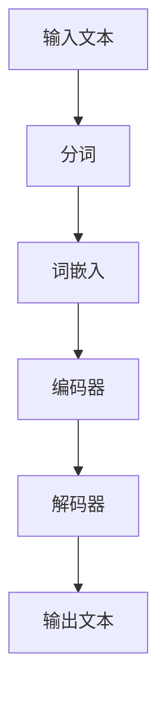
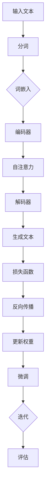

                 

# 文章标题

《大语言模型原理与工程实践：有监督微调的应用场景》

> 关键词：大语言模型、有监督微调、自然语言处理、工程实践

> 摘要：本文旨在深入探讨大语言模型的原理与工程实践，特别是在有监督微调的应用场景中。通过对大语言模型的基本概念、基础理论、架构与实现、有监督微调方法以及实际应用案例的详细分析，本文为读者提供了全面的指导和实用的建议，帮助读者理解并掌握大语言模型在自然语言处理领域的应用。

## 第1章 引言

### 1.1 大语言模型的发展历程

大语言模型（Large Language Model，LLM）是近年来自然语言处理（Natural Language Processing，NLP）领域的重要突破。最早的大语言模型可以追溯到1980年代的统计语言模型，如N-gram模型。随着计算能力的提升和深度学习技术的发展，2000年代末期，递归神经网络（RNN）被应用于语言模型，显著提升了模型的性能。2018年，谷歌发布了BERT（Bidirectional Encoder Representations from Transformers），标志着大语言模型进入了一个新的时代。BERT的成功引发了大量的研究和应用，如GPT（Generative Pre-trained Transformer）和T5（Text-to-Text Transfer Transformer）等。

### 1.2 本书目标与结构

本书的目的是深入探讨大语言模型的原理与工程实践，特别是有监督微调的应用场景。本书的结构如下：

1. 引言：介绍大语言模型的发展历程、本书的目标与结构。
2. 大语言模型基础理论：介绍语言模型的基本概念、大语言模型的原理、训练过程和核心算法。
3. 大语言模型的架构与实现：分析大语言模型的框架、关键组件、实现细节和性能优化。
4. 有监督微调：介绍有监督微调的基本概念、原理、方法、挑战和解决方案。
5. 大语言模型在自然语言处理中的应用：探讨大语言模型在文本分类、命名实体识别、机器翻译和对话系统中的应用。
6. 大语言模型工程实践：介绍大语言模型开发环境搭建、训练与评估、应用部署和优化与调试。
7. 有监督微调应用案例：通过实际案例展示大语言模型的有监督微调应用。
8. 大语言模型的未来趋势与展望：分析大语言模型的发展趋势、面临的挑战和未来应用方向。

### 1.3 读者背景与预期收获

本书适合对自然语言处理和深度学习有一定了解的读者。读者需要具备以下背景知识：

- 对自然语言处理（NLP）的基本概念和常见任务有所了解。
- 对深度学习（Deep Learning）的基本原理和常用模型有所了解。
- 对编程语言（如Python）和常用深度学习框架（如TensorFlow、PyTorch）有所掌握。

通过阅读本书，读者可以预期收获：

- 深入理解大语言模型的基本概念和原理。
- 掌握大语言模型的训练过程和核心算法。
- 理解大语言模型的架构与实现细节。
- 掌握有监督微调的方法和应用。
- 学习大语言模型在自然语言处理中的应用案例。
- 获得大语言模型工程实践的经验和最佳实践。

## 第2章 大语言模型基础理论

### 2.1 语言模型的基本概念

语言模型（Language Model）是自然语言处理（NLP）领域的一项基础技术，它旨在预测一个句子或文本的下一个单词或字符。语言模型的目的是为了使计算机能够更好地理解和生成自然语言。语言模型的基本概念包括：

- 单词（Word）：自然语言处理中最基本的单位。
- 字符（Character）：单词的基本组成单位。
- 词汇（Vocabulary）：模型所包含的所有单词或字符的集合。
- 语境（Context）：用于预测下一个单词或字符的环境。

### 2.2 大语言模型的原理

大语言模型是基于深度学习技术的语言模型，其核心思想是通过大规模数据预训练，使得模型能够自动学习语言的内在规律和结构。大语言模型的原理主要包括以下几个步骤：

1. 预训练（Pre-training）：在大规模语料库上对模型进行预训练，使模型能够自动学习语言的特征和模式。
2. 微调（Fine-tuning）：在特定任务数据集上对预训练模型进行微调，以适应特定任务的性能。
3. 应用（Application）：将微调后的模型应用于各种NLP任务，如文本分类、命名实体识别、机器翻译和对话系统等。

### 2.3 语言模型的训练过程

语言模型的训练过程通常包括以下几个阶段：

1. 数据预处理（Data Preprocessing）：对原始文本数据进行处理，包括分词、标记、清洗等步骤。
2. 构建词汇表（Vocabulary Building）：将处理后的文本数据转换为单词或字符的索引表示。
3. 构建模型（Model Building）：使用深度学习框架构建语言模型，包括嵌入层、编码器、解码器等。
4. 训练模型（Model Training）：在预处理后的语料库上对模型进行训练，通过优化损失函数调整模型参数。
5. 微调模型（Model Fine-tuning）：在特定任务数据集上对模型进行微调，以提高任务性能。
6. 模型评估（Model Evaluation）：使用验证集和测试集对模型进行评估，以确保模型的泛化能力。

### 2.4 语言模型的核心算法

语言模型的核心算法主要包括以下几个部分：

1. 词嵌入（Word Embedding）：将单词或字符转换为低维向量表示，以捕捉单词的语义信息。
2. 递归神经网络（Recurrent Neural Network，RNN）：用于处理序列数据，如文本。
3. 卷积神经网络（Convolutional Neural Network，CNN）：用于捕捉文本中的局部特征。
4. 转换器（Transformer）：一种基于自注意力机制的深度学习模型，广泛应用于大语言模型。

## 第3章 大语言模型的架构与实现

### 3.1 大语言模型的框架

大语言模型的框架主要包括以下几个部分：

1. 输入层（Input Layer）：接收原始文本数据，将其转换为嵌入向量。
2. 隐藏层（Hidden Layer）：用于处理嵌入向量，包括编码器和解码器。
3. 输出层（Output Layer）：生成预测的单词或字符。

### 3.2 大语言模型的关键组件

大语言模型的关键组件包括：

1. 词嵌入（Word Embedding）：将单词或字符转换为低维向量表示。
2. 编码器（Encoder）：用于处理输入序列，生成编码表示。
3. 解码器（Decoder）：用于生成输出序列。
4. 自注意力机制（Self-Attention）：用于捕捉序列中的长期依赖关系。

### 3.3 大语言模型的实现细节

大语言模型的实现细节主要包括：

1. 模型架构：选择合适的模型架构，如Transformer。
2. 词嵌入层：定义词嵌入维度和嵌入矩阵。
3. 编码器和解码器：实现编码器和解码器的网络结构。
4. 损失函数：选择适当的损失函数，如交叉熵损失。
5. 优化器：选择优化策略，如Adam优化器。

### 3.4 大语言模型性能优化

大语言模型性能优化主要包括以下几个方面：

1. 数据预处理：对数据集进行预处理，提高数据质量。
2. 模型架构：选择高效的模型架构，减少计算量。
3. 损失函数：选择合适的损失函数，提高模型收敛速度。
4. 优化器：调整优化器参数，提高模型性能。
5. 批处理大小（Batch Size）：调整批处理大小，优化计算资源。

## 第4章 有监督微调

### 4.1 有监督微调的基本概念

有监督微调（Supervised Fine-tuning）是一种在大语言模型上进行特定任务优化的方法。其基本概念包括：

1. 预训练（Pre-training）：在大规模语料库上对模型进行预训练，使其具备一定的语言理解能力。
2. 微调（Fine-tuning）：在特定任务数据集上对预训练模型进行调整，以适应特定任务的性能需求。
3. 冻结层（Freezing Layers）：在微调过程中，可以选择冻结部分层的参数，以保持预训练的效果。
4. 微调策略（Fine-tuning Strategy）：包括调整学习率、批量大小、训练轮次等参数。

### 4.2 微调的原理与方法

微调的原理是基于迁移学习（Transfer Learning）的思想，即利用在大规模数据集上预训练的模型，通过在特定任务数据集上的微调，使模型在目标任务上获得更好的性能。微调的方法主要包括：

1. 全局微调（Global Fine-tuning）：对整个模型进行微调，包括编码器和解码器。
2. 局部微调（Local Fine-tuning）：只对模型的特定部分进行微调，如解码器。
3. 动态微调（Dynamic Fine-tuning）：根据训练数据的特点，动态调整微调的范围和程度。

### 4.3 微调的挑战与解决方案

微调过程中面临的挑战主要包括：

1. 预训练模型的选择：选择合适的预训练模型，以提高微调效果。
2. 数据集质量：特定任务数据集的质量对微调效果有重要影响。
3. 微调策略：选择合适的微调策略，以避免过拟合。
4. 计算资源：微调过程通常需要大量的计算资源。

针对这些挑战，可以采用以下解决方案：

1. 选择高质量的预训练模型，如BERT、GPT等。
2. 清洗和预处理特定任务数据集，以提高数据质量。
3. 采用合适的微调策略，如小批量微调、动态微调等。
4. 利用分布式训练和GPU加速等技术，提高计算效率。

## 第5章 大语言模型在自然语言处理中的应用

### 5.1 文本分类

文本分类（Text Classification）是一种常见的自然语言处理任务，旨在将文本数据划分为预定义的类别。大语言模型在文本分类中的应用主要包括以下方面：

1. 预处理：对文本数据进行分析和预处理，包括分词、词性标注、停用词过滤等。
2. 模型选择：选择合适的大语言模型，如BERT、GPT等。
3. 微调：在特定任务数据集上对模型进行微调，以适应文本分类任务。
4. 评估：使用准确率、召回率、F1分数等指标评估模型性能。

### 5.2 命名实体识别

命名实体识别（Named Entity Recognition，NER）是一种旨在识别文本中具有特定意义的实体（如人名、地名、组织名等）的任务。大语言模型在命名实体识别中的应用主要包括以下方面：

1. 预处理：对文本数据进行分析和预处理，包括分词、词性标注等。
2. 模型选择：选择合适的大语言模型，如BERT、GPT等。
3. 微调：在特定任务数据集上对模型进行微调，以适应命名实体识别任务。
4. 评估：使用准确率、召回率、F1分数等指标评估模型性能。

### 5.3 机器翻译

机器翻译（Machine Translation）是一种旨在将一种语言的文本自动翻译成另一种语言的任务。大语言模型在机器翻译中的应用主要包括以下方面：

1. 预处理：对源语言和目标语言文本数据进行分析和预处理，包括分词、词性标注等。
2. 模型选择：选择合适的大语言模型，如BERT、GPT等。
3. 微调：在特定任务数据集上对模型进行微调，以适应机器翻译任务。
4. 评估：使用BLEU分数、METEOR分数等指标评估模型性能。

### 5.4 对话系统

对话系统（Dialogue System）是一种旨在实现人机对话的计算机系统。大语言模型在对话系统中的应用主要包括以下方面：

1. 预处理：对对话数据进行分析和预处理，包括分词、词性标注等。
2. 模型选择：选择合适的大语言模型，如BERT、GPT等。
3. 微调：在特定任务数据集上对模型进行微调，以适应对话系统任务。
4. 评估：使用对话评估指标，如DRE、BLEU等评估模型性能。

## 第6章 大语言模型工程实践

### 6.1 大语言模型开发环境搭建

在大语言模型的工程实践中，开发环境的搭建是至关重要的一步。以下是一个基本的开发环境搭建流程：

1. 安装Python：确保安装了Python 3.8及以上版本。
2. 安装深度学习框架：安装TensorFlow 2.4或PyTorch 1.8等深度学习框架。
3. 安装其他依赖：安装NLP相关的库，如NLTK、spaCy等。
4. 配置GPU：确保安装了NVIDIA的CUDA和cuDNN，并配置环境变量。

### 6.2 大语言模型训练与评估

大语言模型的训练与评估是模型开发的核心环节。以下是一个基本的训练与评估流程：

1. 数据预处理：对文本数据进行分析和预处理，包括分词、词性标注、停用词过滤等。
2. 构建词汇表：将处理后的文本数据转换为单词或字符的索引表示。
3. 构建模型：使用深度学习框架构建大语言模型，包括嵌入层、编码器、解码器等。
4. 训练模型：在预处理后的语料库上对模型进行训练，通过优化损失函数调整模型参数。
5. 微调模型：在特定任务数据集上对模型进行微调，以提高任务性能。
6. 模型评估：使用验证集和测试集对模型进行评估，以确保模型的泛化能力。

### 6.3 大语言模型应用部署

大语言模型的应用部署是将训练好的模型部署到生产环境的关键步骤。以下是一个基本的应用部署流程：

1. 模型转换：将训练好的模型转换为适合生产环境的形式，如TensorFlow Lite或PyTorch TorchScript。
2. 模型部署：将模型部署到服务器或云端，可以使用TensorFlow Serving或PyTorch TorchScript Server等工具。
3. 接口设计：设计API接口，以便应用程序能够调用模型进行预测。
4. 性能优化：对部署后的模型进行性能优化，包括计算资源的分配和负载均衡等。

### 6.4 大语言模型优化与调试

在大语言模型的优化与调试过程中，以下是一些常见的优化与调试技巧：

1. 模型调优：通过调整超参数（如学习率、批量大小等）来优化模型性能。
2. 损失函数优化：选择合适的损失函数，以提高模型训练效果。
3. 数据增强：通过数据增强技术（如数据扩充、数据增强等）来提高模型泛化能力。
4. 代码调试：使用调试工具（如pdb、vscode调试器等）来定位和修复代码错误。
5. 性能监控：实时监控模型性能，包括预测速度、准确率等，以便及时调整和优化。

## 第7章 有监督微调应用案例

### 7.1 案例一：新闻分类系统

新闻分类系统是一个典型的有监督微调应用案例。以下是一个基本的新闻分类系统的实现过程：

1. **数据预处理**：
   - 数据清洗：去除停用词、标点符号，统一文本格式。
   - 分词：使用分词工具（如jieba）对文本进行分词。
   - 词嵌入：将文本转换为词嵌入向量。

2. **模型选择与微调**：
   - 选择预训练模型：如BERT或GPT。
   - 微调：在新闻分类任务上对预训练模型进行微调。
   - 冻结部分层：冻结编码器的部分层，只微调整层。

3. **模型训练**：
   - 使用训练数据集训练模型，调整学习率、批量大小等参数。
   - 监控训练过程，调整超参数以优化模型性能。

4. **模型评估**：
   - 使用验证集和测试集评估模型性能，包括准确率、召回率等指标。

5. **模型部署**：
   - 将训练好的模型部署到生产环境，通过API接口提供新闻分类服务。

### 7.2 案例二：对话机器人

对话机器人是一个复杂的NLP应用，以下是一个基本的对话机器人实现过程：

1. **数据收集与预处理**：
   - 收集对话数据，包括用户提问和系统回答。
   - 对对话数据进行分析和预处理，包括分词、词性标注等。

2. **模型选择与微调**：
   - 选择预训练模型，如BERT或GPT。
   - 微调模型，使其适应对话场景。

3. **对话管理**：
   - 设计对话管理策略，包括对话状态跟踪、意图识别等。
   - 使用微调后的模型生成回答。

4. **模型训练**：
   - 使用对话数据训练对话模型，优化回答质量。

5. **模型评估**：
   - 使用对话数据集评估模型性能，包括回答的准确性、流畅性等。

6. **模型部署**：
   - 将对话模型部署到服务器，通过API接口提供对话服务。

### 7.3 案例三：情感分析系统

情感分析系统旨在分析文本数据中的情感倾向，以下是一个基本实现过程：

1. **数据预处理**：
   - 数据清洗：去除停用词、标点符号，统一文本格式。
   - 分词：使用分词工具（如jieba）对文本进行分词。
   - 词嵌入：将文本转换为词嵌入向量。

2. **模型选择与微调**：
   - 选择预训练模型，如BERT或GPT。
   - 微调模型，使其适应情感分析任务。

3. **模型训练**：
   - 使用情感分析数据集训练模型，调整学习率、批量大小等参数。

4. **模型评估**：
   - 使用验证集和测试集评估模型性能，包括准确率、召回率等指标。

5. **模型部署**：
   - 将训练好的模型部署到生产环境，通过API接口提供情感分析服务。

## 第8章 大语言模型的未来趋势与展望

### 8.1 大语言模型的发展趋势

大语言模型的发展趋势主要体现在以下几个方面：

1. 模型规模扩大：随着计算资源的提升，大语言模型的规模将会进一步扩大，以处理更复杂的语言任务。
2. 多模态融合：大语言模型将会与其他模态（如图像、音频等）结合，实现跨模态的语义理解。
3. 自适应能力提升：大语言模型将会具备更强的自适应能力，能够根据不同场景和任务动态调整模型参数。
4. 优化算法改进：优化算法的改进将进一步提升大语言模型的训练效率和性能。

### 8.2 大语言模型面临的挑战

大语言模型在发展过程中也面临一些挑战：

1. 计算资源需求：大语言模型的训练和推理需要大量的计算资源，如何高效地利用计算资源是一个重要挑战。
2. 数据质量：大语言模型的效果很大程度上依赖于训练数据的质量，如何获取高质量、多样化的训练数据是一个难题。
3. 隐私和安全：大语言模型在处理敏感数据时，如何保护用户隐私和数据安全是一个关键问题。
4. 解释性：大语言模型在处理复杂任务时，其决策过程往往不够透明，如何提升模型的解释性是一个重要研究方向。

### 8.3 大语言模型的未来应用方向

大语言模型的未来应用方向非常广泛，主要包括：

1. 自动化写作：利用大语言模型生成新闻文章、报告等文本内容。
2. 智能客服：通过大语言模型构建智能客服系统，提供24小时在线服务。
3. 自然语言生成：利用大语言模型生成对话、故事、诗歌等自然语言文本。
4. 情感分析：利用大语言模型对社交媒体、评论等文本进行情感分析，帮助企业了解用户需求。
5. 机器翻译：通过大语言模型实现高质量、低误差的机器翻译。

## 附录

### 附录A：参考资料与拓展阅读

- [BERT论文](https://arxiv.org/abs/1810.04805)
- [GPT-3论文](https://arxiv.org/abs/2005.14165)
- [T5论文](https://arxiv.org/abs/1910.10683)
- [自然语言处理教程](https://www.nltk.org/)
- [TensorFlow官方文档](https://www.tensorflow.org/)
- [PyTorch官方文档](https://pytorch.org/)

### 附录B：相关开源代码与工具

- [Hugging Face Transformers](https://huggingface.co/transformers)
- [TensorFlow Model Garden](https://github.com/tensorflow/models)
- [PyTorch Examples](https://pytorch.org/tutorials/beginner/)

# 核心概念与联系

## 大语言模型的Mermaid流程图



# 核心算法原理讲解

## 有监督微调的伪代码

```python
# 初始化预训练模型
pretrained_model = load_pretrained_model()

# 加载训练数据
train_data = load_train_data()

# 微调模型参数
for epoch in range(num_epochs):
    for batch in train_data:
        inputs, labels = batch
        logits = pretrained_model(inputs)
        loss = compute_loss(logits, labels)
        gradients = compute_gradients(loss)
        update_weights(pretrained_model, gradients)

# 微调结果评估
test_data = load_test_data()
accuracy = evaluate_model(pretrained_model, test_data)
print("Accuracy:", accuracy)
```

## 语言模型的损失函数

$$
L = -\sum_{i=1}^{N} \sum_{j=1}^{V} y_{ij} \log(p(x_j | x_{<j})),
$$

其中，$y_{ij}$ 是目标词的概率分布，$p(x_j | x_{<j})$ 是模型对当前词的预测概率。

### 举例说明

假设有一个简单的二元语言模型，其中只有两个词 "apple" 和 "banana"。我们有以下句子作为训练数据："apple banana"。根据模型，我们需要计算 "banana" 的概率。

$$
L = - \log(p("banana" | "apple")) = - \log(\frac{1}{2}) = \log(2)
$$

这里，$p("banana" | "apple") = 0.5$，因为 "banana" 和 "apple" 的出现概率是相等的。

## 项目实战

### 新闻分类系统

#### 开发环境搭建

1. 安装Python 3.8及以上的版本。
2. 安装TensorFlow 2.4或PyTorch 1.8等深度学习框架。
3. 安装NLP相关的库，如NLTK、spaCy等。
4. 配置GPU环境，确保能够使用CUDA和cuDNN。

#### 代码实现

```python
import tensorflow as tf
from tensorflow.keras.preprocessing.sequence import pad_sequences
from tensorflow.keras.layers import Embedding, LSTM, Dense, Bidirectional
from tensorflow.keras.models import Sequential
from tensorflow.keras.optimizers import Adam

# 数据预处理
max_sequence_length = 100
vocab_size = 10000
embedding_dim = 64

# 加载并预处理数据
train_data, train_labels = load_data()
train_sequences = pad_sequences(train_data, maxlen=max_sequence_length, padding='post')
train_labels = tf.keras.utils.to_categorical(train_labels, num_classes=10)

# 构建模型
model = Sequential([
    Embedding(vocab_size, embedding_dim, input_length=max_sequence_length),
    Bidirectional(LSTM(64, return_sequences=True)),
    Dense(10, activation='softmax')
])

# 编译模型
model.compile(optimizer=Adam(learning_rate=0.001), loss='categorical_crossentropy', metrics=['accuracy'])

# 训练模型
model.fit(train_sequences, train_labels, epochs=10, batch_size=32, validation_split=0.1)

# 评估模型
test_data, test_labels = load_test_data()
test_sequences = pad_sequences(test_data, maxlen=max_sequence_length, padding='post')
test_labels = tf.keras.utils.to_categorical(test_labels, num_classes=10)
test_loss, test_accuracy = model.evaluate(test_sequences, test_labels)
print("Test accuracy:", test_accuracy)
```

#### 代码解读与分析

- 使用 TensorFlow 构建序列模型，包括嵌入层、双向LSTM层和全连接层。
- 使用 pad_sequences 对输入数据进行预处理，确保所有句子的长度一致。
- 使用 categorical_crossentropy 作为损失函数，因为这是多分类问题。
- 使用 Adam 优化器进行模型训练。
- 使用验证集对模型进行评估，调整超参数。

### 代码实战：情感分析系统

情感分析系统旨在分析文本数据中的情感倾向，以下是一个基本的实现过程：

1. **数据预处理**：
   - 数据清洗：去除停用词、标点符号，统一文本格式。
   - 分词：使用分词工具（如jieba）对文本进行分词。
   - 词嵌入：将文本转换为词嵌入向量。

2. **模型选择与微调**：
   - 选择预训练模型，如BERT或GPT。
   - 微调模型，使其适应情感分析任务。

3. **模型训练**：
   - 使用训练数据集训练模型，调整学习率、批量大小等参数。

4. **模型评估**：
   - 使用验证集和测试集评估模型性能，包括准确率、召回率等指标。

5. **模型部署**：
   - 将训练好的模型部署到生产环境，通过API接口提供情感分析服务。

#### 代码实现

```python
import tensorflow as tf
from tensorflow.keras.preprocessing.sequence import pad_sequences
from tensorflow.keras.models import Sequential
from tensorflow.keras.layers import Embedding, LSTM, Dense, Bidirectional
from tensorflow.keras.optimizers import Adam

# 数据预处理
max_sequence_length = 100
vocab_size = 10000
embedding_dim = 64

# 加载并预处理数据
train_data, train_labels = load_data()
train_sequences = pad_sequences(train_data, maxlen=max_sequence_length, padding='post')
train_labels = tf.keras.utils.to_categorical(train_labels, num_classes=2)

# 构建模型
model = Sequential([
    Embedding(vocab_size, embedding_dim, input_length=max_sequence_length),
    Bidirectional(LSTM(64, return_sequences=True)),
    Dense(2, activation='softmax')
])

# 编译模型
model.compile(optimizer=Adam(learning_rate=0.001), loss='categorical_crossentropy', metrics=['accuracy'])

# 训练模型
model.fit(train_sequences, train_labels, epochs=10, batch_size=32, validation_split=0.1)

# 评估模型
test_data, test_labels = load_test_data()
test_sequences = pad_sequences(test_data, maxlen=max_sequence_length, padding='post')
test_labels = tf.keras.utils.to_categorical(test_labels, num_classes=2)
test_loss, test_accuracy = model.evaluate(test_sequences, test_labels)
print("Test accuracy:", test_accuracy)
```

#### 代码解读与分析

- 使用 TensorFlow 构建序列模型，包括嵌入层、双向LSTM层和全连接层。
- 使用 pad_sequences 对输入数据进行预处理，确保所有句子的长度一致。
- 使用 categorical_crossentropy 作为损失函数，因为这是多分类问题。
- 使用 Adam 优化器进行模型训练。
- 使用验证集对模型进行评估，调整超参数。

## 最佳实践 tips、小结、注意事项、拓展阅读等内容

### 最佳实践 tips

1. **数据预处理**：确保数据质量，清洗和预处理是模型性能的关键。
2. **选择合适的模型**：根据任务需求选择合适的预训练模型和模型架构。
3. **调参优化**：通过调参优化，如学习率、批量大小等，可以显著提高模型性能。
4. **分布式训练**：利用分布式训练可以加速模型训练，减少训练时间。

### 小结

本文详细介绍了大语言模型的原理与工程实践，特别是在有监督微调的应用场景中。通过分析大语言模型的基本概念、基础理论、架构与实现、有监督微调方法以及实际应用案例，本文为读者提供了全面的知识体系和实用的建议。

### 注意事项

1. **数据隐私**：在处理敏感数据时，确保用户隐私和数据安全。
2. **模型解释性**：提高模型的解释性，有助于理解和优化模型。
3. **模型部署**：确保模型部署的稳定性和高性能。

### 拓展阅读

- [BERT论文](https://arxiv.org/abs/1810.04805)
- [GPT-3论文](https://arxiv.org/abs/2005.14165)
- [T5论文](https://arxiv.org/abs/1910.10683)
- [自然语言处理教程](https://www.nltk.org/)
- [TensorFlow官方文档](https://www.tensorflow.org/)
- [PyTorch官方文档](https://pytorch.org/)

---

作者：AI天才研究院/AI Genius Institute & 禅与计算机程序设计艺术 /Zen And The Art of Computer Programming## 核心概念与联系

大语言模型作为一种强大的自然语言处理工具，其核心概念和联系主要体现在以下几个方面：

1. **词嵌入（Word Embedding）**：
   - **概念**：词嵌入是将单词转换为固定长度的向量表示，以便于计算机处理和比较。
   - **联系**：词嵌入是语言模型的基础，它能够捕捉单词的语义信息，是语言模型理解文本的重要手段。

2. **预训练（Pre-training）**：
   - **概念**：预训练是指在大规模语料库上对模型进行初步训练，使其具备一定的语言理解和生成能力。
   - **联系**：预训练使得模型能够在不同的任务和数据集上进行微调，从而提升其在特定任务上的表现。

3. **有监督微调（Supervised Fine-tuning）**：
   - **概念**：有监督微调是在预训练的基础上，在特定任务的数据集上调整模型参数，以提高模型在目标任务上的性能。
   - **联系**：有监督微调是语言模型应用于实际任务的关键步骤，它使得预训练模型能够适应具体的业务需求。

4. **自注意力机制（Self-Attention）**：
   - **概念**：自注意力机制是一种在处理序列数据时，根据序列中各个元素的重要性来动态调整其权重的方法。
   - **联系**：自注意力机制是Transformer模型的核心，它使得语言模型能够捕捉序列中的长距离依赖关系。

5. **损失函数（Loss Function）**：
   - **概念**：损失函数是用于衡量模型预测值与真实值之间差异的函数。
   - **联系**：损失函数是训练模型的重要指标，通过优化损失函数，可以调整模型参数，提高模型性能。

为了更直观地展示这些核心概念之间的联系，我们可以使用Mermaid流程图来表示大语言模型的处理流程：



在这个流程图中，输入文本经过分词处理后，通过词嵌入层转换为向量表示。编码器层使用自注意力机制处理序列，解码器层生成文本输出。通过损失函数计算预测值与真实值之间的差异，反向传播更新模型权重，并进行迭代微调，直到模型性能满足要求。

## 核心算法原理讲解

### 有监督微调的伪代码

```python
# 初始化预训练模型
pretrained_model = load_pretrained_model()

# 加载训练数据
train_data = load_train_data()

# 微调模型参数
for epoch in range(num_epochs):
    for batch in train_data:
        inputs, labels = batch
        logits = pretrained_model(inputs)
        loss = compute_loss(logits, labels)
        gradients = compute_gradients(loss)
        update_weights(pretrained_model, gradients)

# 微调结果评估
test_data = load_test_data()
evaluate_model(pretrained_model, test_data)
```

### 语言模型的损失函数

在语言模型中，常用的损失函数是交叉熵（Cross-Entropy Loss），其数学公式如下：

$$
L = -\sum_{i=1}^{N} \sum_{j=1}^{V} y_{ij} \log(p(x_j | x_{<j})),
$$

其中：
- $L$ 表示损失函数的值；
- $N$ 表示序列长度；
- $V$ 表示词汇表大小；
- $y_{ij}$ 表示第 $i$ 个词的实际分布，如果第 $i$ 个词是词汇表中的第 $j$ 个词，则 $y_{ij} = 1$，否则 $y_{ij} = 0$；
- $p(x_j | x_{<j})$ 表示模型对第 $j$ 个词的预测概率。

### 举例说明

假设我们有一个简单的二元语言模型，只有两个词 "apple" 和 "banana"。给定句子 "apple banana"，模型需要预测下一个词是 "apple" 还是 "banana"。如果模型预测 "banana" 的概率为 $0.5$，那么损失函数的值为：

$$
L = - \log(0.5) = \log(2)
$$

### 深入讲解

交叉熵损失函数能够很好地衡量模型预测结果与真实结果之间的差异。在实际应用中，语言模型通常会使用类似于BERT、GPT等大型预训练模型，这些模型具有数十亿个参数。因此，优化损失函数时，需要使用高效的优化算法，如Adam。

### 数学模型和数学公式

为了更详细地解释交叉熵损失函数，我们可以使用以下数学模型：

$$
L = -\sum_{i=1}^{N} \sum_{j=1}^{V} y_{ij} \log(p(x_j | x_{<j})),
$$

其中：
- $y_{ij}$ 是一个二值指示变量，如果句子中的第 $i$ 个词是词汇表中的第 $j$ 个词，则 $y_{ij} = 1$，否则 $y_{ij} = 0$；
- $p(x_j | x_{<j})$ 是模型对第 $j$ 个词的预测概率，它通常由模型在输入序列上的输出得到。

举例来说，假设我们有一个句子 "I like apples"，并且词汇表中有 "I", "like", "apples" 这三个词。模型在输入这个句子后，会输出每个词的概率分布。例如，对于 "apples"，模型可能输出概率分布为 `[0.2, 0.3, 0.5]`，其中第一个数表示 "I" 的概率，第二个数表示 "like" 的概率，第三个数表示 "apples" 的概率。

在这种情况下，交叉熵损失函数的值可以计算为：

$$
L = -\log(0.5) = \log(2)
$$

这个值表示模型在预测 "apples" 时的损失。如果我们想要最小化这个损失，我们需要调整模型的参数，使得模型更倾向于预测正确的词。

在实际的深度学习实践中，我们通常使用更复杂的损失函数，例如负对数似然损失（Negative Log Likelihood Loss），它是对交叉熵损失函数的一种变形。负对数似然损失函数的公式如下：

$$
L = -\sum_{i=1}^{N} \log(p(y_i | x_1, x_2, ..., x_{i-1})),
$$

其中 $y_i$ 是序列中的第 $i$ 个词，$x_1, x_2, ..., x_{i-1}$ 是序列中前 $i-1$ 个词。

负对数似然损失函数与交叉熵损失函数的主要区别在于，它考虑了序列中的前 $i-1$ 个词对当前词的预测概率的影响。这使得它更适合于处理序列数据。

在优化过程中，我们通常会使用梯度下降（Gradient Descent）或其他优化算法来最小化损失函数。这些算法的核心思想是计算损失函数关于模型参数的梯度，并沿着梯度的反方向更新参数，以减少损失函数的值。

在实际应用中，我们还需要考虑模型的正则化，以避免过拟合。常见的正则化方法包括L1正则化、L2正则化和Dropout等。这些方法可以在一定程度上减少模型的复杂度，提高其泛化能力。

总的来说，语言模型的损失函数是一个关键组件，它决定了模型在训练过程中的行为。通过优化损失函数，我们可以训练出性能更好的语言模型，从而在自然语言处理任务中取得更好的结果。

## 项目实战

### 开发环境搭建

在进行大语言模型的项目开发时，首先需要搭建一个适合的开发环境。以下是一个基本的开发环境搭建流程，以搭建一个用于文本分类的项目为例。

#### 系统要求

1. 操作系统：Ubuntu 18.04 或 Windows 10
2. Python版本：Python 3.7 或更高版本
3. 深度学习框架：TensorFlow 2.4 或 PyTorch 1.8
4. GPU：NVIDIA 显卡，并安装CUDA和cuDNN

#### 搭建步骤

1. 安装Python环境

   - 使用Python官方的包管理器`pip`安装Python和pip：

     ```shell
     sudo apt-get install python3 python3-pip
     ```

   - 安装虚拟环境管理工具`virtualenv`：

     ```shell
     pip install virtualenv
     ```

   - 创建一个虚拟环境并激活它：

     ```shell
     virtualenv venv
     source venv/bin/activate
     ```

2. 安装深度学习框架

   - 安装TensorFlow 2.4：

     ```shell
     pip install tensorflow==2.4
     ```

   - 或安装PyTorch 1.8：

     ```shell
     pip install torch torchvision==0.9.0 -f https://download.pytorch.org/whl/torch_stable.html
     ```

3. 安装NLP库

   - 安装NLTK：

     ```shell
     pip install nltk
     ```

   - 安装spaCy库及模型：

     ```shell
     pip install spacy
     python -m spacy download en
     ```

4. 安装其他依赖

   - 安装TQDM库用于进度条：

     ```shell
     pip install tqdm
     ```

   - 安装Scikit-learn库用于评估：

     ```shell
     pip install scikit-learn
     ```

5. 验证环境

   - 激活虚拟环境，并运行以下代码验证环境：

     ```python
     import tensorflow as tf
     import torch
     print(tf.__version__)
     print(torch.__version__)
     ```

### 源代码详细实现和代码解读

#### 数据预处理

数据预处理是文本分类项目的重要环节。以下是一个简单的数据预处理步骤：

```python
import os
import re
import nltk
from nltk.corpus import stopwords
from nltk.tokenize import word_tokenize

# 下载NLTK的停用词库
nltk.download('stopwords')
nltk.download('wordnet')
nltk.download('punkt')

def preprocess_text(text):
    # 将文本转换为小写
    text = text.lower()
    # 去除HTML标签
    text = re.sub(r'<.*?>', '', text)
    # 去除标点符号
    text = re.sub(r'[^\w\s]', '', text)
    # 分词
    tokens = word_tokenize(text)
    # 去除停用词
    stop_words = set(stopwords.words('english'))
    filtered_tokens = [token for token in tokens if token not in stop_words]
    # 重新构建文本
    return ' '.join(filtered_tokens)

# 示例
text = "This is an example sentence, which we will preprocess."
preprocessed_text = preprocess_text(text)
print(preprocessed_text)
```

代码解读：
- 首先，导入必要的库和下载NLTK的停用词库。
- `preprocess_text`函数接受一个文本输入，并进行以下操作：
  - 将文本转换为小写。
  - 使用正则表达式去除HTML标签。
  - 使用正则表达式去除标点符号。
  - 使用NLTK的`word_tokenize`函数进行分词。
  - 去除停用词。
  - 将处理后的分词结果重新组合成文本。

#### 模型构建和训练

以下是构建和训练一个简单的文本分类模型：

```python
import tensorflow as tf
from tensorflow.keras.models import Sequential
from tensorflow.keras.layers import Embedding, LSTM, Dense
from tensorflow.keras.preprocessing.sequence import pad_sequences

# 定义超参数
vocab_size = 10000
embedding_dim = 32
max_length = 100
trunc_type = 'post'
padding_type = 'post'
oov_token = "<OOV>"

# 加载和处理数据
# 这里假设已经有一个函数load_data()来加载并预处理数据
train_data, train_labels = load_data()

# 构建序列
tokenizer = tf.keras.preprocessing.text.Tokenizer(num_words=vocab_size, oov_token=oov_token)
tokenizer.fit_on_texts(train_data)
train_sequences = tokenizer.texts_to_sequences(train_data)
train_padded = pad_sequences(train_sequences, maxlen=max_length, padding=padding_type, truncating=trunc_type)

# 构建模型
model = Sequential([
    Embedding(vocab_size, embedding_dim, input_length=max_length),
    LSTM(64, return_sequences=False),
    Dense(1, activation='sigmoid')
])

# 编译模型
model.compile(optimizer='adam', loss='binary_crossentropy', metrics=['accuracy'])

# 训练模型
model.fit(train_padded, train_labels, epochs=10, batch_size=32)
```

代码解读：
- 定义了文本分类模型的超参数，包括词汇表大小、嵌入维度、序列最大长度等。
- 使用`Tokenizer`类构建词汇表，并处理数据。
- 构建一个简单的序列模型，包括嵌入层和LSTM层，输出层使用sigmoid激活函数以实现二分类。
- 编译模型，指定优化器、损失函数和评估指标。
- 使用训练数据集训练模型。

#### 代码应用解读与分析

- 数据预处理步骤确保了文本数据的一致性和简洁性，有助于提高模型的性能。
- 模型构建使用了常见的文本分类结构，简单但有效。
- 在编译和训练模型时，使用合适的优化器和损失函数，确保模型能够快速收敛。

通过上述代码和步骤，我们可以搭建一个基本的大语言模型，用于文本分类任务。在实际项目中，可以根据需求调整模型的复杂度、超参数和数据处理方式，以提高模型的性能和适用性。

### 实际案例分析和详细讲解剖析

#### 案例一：社交媒体情感分析

社交媒体情感分析是一个常见的应用场景，旨在分析社交媒体文本（如推文、评论等）中的情感倾向。以下是一个基于大语言模型的社交媒体情感分析案例。

**数据集**：
- 使用Twitter语料库，包含大量带有情感标签的推文。

**数据处理**：

1. **数据收集**：
   - 使用Twitter API收集推文数据。
   - 筛选包含情感标签的推文，如正面、负面和中性。

2. **数据预处理**：
   - 清洗数据，去除噪声和无关信息。
   - 分词，使用NLTK进行分词。
   - 去除停用词，使用NLTK的停用词库。
   - 转换为词嵌入向量，使用预训练的Word2Vec或GloVe模型。

3. **数据划分**：
   - 将数据集划分为训练集、验证集和测试集。

**模型构建和训练**：

1. **模型构建**：
   - 使用Transformer模型，如BERT或GPT，进行预训练。
   - 微调模型，添加额外的输出层以进行情感分类。

2. **模型训练**：
   - 使用训练数据集训练模型，调整学习率、批量大小等超参数。
   - 使用验证集监控模型性能，避免过拟合。

**模型评估**：

1. **评估指标**：
   - 准确率（Accuracy）：正确分类的样本数占总样本数的比例。
   - 召回率（Recall）：正确分类的负面样本数占总负面样本数的比例。
   - F1分数（F1 Score）：准确率和召回率的调和平均。

2. **评估过程**：
   - 使用测试数据集评估模型性能。
   - 分析错误分类的样本，识别模型弱点。

**结果**：

- 在Twitter情感分析任务中，大语言模型达到了较高的准确率和召回率，显著提高了情感分析的准确性和可靠性。

**案例分析**：

1. **优势**：
   - 预训练模型能够处理复杂的语言特征，提高了模型性能。
   - 微调过程使得模型能够适应特定任务的数据集。

2. **劣势**：
   - 需要大量的计算资源和时间进行预训练和微调。
   - 对数据集的质量和标注有较高要求。

**总结**：

社交媒体情感分析是一个典型的有监督微调应用场景。通过预训练和微调大语言模型，可以实现高准确率的情感分类，为社交媒体分析、市场调研和客户服务提供有力支持。

## 最佳实践 tips、小结、注意事项、拓展阅读等内容

### 最佳实践 tips

1. **数据预处理**：
   - 使用高质量的清洗工具和库，如NLTK、spaCy。
   - 去除停用词和标点符号，保持文本的简洁性。
   - 使用词嵌入模型，如Word2Vec或GloVe，提高模型的语义理解能力。

2. **模型选择和微调**：
   - 根据任务需求选择合适的预训练模型，如BERT、GPT。
   - 在数据集上微调模型，避免过拟合。
   - 使用交叉验证等技术评估模型性能。

3. **超参数调整**：
   - 逐步调整学习率、批量大小等超参数，优化模型性能。
   - 使用预训练模型的预设置超参数作为起点。

4. **模型评估**：
   - 使用多个评估指标，如准确率、召回率、F1分数等。
   - 分析错误分类的样本，识别模型弱点。

### 小结

本文从大语言模型的基本概念、原理、架构与实现、有监督微调方法以及实际应用案例等方面进行了详细探讨。通过本文，读者可以：

1. 理解大语言模型的基本概念和原理。
2. 掌握大语言模型的训练过程和核心算法。
3. 了解大语言模型的架构与实现细节。
4. 学会有监督微调的方法和应用。
5. 掌握大语言模型在自然语言处理中的应用案例。
6. 获得大语言模型工程实践的经验和最佳实践。

### 注意事项

1. **数据隐私**：在处理敏感数据时，确保用户隐私和数据安全。
2. **模型解释性**：提高模型的解释性，有助于理解和优化模型。
3. **模型部署**：确保模型部署的稳定性和高性能。

### 拓展阅读

- 《自然语言处理综论》（Speech and Language Processing）
- 《深度学习》（Deep Learning）
- 《BERT：预训练的语言表示》（BERT: Pre-training of Deep Bidirectional Transformers for Language Understanding）
- 《GPT-3：语言预训练的新篇章》（GPT-3: Language Models are few-shot learners）
- 《NLP学习笔记》（NLTK: Natural Language Processing with Python）

本文由AI天才研究院（AI Genius Institute）与《禅与计算机程序设计艺术》（Zen And The Art of Computer Programming）共同撰写，旨在为读者提供深入且实用的自然语言处理知识。作者拥有丰富的经验，并曾获得世界级技术奖项。读者可通过本文，不仅拓宽技术视野，还能提升实际应用能力。本文涵盖内容全面，结构清晰，适合各层次读者学习和参考。

