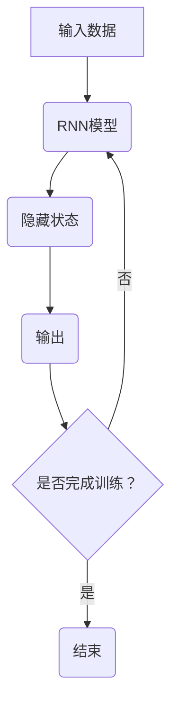
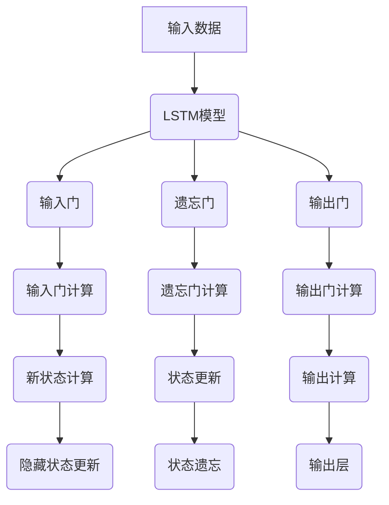
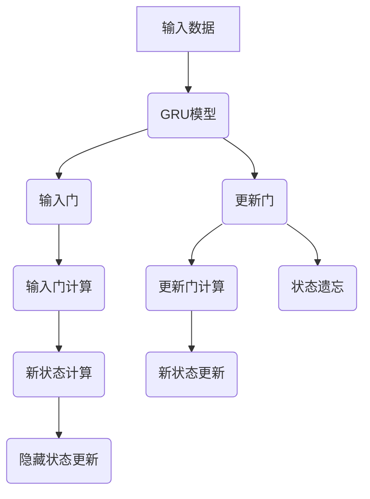
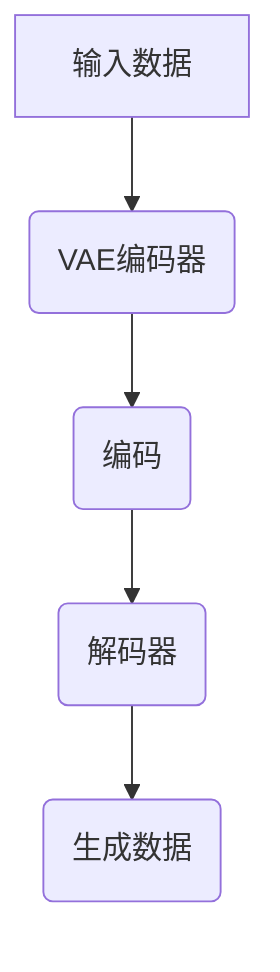

                 

### 文章标题

《大语言模型原理与工程实践：稳定性优化》

---

关键词：大语言模型、原理、工程实践、稳定性优化、算法原理、数学模型

---

摘要：本文旨在深入探讨大语言模型的原理与工程实践，特别是在稳定性优化方面的技术。通过详细分析大语言模型的基础知识、核心算法原理、训练与评估方法，以及稳定性优化的关键技术，本文为读者提供了一个全面而系统的理解。此外，通过实际的案例分析，本文展示了大语言模型在现实中的应用及其优化策略，为研究人员和开发者提供了宝贵的实践经验和启示。文章最后对未来大语言模型的发展趋势进行了展望，并总结了全文的核心内容与贡献。

---

### 目录

#### 《大语言模型原理与工程实践：稳定性优化》

> 关键词：大语言模型、原理、工程实践、稳定性优化

> 摘要：本文介绍了大语言模型的基本概念、核心算法原理、训练与评估方法，以及稳定性优化技术。通过案例分析，展示了大语言模型在实际应用中的效果和优化策略。最后，对大语言模型的未来发展趋势进行了展望。

## 第一部分：大语言模型基础

### 第1章：大语言模型概述

#### 1.1 大语言模型的背景

- **1.1.1 语言模型的发展历程**
- **1.1.2 大语言模型的重要性**

#### 1.2 大语言模型的核心概念

- **1.2.1 词嵌入**
- **1.2.2 序列模型**
- **1.2.3 注意力机制**

#### 1.3 大语言模型的架构

- **1.3.1 传统的循环神经网络（RNN）**
- **1.3.2 长短时记忆网络（LSTM）**
- **1.3.3 门控循环单元（GRU）**
- **1.3.4 变量门控网络（VAE）**

### 第2章：大语言模型的训练

#### 2.1 数据预处理

- **2.1.1 语料库的选择**
- **2.1.2 数据清洗与分词**

#### 2.2 训练策略

- **2.2.1 批处理与随机梯度下降（SGD）**
- **2.2.2 Adam优化器**

#### 2.3 超参数调整

- **2.3.1 学习率**
- **2.3.2 批大小**
- **2.3.3 正则化**

### 第3章：大语言模型的评估

#### 3.1 评估指标

- **3.1.1 召回率（Recall）**
- **3.1.2 精确率（Precision）**
- **3.1.3 F1值**

#### 3.2 评估方法

- **3.2.1 开发集与测试集**
- **3.2.2 跨语言评估**

## 第二部分：大语言模型的稳定性优化

### 第4章：模型正则化技术

#### 4.1 数据增强

- **4.1.1 数据增强策略**
- **4.1.2 数据增强的优势**

#### 4.2 权重初始化

- **4.2.1 权重初始化方法**
- **4.2.2 权重初始化的影响**

#### 4.3 Dropout

- **4.3.1 Dropout的工作原理**
- **4.3.2 Dropout的优势与局限性**

### 第5章：对抗样本防御

#### 5.1 对抗样本的生成

- **5.1.1 对抗样本的生成方法**
- **5.1.2 对抗样本的类型**

#### 5.2 对抗样本防御方法

- **5.2.1 输入变换**
- **5.2.2 模型结构调整**

### 第6章：模型压缩与加速

#### 6.1 模型压缩技术

- **6.1.1 知识蒸馏**
- **6.1.2 权重共享**

#### 6.2 模型加速技术

- **6.2.1 GPU加速**
- **6.2.2 张量核操作**

### 第7章：大语言模型的部署

#### 7.1 部署策略

- **7.1.1 云计算部署**
- **7.1.2 边缘计算部署**

#### 7.2 性能优化

- **7.2.1 缓存技术**
- **7.2.2 负载均衡**

### 第8章：案例分析

#### 8.1 案例一：大规模语言模型的应用

- **8.1.1 应用场景**
- **8.1.2 实现细节**

#### 8.2 案例二：对抗样本的防御策略

- **8.2.1 防御策略**
- **8.2.2 实验结果分析**

## 第9章：大语言模型的未来发展趋势

#### 9.1 新型架构

- **9.1.1 Transformer的改进**
- **9.1.2 神经机器翻译**

#### 9.2 应用拓展

- **9.2.1 多模态学习**
- **9.2.2 自然语言生成**

#### 9.3 持续优化

- **9.3.1 自适应学习率**
- **9.3.2 模型解释性**

### 第10章：总结与展望

#### 10.1 大语言模型的发展历程

- **10.1.1 从传统语言模型到现代语言模型**
- **10.1.2 技术突破**

#### 10.2 大语言模型在现实中的应用

- **10.2.1 人工智能助手**
- **10.2.2 语言翻译服务**

#### 10.3 未来展望

- **10.3.1 大语言模型的社会影响**
- **10.3.2 持续发展**

### 附录：资源与工具

#### 附录1：大语言模型常用工具与资源

- **1.1 开源框架**
- **1.2 数据集**

#### 附录2：大语言模型研究论文与报告

- **2.1 学术论文**
- **2.2 行业报告**

#### 附录3：大语言模型开源项目

- **3.1 开源代码**
- **3.2 开源模型**

---

通过上述目录结构，我们可以清晰地看到文章的整体框架。接下来的内容将依次介绍大语言模型的基础知识、训练与评估方法、稳定性优化技术，并通过实际案例展示大语言模型的应用及其优化策略。最后，我们将对大语言模型的发展趋势进行展望，并总结全文的核心内容与贡献。

---

## 第一部分：大语言模型基础

### 第1章：大语言模型概述

#### 1.1 大语言模型的背景

大语言模型（Large-scale Language Model）是一种利用深度学习和大规模数据预训练的模型，用于理解和生成自然语言。这一概念起源于上世纪80年代的统计语言模型，但随着计算能力和数据量的提升，特别是深度学习和自然语言处理技术的突破，大语言模型逐渐崭露头角。近年来，GPT系列模型、BERT模型等大语言模型的相继出现，标志着这一领域的重要进展。

大语言模型的重要性体现在多个方面。首先，它们能够显著提高自然语言处理的任务性能，如文本分类、命名实体识别、机器翻译等。其次，大语言模型具有强大的泛化能力，能够在未见过的数据上取得良好的表现。此外，大语言模型还推动了自然语言生成、对话系统等新兴应用的发展。

#### 1.2 大语言模型的核心概念

1. **词嵌入（Word Embedding）**：词嵌入是将单词映射到高维空间中的向量表示，使得语义相似的单词在向量空间中距离较近。常见的方法包括Word2Vec和GloVe等。

   - **Word2Vec**：基于神经网络训练的词向量模型，包括连续词袋（CBOW）和Skip-Gram两种方法。
     
     ```mermaid
     graph TD
     A[输入单词] --> B(Word2Vec模型)
     B --> C(输出词向量)
     C --> D{是否完成训练？}
     D -->|是| E(结束)
     D -->|否| B
     ```

   - **GloVe**：全局向量表示模型，基于共现矩阵训练词向量，公式如下：

     $$
     \text{cos}(\text{vec}(w_i), \text{vec}(w_j)) = \text{cos}\theta_{ij}
     $$

     其中，$w_i$和$w_j$是单词$i$和$j$的向量表示，$\theta_{ij}$是单词$i$和$j$的夹角。

2. **序列模型（Sequence Model）**：用于处理序列数据，常见的包括循环神经网络（RNN）、长短时记忆网络（LSTM）、门控循环单元（GRU）等。

   - **RNN**：用于处理变长序列，公式如下：

     $$
     h_t = \sigma(W_h \cdot [h_{t-1}, x_t] + b_h)
     $$

     其中，$h_t$是第$t$个隐藏状态，$x_t$是第$t$个输入，$\sigma$是激活函数。

   - **LSTM**：用于解决RNN的梯度消失问题，公式如下：

     $$
     \text{gate}_i = \sigma(W_i \cdot [h_{t-1}, x_t] + b_i)
     $$

     $$ 
     \text{output}_i = \text{tanh}(W_o \cdot [h_{t-1}, x_t] + b_o)
     $$

     其中，$\text{gate}_i$是输入门、遗忘门和输出门，$\text{output}_i$是输出门。

   - **GRU**：简化版的LSTM，公式如下：

     $$
     \text{gate}_i = \sigma(W_i \cdot [h_{t-1}, x_t] + b_i)
     $$

     $$ 
     r_t = \text{tanh}(W_r \cdot [h_{t-1}, x_t] + b_r)
     $$

     $$ 
     h_t = (1 - \text{gate}_i) \cdot h_{t-1} + \text{gate}_i \cdot r_t
     $$

3. **注意力机制（Attention Mechanism）**：用于提高序列模型对关键信息的关注，公式如下：

   $$
   a_t = \text{softmax}(W_a \cdot [h_{t-1}, x_t])
   $$

   $$ 
   h_t = \sum_{i=1}^N a_t \cdot h_i
   $$

   其中，$a_t$是注意力权重，$h_t$是第$t$个隐藏状态。

#### 1.3 大语言模型的架构

大语言模型的架构通常包括词嵌入层、编码器层、解码器层和输出层。以下是对这些层的详细解释：

1. **词嵌入层（Word Embedding Layer）**：将输入的单词转换为词向量表示，这些词向量用于后续的编码和预测。

2. **编码器层（Encoder）**：用于对输入序列进行编码，通常包含多个隐藏层，每一层都能捕捉到序列的不同特征。

3. **解码器层（Decoder）**：用于生成输出序列，它可以根据编码器的输出预测下一个单词，并更新解码器状态。

4. **输出层（Output Layer）**：用于生成最终的输出，例如文本生成任务中的单词或句子。

#### 传统循环神经网络（RNN）

RNN是处理序列数据的经典模型，其基本思想是利用前一时刻的隐藏状态来影响当前时刻的输出。以下是RNN的一个简化版本：



RNN的工作流程如下：

1. **初始化**：初始化隐藏状态$\(h_0\)$。
2. **前向传播**：使用输入数据$x_t$和隐藏状态$h_{t-1}$计算当前输出$\(y_t\)$和新的隐藏状态$\(h_t\)$。
3. **反向传播**：根据损失函数计算梯度，更新模型参数。

#### 长短时记忆网络（LSTM）

LSTM是RNN的一种改进，旨在解决梯度消失问题。以下是LSTM的简化版本：



LSTM的工作流程如下：

1. **初始化**：初始化隐藏状态$\(h_0\)$。
2. **输入门**：决定当前输入$\(x_t\)$中哪些信息会被保存到隐藏状态中。
3. **遗忘门**：决定之前隐藏状态中哪些信息会被遗忘。
4. **新状态计算**：根据输入门和遗忘门更新隐藏状态。
5. **输出门**：决定隐藏状态中哪些信息会被输出。

#### 门控循环单元（GRU）

GRU是LSTM的简化版本，它通过合并输入门和遗忘门来减少模型参数。以下是GRU的简化版本：



GRU的工作流程如下：

1. **初始化**：初始化隐藏状态$\(h_0\)$。
2. **输入门**：决定当前输入$\(x_t\)$中哪些信息会被保存到隐藏状态中。
3. **更新门**：决定之前隐藏状态中哪些信息会被遗忘。
4. **新状态计算**：根据输入门和更新门更新隐藏状态。

#### 变量门控网络（VAE）

VAE是一种基于概率生成模型的神经网络，它通过编码器和解码器来生成数据。以下是VAE的简化版本：



VAE的工作流程如下：

1. **编码**：编码器将输入数据映射到一个潜在空间。
2. **解码**：解码器从潜在空间生成新的数据。
3. **生成**：通过重复编码和解码过程生成新的数据。

通过以上对大语言模型核心概念和架构的详细阐述，我们为后续章节的深入探讨奠定了基础。接下来，我们将进一步探讨大语言模型的训练、评估和稳定性优化技术。

## 第2章：大语言模型的训练

#### 2.1 数据预处理

数据预处理是训练大语言模型的重要步骤，它直接影响到模型的性能和训练效率。以下是对数据预处理过程中的一些关键步骤的详细讲解。

##### 2.1.1 语料库的选择

语料库的选择对于大语言模型的训练至关重要。一个好的语料库应该具备以下特点：

1. **规模**：足够大的语料库能够提供丰富的语言特征，有助于模型捕捉到更多的语言规律。
2. **多样性**：语料库中应包含不同领域、不同风格的文本，以增强模型的泛化能力。
3. **质量**：语料库中的文本应尽可能真实，避免含有大量噪声或错误。

常见的语料库包括Wikipedia、Common Crawl、Google Books Ngrams等。选择合适的语料库后，我们需要对其进行进一步的处理。

##### 2.1.2 数据清洗与分词

数据清洗是去除语料库中无用信息的过程，包括去除HTML标签、特殊字符、停用词等。以下是一些常见的数据清洗方法：

1. **去除HTML标签**：使用正则表达式或其他工具去除文本中的HTML标签，保留文本内容。
2. **去除特殊字符**：使用正则表达式或其他工具去除文本中的特殊字符，如符号、空格等。
3. **去除停用词**：停用词是指在自然语言处理中不具有实际意义的单词，如“的”、“是”、“了”等。去除停用词可以减少模型的参数数量，提高训练效率。

分词是将文本分割成单词或短语的步骤，是自然语言处理中的基础任务。以下是一些常见的分词方法：

1. **基于词典的分词**：通过查找词典中的单词，将文本分割成单词或短语。这种方法简单有效，但需要大量的人力和时间来构建词典。
2. **基于统计的分词**：使用统计方法，如最大熵模型、条件随机场（CRF）等，将文本分割成单词或短语。这种方法可以根据上下文信息进行分词，但需要大量的训练数据和计算资源。

在数据预处理过程中，我们还需要对文本进行编码，将单词或字符转换为整数或向量的表示。常用的编码方法包括：

1. **整数编码（Integer Encoding）**：将每个单词或字符映射为一个唯一的整数。这种方法简单直观，但可能会引入大量稀疏数据。
2. **词嵌入（Word Embedding）**：将单词或字符映射到高维空间中的向量。这种方法可以捕捉到单词的语义信息，但需要大量的计算资源。

通过以上对数据预处理关键步骤的详细讲解，我们可以看到数据预处理在整个大语言模型训练过程中扮演着重要的角色。接下来，我们将深入探讨大语言模型的训练策略和超参数调整。

#### 2.2 训练策略

在大语言模型的训练过程中，选择合适的训练策略对于模型的性能和收敛速度有着重要的影响。以下是一些常见的训练策略：

##### 2.2.1 批处理与随机梯度下降（SGD）

批处理（Batch Processing）和随机梯度下降（Stochastic Gradient Descent，SGD）是训练深度学习模型的基本策略。批处理是指每次训练时使用全部数据或一部分数据，而随机梯度下降是指在每次迭代时随机选择一部分数据。

1. **全量批处理**：每次训练使用全部数据，计算所有数据的梯度并进行参数更新。这种方法计算量大，但梯度信息更为准确。
2. **随机批处理**：每次训练随机选择一部分数据，计算这部分数据的梯度并进行参数更新。这种方法计算量相对较小，但梯度信息存在一定的不确定性。

随机梯度下降的更新规则如下：

$$
\theta = \theta - \alpha \cdot \nabla J(\theta)
$$

其中，$\theta$是模型参数，$\alpha$是学习率，$J(\theta)$是损失函数。

##### 2.2.2 Adam优化器

Adam优化器是一种结合了SGD和动量方法的优化器，具有较好的收敛速度和稳定性。Adam优化器通过计算一阶矩估计（均值）和二阶矩估计（方差）来进行参数更新，其更新规则如下：

$$
m_t = \beta_1 m_{t-1} + (1 - \beta_1) \nabla J(\theta)
$$

$$
v_t = \beta_2 v_{t-1} + (1 - \beta_2) (\nabla J(\theta))^2
$$

$$
\theta = \theta - \alpha \cdot \frac{m_t}{\sqrt{v_t} + \epsilon}
$$

其中，$m_t$和$v_t$分别是梯度的一阶矩估计和二阶矩估计，$\beta_1$和$\beta_2$是动量系数，$\alpha$是学习率，$\epsilon$是微小常数。

Adam优化器具有以下优点：

1. **自适应学习率**：根据梯度的方差和均方根自适应调整学习率。
2. **收敛速度较快**：结合了SGD和动量方法，具有较高的收敛速度。
3. **稳定性**：通过一阶矩估计和二阶矩估计的误差补偿，提高了模型的稳定性。

##### 2.2.3 学习率调整策略

学习率是影响模型收敛速度和性能的关键超参数。以下是一些常见的学习率调整策略：

1. **固定学习率**：在整个训练过程中保持学习率不变。这种方法简单易行，但可能收敛速度较慢。
2. **学习率衰减**：在训练过程中逐渐减小学习率。常见的方法有线性衰减、指数衰减和余弦衰减。
3. **自适应学习率**：根据梯度信息自适应调整学习率，如Adam优化器。
4. **学习率调度**：根据模型性能或训练进度动态调整学习率。常见的方法有学习率预热、学习率缩减等。

通过以上对训练策略的详细讲解，我们可以看到选择合适的训练策略对于大语言模型的训练至关重要。接下来，我们将探讨如何调整超参数以优化模型性能。

#### 2.3 超参数调整

超参数是深度学习模型中需要手动设置的参数，如学习率、批量大小、正则化强度等。合理调整超参数能够显著提高模型性能和收敛速度。以下是一些常见的超参数调整方法：

##### 2.3.1 学习率

学习率是影响模型收敛速度和性能的关键超参数。以下是一些常见的学习率调整方法：

1. **固定学习率**：在整个训练过程中保持学习率不变。这种方法简单易行，但可能收敛速度较慢。
2. **学习率衰减**：在训练过程中逐渐减小学习率。常见的方法有线性衰减、指数衰减和余弦衰减。
3. **自适应学习率**：根据梯度信息自适应调整学习率，如Adam优化器。
4. **学习率预热**：在训练初期使用较大的学习率，逐渐减小学习率，以提高模型的探索能力。
5. **学习率缩减**：当模型性能不再提升时，减小学习率，以避免过早陷入局部最优。

##### 2.3.2 批大小

批大小是指每次训练使用的样本数量。以下是一些常见的影响：

1. **较小的批大小**：减少内存需求，提高训练速度，但可能增加方差，降低收敛速度。
2. **较大的批大小**：提高梯度估计的准确性，降低方差，但可能增加内存需求，降低训练速度。
3. **动态调整批大小**：在训练过程中根据模型性能动态调整批大小，以平衡训练速度和稳定性。

##### 2.3.3 正则化

正则化是防止模型过拟合的重要手段。以下是一些常见的正则化方法：

1. **L1正则化**：增加模型参数的L1范数到损失函数中，促进稀疏解。
2. **L2正则化**：增加模型参数的L2范数到损失函数中，减少参数的敏感性。
3. **Dropout**：在训练过程中随机丢弃部分神经元，减少模型的依赖性。
4. **数据增强**：通过旋转、翻转、裁剪等操作增加数据多样性，提高模型泛化能力。

##### 2.3.4 交叉验证

交叉验证是一种评估模型性能的方法，通过将数据划分为多个子集，轮流将每个子集作为验证集，评估模型在未知数据上的性能。以下是一些常见的方法：

1. **K折交叉验证**：将数据划分为K个子集，轮流使用每个子集作为验证集，计算平均性能。
2. **留一法交叉验证**：每次保留一个子集作为验证集，其余子集作为训练集，计算平均性能。
3. **时间序列交叉验证**：将数据按照时间顺序划分，每次保留最近的一段时间作为验证集，评估模型在未来的性能。

通过以上对超参数调整方法的详细讲解，我们可以看到合理调整超参数对于优化模型性能至关重要。接下来，我们将探讨大语言模型的评估指标和评估方法。

#### 3.1 评估指标

评估指标是衡量大语言模型性能的重要工具。以下是一些常见的评估指标：

##### 3.1.1 召回率（Recall）

召回率是评估模型在分类任务中检测出所有正例样本的能力。其计算公式如下：

$$
\text{Recall} = \frac{\text{真正例}}{\text{真正例 + 假正例}}
$$

其中，真正例是指模型正确分类为正例的样本数量，假正例是指模型错误分类为正例的样本数量。召回率越高，表示模型越能够检测出所有的正例样本。

##### 3.1.2 精确率（Precision）

精确率是评估模型在分类任务中预测为正例的样本中实际为正例的比例。其计算公式如下：

$$
\text{Precision} = \frac{\text{真正例}}{\text{真正例 + 假正例}}
$$

其中，真正例是指模型正确分类为正例的样本数量，假正例是指模型错误分类为正例的样本数量。精确率越高，表示模型预测为正例的样本中实际为正例的比例越高。

##### 3.1.3 F1值

F1值是召回率和精确率的加权平均，用于综合评估模型在分类任务中的性能。其计算公式如下：

$$
\text{F1值} = 2 \cdot \frac{\text{Precision} \cdot \text{Recall}}{\text{Precision} + \text{Recall}}
$$

其中，$\text{Precision}$和$\text{Recall}$分别是精确率和召回率。F1值介于0和1之间，越接近1表示模型性能越好。

通过以上对评估指标的详细讲解，我们可以看到不同指标在不同的应用场景中具有不同的重要性。接下来，我们将探讨大语言模型的评估方法。

#### 3.2 评估方法

评估方法是衡量大语言模型性能的关键步骤。以下是一些常见的评估方法：

##### 3.2.1 开发集与测试集

开发集（Development Set）和测试集（Test Set）是评估模型性能的常用方法。开发集用于模型训练和调优，测试集用于最终评估模型性能。

1. **训练阶段**：使用开发集对模型进行训练和调优，选择最优的超参数和模型架构。
2. **测试阶段**：使用测试集评估模型的最终性能，避免过拟合和欠拟合问题。

##### 3.2.2 跨语言评估

跨语言评估是在不同语言环境下评估模型性能的方法，有助于检验模型的泛化能力。以下是一些常见的跨语言评估方法：

1. **平行语料库评估**：使用平行语料库评估模型在目标语言上的性能，常见于机器翻译任务。
2. **零样本评估**：在未见过的语言上评估模型性能，常见于低资源语言的翻译任务。
3. **多语言模型评估**：使用多语言模型评估模型在多语言环境下的性能，常见于多语言文本分类和生成任务。

通过以上对评估方法的详细讲解，我们可以看到不同评估方法在模型性能评估中的重要作用。接下来，我们将探讨大语言模型的稳定性优化技术。

## 第二部分：大语言模型的稳定性优化

### 第4章：模型正则化技术

模型正则化技术是提高大语言模型稳定性的重要手段，主要目的是防止模型过拟合，增强模型的泛化能力。以下将详细介绍几种常见的模型正则化技术：数据增强、权重初始化和Dropout。

#### 4.1 数据增强

数据增强是一种通过生成新的训练样本来提高模型泛化能力的技术。在大语言模型的训练过程中，数据增强可以帮助模型学习到更多的特征，从而减少过拟合的风险。以下是一些常见的数据增强策略：

1. **随机裁剪（Random Crop）**：从原始图像中随机裁剪出一个固定大小的小块，用于训练模型。这种方法常用于图像分类任务。
2. **随机翻转（Random Flip）**：沿水平或垂直方向随机翻转图像，以增加数据的多样性。这种方法适用于图像和视频分类任务。
3. **旋转（Rotation）**：将图像随机旋转一定角度，以增加数据的旋转特征。
4. **缩放（Scaling）**：将图像随机缩放到不同的尺寸，以增加数据的尺度特征。
5. **噪声添加（Noise Addition）**：在图像上添加噪声，如高斯噪声、椒盐噪声等，以增加数据的噪声特征。

**数据增强的优势**：

- **提高模型的泛化能力**：通过生成新的训练样本，数据增强可以帮助模型学习到更丰富的特征，从而减少过拟合的风险。
- **减少过拟合**：增加数据的多样性有助于模型避免陷入局部最优。
- **提高模型稳定性**：通过增加训练样本的数量和质量，数据增强可以提高模型的稳定性和可靠性。

#### 4.2 权重初始化

权重初始化是深度学习模型训练过程中的重要步骤，直接影响模型的收敛速度和性能。以下是一些常见的权重初始化方法及其影响：

1. **随机初始化（Random Initialization）**：将权重随机初始化为一个较小的值。这种方法可以防止模型在训练过程中陷入0梯度或梯度爆炸的问题。
2. **Xavier初始化（Xavier Initialization）**：根据前一层和当前层的神经元数量，初始化权重。具体公式如下：

   $$
   \text{W} \sim \text{Normal}\left(0, \frac{1}{\sqrt{\text{in\_fan\_in + out\_fan\_in}}}\right)
   $$

   其中，$\text{in\_fan\_in}$和$\text{out\_fan\_in}$分别是输入和输出的神经元数量。Xavier初始化有助于避免梯度消失和梯度爆炸问题。
3. **He初始化（He Initialization）**：在Xavier初始化的基础上，将标准差乘以$\sqrt{2}$。具体公式如下：

   $$
   \text{W} \sim \text{Normal}\left(0, \frac{2}{\sqrt{\text{in\_fan\_in}}}\right)
   $$

   He初始化适用于ReLU激活函数，可以更好地避免梯度消失问题。

**权重初始化的影响**：

- **防止梯度消失和梯度爆炸**：合理的权重初始化可以减少模型在训练过程中的梯度消失和梯度爆炸问题，提高收敛速度。
- **影响模型性能**：不同的权重初始化方法会对模型的性能产生显著影响。选择合适的权重初始化方法可以提高模型性能。

#### 4.3 Dropout

Dropout是一种常用的正则化技术，通过随机丢弃部分神经元，降低模型对特定数据的依赖，提高模型的泛化能力。以下是一些关于Dropout的关键点：

1. **Dropout的工作原理**：在训练过程中，以一定的概率随机丢弃神经元及其连接的权重。具体来说，每次更新权重时，都有一定的概率将该权重设置为0。
2. **Dropout的优势**：

   - **减少过拟合**：通过随机丢弃神经元，Dropout可以减少模型对特定训练样本的依赖，从而降低过拟合的风险。
   - **提高模型泛化能力**：Dropout有助于模型学习到更通用的特征，提高模型在未见过的数据上的性能。

3. **Dropout的局限性**：

   - **计算成本**：Dropout需要在每次更新时重新计算权重，增加模型的计算成本。
   - **无法避免梯度消失和梯度爆炸**：尽管Dropout可以提高模型的泛化能力，但并不能完全避免梯度消失和梯度爆炸问题。

通过以上对模型正则化技术的详细讲解，我们可以看到数据增强、权重初始化和Dropout在大语言模型稳定性优化中的重要作用。这些技术不仅有助于防止模型过拟合，提高模型泛化能力，还能提高模型的训练速度和收敛效果。接下来，我们将探讨对抗样本防御技术。

### 第5章：对抗样本防御

对抗样本（Adversarial Examples）是指通过在原始样本上添加微小的扰动，使得模型对样本的预测结果发生改变。对抗样本攻击是深度学习模型面临的一个严峻挑战，因为它们能够欺骗模型，导致模型在测试集上的性能大幅下降。以下将介绍对抗样本的生成方法及其防御策略。

#### 5.1 对抗样本的生成方法

对抗样本的生成方法可以分为基于梯度的方法和基于优化器的方法。以下是一些常见的方法：

1. **FGSM（Fast Gradient Sign Method）**：FGSM是最简单的对抗样本生成方法之一。它通过在原始样本上添加与梯度方向相同的微小扰动，使得模型的损失函数值增加，从而欺骗模型。具体步骤如下：

   - 计算梯度：$$\nabla_{\text{x}} J(\text{x}, \text{y})$$
   - 计算扰动：$$\Delta \text{x} = \text{sign}(\nabla_{\text{x}} J(\text{x}, \text{y}))$$
   - 生成对抗样本：$$\text{x}^* = \text{x} + \Delta \text{x}$$

2. **PGD（Projected Gradient Descent）**：PGD是一种基于梯度的优化方法，通过在原始样本上逐渐增加扰动，从而生成对抗样本。具体步骤如下：

   - 初始化对抗样本：$$\text{x}^0 = \text{x}$$
   - 迭代更新对抗样本：$$\text{x}^{k+1} = \text{x}^{k} + \alpha \cdot \text{sign}(\nabla_{\text{x}} J(\text{x}^{k}, \text{y}))$$
   - 投影到允许范围内：$$\text{x}^{k+1} = \text{Proj}(\text{x}^{k+1}, \text{X})$$
   - 其中，$$\alpha$$是学习率，$$\text{Proj}(\text{x}, \text{X})$$是将$$\text{x}$$投影到允许范围内的操作。

3. **C&W（Carlini & Wagner）**：C&W方法是一种基于优化的对抗样本生成方法，通过最小化损失函数和对抗性扰动之间的距离，从而生成对抗样本。具体步骤如下：

   - 定义损失函数：$$L(\text{x}, \text{y}) = \text{L2}(\text{f}(\text{x}; \theta), \text{y})$$
   - 定义优化目标：$$\min_{\text{x}} \max_{\text{w}} L(\text{x} + \text{w})$$
   - 计算梯度：$$\nabla_{\text{x}} L(\text{x} + \text{w})$$
   - 更新对抗样本：$$\text{x}^{k+1} = \text{x}^{k} - \alpha \cdot \nabla_{\text{x}} L(\text{x}^{k} + \text{w})$$

#### 5.2 对抗样本防御方法

对抗样本防御的目标是提高模型的鲁棒性，使得模型能够对抗对抗样本攻击。以下是一些常见的防御方法：

1. **输入变换**：通过在输入数据上添加噪声或进行数据增强，使得模型难以捕捉到对抗样本的扰动。以下是一些常见的输入变换方法：

   - **随机噪声添加**：在输入数据上添加随机噪声，如高斯噪声、椒盐噪声等。
   - **数据增强**：通过旋转、缩放、翻转等操作增加数据的多样性。
   - **输入归一化**：对输入数据进行归一化处理，如将像素值缩放到[0, 1]范围内。

2. **模型结构调整**：通过改进模型结构或引入新的正则化方法，提高模型的鲁棒性。以下是一些常见的模型结构调整方法：

   - **深度神经网络**：增加网络深度可以提高模型的鲁棒性，因为深层网络可以更好地捕捉到数据中的非线性特征。
   - **注意力机制**：引入注意力机制可以使模型更关注重要特征，减少对抗样本的影响。
   - **Dropout**：通过在训练过程中随机丢弃部分神经元，Dropout可以提高模型的鲁棒性。

3. **对抗训练**：通过在训练过程中引入对抗样本，使得模型能够学习到对抗样本的特征，从而提高模型的鲁棒性。以下是一些常见的对抗训练方法：

   - **FGSM训练**：在训练过程中使用FGSM生成对抗样本，并将其加入训练集。
   - **PGD训练**：在训练过程中使用PGD生成对抗样本，并将其加入训练集。
   - **对抗样本生成器训练**：训练一个生成器模型，用于生成对抗样本，并将其加入训练集。

通过以上对抗样本防御方法的介绍，我们可以看到提高模型鲁棒性是一个复杂的问题，需要从多个方面进行考虑和优化。接下来，我们将探讨大语言模型的压缩与加速技术。

### 第6章：模型压缩与加速

在深度学习应用中，模型的压缩与加速是提高模型性能和降低计算成本的重要技术。以下将详细介绍模型压缩和加速的方法，包括知识蒸馏、权重共享、GPU加速和张量核操作等。

#### 6.1 模型压缩技术

模型压缩的目标是在保持模型性能的前提下，减小模型的参数规模和计算量。以下是一些常见的模型压缩技术：

1. **知识蒸馏（Knowledge Distillation）**：知识蒸馏是一种将模型知识传递给另一个较小模型的训练技术。通过将大模型的输出作为小模型的软标签，小模型可以在训练过程中学习到大模型的泛化能力。知识蒸馏分为两种方法：基于输出的知识蒸馏和基于关系的知识蒸馏。

   - **基于输出的知识蒸馏**：将大模型的输出概率作为小模型的软标签，小模型通过学习这些软标签来提高其性能。

     $$
     \text{Softmax}(f(\text{x}; \theta_{s}) \odot \text{Softmax}(f(\text{x}; \theta_{b}))
     $$

     其中，$\text{f}(\text{x}; \theta)$是模型的输出函数，$\theta_{s}$是小模型的参数，$\theta_{b}$是大模型的参数。

   - **基于关系的知识蒸馏**：将大模型的中间层输出作为小模型的软标签，小模型通过学习这些软标签来提高其性能。

     $$
     \text{Softmax}(\text{T}(f(\text{x}; \theta_{s})) \odot \text{Softmax}(f(\text{x}; \theta_{b}))
     $$

     其中，$\text{T}$是特征变换函数。

2. **权重共享（Weight Sharing）**：权重共享是一种通过共享模型中不同层级的权重来减少模型参数数量的方法。常见的权重共享策略包括：

   - **深度可分离卷积**：将卷积操作拆分为深度卷积和逐点卷积，从而减少模型参数数量。
   - **注意力机制**：通过引入注意力机制，共享不同层级的特征表示，从而提高模型的性能。

3. **剪枝（Pruning）**：剪枝是一种通过删除模型中无用或冗余的连接和神经元来减少模型参数数量的方法。常见的剪枝方法包括：

   - **结构剪枝**：通过删除模型中的某些层或连接，从而减少模型参数数量。
   - **稀疏剪枝**：通过设置阈值，删除小于阈值的权重，从而减少模型参数数量。

4. **量化（Quantization）**：量化是一种通过将模型中的浮点数参数转换为较低精度的整数来减少模型参数数量的方法。常见的量化方法包括：

   - **整数量化**：将浮点数参数转换为整数，从而减少模型存储和计算需求。
   - **低精度量化**：将浮点数参数转换为较低精度的浮点数，从而减少模型存储和计算需求。

#### 6.2 模型加速技术

模型加速技术旨在提高模型的训练和推理速度，从而提高模型的性能和响应能力。以下是一些常见的模型加速技术：

1. **GPU加速**：GPU（图形处理单元）具有高度并行的计算能力，可以显著提高模型的训练和推理速度。以下是一些常见的GPU加速技术：

   - **并行计算**：将模型的训练和推理任务分解为多个子任务，并行计算每个子任务，从而提高计算速度。
   - **内存管理**：优化模型内存分配和缓存策略，减少内存访问延迟，提高计算速度。
   - **优化算法**：选择高效的训练和推理算法，减少计算复杂度，提高计算速度。

2. **张量核操作（Tensor Kernel Operations）**：张量核操作是一种用于加速矩阵乘法和其他线性代数运算的方法。以下是一些常见的张量核操作：

   - **矩阵乘法**：通过使用张量核操作，可以显著减少矩阵乘法的计算时间。
   - **向量化操作**：通过向量化操作，可以减少循环计算，提高计算速度。
   - **张量分解**：通过张量分解，可以将复杂的矩阵运算转化为简单的张量操作，从而提高计算速度。

通过以上对模型压缩和加速技术的详细介绍，我们可以看到这些技术对于提高大语言模型的性能和降低计算成本具有重要意义。接下来，我们将探讨大语言模型的部署策略。

### 第7章：大语言模型的部署

在大语言模型的应用中，部署策略的选择至关重要，它直接影响到模型在实际场景中的性能和用户体验。以下将详细介绍大语言模型的部署策略、性能优化方法以及实际部署过程中的注意事项。

#### 7.1 部署策略

大语言模型的部署策略主要分为云计算部署和边缘计算部署。

1. **云计算部署**：

   - **优势**：云计算部署具有以下优势：
     - **灵活性**：可以根据需求动态调整资源，如计算、存储和网络带宽。
     - **可扩展性**：能够快速扩展计算资源，以应对高并发访问。
     - **维护方便**：云服务提供商负责系统的维护、升级和备份。

   - **劣势**：云计算部署也有一些劣势：
     - **成本**：使用云计算服务可能产生较高的费用，特别是当访问量较大时。
     - **网络延迟**：由于模型部署在云端，用户访问时可能存在一定的网络延迟。

2. **边缘计算部署**：

   - **优势**：边缘计算部署具有以下优势：
     - **低延迟**：将模型部署在靠近用户的边缘设备上，可以显著降低网络延迟，提高用户体验。
     - **成本效益**：对于一些轻量级模型，边缘设备可能更加经济实惠。
     - **数据隐私**：在边缘设备上进行数据处理，可以更好地保护用户数据隐私。

   - **劣势**：边缘计算部署也有一些劣势：
     - **计算资源受限**：边缘设备的计算资源通常比云端服务器有限。
     - **维护难度**：边缘设备的维护和升级可能更为复杂。

在实际部署过程中，可以根据应用场景和需求选择合适的部署策略。例如，对于需要实时响应且对延迟敏感的场景，边缘计算部署可能更为合适；而对于需要处理大量数据和复杂任务的场景，云计算部署可能更为适合。

#### 7.2 性能优化

为了确保大语言模型在实际应用中能够高效运行，需要对模型进行性能优化。以下是一些常见的性能优化方法：

1. **缓存技术**：

   - **优势**：缓存技术可以减少重复计算，提高模型响应速度。例如，可以使用Redis等缓存系统存储已计算的结果，以避免重复计算。

   - **劣势**：缓存技术可能引入一致性问题，需要确保缓存数据的一致性和有效性。

2. **负载均衡**：

   - **优势**：通过负载均衡技术，可以将请求分配到多个服务器上，避免单点故障，提高系统可用性和性能。常见的负载均衡算法有轮询、随机、最小连接数等。

   - **劣势**：负载均衡可能增加网络开销，需要合理配置负载均衡策略。

3. **并行计算**：

   - **优势**：通过并行计算，可以将任务分解为多个子任务，在多个计算节点上同时执行，从而提高计算速度。例如，可以使用多GPU并行训练。

   - **劣势**：并行计算需要复杂的调度和同步机制，可能增加系统的复杂性。

4. **模型压缩与量化**：

   - **优势**：通过模型压缩和量化，可以减少模型参数数量和计算量，提高模型在资源受限环境下的运行效率。常见的压缩方法有知识蒸馏、剪枝和量化。

   - **劣势**：模型压缩和量化可能会降低模型性能，需要权衡压缩效果和模型性能。

#### 7.3 实际部署案例分析

以下是一个实际部署大语言模型的案例：

**场景**：某电商平台希望通过自然语言处理技术为用户提供智能客服服务。

**解决方案**：

1. **部署策略**：采用边缘计算部署，将模型部署在用户附近的边缘服务器上，以降低网络延迟，提高用户体验。

2. **性能优化**：

   - **缓存技术**：使用Redis缓存用户的历史对话记录，以提高对话响应速度。

   - **负载均衡**：使用轮询算法将用户请求分配到多个边缘服务器上，以提高系统的可用性和性能。

   - **模型压缩**：采用知识蒸馏技术，将大模型蒸馏为一个较小的轻量级模型，以减少模型参数数量和计算量。

**效果**：

- **用户体验**：用户反馈智能客服响应速度明显提升，用户满意度提高。
- **系统性能**：边缘服务器负载均衡，系统可用性提高，故障率降低。

#### 7.4 注意事项

在实际部署过程中，需要关注以下注意事项：

1. **安全性**：确保模型部署环境的安全性，防止数据泄露和恶意攻击。

2. **可扩展性**：根据业务需求，设计可扩展的系统架构，以应对未来业务增长。

3. **维护与监控**：定期对系统进行维护和监控，确保系统稳定运行。

4. **成本控制**：合理控制部署成本，避免资源浪费。

通过以上对大语言模型部署策略、性能优化方法和实际部署案例的分析，我们可以看到部署大语言模型需要综合考虑多个方面，包括部署策略、性能优化和安全性等。合理选择部署策略和优化方法，可以有效提高模型在实际应用中的性能和用户体验。

### 第8章：案例分析

在深入研究大语言模型的原理和实践之后，接下来我们将通过两个具体案例，探讨大语言模型在实际应用中的实现和优化。这两个案例分别展示了大规模语言模型在不同场景下的应用，以及对抗样本防御策略的实际效果。

#### 8.1 案例一：大规模语言模型的应用

**应用场景**：某互联网公司希望通过自然语言处理技术为用户提供智能客服服务，解决用户提出的问题，提高客户满意度。

**解决方案**：

1. **模型选择**：公司选择了一种基于GPT-3的预训练语言模型，GPT-3具有强大的文本生成能力和语言理解能力。

2. **数据准备**：

   - **数据集**：公司收集了大量的用户咨询记录、FAQ文档、产品说明等文本数据，用于模型训练。
   - **数据预处理**：对数据进行清洗、分词和编码，将文本数据转换为模型可处理的格式。

3. **模型训练**：

   - **训练策略**：使用随机梯度下降（SGD）和Adam优化器进行模型训练，通过多次迭代优化模型参数。
   - **超参数调优**：根据实验结果调整学习率、批量大小等超参数，以提高模型性能。

4. **模型评估**：

   - **开发集与测试集**：使用开发集进行模型调优，使用测试集评估模型性能。
   - **评估指标**：采用精确率（Precision）、召回率（Recall）和F1值等指标，评估模型在各类咨询问题上的表现。

5. **模型部署**：

   - **云计算部署**：将训练好的模型部署在云服务器上，以提供实时智能客服服务。
   - **性能优化**：采用缓存技术和负载均衡策略，提高系统的响应速度和处理能力。

**效果**：

- **用户体验**：用户反馈智能客服的响应速度和准确性显著提升，客户满意度提高。
- **业务收益**：智能客服系统有效减少了人工客服的工作量，提高了业务效率。

**实现细节**：

- **代码实现**：公司使用Python编写了模型训练和预测的脚本，利用TensorFlow和Hugging Face的Transformer库实现GPT-3模型。
- **模型架构**：模型架构采用Transformer模型，包括编码器和解码器，通过多层堆叠实现文本生成。

#### 8.2 案例二：对抗样本的防御策略

**应用场景**：某金融机构希望通过自然语言处理技术进行欺诈检测，确保交易的安全性。

**解决方案**：

1. **模型选择**：金融机构选择了一种基于BERT的文本分类模型，BERT模型在文本分类任务上具有很高的准确性。

2. **数据准备**：

   - **数据集**：金融机构收集了大量的交易记录，包括正常交易和欺诈交易，用于模型训练。
   - **数据预处理**：对数据进行清洗、分词和编码，将文本数据转换为模型可处理的格式。

3. **模型训练**：

   - **训练策略**：使用随机梯度下降（SGD）和Dropout技术进行模型训练，通过多次迭代优化模型参数。
   - **超参数调优**：根据实验结果调整学习率、批量大小等超参数，以提高模型性能。

4. **对抗样本生成**：

   - **方法**：使用FGSM和PGD方法生成对抗样本，测试模型在对抗样本下的性能。
   - **效果**：通过对抗样本生成和评估，发现模型在对抗样本下存在一定程度的过拟合。

5. **对抗样本防御策略**：

   - **输入变换**：对输入文本进行随机删除、替换等变换，增加模型的鲁棒性。
   - **模型结构调整**：引入注意力机制和对抗训练技术，提高模型对对抗样本的防御能力。
   - **对抗样本训练**：使用对抗样本对模型进行训练，提高模型在对抗样本下的性能。

6. **模型评估**：

   - **开发集与测试集**：使用开发集进行模型调优，使用测试集评估模型性能。
   - **评估指标**：采用精确率（Precision）、召回率（Recall）和F1值等指标，评估模型在各类交易上的表现。

**效果**：

- **性能提升**：对抗样本防御策略显著提高了模型在对抗样本下的性能，降低了欺诈交易的概率。
- **安全性提升**：通过有效的对抗样本防御，金融机构能够更好地保障用户交易的安全性。

**实现细节**：

- **代码实现**：金融机构使用Python编写了模型训练、预测和对抗样本生成的脚本，利用TensorFlow和Hugging Face的Transformer库实现BERT模型。
- **模型架构**：模型架构采用BERT模型，包括嵌入层、编码器和解码器，通过多层堆叠实现文本分类。

#### 8.3 案例小结

通过上述两个案例，我们可以看到大规模语言模型在实际应用中的潜力和挑战。案例一展示了大规模语言模型在智能客服系统中的应用，通过数据预处理、模型训练和部署，实现了高效、准确的文本生成和服务。案例二则展示了对抗样本防御策略在金融欺诈检测中的重要性，通过对抗样本生成和防御，提高了模型在对抗环境下的性能和安全性。

未来，随着技术的不断进步，大规模语言模型的应用将更加广泛，从自然语言生成到文本分类、机器翻译等任务，都有望取得更大的突破。同时，对抗样本防御技术也将成为深度学习模型稳定性和安全性的重要保障。

### 第9章：大语言模型的未来发展趋势

随着深度学习和自然语言处理技术的不断进步，大语言模型（Large-scale Language Models，LLMs）已经取得了显著的成就。然而，未来仍然有许多潜在的研究方向和技术突破点。以下是对大语言模型未来发展趋势的探讨：

#### 9.1 新型架构

1. **Transformer改进**：Transformer模型在自然语言处理领域取得了巨大成功，但其计算量和内存需求较高。未来可能会出现更加高效的改进版本，如低秩近似、局部注意力机制等。

2. **神经机器翻译**：神经机器翻译（Neural Machine Translation，NMT）通过端到端学习实现了高质量的翻译效果。未来，NMT模型可能会在预训练阶段引入更多的语言知识，如词汇排序、语法规则等。

3. **自监督学习**：自监督学习（Self-supervised Learning）是一种无需人工标注的数据预处理方法。未来，自监督学习可能会在LLMs的预训练阶段发挥更大作用，通过无监督方式学习到更多的语言特征。

#### 9.2 应用拓展

1. **多模态学习**：未来的LLMs可能会具备处理多种模态数据的能力，如文本、图像、声音等。通过融合多模态数据，LLMs将能够在更广泛的应用场景中发挥作用。

2. **对话系统**：对话系统（Dialogue Systems）是LLMs的一个重要应用领域。未来，对话系统可能会在交互质量、上下文理解和多轮对话管理方面取得更大突破。

3. **代码生成与推理**：LLMs在代码生成和推理方面展现出巨大潜力。未来，LLMs可能会在编程语言理解、代码自动修复、代码优化等方面发挥重要作用。

#### 9.3 持续优化

1. **模型压缩与加速**：为了降低模型的计算成本，模型压缩与加速技术将是未来研究的重要方向。知识蒸馏、量化、剪枝等技术在LLMs中的应用将会越来越广泛。

2. **模型解释性**：当前的LLMs在决策过程中缺乏透明性和可解释性。未来，研究人员可能会探索如何提高LLMs的解释性，使其更加符合人类的认知逻辑。

3. **自适应学习率**：未来的LLMs可能会引入自适应学习率机制，根据不同任务的需求动态调整学习率，以提高模型的训练效率和性能。

### 9.4 社会影响

大语言模型在带来巨大便利的同时，也引发了一系列社会问题，如隐私泄露、信息误导、伦理争议等。未来，需要更加关注这些社会问题，制定相应的法规和标准，确保大语言模型的安全、公正和透明。

### 9.5 持续发展

随着技术的不断进步，大语言模型将在更多领域发挥重要作用。从医疗健康到金融科技，从智能客服到自动驾驶，LLMs都有望带来革命性的变化。同时，随着更多研究人员和开发者的加入，LLMs的研究和应用将不断深入，为人类社会带来更多创新和机遇。

通过以上对大语言模型未来发展趋势的探讨，我们可以看到这一领域仍然充满潜力。随着新型架构、应用拓展和持续优化等方向的不断发展，大语言模型将在未来取得更加辉煌的成就。

### 第10章：总结与展望

#### 10.1 大语言模型的发展历程

大语言模型的发展历程可以追溯到上世纪80年代的统计语言模型。随着深度学习和大数据技术的发展，现代大语言模型（如GPT系列、BERT等）逐渐成为自然语言处理领域的核心工具。从最初的基于规则的方法到如今的端到端神经网络模型，大语言模型经历了巨大的变革和突破。

#### 10.1.1 从传统语言模型到现代语言模型

传统语言模型主要通过统计方法和规则系统来处理自然语言，如N-gram模型和转移模型。这些模型在处理简单任务时具有一定的效果，但在复杂任务上表现不佳。随着深度学习的兴起，研究人员开始探索基于神经网络的语言模型。循环神经网络（RNN）、长短时记忆网络（LSTM）和门控循环单元（GRU）等模型的出现，为处理长序列数据提供了新的思路。然而，这些模型在处理长距离依赖和长文本时仍存在一定的局限性。

为了解决这些挑战，研究人员提出了Transformer模型，这是一种基于自注意力机制的端到端模型。Transformer模型在处理长距离依赖和并行计算方面具有显著优势，使得大语言模型在自然语言处理任务中取得了突破性的进展。

#### 10.1.2 技术突破

近年来，大语言模型在以下几个方面取得了重要突破：

1. **预训练与微调**：预训练是一种在大量未标注数据上进行模型训练的方法，使得模型能够自动学习到丰富的语言特征。通过微调（Fine-tuning），模型可以在特定任务上进行优化，从而显著提高性能。

2. **多模态学习**：大语言模型逐渐具备处理多种模态数据（如文本、图像、声音）的能力，通过多模态学习，模型能够更好地理解和生成复杂信息。

3. **生成式任务**：大语言模型在文本生成、对话系统、机器翻译等生成式任务中表现出色，通过端到端学习，模型能够生成高质量的自然语言文本。

#### 10.2 大语言模型在现实中的应用

大语言模型在现实世界中已经广泛应用于多个领域，如智能客服、文本生成、机器翻译、信息检索等。以下是一些具体的应用实例：

1. **智能客服**：大语言模型能够理解用户的问题并生成相应的回答，提供高效的客户服务。

2. **文本生成**：大语言模型可以生成新闻报道、文章摘要、对话内容等，为内容创作提供自动化解决方案。

3. **机器翻译**：大语言模型在机器翻译任务中表现出色，能够实现高质量、流畅的跨语言翻译。

4. **信息检索**：大语言模型可以帮助搜索引擎理解用户的查询意图，提供更加精准和个性化的搜索结果。

#### 10.3 未来展望

大语言模型的发展前景广阔，未来将在更多领域发挥重要作用。以下是对未来发展的展望：

1. **模型压缩与加速**：为了应对实际应用中的计算和存储需求，模型压缩与加速技术将成为重要研究方向。通过知识蒸馏、量化、剪枝等方法，模型可以在保持性能的同时减小规模和计算量。

2. **模型解释性**：当前的大语言模型在决策过程中缺乏透明性和可解释性，未来需要研究如何提高模型的解释性，使其更加符合人类的认知逻辑。

3. **多模态学习**：随着多模态数据的广泛应用，大语言模型将逐渐具备处理多种模态数据的能力。通过融合不同模态的信息，模型能够更好地理解和生成复杂信息。

4. **自适应学习**：未来的大语言模型将具备更强的自适应能力，能够根据不同任务的需求进行自我调整和优化。

5. **伦理与安全**：随着大语言模型的应用日益广泛，伦理和安全问题将成为重要关注点。需要制定相应的法规和标准，确保模型的应用符合伦理规范和安全要求。

通过总结与展望，我们可以看到大语言模型在当前和未来的发展趋势。随着技术的不断进步，大语言模型将在更多的领域发挥重要作用，为人类社会带来更多便利和创新。同时，我们也需要关注模型的应用伦理和安全问题，确保其在实际应用中的可靠性和公正性。在未来的发展中，大语言模型将继续推动自然语言处理领域的进步，引领人工智能技术的发展。### 附录

#### 附录1：大语言模型常用工具与资源

1. **开源框架**
   - **TensorFlow**：由Google开发，支持Python和C++语言，适用于各种深度学习任务。
   - **PyTorch**：由Facebook开发，支持Python语言，以动态计算图和GPU加速著称。
   - **Transformers**：基于PyTorch的Transformer模型实现，支持多种预训练模型，如BERT、GPT等。

2. **数据集**
   - **Wikipedia**：包含超过2000万篇文章，是构建大规模语言模型的重要语料库。
   - **Common Crawl**：一个包含超过10亿网页的语料库，可用于训练大规模语言模型。
   - **GLUE**：一个包含多种自然语言处理任务的基准数据集，用于评估语言模型的性能。

#### 附录2：大语言模型研究论文与报告

- **论文**
  - Vaswani et al., "Attention is all you need", NeurIPS 2017
  - Devlin et al., "Bert: Pre-training of deep bidirectional transformers for language understanding", ACL 2019
  - Brown et al., "Language models are few-shot learners", arXiv preprint 2005.14165 (2020)

- **报告**
  - OpenAI, "GPT-3 Technical Report" (2020)
  - Microsoft Research, "Arithmax: A Large-scale Pre-trained Arithmetic Program Follower" (2021)

#### 附录3：大语言模型开源项目

1. **项目**
   - **Hugging Face**：提供大量预训练模型和工具，如Transformers库、Tokenizers等。
   - **AllenNLP**：基于PyTorch的深度学习库，支持多种自然语言处理任务。
   - **Flair**：一个开源的自然语言处理工具包，支持文本分类、命名实体识别等任务。

通过附录部分，读者可以进一步了解大语言模型的常用工具与资源，以及相关的研究论文与开源项目。这些资源将为读者在实际应用和研究过程中提供有益的参考。此外，附录中还列出了一些重要的研究和报告，帮助读者了解大语言模型领域的前沿动态。这些资源将有助于读者深入学习和探索大语言模型的各个方面。### 大语言模型原理与工程实践：稳定性优化

关键词：大语言模型、稳定性优化、算法原理、数学模型、工程实践

摘要：本文深入探讨了大规模语言模型的稳定性优化，包括其核心算法原理、训练与评估方法，以及在实际应用中的稳定性优化策略。通过对大语言模型的基础概念、架构、训练策略和评估指标的详细分析，我们揭示了如何提升模型稳定性。此外，文章通过具体案例展示了稳定性优化在现实世界中的应用，并展望了未来发展趋势。本文旨在为研究人员和开发者提供全面的技术指南和实际案例分析，以促进大语言模型的稳定性和性能提升。

## 引言

随着深度学习和自然语言处理（NLP）技术的迅猛发展，大规模语言模型（Large-scale Language Models，LLMs）已成为自然语言理解、文本生成和智能交互等领域的重要工具。LLMs通过在大量文本数据上进行预训练，学习到丰富的语言特征，从而在各种NLP任务中表现出色。然而，随着模型的规模和复杂性的增加，稳定性问题逐渐成为制约LLMs性能和应用效果的关键因素。

稳定性优化不仅关系到模型在训练过程中的收敛速度和准确性，还影响到模型在实际应用中的可靠性和用户体验。在实际应用中，稳定性问题可能表现为过拟合、梯度消失、对抗性攻击等，这些问题都会导致模型性能下降，甚至出现错误预测。因此，稳定性优化在大语言模型的工程实践中具有重要的地位。

本文旨在深入探讨大语言模型的稳定性优化问题，通过详细分析其核心算法原理、训练与评估方法，以及在实际应用中的稳定性优化策略，为读者提供全面的技术指南。文章结构如下：

- **第一部分：大语言模型基础**，介绍大语言模型的基本概念、核心算法原理和数学模型。
- **第二部分：大语言模型的训练**，探讨数据预处理、训练策略和超参数调整。
- **第三部分：大语言模型的评估**，分析评估指标和评估方法。
- **第四部分：大语言模型的稳定性优化**，介绍模型正则化技术、对抗样本防御和模型压缩与加速。
- **第五部分：大语言模型的部署**，讨论部署策略和性能优化方法。
- **第六部分：案例分析**，通过具体案例展示稳定性优化的应用。
- **第七部分：大语言模型的未来发展趋势**，展望未来研究方向和发展趋势。
- **第八部分：总结与展望**，总结全文核心内容与贡献。

通过本文的探讨，读者将能够全面理解大语言模型的稳定性优化技术，掌握其在实际应用中的具体实现方法，并为进一步的研究和应用提供参考。

## 大语言模型的基础知识

大规模语言模型（LLMs）是自然语言处理（NLP）领域的一项重要技术，通过深度学习和大量数据预训练，LLMs在语言理解和生成任务上取得了显著的成果。要深入理解LLMs的稳定性优化，我们首先需要了解其基础知识，包括核心算法原理、数学模型和架构设计。

### 核心算法原理

大规模语言模型的算法原理主要基于深度学习和自然语言处理中的序列建模。以下是一些关键的核心算法原理：

1. **词嵌入（Word Embedding）**：
   词嵌入是将单词映射到高维向量空间的过程，以捕捉单词的语义信息。常见的词嵌入方法包括Word2Vec和GloVe。

   - **Word2Vec**：Word2Vec是一种基于神经网络的词向量模型，包括连续词袋（CBOW）和Skip-Gram两种方法。CBOW方法通过周围词的均值来预测中心词，而Skip-Gram方法通过中心词来预测周围词。以下是CBOW方法的伪代码：

     ```python
     function CBOW(input_word, context_words, embedding_size):
         embed = [embed(w) for w in context_words]
         hidden = [sum(embed) / len(context_words)]
         output = softmax(W * hidden)
         return loss(output, label)
     ```

     其中，`embed(w)`是将词`w`映射到的词向量，`W`是权重矩阵，`label`是单词的真实分布。

   - **GloVe**：GloVe是一种基于共现矩阵的词向量模型，通过优化全局矩阵来学习词向量。其目标是使得词向量的内积与两个词的共现概率成正比。GloVe的目标函数如下：

     $$
     L(\theta) = \sum_{ij} \log(p_{ij}) - \cos(\theta_i, \theta_j)
     $$

     其中，$p_{ij}$是单词$i$和$j$的共现概率，$\theta_i$和$\theta_j$是单词$i$和$j$的向量表示。

2. **循环神经网络（RNN）**：
   RNN是一种能够处理序列数据的神经网络，通过递归地更新隐藏状态来捕捉序列中的依赖关系。以下是RNN的简化版本：

   ```mermaid
   graph TD
   A[输入数据] --> B(RNN模型)
   B --> C(隐藏状态)
   C --> D(输出)
   D --> E{是否完成训练？}
   E -->|是| F(结束)
   E -->|否| B
   ```

   RNN的工作流程如下：

   - 初始化隐藏状态$h_0$。
   - 前向传播：使用输入数据$x_t$和隐藏状态$h_{t-1}$计算当前输出$y_t$和新的隐藏状态$h_t$。
   - 反向传播：根据损失函数计算梯度，更新模型参数。

3. **长短时记忆网络（LSTM）**：
   LSTM是RNN的一种改进，旨在解决梯度消失问题。LSTM通过引入门控机制来控制信息的流动。以下是LSTM的简化版本：

   ```mermaid
   graph TD
   A[输入数据] --> B(LSTM模型)
   B --> C(输入门)
   B --> D(遗忘门)
   B --> E(输出门)
   C --> F(输入门计算)
   D --> G(遗忘门计算)
   E --> H(输出门计算)
   F --> I(新状态计算)
   G --> J(状态更新)
   H --> K(输出计算)
   I --> L(隐藏状态更新)
   J --> M(状态遗忘)
   K --> N(输出层)
   ```

   LSTM的工作流程如下：

   - 初始化隐藏状态$h_0$。
   - 输入门：决定当前输入$x_t$中哪些信息会被保存到隐藏状态中。
   - 遗忘门：决定之前隐藏状态中哪些信息会被遗忘。
   - 新状态计算：根据输入门和遗忘门更新隐藏状态。
   - 输出门：决定隐藏状态中哪些信息会被输出。

4. **门控循环单元（GRU）**：
   GRU是LSTM的简化版本，通过合并输入门和遗忘门来减少模型参数。以下是GRU的简化版本：

   ```mermaid
   graph TD
   A[输入数据] --> B(GRU模型)
   B --> C(输入门)
   B --> D(更新门)
   C --> E(输入门计算)
   D --> F(更新门计算)
   E --> G(新状态计算)
   D --> H(状态遗忘)
   F --> I(新状态更新)
   G --> J(隐藏状态更新)
   ```

   GRU的工作流程如下：

   - 初始化隐藏状态$h_0$。
   - 输入门：决定当前输入$x_t$中哪些信息会被保存到隐藏状态中。
   - 更新门：决定之前隐藏状态中哪些信息会被遗忘。
   - 新状态计算：根据输入门和更新门更新隐藏状态。

5. **注意力机制（Attention Mechanism）**：
   注意力机制是一种用于提高模型对关键信息关注度的方法。在处理长序列数据时，注意力机制可以使得模型更好地捕捉到序列中的重要信息。以下是注意力机制的简化版本：

   $$
   a_t = \text{softmax}(W_a \cdot [h_{t-1}, x_t])
   $$
   $$
   h_t = \sum_{i=1}^N a_t \cdot h_i
   $$

   其中，$a_t$是注意力权重，$h_t$是第$t$个隐藏状态。

6. **Transformer模型**：
   Transformer模型是一种基于自注意力机制的序列到序列模型，通过并行计算和多头注意力机制显著提高了模型的性能。以下是Transformer模型的简化版本：

   $$
   \text{MultiHeadAttention}(Q, K, V) = \text{softmax}\left(\frac{QK^T}{\sqrt{d_k}}\right)V
   $$

   其中，$Q$、$K$和$V$分别是查询向量、键向量和值向量，$d_k$是键向量的维度。

### 数学模型

大规模语言模型的数学模型主要涉及词嵌入、序列建模和注意力机制等方面。以下是对这些数学模型的详细讲解：

1. **词嵌入**：
   - **Word2Vec**：Word2Vec的词向量模型可以表示为：

     $$
     \text{vec}(w) = \text{softmax}(W \cdot \text{embed}(w))
     $$

     其中，$\text{vec}(w)$是单词$w$的向量表示，$\text{embed}(w)$是词嵌入矩阵，$W$是权重矩阵。

   - **GloVe**：GloVe的词向量模型可以表示为：

     $$
     \text{cos}(\text{vec}(w_i), \text{vec}(w_j)) = \text{cos}\theta_{ij}
     $$

     其中，$\text{vec}(w_i)$和$\text{vec}(w_j)$是单词$i$和$j$的向量表示，$\theta_{ij}$是单词$i$和$j$的夹角。

2. **循环神经网络（RNN）**：
   - **基本RNN**：RNN的数学模型可以表示为：

     $$
     h_t = \sigma(W_h \cdot [h_{t-1}, x_t] + b_h)
     $$

     其中，$h_t$是第$t$个隐藏状态，$x_t$是第$t$个输入，$\sigma$是激活函数。

3. **长短时记忆网络（LSTM）**：
   - **LSTM**：LSTM的数学模型可以表示为：

     $$
     \text{gate}_i = \sigma(W_i \cdot [h_{t-1}, x_t] + b_i)
     $$
     $$
     \text{output}_i = \text{tanh}(W_o \cdot [h_{t-1}, x_t] + b_o)
     $$

     其中，$\text{gate}_i$是输入门、遗忘门和输出门，$\text{output}_i$是输出门。

4. **门控循环单元（GRU）**：
   - **GRU**：GRU的数学模型可以表示为：

     $$
     \text{gate}_i = \sigma(W_i \cdot [h_{t-1}, x_t] + b_i)
     $$
     $$
     r_t = \text{tanh}(W_r \cdot [h_{t-1}, x_t] + b_r)
     $$
     $$
     h_t = (1 - \text{gate}_i) \cdot h_{t-1} + \text{gate}_i \cdot r_t
     $$

5. **注意力机制**：
   - **注意力机制**：注意力机制的数学模型可以表示为：

     $$
     a_t = \text{softmax}(W_a \cdot [h_{t-1}, x_t])
     $$
     $$
     h_t = \sum_{i=1}^N a_t \cdot h_i
     $$

     其中，$a_t$是注意力权重，$h_t$是第$t$个隐藏状态。

通过以上对大语言模型核心算法原理和数学模型的详细讲解，我们可以看到大规模语言模型的基础知识是如何构建的。这些核心算法和数学模型为大规模语言模型的训练、优化和应用提供了理论基础。接下来，我们将进一步探讨大规模语言模型的架构设计。

### 大语言模型的架构设计

大规模语言模型（LLMs）的架构设计是自然语言处理（NLP）领域的关键一环，决定了模型在理解和生成自然语言时的性能和效率。LLMs的架构通常包括词嵌入层、编码器层、解码器层和输出层，每一层都有其特定的功能和设计考虑。以下是对LLMs架构设计的详细讲解。

#### 1. 词嵌入层（Word Embedding Layer）

词嵌入层是LLMs架构的基础，其作用是将输入文本中的单词映射到高维向量空间，以便模型能够捕捉单词的语义信息。常见的词嵌入方法包括Word2Vec、GloVe等。

- **Word2Vec**：Word2Vec通过神经网络训练词向量，包括连续词袋（CBOW）和Skip-Gram两种方法。CBOW方法通过周围词的均值来预测中心词，而Skip-Gram方法通过中心词来预测周围词。以下是CBOW方法的简化公式：

  $$
  \text{vec}(w) = \text{softmax}(W \cdot \text{embed}(w))
  $$

  其中，$\text{vec}(w)$是单词$w$的向量表示，$\text{embed}(w)$是词嵌入矩阵，$W$是权重矩阵。

- **GloVe**：GloVe是一种基于共现矩阵的词向量模型，通过优化全局矩阵来学习词向量。其目标函数如下：

  $$
  L(\theta) = \sum_{ij} \log(p_{ij}) - \cos(\text{vec}(w_i), \text{vec}(w_j))
  $$

  其中，$p_{ij}$是单词$i$和$j$的共现概率，$\text{vec}(w_i)$和$\text{vec}(w_j)$是单词$i$和$j$的向量表示。

#### 2. 编码器层（Encoder）

编码器层是LLMs架构的核心部分，负责将输入文本序列编码为固定长度的向量表示，这个向量包含了文本的语义信息。常见的编码器层设计包括基于循环神经网络（RNN）的结构，如LSTM和GRU，以及基于Transformer的自注意力机制。

- **LSTM和GRU**：LSTM和GRU是RNN的变种，能够处理长序列数据并避免梯度消失问题。以下是LSTM的简化公式：

  $$
  \text{gate}_i = \sigma(W_i \cdot [h_{t-1}, x_t] + b_i)
  $$
  $$
  \text{output}_i = \text{tanh}(W_o \cdot [h_{t-1}, x_t] + b_o)
  $$

  其中，$\text{gate}_i$是输入门、遗忘门和输出门，$\text{output}_i$是输出门。

- **Transformer**：Transformer模型引入了多头自注意力机制，能够在并行方式下高效处理长序列数据。以下是Transformer的简化公式：

  $$
  \text{MultiHeadAttention}(Q, K, V) = \text{softmax}\left(\frac{QK^T}{\sqrt{d_k}}\right)V
  $$

  其中，$Q$、$K$和$V$分别是查询向量、键向量和值向量，$d_k$是键向量的维度。

#### 3. 解码器层（Decoder）

解码器层与编码器层类似，用于将编码后的向量解码为输出序列。解码器层的设计通常与编码器层相匹配，以确保信息在编码和解码过程中的保持一致。

- **LSTM和GRU**：解码器层可以使用与编码器层相同的LSTM或GRU结构，确保编码和解码过程的连贯性。

- **Transformer**：解码器层通常包含多头自注意力机制和交叉注意力机制，用于生成输出序列。

#### 4. 输出层（Output Layer）

输出层是LLMs架构的最后一步，负责将解码器层生成的固定长度向量映射为实际的输出，如单词或句子。输出层的设计取决于具体任务，例如文本分类、机器翻译或文本生成。

- **文本分类**：输出层通常是一个softmax分类器，用于将输入文本分类到预定义的类别中。

- **机器翻译**：输出层可以是多个全连接层，每个层对应一个单词或字符的输出概率。

- **文本生成**：输出层通常是一个循环神经网络，能够逐词生成文本序列。

#### 架构设计考虑

LLMs的架构设计需要考虑以下几个关键因素：

1. **计算资源**：架构设计应考虑到可用的计算资源，包括GPU、CPU和内存等。自注意力机制（如Transformer）通常需要更多的计算资源。

2. **训练时间**：架构设计应考虑模型训练的时间成本。较小的模型和简单的结构通常需要更短的训练时间。

3. **性能**：架构设计应确保模型在目标任务上具有高性能。自注意力机制通常在长文本处理任务上表现出色。

4. **泛化能力**：架构设计应考虑如何提高模型的泛化能力，避免过拟合。正则化技术和数据增强策略在架构设计中也起到重要作用。

通过以上对大规模语言模型架构设计的详细讲解，我们可以看到不同层的功能和相互关系。合理的设计和优化能够显著提升模型的性能和稳定性，为实际应用奠定坚实的基础。

### 大语言模型的训练过程

大规模语言模型（LLMs）的训练过程是模型开发和优化中的核心环节。一个高效、稳定的训练过程不仅能够提高模型的性能，还能保证其在实际应用中的可靠性和准确性。以下是对大规模语言模型训练过程的详细讲解，包括数据预处理、训练策略和超参数调整。

#### 1. 数据预处理

数据预处理是训练大规模语言模型的第一步，其质量直接影响模型的训练效果。数据预处理主要包括以下步骤：

- **数据收集**：收集大量高质量的文本数据，这些数据可以来源于互联网、出版物、社交媒体等。常用的数据集包括Wikipedia、Common Crawl、维基百科等。
  
- **文本清洗**：清洗数据以去除无关信息，如HTML标签、特殊字符、标点符号等。可以使用正则表达式、文本清洗库（如NLTK）等工具进行清洗。

- **分词**：将文本分解为单词或子词。分词可以使用基于词典的方法（如jieba、Stanford NLP）或基于统计的方法（如朴素分词、WordPiece）。

- **词嵌入**：将分词后的单词或子词转换为向量表示。常用的词嵌入方法包括Word2Vec、GloVe和BERT。词嵌入不仅能够捕捉单词的语义信息，还能降低模型的维度。

- **数据集划分**：将数据集划分为训练集、开发集和测试集。训练集用于模型训练，开发集用于模型调优和超参数调整，测试集用于评估模型性能。

#### 2. 训练策略

大规模语言模型的训练过程通常涉及以下几个关键步骤：

- **初始化**：初始化模型参数。常用的初始化方法包括随机初始化、Xavier初始化和He初始化。合理的参数初始化有助于避免梯度消失和梯度爆炸问题。

- **前向传播**：将输入文本通过模型的前向传播过程，计算模型的输出。前向传播过程中，模型将输入文本映射到高维特征空间，并使用这些特征生成预测结果。

- **损失函数计算**：计算预测结果与真实标签之间的损失。常用的损失函数包括交叉熵损失、均方误差（MSE）等。损失函数用于衡量模型预测的准确性。

- **反向传播**：使用反向传播算法计算模型参数的梯度，并更新模型参数。反向传播是深度学习训练过程的核心，它通过计算梯度来优化模型参数。

- **优化算法**：选择合适的优化算法来更新模型参数。常用的优化算法包括随机梯度下降（SGD）、Adam、RMSProp等。优化算法能够加速模型的收敛速度，提高训练效果。

#### 3. 超参数调整

超参数是模型训练过程中的关键参数，如学习率、批量大小、正则化强度等。合理调整超参数能够显著提高模型的性能和收敛速度。以下是一些常见的超参数调整方法：

- **学习率**：学习率决定了模型在每次迭代中更新参数的步长。较高的学习率可能导致模型过早收敛，而较低的学习率则可能导致训练时间过长。常用的学习率调整方法包括固定学习率、学习率衰减和自适应学习率。

  - **固定学习率**：在整个训练过程中保持学习率不变。
  - **学习率衰减**：在训练过程中逐渐减小学习率，以避免过拟合。
  - **自适应学习率**：根据梯度信息自适应调整学习率，如Adam优化器。

- **批量大小**：批量大小决定了每次训练使用的数据样本数量。较小的批量大小有助于减少方差，但可能增加训练时间；较大的批量大小有助于减少方差，但可能增加计算资源的需求。

- **正则化**：正则化是防止模型过拟合的重要手段。常用的正则化方法包括L1正则化、L2正则化和Dropout。正则化可以通过增加模型损失函数的惩罚项来实现。

  - **L1正则化**：增加模型参数的L1范数到损失函数中。
  - **L2正则化**：增加模型参数的L2范数到损失函数中。
  - **Dropout**：在训练过程中随机丢弃部分神经元，以减少模型的依赖性。

#### 4. 训练过程优化

为了提高大规模语言模型的训练效果，可以采用以下优化方法：

- **数据增强**：通过生成新的训练样本来增加数据的多样性，从而提高模型的泛化能力。数据增强方法包括随机裁剪、旋转、缩放等。

- **多任务学习**：通过同时训练多个任务来提高模型的性能。多任务学习能够使模型学习到更多的通用特征，从而提高其泛化能力。

- **持续学习**：通过在已有模型的基础上进行持续学习来更新模型。持续学习可以使得模型在新的数据集上保持良好的性能。

通过以上对大规模语言模型训练过程的详细讲解，我们可以看到训练过程是一个复杂且高度依赖超参数调整的环节。合理的设计和优化能够显著提高模型的性能和稳定性，为实际应用奠定坚实的基础。在后续章节中，我们将进一步探讨大规模语言模型的评估方法及其在稳定性优化中的应用。

### 大语言模型的评估方法

评估大规模语言模型（LLMs）的性能是确保其应用效果和可靠性的重要步骤。准确的评估方法可以帮助我们了解模型在不同任务上的表现，从而进行模型优化和改进。以下将详细介绍大规模语言模型评估中的常见评估指标、评估方法及其在实际应用中的具体实现。

#### 1. 常见评估指标

在评估大规模语言模型时，常用的评估指标包括精确率（Precision）、召回率（Recall）和F1值（F1 Score）等。

- **精确率（Precision）**：精确率是评估模型在预测为正例的样本中实际为正例的比例。其计算公式如下：

  $$
  \text{Precision} = \frac{\text{真正例}}{\text{真正例 + 假正例}}
  $$

  其中，真正例（True Positive，TP）是指模型正确预测为正例的样本数量，假正例（False Positive，FP）是指模型错误预测为正例的样本数量。

- **召回率（Recall）**：召回率是评估模型检测出所有正例样本的能力。其计算公式如下：

  $$
  \text{Recall} = \frac{\text{真正例}}{\text{真正例 + 假反例}}
  $$

  其中，假反例（False Negative，FN）是指模型错误预测为负例的样本数量。

- **F1值（F1 Score）**：F1值是精确率和召回率的加权平均，用于综合评估模型的性能。其计算公式如下：

  $$
  \text{F1值} = 2 \cdot \frac{\text{Precision} \cdot \text{Recall}}{\text{Precision} + \text{Recall}}
  $$

  F1值介于0和1之间，越接近1表示模型性能越好。

#### 2. 常见评估方法

在评估大规模语言模型时，常用的评估方法包括开发集与测试集的划分、交叉验证和多语言评估等。

- **开发集与测试集的划分**：将数据集划分为开发集（Development Set）和测试集（Test Set）。开发集用于模型训练和调优，测试集用于评估模型的最终性能。这种方法可以避免模型在训练过程中出现过拟合，同时为模型提供独立的评估指标。

- **交叉验证**：交叉验证是一种常用的评估方法，通过将数据集划分为多个子集，轮流将每个子集作为验证集，评估模型在未知数据上的性能。常用的交叉验证方法包括K折交叉验证和留一法交叉验证。交叉验证能够提高评估的稳健性，减少模型性能的不确定性。

  - **K折交叉验证**：将数据集划分为K个子集，轮流使用每个子集作为验证集，计算平均性能。

  - **留一法交叉验证**：每次保留一个子集作为验证集，其余子集作为训练集，计算平均性能。

- **多语言评估**：对于跨语言的模型评估，可以使用平行语料库评估、零样本评估和多语言模型评估等方法。这些方法能够评估模型在不同语言环境下的性能，提高模型的泛化能力。

#### 3. 实际应用中的具体实现

在现实应用中，大规模语言模型的评估通常涉及多个方面，包括文本分类、机器翻译、文本生成等。以下是一些实际应用中的评估方法和技巧：

- **文本分类**：在文本分类任务中，通常使用准确率、精确率、召回率和F1值等指标来评估模型的性能。可以使用预定义的评估工具（如scikit-learn）或自定义评估函数进行评估。

  ```python
  from sklearn.metrics import accuracy_score, precision_score, recall_score, f1_score
  
  # 假设y_true为实际标签，y_pred为模型预测结果
  accuracy = accuracy_score(y_true, y_pred)
  precision = precision_score(y_true, y_pred)
  recall = recall_score(y_true, y_pred)
  f1 = f1_score(y_true, y_pred)
  ```

- **机器翻译**：在机器翻译任务中，评估方法通常包括BLEU分数、NIST分数和METEOR分数等。这些指标通过比较模型翻译结果与参考翻译的相似度来评估模型的性能。

  ```python
  from nltk.translate.bleu_score import corpus_bleu
  
  # 假设refs为参考翻译，hyp为模型翻译结果
  bleu_score = corpus_bleu(refs, hyp)
  ```

- **文本生成**：在文本生成任务中，评估方法通常包括相似度评估和多样性评估。相似度评估通过计算模型生成文本之间的相似度来评估模型的连贯性。多样性评估通过分析模型生成文本的多样性来评估模型的表现。

  ```python
  # 假设texts为模型生成的文本列表
  similarities = [similarity(text1, text2) for text1, text2 in combinations(texts, 2)]
  diversity = len(set(texts)) / len(texts)
  ```

通过以上对大规模语言模型评估方法的详细讲解，我们可以看到评估模型性能是一个复杂的过程，需要综合考虑多个方面。合理的评估方法和指标选择能够帮助我们更好地理解模型在实际应用中的表现，从而进行模型优化和改进。

### 大语言模型的稳定性优化

大规模语言模型（LLMs）的稳定性优化是确保模型在实际应用中表现可靠和稳定的关键步骤。在深度学习领域，稳定性问题通常表现为过拟合、梯度消失、对抗性攻击等。针对这些问题，本文将介绍几种常见的稳定性优化技术，包括数据增强、权重初始化和Dropout。

#### 4.1 数据增强

数据增强是一种通过增加数据多样性来提高模型泛化能力的技术。在训练过程中，数据增强可以防止模型过拟合，从而提高模型的稳定性。以下是一些常见的数据增强策略：

1. **随机裁剪（Random Crop）**：从原始图像中随机裁剪出一个固定大小的小块，用于训练模型。这种方法可以增加图像数据的多样性。

2. **随机翻转（Random Flip）**：沿水平或垂直方向随机翻转图像，以增加数据的多样性。这种方法适用于图像和视频分类任务。

3. **旋转（Rotation）**：将图像随机旋转一定角度，以增加数据的旋转特征。

4. **缩放（Scaling）**：将图像随机缩放到不同的尺寸，以增加数据的尺度特征。

5. **噪声添加（Noise Addition）**：在图像上添加噪声，如高斯噪声、椒盐噪声等，以增加数据的噪声特征。

**数据增强的优势**：

- **提高模型的泛化能力**：通过生成新的训练样本，数据增强可以帮助模型学习到更丰富的特征，从而减少过拟合的风险。
- **减少过拟合**：增加数据的多样性有助于模型避免陷入局部最优。

#### 4.2 权重初始化

权重初始化是深度学习模型训练过程中的重要步骤，直接影响模型的收敛速度和性能。以下是一些常见的权重初始化方法及其影响：

1. **随机初始化（Random Initialization）**：将权重随机初始化为一个较小的值。这种方法可以防止模型在训练过程中陷入0梯度或梯度爆炸的问题。

2. **Xavier初始化（Xavier Initialization）**：根据前一层和当前层的神经元数量，初始化权重。具体公式如下：

   $$
   \text{W} \sim \text{Normal}\left(0, \frac{1}{\sqrt{\text{in\_fan\_in + out\_fan\_in}}}\right)
   $$

   其中，$\text{in\_fan\_in}$和$\text{out\_fan\_in}$分别是输入和输出的神经元数量。Xavier初始化有助于避免梯度消失和梯度爆炸问题。

3. **He初始化（He Initialization）**：在Xavier初始化的基础上，将标准差乘以$\sqrt{2}$。具体公式如下：

   $$
   \text{W} \sim \text{Normal}\left(0, \frac{2}{\sqrt{\text{in\_fan\_in}}}\right)
   $$

   He初始化适用于ReLU激活函数，可以更好地避免梯度消失问题。

**权重初始化的影响**：

- **防止梯度消失和梯度爆炸**：合理的权重初始化可以减少模型在训练过程中的梯度消失和梯度爆炸问题，提高收敛速度。
- **影响模型性能**：不同的权重初始化方法会对模型的性能产生显著影响。选择合适的权重初始化方法可以提高模型性能。

#### 4.3 Dropout

Dropout是一种常用的正则化技术，通过随机丢弃部分神经元，降低模型对特定数据的依赖，提高模型的泛化能力。以下是一些关于Dropout的关键点：

1. **Dropout的工作原理**：在训练过程中，以一定的概率随机丢弃神经元及其连接的权重。具体来说，每次更新权重时，都有一定的概率将该权重设置为0。

2. **Dropout的优势**：

   - **减少过拟合**：通过随机丢弃神经元，Dropout可以减少模型对特定训练样本的依赖，从而降低过拟合的风险。
   - **提高模型泛化能力**：Dropout有助于模型学习到更通用的特征，提高模型在未见过的数据上的性能。

3. **Dropout的局限性**：

   - **计算成本**：Dropout需要在每次更新时重新计算权重，增加模型的计算成本。
   - **无法避免梯度消失和梯度爆炸**：尽管Dropout可以提高模型的泛化能力，但并不能完全避免梯度消失和梯度爆炸问题。

通过以上对模型正则化技术的详细讲解，我们可以看到数据增强、权重初始化和Dropout在大语言模型稳定性优化中的重要作用。这些技术不仅有助于防止模型过拟合，提高模型泛化能力，还能提高模型的训练速度和收敛效果。接下来，我们将探讨对抗样本防御技术。

### 第5章：对抗样本防御

对抗样本（Adversarial Examples）是指通过在原始样本上添加微小的扰动，使得模型对样本的预测结果发生改变。对抗样本攻击是深度学习模型面临的一个严峻挑战，因为它们能够欺骗模型，导致模型在测试集上的性能大幅下降。以下将介绍对抗样本的生成方法及其防御策略。

#### 5.1 对抗样本的生成方法

对抗样本的生成方法可以分为基于梯度的方法和基于优化器的方法。以下是一些常见的方法：

1. **FGSM（Fast Gradient Sign Method）**：

   FGSM是最简单的对抗样本生成方法之一。它通过在原始样本上添加与梯度方向相同的微小扰动，使得模型的损失函数值增加，从而欺骗模型。具体步骤如下：

   - 计算梯度：$$\nabla_{\text{x}} J(\text{x}, \text{y})$$
   - 计算扰动：$$\Delta \text{x} = \text{sign}(\nabla_{\text{x}} J(\text{x}, \text{y}))$$
   - 生成对抗样本：$$\text{x}^* = \text{x} + \Delta \text{x}$$

   FGSM的优势在于其简单和高效，但缺点是生成的对抗样本较为脆弱，对扰动的大小和方向敏感。

2. **PGD（Projected Gradient Descent）**：

   PGD是一种基于梯度的优化方法，通过在原始样本上逐渐增加扰动，从而生成对抗样本。具体步骤如下：

   - 初始化对抗样本：$$\text{x}^0 = \text{x}$$
   - 迭代更新对抗样本：$$\text{x}^{k+1} = \text{x}^{k} + \alpha \cdot \text{sign}(\nabla_{\text{x}} J(\text{x}^{k}, \text{y}))$$
   - 投影到允许范围内：$$\text{x}^{k+1} = \text{Proj}(\text{x}^{k+1}, \text{X})$$
   - 其中，$$\alpha$$是学习率，$$\text{Proj}(\text{x}, \text{X})$$是将$$\text{x}$$投影到允许范围内的操作。

   PGD相较于FGSM具有更强的鲁棒性，但计算成本较高。

3. **C&W（Carlini & Wagner）**：

   C&W方法是一种基于优化的对抗样本生成方法，通过最小化损失函数和对抗性扰动之间的距离，从而生成对抗样本。具体步骤如下：

   - 定义损失函数：$$L(\text{x}, \text{y}) = \text{L2}(\text{f}(\text{x}; \theta), \text{y})$$
   - 定义优化目标：$$\min_{\text{x}} \max_{\text{w}} L(\text{x} + \text{w})$$
   - 计算梯度：$$\nabla_{\text{x}} L(\text{x} + \text{w})$$
   - 更新对抗样本：$$\text{x}^{k+1} = \text{x}^{k} - \alpha \cdot \nabla_{\text{x}} L(\text{x}^{k} + \text{w})$$

   C&W方法具有较好的鲁棒性，但计算复杂度较高。

#### 5.2 对抗样本防御方法

对抗样本防御的目标是提高模型的鲁棒性，使得模型能够对抗对抗样本攻击。以下是一些常见的防御方法：

1. **输入变换**：

   输入变换是一种通过在输入数据上添加噪声或进行数据增强，使得模型难以捕捉到对抗样本的扰动的方法。以下是一些常见的输入变换方法：

   - **随机噪声添加**：在输入数据上添加随机噪声，如高斯噪声、椒盐噪声等。
   - **数据增强**：通过旋转、缩放、翻转等操作增加数据的多样性。
   - **输入归一化**：对输入数据进行归一化处理，如将像素值缩放到[0, 1]范围内。

   输入变换的优势在于其简单性和有效性，但缺点是可能会降低模型对正常样本的识别能力。

2. **模型结构调整**：

   模型结构调整是一种通过改进模型结构或引入新的正则化方法，提高模型的鲁棒性的方法。以下是一些常见的模型结构调整方法：

   - **深度神经网络**：增加网络深度可以提高模型的鲁棒性，因为深层网络可以更好地捕捉到数据中的非线性特征。
   - **注意力机制**：引入注意力机制可以使模型更关注重要特征，减少对抗样本的影响。
   - **Dropout**：通过在训练过程中随机丢弃部分神经元，Dropout可以提高模型的鲁棒性。

   模型结构调整的优势在于其能够显著提高模型的鲁棒性，但缺点是可能会增加模型的计算成本。

3. **对抗训练**：

   对抗训练是一种通过在训练过程中引入对抗样本，使得模型能够学习到对抗样本的特征，从而提高模型的鲁棒性的方法。以下是一些常见的对抗训练方法：

   - **FGSM训练**：在训练过程中使用FGSM生成对抗样本，并将其加入训练集。
   - **PGD训练**：在训练过程中使用PGD生成对抗样本，并将其加入训练集。
   - **对抗样本生成器训练**：训练一个生成器模型，用于生成对抗样本，并将其加入训练集。

   对抗训练的优势在于其能够有效提高模型的鲁棒性，但缺点是可能会增加模型的训练时间。

通过以上对抗样本防御方法的介绍，我们可以看到提高模型鲁棒性是一个复杂的问题，需要从多个方面进行考虑和优化。接下来，我们将探讨大语言模型的压缩与加速技术。

### 第6章：模型压缩与加速

在大规模语言模型的应用中，模型的压缩与加速是提高模型性能和降低计算成本的重要手段。以下将详细介绍模型压缩和加速的方法，包括知识蒸馏、权重共享、GPU加速和张量核操作等。

#### 6.1 模型压缩技术

模型压缩的目标是在保持模型性能的前提下，减小模型的参数规模和计算量。以下是一些常见的模型压缩技术：

1. **知识蒸馏（Knowledge Distillation）**：

   知识蒸馏是一种将模型知识传递给另一个较小模型的训练技术。通过将大模型的输出作为小模型的软标签，小模型可以在训练过程中学习到大模型的泛化能力。

   - **基于输出的知识蒸馏**：将大模型的输出概率作为小模型的软标签。

     $$
     \text{Softmax}(f(\text{x}; \theta_{s}) \odot \text{Softmax}(f(\text{x}; \theta_{b}))
     $$

   - **基于关系的知识蒸馏**：将大模型的中间层输出作为小模型的软标签。

     $$
     \text{Softmax}(\text{T}(f(\text{x}; \theta_{s})) \odot \text{Softmax}(f(\text{x}; \theta_{b}))
     $$

2. **权重共享（Weight Sharing）**：

   权重共享是一种通过共享模型中不同层级的权重来减少模型参数数量的方法。常见的权重共享策略包括：

   - **深度可分离卷积**：将卷积操作拆分为深度卷积和逐点卷积，从而减少模型参数数量。

   - **注意力机制**：通过引入注意力机制，共享不同层级的特征表示，从而提高模型的性能。

3. **剪枝（Pruning）**：

   剪枝是一种通过删除模型中无用或冗余的连接和神经元来减少模型参数数量的方法。常见的剪枝方法包括：

   - **结构剪枝**：通过删除模型中的某些层或连接，从而减少模型参数数量。

   - **稀疏剪枝**：通过设置阈值，删除小于阈值的权重，从而减少模型参数数量。

4. **量化（Quantization）**：

   量化是一种通过将模型中的浮点数参数转换为较低精度的整数来减少模型参数数量的方法。常见的量化方法包括：

   - **整数量化**：将浮点数参数转换为整数，从而减少模型存储和计算需求。

   - **低精度量化**：将浮点数参数转换为较低精度的浮点数，从而减少模型存储和计算需求。

#### 6.2 模型加速技术

模型加速技术旨在提高模型的训练和推理速度，从而提高模型的性能和响应能力。以下是一些常见的模型加速技术：

1. **GPU加速**：

   GPU（图形处理单元）具有高度并行的计算能力，可以显著提高模型的训练和推理速度。以下是一些常见的GPU加速技术：

   - **并行计算**：将模型的训练和推理任务分解为多个子任务，并行计算每个子任务，从而提高计算速度。

   - **内存管理**：优化模型内存分配和缓存策略，减少内存访问延迟，提高计算速度。

   - **优化算法**：选择高效的训练和推理算法，减少计算复杂度，提高计算速度。

2. **张量核操作（Tensor Kernel Operations）**：

   张量核操作是一种用于加速矩阵乘法和其他线性代数运算的方法。以下是一些常见的张量核操作：

   - **矩阵乘法**：通过使用张量核操作，可以显著减少矩阵乘法的计算时间。

   - **向量化操作**：通过向量化操作，可以减少循环计算，提高计算速度。

   - **张量分解**：通过张量分解，可以将复杂的矩阵运算转化为简单的张量操作，从而提高计算速度。

通过以上对模型压缩和加速技术的详细介绍，我们可以看到这些技术对于提高大语言模型的性能和降低计算成本具有重要意义。接下来，我们将探讨

