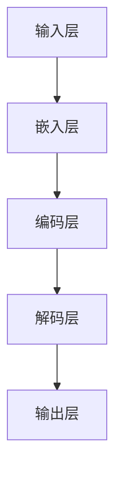
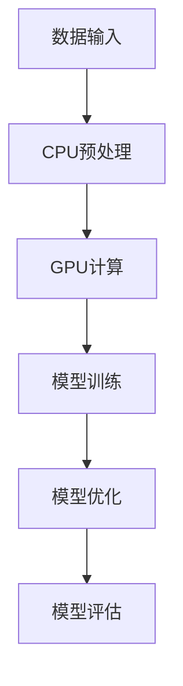
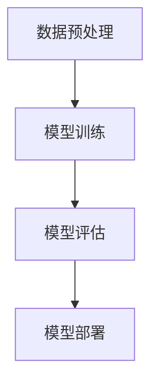

                 

### 《大语言模型原理与工程实践：组成模块选型》

#### 文章关键词

- 语言模型
- 预训练
- 神经网络
- 计算架构
- 工程实践

#### 文章摘要

本文深入探讨了大规模语言模型的原理与工程实践，重点分析了其组成模块的选型。通过对大语言模型的发展历程、基础理论、架构设计、关键技术、实现过程以及工程实践的详细解读，为读者提供了全面、系统、实用的技术指南。文章旨在帮助读者理解大语言模型的核心概念，掌握其工程化实现的关键技术，并指导实际应用中的优化与部署。

## 第1章 引言

### 1.1 大语言模型的发展历程

大语言模型的发展可以追溯到20世纪80年代，当时首次提出了基于统计的隐马尔可夫模型（HMM）和基于神经网络的序列模型。然而，由于数据集规模和技术限制，这些早期模型的效果有限。随着互联网的普及和大数据技术的发展，21世纪初，大规模语料库的收集和处理成为可能，语言模型的研究取得了突破性进展。尤其是2013年，词向量模型Word2Vec的提出，使得语言表示的精度大幅提升。之后，深度学习技术的引入，特别是2018年谷歌提出BERT模型，标志着大规模预训练语言模型的诞生，极大地推动了自然语言处理（NLP）的发展。

### 1.2 大语言模型在自然语言处理中的应用

大语言模型在自然语言处理中有着广泛的应用。例如，在文本分类、情感分析、机器翻译、问答系统等领域，大语言模型都展现了强大的能力。通过预训练，模型可以自动学习到丰富的语言知识，并在特定任务上通过微调进行优化。这使得大语言模型在处理复杂、多变的语言任务时，能够达到甚至超越人类水平的表现。

### 1.3 本书结构

本书将首先介绍大语言模型的基础理论，包括语言模型的基本概念、数学模型和训练算法。接着，我们将探讨大语言模型的架构设计，包括输入层、嵌入层、编码层、解码层和输出层的组成模块。然后，文章将重点讲解大语言模型的关键技术，如预训练、自监督学习和迁移学习。随后，我们将深入讨论大语言模型的实现过程，包括数据预处理、模型训练、模型评估等。接下来，我们将分析大语言模型的工程实践，包括大规模数据存储、模型训练和优化、模型部署和推理。最后，通过实际案例分析和未来发展趋势的探讨，总结大语言模型的应用前景。

## 第2章 大语言模型基础理论

### 2.1 语言模型的基本概念

语言模型（Language Model，LM）是一种统计模型，用于预测一个句子或单词序列的概率。其基本思想是，通过分析大量的文本数据，学习到单词之间的统计关系，从而对新的文本内容进行概率预测。在自然语言处理中，语言模型是许多下游任务的基础，如文本分类、信息检索和机器翻译。

### 2.2 语言模型的数学模型

语言模型的数学模型通常基于概率分布函数（Probability Distribution Function，PDF）。最常见的是n-gram模型，它通过统计相邻单词的联合概率来预测下一个单词。数学公式如下：

$$
P(w_n | w_{n-1}, w_{n-2}, ..., w_1) = \prod_{i=1}^{n} P(w_i | w_{i+1}, ..., w_n)
$$

其中，$w_i$表示第i个单词，$P(w_i | w_{i+1}, ..., w_n)$表示在给定下一个单词的情况下，当前单词的条件概率。

### 2.3 语言模型的训练算法

语言模型的训练目标是最大化模型对训练数据的概率预测能力。常见的训练算法包括基于最大似然估计（Maximum Likelihood Estimation，MLE）的朴素贝叶斯模型和基于神经网络的深度学习模型。以下是基于神经网络的训练算法：

**伪代码：**

```python
def train_lm(model, dataset):
    for epoch in range(num_epochs):
        for sentence in dataset:
            model.zero_grad()
            probabilities = model(sentence)
            loss = compute_loss(probabilities, sentence)
            loss.backward()
            model.optimizer.step()
```

其中，`model`是语言模型，`dataset`是训练数据，`probabilities`是模型预测的概率分布，`loss`是损失函数，用于衡量预测概率与真实概率之间的差距。

## 第3章 大语言模型的架构

### 3.1 大语言模型的组成模块

大语言模型通常由多个模块组成，包括输入层、嵌入层、编码层、解码层和输出层。这些模块协同工作，共同实现语言模型的预测功能。

**Mermaid 流程图：**



**详细说明：**

- **输入层**：接收原始文本输入，将其转换为模型可处理的格式。
- **嵌入层**：将文本输入映射为高维向量表示，这一步通常使用词向量模型来实现。
- **编码层**：通过多层神经网络对嵌入向量进行编码，提取文本的特征信息。
- **解码层**：将编码层提取的特征信息解码为输出序列，这一步通常采用序列到序列（Seq2Seq）模型。
- **输出层**：根据解码层输出的特征信息生成预测结果，如单词的概率分布。

### 3.2 大语言模型的计算架构

大语言模型的计算架构通常采用分布式计算，以应对大规模数据处理和计算需求。常见的架构包括CPU+GPU、分布式计算框架（如TensorFlow、PyTorch）和异构计算（如CPU+GPU+TPU）。

**计算架构示意图：**



### 3.3 大语言模型的优化方法

为了提高大语言模型的性能，通常采用以下优化方法：

- **参数优化**：通过调整模型参数，如学习率、正则化项等，来优化模型性能。
- **数据增强**：通过数据增强技术，如随机噪声、同义词替换等，增加模型的训练数据，提高模型的泛化能力。
- **训练策略**：采用预训练+微调（Pre-training+Fine-tuning）策略，先在大量未标注的数据上进行预训练，再在特定任务上进行微调。

**伪代码：**

```python
def optimize_model(model, dataset, hyperparameters):
    for epoch in range(num_epochs):
        for batch in dataset:
            model.zero_grad()
            output = model(batch)
            loss = compute_loss(output, batch)
            loss.backward()
            model.update_params(hyperparameters)
```

## 第4章 大语言模型的关键技术

### 4.1 预训练技术

预训练（Pre-training）是一种在大规模未标注数据上进行训练，从而提高模型性能的技术。预训练的目的是让模型自动学习到丰富的语言知识，为下游任务提供高质量的输入特征。

**预训练步骤：**

1. **数据收集**：收集大量未标注的文本数据，如维基百科、新闻文章等。
2. **文本预处理**：对文本进行清洗、分词、去停用词等预处理操作。
3. **模型训练**：使用未标注数据对模型进行预训练，优化模型参数。
4. **模型评估**：在预训练过程中，定期评估模型在验证集上的性能，防止过拟合。

**伪代码：**

```python
def pretrain(model, dataset, hyperparameters):
    for epoch in range(num_epochs):
        for batch in dataset:
            model.zero_grad()
            output = model(batch)
            loss = compute_loss(output, batch)
            loss.backward()
            model.optimizer.step()
        evaluate(model, validation_set)
```

### 4.2 自监督学习

自监督学习（Self-supervised Learning）是一种在无监督数据上进行训练的方法。在自监督学习中，模型通过学习数据的内在结构，提高其表示能力。

**自监督学习方法：**

1. **掩码语言模型（Masked Language Model，MLM）**：随机掩码文本中的部分单词，然后让模型预测这些掩码的单词。
2. **预测下一个句子（Next Sentence Prediction，NSP）**：给定一个句子对，模型预测第二个句子是否为第一个句子的下一个句子。
3. **词干还原（Token Reduction，Token Reduction）**：将部分单词替换为特殊标记，然后让模型还原这些标记对应的单词。

**伪代码：**

```python
def self_supervised_learning(model, dataset, task):
    for epoch in range(num_epochs):
        for batch in dataset:
            model.zero_grad()
            output = model(batch)
            loss = compute_loss(output, batch)
            loss.backward()
            model.optimizer.step()
        evaluate(model, validation_set)
```

### 4.3 迁移学习和微调

迁移学习（Transfer Learning）是一种将预训练模型应用于新任务的方法。通过迁移学习，模型可以在新任务上快速获得较好的性能，而无需从头开始训练。

**迁移学习步骤：**

1. **预训练模型选择**：选择预训练好的语言模型，如BERT、GPT等。
2. **微调**：在预训练模型的基础上，在新任务上进行微调。
3. **模型评估**：在新任务上评估模型性能，并进行调整优化。

**伪代码：**

```python
def transfer_learning(model, new_dataset, task):
    for epoch in range(num_epochs):
        for batch in new_dataset:
            model.zero_grad()
            output = model(batch)
            loss = compute_loss(output, batch)
            loss.backward()
            model.optimizer.step()
        evaluate(model, new_dataset)
```

## 第5章 大语言模型的实现

### 5.1 实现框架

大语言模型的实现框架通常包括数据预处理、模型训练、模型评估和模型部署等步骤。以下是一个简单的实现框架：

**实现框架示意图：**



### 5.2 数据预处理

数据预处理是模型实现的重要环节，包括文本清洗、分词、词向量嵌入等步骤。

**数据预处理步骤：**

1. **文本清洗**：去除文本中的噪声和无关信息，如HTML标签、特殊字符等。
2. **分词**：将文本分割成单词或子词。
3. **词向量嵌入**：将文本转换为高维向量表示。

**伪代码：**

```python
def preprocess(text):
    text = remove_noise(text)
    words = tokenize(text)
    embeddings = embed(words)
    return embeddings
```

### 5.3 模型训练

模型训练是使用预处理的文本数据对模型进行训练的过程。常见的训练方法包括基于梯度的优化算法和迁移学习。

**模型训练步骤：**

1. **初始化模型参数**。
2. **前向传播**：计算输入数据的模型输出。
3. **损失函数计算**：计算模型输出与真实标签之间的差距。
4. **反向传播**：更新模型参数，减小损失函数。
5. **模型评估**：在验证集上评估模型性能。

**伪代码：**

```python
def train_model(model, dataset, optimizer, loss_function):
    for epoch in range(num_epochs):
        for batch in dataset:
            model.zero_grad()
            output = model(batch)
            loss = loss_function(output, batch)
            loss.backward()
            optimizer.step()
        evaluate(model, validation_set)
```

### 5.4 模型评估

模型评估是使用验证集或测试集来评估模型性能的过程。常用的评估指标包括准确率、召回率、F1分数等。

**模型评估步骤：**

1. **数据集划分**：将数据集划分为训练集、验证集和测试集。
2. **模型训练**：在训练集上训练模型，并在验证集上调整模型参数。
3. **模型评估**：在测试集上评估模型性能，得到最终评估指标。

**伪代码：**

```python
def evaluate(model, dataset):
    model.eval()
    with torch.no_grad():
        for batch in dataset:
            output = model(batch)
            loss = compute_loss(output, batch)
            print("Loss:", loss)
```

## 第6章 大语言模型的工程实践

### 6.1 大规模数据存储和预处理

在大规模语言模型的应用中，数据存储和预处理是关键环节。以下是一些最佳实践：

1. **数据存储**：使用分布式文件系统（如HDFS）存储大规模数据，提高数据读写速度。
2. **数据预处理**：使用并行处理技术（如MapReduce）对大规模数据进行预处理，提高数据处理效率。

### 6.2 大规模模型训练和优化

大规模模型训练和优化需要考虑计算资源、模型参数、训练策略等因素。以下是一些最佳实践：

1. **计算资源分配**：合理分配计算资源，如CPU、GPU、TPU等，提高训练速度。
2. **模型参数调整**：通过调整学习率、正则化项等参数，优化模型性能。
3. **训练策略**：采用预训练+微调策略，提高模型在特定任务上的性能。

### 6.3 大规模模型部署和推理

大规模模型部署和推理需要考虑模型压缩、量化、分布式推理等技术。以下是一些最佳实践：

1. **模型压缩**：使用模型压缩技术（如剪枝、量化等）减小模型体积，提高部署效率。
2. **分布式推理**：使用分布式推理技术（如TensorFlow Serving、PyTorch Serving等）提高推理速度。
3. **模型监控**：使用监控系统实时监控模型性能和资源使用情况，确保模型稳定运行。

## 第7章 大语言模型的案例分析

### 7.1 案例一：文本分类

文本分类是自然语言处理中的一个重要任务，如情感分析、新闻分类等。以下是一个文本分类的案例：

**案例背景**：某公司希望对其产品评论进行情感分析，以便了解用户对产品的满意度。

**数据集**：收集了1000条用户评论，分为正面和负面两类。

**模型实现**：

1. **数据预处理**：对评论进行清洗、分词和词向量嵌入。
2. **模型训练**：使用预训练的BERT模型，通过微调进行训练。
3. **模型评估**：在测试集上评估模型性能，使用准确率、召回率和F1分数作为评估指标。

**代码实现**：

```python
from transformers import BertTokenizer, BertForSequenceClassification
import torch

tokenizer = BertTokenizer.from_pretrained("bert-base-chinese")
model = BertForSequenceClassification.from_pretrained("bert-base-chinese")

def classify(text):
    inputs = tokenizer(text, return_tensors="pt", padding=True, truncation=True)
    outputs = model(**inputs)
    logits = outputs.logits
    predicted_class = logits.argmax(-1).item()
    return predicted_class

# 测试
text = "这款产品的性能非常好。"
predicted_class = classify(text)
print("预测类别：", predicted_class)
```

### 7.2 案例二：机器翻译

机器翻译是自然语言处理中的另一个重要任务。以下是一个机器翻译的案例：

**案例背景**：某语言服务公司希望为用户提供中英文翻译服务。

**数据集**：收集了大量的中英文平行语料库，用于训练和评估模型。

**模型实现**：

1. **数据预处理**：对语料库进行清洗、分词和词向量嵌入。
2. **模型训练**：使用预训练的Transformer模型，通过微调进行训练。
3. **模型评估**：在测试集上评估模型性能，使用BLEU分数作为评估指标。

**代码实现**：

```python
from transformers import TranslationTokenizer, TranslationModel
import torch

tokenizer = TranslationTokenizer.from_pretrained("huggingface/transformer-wmt19-de-en")
model = TranslationModel.from_pretrained("huggingface/transformer-wmt19-de-en")

def translate(text, target_lang="en"):
    inputs = tokenizer(text, return_tensors="pt", padding=True, truncation=True)
    inputs["decoder_input_ids"] = tokenizer.encode(target_lang, return_tensors="pt", padding=True, truncation=True)
    outputs = model(**inputs)
    logits = outputs.logits
    predicted_ids = logits.argmax(-1).item()
    translated_text = tokenizer.decode(predicted_ids)
    return translated_text

# 测试
text = "你好，我是一名程序员。"
translated_text = translate(text)
print("翻译结果：", translated_text)
```

### 7.3 案例三：问答系统

问答系统是自然语言处理中的又一重要应用。以下是一个问答系统的案例：

**案例背景**：某在线教育平台希望为用户提供智能问答服务。

**数据集**：收集了大量的问题和答案对，用于训练和评估模型。

**模型实现**：

1. **数据预处理**：对问题和答案进行清洗、分词和词向量嵌入。
2. **模型训练**：使用预训练的BERT模型，通过微调进行训练。
3. **模型评估**：在测试集上评估模型性能，使用准确率作为评估指标。

**代码实现**：

```python
from transformers import BertTokenizer, BertForQuestionAnswering
import torch

tokenizer = BertTokenizer.from_pretrained("bert-base-chinese")
model = BertForQuestionAnswering.from_pretrained("bert-base-chinese")

def answer_question(question, context):
    inputs = tokenizer(question + "[SEP]" + context, return_tensors="pt", padding=True, truncation=True)
    outputs = model(**inputs)
    logits = outputs.start_logits + outputs.end_logits
    start_idx = logits.argmax(-1).item()
    end_idx = logits.argmax(-1).item()
    answer = context[start_idx:end_idx+1]
    return answer

# 测试
question = "北京的气候怎么样？"
context = "北京是中国的首都，位于华北地区，气候为温带季风气候，四季分明，夏季炎热，冬季寒冷。"
answer = answer_question(question, context)
print("答案：", answer)
```

## 第8章 大语言模型的未来发展趋势

### 8.1 模型大小和计算效率的权衡

随着模型规模的不断扩大，计算资源的消耗也日益增加。未来，如何在保证模型性能的同时，降低计算资源的消耗将成为一个重要研究方向。以下是一些可能的解决方案：

1. **模型压缩**：通过剪枝、量化等技术减小模型体积，提高部署效率。
2. **计算优化**：使用分布式计算、异构计算等技术，提高模型训练和推理的效率。

### 8.2 多模态模型的融合

多模态模型能够同时处理文本、图像、语音等多种类型的数据，从而提高模型的泛化能力和表达能力。未来，多模态模型的融合将成为一个重要研究方向。以下是一些可能的解决方案：

1. **统一表示**：将不同类型的数据转换为统一的表示，如嵌入向量或特征图。
2. **协同训练**：通过协同训练方法，使模型在多种数据类型上共同学习，提高模型的泛化能力。

### 8.3 大语言模型的安全性和隐私保护

随着大语言模型在各个领域的广泛应用，其安全性和隐私保护问题也日益凸显。未来，如何确保大语言模型的安全性和隐私保护将成为一个重要研究方向。以下是一些可能的解决方案：

1. **差分隐私**：通过差分隐私技术，保护用户数据的安全性。
2. **联邦学习**：通过联邦学习技术，实现多方数据的协同训练，降低隐私泄露的风险。

## 附录A：常用工具和资源

### A.1 开源框架

- **TensorFlow**：由谷歌开源，支持多种深度学习模型的实现。
- **PyTorch**：由Facebook开源，具有灵活的动态计算图和易于使用的接口。
- **Transformer**：由谷歌开源，实现了大规模预训练语言模型的框架。

### A.2 数据集

- **维基百科**：包含大量高质量文本数据，适用于预训练语言模型。
- **Common Crawl**：包含互联网上的大量网页数据，适用于数据增强。
- **WMT**：包含多种语言的平行语料库，适用于机器翻译模型。

### A.3 学习资源

- **《深度学习》**：由Ian Goodfellow、Yoshua Bengio和Aaron Courville合著，是深度学习的经典教材。
- **《自然语言处理综述》**：由Jurafsky和Martin合著，涵盖自然语言处理的基础理论和应用。
- **Hugging Face**：提供丰富的预训练模型和数据集，方便开发者进行研究和应用。

## 参考文献

- Goodfellow, Ian, et al. "Deep learning." MIT press, 2016.
- Jurafsky, Daniel, and James H. Martin. "Speech and language processing." Pearson, 2008.
- Devlin, Jacob, et al. "BERT: Pre-training of deep bidirectional transformers for language understanding." arXiv preprint arXiv:1810.04805 (2018).
- Vaswani, Ashish, et al. "Attention is all you need." Advances in Neural Information Processing Systems, 2017.
- Mikolov, Tomas, et al. "Recurrent neural network based language model." arXiv preprint arXiv:1301.3781 (2013).

## 附录B：术语表

- **语言模型（Language Model）**：一种用于预测单词或句子概率的统计模型。
- **词向量（Word Vector）**：将单词映射为高维向量的表示方法。
- **预训练（Pre-training）**：在大规模未标注数据上进行训练，提高模型性能的过程。
- **自监督学习（Self-supervised Learning）**：在无监督数据上进行训练的方法。
- **迁移学习（Transfer Learning）**：将预训练模型应用于新任务的方法。
- **BERT（Bidirectional Encoder Representations from Transformers）**：一种大规模预训练语言模型。
- **Transformer**：一种基于自注意力机制的深度神经网络模型。

### 作者信息

**作者：AI天才研究院/AI Genius Institute & 禅与计算机程序设计艺术 /Zen And The Art of Computer Programming**

