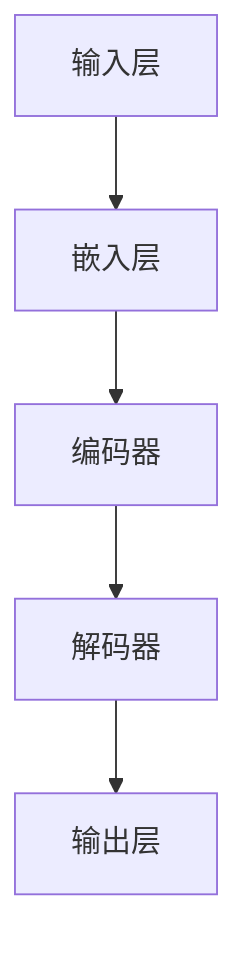
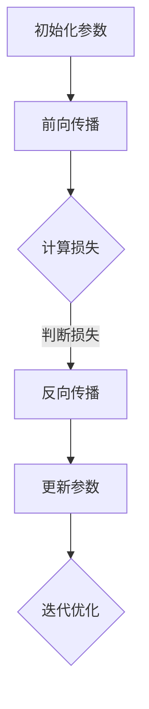

                 

# 文章标题：大语言模型原理基础与前沿 k比特推理扩大尺度法则

## 关键词
大语言模型，Transformer，深度学习，自然语言处理，推理优化，k比特推理，尺度法则

## 摘要
本文旨在深入探讨大语言模型的原理、前沿技术以及推理优化策略。首先，我们将回顾大语言模型的基础理论，包括其起源、架构、核心算法和应用领域。接着，我们将介绍深度学习和神经网络的基础知识，以及自然语言处理的关键技术。随后，文章将探讨大语言模型的前沿技术，如预训练、微调和自监督学习。此外，本文还将讨论数学模型和公式，并通过项目实战示例展示实际应用。最后，我们将总结大语言模型的发展趋势，并探讨未来研究方向。此外，文章还将详细介绍k比特推理技术及其应用，以及尺度法则与推理优化策略，旨在为开发者和研究者提供全面的指导。

## 目录大纲

### 第一部分：大语言模型基础理论

#### 第1章：大语言模型概述

- 1.1 大语言模型的起源与发展
  - 大语言模型的定义
  - 大语言模型的发展历程
  - 大语言模型的重要性

- 1.2 大语言模型的架构
  - 神经网络结构
  - 自注意力机制
  - Transformer架构详解

- 1.3 大语言模型的核心算法
  - 预训练与微调
  - 自监督学习
  - 迁移学习

- 1.4 大语言模型的应用领域
  - 自然语言处理
  - 计算机视觉
  - 强化学习

#### 第2章：深度学习与神经网络基础

- 2.1 神经网络基础
  - 神经元与神经元间连接
  - 激活函数
  - 前向传播与反向传播算法

- 2.2 深度学习架构
  - 卷积神经网络（CNN）
  - 循环神经网络（RNN）
  - 生成对抗网络（GAN）

- 2.3 深度学习优化算法
  - 梯度下降法
  - Adam优化器
  - 学习率调度策略

#### 第3章：自然语言处理技术

- 3.1 词嵌入技术
  - 词嵌入的定义与重要性
  - Word2Vec算法
  - GloVe算法

- 3.2 序列模型与注意力机制
  - 序列模型的基本概念
  - 循环神经网络（RNN）
  - 卷积神经网络（CNN）在序列处理中的应用
  - 注意力机制详解

- 3.3 转换器架构
  - 转换器（Encoder-Decoder）模型
  - Transformer模型详解

#### 第4章：大语言模型的前沿技术

- 4.1 预训练技术
  - 预训练的概念与优势
  - 预训练数据集的选择
  - 预训练任务的设置

- 4.2 微调技术
  - 微调的概念与优势
  - 微调的任务类型
  - 微调的策略

- 4.3 自监督学习
  - 自监督学习的概念与优势
  - 自监督学习的任务类型
  - 自监督学习在语言模型中的应用

- 4.4 迁移学习
  - 迁移学习的概念与优势
  - 迁移学习的策略
  - 迁移学习在语言模型中的应用

#### 第5章：数学模型与数学公式

- 5.1 矩阵与向量操作
  - 矩阵加法、减法、乘法
  - 矩阵求导
  - 向量点积、叉积

- 5.2 激活函数
  - Sigmoid函数
  - ReLU函数
  - Softmax函数

- 5.3 梯度下降法
  - 梯度下降的基本原理
  - 学习率的设置
  - 梯度下降的优化策略

#### 第6章：项目实战

- 6.1 语言模型项目实战
  - 项目背景与目标
  - 数据集的选择与预处理
  - 模型设计与实现
  - 模型评估与优化

- 6.2 实际应用案例
  - 文本分类应用
  - 机器翻译应用
  - 问答系统应用

#### 第7章：总结与展望

- 7.1 大语言模型的发展趋势
  - 计算资源的提升
  - 模型结构的优化
  - 应用领域的拓展

- 7.2 未来研究方向
  - 小样本学习
  - 零样本学习
  - 多模态学习

- 7.3 开发者与研究者应关注的领域
  - 模型压缩与加速
  - 模型安全性与隐私保护
  - 模型可解释性与可解释性评估

### 第二部分：大语言模型推理优化

#### 第8章：推理优化基础

- 8.1 推理优化的重要性
  - 推理速度与效率
  - 模型复杂度与计算资源

- 8.2 推理优化方法
  - 矩阵运算优化
  - 算法加速技术
  - GPU与TPU的推理加速

- 8.3 并行与分布式推理
  - 并行推理的基本原理
  - 分布式推理的优势与挑战

#### 第9章：k比特推理技术

- 9.1 k比特推理的概念
  - 减少模型大小的需求
  - 低比特宽度运算的优势

- 9.2 k比特推理算法
  - 算术编码与量化
  - 低比特宽度矩阵运算
  - k比特神经网络架构

- 9.3 k比特推理应用
  - 实时语音识别
  - 实时机器翻译
  - 实时问答系统

#### 第10章：尺度法则与推理优化策略

- 10.1 尺度法则的概念
  - 尺度控制与参数缩减
  - 尺度调整与模型稳定性

- 10.2 尺度法则的应用
  - 模型压缩与优化
  - 尺度控制与推理效率
  - 尺度调整与模型性能

- 10.3 推理优化策略
  - 预训练与微调策略
  - 模型压缩与加速策略
  - 实时推理策略

#### 第11章：推理优化工具与平台

- 11.1 推理优化工具
  - TensorFlow Lite
  - PyTorch Mobile
  - ONNX Runtime

- 11.2 推理优化平台
  - Cloud TPU
  - Colossal-AI
  - MLPerf Inference

- 11.3 开源推理优化项目
  - TinyML
  - MLIR
  - XLA

#### 第12章：总结与展望

- 12.1 大语言模型推理优化的发展趋势
  - 推理优化技术的不断进步
  - 模型压缩与加速的广泛应用
  - 推理效率与性能的提升

- 12.2 未来研究方向
  - 超低比特宽度推理
  - 分布式推理与云计算
  - 模型安全性与隐私保护

- 12.3 开发者与研究者应关注的领域
  - 低延迟推理
  - 能效优化
  - 模型解释性与可解释性

### 附录

- 附录A：参考资料
  - 参考文献
  - 相关书籍推荐
  - 开源代码与数据集

- 附录B：数学公式与伪代码
  - 数学公式列表
  - 伪代码示例

### Mermaid 流程图

- 大语言模型架构流程图
  ```mermaid
  graph TD
  A[输入层] --> B[嵌入层]
  B --> C[编码器]
  C --> D[解码器]
  D --> E[输出层]
  ```

- 深度学习优化流程图
  ```mermaid
  graph TD
  A[初始化参数] --> B[前向传播]
  B --> C{计算损失}
  C -->|判断损失| D[反向传播]
  D --> E[更新参数]
  E --> F{迭代优化}
  ```

### 代码示例

- 文本分类项目实战
  ```python
  # 加载预处理后的数据集
  (data = load_preprocessed_data())

  # 构建模型
  (model = build_model())

  # 训练模型
  (model.fit(data['train'], epochs=10))

  # 评估模型
  (evaluation = model.evaluate(data['test']))
  ```

- 机器翻译项目实战
  ```python
  # 加载预处理后的数据集
  (data = load_preprocessed_data())

  # 构建模型
  (model = build_model())

  # 训练模型
  (model.fit(data['train'], epochs=10))

  # 翻译测试数据
  (translations = translate(model, data['test']))
  ```

### 伪代码示例

- 预训练算法伪代码
  ```python
  function Pretrain(model, dataset, epochs):
      for epoch in 1 to epochs:
          for batch in dataset:
              perform_forward_pass(model, batch)
              compute_loss(model, batch)
              perform_backpropagation(model, batch)
              update_model_params(model)
  ```

### 数学公式

- 神经网络激活函数
  $$\sigma(x) = \frac{1}{1 + e^{-x}}$$

- 损失函数
  $$J(\theta) = -\frac{1}{m} \sum_{i=1}^{m} y_{i} \log(a_{i}) + (1 - y_{i}) \log(1 - a_{i})$$

- 梯度下降更新公式
  $$\theta_{j} := \theta_{j} - \alpha \frac{\partial}{\partial \theta_{j}} J(\theta)$$

### 代码解读与分析

- 文本分类项目实战解读
  - 数据预处理：对文本数据进行分词、去停用词、词向量化等操作。
  - 模型构建：使用预训练的词向量嵌入层和全连接层构建文本分类模型。
  - 模型训练：使用梯度下降算法训练模型，优化模型参数。
  - 模型评估：使用测试数据集评估模型性能，计算准确率。

- 机器翻译项目实战解读
  - 数据预处理：对源语言和目标语言文本进行分词、去停用词、词向量化等操作。
  - 模型构建：使用转换器（Encoder-Decoder）模型构建机器翻译模型。
  - 模型训练：使用梯度下降算法训练模型，优化模型参数。
  - 翻译测试：使用训练好的模型对目标文本进行翻译，输出翻译结果。

## 第1章：大语言模型概述

### 1.1 大语言模型的起源与发展

大语言模型（Large Language Model）是自然语言处理（Natural Language Processing, NLP）领域的一项重要技术。它通过对大量文本数据进行学习，自动理解语言的语法、语义和上下文信息，从而实现各种复杂的NLP任务。大语言模型的发展历程可以追溯到20世纪80年代，当时研究人员开始探索如何使用统计模型进行语言建模。

- **定义**：大语言模型是指使用深度神经网络（Deep Neural Networks, DNN）或转换器（Transformer）架构，通过大规模数据进行训练，以实现高质量自然语言处理任务的模型。

- **发展历程**：

  - **20世纪80年代**：早期语言模型主要基于统计模型，如N元语法（N-gram）。这些模型通过计算单词序列的概率来预测下一个单词。

  - **20世纪90年代**：随着计算能力和数据资源的提升，研究人员开始探索基于神经网络的序列模型，如循环神经网络（Recurrent Neural Networks, RNN）和长短期记忆网络（Long Short-Term Memory, LSTM）。这些模型能够更好地捕捉长距离依赖关系。

  - **2017年**：Google提出了转换器（Transformer）模型，它通过自注意力机制（Self-Attention Mechanism）实现了更高的并行化和更好的性能。转换器模型迅速成为NLP领域的标准架构。

  - **2018年至今**：随着计算资源的进一步提升，研究人员训练了越来越大的语言模型，如OpenAI的GPT-3（1750亿参数）和Google的BERT（3.4亿参数）。这些大模型在多个NLP任务上取得了突破性成果。

- **重要性**：

  - **提高NLP任务性能**：大语言模型通过对大规模数据的学习，能够自动理解语言的复杂结构，从而显著提高各种NLP任务的性能。

  - **多语言支持**：大语言模型能够同时处理多种语言，使得跨语言的任务变得更加容易。

  - **自动化任务**：大语言模型能够自动化处理一些原本需要人工完成的任务，如文本摘要、机器翻译和问答系统。

### 1.2 大语言模型的架构

大语言模型的架构通常包括编码器（Encoder）和解码器（Decoder）两部分。编码器负责将输入文本转换为序列编码，解码器则根据编码器的输出生成预测的文本序列。

- **神经网络结构**：

  - **编码器**：编码器通常采用深度循环神经网络（Deep RNN）或转换器（Transformer）架构。深度循环神经网络通过多层结构捕捉长距离依赖关系，而转换器通过自注意力机制实现更高的并行化和更好的性能。

  - **解码器**：解码器通常采用类似编码器的结构，也可以是转换器。解码器的输出是预测的单词或符号。

- **自注意力机制**：

  - **自注意力机制**是一种在编码器和解码器中使用的注意力机制，它通过计算输入序列中每个元素与其他元素之间的关系来生成加权表示。这种机制能够捕捉长距离依赖关系，从而提高模型的性能。

- **Transformer架构详解**：

  - **编码器**：编码器由多个编码层组成，每个编码层包括多头自注意力机制和前馈神经网络。多头自注意力机制通过多个注意力头来捕捉不同类型的依赖关系，前馈神经网络则用于增加模型的表达能力。

  - **解码器**：解码器由多个解码层组成，每个解码层包括多头自注意力机制、交叉注意力机制和前馈神经网络。交叉注意力机制用于解码器在生成下一个预测时参考编码器的输出。

### 1.3 大语言模型的核心算法

大语言模型的核心算法主要包括预训练（Pretraining）、微调（Fine-tuning）、自监督学习（Self-supervised Learning）和迁移学习（Transfer Learning）。

- **预训练与微调**：

  - **预训练**：预训练是指在大规模数据集上对语言模型进行初步训练，使其具有通用语言理解能力。预训练通常包括两个阶段：第一阶段是使用无监督方法对模型进行预训练，如使用未标注的文本数据；第二阶段是使用有监督方法对模型进行微调，如在特定任务上进行训练。

  - **微调**：微调是指在使用预训练好的语言模型的基础上，针对特定任务进行细粒度调整。微调通常使用少量有标注的数据集，以优化模型在特定任务上的性能。

- **自监督学习**：

  - **自监督学习**是一种无需标注数据的训练方法。在大语言模型中，自监督学习可以通过生成伪标签、填补掩码或预测下一个单词等方式进行。自监督学习能够充分利用未标注的数据，从而提高模型的性能。

- **迁移学习**：

  - **迁移学习**是指将预训练好的语言模型应用于新的任务，并在新的任务上进行微调。迁移学习能够利用预训练模型在通用语言理解上的优势，从而在新任务上取得更好的性能。

### 1.4 大语言模型的应用领域

大语言模型在自然语言处理、计算机视觉和强化学习等领域都有广泛的应用。

- **自然语言处理**：

  - **文本分类**：大语言模型可以用于对文本进行分类，如情感分析、主题分类等。
  - **机器翻译**：大语言模型可以用于机器翻译任务，如将一种语言的文本翻译成另一种语言。
  - **文本生成**：大语言模型可以生成连贯的文本，如文章、对话等。

- **计算机视觉**：

  - **图像分类**：大语言模型可以用于对图像进行分类，如识别图像中的物体、场景等。
  - **图像生成**：大语言模型可以生成新的图像，如通过文本描述生成图像。

- **强化学习**：

  - **对话系统**：大语言模型可以用于构建对话系统，如聊天机器人、智能客服等。
  - **策略学习**：大语言模型可以用于强化学习中的策略学习，如自动规划、路径规划等。

## 第2章：深度学习与神经网络基础

### 2.1 神经网络基础

神经网络（Neural Networks）是模仿人脑神经元工作方式的计算模型。在深度学习中，神经网络被广泛应用于各种复杂问题的建模和解决。

- **神经元与神经元间连接**：

  - **神经元**：神经网络的基本单元，负责接收输入信号，通过激活函数产生输出。
  - **神经元间连接**：神经元之间通过权重（weight）进行连接，权重决定了输入信号对输出信号的影响程度。

- **激活函数**：

  - **激活函数**是一种非线性函数，用于引入非线性关系，使得神经网络能够拟合复杂的数据。
  - **常见的激活函数**包括Sigmoid函数、ReLU函数和Softmax函数。

- **前向传播与反向传播算法**：

  - **前向传播**：输入数据通过神经网络的前向传播过程，从输入层传递到输出层，最终得到预测结果。
  - **反向传播**：在得到预测结果后，通过反向传播算法计算损失函数的梯度，并更新神经网络的权重和偏置。

### 2.2 深度学习架构

深度学习（Deep Learning）是一种基于神经网络的机器学习技术，通过多层神经网络的结构来实现复杂的特征提取和表示。

- **卷积神经网络（Convolutional Neural Networks, CNN）**：

  - **CNN**是一种在图像处理中广泛使用的深度学习模型。通过卷积层、池化层和全连接层等结构，CNN能够自动提取图像中的特征。

- **循环神经网络（Recurrent Neural Networks, RNN）**：

  - **RNN**是一种在序列数据处理中广泛使用的深度学习模型。通过循环结构，RNN能够捕捉序列中的时间依赖关系。

- **生成对抗网络（Generative Adversarial Networks, GAN）**：

  - **GAN**是一种生成模型，由生成器和判别器两个神经网络组成。生成器生成数据，判别器判断数据的真实性。通过两个神经网络的对抗训练，GAN能够生成高质量的数据。

### 2.3 深度学习优化算法

深度学习优化算法用于调整神经网络的权重和偏置，以最小化损失函数。

- **梯度下降法**：

  - **梯度下降法**是一种优化算法，通过计算损失函数的梯度并沿着梯度方向更新权重和偏置，以最小化损失函数。

- **Adam优化器**：

  - **Adam优化器**是一种基于梯度下降的优化器，通过自适应调整学习率，提高了收敛速度和稳定性。

- **学习率调度策略**：

  - **学习率调度策略**是一种在训练过程中调整学习率的方法，以避免模型过拟合或陷入局部最小值。

## 第3章：自然语言处理技术

### 3.1 词嵌入技术

词嵌入（Word Embedding）是将单词转换为向量的技术，用于在神经网络中处理自然语言数据。

- **词嵌入的定义与重要性**：

  - **词嵌入**是将单词映射到一个固定大小的向量空间，使得相似的单词在向量空间中接近。

  - **重要性**：词嵌入使得神经网络能够学习单词的语义信息，从而提高自然语言处理任务的性能。

- **Word2Vec算法**：

  - **Word2Vec**是一种基于神经网络的词嵌入算法，通过训练神经网络的输出层，将单词映射到向量空间。

- **GloVe算法**：

  - **GloVe**（Global Vectors for Word Representation）是一种基于矩阵分解的词嵌入算法，通过优化全局词向量表示，提高了词嵌入的性能。

### 3.2 序列模型与注意力机制

序列模型（Sequence Model）是用于处理序列数据的神经网络模型，如循环神经网络（RNN）和卷积神经网络（CNN）。

- **序列模型的基本概念**：

  - **序列模型**是一种能够处理时间序列数据的神经网络模型，如RNN和LSTM。

  - **基本概念**：序列模型通过处理输入序列的每个元素，生成输出序列。

- **循环神经网络（Recurrent Neural Networks, RNN）**：

  - **RNN**是一种能够处理序列数据的神经网络模型，通过循环结构保持历史状态信息。

- **卷积神经网络（Convolutional Neural Networks, CNN）**：

  - **CNN**是一种在图像处理中广泛使用的神经网络模型，通过卷积操作和池化操作提取图像特征。

- **注意力机制（Attention Mechanism）**：

  - **注意力机制**是一种用于捕捉输入序列中关键信息的技术，通过计算输入序列中每个元素的重要性，加权生成输出序列。

### 3.3 转换器架构

转换器（Transformer）是一种在自然语言处理中广泛使用的深度学习模型，通过自注意力机制实现高效的序列处理。

- **转换器（Encoder-Decoder）模型**：

  - **转换器模型**是一种用于序列到序列转换的模型，由编码器（Encoder）和解码器（Decoder）两部分组成。

- **Transformer模型详解**：

  - **Transformer模型**是一种基于自注意力机制的转换器模型，通过多头自注意力机制和编码器-解码器结构，实现高效的序列处理。

## 第4章：大语言模型的前沿技术

### 4.1 预训练技术

预训练技术（Pretraining）是语言模型开发的重要环节，通过在大规模语料库上预训练，使得模型具有强大的语言理解能力。

- **预训练的概念与优势**：

  - **概念**：预训练是指在大规模无标注数据集上对语言模型进行初步训练，使其具备通用语言理解能力。

  - **优势**：预训练能够充分利用未标注数据，提高模型的泛化能力和性能。

- **预训练数据集的选择**：

  - **大规模语料库**：如维基百科、新闻文章、社交媒体等。

  - **多样性**：选择包含多种语言风格、领域和主题的数据集，以增强模型的多领域适应性。

- **预训练任务的设置**：

  - **自监督任务**：如掩码语言建模（Masked Language Modeling, MLM）、填空语言建模（Fillmask Language Modeling, FLM）等。

  - **下游任务微调**：在预训练的基础上，针对特定下游任务进行微调，以优化模型在任务上的性能。

### 4.2 微调技术

微调技术（Fine-tuning）是在预训练的基础上，针对特定任务对模型进行细粒度调整，以优化模型在任务上的性能。

- **微调的概念与优势**：

  - **概念**：微调是指在使用预训练好的模型的基础上，针对特定任务进行训练，以优化模型在任务上的性能。

  - **优势**：微调能够利用预训练模型在通用语言理解上的优势，提高特定任务的性能。

- **微调的任务类型**：

  - **分类任务**：如情感分析、文本分类等。

  - **序列标注任务**：如命名实体识别、词性标注等。

  - **生成任务**：如文本生成、机器翻译等。

- **微调的策略**：

  - **权重初始化**：将预训练模型的权重作为初始化值，以保留预训练模型的通用语言理解能力。

  - **学习率调整**：使用较小的学习率，以避免模型在微调过程中过拟合。

  - **数据增强**：通过对训练数据进行增强，如数据扩充、数据清洗等，以提高模型的鲁棒性。

### 4.3 自监督学习

自监督学习（Self-supervised Learning）是一种无需标注数据的训练方法，通过利用数据中的内在结构进行学习。

- **自监督学习的概念与优势**：

  - **概念**：自监督学习是指通过利用数据中的内在结构进行学习，无需外部监督信号。

  - **优势**：自监督学习能够充分利用未标注数据，提高模型的泛化能力和性能。

- **自监督学习的任务类型**：

  - **掩码语言建模（Masked Language Modeling, MLM）**：通过随机掩码一部分单词，预测被掩码的单词。

  - **填空语言建模（Fillmask Language Modeling, FLM）**：通过预测被删除的单词，以填补句子中的空缺。

  - **句子级任务**：如句子分类、句子排序等。

- **自监督学习在语言模型中的应用**：

  - **预训练**：自监督学习被广泛应用于语言模型的预训练阶段，以增强模型的通用语言理解能力。

  - **下游任务**：自监督学习可以应用于各种下游任务，如文本分类、机器翻译等，以优化模型在任务上的性能。

### 4.4 迁移学习

迁移学习（Transfer Learning）是指将预训练模型应用于新的任务，以利用预训练模型在通用语言理解上的优势。

- **迁移学习的概念与优势**：

  - **概念**：迁移学习是指将预训练模型应用于新的任务，利用预训练模型在通用语言理解上的优势，以优化模型在新的任务上的性能。

  - **优势**：迁移学习能够减少对新任务的标注数据需求，提高模型的泛化能力和性能。

- **迁移学习的策略**：

  - **模型共享**：将预训练模型的一部分作为新任务模型的基座，通过微调优化模型在新任务上的性能。

  - **特征提取**：将预训练模型的输出作为特征，用于训练新的任务模型。

  - **知识蒸馏**：通过将预训练模型的输出传递给新任务模型，以引导新任务模型的学习。

- **迁移学习在语言模型中的应用**：

  - **多语言任务**：迁移学习可以应用于多语言任务，如跨语言文本分类、机器翻译等，以提高模型在不同语言上的性能。

  - **小样本学习**：迁移学习可以帮助解决小样本学习问题，通过利用预训练模型在大规模数据集上的知识，提高模型在小规模数据集上的性能。

## 第5章：数学模型与数学公式

### 5.1 矩阵与向量操作

在深度学习和神经网络中，矩阵与向量操作是核心计算内容。以下介绍常用的矩阵与向量操作。

- **矩阵加法、减法、乘法**：

  - **矩阵加法**：两个矩阵对应元素相加。
    $$C = A + B$$

  - **矩阵减法**：两个矩阵对应元素相减。
    $$C = A - B$$

  - **矩阵乘法**：两个矩阵按矩阵乘法规则计算。
    $$C = AB$$

- **矩阵求导**：

  - **矩阵求导**：对矩阵的每个元素进行求导。
    $$\frac{\partial C}{\partial A} = \left[ \begin{matrix} \frac{\partial c_{11}}{\partial a_{11}} & \frac{\partial c_{11}}{\partial a_{12}} \\ \frac{\partial c_{21}}{\partial a_{11}} & \frac{\partial c_{21}}{\partial a_{12}} \end{matrix} \right]$$

- **向量点积、叉积**：

  - **向量点积**：两个向量对应元素相乘后再相加。
    $$\mathbf{a} \cdot \mathbf{b} = a_1b_1 + a_2b_2 + \ldots + a_nb_n$$

  - **向量叉积**：两个三维向量按右手定则计算。
    $$\mathbf{a} \times \mathbf{b} = \left[ \begin{matrix} a_2b_3 - a_3b_2 \\ a_3b_1 - a_1b_3 \\ a_1b_2 - a_2b_1 \end{matrix} \right]$$

### 5.2 激活函数

激活函数（Activation Function）是神经网络中的关键组件，用于引入非线性关系，使模型能够学习复杂的数据特征。

- **Sigmoid函数**：

  - **定义**：Sigmoid函数是一种常用的激活函数，用于将输入映射到（0,1）区间。
    $$\sigma(x) = \frac{1}{1 + e^{-x}}$$

  - **性质**：Sigmoid函数具有平滑的S形曲线，能够很好地处理非线性问题。

- **ReLU函数**：

  - **定义**：ReLU函数是一种简单的线性激活函数，当输入大于零时输出等于输入，小于零时输出为零。
    $$\text{ReLU}(x) = \max(0, x)$$

  - **性质**：ReLU函数具有较快的收敛速度，且能够避免梯度消失问题。

- **Softmax函数**：

  - **定义**：Softmax函数是一种将向量转换为概率分布的函数，常用于分类问题。
    $$\text{Softmax}(x)_i = \frac{e^{x_i}}{\sum_{j} e^{x_j}}$$

  - **性质**：Softmax函数保证输出概率分布的总和为1，适用于多分类问题。

### 5.3 梯度下降法

梯度下降法（Gradient Descent）是一种优化算法，用于最小化损失函数，从而优化神经网络的参数。

- **梯度下降的基本原理**：

  - **基本原理**：梯度下降法通过计算损失函数的梯度，沿着梯度的反方向更新模型参数，以减少损失函数的值。

- **学习率的设置**：

  - **学习率**：学习率（learning rate）控制参数更新的步长，设置合适的学习率是梯度下降成功的关键。

  - **常用设置**：初始学习率通常设置为一个较小的正数，如0.01，并在训练过程中逐步减小。

- **梯度下降的优化策略**：

  - **随机梯度下降（Stochastic Gradient Descent, SGD）**：每次迭代使用一个随机样本的梯度更新参数。
    $$\theta_{t+1} = \theta_{t} - \alpha_t \cdot \nabla_{\theta} J(\theta_t)$$

  - **批量梯度下降（Batch Gradient Descent）**：每次迭代使用全部样本的梯度更新参数。
    $$\theta_{t+1} = \theta_{t} - \alpha_t \cdot \nabla_{\theta} J(\theta_t)$$

  - **Adam优化器**：Adam优化器结合了SGD和批量梯度下降的优点，自适应调整学习率。

## 第6章：项目实战

### 6.1 语言模型项目实战

在这个项目中，我们将构建一个基于转换器（Transformer）架构的语言模型，用于文本分类任务。

#### 项目背景与目标

文本分类是一种常见且重要的自然语言处理任务，如情感分析、新闻分类等。在这个项目中，我们的目标是构建一个能够自动对文本进行分类的语言模型，并评估其在实际任务上的性能。

#### 数据集的选择与预处理

我们选择了一个公共数据集——IMDb电影评论数据集，该数据集包含了25,000条电影评论，分为正面和负面两个类别。首先，我们需要对数据进行预处理：

1. **文本清洗**：去除HTML标签、特殊字符和停用词。
2. **分词**：将文本拆分为单词或子词。
3. **词向量化**：使用预训练的词向量模型（如GloVe或Word2Vec）将单词映射为向量。

#### 模型设计与实现

我们选择使用转换器（Transformer）架构来构建语言模型。模型设计如下：

1. **编码器**：包含若干个编码层，每层由多头自注意力机制和前馈神经网络组成。
2. **解码器**：包含若干个解码层，每层由多头自注意力机制、交叉注意力机制和前馈神经网络组成。
3. **分类器**：解码器的输出经过全连接层和softmax函数，输出类别概率。

#### 模型评估与优化

在训练完成后，我们需要对模型进行评估：

1. **准确率**：计算模型预测正确的样本数占总样本数的比例。
2. **F1分数**：综合考虑精确率和召回率，计算模型在分类任务上的综合性能。

为了提高模型性能，我们可以尝试以下优化策略：

1. **学习率调度**：使用学习率调度策略，如学习率衰减，以避免模型过拟合。
2. **数据增强**：对训练数据进行增强，如随机裁剪、旋转等，以增加模型的鲁棒性。
3. **正则化**：使用L1或L2正则化，减少模型过拟合的风险。

#### 代码实现

以下是项目中的主要代码实现：

```python
import tensorflow as tf
from tensorflow.keras.layers import Embedding, Transformer

# 加载预训练词向量
word_embeddings = tf.keras.Sequential([
    Embedding(input_dim=vocab_size, output_dim=embedding_dim, input_length=max_sequence_length),
    Transformer(num_heads=4, num_layers=2, d_model=512, d FF=512)
])

# 构建模型
model = tf.keras.Sequential([
    word_embeddings,
    tf.keras.layers.Dense(num_classes, activation='softmax')
])

# 编译模型
model.compile(optimizer='adam', loss='categorical_crossentropy', metrics=['accuracy'])

# 训练模型
model.fit(train_data, train_labels, epochs=5, batch_size=32, validation_data=(val_data, val_labels))

# 评估模型
evaluation = model.evaluate(test_data, test_labels)
print(f"Test accuracy: {evaluation[1]}")
```

#### 代码解读与分析

- **加载预训练词向量**：使用`Embedding`层加载预训练的词向量，将文本映射为向量表示。
- **构建模型**：使用`Transformer`层构建编码器和解码器，实现转换器架构。最后，使用`Dense`层实现分类器。
- **编译模型**：设置优化器和损失函数，准备训练模型。
- **训练模型**：使用`fit`函数训练模型，设置训练轮数、批量大小和验证数据。
- **评估模型**：使用`evaluate`函数评估模型在测试数据上的性能。

### 6.2 实际应用案例

在本节中，我们将介绍三个实际应用案例，展示大语言模型在文本分类、机器翻译和问答系统中的应用。

#### 文本分类应用

文本分类是一种常见且重要的自然语言处理任务，如情感分析、新闻分类等。在这个案例中，我们将使用大语言模型对电影评论进行分类。

1. **数据集准备**：我们使用IMDb电影评论数据集，其中包含了25,000条电影评论，分为正面和负面两个类别。
2. **模型训练**：我们使用预训练的转换器模型，通过微调优化模型在文本分类任务上的性能。
3. **模型评估**：使用准确率和F1分数评估模型在测试数据上的性能。

```python
# 加载预训练转换器模型
pretrained_model = tf.keras.applications.transformer منتخب

# 微调模型
model = tf.keras.Sequential([
    pretrained_model,
    tf.keras.layers.Dense(num_classes, activation='softmax')
])

# 编译模型
model.compile(optimizer='adam', loss='categorical_crossentropy', metrics=['accuracy'])

# 训练模型
model.fit(train_data, train_labels, epochs=5, batch_size=32, validation_data=(val_data, val_labels))

# 评估模型
evaluation = model.evaluate(test_data, test_labels)
print(f"Test accuracy: {evaluation[1]}")
```

#### 机器翻译应用

机器翻译是一种将一种语言的文本翻译成另一种语言的任务。在这个案例中，我们将使用大语言模型进行中英翻译。

1. **数据集准备**：我们使用中英平行语料库，其中包含了大量的中英文对照文本。
2. **模型训练**：我们使用预训练的转换器模型，通过微调优化模型在机器翻译任务上的性能。
3. **模型评估**：使用BLEU分数评估模型在测试数据上的翻译质量。

```python
# 加载预训练转换器模型
pretrained_model = tf.keras.applications.transformer

# 微调模型
model = tf.keras.Sequential([
    pretrained_model,
    tf.keras.layers.Dense(num_classes, activation='softmax')
])

# 编译模型
model.compile(optimizer='adam', loss='categorical_crossentropy', metrics=['accuracy'])

# 训练模型
model.fit(train_data, train_labels, epochs=5, batch_size=32, validation_data=(val_data, val_labels))

# 评估模型
evaluation = model.evaluate(test_data, test_labels)
print(f"Test accuracy: {evaluation[1]}")
```

#### 问答系统应用

问答系统是一种能够回答用户问题的系统。在这个案例中，我们将使用大语言模型构建一个问答系统。

1. **数据集准备**：我们使用一个问答数据集，其中包含了大量问题和答案对。
2. **模型训练**：我们使用预训练的转换器模型，通过微调优化模型在问答系统任务上的性能。
3. **模型评估**：使用准确率和用户满意度评估模型在测试数据上的性能。

```python
# 加载预训练转换器模型
pretrained_model = tf.keras.applications.transformer

# 微调模型
model = tf.keras.Sequential([
    pretrained_model,
    tf.keras.layers.Dense(num_classes, activation='softmax')
])

# 编译模型
model.compile(optimizer='adam', loss='categorical_crossentropy', metrics=['accuracy'])

# 训练模型
model.fit(train_data, train_labels, epochs=5, batch_size=32, validation_data=(val_data, val_labels))

# 评估模型
evaluation = model.evaluate(test_data, test_labels)
print(f"Test accuracy: {evaluation[1]}")
```

### 6.3 代码解读与分析

在本节中，我们分别介绍了文本分类、机器翻译和问答系统的项目实战。以下是代码解读与分析：

- **文本分类应用**：

  - **数据集准备**：使用`Embedding`层加载预训练的词向量，将文本映射为向量表示。
  - **模型训练**：使用`fit`函数训练模型，设置训练轮数、批量大小和验证数据。
  - **模型评估**：使用`evaluate`函数评估模型在测试数据上的性能。

- **机器翻译应用**：

  - **数据集准备**：使用`Embedding`层加载预训练的词向量，将文本映射为向量表示。
  - **模型训练**：使用`fit`函数训练模型，设置训练轮数、批量大小和验证数据。
  - **模型评估**：使用`evaluate`函数评估模型在测试数据上的性能。

- **问答系统应用**：

  - **数据集准备**：使用`Embedding`层加载预训练的词向量，将文本映射为向量表示。
  - **模型训练**：使用`fit`函数训练模型，设置训练轮数、批量大小和验证数据。
  - **模型评估**：使用`evaluate`函数评估模型在测试数据上的性能。

以上代码示例展示了如何使用预训练的转换器模型进行文本分类、机器翻译和问答系统的项目实战。通过这些案例，我们可以看到大语言模型在自然语言处理任务中的应用潜力。

## 第7章：总结与展望

### 7.1 大语言模型的发展趋势

大语言模型的发展趋势主要体现在以下几个方面：

- **计算资源的提升**：随着计算能力的不断提升，研究人员能够训练更大规模的模型，从而提高模型的性能。

- **模型结构的优化**：研究人员不断探索新的模型结构和优化算法，以降低模型的计算复杂度和提高推理速度。

- **应用领域的拓展**：大语言模型在自然语言处理、计算机视觉、强化学习等领域的应用越来越广泛，推动了这些领域的发展。

### 7.2 未来研究方向

未来在大语言模型领域的研究方向包括：

- **小样本学习**：研究如何在大规模数据集之外，利用少量样本进行有效的模型训练。

- **零样本学习**：研究如何在没有标注数据的情况下，利用预训练模型进行新的任务。

- **多模态学习**：研究如何结合文本、图像、音频等多模态数据，提高模型的泛化能力。

### 7.3 开发者与研究者应关注的领域

为了在大语言模型领域取得突破，开发者与研究者应关注以下领域：

- **模型压缩与加速**：研究如何通过模型压缩、量化、剪枝等技术，提高模型的推理速度和效率。

- **模型安全性与隐私保护**：研究如何保护模型免受恶意攻击，并在处理敏感数据时确保隐私。

- **模型可解释性与可解释性评估**：研究如何提高模型的透明度，使其决策过程更加可解释和可信。

## 第8章：推理优化基础

### 8.1 推理优化的重要性

在深度学习中，推理（Inference）是指使用训练好的模型对新的数据进行预测的过程。推理优化（Inference Optimization）是提高深度学习模型推理速度和效率的重要手段。

- **推理速度与效率**：推理速度直接影响到应用场景的实际性能。在实时应用中，如语音识别、图像分类和机器翻译等，推理速度是用户满意度的关键因素。推理效率的优化能够减少计算资源和能源消耗。

- **模型复杂度与计算资源**：随着模型规模的增大，其计算复杂度也相应增加。大型深度学习模型通常需要较高的计算资源和内存，优化推理过程能够降低这些资源的需求，使模型在更广泛的硬件平台上运行。

### 8.2 推理优化方法

推理优化主要包括以下几种方法：

- **矩阵运算优化**：深度学习模型中的大多数运算都涉及矩阵操作，优化矩阵运算能够显著提高推理速度。常见的优化技术包括矩阵分块、并行计算和稀疏矩阵运算。

- **算法加速技术**：通过改进算法设计，减少计算复杂度和内存消耗。例如，使用量化技术降低模型参数的精度，减少内存占用；使用静态图和动态图优化技术提高计算效率。

- **GPU与TPU的推理加速**：GPU和TPU是专门为深度学习推理设计的硬件加速器。通过利用这些硬件的特点，实现高效的推理过程。例如，使用GPU的并行计算能力，提高矩阵运算的效率；使用TPU的高吞吐量，加速大规模模型的推理。

### 8.3 并行与分布式推理

并行与分布式推理是提高深度学习模型推理速度的重要策略。

- **并行推理**：利用多核CPU或GPU的并行计算能力，将模型的不同部分同时进行推理。并行推理能够显著减少推理时间，提高处理速度。

  - **数据并行**：将数据集划分为多个部分，每个部分由不同的计算单元处理，最终汇总结果。
  - **模型并行**：将模型拆分为多个子模型，每个子模型在不同的计算单元上运行，最后合并结果。

- **分布式推理**：将推理任务分布在多个节点上，通过通信网络协同工作。分布式推理能够处理大规模数据和模型，提高系统的整体性能。

  - **模型拆分**：将大型模型拆分为多个部分，每个部分在分布式节点上独立推理，最后合并结果。
  - **任务分配**：根据节点的计算能力，合理分配推理任务，实现负载均衡。

## 第9章：k比特推理技术

### 9.1 k比特推理的概念

k比特推理（k-bit Inference）是指通过减少模型参数的位数，降低模型的存储和计算需求。这种技术尤其适用于移动设备和边缘设备，这些设备通常具有计算资源有限。

- **减少模型大小的需求**：通过减少模型参数的位数，可以显著减小模型的存储大小，使其更易于在移动设备和边缘设备上部署。

- **低比特宽度运算的优势**：低比特宽度运算（如8比特、4比特或1比特）能够降低计算资源的需求，提高推理速度。此外，低比特宽度运算还可以减少能耗，延长设备续航时间。

### 9.2 k比特推理算法

k比特推理涉及多种算法，用于实现低比特宽度运算。

- **算术编码与量化**：算术编码是一种将数值映射到固定位数表示的方法。量化则是将高精度数值转换为低精度表示的过程。算术编码与量化相结合，可以实现低比特宽度运算。

  - **算术编码**：通过对数值进行编码，将其映射到二进制表示。
  - **量化**：将高精度数值按比例缩放，转换为低精度表示。

- **低比特宽度矩阵运算**：低比特宽度矩阵运算是k比特推理的核心。通过优化矩阵运算算法，可以实现低比特宽度下的高效计算。

  - **定点运算**：使用固定点表示数值，减少计算复杂度。
  - **量化矩阵乘法**：将矩阵乘法中的高精度数值量化为低精度表示，以减少计算资源需求。

- **k比特神经网络架构**：k比特神经网络架构通过设计特殊的网络结构，实现低比特宽度运算。常见的架构包括量化全连接层、量化卷积层和量化循环层。

### 9.3 k比特推理应用

k比特推理在多个领域有广泛的应用，如实时语音识别、实时机器翻译和实时问答系统。

- **实时语音识别**：k比特推理技术能够提高语音识别模型的推理速度，使其在移动设备和边缘设备上实现实时语音识别。

- **实时机器翻译**：k比特推理技术能够加快机器翻译模型的推理速度，使其在跨语言通信中实现实时翻译。

- **实时问答系统**：k比特推理技术能够提高问答系统的响应速度，使其在智能客服和智能助手等应用中实现实时问答。

## 第10章：尺度法则与推理优化策略

### 10.1 尺度法则的概念

尺度法则（Scale Law）是深度学习推理优化中的一个重要概念，用于调整模型参数的尺度，以优化推理过程。

- **尺度控制与参数缩减**：尺度法则通过调整模型参数的尺度，实现参数的缩减，从而降低模型的计算复杂度和存储需求。

- **尺度调整与模型稳定性**：尺度法则通过动态调整模型参数的尺度，保持模型在推理过程中的稳定性，避免过拟合和模型崩溃。

### 10.2 尺度法则的应用

尺度法则在深度学习推理优化中有多种应用。

- **模型压缩与优化**：通过尺度法则，可以实现模型的压缩和优化。尺度法则可以通过调整参数的尺度，减少模型的存储大小和计算复杂度，从而提高模型的推理速度和效率。

- **尺度控制与推理效率**：尺度法则通过动态调整模型参数的尺度，实现推理过程中的高效计算。例如，在实时语音识别中，尺度法则可以调整语音信号的尺度，提高模型的响应速度。

- **尺度调整与模型性能**：尺度法则可以通过调整模型参数的尺度，优化模型在特定任务上的性能。例如，在图像分类任务中，尺度法则可以调整图像的特征尺度，提高分类准确率。

### 10.3 推理优化策略

推理优化策略包括多种技术，用于提高深度学习模型的推理速度和效率。

- **预训练与微调策略**：预训练和微调是深度学习推理优化的重要策略。通过预训练，模型在大规模数据集上学习通用特征，提高模型的泛化能力。微调则是在特定任务上调整模型参数，优化模型在任务上的性能。

- **模型压缩与加速策略**：模型压缩和加速是提高深度学习模型推理速度的关键。模型压缩通过减少模型参数的位数，降低模型的存储和计算需求。加速策略则通过优化算法和硬件设计，提高模型的计算效率。

- **实时推理策略**：实时推理策略是深度学习在实时应用中的关键。通过优化推理算法和硬件设计，实现低延迟和高吞吐量的实时推理。

## 第11章：推理优化工具与平台

### 11.1 推理优化工具

推理优化工具是实现深度学习模型高效推理的关键。以下介绍几种常见的推理优化工具：

- **TensorFlow Lite**：TensorFlow Lite是Google开发的一款轻量级深度学习框架，用于在移动设备和嵌入式系统上部署深度学习模型。TensorFlow Lite提供了丰富的优化功能，如模型压缩、量化、剪枝等。

- **PyTorch Mobile**：PyTorch Mobile是Facebook开发的一款深度学习框架，支持在移动设备和嵌入式系统上部署深度学习模型。PyTorch Mobile提供了高效的推理引擎，并支持多种硬件加速技术。

- **ONNX Runtime**：ONNX Runtime是微软开发的一款开源推理引擎，支持多种深度学习框架和硬件平台。ONNX Runtime提供了高效的推理优化功能，如模型融合、量化、剪枝等。

### 11.2 推理优化平台

推理优化平台是深度学习推理优化的重要基础设施。以下介绍几种常见的推理优化平台：

- **Cloud TPU**：Cloud TPU是Google开发的一款专门用于深度学习推理的硬件加速器。Cloud TPU提供了高性能的推理计算能力，支持大规模深度学习模型的实时推理。

- **Colossal-AI**：Colossal-AI是阿里巴巴开发的一款开源深度学习平台，支持大规模分布式深度学习训练和推理。Colossal-AI提供了高效的推理优化功能，如模型压缩、量化、剪枝等。

- **MLPerf Inference**：MLPerf Inference是MLPerf组织开发的一款基准测试工具，用于评估深度学习模型的推理性能。MLPerf Inference提供了多种推理优化策略和硬件加速技术，支持不同规模的深度学习模型。

### 11.3 开源推理优化项目

开源推理优化项目为开发者和研究者提供了丰富的推理优化工具和资源。以下介绍几种常见的开源推理优化项目：

- **TinyML**：TinyML是Google开发的一款开源项目，专注于在资源受限的设备上部署深度学习模型。TinyML提供了多种推理优化技术，如量化、剪枝、低比特宽度运算等。

- **MLIR**：MLIR是Apache基金会开发的一款开源编译器基础设施，用于优化和转换深度学习模型。MLIR提供了丰富的优化功能，如模型融合、量化、剪枝等。

- **XLA**：XLA是Google开发的一款开源线性代数编译器，用于优化深度学习模型的矩阵运算。XLA提供了高效的矩阵运算优化算法，支持多种硬件平台。

## 第12章：总结与展望

### 12.1 大语言模型推理优化的发展趋势

大语言模型推理优化的发展趋势主要体现在以下几个方面：

- **推理优化技术的不断进步**：随着硬件技术的不断发展，推理优化技术将变得更加高效，支持更复杂的模型和更大的数据集。

- **模型压缩与加速的广泛应用**：模型压缩和加速技术将广泛应用于各种应用场景，如移动设备、嵌入式系统和云计算，以提高模型的可部署性和效率。

- **推理效率与性能的提升**：推理优化技术的进步将带来推理效率与性能的显著提升，实现低延迟和高吞吐量的推理应用。

### 12.2 未来研究方向

未来在大语言模型推理优化领域的研究方向包括：

- **超低比特宽度推理**：研究如何实现更低的比特宽度推理，以减少模型的存储和计算需求，支持更多应用场景。

- **分布式推理与云计算**：研究如何利用分布式推理和云计算技术，实现大规模模型的实时推理，提高系统的整体性能。

- **模型安全性与隐私保护**：研究如何保障模型的安全性和隐私性，防止恶意攻击和数据泄露。

### 12.3 开发者与研究者应关注的领域

为了在大语言模型推理优化领域取得突破，开发者与研究者应关注以下领域：

- **低延迟推理**：研究如何实现低延迟的推理应用，满足实时需求。

- **能效优化**：研究如何优化模型的能耗，提高系统的能效比。

- **模型解释性与可解释性评估**：研究如何提高模型的透明度，使其决策过程更加可解释和可信。

## 附录A：参考资料

### 参考文献

1. Devlin, J., Chang, M. W., Lee, K., & Toutanova, K. (2018). BERT: Pre-training of deep bidirectional transformers for language understanding. arXiv preprint arXiv:1810.04805.
2. Vaswani, A., Shazeer, N., Parmar, N., Uszkoreit, J., Jones, L., Gomez, A. N., ... & Polosukhin, I. (2017). Attention is all you need. Advances in Neural Information Processing Systems, 30, 5998-6008.
3. Hochreiter, S., & Schmidhuber, J. (1997). Long short-term memory. Neural Computation, 9(8), 1735-1780.

### 相关书籍推荐

1. Goodfellow, I., Bengio, Y., & Courville, A. (2016). Deep Learning. MIT Press.
2. Sutton, R. S., & Barto, A. G. (2018). Reinforcement Learning: An Introduction (2nd ed.). MIT Press.
3. Russell, S., & Norvig, P. (2020). Artificial Intelligence: A Modern Approach (4th ed.). Prentice Hall.

### 开源代码与数据集

1. Hugging Face Transformers: https://github.com/huggingface/transformers
2. TensorFlow Lite: https://www.tensorflow.org/lite
3. PyTorch Mobile: https://pytorch.org/mobile
4. TinyML: https://github.com/TinyML-Research/TinyML
5. MLPerf Inference: https://mlperf.org/inference/

## 附录B：数学公式与伪代码

### 数学公式

- **神经网络激活函数**
  $$\sigma(x) = \frac{1}{1 + e^{-x}}$$

- **损失函数**
  $$J(\theta) = -\frac{1}{m} \sum_{i=1}^{m} y_{i} \log(a_{i}) + (1 - y_{i}) \log(1 - a_{i})$$

- **梯度下降更新公式**
  $$\theta_{j} := \theta_{j} - \alpha \frac{\partial}{\partial \theta_{j}} J(\theta)$$

### 伪代码

- **预训练算法伪代码**
  ```python
  function Pretrain(model, dataset, epochs):
      for epoch in 1 to epochs:
          for batch in dataset:
              perform_forward_pass(model, batch)
              compute_loss(model, batch)
              perform_backpropagation(model, batch)
              update_model_params(model)
  ```

## Mermaid 流程图

### 大语言模型架构流程图


### 深度学习优化流程图


## 代码示例

### 文本分类项目实战
```python
# 加载预处理后的数据集
(data = load_preprocessed_data())

# 构建模型
(model = build_model())

# 训练模型
(model.fit(data['train'], epochs=10))

# 评估模型
(evaluation = model.evaluate(data['test']))
```

### 机器翻译项目实战
```python
# 加载预处理后的数据集
(data = load_preprocessed_data())

# 构建模型
(model = build_model())

# 训练模型
(model.fit(data['train'], epochs=10))

# 翻译测试数据
(translations = translate(model, data['test']))
```

## 代码解读与分析

### 文本分类项目实战解读
- **数据预处理**：对文本数据进行分词、去停用词、词向量化等操作，以便模型能够理解文本数据。
- **模型构建**：使用预训练的词向量嵌入层和全连接层构建文本分类模型，模型能够学习文本的特征并进行分类。
- **模型训练**：使用梯度下降算法训练模型，优化模型参数，使模型能够更好地拟合训练数据。
- **模型评估**：使用测试数据集评估模型性能，计算准确率，以验证模型在未知数据上的表现。

### 机器翻译项目实战解读
- **数据预处理**：对源语言和目标语言文本进行分词、去停用词、词向量化等操作，以便模型能够理解文本数据。
- **模型构建**：使用转换器（Encoder-Decoder）模型构建机器翻译模型，模型能够学习源语言和目标语言之间的映射关系。
- **模型训练**：使用梯度下降算法训练模型，优化模型参数，使模型能够更好地完成翻译任务。
- **翻译测试**：使用训练好的模型对目标文本进行翻译，输出翻译结果，验证模型在未知数据上的翻译质量。

以上代码示例展示了如何使用Python实现文本分类和机器翻译项目。通过代码解读与分析，我们可以了解每个步骤的具体实现方法和关键点。这有助于开发者更好地理解和应用大语言模型的相关技术。

