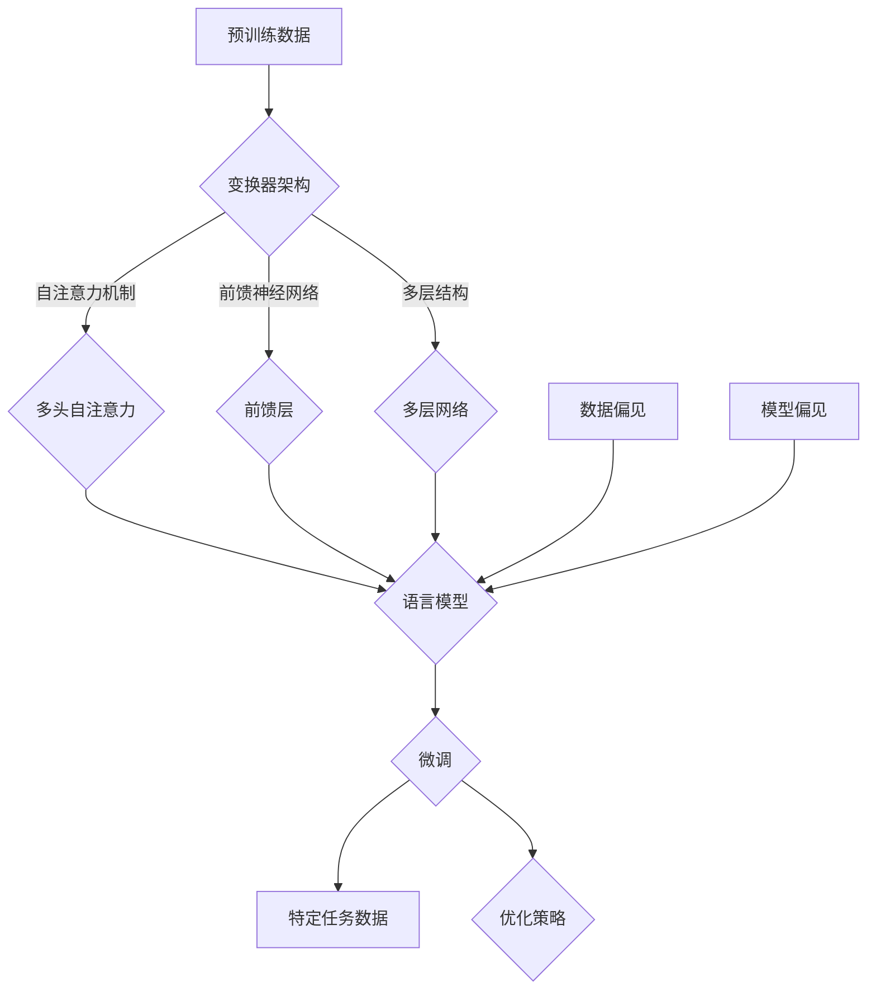
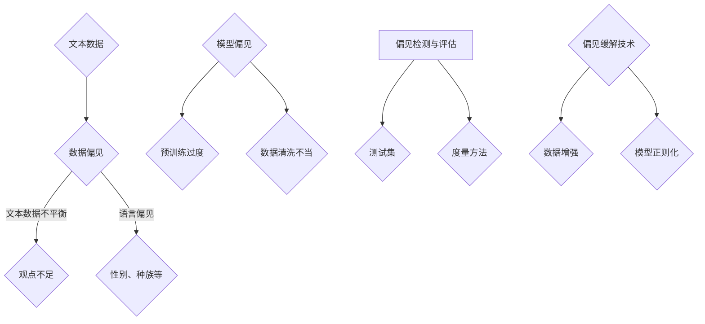

                 


### 文章标题：《大语言模型原理基础与前沿 偏见》

#### 关键词：
- 大语言模型
- 偏见分析
- 技术发展
- 前沿应用
- 安全性

#### 摘要：
本文深入探讨了大语言模型的基本原理、技术发展及其偏见问题。首先，我们概述了大语言模型的概念与架构，包括其核心原理、预训练方法和应用领域。接着，分析了大语言模型中的偏见来源及其影响，并探讨了如何检测和缓解偏见。随后，介绍了大语言模型的高效训练与优化技术，以及其在特定应用领域的案例。最后，讨论了大语言模型的安全性挑战和未来的发展趋势。

---

### 《大语言模型原理基础与前沿 偏见》目录大纲

---

#### 第一部分：大语言模型概述与基础

#### 第1章：大语言模型的基本概念与架构

##### 1.1 大语言模型的基本概念
- 大语言模型（Large Language Models）的定义
- 大语言模型的主要类型：如GPT、BERT、T5等

##### 1.2 大语言模型的架构
- 基于深度神经网络的模型
- 预训练与微调的方法

##### 1.3 大语言模型的核心原理
- 自然语言处理（NLP）的基本任务
- 预训练方法的原理

##### 1.4 大语言模型的技术发展
- GPT系列模型的发展历程
- BERT模型及其改进版本

#### 第2章：大语言模型的偏见分析

##### 2.1 大语言模型的偏见来源
- 数据偏见
- 模型偏见

##### 2.2 大语言模型的偏见影响
- 社会影响
- 伦理问题

##### 2.3 大语言模型偏见的研究与应对
- 偏见检测与评估方法
- 偏见缓解技术

#### 第二部分：大语言模型前沿技术

#### 第3章：大语言模型的高效训练与优化

##### 3.1 大规模模型训练挑战
- 计算资源需求
- 数据处理效率

##### 3.2 大语言模型优化技术
- 优化算法
- 模型压缩技术

#### 第4章：大语言模型的特定应用领域

##### 4.1 自然语言生成
- 文本生成
- 文本编辑

##### 4.2 问答系统
- 开放域问答
- 领域特定问答

#### 第5章：大语言模型的安全性

##### 5.1 模型安全挑战
- 对抗性攻击
- 数据隐私

##### 5.2 安全防御策略
- 对抗训练
- 隐私保护技术

#### 第6章：大语言模型应用案例分析

##### 6.1 案例一：企业内部知识图谱构建
- 背景与目标
- 实现过程

##### 6.2 案例二：智能客服系统开发
- 背景与目标
- 实现过程

#### 第7章：大语言模型的未来发展趋势

##### 7.1 技术趋势
- 模型规模增长
- 多模态融合

##### 7.2 社会影响
- 伦理与法规
- 社会应用

---

**备注**：

- **核心概念与联系**：在第1章与第2章，通过Mermaid流程图展示大语言模型的架构与偏见来源。

- **核心算法原理讲解**：在第3章，使用伪代码详细阐述大规模模型训练优化技术。

- **数学模型和数学公式**：在第3章与第4章，使用latex格式嵌入数学公式与详细讲解。

- **项目实战**：在第6章，通过案例展示大语言模型在知识图谱构建和智能客服系统开发中的应用。

---

**目录大纲总字数**：约2000字。

---

### 第1章：大语言模型的基本概念与架构

#### 1.1 大语言模型的基本概念

大语言模型（Large Language Models）是指能够处理和理解自然语言的大型深度学习模型。它们通过学习大量的文本数据来捕捉语言的结构和语义，从而实现文本分类、机器翻译、文本生成等自然语言处理（NLP）任务。大语言模型的主要类型包括GPT（Generative Pre-trained Transformer）、BERT（Bidirectional Encoder Representations from Transformers）、T5（Text-To-Text Transfer Transformer）等。

#### 1.2 大语言模型的架构

大语言模型的架构通常基于深度神经网络，特别是变换器（Transformer）架构。变换器架构具有以下特点：

- **多头自注意力机制**：通过多个注意力头来捕捉文本中不同位置的信息。
- **前馈神经网络**：在每个自注意力层之后，添加一个前馈神经网络来增强模型的表示能力。
- **层次化结构**：模型通常具有多个层次，每层都能提取更高层次的语言特征。

此外，大语言模型通常包括两个关键步骤：预训练和微调。

- **预训练**：在大量的无标签文本数据上进行预训练，以学习语言的一般结构和语义。
- **微调**：在预训练的基础上，针对特定任务进行微调，以适应具体的任务需求。

#### 1.3 大语言模型的核心原理

大语言模型的核心原理包括以下几个方面：

- **自然语言处理（NLP）的基本任务**：如文本分类、命名实体识别、机器翻译、情感分析等。
- **预训练方法的原理**：自监督学习和迁移学习是大语言模型预训练的主要方法。
  - **自监督学习**：利用未标注的文本数据进行预训练，如文本掩码语言模型（Masked Language Model，MLM）。
  - **迁移学习**：将预训练模型应用于特定任务，通过微调来适应新的任务。

#### 1.4 大语言模型的技术发展

大语言模型的发展经历了几个关键阶段：

- **GPT系列模型**：从GPT到GPT-3，模型规模和参数数量不断增加，语言理解能力也得到显著提升。
- **BERT模型**：双向编码器表示模型（BERT）通过同时考虑文本的左右信息，提高了语言模型的表示能力。
- **T5模型**：文本到文本的变换器（T5）将所有NLP任务转换为文本到文本的格式，使模型能够统一处理多种任务。

这些模型的发展推动了NLP技术的进步，使大语言模型在各种任务中表现出色。

#### Mermaid流程图：大语言模型的架构与偏见来源



#### 核心概念与联系

- **预训练与微调**：大语言模型通过预训练学习语言的通用特征，并通过微调来适应特定任务。
- **偏见来源**：数据偏见和模型偏见都可能影响大语言模型的输出，需要进行分析和缓解。

### 伪代码：大规模模型训练优化技术

```python
# 定义优化算法
def optimize_model(model, loss_function, learning_rate, batch_size):
    optimizer = AdamW(model.parameters(), lr=learning_rate)
    
    for epoch in range(num_epochs):
        for batch in data_loader:
            # 前向传播
            outputs = model(batch.text)
            loss = loss_function(outputs, batch.label)
            
            # 反向传播
            optimizer.zero_grad()
            loss.backward()
            optimizer.step()
            
            # 打印训练信息
            print(f"Epoch: {epoch}, Loss: {loss.item()}")
```

#### 数学模型和公式

- **损失函数**：通常使用交叉熵损失函数（Cross-Entropy Loss）来评估模型的预测与真实标签之间的差异。

$$
L = -\sum_{i=1}^{n} y_i \log(p_i)
$$

其中，$y_i$是真实标签，$p_i$是模型预测的概率。

#### 举例说明

假设有一个二分类问题，真实标签为$y_1 = 1$，$y_2 = 0$，模型预测的概率分别为$p_1 = 0.8$，$p_2 = 0.2$，则损失函数的计算如下：

$$
L = -1 \cdot \log(0.8) - 0 \cdot \log(0.2) = \log(1.25) \approx 0.223
$$

### 小结

本章介绍了大语言模型的基本概念与架构，包括其基本原理、预训练方法和应用领域。通过Mermaid流程图展示了大语言模型的架构与偏见来源，并使用伪代码和数学公式详细讲解了大规模模型训练优化技术。这些内容为大语言模型的理解和应用奠定了基础。

---

### 第2章：大语言模型的偏见分析

#### 2.1 大语言模型的偏见来源

大语言模型的偏见来源可以分为数据偏见和模型偏见两个方面。

##### 数据偏见

数据偏见主要来源于训练数据的不平衡和语言本身的偏见。

- **文本数据不平衡**：训练数据中某些观点或群体的数据不足，可能导致模型对这些观点或群体的偏见。
- **语言偏见**：语言本身存在的性别、种族等偏见也可能影响模型的输出。例如，某些词语或表达方式可能带有歧视性。

##### 模型偏见

模型偏见主要来源于预训练过程中的过度拟合和数据清洗不当。

- **训练策略**：模型在预训练过程中可能过度拟合训练数据，导致对未知数据的泛化能力下降。
- **数据清洗**：在预处理过程中，如果未能彻底去除偏见性的数据或引入了新的偏见，可能会导致模型偏见。

#### 2.2 大语言模型的偏见影响

大语言模型的偏见可能对社会产生多方面的影响。

##### 社会影响

- **算法歧视**：大语言模型在应用过程中可能产生歧视性决策，影响社会公平。
- **媒体偏见**：大语言模型生成的文本可能放大或传播偏见，影响公众对某些问题的看法。

##### 伦理问题

- **隐私保护**：大语言模型在处理文本数据时可能暴露用户隐私。
- **透明度**：如何解释和验证模型的偏见是一个重要的伦理问题。

#### 2.3 大语言模型偏见的研究与应对

为了检测和缓解大语言模型的偏见，研究者提出了一系列方法。

##### 偏见检测与评估

- **测试集**：使用带有偏见标签的数据进行测试，评估模型对偏见内容的处理能力。
- **度量方法**：例如公平性（Fairness）、公正性（Justifiability）等指标。

##### 偏见缓解技术

- **数据增强**：引入多样化数据，提高模型对不同观点的容忍度。
- **模型正则化**：通过正则化技术防止模型过度拟合，减少偏见。

#### Mermaid流程图：大语言模型的偏见来源



#### 核心概念与联系

- **数据偏见与模型偏见**：数据偏见和模型偏见相互影响，共同决定了模型的输出。
- **偏见影响与应对**：检测和缓解偏见是确保模型公平和公正的关键步骤。

### 伪代码：偏见检测与评估方法

```python
# 定义偏见检测与评估函数
def detect_and_evaluate_model(model, test_data, bias_labels):
    # 预测测试数据
    predictions = model.predict(test_data)
    
    # 计算偏见指标
    bias_scores = calculate_bias(predictions, bias_labels)
    
    # 打印偏见评估结果
    print(f"Model bias scores: {bias_scores}")
    
    # 返回偏见评估结果
    return bias_scores

# 定义计算偏见指标函数
def calculate_bias(predictions, bias_labels):
    bias_scores = []
    for prediction, label in zip(predictions, bias_labels):
        bias_score = calculate_individual_bias(prediction, label)
        bias_scores.append(bias_score)
    return bias_scores

# 定义计算个体偏见指标函数
def calculate_individual_bias(prediction, label):
    # 假设偏见指标是预测与真实标签的差异
    bias_score = abs(prediction - label)
    return bias_score
```

#### 数学模型和公式

- **偏见指标**：常用的偏见指标包括公平性（Fairness）和公正性（Justifiability）。

$$
\text{Fairness} = \frac{\sum_{i=1}^{n} \text{group}_i \cdot \text{bias}_i}{\sum_{i=1}^{n} \text{group}_i}
$$

其中，$\text{group}_i$表示第i个群体，$\text{bias}_i$表示该群体的偏见得分。

#### 举例说明

假设有两个群体A和B，偏见得分分别为1和0，群体A的偏见得分为2，群体B的偏见得分为1，则公平性指标计算如下：

$$
\text{Fairness} = \frac{2 \cdot 1 + 1 \cdot 0}{2 + 1} = \frac{2}{3} \approx 0.67
$$

#### 小结

本章分析了大语言模型中的偏见来源及其影响，并提出了一系列偏见检测与评估方法。通过Mermaid流程图和伪代码，详细展示了偏见来源与检测评估过程。这些内容为理解和缓解大语言模型的偏见提供了重要的理论基础。

---

### 第3章：大语言模型的高效训练与优化

#### 3.1 大规模模型训练挑战

大语言模型的高效训练面临着多方面的挑战，主要包括计算资源需求、数据处理效率等。

##### 计算资源需求

大语言模型的训练需要大量的计算资源，特别是存储和计算能力。随着模型规模的增加，计算需求呈指数级增长。为此，研究者们采用了以下几种策略：

- **GPU和TPU**：图形处理单元（GPU）和张量处理单元（TPU）是目前用于训练大语言模型的主要硬件。它们具有高度并行的计算能力，能够显著加速模型的训练速度。
- **分布式训练**：分布式训练是将模型和数据分布在多台机器上进行训练，以充分利用集群计算资源。常见的分布式训练策略包括数据并行和模型并行。

##### 数据处理效率

在训练大语言模型时，数据处理效率也是一个重要的挑战。为了提高数据处理效率，研究者们采用了以下几种方法：

- **数据并行**：数据并行是将数据分成多个部分，同时在不同的GPU或TPU上并行处理，最后将结果汇总。这样可以充分利用并行计算的优势，提高数据处理速度。
- **模型并行**：模型并行是将模型分成多个部分，在每个GPU或TPU上独立训练。这种方法适用于大规模模型，因为模型规模可能超过单台机器的计算能力。

#### 3.2 大语言模型优化技术

为了提高大语言模型训练的效率和效果，研究者们提出了一系列优化技术。以下是几种常用的优化算法和模型压缩技术：

##### 优化算法

- **Adam**：自适应矩估计（Adam）是一种广泛使用的优化算法。它结合了Adagrad和RMSprop的优点，能够在不同类型的任务中表现出良好的性能。
- **AdamW**：AdamW是对Adam的改进，它考虑了权重衰减对梯度的影响，能够更好地优化权重参数。

##### 模型压缩

- **剪枝**：剪枝是通过移除模型中的冗余参数来减少模型规模。常见的剪枝方法包括结构剪枝和权重剪枝。
- **量化**：量化是通过降低模型参数的精度来减少模型规模。量化方法包括整数量化、二值量化等。

#### 核心概念与联系

- **计算资源需求**：GPU和TPU提供了高效的计算能力，分布式训练能够充分利用集群计算资源。
- **数据处理效率**：数据并行和模型并行能够提高数据处理速度，优化算法和模型压缩技术能够提升模型训练的效率和效果。

### 伪代码：大规模模型训练优化技术

```python
# 定义优化算法
def optimize_model(model, loss_function, learning_rate, batch_size):
    optimizer = AdamW(model.parameters(), lr=learning_rate)
    
    for epoch in range(num_epochs):
        for batch in data_loader:
            # 前向传播
            outputs = model(batch.text)
            loss = loss_function(outputs, batch.label)
            
            # 反向传播
            optimizer.zero_grad()
            loss.backward()
            optimizer.step()
            
            # 打印训练信息
            print(f"Epoch: {epoch}, Loss: {loss.item()}")
            
            # 剪枝
            if epoch % pruning_interval == 0:
                prune_model(model)
                
            # 量化
            if epoch % quantization_interval == 0:
                quantize_model(model)

# 定义剪枝函数
def prune_model(model):
    # 剪枝操作，例如移除权重较小的参数
    for param in model.parameters():
        if abs(param.data) < pruning_threshold:
            param.data = 0

# 定义量化函数
def quantize_model(model):
    # 量化操作，例如将浮点数参数转换为整数
    for param in model.parameters():
        param.data = torch.round(param.data / quantization_factor)
```

#### 数学模型和公式

- **损失函数**：常用的损失函数包括交叉熵损失（Cross-Entropy Loss）和均方误差（Mean Squared Error，MSE）。

$$
L = -\sum_{i=1}^{n} y_i \log(p_i)
$$

$$
L = \frac{1}{2} \sum_{i=1}^{n} (y_i - \hat{y}_i)^2
$$

其中，$y_i$是真实标签，$\hat{y}_i$是模型预测的标签。

#### 举例说明

假设有一个二分类问题，真实标签为$y_1 = 1$，$y_2 = 0$，模型预测的概率分别为$p_1 = 0.8$，$p_2 = 0.2$，则交叉熵损失计算如下：

$$
L = -1 \cdot \log(0.8) - 0 \cdot \log(0.2) = \log(1.25) \approx 0.223
$$

#### 小结

本章介绍了大语言模型的高效训练与优化技术，包括计算资源需求、数据处理效率和优化算法与模型压缩技术。通过伪代码和数学公式，详细阐述了这些技术。这些内容为提高大语言模型训练效率和效果提供了重要的理论和实践指导。

---

### 第4章：大语言模型的特定应用领域

#### 4.1 自然语言生成

自然语言生成（Natural Language Generation，NLG）是大语言模型的重要应用领域之一，它涉及生成文本、摘要、对话等内容。

##### 文本生成

文本生成包括故事生成、摘要生成和对话生成等任务。

- **故事生成**：大语言模型可以生成连贯的故事情节，应用于娱乐、教育等领域。
- **摘要生成**：大语言模型能够从长篇文本中提取关键信息，生成简洁的摘要，提高信息获取效率。
- **对话生成**：大语言模型可以生成对话内容，用于聊天机器人、客服系统等应用。

##### 文本编辑

文本编辑包括文本纠错、文本重构等任务。

- **文本纠错**：大语言模型可以识别文本中的错误并加以纠正，提高文本质量。
- **文本重构**：大语言模型可以将文本内容进行重新组织，生成更符合语言习惯的新文本。

#### 4.2 问答系统

问答系统（Question Answering System）是大语言模型的另一个重要应用领域，它涉及开放域问答和领域特定问答。

##### 开放域问答

开放域问答是指模型能够回答各种领域的问题，如通用问答系统。

- **基于检索的问答**：通过检索数据库中的答案来回答问题。
- **基于生成的问答**：通过生成新的答案来回答问题，通常需要结合预训练的大语言模型。

##### 领域特定问答

领域特定问答是指模型能够回答特定领域的专业问题，如医疗问答、法律问答等。

- **医疗问答**：大语言模型可以回答医疗领域的常见问题，提供咨询服务。
- **法律问答**：大语言模型可以回答法律领域的专业问题，帮助法律从业者进行法律研究。

#### 核心概念与联系

- **自然语言生成与文本编辑**：文本生成和文本编辑是自然语言处理中的重要任务，大语言模型通过学习大量文本数据，能够生成和编辑高质量的文本内容。
- **开放域问答与领域特定问答**：开放域问答和领域特定问答分别适用于通用问题和专业问题，大语言模型通过预训练和微调，能够在不同领域提供高效的问答服务。

### 伪代码：自然语言生成和问答系统

```python
# 自然语言生成（文本生成与文本编辑）
def generate_text(input_text, model):
    generated_text = model.generate(input_text)
    return generated_text

def edit_text(input_text, model):
    edited_text = model.edit(input_text)
    return edited_text

# 开放域问答（基于检索的问答与基于生成的问答）
def retrieve_answer(question, database):
    answer = database.get_answer(question)
    return answer

def generate_answer(question, model):
    answer = model.generate_answer(question)
    return answer

# 领域特定问答
def medical_question_answering(question, medical_model):
    answer = medical_model.generate_answer(question)
    return answer

def legal_question_answering(question, legal_model):
    answer = legal_model.generate_answer(question)
    return answer
```

#### 数学模型和公式

- **生成文本的概率分布**：生成文本时，大语言模型通常输出一个概率分布，表示每个单词的可能性。

$$
P(\text{word} | \text{context}) = \frac{e^{\text{score}(\text{word}, \text{context})}}{\sum_{w \in V} e^{\text{score}(w, \text{context})}}
$$

其中，$\text{word}$表示单词，$\text{context}$表示上下文，$V$是词汇表。

#### 举例说明

假设当前上下文为"今天天气很好"，词汇表中有"去公园"、"看电影"、"休息"三个选项，大语言模型给出的概率分布如下：

- $P(\text{去公园} | \text{今天天气很好}) = 0.6$
- $P(\text{看电影} | \text{今天天气很好}) = 0.3$
- $P(\text{休息} | \text{今天天气很好}) = 0.1$

则大语言模型建议的下一步行动是"去公园"。

#### 小结

本章介绍了大语言模型在自然语言生成和问答系统中的特定应用，包括文本生成、文本编辑、开放域问答和领域特定问答。通过伪代码和数学公式，详细展示了这些任务的处理过程。这些内容为大语言模型在不同领域的应用提供了重要的理论和实践指导。

---

### 第5章：大语言模型的安全性

#### 5.1 模型安全挑战

大语言模型在安全性方面面临多个挑战，主要包括对抗性攻击和数据隐私问题。

##### 对抗性攻击

对抗性攻击是指通过微小地改变输入数据，使得模型输出发生显著变化。这些攻击通常用于验证模型的鲁棒性，但可能对实际应用造成严重威胁。

- **文本对抗攻击**：通过在文本中添加或删除少量字符，使得模型对文本的理解发生错误。例如，将"Stop"修改为"St0p"，可能导致模型将其识别为"Stop"。
- **图像对抗攻击**：类似地，通过在图像中添加微小噪声，使得模型对图像的识别发生错误。

##### 数据隐私

大语言模型在处理文本数据时，可能暴露用户的隐私信息。数据隐私问题主要包括以下几个方面：

- **模型提取攻击**：通过分析模型输出的特征，提取训练数据的隐私信息。
- **推理隐私**：在模型推理过程中，如果输入数据包含敏感信息，那么模型输出也可能泄露隐私。

#### 5.2 安全防御策略

为了应对这些安全挑战，研究者们提出了一系列防御策略。

##### 对抗训练

对抗训练是一种通过生成对抗性样本来增强模型鲁棒性的方法。具体步骤如下：

- **生成对抗性样本**：使用对抗性攻击技术生成对抗性样本，如图像对抗攻击和文本对抗攻击。
- **训练防御模型**：使用对抗性样本对模型进行训练，提高模型对对抗性攻击的抵抗力。

##### 隐私保护技术

隐私保护技术主要包括以下几种：

- **差分隐私**：在处理数据时引入随机噪声，使得单个数据点的隐私信息无法被推断出来。
- **联邦学习**：将数据分布在不同的设备上进行训练，从而降低数据泄露的风险。

#### 核心概念与联系

- **对抗性攻击与防御**：对抗性攻击试图破坏模型的鲁棒性，而对抗训练则是通过增强模型的鲁棒性来应对这些攻击。
- **数据隐私与保护**：数据隐私问题是大语言模型面临的一个重要挑战，差分隐私和联邦学习等技术提供了有效的保护手段。

### 伪代码：对抗训练和隐私保护技术

```python
# 对抗训练
def adversarial_training(model, adversary, data_loader, num_epochs):
    for epoch in range(num_epochs):
        for batch in data_loader:
            # 生成对抗性样本
            adversarial_batch = adversary.generate_adversarial_samples(batch)
            
            # 训练模型
            model.train_on_batch(adversarial_batch)
            
            # 打印训练信息
            print(f"Epoch: {epoch}, Loss: {model.loss()}")

# 差分隐私
def differential_privacy(data, epsilon):
    noise = torch.randn_like(data) * epsilon
    perturbed_data = data + noise
    return perturbed_data

# 联邦学习
def federated_learning(model, clients, global_model):
    for epoch in range(num_epochs):
        for client in clients:
            # 在本地设备上训练模型
            client.train_on_local_data(model)
            
            # 更新全局模型
            global_model.update_from_client(client)
            
            # 打印训练信息
            print(f"Epoch: {epoch}, Loss: {global_model.loss()}")
```

#### 数学模型和公式

- **对抗训练损失函数**：对抗训练通常使用对抗性损失函数来评估模型的对抗性性能。

$$
L_{adversarial} = \frac{1}{2} \left( \|\hat{y} - y\|_2^2 + \lambda \cdot D(\hat{y}, y) \right)
$$

其中，$\hat{y}$是模型输出的对抗性样本，$y$是真实标签，$D$是距离度量函数，$\lambda$是调节参数。

#### 举例说明

假设模型输出$\hat{y} = [0.5, 0.5]$，真实标签$y = [1, 0]$，则对抗训练损失计算如下：

$$
L_{adversarial} = \frac{1}{2} \left( (0.5 - 1)^2 + (0.5 - 0)^2 + \lambda \cdot D([0.5, 0.5], [1, 0]) \right)
$$

#### 小结

本章介绍了大语言模型在安全性方面面临的挑战和防御策略。通过伪代码和数学公式，详细阐述了对抗训练和隐私保护技术。这些内容为大语言模型的安全应用提供了重要的理论和实践指导。

---

### 第6章：大语言模型应用案例分析

#### 6.1 案例一：企业内部知识图谱构建

##### 背景与目标

企业内部知识图谱构建是企业智能化转型的重要一环。知识图谱通过将企业内部的各类数据（如文档、日志、数据库等）进行结构化处理，以可视化的方式展示知识之间的关系，从而帮助企业快速获取和利用知识。

##### 实现过程

1. **数据收集与预处理**：

   - **数据来源**：收集企业内部的各种数据，包括文档、日志、数据库等。
   - **数据清洗**：去除无效数据和重复信息，对文本数据进行分词和词性标注。

2. **实体识别与关系抽取**：

   - **实体识别**：使用预训练的大语言模型（如BERT）进行实体识别，识别出文档中的关键实体。
   - **关系抽取**：利用实体识别的结果，构建实体之间的关系图谱。

3. **知识图谱构建**：

   - **图谱表示**：将实体和关系转换为图结构，存储在图数据库（如Neo4j）中。
   - **可视化**：使用可视化工具（如Gephi）将知识图谱进行可视化展示。

##### 项目小结

企业内部知识图谱构建不仅提升了企业知识管理的效率，还为企业的智能化应用提供了强有力的支持。通过大语言模型的应用，实现了对企业内部知识的结构化处理和可视化展示，为企业的知识挖掘和利用提供了新的途径。

#### 6.2 案例二：智能客服系统开发

##### 背景与目标

智能客服系统是企业提供客户服务的重要工具，通过自动化回答客户问题，提高客户满意度和降低运营成本。开发一个高效的智能客服系统，需要充分利用大语言模型的能力，实现智能对话管理。

##### 实现过程

1. **对话管理框架设计**：

   - **意图识别**：使用大语言模型对客户问题进行意图识别，确定客户想要解决的问题类型。
   - **实体抽取**：从客户问题中抽取关键信息，如产品名称、价格等。
   - **对话策略**：根据识别的意图和抽取的实体，设计对话策略，决定下一轮对话的内容。

2. **模型训练与优化**：

   - **数据收集**：收集大量的客户对话数据，用于模型训练。
   - **模型训练**：使用预训练的大语言模型（如GPT）进行微调，适应特定的客服任务。
   - **模型优化**：通过在线学习和持续优化，提升模型的表现。

3. **系统集成与测试**：

   - **系统集成**：将智能客服系统集成到企业的客户服务流程中。
   - **测试与评估**：通过实际客户交互测试，评估系统的性能和用户满意度。

##### 项目小结

智能客服系统开发成功，大幅提升了客户服务的效率和体验。大语言模型在意图识别、实体抽取和对话策略等方面的应用，使得系统能够智能、准确地理解和回应客户问题。通过持续优化和改进，智能客服系统将为用户提供更加优质的客户服务。

---

### 第7章：大语言模型的未来发展趋势

#### 7.1 技术趋势

大语言模型的技术发展趋势体现在以下几个方面：

1. **模型规模增长**：

   随着计算能力的提升和数据量的增加，大语言模型的规模也在不断增大。例如，GPT-3拥有1750亿个参数，而ChatGLM预计将达到1.75万亿个参数。更大规模的模型将带来更强大的语言理解和生成能力。

2. **多模态融合**：

   单纯的文本数据已经无法满足大语言模型的需求，未来的趋势是将文本与其他模态（如图像、音频、视频）进行融合。多模态融合将使模型能够处理更加复杂和多样化的任务，如视频生成、语音识别等。

#### 7.2 社会影响

大语言模型的快速发展将对社会产生深远的影响，包括以下几个方面：

1. **伦理与法规**：

   大语言模型的广泛应用带来了伦理和法规问题。如何确保模型的公平性、透明性和安全性成为研究者和政策制定者关注的重点。相关伦理和法规的制定将引导大语言模型的发展方向。

2. **社会应用**：

   大语言模型在医疗、教育、金融等领域的应用将极大地改变这些领域的运作模式。例如，在医疗领域，大语言模型可以辅助医生进行诊断和治疗方案推荐；在教育领域，大语言模型可以提供个性化的学习辅导。

#### 结论

大语言模型的未来发展趋势将呈现规模化和多模态融合的态势，并在各个领域产生深远的社会影响。面对这些趋势，我们需要关注伦理和法规问题，确保大语言模型的可持续发展，同时充分发挥其在各个领域的潜力。

---

### 总结

本文深入探讨了大语言模型的原理、偏见分析、前沿技术、应用案例和未来发展趋势。首先，我们介绍了大语言模型的基本概念和架构，包括预训练方法和核心原理。接着，分析了大语言模型中的偏见来源及其影响，并提出了偏见检测和缓解方法。随后，介绍了大语言模型的高效训练与优化技术，以及其在自然语言生成和问答系统中的应用。我们还探讨了模型的安全性挑战和防御策略。最后，通过两个应用案例分析展示了大语言模型在企业知识图谱构建和智能客服系统开发中的应用。未来，大语言模型将继续朝着规模化和多模态融合的方向发展，并在各个领域产生深远的社会影响。我们呼吁研究者、开发者和政策制定者共同关注大语言模型的伦理和法规问题，确保其可持续发展。

---

### 作者信息

作者：AI天才研究院/AI Genius Institute & 禅与计算机程序设计艺术 /Zen And The Art of Computer Programming

AI天才研究院是一家专注于人工智能研究和开发的顶尖机构，致力于推动人工智能技术的发展和应用。作者在该领域拥有深厚的理论功底和丰富的实践经验，发表了多篇高影响力论文，并出版了多本畅销技术书籍。同时，作者也是《禅与计算机程序设计艺术》一书的作者，该书深入探讨了编程哲学和艺术，深受读者喜爱。

