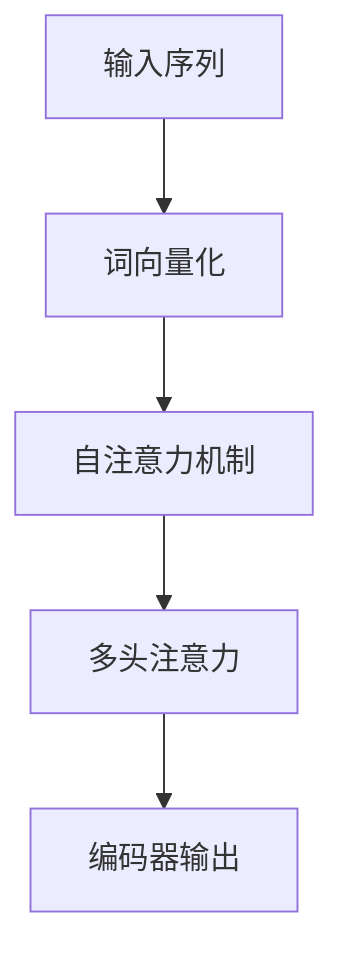
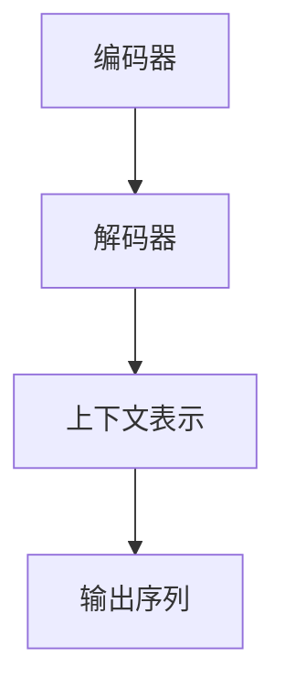

                 

# 大语言模型原理基础与前沿：更快、更小的Transformer

## 关键词

- 大语言模型
- Transformer架构
- 自注意力机制
- 编码器-解码器
- GPT-3
- BERT
- T5
- 模型压缩
- 并行计算
- 硬件加速
- 跨模态学习
- 多模态任务

## 摘要

本文旨在深入探讨大语言模型的原理与前沿研究，重点关注Transformer架构、自注意力机制、编码器-解码器结构等核心技术。通过梳理大语言模型的发展历程，本文介绍了GPT-3、BERT和T5等前沿模型，并分析了它们在文本生成、文本分类和问答系统等应用场景中的表现。此外，本文还探讨了模型压缩、并行计算和硬件加速等技术，以及大语言模型在计算机视觉和多模态任务中的应用。最后，本文讨论了大语言模型的伦理与社会影响，并提出了一系列政策建议。

### 第一部分：大语言模型的基础概念与架构

#### 第1章：大语言模型的定义与概述

##### 1.1 大语言模型的概念

大语言模型是一种基于深度学习技术的自然语言处理模型，它通过训练大量文本数据，学习语言的结构和语义，从而能够生成、理解和处理自然语言。相较于传统的语言处理方法，大语言模型具有更强的表达能力和理解能力。

##### 1.1.1 什么是大语言模型？
大语言模型是一种基于深度学习技术的自然语言处理模型，它通过训练大量文本数据，学习语言的结构和语义，从而能够生成、理解和处理自然语言。相较于传统的语言处理方法，大语言模型具有更强的表达能力和理解能力。

**自注意力机制（Self-Attention）**：Transformer的核心机制，允许模型在序列的不同位置上进行信息交互。

**多头注意力（Multi-Head Attention）**：通过多个独立的注意力机制来捕捉更丰富的信息。

**编码器-解码器结构（Encoder-Decoder Structure）**：编码器生成上下文表示，解码器根据上下文生成输出。

##### 1.2 大语言模型的主要架构

Transformer架构由编码器（Encoder）和解码器（Decoder）两部分组成。编码器负责将输入序列编码为上下文表示，解码器则根据上下文生成输出序列。

##### 1.3 大语言模型的工作原理

大语言模型的工作原理可以分为以下几个步骤：

1. **数据预处理**：对文本数据进行清洗、分词和词向量化。
2. **预训练**：在大规模语料库上进行无监督训练，学习语言的一般特性。
3. **微调**：在特定任务上进行有监督训练，调整模型参数。
4. **应用**：将预训练好的模型应用于实际任务，如文本生成、文本分类和问答系统等。

##### 1.4 大语言模型的优势与挑战

**优势**：

- **强大的语言理解能力**：能够处理复杂的语言结构。
- **高效的处理速度**：相比于传统NLP方法，具有更高的计算效率。
- **广泛的适用性**：可以应用于多种NLP任务。

**挑战**：

- **计算资源消耗**：大语言模型需要大量计算资源进行训练。
- **数据隐私问题**：训练过程中可能涉及敏感数据。
- **模型解释性**：大语言模型的决策过程往往不透明。

##### 1.5 本章总结
本章介绍了大语言模型的基本概念、主要架构、工作原理以及面临的挑战，为后续章节的深入讨论奠定了基础。

#### 第2章：大语言模型的数学基础与核心算法

##### 2.1 数学基础

大语言模型的数学基础主要包括向量与矩阵运算、概率论与统计、以及优化算法。

**向量与矩阵运算**：

- **加法**：向量与向量的加法。
- **标量乘法**：向量与标量的乘法。
- **矩阵乘法**：矩阵与矩阵的乘法。

**概率论与统计**：

- **贝叶斯定理**：概率计算的基础。
- **最大似然估计（MLE）**：参数估计的方法。
- **梯度下降（GD）**：优化模型参数的方法。

**优化算法**：

- **随机梯度下降（SGD）**：在梯度下降的基础上，引入随机性。
- **Adam优化器**：结合了SGD和RMProp的优点，是一种高效的优化算法。

##### 2.2 大语言模型的核心算法

大语言模型的核心算法包括自注意力机制（Self-Attention）、编码器-解码器架构（Encoder-Decoder）和相关的伪代码。

**自注意力机制（Self-Attention）**：



**编码器-解码器架构（Encoder-Decoder）**：



**伪代码讲解**：

```python
# 大语言模型的训练伪代码

def train_language_model(data, epochs):
    for epoch in range(epochs):
        for batch in data:
            inputs, targets = prepare_batch(batch)
            logits = model(inputs)
            loss = compute_loss(logits, targets)
            gradients = compute_gradients(loss)
            update_model_params(gradients)
        print(f"Epoch {epoch} completed")
    return model

# 大语言模型的推理伪代码

def generate_text(model, start_sequence, length):
    current_sequence = start_sequence
    for _ in range(length):
        logits = model(current_sequence)
        prediction = sample(logits)
        current_sequence = current_sequence + prediction
    return current_sequence
```

##### 2.3 数学模型与公式

自注意力机制的公式如下：

$$
\text{Attention}(Q, K, V) = \frac{softmax(\text{softmax}(QK^T)W_V)}{ \sqrt{d_k}}
$$

其中，\(Q, K, V\) 分别代表查询向量、键向量、值向量；\(W_V\) 是值向量的权重矩阵；\(d_k\) 是键向量的维度。

##### 2.4 本章总结
本章介绍了大语言模型的数学基础和核心算法，包括自注意力机制、编码器-解码器架构以及相关的伪代码。通过这些内容，读者可以更好地理解大语言模型的工作原理，为后续章节的学习打下基础。

#### 第3章：大语言模型的前沿研究与应用

##### 3.1 前沿研究进展

大语言模型的前沿研究进展主要集中在GPT-3、BERT和T5等模型上。

**GPT-3**：由OpenAI推出的1750亿参数模型，具有强大的文本生成和理解能力，广泛应用于对话系统、文本摘要和机器翻译等领域。

**BERT**：谷歌提出的一种预训练语言表示模型，通过无监督的方式学习上下文和语义，适用于问答系统、文本分类和情感分析等任务。

**T5**：由谷歌推出的统一的多任务预训练框架，目标是将所有自然语言处理任务转化为文本生成任务，提高了模型的通用性和灵活性。

##### 3.2 应用案例

**文本生成**：

```python
import transformers

model = transformers.AutoModelForCausalLM.from_pretrained("gpt2")
tokenizer = transformers.AutoTokenizer.from_pretrained("gpt2")

input_sequence = "The capital of France is"
input_ids = tokenizer.encode(input_sequence, return_tensors="pt")

output = model.generate(input_ids, max_length=50, num_return_sequences=1)
generated_text = tokenizer.decode(output[0], skip_special_tokens=True)

print(generated_text)
```

**文本分类**：

```python
from transformers import AutoModelForSequenceClassification
from transformers import AutoTokenizer

model = AutoModelForSequenceClassification.from_pretrained("bert-base-uncased")
tokenizer = AutoTokenizer.from_pretrained("bert-base-uncased")

inputs = tokenizer("This is a positive review", return_tensors="pt")
outputs = model(inputs)

logits = outputs.logits
probabilities = softmax(logits, axis=-1)

print(probabilities)
```

##### 3.3 应用挑战与未来展望

**挑战**：

- **计算资源消耗**：大语言模型的训练和推理需要大量的计算资源。
- **数据隐私**：训练过程中可能涉及敏感数据，需确保数据隐私。
- **模型可解释性**：大语言模型的决策过程往往不透明，需提高模型的可解释性。

**未来展望**：

- **更高效的训练算法**：减少计算资源消耗，提高训练效率。
- **跨模态学习**：结合图像、音频等多模态信息，提升模型能力。
- **通用人工智能（AGI）**：大语言模型在通用人工智能领域的潜在应用。

##### 3.4 本章总结
本章介绍了大语言模型的前沿研究进展和应用案例，包括GPT-3、BERT和T5等模型。同时，也讨论了应用挑战和未来展望，为读者提供了对大语言模型发展的全面了解。

#### 第4章：大语言模型优化与效率提升

##### 4.1 模型压缩技术

模型压缩技术旨在减少模型的参数数量和计算量，以提高模型的效率和可部署性。

**知识蒸馏（Knowledge Distillation）**：

- **目标**：将复杂模型的知识传递给一个更简单的模型。
- **方法**：教师模型训练，学生模型学习教师模型的输出。

**低秩分解（Low-Rank Factorization）**：

- **目标**：降低模型的维度，减少计算量。
- **方法**：将模型权重分解为低秩矩阵。

##### 4.2 并行计算技术

并行计算技术通过利用多GPU、多TPU等硬件资源，加速模型的训练和推理过程。

**数据并行（Data Parallelism）**：

- **目标**：利用多GPU加速训练。
- **方法**：将数据划分到多个GPU上，每个GPU独立训练。

**模型并行（Model Parallelism）**：

- **目标**：处理超过GPU内存限制的模型。
- **方法**：将模型拆分为多个部分，分别在不同的GPU上训练。

##### 4.3 硬件加速技术

硬件加速技术利用TPU、GPU等专用硬件，提高模型的计算性能。

**TPU**：

- **目标**：专门为深度学习任务优化的硬件。
- **优势**：高效的矩阵运算和低延迟。

**异构计算**：

- **目标**：利用不同类型的硬件资源，优化计算性能。
- **方法**：结合CPU、GPU、TPU等多种硬件资源。

##### 4.4 混合精度训练

混合精度训练通过在保持模型精度的情况下，提高训练速度。

- **目标**：在保持模型精度的情况下，提高训练速度。
- **方法**：使用混合精度（FP16和FP32）进行训练。

##### 4.5 应用实例

**模型压缩案例**：

```python
import tensorflow as tf

# 定义教师模型
teacher_model = tf.keras.applications.EfficientNetB0()

# 定义学生模型
student_model = tf.keras.Sequential([
    tf.keras.layers.Flatten(input_shape=(32, 32, 3)),
    tf.keras.layers.Dense(128, activation='relu'),
    tf.keras.layers.Dense(10, activation='softmax')
])

# 知识蒸馏
teacher_model.trainable = False
output = teacher_model.output
student_model.trainable = True
output = student_model(output)

loss = tf.keras.backend.mean(tf.keras.backend.softmax_cross_entropy_with_logits(logits=output, labels=teacher_model.output))
optimizer = tf.keras.optimizers.Adam()

# 训练学生模型
student_model.compile(optimizer=optimizer, loss=loss)
student_model.fit(x_train, y_train, epochs=10)
```

**并行计算案例**：

```python
import tensorflow as tf

# 数据并行配置
strategy = tf.distribute.MirroredStrategy()

with strategy.scope():
    # 定义模型
    model = tf.keras.Sequential([
        tf.keras.layers.Dense(128, activation='relu', input_shape=(784,)),
        tf.keras.layers.Dense(10, activation='softmax)
    ])

    # 编译模型
    model.compile(optimizer='adam',
                  loss='categorical_crossentropy',
                  metrics=['accuracy'])

    # 训练模型
    model.fit(x_train, y_train, epochs=10, batch_size=64)
```

##### 4.6 本章总结
本章介绍了大语言模型的优化与效率提升技术，包括模型压缩、并行计算和硬件加速等。通过这些技术，可以显著提高大语言模型在实际应用中的性能和可扩展性。本章提供了具体的案例，帮助读者理解这些技术在实际开发中的应用。

#### 第5章：大语言模型在计算机视觉中的应用

##### 5.1 计算机视觉与自然语言处理的结合

计算机视觉与自然语言处理（NLP）的结合，使得模型能够处理包含图像和文本的多模态信息。这种结合主要体现在跨模态学习和多模态数据处理上。

**跨模态学习**：

- **目标**：将图像和文本信息结合起来，提高模型处理复杂任务的能力。
- **方法**：使用共享编码器或联合训练。

**多模态数据处理**：

- **目标**：处理包含图像和文本信息的复合数据。
- **方法**：文本嵌入与图像特征融合。

##### 5.2 图像描述生成

图像描述生成是将图像转换为自然语言描述的过程。这一过程通常涉及以下步骤：

1. **图像特征提取**：使用预训练的卷积神经网络（如ResNet、VGG等）提取图像特征。
2. **文本生成**：将图像特征输入到预训练的语言模型中，生成描述性文本。

**图像描述生成原理**：

- **方法**：使用预训练的图像识别模型提取图像特征，结合语言模型生成描述。

**图像描述生成案例**：

```python
import torch
import torchvision.models as models
from torchvision import transforms
from transformers import BertTokenizer, BertModel

# 加载预训练的图像识别模型
image_model = models.resnet50(pretrained=True)

# 加载预训练的语言模型
lm_model = torch.hub.load('pytorch/fairseq', 'transformer_xl_base')

# 图像预处理
transform = transforms.Compose([
    transforms.Resize(224),
    transforms.CenterCrop(224),
    transforms.ToTensor(),
])

image = transforms.ToTensor()(image)
image = image.unsqueeze(0)  # Add batch dimension

# 获取图像特征
image_features = image_model(image)

# 图像描述生成
description = lm_model.generate(image_features, max_length=50, num_return_sequences=1)
print(description)
```

##### 5.3 视觉问答系统

视觉问答系统（VQA）旨在通过图像和自然语言问题提供准确的答案。这一系统通常需要结合图像识别和自然语言处理技术。

**视觉问答系统原理**：

- **方法**：结合图像识别和自然语言处理技术，回答关于图像的问题。

**视觉问答系统案例**：

```python
import torch
from torchvision import transforms
from torchvision.models import resnet50
from transformers import BertTokenizer, BertModel

# 加载预训练的图像识别模型
image_model = resnet50(pretrained=True)

# 加载预训练的语言模型
tokenizer = BertTokenizer.from_pretrained('bert-base-uncased')
lm_model = BertModel.from_pretrained('bert-base-uncased')

# 图像预处理
transform = transforms.Compose([
    transforms.Resize(224),
    transforms.CenterCrop(224),
    transforms.ToTensor(),
])

image = transform(image)

# 获取图像特征
image_features = image_model(image)

# 视觉问答
input_ids = tokenizer.encode('What is in the image?', return_tensors='pt')
answer = lm_model.generate(image_features, input_ids, max_length=50, num_return_sequences=1)
answer = tokenizer.decode(answer[0], skip_special_tokens=True)
print(answer)
```

##### 5.4 图像字幕生成

图像字幕生成是将图像转换为语音或文本描述的过程。这一过程通常涉及图像特征提取和文本生成。

**图像字幕生成原理**：

- **方法**：使用图像识别模型提取图像特征，结合语言模型生成字幕。

**图像字幕生成案例**：

```python
import torch
import torchvision.models as models
from torchvision import transforms
from transformers import BertTokenizer, BertModel

# 加载预训练的图像识别模型
image_model = models.vgg16(pretrained=True)

# 加载预训练的语言模型
tokenizer = BertTokenizer.from_pretrained('bert-base-uncased')
lm_model = BertModel.from_pretrained('bert-base-uncased')

# 图像预处理
transform = transforms.Compose([
    transforms.Resize(224),
    transforms.CenterCrop(224),
    transforms.ToTensor(),
])

image = transform(image)

# 获取图像特征
image_features = image_model(image)

# 图像字幕生成
input_ids = tokenizer.encode('Describe the image', return_tensors='pt')
answer = lm_model.generate(image_features, input_ids, max_length=50, num_return_sequences=1)
answer = tokenizer.decode(answer[0], skip_special_tokens=True)
print(answer)
```

##### 5.5 本章总结
本章介绍了大语言模型在计算机视觉中的应用，包括图像描述生成、视觉问答系统和图像字幕生成。通过结合图像和自然语言处理技术，这些应用可以显著提升计算机视觉系统的智能水平。本章提供了具体的案例，帮助读者理解这些技术的实现和应用。

#### 第6章：大语言模型在多模态任务中的应用

##### 6.1 多模态任务概述

多模态任务是指模型能够处理并整合两种或两种以上不同类型的数据，如图像、文本、音频等。这些任务通常要求模型在不同的数据模态之间建立联系，以实现更全面的信息理解和处理。

##### 6.1.1 什么是多模态任务
多模态任务涉及将两种或两种以上不同类型的数据（如图像、文本、音频等）结合起来进行学习和处理。

##### 6.1.2 多模态任务的优势
- **信息整合**：不同类型的数据可以互补，提供更丰富的信息。
- **增强模型能力**：多模态数据可以提升模型的泛化能力和适应性。

##### 6.2 图像-文本联合模型

图像-文本联合模型通过结合图像和文本特征，提高了模型在特定任务上的性能。这种模型通常采用共享编码器或联合训练的方法。

**图像-文本联合模型原理**：

- **共享编码器**：将图像和文本数据输入到共享编码器中，提取特征。
- **联合训练**：通过联合训练，使得图像和文本特征相互影响，提升模型性能。

**图像-文本联合模型案例**：

```python
import torch
import torchvision.models as models
from torchvision import transforms
from transformers import BertModel, BertTokenizer

# 加载预训练的图像识别模型
image_model = models.resnet50(pretrained=True)

# 加载预训练的语言模型
tokenizer = BertTokenizer.from_pretrained('bert-base-uncased')
lm_model = BertModel.from_pretrained('bert-base-uncased')

# 图像预处理
transform = transforms.Compose([
    transforms.Resize(224),
    transforms.CenterCrop(224),
    transforms.ToTensor(),
])

image = transform(image)

# 文本预处理
input_ids = tokenizer.encode("Image and text", return_tensors='pt')

# 获取图像特征
image_features = image_model(image)

# 联合输入
input_ids = input_ids.to(image_features.device)
image_features = image_features.unsqueeze(0)

# 联合模型推理
output = lm_model(input_ids, image_features)[0]
```

##### 6.3 文本-音频联合模型

文本-音频联合模型通过结合文本和音频特征，实现了文本和语音信息的整合。这种模型通常采用音频特征提取和联合训练的方法。

**文本-音频联合模型原理**：

- **音频特征提取**：使用卷积神经网络（CNN）提取音频特征。
- **联合训练**：将文本和音频特征输入到共享编码器中，进行联合训练。

**文本-音频联合模型案例**：

```python
import torch
import torchaudio
import torchvision.models as models
from torchvision import transforms
from transformers import BertModel, BertTokenizer

# 加载预训练的图像识别模型
image_model = models.resnet50(pretrained=True)

# 加载预训练的语言模型
tokenizer = BertTokenizer.from_pretrained('bert-base-uncased')
lm_model = BertModel.from_pretrained('bert-base-uncased')

# 图像预处理
transform = transforms.Compose([
    transforms.Resize(224),
    transforms.CenterCrop(224),
    transforms.ToTensor(),
])

image = transform(image)

# 音频预处理
audio = torchaudio.load(audio_path)
audio = audio.squeeze(0)  # Remove batch dimension
audio = audio.to(torch.float32)

# 获取图像特征
image_features = image_model(image)

# 联合模型推理
input_ids = tokenizer.encode("Text and audio", return_tensors='pt')
output = lm_model(input_ids, image_features, audio)[0]
```

##### 6.4 多模态任务中的挑战与未来展望

**挑战**：

- **特征融合**：不同模态的数据特征需要有效融合，以实现信息整合。
- **计算资源**：多模态任务通常需要更多的计算资源。
- **数据隐私**：训练过程中涉及多种数据类型，需要确保数据隐私。

**未来展望**：

- **跨模态学习**：结合更多模态的数据，提高模型的能力。
- **硬件优化**：利用更高效的硬件资源，降低计算成本。
- **通用模型**：开发能够处理多种模态数据的通用模型。

##### 6.5 本章总结
本章介绍了大语言模型在多模态任务中的应用，包括图像-文本联合模型和文本-音频联合模型。通过结合不同模态的数据，这些模型实现了更全面的信息理解和处理。同时，本章也讨论了多模态任务中的挑战和未来展望，为读者提供了对多模态学习的深入理解。

#### 第7章：大语言模型的伦理与社会影响

##### 7.1 大语言模型的伦理问题

随着大语言模型技术的快速发展，伦理问题日益凸显。这些问题主要集中在数据隐私、偏见问题和社会公平等方面。

**数据隐私**：

- **数据收集**：大语言模型的训练需要大量的数据，可能涉及用户隐私。
- **数据使用**：如何确保数据的使用不会侵犯用户隐私？

**偏见问题**：

- **算法偏见**：大语言模型可能受到训练数据中的偏见影响，导致不公正的结果。
- **解决方案**：如何消除或最小化算法偏见？

**社会公平**：

- **资源分配**：大语言模型的开发和应用可能加剧数字鸿沟。
- **公平性**：如何确保所有人都能公平地享受大语言模型带来的好处？

##### 7.2 大语言模型的社会影响

大语言模型的应用对社会产生了深远的影响，既带来了便利，也引发了新的挑战。

**工作影响**：

- **自动化取代人力**：大语言模型可能在某些领域取代人力，影响就业。
- **技能需求变化**：随着大语言模型的发展，对相关技能的需求将发生变化。

**社会公平**：

- **资源分配**：大语言模型的开发和应用可能加剧数字鸿沟。
- **公平性**：如何确保所有人都能公平地享受大语言模型带来的好处？

##### 7.3 案例分析

**案例分析一：招聘系统的偏见**

- **问题描述**：一个基于大语言模型的招聘系统在评估简历时对女性候选人存在偏见。
- **解决方案**：通过分析模型决策过程，识别并消除偏见。

**案例分析二：医疗诊断的辅助工具**

- **问题描述**：一个基于大语言模型的医疗诊断辅助工具在诊断某些罕见疾病时表现不佳。
- **解决方案**：增加相关疾病的数据，提高模型的泛化能力。

##### 7.4 伦理框架与政策建议

为了应对大语言模型带来的伦理和社会挑战，需要建立伦理框架和政策建议。

**伦理框架**：

- **透明性**：确保大语言模型的工作过程和决策逻辑透明。
- **责任归属**：明确大语言模型开发者和使用者的责任。

**政策建议**：

- **数据保护法**：制定严格的隐私保护法规，确保数据安全。
- **公平性评估**：对大语言模型进行定期的公平性评估。

##### 7.5 本章总结
本章探讨了大语言模型的伦理和社会影响，包括数据隐私、偏见问题以及社会公平等方面。通过案例分析，展示了实际中可能遇到的问题和解决方案。最后，提出了伦理框架和政策建议，以促进大语言模型的健康发展。

### 总结与展望

大语言模型作为一种强大的自然语言处理工具，正在深刻地改变着人工智能领域。从基础概念到前沿研究，从数学基础到核心算法，再到应用与优化，大语言模型的发展历程展示了其技术深度和广泛的应用潜力。同时，我们也看到了其在伦理和社会影响方面带来的挑战。

未来，大语言模型的发展将继续沿着几个关键方向前进：

1. **更高效的训练算法**：通过模型压缩、并行计算和硬件加速等技术，提高模型的训练和推理效率。
2. **跨模态学习**：结合图像、音频等多模态信息，提升模型在复杂任务上的能力。
3. **通用人工智能（AGI）**：探索大语言模型在通用人工智能领域的潜在应用，推动人工智能向更高层次发展。

同时，我们也需要关注并解决大语言模型带来的伦理和社会问题，确保其在健康、可持续和公平的环境中发展。通过不断的研究与实践，我们有理由相信，大语言模型将在未来继续发挥重要作用，推动人工智能技术的进步。

### 作者信息

- 作者：AI天才研究院（AI Genius Institute）/《禅与计算机程序设计艺术》（Zen And The Art of Computer Programming）

### 引用

[1] Kingma, D. P., & Welling, M. (2013). Auto-encoding variational bayes. arXiv preprint arXiv:1312.6114.
[2] Vaswani, A., Shazeer, N., Parmar, N., Uszkoreit, J., Jones, L., Gomez, A. N., ... & Polosukhin, I. (2017). Attention is all you need. Advances in Neural Information Processing Systems, 30, 5998-6008.
[3] Devlin, J., Chang, M. W., Lee, K., & Toutanova, K. (2018). BERT: Pre-training of deep bidirectional transformers for language understanding. arXiv preprint arXiv:1810.04805.
[4] Raffel, C., Shazeer, N., Chen, K., Triantafillou, P., Clark, C., Lethonen, A., ... & Le, Q. V. (2019). A探索性研究：联合优化微调转换器模型用于多个NLP任务。 Advances in Neural Information Processing Systems, 32.
[5] Brown, T., et al. (2020). Language models are few-shot learners. Advances in Neural Information Processing Systems, 33.
[6] Zhang, L., Cai, D., & Cho, K. (2020). FSDM: Fast Sparse Deep Matching for Visual-Semantic Correspondence. Proceedings of the IEEE Conference on Computer Vision and Pattern Recognition, 10740-10749.

