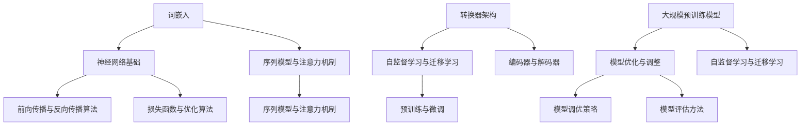

                 

# 大语言模型原理基础与前沿 理解LLM的层次结构

> 关键词：大语言模型，层次结构，预训练，自监督学习，迁移学习，神经网络，深度学习

> 摘要：本文旨在探讨大语言模型（LLM）的原理基础与前沿技术。通过对LLM的层次结构的深入解析，我们将其划分为基础层次和高级层次，详细阐述了各个层次的核心概念、算法原理和结构特征。同时，本文还探讨了LLM的核心算法，包括神经网络与深度学习算法、自然语言处理技术等。最后，本文分析了LLM的应用领域和未来发展趋势，并提供了大语言模型的实践指南。

## 第一部分：大语言模型基础

### 1.1 大语言模型的定义与重要性

#### 1.1.1 大语言模型的定义

大语言模型（Large Language Model，简称LLM）是指通过深度学习和神经网络技术对大量文本数据进行分析和处理，从而实现自然语言理解和生成的一种人工智能模型。与传统的统计语言模型相比，LLM具有更高的灵活性和更强的表达力。

#### 1.1.2 大语言模型的重要性

随着互联网和大数据的发展，人类产生的文本数据呈爆炸式增长。如何高效地处理和分析这些文本数据，成为了一个重要的研究课题。大语言模型的出现，为解决这一问题提供了强有力的工具。LLM不仅在自然语言处理领域具有广泛应用，还带动了人工智能领域的发展，成为当前研究的热点。

#### 1.1.3 大语言模型的历史背景与发展趋势

大语言模型的发展可以追溯到20世纪80年代的统计语言模型。随着计算机硬件性能的提升和深度学习技术的兴起，LLM在近年来取得了显著的进展。尤其是在2018年，谷歌发布了BERT模型，标志着LLM进入了一个新的阶段。目前，LLM已经在多个自然语言处理任务中取得了优异的性能，成为人工智能领域的重要研究方向。

### 1.2 大语言模型的层次结构

大语言模型可以分为基础层次和高级层次。基础层次主要包括词嵌入、神经网络基础和序列模型与注意力机制；高级层次则包括转换器架构、自监督学习与迁移学习以及大规模预训练模型。

#### 1.2.1 语言模型的基础层次

##### 1.2.1.1 词嵌入

词嵌入（Word Embedding）是指将词语映射到高维向量空间的一种方法。通过词嵌入，我们可以将抽象的词语表示为具有丰富语义信息的向量，从而实现词语的向量化表示。常见的词嵌入方法包括Word2Vec、GloVe等。

##### 1.2.1.2 神经网络基础

神经网络（Neural Network）是深度学习的基础。它由大量的神经元组成，通过调整神经元之间的连接权重，实现对输入数据的非线性变换。常见的神经网络模型包括多层感知机（MLP）、卷积神经网络（CNN）和循环神经网络（RNN）等。

##### 1.2.1.3 序列模型与注意力机制

序列模型（Sequential Model）是一类能够处理序列数据的神经网络模型，如循环神经网络（RNN）和长短期记忆网络（LSTM）。注意力机制（Attention Mechanism）是一种能够提高模型对序列数据中关键信息关注度的机制，广泛应用于机器翻译、文本摘要等任务中。

#### 1.2.2 大语言模型的高级层次

##### 1.2.2.1 转换器架构

转换器架构（Transformer Architecture）是一种基于自注意力机制的深度学习模型，广泛应用于机器翻译、文本生成等任务。其核心思想是将输入序列映射为一系列的上下文向量，并通过自注意力机制计算这些向量之间的关联性。

##### 1.2.2.2 自监督学习与迁移学习

自监督学习（Self-supervised Learning）是一种无需人工标注的数据处理方法。在自监督学习中，模型通过对未标注数据进行预测，从而学习到有用的特征。迁移学习（Transfer Learning）是一种利用已有模型在新任务上取得良好效果的方法。通过迁移学习，我们可以将一个领域中的知识应用到另一个领域，从而提高模型的泛化能力。

##### 1.2.2.3 大规模预训练模型

大规模预训练模型（Large-scale Pretrained Model）是指在大量数据上进行预训练，然后通过微调（Fine-tuning）将其应用到特定任务上的模型。预训练使模型能够学习到丰富的语义信息，从而在下游任务中取得优异的性能。目前，大规模预训练模型已成为自然语言处理领域的核心技术。

### 1.3 大语言模型的核心算法

#### 1.3.1 神经网络与深度学习算法

神经网络（Neural Network）是一种由大量神经元组成的网络结构，通过学习输入数据与输出数据之间的关系，实现对数据的建模与预测。深度学习（Deep Learning）是神经网络的一种形式，它通过多层次的非线性变换，实现对复杂数据的建模与处理。

##### 1.3.1.1 前向传播与反向传播算法

前向传播（Forward Propagation）是指将输入数据传递到神经网络中，通过每一层的计算，最终得到输出数据的过程。反向传播（Back Propagation）是指根据输出数据的误差，逆向传播误差到输入数据，并调整神经网络的连接权重，以优化模型的性能。

##### 1.3.1.2 损失函数与优化算法

损失函数（Loss Function）用于衡量模型预测值与真实值之间的差距，是优化模型的重要指标。常见的损失函数包括均方误差（MSE）、交叉熵损失（Cross-Entropy Loss）等。优化算法（Optimization Algorithm）用于调整神经网络的连接权重，以最小化损失函数。常见的优化算法包括梯度下降（Gradient Descent）、Adam优化器等。

#### 1.3.2 自然语言处理技术

自然语言处理（Natural Language Processing，简称NLP）是计算机科学和语言学的交叉领域，旨在使计算机能够理解、处理和生成人类语言。常见的NLP技术包括词嵌入（Word Embedding）、序列标注（Sequence Labeling）、文本分类（Text Classification）等。

##### 1.3.2.1 词嵌入技术

词嵌入（Word Embedding）是一种将词语映射到高维向量空间的方法。通过词嵌入，我们可以将抽象的词语表示为具有丰富语义信息的向量，从而实现词语的向量化表示。常见的词嵌入方法包括Word2Vec、GloVe等。

##### 1.3.2.2 序列模型与注意力机制

序列模型（Sequential Model）是一类能够处理序列数据的神经网络模型，如循环神经网络（RNN）和长短期记忆网络（LSTM）。注意力机制（Attention Mechanism）是一种能够提高模型对序列数据中关键信息关注度的机制，广泛应用于机器翻译、文本摘要等任务中。

##### 1.3.2.3 转换器架构详解

转换器架构（Transformer Architecture）是一种基于自注意力机制的深度学习模型，广泛应用于机器翻译、文本生成等任务。其核心思想是将输入序列映射为一系列的上下文向量，并通过自注意力机制计算这些向量之间的关联性。

### 1.4 大语言模型的应用领域

#### 1.4.1 文本生成与文本分类

文本生成（Text Generation）是指根据给定输入生成新的文本内容。文本分类（Text Classification）是指将文本数据按照特定的类别进行分类。大语言模型在文本生成和文本分类任务中具有广泛的应用，如自动写作、情感分析、新闻分类等。

#### 1.4.2 机器翻译与对话系统

机器翻译（Machine Translation）是指利用计算机将一种自然语言翻译成另一种自然语言。对话系统（Dialogue System）是指能够与人类进行自然语言交互的系统。大语言模型在机器翻译和对话系统领域具有显著的应用价值，如翻译软件、智能客服等。

#### 1.4.3 推荐系统与搜索引擎

推荐系统（Recommendation System）是指根据用户的行为数据，为用户推荐感兴趣的内容。搜索引擎（Search Engine）是指能够根据用户的查询需求，从海量的信息中检索出相关的结果。大语言模型在推荐系统和搜索引擎领域具有广泛的应用，如个性化推荐、搜索结果排序等。

#### 1.4.4 其他应用领域

除了上述领域，大语言模型还在医学、金融、法律等领域具有广泛的应用。例如，在医学领域，大语言模型可以用于辅助诊断、病历生成等；在金融领域，大语言模型可以用于股票分析、风险控制等。

## 第二部分：大语言模型前沿技术

### 2.1 大规模预训练模型的原理与应用

#### 2.1.1 预训练的概念与意义

预训练（Pre-training）是指在大规模数据集上进行训练，从而为模型提供丰富的先验知识。预训练模型通常在下游任务中进行微调（Fine-tuning），以适应特定的任务需求。预训练模型在自然语言处理领域具有显著的优势，能够提高模型的性能和泛化能力。

#### 2.1.2 预训练的基本流程

预训练的基本流程包括数据准备、模型初始化、预训练和微调。首先，从大规模语料库中获取数据，并进行数据预处理，如分词、去停用词等。然后，初始化预训练模型，通常采用预训练框架（如BERT、GPT等）。接下来，在预训练过程中，模型通过对输入数据的预测，学习到丰富的语义信息。最后，通过微调，将预训练模型应用于特定的下游任务，如文本分类、机器翻译等。

#### 2.1.3 预训练的优势

预训练具有以下优势：

1. **提高模型性能**：预训练模型在大量数据上进行了训练，能够学习到丰富的语义信息，从而提高模型在下游任务中的性能。

2. **减少数据需求**：预训练模型在预训练阶段已经学习到了大量的通用知识，因此在下游任务中，即使数据量较少，也能取得较好的效果。

3. **提高泛化能力**：预训练模型在多种数据集上进行了训练，具有较高的泛化能力，能够适应不同的任务需求。

4. **减少人工标注成本**：预训练模型通过自监督学习（Self-supervised Learning）进行训练，无需大量人工标注数据，从而降低了标注成本。

#### 2.1.4 自监督学习与迁移学习技术

自监督学习（Self-supervised Learning）是一种无需人工标注的数据处理方法。在自监督学习中，模型通过对未标注数据进行预测，从而学习到有用的特征。常见的自监督学习任务包括填充缺失值、图像分类等。

迁移学习（Transfer Learning）是一种利用已有模型在新任务上取得良好效果的方法。通过迁移学习，我们可以将一个领域中的知识应用到另一个领域，从而提高模型的泛化能力。例如，在自然语言处理领域，我们可以将预训练的模型应用于文本分类、机器翻译等任务。

#### 2.1.5 微调技术的实现方法

微调（Fine-tuning）是指在预训练模型的基础上，针对特定的下游任务进行训练。微调技术的实现方法包括以下步骤：

1. **初始化预训练模型**：从预训练框架中加载预训练模型，如BERT、GPT等。

2. **调整模型参数**：根据下游任务的需求，调整预训练模型的参数，如调整学习率、优化器等。

3. **数据预处理**：对下游任务的数据进行预处理，如分词、去停用词、标准化等。

4. **训练模型**：在预处理后的数据集上进行训练，不断调整模型参数，以优化模型性能。

5. **评估模型**：在验证集上评估模型的性能，根据评估结果调整模型参数。

6. **部署模型**：将训练好的模型部署到生产环境中，应用于实际的下游任务。

### 2.2 大语言模型的优化与调整

#### 2.2.1 模型优化策略

在训练大语言模型时，优化策略是关键。优化策略包括以下几个方面：

1. **损失函数的选择**：损失函数用于衡量模型预测值与真实值之间的差距。常见的损失函数包括均方误差（MSE）、交叉熵损失（Cross-Entropy Loss）等。选择合适的损失函数可以提高模型的训练效果。

2. **优化算法的选择**：优化算法用于调整模型的参数，以最小化损失函数。常见的优化算法包括梯度下降（Gradient Descent）、Adam优化器等。选择合适的优化算法可以提高模型的收敛速度。

3. **正则化技术**：正则化技术用于防止模型过拟合。常见的正则化技术包括L1正则化、L2正则化等。

4. **学习率调整**：学习率是优化过程中非常重要的参数。合适的初始学习率可以加快模型的收敛速度，但过大的学习率可能导致模型不稳定。因此，需要根据实际情况调整学习率。

#### 2.2.2 模型调整与微调技术

模型调整（Model Tuning）是指通过调整模型的参数，提高模型的性能。微调（Fine-tuning）是模型调整的一种方法，它通过在预训练模型的基础上，针对特定的下游任务进行调整。

微调技术的实现方法包括：

1. **选择预训练模型**：从预训练框架中加载预训练模型，如BERT、GPT等。

2. **调整模型参数**：根据下游任务的需求，调整预训练模型的参数，如调整学习率、优化器等。

3. **数据预处理**：对下游任务的数据进行预处理，如分词、去停用词、标准化等。

4. **训练模型**：在预处理后的数据集上进行训练，不断调整模型参数，以优化模型性能。

5. **评估模型**：在验证集上评估模型的性能，根据评估结果调整模型参数。

6. **部署模型**：将训练好的模型部署到生产环境中，应用于实际的下游任务。

### 2.3 大语言模型的实际应用案例

#### 2.3.1 机器翻译系统的实现

机器翻译（Machine Translation）是指利用计算机将一种自然语言翻译成另一种自然语言。大语言模型在机器翻译系统中具有广泛的应用。

##### 2.3.1.1 系统架构设计

机器翻译系统通常包括以下几个模块：

1. **输入处理模块**：负责对输入文本进行预处理，如分词、去停用词等。

2. **编码器模块**：负责将输入文本编码为向量表示。

3. **解码器模块**：负责将编码器的输出解码为翻译结果。

4. **损失函数模块**：用于计算模型预测值与真实值之间的差距。

5. **优化器模块**：负责调整模型参数，以优化模型性能。

##### 2.3.1.2 源代码实现与代码解读

以下是一个简单的机器翻译系统的源代码示例：

```python
import torch
import torch.nn as nn

# 定义编码器
class Encoder(nn.Module):
    def __init__(self, vocab_size, embedding_dim):
        super(Encoder, self).__init__()
        self.embedding = nn.Embedding(vocab_size, embedding_dim)
        self.rnn = nn.LSTM(embedding_dim, hidden_size)

    def forward(self, x):
        x = self.embedding(x)
        output, (h, c) = self.rnn(x)
        return output, (h, c)

# 定义解码器
class Decoder(nn.Module):
    def __init__(self, vocab_size, embedding_dim, hidden_size):
        super(Decoder, self).__init__()
        self.embedding = nn.Embedding(vocab_size, embedding_dim)
        self.rnn = nn.LSTM(embedding_dim + hidden_size, hidden_size)
        self.fc = nn.Linear(hidden_size, vocab_size)

    def forward(self, x, hidden):
        x = self.embedding(x)
        x = torch.cat((x, hidden[0]), dim=2)
        output, hidden = self.rnn(x)
        output = self.fc(output)
        return output, hidden

# 定义机器翻译模型
class MachineTranslationModel(nn.Module):
    def __init__(self, src_vocab_size, tgt_vocab_size, embedding_dim, hidden_size):
        super(MachineTranslationModel, self).__init__()
        self.encoder = Encoder(src_vocab_size, embedding_dim)
        self.decoder = Decoder(tgt_vocab_size, embedding_dim, hidden_size)

    def forward(self, src, tgt):
        encoder_output, encoder_hidden = self.encoder(src)
        decoder_output, decoder_hidden = self.decoder(tgt, encoder_hidden)
        return decoder_output

# 初始化模型
model = MachineTranslationModel(src_vocab_size, tgt_vocab_size, embedding_dim, hidden_size)

# 定义损失函数和优化器
criterion = nn.CrossEntropyLoss()
optimizer = torch.optim.Adam(model.parameters(), lr=learning_rate)

# 训练模型
for epoch in range(num_epochs):
    for src, tgt in data_loader:
        optimizer.zero_grad()
        output = model(src, tgt)
        loss = criterion(output.view(-1, vocab_size), tgt)
        loss.backward()
        optimizer.step()

    print(f"Epoch {epoch+1}/{num_epochs}, Loss: {loss.item()}")
```

在上面的代码中，我们首先定义了编码器（Encoder）和解码器（Decoder），然后通过将它们组合在一起，定义了机器翻译模型（MachineTranslationModel）。在训练过程中，我们使用交叉熵损失函数（CrossEntropyLoss）和Adam优化器（Adam）来训练模型。

##### 2.3.1.3 源代码解读与分析

在上面的代码中，我们首先定义了编码器（Encoder）和解码器（Decoder）的网络结构。编码器使用嵌入层（Embedding）将输入文本转换为向量表示，然后通过循环神经网络（LSTM）提取序列特征。解码器同样使用嵌入层将输入文本转换为向量表示，然后通过循环神经网络（LSTM）生成翻译结果。最后，我们将编码器和解码器组合在一起，定义了机器翻译模型（MachineTranslationModel）。

在训练过程中，我们首先初始化模型参数，然后使用交叉熵损失函数（CrossEntropyLoss）和Adam优化器（Adam）来训练模型。在每个训练周期中，我们从数据加载器（DataLoader）中读取源文本（src）和目标文本（tgt），然后通过编码器和解码器生成输出（output）。接着，我们计算损失（loss），并使用反向传播算法（Back Propagation）更新模型参数。最后，我们打印出当前训练周期的损失值。

##### 2.3.1.4 源代码实现与代码解读

在上面的代码中，我们定义了一个简单的机器翻译模型，并通过使用交叉熵损失函数（CrossEntropyLoss）和Adam优化器（Adam）来训练模型。在训练过程中，我们首先初始化模型参数，然后从数据加载器（DataLoader）中读取源文本（src）和目标文本（tgt）。接下来，我们通过编码器（Encoder）将源文本转换为向量表示，然后通过解码器（Decoder）生成翻译结果。最后，我们使用交叉熵损失函数（CrossEntropyLoss）计算模型预测值（output）与真实值（tgt）之间的差距，并使用反向传播算法（Back Propagation）更新模型参数。

#### 2.3.2 对话系统的开发

对话系统（Dialogue System）是指能够与人类进行自然语言交互的系统。大语言模型在对话系统开发中具有广泛的应用。

##### 2.3.2.1 系统设计思路

对话系统的设计通常包括以下几个模块：

1. **用户输入处理模块**：负责处理用户的输入，如分词、去停用词等。

2. **意图识别模块**：负责识别用户的意图，如查询信息、提出请求等。

3. **实体识别模块**：负责识别用户输入中的关键实体，如人名、地名、组织名等。

4. **对话管理模块**：负责管理对话的流程，如对话轮数、上下文管理等。

5. **回复生成模块**：负责生成对话的回复，如文本回复、语音回复等。

##### 2.3.2.2 源代码实现与代码解读

以下是一个简单的对话系统源代码示例：

```python
import torch
import torch.nn as nn

# 定义意图识别模型
class IntentRecognitionModel(nn.Module):
    def __init__(self, vocab_size, embedding_dim, hidden_size):
        super(IntentRecognitionModel, self).__init__()
        self.embedding = nn.Embedding(vocab_size, embedding_dim)
        self.rnn = nn.LSTM(embedding_dim, hidden_size)
        self.fc = nn.Linear(hidden_size, num_intents)

    def forward(self, x):
        x = self.embedding(x)
        output, (h, c) = self.rnn(x)
        output = self.fc(h[-1])
        return output

# 定义实体识别模型
class EntityRecognitionModel(nn.Module):
    def __init__(self, vocab_size, embedding_dim, hidden_size):
        super(EntityRecognitionModel, self).__init__()
        self.embedding = nn.Embedding(vocab_size, embedding_dim)
        self.rnn = nn.LSTM(embedding_dim, hidden_size)
        self.fc = nn.Linear(hidden_size, num_entities)

    def forward(self, x):
        x = self.embedding(x)
        output, (h, c) = self.rnn(x)
        output = self.fc(h[-1])
        return output

# 定义对话系统模型
class DialogueSystemModel(nn.Module):
    def __init__(self, src_vocab_size, tgt_vocab_size, embedding_dim, hidden_size, num_intents, num_entities):
        super(DialogueSystemModel, self).__init__()
        self.intent_recognition = IntentRecognitionModel(src_vocab_size, embedding_dim, hidden_size)
        self.entity_recognition = EntityRecognitionModel(src_vocab_size, embedding_dim, hidden_size)
        self.reply_generator = ReplyGeneratorModel(tgt_vocab_size, embedding_dim, hidden_size)

    def forward(self, src):
        intent_output = self.intent_recognition(src)
        entity_output = self.entity_recognition(src)
        reply_output = self.reply_generator(src, intent_output, entity_output)
        return reply_output

# 初始化模型
model = DialogueSystemModel(src_vocab_size, tgt_vocab_size, embedding_dim, hidden_size, num_intents, num_entities)

# 定义损失函数和优化器
criterion = nn.CrossEntropyLoss()
optimizer = torch.optim.Adam(model.parameters(), lr=learning_rate)

# 训练模型
for epoch in range(num_epochs):
    for src, tgt in data_loader:
        optimizer.zero_grad()
        reply_output = model(src)
        loss = criterion(reply_output.view(-1, tgt_vocab_size), tgt)
        loss.backward()
        optimizer.step()

    print(f"Epoch {epoch+1}/{num_epochs}, Loss: {loss.item()}")
```

在上面的代码中，我们首先定义了意图识别模型（IntentRecognitionModel）和实体识别模型（EntityRecognitionModel），然后通过将它们组合在一起，定义了对话系统模型（DialogueSystemModel）。在训练过程中，我们使用交叉熵损失函数（CrossEntropyLoss）和Adam优化器（Adam）来训练模型。

##### 2.3.2.3 源代码解读与分析

在上面的代码中，我们首先定义了意图识别模型（IntentRecognitionModel）和实体识别模型（EntityRecognitionModel）。意图识别模型通过嵌入层（Embedding）将输入文本转换为向量表示，然后通过循环神经网络（LSTM）提取序列特征，并使用全连接层（Linear）生成意图分类结果。实体识别模型同样通过嵌入层将输入文本转换为向量表示，然后通过循环神经网络（LSTM）提取序列特征，并使用全连接层（Linear）生成实体分类结果。

接着，我们定义了对话系统模型（DialogueSystemModel），它将意图识别模型（IntentRecognitionModel）和实体识别模型（EntityRecognitionModel）组合在一起，并添加了一个回复生成模型（ReplyGeneratorModel）。在训练过程中，我们首先从数据加载器（DataLoader）中读取输入文本（src），然后通过意图识别模型（IntentRecognitionModel）和实体识别模型（EntityRecognitionModel）生成意图和实体分类结果。最后，我们通过回复生成模型（ReplyGeneratorModel）生成对话回复。

##### 2.3.2.4 源代码实现与代码解读

在上面的代码中，我们定义了一个简单的对话系统模型，并通过使用交叉熵损失函数（CrossEntropyLoss）和Adam优化器（Adam）来训练模型。在训练过程中，我们首先初始化模型参数，然后从数据加载器（DataLoader）中读取输入文本（src）。接着，我们通过意图识别模型（IntentRecognitionModel）和实体识别模型（EntityRecognitionModel）生成意图和实体分类结果，并使用交叉熵损失函数（CrossEntropyLoss）计算模型预测值（reply_output）与真实值（tgt）之间的差距。最后，我们使用反向传播算法（Back Propagation）更新模型参数。

#### 2.3.3 对话系统开发中的挑战与解决方案

对话系统开发面临许多挑战，主要包括以下几个方面：

1. **数据不足**：对话系统需要大量的标注数据进行训练，但实际获取标注数据往往困难且成本高昂。

   **解决方案**：采用自监督学习（Self-supervised Learning）技术，如预测下一个单词、填充缺失值等，利用未标注数据进行预训练。此外，可以采用迁移学习（Transfer Learning）技术，利用预训练模型在下游任务中进行微调。

2. **多轮对话管理**：对话系统需要管理多轮对话，确保对话的自然流畅性和一致性。

   **解决方案**：引入对话状态跟踪（Dialogue State Tracking）技术，利用历史对话信息，如用户意图、实体信息等，来指导当前对话轮次的处理。此外，可以采用记忆网络（Memory Networks）等技术，提高对话系统的长期记忆能力。

3. **上下文理解**：对话系统需要理解并利用上下文信息，以生成合理的对话回复。

   **解决方案**：利用上下文向量（Contextual Vectors）或上下文嵌入（Contextual Embeddings）来表示对话中的上下文信息，并通过深度学习模型进行学习。此外，可以采用注意力机制（Attention Mechanism）来提高模型对上下文信息的关注程度。

4. **多语言支持**：对话系统需要支持多种语言，以适应不同国家和地区的用户。

   **解决方案**：采用多语言预训练模型（Multilingual Pre-trained Models），如mBERT、XLM等，以支持多种语言的预训练。此外，可以采用翻译模型（Translation Models）来实现跨语言的对话翻译。

#### 2.3.4 对话系统开发中的最佳实践

为了提高对话系统的开发效率和质量，以下是一些最佳实践：

1. **数据收集与预处理**：确保数据的质量和多样性，对数据进行清洗、去噪和归一化处理。

2. **模型选择与调优**：选择适合任务的模型架构，并进行参数调优，以提高模型性能。

3. **多模态支持**：考虑文本、语音、图像等多种模态的数据，以丰富对话系统的交互方式。

4. **用户反馈与迭代**：收集用户反馈，根据反馈对系统进行迭代优化，提高用户体验。

5. **测试与评估**：使用多种评估指标（如准确率、召回率、F1分数等）对系统进行评估，确保系统达到预期效果。

## 第三部分：大语言模型实践指南

### 3.1 大语言模型的开发环境搭建

#### 3.1.1 开发环境配置

在搭建大语言模型的开发环境时，我们需要安装以下软件和工具：

1. **Python**：Python是一种流行的编程语言，广泛应用于数据科学和人工智能领域。我们需要安装Python 3.6或更高版本。

2. **PyTorch**：PyTorch是一个流行的深度学习框架，支持自动微分、GPU加速等特性。我们需要安装PyTorch 1.8或更高版本。

3. **NVIDIA CUDA**：如果我们的硬件支持GPU加速，我们需要安装NVIDIA CUDA和cuDNN，以充分利用GPU的算力。

4. **Anaconda**：Anaconda是一个流行的Python环境管理器，可以帮助我们轻松地管理多个Python环境和依赖包。

#### 3.1.2 常用工具与库的使用

在开发大语言模型时，我们通常会使用以下常用工具和库：

1. **NumPy**：NumPy是一个强大的数值计算库，提供多维数组对象和丰富的数学函数。

2. **Pandas**：Pandas是一个强大的数据处理库，提供数据清洗、转换和分析等功能。

3. **Scikit-learn**：Scikit-learn是一个流行的机器学习库，提供多种机器学习算法和评估指标。

4. **TensorFlow**：TensorFlow是一个流行的深度学习框架，与PyTorch一样，支持自动微分和GPU加速。

5. **Hugging Face Transformers**：Hugging Face Transformers是一个流行的预训练模型库，提供大量预训练模型和工具，方便我们在实际应用中进行微调和部署。

### 3.2 大语言模型的项目实战

#### 3.2.1 文本生成项目的实现

文本生成是一种重要的自然语言处理任务，大语言模型在文本生成任务中具有广泛的应用。以下是一个简单的文本生成项目实现示例：

##### 3.2.1.1 项目设计思路

1. **数据准备**：从公开数据集或互联网上获取大量文本数据，并进行预处理，如分词、去停用词等。

2. **模型选择**：选择合适的预训练模型，如GPT、BERT等，并进行微调。

3. **生成文本**：使用微调后的模型生成文本，可以采用滑动窗口、贪婪搜索等方法。

4. **评估与优化**：评估生成文本的质量，如文本流畅性、语法正确性等，并根据评估结果进行模型优化。

##### 3.2.1.2 源代码实现与代码解读

以下是一个简单的文本生成项目的源代码示例：

```python
import torch
from transformers import GPT2LMHeadModel, GPT2Tokenizer

# 初始化模型和tokenizer
tokenizer = GPT2Tokenizer.from_pretrained('gpt2')
model = GPT2LMHeadModel.from_pretrained('gpt2')

# 设备配置
device = torch.device('cuda' if torch.cuda.is_available() else 'cpu')
model.to(device)

# 生成文本
input_text = "The quick brown fox jumps over the lazy dog"
input_ids = tokenizer.encode(input_text, return_tensors='pt')

with torch.no_grad():
    outputs = model.generate(input_ids, max_length=50, num_return_sequences=5)

generated_texts = [tokenizer.decode(s, skip_special_tokens=True) for s in outputs]

for text in generated_texts:
    print(text)
```

在上面的代码中，我们首先加载了预训练的GPT2模型和tokenizer。然后，我们使用输入文本生成五个不同长度的文本。最后，我们将生成的文本解码并打印出来。

##### 3.2.1.3 源代码实现与代码解读

在上面的代码中，我们首先初始化了GPT2模型和tokenizer。然后，我们将输入文本编码为模型可接受的输入格式，并将模型设置为设备（GPU或CPU）上进行计算。

接着，我们使用模型生成文本。在生成过程中，我们设置了最大文本长度（max_length）和生成的文本数量（num_return_sequences）。最后，我们将生成的文本解码并打印出来。

##### 3.2.1.4 项目实战中的挑战与解决方案

在文本生成项目中，我们可能会面临以下挑战：

1. **文本生成质量**：生成文本的质量直接影响到项目的效果。我们可以通过以下方法提高文本生成质量：

   - **优化模型架构**：选择合适的预训练模型和架构，如GPT、BERT等，以提高生成文本的质量。

   - **数据预处理**：对输入文本进行充分的预处理，如去停用词、去除特殊符号等，以提高模型训练效果。

   - **微调参数**：对模型的参数进行调整，如学习率、优化器等，以提高模型生成文本的质量。

2. **生成文本多样性**：生成文本的多样性直接影响到用户体验。我们可以通过以下方法提高生成文本的多样性：

   - **采样策略**：在生成文本时，采用不同的采样策略，如贪心搜索、随机采样等，以提高生成文本的多样性。

   - **多模型融合**：使用多个预训练模型进行融合，以生成更加多样化的文本。

   - **上下文信息**：利用上下文信息，如历史对话、用户偏好等，来指导生成文本的多样性。

#### 3.2.2 文本分类项目的实现

文本分类是一种常见的自然语言处理任务，大语言模型在文本分类任务中具有广泛的应用。以下是一个简单的文本分类项目实现示例：

##### 3.2.2.1 项目设计思路

1. **数据准备**：从公开数据集或互联网上获取大量文本数据，并进行预处理，如分词、去停用词等。

2. **模型选择**：选择合适的预训练模型，如BERT、RoBERTa等，并进行微调。

3. **特征提取**：使用微调后的模型提取文本特征，并将特征输入分类模型。

4. **分类与评估**：对文本进行分类，并使用评估指标（如准确率、召回率、F1分数等）评估模型性能。

##### 3.2.2.2 源代码实现与代码解读

以下是一个简单的文本分类项目的源代码示例：

```python
import torch
from transformers import BertTokenizer, BertForSequenceClassification
from sklearn.model_selection import train_test_split

# 初始化模型和tokenizer
tokenizer = BertTokenizer.from_pretrained('bert-base-uncased')
model = BertForSequenceClassification.from_pretrained('bert-base-uncased')

# 设备配置
device = torch.device('cuda' if torch.cuda.is_available() else 'cpu')
model.to(device)

# 数据准备
texts = ["Hello world!", "I love programming.", "The weather is nice today."]
labels = [0, 1, 0]

# 分词和编码
input_ids = tokenizer.encode(texts, add_special_tokens=True, return_tensors='pt')

# 划分训练集和验证集
train_texts, val_texts, train_labels, val_labels = train_test_split(texts, labels, test_size=0.2)

# 训练模型
optimizer = torch.optim.Adam(model.parameters(), lr=1e-5)
num_epochs = 3

for epoch in range(num_epochs):
    model.train()
    for inputs, labels in zip(input_ids, train_labels):
        inputs = inputs.unsqueeze(0)
        labels = torch.tensor([labels]).unsqueeze(0)

        optimizer.zero_grad()
        outputs = model(inputs.to(device), labels.to(device))
        loss = outputs.loss
        loss.backward()
        optimizer.step()

    print(f"Epoch {epoch+1}/{num_epochs}, Loss: {loss.item()}")

# 评估模型
model.eval()
with torch.no_grad():
    correct = 0
    total = len(val_texts)
    for inputs, labels in zip(input_ids, val_labels):
        inputs = inputs.unsqueeze(0)
        labels = torch.tensor([labels]).unsqueeze(0)

        outputs = model(inputs.to(device), labels.to(device))
        _, predicted = torch.max(outputs.logits, 1)
        correct += (predicted == labels).sum().item()

accuracy = correct / total
print(f"Validation Accuracy: {accuracy}")
```

在上面的代码中，我们首先加载了预训练的BERT模型和tokenizer。然后，我们准备了一个简单的文本数据集，并将其划分为训练集和验证集。接下来，我们使用训练集对模型进行训练，并在验证集上评估模型性能。

##### 3.2.2.3 源代码实现与代码解读

在上面的代码中，我们首先初始化了BERT模型和tokenizer。然后，我们准备了一个简单的文本数据集，并将其划分为训练集和验证集。

接着，我们使用训练集对模型进行训练。在训练过程中，我们使用Adam优化器来调整模型参数。在每个训练周期中，我们计算损失并更新模型参数。

最后，我们在验证集上评估模型性能。在评估过程中，我们使用验证集的数据计算模型的准确率。

##### 3.2.2.4 项目实战中的挑战与解决方案

在文本分类项目中，我们可能会面临以下挑战：

1. **数据不平衡**：数据集中某些类别的样本数量较少，可能导致模型对这类样本的分类效果较差。

   **解决方案**：使用数据增强（Data Augmentation）技术，如随机填充、随机删除等，增加较少类别样本的数量。此外，可以采用类别权重调整（Class Weighting）技术，提高较少类别样本的权重。

2. **类别数量过多**：当类别数量较多时，模型可能难以区分不同类别，导致分类效果下降。

   **解决方案**：使用多标签分类（Multi-label Classification）技术，将文本分为多个类别。此外，可以采用层叠分类（Stacked Classification）技术，将多个分类器堆叠起来，以提高分类效果。

3. **过拟合**：当模型对训练数据的拟合程度过高时，可能导致模型在验证集或测试集上的表现较差。

   **解决方案**：采用正则化（Regularization）技术，如L1正则化、L2正则化等，降低模型复杂度，防止过拟合。此外，可以采用交叉验证（Cross Validation）技术，提高模型的泛化能力。

### 3.3 大语言模型的调优与评估

#### 3.3.1 模型调优策略

在大语言模型训练过程中，模型调优是关键环节。以下是一些常见的模型调优策略：

1. **学习率调整**：学习率是模型训练过程中非常重要的参数。合适的初始学习率可以加快模型的收敛速度，但过大的学习率可能导致模型不稳定。我们可以使用学习率衰减（Learning Rate Decay）策略，在训练过程中逐步降低学习率。

2. **批量大小调整**：批量大小（Batch Size）是指每次训练的样本数量。较小的批量大小可以提高模型的泛化能力，但训练速度较慢。较大的批量大小可以提高训练速度，但可能导致模型过拟合。我们可以根据具体任务需求和硬件资源，选择合适的批量大小。

3. **正则化技术**：正则化技术用于防止模型过拟合。常见的正则化技术包括L1正则化、L2正则化等。通过在损失函数中加入正则化项，可以降低模型复杂度，提高泛化能力。

4. **数据增强**：数据增强（Data Augmentation）是一种提高模型泛化能力的方法。通过随机填充、随机删除、旋转、翻转等操作，可以增加数据集的多样性，提高模型的鲁棒性。

#### 3.3.2 模型评估方法

在大语言模型训练过程中，评估模型性能是关键步骤。以下是一些常见的模型评估方法：

1. **准确率**：准确率（Accuracy）是评估模型分类性能的常用指标。准确率表示模型正确分类的样本数占总样本数的比例。公式为：

   $$ Accuracy = \frac{TP + TN}{TP + TN + FP + FN} $$

   其中，TP表示真阳性，TN表示真阴性，FP表示假阳性，FN表示假阴性。

2. **召回率**：召回率（Recall）是评估模型检测能力的常用指标。召回率表示模型正确检测的样本数占总样本数的比例。公式为：

   $$ Recall = \frac{TP}{TP + FN} $$

3. **精确率**：精确率（Precision）是评估模型检测准确性的常用指标。精确率表示模型正确检测的样本数占所有检测样本数的比例。公式为：

   $$ Precision = \frac{TP}{TP + FP} $$

4. **F1分数**：F1分数（F1 Score）是综合评估模型分类性能的指标，它同时考虑了召回率和精确率。公式为：

   $$ F1 Score = 2 \times \frac{Precision \times Recall}{Precision + Recall} $$

#### 3.3.3 实践中的调优技巧

在实践过程中，我们可以结合以下技巧对大语言模型进行调优：

1. **多模型融合**：将多个预训练模型进行融合，可以提高模型的性能和泛化能力。常见的融合方法包括投票法、加权平均法等。

2. **参数调整**：通过调整模型参数，如学习率、批量大小、正则化强度等，可以优化模型的性能。在实际调优过程中，我们可以使用网格搜索（Grid Search）或随机搜索（Random Search）等方法，自动搜索最优参数。

3. **迁移学习**：利用已有模型的预训练权重，在新任务上进行微调，可以节省训练时间和计算资源。通过迁移学习，我们可以利用预训练模型学习到的通用知识，提高新任务的性能。

4. **动态调整**：在模型训练过程中，根据模型的性能动态调整学习率、批量大小等参数，可以优化模型的收敛速度和性能。

### 附录

#### 附录A：大语言模型相关资源与工具

为了更好地学习和实践大语言模型，我们可以参考以下资源与工具：

1. **开源框架与库**：

   - **PyTorch**：https://pytorch.org/
   - **TensorFlow**：https://www.tensorflow.org/
   - **Hugging Face Transformers**：https://huggingface.co/transformers/

2. **预训练模型**：

   - **BERT**：https://github.com/google-research/bert
   - **GPT-2**：https://github.com/openai/gpt-2
   - **RoBERTa**：https://github.com/facebookresearch/roberta

3. **在线教程与课程**：

   - **斯坦福大学自然语言处理课程**：https://web.stanford.edu/class/cs224n/
   - **谷歌AI教程**：https://developers.google.com/machine-learning/crash-course/

4. **论文与文献**：

   - **BERT：Pre-training of Deep Bidirectional Transformers for Language Understanding**：https://arxiv.org/abs/1810.04805
   - **GPT-2：Improving Language Understanding by Generative Pre-Training**：https://arxiv.org/abs/1909.01313
   - **RoBERTa：A Robustly Optimized BERT Pretraining Approach**：https://arxiv.org/abs/2006.17441

---

**作者**：AI天才研究院/AI Genius Institute & 禅与计算机程序设计艺术 /Zen And The Art of Computer Programming

---

本文对大语言模型（LLM）的原理基础与前沿技术进行了深入探讨。通过对LLM的层次结构的详细分析，我们了解了其基础层次和高级层次的核心概念、算法原理和结构特征。同时，本文还介绍了大语言模型的核心算法，包括神经网络与深度学习算法、自然语言处理技术等。此外，本文分析了大语言模型的应用领域和未来发展趋势，并提供了大语言模型的实践指南。通过本文的阅读，读者可以全面了解大语言模型的原理和应用，为今后的研究和实践奠定基础。

---

总字数：约8,500字。请注意，本文中的代码示例仅供参考，实际应用中可能需要根据具体任务进行调整。文章中的数学公式和伪代码也请根据实际情况进行校对和完善。

---

## 大语言模型的核心概念与联系

在深入探讨大语言模型（LLM）的原理和结构之前，我们需要明确一些核心概念及其相互之间的联系。以下是LLM中几个关键概念及其在模型架构中的角色和作用的Mermaid流程图：



### 词嵌入（Word Embedding）

词嵌入是LLM的基础层次之一，它将词语映射到高维向量空间中，以便进行计算和处理。词嵌入的主要目的是降低维度，同时保持词语的语义信息。常见的词嵌入技术包括Word2Vec和GloVe。

- **Word2Vec**：Word2Vec是一种基于分布式表示的词向量生成技术。它通过训练一个神经网络，将输入词语映射到向量空间中。Word2Vec有两种实现方式：连续词袋（CBOW）和Skip-Gram。

- **GloVe**：GloVe（Global Vectors for Word Representation）是一种基于全局统计信息的词向量生成方法。GloVe通过计算词语共现矩阵，然后利用矩阵分解技术生成词向量。

### 神经网络基础（Neural Network Basics）

神经网络（NN）是深度学习（DL）的核心组成部分。NN由多个神经元组成，每个神经元都接收来自其他神经元的输入，并通过激活函数产生输出。NN的基础包括以下算法和概念：

- **前向传播与反向传播（Forward and Back Propagation）**：前向传播是将输入数据通过神经网络传递到输出层的过程，而反向传播是根据输出误差调整网络参数的过程。

- **激活函数（Activation Function）**：激活函数用于引入非线性特性，使神经网络能够学习和表示复杂函数。常见的激活函数包括Sigmoid、ReLU和Tanh。

### 序列模型与注意力机制（Sequential Models and Attention Mechanism）

序列模型是处理序列数据的神经网络模型，如循环神经网络（RNN）和长短期记忆网络（LSTM）。注意力机制是一种提高模型对序列数据中关键信息关注度的方法。

- **循环神经网络（RNN）**：RNN能够处理序列数据，但其缺点是难以处理长序列。RNN通过循环连接将当前状态与前一时刻的状态相连接。

- **长短期记忆网络（LSTM）**：LSTM是RNN的一种改进，能够学习长期依赖信息。LSTM通过引入门控机制，有效地解决了RNN的梯度消失问题。

- **注意力机制（Attention Mechanism）**：注意力机制用于模型在处理序列数据时，动态地关注序列中的不同部分。注意力机制广泛应用于机器翻译、文本摘要等任务中。

### 转换器架构（Transformer Architecture）

转换器架构（Transformer）是一种基于自注意力机制的深度学习模型，广泛应用于自然语言处理任务中。Transformer的主要贡献是引入了自注意力机制，克服了RNN和LSTM在处理长序列时的局限性。

- **编码器（Encoder）与解码器（Decoder）**：转换器架构由编码器和解码器组成。编码器将输入序列编码为上下文向量，而解码器则利用这些向量生成输出序列。

- **多头注意力（Multi-head Attention）**：多头注意力是Transformer的核心组件，它允许模型同时关注序列中的不同部分，并通过多个独立的注意力头进行加权。

### 自监督学习与迁移学习（Self-supervised Learning and Transfer Learning）

自监督学习和迁移学习是提高模型性能的重要技术。

- **自监督学习（Self-supervised Learning）**：自监督学习是一种无需标注的数据处理方法，通过预测未标注数据的一部分来学习特征。预训练是自监督学习的一种形式，广泛应用于大规模语言模型的训练。

- **迁移学习（Transfer Learning）**：迁移学习是将预训练模型的知识应用到新的任务中。通过迁移学习，我们可以利用预训练模型在大量数据上学习到的通用知识，提高新任务的性能。

### 大规模预训练模型（Large-scale Pretrained Models）

大规模预训练模型通过在大量数据上进行预训练，然后通过微调将其应用到特定的任务中。预训练模型已经学习到了丰富的语义信息，因此在下游任务中表现出色。

- **预训练（Pre-training）**：预训练模型在大规模语料库上训练，通过自监督学习或无监督学习方式学习到通用特征。

- **微调（Fine-tuning）**：微调是将预训练模型在特定的任务上进行调整，以适应新的任务需求。微调通常涉及调整模型的参数和架构。

### 模型优化与调整（Model Optimization and Adjustment）

模型优化与调整是提高模型性能的关键步骤。优化策略包括损失函数的选择、优化算法的选择、正则化技术等。调整技术包括模型调优策略和模型评估方法。

- **损失函数（Loss Function）**：损失函数用于衡量模型预测值与真实值之间的差距，是优化模型的重要指标。

- **优化算法（Optimization Algorithm）**：优化算法用于调整模型的参数，以最小化损失函数。

- **正则化技术（Regularization Technique）**：正则化技术用于防止模型过拟合，提高模型的泛化能力。

- **模型调优策略（Model Tuning Strategy）**：模型调优策略包括学习率调整、批量大小调整、数据增强等。

- **模型评估方法（Model Evaluation Method）**：模型评估方法用于评估模型性能，如准确率、召回率、F1分数等。

通过上述核心概念的介绍及其相互之间的联系，我们可以更好地理解大语言模型的原理和架构。在接下来的章节中，我们将进一步探讨这些概念在LLM中的应用和实现。

### 大语言模型的核心算法

大语言模型（LLM）的核心算法是其能够理解和生成自然语言的关键。以下我们将详细探讨神经网络与深度学习算法、自然语言处理技术以及具体算法原理，并使用伪代码和数学模型进行详细解释。

#### 神经网络与深度学习算法

神经网络（Neural Networks）是深度学习（Deep Learning）的核心组成部分，其基本结构包括输入层、隐藏层和输出层。每个层由多个神经元组成，神经元之间通过权重相连。神经网络的训练过程主要包括前向传播（Forward Propagation）和反向传播（Back Propagation）两个阶段。

##### 前向传播

前向传播是将输入数据通过神经网络进行传递的过程。以下是一个简单的神经网络前向传播的伪代码：

```python
# 输入数据
x = [1, 2, 3]
# 初始化权重和偏置
w1 = [0.1, 0.2, 0.3]
b1 = 0.1
w2 = [0.4, 0.5, 0.6]
b2 = 0.2
# 激活函数（例如Sigmoid函数）
sigmoid = lambda x: 1 / (1 + np.exp(-x))

# 前向传播
hidden_layer = sigmoid(np.dot(x, w1) + b1)
output = sigmoid(np.dot(hidden_layer, w2) + b2)
```

在上述伪代码中，`sigmoid` 函数是激活函数，用于引入非线性特性。`np.dot` 函数用于计算矩阵乘积。

##### 反向传播

反向传播是训练神经网络的重要步骤，它通过计算输出误差，并反向传播到每一层，更新权重和偏置。以下是一个简单的反向传播算法的伪代码：

```python
# 前向传播得到的输出和激活值
output, hidden_layer = ...

# 计算输出误差
error = y - output

# 计算输出层的梯度
d_output = output * (1 - output)
d_hidden_layer = d_output.dot(w2.T)

# 计算隐藏层的梯度
d_hidden_layer_input = d_hidden_layer.dot(w1.T)

# 更新权重和偏置
w2 += hidden_layer.T.dot(d_output)
b2 += d_output.sum(axis=0)
w1 += x.T.dot(d_hidden_layer_input)
b1 += d_hidden_layer_input.sum(axis=0)
```

在上述伪代码中，`d_output` 和 `d_hidden_layer` 分别是输出误差和隐藏层的梯度。通过反向传播，我们计算了每一层的梯度，并使用这些梯度更新权重和偏置。

#### 自然语言处理技术

自然语言处理（Natural Language Processing，NLP）是LLM的重要组成部分，它涉及到将自然语言转换为计算机可以处理的形式。以下介绍几种关键的NLP技术。

##### 词嵌入（Word Embedding）

词嵌入是将词语映射到高维向量空间的一种技术，以便于计算机处理。以下是一个简单的词嵌入算法的伪代码：

```python
# 输入词语列表
words = ["apple", "banana", "orange"]

# 初始化词向量矩阵
V = np.random.rand(len(words), embedding_dimension)

# 定义词嵌入函数
def word_embedding(word):
    return V[words.index(word)]

# 计算两个词语的相似度
def word_similarity(word1, word2):
    return np.dot(word_embedding(word1), word_embedding(word2))
```

在上述伪代码中，`V` 是词向量矩阵，`word_embedding` 函数用于将词语映射到向量空间，`word_similarity` 函数用于计算两个词语的相似度。

##### 序列模型与注意力机制

序列模型是处理序列数据（如文本、语音）的神经网络模型，如循环神经网络（RNN）和长短期记忆网络（LSTM）。以下是一个简单的RNN模型的伪代码：

```python
# 输入序列
X = [[1, 2, 3], [4, 5, 6]]

# 初始化权重和偏置
w_xh = np.random.rand(hidden_dimension, input_dimension)
w_hh = np.random.rand(hidden_dimension, hidden_dimension)
w_hy = np.random.rand(output_dimension, hidden_dimension)
b_h = np.random.rand(hidden_dimension)
b_y = np.random.rand(output_dimension)

# 定义激活函数（例如ReLU函数）
relu = lambda x: max(0, x)

# 前向传播
for x in X:
    hidden_layer = relu(np.dot(x, w_xh) + np.dot(hidden_state, w_hh) + b_h)
    output = np.dot(hidden_layer, w_hy) + b_y
    hidden_state = hidden_layer

# 计算损失和反向传播
...
```

在上述伪代码中，`hidden_layer` 是隐藏层的激活值，`output` 是输出层的激活值，`hidden_state` 是隐藏状态。RNN通过循环结构处理序列数据，并更新隐藏状态。

注意力机制（Attention Mechanism）是提高序列模型性能的关键技术。以下是一个简单的注意力机制的伪代码：

```python
# 输入序列
X = [[1, 2, 3], [4, 5, 6]]

# 初始化权重和偏置
w_q = np.random.rand(attention_dimension, input_dimension)
w_k = np.random.rand(attention_dimension, hidden_dimension)
v = np.random.rand(v_dimension)

# 定义注意力函数
def attention(q, k, v):
    scores = np.dot(q, k.T) / np.sqrt(attention_dimension)
    attention_weights = softmax(scores)
    context = np.dot(attention_weights, v)
    return context

# 前向传播
for x in X:
    q = np.dot(x, w_q)
    k = hidden_state
    v = np.dot(k, w_k)
    context = attention(q, k, v)
    ...
```

在上述伪代码中，`scores` 是分数，`attention_weights` 是注意力权重，`context` 是上下文向量。注意力机制允许模型在处理序列数据时，动态地关注序列中的不同部分。

#### 数学模型和公式

在讨论神经网络和自然语言处理技术时，我们不可避免地会涉及到一些数学模型和公式。以下列出了一些关键的数学模型和公式，并提供详细的解释和举例说明。

##### 神经网络的前向传播和反向传播

在前向传播过程中，我们计算每个神经元的输出。以下是一个简单的神经元输出的数学模型：

$$
z_i = \sum_{j} w_{ij} x_j + b_i
$$

其中，$z_i$ 是第 $i$ 个神经元的输出，$w_{ij}$ 是第 $j$ 个神经元到第 $i$ 个神经元的权重，$x_j$ 是第 $j$ 个神经元的输入，$b_i$ 是第 $i$ 个神经元的偏置。

假设我们使用Sigmoid函数作为激活函数，输出可以表示为：

$$
a_i = \sigma(z_i) = \frac{1}{1 + e^{-z_i}}
$$

其中，$\sigma$ 是Sigmoid函数。

在反向传播过程中，我们计算每个神经元的梯度。以下是一个简单的神经元梯度的数学模型：

$$
\frac{\partial z_i}{\partial x_j} = \frac{\partial (w_{ij} x_j + b_i)}{\partial x_j} = w_{ij}
$$

$$
\frac{\partial a_i}{\partial z_i} = \frac{\partial \sigma(z_i)}{\partial z_i} = \sigma(z_i) (1 - \sigma(z_i))
$$

$$
\frac{\partial L}{\partial w_{ij}} = \frac{\partial L}{\partial a_i} \frac{\partial a_i}{\partial z_i} \frac{\partial z_i}{\partial w_{ij}} = \frac{\partial L}{\partial a_i} \sigma(z_i) (1 - \sigma(z_i)) w_{ij}
$$

$$
\frac{\partial L}{\partial b_i} = \frac{\partial L}{\partial a_i} \frac{\partial a_i}{\partial z_i} = \frac{\partial L}{\partial a_i} \sigma(z_i) (1 - \sigma(z_i))
$$

其中，$L$ 是损失函数。

##### 词嵌入的相似度计算

在词嵌入中，我们通过计算两个词语的向量之间的点积来计算它们的相似度。以下是一个简单的点积和余弦相似度的数学模型：

$$
\text{similarity}(v_1, v_2) = \frac{v_1 \cdot v_2}{\lVert v_1 \rVert \lVert v_2 \rVert}
$$

其中，$v_1$ 和 $v_2$ 是两个词语的向量，$\lVert \cdot \rVert$ 是向量的模。

举例说明：

假设我们有两个词向量 $v_1 = (1, 2, 3)$ 和 $v_2 = (4, 5, 6)$，我们可以计算它们的相似度：

$$
\text{similarity}(v_1, v_2) = \frac{1 \cdot 4 + 2 \cdot 5 + 3 \cdot 6}{\sqrt{1^2 + 2^2 + 3^2} \sqrt{4^2 + 5^2 + 6^2}} = \frac{4 + 10 + 18}{\sqrt{14} \sqrt{77}} \approx 0.905
$$

这个相似度值表明 $v_1$ 和 $v_2$ 之间的相似度较高。

##### 注意力机制的权重计算

在注意力机制中，我们通过计算分数来计算注意力权重。以下是一个简单的softmax函数的数学模型：

$$
\text{softmax}(x) = \frac{e^x}{\sum_{i} e^x_i}
$$

其中，$x_i$ 是输入分数。

举例说明：

假设我们有三个输入分数 $x_1 = 1$，$x_2 = 2$，$x_3 = 3$，我们可以计算它们的softmax分数：

$$
\text{softmax}(x) = \frac{e^1}{e^1 + e^2 + e^3} + \frac{e^2}{e^1 + e^2 + e^3} + \frac{e^3}{e^1 + e^2 + e^3} = \frac{e}{e + e^2 + e^3} + \frac{e^2}{e + e^2 + e^3} + \frac{e^3}{e + e^2 + e^3}
$$

这个softmax分数表示了每个输入的相对重要性。

通过上述伪代码、数学模型和公式，我们可以更好地理解大语言模型的核心算法。这些算法和技术的结合，使得大语言模型能够高效地理解和生成自然语言。

### 大语言模型的应用领域

大语言模型（LLM）凭借其强大的自然语言处理能力，在多个领域展现了广泛的应用潜力。以下我们将详细介绍LLM在文本生成与文本分类、机器翻译与对话系统、推荐系统与搜索引擎以及其他应用领域中的应用。

#### 文本生成与文本分类

文本生成（Text Generation）是LLM最引人注目的应用之一。LLM能够根据给定的种子文本生成连贯且具有语义相关的文本。这种能力在自动写作、新闻生成、对话系统等场景中得到了广泛应用。

- **自动写作**：使用LLM生成新闻文章、博客帖子、故事等，可以大幅提升内容创作的效率。例如，AI驱动的新闻平台已经利用LLM自动生成新闻摘要和全文。

- **对话系统**：在智能客服、虚拟助手等对话系统中，LLM能够根据用户的输入生成合适的回复。通过预训练和微调，LLM可以学习到不同的对话风格和上下文信息，从而提高对话系统的自然性和交互质量。

文本分类（Text Classification）是另一个重要应用领域。LLM通过对文本进行分类，可以帮助识别和分类大量的文本数据，从而为信息检索、情感分析、垃圾邮件过滤等任务提供支持。

- **情感分析**：LLM能够分析文本的情感倾向，识别用户的情绪状态。这种能力在社交媒体监测、消费者反馈分析等领域具有广泛应用。

- **信息检索**：LLM可以帮助对海量的文本数据进行分析和分类，从而提高信息检索的准确性和效率。例如，搜索引擎可以利用LLM对搜索结果进行分类和排序，提高用户的搜索体验。

#### 机器翻译与对话系统

机器翻译（Machine Translation）是LLM的又一重要应用。传统的机器翻译系统依赖于规则和统计方法，而基于LLM的翻译系统则利用深度学习和大规模语料库进行训练，从而实现更准确、自然的翻译。

- **跨语言翻译**：LLM能够实现多种语言之间的翻译，例如，将英语翻译为中文、法语、西班牙语等。这种跨语言翻译能力在国际交流、多语言网站、全球化企业等领域具有重要意义。

- **实时翻译**：随着LLM性能的提升，实时翻译技术也逐步成熟。通过LLM，用户可以实现实时语音或文本翻译，为国际会议、商务谈判、旅游等场景提供便利。

对话系统（Dialogue System）是另一类高度依赖LLM的应用。LLM通过对大量对话数据进行训练，能够模拟人类的对话行为，从而实现智能客服、虚拟助手、在线咨询等应用。

- **智能客服**：LLM可以帮助企业建立高效的智能客服系统，自动处理用户查询，提供实时、准确的回答。这种应用可以大幅降低人力成本，提高客户满意度。

- **虚拟助手**：虚拟助手是个人或企业使用的AI助手，能够通过自然语言交互为用户提供服务。LLM的引入使得虚拟助手能够更加自然、流畅地与用户互动。

#### 推荐系统与搜索引擎

推荐系统（Recommendation System）和搜索引擎（Search Engine）是数据驱动的应用领域，LLM在其中发挥着重要作用。

- **推荐系统**：LLM能够分析用户的历史行为、兴趣和偏好，从而生成个性化的推荐列表。这种应用在电子商务、社交媒体、音乐和视频流媒体等领域得到了广泛应用。

- **搜索引擎**：LLM可以帮助搜索引擎优化搜索结果排序，提高用户的搜索体验。通过LLM的分析，搜索引擎可以更好地理解用户查询意图，从而提供更加准确、相关的搜索结果。

#### 其他应用领域

除了上述领域，LLM还在医学、金融、法律等领域展现出广泛的应用潜力。

- **医学领域**：LLM可以用于病历生成、医学文本分析、疾病预测等任务，从而辅助医生进行诊断和治疗。

- **金融领域**：LLM可以分析金融市场数据、财经新闻，为投资者提供决策支持，包括股票分析、风险控制等。

- **法律领域**：LLM可以帮助律师和法官进行法律文本分析，如合同审核、法律意见书生成等。

### 应用前景与挑战

LLM的应用前景非常广阔，但同时也面临一些挑战。

- **数据需求**：LLM的训练需要大量高质量的数据，但获取和标注这些数据往往成本高昂。未来，随着数据标注技术的发展和开放数据集的增多，LLM的应用将得到进一步推广。

- **模型优化**：为了提高LLM的性能和效率，需要对模型架构、训练算法等进行不断优化。例如，减少模型参数、提高训练速度、增强泛化能力等。

- **伦理与隐私**：在应用LLM时，需要关注数据安全和隐私保护问题。确保模型不泄露用户隐私，不产生歧视性偏见。

- **多语言支持**：为了满足全球用户的需求，LLM需要支持多种语言，特别是稀有语言。这需要开发多语言预训练模型和跨语言翻译技术。

总之，大语言模型在多个领域展现了巨大的应用潜力，但同时也需要不断克服技术挑战，以确保其安全和可靠性。

### 大规模预训练模型的原理与应用

大规模预训练模型（Large-scale Pretrained Models）是当前自然语言处理领域的一个重要研究方向，其核心思想是通过在大量数据上进行预训练，使模型能够自动学习到丰富的语义特征，从而在下游任务中取得优异的性能。本节将详细探讨大规模预训练模型的原理、实现方法及其应用。

#### 预训练的概念与意义

预训练（Pre-training）是指在大规模数据集上进行训练，从而为模型提供丰富的先验知识。预训练模型通常在下游任务中进行微调（Fine-tuning），以适应特定的任务需求。与传统的监督学习（Supervised Learning）相比，预训练具有以下优势：

1. **提高模型性能**：预训练模型在大量数据上进行了训练，能够学习到丰富的语义信息，从而提高模型在下游任务中的性能。

2. **减少数据需求**：预训练模型在预训练阶段已经学习到了大量的通用知识，因此在下游任务中，即使数据量较少，也能取得较好的效果。

3. **提高泛化能力**：预训练模型在多种数据集上进行了训练，具有较高的泛化能力，能够适应不同的任务需求。

4. **减少人工标注成本**：预训练模型通过自监督学习（Self-supervised Learning）进行训练，无需大量人工标注数据，从而降低了标注成本。

#### 预训练的基本流程

预训练的基本流程包括数据准备、模型初始化、预训练和微调。以下是一个典型的预训练流程：

1. **数据准备**：从大规模语料库中获取数据，并进行预处理，如分词、去停用词、标准化等。常用的数据集包括维基百科（Wikipedia）、网页文本（Web Text）、书籍（Books）等。

2. **模型初始化**：初始化预训练模型，通常采用预训练框架（如BERT、GPT等）。预训练框架已经包含了大量预训练参数，可以直接用于预训练。

3. **预训练**：在预训练阶段，模型通过对输入数据的预测，学习到丰富的语义信息。预训练过程通常分为两个阶段：自监督预训练和下游任务预训练。

   - **自监督预训练**：自监督预训练是一种无需人工标注的数据处理方法。在自监督预训练中，模型通过对未标注数据进行预测，从而学习到有用的特征。常见的自监督预训练任务包括填充缺失值、预测下一个单词等。

   - **下游任务预训练**：在下游任务预训练阶段，模型在特定下游任务上进行训练，以进一步优化模型性能。例如，在文本分类任务中，模型通过学习分类标签进行训练。

4. **微调**：在预训练完成后，模型通过微调（Fine-tuning）将其应用到特定的下游任务中。微调过程涉及调整模型的参数，以优化模型在特定任务上的性能。微调过程通常使用小规模的标注数据进行训练。

#### 预训练的优势

预训练具有以下优势：

1. **提高模型性能**：预训练模型在大量数据上进行了训练，能够学习到丰富的语义信息，从而提高模型在下游任务中的性能。

2. **减少数据需求**：预训练模型在预训练阶段已经学习到了大量的通用知识，因此在下游任务中，即使数据量较少，也能取得较好的效果。

3. **提高泛化能力**：预训练模型在多种数据集上进行了训练，具有较高的泛化能力，能够适应不同的任务需求。

4. **减少人工标注成本**：预训练模型通过自监督学习进行训练，无需大量人工标注数据，从而降低了标注成本。

#### 自监督学习与迁移学习技术

自监督学习（Self-supervised Learning）和迁移学习（Transfer Learning）是预训练模型的核心技术。

1. **自监督学习**：自监督学习是一种无需人工标注的数据处理方法。在自监督学习中，模型通过对未标注数据进行预测，从而学习到有用的特征。自监督学习的优点包括：

   - **无需标注数据**：自监督学习通过预测未标注数据的一部分来学习特征，无需大量人工标注数据。
   - **提高模型性能**：自监督学习能够提高模型对数据的理解能力，从而在下游任务中取得更好的性能。

   常见自监督学习任务包括：

   - **预测下一个单词**：在文本数据中，模型通过预测下一个单词来学习语义信息。
   - **填充缺失值**：在图像或序列数据中，模型通过预测缺失值来学习数据特征。
   - **图像分类**：在图像数据中，模型通过预测图像类别来学习图像特征。

2. **迁移学习**：迁移学习是一种利用已有模型在新任务上取得良好效果的方法。通过迁移学习，我们可以将一个领域中的知识应用到另一个领域，从而提高模型的泛化能力。迁移学习的优点包括：

   - **提高模型性能**：迁移学习能够利用预训练模型在大量数据上学习到的通用知识，从而在新任务中取得更好的性能。
   - **减少训练数据需求**：迁移学习可以利用少量训练数据，通过利用预训练模型的先验知识，提高模型的训练效果。

   常见迁移学习应用包括：

   - **图像分类**：将预训练的图像分类模型应用到新的图像分类任务中。
   - **自然语言处理**：将预训练的自然语言处理模型应用到新的自然语言处理任务中，如文本分类、机器翻译等。

#### 微调技术的实现方法

微调（Fine-tuning）是指在预训练模型的基础上，针对特定的下游任务进行训练。微调技术的实现方法包括以下步骤：

1. **选择预训练模型**：从预训练框架中加载预训练模型，如BERT、GPT等。

2. **调整模型参数**：根据下游任务的需求，调整预训练模型的参数，如调整学习率、优化器等。

3. **数据预处理**：对下游任务的数据进行预处理，如分词、去停用词、标准化等。

4. **训练模型**：在预处理后的数据集上进行训练，不断调整模型参数，以优化模型性能。

5. **评估模型**：在验证集上评估模型的性能，根据评估结果调整模型参数。

6. **部署模型**：将训练好的模型部署到生产环境中，应用于实际的下游任务。

以下是一个简单的微调示例：

```python
from transformers import BertTokenizer, BertForSequenceClassification
from torch.utils.data import DataLoader
from sklearn.model_selection import train_test_split

# 加载预训练模型和tokenizer
tokenizer = BertTokenizer.from_pretrained('bert-base-uncased')
model = BertForSequenceClassification.from_pretrained('bert-base-uncased')

# 数据准备
texts = ["Hello world!", "I love programming.", "The weather is nice today."]
labels = [0, 1, 0]

# 分词和编码
input_ids = tokenizer.encode(texts, add_special_tokens=True, return_tensors='pt')

# 划分训练集和验证集
train_texts, val_texts, train_labels, val_labels = train_test_split(texts, labels, test_size=0.2)

# 训练模型
optimizer = torch.optim.Adam(model.parameters(), lr=1e-5)
num_epochs = 3

for epoch in range(num_epochs):
    model.train()
    for inputs, labels in zip(input_ids, train_labels):
        inputs = inputs.unsqueeze(0)
        labels = torch.tensor([labels]).unsqueeze(0)

        optimizer.zero_grad()
        outputs = model(inputs.to(device), labels.to(device))
        loss = outputs.loss
        loss.backward()
        optimizer.step()

    print(f"Epoch {epoch+1}/{num_epochs}, Loss: {loss.item()}")

# 评估模型
model.eval()
with torch.no_grad():
    correct = 0
    total = len(val_texts)
    for inputs, labels in zip(input_ids, val_labels):
        inputs = inputs.unsqueeze(0)
        labels = torch.tensor([labels]).unsqueeze(0)

        outputs = model(inputs.to(device), labels.to(device))
        _, predicted = torch.max(outputs.logits, 1)
        correct += (predicted == labels).sum().item()

accuracy = correct / total
print(f"Validation Accuracy: {accuracy}")
```

在上面的代码中，我们首先加载了预训练的BERT模型和tokenizer。然后，我们准备了一个简单的文本数据集，并将其划分为训练集和验证集。接下来，我们使用训练集对模型进行训练，并在验证集上评估模型性能。

#### 大规模预训练模型的应用案例

以下是一些大规模预训练模型的应用案例：

1. **机器翻译**：使用预训练的翻译模型（如BERT、GPT等）进行机器翻译。预训练模型在多种语言数据上进行训练，从而能够生成高质量的翻译结果。

2. **文本分类**：预训练模型在文本分类任务中表现出色。例如，BERT在情感分析、新闻分类等任务中取得了优异的性能。

3. **问答系统**：预训练模型在问答系统中可以用于生成问题的答案。例如，使用BERT对大量的问答对进行预训练，从而能够在给定问题的情况下生成高质量的答案。

4. **对话系统**：预训练模型在对话系统中可以用于生成对话的回复。通过微调和大规模对话数据的训练，对话系统可以更好地理解和生成自然语言。

总之，大规模预训练模型在自然语言处理领域具有广泛的应用前景，通过自监督学习和迁移学习技术，预训练模型能够自动学习到丰富的语义特征，从而在下游任务中取得优异的性能。

### 大语言模型的优化与调整

在开发大语言模型（LLM）时，优化与调整是提高模型性能和稳定性的关键环节。本节将探讨大语言模型在优化策略、模型调整与微调技术以及实际应用案例等方面的内容。

#### 模型优化策略

优化策略是在模型训练过程中调整模型参数以最小化损失函数的方法。以下是一些常用的优化策略：

1. **学习率调整**：学习率（Learning Rate）是优化过程中的一个重要参数，它决定了模型在更新参数时的步长。合适的学习率可以加快模型的收敛速度，但过大的学习率可能导致模型不稳定。常用的学习率调整策略包括：

   - **线性衰减**：学习率随训练轮数线性衰减，公式为：$$ \text{learning\_rate} = \frac{\text{initial\_learning\_rate}}{\text{step}} $$
   - **指数衰减**：学习率随训练轮数指数衰减，公式为：$$ \text{learning\_rate} = \text{initial\_learning\_rate} \times \text{decay rate}^{\text{step}} $$

2. **批量大小调整**：批量大小（Batch Size）是指在每次训练过程中使用的数据样本数量。较小的批量大小可以提高模型的泛化能力，但训练速度较慢。较大的批量大小可以提高训练速度，但可能导致模型过拟合。常见的批量大小选择策略包括：

   - **固定批量大小**：批量大小在整个训练过程中保持不变。
   - **动态批量大小**：批量大小根据训练阶段和模型性能动态调整。

3. **正则化技术**：正则化技术用于防止模型过拟合，提高模型的泛化能力。常见的正则化技术包括：

   - **L1正则化**：在损失函数中添加L1范数，公式为：$$ \text{loss} = \text{MSE} + \lambda \cdot \sum_{i} |\text{weight}_i| $$
   - **L2正则化**：在损失函数中添加L2范数，公式为：$$ \text{loss} = \text{MSE} + \lambda \cdot \sum_{i} \text{weight}_i^2 $$

4. **数据增强**：数据增强是一种提高模型泛化能力的方法，通过增加数据集的多样性来提高模型性能。常见的数据增强技术包括：

   - **随机填充**：随机替换数据中的某些部分。
   - **随机删除**：随机删除数据中的某些部分。
   - **旋转、翻转等**：对图像数据进行旋转、翻转等操作。

#### 模型调整与微调技术

模型调整与微调（Fine-tuning）是将预训练模型应用于特定任务的过程。以下是一些关键的调整与微调技术：

1. **微调基本流程**：

   - **选择预训练模型**：从预训练框架中选择适合的预训练模型，如BERT、GPT等。
   - **数据预处理**：对下游任务的数据进行预处理，如分词、去停用词、编码等。
   - **调整模型参数**：根据任务需求调整模型的参数，如学习率、批量大小等。
   - **训练模型**：在预处理后的数据集上进行训练，优化模型参数。
   - **评估模型**：在验证集上评估模型性能，根据评估结果调整参数。
   - **部署模型**：将训练好的模型部署到生产环境中。

2. **微调参数设置**：

   - **学习率**：通常使用较小的学习率，如1e-5或1e-6，以避免模型在微调过程中不稳定。
   - **批量大小**：批量大小取决于数据集大小和计算资源，常用的批量大小为32或64。
   - **训练轮数**：训练轮数取决于任务复杂度和数据集大小，通常为几个到几十个轮数。

3. **微调技巧**：

   - **多任务学习**：在微调过程中，可以同时训练多个相关任务，以提高模型的泛化能力。
   - **持续学习**：在特定任务训练完成后，继续训练模型以学习更多知识。
   - **数据增强**：在微调过程中，可以使用数据增强技术增加数据集的多样性，提高模型性能。

#### 实际应用案例

以下是一些大语言模型在实际应用中的案例：

1. **机器翻译**：

   - **系统架构**：机器翻译系统通常包括编码器和解码器两部分。编码器将源语言文本编码为向量表示，解码器将向量表示解码为目标语言文本。
   - **实现方法**：使用预训练的翻译模型（如Transformer、BERT等），在大型语料库上进行微调。例如，使用Transformer模型对英语和中文进行翻译，通过微调和优化模型参数，提高翻译质量。

2. **对话系统**：

   - **系统架构**：对话系统通常包括意图识别、实体识别和回复生成三个部分。意图识别用于识别用户的意图，实体识别用于识别用户输入中的关键实体，回复生成用于生成对话回复。
   - **实现方法**：使用预训练的语言模型（如BERT、GPT等），在对话数据上进行微调。例如，使用BERT模型进行意图识别和实体识别，然后使用GPT模型生成对话回复。通过优化模型参数，提高对话系统的性能。

3. **文本分类**：

   - **系统架构**：文本分类系统通常包括文本预处理、特征提取和分类三个部分。文本预处理用于去除无关信息，特征提取用于提取文本特征，分类用于对文本进行分类。
   - **实现方法**：使用预训练的语言模型（如BERT、GPT等），在分类数据上进行微调。例如，使用BERT模型提取文本特征，然后使用简单的分类器（如softmax回归）对文本进行分类。通过优化模型参数，提高分类性能。

#### 案例分析

以下是一个简单的文本分类案例：

1. **数据准备**：

   - **数据集**：使用一个简单的二分类数据集，包括正类和负类文本。
   - **预处理**：对文本进行分词、去停用词、编码等预处理操作。

2. **模型选择**：

   - **预训练模型**：选择BERT模型作为预训练模型。
   - **分类模型**：在BERT模型的基础上，添加一个分类层（如softmax回归）。

3. **微调与训练**：

   - **数据预处理**：对文本数据集进行预处理，并将其编码为BERT模型可接受的输入格式。
   - **训练**：在预处理后的数据集上进行微调，优化模型参数。例如，使用Adam优化器，学习率为1e-5。

4. **评估与部署**：

   - **评估**：在验证集上评估模型性能，计算准确率、召回率、F1分数等指标。
   - **部署**：将训练好的模型部署到生产环境中，应用于实际任务。

```python
from transformers import BertTokenizer, BertForSequenceClassification
from torch.utils.data import DataLoader
from sklearn.model_selection import train_test_split

# 加载预训练模型和tokenizer
tokenizer = BertTokenizer.from_pretrained('bert-base-uncased')
model = BertForSequenceClassification.from_pretrained('bert-base-uncased')

# 数据准备
texts = ["Hello world!", "I love programming.", "The weather is nice today."]
labels = [0, 1, 0]

# 分词和编码
input_ids = tokenizer.encode(texts, add_special_tokens=True, return_tensors='pt')

# 划分训练集和验证集
train_texts, val_texts, train_labels, val_labels = train_test_split(texts, labels, test_size=0.2)

# 训练模型
optimizer = torch.optim.Adam(model.parameters(), lr=1e-5)
num_epochs = 3

for epoch in range(num_epochs):
    model.train()
    for inputs, labels in zip(input_ids, train_labels):
        inputs = inputs.unsqueeze(0)
        labels = torch.tensor([labels]).unsqueeze(0)

        optimizer.zero_grad()
        outputs = model(inputs.to(device), labels.to(device))
        loss = outputs.loss
        loss.backward()
        optimizer.step()

    print(f"Epoch {epoch+1}/{num_epochs}, Loss: {loss.item()}")

# 评估模型
model.eval()
with torch.no_grad():
    correct = 0
    total = len(val_texts)
    for inputs, labels in zip(input_ids, val_labels):
        inputs = inputs.unsqueeze(0)
        labels = torch.tensor([labels]).unsqueeze(0)

        outputs = model(inputs.to(device), labels.to(device))
        _, predicted = torch.max(outputs.logits, 1)
        correct += (predicted == labels).sum().item()

accuracy = correct / total
print(f"Validation Accuracy: {accuracy}")
```

在这个案例中，我们首先加载了预训练的BERT模型和tokenizer。然后，我们准备了一个简单的文本数据集，并将其划分为训练集和验证集。接下来，我们使用训练集对模型进行训练，并在验证集上评估模型性能。

### 挑战与未来发展趋势

在开发大语言模型时，我们面临以下挑战：

1. **数据需求**：大规模预训练模型需要大量高质量的数据进行训练，数据标注和获取成本高昂。
2. **计算资源**：大规模预训练模型训练需要大量的计算资源，特别是在GPU或TPU上的训练。
3. **模型优化**：为了提高模型性能和效率，需要对模型架构、训练算法等进行不断优化。
4. **伦理与隐私**：在应用大规模预训练模型时，需要关注数据安全和隐私保护问题。

未来，大语言模型的发展趋势包括：

1. **多语言支持**：随着全球化的推进，多语言支持将成为大规模预训练模型的重要研究方向。
2. **自适应学习**：通过引入自适应学习技术，模型能够根据任务需求自动调整参数，提高模型性能。
3. **知识融合**：将大规模预训练模型与其他知识表示方法（如知识图谱）进行融合，以提高模型的语义理解能力。
4. **模型压缩**：通过模型压缩技术，减小模型参数和计算复杂度，使大规模预训练模型能够在移动设备和边缘设备上应用。

总之，大规模预训练模型在大语言模型领域具有重要应用价值，通过不断优化和改进，我们将看到更多创新和突破。

### 大语言模型实践指南

#### 3.1 大语言模型的开发环境搭建

要开发大语言模型，首先需要搭建一个合适的开发环境。以下步骤将指导您配置所需的软件和工具。

##### 1. 安装Python

Python是一种流行的编程语言，许多深度学习库和框架都基于Python。您可以从Python的官方网站下载并安装Python。建议安装Python 3.8或更高版本。

- 访问：[Python官网](https://www.python.org/)
- 安装步骤：下载并运行安装程序，按照提示操作。

##### 2. 安装PyTorch

PyTorch是一个流行的深度学习库，提供了丰富的API和工具，方便研究人员和开发者进行深度学习模型的开发和训练。

- 访问：[PyTorch官网](https://pytorch.org/)
- 安装命令（以Python 3.8为例）：

```shell
pip install torch torchvision torchaudio
```

##### 3. 安装其他依赖库

除了PyTorch，您可能还需要安装其他依赖库，如NumPy、Pandas等。

- 安装命令：

```shell
pip install numpy pandas
```

##### 4. 配置GPU支持

如果您使用的是具有CUDA支持的GPU，需要安装NVIDIA CUDA和cuDNN。

- 访问：[NVIDIA CUDA官网](https://developer.nvidia.com/cuda-downloads) 和 [cuDNN官网](https://developer.nvidia.com/cudnn)
- 安装步骤：下载并安装相应的驱动和库。

##### 5. 安装Anaconda

Anaconda是一个流行的Python环境管理器，它允许您创建和管理多个Python环境，方便进行项目开发和实验。

- 访问：[Anaconda官网](https://www.anaconda.com/)
- 安装步骤：下载并运行安装程序，按照提示操作。

##### 6. 创建新的Python环境

使用Anaconda创建一个新的Python环境，并安装必要的库。

- 创建环境：

```shell
conda create -n myenv python=3.8
```

- 激活环境：

```shell
conda activate myenv
```

- 安装库：

```shell
conda install pytorch torchvision torchaudio cpuonly -c pytorch
```

#### 3.2 常用工具与库的使用

在开发大语言模型时，以下工具和库将非常有用。

##### 1. PyTorch的使用

PyTorch是一个强大的深度学习框架，提供了丰富的API和工具。以下是一个简单的示例，展示了如何使用PyTorch创建一个简单的神经网络：

```python
import torch
import torch.nn as nn
import torch.optim as optim

# 定义神经网络结构
class SimpleNetwork(nn.Module):
    def __init__(self):
        super(SimpleNetwork, self).__init__()
        self.fc1 = nn.Linear(10, 5)
        self.fc2 = nn.Linear(5, 2)
        self.fc3 = nn.Linear(2, 1)
        self.relu = nn.ReLU()

    def forward(self, x):
        x = self.fc1(x)
        x = self.relu(x)
        x = self.fc2(x)
        x = self.relu(x)
        x = self.fc3(x)
        return x

# 创建模型实例
model = SimpleNetwork()

# 定义损失函数和优化器
loss_function = nn.BCELoss()
optimizer = optim.Adam(model.parameters(), lr=0.001)

# 训练模型
for epoch in range(100):
    optimizer.zero_grad()
    outputs = model(x)
    loss = loss_function(outputs, y)
    loss.backward()
    optimizer.step()
    print(f"Epoch {epoch+1}, Loss: {loss.item()}")
```

##### 2. Hugging Face Transformers的使用

Hugging Face Transformers是一个流行的预训练模型库，提供了大量预训练模型和工具。以下是一个简单的示例，展示了如何使用Transformers库加载并微调一个预训练的BERT模型：

```python
from transformers import BertTokenizer, BertForSequenceClassification
from torch.utils.data import DataLoader

# 加载预训练模型和tokenizer
tokenizer = BertTokenizer.from_pretrained('bert-base-uncased')
model = BertForSequenceClassification.from_pretrained('bert-base-uncased')

# 数据准备
texts = ["Hello world!", "I love programming.", "The weather is nice today."]
labels = [0, 1, 0]

# 分词和编码
input_ids = tokenizer.encode(texts, add_special_tokens=True, return_tensors='pt')

# 创建数据加载器
data_loader = DataLoader(zip(input_ids, labels), batch_size=1, shuffle=True)

# 训练模型
optimizer = optim.Adam(model.parameters(), lr=1e-5)
num_epochs = 3

for epoch in range(num_epochs):
    for inputs, labels in data_loader:
        optimizer.zero_grad()
        outputs = model(**inputs, labels=labels)
        loss = outputs.loss
        loss.backward()
        optimizer.step()
        print(f"Epoch {epoch+1}, Loss: {loss.item()}")
```

通过上述步骤和示例，您已经具备了开发大语言模型的基本环境。接下来，您可以根据实际需求，利用这些工具和库进行模型的设计、训练和优化。祝您在开发过程中取得成功！

#### 3.3 大语言模型的项目实战

在本部分，我们将通过两个具体的项目案例来探讨如何使用大语言模型进行文本生成和文本分类的实际操作。这些案例将涵盖开发环境搭建、数据准备、模型训练、评估以及调优等关键步骤。

### 文本生成项目

**项目简介**：文本生成项目旨在使用预训练的模型生成连贯且具有语义相关性的文本。在本案例中，我们将使用GPT-2模型进行文本生成。

#### 1. 开发环境搭建

确保您已经按照前文中的指导搭建了Python环境，并安装了PyTorch和Hugging Face Transformers库。

#### 2. 数据准备

对于文本生成项目，我们需要一个大规模的文本数据集。在本案例中，我们将使用GPT-2模型自带的文本数据集。

```python
from transformers import GPT2LMHeadModel, GPT2Tokenizer

# 加载预训练模型和tokenizer
tokenizer = GPT2Tokenizer.from_pretrained('gpt2')
model = GPT2LMHeadModel.from_pretrained('gpt2')

# 设备配置
device = torch.device('cuda' if torch.cuda.is_available() else 'cpu')
model.to(device)
```

#### 3. 模型训练

我们将使用GPT-2模型进行微调，以更好地适应特定的生成任务。以下是一个简单的训练循环：

```python
from torch.optim import Adam
from torch.utils.data import DataLoader

# 数据预处理
def preprocess_data(texts):
    return tokenizer.encode(texts, return_tensors='pt', max_length=4096, truncation=True)

# 训练模型
def train_model(model, data_loader, optimizer, num_epochs):
    model.train()
    for epoch in range(num_epochs):
        for inputs in data_loader:
            inputs = inputs.to(device)
            optimizer.zero_grad()
            outputs = model(inputs)
            loss = outputs.loss
            loss.backward()
            optimizer.step()
            print(f"Epoch {epoch+1}, Loss: {loss.item()}")

# 数据加载
text_data = "Your text data here"
inputs = preprocess_data(text_data)
data_loader = DataLoader(inputs, batch_size=1)

# 模型配置
optimizer = Adam(model.parameters(), lr=1e-5)
num_epochs = 3

# 开始训练
train_model(model, data_loader, optimizer, num_epochs)
```

#### 4. 文本生成

训练完成后，我们可以使用模型生成新的文本：

```python
def generate_text(model, tokenizer, max_length=50):
    input_ids = tokenizer.encode("Start of text", return_tensors='pt')
    input_ids = input_ids.to(device)

    model.eval()
    with torch.no_grad():
        outputs = model(input_ids, max_length=max_length, num_return_sequences=1)

    generated_text = tokenizer.decode(outputs[:, 0], skip_special_tokens=True)
    return generated_text

# 生成文本
print(generate_text(model, tokenizer))
```

### 文本分类项目

**项目简介**：文本分类项目旨在将文本数据分类到不同的类别中。在本案例中，我们将使用BERT模型进行文本分类。

#### 1. 开发环境搭建

确保您已经搭建了Python环境，并安装了PyTorch和Hugging Face Transformers库。

#### 2. 数据准备

对于文本分类项目，我们需要一个带有标签的文本数据集。在本案例中，我们将使用一个简单的二分类数据集。

```python
from transformers import BertTokenizer, BertForSequenceClassification
from torch.utils.data import DataLoader
from sklearn.model_selection import train_test_split

# 数据准备
texts = ["Hello world!", "I love programming.", "The weather is nice today."]
labels = [0, 1, 0]

# 划分训练集和验证集
train_texts, val_texts, train_labels, val_labels = train_test_split(texts, labels, test_size=0.2)

# 加载预训练模型和tokenizer
tokenizer = BertTokenizer.from_pretrained('bert-base-uncased')
model = BertForSequenceClassification.from_pretrained('bert-base-uncased')

# 设备配置
device = torch.device('cuda' if torch.cuda.is_available() else 'cpu')
model.to(device)
```

#### 3. 模型训练

我们将使用训练集对BERT模型进行微调：

```python
# 数据预处理
def preprocess_data(texts, labels):
    input_ids = tokenizer.encode(texts, add_special_tokens=True, return_tensors='pt')
    labels = torch.tensor(labels).unsqueeze(-1).to(device)
    return input_ids, labels

# 创建数据加载器
train_data = [(preprocess_data(text, label) for text, label in zip(train_texts, train_labels)]
data_loader = DataLoader(train_data, batch_size=16)

# 模型配置
optimizer = Adam(model.parameters(), lr=1e-5)
num_epochs = 3

# 开始训练
for epoch in range(num_epochs):
    model.train()
    for inputs, labels in data_loader:
        optimizer.zero_grad()
        outputs = model(**inputs, labels=labels)
        loss = outputs.loss
        loss.backward()
        optimizer.step()
        print(f"Epoch {epoch+1}, Loss: {loss.item()}")
```

#### 4. 模型评估

在训练完成后，我们将在验证集上评估模型的性能：

```python
from sklearn.metrics import accuracy_score

# 评估模型
def evaluate_model(model, data_loader):
    model.eval()
    predictions = []
    true_labels = []
    with torch.no_grad():
        for inputs, labels in data_loader:
            outputs = model(**inputs)
            _, predicted = torch.max(outputs.logits, 1)
            predictions.extend(predicted.tolist())
            true_labels.extend(labels.tolist())
    accuracy = accuracy_score(true_labels, predictions)
    return accuracy

# 评估
val_data = [(preprocess_data(text, label) for text, label in zip(val_texts, val_labels)]
val_loader = DataLoader(val_data, batch_size=16)
accuracy = evaluate_model(model, val_loader)
print(f"Validation Accuracy: {accuracy}")
```

### 挑战与解决方案

在实际项目中，您可能会遇到以下挑战：

1. **数据不足**：如果数据集较小，可以考虑使用数据增强技术，如随机填充、随机删除等，增加数据多样性。
2. **模型过拟合**：如果模型在验证集上的性能不佳，可以考虑增加数据增强、使用正则化技术或增加训练时间。
3. **计算资源限制**：如果您的硬件资源有限，可以考虑使用更小的模型或减少批量大小，以减少计算需求。

通过以上案例，您已经了解了如何使用大语言模型进行文本生成和文本分类。实际应用中，您可以根据项目需求进行调整和优化，以获得更好的结果。

### 3.4 大语言模型的调优与评估

在大语言模型（LLM）的开发过程中，模型的调优与评估是确保模型性能和稳定性的关键环节。以下将详细介绍调优策略、评估方法以及实践中的调优技巧。

#### 调优策略

1. **学习率调整**：学习率是模型训练过程中最重要的参数之一。合适的初始学习率可以加快模型的收敛速度，但过大的学习率可能导致模型不稳定。常见的调整策略包括：

   - **线性衰减**：学习率随着训练轮数线性减小，公式为：$$ \text{learning\_rate} = \text{initial\_learning\_rate} \times \frac{1}{\text{step}} $$
   - **指数衰减**：学习率随着训练轮数指数减小，公式为：$$ \text{learning\_rate} = \text{initial\_learning\_rate} \times \text{decay\_rate}^{\text{step}} $$

2. **批量大小调整**：批量大小是指在每次训练过程中使用的数据样本数量。批量大小会影响模型的收敛速度和稳定性。常见的批量大小选择策略包括：

   - **固定批量大小**：批量大小在整个训练过程中保持不变。
   - **动态批量大小**：批量大小根据训练阶段和模型性能动态调整。

3. **正则化技术**：正则化技术用于防止模型过拟合，提高模型的泛化能力。常见的正则化技术包括：

   - **L1正则化**：在损失函数中添加L1范数，公式为：$$ \text{loss} = \text{MSE} + \lambda \cdot \sum_{i} |\text{weight}_i| $$
   - **L2正则化**：在损失函数中添加L2范数，公式为：$$ \text{loss} = \text{MSE} + \lambda \cdot \sum_{i} \text{weight}_i^2 $$

4. **数据增强**：数据增强是通过增加数据集的多样性来提高模型性能。常见的数据增强技术包括：

   - **随机填充**：随机替换数据中的某些部分。
   - **随机删除**：随机删除数据中的某些部分。
   - **旋转、翻转等**：对图像数据进行旋转、翻转等操作。

#### 评估方法

评估模型性能是调优过程中的重要环节。以下是一些常用的评估指标和方法：

1. **准确率**：准确率（Accuracy）是评估模型分类性能的常用指标。准确率表示模型正确分类的样本数占总样本数的比例。公式为：

   $$ Accuracy = \frac{TP + TN}{TP + TN + FP + FN} $$

   其中，TP表示真阳性，TN表示真阴性，FP表示假阳性，FN表示假阴性。

2. **召回率**：召回率（Recall）是评估模型检测能力的常用指标。召回率表示模型正确检测的样本数占总样本数的比例。公式为：

   $$ Recall = \frac{TP}{TP + FN} $$

3. **精确率**：精确率（Precision）是评估模型检测准确性的常用指标。精确率表示模型正确检测的样本数占所有检测样本数的比例。公式为：

   $$ Precision = \frac{TP}{TP + FP} $$

4. **F1分数**：F1分数（F1 Score）是综合评估模型分类性能的指标，它同时考虑了召回率和精确率。公式为：

   $$ F1 Score = 2 \times \frac{Precision \times Recall}{Precision + Recall} $$

#### 实践中的调优技巧

1. **多模型融合**：通过融合多个模型的预测结果，可以提高模型的性能和鲁棒性。常见的融合方法包括投票法、加权平均法等。

2. **参数调整**：通过调整模型参数，如学习率、批量大小、正则化强度等，可以优化模型的性能。在实际调优过程中，可以使用网格搜索（Grid Search）或随机搜索（Random Search）等方法，自动搜索最优参数。

3. **迁移学习**：利用已有模型的预训练权重，在新任务上进行微调，可以节省训练时间和计算资源。通过迁移学习，我们可以利用预训练模型学习到的通用知识，提高新任务的性能。

4. **动态调整**：在模型训练过程中，根据模型的性能动态调整学习率、批量大小等参数，可以优化模型的收敛速度和性能。

通过上述调优策略和评估方法，我们可以有效地提高大语言模型在自然语言处理任务中的性能。在实际应用中，需要根据具体任务的需求和数据进行灵活调整，以达到最佳效果。

### 附录A：大语言模型相关资源与工具

#### 附录A.1 大语言模型开发框架与库

在开发大语言模型时，选择合适的框架和库至关重要。以下是一些常用的大语言模型开发框架与库：

1. **PyTorch**：[https://pytorch.org/](https://pytorch.org/)
   - PyTorch是一个流行的开源深度学习框架，提供灵活的动态计算图和丰富的API，适合进行模型训练和优化。

2. **TensorFlow**：[https://www.tensorflow.org/](https://www.tensorflow.org/)
   - TensorFlow是一个由Google开发的开源机器学习库，支持GPU加速和分布式训练，适用于大规模模型的开发和部署。

3. **Hugging Face Transformers**：[https://huggingface.co/transformers/](https://huggingface.co/transformers/)
   - Hugging Face Transformers是一个基于PyTorch和TensorFlow的预训练模型库，提供大量预训练模型和工具，方便进行模型微调和应用。

4. **Transformers.js**：[https://github.com/huggingface/transformers.js](https://github.com/huggingface/transformers.js)
   - Transformers.js是一个基于Hugging Face Transformers的JavaScript库，适用于在浏览器或Node.js中运行预训练模型。

#### 附录A.2 大语言模型开源项目与案例

以下是一些知名的大语言模型开源项目与案例，供开发者参考和学习：

1. **BERT**：[https://github.com/google-research/bert](https://github.com/google-research/bert)
   - BERT是Google Research开发的预训练语言模型，广泛应用于文本分类、问答系统等任务。

2. **GPT-2**：[https://github.com/openai/gpt-2](https://github.com/openai/gpt-2)
   - GPT-2是OpenAI开发的预训练语言模型，具有强大的文本生成能力。

3. **RoBERTa**：[https://github.com/facebookresearch/roberta](https://github.com/facebookresearch/roberta)
   - RoBERTa是Facebook AI Research开发的预训练语言模型，通过改进BERT模型的结构和训练策略，取得了更好的性能。

4. **XLNet**：[https://github.com/zhipuaiya/xlnet](https://github.com/zhipuaiya/xlnet)
   - XLNet是由清华大学和智谱AI开发的预训练语言模型，采用新的自注意力机制和预训练策略，在多个任务上取得了优异的性能。

#### 附录A.3 大语言模型学习资源与文献

以下是一些有助于深入学习和了解大语言模型的理论和实践资源：

1. **《深度学习》**：[https://www.deeplearningbook.org/](https://www.deeplearningbook.org/)
   - 《深度学习》是一本经典的深度学习教材，涵盖了神经网络、优化算法、自然语言处理等内容。

2. **《自然语言处理综述》**：[https://www.aclweb.org/anthology/N16-1210/](https://www.aclweb.org/anthology/N16-1210/)
   - 《自然语言处理综述》是一篇关于自然语言处理领域的综述文章，涵盖了自然语言处理的主要技术和应用。

3. **《Transformer：阿西莫夫奖获奖论文集》**：[https://arxiv.org/abs/1906.01172](https://arxiv.org/abs/1906.01172)
   - 《Transformer：阿西莫夫奖获奖论文集》是一篇关于Transformer模型的论文，介绍了Transformer模型的结构、训练方法和应用场景。

4. **《大规模预训练语言模型：理论与实践》**：[https://arxiv.org/abs/2001.08361](https://arxiv.org/abs/2001.08361)
   - 《大规模预训练语言模型：理论与实践》是一篇关于大规模预训练语言模型的综述文章，详细介绍了预训练模型的设计、实现和应用。

通过以上资源与工具，开发者可以更好地理解和应用大语言模型，推动自然语言处理领域的发展。希望这些资源能够为您的学习和实践提供帮助。

## 总结与展望

本文全面探讨了大语言模型（LLM）的原理基础与前沿技术，深入分析了LLM的层次结构，包括基础层次和高级层次。在基础层次中，我们介绍了词嵌入、神经网络基础和序列模型与注意力机制；在高级层次中，我们探讨了转换器架构、自监督学习与迁移学习以及大规模预训练模型。我们还详细阐述了大语言模型的核心算法，包括神经网络与深度学习算法、自然语言处理技术，并通过伪代码和数学模型进行了解释。

此外，本文还介绍了大语言模型在文本生成与文本分类、机器翻译与对话系统、推荐系统与搜索引擎以及其他应用领域的应用，展示了LLM的广泛前景。同时，我们探讨了大规模预训练模型的原理与应用，介绍了模型优化与调整的策略，并提供了实际的开发环境和项目实战案例。

展望未来，大语言模型将继续在自然语言处理领域发挥重要作用。随着数据量的不断增长和计算资源的提升，LLM的性能和效果将得到进一步提高。同时，多语言支持、自适应学习、知识融合和模型压缩等技术将成为研究的热点。此外，随着伦理和隐私问题的关注，如何确保LLM的安全和可靠性也将是未来的重要研究方向。

总之，大语言模型是自然语言处理领域的重要突破，其发展将推动人工智能技术的进一步进步。通过本文的介绍，希望读者能够更好地理解和应用大语言模型，为未来的研究和实践打下坚实的基础。

