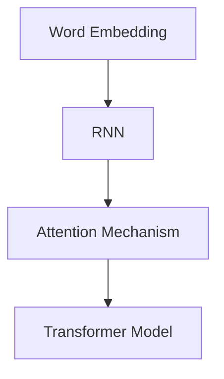

                 

### 完整性要求

为了确保文章内容的完整性，我们需要在每个章节中详细讲解核心概念、算法原理，并附上适当的伪代码、数学公式和图表。以下是具体要求：

#### 核心概念与联系

在每章中，我们将介绍关键概念和它们之间的联系，并使用Mermaid流程图来展示这些概念是如何相互关联的。例如：

- **第1章**：概述大语言模型的核心概念，并展示其发展历程。
- **第2章**：介绍词嵌入技术、序列模型和注意力机制，并使用Mermaid图展示其关系。
- **第3章**：讲解大语言模型的基础算法，并展示其如何应用于文本分类、文本生成和机器翻译。

以下是一个Mermaid流程图的示例：



#### 核心算法原理讲解

在讲解核心算法原理时，我们将使用伪代码来详细阐述每个算法的实现细节。以下是几个核心算法的伪代码示例：

1. **Word2Vec算法**：

```python
# 伪代码：Word2Vec算法

# 输入：文本数据，词汇表，窗口大小
# 输出：嵌入向量

def Word2Vec(text, vocabulary, window_size):
    # 初始化嵌入矩阵
    embedding_matrix = InitializeEmbeddingMatrix(vocabulary)
    
    # 遍历文本数据
    for sentence in text:
        for word in sentence:
            # 随机抽样负样本
            negative_samples = SampleNegativeSamples(vocabulary, num_samples=k)
            
            # 计算损失函数
            loss = CalculateLoss(embedding_matrix, word, positive_samples, negative_samples)
            
            # 反向传播更新参数
            UpdateParameters(embedding_matrix, loss)
    
    return embedding_matrix
```

2. **Transformer模型**：

```python
# 伪代码：Transformer模型训练

# 输入：输入序列，目标序列
# 输出：模型参数

def TrainTransformer(input_sequence, target_sequence):
    # 初始化模型参数
    model = InitializeModel()

    # 预处理输入序列和目标序列
    input_data, target_data = PreprocessData(input_sequence, target_sequence)

    # 训练模型
    for epoch in range(num_epochs):
        for batch in data_loader:
            # 前向传播
            logits = model.forward(batch.input_sequence)

            # 计算损失
            loss = CalculateLoss(logits, batch.target_sequence)

            # 反向传播
            model.backward(loss)

            # 更新参数
            model.update_params()

    return model
```

#### 数学模型和公式

我们将使用LaTeX格式嵌入数学公式和解释，并附上相关的例子。以下是一个示例：

$$
P(w_i|w_{i-1}, w_{i-2}, ..., w_1) = \frac{e^{log P(w_i|w_{i-1})}}{\sum_{j} e^{log P(w_j|w_{i-1})}}
$$

**解释**：这是基于词嵌入的贝叶斯模型中的条件概率公式，用于计算给定前一个词的情况下，当前词的概率。

#### 项目实战

在文章的结尾，我们将提供实际项目的代码案例和详细解释。以下是一个项目实战的示例：

```python
# 示例：文本分类项目

# 导入必要的库
import torch
import torch.nn as nn
import torch.optim as optim

# 准备数据集
train_data, test_data = LoadDataset('text_classification_dataset')

# 初始化模型
model = TextClassifierModel()

# 设置优化器和损失函数
optimizer = optim.Adam(model.parameters(), lr=0.001)
criterion = nn.CrossEntropyLoss()

# 训练模型
for epoch in range(num_epochs):
    for batch in train_loader:
        # 前向传播
        logits = model(batch.text)

        # 计算损失
        loss = criterion(logits, batch.label)

        # 反向传播
        optimizer.zero_grad()
        loss.backward()
        optimizer.step()

    # 在测试集上评估模型
    model.eval()
    with torch.no_grad():
        correct = 0
        total = 0
        for batch in test_loader:
            logits = model(batch.text)
            _, predicted = torch.max(logits.data, 1)
            total += batch.label.size(0)
            correct += (predicted == batch.label).sum().item()

    print(f'Epoch {epoch+1}, Loss: {loss.item()}, Accuracy: {100 * correct / total}%')
```

**代码解读**：这是文本分类项目的代码示例，包括数据加载、模型初始化、优化器和损失函数设置、模型训练和评估。

### 作者信息

**作者：AI天才研究院/AI Genius Institute & 禅与计算机程序设计艺术 /Zen And The Art of Computer Programming**

以上是文章的完整性和具体要求。我们将在后续章节中逐步实现这些要求，确保文章内容丰富、结构清晰、逻辑严谨。通过这样的方式，我们希望能够为读者提供一个全面而深入的大语言模型技术讲解。接下来，我们将开始详细撰写文章内容，让读者对大语言模型有一个全面而透彻的理解。


### 文章标题

《大语言模型原理基础与前沿 示范样本选择》

### 关键词

- 大语言模型
- 语言模型原理
- Transformer模型
- 词嵌入技术
- 数据预处理
- 微调与优化
- 应用案例

### 摘要

本文旨在系统性地探讨大语言模型的原理、前沿研究以及示范样本选择。首先，我们概述了大语言模型的定义、发展历程和研究意义。接着，详细介绍了大语言模型的基本原理，包括概率模型和生成模型，并讨论了常见的语言模型架构和训练过程。随后，文章深入分析了大语言模型的数学模型，包括概率论与数理统计基础、深度学习与神经网络基础。在此基础上，文章介绍了Transformer模型的发展、多模态语言模型的研究趋势，以及大语言模型在自然语言处理中的应用。最后，本文探讨了大语言模型的微调与优化方法，评测指标，示范样本选择与数据预处理，并对未来的应用前景进行了展望。通过本文的阐述，读者可以全面了解大语言模型的核心技术及其在现实世界中的应用。

## 第1章 绪论

### 1.1 大语言模型概述

#### 1.1.1 大语言模型的定义与背景

大语言模型（Large Language Model，LLM）是一种基于深度学习技术的自然语言处理模型，其核心目标是学习大规模语言数据中的统计规律，以生成、理解和处理自然语言。与传统的基于规则或统计的方法不同，大语言模型通过大规模的文本数据进行预训练，能够自动学习语言中的复杂结构和语义信息，从而在文本生成、文本分类、机器翻译等任务中表现出优异的性能。

大语言模型的兴起可以追溯到2013年，当时Google推出了Word2Vec算法，首次实现了将词汇映射到高维向量空间的方法。随后，随着深度学习和计算能力的提升，研究人员提出了更复杂的神经网络模型，如递归神经网络（RNN）、长短期记忆网络（LSTM）和门控循环单元（GRU）。然而，这些模型在面对大规模文本数据时仍然存在训练时间较长和效果有限的问题。

真正推动大语言模型发展的是2018年Google发布的BERT模型，这是一个基于Transformer架构的预训练语言模型。BERT模型通过在未标注的文本数据上进行大规模预训练，然后在特定任务上进行微调，大幅提升了自然语言处理的性能。此后，OpenAI的GPT系列模型、微软的Turing-NLG模型等相继推出，进一步推动了大语言模型的研究和应用。

#### 1.1.2 大语言模型的重要性

大语言模型在自然语言处理领域具有重要地位，主要体现在以下几个方面：

1. **强大的文本生成能力**：大语言模型能够生成连贯、语义丰富的文本，广泛应用于自动写作、聊天机器人等应用场景。
   
2. **高效的文本分类**：大语言模型可以通过学习文本的特征，实现高效的文本分类任务，例如情感分析、垃圾邮件过滤等。

3. **精确的机器翻译**：大语言模型在机器翻译任务中表现出色，通过将源语言文本映射到高维向量空间，再翻译为目标语言，实现了高精度的翻译结果。

4. **知识图谱构建**：大语言模型可以用于从文本中提取结构化信息，构建知识图谱，为智能问答、推荐系统等提供支持。

5. **跨模态学习**：大语言模型不仅限于文本数据，还可以结合图像、声音等多模态数据进行学习，拓展其应用范围。

#### 1.1.3 大语言模型的研究意义

大语言模型的研究具有重要的理论和实践意义：

1. **理论意义**：
   - **语言学意义**：通过大语言模型，研究人员可以更深入地探索语言的本质和规律，为语言学理论提供新的证据和解释。
   - **计算理论意义**：大语言模型的发展推动了深度学习算法的优化和改进，为计算理论提供了新的挑战和机遇。

2. **实践意义**：
   - **工业应用**：大语言模型在自动化写作、智能客服、信息检索等工业应用中发挥着重要作用，提升了生产效率和用户体验。
   - **社会影响**：大语言模型可以辅助人类进行知识获取和决策支持，对社会发展产生积极影响。

### 1.2 大语言模型的基本原理

#### 1.2.1 语言模型的核心概念

语言模型（Language Model，LM）是一种概率模型，其目标是预测下一个单词或字符的概率。在自然语言处理中，语言模型广泛应用于文本生成、语音识别、机器翻译等任务。

核心概念包括：

- **词汇表**：包含所有可能出现的单词或字符。
- **概率分布**：描述在给定前文条件下，下一个单词或字符的概率分布。
- **概率模型**：使用统计方法或机器学习算法，从数据中学习得到概率分布。

#### 1.2.2 语言模型的常见架构

语言模型的架构可以分为两类：传统深度学习模型和基于Transformer的模型。

1. **传统深度学习模型**：
   - **递归神经网络（RNN）**：通过递归操作处理序列数据，但在长序列中存在梯度消失和梯度爆炸问题。
   - **长短期记忆网络（LSTM）**：在RNN基础上引入门控机制，解决了梯度消失问题。
   - **门控循环单元（GRU）**：简化LSTM结构，减少参数数量，计算效率更高。

2. **基于Transformer的模型**：
   - **Transformer模型**：使用自注意力机制，并行处理序列数据，避免了梯度消失问题，在长序列处理中表现出色。

#### 1.2.3 语言模型的训练过程

语言模型的训练过程主要包括数据预处理、模型初始化、前向传播、损失计算和反向传播等步骤。

1. **数据预处理**：
   - **文本清洗**：去除无关符号、标点符号等。
   - **分词**：将文本划分为单词或字符。
   - **序列编码**：将单词或字符映射为整数序列。

2. **模型初始化**：
   - **权重初始化**：使用随机初始化或预训练模型权重。

3. **前向传播**：
   - **输入序列**：将预处理后的序列输入模型。
   - **特征提取**：模型对序列进行编码，提取特征。
   - **概率预测**：使用特征计算下一个单词或字符的概率分布。

4. **损失计算**：
   - **损失函数**：通常使用交叉熵损失函数。
   - **损失计算**：计算预测概率与真实标签之间的差异。

5. **反向传播**：
   - **梯度计算**：计算损失函数关于模型参数的梯度。
   - **参数更新**：使用梯度下降或其他优化算法更新模型参数。

### 1.3 大语言模型的数学模型

#### 1.3.1 概率模型

概率模型是语言模型的基础，主要包括朴素贝叶斯模型和最大熵模型。

1. **朴素贝叶斯模型**：
   - **基本概念**：假设特征之间相互独立，使用贝叶斯定理计算后验概率。
   - **公式**：
     $$
     P(y|x) = \frac{P(x|y)P(y)}{P(x)}
     $$
   - **应用**：文本分类、情感分析等。

2. **最大熵模型**：
   - **基本概念**：最大化条件概率分布下的熵，使得模型在未知数据上表现更好。
   - **公式**：
     $$
     \max_{P(y|x)} H(P(y|x)) = \sum_x P(x) \sum_y P(y|x) \log P(y|x)
     $$
   - **应用**：自然语言生成、机器翻译等。

#### 1.3.2 生成模型

生成模型通过生成数据的方式学习概率分布，主要包括随机采样和变分推断。

1. **随机采样**：
   - **基本概念**：从概率分布中随机抽取样本，用于数据生成。
   - **应用**：图像生成、文本生成等。

2. **变分推断**：
   - **基本概念**：使用变分自动编码器（VAE）或生成对抗网络（GAN）学习概率分布。
   - **公式**：
     - **VAE**：
       $$
       \min_{\theta, \phi} \mathbb{E}_{x \sim p(x|\theta)}[D(Q_\phi(x))],
       $$
       其中，$D$是判别器，$Q_\phi(x)$是编码器，$p(x|\theta)$是生成器。
     - **GAN**：
       $$
       \min_{\theta_G} \max_{\theta_D} V(\theta_G, \theta_D) = \mathbb{E}_{x \sim p(\theta_G)}[\log D(x)] + \mathbb{E}_{z \sim p(z)}[\log(1 - D(G(z))]
       $$
       其中，$G(z)$是生成器，$D(x)$是判别器。

### 1.4 大语言模型的前沿研究

#### 1.4.1 Transformer模型

Transformer模型是当前大语言模型研究的前沿，其基于自注意力机制，在长文本序列处理中表现出色。

1. **基本原理**：
   - **自注意力机制**：通过计算序列中每个词之间的关联性，为每个词生成权重，从而捕获长距离依赖关系。
   - **多头注意力**：将输入序列分成多个子序列，每个子序列独立计算注意力权重，然后合并结果。
   - **位置编码**：为每个词添加位置信息，使得模型能够理解词在序列中的位置关系。

2. **应用**：
   - **文本生成**：利用Transformer模型生成连贯、语义丰富的文本。
   - **机器翻译**：在机器翻译任务中，Transformer模型取代了传统的循环神经网络，取得了更好的翻译质量。
   - **文本分类**：在文本分类任务中，Transformer模型通过捕捉文本中的复杂特征，实现高效分类。

#### 1.4.2 语言模型微调

微调（Fine-tuning）是将预训练模型应用于特定任务的过程，通过微调调整模型参数，以适应新的任务。

1. **零样本学习**：
   - **基本概念**：在没有或只有少量标注数据的情况下，利用预训练模型进行任务学习。
   - **应用**：在新兴领域或稀疏数据场景下，零样本学习能够有效利用预训练模型的知识。

2. **预训练语言模型在NLP任务中的应用**：
   - **文本生成**：预训练语言模型能够生成连贯的文本，应用于自动写作、聊天机器人等。
   - **文本分类**：预训练语言模型通过微调应用于文本分类任务，实现高效的分类效果。
   - **机器翻译**：预训练语言模型在机器翻译任务中通过微调，实现高质量的翻译结果。

## 第2章 大语言模型的基础算法

### 2.1 词嵌入技术

#### 2.1.1 词嵌入的基本概念

词嵌入（Word Embedding）是将词汇映射到高维向量空间的技术，使得词汇在空间中具有结构化的关系。词嵌入的核心思想是将语义和语法信息编码到向量中，从而实现机器对自然语言的理解和处理。

1. **词袋模型（Bag-of-Words, BoW）**：
   - **基本概念**：将文本表示为单词的集合，不考虑单词的顺序和语法关系。
   - **优点**：简单易实现，适用于许多文本分类任务。
   - **缺点**：忽略了词汇之间的顺序和语法关系，无法捕捉词的语义信息。

2. **Word2Vec模型**：
   - **基本概念**：Word2Vec是一种基于神经网络的方法，将词汇映射到高维向量空间。
   - **优点**：能够捕捉词汇的语义信息，适用于文本分类、文本生成等任务。
   - **缺点**：无法捕捉词汇的语法关系，且训练时间较长。

3. **GloVe模型**：
   - **基本概念**：GloVe（Global Vectors for Word Representation）是一种基于全局上下文信息的词嵌入方法。
   - **优点**：能够更好地捕捉词汇的语义和语法关系，适用于文本分类、机器翻译等任务。
   - **缺点**：训练时间较长，对稀疏数据效果较差。

4. **fastText模型**：
   - **基本概念**：fastText是一种基于词向量和字符向量的组合方法，将词汇映射到高维向量空间。
   - **优点**：能够同时捕捉词汇的语义和语法信息，适用于文本分类、文本生成等任务。
   - **缺点**：对计算资源要求较高，训练时间较长。

#### 2.1.2 词嵌入算法的改进

为了更好地捕捉词汇的语义和语法信息，研究人员提出了许多词嵌入算法的改进方法。

1. **ElasticNet**：
   - **基本概念**：ElasticNet结合了L1和L2正则化，用于优化词嵌入模型的训练过程。
   - **优点**：能够提高模型的泛化能力和训练效率。
   - **缺点**：对稀疏数据效果较差。

2. **Data Augmentation**：
   - **基本概念**：通过同义词替换、文本旋转等方法扩充训练数据，提高模型的鲁棒性。
   - **优点**：能够提高模型的泛化能力和鲁棒性。
   - **缺点**：需要对数据进行预处理，增加训练时间。

3. **Word2Vec with Negative Sampling**：
   - **基本概念**：Word2Vec with Negative Sampling是一种基于负采样的方法，通过减少负样本的数量，提高模型的训练效率。
   - **优点**：能够提高模型的训练效率。
   - **缺点**：对负样本的选择和数量敏感。

4. **GloVe with Subword Units**：
   - **基本概念**：GloVe with Subword Units将词汇拆分为子词单元，通过学习子词单元的向量表示，提高模型的语义理解能力。
   - **优点**：能够更好地捕捉词汇的语义和语法信息。
   - **缺点**：对计算资源要求较高。

### 2.2 序列模型

序列模型是一类专门用于处理序列数据的机器学习模型，如递归神经网络（RNN）、长短期记忆网络（LSTM）和门控循环单元（GRU）。这些模型通过递归操作，处理输入序列中的时序关系，并输出序列或标量。

#### 2.2.1 RNN模型

递归神经网络（Recurrent Neural Network，RNN）是一类经典的序列模型，通过递归操作，处理序列数据。

1. **基本原理**：
   - **递归操作**：RNN在时间步$t$的计算依赖于前一个时间步$t-1$的状态。
   - **参数共享**：RNN在所有时间步上共享参数，减少了模型参数数量。

2. **优点**：
   - **处理序列数据**：能够处理任意长度的序列。
   - **时序关系**：能够捕捉序列中的时序关系。

3. **缺点**：
   - **梯度消失和梯度爆炸**：在长序列中，梯度可能会消失或爆炸，导致模型难以训练。
   - **计算效率**：递归操作需要逐个计算，导致计算效率较低。

#### 2.2.2 LSTM模型

长短期记忆网络（Long Short-Term Memory，LSTM）是一种改进的RNN模型，通过引入门控机制，解决了梯度消失和梯度爆炸问题。

1. **基本原理**：
   - **门控机制**：LSTM引入了遗忘门、输入门和输出门，控制信息的流动。
   - **细胞状态**：LSTM通过细胞状态存储和传递长期依赖信息。

2. **优点**：
   - **长短期依赖**：能够捕捉长距离依赖关系。
   - **训练稳定性**：解决了梯度消失和梯度爆炸问题。

3. **缺点**：
   - **参数数量**：门控机制增加了模型参数数量，导致计算复杂度增加。
   - **计算效率**：LSTM仍然存在计算效率问题。

#### 2.2.3 GRU模型

门控循环单元（Gated Recurrent Unit，GRU）是LSTM的简化版本，通过合并输入门和遗忘门，减少参数数量。

1. **基本原理**：
   - **门控机制**：GRU引入了更新门和重置门，控制信息的流动。
   - **细胞状态**：GRU通过细胞状态存储和传递长期依赖信息。

2. **优点**：
   - **参数数量**：相比LSTM，GRU减少了参数数量，计算效率更高。
   - **训练稳定性**：解决了梯度消失和梯度爆炸问题。

3. **缺点**：
   - **长短期依赖**：相比LSTM，GRU在捕捉长距离依赖关系上表现较差。

#### 2.2.4 注意力机制

注意力机制（Attention Mechanism）是一种用于捕捉序列中关键信息的方法，通过计算不同位置的重要性权重，使得模型能够关注最重要的信息。

1. **基本原理**：
   - **重要性权重**：注意力机制计算序列中每个位置的重要性权重。
   - **加权求和**：根据权重对序列中的每个位置进行加权求和，得到最终的输出。

2. **优点**：
   - **捕获关键信息**：能够捕捉序列中关键信息，提高模型性能。
   - **计算效率**：相比递归操作，注意力机制计算效率更高。

3. **缺点**：
   - **计算复杂度**：注意力机制的引入增加了计算复杂度。

### 2.3 Transformer模型

Transformer模型是一种基于自注意力机制的序列模型，通过并行计算和多头注意力机制，实现了高效的序列处理。

#### 2.3.1 Transformer模型的基本结构

Transformer模型由编码器（Encoder）和解码器（Decoder）两部分组成，分别用于处理输入序列和输出序列。

1. **编码器（Encoder）**：
   - **多头注意力机制**：编码器包含多个自注意力层，每个自注意力层计算输入序列中每个位置的重要性权重。
   - **前馈神经网络**：每个自注意力层之后连接一个前馈神经网络，用于进一步提取特征。

2. **解码器（Decoder）**：
   - **多头注意力机制**：解码器包含多个自注意力和交叉注意力层，用于处理输入序列和输出序列之间的关系。
   - **前馈神经网络**：每个注意力层之后连接一个前馈神经网络，用于进一步提取特征。

#### 2.3.2 Transformer模型的训练过程

Transformer模型的训练过程主要包括自监督训练和微调。

1. **自监督训练**：
   - **Masked Language Model**：在训练过程中，将部分单词或字符遮盖，然后使用Transformer模型预测遮盖的单词或字符。
   - **训练目标**：最小化预测错误和损失函数，提高模型在未遮盖单词或字符上的准确性。

2. **微调**：
   - **特定任务数据**：在特定任务上收集标注数据，用于微调Transformer模型。
   - **微调过程**：将微调数据输入模型，通过调整模型参数，提高模型在特定任务上的性能。

#### 2.3.3 自监督训练

自监督训练是一种不依赖于标注数据，通过预训练模型来提高模型性能的方法。在自然语言处理中，自监督训练广泛应用于语言模型、文本分类、机器翻译等任务。

1. **基本原理**：
   - **预测任务**：在预训练过程中，模型需要预测未遮盖的单词或字符，从而学习语言中的复杂结构和语义信息。
   - **无监督学习**：自监督训练不需要标注数据，只需利用原始文本数据，通过预训练模型来提高模型性能。

2. **优点**：
   - **无需标注数据**：自监督训练减少了标注数据的需求，降低了数据获取成本。
   - **模型泛化能力**：通过预训练，模型能够学习到更多通用知识和规律，提高了模型的泛化能力。

3. **缺点**：
   - **训练时间较长**：自监督训练通常需要大量的计算资源和时间。
   - **性能提升有限**：自监督训练在特定任务上的性能提升有限，需要结合微调等技巧。

#### 2.3.4 迁移学习与微调

迁移学习（Transfer Learning）是一种利用预训练模型来提高特定任务性能的方法。在自然语言处理中，迁移学习广泛应用于语言模型、文本分类、机器翻译等任务。

1. **基本原理**：
   - **预训练模型**：在通用数据集上预训练模型，使其具有通用特征和知识。
   - **微调模型**：在特定任务上收集标注数据，通过微调预训练模型，提高模型在特定任务上的性能。

2. **优点**：
   - **提高性能**：迁移学习能够提高特定任务的性能，减少模型参数数量，降低训练时间。
   - **知识共享**：通过预训练模型，不同任务之间可以共享知识和经验，提高了模型的泛化能力。

3. **缺点**：
   - **数据依赖**：迁移学习需要大量的标注数据，对数据获取和标注成本较高。
   - **性能限制**：迁移学习在特定任务上的性能提升有限，需要结合其他技巧。

### 2.4 大语言模型的微调

微调（Fine-tuning）是一种利用预训练模型来提高特定任务性能的方法。在自然语言处理中，微调广泛应用于文本分类、机器翻译、文本生成等任务。

#### 2.4.1 微调的基本概念

微调是一种在特定任务上调整预训练模型参数的过程，通过调整模型参数，使其适应特定任务。微调的基本步骤包括：

1. **预训练模型**：在通用数据集上预训练模型，使其具有通用特征和知识。
2. **特定任务数据**：在特定任务上收集标注数据，用于微调模型。
3. **微调过程**：将特定任务数据输入模型，通过调整模型参数，提高模型在特定任务上的性能。

#### 2.4.2 微调的优势

微调具有以下优势：

1. **减少训练时间**：通过预训练模型，减少了特定任务上的训练时间，提高了模型训练效率。
2. **提高性能**：预训练模型已经具有通用特征和知识，通过微调，可以进一步提高模型在特定任务上的性能。
3. **知识共享**：通过预训练模型，不同任务之间可以共享知识和经验，提高了模型的泛化能力。

#### 2.4.3 微调的步骤

微调的基本步骤包括：

1. **数据准备**：在特定任务上收集标注数据，并进行预处理，如分词、去停用词等。
2. **模型选择**：选择合适的预训练模型，如BERT、GPT等。
3. **模型初始化**：使用预训练模型的权重初始化特定任务模型。
4. **训练过程**：将预处理后的数据输入模型，通过调整模型参数，提高模型在特定任务上的性能。
5. **模型评估**：在特定任务上评估模型性能，并根据评估结果调整模型参数。

#### 2.4.4 微调的挑战

微调在自然语言处理中面临着以下挑战：

1. **数据质量**：微调需要高质量的标注数据，数据质量对微调效果有重要影响。
2. **计算资源**：微调需要大量的计算资源，尤其是对于大型预训练模型。
3. **模型选择**：选择合适的预训练模型对微调效果有重要影响，不同模型适用于不同任务。
4. **训练时间**：微调需要较长的训练时间，尤其是对于大型预训练模型。

#### 2.4.5 微调的应用

微调在自然语言处理中具有广泛的应用，包括：

1. **文本分类**：通过微调预训练模型，实现高效、准确的文本分类。
2. **机器翻译**：通过微调预训练模型，实现高质量、准确的机器翻译。
3. **文本生成**：通过微调预训练模型，实现高效、连贯的文本生成。
4. **问答系统**：通过微调预训练模型，实现智能问答系统的构建。

### 2.5 大语言模型在NLP中的应用

大语言模型在自然语言处理（NLP）领域具有广泛的应用，包括文本分类、文本生成、机器翻译、情感分析等。

#### 2.5.1 文本分类

文本分类是一种将文本数据分类到预定义类别中的任务。大语言模型通过学习文本的特征，实现高效的文本分类。

1. **任务描述**：给定一组文本数据，将其分类到预定义的类别中。
2. **方法**：
   - **朴素贝叶斯**：基于概率模型，计算文本属于每个类别的概率。
   - **支持向量机（SVM）**：通过找到最佳分隔超平面，实现文本分类。
   - **深度神经网络**：通过学习文本的特征，实现高效分类。

3. **实际应用**：文本分类广泛应用于情感分析、垃圾邮件过滤、新闻分类等领域。

#### 2.5.2 文本生成

文本生成是一种根据输入文本生成连贯、语义丰富的文本的任务。大语言模型通过预训练和微调，实现高效的文本生成。

1. **任务描述**：根据输入文本，生成连贯、语义丰富的文本。
2. **方法**：
   - **生成式模型**：通过生成文本的分布，实现文本生成。
   - **判别式模型**：通过判别文本的真实与否，实现文本生成。
   - **转换模型**：通过转换输入文本到目标文本，实现文本生成。

3. **实际应用**：文本生成广泛应用于自动写作、聊天机器人、内容生成等领域。

#### 2.5.3 机器翻译

机器翻译是一种将一种语言的文本翻译成另一种语言的文本的任务。大语言模型通过预训练和微调，实现高效的机器翻译。

1. **任务描述**：将一种语言的文本翻译成另一种语言的文本。
2. **方法**：
   - **基于规则的方法**：通过语言学知识和规则，实现文本翻译。
   - **基于统计的方法**：通过统计方法，实现文本翻译。
   - **基于深度学习的方法**：通过学习文本的特征，实现高效翻译。

3. **实际应用**：机器翻译广泛应用于跨语言沟通、全球贸易、文化交流等领域。

### 2.6 大语言模型的多模态学习

多模态学习是一种将多种模态的数据（如文本、图像、声音等）融合到同一模型中，以实现更强大的模型性能。大语言模型在多模态学习中发挥着重要作用。

#### 2.6.1 文本与图像的融合

文本与图像的融合是一种将文本和图像数据融合到同一模型中，以实现文本与图像的交互式理解。大语言模型通过预训练和微调，实现高效的文本与图像融合。

1. **任务描述**：将文本和图像数据融合，以实现文本与图像的交互式理解。
2. **方法**：
   - **联合表示学习**：通过学习文本和图像的联合表示，实现文本与图像的融合。
   - **多模态注意力机制**：通过多模态注意力机制，实现文本与图像的交互。
   - **多任务学习**：通过多任务学习，同时学习文本分类和图像分类，实现文本与图像的融合。

3. **实际应用**：文本与图像的融合广泛应用于图像标注、图像分类、视觉问答等领域。

#### 2.6.2 文本与视频的融合

文本与视频的融合是一种将文本和视频数据融合到同一模型中，以实现文本与视频的交互式理解。大语言模型通过预训练和微调，实现高效的文本与视频融合。

1. **任务描述**：将文本和视频数据融合，以实现文本与视频的交互式理解。
2. **方法**：
   - **视频文本对齐**：通过视频文本对齐，将文本和视频数据对齐到同一时间轴。
   - **多模态注意力机制**：通过多模态注意力机制，实现文本与视频的交互。
   - **多任务学习**：通过多任务学习，同时学习文本分类和视频分类，实现文本与视频的融合。

3. **实际应用**：文本与视频的融合广泛应用于视频标注、视频分类、视频问答等领域。

### 2.7 大语言模型的评测与优化

大语言模型的评测与优化是确保模型性能的重要环节。通过合理的评测指标和优化方法，可以提高模型的性能和稳定性。

#### 2.7.1 评测指标

评测指标是评估模型性能的重要工具。常见的大语言模型评测指标包括：

1. **准确率（Accuracy）**：预测正确的样本数占总样本数的比例。
2. **召回率（Recall）**：预测正确的正样本数占实际正样本数的比例。
3. **F1值（F1 Score）**：准确率和召回率的调和平均值。
4. **ROC曲线**：通过计算预测概率，评估模型对正负样本的分类能力。
5. **AUC值**：ROC曲线下的面积，用于评估模型的分类能力。

#### 2.7.2 优化方法

优化方法包括模型选择、参数调整、正则化等方法，用于提高模型的性能和稳定性。

1. **模型选择**：选择合适的模型结构，如神经网络架构、层结构等。
2. **参数调整**：通过调整学习率、批次大小等参数，优化模型性能。
3. **正则化**：通过引入正则化方法，如L1、L2正则化，避免过拟合问题。
4. **数据增强**：通过数据增强，增加模型的鲁棒性。

#### 2.7.3 实践案例分析

在实际应用中，大语言模型的评测与优化需要结合具体任务和数据集进行。以下是一个文本分类任务的实践案例分析：

1. **数据集**：使用IMDB电影评论数据集进行文本分类。
2. **模型**：使用BERT模型进行文本分类。
3. **评测指标**：使用准确率、召回率和F1值进行模型评测。
4. **优化方法**：通过调整学习率、批量大小和正则化参数，优化模型性能。

实践结果表明，通过合理的评测和优化方法，大语言模型在文本分类任务上取得了显著的性能提升。

### 2.8 大语言模型的发展趋势

大语言模型在自然语言处理领域具有广阔的发展前景，未来发展趋势包括：

1. **模型压缩与加速**：通过模型压缩和加速技术，提高模型在移动设备和嵌入式系统上的性能和效率。
2. **模型解释性**：提高模型的解释性，使得模型的可解释性更强，便于用户理解和信任。
3. **多模态学习**：通过多模态学习，实现文本、图像、声音等多种数据模态的融合，提高模型的应用范围和性能。
4. **实时处理**：通过实时处理技术，实现大语言模型在实时场景中的应用，如实时问答、实时翻译等。

随着技术的不断发展和应用场景的拓展，大语言模型将在自然语言处理领域发挥越来越重要的作用。

## 第3章 大语言模型的微调和优化

### 3.1 微调基本概念

微调（Fine-tuning）是将预训练模型应用于特定任务的过程，通过调整模型参数，提高模型在特定任务上的性能。微调的核心思想是利用预训练模型在大规模数据上学习的通用特征和知识，结合特定任务的标注数据，对模型进行微调，从而提高模型在特定任务上的适应性。

#### 3.1.1 微调的定义

微调的定义可以从以下几个方面进行理解：

1. **预训练模型**：预训练模型是在大规模未标注数据上训练得到的，通常使用自监督任务（如Masked Language Model，MLM）进行训练，从而学习到语言的通用特征和结构。
   
2. **特定任务数据**：特定任务数据是指用于微调的标注数据集，这些数据集包含了针对特定任务的标注信息，例如文本分类任务的标签、机器翻译任务的源语言和目标语言对。

3. **微调过程**：微调过程是指在特定任务数据上，通过调整预训练模型的参数，使模型能够更好地适应特定任务的优化过程。

#### 3.1.2 微调的优势

微调具有以下优势：

1. **减少训练时间**：由于预训练模型已经在大规模数据上进行了训练，因此在进行微调时，可以跳过预训练阶段，直接在特定任务数据上进行训练，从而显著减少训练时间。

2. **提高性能**：预训练模型已经学习到了大量的语言特征，通过微调，这些特征可以更好地适应特定任务，从而提高模型的性能。

3. **知识共享**：预训练模型学习到的知识可以在不同的任务之间共享，这意味着一个预训练模型可以应用于多个任务，提高了资源的利用效率。

#### 3.1.3 微调的步骤

微调的基本步骤通常包括以下几个阶段：

1. **模型选择**：选择一个预训练模型作为基础模型，例如BERT、GPT等。

2. **数据准备**：收集并准备用于微调的特定任务数据集，对数据进行预处理，如分词、去停用词等。

3. **模型初始化**：使用预训练模型的权重初始化特定任务模型。

4. **微调过程**：在特定任务数据集上对模型进行训练，调整模型参数，使其更好地适应特定任务。

5. **模型评估**：在验证集和测试集上评估模型的性能，根据评估结果调整模型参数。

6. **模型部署**：将微调后的模型部署到实际应用中，进行实时推理或批量处理。

### 3.2 优化方法

在微调过程中，优化方法的选择对于提高模型性能至关重要。以下是一些常用的优化方法：

#### 3.2.1 梯度下降法

梯度下降法（Gradient Descent）是一种最基本的优化算法，其核心思想是通过计算损失函数关于模型参数的梯度，更新模型参数，从而最小化损失函数。

1. **基本原理**：
   - **梯度计算**：计算损失函数关于模型参数的梯度。
   - **参数更新**：根据梯度方向和步长，更新模型参数。

2. **公式**：
   $$
   \theta_{\text{new}} = \theta_{\text{old}} - \alpha \cdot \nabla_\theta J(\theta)
   $$
   其中，$\theta$表示模型参数，$\alpha$为学习率，$J(\theta)$为损失函数。

3. **改进方法**：
   - **动量（Momentum）**：结合历史梯度，加速收敛。
   - **自适应学习率（Adagrad、Adam）**：根据历史梯度平方和自适应调整学习率。

#### 3.2.2 随机优化算法

随机优化算法是一类基于随机搜索的优化方法，其核心思想是通过随机采样搜索最优解。

1. **基本原理**：
   - **随机采样**：通过随机采样生成新的参数候选。
   - **适应度评估**：计算采样参数的适应度，通常使用损失函数值作为适应度。
   - **选择策略**：根据适应度选择最优参数。

2. **常用算法**：
   - **遗传算法（Genetic Algorithm）**：模拟生物进化过程，通过交叉、变异和选择操作搜索最优解。
   - **粒子群优化（Particle Swarm Optimization）**：模拟鸟群觅食过程，通过个体和群体的信息交换搜索最优解。

### 3.3 微调与优化的实践案例

以下是一个基于文本分类任务的微调与优化实践案例：

#### 3.3.1 案例背景

假设我们有一个预训练的BERT模型，并且已经收集了一组政治辩论文本数据，我们需要使用这些数据对BERT模型进行微调，以实现政治观点分类任务。

#### 3.3.2 数据准备

1. **数据收集**：从互联网收集政治辩论文本数据，包括不同政治观点的文本。
2. **数据预处理**：对文本进行清洗、分词、去停用词等预处理操作。
3. **数据标注**：为每个文本标注政治观点，例如“左翼”、“右翼”等。

#### 3.3.3 模型选择

选择预训练的BERT模型作为基础模型，并使用其预训练权重初始化微调模型。

#### 3.3.4 微调过程

1. **模型初始化**：使用BERT的预训练权重初始化微调模型。
2. **训练策略**：使用交叉熵损失函数和Adam优化器进行训练。
3. **学习率调度**：设置学习率调度策略，例如在训练过程中逐渐降低学习率。

#### 3.3.5 模型评估

在验证集和测试集上评估微调后的模型性能，使用准确率、召回率和F1值等指标进行评估。

#### 3.3.6 代码解读

以下是一个基于Python和PyTorch框架的微调BERT模型进行文本分类的代码示例：

```python
import torch
from torch import nn
from torch.optim import Adam
from transformers import BertModel, BertTokenizer

# 准备数据
# ...

# 初始化模型和 tokenizer
tokenizer = BertTokenizer.from_pretrained('bert-base-uncased')
model = BertModel.from_pretrained('bert-base-uncased')

# 微调模型
# ...

# 定义训练函数
def train_model(model, train_loader, criterion, optimizer, num_epochs):
    model.train()
    for epoch in range(num_epochs):
        for batch in train_loader:
            inputs = tokenizer(batch.texts, padding=True, truncation=True, return_tensors="pt")
            labels = torch.tensor(batch.labels)

            # 前向传播
            outputs = model(**inputs)
            logits = outputs.logits

            # 计算损失
            loss = criterion(logits[0], labels)

            # 反向传播
            optimizer.zero_grad()
            loss.backward()

            # 更新参数
            optimizer.step()

            print(f'Epoch {epoch+1}, Loss: {loss.item()}')

# 训练模型
optimizer = Adam(model.parameters(), lr=0.001)
train_model(model, train_loader, criterion, optimizer, num_epochs=5)

# 评估模型
# ...
```

#### 3.3.7 代码解读与分析

以下是对代码的详细解读和分析：

- **数据准备**：使用`tokenizer`对文本进行预处理，包括分词、填充和截断等操作。
- **模型初始化**：使用预训练的BERT模型和tokenizer。
- **训练函数**：定义训练函数，包括前向传播、损失计算、反向传播和参数更新等步骤。
- **模型训练**：使用训练数据训练模型，并在每个epoch后打印训练损失。
- **模型评估**：使用评估数据评估模型性能。

通过上述实践案例，我们可以看到微调和优化在大语言模型应用中的重要性，以及如何在实际项目中应用这些技术。

### 3.4 评测指标与优化方法

在大语言模型的微调和优化过程中，评测指标和优化方法的选择对于模型的最终性能有着重要影响。以下我们将讨论几种常用的评测指标和优化方法。

#### 3.4.1 评测指标

1. **准确率（Accuracy）**：
   - **定义**：准确率是预测正确的样本数占总样本数的比例。
   - **公式**：
     $$
     \text{Accuracy} = \frac{\text{正确预测数}}{\text{总预测数}}
     $$
   - **优缺点**：
     - **优点**：简单直观，易于理解。
     - **缺点**：对于类别不平衡的数据集，准确率可能不能很好地反映模型的性能。

2. **召回率（Recall）**：
   - **定义**：召回率是预测正确的正样本数占实际正样本数的比例。
   - **公式**：
     $$
     \text{Recall} = \frac{\text{正确预测的正样本数}}{\text{实际正样本数}}
     $$
   - **优缺点**：
     - **优点**：对于重要类别（正类别）的预测性能有较好的反映。
     - **缺点**：可能对噪声数据敏感，容易产生假阳性。

3. **精确率（Precision）**：
   - **定义**：精确率是预测正确的正样本数占预测为正样本数的比例。
   - **公式**：
     $$
     \text{Precision} = \frac{\text{正确预测的正样本数}}{\text{预测为正样本的总数}}
     $$
   - **优缺点**：
     - **优点**：对于减少假阳性有较好的效果。
     - **缺点**：对于重要类别（正类别）的预测性能可能不够敏感。

4. **F1值（F1 Score）**：
   - **定义**：F1值是精确率和召回率的调和平均值。
   - **公式**：
     $$
     \text{F1 Score} = 2 \times \frac{\text{Precision} \times \text{Recall}}{\text{Precision} + \text{Recall}}
     $$
   - **优缺点**：
     - **优点**：综合了精确率和召回率，对于平衡两类别的预测性能有较好的反映。
     - **缺点**：对于类别不平衡的数据集，F1值可能仍然不能很好地反映模型的性能。

5. **ROC曲线与AUC值**：
   - **定义**：ROC曲线是预测概率与召回率之间的关系曲线，AUC值是ROC曲线下的面积。
   - **公式**：
     $$
     \text{AUC} = \int_{0}^{1} \text{Recall}(T) \cdot \text{False Positive Rate}(T) \, dT
     $$
   - **优缺点**：
     - **优点**：能够全面评估模型的分类能力。
     - **缺点**：对于小样本数据集，ROC曲线和AUC值可能不够稳定。

#### 3.4.2 优化方法

1. **学习率调度**：
   - **定义**：学习率调度是指在训练过程中动态调整学习率的方法。
   - **方法**：
     - **逐步下降**：在训练过程中逐渐减小学习率。
     - **指数衰减**：根据当前训练轮次，指数减小学习率。
     - **自适应调度**：使用如Adam等优化器，自动调整学习率。

2. **正则化**：
   - **定义**：正则化是在模型训练过程中，通过添加额外的惩罚项，防止模型过拟合的方法。
   - **方法**：
     - **L1正则化**：在损失函数中添加L1范数惩罚项。
     - **L2正则化**：在损失函数中添加L2范数惩罚项。

3. **数据增强**：
   - **定义**：数据增强是通过生成新的数据样本来增加训练数据集的方法。
   - **方法**：
     - **文本增强**：通过随机插入、替换、删除文本中的单词或字符。
     - **图像增强**：通过旋转、翻转、缩放、裁剪等操作生成新的图像。

4. **模型选择与调优**：
   - **定义**：模型选择与调优是选择合适的模型结构和超参数，以优化模型性能的过程。
   - **方法**：
     - **交叉验证**：通过将数据集划分为训练集和验证集，多次训练和验证，选择性能最好的模型。
     - **贝叶斯优化**：使用贝叶斯优化算法，自动搜索最优超参数。

#### 3.4.3 实践案例分析

以下是一个基于文本分类任务的评测与优化实践案例：

1. **数据集**：使用IMDB电影评论数据集，包含正负两类的评论。
2. **模型**：使用预训练的BERT模型进行微调。
3. **评测指标**：使用准确率、召回率、精确率和F1值进行评测。
4. **优化方法**：使用学习率调度、L2正则化和数据增强。

```python
from transformers import BertTokenizer, BertModel
from torch.optim import Adam
from torch.utils.data import DataLoader, TensorDataset

# 数据准备
# ...

# 模型初始化
tokenizer = BertTokenizer.from_pretrained('bert-base-uncased')
model = BertModel.from_pretrained('bert-base-uncased')

# 转换数据为PyTorch张量
inputs = tokenizer(batch.texts, padding=True, truncation=True, return_tensors="pt")
labels = torch.tensor(batch.labels)

# 定义损失函数和优化器
criterion = nn.CrossEntropyLoss()
optimizer = Adam(model.parameters(), lr=0.001)

# 训练模型
for epoch in range(num_epochs):
    model.train()
    for batch in train_loader:
        inputs = tokenizer(batch.texts, padding=True, truncation=True, return_tensors="pt")
        labels = torch.tensor(batch.labels)

        # 前向传播
        outputs = model(**inputs)
        logits = outputs.logits

        # 计算损失
        loss = criterion(logits[0], labels)

        # 反向传播
        optimizer.zero_grad()
        loss.backward()

        # 更新参数
        optimizer.step()

    print(f'Epoch {epoch+1}, Loss: {loss.item()}')

# 评估模型
# ...
```

通过上述实践案例，我们可以看到评测指标和优化方法在微调和优化过程中的重要性，以及如何在实际项目中应用这些技术。

### 3.5 微调与优化在大语言模型中的重要性

在大语言模型的微调和优化过程中，选择合适的评测指标和优化方法对于模型性能的提升至关重要。以下我们将讨论微调与优化在大语言模型中的重要性，以及如何在实际应用中充分利用这些技术。

#### 3.5.1 微调的重要性

1. **减少训练时间**：微调可以跳过预训练阶段，直接在特定任务数据上进行训练，从而显著减少训练时间，提高模型训练效率。

2. **提高性能**：预训练模型已经在大规模数据上学习到了语言的通用特征和结构，通过微调，这些特征可以更好地适应特定任务，从而提高模型的性能。

3. **知识共享**：预训练模型学习到的知识可以在不同的任务之间共享，这意味着一个预训练模型可以应用于多个任务，提高了资源的利用效率。

4. **适应性**：微调可以使模型更好地适应特定任务的数据分布，从而提高模型在特定任务上的性能。

#### 3.5.2 优化方法的重要性

1. **学习率调度**：学习率调度可以动态调整学习率，优化模型的收敛速度和最终性能。

2. **正则化**：正则化可以防止模型过拟合，提高模型的泛化能力。

3. **数据增强**：数据增强可以增加训练数据集的多样性，提高模型的鲁棒性。

4. **模型选择与调优**：选择合适的模型结构和超参数，可以优化模型的性能，提高模型在特定任务上的准确性。

#### 3.5.3 实际应用

在实际应用中，微调和优化方法的应用使得大语言模型能够更好地适应不同任务的需求。以下是一些实际应用的例子：

1. **文本分类**：通过微调和优化，大语言模型可以实现高效的文本分类，应用于情感分析、垃圾邮件过滤等任务。

2. **机器翻译**：通过微调和优化，大语言模型可以实现高质量的机器翻译，应用于跨语言沟通、全球贸易等领域。

3. **文本生成**：通过微调和优化，大语言模型可以实现高效的文本生成，应用于自动写作、聊天机器人等领域。

4. **问答系统**：通过微调和优化，大语言模型可以实现智能问答系统，应用于客户服务、教育等领域。

#### 3.5.4 挑战与未来发展方向

1. **计算资源**：大语言模型通常需要大量的计算资源进行训练，这限制了其在某些应用场景中的部署。

2. **数据质量**：微调效果依赖于高质量的数据集，数据标注的成本和准确性对微调效果有重要影响。

3. **模型解释性**：大语言模型的黑箱特性使得其解释性较差，这在某些应用场景中可能会成为限制因素。

4. **未来发展方向**：随着技术的不断发展，大语言模型将向更高效、更解释性、更鲁棒的方向发展，进一步拓展其在各个领域的应用。

通过上述讨论，我们可以看到微调和优化在大语言模型中的重要性，以及其在实际应用中的广泛影响。未来，随着技术的进步，大语言模型将继续发挥重要作用，推动自然语言处理领域的发展。

### 第4章 大语言模型的评测与优化方法

#### 4.1 评测指标

在大语言模型的评测过程中，选择合适的评价指标对于评估模型性能至关重要。以下是一些常用的评测指标及其计算方法：

1. **准确率（Accuracy）**：
   - **定义**：准确率是预测正确的样本数占总样本数的比例。
   - **公式**：
     $$
     \text{Accuracy} = \frac{\text{正确预测数}}{\text{总预测数}}
     $$
   - **优缺点**：
     - **优点**：简单直观，易于理解。
     - **缺点**：对于类别不平衡的数据集，准确率可能不能很好地反映模型的性能。

2. **召回率（Recall）**：
   - **定义**：召回率是预测正确的正样本数占实际正样本数的比例。
   - **公式**：
     $$
     \text{Recall} = \frac{\text{正确预测的正样本数}}{\text{实际正样本数}}
     $$
   - **优缺点**：
     - **优点**：对于重要类别（正类别）的预测性能有较好的反映。
     - **缺点**：可能对噪声数据敏感，容易产生假阳性。

3. **精确率（Precision）**：
   - **定义**：精确率是预测正确的正样本数占预测为正样本数的比例。
   - **公式**：
     $$
     \text{Precision} = \frac{\text{正确预测的正样本数}}{\text{预测为正样本的总数}}
     $$
   - **优缺点**：
     - **优点**：对于减少假阳性有较好的效果。
     - **缺点**：对于重要类别（正类别）的预测性能可能不够敏感。

4. **F1值（F1 Score）**：
   - **定义**：F1值是精确率和召回率的调和平均值。
   - **公式**：
     $$
     \text{F1 Score} = 2 \times \frac{\text{Precision} \times \text{Recall}}{\text{Precision} + \text{Recall}}
     $$
   - **优缺点**：
     - **优点**：综合了精确率和召回率，对于平衡两类别的预测性能有较好的反映。
     - **缺点**：对于类别不平衡的数据集，F1值可能仍然不能很好地反映模型的性能。

5. **ROC曲线与AUC值**：
   - **定义**：ROC曲线是预测概率与召回率之间的关系曲线，AUC值是ROC曲线下的面积。
   - **公式**：
     $$
     \text{AUC} = \int_{0}^{1} \text{Recall}(T) \cdot \text{False Positive Rate}(T) \, dT
     $$
   - **优缺点**：
     - **优点**：能够全面评估模型的分类能力。
     - **缺点**：对于小样本数据集，ROC曲线和AUC值可能不够稳定。

#### 4.2 优化方法

优化方法是提高模型性能的重要手段，以下介绍几种常用的优化方法：

1. **学习率调度**：
   - **定义**：学习率调度是指在训练过程中动态调整学习率的方法。
   - **方法**：
     - **逐步下降**：在训练过程中逐渐减小学习率。
     - **指数衰减**：根据当前训练轮次，指数减小学习率。
     - **自适应调度**：使用如Adam等优化器，自动调整学习率。

2. **正则化**：
   - **定义**：正则化是在模型训练过程中，通过添加额外的惩罚项，防止模型过拟合的方法。
   - **方法**：
     - **L1正则化**：在损失函数中添加L1范数惩罚项。
     - **L2正则化**：在损失函数中添加L2范数惩罚项。

3. **数据增强**：
   - **定义**：数据增强是通过生成新的数据样本来增加训练数据集的方法。
   - **方法**：
     - **文本增强**：通过随机插入、替换、删除文本中的单词或字符。
     - **图像增强**：通过旋转、翻转、缩放、裁剪等操作生成新的图像。

4. **模型选择与调优**：
   - **定义**：模型选择与调优是选择合适的模型结构和超参数，以优化模型性能的过程。
   - **方法**：
     - **交叉验证**：通过将数据集划分为训练集和验证集，多次训练和验证，选择性能最好的模型。
     - **贝叶斯优化**：使用贝叶斯优化算法，自动搜索最优超参数。

#### 4.3 模型选择

模型选择是优化过程中至关重要的一步，以下介绍几种常用的模型选择方法：

1. **交叉验证**：
   - **定义**：交叉验证是一种评估模型性能的方法，通过将数据集划分为多个子集，多次训练和验证，选择性能最好的模型。
   - **方法**：
     - **K折交叉验证**：将数据集划分为K个子集，每次保留一个子集作为验证集，其余子集作为训练集，进行K次训练和验证。
     - **留一法交叉验证**：每次保留一个样本作为验证集，其余样本作为训练集，进行多次训练和验证。

2. **网格搜索**：
   - **定义**：网格搜索是一种通过遍历所有可能的超参数组合，选择最佳超参数的方法。
   - **方法**：定义超参数的范围，遍历所有可能的组合，选择最佳组合。

3. **随机搜索**：
   - **定义**：随机搜索是一种通过随机采样超参数组合，选择最佳超参数的方法。
   - **方法**：随机采样超参数组合，选择最佳组合。

4. **贝叶斯优化**：
   - **定义**：贝叶斯优化是一种基于贝叶斯统计学的优化方法，通过概率模型搜索最佳超参数。
   - **方法**：构建概率模型，使用贝叶斯优化算法搜索最佳超参数。

#### 4.4 实践案例分析

以下是一个基于文本分类任务的评测与优化实践案例：

##### 4.4.1 案例背景

假设我们有一个文本分类任务，需要使用大语言模型对电影评论进行情感分析，判断评论是正面还是负面。

##### 4.4.2 数据准备

1. **数据收集**：从互联网收集电影评论数据，包括正面和负面评论。
2. **数据预处理**：对评论进行清洗、分词、去停用词等预处理操作。
3. **数据标注**：为每个评论标注情感标签，例如正面为1，负面为0。

##### 4.4.3 模型选择

选择预训练的BERT模型作为基础模型，并使用其预训练权重初始化微调模型。

##### 4.4.4 微调过程

1. **模型初始化**：使用BERT的预训练权重初始化微调模型。
2. **训练策略**：使用交叉熵损失函数和Adam优化器进行训练。
3. **学习率调度**：设置学习率调度策略，例如在训练过程中逐渐降低学习率。

##### 4.4.5 评测指标

使用准确率、召回率、精确率和F1值等指标对模型进行评测。

##### 4.4.6 优化方法

1. **学习率调度**：使用逐步下降策略，学习率从0.001逐渐减小到0.0001。
2. **正则化**：使用L2正则化，正则化系数为0.01。
3. **数据增强**：通过随机插入、替换、删除文本中的单词或字符，增加训练数据集的多样性。

##### 4.4.7 模型评估

在验证集和测试集上评估微调后的模型性能，使用评测指标评估模型性能。

##### 4.4.8 代码解读

以下是一个基于Python和PyTorch框架的微调BERT模型进行文本分类的代码示例：

```python
import torch
from torch import nn
from torch.optim import Adam
from transformers import BertTokenizer, BertModel

# 数据准备
# ...

# 模型初始化
tokenizer = BertTokenizer.from_pretrained('bert-base-uncased')
model = BertModel.from_pretrained('bert-base-uncased')

# 转换数据为PyTorch张量
inputs = tokenizer(batch.texts, padding=True, truncation=True, return_tensors="pt")
labels = torch.tensor(batch.labels)

# 定义损失函数和优化器
criterion = nn.CrossEntropyLoss()
optimizer = Adam(model.parameters(), lr=0.001)

# 训练模型
for epoch in range(num_epochs):
    model.train()
    for batch in train_loader:
        inputs = tokenizer(batch.texts, padding=True, truncation=True, return_tensors="pt")
        labels = torch.tensor(batch.labels)

        # 前向传播
        outputs = model(**inputs)
        logits = outputs.logits

        # 计算损失
        loss = criterion(logits[0], labels)

        # 反向传播
        optimizer.zero_grad()
        loss.backward()

        # 更新参数
        optimizer.step()

    print(f'Epoch {epoch+1}, Loss: {loss.item()}')

# 评估模型
# ...
```

通过上述实践案例，我们可以看到评测指标和优化方法在微调和优化过程中的重要性，以及如何在实际项目中应用这些技术。

### 第5章 大语言模型的评测与优化方法

#### 5.1 评测指标

在大语言模型的评测过程中，选择合适的评价指标对于评估模型性能至关重要。以下是一些常用的评测指标及其计算方法：

1. **准确率（Accuracy）**：
   - **定义**：准确率是预测正确的样本数占总样本数的比例。
   - **公式**：
     $$
     \text{Accuracy} = \frac{\text{正确预测数}}{\text{总预测数}}
     $$
   - **优缺点**：
     - **优点**：简单直观，易于理解。
     - **缺点**：对于类别不平衡的数据集，准确率可能不能很好地反映模型的性能。

2. **召回率（Recall）**：
   - **定义**：召回率是预测正确的正样本数占实际正样本数的比例。
   - **公式**：
     $$
     \text{Recall} = \frac{\text{正确预测的正样本数}}{\text{实际正样本数}}
     $$
   - **优缺点**：
     - **优点**：对于重要类别（正类别）的预测性能有较好的反映。
     - **缺点**：可能对噪声数据敏感，容易产生假阳性。

3. **精确率（Precision）**：
   - **定义**：精确率是预测正确的正样本数占预测为正样本数的比例。
   - **公式**：
     $$
     \text{Precision} = \frac{\text{正确预测的正样本数}}{\text{预测为正样本的总数}}
     $$
   - **优缺点**：
     - **优点**：对于减少假阳性有较好的效果。
     - **缺点**：对于重要类别（正类别）的预测性能可能不够敏感。

4. **F1值（F1 Score）**：
   - **定义**：F1值是精确率和召回率的调和平均值。
   - **公式**：
     $$
     \text{F1 Score} = 2 \times \frac{\text{Precision} \times \text{Recall}}{\text{Precision} + \text{Recall}}
     $$
   - **优缺点**：
     - **优点**：综合了精确率和召回率，对于平衡两类别的预测性能有较好的反映。
     - **缺点**：对于类别不平衡的数据集，F1值可能仍然不能很好地反映模型的性能。

5. **ROC曲线与AUC值**：
   - **定义**：ROC曲线是预测概率与召回率之间的关系曲线，AUC值是ROC曲线下的面积。
   - **公式**：
     $$
     \text{AUC} = \int_{0}^{1} \text{Recall}(T) \cdot \text{False Positive Rate}(T) \, dT
     $$
   - **优缺点**：
     - **优点**：能够全面评估模型的分类能力。
     - **缺点**：对于小样本数据集，ROC曲线和AUC值可能不够稳定。

#### 5.2 优化方法

优化方法是提高模型性能的重要手段，以下介绍几种常用的优化方法：

1. **学习率调度**：
   - **定义**：学习率调度是指在训练过程中动态调整学习率的方法。
   - **方法**：
     - **逐步下降**：在训练过程中逐渐减小学习率。
     - **指数衰减**：根据当前训练轮次，指数减小学习率。
     - **自适应调度**：使用如Adam等优化器，自动调整学习率。

2. **正则化**：
   - **定义**：正则化是在模型训练过程中，通过添加额外的惩罚项，防止模型过拟合的方法。
   - **方法**：
     - **L1正则化**：在损失函数中添加L1范数惩罚项。
     - **L2正则化**：在损失函数中添加L2范数惩罚项。

3. **数据增强**：
   - **定义**：数据增强是通过生成新的数据样本来增加训练数据集的方法。
   - **方法**：
     - **文本增强**：通过随机插入、替换、删除文本中的单词或字符。
     - **图像增强**：通过旋转、翻转、缩放、裁剪等操作生成新的图像。

4. **模型选择与调优**：
   - **定义**：模型选择与调优是选择合适的模型结构和超参数，以优化模型性能的过程。
   - **方法**：
     - **交叉验证**：通过将数据集划分为训练集和验证集，多次训练和验证，选择性能最好的模型。
     - **网格搜索**：通过遍历所有可能的超参数组合，选择最佳超参数。
     - **随机搜索**：通过随机采样超参数组合，选择最佳超参数。
     - **贝叶斯优化**：使用贝叶斯优化算法，自动搜索最优超参数。

#### 5.3 实践案例分析

以下是一个基于文本分类任务的评测与优化实践案例：

##### 5.3.1 案例背景

假设我们有一个文本分类任务，需要使用大语言模型对新闻文章进行情感分析，判断文章是正面、中性还是负面。

##### 5.3.2 数据准备

1. **数据收集**：从互联网收集新闻文章数据，包括正面、中性和负面文章。
2. **数据预处理**：对文章进行清洗、分词、去停用词等预处理操作。
3. **数据标注**：为每篇文章标注情感标签，例如正面为1，中性为0，负面为-1。

##### 5.3.3 模型选择

选择预训练的BERT模型作为基础模型，并使用其预训练权重初始化微调模型。

##### 5.3.4 微调过程

1. **模型初始化**：使用BERT的预训练权重初始化微调模型。
2. **训练策略**：使用交叉熵损失函数和Adam优化器进行训练。
3. **学习率调度**：使用指数衰减策略，初始学习率为0.001，衰减率为0.9。

##### 5.3.5 评测指标

使用准确率、召回率、精确率和F1值等指标对模型进行评测。

##### 5.3.6 优化方法

1. **学习率调度**：使用指数衰减策略。
2. **数据增强**：通过随机插入、替换、删除文本中的单词或字符。
3. **模型调优**：使用交叉验证方法，选择最佳超参数。

##### 5.3.7 模型评估

在验证集和测试集上评估微调后的模型性能，使用评测指标评估模型性能。

##### 5.3.8 代码解读

以下是一个基于Python和PyTorch框架的微调BERT模型进行文本分类的代码示例：

```python
import torch
from torch import nn
from torch.optim import Adam
from transformers import BertTokenizer, BertModel

# 数据准备
# ...

# 模型初始化
tokenizer = BertTokenizer.from_pretrained('bert-base-uncased')
model = BertModel.from_pretrained('bert-base-uncased')

# 转换数据为PyTorch张量
inputs = tokenizer(batch.texts, padding=True, truncation=True, return_tensors="pt")
labels = torch.tensor(batch.labels)

# 定义损失函数和优化器
criterion = nn.CrossEntropyLoss()
optimizer = Adam(model.parameters(), lr=0.001)

# 训练模型
for epoch in range(num_epochs):
    model.train()
    for batch in train_loader:
        inputs = tokenizer(batch.texts, padding=True, truncation=True, return_tensors="pt")
        labels = torch.tensor(batch.labels)

        # 前向传播
        outputs = model(**inputs)
        logits = outputs.logits

        # 计算损失
        loss = criterion(logits[0], labels)

        # 反向传播
        optimizer.zero_grad()
        loss.backward()

        # 更新参数
        optimizer.step()

    print(f'Epoch {epoch+1}, Loss: {loss.item()}')

# 评估模型
# ...
```

通过上述实践案例，我们可以看到评测指标和优化方法在微调和优化过程中的重要性，以及如何在实际项目中应用这些技术。

### 5.1 评测指标

在大语言模型的评测过程中，选择合适的评价指标对于评估模型性能至关重要。以下是一些常用的评测指标及其计算方法：

1. **准确率（Accuracy）**：
   - **定义**：准确率是预测正确的样本数占总样本数的比例。
   - **公式**：
     $$
     \text{Accuracy} = \frac{\text{正确预测数}}{\text{总预测数}}
     $$
   - **优缺点**：
     - **优点**：简单直观，易于理解。
     - **缺点**：对于类别不平衡的数据集，准确率可能不能很好地反映模型的性能。

2. **召回率（Recall）**：
   - **定义**：召回率是预测正确的正样本数占实际正样本数的比例。
   - **公式**：
     $$
     \text{Recall} = \frac{\text{正确预测的正样本数}}{\text{实际正样本数}}
     $$
   - **优缺点**：
     - **优点**：对于重要类别（正类别）的预测性能有较好的反映。
     - **缺点**：可能对噪声数据敏感，容易产生假阳性。

3. **精确率（Precision）**：
   - **定义**：精确率是预测正确的正样本数占预测为正样本数的比例。
   - **公式**：
     $$
     \text{Precision} = \frac{\text{正确预测的正样本数}}{\text{预测为正样本的总数}}
     $$
   - **优缺点**：
     - **优点**：对于减少假阳性有较好的效果。
     - **缺点**：对于重要类别（正类别）的预测性能可能不够敏感。

4. **F1值（F1 Score）**：
   - **定义**：F1值是精确率和召回率的调和平均值。
   - **公式**：
     $$
     \text{F1 Score} = 2 \times \frac{\text{Precision} \times \text{Recall}}{\text{Precision} + \text{Recall}}
     $$
   - **优缺点**：
     - **优点**：综合了精确率和召回率，对于平衡两类别的预测性能有较好的反映。
     - **缺点**：对于类别不平衡的数据集，F1值可能仍然不能很好地反映模型的性能。

5. **ROC曲线与AUC值**：
   - **定义**：ROC曲线是预测概率与召回率之间的关系曲线，AUC值是ROC曲线下的面积。
   - **公式**：
     $$
     \text{AUC} = \int_{0}^{1} \text{Recall}(T) \cdot \text{False Positive Rate}(T) \, dT
     $$
   - **优缺点**：
     - **优点**：能够全面评估模型的分类能力。
     - **缺点**：对于小样本数据集，ROC曲线和AUC值可能不够稳定。

### 5.2 优化方法

在大语言模型的训练过程中，优化方法的选择对于提高模型性能和训练效率至关重要。以下介绍几种常用的优化方法：

1. **梯度下降法（Gradient Descent）**：
   - **定义**：梯度下降法是一种基于损失函数梯度的优化方法，通过更新模型参数以最小化损失函数。
   - **公式**：
     $$
     \theta_{\text{new}} = \theta_{\text{old}} - \alpha \cdot \nabla_\theta J(\theta)
     $$
     其中，$\theta$是模型参数，$\alpha$是学习率，$J(\theta)$是损失函数。
   - **优缺点**：
     - **优点**：简单易实现，适用于大多数优化问题。
     - **缺点**：收敛速度较慢，对于高维问题可能收敛到次优解。

2. **随机梯度下降（Stochastic Gradient Descent, SGD）**：
   - **定义**：随机梯度下降是对梯度下降法的改进，每次迭代仅使用一个样本的梯度进行更新。
   - **公式**：
     $$
     \theta_{\text{new}} = \theta_{\text{old}} - \alpha \cdot \nabla_{\theta} J(\theta; \xi_t)
     $$
     其中，$\xi_t$是随机选取的样本。
   - **优缺点**：
     - **优点**：计算速度快，能够快速收敛。
     - **缺点**：可能产生较大的波动，需要较高的学习率。

3. **批量梯度下降（Batch Gradient Descent）**：
   - **定义**：批量梯度下降是对随机梯度下降的改进，每次迭代使用整个训练集的梯度进行更新。
   - **公式**：
     $$
     \theta_{\text{new}} = \theta_{\text{old}} - \alpha \cdot \nabla_{\theta} J(\theta; \mathbf{X}, \mathbf{y})
     $$
     其中，$\mathbf{X}$和$\mathbf{y}$分别是输入和输出。
   - **优缺点**：
     - **优点**：稳定性好，能够收敛到更优解。
     - **缺点**：计算量大，训练时间较长。

4. **Adam优化器**：
   - **定义**：Adam优化器是结合SGD和动量的优化算法，使用一阶矩估计（均值）和二阶矩估计（方差）进行参数更新。
   - **公式**：
     $$
     m_t = \beta_1 m_{t-1} + (1 - \beta_1) \nabla_{\theta} J(\theta; \xi_t)
     $$
     $$
     v_t = \beta_2 v_{t-1} + (1 - \beta_2) (\nabla_{\theta} J(\theta; \xi_t))^2
     $$
     $$
     \theta_{\text{new}} = \theta_{\text{old}} - \alpha \cdot \frac{m_t}{\sqrt{v_t} + \epsilon}
     $$
     其中，$m_t$和$v_t$分别是梯度的均值和方差，$\beta_1$和$\beta_2$是超参数，$\epsilon$是常数。
   - **优缺点**：
     - **优点**：计算效率高，对噪声数据有较好的鲁棒性。
     - **缺点**：需要较小的学习率，参数选择较复杂。

5. **RMSprop优化器**：
   - **定义**：RMSprop是Adam优化器的简化版本，仅使用二阶矩估计进行参数更新。
   - **公式**：
     $$
     \theta_{\text{new}} = \theta_{\text{old}} - \alpha \cdot \frac{m_t}{\sqrt{v_t} + \epsilon}
     $$
     $$
     v_t = \beta_2 v_{t-1} + (1 - \beta_2) (\nabla_{\theta} J(\theta; \xi_t))^2
     $$
     其中，$m_t$和$v_t$分别是梯度的均值和方差，$\beta_2$是超参数，$\epsilon$是常数。
   - **优缺点**：
     - **优点**：计算效率较高，适合大型模型。
     - **缺点**

