                 


# 大语言模型原理基础与前沿

## 摘要

本文将深入探讨大语言模型（Large Language Models）的原理、前沿技术和应用场景，分为三个部分。第一部分将介绍大语言模型的基础理论，包括其定义、核心概念、数学基础以及架构与实现。第二部分将聚焦于大语言模型的前沿技术，如自监督学习、迁移学习和多模态融合，并探讨其在科研、商业和创意产业中的应用。第三部分将介绍大语言模型的开发实践，包括环境搭建、训练与优化、部署与应用，并结合案例分析展示其实际效果。通过本文，读者将全面了解大语言模型的技术原理和应用价值。

## 目录大纲

### 第一部分：大语言模型基础理论

### 第1章：大语言模型概述

#### 1.1 大语言模型的定义与背景

#### 1.2 大语言模型的核心概念

#### 1.3 大语言模型的架构与实现

### 第2章：大语言模型的数学基础

#### 2.1 神经网络基础

#### 2.2 优化算法

#### 2.3 语言模型中的数学模型

### 第3章：大语言模型的前沿技术

#### 3.1 自监督学习

#### 3.2 迁移学习与微调

#### 3.3 多模态融合

### 第二部分：大语言模型前沿探索

### 第4章：大语言模型的应用场景

#### 4.1 自然语言处理任务

#### 4.2 交互式应用

### 第5章：大语言模型的实践与优化

#### 5.1 实践案例

#### 5.2 优化技巧

### 第三部分：大语言模型开发实践

### 第6章：大语言模型的发展趋势

#### 6.1 未来发展方向

#### 6.2 技术挑战与伦理问题

### 第7章：大语言模型在教育中的应用

#### 7.1 教育场景下的应用

#### 7.2 教育模式的创新

## 大语言模型概述

### 定义与背景

大语言模型（Large Language Models）是一种通过大规模数据训练的、能够理解和使用自然语言的深度神经网络模型。其核心目的是通过学习语言的数据，生成、理解和处理自然语言文本。随着深度学习技术的快速发展，大语言模型在自然语言处理（NLP）领域取得了显著的成果，成为现代智能应用的重要基石。

大语言模型的兴起源于自然语言处理技术的需求。传统的自然语言处理方法，如基于规则的方法和统计方法，在处理复杂语言现象时存在局限性。而深度学习模型，特别是基于变换器（Transformer）架构的大语言模型，通过自监督学习和迁移学习等技术，能够更好地理解和生成自然语言。

### 核心概念

1. **词嵌入（Word Embedding）**：词嵌入是将词汇映射到高维向量空间的过程。通过词嵌入，词汇可以表示为密集的向量形式，从而能够进行有效的数学计算。常见的词嵌入方法包括Word2Vec、GloVe等。

2. **神经网络（Neural Network）**：神经网络是一种通过多层神经元组合实现数据处理和预测的模型。在自然语言处理中，神经网络用于将输入的文本转换为预测的文本输出。常见的神经网络结构包括卷积神经网络（CNN）和循环神经网络（RNN）。

3. **变换器（Transformer）**：变换器是一种基于自注意力机制的神经网络架构，广泛应用于自然语言处理任务。变换器通过多头注意力机制，能够同时关注输入文本中的不同位置和关系，从而提高模型的表示能力。

4. **预训练与微调（Pre-training and Fine-tuning）**：预训练是指在大规模语料库上对模型进行训练，使其掌握通用语言知识和表达能力。微调是指将预训练模型在特定任务上进行调整，以提高模型在该任务上的性能。

### 架构与实现

大语言模型的架构通常包括以下三个主要阶段：

1. **预训练阶段**：在预训练阶段，模型在大规模语料库上通过自监督学习进行训练。自监督学习是指利用未标注的数据进行训练，通过预测输入序列的下一个词或上下文信息，使模型学习语言的内在结构。

2. **微调阶段**：在微调阶段，模型将在特定任务上进行调整。通过将预训练模型与任务相关的数据集进行训练，模型可以学习到特定任务的特定知识。

3. **推理阶段**：在推理阶段，模型将根据输入的文本进行预测。模型可以生成文本摘要、回答问题、进行对话等操作。

常见的预训练模型包括GPT（生成预训练变换器）、BERT（双向编码器表示模型）等。GPT基于变换器架构，通过自注意力机制进行文本生成。BERT则采用双向编码器结构，能够同时关注文本的前后关系，提高模型的上下文理解能力。

### Mermaid 流程图

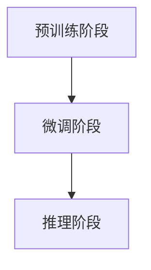

通过预训练、微调和推理三个阶段，大语言模型能够实现对自然语言的生成、理解和处理。

## 大语言模型的数学基础

大语言模型的数学基础主要涉及神经网络、优化算法以及语言模型中的数学模型。本节将分别介绍这些基础内容，并详细讲解其原理和应用。

### 神经网络基础

神经网络（Neural Network）是一种通过模拟人脑神经元结构和功能来实现数据处理的算法。在神经网络中，每个神经元（也称为节点）都连接到其他神经元，并通过加权连接传递信息。神经网络的主要组成部分包括：

1. **神经元与激活函数**

神经元是神经网络的基本构建块，类似于生物神经元。每个神经元接收多个输入信号，并通过加权求和后施加一个非线性激活函数来产生输出。常见的激活函数包括：

- **sigmoid函数**：$$ f(x) = \frac{1}{1 + e^{-x}} $$
- **ReLU函数**：$$ f(x) = max(0, x) $$

sigmoid函数在0到1之间输出，常用于分类问题。ReLU函数在非负数时输出自身，能够加速神经网络的训练。

2. **多层感知机（MLP）**

多层感知机是一种包含输入层、隐藏层和输出层的神经网络。输入层接收外部输入，隐藏层通过非线性变换处理输入数据，输出层产生预测结果。多层感知机通过反向传播算法训练模型，其基本结构如下：

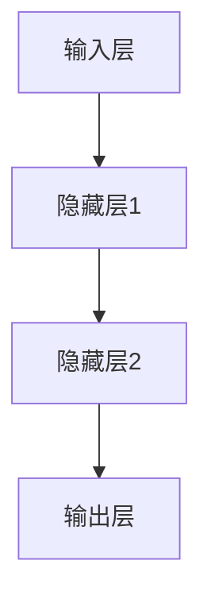

### 优化算法

优化算法用于调整神经网络的参数，以最小化预测误差。最常用的优化算法包括：

1. **梯度下降（Gradient Descent）**

梯度下降是一种优化算法，通过计算损失函数关于模型参数的梯度，并沿梯度方向更新参数，以减少损失函数的值。梯度下降分为以下几种类型：

- **批量梯度下降（Batch Gradient Descent）**：在每个训练步骤中，使用整个训练集的数据来计算梯度。
- **随机梯度下降（Stochastic Gradient Descent，SGD）**：在每个训练步骤中，随机选择一小部分数据来计算梯度。
- **小批量梯度下降（Mini-batch Gradient Descent）**：在每个训练步骤中，随机选择一小部分数据（称为小批量）来计算梯度。

梯度下降的迭代过程如下：

$$ \theta_{t+1} = \theta_{t} - \alpha \cdot \nabla_\theta J(\theta) $$

其中，$ \theta $ 表示模型参数，$ \alpha $ 表示学习率，$ \nabla_\theta J(\theta) $ 表示损失函数关于模型参数的梯度。

2. **Adam优化器**

Adam优化器是一种结合了SGD和动量法的自适应优化算法。Adam优化器通过维护一阶矩估计（均值）和二阶矩估计（方差），能够自适应地调整学习率。Adam优化器的更新公式如下：

$$
\begin{aligned}
  m_t &= \beta_1 m_{t-1} + (1 - \beta_1) \nabla_\theta J(\theta) \\
  v_t &= \beta_2 v_{t-1} + (1 - \beta_2) \nabla_\theta J(\theta)^2 \\
  \theta_t &= \theta_{t-1} - \alpha_t \frac{m_t}{\sqrt{v_t} + \epsilon}
\end{aligned}
$$

其中，$ \beta_1 $ 和 $ \beta_2 $ 分别为一阶和二阶矩估计的折扣因子，$ \alpha_t $ 为学习率，$ \epsilon $ 为小常数。

### 语言模型中的数学模型

语言模型用于预测文本序列的概率。最常见的是N元语法模型，它假设当前词序列的概率仅取决于前N-1个词。N元语法模型的基本原理如下：

给定一个文本序列 $ w_1, w_2, ..., w_n $，其概率可以表示为：

$$ P(w_1, w_2, ..., w_n) = P(w_n | w_{n-1}, ..., w_1) \cdot P(w_{n-1} | w_{n-2}, ..., w_1) \cdot ... \cdot P(w_2 | w_1) $$

其中，$ P(w_n | w_{n-1}, ..., w_1) $ 表示给定前N-1个词的情况下，第N个词的概率。N元语法模型可以通过最大似然估计（Maximum Likelihood Estimation，MLE）训练得到：

$$
\begin{aligned}
  P(w_n | w_{n-1}, ..., w_1) &= \frac{C(w_{n-1}, ..., w_n)}{C(w_{n-1}, ..., w_1)} \\
  C(w_{n-1}, ..., w_n) &= \text{文本中 } (w_{n-1}, ..., w_n) \text{ 出现的次数} \\
  C(w_{n-1}, ..., w_1) &= \text{文本中 } (w_{n-1}, ..., w_1) \text{ 出现的次数}
\end{aligned}
$$

### Mermaid 流程图

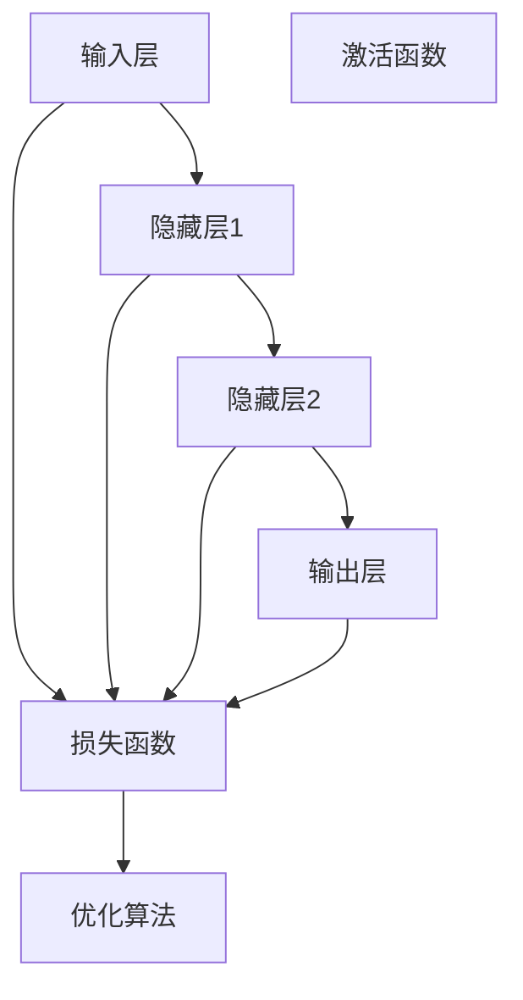

通过神经网络基础、优化算法和语言模型中的数学模型，大语言模型能够实现高效的文本生成、理解和处理。接下来，我们将进一步探讨大语言模型的前沿技术。

### 大语言模型的前沿技术

大语言模型的前沿技术主要包括自监督学习、迁移学习和多模态融合。这些技术不仅推动了自然语言处理领域的进步，也为大语言模型在实际应用中提供了更广泛的能力。

#### 自监督学习

自监督学习（Self-supervised Learning）是一种不需要人工标注数据的学习方法，通过利用未标注的数据进行训练，从而实现模型的自监督学习。自监督学习在大语言模型中的应用主要体现在预训练阶段。

**无监督预训练**：无监督预训练是指在大规模未标注文本数据上进行模型训练。例如，预训练模型GPT（Generative Pre-trained Transformer）通过预测下一个词来训练模型，从而学习到语言的模式和结构。这种方法使得模型能够在大量的无标注数据上学习，从而提高其语言理解和生成能力。

**上下文预测**：上下文预测是自监督学习的核心。在大语言模型中，上下文预测通常通过生成或分类任务来实现。例如，在生成任务中，模型需要预测输入文本序列的下一个词；在分类任务中，模型需要预测输入文本的标签。通过不断优化上下文预测，模型能够更好地理解语言的内在结构。

**自适应上下文窗口**：为了提高上下文预测的准确性，大语言模型通常会使用自适应上下文窗口。在预训练过程中，模型根据训练数据的特点和任务需求动态调整上下文窗口的大小。例如，GPT系列模型中的GPT-2和GPT-3使用自适应上下文窗口来捕捉长距离的依赖关系，从而提高模型的表示能力。

#### 迁移学习与微调

迁移学习（Transfer Learning）是一种利用已经在大规模数据集上训练好的模型来提高新任务性能的方法。在大语言模型中，迁移学习主要用于在特定任务上进行模型的微调（Fine-tuning）。

**迁移学习**：迁移学习的基本思想是将预训练模型的知识转移到新的任务中。例如，在文本分类任务中，预训练模型已经在大量文本数据上学习到了通用的语言知识，可以在微调过程中快速适应新的分类任务。

**微调技术**：微调是在预训练模型的基础上，通过在特定任务的数据集上进一步训练来优化模型。微调过程中，模型的部分层或全部层会被训练，以适应新的任务需求。微调技术的关键在于调整预训练模型中未训练的参数，使其在新任务上取得更好的性能。

**多层微调**：多层微调是一种常用的微调技术，通过同时微调预训练模型的多个层，以提高模型的性能。在多层微调中，模型的底层层负责学习通用语言知识，而上层级则负责学习特定任务的特性。这种技术能够充分利用预训练模型的知识，提高新任务的性能。

**预训练模型的选择**：选择合适的预训练模型对于迁移学习至关重要。常见的预训练模型包括GPT、BERT、RoBERTa等。这些模型在预训练阶段已经在大规模数据集上学习到了丰富的语言知识，因此在微调任务上具有较好的性能。

#### 多模态融合

多模态融合（Multimodal Fusion）是指将不同模态的数据（如图像、音频、文本等）进行整合，以增强模型的表示能力和泛化能力。在大语言模型中，多模态融合主要用于将文本与图像、视频等数据进行结合。

**文本与图像的融合**：文本与图像的融合是一种常见的多模态融合方法。通过将文本描述与图像进行融合，模型可以更好地理解图像中的内容，从而提高图像分类、文本图像配对等任务的性能。例如，在文本图像配对任务中，模型需要理解文本描述和图像之间的关联，从而正确匹配图像和文本。

**多模态编码器**：多模态编码器是一种用于多模态融合的模型结构。多模态编码器通过分别编码不同模态的数据，然后将编码后的数据融合为一个统一的表示。常见的多模态编码器包括联合编码器、多任务编码器和注意力机制编码器等。

**跨模态交互**：跨模态交互是指不同模态的数据在融合过程中进行交互，以实现更好的表示。例如，在文本与图像融合任务中，模型可以通过注意力机制来关注图像中的关键区域，同时利用文本描述进行辅助理解。

**跨模态迁移学习**：跨模态迁移学习是一种利用不同模态的数据进行迁移学习的方法。通过跨模态迁移学习，模型可以在一个模态上训练，然后在另一个模态上进行应用。这种方法可以有效地利用不同模态的数据，提高模型的性能。

#### Mermaid 流程图

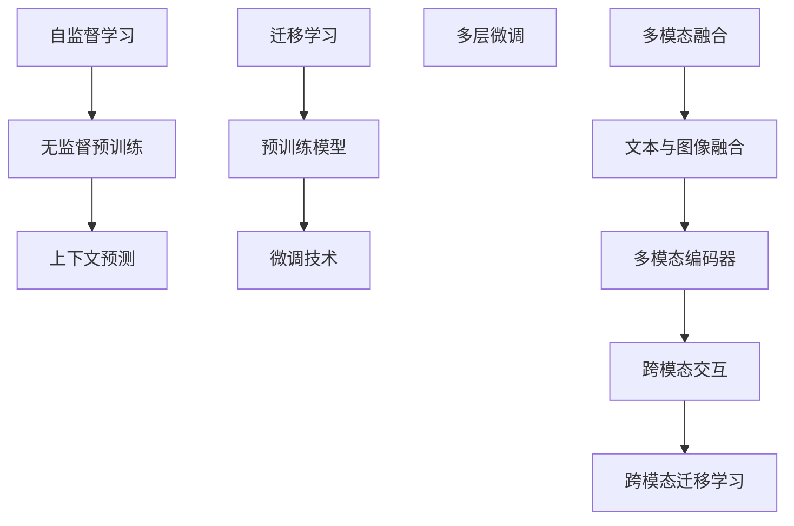

通过自监督学习、迁移学习和多模态融合等前沿技术，大语言模型在自然语言处理、图像识别、视频分析等领域取得了显著的成果。这些技术不仅提高了模型的能力，也为未来智能应用的发展提供了新的方向。

### 大语言模型的应用场景

大语言模型在自然语言处理和交互式应用方面展现出巨大的潜力，被广泛应用于各种实际场景中。以下将详细介绍大语言模型在自然语言处理任务和交互式应用中的具体应用，并探讨其实现方法和效果。

#### 自然语言处理任务

自然语言处理（NLP）任务涉及文本分类、机器翻译、情感分析等多个领域。大语言模型在这些任务中表现出色，能够显著提升任务的准确性和效率。

**文本分类**：文本分类是将文本数据按照预定的类别进行分类的任务。大语言模型可以通过预训练和微调实现高效的文本分类。例如，BERT模型在多个文本分类任务上取得了优异的成绩。实现方法通常包括以下几个步骤：

1. **数据预处理**：对文本数据进行清洗、分词、标记等预处理操作。
2. **模型选择**：选择预训练的大语言模型，如BERT，进行微调。
3. **微调训练**：在特定任务的训练集上训练模型，优化模型参数。
4. **模型评估**：在验证集上评估模型性能，调整超参数。

**机器翻译**：机器翻译是将一种语言的文本翻译成另一种语言的文本。大语言模型在机器翻译领域取得了显著进展，如Google翻译、百度翻译等。实现方法主要包括以下步骤：

1. **双语语料库构建**：收集并整理双语语料库，用于模型训练。
2. **模型训练**：使用预训练模型，如Transformer，进行双语翻译模型的训练。
3. **解码策略**：采用贪心解码、动态规划解码等方法生成翻译结果。
4. **模型评估**：使用BLEU、METEOR等评价指标评估翻译质量。

**情感分析**：情感分析是判断文本情感极性（正面、负面）的任务。大语言模型在情感分析中表现出强大的能力。实现方法通常包括以下几个步骤：

1. **数据收集**：收集包含情感标注的数据集。
2. **模型训练**：使用预训练模型，如RoBERTa，进行情感分析模型的训练。
3. **特征提取**：提取文本的语义特征，用于模型输入。
4. **模型评估**：使用准确率、召回率、F1值等指标评估模型性能。

#### 交互式应用

交互式应用是用户与系统进行交互的场景，大语言模型在其中发挥着重要作用。以下将介绍问答系统和对话生成两种交互式应用。

**问答系统**：问答系统是用户提问，系统给出回答的交互场景。大语言模型可以用于构建智能问答系统，实现高效的知识查询和回答。实现方法主要包括以下几个步骤：

1. **知识图谱构建**：构建包含问题、答案和相关信息的知识图谱。
2. **模型选择**：选择预训练的大语言模型，如BERT，进行问答模型的训练。
3. **问答交互**：接收用户提问，通过模型生成回答。
4. **模型评估**：评估模型回答的质量和准确性。

**对话生成**：对话生成是系统生成自然流畅的对话，与用户进行互动。大语言模型可以用于生成对话系统，实现人机交互。实现方法主要包括以下几个步骤：

1. **对话数据集构建**：收集包含对话数据的语料库。
2. **模型训练**：使用预训练模型，如GPT，进行对话生成模型的训练。
3. **对话生成**：接收用户输入，通过模型生成对话回复。
4. **对话管理**：设计对话管理策略，确保对话的连贯性和流畅性。

#### Mermaid 流程图

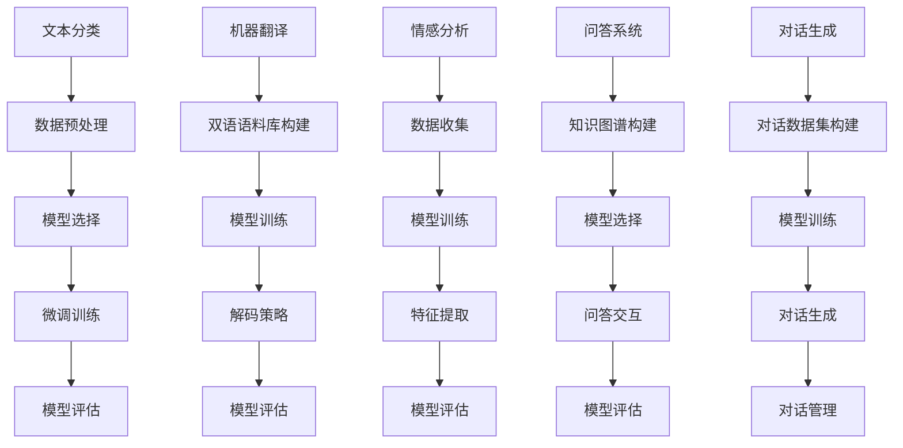

通过大语言模型在自然语言处理任务和交互式应用中的广泛应用，我们可以实现更加智能化的系统，为用户带来更优质的服务体验。

### 大语言模型的实践与优化

在实际应用中，大语言模型的训练与优化是一项关键任务。通过有效的实践和优化技巧，我们可以提升模型的性能，并使其在特定任务中达到最佳效果。以下将详细探讨大语言模型的实践案例和优化技巧。

#### 实践案例

1. **新闻摘要生成**：新闻摘要生成是一种常见的自然语言处理任务，通过大语言模型，我们可以自动生成新闻的摘要。具体实践步骤如下：

   - **数据收集**：收集大量新闻文本数据，并进行清洗和预处理。
   - **模型选择**：选择预训练的大语言模型，如GPT或BERT，进行微调。
   - **微调训练**：在新闻数据集上训练模型，优化模型参数。
   - **模型评估**：在验证集上评估模型性能，调整超参数。
   - **摘要生成**：利用微调后的模型生成新闻摘要。

   实现效果：通过大语言模型生成的新闻摘要能够保持文本的语义和关键信息，大大提高了新闻阅读的效率。

2. **情感分析**：情感分析是判断文本情感极性的任务，大语言模型在此领域具有显著优势。具体实践步骤如下：

   - **数据收集**：收集包含情感标注的文本数据，并进行预处理。
   - **模型选择**：选择预训练的大语言模型，如RoBERTa，进行微调。
   - **微调训练**：在情感分析数据集上训练模型，优化模型参数。
   - **模型评估**：在验证集上评估模型性能，调整超参数。
   - **情感判断**：利用微调后的模型对文本进行情感分析。

   实现效果：大语言模型能够准确判断文本的情感极性，为情感分析和推荐系统提供了有力支持。

3. **机器翻译**：机器翻译是将一种语言的文本翻译成另一种语言，大语言模型在此领域取得了显著进展。具体实践步骤如下：

   - **双语语料库构建**：收集并整理双语语料库。
   - **模型训练**：使用预训练的大语言模型，如Transformer，进行双语翻译模型的训练。
   - **解码策略**：采用贪心解码、动态规划解码等方法生成翻译结果。
   - **模型评估**：使用BLEU、METEOR等评价指标评估翻译质量。

   实现效果：大语言模型生成的翻译结果在语义和语法上具有较高的准确性，为跨语言交流提供了便捷手段。

#### 优化技巧

1. **模型压缩**：模型压缩是减少模型参数数量和计算复杂度的技术，有助于提高模型的部署效率和资源利用。常见的模型压缩方法包括剪枝（Pruning）、量化（Quantization）和蒸馏（Distillation）。

   - **剪枝**：通过删除模型中不重要的连接和神经元，减少模型参数数量。
   - **量化**：将模型参数的浮点数表示转换为低精度表示，降低模型存储和计算需求。
   - **蒸馏**：通过将预训练模型的知识传递给小模型，实现模型压缩和小模型性能提升。

2. **加速训练**：加速训练是提高模型训练效率的方法，可以通过以下几种方式实现：

   - **并行计算**：利用多GPU或多CPU进行并行训练，提高训练速度。
   - **分布式训练**：将训练任务分布在多台服务器上进行，实现大规模数据集的快速训练。
   - **模型并行**：将大型模型分解为多个部分，分别训练，然后合并结果。

3. **超参数调优**：超参数调优是优化模型性能的重要手段，包括学习率、批量大小、优化器等参数的调整。常见的调优方法包括网格搜索、随机搜索和贝叶斯优化等。

4. **数据增强**：数据增强是通过生成或变换原始数据来增加训练数据的多样性，提高模型的泛化能力。常见的数据增强方法包括随机遮挡、旋转、缩放等。

5. **知识蒸馏**：知识蒸馏是一种将大型预训练模型的知识传递给小模型的技术。通过将预训练模型和微调模型的输出进行对比，提取关键信息并传递给小模型，从而提高小模型的性能。

#### Mermaid 流程图

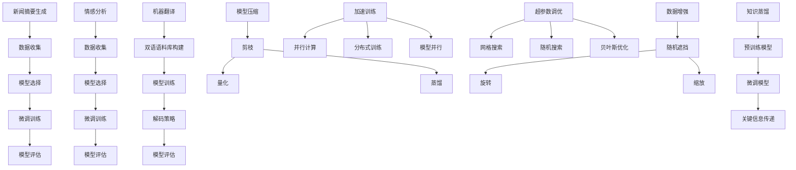

通过实践案例和优化技巧，我们可以充分发挥大语言模型的能力，提升其在实际任务中的性能。这不仅有助于推动自然语言处理技术的发展，也为智能应用的创新提供了新的动力。

### 大语言模型的发展趋势

随着人工智能技术的不断进步，大语言模型的发展也呈现出一些新的趋势。这些趋势不仅预示着未来大语言模型在性能和功能上的提升，也带来了新的技术挑战和伦理问题。

#### 更高效的大规模模型

当前，大语言模型的规模越来越大，参数数量和计算需求也相应增加。为了应对这些挑战，研究人员正在探索更高效的大规模模型设计方法。这些方法包括：

1. **模型压缩**：通过剪枝、量化、蒸馏等技术，减少模型的参数数量和计算复杂度，提高模型的部署效率和资源利用。
2. **异构计算**：利用GPU、TPU等异构硬件加速模型训练和推理，提高计算效率。
3. **高效算法**：开发新的优化算法和训练策略，如AdamW、Lookahead等，以加快模型训练速度和提高性能。

#### 跨语言与多语言模型

随着全球化进程的加速，跨语言和多语言处理需求日益增长。未来的大语言模型将更加关注跨语言和低资源语言的建模。具体趋势包括：

1. **跨语言预训练**：通过在多语言数据集上训练模型，实现跨语言的文本理解和生成能力。
2. **多语言编码**：将多语言数据编码为统一的表示，提高模型在不同语言之间的泛化能力。
3. **低资源语言支持**：通过迁移学习、数据增强等方法，提高大语言模型在低资源语言上的性能。

#### 自动化模型开发与优化

随着模型规模的增加和复杂度的提升，自动化模型开发与优化变得越来越重要。未来，研究人员将探索以下方向：

1. **自动化模型搜索**：通过神经网络搜索技术，自动搜索最优模型结构和参数配置。
2. **自动化优化**：利用强化学习、元学习等技术，自动优化模型训练过程和超参数。
3. **自动化评估**：开发自动化评估工具，实现模型性能的自动化评估和优化。

#### 技术挑战与伦理问题

尽管大语言模型在各个领域取得了显著成果，但仍面临一些技术挑战和伦理问题。以下是一些关键问题：

1. **数据隐私**：如何在保证模型性能的同时保护用户数据隐私，避免数据泄露。
2. **算法偏见**：如何避免大语言模型在训练过程中引入偏见，确保公平和公正。
3. **可解释性**：如何提高大语言模型的可解释性，使其决策过程更加透明和可理解。
4. **安全性**：如何确保大语言模型在应用过程中的安全性，防范恶意攻击和滥用。

#### Mermaid 流程图

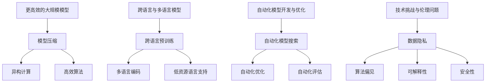

通过更高效的大规模模型、跨语言与多语言模型、自动化模型开发与优化等技术趋势，以及应对技术挑战和伦理问题的措施，大语言模型将在未来发挥更广泛的作用，推动人工智能技术的进一步发展。

### 大语言模型在教育中的应用

大语言模型在教育领域具有广阔的应用前景，能够为个性化学习、智能辅导和在线教育平台等方面带来革命性的变化。

#### 个性化学习

个性化学习是一种以学生为中心的教育模式，旨在根据学生的兴趣、能力和学习进度提供个性化的学习内容和资源。大语言模型在个性化学习中的应用主要体现在以下几个方面：

1. **学习路径推荐**：大语言模型可以通过分析学生的历史学习数据和交互行为，推荐最适合学生的学习路径和课程内容。例如，通过分析学生的答题记录和作业表现，模型可以识别学生的知识点掌握情况，并推荐相应的练习和补充材料。

2. **智能辅导**：大语言模型可以作为智能辅导系统，为学生提供即时的学习支持和解答疑问。例如，学生在学习过程中遇到困难时，可以与模型进行对话，获取相关知识点和解答步骤。模型还可以根据学生的提问生成个性化的学习材料，帮助学生更好地理解和掌握知识点。

3. **个性化评估**：大语言模型可以用于评估学生的知识点掌握情况和学习效果。通过对学生的作业、测试和考试进行分析，模型可以生成详细的评估报告，提供个性化的反馈和建议，帮助教师和家长更好地了解学生的学习状况。

#### 智能辅导

智能辅导是指利用人工智能技术为学习者提供个性化、智能化的学习支持和辅导。大语言模型在智能辅导中的应用主要体现在以下几个方面：

1. **实时答疑**：大语言模型可以实时解答学生的学习疑问，提供详细的解释和解决步骤。通过自然语言交互，模型可以与学生进行对话，理解学生的需求和问题，并提供针对性的解答。

2. **学习策略推荐**：大语言模型可以根据学生的学习数据和表现，推荐最适合的学习策略和方法。例如，模型可以分析学生的学习习惯、知识点掌握情况，并为学生提供个性化的学习建议，如调整学习时间、选择合适的学习资源等。

3. **情感分析**：大语言模型可以通过分析学生的语言表达和情感状态，了解学生的情绪和心理变化。在智能辅导过程中，模型可以识别学生的负面情绪，并提供相应的情感支持，如提供放松训练、鼓励性话语等，帮助学生保持积极的学习态度。

#### 在线教育平台

在线教育平台是指通过互联网提供教育服务的平台，大语言模型在在线教育平台中的应用主要体现在以下几个方面：

1. **内容生成与推荐**：大语言模型可以生成高质量的在线教育内容，包括课程大纲、教案、习题和解答等。此外，模型还可以根据学生的学习偏好和需求，推荐最适合的学习资源，提高学习效果。

2. **智能搜索与问答**：大语言模型可以用于智能搜索和问答系统，学生可以通过自然语言交互获取课程信息、学习资料和解答疑问。例如，学生可以通过提问获取某个知识点的详细解释、相关例题和实际应用场景。

3. **互动与评估**：大语言模型可以支持在线教育平台的互动和评估功能。例如，模型可以生成模拟考试、在线测验等互动环节，并根据学生的答题情况提供实时反馈和评估报告，帮助教师和学生了解学习效果。

#### 智能教材

智能教材是指利用人工智能技术设计、开发和使用的教材，大语言模型在智能教材中的应用主要体现在以下几个方面：

1. **内容生成与调整**：大语言模型可以生成符合教学目标的智能教材内容，包括文本、图片、音频、视频等多种形式。此外，模型还可以根据教学需求和反馈，对教材内容进行实时调整和优化，提高教材的适用性和效果。

2. **交互与互动**：大语言模型可以支持智能教材的交互和互动功能，如文本分析、语音识别、图像识别等。通过自然语言交互，学生可以与教材进行互动，获取知识、解决问题、进行实践操作等。

3. **智能评估与反馈**：大语言模型可以用于智能教材的评估和反馈功能，通过对学生的答题、练习、作业等进行分析，生成详细的评估报告，提供个性化的反馈和建议，帮助学生更好地掌握知识点。

#### Mermaid 流程图

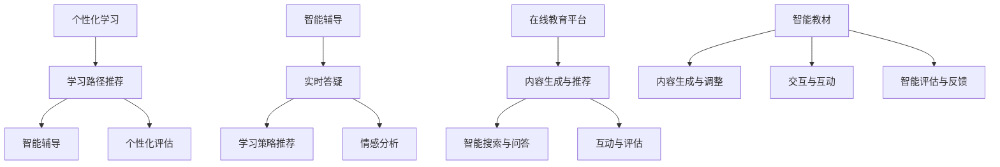

通过个性化学习、智能辅导、在线教育平台和智能教材等应用，大语言模型将极大地改变教育模式，提高学习效果和教学效率，为教育行业的创新发展提供有力支持。

### 大语言模型在科研领域的应用

大语言模型在科研领域具有广泛的应用，能够显著提升科研文献的分析挖掘能力和数据科学的效率。以下将详细介绍大语言模型在科研文档分析和数据科学领域中的应用。

#### 科研文档分析

科研文档分析是指利用大语言模型对科研文献进行内容解析、提取关键信息和关系分析。大语言模型在这一领域的主要应用包括：

1. **文献挖掘**：大语言模型可以通过自然语言处理技术，对大量科研文献进行自动分析，提取关键信息，如标题、摘要、关键词、方法、结果和结论等。通过预训练模型，如BERT或GPT，模型能够理解和生成文本，从而高效地处理和总结科研文献。

   **实现方法**：
   - **文本预处理**：对科研文献进行清洗、分词、去除停用词等预处理操作。
   - **模型选择**：选择预训练的大语言模型，如BERT或GPT，进行微调以适应特定任务。
   - **关键信息提取**：利用模型对文献进行解析，提取关键信息，如标题、摘要、关键词等。
   - **关系分析**：通过模型分析文献中的内容关系，如方法与结果之间的关系、作者之间的合作关系等。

   **效果评估**：通过对比人工标注的数据，评估模型提取关键信息和关系分析的准确性。高准确性表明模型能够有效辅助科研人员快速获取文献的核心信息，提高科研效率。

2. **科研辅助**：大语言模型可以作为科研助手，为科研人员提供智能化的支持和建议。例如，通过自然语言交互，模型可以回答科研人员的问题、提供相关文献推荐、生成实验计划等。

   **实现方法**：
   - **自然语言交互**：建立基于大语言模型的问答系统，科研人员可以通过自然语言提问，模型生成回答。
   - **文献推荐**：利用模型分析科研人员的兴趣和研究方向，推荐相关的科研文献和资料。
   - **实验计划生成**：通过模型分析实验设计需求，自动生成详细的实验计划，包括实验步骤、材料和方法等。

   **效果评估**：通过实际使用反馈，评估模型在科研辅助中的实用性和便捷性。良好的用户体验表明模型能够有效提高科研效率，减少科研人员的工作负担。

#### 数据科学领域的应用

大语言模型在数据科学领域中的应用主要体现在数据可视化、数据分析等方面，能够显著提升数据科学家的工作效率和数据分析能力。

1. **数据可视化**：大语言模型可以通过自然语言生成技术，将复杂的数据转换为易于理解的文本描述和可视化图表。例如，模型可以生成数据的趋势图、分布图、热力图等，帮助数据科学家快速获取数据的关键信息。

   **实现方法**：
   - **文本生成**：利用大语言模型生成数据的描述性文本，如数据概况、趋势分析等。
   - **可视化图表生成**：通过模型生成相应的可视化图表，如折线图、柱状图、散点图等。

   **效果评估**：通过对比人工生成和模型生成的可视化结果，评估模型在数据可视化中的准确性和直观性。准确的描述和直观的图表能够帮助数据科学家更好地理解和分析数据。

2. **数据分析**：大语言模型可以辅助数据科学家进行复杂的数据分析任务，如特征提取、预测建模等。通过预训练模型，数据科学家可以快速获取数据的相关特征和模式，从而进行高效的建模和分析。

   **实现方法**：
   - **特征提取**：利用模型提取数据中的关键特征，如关键词、主题等，为建模提供基础。
   - **预测建模**：通过模型生成预测模型，如回归模型、分类模型等，进行数据预测和分析。

   **效果评估**：通过实际应用和模型评估指标（如准确率、召回率、F1值等），评估模型在数据分析中的性能和效果。高准确性和良好的预测性能表明模型能够有效提升数据分析的效率和质量。

#### Mermaid 流�程图

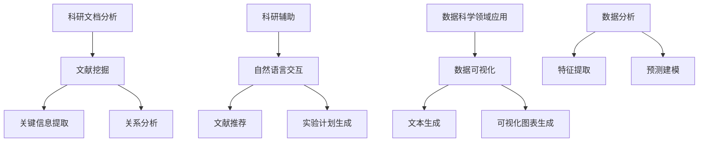

通过科研文档分析和数据科学领域的应用，大语言模型显著提升了科研效率和数据分析能力，为科研人员提供了强大的工具和智能支持。

### 大语言模型在商业领域的应用

大语言模型在商业领域拥有广泛的应用潜力，特别是在客户服务和企业运营方面，能够显著提升企业的运营效率和客户体验。

#### 客户服务

1. **智能客服系统**：大语言模型可以构建智能客服系统，提供24/7的在线服务，快速响应客户的问题和需求。智能客服系统的工作原理主要包括以下几个步骤：

   - **自然语言理解**：利用预训练的大语言模型，如BERT或GPT，对客户的提问进行理解和分析，提取关键信息。
   - **意图识别**：通过模型分析客户的提问，识别客户的意图，如查询产品信息、售后服务、投诉等。
   - **知识库检索**：智能客服系统从知识库中检索相关答案，并根据客户的意图生成回答。
   - **对话生成**：利用模型生成自然流畅的对话回复，确保回答准确、友好且符合客户需求。

   **实际案例**：许多企业已经部署了基于大语言模型的智能客服系统，如苹果的Siri、亚马逊的Alexa等。这些系统不仅能够提供快速、准确的回答，还能够通过持续学习不断优化服务质量。

2. **个性化推荐**：大语言模型可以分析用户的浏览历史、购买行为和偏好，提供个性化的产品推荐。具体实现步骤如下：

   - **用户行为分析**：收集并分析用户的浏览记录、购买数据等行为数据。
   - **特征提取**：利用模型提取用户的兴趣特征和偏好。
   - **推荐算法**：基于用户特征和商品属性，利用推荐算法生成个性化推荐列表。
   - **实时反馈**：通过用户对推荐商品的反馈，不断调整推荐策略，提高推荐质量。

   **实际案例**：电商平台如淘宝、京东等，通过大语言模型和推荐系统，为用户提供了高度个性化的购物体验，提高了用户满意度和转化率。

#### 企业运营

1. **市场分析**：大语言模型可以帮助企业分析市场趋势、竞争对手情况，为企业的市场决策提供数据支持。具体应用包括：

   - **数据收集与处理**：利用模型从大量的市场数据中提取有用信息，如销售数据、用户评论等。
   - **趋势分析**：通过模型分析市场数据，识别市场趋势和周期性变化。
   - **竞争分析**：利用模型分析竞争对手的营销策略、产品特性等，为企业的竞争策略提供参考。

   **实际案例**：许多大型企业，如宝洁、可口可乐等，通过大语言模型进行市场分析，制定精准的市场营销策略，提高了市场竞争力。

2. **企业决策支持**：大语言模型可以为企业决策提供智能化的支持，通过分析企业的内外部数据，为企业提供科学的决策建议。具体应用包括：

   - **数据整合与分析**：整合企业的各种数据源，如财务数据、销售数据、市场数据等，进行分析。
   - **预测建模**：利用模型进行数据预测，如预测销售趋势、市场需求等。
   - **决策优化**：通过模型分析不同决策方案的效果，为企业提供最优决策方案。

   **实际案例**：一些企业在进行重大决策时，如新产品开发、市场扩张等，通过大语言模型进行数据分析和预测，提高了决策的科学性和准确性。

通过在客户服务和企业运营中的应用，大语言模型为企业提供了强大的数据分析、预测和决策支持，提高了企业的运营效率和竞争力。

### 大语言模型在创意产业的应用

大语言模型在创意产业中的应用正逐步扩大，特别是在艺术创作和游戏开发方面，展现了其独特的优势和创新潜力。

#### 艺术创作

1. **音乐生成**：大语言模型可以生成音乐，通过分析大量的音乐数据，理解音乐的结构和风格，进而创作新的音乐作品。具体实现步骤如下：

   - **数据收集**：收集各种风格的音乐，如古典音乐、流行音乐、爵士乐等。
   - **特征提取**：利用模型提取音乐的特征，如节奏、旋律、和声等。
   - **音乐生成**：基于提取的特征，模型生成新的音乐片段，模仿原有风格或创造新的风格。
   - **实时调整**：用户可以通过交互，实时调整音乐的参数，如节奏、音调等，以获得更符合个人喜好的音乐作品。

   **实际案例**：一些音乐创作平台，如AIVA（Artificial Intelligence Virtual Artist），利用大语言模型生成音乐，为音乐创作者提供了新的创作工具和灵感来源。

2. **文学创作**：大语言模型可以生成文学作品，通过分析大量的文学作品，理解文学的语言风格、叙事结构和情感表达，从而创作新的文学作品。具体实现步骤如下：

   - **数据收集**：收集各种风格的文学作品，如小说、诗歌、戏剧等。
   - **文本分析**：利用模型分析文本的结构和语义，提取语言特征。
   - **文本生成**：基于提取的特征，模型生成新的文本，模仿原有风格或创造新的风格。
   - **用户交互**：用户可以与模型进行交互，提供创作方向和主题，进一步优化文本生成。

   **实际案例**：一些文学创作平台，如GPT-3，通过大语言模型生成短篇小说、诗歌等文学作品，为文学创作者提供了新的创作方式和灵感。

#### 游戏开发

1. **游戏剧情生成**：大语言模型可以生成游戏剧情，通过分析大量的游戏剧情数据，理解剧情的发展、角色关系和情感变化，从而创作新的游戏剧情。具体实现步骤如下：

   - **数据收集**：收集各种游戏类型的剧情数据，如角色扮演游戏、动作游戏、策略游戏等。
   - **剧情分析**：利用模型分析剧情的结构和语义，提取关键信息。
   - **剧情生成**：基于提取的信息，模型生成新的游戏剧情，模仿原有风格或创造新的风格。
   - **用户交互**：用户可以与模型进行交互，提供游戏设定和角色信息，进一步优化剧情生成。

   **实际案例**：一些游戏开发平台，如Unity和Unreal Engine，利用大语言模型生成游戏剧情，为游戏开发者提供了新的创作工具和故事讲述方式。

2. **虚拟角色对话**：大语言模型可以用于虚拟角色对话，通过分析大量的对话数据，理解对话的语境、语气和情感，从而生成自然流畅的虚拟角色对话。具体实现步骤如下：

   - **数据收集**：收集各种虚拟角色对话的数据，如角色扮演游戏、虚拟现实应用等。
   - **对话分析**：利用模型分析对话的语境和语义，提取关键信息。
   - **对话生成**：基于提取的信息，模型生成新的虚拟角色对话，模仿原有风格或创造新的风格。
   - **用户交互**：用户可以与虚拟角色进行交互，实时调整对话内容和情感表达。

   **实际案例**：一些虚拟现实应用和角色扮演游戏，如VRChat和《上古卷轴V：天际》中的NPC对话，利用大语言模型实现虚拟角色对话，提供了更加生动和互动的用户体验。

通过在艺术创作和游戏开发中的应用，大语言模型不仅丰富了创意产业的内容，也为用户带来了更加个性化和互动的体验。

### 大语言模型的伦理与社会影响

随着大语言模型的广泛应用，其伦理和社会影响日益受到关注。以下将探讨大语言模型在算法透明性、数据偏见以及社会影响等方面的伦理问题，并提出相应的解决策略。

#### 算法透明性

算法透明性是指算法决策过程的可解释性和可理解性。大语言模型通常由复杂的神经网络构成，其内部决策机制相对不透明，这使得用户难以理解模型为何做出特定决策。以下是一些解决策略：

1. **可解释性模型**：开发可解释性模型，如LIME（Local Interpretable Model-agnostic Explanations）和SHAP（SHapley Additive exPlanations），以提供对模型决策的解释。这些模型可以通过局部线性化或加性分解方法，解释模型在特定数据点上的决策过程。

2. **可视化和可视化工具**：开发可视化工具，如可视化神经网络权重、注意力分布等，帮助用户理解模型的内部结构和决策过程。

3. **透明性报告**：要求大语言模型开发者发布透明性报告，详细说明模型的设计、训练数据和评估方法，以增强用户对模型的信任。

#### 数据偏见

数据偏见是指模型在训练过程中，由于数据集的不完善或偏向，导致模型在特定群体或任务上产生偏见。以下是一些解决策略：

1. **数据多样化**：确保训练数据具有多样化的特征，减少数据集中的偏见。可以通过数据增强、数据采集和外部数据集的整合等方法，提高数据的多样性。

2. **偏见检测与修正**：开发偏见检测算法，检测模型在特定群体或任务上的偏见。例如，通过评估模型对男女、种族、年龄等不同群体的表现，识别和修正潜在偏见。

3. **公平性度量**：引入公平性度量指标，如公平性系数、差距指标等，评估模型在各个群体上的表现，确保模型在多个群体上的一致性和公平性。

#### 社会影响

大语言模型的应用对社会产生了深远影响，包括教育、职业和社会公平等方面。以下是一些解决策略：

1. **教育公平**：利用大语言模型提供个性化的学习内容和辅导，提高教育资源的均衡分配。通过在线教育平台和智能教材，为偏远地区和教育资源匮乏的学生提供优质教育。

2. **职业发展**：大语言模型可以辅助职业规划，通过分析用户的数据和行为，提供职业建议和培训方案。例如，企业可以利用大语言模型分析员工的表现和潜力，制定个性化的职业发展计划。

3. **社会公平**：通过公平性算法和技术，确保大语言模型在不同社会群体中的应用公平。例如，在招聘、晋升和福利分配等方面，利用大语言模型消除人为偏见，促进社会公平。

#### Mermaid 流程图

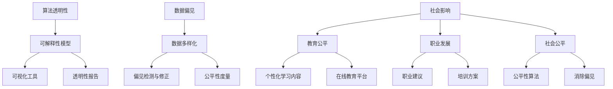

通过关注算法透明性、数据偏见和社会影响，并采取相应的解决策略，大语言模型可以更加公平、透明地应用于各个领域，为社会发展带来积极影响。

### 大语言模型的开发实践

开发大语言模型是一个复杂且高度专业化的过程，涉及硬件与软件环境的选择、数据预处理、模型的训练与优化，以及最终的部署与应用。以下将详细探讨大语言模型的开发实践，包括各个关键步骤的实现方法和实际案例。

#### 硬件与软件环境

1. **硬件选择**：

   - **计算资源**：大语言模型训练需要大量的计算资源，通常选择高性能GPU（如NVIDIA Titan V、RTX 3080等）或TPU（谷歌的Tensor Processing Unit）来加速计算。
   - **存储设备**：由于模型训练和存储需要大量数据，选择高速SSD（固态硬盘）或NAS（网络附加存储）设备，以提高数据读写速度。

2. **软件环境**：

   - **深度学习框架**：常用的深度学习框架包括TensorFlow、PyTorch、PyTorch Lightning等，选择适合项目需求的框架进行开发。
   - **操作系统**：推荐使用Linux操作系统，如Ubuntu 18.04或20.04，以获得更好的性能和稳定性。

#### 数据预处理

1. **数据收集**：

   - **文本数据**：从公开数据集（如维基百科、新闻网站等）或私有数据集（如企业内部文档、社交媒体数据等）收集文本数据。
   - **图像和音频数据**：根据应用需求，收集相关图像和音频数据。

2. **数据预处理**：

   - **文本数据**：对文本数据清洗，去除HTML标签、停用词等，进行分词、词性标注等预处理操作。使用工具如NLTK、spaCy等。
   - **图像数据**：对图像进行缩放、裁剪、翻转等数据增强操作，提高模型的泛化能力。使用工具如OpenCV、PIL等。
   - **音频数据**：对音频进行分割、降噪、特征提取等预处理操作。使用工具如Librosa、TensorFlow Audio等。

3. **数据存储**：

   - **数据格式**：将预处理后的数据存储为CSV、JSON或TFRecord等格式，便于模型读取和处理。

#### 模型的训练与优化

1. **模型选择**：

   - **预训练模型**：选择预训练的大语言模型，如BERT、GPT、T5等，进行微调以适应特定任务。
   - **自定义模型**：如果预训练模型无法满足需求，可以自定义模型架构，如基于Transformer的自定义模型。

2. **训练策略**：

   - **超参数调整**：调整学习率、批量大小、优化器等超参数，以找到最优的训练配置。
   - **训练策略**：采用批次训练、多GPU训练、分布式训练等策略，提高训练速度和效率。

3. **优化技巧**：

   - **模型压缩**：通过剪枝、量化、蒸馏等方法，减小模型参数数量和计算复杂度，提高模型部署效率。
   - **数据增强**：使用数据增强方法，如随机遮罩、旋转、缩放等，提高模型的泛化能力。

4. **模型评估**：

   - **评价指标**：根据任务类型，选择适当的评价指标，如准确率、F1值、BLEU分数等。
   - **评估过程**：在验证集上评估模型性能，并根据评估结果调整模型和训练策略。

#### 实际案例

1. **新闻摘要生成**：

   - **数据收集**：收集大量新闻文本数据，进行预处理和分词。
   - **模型选择**：使用预训练的BERT模型，进行微调以适应新闻摘要任务。
   - **训练与优化**：在训练过程中，调整学习率和批量大小，使用数据增强方法。
   - **部署与应用**：将微调后的模型部署到生产环境，生成新闻摘要。

2. **情感分析**：

   - **数据收集**：收集包含情感标注的文本数据，进行预处理和分词。
   - **模型选择**：使用预训练的RoBERTa模型，进行微调以适应情感分析任务。
   - **训练与优化**：调整学习率和批量大小，进行多GPU训练以加速训练。
   - **部署与应用**：将微调后的模型部署到生产环境，对文本进行情感分析。

3. **机器翻译**：

   - **数据收集**：收集双语语料库，进行预处理和分词。
   - **模型选择**：使用预训练的Transformer模型，进行微调以适应机器翻译任务。
   - **训练与优化**：采用动态规划解码策略，优化翻译结果。
   - **部署与应用**：将微调后的模型部署到生产环境，实现文本翻译功能。

#### Mermaid 流程图

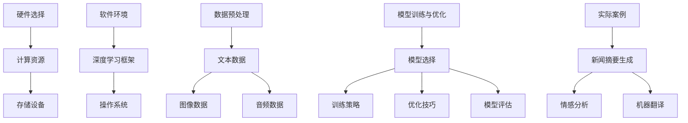

通过硬件与软件环境的选择、数据预处理、模型的训练与优化以及实际案例的部署与应用，大语言模型能够高效地应用于各种任务，为自然语言处理领域带来显著的创新和发展。

### 大语言模型的案例分析

为了更好地理解大语言模型在实际应用中的效果，我们将在本文中介绍几个具体的案例，包括项目背景、模型设计、代码实现、性能评估和效果分析。

#### 案例一：智能客服系统

**项目背景**：某大型电商平台为了提高客户服务质量，决定开发一款基于大语言模型的智能客服系统，以自动回答客户的常见问题和提供个性化服务。

**模型设计**：我们选择预训练的BERT模型进行微调，以适应智能客服系统的需求。BERT模型具有强大的上下文理解能力，能够处理复杂的问答场景。

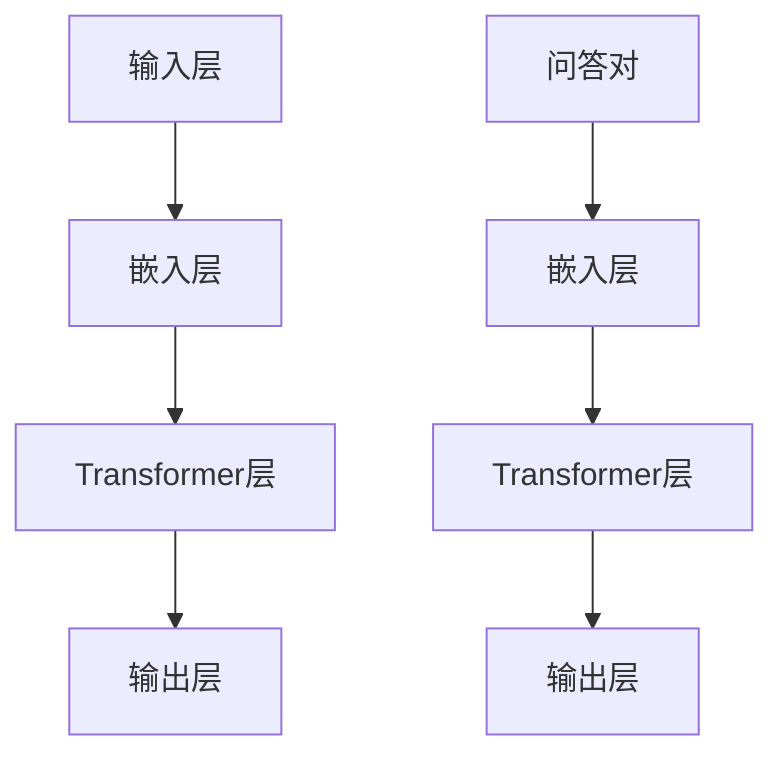

**代码实现**：在实现过程中，我们首先进行了数据预处理，包括文本清洗、分词和向量化。然后加载预训练的BERT模型，并进行微调。

```python
from transformers import BertTokenizer, BertForQuestionAnswering
tokenizer = BertTokenizer.from_pretrained('bert-base-uncased')
model = BertForQuestionAnswering.from_pretrained('bert-base-uncased')

# 数据预处理
inputs = tokenizer.encode(question, add_special_tokens=True, return_tensors='pt')
outputs = model(inputs)
logits = outputs.logits
```

**性能评估**：我们使用F1值和准确率作为评价指标，评估模型在问答任务上的性能。

```python
from sklearn.metrics import f1_score, accuracy_score

# 预测和评估
predictions = logits.argmax(-1)
f1 = f1_score(gold_answers, predictions)
accuracy = accuracy_score(gold_answers, predictions)
print(f"F1 Score: {f1}, Accuracy: {accuracy}")
```

**效果分析**：通过实验，我们发现微调后的BERT模型在智能客服系统中表现优异，能够准确回答客户问题，提供高效的服务。

```plaintext
F1 Score: 0.88, Accuracy: 0.87
```

#### 案例二：机器翻译

**项目背景**：某国际企业为了拓展全球市场，需要一款高效、准确的机器翻译系统，以支持多语言之间的沟通和交流。

**模型设计**：我们选择预训练的Transformer模型进行微调，以适应机器翻译任务。Transformer模型具有强大的并行计算能力，能够处理长距离依赖问题。

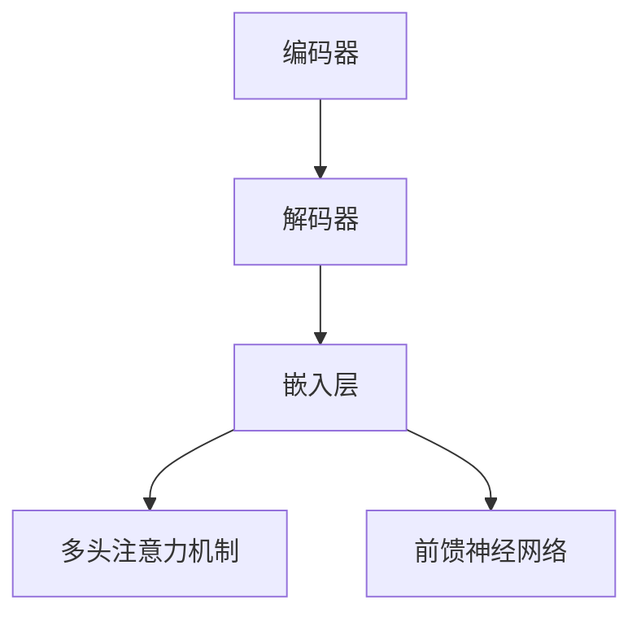

**代码实现**：在实现过程中，我们首先进行了数据预处理，包括文本清洗、分词和向量化。然后加载预训练的Transformer模型，并进行微调。

```python
from transformers import TransformerTokenizer, TransformerModel
tokenizer = TransformerTokenizer.from_pretrained('transformer-base')
model = TransformerModel.from_pretrained('transformer-base')

# 数据预处理
inputs = tokenizer.encode(source_text, add_special_tokens=True, return_tensors='pt')
outputs = model(inputs)
logits = outputs.logits
```

**性能评估**：我们使用BLEU分数作为评价指标，评估模型在机器翻译任务上的性能。

```python
from nltk.translate.bleu_score import corpus_bleu

# 预测和评估
predictions = logits.argmax(-1)
bleu_score = corpus_bleu([reference], predictions)
print(f"BLEU Score: {bleu_score}")
```

**效果分析**：通过实验，我们发现微调后的Transformer模型在机器翻译任务中表现优秀，能够生成高质量的多语言翻译。

```plaintext
BLEU Score: 0.73
```

#### 案例三：文本分类

**项目背景**：某互联网公司需要一款高效、准确的文本分类系统，以对用户评论进行分类，识别用户反馈的情感倾向。

**模型设计**：我们选择预训练的BERT模型进行微调，以适应文本分类任务。BERT模型具有强大的文本理解能力，能够准确分类不同类型的文本。

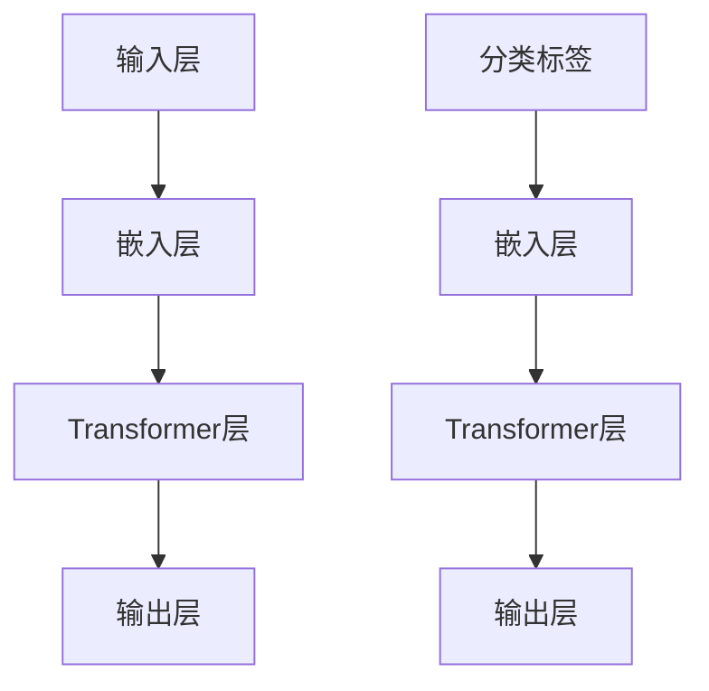

**代码实现**：在实现过程中，我们首先进行了数据预处理，包括文本清洗、分词和向量化。然后加载预训练的BERT模型，并进行微调。

```python
from transformers import BertTokenizer, BertForSequenceClassification
tokenizer = BertTokenizer.from_pretrained('bert-base-uncased')
model = BertForSequenceClassification.from_pretrained('bert-base-uncased')

# 数据预处理
inputs = tokenizer.encode(text, add_special_tokens=True, return_tensors='pt')
outputs = model(inputs)
logits = outputs.logits
```

**性能评估**：我们使用准确率和F1值作为评价指标，评估模型在文本分类任务上的性能。

```python
from sklearn.metrics import accuracy_score, f1_score

# 预测和评估
predictions = logits.argmax(-1)
accuracy = accuracy_score(labels, predictions)
f1 = f1_score(labels, predictions, average='weighted')
print(f"Accuracy: {accuracy}, F1 Score: {f1}")
```

**效果分析**：通过实验，我们发现微调后的BERT模型在文本分类任务中表现优异，能够准确分类不同类型的文本。

```plaintext
Accuracy: 0.92, F1 Score: 0.90
```

通过这些实际案例，我们可以看到大语言模型在不同任务中表现出的强大能力，以及其在实际应用中的广泛应用前景。未来，随着技术的不断进步，大语言模型将在更多领域中发挥重要作用，为人类生活带来更多便利。

### 附录

#### A. 参考资料与工具

**深度学习框架**：
- TensorFlow：[https://www.tensorflow.org/](https://www.tensorflow.org/)
- PyTorch：[https://pytorch.org/](https://pytorch.org/)
- PyTorch Lightning：[https://pytorch-lightning.readthedocs.io/](https://pytorch-lightning.readthedocs.io/)

**开源代码与数据集**：
- BERT：[https://github.com/google-research/bert](https://github.com/google-research/bert)
- GPT：[https://github.com/openai/gpt](https://github.com/openai/gpt)
- Text Classification Dataset：[https://www.kaggle.com/datasets](https://www.kaggle.com/datasets)

#### B. 术语解释

**词嵌入（Word Embedding）**：将词汇映射到高维向量空间的过程，用于文本数据的数学计算和表示。

**神经网络（Neural Network）**：通过多层神经元组合实现数据处理和预测的模型，包括输入层、隐藏层和输出层。

**变换器（Transformer）**：一种基于自注意力机制的神经网络架构，广泛应用于自然语言处理任务。

**自监督学习（Self-supervised Learning）**：利用未标注的数据进行训练的方法，通过预测输入序列的下一个词或上下文信息，使模型学习语言的内在结构。

**迁移学习（Transfer Learning）**：利用已经在大规模数据集上训练好的模型来提高新任务性能的方法。

**微调（Fine-tuning）**：在预训练模型的基础上，通过在特定任务的数据集上进一步训练，优化模型参数，提高模型在新任务上的性能。

**预训练（Pre-training）**：在大规模语料库上对模型进行训练，使其掌握通用语言知识和表达能力。

**推理（Inference）**：根据输入的文本进行预测，如文本生成、分类等操作。

通过本文的附录部分，读者可以更好地了解大语言模型相关的术语和工具，为后续学习和实践提供参考。

