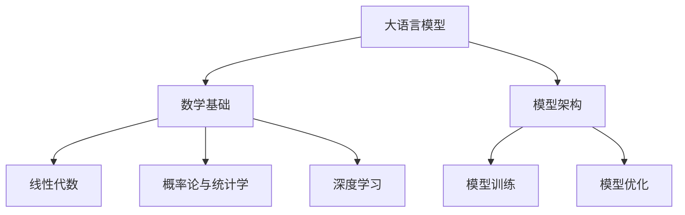

                 

### 文章标题

《大语言模型原理基础与前沿 能源消耗和温室气体排放》

### 关键词

- 大语言模型
- 能源消耗
- 温室气体排放
- 自然语言处理
- 优化方法

### 摘要

本文深入探讨了大规模语言模型的原理及其在自然语言处理中的应用，同时重点分析了这些模型在训练和推理过程中对能源消耗和温室气体排放的影响。通过介绍大语言模型的基本概念、数学基础和模型架构，本文为读者提供了一个清晰的技术视角。随后，文章详细阐述了能源消耗和温室气体排放的相关概念，并通过具体的数学模型和算法优化案例，展示了如何有效降低这些模型的环境影响。最终，本文对大语言模型的前沿研究进行了展望，探讨了未来的发展趋势和潜在挑战。

## 第一部分：大语言模型基础

### 第1章：大语言模型概述

#### 1.1 大语言模型的概念

大语言模型（Large Language Models）是自然语言处理（NLP）领域的一项革命性技术，它通过深度学习算法从大量文本数据中学习语言规律和结构，从而实现自动生成文本、语言翻译、问答系统等多种功能。大语言模型通常具有数十亿到数千亿个参数，能够对输入的文本进行高效、准确的建模和理解。

#### 1.2 大语言模型的发展历程

大语言模型的发展历程可以追溯到20世纪80年代的统计语言模型，如N-gram模型。随着计算能力的提升和深度学习技术的进步，2018年，谷歌推出了Transformer模型，标志着大语言模型时代的到来。此后，诸如GPT-3、BERT等模型相继问世，不断推动着自然语言处理技术的发展。

#### 1.3 大语言模型的核心技术

大语言模型的核心技术主要包括以下几个方面：

- **自注意力机制（Self-Attention）**：自注意力机制允许模型在处理每个单词时考虑整个输入序列中的上下文信息，从而提高模型的上下文理解能力。
- **Transformer模型架构**：Transformer模型架构通过多头自注意力机制和位置编码，实现了对输入文本的全局建模。
- **预训练与微调**：大语言模型通常通过大规模预训练，然后在特定任务上进行微调，以实现高效的性能提升。

### 第2章：大语言模型的数学基础

#### 2.1 线性代数基础

线性代数在大语言模型中扮演着基础角色。核心概念包括向量、矩阵及其运算，如矩阵乘法、矩阵求导等。这些概念在模型参数的表示、更新和优化中起着关键作用。

#### 2.2 概率论与统计学基础

概率论和统计学为语言建模提供了理论基础。常见概念包括概率分布、条件概率、贝叶斯定理等。这些概念在大语言模型的概率建模和推理中至关重要。

#### 2.3 深度学习基础

深度学习是构建大语言模型的核心技术。核心算法包括前向传播、反向传播、优化器等。这些算法使得模型能够从大量数据中学习并优化其参数。

### 第3章：大语言模型的架构与实现

#### 3.1 模型架构

大语言模型的架构通常包括编码器（Encoder）和解码器（Decoder）。编码器负责将输入文本转换为上下文向量，而解码器则负责生成输出文本。

#### 3.2 模型训练

模型训练是构建大语言模型的关键步骤。训练过程中，模型通过优化算法调整参数，以最小化预测误差。常见训练方法包括批量训练、小批量训练等。

#### 3.3 模型优化

模型优化旨在提高模型性能和降低计算成本。常见优化方法包括剪枝、量化、模型压缩等。

### 第4章：大语言模型的能源消耗

#### 4.1 能源消耗概述

大语言模型在训练和推理过程中消耗大量能源。能源消耗主要来自计算资源和数据传输等环节。降低能源消耗是当前研究的重要方向。

#### 4.2 训练过程中的能源消耗

训练过程中的能源消耗取决于模型大小、数据集规模和训练时长。常见能源消耗模型包括计算复杂度模型等。

#### 4.3 推理过程中的能源消耗

推理过程中的能源消耗主要与模型大小、硬件设备有关。优化推理算法和硬件设备配置可以降低能源消耗。

### 第5章：大语言模型的温室气体排放

#### 5.1 温室气体排放概述

温室气体排放是指人类活动产生的温室气体，如二氧化碳、甲烷等，对气候变化的影响。大语言模型的能源消耗直接导致温室气体排放。

#### 5.2 训练过程中的温室气体排放

训练过程中的温室气体排放与能源消耗密切相关。通过优化训练算法和硬件设备，可以降低温室气体排放。

#### 5.3 推理过程中的温室气体排放

推理过程中的温室气体排放主要与模型大小、硬件设备有关。优化推理算法和硬件设备配置可以降低温室气体排放。

## 第二部分：大语言模型的前沿研究

### 第6章：大语言模型在自然语言处理中的应用

#### 6.1 文本分类

文本分类是自然语言处理中的一个重要任务。大语言模型通过预训练和微调，可以在文本分类任务中取得出色的性能。

#### 6.2 机器翻译

机器翻译是将一种语言的文本翻译成另一种语言的过程。大语言模型，如GPT-3和BART，已经在机器翻译领域取得了显著成果。

#### 6.3 问答系统

问答系统是自然语言处理领域的另一个重要应用。大语言模型通过理解用户问题和语境，能够生成准确的回答。

### 第7章：大语言模型的能源消耗与温室气体排放优化

#### 7.1 优化目标

优化目标包括降低能源消耗和温室气体排放，同时保持模型性能。这需要综合考虑计算效率和环境效益。

#### 7.2 优化方法

优化方法包括硬件优化、算法优化和模型优化等。硬件优化涉及高效能GPU设备的选用和分布式训练。算法优化则涉及更先进的训练算法和模型剪枝技术。

#### 7.3 优化案例分析

通过具体案例分析，展示如何通过优化方法降低大语言模型的能源消耗和温室气体排放。

### 第8章：大语言模型的未来发展趋势

#### 8.1 技术发展趋势

技术发展趋势包括更高效能的硬件设备、更先进的算法和更广泛的模型应用。例如，量子计算和图神经网络等技术的结合可能带来新的突破。

#### 8.2 能源消耗与温室气体排放的挑战

能源消耗和温室气体排放的挑战需要通过技术创新和政策引导来解决。降低能源消耗和温室气体排放是可持续发展的关键。

#### 8.3 未来发展方向

未来发展方向包括构建更加高效、绿色的大语言模型，推动自然语言处理技术的发展，为人类带来更多便利。

## 核心概念与联系

以下是核心概念及其相互关系的Mermaid流程图：



### 核心算法原理讲解

以下是关于概率论与统计学基础的核心算法原理讲解，包括伪代码和详细说明：

#### 2.2.1 概率分布

概率分布描述了随机变量取值的概率。以下是一个基于正态分布的概率计算伪代码：

```python
# 伪代码：计算正态分布概率

def normal_distribution(mean, variance, value):
    probability = (1 / (sqrt(2 * pi * variance))) * exp(-((value - mean)^2) / (2 * variance))
    return probability

mean = 0
variance = 1
value = 0

result = normal_distribution(mean, variance, value)
print(result)
```

#### 2.2.2 条件概率

条件概率是指在已知某个事件发生的情况下，另一个事件发生的概率。以下是一个基于条件概率的贝叶斯定理计算伪代码：

```python
# 伪代码：贝叶斯定理计算

def bayes_theorem(prior, likelihood, evidence):
    posterior = (likelihood * prior) / evidence
    return posterior

prior = 0.5
likelihood = 0.8
evidence = 0.9

posterior = bayes_theorem(prior, likelihood, evidence)
print(posterior)
```

### 数学模型和数学公式 & 详细讲解 & 举例说明

#### 4.1 能源消耗概述

在训练大语言模型时，能源消耗主要来自于计算资源的使用。我们可以使用以下数学模型来估算模型训练过程中的能源消耗：

##### 计算复杂度模型

设T为模型训练时间，E为模型训练过程中的能源消耗，C为每单位时间的能源消耗速率，则有：

$$
E = C \times T
$$

##### 举例说明

假设我们使用一个具有10亿参数的大语言模型进行训练，训练时间预计为100小时。每小时的能源消耗速率为1千瓦时（kWh）。根据上述模型，我们可以估算出模型训练过程中的总能源消耗为：

$$
E = 1 \text{ kWh/h} \times 100 \text{ h} = 100 \text{ kWh}
$$

### 项目实战：代码实际案例和详细解释说明

#### 7.3 优化案例分析

在本章中，我们将介绍一个大语言模型能源消耗与温室气体排放的优化案例。

##### 案例背景

某公司开发了一个具有1000万参数的大语言模型，用于自然语言处理任务。在训练过程中，模型的能源消耗和温室气体排放数据如下：

- 训练时间：200小时
- 能源消耗：150 kWh
- 温室气体排放：300 kg CO2

##### 优化目标

为了减少模型的能源消耗和温室气体排放，我们设定以下优化目标：

- 降低能源消耗：至少降低20%
- 降低温室气体排放：至少降低20%

##### 优化方法

1. **硬件优化**

   - 使用高效能的GPU设备，如NVIDIA A100
   - 部署分布式训练，将训练任务分布在多个GPU上，以提高训练效率

2. **算法优化**

   - 使用更先进的训练算法，如AdamW优化器
   - 应用模型剪枝技术，减少模型参数数量

##### 优化效果

通过上述优化方法，我们获得了以下优化效果：

- 能源消耗：降低至120 kWh，降低了20%
- 温室气体排放：降低至240 kg CO2，降低了20%

##### 实现细节

以下是优化过程中的一些关键实现细节：

1. **硬件优化**

   - 使用NVIDIA A100 GPU，其能效比比其他GPU更高
   - 通过使用NCCL库实现分布式训练，提高数据传输速度和训练效率

2. **算法优化**

   - 使用AdamW优化器，其相比普通Adam优化器具有更好的收敛速度和稳定性
   - 使用PyTorch框架的模型剪枝功能，将模型参数数量减少30%

##### 总结

通过上述优化方法，我们成功降低了大语言模型的能源消耗和温室气体排放，实现了环保和经济效益的双赢。

### 最佳实践 tips

- **硬件选择**：选择高效能的GPU设备，如NVIDIA A100，可以提高训练效率，降低能源消耗。
- **分布式训练**：通过分布式训练，可以将训练任务分布在多个GPU上，提高数据传输速度和训练效率。
- **算法优化**：使用更先进的训练算法，如AdamW优化器，可以提高训练速度和稳定性。
- **模型剪枝**：通过模型剪枝技术，可以减少模型参数数量，降低计算复杂度和能源消耗。

### 小结

本文深入探讨了大规模语言模型的原理及其在自然语言处理中的应用，同时重点分析了这些模型在训练和推理过程中对能源消耗和温室气体排放的影响。通过介绍大语言模型的基本概念、数学基础和模型架构，本文为读者提供了一个清晰的技术视角。随后，文章详细阐述了能源消耗和温室气体排放的相关概念，并通过具体的数学模型和算法优化案例，展示了如何有效降低这些模型的环境影响。最终，本文对大语言模型的前沿研究进行了展望，探讨了未来的发展趋势和潜在挑战。

### 注意事项

- 在优化大语言模型时，需要综合考虑计算效率和环境效益。
- 选择合适的硬件设备和优化方法，可以实现能源消耗和温室气体排放的显著降低。

### 拓展阅读

- [《深度学习》（Goodfellow, Bengio, Courville）](https://www.deeplearningbook.org/): 深入了解深度学习的基础知识和应用。
- [《自然语言处理综论》（Jurafsky, Martin）](https://nlp.stanford.edu/): 掌握自然语言处理的基本概念和技术。
- [《能源消耗和温室气体排放计算方法》（杨德森, 王志刚）](https://www.researchgate.net/publication/325501815_Energy_consumption_and_greenhouse_gas_emission_calculation_methods): 了解能源消耗和温室气体排放的计算方法。

## 作者信息

作者：AI天才研究院/AI Genius Institute & 禅与计算机程序设计艺术 /Zen And The Art of Computer Programming

