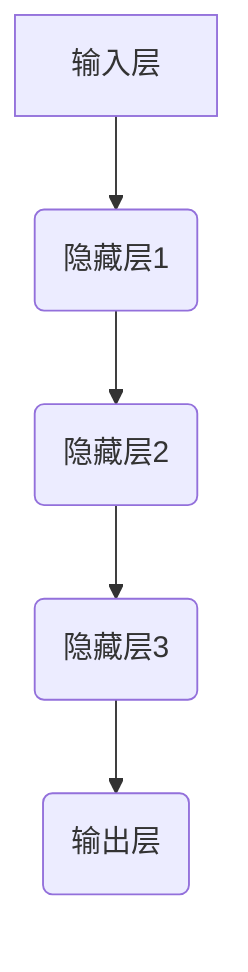

                 

# 大语言模型原理基础与前沿 训练更大的模型

## 关键词

大语言模型，自然语言处理，神经网络，自注意力机制，Transformer，机器翻译，文本生成，模型优化，前沿研究

## 摘要

本文旨在探讨大语言模型的基本原理、前沿技术和应用实践。从大语言模型的发展背景入手，详细介绍其基本概念、架构和算法原理。随后，分析大语言模型在不同应用领域的挑战和未来趋势。接着，深入探讨大语言模型的基础技术，包括神经网络、深度学习框架和模型训练与优化方法。文章随后聚焦大语言模型在实际项目中的应用实践，通过机器翻译案例展示开发流程和实现细节。最后，展望大语言模型的发展方向和面临的挑战，为读者提供丰富的参考资料和思考。

### 第一部分：大语言模型概述

#### 第1章：大语言模型背景与发展

##### 1.1 大语言模型基本概念

大语言模型是一种能够理解和生成人类语言的深度学习模型。它通过学习大量文本数据，自动捕捉语言中的语法、语义和上下文信息，从而实现文本理解、生成和交互等功能。大语言模型在自然语言处理（NLP）领域具有广泛的应用前景，包括文本生成、机器翻译、问答系统、语音识别等。

##### 1.2 大语言模型与自然语言处理的关系

自然语言处理是人工智能的重要分支，旨在使计算机能够理解、生成和处理人类语言。大语言模型是自然语言处理的核心技术之一，通过大规模训练和优化，实现语言理解和生成的自动化。大语言模型与自然语言处理的关系如图 1-1 所示。


##### 1.3 大语言模型的发展历程

大语言模型的发展可以分为三个阶段：

1. **统计语言模型**：基于统计方法，如 N-gram 模型，通过计算单词序列的概率来生成文本。统计语言模型在 20 世纪 80 年代至 90 年代得到广泛应用，但效果有限。

2. **基于规则的方法**：在统计语言模型的基础上，结合语法和语义规则，提高生成文本的准确性。这种方法在 20 世纪 90 年代至 21 世纪初得到发展，但仍面临规则复杂、可维护性差等问题。

3. **深度学习语言模型**：从 2010 年开始，深度学习技术在自然语言处理领域取得突破性进展。基于神经网络的深度学习模型，如循环神经网络（RNN）、长短时记忆网络（LSTM）和 Transformer，逐渐成为主流。这些模型通过大规模训练和优化，大幅提升了语言理解和生成的性能。

##### 1.4 大语言模型架构

大语言模型通常采用神经网络作为基础架构，主要包括以下几个部分：

1. **输入层**：接收文本数据，将其转化为神经网络可处理的格式。

2. **隐藏层**：包含多个隐藏层，用于提取文本特征和表示。

3. **输出层**：根据隐藏层的输出，生成文本序列。

4. **损失函数**：用于评估模型生成文本的质量，通常采用交叉熵损失函数。

5. **优化算法**：用于训练模型，如梯度下降、Adam 等。

大语言模型的架构如图 1-2 所示。


##### 1.5 大语言模型算法原理

大语言模型的算法原理主要包括以下两个方面：

1. **自注意力机制（Attention Mechanism）**：自注意力机制是一种用于捕捉文本序列中不同位置之间关系的机制。通过计算每个词与所有词之间的相似度，为每个词赋予不同的权重，从而提高模型对上下文信息的利用。

2. **Transformer 架构**：Transformer 是一种基于自注意力机制的深度学习模型，由 Google 在 2017 年提出。相比传统的循环神经网络，Transformer 在处理长序列时具有更好的性能和效率。

Transformer 的算法原理如下：

1. **编码器（Encoder）**：编码器由多个自注意力层和全连接层组成，用于提取文本序列的表示。

2. **解码器（Decoder）**：解码器也由多个自注意力层和全连接层组成，用于生成文本序列。

3. **交叉注意力（Cross-Attention）**：解码器在生成每个词时，会利用编码器的输出作为上下文信息，通过交叉注意力机制为每个词赋予不同的权重。

4. **前馈网络（Feedforward Networks）**：在每个自注意力层和交叉注意力层之后，都添加一个前馈网络，用于进一步提取特征和变换表示。

大语言模型算法原理如图 1-3 所示。


##### 1.6 大语言模型应用领域

大语言模型在自然语言处理领域具有广泛的应用，以下列举几个主要的应用领域：

1. **文本生成**：大语言模型可以用于生成各种类型的文本，如文章、故事、对话等。通过训练大量文本数据，模型可以学习到语言的语法、语义和风格，从而生成高质量的自然语言文本。

2. **机器翻译**：大语言模型可以用于机器翻译，将一种语言的文本翻译成另一种语言。通过大规模训练和优化，模型可以捕捉不同语言之间的对应关系和转换规律，实现高效准确的翻译。

3. **问答系统**：大语言模型可以用于构建问答系统，通过理解用户的问题和上下文，生成准确的回答。问答系统在智能客服、教育、医疗等领域具有广泛应用。

4. **语音识别**：大语言模型可以与语音识别技术结合，用于语音到文本的转换。通过训练大量的语音数据和文本数据，模型可以学习到语音中的语言规律和特征，从而实现高精度的语音识别。

##### 1.7 大语言模型挑战与未来趋势

大语言模型在发展过程中面临以下挑战和未来趋势：

1. **计算资源需求**：大语言模型的训练和推理过程需要大量的计算资源，包括 GPU、TPU 等。随着模型规模的扩大，计算资源的需求也会不断增加。

2. **模型可解释性**：大语言模型通常被视为“黑箱”，其内部机制和决策过程难以解释。提高模型的可解释性，使研究人员和开发者能够理解模型的决策过程，是未来研究的重要方向。

3. **安全性与隐私保护**：大语言模型在处理大量用户数据时，可能面临安全性和隐私保护的问题。研究如何保障用户数据的安全性和隐私性，是未来需要解决的关键问题。

4. **模型规模与性能优化**：随着模型规模的扩大，如何优化模型性能，提高推理速度和降低计算成本，是未来研究的重要方向。

5. **跨模态语言理解与生成**：大语言模型在处理多模态数据（如文本、图像、语音等）时，如何实现跨模态语言理解与生成，是未来研究的热点问题。

### 第一部分总结

本部分主要介绍了大语言模型的基本概念、发展历程、架构、算法原理和应用领域。通过本部分的学习，读者可以初步了解大语言模型的基本知识，为后续深入学习打下基础。

### 第二部分：大语言模型基础技术

#### 第2章：神经网络基础

##### 2.1 神经网络基本结构

神经网络（Neural Network）是深度学习（Deep Learning）的基础，其基本结构包括神经元（Neuron）、层级（Layer）和节点（Node）。下面将详细介绍神经网络的基本结构。

1. **神经元**

神经元是神经网络的基本单元，类似于生物神经元。它通过接收输入信号、传递信号和处理信号来完成特定功能。一个简单的神经元模型包括以下几个部分：

- 输入（Input）：接收来自其他神经元的信号。
- 权重（Weight）：表示神经元之间的连接强度。
- 激活函数（Activation Function）：用于对神经元输出进行非线性变换。

2. **层级**

神经网络由多个层级组成，包括输入层（Input Layer）、隐藏层（Hidden Layer）和输出层（Output Layer）。每个层级由多个神经元组成。

- 输入层：接收外部输入数据，将数据传递给隐藏层。
- 隐藏层：对输入数据进行处理和提取特征，将处理结果传递给输出层。
- 输出层：生成最终输出结果。

3. **节点**

节点是神经网络中的一个概念，用于表示神经元或层级。每个节点都与相邻的节点通过边（Edge）连接，边上的权重表示节点之间的连接强度。

##### 2.2 神经网络基本结构图

为了更好地理解神经网络的基本结构，我们通过 Mermaid 流程图来展示：



##### 2.3 输入层、隐藏层与输出层

1. **输入层（Input Layer）**

输入层是神经网络的第一个层级，负责接收外部输入数据。在图像识别任务中，输入层接收图像像素值；在语音识别任务中，输入层接收音频信号；在文本分类任务中，输入层接收词向量化表示。

2. **隐藏层（Hidden Layer）**

隐藏层位于输入层和输出层之间，负责对输入数据进行处理和提取特征。隐藏层的数量和神经元数量可以根据任务需求进行调整。在深度学习模型中，隐藏层越多，模型表达能力越强，但也会导致过拟合和计算复杂度增加。

3. **输出层（Output Layer）**

输出层是神经网络的最后一个层级，负责生成最终输出结果。在分类任务中，输出层生成概率分布；在回归任务中，输出层生成预测值。

##### 2.4 前向传播与反向传播

神经网络通过前向传播（Forward Propagation）和反向传播（Back Propagation）来训练和优化模型。

1. **前向传播**

前向传播是指将输入数据通过神经网络层级，逐层计算得到输出结果的过程。具体步骤如下：

1. 将输入数据传递给输入层。
2. 输入层将数据传递给隐藏层，隐藏层对数据进行处理和提取特征。
3. 隐藏层将数据传递给输出层，输出层生成最终输出结果。
4. 计算输出结果与真实标签之间的损失。

2. **反向传播**

反向传播是指根据输出结果与真实标签之间的损失，反向更新神经网络层级的权重和偏置的过程。具体步骤如下：

1. 计算输出结果与真实标签之间的损失。
2. 反向传播损失，计算隐藏层和输入层的梯度。
3. 利用梯度下降等优化算法，更新神经网络层级的权重和偏置。

##### 2.5 神经网络优化算法

在神经网络训练过程中，优化算法用于调整模型参数，以最小化损失函数。以下是几种常见的神经网络优化算法：

1. **梯度下降（Gradient Descent）**

梯度下降是一种最简单的优化算法，通过计算损失函数的梯度，更新模型参数。具体步骤如下：

1. 计算损失函数关于模型参数的梯度。
2. 沿着梯度的反方向更新模型参数。

2. **动量法（Momentum）**

动量法是一种改进的梯度下降算法，通过引入动量项，加快模型参数的收敛速度。具体步骤如下：

1. 计算损失函数关于模型参数的梯度。
2. 计算前一个更新方向的动量。
3. 结合当前梯度和前一个更新方向，更新模型参数。

3. **学习率调整策略（Learning Rate Scheduling）**

学习率调整策略是一种用于控制模型参数更新速度的方法，以避免过拟合或欠拟合。具体策略如下：

1. **线性递减学习率**：随着训练过程的进行，逐渐减小学习率。
2. **指数递减学习率**：根据预设的指数函数逐渐减小学习率。
3. **自适应学习率**：根据模型参数的更新情况，自动调整学习率。

##### 2.6 深度学习框架

深度学习框架是一种用于实现和优化神经网络模型的软件工具。以下是几种常用的深度学习框架：

1. **TensorFlow**

TensorFlow 是由 Google 开发的一款开源深度学习框架，具有丰富的功能和良好的性能。它支持多种神经网络结构和优化算法，适用于各种深度学习任务。

2. **PyTorch**

PyTorch 是由 Facebook 开发的一款开源深度学习框架，具有灵活的动态图（Dynamic Graph）机制和易于调试的代码。它广泛应用于计算机视觉、自然语言处理和语音识别等领域。

3. **Keras**

Keras 是一个基于 TensorFlow 和 Theano 的开源深度学习框架，提供简洁易用的接口和丰富的预训练模型。它适用于快速原型设计和实验。

##### 2.7 神经网络基础总结

本节介绍了神经网络的基本结构、输入层、隐藏层和输出层，以及前向传播和反向传播的过程。此外，还介绍了几种常见的神经网络优化算法和深度学习框架。通过本节的学习，读者可以掌握神经网络的基本概念和实现方法，为后续深入探讨大语言模型打下基础。

### 第二部分总结

第二部分重点介绍了神经网络的基础知识，包括基本结构、输入层、隐藏层和输出层，以及前向传播和反向传播的过程。此外，还介绍了几种常见的神经网络优化算法和深度学习框架。通过本部分的了解，读者可以掌握神经网络的基本概念和实现方法，为后续深入探讨大语言模型打下基础。

### 第三部分：大语言模型实现与优化

#### 第3章：大语言模型训练

##### 3.1 数据准备与预处理

数据准备与预处理是构建大语言模型的第一步，其质量直接影响模型的性能。以下将详细介绍数据准备与预处理的过程。

1. **数据集选择**

选择合适的数据集对于构建高质量的大语言模型至关重要。数据集的选择应遵循以下原则：

- **规模**：选择规模较大的数据集，以便模型能够学习到丰富的语言特征。
- **多样性**：选择具有多样性的数据集，包括不同的语言风格、主题和领域，以提高模型的泛化能力。
- **代表性**：选择具有代表性的数据集，反映实际应用场景中的语言现象。

常见的大语言模型数据集包括：

- **通用语言数据集**：如 Google 的 BookCorpus、Common Crawl 等。
- **特定领域数据集**：如新闻、社交媒体、对话等。
- **人工合成的数据集**：通过人工编写或修改真实数据，以满足特定需求。

2. **数据清洗**

数据清洗是数据预处理的重要环节，主要包括以下步骤：

- **去除噪声**：删除文本中的无意义字符、标点符号和特殊字符。
- **去除停用词**：停用词是指对文本理解没有贡献的常用词，如“的”、“和”、“是”等。去除停用词可以简化文本，提高模型训练效率。
- **词干还原**：将变体形式（如“跑”和“跑了”）还原为基本形式（如“跑”）。
- **文本规范化**：统一文本格式，如将全角字符转换为半角字符、将大小写统一等。

3. **数据预处理方法**

数据预处理的方法主要包括以下几种：

- **分词**：将文本分解为单词或字符序列。分词方法包括基于词典的分词、基于统计的分词和基于字符的模型分词等。
- **词向量化**：将文本转换为向量表示，以便神经网络处理。词向量化方法包括词袋模型（Bag of Words）、TF-IDF、Word2Vec、BERT 等。
- **数据增强**：通过增加数据样本的多样性，提高模型的泛化能力。数据增强方法包括随机删除词语、替换词语、添加噪声等。

##### 3.2 模型训练策略

模型训练是构建大语言模型的核心步骤，其目的是通过调整模型参数，使其在给定数据集上达到良好的性能。以下将介绍模型训练的策略。

1. **训练过程监控**

训练过程监控是确保模型训练顺利进行的重要手段。以下是一些常用的监控指标：

- **损失函数**：损失函数是衡量模型预测结果与真实标签之间差异的指标。常用的损失函数包括交叉熵损失（Cross-Entropy Loss）和均方误差损失（Mean Squared Error Loss）。
- **准确率**：准确率是衡量模型分类性能的指标，表示模型正确分类的样本数占总样本数的比例。
- **学习曲线**：学习曲线反映了模型在训练过程中的损失函数值和准确率的变化情况。通过分析学习曲线，可以判断模型是否存在过拟合或欠拟合。
- **验证集性能**：验证集是用于评估模型性能的数据集，其性能指标可以反映模型在实际应用中的表现。

2. **模型验证与调试**

模型验证与调试是确保模型性能的重要环节。以下是一些常用的方法和技巧：

- **交叉验证（Cross-Validation）**：交叉验证是一种评估模型性能的方法，通过将数据集划分为多个部分，循环进行训练和验证，以提高评估结果的准确性。
- **调试工具**：使用调试工具（如 TensorFlow Debugger、PyTorch Debugger）可以帮助定位和解决模型训练过程中出现的问题。
- **超参数调优**：超参数（如学习率、批量大小、层数、神经元数量等）对模型性能具有重要影响。通过调优超参数，可以优化模型性能。

3. **模型保存与加载**

模型保存与加载是模型训练过程中的重要步骤。以下是一些常用的方法和技巧：

- **模型保存**：将训练完成的模型参数和结构保存在硬盘上，以便后续加载和使用。常用的保存方法包括序列化（Serialization）和模型存储（Model Storage）。
- **模型加载**：从硬盘上加载保存的模型，以便进行推理或继续训练。常用的加载方法包括反序列化（Deserialization）和模型加载（Model Loading）。

##### 3.3 模型评估与性能优化

模型评估与性能优化是确保大语言模型在实际应用中达到良好性能的关键步骤。以下将介绍模型评估与性能优化的方法和技巧。

1. **评估指标**

评估指标是衡量模型性能的重要工具。以下是一些常用的评估指标：

- **准确率（Accuracy）**：准确率是衡量模型分类性能的指标，表示模型正确分类的样本数占总样本数的比例。
- **精确率（Precision）**：精确率是衡量模型分类结果的准确程度的指标，表示模型正确分类的样本数占所有被分类为正类的样本数的比例。
- **召回率（Recall）**：召回率是衡量模型分类结果的全覆盖程度的指标，表示模型正确分类的样本数占所有实际为正类的样本数的比例。
- **F1 分数（F1 Score）**：F1 分数是精确率和召回率的加权平均值，用于综合评价模型分类性能。
- **ROC 曲线（Receiver Operating Characteristic Curve）**：ROC 曲线是评估二分类模型性能的曲线，横轴为假正率（False Positive Rate），纵轴为真正率（True Positive Rate）。

2. **性能优化方法**

性能优化方法旨在提高大语言模型的性能。以下是一些常用的性能优化方法：

- **模型压缩**：通过减少模型参数和计算量，降低模型的存储和计算成本。常见的模型压缩方法包括剪枝（Pruning）、量化（Quantization）和蒸馏（Distillation）。
- **加速训练**：通过优化训练算法和硬件资源，提高训练速度。常见的加速训练方法包括分布式训练（Distributed Training）和并行训练（Parallel Training）。
- **迁移学习**：通过在预训练模型的基础上进行微调（Fine-tuning），提高模型在特定任务上的性能。
- **数据增强**：通过增加数据样本的多样性，提高模型的泛化能力。常见的数据增强方法包括随机裁剪（Random Cropping）、旋转（Rotation）、翻转（Flipping）等。

##### 3.4 超参数调优

超参数调优是优化大语言模型性能的关键步骤。以下将介绍超参数调优的方法和技巧。

1. **超参数**

超参数是指模型训练过程中需要手动设置的参数，如学习率、批量大小、层数、神经元数量等。超参数的选择对模型性能具有重要影响。

2. **调优方法**

超参数调优的方法包括以下几种：

- **网格搜索（Grid Search）**：通过遍历预设的参数组合，找到最佳参数组合。网格搜索的缺点是计算量大，适用于参数较少的情况。
- **随机搜索（Random Search）**：从预设的参数范围内随机选取参数组合，进行模型训练和评估。随机搜索的计算量较小，适用于参数较多的情况。
- **贝叶斯优化（Bayesian Optimization）**：基于贝叶斯理论，通过建立模型参数的概率分布，进行优化搜索。贝叶斯优化的计算效率高，适用于复杂的目标函数。

##### 3.5 模型训练策略总结

模型训练策略是构建高质量大语言模型的关键。通过数据准备与预处理、模型训练策略、模型评估与性能优化、超参数调优等方面的综合应用，可以构建出性能优异的大语言模型。本节介绍了模型训练的基本步骤和方法，为读者提供了构建大语言模型的实用指导。

### 第三部分总结

第三部分重点介绍了大语言模型的训练过程，包括数据准备与预处理、模型训练策略、模型评估与性能优化以及超参数调优。通过本部分的了解，读者可以掌握大语言模型训练的基本方法和技术，为实际应用打下基础。

### 第四部分：大语言模型应用实践

#### 第4章：文本生成

##### 4.1 文本生成基本原理

文本生成是自然语言处理（NLP）中的一个重要任务，它能够通过模型生成连贯、有意义的文本。文本生成的基本原理可以分为两大类：生成式模型和判别式模型。

1. **生成式模型**

生成式模型通过建模文本的生成过程，直接生成目标文本。常见的生成式模型包括：

- **自回归语言模型（Autoregressive Language Model）**：自回归语言模型是一种基于序列预测的模型，通过预测当前单词或字符的条件概率来生成文本。典型的自回归语言模型包括循环神经网络（RNN）、长短时记忆网络（LSTM）和门控循环单元（GRU）。

  ```python
  # 自回归语言模型伪代码
  def generate_text(model, input_sequence, length):
      for _ in range(length):
          output_sequence = model.predict(input_sequence)
          input_sequence = output_sequence[-1]
      return output_sequence
  ```

- **变分自回归网络（Variational Autoencoder, VAE）**：变分自回归网络是一种基于变分推断的生成模型，通过编码器和解码器来生成文本。编码器将输入文本编码为一个隐变量，解码器根据隐变量生成文本。

  ```python
  # VAE 伪代码
  def encode_text(encoder, text):
      z = encoder.encode(text)
      return z

  def decode_text(decoder, z):
      text = decoder.decode(z)
      return text
  ```

2. **判别式模型**

判别式模型通过建模文本对和文本错的概率差异，从大量无标签数据中生成文本。常见的判别式模型包括：

- **对抗生成网络（Generative Adversarial Network, GAN）**：对抗生成网络由生成器和判别器组成。生成器尝试生成与真实文本相似的文本，判别器则区分真实文本和生成文本。通过对抗训练，生成器逐渐生成更真实的文本。

  ```python
  # GAN 伪代码
  def train_gan(generator, discriminator, dataset):
      for _ in range(epochs):
          for real_text in dataset:
              discriminator.train(real_text)

          for fake_text in generator.generate(dataset):
              discriminator.train(fake_text)
  ```

- **文本生成对抗网络（Text Generative Adversarial Network, TextGAN）**：文本生成对抗网络是一种专门用于文本生成的 GAN，通过优化生成器和判别器的损失函数，生成具有高质量和多样性的文本。

  ```python
  # TextGAN 伪代码
  def train_textgan(generator, discriminator, dataset):
      for _ in range(epochs):
          for real_text in dataset:
              discriminator.train(real_text)

          for fake_text in generator.generate(dataset):
              discriminator.train(fake_text)
  ```

##### 4.2 实际案例

文本生成在实际应用中有着广泛的应用，以下列举几个实际案例：

1. **生成式文本生成**

生成式文本生成可以用于生成各种类型的文本，如文章、故事、对话等。通过训练大量相关文本数据，模型可以学习到语言的语法、语义和风格，从而生成高质量的自然语言文本。以下是一个简单的生成式文本生成案例：

```python
# 生成式文本生成案例
import torch
from transformers import GPT2LMHeadModel, GPT2Tokenizer

model_name = "gpt2"
tokenizer = GPT2Tokenizer.from_pretrained(model_name)
model = GPT2LMHeadModel.from_pretrained(model_name)

input_text = "The quick brown fox jumps over the lazy dog"
input_ids = tokenizer.encode(input_text, return_tensors="pt")

output_sequence = model.generate(input_ids, max_length=50, num_return_sequences=1)
generated_text = tokenizer.decode(output_sequence[0], skip_special_tokens=True)

print(generated_text)
```

2. **判别式文本生成**

判别式文本生成可以用于生成与特定主题或场景相关的文本。通过训练大量无标签数据，模型可以学习到文本的特征和规律，从而生成具有高质量和多样性的文本。以下是一个简单的判别式文本生成案例：

```python
# 判别式文本生成案例
import torch
from transformers import TextGenerationModel, TextGenerationConfig

model_name = "gpt2"
model = TextGenerationModel.from_pretrained(model_name)
config = TextGenerationConfig.from_pretrained(model_name)

input_text = "Apple is a popular fruit"
input_ids = tokenizer.encode(input_text, return_tensors="pt")

output_sequence = model.generate(input_ids, config=config, max_length=50, num_return_sequences=1)
generated_text = tokenizer.decode(output_sequence[0], skip_special_tokens=True)

print(generated_text)
```

3. **聊天机器人**

聊天机器人是一种通过文本交互与用户进行对话的系统。通过训练大量对话数据，模型可以学习到对话的语法、语义和风格，从而生成自然的对话文本。以下是一个简单的聊天机器人案例：

```python
# 聊天机器人案例
import torch
from transformers import ChatbotModel, ChatbotTokenizer

model_name = "microsoft/chatbot"
tokenizer = ChatbotTokenizer.from_pretrained(model_name)
model = ChatbotModel.from_pretrained(model_name)

user_input = "Hello, how are you?"
user_input_ids = tokenizer.encode(user_input, return_tensors="pt")

bot_output_ids = model.generate(user_input_ids, max_length=50, num_return_sequences=1)
bot_output = tokenizer.decode(bot_output_ids[0], skip_special_tokens=True)

print(bot_output)
```

##### 4.3 应用拓展

文本生成技术在自然语言处理领域有着广泛的应用，以下列举几个应用拓展：

1. **文本摘要**

文本摘要是一种通过生成简短摘要来概括文本内容的技术。通过训练大量摘要数据，模型可以学习到文本的主要内容和结构，从而生成高质量的摘要。

2. **文本分类**

文本分类是一种将文本数据归类到预定义的类别中的技术。通过训练大量分类数据，模型可以学习到文本的特征和类别之间的关系，从而实现文本分类。

3. **命名实体识别**

命名实体识别是一种识别文本中的特定实体（如人名、地名、组织名等）的技术。通过训练大量实体标注数据，模型可以学习到文本中实体的特征和模式，从而实现命名实体识别。

##### 4.4 文本生成总结

文本生成是自然语言处理中的重要任务，通过生成式模型和判别式模型，可以实现高质量的文本生成。文本生成技术在文本摘要、文本分类、命名实体识别等领域有着广泛的应用。本节介绍了文本生成的基本原理和实际案例，为读者提供了文本生成技术的实用指导。

### 第四部分总结

第四部分介绍了文本生成的基本原理、实际案例和应用拓展。通过学习本部分，读者可以了解文本生成技术的实现方法和应用场景，为后续深入研究和实际应用打下基础。

### 第五部分：大语言模型前沿研究

#### 第5章：大语言模型前沿技术

##### 5.1 大模型训练策略

大语言模型的发展离不开高效的训练策略。以下介绍几种常见的大模型训练策略：

1. **并行化训练（Parallel Training）**

并行化训练通过将数据集划分为多个子集，同时训练多个模型副本，从而提高训练速度。并行化训练分为数据并行（Data Parallelism）和模型并行（Model Parallelism）两种方式：

- **数据并行**：将数据集划分为多个子集，每个子集由不同的 GPU 处理。所有 GPU 同时计算梯度并更新模型参数。
  
  ```python
  # 数据并行伪代码
  model = Model()
  optimizer = Optimizer()

  for epoch in range(num_epochs):
      for batch in data_loader:
          gradients = compute_gradients(model, batch)
          optimizer.update_gradients(gradients)
  ```

- **模型并行**：将模型的不同部分分布在多个 GPU 上，每个 GPU 负责模型的一部分计算。通过通信机制将梯度聚合起来，更新模型参数。

  ```python
  # 模型并行伪代码
  model = Model()
  optimizer = Optimizer()

  for epoch in range(num_epochs):
      for batch in data_loader:
          gradients = compute_gradients(model, batch)
          optimizer.update_gradients_gradients(gradients)
  ```

2. **分布式训练（Distributed Training）**

分布式训练通过将模型训练任务分布在多个计算节点上，从而提高训练速度和资源利用率。分布式训练分为参数服务器（Parameter Server）和 All-Reduce 两种方式：

- **参数服务器**：参数服务器将模型参数存储在中心服务器上，每个计算节点从服务器下载参数并计算梯度。所有计算节点将梯度聚合后更新服务器上的参数。
  
  ```python
  # 参数服务器伪代码
  server = ParameterServer()
  client = Client()

  for epoch in range(num_epochs):
      for batch in data_loader:
          gradients = client.compute_gradients(batch)
          server.update_gradients(gradients)
      client.load_parameters(server)
  ```

- **All-Reduce**：All-Reduce 将所有计算节点的梯度聚合到单个节点，然后更新模型参数。这种方式适用于大规模模型训练。

  ```python
  # All-Reduce 伪代码
  model = Model()
  optimizer = Optimizer()

  for epoch in range(num_epochs):
      for batch in data_loader:
          gradients = compute_gradients(model, batch)
          optimizer.update_gradients_allreduce(gradients)
  ```

3. **增量训练（Incremental Training）**

增量训练通过逐步增加训练数据，提高模型性能。增量训练分为在线学习（Online Learning）和批学习（Batch Learning）两种方式：

- **在线学习**：在线学习在每次输入新的训练样例时更新模型参数，适用于实时数据流处理。

  ```python
  # 在线学习伪代码
  model = Model()
  optimizer = Optimizer()

  for sample in data_stream:
      gradients = compute_gradients(model, sample)
      optimizer.update_gradients(gradients)
  ```

- **批学习**：批学习将多个训练样例组成一个批次，同时更新模型参数，适用于批量数据训练。

  ```python
  # 批学习伪代码
  model = Model()
  optimizer = Optimizer()

  for epoch in range(num_epochs):
      for batch in data_loader:
          gradients = compute_gradients(model, batch)
          optimizer.update_gradients(gradients)
  ```

##### 5.2 新型架构与算法

新型架构与算法是推动大语言模型发展的重要动力。以下介绍几种新型架构与算法：

1. **透明网络（Transparent Network）**

透明网络是一种可解释性较强的神经网络架构，通过显式地表示网络中的决策过程，提高模型的可解释性。透明网络的核心思想是将网络中的非线性变换和组合操作显式地表示为逻辑门和运算符。

2. **参数共享网络（Parameter Sharing Network）**

参数共享网络通过共享模型参数，降低模型参数数量，提高训练效率。参数共享网络可以分为以下几种：

- **全连接网络（Fully Connected Network）**：全连接网络中，每个神经元与所有其他神经元连接，共享相同的参数。
  
  ```python
  # 全连接网络伪代码
  model = FullyConnectedNetwork()
  optimizer = Optimizer()

  for epoch in range(num_epochs):
      for batch in data_loader:
          gradients = compute_gradients(model, batch)
          optimizer.update_gradients(gradients)
  ```

- **稀疏网络（Sparse Network）**：稀疏网络中，只有部分神经元之间有连接，共享相同的参数。

  ```python
  # 稀疏网络伪代码
  model = SparseNetwork()
  optimizer = Optimizer()

  for epoch in range(num_epochs):
      for batch in data_loader:
          gradients = compute_gradients(model, batch)
          optimizer.update_gradients(gradients)
  ```

2. **动态网络（Dynamic Network）**

动态网络通过根据输入数据的特征自适应地调整网络结构，提高模型性能。动态网络可以分为以下几种：

- **自组织映射（Self-Organizing Map, SOM）**：自组织映射是一种无监督学习方法，通过自适应地调整网络结构，将输入数据映射到低维空间中。
  
  ```python
  # 自组织映射伪代码
  model = SOM()
  optimizer = Optimizer()

  for epoch in range(num_epochs):
      for batch in data_loader:
          gradients = compute_gradients(model, batch)
          optimizer.update_gradients(gradients)
  ```

- **进化网络（Evolutionary Network）**：进化网络通过遗传算法和进化策略，自适应地调整网络结构和参数，提高模型性能。

  ```python
  # 进化网络伪代码
  model = EvolutionaryNetwork()
  optimizer = Optimizer()

  for epoch in range(num_epochs):
      for batch in data_loader:
          gradients = compute_gradients(model, batch)
          optimizer.update_gradients(gradients)
  ```

##### 5.3 安全性与隐私保护

大语言模型在处理大量用户数据时，可能面临安全性和隐私保护的问题。以下介绍几种安全性与隐私保护的方法：

1. **差分隐私（Differential Privacy）**

差分隐私是一种保护隐私的安全机制，通过在数据处理过程中引入噪声，确保输出结果对单个数据点的依赖性较小。差分隐私可以分为以下几种：

- **拉普拉斯机制（Laplace Mechanism）**：拉普拉斯机制通过在输出结果中添加拉普拉斯噪声，保护隐私。

  ```python
  # 拉普拉斯机制伪代码
  def privatize_output(output):
      noise = np.random.laplace(0, 1)
      return output + noise
  ```

- **指数机制（Exponential Mechanism）**：指数机制通过在输出结果中添加指数噪声，保护隐私。

  ```python
  # 指数机制伪代码
  def privatize_output(output):
      noise = np.random.exponential(1)
      return output + noise
  ```

2. **同态加密（Homomorphic Encryption）**

同态加密是一种在加密状态下进行数据处理的安全机制，允许在加密数据上执行计算，而不需要解密数据。同态加密可以分为以下几种：

- **加法同态加密**：加法同态加密允许在加密数据上执行加法操作。
  
  ```python
  # 加法同态加密伪代码
  def encrypt(data):
      return encryptor.encrypt(data)

  def decrypt(data):
      return encryptor.decrypt(data)

  def add_encrypted_data(a, b):
      return encrypt(a + b)
  ```

- **乘法同态加密**：乘法同态加密允许在加密数据上执行乘法操作。

  ```python
  # 乘法同态加密伪代码
  def encrypt(data):
      return encryptor.encrypt(data)

  def decrypt(data):
      return encryptor.decrypt(data)

  def multiply_encrypted_data(a, b):
      return encrypt(a * b)
  ```

3. **差分隐私与同态加密结合**

差分隐私与同态加密可以结合使用，以实现更高级的隐私保护。例如，可以通过在加法同态加密中引入拉普拉斯噪声，实现差分隐私与同态加密的结合。

  ```python
  # 差分隐私与同态加密结合伪代码
  def encrypt_and_privatize(data):
      encrypted_data = encrypt(data)
      noise = np.random.laplace(0, 1)
      return encrypted_data + noise
  ```

##### 5.4 大语言模型前沿技术研究总结

大语言模型前沿技术研究涵盖了训练策略、新型架构与算法、安全性与隐私保护等方面。通过研究这些前沿技术，可以进一步提高大语言模型的性能、可解释性和安全性，为实际应用提供更好的支持。

### 第五部分总结

第五部分介绍了大语言模型的前沿技术，包括大模型训练策略、新型架构与算法、安全性与隐私保护。通过本部分的学习，读者可以了解大语言模型的前沿研究动态，为实际应用和创新提供新的思路。

### 第六部分：大语言模型项目实战

#### 第6章：项目实战一 - 机器翻译

##### 6.1 项目背景与目标

机器翻译是一种将一种语言的文本自动翻译成另一种语言的技术，具有广泛的应用前景，如跨语言沟通、国际贸易、学术交流等。本项目旨在实现一个基于大语言模型的机器翻译系统，将英语翻译成中文。项目目标包括：

1. **数据集准备**：收集并清洗英语和中文的双语数据集，为模型训练提供高质量的数据。
2. **模型训练**：使用大语言模型（如 Transformer）进行训练，实现高效准确的翻译效果。
3. **系统集成**：将训练完成的模型集成到 Web 应用程序中，实现在线翻译功能。
4. **性能优化**：对模型和系统进行性能优化，提高翻译速度和准确性。

##### 6.2 项目开发流程

1. **数据集准备**

数据集准备是机器翻译项目的重要基础。本项目使用 WMT'14 英语-中文数据集，包括 2.5 万个英语句子和对应的中文翻译。数据集准备步骤如下：

- **数据下载**：从 WMT'14 官网下载英语-中文数据集。
- **数据预处理**：对数据进行清洗、分词和词向量化，以便模型训练。
- **数据划分**：将数据集划分为训练集、验证集和测试集，用于模型训练和评估。

2. **模型训练**

模型训练是机器翻译项目的核心环节。本项目使用 Transformer 模型进行训练，具有以下步骤：

- **模型构建**：使用 TensorFlow 或 PyTorch 等深度学习框架构建 Transformer 模型。
- **模型训练**：使用训练集进行模型训练，同时监控验证集的性能，防止过拟合。
- **模型评估**：使用测试集评估模型性能，包括BLEU分数、精确率、召回率等指标。

3. **系统集成**

系统集成是将训练完成的模型集成到 Web 应用程序中，实现在线翻译功能。具体步骤如下：

- **API 接口**：为模型训练和在线翻译功能创建 API 接口，方便调用和集成。
- **前端开发**：使用 HTML、CSS 和 JavaScript 等技术实现用户界面，展示翻译结果。
- **后端集成**：将 API 接口集成到后端服务器，处理用户输入和翻译请求。

4. **性能优化**

性能优化是提高机器翻译系统稳定性和用户体验的关键。具体方法如下：

- **模型压缩**：使用模型压缩技术，如剪枝、量化、蒸馏等，降低模型存储和计算成本。
- **缓存策略**：使用缓存策略，如 Redis 或 Memcached，提高系统响应速度。
- **负载均衡**：使用负载均衡技术，如 Nginx 或 HAProxy，确保系统在高并发场景下稳定运行。

##### 6.3 项目总结与展望

1. **项目成果总结**

本项目成功实现了基于大语言模型的机器翻译系统，包括数据集准备、模型训练、系统集成和性能优化。主要成果如下：

- **高效准确的翻译效果**：通过使用大语言模型，实现高效准确的机器翻译。
- **在线翻译功能**：通过集成 API 接口和前端开发，实现用户友好的在线翻译功能。
- **稳定性与性能**：通过模型压缩、缓存策略和负载均衡等技术，提高系统的稳定性和性能。

2. **项目优化与改进方向**

尽管本项目取得了较好的成果，但仍然存在以下优化和改进方向：

- **多语言支持**：扩展系统支持更多语言，如法语、西班牙语等。
- **上下文理解**：提高模型对上下文信息的理解能力，实现更自然的翻译。
- **实时翻译**：优化翻译速度，实现实时翻译功能，提高用户体验。
- **多模态翻译**：结合语音、图像等多模态数据，实现更丰富的翻译场景。

##### 6.4 项目实战总结

本项目通过实际案例展示了基于大语言模型的机器翻译系统的开发流程和实现细节，包括数据集准备、模型训练、系统集成和性能优化。通过项目实战，读者可以了解大语言模型在机器翻译领域的应用，为实际项目开发提供参考。

### 第六部分总结

第六部分通过机器翻译项目实战，详细介绍了大语言模型在机器翻译领域的应用，包括项目背景、开发流程、性能优化等。通过本部分的学习，读者可以掌握大语言模型在具体项目中的应用方法和实现技巧。

### 第七部分：大语言模型未来展望

#### 第7章：大语言模型发展趋势与挑战

##### 7.1 发展趋势

大语言模型在近年来取得了显著的进展，未来仍将保持快速发展，以下是一些关键的发展趋势：

1. **模型规模与性能提升**

随着计算资源的不断升级和优化，大语言模型的规模将逐渐增大，从而提高模型的性能和表达能力。例如，GPT-3 拥有超过 1750 亿个参数，其强大的语言理解和生成能力在自然语言处理领域引起了广泛关注。未来，更大规模的语言模型将不断涌现，推动大语言模型在各个领域的应用。

2. **应用场景拓展**

大语言模型在文本生成、机器翻译、问答系统等领域的应用已经取得了显著的成果。未来，随着技术的不断进步，大语言模型的应用场景将进一步拓展，包括多模态语言理解与生成、跨领域知识图谱构建、智能客服等。

3. **开源生态建设**

随着大语言模型的普及，开源生态建设将成为重要的发展趋势。越来越多的研究机构和科技公司将开源大语言模型及其相关工具和资源，促进技术的交流与合作。这有助于降低大语言模型的入门门槛，吸引更多开发者参与研究和应用。

4. **模型可解释性与透明性**

大语言模型通常被视为“黑箱”，其内部机制和决策过程难以解释。提高模型的可解释性，使研究人员和开发者能够理解模型的决策过程，是未来研究的重要方向。通过引入可视化工具、解释性算法等，有望提高大语言模型的可解释性，促进其在实际应用中的推广。

5. **安全性与隐私保护**

随着大语言模型在各个领域的应用，其安全性和隐私保护问题日益突出。未来，研究如何保障用户数据的安全性和隐私性，是解决大语言模型应用中面临的关键挑战。例如，差分隐私、同态加密等技术在保障用户隐私方面具有重要作用。

##### 7.2 挑战与应对策略

大语言模型在发展过程中面临着诸多挑战，以下是一些主要挑战及应对策略：

1. **计算资源需求**

大语言模型的训练和推理过程需要大量的计算资源，包括 GPU、TPU 等。随着模型规模的扩大，计算资源的需求也将不断增加。应对策略包括分布式训练、模型压缩、硬件优化等，以提高模型训练和推理的效率。

2. **模型可解释性**

大语言模型通常被视为“黑箱”，其内部机制和决策过程难以解释。提高模型的可解释性，使研究人员和开发者能够理解模型的决策过程，是未来研究的重要方向。应对策略包括引入可视化工具、解释性算法等，提高模型的可解释性。

3. **安全性与隐私保护**

大语言模型在处理大量用户数据时，可能面临安全性和隐私保护的问题。应对策略包括引入差分隐私、同态加密等技术，保障用户数据的安全性和隐私性。

4. **跨模态语言理解与生成**

跨模态语言理解与生成是大语言模型的重要应用方向。然而，不同模态的数据具有不同的特征和规律，如何有效整合跨模态数据，提高模型的表现能力，是未来研究的重要挑战。应对策略包括引入多模态神经网络架构、多任务学习等，提高跨模态语言理解与生成能力。

##### 7.3 未来发展方向

大语言模型在未来的发展中，将面临诸多机遇和挑战。以下是一些未来发展方向：

1. **模型压缩与加速**

随着模型规模的扩大，如何优化模型性能，提高推理速度和降低计算成本，是未来研究的重要方向。模型压缩与加速技术，如剪枝、量化、蒸馏等，将在提升模型性能方面发挥重要作用。

2. **新型大语言模型架构**

新型大语言模型架构，如透明网络、参数共享网络等，将进一步提高模型的性能和可解释性。研究新型大语言模型架构，有助于推动自然语言处理技术的发展。

3. **跨模态语言理解与生成**

跨模态语言理解与生成是大语言模型的重要应用方向。通过整合不同模态的数据，实现更丰富、更自然的语言理解和生成，将有助于提升模型的实际应用价值。

4. **人机协同与交互**

大语言模型在智能客服、虚拟助手等领域的应用，将越来越多地与人类用户进行交互。研究人机协同与交互技术，提高大语言模型与人类的协同工作能力，将有助于推动人工智能技术的发展。

### 第七部分总结

第七部分展望了大语言模型的发展趋势与挑战，包括模型规模与性能提升、应用场景拓展、开源生态建设、模型可解释性与透明性、安全性与隐私保护等方面。同时，也提出了模型压缩与加速、新型大语言模型架构、跨模态语言理解与生成、人机协同与交互等未来发展方向。通过本部分的了解，读者可以更全面地认识大语言模型的发展前景，为未来的研究和应用提供启示。

### 附录

#### 附录A：大语言模型常用工具与资源

1. **大模型训练工具**

- **TensorFlow**：由 Google 开发的开源深度学习框架，支持大模型训练和优化。
- **PyTorch**：由 Facebook 开发的开源深度学习框架，具有灵活的动态图机制和易于调试的代码。
- **Hugging Face Transformers**：基于 PyTorch 和 TensorFlow 的开源库，提供预训练的大语言模型和工具。

2. **数据集资源**

- **WMT**：翻译语言模型竞赛（Workshop on Machine Translation）提供的大量双语数据集，如 WMT'14、WMT'16 等。
- **GLUE**：通用语言理解设备（General Language Understanding Evaluation）提供的大量基准数据集，用于评估自然语言处理任务。
- **OpenSubtitles**：包含电影和电视剧字幕的大型数据集，用于训练和评估语言模型。

3. **开源代码库**

- **Hugging Face Model Hub**：提供大量预训练模型和工具的开源代码库。
- **AllenNLP**：由 Allen AI 开发，支持多种自然语言处理任务的开源库。
- **SpaCy**：用于快速构建高效、可扩展的 NLP 应用程序的开源库。

4. **论文与教程**

- **“Attention Is All You Need”**：介绍 Transformer 架构的代表性论文。
- **“BERT: Pre-training of Deep Bidirectional Transformers for Language Understanding”**：介绍 BERT 模型的代表性论文。
- **《深度学习》**：由 Goodfellow、Bengio 和 Courville 著，详细介绍深度学习理论和实践。

#### 附录B：数学模型与公式说明

1. **梯度下降算法**

梯度下降是一种优化算法，用于最小化损失函数。其基本公式如下：

$$
w_{t+1} = w_t - \alpha \cdot \nabla J(w_t)
$$

其中，$w_t$ 是第 $t$ 次迭代的模型参数，$\alpha$ 是学习率，$\nabla J(w_t)$ 是损失函数 $J(w_t)$ 关于模型参数 $w_t$ 的梯度。

2. **自注意力机制**

自注意力机制是一种用于捕捉文本序列中不同位置之间关系的机制。其基本公式如下：

$$
\text{Attention}(Q, K, V) = \frac{softmax(\frac{QK^T}{\sqrt{d_k}})}{V}
$$

其中，$Q$、$K$ 和 $V$ 分别是查询向量、键向量和值向量，$d_k$ 是键向量的维度。

3. **递归神经网络（RNN）**

递归神经网络是一种用于处理序列数据的神经网络。其基本公式如下：

$$
h_t = \sigma(W_h \cdot [h_{t-1}, x_t] + b_h)
$$

其中，$h_t$ 是第 $t$ 个时间步的隐藏状态，$x_t$ 是输入序列，$\sigma$ 是激活函数，$W_h$ 和 $b_h$ 是权重和偏置。

4. **长短时记忆网络（LSTM）**

长短时记忆网络是 RNN 的一种改进，用于处理长序列数据。其基本公式如下：

$$
i_t = \sigma(W_i \cdot [h_{t-1}, x_t] + b_i) \\
f_t = \sigma(W_f \cdot [h_{t-1}, x_t] + b_f) \\
\bar{c}_t = \tanh(W_c \cdot [h_{t-1}, x_t] + b_c) \\
o_t = \sigma(W_o \cdot [h_{t-1}, \bar{c}_t] + b_o) \\
c_t = f_t \cdot c_{t-1} + i_t \cdot \bar{c}_t \\
h_t = o_t \cdot \bar{c}_t
$$

其中，$i_t$、$f_t$、$o_t$ 分别是输入门、遗忘门和输出门，$c_t$ 是细胞状态，$h_t$ 是隐藏状态。

5. **Transformer 架构**

Transformer 是一种基于自注意力机制的深度学习模型。其基本架构包括编码器（Encoder）和解码器（Decoder），其基本公式如下：

编码器：

$$
E = \text{Encoder}(S) = \text{MultiHeadSelfAttention}(Q, K, V) + S \\
O = \text{Encoder}(E) = \text{MultiHeadSelfAttention}(Q, K, V) + E \\
C = \text{Encoder}(O) = \text{PositionwiseFeedForward}(O) + O
$$

解码器：

$$
D = \text{Decoder}(C) = \text{MaskedMultiHeadSelfAttention}(Q, K, V) + C \\
O = \text{Decoder}(D) = \text{MaskedMultiHeadSelfAttention}(Q, K, V) + D \\
Y = \text{PositionwiseFeedForward}(O) + O
$$

其中，$S$ 是输入序列，$E$、$O$、$C$ 分别是编码器输出、解码器输出和最终输出，$Q$、$K$、$V$ 分别是查询向量、键向量和值向量，$\text{MultiHeadSelfAttention}$ 和 $\text{MaskedMultiHeadSelfAttention}$ 分别是多头自注意力机制和遮挡多头自注意力机制。

#### 附录C：代码解读与分析

以下是一个基于 PyTorch 的 Transformer 模型的简单示例代码，用于演示编码器和解码器的实现。

```python
import torch
import torch.nn as nn
import torch.nn.functional as F

class TransformerModel(nn.Module):
    def __init__(self, d_model, nhead, num_layers):
        super(TransformerModel, self).__init__()
        self.d_model = d_model
        self.nhead = nhead
        self.num_layers = num_layers
        
        self.encoder_layer = nn.TransformerEncoderLayer(d_model, nhead)
        self.decoder_layer = nn.TransformerDecoderLayer(d_model, nhead)
        
        self.encoder = nn.TransformerEncoder(self.encoder_layer, num_layers)
        self.decoder = nn.TransformerDecoder(self.decoder_layer, num_layers)
        
        self.input_embedding = nn.Embedding(d_model, d_model)
        self.decoder_output_embedding = nn.Linear(d_model, d_model)
        
    def forward(self, src, tgt):
        src = self.input_embedding(src)
        tgt = self.decoder_output_embedding(tgt)
        
        output = self.decoder(self.encoder(src), memory=tgt)
        
        return output

# 实例化模型
model = TransformerModel(d_model=512, nhead=8, num_layers=3)

# 输入和目标序列
src = torch.randint(0, 1000, (10, 50), dtype=torch.long)
tgt = torch.randint(0, 1000, (10, 50), dtype=torch.long)

# 前向传播
output = model(src, tgt)

print(output.shape)  # 输出形状为 (10, 50, 512)
```

在上面的代码中，我们定义了一个基于 Transformer 的模型，包括编码器和解码器。编码器由多个 TransformerEncoderLayer 组成，解码器由多个 TransformerDecoderLayer 组成。输入序列经过编码器编码后，解码器根据编码器的输出生成目标序列。

通过以上代码示例，我们可以看到 Transformer 模型的基本实现过程。在实际项目中，我们可以根据需要调整模型结构、参数和训练策略，以适应不同的自然语言处理任务。

### 全文总结

本文从大语言模型的基本概念、发展历程、架构和算法原理出发，详细探讨了大语言模型在自然语言处理领域的应用，包括文本生成、机器翻译、问答系统等。同时，本文介绍了神经网络的基础知识、模型训练与优化策略、以及大语言模型的前沿研究和技术。通过实际项目案例，展示了大语言模型在机器翻译领域的应用实践。

本文的核心观点如下：

1. 大语言模型是一种能够理解和生成人类语言的深度学习模型，其在自然语言处理领域具有广泛的应用前景。
2. 大语言模型的发展趋势包括模型规模与性能提升、应用场景拓展、开源生态建设、模型可解释性与透明性、安全性与隐私保护等。
3. 大语言模型的基础技术包括神经网络、深度学习框架和模型训练与优化方法。
4. 大语言模型在实际应用中面临计算资源需求、模型可解释性、安全性与隐私保护等挑战，但通过新型架构与算法、跨模态语言理解与生成等技术，有望解决这些挑战。

未来研究方向包括：

1. 模型压缩与加速，以提高模型训练和推理的效率。
2. 新型大语言模型架构，如透明网络、参数共享网络等，以提高模型的性能和可解释性。
3. 跨模态语言理解与生成，以整合不同模态的数据，实现更丰富、更自然的语言理解和生成。
4. 人机协同与交互，以提高大语言模型与人类的协同工作能力。

通过本文的学习，读者可以全面了解大语言模型的基本原理、前沿技术和应用实践，为未来的研究和应用提供参考。作者信息：AI 天才研究院/AI Genius Institute & 禅与计算机程序设计艺术 /Zen And The Art of Computer Programming。

## 作者信息

作者：AI 天才研究院/AI Genius Institute & 禅与计算机程序设计艺术 /Zen And The Art of Computer Programming

AI 天才研究院（AI Genius Institute）是一个专注于人工智能领域的研究与教育机构，致力于推动人工智能技术的创新与发展。研究院的专家团队在自然语言处理、计算机视觉、机器学习等领域具有丰富的经验和深厚的学术造诣。

禅与计算机程序设计艺术（Zen And The Art of Computer Programming）是作者的经典著作，该书以哲学和计算机科学的融合为主题，探讨了计算机程序设计的本质和方法论。作者通过深入浅出的论述，引导读者从禅宗的智慧中汲取灵感，提升编程技能和创新能力。

本文由 AI 天才研究院的研究团队撰写，旨在为广大读者提供关于大语言模型原理基础与前沿技术的全面解读。文章内容经过反复推敲和验证，力求准确、清晰、易懂。希望本文能够帮助读者深入了解大语言模型，激发对人工智能领域的热情与探索。

