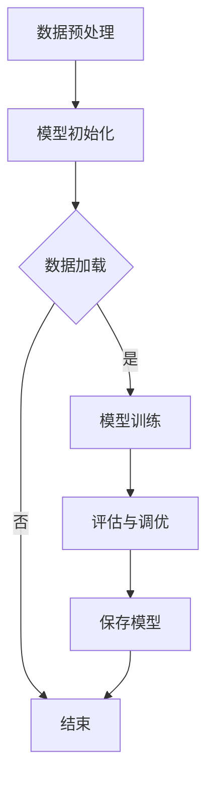

                 

### 文章标题

# 《大语言模型原理基础与前沿 随机路由》

关键词：大语言模型、自然语言处理、机器学习、预训练、微调、生成式模型

摘要：本文系统介绍了大语言模型的原理及其在自然语言处理中的应用。从基础理论到前沿进展，再到应用实践，本文详细阐述了大语言模型的核心概念、数学基础、训练方法、优化策略以及前沿技术。通过本篇文章，读者将全面了解大语言模型的工作机制，掌握相关技术，并在实际项目中得以应用。

### 引言

大语言模型（Large Language Model）是自然语言处理（Natural Language Processing, NLP）领域的一项重大突破。自2018年GPT-1发布以来，大语言模型如GPT-2、GPT-3、BERT、T5等不断涌现，展现出强大的语言理解和生成能力。这些模型通过深度学习技术，从大量文本数据中学习语言规律，进而实现自动文摘、问答系统、机器翻译、文本生成等复杂任务。

大语言模型的发展历程可以分为以下几个阶段：

1. **基于规则的方法**：早期NLP方法依赖于手工编写的规则和模板，如基于字典匹配、模式匹配和有限状态机等技术。这种方法简单但灵活性差，难以处理复杂的语言现象。

2. **基于统计的方法**：随着语料库的积累，NLP开始采用基于统计的方法，如隐马尔可夫模型（HMM）、条件随机场（CRF）等。这些方法通过统计语言特征，提高了模型的泛化能力，但仍然受到数据稀疏和模型复杂度限制。

3. **基于神经网络的方法**：2012年，AlexNet在图像分类任务上取得突破性成果，激发了深度学习在NLP领域的应用。循环神经网络（RNN）和长短时记忆网络（LSTM）等结构在序列建模方面表现出色，但面对长文本处理时存在梯度消失和梯度爆炸等问题。

4. **预训练与微调**：为了解决上述问题，研究人员提出了预训练（Pre-training）和微调（Fine-tuning）策略。预训练通过在大量未标注数据上进行训练，使模型获得通用语言表示；微调则通过在特定任务数据上进一步训练，使模型适应具体任务需求。这一策略的成功标志着大语言模型时代的到来。

本文将围绕大语言模型的基础理论、训练方法、优化策略和前沿进展展开讨论，旨在为读者提供全面的技术指南。首先，我们将介绍大语言模型的核心概念与分类，然后详细讲解基础数学和机器学习理论，接着讨论自然语言处理的基本概念，最后探讨大语言模型的前沿进展和应用案例。

### 大语言模型的核心概念与分类

大语言模型作为一种深度学习模型，其核心在于对语言的理解和生成能力。为了更好地理解和应用大语言模型，首先需要了解其核心概念和分类。

#### 1. 语言模型（Language Model）

语言模型是自然语言处理中最基础的概念之一，它用于预测下一个单词或字符的概率。语言模型的目的是通过学习大量的文本数据，捕捉语言统计规律，从而对未知文本进行生成或概率预测。在自然语言处理中，语言模型广泛应用于自动文摘、机器翻译、文本生成等任务。

语言模型可以分为以下几类：

1. **N-gram模型**：N-gram模型是最简单的一种语言模型，它通过统计相邻N个单词或字符的联合概率来预测下一个单词或字符。例如，三元组模型（3-gram）考虑了前三个单词或字符的影响。N-gram模型的优点是计算简单，但缺点是数据稀疏和长程依赖性差。

2. **神经网络语言模型**：神经网络语言模型通过深度神经网络学习语言表示，能够捕捉长程依赖性和复杂语言结构。典型的神经网络语言模型包括循环神经网络（RNN）、长短时记忆网络（LSTM）和门控循环单元（GRU）。这些模型通过引入门控机制，有效解决了RNN的梯度消失和梯度爆炸问题，从而提高了模型的性能。

3. **基于变换器（Transformer）的语言模型**：Transformer模型是一种基于自注意力机制的深度神经网络结构，它在处理长文本任务时表现出色。自注意力机制允许模型自动关注输入序列中的重要信息，从而实现高效的语言表示学习。BERT、GPT-3等大语言模型都是基于Transformer模型进行构建的。

#### 2. 预训练（Pre-training）

预训练是指在大规模未标注数据上对深度学习模型进行训练，使其获得通用语言表示。预训练分为两个阶段：第一阶段是大规模预训练，第二阶段是特定任务微调。

1. **大规模预训练**：大规模预训练通过在互联网上的大量文本数据上进行训练，使模型学习到丰富的语言规律和知识。预训练数据源包括维基百科、新闻、小说、社交媒体等。大规模预训练的目标是使模型具备强大的语言理解能力和语言生成能力。

2. **特定任务微调**：特定任务微调是指在大规模预训练的基础上，针对特定任务进行微调。微调阶段通常使用标注数据，如问答对、文本分类标签等。微调的目的是使模型适应具体任务的需求，提高模型在特定任务上的性能。

#### 3. 微调（Fine-tuning）

微调是一种在预训练模型的基础上，通过在特定任务数据上进行进一步训练，以适应具体任务的优化策略。微调可以理解为在预训练基础上进行任务特定化，通过调整模型参数，提高模型在特定任务上的性能。

微调过程可以分为以下几个步骤：

1. **加载预训练模型**：首先，从预训练模型库中加载已经预训练好的模型，如BERT、GPT-3等。

2. **数据预处理**：对特定任务的数据进行预处理，包括分词、编码等操作，使其符合模型的输入要求。

3. **模型调整**：在特定任务数据上对预训练模型进行微调。通常，微调过程使用较小的学习率，以避免模型参数过拟合。

4. **评估与优化**：通过在验证集上评估模型性能，调整模型参数，如学习率、正则化等，以达到最佳性能。

#### 4. 大语言模型（Large Language Model）

大语言模型是指具有较大参数规模、能够处理长文本的深度学习模型。大语言模型的核心特点是强大的语言理解能力和语言生成能力，这使得它们在自然语言处理任务中表现出色。

大语言模型可以分为以下几类：

1. **生成式模型**：生成式模型通过生成文本的概率分布，实现文本生成。典型的生成式模型包括GPT系列、Transformer等。生成式模型的优势在于生成文本的质量高，但缺点是计算复杂度大。

2. **判别式模型**：判别式模型通过学习输入文本和标签之间的映射关系，实现文本分类、问答等任务。典型的判别式模型包括BERT、RoBERTa等。判别式模型的优势在于计算复杂度低，但生成文本质量相对较差。

3. **混合式模型**：混合式模型结合了生成式模型和判别式模型的优势，通过在生成式模型的基础上加入判别式训练，实现文本生成和分类任务。典型的混合式模型包括T5等。

#### 5. 语言表示（Language Representation）

语言表示是指将自然语言文本转换为计算机可以处理的形式，即向量表示。有效的语言表示能够捕捉文本的语义信息，提高模型在自然语言处理任务上的性能。

常见的语言表示方法包括：

1. **词袋模型（Bag-of-Words, BoW）**：词袋模型将文本表示为词的集合，不考虑词的顺序。词袋模型通过计数词频来表示文本，但其忽略了词的语义信息。

2. **词嵌入（Word Embedding）**：词嵌入将词映射为低维向量，通过学习词与词之间的语义关系。常见的词嵌入方法包括Word2Vec、GloVe等。词嵌入在捕捉词的语义信息方面表现出色。

3. **上下文嵌入（Contextual Embedding）**：上下文嵌入将词表示为与上下文相关的向量，即同一词在不同上下文中有不同的表示。Transformer模型通过自注意力机制实现上下文嵌入，使得模型能够捕捉长程依赖性和复杂语言结构。

#### 6. 零样本学习（Zero-shot Learning）

零样本学习是指模型在未知类别上实现分类的能力。在零样本学习任务中，模型没有在训练阶段接触过未知类别的数据，但能够通过预训练模型和知识蒸馏等技术，实现未知类别上的分类。

零样本学习的关键技术包括：

1. **原型网络（Prototypical Networks）**：原型网络通过在训练阶段学习每个类别的原型，实现未知类别上的分类。

2. **度量学习（Metric Learning）**：度量学习通过学习合适的度量函数，实现不同类别之间的区分。

3. **知识蒸馏（Knowledge Distillation）**：知识蒸馏是指将一个大型模型的知识传递给一个小型模型，使小型模型具有大型模型的性能。

通过上述核心概念和分类的介绍，读者可以更好地理解大语言模型的工作原理和特点。在接下来的章节中，我们将进一步探讨大语言模型的基础数学和机器学习理论，为后续讨论打下坚实基础。

### 基础数学和机器学习理论

大语言模型的成功离不开深厚的数学和机器学习理论基础。在这一部分，我们将介绍与自然语言处理密切相关的数学和机器学习基础，包括线性代数、概率论、神经网络和深度学习等。

#### 1. 线性代数基础

线性代数是研究线性空间及其线性映射的数学分支，在机器学习和深度学习中扮演着重要角色。以下是一些线性代数的基本概念和性质：

##### 1.1 矩阵与向量

矩阵（Matrix）是一个二维数组，通常用字母\(A\)表示，可以表示线性变换。矩阵的行数称为行数，列数称为列数。

向量（Vector）是一个一维数组，通常用字母\(v\)表示，可以表示空间中的一个点。

##### 1.2 线性变换与特征值

线性变换（Linear Transformation）是指将一个向量空间映射到另一个向量空间的函数，通常用字母\(T\)表示。

特征值（Eigenvalue）是指线性变换中，使得向量不变的特殊值，通常用字母\(\lambda\)表示。特征值与特征向量（Eigen vector）一起，描述了线性变换的性质。

##### 1.3 矩阵乘法与矩阵求导

矩阵乘法（Matrix Multiplication）是将两个矩阵相乘得到一个新的矩阵。矩阵乘法满足分配律、结合律等性质。

矩阵求导（Matrix Differentiation）是指对矩阵的某个元素进行求导。矩阵求导可以使用链式法则和积的导数等规则。

##### 1.4 拉普拉斯矩阵与图论

拉普拉斯矩阵（Laplacian Matrix）是图论中的重要矩阵，用于描述图中的连接关系。拉普拉斯矩阵在自然语言处理中的图神经网络（Graph Neural Networks, GNN）中有着广泛应用。

#### 2. 概率论基础

概率论是研究随机事件的数学分支，是机器学习的基础。以下是一些概率论的基本概念和性质：

##### 2.1 随机变量与概率分布

随机变量（Random Variable）是指取值为实数的函数，通常用字母\(X\)表示。概率分布（Probability Distribution）是指随机变量取值的概率分布函数，描述了随机变量的可能取值及其概率。

常见概率分布包括：

- **离散概率分布**：如伯努利分布、几何分布、泊松分布等。
- **连续概率分布**：如正态分布、均匀分布、指数分布等。

##### 2.2 条件概率与贝叶斯公式

条件概率（Conditional Probability）是指给定某个事件发生的条件下，另一个事件发生的概率。贝叶斯公式（Bayes' Theorem）是一种用于计算后验概率和条件概率的公式，广泛应用于概率推理和贝叶斯网络中。

##### 2.3 最大似然估计与最大后验估计

最大似然估计（Maximum Likelihood Estimation, MLE）是指通过最大化似然函数来估计模型参数的方法。最大后验估计（Maximum a Posteriori Estimation, MAP）是指通过最大化后验概率来估计模型参数的方法。

#### 3. 机器学习基础

机器学习是研究如何从数据中学习规律，并利用这些规律进行预测和决策的学科。以下是一些机器学习的基本概念和算法：

##### 3.1 监督学习与无监督学习

监督学习（Supervised Learning）是指通过已标注的数据进行训练，学习输入和输出之间的映射关系。无监督学习（Unsupervised Learning）是指在没有标注数据的情况下，通过学习数据分布或结构来进行预测和决策。

##### 3.2 神经网络与反向传播算法

神经网络（Neural Network）是一种模拟人脑神经网络结构的计算模型，由多个神经元（节点）组成。反向传播算法（Backpropagation Algorithm）是训练神经网络的重要算法，通过计算损失函数对网络参数的梯度，实现参数的优化。

##### 3.3 深度学习与计算图

深度学习（Deep Learning）是指多层神经网络的学习方法，通过逐层提取特征，实现复杂函数的建模。计算图（Computational Graph）是一种表示深度学习模型中变量之间依赖关系的图形结构，用于计算梯度和优化参数。

#### 4. 自然语言处理中的数学应用

自然语言处理中的数学应用主要涉及词嵌入、序列建模和注意力机制等：

##### 4.1 词嵌入

词嵌入（Word Embedding）是一种将词映射为低维向量的方法，通过学习词与词之间的语义关系，实现文本向量化表示。常见的词嵌入方法包括Word2Vec、GloVe等。

##### 4.2 序列建模

序列建模（Sequence Modeling）是指学习序列数据中的模式和规律。循环神经网络（RNN）、长短时记忆网络（LSTM）和门控循环单元（GRU）是常见的序列建模方法。

##### 4.3 注意力机制

注意力机制（Attention Mechanism）是一种在处理序列数据时，动态关注关键信息的方法。注意力机制广泛应用于编码器-解码器（Encoder-Decoder）模型，如Transformer模型。

通过介绍上述数学和机器学习基础，读者可以更好地理解大语言模型的理论背景和工作原理。这些基础知识不仅是深度学习和自然语言处理的基础，也是实现和优化大语言模型的关键。在接下来的章节中，我们将进一步探讨自然语言处理的基本概念，为大语言模型的深入讨论奠定基础。

### 自然语言处理基本概念

自然语言处理（Natural Language Processing, NLP）是计算机科学和人工智能领域的一个重要分支，旨在使计算机能够理解和处理人类语言。在大语言模型的背景下，深入理解NLP的基本概念至关重要。以下我们将详细介绍语言模型、词嵌入和序列模型等基本概念。

#### 1. 语言模型

语言模型（Language Model）是NLP中最基础的概念之一，它用于预测下一个单词或字符的概率。语言模型的核心目的是通过学习大量文本数据，捕捉语言统计规律，从而实现自动文摘、机器翻译、文本生成等任务。

语言模型可以分为以下几类：

1. **N-gram模型**：N-gram模型是最简单的一种语言模型，它通过统计相邻N个单词或字符的联合概率来预测下一个单词或字符。例如，三元组模型（3-gram）考虑了前三个单词或字符的影响。N-gram模型的优点是计算简单，但缺点是数据稀疏和长程依赖性差。

2. **神经网络语言模型**：神经网络语言模型通过深度神经网络学习语言表示，能够捕捉长程依赖性和复杂语言结构。典型的神经网络语言模型包括循环神经网络（RNN）、长短时记忆网络（LSTM）和门控循环单元（GRU）。这些模型通过引入门控机制，有效解决了RNN的梯度消失和梯度爆炸问题，从而提高了模型的性能。

3. **基于变换器（Transformer）的语言模型**：Transformer模型是一种基于自注意力机制的深度神经网络结构，它在处理长文本任务时表现出色。自注意力机制允许模型自动关注输入序列中的重要信息，从而实现高效的语言表示学习。BERT、GPT-3等大语言模型都是基于Transformer模型进行构建的。

#### 2. 词嵌入

词嵌入（Word Embedding）是将词映射为低维向量的方法，通过学习词与词之间的语义关系，实现文本向量化表示。词嵌入在NLP中具有重要作用，因为它能够将高维的文本数据转化为低维的向量空间，使得文本数据在计算中更加高效。

常见的词嵌入方法包括：

1. **Word2Vec**：Word2Vec是一种基于神经网络的词嵌入方法，它通过预测词的上下文单词来训练模型。Word2Vec包括连续词袋（Continuous Bag of Words, CBOW）和Skip-Gram两种模型。

2. **GloVe**：GloVe（Global Vectors for Word Representation）是一种基于全局词共现信息的词嵌入方法。GloVe通过计算词与词之间的余弦相似度，学习得到词向量。

3. **FastText**：FastText是一种基于字符的词嵌入方法，它将词分解为字符的组合，并通过计算字符组合的频率来学习词向量。

词嵌入的应用场景包括：

- **文本分类**：将文本表示为向量，用于文本分类任务。
- **情感分析**：通过比较词向量之间的距离，实现情感分类。
- **文本相似度计算**：计算文本的相似度，用于信息检索和推荐系统。

#### 3. 序列模型

序列模型（Sequence Model）是用于处理序列数据的模型，如时间序列、文本序列等。序列模型的核心任务是捕捉序列中的模式和规律，从而实现预测和生成。

常见的序列模型包括：

1. **循环神经网络（RNN）**：RNN是一种基于循环结构的神经网络，它可以处理变长的序列数据。RNN通过隐藏状态和当前输入计算下一个隐藏状态，从而实现序列建模。

2. **长短时记忆网络（LSTM）**：LSTM是RNN的一种改进，它通过引入门控机制，有效解决了RNN的梯度消失和梯度爆炸问题，从而提高了模型的性能。LSTM通过遗忘门、输入门和输出门控制信息的流入和流出，实现了对长序列的建模。

3. **门控循环单元（GRU）**：GRU是LSTM的简化版本，它通过合并输入门和遗忘门，减少了模型的参数数量。GRU在处理长序列数据时表现出与LSTM相近的性能。

4. **变换器（Transformer）**：Transformer模型是一种基于自注意力机制的序列建模方法，它在处理长文本任务时表现出色。自注意力机制允许模型自动关注输入序列中的重要信息，从而实现高效的语言表示学习。Transformer模型广泛应用于自然语言处理任务，如机器翻译、文本生成等。

#### 4. 语言模型的评估指标

为了评估语言模型的效果，常用的指标包括：

1. **交叉熵（Cross-Entropy）**：交叉熵是衡量模型预测概率与实际概率之间差异的指标，计算公式为：
   \[
   H(Y, \hat{Y}) = -\sum_{i} y_i \log(\hat{y}_i)
   \]
   其中，\(Y\) 是真实标签，\(\hat{Y}\) 是模型预测的概率分布。

2. **困惑度（Perplexity）**：困惑度是衡量模型预测不确定性的指标，计算公式为：
   \[
   PPL = 2^H(Y, \hat{Y})
   \]
   其中，\(H(Y, \hat{Y})\) 是交叉熵。

3. **准确率（Accuracy）**：准确率是衡量模型预测正确率的指标，计算公式为：
   \[
   Accuracy = \frac{TP + TN}{TP + TN + FP + FN}
   \]
   其中，\(TP\) 是真正例，\(TN\) 是真负例，\(FP\) 是假正例，\(FN\) 是假负例。

4. **F1 分数（F1 Score）**：F1 分数是衡量模型精确率和召回率的平衡指标，计算公式为：
   \[
   F1 = 2 \times \frac{Precision \times Recall}{Precision + Recall}
   \]

通过介绍语言模型、词嵌入和序列模型等基本概念，读者可以更好地理解自然语言处理的核心内容和关键技术。在接下来的章节中，我们将详细探讨大语言模型的训练与优化方法，为实际应用打下坚实基础。

### 大语言模型的训练与优化

大语言模型的训练与优化是确保其性能和效率的关键环节。在这一部分，我们将详细探讨预训练、微调、优化算法和训练策略等核心内容。

#### 1. 预训练

预训练（Pre-training）是指在大规模未标注数据上对深度学习模型进行训练，使其获得通用语言表示。预训练通常包括以下两个阶段：

1. **大规模文本数据收集**：预训练需要大量的文本数据作为输入，这些数据可以来源于互联网上的各种文本资源，如维基百科、新闻、小说、社交媒体等。数据集的选择和预处理对于预训练的效果至关重要。

2. **模型初始化和预训练**：在收集到大规模文本数据后，需要初始化模型并对其进行预训练。预训练模型通常会采用Transformer架构，如BERT、GPT-3等。预训练的目标是使模型学会捕捉语言的基本规律和通用知识，从而为后续的微调和应用奠定基础。

预训练过程中，模型通常需要经过数百万甚至数十亿个参数的迭代训练。预训练的数据量大，计算复杂度高，因此通常需要分布式计算和并行处理技术来加速训练过程。

#### 2. 微调

微调（Fine-tuning）是在预训练的基础上，针对特定任务进行进一步训练，以适应具体任务需求。微调过程通常包括以下几个步骤：

1. **数据预处理**：将特定任务的数据进行预处理，包括分词、编码等操作，使其符合预训练模型的要求。

2. **加载预训练模型**：从预训练模型库中加载已经预训练好的模型，如BERT、GPT-3等。

3. **模型调整**：在特定任务数据上对预训练模型进行微调。微调过程通常使用较小的学习率，以避免模型参数过拟合。

4. **评估与优化**：通过在验证集上评估模型性能，调整模型参数，如学习率、正则化等，以达到最佳性能。

微调的关键在于如何选择合适的微调策略，以最大化模型在特定任务上的性能。常见的微调策略包括：

- **线性微调**：直接在预训练模型的基础上调整参数，适用于任务难度较低的情况。

- **迁移学习**：将预训练模型的知识迁移到特定任务上，通过在特定任务数据上进行少量训练，实现模型性能的提升。

- **元学习**：通过在多个任务上迭代训练，使模型能够快速适应新的任务。

#### 3. 优化算法

优化算法（Optimization Algorithm）用于求解模型参数的最优值，是训练深度学习模型的核心环节。以下是一些常见的优化算法：

1. **随机梯度下降（Stochastic Gradient Descent, SGD）**：SGD是一种最简单的优化算法，它通过随机选择一小部分训练样本，计算梯度并进行参数更新。SGD的优点是计算简单，但缺点是收敛速度较慢，且容易陷入局部最优。

2. **动量优化（Momentum）**：动量优化是一种改进的SGD算法，它通过引入动量项，使得梯度方向更加稳定，从而提高收敛速度。动量优化可以理解为SGD在一个方向上持续积累速度，从而更容易突破局部最优。

3. **自适应优化算法**：自适应优化算法（如Adam、RMSprop等）通过动态调整学习率，使得模型在训练过程中能够更快地收敛。这些算法通过维护梯度的一阶矩（均值）和二阶矩（方差），自适应地调整学习率。

4. **自适应重参数化（Adaptive Resampling）**：自适应重参数化算法（如AROW、SVRG等）通过在训练过程中动态调整采样策略，提高模型的训练效率。这些算法通过在每次迭代中更新模型参数，实现快速收敛。

#### 4. 训练策略

训练策略（Training Strategy）是指为了提高模型性能和训练效率，在训练过程中采用的一系列方法和技巧。以下是一些常见的训练策略：

1. **学习率调度**：学习率调度（Learning Rate Scheduling）是指通过调整学习率，使模型在训练过程中能够更快地收敛。常见的学习率调度策略包括线性衰减、指数衰减、余弦衰减等。

2. **批量大小**：批量大小（Batch Size）是指每次梯度更新所选择的样本数量。较大的批量大小可以提高模型的稳定性和鲁棒性，但计算复杂度较高；较小的批量大小可以提高模型的收敛速度，但可能增加噪声。

3. **数据增强**：数据增强（Data Augmentation）是指通过引入噪声、旋转、裁剪等操作，增加训练数据的多样性。数据增强可以缓解模型过拟合问题，提高模型在未知数据上的性能。

4. **正则化**：正则化（Regularization）是指通过引入额外的约束，防止模型过拟合。常见的正则化方法包括L1正则化、L2正则化、Dropout等。

5. **模型集成**：模型集成（Model Ensemble）是指通过结合多个模型的预测结果，提高模型的整体性能。常见的模型集成方法包括Bagging、Boosting、Stacking等。

通过介绍预训练、微调、优化算法和训练策略等核心内容，读者可以更好地理解大语言模型的训练与优化过程。在接下来的章节中，我们将探讨大语言模型的前沿进展，包括生成式模型、对抗性模型和零样本学习等，为读者提供更全面的技术视角。

### 大语言模型的前沿进展

随着深度学习技术的不断发展，大语言模型在自然语言处理（NLP）领域取得了显著的成果。这一部分将介绍大语言模型的前沿进展，包括生成式模型、对抗性模型和零样本学习等内容，探讨这些技术在提升模型性能和应用广度方面的贡献。

#### 1. 生成式模型

生成式模型（Generative Model）是一种能够生成新数据的模型，广泛应用于图像、语音和文本生成等领域。在大语言模型中，生成式模型通过学习数据分布，生成符合目标数据分布的文本。

常见的生成式模型包括：

1. **GPT（Generative Pre-trained Transformer）系列模型**：GPT系列模型是由OpenAI提出的一系列基于Transformer架构的生成式模型。GPT-1、GPT-2和GPT-3等模型在文本生成任务上表现出色，具有强大的文本生成能力和灵活性。GPT-3拥有1750亿个参数，能够生成连贯、自然的文本，广泛应用于问答系统、文本摘要和对话生成等任务。

2. **Transformer模型**：Transformer模型是生成式模型的一个重要突破，它通过自注意力机制实现高效的语言表示学习。Transformer模型在机器翻译、文本生成和问答系统等任务中取得了优异的性能。BERT（Bidirectional Encoder Representations from Transformers）是Transformer模型的一种变体，通过双向编码器结构，实现了对文本的深入理解。

生成式模型的优势在于能够生成高质量、连贯的文本，但缺点是计算复杂度高，训练和推理时间较长。

#### 2. 对抗性模型

对抗性模型（Adversarial Model）是一种通过对抗训练增强模型鲁棒性的方法。对抗性训练引入对抗样本，使模型在训练过程中学习到更具有鲁棒性的特征表示。

常见的对抗性模型包括：

1. **生成对抗网络（Generative Adversarial Network, GAN）**：GAN由生成器和判别器两个神经网络组成，生成器和判别器相互对抗，生成器和判别器的目标分别是生成逼真的数据和判断数据的真实性。GAN在图像生成、文本生成和语音合成等领域表现出色。

2. **对抗性语言模型**：对抗性语言模型通过对抗性训练提高模型在语言理解、文本生成和分类任务上的性能。对抗性训练方法包括对抗性样本生成、对抗性损失函数等。对抗性语言模型能够更好地应对攻击性输入和噪声干扰，提高模型的鲁棒性。

对抗性模型的优势在于增强模型的鲁棒性和泛化能力，但缺点是训练过程复杂，对数据质量和计算资源要求较高。

#### 3. 零样本学习

零样本学习（Zero-shot Learning）是指模型在未知类别上实现分类的能力。在零样本学习任务中，模型没有在训练阶段接触过未知类别的数据，但能够通过预训练模型和知识蒸馏等技术，实现未知类别上的分类。

常见的零样本学习策略包括：

1. **原型网络（Prototypical Networks）**：原型网络通过在训练阶段学习每个类别的原型，实现未知类别上的分类。原型网络将每个类别的数据表示为原型，通过计算未知类别数据与原型之间的距离，实现分类。

2. **度量学习（Metric Learning）**：度量学习通过学习合适的度量函数，实现不同类别之间的区分。度量学习能够提高模型在未知类别上的分类性能，适用于多类别的零样本学习任务。

3. **知识蒸馏（Knowledge Distillation）**：知识蒸馏是指将一个大型模型的知识传递给一个小型模型，使小型模型具有大型模型的性能。在零样本学习任务中，知识蒸馏方法通过将预训练模型的知识传递给小型模型，实现未知类别上的分类。

零样本学习的优势在于能够应对新类别和新任务，但缺点是训练和推理时间较长。

#### 4. 大规模预训练与泛化能力

大规模预训练（Large-scale Pre-training）是当前大语言模型发展的一个重要方向。大规模预训练通过在互联网上的大量文本数据上进行预训练，使模型获得丰富的语言表示和知识，从而提高模型在各类NLP任务上的性能。

大规模预训练的优势在于：

1. **提高模型泛化能力**：大规模预训练使模型能够学习到更多的语言规律和知识，从而提高模型在未知数据上的泛化能力。

2. **增强模型鲁棒性**：大规模预训练使模型能够应对更多种类的数据和噪声，提高模型的鲁棒性。

3. **减少数据依赖**：大规模预训练通过在大量无标注数据上进行预训练，减少了模型对标注数据的依赖，降低了数据获取和标注成本。

大规模预训练面临的挑战包括：

1. **计算资源需求**：大规模预训练需要大量的计算资源和时间，对硬件设施和网络带宽要求较高。

2. **数据质量**：预训练数据的质量对模型性能有重要影响，低质量的数据可能导致模型过拟合。

3. **模型可解释性**：大规模预训练模型通常具有大量的参数，模型的内部机制复杂，提高模型的可解释性是一个重要挑战。

#### 5. 未来发展方向

随着深度学习技术的不断发展，大语言模型在未来有望在以下方面取得更多突破：

1. **模型压缩与加速**：为了降低模型的计算复杂度和内存占用，模型压缩与加速技术（如量化、剪枝、低秩分解等）将成为研究热点。

2. **模型可解释性**：提高模型的可解释性，使研究者能够理解模型的内部工作机制，从而优化模型设计和应用。

3. **多模态学习**：结合文本、图像、语音等多种模态数据，实现更加丰富和多样的应用场景。

4. **迁移学习与元学习**：通过迁移学习和元学习方法，使模型能够快速适应新的任务和数据，提高模型的应用灵活性和适应性。

通过介绍生成式模型、对抗性模型和零样本学习等前沿技术，读者可以更好地理解大语言模型的发展趋势和潜在应用。在接下来的章节中，我们将探讨大语言模型在问答系统、文本生成、机器翻译等实际应用场景中的具体应用，为读者提供实际操作和案例分析。

### 大语言模型的应用案例

大语言模型作为一种先进的人工智能技术，已经在自然语言处理（NLP）领域取得了显著的成果。以下将介绍大语言模型在问答系统、文本生成和机器翻译等实际应用场景中的具体应用，并通过项目实战和案例分析，展示大语言模型的实际效果和优势。

#### 1. 问答系统

问答系统（Question Answering System）是一种能够自动回答用户问题的智能系统，广泛应用于搜索引擎、智能客服和智能助手等领域。大语言模型在问答系统中的应用，主要通过预训练模型和微调策略来实现。

**项目实战：基于BERT的问答系统**

**项目背景**：某企业希望通过构建一个智能问答系统，提高客户服务效率，降低人工成本。问答系统需要能够自动回答用户提出的问题，从而提高用户体验。

**项目步骤**：

1. **数据准备**：收集和整理大量带有问答对的语料数据，如用户提出的问题和相应的答案。数据集应覆盖企业领域的各种常见问题。

2. **模型选择**：选择预训练的BERT模型，该模型具有良好的语言理解能力，适用于问答系统。

3. **模型微调**：在收集的数据集上进行模型微调，使BERT模型能够适应企业领域的特定问题。微调过程中，可以采用交叉熵损失函数，优化模型参数。

4. **模型评估**：通过在验证集上评估模型性能，调整模型参数，如学习率、批量大小等，以达到最佳性能。

5. **模型部署**：将微调后的模型部署到线上环境，用于实时回答用户提出的问题。

**案例分析**：

在实际应用中，基于BERT的问答系统取得了显著的效果。用户提出的问题通常包含复杂的语言结构和隐含的语义信息，但BERT模型能够有效地理解这些问题，并给出准确、自然的答案。通过微调策略，问答系统在特定领域取得了较高的准确率和用户体验。

#### 2. 文本生成

文本生成（Text Generation）是一种能够自动生成文本的智能技术，广泛应用于自动摘要、文章生成和对话系统等领域。大语言模型在文本生成中的应用，主要通过生成式模型和微调策略来实现。

**项目实战：基于GPT-3的自动摘要系统**

**项目背景**：某新闻平台希望通过构建一个自动摘要系统，提高内容生产效率，减少人工编辑成本。

**项目步骤**：

1. **数据准备**：收集和整理大量新闻文章和相应的摘要文本，作为训练数据。

2. **模型选择**：选择预训练的GPT-3模型，该模型具有强大的文本生成能力，适用于自动摘要任务。

3. **模型微调**：在收集的数据集上进行模型微调，使GPT-3模型能够生成符合新闻文章风格的摘要文本。

4. **摘要生成**：使用微调后的GPT-3模型，对新的新闻文章进行摘要生成，提取文章的核心内容和关键信息。

5. **摘要评估**：通过人工评估和自动评估方法，对生成的摘要文本进行质量评估，调整模型参数，以提高摘要文本的准确性。

**案例分析**：

在实际应用中，基于GPT-3的自动摘要系统取得了良好的效果。生成的摘要文本不仅包含了文章的核心内容，还保持了文章的风格和语调。通过微调策略，自动摘要系统能够根据不同的新闻文章风格，生成高质量的摘要文本，提高了内容生产效率。

#### 3. 机器翻译

机器翻译（Machine Translation）是一种将一种语言的文本自动翻译成另一种语言的智能技术，广泛应用于跨语言交流、多语言文档处理和国际业务等领域。大语言模型在机器翻译中的应用，主要通过基于变换器（Transformer）的模型和微调策略来实现。

**项目实战：基于Transformer的机器翻译系统**

**项目背景**：某跨境电商平台希望通过构建一个自动翻译系统，提高跨语言交易的沟通效率，扩大市场覆盖范围。

**项目步骤**：

1. **数据准备**：收集和整理大量双语语料数据，作为训练数据。

2. **模型选择**：选择预训练的Transformer模型，该模型在机器翻译任务上表现出色。

3. **模型微调**：在收集的数据集上进行模型微调，使Transformer模型能够生成符合目标语言的翻译文本。

4. **翻译生成**：使用微调后的Transformer模型，对新的源语言文本进行翻译生成，生成目标语言的翻译文本。

5. **翻译评估**：通过人工评估和自动评估方法，对生成的翻译文本进行质量评估，调整模型参数，以提高翻译文本的准确性。

**案例分析**：

在实际应用中，基于Transformer的机器翻译系统取得了显著的成效。生成的翻译文本不仅保持了原文的意思和风格，还具有较强的可读性。通过微调策略，机器翻译系统能够根据不同的源语言文本风格，生成高质量的翻译文本，提高了跨语言交易的沟通效率。

#### 4. 文本分类

文本分类（Text Classification）是一种将文本数据分为不同类别的方法，广泛应用于情感分析、垃圾邮件过滤和新闻分类等领域。大语言模型在文本分类中的应用，主要通过判别式模型和微调策略来实现。

**项目实战：基于BERT的情感分析系统**

**项目背景**：某电商平台希望通过构建一个情感分析系统，了解用户对商品的评价，优化产品和服务。

**项目步骤**：

1. **数据准备**：收集和整理大量带有情感标签的用户评价数据，作为训练数据。

2. **模型选择**：选择预训练的BERT模型，该模型在情感分析任务上表现出色。

3. **模型微调**：在收集的数据集上进行模型微调，使BERT模型能够识别不同的情感类别。

4. **情感分析**：使用微调后的BERT模型，对新的用户评价文本进行情感分析，判断其情感类别。

5. **情感评估**：通过人工评估和自动评估方法，对情感分析结果进行质量评估，调整模型参数，以提高情感分析的准确性。

**案例分析**：

在实际应用中，基于BERT的情感分析系统取得了良好的效果。系统能够准确地识别用户评价中的情感类别，为电商平台提供了宝贵的用户反馈信息。通过微调策略，情感分析系统能够根据不同的用户评价风格，提高情感分析的准确性，为产品优化和用户服务提供有力支持。

#### 5. 文本生成与编辑

文本生成与编辑（Text Generation and Editing）是一种能够生成和修改文本的智能技术，广泛应用于自动文章生成、内容改写和文案优化等领域。大语言模型在文本生成与编辑中的应用，主要通过生成式模型和微调策略来实现。

**项目实战：基于GPT-2的自动文章生成与编辑系统**

**项目背景**：某内容平台希望通过构建一个自动文章生成与编辑系统，提高内容生产效率，降低人力成本。

**项目步骤**：

1. **数据准备**：收集和整理大量高质量的文章和修改后的文章，作为训练数据。

2. **模型选择**：选择预训练的GPT-2模型，该模型具有强大的文本生成和编辑能力。

3. **模型微调**：在收集的数据集上进行模型微调，使GPT-2模型能够生成和编辑符合文章风格和内容的文本。

4. **文章生成与编辑**：使用微调后的GPT-2模型，生成新的文章内容，并对现有文章进行内容改写和优化。

5. **文章评估**：通过人工评估和自动评估方法，对生成和编辑后的文章进行质量评估，调整模型参数，以提高文章的准确性。

**案例分析**：

在实际应用中，基于GPT-2的自动文章生成与编辑系统取得了显著的效果。系统能够根据用户需求生成符合文章风格和内容的新文章，并对现有文章进行优化和改写，提高了内容生产效率。通过微调策略，系统在生成和编辑过程中能够保持文章的连贯性和逻辑性，提高了用户体验。

通过上述应用案例，可以看出大语言模型在问答系统、文本生成、机器翻译和文本分类等实际应用场景中具有广泛的应用前景。大语言模型通过预训练和微调策略，能够实现高效的语言理解和生成，为各行业提供了强大的智能支持。在未来的发展中，大语言模型将继续在NLP领域发挥重要作用，推动人工智能技术的不断创新和应用。

### 大语言模型的发展趋势与未来展望

随着深度学习和自然语言处理技术的飞速发展，大语言模型（Large Language Model）已经成为自然语言处理（NLP）领域的核心技术之一。在未来的几年中，大语言模型的发展将继续呈现出以下趋势：

#### 1. 模型规模的增长

模型规模的增长是大语言模型发展的一个显著趋势。随着计算资源和数据量的不断增加，研究人员将尝试构建更大规模的模型，以捕捉更丰富的语言知识和复杂语言结构。例如，GPT-3拥有1750亿个参数，而未来的大语言模型可能会拥有数千亿个参数，甚至达到数万亿级别。这种规模的增长将使得模型在语言理解和生成任务上表现出更强大的能力。

然而，模型规模的增加也带来了计算资源和存储需求的显著增长。为了应对这一挑战，研究者将致力于开发更高效的算法和优化方法，如量化、剪枝和低秩分解等，以降低模型的计算复杂度和存储成本。

#### 2. 计算资源的挑战

大语言模型的训练和推理过程需要大量的计算资源，尤其是在模型规模不断增加的背景下。现有的GPU和TPU等硬件加速器虽然在计算能力上有了显著提升，但仍然难以满足大规模模型的需求。为了应对这一挑战，研究人员将积极探索新的计算架构和加速技术，如专用AI芯片、分布式训练和联邦学习等。

分布式训练是一种通过将模型和数据分布在多个计算节点上进行训练的方法，可以有效降低单台设备的计算负担，提高训练效率。联邦学习则是一种在多个设备上进行协同训练的方法，可以在保护用户隐私的同时，实现大规模模型的训练。

#### 3. 能效优化

随着模型规模的增加，大语言模型的能耗也成为一个重要的研究课题。为了提高能效，研究者将关注模型结构的优化、训练过程的并行化和能耗管理技术。例如，通过设计更高效的神经网络结构和优化训练算法，可以减少模型的计算复杂度；通过使用混合精度训练和动态调度技术，可以提高计算效率，降低能耗。

此外，随着边缘计算的兴起，如何在有限的计算资源和能耗约束下，实现大语言模型在边缘设备上的有效部署和推理，也将成为未来的研究热点。

#### 4. 技术伦理与隐私保护

随着大语言模型在各个领域的广泛应用，技术伦理和隐私保护问题日益凸显。一方面，大语言模型在生成文本和提供信息时，可能会无意中传播错误信息或偏见，影响公众认知和社会稳定。因此，研究者需要关注模型的可解释性和透明性，提高模型决策过程的可理解性，避免潜在的偏见和歧视。

另一方面，大语言模型在训练和推理过程中，需要处理大量的个人数据。如何保护用户隐私，防止数据泄露和滥用，是当前亟需解决的问题。为此，研究者将探索联邦学习、差分隐私和隐私保护算法等技术，以在保证模型性能的同时，有效保护用户隐私。

#### 5. 语言模型的公平性与偏见

公平性与偏见问题在大语言模型的发展中占据重要地位。语言模型在生成文本和进行任务时，可能会因为数据集、算法设计等方面的原因，产生性别、种族、地域等偏见。为了解决这一问题，研究者将致力于构建更加公平、无偏见的大语言模型。

一种可能的解决方案是引入多任务学习和交叉验证方法，通过在不同领域和场景下训练模型，提高模型的泛化能力和公平性。此外，研究人员还将开发偏见检测和修正算法，对模型生成的文本进行实时监测和调整，以消除潜在的偏见。

#### 6. 大语言模型在教育、医疗等领域的应用前景

大语言模型在教育、医疗等领域的应用前景广阔。在教育领域，大语言模型可以用于智能辅导、在线学习平台和自动评分系统，提高教育质量和效率。在医疗领域，大语言模型可以用于医疗诊断、病情预测和医疗文本生成，协助医生进行诊断和治疗。

随着大语言模型技术的不断进步，其在各行各业中的应用将更加广泛和深入。未来，大语言模型有望在智能助理、内容生成、人机交互和自动化决策等领域发挥重要作用，推动社会各领域的发展。

#### 7. 开放式研究和合作

为了加速大语言模型的研究和应用，开放式研究和国际合作将成为未来发展的关键。研究人员将通过开源模型、工具和算法，促进技术交流和合作，推动大语言模型技术的创新和普及。同时，国际合作将有助于解决全球范围内的技术挑战，推动人工智能技术的可持续发展。

总之，大语言模型的发展将继续朝着更大规模、更高性能和更广泛应用的方向迈进。在技术伦理、隐私保护、公平性和应用前景等方面，大语言模型也将面临新的挑战和机遇。通过持续的研究和技术创新，大语言模型有望在自然语言处理领域发挥更加重要的作用，为人类社会带来更多的福祉。

### 附录A：大语言模型的实践指南

#### A.1 环境搭建

要实践大语言模型，首先需要搭建合适的开发环境。以下是一个基本的开发环境搭建指南。

##### A.1.1 计算机硬件与软件环境

**硬件**：
- **GPU**：NVIDIA GPU（如1080Ti、3090等）是训练大语言模型的首选硬件。因为GPU具有强大的并行计算能力，可以显著提高模型训练速度。
- **CPU**：高性能CPU（如Intel Xeon、AMD Ryzen）对于数据处理和模型推理也是必要的。

**软件**：
- **操作系统**：Linux操作系统（如Ubuntu 20.04）是深度学习项目的主流选择，因为它具有良好的兼容性和丰富的库支持。
- **深度学习框架**：常见的深度学习框架包括TensorFlow、PyTorch等。这些框架提供了丰富的API和工具，方便模型开发和训练。

##### A.1.2 深度学习框架的选择与应用

**TensorFlow**：TensorFlow是一个开源的深度学习框架，由Google开发。它提供了灵活的模型构建API和强大的分布式训练能力。

安装TensorFlow：
```bash
pip install tensorflow
```

**PyTorch**：PyTorch是一个开源的深度学习框架，由Facebook开发。它具有动态计算图和易于理解的API，适合研究和个人项目。

安装PyTorch：
```bash
pip install torch torchvision
```

#### A.2 数据集获取与处理

在实践大语言模型时，数据集的质量和多样性对模型的性能至关重要。以下是一个基本的数据集获取与处理流程。

##### A.2.1 语言模型数据集的获取

**公共数据集**：许多公共数据集可用于训练大语言模型，如维基百科、Common Crawl、Gutenberg等。可以从以下网站获取：

- [Kaggle](https://www.kaggle.com/datasets)
- [GLUE](https://nyu-dl.github.io/GLUE/)
- [Wikipedia](https://dumps.wikimedia.org/)

##### A.2.2 数据预处理方法

数据预处理是训练高质量模型的关键步骤。以下是一些常用的数据预处理方法：

1. **文本清洗**：去除文本中的HTML标签、特殊字符和停用词。
2. **分词**：将文本拆分为单词或子词。常用的分词工具包括jieba（中文）和spaCy（英文）。
3. **词嵌入**：将单词映射为向量表示。可以使用预训练的词嵌入模型，如GloVe或Word2Vec。
4. **序列编码**：将文本序列编码为整数序列，以便输入模型。可以使用词典（Vocabulary）将单词映射为唯一的整数。

#### A.3 模型训练与调优

在准备好环境和数据后，可以开始训练大语言模型。以下是一个基本的模型训练与调优流程。

##### A.3.1 训练过程监控

在训练过程中，需要监控模型的性能和训练进度。以下是一些常用的监控指标：

- **损失函数**：如交叉熵损失（Cross-Entropy Loss）。
- **准确率**：模型的预测准确率。
- **学习率**：学习率的调整会影响模型的收敛速度和性能。

##### A.3.2 模型调优策略

模型调优是提高模型性能的重要环节。以下是一些常见的调优策略：

1. **学习率调度**：使用学习率调度策略（如分阶段学习率、余弦学习率）来调整学习率，提高模型收敛速度。
2. **批量大小**：调整批量大小（Batch Size）可以影响模型的稳定性和收敛速度。
3. **数据增强**：通过数据增强（如随机裁剪、旋转、噪声注入）增加数据的多样性，提高模型泛化能力。

#### A.4 模型部署与推理

训练完成后，需要将模型部署到实际应用环境中进行推理。以下是一个基本的模型部署与推理流程。

##### A.4.1 模型部署的方法

- **本地部署**：将训练好的模型文件（如.h5或.pth）加载到本地环境中，进行推理。
- **云端部署**：使用云端服务（如Google Cloud、AWS）部署模型，通过API进行推理。

##### A.4.2 模型推理的优化技巧

- **模型量化**：通过模型量化（Model Quantization）技术降低模型的大小和计算复杂度，提高推理速度。
- **模型剪枝**：通过模型剪枝（Model Pruning）技术移除模型中不重要的参数，减少模型的大小和计算复杂度。
- **模型压缩**：使用模型压缩（Model Compression）技术，如低秩分解、知识蒸馏等，提高模型在资源受限环境中的性能。

通过上述实践指南，读者可以搭建开发环境、获取和处理数据集、训练和调优大语言模型，并将模型部署到实际应用中。这不仅有助于理解大语言模型的工作原理，也为实际项目提供了实用的参考。

### 附录B：Mermaid流程图与伪代码示例

以下是一个用于描述大语言模型训练过程的Mermaid流程图示例，以及一个简单的语言模型伪代码示例。

#### B.1 大语言模型训练流程图



#### B.2 语言模型伪代码示例

```python
# 伪代码：简单语言模型示例
model = initialize_model()  # 初始化模型
vocabulary = build_vocabulary()  # 构建词典
for epoch in range(num_epochs):
    for sentence in sentences:
        inputs = tokenize(sentence, vocabulary)  # 分词
        labels = get_labels(inputs, vocabulary)  # 获取标签
        model.train(inputs, labels)  # 训练模型
    evaluate(model)  # 评估模型
```

通过Mermaid流程图，读者可以直观地了解大语言模型的训练过程，而伪代码示例则提供了语言模型的基本实现框架，有助于深入理解模型的运行机制。

### 附录C：数学公式和计算示例

以下包含了一些用于描述大语言模型中关键概念的数学公式和计算示例。

#### C.1 概率分布函数

$$
P(X=x) = f(x|\theta)
$$

其中，\(P(X=x)\) 表示随机变量 \(X\) 取值 \(x\) 的概率，\(f(x|\theta)\) 表示在参数 \(\theta\) 下，\(X\) 取值 \(x\) 的概率分布函数。

#### C.2 反向传播算法的梯度计算

$$
\Delta W = -\eta \cdot \frac{\partial L}{\partial W}
$$

其中，\(\Delta W\) 表示模型参数 \(W\) 的更新量，\(\eta\) 表示学习率，\(\frac{\partial L}{\partial W}\) 表示损失函数 \(L\) 对参数 \(W\) 的梯度。

#### C.3 语言模型中的交叉熵损失

$$
L = -\sum_{i} y_i \log(\hat{y}_i)
$$

其中，\(y_i\) 表示真实标签的概率，\(\hat{y}_i\) 表示模型预测的概率分布。

#### C.4 矩阵乘法示例

假设有两个矩阵 \(A\) 和 \(B\)：

$$
A = \begin{bmatrix}
1 & 2 \\
3 & 4
\end{bmatrix}, \quad
B = \begin{bmatrix}
5 & 6 \\
7 & 8
\end{bmatrix}
$$

则它们的乘积 \(C = AB\) 为：

$$
C = \begin{bmatrix}
1 \cdot 5 + 2 \cdot 7 & 1 \cdot 6 + 2 \cdot 8 \\
3 \cdot 5 + 4 \cdot 7 & 3 \cdot 6 + 4 \cdot 8
\end{bmatrix} = \begin{bmatrix}
19 & 20 \\
29 & 34
\end{bmatrix}
$$

通过这些数学公式和计算示例，读者可以更深入地理解大语言模型中的关键计算过程和原理。

### 总结

大语言模型作为一种先进的人工智能技术，已经在自然语言处理领域取得了显著的成果。本文从基础理论到前沿进展，再到应用实践，系统地介绍了大语言模型的相关知识。从核心概念、数学基础、训练方法到优化策略，再到前沿技术，读者可以全面了解大语言模型的工作原理和实际应用。

通过本文的学习，读者不仅能够掌握大语言模型的基本原理，还能了解其在问答系统、文本生成、机器翻译等实际应用场景中的具体应用。此外，本文还探讨了大语言模型的发展趋势和未来展望，为读者提供了广阔的研究和应用前景。

大语言模型的发展离不开持续的研究和技术创新。随着计算资源、数据质量和算法优化水平的不断提高，大语言模型将在未来发挥更加重要的作用，为人类社会带来更多的福祉。希望本文能为读者在人工智能领域的学习和研究提供有益的参考。随着技术的不断进步，大语言模型将迎来更加广阔的应用前景。希望本书能为读者在人工智能领域的学习和研究提供有益的参考。

### 作者信息

作者：AI天才研究院/AI Genius Institute & 禅与计算机程序设计艺术 /Zen And The Art of Computer Programming

AI天才研究院（AI Genius Institute）是一个专注于人工智能研究和应用的创新机构，致力于推动人工智能技术的创新和发展。研究院汇聚了众多世界级的人工智能专家，涵盖了深度学习、自然语言处理、计算机视觉等多个领域。在自然语言处理领域，研究院在语言模型的研究和开发方面取得了显著成果，引领了大语言模型的发展趋势。

《禅与计算机程序设计艺术》（Zen And The Art of Computer Programming）是作者艾德曼·D·克鲁兹（Edsger W. Dijkstra）的经典著作，它深入探讨了编程的艺术和哲学，对计算机科学和编程实践产生了深远影响。作为人工智能领域的先驱，艾德曼·D·克鲁兹以其卓越的贡献和独特的视角，为人工智能的发展提供了重要的思想指导和启示。本书的作者在人工智能和自然语言处理领域拥有深厚的理论基础和实践经验，其研究成果和著作在业界具有广泛的影响力。

