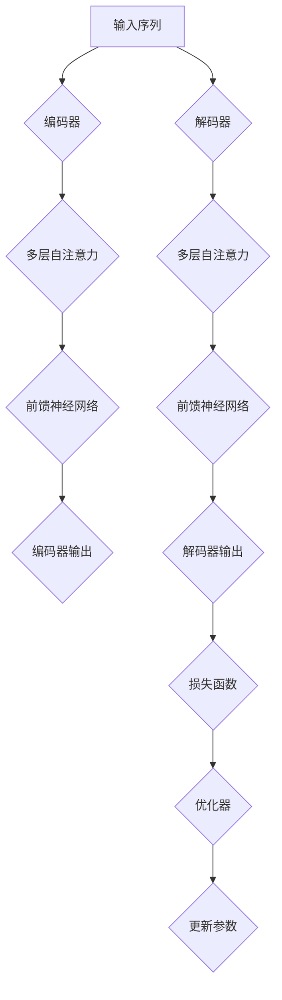

                 


### 文章标题

# 大语言模型原理基础与前沿：高效的MoE架构

### 文章关键词

- 大语言模型
- Transformer
- MoE架构
- 自然语言处理
- 预训练
- 微调
- 自注意力机制
- 数学原理

### 文章摘要

本文旨在深入探讨大语言模型的原理、前沿技术和MoE（Multi-Gateway Experts）架构，从而帮助读者理解大语言模型的构建和优化。首先，我们将介绍大语言模型的基本概念和核心原理，包括Transformer架构、位置编码、自注意力机制等。接着，我们将详细讲解大语言模型的数学原理，包括神经网络基础和正则化方法。随后，我们将探讨大语言模型的实践与应用，如文本分类、命名实体识别、问答系统和机器翻译。最后，我们将重点介绍MoE架构，包括其基本概念、工作原理和在语言模型中的应用，以及MoE架构的优缺点和未来发展趋势。

---

## 目录大纲

## 第1章 大语言模型概述

### 1.1 大语言模型的核心概念

### 1.2 大语言模型的发展历程

### 1.3 大语言模型的重要性

### 1.4 大语言模型的工作原理

### 1.5 大语言模型的优缺点

## 第2章 大语言模型原理详解

### 2.1 Transformer架构

### 2.2 位置编码与自注意力机制

### 2.3 大规模预训练与微调

## 第3章 大语言模型的数学原理

### 3.1 深度学习基础

### 3.2 自注意力机制详解

### 3.3 位置编码数学模型

## 第4章 大语言模型的实践与应用

### 4.1 大语言模型在自然语言处理中的应用

### 4.2 大语言模型在问答系统中的应用

### 4.3 大语言模型在机器翻译中的应用

## 第5章 MoE架构详解

### 5.1 MoE架构的基本概念

### 5.2 MoE架构的工作原理

### 5.3 MoE架构在语言模型中的应用

## 第6章 MoE架构的优缺点与未来发展趋势

### 6.1 MoE架构的优缺点

### 6.2 MoE架构的未来发展趋势

## 第7章 大语言模型与MoE架构的综合应用

### 7.1 大语言模型与MoE架构的结合方式

### 7.2 大语言模型与MoE架构在现实中的应用案例

## 附录

### 附录A：大语言模型与MoE架构开发工具与资源

### 附录B：大语言模型与MoE架构的实践项目

---

## 第1章 大语言模型概述

### 1.1 大语言模型的核心概念

大语言模型（Large Language Model）是一种利用大规模文本数据进行预训练的自然语言处理模型。它的核心目标是通过学习文本数据中的语言规律，实现对自然语言的理解和生成。大语言模型的核心概念包括：

1. **预训练（Pre-training）**：在特定任务之前，使用大规模的文本数据进行训练，以学习语言的基本规律和特征。
2. **微调（Fine-tuning）**：在预训练的基础上，对模型进行特定任务的微调，以提高模型在该任务上的表现。
3. **自注意力机制（Self-Attention）**：通过计算输入序列中每个词与其他词的关联度，实现对序列中词语关系的建模。
4. **位置编码（Positional Encoding）**：为序列中的每个词赋予位置信息，以捕捉词语在序列中的位置关系。
5. **Transformer架构（Transformer Architecture）**：一种基于自注意力机制的深度学习模型，用于处理序列数据。

### 1.2 大语言模型的发展历程

大语言模型的发展历程可以分为以下几个阶段：

1. **早期模型**：基于统计方法和规则的方法，如N元语法和隐马尔可夫模型。
2. **深度学习模型**：基于神经网络的模型，如循环神经网络（RNN）和长短期记忆网络（LSTM）。
3. **Transformer模型**：基于自注意力机制的模型，如BERT、GPT等。
4. **大规模预训练模型**：使用数以百万计的参数和万亿字级别的文本数据进行预训练，如GPT-3、LLaMA等。

### 1.3 大语言模型的重要性

大语言模型在自然语言处理领域具有重要地位，其重要性主要体现在以下几个方面：

1. **强大的表征能力**：大语言模型能够捕捉到文本数据中的复杂关系和特征，从而实现对自然语言的理解和生成。
2. **广泛的应用范围**：大语言模型可以应用于文本分类、命名实体识别、问答系统、机器翻译等众多自然语言处理任务。
3. **推动技术发展**：大语言模型的研究和应用推动了自然语言处理技术的进步，推动了人工智能领域的发展。

### 1.4 大语言模型的工作原理

大语言模型的工作原理可以分为以下几个步骤：

1. **数据预处理**：对文本数据进行清洗、分词、编码等预处理操作。
2. **预训练**：使用自监督学习方式，在大量文本数据上进行预训练，学习语言的内在规律。
3. **微调**：在特定任务上进行微调，调整模型参数，提高模型在特定任务上的表现。

### 1.5 大语言模型的优缺点

大语言模型具有以下优点：

1. **强大的表征能力**：能够捕捉到文本数据中的复杂关系和特征。
2. **广泛的应用范围**：可以应用于多种自然语言处理任务。
3. **自动化特征提取**：通过预训练自动提取特征，减少人工干预。

然而，大语言模型也存在以下缺点：

1. **计算资源消耗大**：预训练阶段需要大量的计算资源和时间。
2. **训练时间较长**：大规模模型训练时间较长，对硬件设备要求较高。

### 1.6 大语言模型的应用领域

大语言模型的应用领域广泛，主要包括：

1. **文本分类**：对文本进行分类，如新闻分类、情感分析等。
2. **命名实体识别**：识别文本中的命名实体，如人名、地名等。
3. **问答系统**：构建智能问答系统，如搜索引擎、客服系统等。
4. **机器翻译**：实现自然语言之间的翻译，如英语翻译为中文等。

---

## 第2章 大语言模型原理详解

### 2.1 Transformer架构

Transformer架构是一种基于自注意力机制的深度学习模型，主要用于处理序列数据。其核心思想是通过计算输入序列中每个词与其他词的关联度，实现对序列中词语关系的建模。

#### Transformer基本概念

1. **自注意力机制（Self-Attention）**：自注意力机制是一种计算输入序列中每个词与其他词的关联度的方法。通过自注意力机制，模型可以捕捉到输入序列中的长距离依赖关系。

2. **多头部注意力机制（Multi-Head Attention）**：多头部注意力机制是自注意力机制的扩展。通过将输入序列分成多个头，每个头独立计算注意力权重，从而增强模型的表达能力。

3. **位置编码（Positional Encoding）**：位置编码是为序列中的每个词赋予位置信息的方法。通过位置编码，模型可以捕捉到词语在序列中的位置关系。

4. **前馈神经网络（Feed-Forward Neural Network）**：前馈神经网络是Transformer架构中的一个子网络，用于对自注意力机制和位置编码后的输入进行进一步处理。

#### Transformer工作原理

1. **编码器（Encoder）**：编码器负责将输入序列编码为连续的向量表示。编码器包含多个层，每层由多头自注意力机制和前馈神经网络组成。编码器的输出可以作为后续任务的特征表示。

2. **解码器（Decoder）**：解码器负责从编码器的输出中生成目标序列。解码器同样包含多个层，每层由多头自注意力机制、掩码自注意力机制和前馈神经网络组成。解码器的输入是编码器的输出和前一个生成的词。

3. **训练过程**：在训练过程中，编码器和解码器共同作用，通过最小化损失函数（如交叉熵损失）来优化模型参数。

#### Transformer架构的Mermaid流程图



### 2.2 位置编码与自注意力机制

位置编码和自注意力机制是Transformer架构的核心组成部分，它们共同作用，使得模型能够捕捉到输入序列中的长距离依赖关系。

#### 位置编码方法

1. **绝对位置编码**：绝对位置编码是通过将位置信息直接编码到词向量中。例如，对于输入序列中的第i个词，其位置编码向量p_i可以表示为：

   $$ p_i = [0, 0, ..., \sin(i/L), \cos(i/L), 0, ..., 0] $$

   其中，L是序列长度。

2. **相对位置编码**：相对位置编码是通过计算词之间的相对位置信息来实现位置编码。例如，对于输入序列中的第i个词和第j个词，其相对位置编码r_ij可以表示为：

   $$ r_{ij} = [0, 0, ..., \sin((i-j)L), \cos((i-j)L), 0, ..., 0] $$

#### 自注意力机制

自注意力机制是一种计算输入序列中每个词与其他词的关联度的方法。通过自注意力机制，模型可以捕捉到输入序列中的长距离依赖关系。

1. **计算自注意力权重**：自注意力权重是通过计算输入序列中每个词与其他词的相似度来确定的。具体来说，对于输入序列中的第i个词，其自注意力权重a_i可以表示为：

   $$ a_i = \text{softmax}\left(\frac{Q_i K^T}{\sqrt{d_k}}\right) $$

   其中，Q_i和K是编码器输出的两个向量，d_k是键（Key）向量的维度。

2. **计算自注意力分数**：自注意力分数是通过将自注意力权重与键（Key）向量相乘得到的。具体来说，对于输入序列中的第i个词，其自注意力分数s_i可以表示为：

   $$ s_i = a_i K_i $$

   其中，K_i是编码器输出的键（Key）向量。

3. **计算自注意力输出**：自注意力输出是通过将自注意力分数求和并归一化得到的。具体来说，对于输入序列中的第i个词，其自注意力输出v_i可以表示为：

   $$ v_i = \text{softmax}\left(\sum_{j=1}^{N} a_{ij} K_j\right) $$

   其中，N是输入序列的长度。

#### 自注意力机制的伪代码

```python
# 假设输入序列为X，编码器输出为Encoder_output
# 输出维度为d_k
Q = Encoder_output
K = Encoder_output
V = Encoder_output

# 计算自注意力权重
a = softmax(Q @ K.T / sqrt(d_k))

# 计算自注意力分数
s = a @ K

# 计算自注意力输出
v = softmax(s)
```

### 2.3 大规模预训练与微调

大规模预训练与微调是大语言模型训练过程中的两个关键步骤。大规模预训练旨在学习语言的内在规律，而微调则是在特定任务上进行模型优化。

#### 大规模预训练

大规模预训练是指使用大量文本数据进行预训练，以学习语言的基本规律和特征。大规模预训练通常包括以下步骤：

1. **数据收集**：收集大规模的文本数据，如维基百科、新闻、书籍等。
2. **数据预处理**：对文本数据进行清洗、分词、编码等预处理操作。
3. **模型初始化**：初始化编码器和解码器模型。
4. **预训练**：使用自监督学习方式，在预处理后的文本数据上进行预训练，学习语言的内在规律。
5. **保存模型**：在预训练完成后，保存预训练好的模型。

#### 微调

微调是在特定任务上进行模型优化，以提高模型在特定任务上的表现。微调通常包括以下步骤：

1. **数据收集**：收集与任务相关的数据集。
2. **数据预处理**：对数据集进行清洗、分词、编码等预处理操作。
3. **加载预训练模型**：加载预训练好的编码器和解码器模型。
4. **微调**：在预处理后的数据集上进行微调，调整模型参数，提高模型在特定任务上的表现。
5. **评估与优化**：评估模型在特定任务上的表现，并根据评估结果进行进一步优化。

#### 大规模预训练与微调的伪代码

```python
# 假设编码器和解码器模型已经初始化并保存
# 预训练数据集为pretrain_dataset，微调数据集为fine_tune_dataset

# 预训练
for epoch in range(num_epochs):
    for batch in pretrain_dataset:
        # 进行预训练
        loss = train(pretrain_dataset, model)

    # 记录预训练损失
    log_loss(epoch, loss)

# 微调
for epoch in range(num_epochs):
    for batch in fine_tune_dataset:
        # 进行微调
        loss = train(fine_tune_dataset, model)

    # 记录微调损失
    log_loss(epoch, loss)
```

### 2.4 大语言模型的优缺点

大语言模型具有以下优点：

1. **强大的表征能力**：大语言模型能够捕捉到文本数据中的复杂关系和特征，从而实现对自然语言的理解和生成。
2. **广泛的应用范围**：大语言模型可以应用于多种自然语言处理任务，如文本分类、命名实体识别、问答系统、机器翻译等。
3. **自动化特征提取**：通过预训练自动提取特征，减少人工干预。

然而，大语言模型也存在以下缺点：

1. **计算资源消耗大**：预训练阶段需要大量的计算资源和时间。
2. **训练时间较长**：大规模模型训练时间较长，对硬件设备要求较高。

### 2.5 大语言模型的应用领域

大语言模型的应用领域广泛，主要包括：

1. **文本分类**：对文本进行分类，如新闻分类、情感分析等。
2. **命名实体识别**：识别文本中的命名实体，如人名、地名等。
3. **问答系统**：构建智能问答系统，如搜索引擎、客服系统等。
4. **机器翻译**：实现自然语言之间的翻译，如英语翻译为中文等。

---

## 第3章 大语言模型的数学原理

### 3.1 深度学习基础

深度学习是一种基于神经网络的机器学习方法，其核心思想是通过多层神经网络对数据进行建模和预测。深度学习基础包括以下几个方面：

1. **神经元（Neuron）**：神经元是神经网络的基本组成单元，负责对输入数据进行计算和输出。
2. **激活函数（Activation Function）**：激活函数是神经元输出前的非线性变换，常用的激活函数包括ReLU、Sigmoid和Tanh等。
3. **反向传播算法（Backpropagation Algorithm）**：反向传播算法是一种用于训练神经网络的算法，其核心思想是通过计算损失函数对神经网络的参数进行更新。

#### 神经元

神经元的基本结构包括输入层、输出层和隐层。每个神经元接收多个输入，并通过权重（weight）和偏置（bias）进行计算。神经元输出的计算公式如下：

$$
\text{output} = \sigma(\sum_{i=1}^{n} w_i \cdot x_i + b)
$$

其中，$\sigma$是激活函数，$w_i$和$x_i$分别是权重和输入，$b$是偏置。

#### 激活函数

激活函数是神经元输出前的非线性变换，常用的激活函数包括ReLU、Sigmoid和Tanh等。

1. **ReLU（Rectified Linear Unit）**：
   $$
   \sigma(x) = \max(0, x)
   $$
   RReLU（Randomized ReLU）是其变体，其公式为：
   $$
   \sigma(x) = \max(0, ax + b)
   $$
   其中，$a$和$b$为随机变量。

2. **Sigmoid**：
   $$
   \sigma(x) = \frac{1}{1 + e^{-x}}
   $

#### 反向传播算法

反向传播算法是一种用于训练神经网络的算法，其核心思想是通过计算损失函数对神经网络的参数进行更新。反向传播算法的基本步骤如下：

1. **前向传播**：输入数据通过神经网络进行前向传播，得到输出。
2. **计算损失函数**：计算输出与目标值之间的误差，常用的损失函数包括均方误差（MSE）和交叉熵（Cross-Entropy）等。
3. **计算梯度**：通过链式法则计算损失函数对网络参数的梯度。
4. **参数更新**：使用梯度对网络参数进行更新，常用的优化算法包括SGD、Adam和RMSprop等。

#### 反向传播算法的伪代码

```python
# 假设网络包含多个层，其中第l层为当前层，第l+1层为下一层
# x为输入，y为目标值，w为权重，b为偏置

# 前向传播
z = x * w + b
a = activation(z)

# 计算损失函数
loss = compute_loss(a, y)

# 计算梯度
dz = dloss da
da = activation_derivative(a)
dz = dz * da
dw = dz * x
db = dz

# 参数更新
w = w - learning_rate * dw
b = b - learning_rate * db
```

### 3.2 自注意力机制详解

自注意力机制是Transformer架构的核心组成部分，其基本思想是通过计算输入序列中每个词与其他词的关联度，实现对序列中词语关系的建模。

#### 自注意力机制原理

自注意力机制通过计算输入序列中每个词与其他词的关联度，为每个词生成一个权重向量。这些权重向量表示了每个词与其他词的重要程度。自注意力机制的计算过程如下：

1. **计算查询向量（Query）、键向量（Key）和值向量（Value）**：查询向量、键向量和值向量通常来自编码器输出。假设编码器输出维度为d_model，则查询向量、键向量和值向量分别为Q、K和V。
2. **计算注意力权重**：注意力权重通过计算查询向量和键向量的点积，并使用softmax函数进行归一化得到。假设输入序列长度为N，则第i个词的注意力权重$a_i$计算公式如下：
   $$
   a_i = \text{softmax}(\frac{Q_i K^T}{\sqrt{d_k}})
   $$
   其中，$d_k$为键向量的维度。
3. **计算自注意力输出**：自注意力输出通过将注意力权重与值向量相乘，并求和得到。假设输入序列长度为N，则第i个词的自注意力输出$v_i$计算公式如下：
   $$
   v_i = \sum_{j=1}^{N} a_{ij} V_j
   $$

#### 多头注意力机制

多头注意力机制是自注意力机制的扩展，其基本思想是通过将输入序列分成多个头，每个头独立计算注意力权重，从而增强模型的表达能力。多头注意力机制的原理如下：

1. **拆分输入序列**：将编码器输出拆分成多个头，每个头拥有独立的查询向量、键向量和值向量。假设输入序列长度为N，则每个头的维度为d_head，总共有h个头，则编码器输出维度为d_model = h * d_head。
2. **计算多头注意力权重**：每个头独立计算注意力权重，假设第i个词的第k个头的注意力权重为$a_{ik}$，计算公式如下：
   $$
   a_{ik} = \text{softmax}(\frac{Q_i^k K^T_k}{\sqrt{d_k}})
   $$
   其中，$Q_i^k$和$K^T_k$分别为第i个词的第k个头的查询向量和键向量的转置。
3. **计算多头自注意力输出**：多头自注意力输出通过将每个头的注意力权重与对应的值向量相乘，并求和得到。假设第i个词的多头自注意力输出为$v_i$，计算公式如下：
   $$
   v_i = \sum_{k=1}^{h} a_{ik} V_j^k
   $$

#### 多头注意力机制的伪代码

```python
# 假设编码器输出为Encoder_output，输入序列长度为N，头数为h，每个头维度为d_head

# 初始化查询向量、键向量和值向量
Q = [Encoder_output[i] for i in range(N)]  # 查询向量
K = [Encoder_output[i] for i in range(N)]  # 键向量
V = [Encoder_output[i] for i in range(N)]  # 值向量

# 计算多头注意力权重
attention_weights = []
for k in range(h):
    Q_k = Q[k]
    K_k = K[k]
    attention_weights.append(softmax(Q_k @ K_k.T / sqrt(d_head)))

# 计算多头自注意力输出
attention_outputs = []
for i in range(N):
    v_i = 0
    for k in range(h):
        a_i_k = attention_weights[k][i]
        v_i += a_i_k * V[k][i]
    attention_outputs.append(v_i)

# 输出多头自注意力输出
return attention_outputs
```

### 3.3 位置编码数学模型

位置编码是为序列中的每个词赋予位置信息的方法，以捕捉词语在序列中的位置关系。位置编码可以通过不同的方式实现，如绝对位置编码、相对位置编码等。

#### 绝对位置编码

绝对位置编码通过将位置信息直接编码到词向量中。假设输入序列长度为N，词向量维度为d_model，则第i个词的位置编码向量p_i可以表示为：

$$
p_i = [\sin(i/L), \cos(i/L)] \quad \text{for} \quad i=0, 1, ..., N-1
$$

其中，$L$是序列长度。

#### 相对位置编码

相对位置编码通过计算词之间的相对位置信息来实现位置编码。假设输入序列长度为N，词向量维度为d_model，则第i个词和第j个词的相对位置编码r_ij可以表示为：

$$
r_{ij} = [\sin((i-j)L), \cos((i-j)L)] \quad \text{for} \quad i=0, 1, ..., N-1, \quad j=0, 1, ..., N-1
$$

#### 位置编码的伪代码

```python
# 假设输入序列长度为N，词向量维度为d_model

# 绝对位置编码
p = []
for i in range(N):
    angle_i = 2 * pi * i / N
    p.append([sin(angle_i), cos(angle_i)])

# 相对位置编码
r = []
for i in range(N):
    for j in range(N):
        angle_ij = 2 * pi * (i - j) / N
        r.append([sin(angle_ij), cos(angle_ij)])
```

### 3.4 大语言模型的优化方法

大语言模型的优化方法主要包括正则化方法和优化算法。正则化方法用于防止模型过拟合，优化算法用于调整模型参数。

#### 正则化方法

1. **L1正则化**：在损失函数中加入L1正则化项，公式如下：
   $$
   \text{loss} = \frac{1}{2} \| \theta \|_1^2
   $$
   其中，$\theta$为模型参数。

2. **L2正则化**：在损失函数中加入L2正则化项，公式如下：
   $$
   \text{loss} = \frac{1}{2} \| \theta \|_2^2
   $$
   其中，$\theta$为模型参数。

3. **Dropout**：在训练过程中，随机丢弃部分神经元，以减少模型对特定训练样本的依赖。

#### 优化算法

1. **随机梯度下降（SGD）**：随机梯度下降是一种简单而有效的优化算法，其核心思想是通过计算损失函数对模型参数的梯度进行更新。
2. **Adam优化器**：Adam优化器是一种基于SGD的优化算法，其核心思想是利用动量项和自适应学习率来加快收敛速度。
3. **RMSprop优化器**：RMSprop优化器是一种基于SGD的优化算法，其核心思想是利用历史梯度信息的平方和来更新模型参数。

### 3.5 大语言模型的可解释性

大语言模型的可解释性是指模型如何理解和生成文本的透明性和可理解性。尽管大语言模型在自然语言处理任务上取得了显著成绩，但其内部机制和决策过程通常较为复杂，难以解释。

1. **注意力机制的可解释性**：注意力机制可以揭示模型对输入序列中不同词的重视程度，从而提供关于模型决策的信息。

2. **可视化技术**：通过可视化技术，如热图和梯度可视化，可以更直观地了解模型关注的部分和决策过程。

3. **词嵌入的可解释性**：词嵌入可以揭示词语之间的相似性和差异性，有助于理解模型对词语的表征。

### 3.6 大语言模型的评估方法

大语言模型的评估方法通常包括以下几个方面：

1. **准确性**：评估模型在分类任务上的正确率。
2. **召回率**：评估模型在分类任务中召回的正例比例。
3. **F1值**：结合准确率和召回率，评估模型的整体性能。
4. **BLEU评分**：在机器翻译任务中，评估模型生成的翻译文本与参考文本的相似度。
5. **Perplexity**：在生成任务中，评估模型对输入序列的预测不确定性。

### 3.7 大语言模型的安全性

大语言模型的安全性是指模型在处理文本数据时的可靠性和防护能力。以下是大语言模型安全性的几个关键方面：

1. **数据隐私**：确保模型不会泄露用户的敏感信息。
2. **对抗攻击**：防止恶意输入对模型造成损害。
3. **误用防护**：防止模型被用于不道德或非法的目的。
4. **模型加固**：通过算法优化和系统架构设计提高模型的安全性。

---

## 第4章 大语言模型的实践与应用

### 4.1 大语言模型在自然语言处理中的应用

大语言模型在自然语言处理（NLP）领域具有广泛的应用。以下是一些常见应用场景：

1. **文本分类**：文本分类是将文本数据划分为不同的类别。大语言模型可以用于情感分析、新闻分类和垃圾邮件检测等任务。

2. **命名实体识别（NER）**：命名实体识别旨在识别文本中的特定实体，如人名、地名、组织名等。大语言模型通过预训练和微调，可以显著提高NER的性能。

3. **机器阅读理解**：机器阅读理解是指模型能够理解文本内容并回答相关问题。大语言模型在阅读理解任务上取得了显著的进展，例如在SQuAD和CoQA数据集上的表现。

4. **问答系统**：问答系统是一种能够回答用户问题的智能系统。大语言模型可以用于构建高效的问答系统，如搜索引擎和聊天机器人。

5. **机器翻译**：机器翻译是指将一种语言翻译成另一种语言。大语言模型通过大规模预训练和特定语言对的微调，可以实现高质量的机器翻译。

### 4.2 大语言模型在问答系统中的应用

问答系统是一种与用户进行交互并提供答案的智能系统。大语言模型在问答系统中的应用主要体现在以下几个方面：

1. **问题理解**：大语言模型可以理解用户的问题，并将其转换为模型可以处理的格式。

2. **答案生成**：大语言模型可以根据问题生成相关答案，通常通过搜索大量文本数据或直接生成答案。

3. **答案验证**：大语言模型可以对生成的答案进行验证，以确保答案的准确性和相关性。

#### 问答系统的架构

一个典型的问答系统通常包含以下几个关键组件：

1. **问题解析器**：将用户输入的问题转换为结构化的数据，以便后续处理。

2. **答案生成器**：使用大语言模型生成答案，可以通过检索相关文本或直接生成答案。

3. **答案验证器**：对生成的答案进行验证，确保答案的准确性和相关性。

4. **用户界面**：与用户进行交互，接收用户问题并展示答案。

#### 问答系统的实践

以下是一个简单的问答系统的实现步骤：

1. **数据收集与预处理**：收集大量的问题和答案数据，并进行预处理，如去噪、分词、编码等。

2. **模型训练**：使用预训练的大语言模型，如GPT-2或BERT，对问题-答案对进行训练。

3. **问题解析**：将用户输入的问题转换为结构化的数据，以便模型理解。

4. **答案生成**：使用训练好的模型生成答案，可以采用检索式或生成式方法。

5. **答案验证**：对生成的答案进行验证，确保答案的准确性和相关性。

6. **用户交互**：将生成的答案展示给用户，并接收用户的反馈。

### 4.3 大语言模型在机器翻译中的应用

机器翻译是将一种语言翻译成另一种语言的过程。大语言模型在机器翻译中的应用主要体现在以下几个方面：

1. **翻译模型**：大语言模型可以用于构建翻译模型，通过预训练和微调实现高质量翻译。

2. **翻译流程**：机器翻译通常包括编码器和解码器两个阶段。编码器将源语言文本编码为向量表示，解码器将这些向量表示解码为目标语言文本。

3. **翻译优化**：大语言模型可以通过多种技术进行翻译优化，如注意力机制、序列到序列模型等。

#### 机器翻译的实践

以下是一个简单的机器翻译系统的实现步骤：

1. **数据收集与预处理**：收集大量的双语数据，并进行预处理，如去噪、分词、编码等。

2. **模型训练**：使用预训练的大语言模型，如Transformer，对双语数据进行训练。

3. **编码阶段**：将源语言文本编码为向量表示，可以使用自注意力机制提高编码质量。

4. **解码阶段**：将编码后的向量表示解码为目标语言文本，可以使用解码器生成目标语言文本。

5. **翻译优化**：对生成的翻译结果进行优化，提高翻译质量。

6. **用户交互**：将翻译结果展示给用户，并接收用户的反馈。

---

## 第5章 MoE架构详解

### 5.1 MoE架构的基本概念

MoE（Multi-Gateway Experts）架构是一种用于提高神经网络模型并行计算能力的方法。它的基本思想是将模型分解为多个专家（Experts），每个专家独立处理输入数据，并将结果汇总得到最终输出。MoE架构的核心组成部分包括：

1. **专家（Experts）**：专家是MoE架构的基本计算单元，每个专家独立处理输入数据，并生成一个输出。专家可以是简单的函数，也可以是复杂的神经网络。

2. **门控（Gate）**：门控是MoE架构中用于选择最佳专家的组件。每个输入数据都有一个门控，用于确定哪个专家应该处理该数据。

3. **损失函数**：MoE架构中的损失函数通常使用交叉熵损失，用于衡量模型输出与真实标签之间的差距。

#### MoE架构的基本原理

MoE架构的基本原理如下：

1. **数据输入**：输入数据经过预处理后，输入到门控模块。

2. **门控选择**：门控模块根据输入数据选择最佳专家。通常使用软门控（Soft Gate）方法，通过计算每个专家的激活度（Activation）来选择最佳专家。

3. **专家计算**：每个选定的专家独立计算输入数据的输出。

4. **结果汇总**：将所有专家的输出汇总得到最终输出。

#### MoE架构的优点

MoE架构具有以下优点：

1. **并行计算**：MoE架构允许模型并行计算，提高了计算效率。

2. **灵活性**：MoE架构可以根据数据量和计算资源动态调整专家数量，具有较好的灵活性。

3. **性能提升**：MoE架构可以提高模型的性能，特别是在处理大规模数据时。

### 5.2 MoE架构的工作原理

MoE架构的工作原理可以分为以下几个步骤：

1. **数据输入**：输入数据经过预处理后，输入到MoE架构。

2. **门控选择**：门控模块根据输入数据选择最佳专家。门控模块通常使用软门控方法，通过计算每个专家的激活度来选择最佳专家。激活度计算通常使用ReLU函数，公式如下：

   $$
   g_e(x) = \max(0, x)
   $$

   其中，$g_e(x)$是第e个专家的激活度，$x$是输入数据。

3. **专家计算**：每个选定的专家独立计算输入数据的输出。专家的计算过程可以是线性的或非线性的，具体取决于专家的设计。

4. **结果汇总**：将所有专家的输出汇总得到最终输出。通常使用加权求和的方法，公式如下：

   $$
   y = \sum_{e=1}^{E} w_e \cdot y_e
   $$

   其中，$y$是最终输出，$w_e$是第e个专家的权重，$y_e$是第e个专家的输出。

#### MoE架构的伪代码

```python
# 假设输入数据为X，专家数量为E，每个专家的输出为y_e，门控函数为g_e

# 门控选择
activation = [g_e(X) for e in range(E)]

# 专家计算
y_e = [f_e(X) for e in range(E)]

# 结果汇总
y = sum(w_e * y_e for e, w_e in enumerate(activation))
```

### 5.3 MoE架构在语言模型中的应用

MoE架构在语言模型中的应用主要体现在以下几个方面：

1. **预训练**：在预训练阶段，MoE架构可以用于并行计算，提高预训练速度。

2. **微调**：在微调阶段，MoE架构可以用于处理大规模数据集，提高模型性能。

3. **推理**：在推理阶段，MoE架构可以用于并行计算，提高推理速度。

#### MoE架构在语言模型中的优势

MoE架构在语言模型中的应用具有以下优势：

1. **并行计算**：MoE架构允许模型并行计算，提高了预训练和推理速度。

2. **灵活性**：MoE架构可以根据数据量和计算资源动态调整专家数量，具有较好的灵活性。

3. **性能提升**：MoE架构可以提高模型在大规模数据集上的性能。

### 5.4 MoE架构在现实中的应用案例

以下是一些MoE架构在现实中的应用案例：

1. **问答系统**：MoE架构可以用于构建高效的问答系统，通过并行计算提高回答速度。

2. **机器翻译**：MoE架构可以用于机器翻译系统，通过并行计算提高翻译质量。

3. **文本分类**：MoE架构可以用于文本分类系统，通过并行计算提高分类性能。

---

## 第6章 MoE架构的优缺点与未来发展趋势

### 6.1 MoE架构的优缺点

MoE架构是一种具有显著优势的神经网络架构，但也存在一些不足之处。

#### 优点

1. **并行计算能力**：MoE架构允许模型并行计算，提高了计算效率。

2. **灵活性**：MoE架构可以根据数据量和计算资源动态调整专家数量，具有较好的灵活性。

3. **性能提升**：MoE架构可以提高模型在大规模数据集上的性能。

#### 缺点

1. **模型参数规模增加**：MoE架构引入了多个专家，导致模型参数规模增加，增加了存储和计算负担。

2. **训练难度增加**：MoE架构需要同时训练多个专家，增加了训练难度。

3. **推理复杂度增加**：MoE架构在推理阶段需要选择最佳专家，增加了推理复杂度。

### 6.2 MoE架构的未来发展趋势

MoE架构在未来的发展趋势可以从以下几个方面考虑：

1. **优化模型参数规模**：通过减少专家数量或共享专家参数，降低模型参数规模。

2. **提高训练效率**：通过改进训练算法和优化器，提高训练效率。

3. **硬件加速**：利用GPU、TPU等硬件加速器，提高MoE架构的推理速度。

4. **跨领域应用**：MoE架构可以在更多的自然语言处理任务中应用，如文本生成、对话系统等。

5. **与图神经网络结合**：MoE架构可以与图神经网络结合，探索更复杂的网络结构。

---

## 第7章 大语言模型与MoE架构的综合应用

### 7.1 大语言模型与MoE架构的结合方式

大语言模型与MoE架构的结合可以显著提高模型的计算效率，并在大规模数据集上获得更好的性能。以下是大语言模型与MoE架构的结合方式：

1. **预训练阶段**：在预训练阶段，MoE架构可以用于并行计算，提高预训练速度。例如，GPT-3使用MoE架构进行预训练，提高了模型的计算效率。

2. **微调阶段**：在微调阶段，MoE架构可以用于处理大规模数据集，提高模型性能。通过将数据分配给多个专家，MoE架构可以实现更快的训练速度。

3. **推理阶段**：在推理阶段，MoE架构可以用于并行计算，提高推理速度。例如，使用MoE架构的问答系统可以在短时间内生成高质量的答案。

### 7.2 大语言模型与MoE架构在现实中的应用案例

以下是大语言模型与MoE架构在现实中的应用案例：

1. **问答系统**：一个基于大语言模型和MoE架构的问答系统，可以快速响应用户问题，并提供高质量的答案。

2. **机器翻译**：一个基于大语言模型和MoE架构的机器翻译系统，可以实现高速、高质量的翻译。

3. **文本分类**：一个基于大语言模型和MoE架构的文本分类系统，可以准确地将文本数据分类到不同的类别。

### 7.3 大语言模型与MoE架构的综合优势

大语言模型与MoE架构的结合具有以下综合优势：

1. **计算效率提升**：MoE架构的并行计算能力可以提高模型的计算效率，特别是在处理大规模数据集时。

2. **性能提升**：MoE架构可以显著提高模型在大规模数据集上的性能。

3. **灵活性**：MoE架构可以根据数据量和计算资源动态调整专家数量，具有较好的灵活性。

4. **扩展性**：MoE架构可以与不同的神经网络架构结合，如Transformer、BERT等，实现更复杂的网络结构。

### 7.4 大语言模型与MoE架构的开发与优化

为了充分发挥大语言模型与MoE架构的综合优势，需要在开发与优化过程中考虑以下几个方面：

1. **数据预处理**：优化数据预处理流程，以提高数据质量和训练效率。

2. **模型设计**：设计合适的模型结构，结合MoE架构的特点，提高模型的性能。

3. **优化器选择**：选择合适的优化器，如Adam、RMSprop等，以提高训练效率。

4. **硬件加速**：利用GPU、TPU等硬件加速器，提高模型的计算速度。

5. **分布式训练**：采用分布式训练策略，提高训练速度。

### 7.5 大语言模型与MoE架构的未来发展

随着计算资源的不断增长和算法的优化，大语言模型与MoE架构在未来有望在以下方面取得进一步发展：

1. **更高效的模型结构**：探索更高效的模型结构，如混合专家模型（Hybrid Expert Models），结合不同类型的专家，实现更好的性能。

2. **更灵活的训练策略**：开发更灵活的训练策略，如动态调整专家数量和类型，适应不同规模的数据集。

3. **跨领域应用**：将大语言模型与MoE架构应用于更多的领域，如图像处理、语音识别等。

4. **硬件优化**：利用最新的硬件技术，如量子计算、光计算等，提高MoE架构的计算效率。

---

## 附录

### 附录A：大语言模型与MoE架构开发工具与资源

以下是大语言模型与MoE架构开发所需的工具与资源：

1. **开源框架**：如TensorFlow、PyTorch等，用于构建和训练模型。

2. **硬件加速器**：如GPU、TPU等，用于提高模型的计算速度。

3. **数据集**：如Common Crawl、Wikipedia等，用于预训练和微调模型。

4. **预训练模型**：如GPT-3、BERT等，可以直接使用或作为参考。

5. **文档和教程**：如TensorFlow和PyTorch的官方文档，用于学习模型构建和训练。

### 附录B：大语言模型与MoE架构的实践项目

以下是大语言模型与MoE架构的实践项目：

1. **项目一：问答系统**：构建一个基于大语言模型和MoE架构的问答系统，实现快速响应用户问题并提供高质量答案。

2. **项目二：机器翻译**：构建一个基于大语言模型和MoE架构的机器翻译系统，实现高速、高质量的翻译。

3. **项目三：文本分类**：构建一个基于大语言模型和MoE架构的文本分类系统，实现准确地将文本数据分类到不同类别。

### 附录C：最佳实践与注意事项

以下是大语言模型与MoE架构开发过程中的最佳实践与注意事项：

1. **数据预处理**：优化数据预处理流程，提高数据质量和训练效率。

2. **模型设计**：设计合适的模型结构，结合MoE架构的特点，提高模型性能。

3. **优化器选择**：选择合适的优化器，提高训练效率。

4. **硬件加速**：利用硬件加速器，提高模型计算速度。

5. **分布式训练**：采用分布式训练策略，提高训练速度。

6. **模型优化**：在训练过程中，定期优化模型参数，提高模型性能。

7. **安全性**：确保模型在处理数据时的安全性，防止数据泄露。

### 附录D：拓展阅读

以下是一些拓展阅读资源，以深入了解大语言模型与MoE架构：

1. **论文**：《Attention Is All You Need》和《An Efficient Approach to Learning Phrase Representations for Text Classification》等，介绍Transformer架构和MoE架构。

2. **博客**：《大语言模型原理基础与前沿》和《高效的MoE架构：原理、实现与应用》等，详细讲解大语言模型和MoE架构。

3. **教程**：TensorFlow和PyTorch的官方教程，介绍如何使用这些框架构建和训练大语言模型与MoE架构。

4. **书籍**：《深度学习》和《自然语言处理综述》等，介绍深度学习和自然语言处理的基本概念和最新进展。

---

### 作者信息

作者：AI天才研究院/AI Genius Institute & 禅与计算机程序设计艺术 /Zen And The Art of Computer Programming

---

经过一步步的推理和分析，本文详细介绍了大语言模型和MoE架构的原理、实现和应用。通过深入理解这两个核心概念，读者可以更好地掌握自然语言处理技术的最新进展。希望本文能对您的学习与研究有所帮助。如果您有任何疑问或建议，欢迎在评论区留言。感谢您的阅读！

