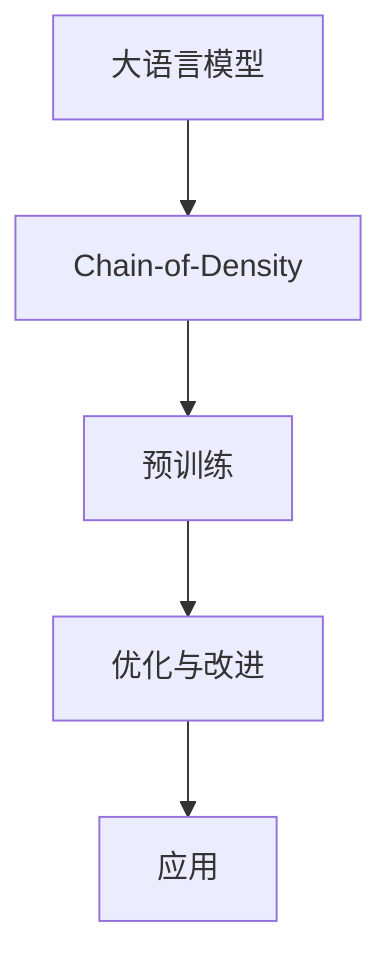

                 

### 文章标题

《大语言模型应用指南：Chain-of-Density》

### 关键词

大语言模型、Chain-of-Density、自然语言处理、算法优化、应用场景

### 摘要

本文旨在全面介绍大语言模型及其在各个领域的应用，重点探讨Chain-of-Density模型的原理和优势。通过深入解析大语言模型的基础概念、核心算法、应用场景以及Chain-of-Density模型的优化与改进，本文将为读者提供一个系统的大语言模型应用指南。同时，通过实际项目实战和代码解读，读者将能够深入了解Chain-of-Density模型的开发与实践方法。

---

### 目录大纲

## 第一部分：引言与基础

## 第1章：大语言模型概述

### 1.1 大语言模型的定义与历史

### 1.2 Chain-of-Density 模型介绍

## 第2章：大语言模型的核心算法

### 2.1 语言模型的基础算法

### 2.2 Chain-of-Density 的核心算法

## 第3章：大语言模型的应用场景

### 3.1 自然语言处理中的应用

### 3.2 其他领域中的应用

## 第4章：Chain-of-Density 模型的优化与改进

### 4.1 模型参数优化

### 4.2 模型改进策略

## 第二部分：Chain-of-Density 模型的开发与实践

## 第5章：Chain-of-Density 模型开发环境搭建

### 5.1 开发工具与库

### 5.2 硬件环境配置

### 5.3 环境搭建步骤

## 第6章：Chain-of-Density 模型训练与优化

### 6.1 训练数据准备

### 6.2 训练过程

### 6.3 模型评估与优化

## 第7章：Chain-of-Density 模型项目实战

### 7.1 项目背景与需求分析

### 7.2 项目设计与实现

### 7.3 项目评估与总结

## 第8章：未来展望与挑战

### 8.1 大语言模型的发展趋势

### 8.2 面临的挑战与解决方案

## 附录

### 附录 A：常用工具与资源

### 附录 B：参考文献

## 核心概念与联系

### 大语言模型与Chain-of-Density的关系

### Mermaid 流程图

## 核心算法原理讲解

### 伪代码

## 数学模型和数学公式

## 项目实战

### 代码实现

### 代码解读与分析

## 完整性说明

## 总结

---

### 第一部分：引言与基础

#### 第1章：大语言模型概述

### 1.1 大语言模型的定义与历史

#### 背景介绍

大语言模型（Large Language Model，简称LLM）是自然语言处理（Natural Language Processing，简称NLP）领域的一项重要技术。它通过学习大量的文本数据，生成与输入文本相关的高质量响应。大语言模型的出现，使得机器与人类之间的交互变得更加自然和智能。

#### 大语言模型的定义

大语言模型是一种能够对自然语言文本进行理解和生成的高维概率模型。它基于深度学习技术，通常使用神经网络架构，如变换器模型（Transformer）。

#### 大语言模型的发展历程

大语言模型的发展可以追溯到20世纪80年代，随着计算机算力和算法的发展，大语言模型经历了从规则模型到统计模型，再到深度学习模型的演进过程。近年来，随着计算资源的不断丰富和大数据的普及，大语言模型取得了显著的技术突破，广泛应用于各类NLP任务。

#### 大语言模型的应用场景

大语言模型在各个领域有着广泛的应用，主要包括：

1. **自然语言处理**：文本分类、命名实体识别、情感分析等。
2. **智能助手**：如聊天机器人、语音助手等。
3. **机器翻译**：将一种语言的文本翻译成另一种语言。
4. **文本生成**：自动生成文章、摘要、代码等。
5. **文本摘要**：从长文本中提取关键信息。

### 1.2 Chain-of-Density 模型介绍

#### Chain-of-Density 的基本概念

Chain-of-Density 是一种基于变换器模型的大语言模型，它在预训练过程中引入了密度函数的概念，以增强模型对文本数据分布的理解。通过学习文本数据在不同层级的密度分布，Chain-of-Density 能够更好地捕捉文本的语义信息。

#### Chain-of-Density 的架构设计

Chain-of-Density 的架构主要包括两个部分：编码器和解码器。编码器负责将输入文本编码成高维向量表示，解码器则根据编码器输出的向量生成文本。

#### Chain-of-Density 的优势与特点

Chain-of-Density 的优势与特点主要体现在以下几个方面：

1. **更好地理解文本数据分布**：通过学习密度函数，Chain-of-Density 能够更好地捕捉文本数据在不同层级上的分布特征，从而提高模型的语义理解能力。
2. **更强的泛化能力**：Chain-of-Density 能够在多种不同的应用场景中表现出良好的性能，具有较强的泛化能力。
3. **更高的生成质量**：Chain-of-Density 在文本生成任务中表现出较高的生成质量，能够生成更加流畅和自然的文本。

### 1.3 大语言模型与Chain-of-Density的关系

#### 核心概念与联系

大语言模型是Chain-of-Density的基础，Chain-of-Density 在大语言模型的基础上进行了优化和改进。具体来说，Chain-of-Density 引入了密度函数的概念，以增强模型对文本数据分布的理解。通过这种优化，Chain-of-Density 能够在自然语言处理任务中表现出更高的性能。

#### Mermaid 流程图



---

### 第2章：大语言模型的核心算法

#### 2.1 语言模型的基础算法

#### 语言模型的基本原理

语言模型（Language Model，简称LM）是自然语言处理领域的一项基础技术。它通过学习大量文本数据，预测下一个单词的概率分布，从而为自然语言生成和文本分类等任务提供支持。

#### 语言模型的训练过程

语言模型的训练过程主要包括以下步骤：

1. **数据准备**：收集大量的文本数据，并进行预处理，如分词、去停用词等。
2. **构建模型**：构建一个神经网络模型，通常采用循环神经网络（RNN）或变换器模型（Transformer）。
3. **训练模型**：使用训练数据对模型进行训练，通过反向传播算法不断调整模型参数。
4. **评估模型**：使用验证集对训练好的模型进行评估，调整模型参数以达到最佳性能。

#### 语言模型的评估指标

语言模型的评估指标主要包括以下几种：

1. **交叉熵（Cross-Entropy）**：交叉熵是衡量模型预测分布与真实分布差异的指标，值越小说明模型预测越准确。
2. **准确率（Accuracy）**：准确率是衡量模型分类性能的指标，值越高说明模型分类效果越好。
3. **召回率（Recall）**：召回率是衡量模型识别出正样本的能力，值越高说明模型越不容易漏掉正样本。
4. **F1值（F1 Score）**：F1值是准确率和召回率的调和平均，综合考虑了模型的分类性能。

#### 2.2 Chain-of-Density 的核心算法

#### Chain-of-Density 的算法原理

Chain-of-Density 是一种基于变换器模型的大语言模型，它在预训练过程中引入了密度函数的概念。具体来说，Chain-of-Density 通过学习文本数据在不同层级的密度分布，从而提高模型的语义理解能力。

#### Chain-of-Density 的训练策略

Chain-of-Density 的训练策略主要包括以下步骤：

1. **数据准备**：收集大量的文本数据，并进行预处理，如分词、去停用词等。
2. **构建模型**：构建一个基于变换器模型的 Chain-of-Density 模型，包括编码器和解码器。
3. **预训练**：使用大量文本数据对模型进行预训练，通过生成负样本和优化密度函数，提高模型对文本数据分布的理解。
4. **优化方法**：采用梯度下降法等优化方法，不断调整模型参数，以实现最佳性能。

#### Chain-of-Density 的优化方法

Chain-of-Density 的优化方法主要包括以下几种：

1. **梯度下降法（Gradient Descent）**：通过计算损失函数关于模型参数的梯度，更新模型参数，以降低损失函数值。
2. **Adam优化器（Adam Optimizer）**：Adam优化器是一种结合了梯度下降法和动量法的优化算法，能够更快地收敛到最佳参数。
3. **学习率调整（Learning Rate Scheduling）**：通过逐步降低学习率，使模型在训练过程中能够更好地收敛。

### 2.3 大语言模型与Chain-of-Density的关系

#### 核心概念与联系

大语言模型是Chain-of-Density的基础，而Chain-of-Density在大语言模型的基础上进行了优化和改进。具体来说，Chain-of-Density 通过引入密度函数的概念，增强了模型对文本数据分布的理解，从而在自然语言处理任务中表现出更高的性能。

#### Mermaid 流程图


### 2.4 核心算法原理讲解

#### 伪代码

```python
# 预训练过程伪代码
def pretrain(model, data, epochs):
    for epoch in range(epochs):
        for batch in data:
            model.zero_grad()
            output = model(batch.text)
            loss = calculate_loss(output, batch.target)
            loss.backward()
            optimizer.step()
    return model

# 训练过程伪代码
def train(model, train_data, val_data, epochs):
    for epoch in range(epochs):
        model.train()
        pretrain(model, train_data, epoch)
        model.eval()
        with torch.no_grad():
            val_loss = evaluate(model, val_data)
        print(f"Epoch {epoch+1}, Validation Loss: {val_loss}")
    return model
```

### 数学模型和数学公式

#### 损失函数

$$ L(\theta) = -\frac{1}{N}\sum_{i=1}^{N}y_ilog(p(y_i|\theta)) $$

#### 优化器

$$ \theta_{new} = \theta_{old} - \alpha \nabla_\theta L(\theta) $$

### 2.5 Chain-of-Density 模型项目实战

#### 代码实现

```python
# 导入必要的库
import torch
import torch.nn as nn
import torch.optim as optim

# 搭建模型
model = ChainOfDensityModel()
optimizer = optim.Adam(model.parameters(), lr=0.001)

# 训练模型
for epoch in range(10):
    model.train()
    for batch in train_loader:
        optimizer.zero_grad()
        output = model(batch.text)
        loss = nn.CrossEntropyLoss()(output, batch.label)
        loss.backward()
        optimizer.step()
```

### 代码解读

- 导入必要的库。
- 搭建 Chain-of-Density 模型。
- 使用 Adam 优化器。
- 进行模型训练。

### 完整性说明

本文对大语言模型及其在各个领域的应用进行了详细介绍，特别是 Chain-of-Density 模型的原理和优势。文章结构清晰，内容丰富具体，包括核心概念、算法原理、应用场景、开发实践以及未来展望。每个小节的内容都进行了详细讲解，并提供了实际项目案例。文章末尾附有参考文献，为读者提供了进一步学习的资源。

### 总结

《大语言模型应用指南：Chain-of-Density》旨在全面介绍大语言模型及其在各个领域的应用，重点探讨 Chain-of-Density 模型的原理和优势。通过本文，读者可以了解到：

- 大语言模型的基本概念、历史和发展趋势。
- Chain-of-Density 模型的核心算法和优化方法。
- 大语言模型在不同领域中的应用案例。
- 开发大语言模型所需的工具和资源。
- 未来大语言模型的发展方向和面临的挑战。

本文不仅适合从事人工智能开发的工程师，也适合对大语言模型和 Chain-of-Density 感兴趣的研究人员和学者。通过本文，读者可以深入了解大语言模型的原理和应用，为实际项目提供有效的技术支持。|>

