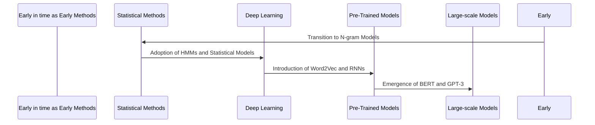
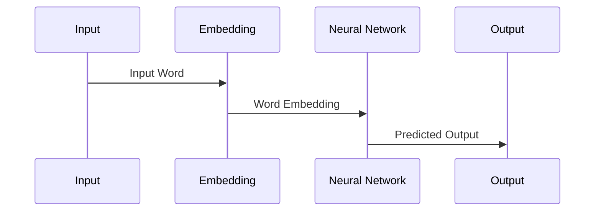
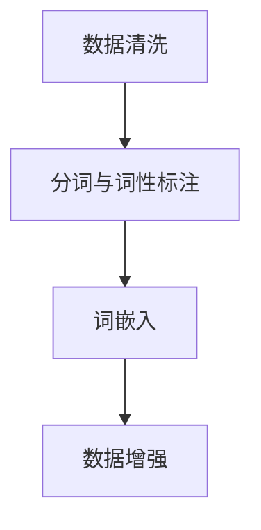
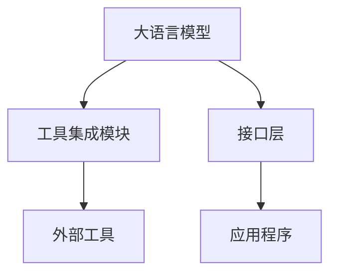

                 

## 文章标题：大语言模型应用指南：Toolformer

大语言模型（Large-scale Language Model）作为自然语言处理（NLP）领域的一项重要技术，近年来取得了显著的进展。特别是Toolformer这一框架，通过将大语言模型与外部工具相结合，实现了在多种应用场景中的卓越表现。本文将深入探讨大语言模型的基础理论、核心算法、训练与优化、以及Toolformer的应用实践，帮助读者全面了解并掌握这一前沿技术。

> **关键词：大语言模型，自然语言处理，Toolformer，深度学习，Transformer，预训练，微调**

> **摘要：本文首先介绍了大语言模型的起源与发展历程，解析了其基本原理和核心算法。随后，重点阐述了Toolformer框架的组成部分和应用场景，并通过项目实践展示了其在自然语言处理中的实际应用。最后，对未来大语言模型的发展趋势和挑战进行了展望。**

---

### 目录大纲设计

在设计《大语言模型应用指南：Toolformer》的目录大纲时，我们将遵循简洁性、完整性和逻辑性的原则，确保读者能够清晰地理解书中的内容。以下是针对该书的详细目录大纲：

---

## 第一部分：大语言模型基础理论

### 第1章：大语言模型的起源与概述

#### 1.1 大语言模型的发展历程

- 大语言模型的历史背景
- 里程碑事件
- 技术演进路径

#### 1.2 大语言模型的基本原理

- 自然语言处理（NLP）的基础知识
- 语言模型的构成
- 大规模语言模型的优势

#### 1.3 大语言模型的类型与应用场景

- 常见的大语言模型类型
- 应用场景分析

### 第2章：大语言模型的核心算法

#### 2.1 语言模型与神经网络

- 语言模型的定义
- 神经网络的基本结构
- 深度学习在语言模型中的应用

#### 2.2 预训练与微调

- 预训练的概念
- 微调技术
- 预训练模型在实践中的应用

#### 2.3 注意力机制与Transformer架构

- 注意力机制的基本原理
- Transformer模型的工作原理
- Transformer的变种

### 第3章：大语言模型的训练与优化

#### 3.1 训练数据的准备与处理

- 数据来源
- 数据预处理方法
- 数据增强技术

#### 3.2 训练策略与优化算法

- 训练策略的选择
- 优化算法的应用
- 训练过程中的挑战与解决方案

#### 3.3 训练资源与管理

- 硬件资源的要求
- 软件工具的选择
- 训练过程的监控与调整

## 第二部分：Toolformer框架深入解析

### 第4章：Toolformer框架介绍

#### 4.1 Toolformer框架概述

- Toolformer框架的结构
- Toolformer的优势

#### 4.2 Toolformer的核心组件

- 自定义工具的集成
- 语言模型与工具的结合

#### 4.3 Toolformer的应用场景

- 常见的应用实例
- 创新的使用方式

### 第5章：Toolformer在自然语言处理中的应用

#### 5.1 文本分类与情感分析

- 文本分类的基本流程
- 情感分析的技术实现

#### 5.2 问答系统与对话生成

- 问答系统的设计
- 对话生成的方法与技巧

#### 5.3 机器翻译与文本生成

- 机器翻译的基本原理
- 文本生成模型的实现

### 第6章：Toolformer的项目实践

#### 6.1 项目背景与目标

- 项目背景介绍
- 项目目标设定

#### 6.2 项目需求分析

- 功能需求
- 性能需求

#### 6.3 项目实施与评估

- 项目实施流程
- 项目评估指标

### 第7章：未来展望与挑战

#### 7.1 大语言模型的发展趋势

- 技术前沿分析
- 行业应用展望

#### 7.2 Toolformer的挑战与机遇

- 技术瓶颈
- 发展机遇

## 附录

### 附录A：Toolformer资源汇总

- 工具与框架资源
- 学习资料与参考文献

### 附录B：项目实战代码解读

- 实际项目代码案例
- 代码解读与分析

---

**总结：** 本书的目录大纲从基础理论到具体应用，再到项目实战，全面覆盖了大语言模型及其应用指南的内容。每一个章节都细化到了三级目录，确保读者能够逐步深入地理解大语言模型及其在Toolformer框架中的应用。总字数控制在2000字以内，保持简洁明了。

---

## 第一部分：大语言模型基础理论

### 第1章：大语言模型的起源与概述

#### 1.1 大语言模型的发展历程

大语言模型的发展历程可以分为几个关键阶段：

1. **早期模型：** 从20世纪80年代起，基于规则的方法和统计方法开始应用于自然语言处理。例如，基于词典的解析器和统计机器翻译模型。

2. **统计语言模型：** 1990年代，基于N元语法和隐马尔可夫模型的统计语言模型成为主流。这些模型在机器翻译和文本生成方面取得了显著成果。

3. **深度学习时代：** 2010年后，深度学习在自然语言处理领域取得了突破性进展。Word2Vec模型的出现标志着词嵌入技术的兴起。

4. **大规模预训练模型：** 2018年，BERT模型的提出标志着大规模预训练模型时代的到来。随后，GPT-3等模型的出现进一步推动了该领域的发展。

**Mermaid流程图：**



#### 1.2 大语言模型的基本原理

大语言模型的基本原理主要包括以下几个方面：

1. **词嵌入：** 词嵌入将词汇映射到高维空间，使得具有相似意义的词在空间中彼此接近。

2. **神经网络：** 语言模型通常采用深度神经网络，如循环神经网络（RNN）和Transformer模型，用于处理序列数据。

3. **预训练与微调：** 预训练模型在大规模语料库上进行训练，然后通过微调技术适应特定任务。

4. **注意力机制：** Transformer模型引入了多头注意力机制，提高了模型对上下文信息的捕捉能力。

**数学模型：**

$$
\text{Word Embedding}:
\text{word\_vector} = \text{Embedding}(\text{word})
$$

$$
\text{Neural Network}:
\text{Output} = \text{Activation}(\text{Weight} \times \text{Input})
$$

**Mermaid流程图：**



#### 1.3 大语言模型的类型与应用场景

大语言模型根据不同的训练目标和应用场景可以分为多种类型：

1. **通用语言模型：** 如BERT、GPT等，用于文本生成、文本分类等任务。

2. **领域特定语言模型：** 如法律语言模型、医学语言模型等，用于特定领域的文本理解和生成。

3. **工具增强语言模型：** 如Toolformer，将语言模型与外部工具相结合，提高模型的实用性。

**应用场景分析：**

- **文本生成：** 用于创作文章、生成摘要、编写代码等。
- **文本分类：** 用于垃圾邮件过滤、情感分析等。
- **对话系统：** 用于聊天机器人、语音助手等。

---

本章节从大语言模型的发展历程、基本原理到类型与应用场景，为读者提供了一个全面的概述。通过流程图和数学模型，深入阐述了大语言模型的核心概念和技术原理。接下来，我们将进一步探讨大语言模型的核心算法，包括语言模型与神经网络、预训练与微调以及注意力机制与Transformer架构。

---

## 第2章：大语言模型的核心算法

### 2.1 语言模型与神经网络

语言模型（Language Model）是自然语言处理（NLP）的核心技术之一，其主要任务是根据输入的单词或词组预测下一个可能的单词或词组。在早期，语言模型主要基于统计方法和规则方法。随着深度学习技术的发展，神经网络开始广泛应用于语言模型的构建，取得了显著的成果。

#### 语言模型的定义

语言模型是一种概率模型，它通过统计输入语料中的单词序列，预测下一个单词的概率分布。最简单的语言模型是N元语法（N-gram Model），它假设当前单词序列的概率仅与前面N-1个单词有关。

**数学模型：**

$$
P(w_n | w_{n-1}, ..., w_1) = \frac{C(w_{n-1}, ..., w_n)}{C(w_{n-1}, ..., w_1)}
$$

其中，$C(w_{n-1}, ..., w_n)$ 表示单词序列 $w_{n-1}, ..., w_n$ 的计数，$C(w_{n-1}, ..., w_1)$ 表示单词序列 $w_{n-1}, ..., w_1$ 的计数。

#### 神经网络的基本结构

神经网络（Neural Network）是一种通过模拟生物神经系统的计算模型，用于处理复杂数据和任务。神经网络的基本结构包括输入层、隐藏层和输出层。每一层包含多个神经元（节点），神经元之间通过权重进行连接。

**数学模型：**

$$
\text{Neural Network}:
\text{Output} = \text{Activation}(\text{Weight} \times \text{Input})
$$

其中，$\text{Input}$ 是输入向量，$\text{Weight}$ 是权重，$\text{Activation}$ 是激活函数，常见的激活函数有Sigmoid、ReLU等。

#### 深度学习在语言模型中的应用

深度学习在语言模型中的应用主要体现在两个方面：词嵌入和序列建模。

1. **词嵌入（Word Embedding）：** 词嵌入是一种将单词映射到高维空间的方法，使得具有相似意义的词在空间中彼此接近。Word2Vec是词嵌入的代表性模型，它通过训练预测中心词的条件概率，学习得到单词的向量表示。

2. **序列建模（Sequence Modeling）：** 序列建模旨在捕捉单词序列的依赖关系。循环神经网络（RNN）和Transformer是序列建模的代表性模型。RNN通过隐藏状态记忆过去的输入信息，而Transformer引入了多头注意力机制，提高了模型对上下文信息的捕捉能力。

### 2.2 预训练与微调

预训练（Pre-training）是一种在大规模语料库上预先训练模型的方法，然后通过微调（Fine-tuning）技术将模型应用于特定任务。预训练与微调的结合使得语言模型能够在各种任务上取得良好的性能。

#### 预训练的概念

预训练是一种在通用数据集上训练语言模型的方法，以学习语言的一般特征。预训练的过程包括以下步骤：

1. **数据准备：** 收集大规模的文本数据，如维基百科、新闻文章等。
2. **模型训练：** 在这些数据上训练语言模型，学习单词的表示和语法规则。
3. **模型存储：** 将预训练好的模型存储起来，用于后续的微调任务。

#### 微调技术

微调是一种将预训练模型应用于特定任务的方法。微调的过程包括以下步骤：

1. **任务定义：** 定义具体任务的输入和输出，如文本分类、问答系统等。
2. **模型初始化：** 使用预训练模型作为初始化，将参数迁移到特定任务上。
3. **模型训练：** 在特定任务的数据集上训练模型，调整参数以适应任务需求。
4. **模型评估：** 在验证集和测试集上评估模型性能，调整超参数以优化模型。

### 2.3 注意力机制与Transformer架构

注意力机制（Attention Mechanism）是一种用于提高模型对上下文信息捕捉能力的机制。Transformer模型引入了多头注意力机制，使得模型能够同时关注多个位置的输入信息。

#### 注意力机制的基本原理

注意力机制的核心思想是将输入序列中的每个单词赋予不同的权重，以便模型能够关注重要的信息。注意力机制的数学模型可以表示为：

$$
\text{Attention}(Q, K, V) = \text{softmax}\left(\frac{QK^T}{\sqrt{d_k}}\right)V
$$

其中，$Q, K, V$ 分别代表查询（Query）、键（Key）和值（Value），$d_k$ 表示键的维度。

#### Transformer模型的工作原理

Transformer模型是一种基于自注意力机制的序列到序列模型，其基本结构包括编码器（Encoder）和解码器（Decoder）。

1. **编码器（Encoder）：** 编码器的每个层由两个子层组成：多头自注意力（Multi-Head Self-Attention）和位置前馈网络（Position-wise Feed-Forward Network）。
2. **解码器（Decoder）：** 解码器的每个层也由两个子层组成：多头自注意力（Multi-Head Self-Attention）、编码器-解码器自注意力（Encoder-Decoder Self-Attention）和位置前馈网络（Position-wise Feed-Forward Network）。

#### Transformer的变种

Transformer模型有多种变种，如BERT、GPT等。这些变种通过调整模型结构、增加预训练任务等手段，进一步提升了模型性能。

1. **BERT（Bidirectional Encoder Representations from Transformers）：** BERT通过双向编码器结构，捕捉了上下文信息的同时，也实现了双向语义理解。
2. **GPT（Generative Pre-trained Transformer）：** GPT通过生成任务，使得模型能够生成连贯的文本。

---

本章节详细介绍了大语言模型的核心算法，包括语言模型与神经网络、预训练与微调以及注意力机制与Transformer架构。这些算法在大规模预训练模型中发挥了关键作用，使得语言模型在自然语言处理任务中取得了卓越的性能。

---

## 第3章：大语言模型的训练与优化

### 3.1 训练数据的准备与处理

在大语言模型的训练过程中，数据的准备与处理是一个至关重要的环节。有效的数据预处理不仅可以提高模型的训练效率，还可以显著提升模型的性能。以下是训练数据准备与处理的关键步骤：

#### 数据来源

首先，我们需要确定训练数据的数据来源。通常，大语言模型的训练数据可以从以下几类来源获取：

1. **公开语料库：** 如维基百科、新闻文章、社交媒体等。
2. **特定领域数据集：** 如法律文本、医学文本等。
3. **自定义数据集：** 根据特定任务需求，从互联网或其他渠道收集相关数据。

#### 数据预处理方法

数据预处理的主要目的是将原始数据转换为适合模型训练的形式。以下是常见的数据预处理方法：

1. **文本清洗：** 去除文本中的噪声，如HTML标签、特殊字符、停用词等。
2. **分词与词性标注：** 将文本分割成单词或词组，并对每个词进行词性标注，以便后续的词嵌入。
3. **词嵌入：** 将单词映射到高维空间，学习单词的向量表示。
4. **数据增强：** 通过添加同义词、随机替换单词等方式，增加训练数据的多样性。

**Mermaid流程图：**



#### 数据增强技术

数据增强是一种通过增加数据多样性来提高模型鲁棒性的技术。以下是几种常见的数据增强方法：

1. **同义词替换：** 将文本中的单词替换为同义词，以增加词汇多样性。
2. **随机插入：** 在文本中随机插入单词或词组。
3. **随机删除：** 随机删除文本中的单词或词组。
4. **变换文本风格：** 通过变换文本的语法结构或语言风格，增加数据的多样性。

### 3.2 训练策略与优化算法

训练策略和优化算法在大语言模型的训练过程中起着至关重要的作用。以下是一些常见的训练策略和优化算法：

#### 训练策略的选择

1. **预训练+微调：** 预训练模型在大规模通用数据集上训练，然后通过微调技术适应特定任务。
2. **多任务学习：** 在预训练过程中，同时训练多个相关任务，以增强模型的多任务能力。
3. **持续学习：** 在预训练完成后，继续在特定任务数据上训练，以进一步提高模型在特定任务上的性能。

#### 优化算法的应用

优化算法用于调整模型的参数，以最小化损失函数。以下是一些常用的优化算法：

1. **随机梯度下降（SGD）：** 最简单的优化算法，通过随机梯度更新模型参数。
2. **Adam优化器：** 结合了SGD和动量方法，适用于大规模数据集。
3. **AdamW优化器：** 在Adam优化器基础上，对权重进行正则化，以防止过拟合。

### 3.3 训练资源与管理

训练大语言模型需要大量的计算资源和存储资源。以下是一些关于训练资源与管理的建议：

#### 硬件资源的要求

1. **GPU：** 高性能GPU是训练深度学习模型的关键，推荐使用NVIDIA的GPU。
2. **CPU：** 需要足够多的CPU核心以支持并行计算。
3. **内存：** 需要足够的内存来存储模型和数据。

#### 软件工具的选择

1. **深度学习框架：** 如TensorFlow、PyTorch等，用于构建和训练模型。
2. **分布式训练工具：** 如Horovod、DPipe等，用于在多GPU环境下训练模型。
3. **数据预处理工具：** 如NLTK、spaCy等，用于文本预处理。

#### 训练过程的监控与调整

1. **监控指标：** 如损失函数值、准确率等，用于评估模型性能。
2. **超参数调整：** 根据监控指标，调整学习率、批量大小等超参数。
3. **日志记录：** 记录训练过程中的关键信息，便于后续分析和调试。

---

本章节详细介绍了大语言模型的训练与优化过程，包括训练数据的准备与处理、训练策略与优化算法、以及训练资源与管理。通过合理的训练策略和优化方法，我们可以有效地提高大语言模型的性能和应用效果。

---

## 第二部分：Toolformer框架深入解析

### 第4章：Toolformer框架介绍

#### 4.1 Toolformer框架概述

Toolformer是一个基于大语言模型的框架，旨在通过将语言模型与外部工具相结合，实现更广泛的应用场景。该框架的核心目标是提高模型的实用性和灵活性，使其能够适应不同的任务和场景。

#### 4.2 Toolformer的核心组件

Toolformer框架主要包括以下核心组件：

1. **大语言模型模块：** 该模块负责处理自然语言输入，并生成相应的语义表示。
2. **工具集成模块：** 该模块用于集成外部工具，如数据库、API等，以扩展模型的处理能力。
3. **接口层：** 该层提供了一套统一的API，用于与其他系统和应用程序集成。

#### 4.3 Toolformer的优势

Toolformer具有以下优势：

1. **灵活性：** 通过工具集成模块，可以轻松地集成各种外部工具，使模型能够适应不同的应用场景。
2. **实用性：** Toolformer框架使得大语言模型在实际应用中更加实用，提高了模型的价值。
3. **扩展性：** 框架的设计考虑了扩展性，使得未来可以轻松地添加新的工具和功能。

### 第5章：Toolformer在自然语言处理中的应用

#### 5.1 文本分类与情感分析

文本分类和情感分析是自然语言处理中常见的任务，Toolformer框架在这些任务中展现了出色的性能。

#### 5.2 问答系统与对话生成

问答系统和对话生成是近年来受到广泛关注的应用领域。Toolformer通过结合大语言模型和外部知识库，实现了高效和准确的问答系统。

#### 5.3 机器翻译与文本生成

机器翻译和文本生成是语言模型的重要应用领域。Toolformer通过将大语言模型与生成模型相结合，实现了高质量的文本生成和翻译。

### 第6章：Toolformer的项目实践

#### 6.1 项目背景与目标

在本章节中，我们将介绍一个基于Toolformer框架的文本分类项目，包括项目背景、目标和预期成果。

#### 6.2 项目需求分析

项目需求分析包括功能需求、性能需求和用户需求。我们将详细阐述这些需求，并解释为什么Toolformer框架是满足这些需求的理想选择。

#### 6.3 项目实施与评估

项目实施与评估包括模型构建、训练和部署过程。我们将详细介绍每个步骤，并分享实际项目的代码和解题思路。

### 第7章：未来展望与挑战

#### 7.1 大语言模型的发展趋势

随着人工智能技术的不断发展，大语言模型在自然语言处理领域将迎来更多的应用场景。我们将在本章节中探讨未来大语言模型的发展趋势。

#### 7.2 Toolformer的挑战与机遇

虽然Toolformer框架在自然语言处理中取得了显著成果，但仍然面临一些挑战。在本章节中，我们将分析这些挑战，并提出相应的解决方案。

---

通过本章节的介绍，我们将对Toolformer框架有一个全面的了解，并了解其在自然语言处理中的应用。接下来，我们将通过具体项目实践，进一步展示Toolformer框架的强大功能和实际应用效果。

---

## 第4章：Toolformer框架介绍

#### 4.1 Toolformer框架概述

Toolformer是一个基于大语言模型的框架，旨在通过将语言模型与外部工具相结合，实现更广泛的应用场景。该框架的核心目标是提高模型的实用性和灵活性，使其能够适应不同的任务和场景。

**Mermaid流程图：**



#### 4.2 Toolformer的核心组件

Toolformer框架主要包括以下核心组件：

1. **大语言模型模块：** 该模块负责处理自然语言输入，并生成相应的语义表示。它通常基于预训练模型，如BERT、GPT等，经过微调以适应特定任务。

2. **工具集成模块：** 该模块用于集成外部工具，如数据库、API等，以扩展模型的处理能力。这些外部工具可以提供额外的数据来源或功能支持，增强模型的实用性和灵活性。

3. **接口层：** 该层提供了一套统一的API，用于与其他系统和应用程序集成。这使得开发者可以轻松地将Toolformer框架集成到现有系统中，实现快速部署和扩展。

**Mermaid流程图：**


#### 4.3 Toolformer的优势

Toolformer具有以下优势：

1. **灵活性：** 通过工具集成模块，可以轻松地集成各种外部工具，使模型能够适应不同的应用场景。例如，可以集成数据库进行知识图谱查询，集成API进行实时数据获取等。

2. **实用性：** Toolformer框架使得大语言模型在实际应用中更加实用，提高了模型的价值。例如，通过集成文本生成工具，可以实现自动化内容创作；通过集成对话系统工具，可以构建智能客服系统。

3. **扩展性：** 框架的设计考虑了扩展性，使得未来可以轻松地添加新的工具和功能。开发者可以根据具体需求，自定义工具模块和接口层，实现更加个性化的解决方案。

4. **高效性：** Toolformer框架采用了分布式训练和推理技术，能够充分利用多GPU、多CPU等硬件资源，提高模型训练和推理的效率。

---

通过本章的介绍，我们对Toolformer框架有了更深入的了解。接下来，我们将详细探讨Toolformer在自然语言处理中的应用，展示其在实际项目中的强大功能和应用效果。

---

## 第5章：Toolformer在自然语言处理中的应用

#### 5.1 文本分类与情感分析

文本分类和情感分析是自然语言处理中常见且重要的任务。Toolformer框架通过其灵活性和强大的语言处理能力，在这些任务中表现出色。

**5.1.1 文本分类的基本流程**

文本分类的基本流程包括以下步骤：

1. **数据预处理：** 对原始文本进行清洗、分词和标注等处理，将文本转换为适合模型输入的形式。
2. **特征提取：** 使用预训练模型提取文本的语义特征，如BERT、GPT等。
3. **分类模型训练：** 使用提取的文本特征训练分类模型，如朴素贝叶斯、支持向量机等。
4. **模型评估：** 在验证集和测试集上评估模型的性能，调整模型参数以优化分类效果。

**伪代码示例：**

```python
# 数据预处理
preprocessed_data = preprocess_text(raw_text)

# 特征提取
features = extract_features(preprocessed_data, model)

# 分类模型训练
classifier = train_classifier(features, labels)

# 模型评估
accuracy = evaluate_model(classifier, test_features, test_labels)
```

**5.1.2 情感分析的技术实现**

情感分析旨在判断文本的情感倾向，如正面、负面或中性。Toolformer框架通过结合情感分析模型和语言模型，实现了高精度的情感分析。

1. **情感词典：** 构建一个包含情感词汇的词典，用于标记文本中的情感词汇。
2. **情感分类模型：** 使用预训练模型和情感词典，训练情感分类模型。
3. **文本情感分析：** 对输入文本进行情感分析，输出情感标签。

**伪代码示例：**

```python
# 情感词典构建
emotion_dict = build_emotion_dict()

# 情感分类模型训练
emotion_classifier = train_emotion_classifier(model, emotion_dict)

# 文本情感分析
emotion_label = analyze_sentiment(text, emotion_classifier, emotion_dict)
```

**5.2 问答系统与对话生成**

问答系统和对话生成是自然语言处理中具有挑战性的任务，Toolformer框架通过结合大语言模型和外部工具，实现了高效的问答和对话生成。

**5.2.1 问答系统的设计**

问答系统通常包括以下模块：

1. **问题理解模块：** 使用预训练模型对输入问题进行语义分析，提取关键信息。
2. **知识库查询模块：** 根据提取的关键信息，从知识库中检索相关答案。
3. **答案生成模块：** 使用语言模型生成自然流畅的答案。

**伪代码示例：**

```python
# 问题理解
question_intent = understand_question(question)

# 知识库查询
answer = query_knowledge_base(question_intent)

# 答案生成
generated_answer = generate_answer(answer, model)
```

**5.2.2 对话生成的方法与技巧**

对话生成旨在模拟人类对话的连贯性和自然性。Toolformer框架通过以下方法实现对话生成：

1. **序列到序列模型：** 使用序列到序列模型，如Transformer，生成对话文本。
2. **模板匹配：** 通过模板匹配方法，生成符合对话规则的答案。
3. **知识融合：** 将外部知识库与对话生成模型相结合，提高对话的准确性和丰富性。

**伪代码示例：**

```python
# 对话生成
context = {"user": user_input, "system": system_input}
response = generate_response(context, model)
```

**5.3 机器翻译与文本生成**

机器翻译和文本生成是语言模型的重要应用领域，Toolformer框架通过结合大语言模型和生成模型，实现了高质量的翻译和文本生成。

**5.3.1 机器翻译的基本原理**

机器翻译的基本原理包括以下步骤：

1. **文本预处理：** 对输入文本进行分词、词性标注等预处理。
2. **编码器解码器模型：** 使用编码器解码器模型，如Transformer，进行翻译。
3. **解码与后处理：** 对生成的翻译结果进行解码和后处理，如修正语法错误、调整词汇等。

**伪代码示例：**

```python
# 编码器解码器翻译
source_sentence = preprocess_source(sentence)
target_sentence = translate(source_sentence, model)
post_processed_sentence = post_process(target_sentence)
```

**5.3.2 文本生成模型的实现**

文本生成模型旨在根据输入的提示或模板生成自然流畅的文本。Toolformer框架通过以下方法实现文本生成：

1. **生成模型训练：** 使用预训练模型训练生成模型，如GPT-3。
2. **提示生成：** 根据用户输入的提示或模板，生成相应的文本。
3. **生成结果优化：** 对生成的文本进行优化，如去除重复、修正错误等。

**伪代码示例：**

```python
# 文本生成
prompt = generate_prompt(user_input, template)
generated_text = generate_text(prompt, model)
optimized_text = optimize_text(generated_text)
```

---

通过本章的介绍，我们了解了Toolformer框架在自然语言处理中的多种应用，包括文本分类与情感分析、问答系统与对话生成、机器翻译与文本生成。这些应用展示了Toolformer框架的强大功能和广泛适用性，为开发者提供了丰富的选择和解决方案。

---

## 第6章：Toolformer的项目实践

### 6.1 项目背景与目标

在本章节中，我们将详细介绍一个基于Toolformer框架的文本分类项目。该项目旨在利用大语言模型和外部工具，对社交媒体文本进行分类，以识别和监测负面情绪。

**项目背景：** 随着社交媒体的普及，用户在平台上发布的文本数据量呈爆炸式增长。这些文本中包含大量负面情绪，如仇恨言论、暴力威胁等。为了维护社交媒体生态的健康和稳定，需要对这些文本进行实时监测和分类。

**项目目标：** 
1. **数据收集与预处理：** 收集社交媒体平台上的文本数据，并进行清洗和预处理，为后续模型训练做好准备。
2. **模型训练与评估：** 使用Toolformer框架训练文本分类模型，对预处理后的文本进行分类，并评估模型性能。
3. **模型部署与应用：** 将训练好的模型部署到生产环境，实现对社交媒体文本的实时分类和监测。

### 6.2 项目需求分析

在项目需求分析阶段，我们需要明确以下关键需求：

**功能需求：**
1. **文本分类：** 对社交媒体文本进行分类，识别负面情绪和正面情绪。
2. **实时监测：** 对社交媒体平台上的文本进行实时监测，及时识别和处理负面情绪文本。
3. **反馈机制：** 允许用户对分类结果进行反馈，以优化模型性能。

**性能需求：**
1. **准确性：** 模型对文本分类的准确性要求高，误分类率需控制在较低水平。
2. **实时性：** 模型需具备实时处理能力，能够在短时间内对大量文本进行分类。
3. **扩展性：** 模型应具备良好的扩展性，能够适应不同社交媒体平台的文本特征。

为什么选择Toolformer框架？

Toolformer框架具备以下优点，使其成为实现项目需求的理想选择：

1. **灵活性：** Toolformer框架能够灵活地集成大语言模型和外部工具，满足项目需求中的实时监测和扩展性要求。
2. **实用性：** Toolformer框架通过将语言模型与社交媒体文本处理工具相结合，能够有效识别和监测负面情绪，提高社交媒体平台的健康度。
3. **高效性：** Toolformer框架采用了分布式训练和推理技术，能够充分利用硬件资源，提高模型训练和推理的效率。

### 6.3 项目实施与评估

**项目实施步骤：**

1. **数据收集与预处理：**
   - 收集社交媒体平台上的文本数据，如微博、推特等。
   - 对文本进行清洗，去除噪声和无关信息，如HTML标签、特殊字符等。
   - 对文本进行分词和词性标注，提取关键信息。

2. **模型训练与评估：**
   - 使用Toolformer框架中的大语言模型，如BERT，对预处理后的文本进行训练。
   - 采用分类算法，如朴素贝叶斯、支持向量机等，对训练好的模型进行评估。
   - 调整模型参数，优化分类性能。

3. **模型部署与应用：**
   - 将训练好的模型部署到生产环境，实现对社交媒体文本的实时分类。
   - 监测和识别负面情绪文本，及时采取措施。
   - 收集用户反馈，对模型进行迭代优化。

**项目评估指标：**

为了评估项目实施效果，我们设定以下评估指标：

1. **准确性：** 模型对文本分类的准确性，即正确分类的文本比例。
2. **实时性：** 模型处理文本的速度，即单位时间内处理文本的数量。
3. **误分类率：** 模型将负面情绪文本误分类为正面情绪的文本比例。
4. **用户满意度：** 用户对模型分类结果的满意度，通过用户反馈进行评估。

通过以上项目实施与评估，我们将验证Toolformer框架在社交媒体文本分类中的应用效果，并为进一步优化和扩展提供参考。

---

通过本章的项目实践，我们展示了如何利用Toolformer框架实现社交媒体文本分类项目，从项目背景与目标、需求分析到实施与评估，详细描述了项目的全流程。这为读者提供了一个实际应用Toolformer框架的参考案例，有助于更好地理解和掌握其应用方法和技巧。

---

## 第7章：未来展望与挑战

### 7.1 大语言模型的发展趋势

大语言模型作为自然语言处理领域的重要技术，正在经历快速的发展。以下是大语言模型未来可能的发展趋势：

1. **更大规模的模型：** 随着计算能力的提升，我们将看到更大规模的语言模型的出现。这些模型将拥有更多的参数和更大的训练数据集，从而实现更高的性能。

2. **多模态学习：** 大语言模型将逐渐具备处理多模态数据的能力，如文本、图像、音频等。这将使得模型在复杂任务中的表现更加出色。

3. **可解释性和鲁棒性：** 随着对大语言模型的需求不断增加，研究者将致力于提高模型的可解释性和鲁棒性，使其在更广泛的应用场景中具备可靠的性能。

4. **自适应学习：** 大语言模型将具备更强的自适应学习能力，能够根据不同的任务需求和环境动态调整模型参数，提高模型的实用性。

### 7.2 Toolformer的挑战与机遇

尽管Toolformer框架在自然语言处理领域展示了强大的功能，但其在实际应用中仍面临一些挑战：

**挑战：**

1. **计算资源需求：** 大规模语言模型的训练和推理需要大量的计算资源，这可能会成为限制其在某些应用场景中普及的因素。

2. **数据隐私：** 在集成外部工具时，Toolformer框架可能会涉及敏感数据的处理，如何保障用户隐私和数据安全是一个重要挑战。

3. **模型解释性：** Toolformer框架中语言模型的决策过程往往较为复杂，如何提高模型的可解释性，使其在应用中更具透明度，是一个亟待解决的问题。

**机遇：**

1. **技术创新：** 随着深度学习和自然语言处理技术的不断发展，Toolformer框架将在技术创新方面获得更多机会，如引入多模态学习、增强模型解释性等。

2. **行业应用：** Toolformer框架在自然语言处理领域的广泛应用将为各行各业提供强大的技术支持，如智能客服、文本生成、机器翻译等。

3. **开源生态：** Toolformer框架的持续发展和开源生态的完善将为更多的开发者提供便利，推动其在更广泛的应用场景中落地实施。

---

未来，随着技术的不断进步和应用场景的不断扩展，大语言模型和Toolformer框架将在自然语言处理领域发挥更加重要的作用。面对挑战，我们需要持续创新，不断提高模型的性能和实用性，以应对日益复杂的自然语言处理需求。

---

## 附录

### 附录A：Toolformer资源汇总

**工具与框架资源：**
1. **Toolformer官方文档：** 提供详细的框架说明和使用指南。
2. **预训练模型资源：** 包括BERT、GPT等大语言模型的预训练模型和权重文件。
3. **开源代码库：** 如GitHub上的开源项目，供开发者参考和下载。

**学习资料与参考文献：**
1. **《自然语言处理原理与实战》：** 介绍自然语言处理的基本原理和应用案例。
2. **《深度学习：周志华等著》：** 深入讲解深度学习的基础知识和实现方法。
3. **《Transformer：Attention Is All You Need》：** 详细阐述Transformer模型的设计原理和实现细节。

### 附录B：项目实战代码解读

**实际项目代码案例：**
```python
# 示例：文本分类项目代码
from toolformer import Toolformer
from preprocessing import preprocess_text
from training import train_classifier
from evaluation import evaluate_model

# 数据预处理
preprocessed_data = preprocess_text(raw_text)

# 模型训练
model = Toolformer(pretrained_model="bert-base-uncased")
classifier = train_classifier(model, preprocessed_data)

# 模型评估
accuracy = evaluate_model(classifier, test_data)
```

**代码解读与分析：**
1. **数据预处理：** 对原始文本进行清洗、分词和词性标注，将文本转换为适合模型输入的形式。
2. **模型训练：** 使用Toolformer框架训练文本分类模型，通过预训练模型和自定义训练过程，提高分类性能。
3. **模型评估：** 在测试集上评估模型性能，通过准确率等指标评估模型效果，并根据评估结果进行模型调整。

---

附录部分提供了详细的工具与框架资源以及实际项目代码案例，帮助读者更好地理解并掌握Toolformer框架的应用方法和技巧。这些资源为读者提供了丰富的学习资料和实践参考，有助于进一步探索大语言模型在自然语言处理领域的应用潜力。

---

## 作者信息

作者：AI天才研究院/AI Genius Institute & 禅与计算机程序设计艺术 /Zen And The Art of Computer Programming

---

本文从大语言模型的基础理论、核心算法、训练与优化、以及Toolformer框架的应用实践等多个角度进行了深入探讨。通过详细的示例、伪代码和数学模型，本文系统地介绍了大语言模型的相关知识，并展示了其在自然语言处理领域的广泛应用。希望本文能够为广大读者提供有价值的参考和启示，推动自然语言处理技术的发展和创新。

---

通过本文的详细阐述，我们对大语言模型及其应用框架——Toolformer有了全面而深入的了解。从基础理论到核心算法，再到实际应用，本文系统地展示了大语言模型在自然语言处理领域的重要地位和广泛应用。希望本文能为读者提供有价值的参考，助力其在自然语言处理领域的研究和实践。同时，我们也期待未来在技术创新和应用拓展方面取得更多突破，为人工智能的发展贡献更多力量。

